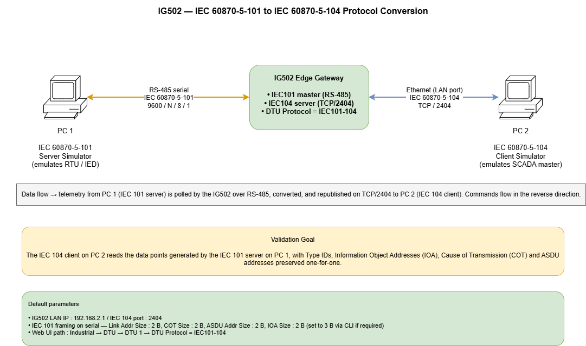
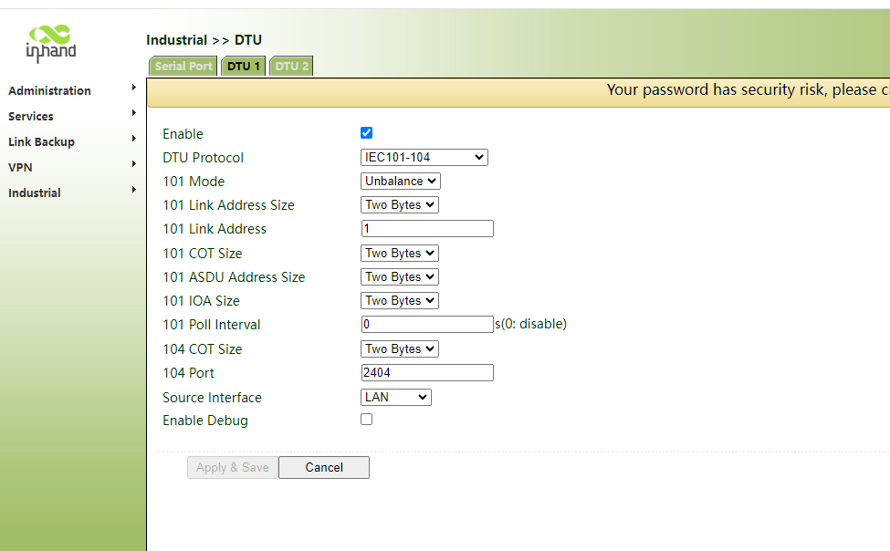
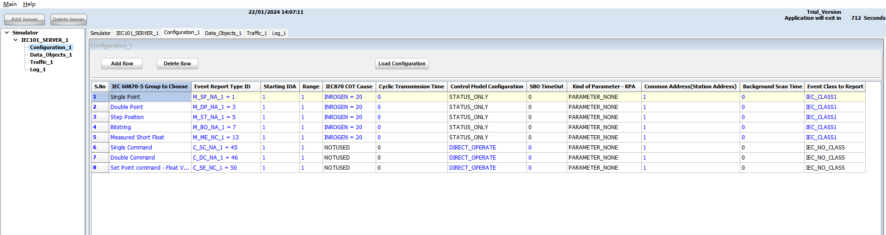
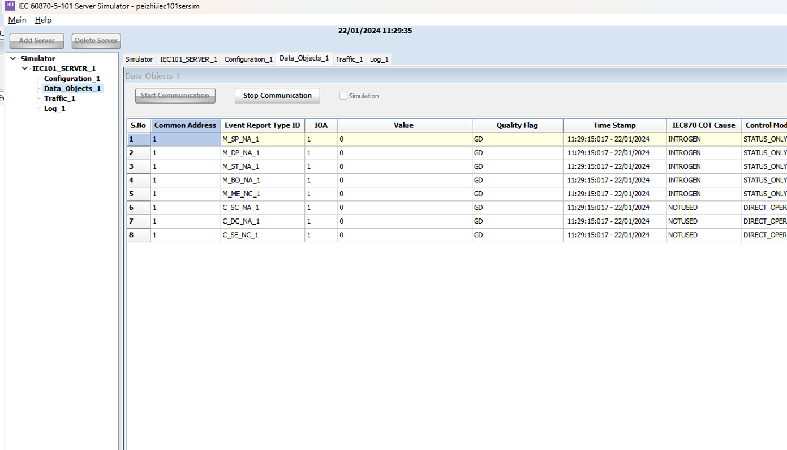
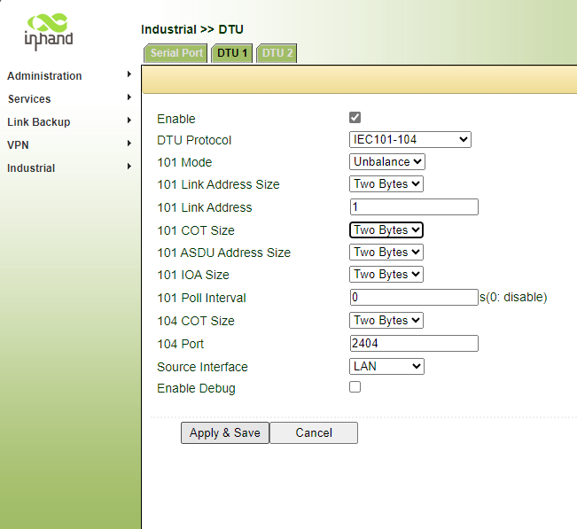
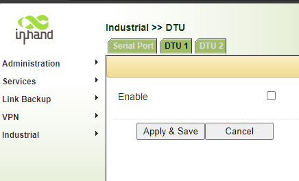

# IG502 — IEC 60870-5-101 to IEC 60870-5-104 Conversion Configuration Guide

**Product Model:** IG502 (InGateway 502)
---

## 1. Document Information

| Item | Value |
|------|-------|
| Product | InHand IG502 Edge Gateway |
| Application | IEC 60870-5-101 (serial) ↔ IEC 60870-5-104 (TCP/IP) protocol conversion |
| Typical use cases | Smart grid, distribution automation, substation retrofit, renewable plants, water / gas SCADA |

---

## 2. Reference Network

The reference setup used throughout this manual:

- **PC 1** — runs an IEC 60870-5-101 *server* simulator (acts as the field RTU/IED). Wired to the IG502's RS-485 port.
- **IG502** — the gateway. Acts as IEC 101 client on RS-485 and IEC 104 server on the LAN port.
- **PC 2** — runs an IEC 60870-5-104 *client* simulator (acts as the SCADA master). Wired to the IG502's LAN port.

**Test goal:** the IEC 104 client on PC 2 reads the data points generated by the IEC 101 server on PC 1, end-to-end through the IG502.



In production deployments, PC 1 is replaced by the real RTU/IED on RS-485, and PC 2 is replaced by the real SCADA front-end on Ethernet or cellular.

---

## 3. Hardware Overview

### 3.1 IG502 at a Glance

- Power input: DC 9–36 V, reverse-polarity protected
- Ethernet: 2× RJ45 (configurable WAN / LAN)
- Serial: RS-232 and / or RS-485 (model dependent)
- Wireless: 4G / 5G / Wi-Fi (model dependent)
- Indicators: Power, Status, Cellular, Signal, Wi-Fi
- Reset button: long-press for factory default
- Mounting: DIN rail / wall

### 3.2 Wiring for This Application

| Port | Connect to | Notes |
|------|-----------|-------|
| Power | DC 9–36 V supply | Observe polarity |
| RS-485 (A / B) | IEC 101 device's RS-485 (A / B) | Common ground; daisy-chain if multi-drop; 120 Ω termination at the bus ends |
| LAN / WAN (RJ45) | SCADA network switch / PC | LAN by default; can be re-roled to WAN |
| Cellular antenna (MAIN) | 4G / 5G antenna | If cellular backhaul is used |
| GND | Cabinet earth | Mandatory for substation / outdoor installation |

## 4. Factory Defaults

| Parameter | Default |
|-----------|---------|
| LAN IP | 192.168.2.1 |
| Subnet Mask | 255.255.255.0 |
| Web username | adm |
| Web password | 123456  *(later batches: random password — see device label)* |
| Telnet / SSH | Disabled by default |

## 5. Pre-Installation Checklist

1. Set the PC's NIC to the IG502's LAN subnet (e.g., 192.168.2.100 / 255.255.255.0).
2. Use an Ethernet cable to connect the PC to the IG502 LAN port.
3. Power the IG502; wait until the Status LED is steady.
4. Open a modern browser (Chrome / Edge / Firefox) and navigate to `http://192.168.2.1`.
5. Log in with `adm / 123456` (or the label password).

## 6. Network Configuration (recap)

The full LAN, WAN and cellular configuration procedures follow the standard IG502 user guide. Only the items relevant to the IEC conversion are highlighted below.

- **LAN IP:** keep on the same subnet as the SCADA front-end (PC 2 in this manual). Default 192.168.2.1 is used in the worked example.
- **Cellular (if used as uplink):** insert SIM with the device powered OFF; configure APN under *Network → Cellular*. Confirm signal LED is green (RSSI 21–30).
- **Firewall / port forwarding:** ensure inbound TCP **2404** is permitted from the SCADA master to the IG502.

For the basic web flow (LAN IP change, cellular dial-up, signal indicator), see the existing *Configuration Manual* in this folder.

## 7. IEC 101 ↔ IEC 104 Conversion — Step-by-Step

This is the core of the manual. The IG502 implements the conversion through its **DTU 1** module under **Industrial → DTU**.

### 7.1 Enable the DTU and Choose the IEC101-104 Protocol

1. Log in to the IG502 Web UI.
2. Navigate to **Industrial → DTU → DTU 1**.
3. Tick **Enable**.
4. Set **DTU Protocol** to `IEC101-104`.



### 7.2 Configure the IEC 101 (Serial) Side

These parameters MUST match the IEC 101 outstation (or simulator) on the serial bus.

| Field | Recommended / Default | Description |
|-------|-----------------------|-------------|
| 101 Mode | Unbalance | Use `Unbalance` for typical multi-drop RS-485 polled topologies; use `Balance` for point-to-point. Must match the device. |
| 101 Link Address Size | Two Bytes | Most field devices use 2 bytes; some legacy RTUs use 1 byte. Must match. |
| 101 Link Address | 1 | The slave's link address. Must match the device. |
| 101 COT Size | Two Bytes | Cause-of-transmission size. Typically 2 bytes for IEC 101. |
| 101 ASDU Address Size | Two Bytes | Common ASDU address (station address) length. |
| 101 IOA Size | Two Bytes | Information Object Address size. Web UI offers One/Two bytes. **If three bytes are required, see §7.6 below.** |
| 101 Poll Interval | 0 (disable) or 1–60 s | 0 means do not generate background polls; rely on spontaneous data. Set a value (e.g. 5–10 s) to actively poll. |

Serial line parameters (baud, parity, data bits, stop bits) are set under the **Serial Port** sub-tab (defaults: 9600, N, 8, 1) and must match the wired bus.

### 7.3 Configure the IEC 104 (TCP) Side

| Field | Recommended / Default | Description |
|-------|-----------------------|-------------|
| 104 COT Size | Two Bytes | Standard IEC 104. |
| 104 Port | 2404 | Standard IEC 104 listening port. |
| Source Interface | LAN | The interface on which the IG502 listens for IEC 104 clients. Use LAN, WAN or Cellular as appropriate. |
| Enable Debug | Off (production) / On (commissioning) | Enables verbose DTU logs accessible via the log page or SSH. |

### 7.4 Apply and Save

Click **Apply & Save** at the bottom of the page. The IG502 restarts the DTU module; no full reboot is required.

### 7.5 Verify with Simulators (recommended for commissioning)

**On PC 1 — IEC 101 server simulator:**


Set the framing sizes on the simulator to match the IG502 exactly (Link Address, COT, ASDU, IOA):


Add the data objects to publish — single point, double point, step position, bitstring, measured float, single / double command, set-point command:



**On PC 2 — IEC 104 client simulator:**

Point the client at the IG502 LAN IP on port 2404:


Confirm K/W timers and command timeout match your SCADA standard (defaults shown below work for most setups):


**Expected result:** every object configured on the IEC 101 side appears on the IEC 104 side with the correct Type ID, COT, value, quality flag (GD) and a fresh timestamp.



### 7.6 Optional — Set IEC 101 IOA Size to 3 Bytes (CLI override)

The Web UI lists One Byte / Two Bytes for IOA size. If a field device requires **3-byte IOA** on the IEC 101 side, the value must be set from the CLI by editing the DTU configuration file.

**Step 1.** Enable Telnet (or SSH) on the IG502.

Navigate to **System → Access Tools** and turn on Telnet (or SSH). Apply.


**Step 2.** Apply the configuration.



**Step 3.** Temporarily disable the DTU 1 instance.



**Step 4.** Open a Telnet session to the IG502 (`telnet 192.168.2.1`) and log in with `adm` and the standard password; the second prompt asks for the privileged password (default `inhand`).


**Step 5.** Edit the DTU configuration file:

```
vi /etc/dtu1.conf
```

Find the line `iec101_ioa_len` and change its value to `3`:

```
comdev    /dev/tty01
baud      9600
parity    N
databit   8
stopbit   1
iec101_mode          0
iec101_link_addr     1
iec101_link_addr_len 2
iec101_cot_len       2
iec101_asdu_addr_len 2
iec101_ioa_len       3        # <-- change to 3
iec101_poll_interval 0
iec104_port          2404
iec104_cot_len       2
debug                1
```

Save and quit (`:wq`).


**Step 6.** Launch the IEC 10x service with the modified file:

```
iec10x -c /etc/dtu1.conf
```

The DTU now runs with a 3-byte IOA on the 101 side while keeping the standard 3-byte IOA on the 104 side.

> ⚠️ **Note:** if you re-enable DTU 1 from the Web UI later, the GUI will overwrite `/etc/dtu1.conf`. Re-apply Steps 3–6 after any UI change to keep the 3-byte IOA setting.

---

## 8. Verification Checklist

Before leaving a site, confirm:

- [ ] The IG502 Status LED is steady; Signal LED is green if cellular is used.
- [ ] DTU 1 page shows `Enabled` and protocol `IEC101-104`.
- [ ] Framing parameters (Link Address, COT, ASDU, IOA) match the field device.
- [ ] On the IG502, traffic counters or debug log show successful IEC 101 polls / replies.
- [ ] The SCADA master station can open a TCP/2404 session to the IG502 and issues a `STARTDT act` / receives `STARTDT con`.
- [ ] General interrogation returns all expected data objects with correct values and quality flags.
- [ ] Command (C_SC, C_DC, C_SE) round-trips reach the IEC 101 device and return `ActCon` + `ActTerm`.

---

## 9. Troubleshooting

| Symptom | Likely Cause | Action |
|---------|-------------|--------|
| No data appears in the SCADA master | Framing mismatch (Link/COT/ASDU/IOA size or address) | Re-check §7.2 values against the field device documentation |
| Data appears but with wrong values / shifted IOA | IOA size mismatch | Verify §7.2; if 3-byte IOA is required, apply §7.6 |
| IEC 104 session opens then drops every few seconds | t1 / t2 / t3 / W / K mismatch, or NAT idling | Align timers between master and IG502; disable aggressive NAT timeouts on intermediate firewalls |
| No serial activity at all | Wrong COM port, baud / parity / stop bits, A/B swap on RS-485 | Confirm wiring and serial parameters under **Industrial → DTU → Serial Port** |
| SCADA cannot reach 2404 | Firewall / VPN routing | Allow inbound TCP 2404 to the IG502; verify with `telnet <IG502_IP> 2404` from the SCADA host |
| 4G dial-up fails | SIM not seated, wrong APN, weak signal | Re-seat SIM **with power off**, set APN, check antenna |
| Forgotten Web password | — | Long-press the reset button to restore defaults; reconfigure |

---

## 10. Safety Notes

- Ensure the cabinet is reliably earthed in substation / outdoor deployments.
- Do not hot-swap the serial connector while the device is energized.
- Back up the configuration after commissioning (**Services → Configuration Management → Backup Configuration**).
- Change the default web password before going to production; rotate it periodically.
- Restrict Telnet / SSH access to trusted networks; prefer SSH over Telnet in production.

---

## 11. Appendix A — IEC 101 / 104 Common Type IDs

| Type ID | Symbol | Meaning |
|---------|--------|---------|
| 1 | M_SP_NA_1 | Single-point information |
| 3 | M_DP_NA_1 | Double-point information |
| 5 | M_ST_NA_1 | Step position |
| 7 | M_BO_NA_1 | Bitstring of 32 bits |
| 13 | M_ME_NC_1 | Measured value, short floating point |
| 45 | C_SC_NA_1 | Single command |
| 46 | C_DC_NA_1 | Double command |
| 50 | C_SE_NC_1 | Set-point command, short floating point |

These are the eight type IDs used in the validation procedure of §7.5; the IG502 supports the full set of monitored / control / parameter / system Type IDs defined by IEC 60870-5-101/104.

---

## 12. Appendix B — Default DTU Configuration File Reference

```
# /etc/dtu1.conf — typical defaults
comdev               /dev/tty01     # IG502 serial device for RS-485
baud                 9600
parity               N
databit              8
stopbit              1
iec101_mode          0              # 0 = unbalance, 1 = balance
iec101_link_addr     1
iec101_link_addr_len 2
iec101_cot_len       2
iec101_asdu_addr_len 2
iec101_ioa_len       2              # change to 3 for 3-byte IOA (see §7.6)
iec101_poll_interval 0              # seconds; 0 disables active poll
iec104_port          2404
iec104_cot_len       2
debug                1
```

---
