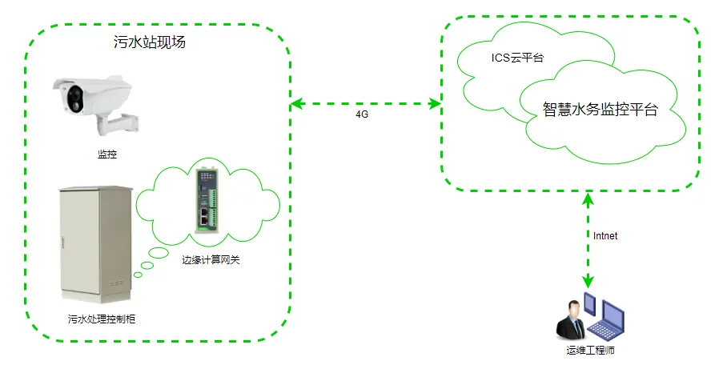

# Smart Networking Solution for Rural Sewage Treatment

## I. Solution Overview

### 1.1 Project Background

An automation enterprise focuses on the water automation field, providing comprehensive solutions for rural sewage treatment. With the advancement of the rural revitalization strategy, rural sewage treatment has become an important task, requiring the establishment of an intelligent sewage treatment monitoring system.

### 1.2 Construction Objectives

- Achieve remote monitoring of rural sewage treatment stations
- Real-time monitoring of sewage treatment equipment operational status
- Improve sewage treatment efficiency and management level
- Reduce operation and maintenance costs, achieve unattended operation

### 1.3 Applicable Scenarios

- Rural sewage treatment stations
- Village and town sewage treatment
- Small sewage plant monitoring
- Distributed sewage treatment facilities

## II. Requirements Analysis

### 2.1 Current Equipment Status

- Equipment types: PLC controllers, water pumps, sensors, instruments, etc.
- Communication interfaces: Ethernet, RS485, 4G
- Communication protocols: Modbus, MQTT, etc.
- Deployment environment: Rural sewage treatment sites, scattered distribution
- Scale: Multiple village and town sites

### 2.2 Core Requirements

1. **Remote monitoring requirement**: Real-time monitoring of sewage treatment equipment operational status
2. **Water quality monitoring requirement**: Monitor influent and effluent water quality parameters
3. **Fault alarm requirement**: Automatic alarm for equipment failures
4. **Data acquisition requirement**: Collect data such as flow rate, pressure, liquid level
5. **Operation and maintenance management requirement**: Remote equipment maintenance and upgrades

## III. Overall Architecture Design

This solution adopts an edge gateway + cloud platform architecture. On-site sewage treatment equipment connects to the network through edge gateways, and data is uploaded to the cloud platform for unified management and analysis.

### 3.1 Four-Layer Architecture

1. **Perception Layer**: On-site equipment such as water pumps, sensors, PLCs, instruments
2. **Network Layer**: Edge gateway, supporting 4G/wired access
3. **Platform Layer**: Sewage treatment cloud platform
4. **Application Layer**: Monitoring center, mobile app, operation and maintenance management

### 3.2 Data Flow

On-site equipment → Edge gateway → Cloud platform → Monitoring center

## IV. Network and Access Solution

### 4.1 Network Connection Method Selection

4G wireless access is primarily adopted, with wired backup support to adapt to the network environment of remote rural areas.

### 4.2 Edge Gateway Selection Points

- Supports multiple industrial protocol access
- Supports 4G/wired dual network backup
- Supports local data caching and data continuation after network interruption
- Industrial-grade design, adaptable to outdoor environments

## V. Protocol and Data Acquisition Solution

### 5.1 Supported Protocols

- **Industrial protocols**: Modbus RTU/TCP, PLC protocols
- **IoT protocols**: MQTT
- **Network protocols**: 4G, Ethernet

### 5.2 Northbound Protocol Support

- Supports cloud platform access
- Supports remote operation and maintenance management

## VI. Solution Highlights Summary

1. **Remote monitoring**: Achieve remote real-time monitoring of rural sewage treatment stations

2. **Unattended operation**: Supports automatic operation and remote maintenance, reducing labor costs

3. **Water quality assurance**: Real-time monitoring of water quality parameters to ensure compliant discharge

4. **Fault early warning**: Automatic alarm for equipment abnormalities, timely problem resolution

5. **Centralized management**: Centralized monitoring of multiple sites, improving management efficiency
