# Intelligent Configuration Guide Manual for Rural Sewage Treatment Stations

## I. Document Information

- Product Model: IG502
- Firmware Version: V2.3.1
- SDK Version: 1.4.8
- APP Version: V3.4.0
- Applicable Scenarios: Industrial data acquisition, device networking, edge data collection to cloud
- Writing Date: March 25, 2026

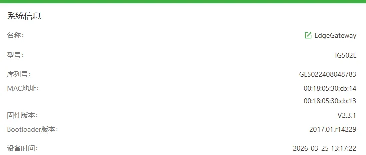

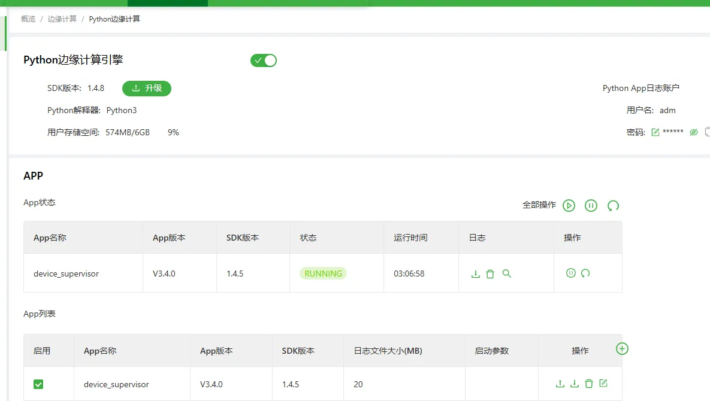

## II. Gateway Overview

### 2.1 Product Introduction

InGateway502 (IG502 for short) is a cost-effective edge gateway launched for the industrial IoT field. IG502 features a compact size and rich interfaces, with convenient global cellular access capabilities. It supports users in secondary development using Python, can be built-in with Inhand DeviceSupervisor™ Agent service, supports hundreds of data acquisition protocols, easily achieving device data collection, processing, and cloud upload, while also supporting Inhand DeviceLive cloud management, helping enterprises accelerate their digitalization process.

### 2.2 Main Functions

- Supports serial port and network port acquisition
- Supports mainstream industrial protocol parsing
- Supports MQTT data upload
- Supports edge computing, local caching
- Supports remote configuration, remote diagnosis, remote upgrade
- Industrial-grade design

### 2.3 Typical Application Topology

Field device PLC → RS485 → IG502 gateway → MQTT (json) → 4G → Smart Water Monitoring Platform

## III. Hardware Description

### 3.1 Appearance and Interfaces

- Power interface: DC 9–36V
- Serial ports: RS485 ×2
- Network ports: LAN ×2
- Wireless: 4G/5G/Wi-Fi (optional)
- Indicator lights: PWR, STATUS, WARN, NET, signal strength
- Reset button: Restore factory settings

### 3.2 Wiring Instructions

#### 3.2.1 Power Wiring

- Positive: V+
- Negative: V-
- Note: Reverse polarity protection, lightning protection, grounding

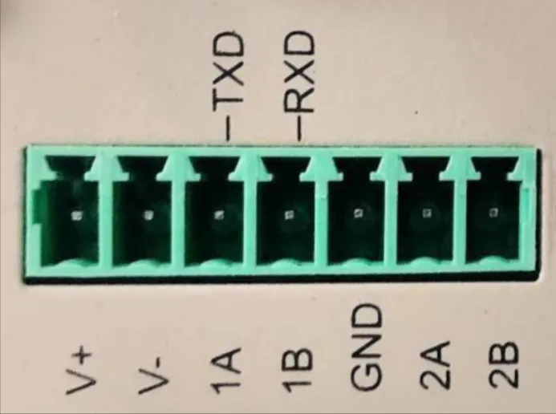

#### 3.2.2 RS485 Wiring

- A → 1A/2A
- B → 1B/2B
- Shield layer single-ended grounding
- The numbers before A and B represent the corresponding serial port number (for single RS485 models, 1A and 1B refer to the TXD and RXD above, representing the 232 serial port)
- DIP switches represent the pull-up/pull-down resistors of the serial port. If communication abnormalities occur in the field, the switch can be set to the ON position

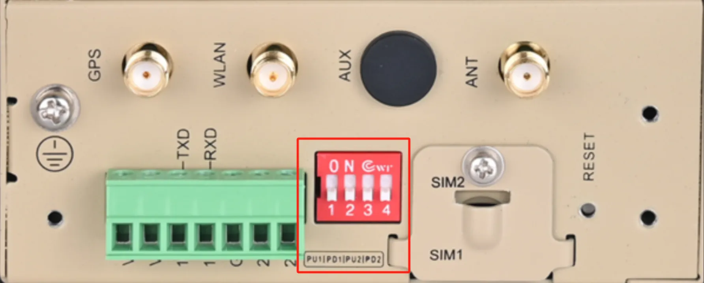

#### 3.2.3 Ethernet Wiring

IG502 has 2 RJ45 Ethernet ports, supporting 10M/100M adaptive rates. The pin description of RJ45 is as follows:

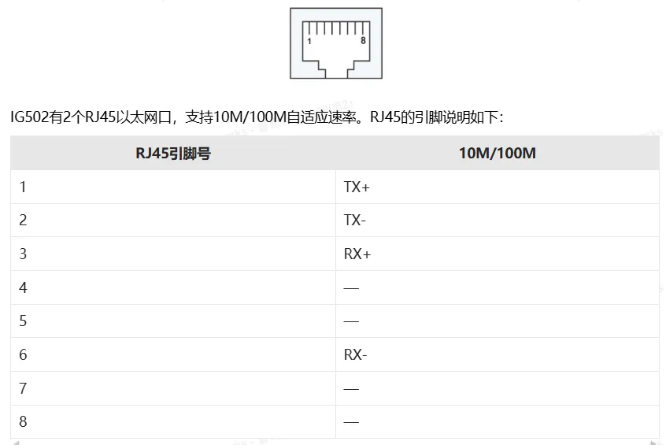

## IV. Factory Default Parameters

- Default IP: 192.168.2.1
- Subnet mask: 255.255.255.0
- Web username: adm
- Web password: 123456
- Serial port default parameters: 9600,8,N,1

## V. Preliminary Preparation

1. Set the computer to an IP address on the same network segment as the gateway LAN port. The gateway LAN port is: 192.168.2.1.

2. Connect the computer to the gateway LAN port with a network cable

3. Power on the gateway and wait for the STATUS light to illuminate

4. Ensure the computer has a properly functioning browser installed

## VI. Network Configuration

### 6.1 LAN Port Configuration (Static)

1. Enter [Network Settings] → [LAN]

2. Select Static IP

3. Set IP, subnet mask, gateway, DNS

4. Save and apply

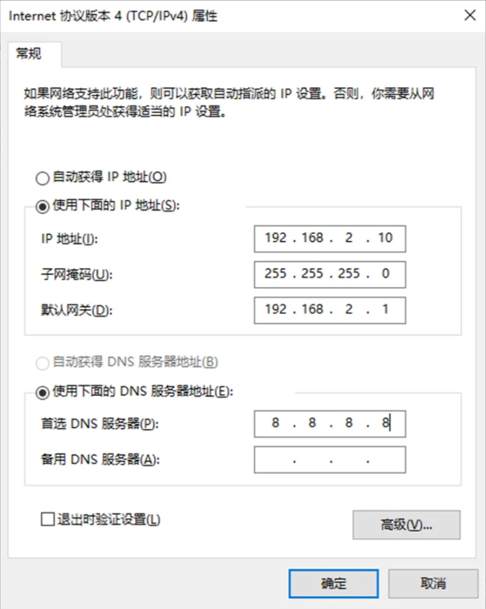

### 6.2 4G Wireless Network Configuration (Optional)

1. Insert SIM card (4G)

2. View signal strength indicator on the panel. Signal strength from weak to strong corresponds to 1-3 lights illuminated

## VII. Device and Protocol Configuration (Core)

### 7.1 Supported Protocol List

- Modbus RTU / TCP
- PLC protocols: Siemens, Mitsubishi, Omron, Schneider, Delta, Xinjie, etc.
- Meter protocols: DL/T645, CJ/T188, etc.
- Custom protocols

### 7.2 Adding Acquisition Devices

1. Enter [Edge Computing] → [Device Monitoring] → [Point Monitoring] → [Add Controller]
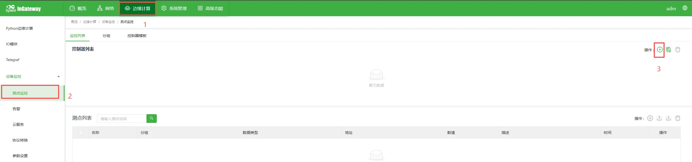
2. Name: The example here is PLC. Select the protocol type according to the PLC protocol. Here we use Modbus protocol.

3. Set the Modbus slave address (station number) of the device

4. For communication, select RS485 interface. Serial port parameters are set according to PLC. Here we use default settings.

5. Set polling period (unit is seconds by default)

6. Confirm and save

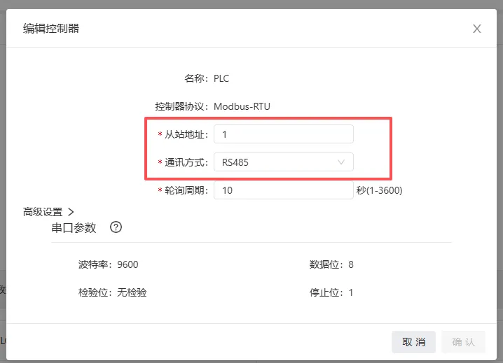

### 7.3 Adding Acquisition Points

1. Enter [Point Configuration] → [Add Point]
2. Point name: `[Fill in according to requirements here as per platform needs]`
3. Address: 4X (03 function code corresponds to 4X, 04 function code corresponds to 3X), followed by the specific register address. The example here writes 23
4. Data type: int16/uint16/int32/float, etc.
5. Read/write permission: Read/Write/Read-Write
6. Upload mode: Periodic upload/Change upload/No upload
7. Unit: This field is not reported, only for local display
8. Description: This field is only for display, not uploaded
9. Belonging group: Associated with data reporting, default is default group
10. Data operation: Perform data operations as needed, such as offset scaling and other rule settings
11. Save

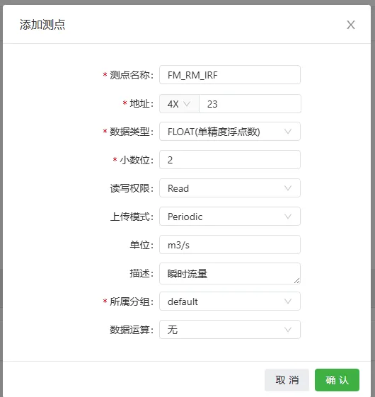

### 7.4 Point Table Import/Export

Supports CSV file batch import, export and backup configuration.

## VIII. Data Upload Configuration

### 8.1 MQTT Upload

1. Enter [Cloud Service] → [MQTT Cloud Service]
2. Enable cloud service
3. Server address: `xxx.xxx.xxx.xxx`
4. Client ID `${SN}` (references the gateway's SN here), username `gatewayXXX`, password `XXXXXXXXX`
5. Topic and script settings:
   - Upload
    Topic: `[v1/XXXXX/XXXXX/upload]`

    ```python script
      # upload script
      import json
      from common.Logger import logger
      from quickfaas.global_dict import get
      from datetime import datetime

      def main(message):
          logger.info(message)
          old_data=New2Old(message)
          global_parameter=get()
          logger.info(global_parameter)
          uuid=list_global(global_parameter,"SN")
          #value_list=[]
          utc_time=datetime.utcfromtimestamp(old_data["timestamp"]+28800)
          for device,val_dict in old_data['values'].items():
              value_dict= {
                  "uuid": uuid,
                  "time": utc_time.strftime('%Y-%m-%d %H:%M:%S'),
                  "data": {}
                  }
              for id,val in val_dict.items():
                  value_dict["data"][id]=val["raw_data"]
              #value_list.append(value_dict)
          logger.info(value_dict)
          return json.dumps(value_dict)

      def list_global(list1,key):
          for i in list1:
              if i["key"] == key:
                  return i["value"]
              else:
                  continue

      def New2Old(val):
          data_new={'timestamp': val["measures"][0]["timestamp"],"group_name":val["group"],'values': {}}
          for val_dic1 in val["measures"]:
              try:
                  data_new["values"][val_dic1["ctrlName"]][val_dic1["name"]]['raw_data']=val_dic1["value"]
              except:
                  try:
                      data_new["values"][val_dic1["ctrlName"]][val_dic1["name"]]={}
                      data_new["values"][val_dic1["ctrlName"]][val_dic1["name"]]['raw_data']=val_dic1["value"]
                  except:
                      data_new["values"][val_dic1["ctrlName"]]={}
                      data_new["values"][val_dic1["ctrlName"]][val_dic1["name"]]={}
                      data_new["values"][val_dic1["ctrlName"]][val_dic1["name"]]['raw_data']=val_dic1["value"]
          return data_new
    ```

   - Downlink control topic: `[v1/XXXXX/XXXXX/control]`

    ```python script
        # control script
        import json
        from common.Logger import logger
        from quickfaas.measure import write
        from quickfaas.global_dict import get as getdict
        from quickfaas.config import get
        from datetime import datetime
        from quickfaas.remotebus import publish
        import time
        def main(topic, payload):
            logger.info(topic)
            payload=json.loads(payload)
            logger.info(payload)
            global_parameter=getdict()
            for i,val in payload["data"].items():
                topic="cmdAck/"+list_global(global_parameter,"SN")
                ts=datetime.utcfromtimestamp(int(time.time())+28800)
                message=[{'name': get_device(i),'measures':[{'name':i,'value':val}]}]
                #message=json.dumps(message)
                logger.info(message)
                adm=write(message)
                if adm[0]["measures"][0]["error_code"]==0:
                    resp_data = {"uuid":list_global(global_parameter,"SN"), "cmdId":payload["cmdId"], "time":str(ts),"result":"true"}
                else:
                    resp_data = {"uuid":list_global(global_parameter,"SN"), "cmdId":payload["cmdId"], "time":str(ts),"result":"false"}
                logger.info("Message %s" %adm)
                publish(topic,json.dumps(resp_data),qos=0)
                logger.info("#################Send data##################")

        def list_global(list1,key):
            for i in list1:
                if i["key"] == key:
                    return i["value"]
                else:
                    continue

        def get_device(device_name):
            config_f=get()
            device={}
            for i in config_f["measures"]:
                try:
                    device[i["ctrlName"]].append(i["name"])
                except:
                    device[i["ctrlName"]]=[i["name"]]
            for dev,va in device.items():
                if device_name in va:
                    return dev

    ```

   - recall topic: `[v1/XXXXX/XXXXX/recall]`

      ```python script
        # recall script
        import json
        from common.Logger import logger
        from quickfaas.measure import recall
        from quickfaas.remotebus import publish
        from quickfaas.global_dict import get as getdict
        import time
        from datetime import datetime

        def recall_test(topic, payload):
            payload = json.loads(payload)
            logger.info(payload)
            message=recall([])
            global_parameter=getdict()
            utc_time = datetime.utcfromtimestamp(int(time.time())+28800)
            for message1 in message:
                message=message1
                logger.info(message)
                updata={"uuid":list_global(global_parameter,"SN"),'time':str(utc_time),"data":{}}
                for i in message['measures']:
                    updata["data"][i["name"]]=i["value"]
                topic1="callback/"+list_global(global_parameter,"SN")
                publish(topic1,updata,qos=1,)

        def list_global(list1,key):
            for i in list1:
                if i["key"] == key:
                    return i["value"]
                else:
                    continue
      ```

   - alarm topic: `[v1/XXXXX/XXXXX/alarm]`

    ```python script
    # alarm script
    import json
    from common.Logger import logger
    from quickfaas.global_dict import get
    from datetime import datetime

    def main(message):
        logger.info(message)
        old_data=New2Old(message)
        global_parameter=get()
        logger.info(global_parameter)
        uuid=list_global(global_parameter,"SN")
        #value_list=[]
        utc_time=datetime.utcfromtimestamp(old_data["timestamp"]+28800)
        for device,val_dict in old_data['values'].items():
            value_dict= {
                "uuid": uuid,
                "time": utc_time.strftime('%Y-%m-%d %H:%M:%S'),
                "data": {}
                }
            for id,val in val_dict.items():
                value_dict["data"][id]=val["raw_data"]
            #value_list.append(value_dict)
        logger.info(value_dict)
        return json.dumps(value_dict)

    def list_global(list1,key):
        for i in list1:
            if i["key"] == key:
                return i["value"]
            else:
                continue

    def New2Old(val):
        data_new={'timestamp': val["measures"][0]["timestamp"],"group_name":val["group"],'values': {}}
        for val_dic1 in val["measures"]:
            try:
                data_new["values"][val_dic1["ctrlName"]][val_dic1["name"]]['raw_data']=val_dic1["value"]
            except:
                try:
                    data_new["values"][val_dic1["ctrlName"]][val_dic1["name"]]={}
                    data_new["values"][val_dic1["ctrlName"]][val_dic1["name"]]['raw_data']=val_dic1["value"]
                except:
                    data_new["values"][val_dic1["ctrlName"]]={}
                    data_new["values"][val_dic1["ctrlName"]][val_dic1["name"]]={}
                    data_new["values"][val_dic1["ctrlName"]][val_dic1["name"]]['raw_data']=val_dic1["value"]
        return data_new
    ```

6. Check whether log data is successfully reported
    - Enter [Edge Computing] → [Python Edge Computing] → [App Status] → [Small magnifying glass below log]
    - View upload log to confirm whether data is successfully reported
  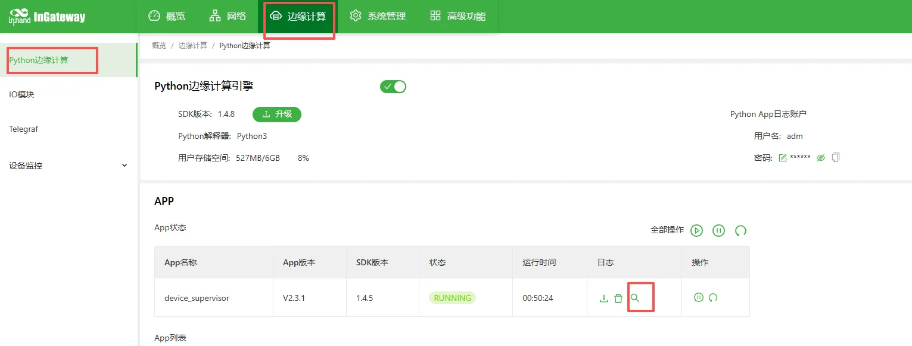

## IX. Remote Management

### 9.1 Remote Access

- deviceManage remote configuration

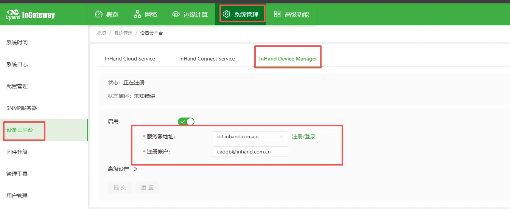

- ICS platform configuration

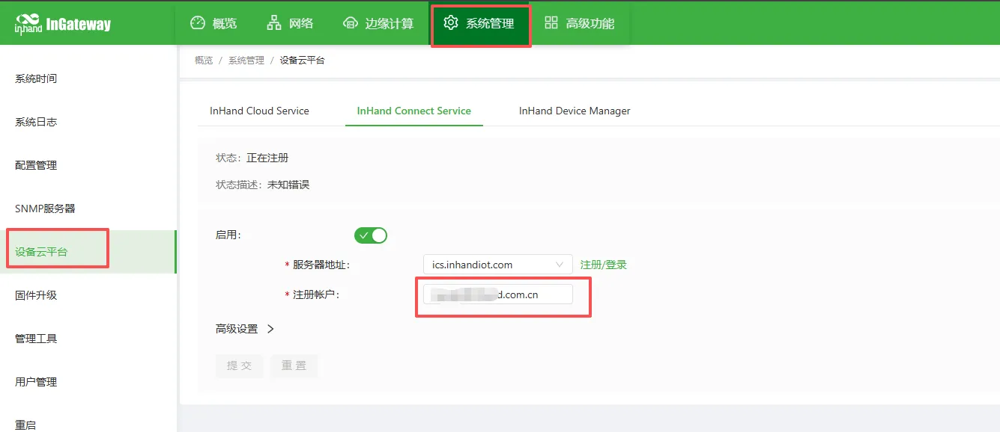

### 9.2 Configuration Backup and Recovery

- Import/export APP configuration:

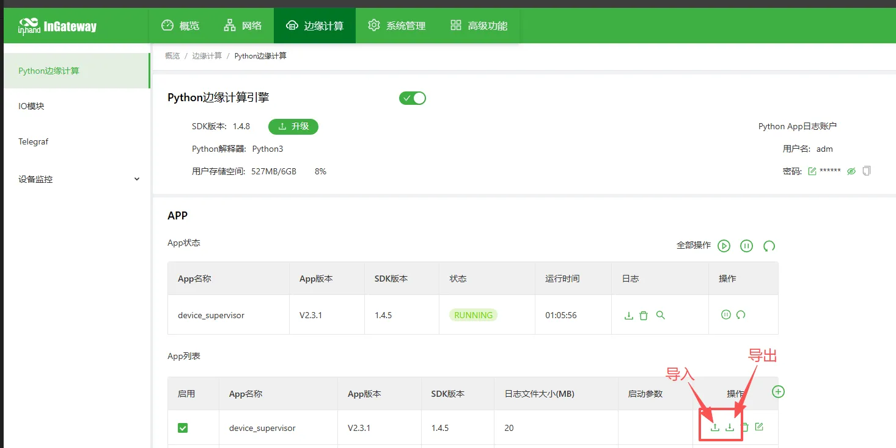

- Import/export gateway configuration:

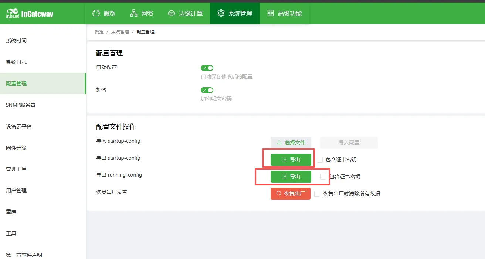

## X. Common Problems and Troubleshooting

1. Cannot open Web interface

   - Check network segment, network cable, IP conflicts
   - Restore gateway to factory settings and retry

2. No data received from serial port

   - Check wiring A/B
   - Verify baud rate, station number, register address
   - Use serial tool to test whether the device is working normally

3. Gateway cannot collect data

   - Check point address, data type
   - View acquisition log
   - Check whether the device supports the protocol

4. MQTT connection failed

   - Whether the network is connected

   - Server address, port, username, password

   - Whether firewall/port is open

## XI. Safety Precautions

- Reliable grounding at industrial site
- Avoid hot-swapping serial ports with power on
- Backup after configuration is complete
- Change remote password regularly
- Prohibit operation by unauthorized personnel

## XII. Appendix

### 12.1 Terminology Explanation

- RTU, TCP, MQTT, edge computing, point, register, station number, acquisition interval
