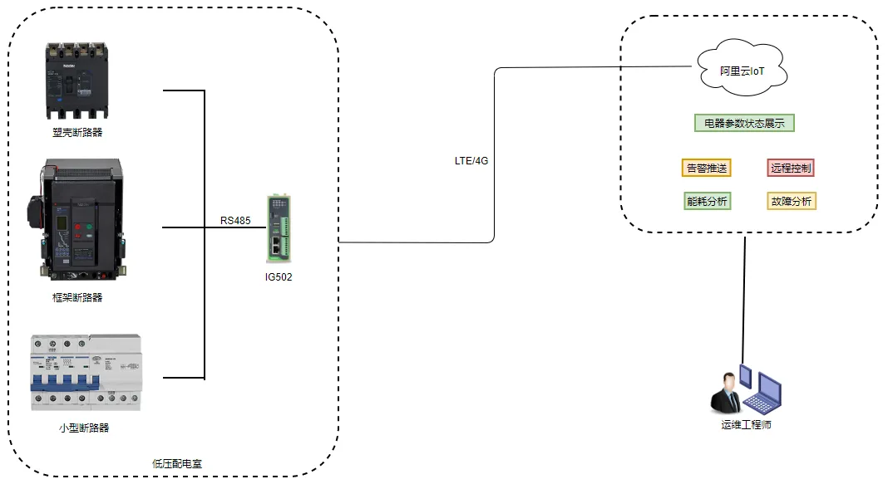

# Smart Low-Voltage Power Distribution Networking Solution

## I. Solution Overview

### 1.1 Project Background

An electrical enterprise focuses on the R&D and manufacturing of low-voltage power distribution equipment, providing customers with comprehensive smart low-voltage power distribution solutions. With the advancement of smart grids and digital transformation, the demand for intelligent and networked low-voltage power distribution systems is growing.

### 1.2 Construction Objectives

- Achieve intelligent management of low-voltage power distribution systems
- Real-time monitoring of power distribution equipment operational status
- Enhance safety and reliability of power distribution systems
- Reduce operation and maintenance costs, achieve remote monitoring

### 1.3 Applicable Scenarios

- Smart power distribution systems
- Low-voltage switchgear monitoring
- Unattended distribution rooms
- Smart building power distribution

## II. Requirements Analysis

### 2.1 Current Equipment Status

- Equipment types: Smart circuit breakers, power distribution meters, residual current devices, etc.
- Communication interfaces: Ethernet, RS485, 4G
- Communication protocols: Modbus, MQTT, etc.
- Deployment environment: Distribution rooms, switchgear cabinets
- Scale: Distributed deployment

### 2.2 Core Requirements

1. **Real-time monitoring requirement**: Real-time monitoring of electrical parameters such as voltage, current, and power
2. **Safety protection requirement**: Leakage protection, overload protection, short-circuit protection
3. **Remote management requirement**: Remote monitoring and control of power distribution equipment
4. **Fault early warning requirement**: Abnormal alarms to detect potential problems in advance
5. **Energy management requirement**: Electric energy metering and energy consumption analysis

## III. Overall Architecture Design

This solution adopts an architecture of smart power distribution equipment + edge gateway + cloud platform to achieve intelligent management of low-voltage power distribution systems.

### 3.1 Four-Layer Architecture

1. **Perception Layer**: On-site equipment such as smart circuit breakers, power distribution meters, sensors
2. **Network Layer**: Edge gateway, supporting multi-protocol access and data transmission
3. **Platform Layer**: Power distribution management platform, data storage and analysis
4. **Application Layer**: Monitoring large screen, mobile app, operation and maintenance management

### 3.2 Data Flow

On-site equipment → Edge gateway → Cloud platform → Application end

## IV. Network and Access Solution

### 4.1 Networking Method Selection

Supports multiple access methods including wired Ethernet, 4G/5G wireless, etc.

### 4.2 Edge Gateway Selection Points

- Supports multiple industrial protocol access
- Supports common protocols for power distribution equipment such as Modbus
- Supports local data preprocessing
- Industrial-grade design, adaptable to distribution room environment

## V. Protocol and Data Acquisition Solution

### 5.1 Supported Protocols

- **Industrial protocols**: Modbus RTU/TCP, DLT645
- **IoT protocols**: MQTT
- **Network protocols**: Ethernet, 4G/5G

### 5.2 Northbound Protocol Support

- Supports cloud platform access
- Supports standard API interfaces

## VI. Solution Highlights Summary

1. **Intelligent power distribution**: Achieve intelligent management of low-voltage power distribution systems

2. **Real-time monitoring**: Real-time monitoring of electrical parameters and equipment status

3. **Safety protection**: Comprehensive leakage, overload, and short-circuit protection functions

4. **Remote operation and maintenance**: Remote monitoring and control, reducing maintenance costs

5. **Energy analysis**: Electric energy metering and energy consumption analysis to optimize electricity usage
