# Smart Low-Voltage Power Distribution — Configuration Guide

## 1. Document Information

- Product model: IG502
- Firmware version: V2.3.1
- SDK version: 1.4.8
- App version: V3.4.0
- Applicable scenarios: industrial data acquisition, device networking, edge acquisition to the cloud
- Date: March 31, 2026

## 2. Gateway Overview

### 2.1 Product Introduction

InGateway502 (IG502 for short) is a cost-effective edge gateway designed for the Industrial IoT. Compact in size and rich in interfaces, it offers convenient global cellular connectivity. It supports secondary development in Python and can embed InHand Networks' DeviceSupervisor™ Agent service, which supports hundreds of data acquisition protocols to easily collect, process, and upload device data to the cloud. It also supports InHand Networks' DeviceLive cloud management, helping enterprises accelerate their digital transformation.

### 2.2 Key Features

- Supports data acquisition over serial and Ethernet ports
- Supports DLT645 protocol parsing, Modbus RTU, and IEC 101/104
- Supports MQTT data reporting
- Supports edge computing and local caching
- Supports remote configuration, remote diagnostics, and remote upgrade
- Industrial-grade design

### 2.3 Typical Application Topology

Field meters → RS485 → IG502 gateway → MQTT (JSON) → Energy management platform

## 3. Hardware Description

### 3.1 Appearance and Interfaces

- Power interface: DC 9–36 V
- Serial ports: 2 × RS485
- Ethernet ports: 2 × LAN
- Wireless: 4G/5G/Wi-Fi (optional)
- Indicators: PWR, STATUS, WARN, NET, signal strength
- Reset button: restore factory settings

### 3.2 Wiring Instructions

#### 3.2.1 Power Wiring

- Positive: V+
- Negative: V-
- Note: prevent reverse connection, provide lightning protection, and ground properly


#### 3.2.2 RS485 Wiring

- A → 1A/2A
- B → 1B/2B
- Ground the shielding layer at one end
- The number before A/B indicates the corresponding serial port number. (On single-RS485 models, refer to the TXD and RXD labels above; 1A and 1B represent the RS232 serial port.)
- The DIP switch controls the serial port's pull-up/pull-down resistors. If communication problems occur on site, set the switch to the ON position.


#### 3.2.3 Ethernet Wiring

The IG502 has two RJ45 Ethernet ports that support 10M/100M auto-negotiation. The RJ45 pinout is as follows:
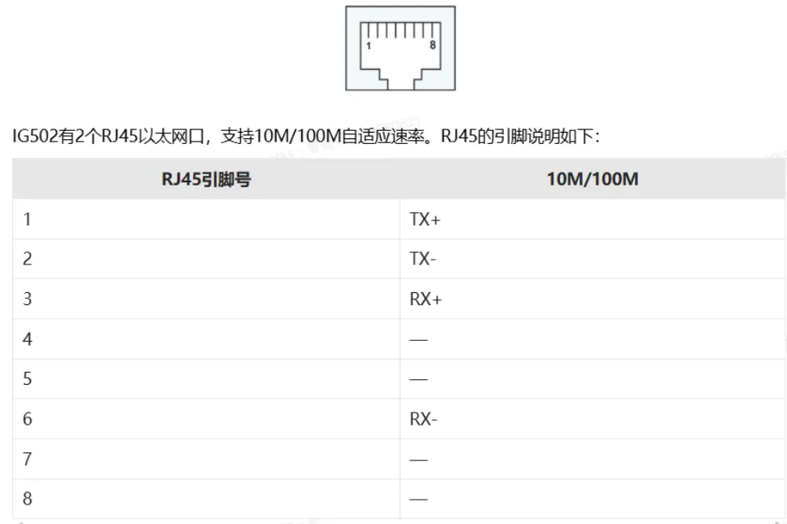

## 4. Factory Default Settings

- Default IP: 192.168.2.1
- Subnet mask: 255.255.255.0
- Web username: adm
- Web password: 123456
- Default serial parameters: 9600, 8, N, 1

## 5. Preparation

1. Set the computer's IP to the same subnet as the gateway's LAN port. The gateway LAN port is 192.168.2.1.
2. Connect the computer to the gateway's LAN port with an Ethernet cable.
3. Power on the gateway and wait until the RUN indicator stays solid.
4. Make sure the computer has a working web browser installed.

## 6. Network Configuration

### 6.1 LAN Port Configuration (Static)

1. Go to **Network Settings → LAN**
2. Select Static IP
3. Set the IP address, subnet mask, gateway, and DNS
4. Save and apply
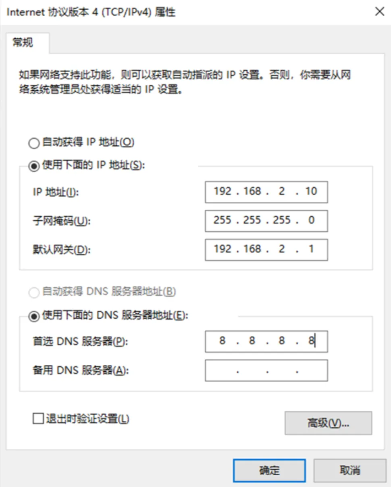

### 6.2 4G Wireless Network Configuration (Optional)

1. Insert the SIM card (4G)
2. Check the signal strength indicators on the panel. From weak to strong, 1 to 3 indicators light up.

## 7. Device and Protocol Configuration (Core)

### 7.1 Supported Protocols

- Modbus RTU / TCP
- PLC protocols: Siemens, Mitsubishi, Omron, Schneider, Delta, Xinje, etc.
- Meter protocols: DL/T645, CJ/T188, etc.
- Custom protocols

### 7.2 Adding a Data Acquisition Device

1. Go to **Edge Computing → Device Monitoring → Measurement Point Monitoring → Add Controller**
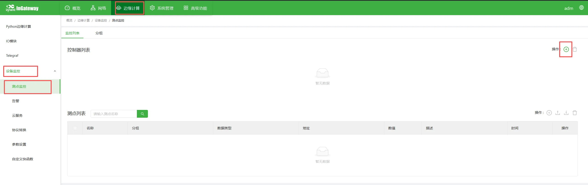
2. For the name, this example uses the circuit breaker's initials, "DLQ". Select the protocol type according to the device's protocol; this example uses Modbus RTU.
3. Set the device's Modbus slave address (station number).
4. For communication, select the RS485 interface and set the serial parameters to match the device's communication parameters; this example uses the defaults.
5. Set the polling interval; the default unit is seconds.
6. Confirm and save.
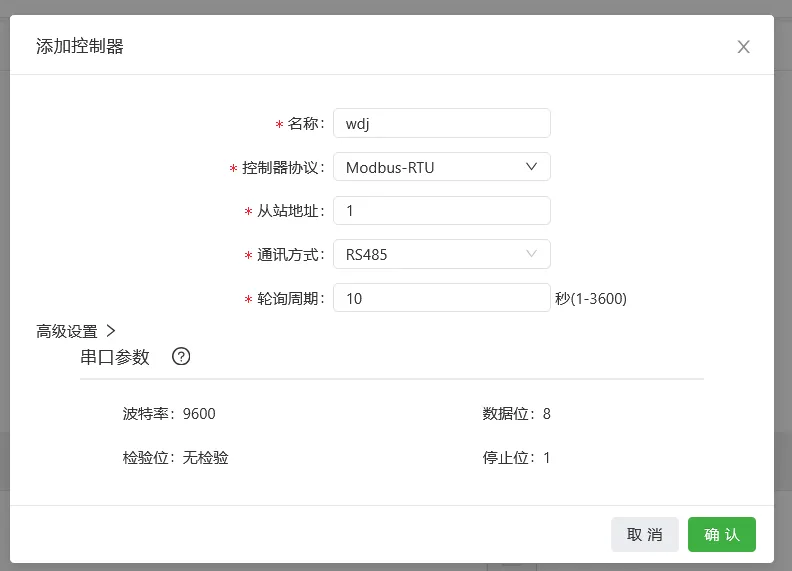

### 7.3 Adding Data Points

1. Go to **Data Point Configuration → Add Data Point**
2. Data point name: `[fill in as required by your platform]`
3. Address: 4X (function code 03 corresponds to 4X; function code 04 corresponds to 3X), followed by the specific register address — this example uses 23.
4. Data type: int16/uint16/int32/float, etc.
5. Read/write permission: read / write / read-write
6. Upload mode: periodic upload / upload on change / no upload
7. Unit: this field is not reported and is displayed locally only.
8. Description: this field is for display only and is not uploaded.
9. Group: associated with data reporting; the default is the Default group.
10. Data operation: apply data operations as needed, such as offset and scaling rules.
11. Save.
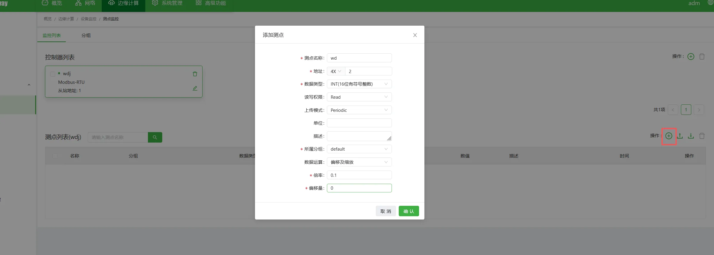
View the read results:
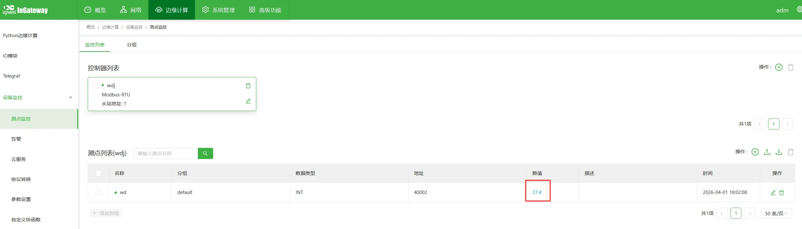

### 7.4 Importing / Exporting the Data Point Table

Supports batch import and export of the configuration for backup using CSV files.
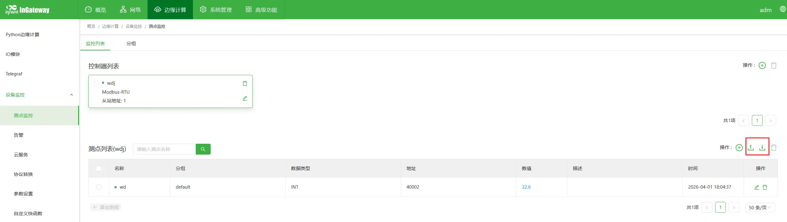

## 8. Data Upload Configuration

### 8.1 MQTT Upload

1. Go to **Cloud Services → MQTT Cloud Service**
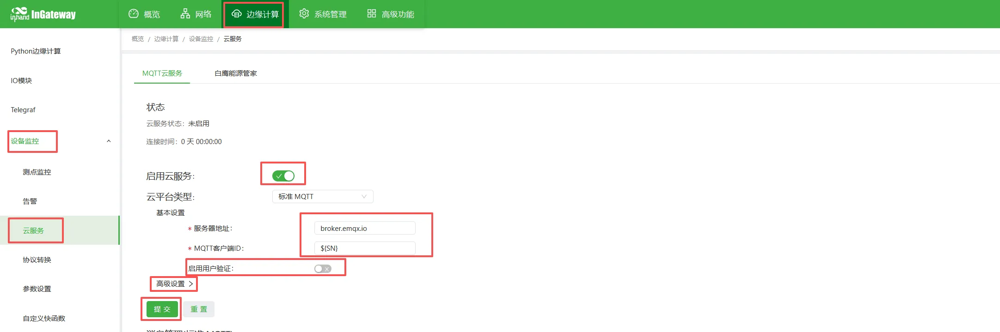
2. Enable the cloud service.
3. Server address: `xxx.xxx.xxx.xxx`
4. Client ID `${SN}` (references the gateway's SN), username `gatewayXXX`, password `XXXXXXXXX`
5. Topics and script configuration:
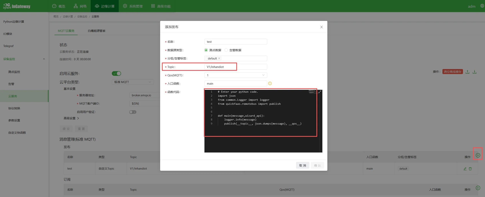
   - Publish (report)
     Topic: `[v1/XXXXX/XXXXX/upload]`

     ```python
        # Enter your python code.
        import json
        from common.Logger import logger
        from quickfaas.remotebus import publish


        def main(message,wizard_api):
            logger.info(message)
            publish(__topic__, json.dumps(message), __qos__)
     ```

   - Subscribe topic: `[v1/XXXXX/XXXXX/cmd]`
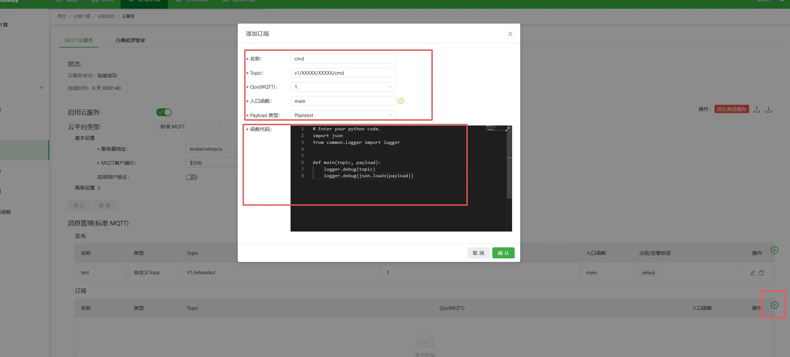

     ```python
        # Enter your python code.
        import json
        from common.Logger import logger

        def main(topic, payload):
            logger.debug(topic)
            logger.debug(json.loads(payload))
     ```

6. Check the logs to confirm whether the data was reported successfully.

   - Go to **Edge Computing → Python Edge Computing → App Status → the small magnifier below Logs**
   - Review the upload logs to confirm whether the data was reported successfully; you can also see the subscribed commands.
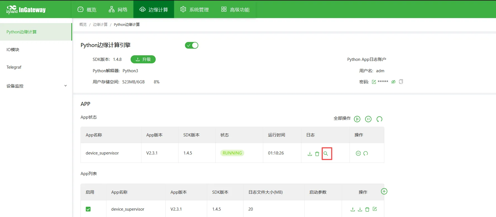

These scripts are the initial scripts. If you need customized functionality, you can implement it with custom Python scripts.

## 9. Remote Management

### 9.1 Remote Access

- Remote configuration via DeviceManage
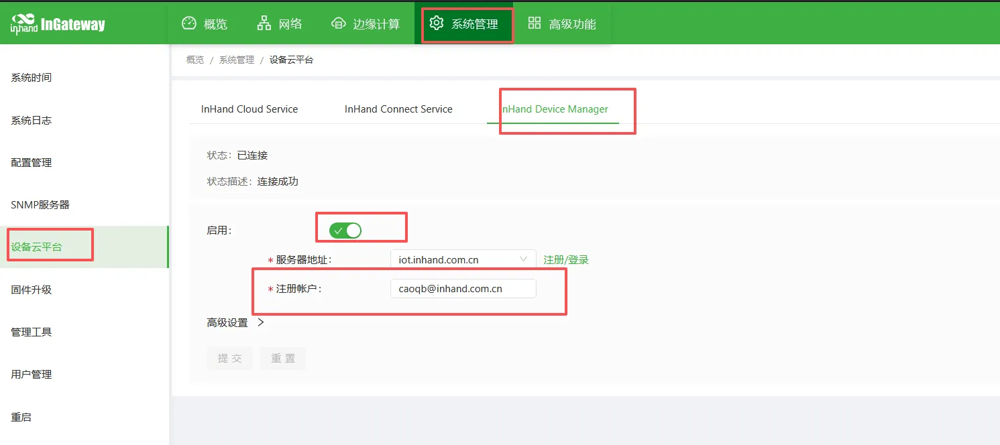

### 9.2 Configuration Backup and Restore

- Import/export the app configuration:
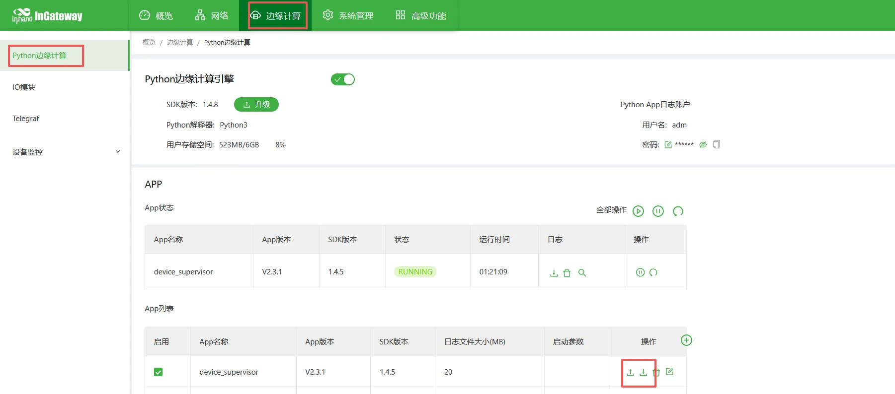
- Import/export the gateway configuration:
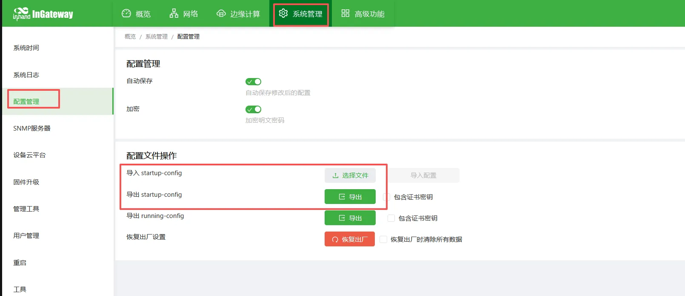

## 10. FAQ and Troubleshooting

1. Cannot open the web interface

   - Check the subnet, the Ethernet cable, and whether the IP addresses conflict.
   - Restore the gateway to factory settings and try again.

2. No data received on the serial port

   - Check the A/B wiring.
   - Verify the baud rate, station number, and register address.
   - Use a serial port tool to test whether the device works properly.

3. The gateway cannot collect data

   - Check the data point address and data type.
   - Review the acquisition logs.
   - Check whether the device supports the protocol.

4. MQTT connection fails

   - Check whether the network is reachable.
   - Check the server address, port, username, and password.
   - Check whether the firewall/port is open.

## 11. Safety Precautions

- Ensure reliable grounding at the industrial site.
- Avoid hot-plugging the serial port while powered on.
- Back up the configuration after completing it.
- Change remote passwords regularly.
- Prohibit operation by unauthorized personnel.
