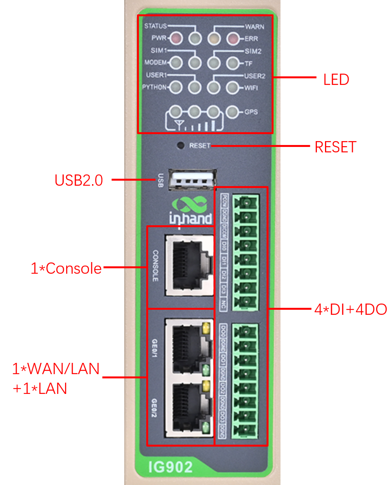
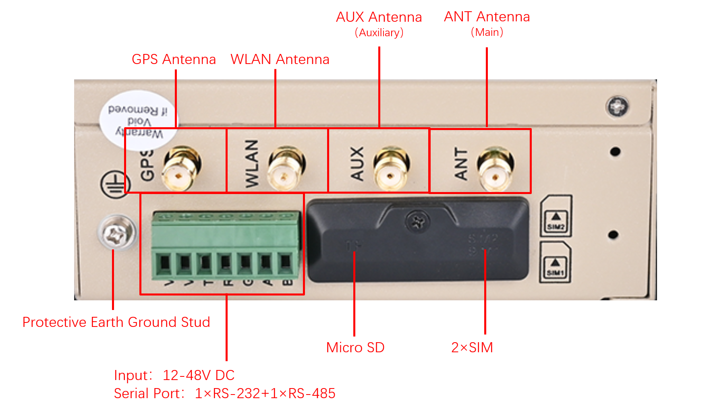
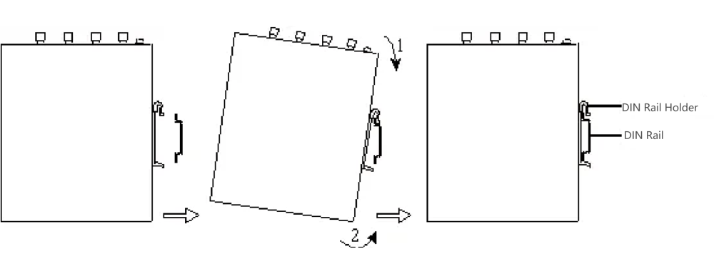
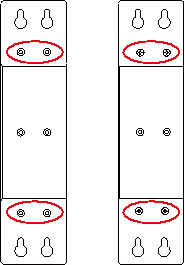
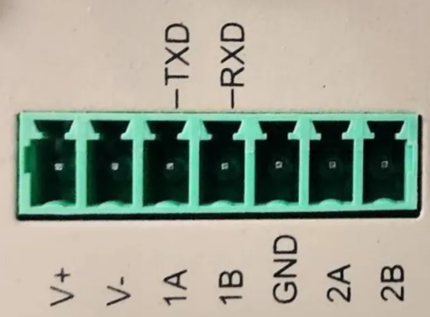
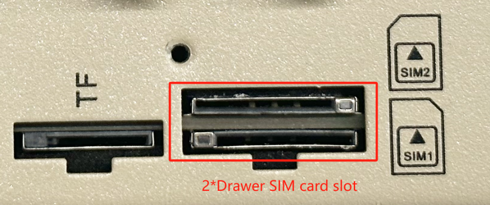
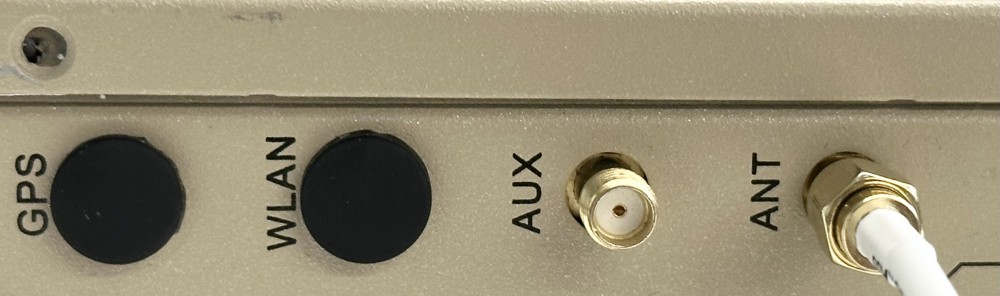

Edge Gateway InGateway902

Quick Start Guide

Version 1.1, Oct. 2024

[www.inhand.com](http://www.inhand.com)

The software described in this manual is according to the license agreement, can only be used in accordance with the terms of the agreement.

Copyright Notice

© 2024 InHand Networks All rights reserved.

Trademarks

The InHand logo is a registered trademark of InHand Networks.

All other trademarks or registered trademarks in this manual belong to their respective manufacturers.

Disclaimer

The company reserves the right to change this manual, and the products are subject to subsequent changes without prior notice. 9. We shall not be responsible for any direct, indirect, intentional or unintentional damage or hidden trouble caused by improper installation or use.

# 1 Product Introduction

InGateway902 (IG902) is a high-performance edge gateway for industrial IoT, which is powered by TI AM3352 industrial-grade processor with powerful performance. Compact size, rich interface, with convenient global cellular access. The IG902 supports secondary development using Python, and can be equipped with built-in InHand DeviceSupervisor™ Agent service, which supports hundreds of data collection protocols, making it easy to collect, process, and upload device data to the cloud, and also supports InHand DeviceLive cloud management, helping enterprises accelerate their digitalisation process. 

# 2 Packing List  

1.  Standard Accessories  
    

| Number | Name | Quantity | note |
| --- | --- | --- | --- |
| 1 | IG902 | 1 | IG902 Edge Computing Gateway |
| 2 | GPS Antenna | \- | The number and type of antennas depends on the actual model |
| 3 | WLAN Antenna | \- |  |
| 4 | Cellular Antenna | \- |  |
| 5 | Rail Mounting Accessories | 1 | For fixing devices to rails |
| 6 | Industrial Terminals | 1 | 7-Pin Industrial Terminal |
| 7 | Network Cable | 1 | 1.5m network cable |
| 8 | Product Information | 1 | QR code scanning to view quick start guide, user manual |
| 9 | Product Warranty Card | 1 | Warranty period is 1 year |
| 10 | Certificate of Conformity | 1 | IG902 Edge Computing Gateway Certificate of Compliance |

1.  Optional Accessories  
    

| Number | Name | Quantity | note |
| --- | --- | --- | --- |
| 1 | Power Adapter | 1 | 12V 2A Power Adapter |
| 2 | Wall Mounting Kit | 1 | The IG902 supports wall-mounting with backside lugs, and is shipped with the appropriate accessories for deployment scenarios where this mounting method is applicable. |

# 3 Product Appearance

The panel layout of the IG902 is shown below:

## 3.1 Front panel

IG902 is divided into models with IO interface and without IO interface, and the front panel with IO interface is shown below:

  

## 3.2 Upper panel

  

# 4 Indicator Description

-   Description of operating status indicators

| PWR | STATUS | WARN | MODEM | ERR | Instruction |
| --- | --- | --- | --- | --- | --- |
| **Power indicator (red)** | **Status indicator (green)** | **Alarm indicator (yellow)** | **MODEM indicator (green)** | **Error indicator (red)** |
| On | Off | Off | Off | Off | Booting |
| On | flash | Off | Off | Off | Boot up successfully |
| On | flash | Off | flash | Off | Dialling |
| On | flash | Off | On | Off | Dialling successfully |
| On | flash | flash | Off | flash | Reset successfully |

  

| Marking | Name | Istruction |
| --- | --- | --- |
| SIM1 | SIM1 status indicator  (green) | On - SIM1 function is on  Out - SIM1 function is off  **Note:** By default, the SIM1 indicator lights up during ‘Boting’ and ‘Boot up successfully’, and then the corresponding indicator lights up for the actual SIM card in use |
| SIM2 | SIM2 status indicator  (green) | On-SIM2 function on  Off-SIM2 function off |
| WLAN | WLAN status indicator  (green) | On - WLAN function on  Flash - data transmission  Off - WLAN function off |
| GPS | GPS Status Indicator  (green) | On - GPS positioning is successful  Flash - GPS function on  Off - GPS function off |
| TF | TF Status Indicator  (green) | On - TF recognised  Off - TF not recognised |
| USER1 | User programmable indicator 1  (green) | Default off, user programmable control |
| USER2 | User programmable indicator 2  (green) | Default off, user programmable control |
| PYTHON | PYTHON indicator  (green) | On - PYTHON function is normally switched on  Off - PYTHON function is switched off |

  

-   Signal Status Indicator Description

| Signal status indicator 1(green) | Signal status indicator 2(green) | Signal status indicator 3(green) | Instruction |
| --- | --- | --- | --- |
| Off | Off | Off | No signal detected |
| On | Off | Off | Signal condition 1-9ASU (indicates a problem with the signal condition, please check whether the antenna is properly installed, whether the SIM card is correctly recognised, and whether the signal condition is good in the area) |
| On | On | Off | Signalling status 10-19 ASU (indicating that the signalling status is essentially normal and the equipment can be used normally) |
| On | On | On | Signalling status 20-31 ASU (indicating good signalling status) |

# 5 Installing the IG902  

## 5.1 DIN rail mounting and dismounting

### 5.1.1 DIN rail mounting

The mounting plate for the DIN rail is attached to the rear panel of the IG902 as shown below:

Installation steps are as follows:

1\. Select the installation location of the equipment and ensure that there is enough space;

2\. Snap the upper part of the DIN rail holder onto the DIN rail, and rotate the device at the lower end of the device with a little force upwards as shown in arrow 2 to snap the DIN rail holder onto the DIN rail, and confirm that the device is reliably mounted onto the DIN rail, as shown in the figure below:

### 5.1.2 DIN rail dismounting

The method of dismounting the IG902:

1\. As shown by arrow 1 in the figure below, press down on the device to give clearance at the lower end of the device to disengage from the DIN rail.

2\. Turn the device in the direction of arrow 2 and move the lower end of the device outwards at the same time. Lift the device upwards after the lower end is detached from the DIN rail to remove the device from the DIN rail.

## 5.2 Wall mounting and dismounting

### 5.2.1 Wall mounting

The specific steps for installing the IG902 are as follows:

1\. Select the installation location of the equipment and ensure that there is enough space.

2\. Use a screwdriver to mount the wall mounting plate on the back of the device as shown below

3\. Take out the screws (packed with the wall mounting plate), fix the screws in the mounting position with a screwdriver, and then pull down the device to make the device in a stable state, as shown in the following picture

### 5.2.1 Wall mounted dismantling

To remove the IG902, hold the device with one hand and with the other hand remove the screws that hold the top end of the device in place to remove the device from its mounting position.

# 6 Connector Description

## 6.1 Ethernet Interface

The IG902 has 2 RJ45 Ethernet ports that support 10M/100M/1000M adaptive rates.The RJ45 pins are described below:

| RJ45 Pin Number | 10M/100M | 1000M |
| --- | --- | --- |
| 1 | TX+ | TRD(0)+ |
| 2 | TX- | TRD(0)- |
| 3 | RX+ | TRD(1)+ |
| 4 | \- | TRD(2)+ |
| 5 | \- | TRD(2)- |
| 6 | RX- | TRD(1)- |
| 7 | \- | TRD(3)+ |
| 8 | \- | TRD(3)- |

## 6.2 Console Interface

The IG902 comes with one RJ45 Console interface, which uses the RS-232 communication standard. The pinout of the interface is described below:

| RJ45 Pin Number | Name | Definition |
| --- | --- | --- |
| 1 | CTS | Clear To Send |
| 2 | DSR | Data Terminal Ready |
| 3 | RxD | Data Received |
| 4 | GND | Ground |
| 5 | GND | Ground |
| 6 | TxD | Data Transmitted |
| 7 | DTR | Data Terminal Ready |
| 8 | RTS | Request To Send |

## 6.3 DC Input/Serial Port

The IG902 supports 12-48V DC power supply. Plug the adapter terminal into the DC port of the IG902 and connect the power adapter. When the PWR power indicator lights up long it means the device has been powered up properly.

IG902 supports 2 serial ports, one RS-232 serial port and one RS-485 serial port.

  

The power supply and serial port use 7PIN terminals, and the interface pins are described below:

| PIN Number | Name | Definition |
| --- | --- | --- |
| 1 | V+ | Power Positive |
| 2 | V- | Power Negative |
| 3 | TXD | Serial RS232 send |
| 4 | RXD | Serial RS232 acceptance |
| 5 | GND | Serial RS232 signal ground |
| 6 | A | Serial RS485+ |
| 7 | B | Serial RS485- |

## 6.4 Digital Inputs

| PIN Number | Name | Definition | Instruction |
| --- | --- | --- | --- |
| 1 | PCOM | Dry contact access terminal | Dry contact status "1": closed   Dry contact status "0": disconnected   Wet contact status "1":+10~+30V/-30 ~ -10VDC   Wet contact status "0": 0 ~ +3V/-3 ~ 0V   Isolated 3000VDC   Supports pulse counter function, up to 100Hz pulse signal. |
| 2 | DGND | Dry contact grouding terminal |  |
| 3 | DICOM | Input Common terminal |  |
| 4 | DI0 | Digital/Pulse Input 0 Connector |  |
| 5 | DI1 | Digital/Pulse Input 1 Connector |  |
| 6 | DI2 | Digital/Pulse Input 2 Connector |  |
| 7 | DI3 | Digital/Pulse Input 3 Connector |  |
| 8 | NC | None |  |

## 6.5 Digital Outputs

| PIN Number | Name | Definition | Instruction |
| --- | --- | --- | --- |
| 1 | DO0 | Digital/Pulse Output 0 Connector | Isolated 3000VDC |
| 2 | DGND | grounding terminal |  |
| 3 | DO1 | Digital/Pulse Output 1 Connector |  |
| 4 | DGND | grounding terminal |  |
| 5 | DO2 | Digital/Pulse Output 2 Connector |  |
| 6 | DGND | grounding terminal |  |
| 7 | DO3 | Digital Output 3 Connector |  |
| 8 | DGND | grounding terminal |  |

## 6.6 USB 2.0

The IG902 provides a USB 2.0 Host interface, which is mainly used for expanding storage devices.  

The IG902 supports Hot Swap of USB storage devices. If a USB storage device has more than one partition, IG902 can automatically mount the first 9 partitions, and the rest need to be mounted manually.IG902 will mount all the USB storage device partitions to the /mnt/usb path, and the naming format of the mount folder is sda\_<num>. Where <num> can be a number from 1 to 9. You can see the exact mount situation by executing the df -h command in the Linux background via developer mode.  

  

ATTENTION:

Before disconnecting the USB mass storage device, remember to enter the sync command to prevent data loss. When you disconnect the storage device, exit from the /mnt/usb/sda\_<num> directory. If you remain in /mnt/usb/sda\_<num>, the automatic uninstall process will fail. If this happens, type umount /mnt/usb/sda\_<num> to manually unmount the device!

## 6.7 Micro SD

The IG902 has a Micro SD card. The SD card does not support hot plugging and needs to be operated when the power is off.  

To install a Micro SD card, remove the protective case. Installing the Micro SD card into the IG902's SD card slot

  

If a micro SD storage device has more than one partition, IG902 can automatically mount the first 9 partitions, and the rest need to be mounted manually.IG902 will mount all the micro SD storage device partitions to the /mnt/sd path, and the naming format of the mount folder is mmcblk0p<num>. Where <num> can be a number from 1 to 9. You can see the exact mounting situation by executing the df -h command in the Linux background through developer mode.

  

## 6.8 SIM card slot

The IG902 is equipped with 2 drawer type SIM card slots for cellular communication, located on the upper panel. The installation procedure is as follows:

Step 1: The SIM card of IG902 needs to be installed in the case of power failure, please make sure that the device has been disconnected from the power supply before installation

Step 2: The protective casing needs to be removed before installation

Step 3: Insert the SIM card into the drawer SIM slot

## 6.9 Antenna Interface

IG902 has 4 antenna interfaces, and different models are equipped with different numbers of antennas. The antenna support for specific models can be found in the "Ordering Guide" section of the IG902 Series Edge Gateway datasheet.

| Identification | Name |
| --- | --- |
| GPS | GPS antenna |
| WLAN | WAN Antenna |
| AUX | AUX Antenna (Auxiliary Antenna) |
| ANT | ANT (Main antenna) |

The product model shown below is IG902-B-LQA8, which supports two antenna interfaces, AUX and ANT. Screw the required antenna into the corresponding SMA antenna connector to complete the antenna installation, as shown in the following figure ANT.

## 6.10 Factory Reset Button

There is a reset button for restoring the system to the factory, and the procedure for restoring the factory device using hardware is as follows:

4.  Step 1: Press and hold the RESET button for 10s after powering up the device;
5.  Step 2: When the ERR light turns red, release the RESET button;
6.  Step 3: After a few seconds when the ERR light goes out, press and hold the RESET button again without releasing it;
7.  Step 4: Release the RESET button when you see the ERR light blinking; wait for the ERR light to turn off, indicating that the factory settings have been restored successfully.

# 7 Power and Environmental Requirements

| Input Voltage | 12-48 VDC (dual pin terminals, V+, V-) |
| --- | --- |
| Operating Temperature | \-25-70°C (-13-158°F) |
| Storage Temperature | \-40-85°C (-40-185°F) |
| Environmental Humidity | 5~ 95% (without frost) |

# 8 Access to IG902

Use the following default IP address to connect to the IG902.

| Port | Default IP |
| --- | --- |
| GE0/1 | 192.168.1.1 |
| GE0/2 | 192.168.2.1 |

Step 1: Interconnect the IG902 to the PC

Insert one end of the cable into any of the IG902's network ports as shown in the figure below, and the other end into the computer's network port, and set the computer's IP address to the same network segment address as the device interface.

  

Step 2: Network management and system management of IG902 via web

The IG902 supports WEB interface management based on IEOS, a set of network management and system management programmes developed by IEOS running on Linux system, which can provide web interface services. Take the network cable port plugged into GE0/2 as an example, the device login information is as follows:

Login: [https://192.168.2.1](https://192.168.2.1)

Initial login account: adm

Initial login password: check the nameplate on the device panel for the initial password information

The following figure shows an example of using a WEB connection:

