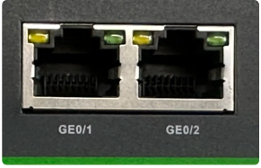
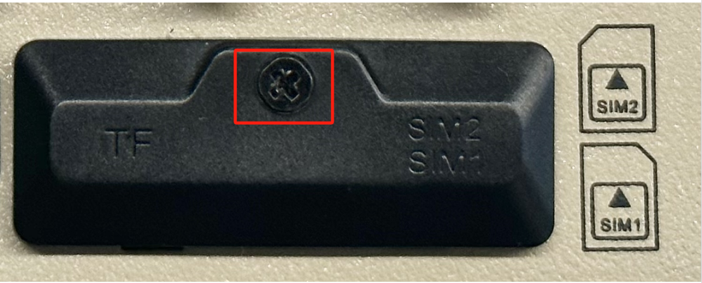
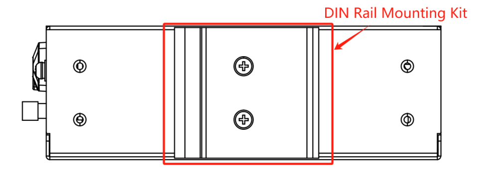
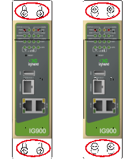
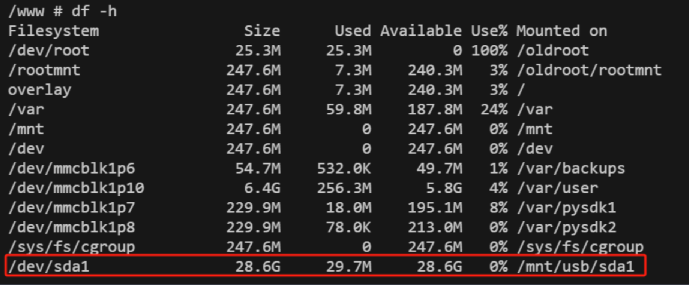
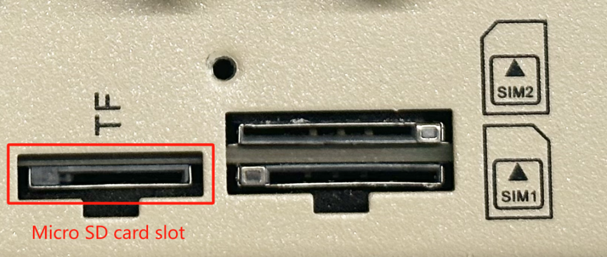
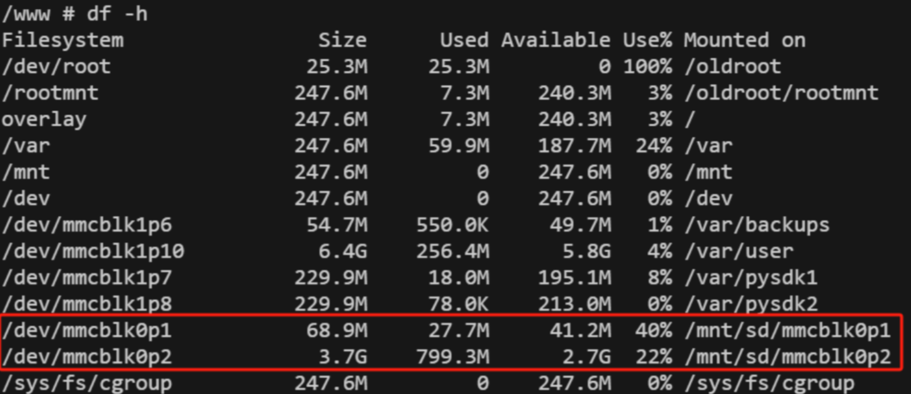

InGateway902 Quick Start Guide

> **You need to do first:** Unpack → Mount the device → Connect power and Ethernet → (If using cellular) **Power off** to install SIM and connect antennas → Power on → Set PC to same subnet → Open Web in browser.  
> **Then:** Scroll down to **Part 2** for packing list, indicator meanings, mounting details, pinouts, and more.

# Part 1: Quick Installation

## Must-Read Summary

| Item | Requirement |
|------|-------------|
| Power supply | **12–48 V DC**, terminals **V+ / V−** (or optional 12 V 2 A adapter); **PWR red solid** means powered on. |
| SIM / Micro SD | **Must power off** before installing or removing; **no hot-swap**. |
| Cellular / WLAN / GPS antennas | Tighten according to **housing silkscreen**; quantity varies by model (see datasheet Ordering Guide). |
| USB storage | Supports hot-swap; run `sync` and exit `/mnt/usb/sda_<num>` before disconnecting. |

## Step 1: Check the Front and Upper Panels

IG902 comes in models with or without IO interfaces. Take a moment to identify the Ethernet ports, antenna connectors, SIM slots, terminal blocks, and indicator area on your unit.

> Panel layout details and connector markings are in §2.2.

## Step 2: Mount the Device on a DIN Rail or Wall

1. Choose a mounting location with adequate space and ventilation.
2. For DIN rail: hook the upper part of the rail clip onto the rail, then rotate the lower end upward and snap it into place.
3. For wall mounting: attach the wall plate to the back of the device with screws, then fix the top screws to the wall and pull the device down to lock it in place.

> DIN rail and wall mounting details, including dismounting steps, are in §2.4.

## Step 3: Connect Power and Ethernet

1. Connect the 7-pin industrial terminal: wire **V+** and **V−** to your 12–48 V DC power source.
2. Plug one end of the network cable into either **GE0/1** or **GE0/2** on the IG902.

> RJ45 pin definitions are in §2.5.1; power/serial pinout is in §2.5.2.

## Step 4: Power Off to Install SIM and Attach Antennas

**Only perform this step if you are using cellular.**

1. **Make sure the device is powered off** — SIM cards do not support hot-swap.
2. Remove the protective casing and insert the SIM card into the drawer-type SIM slot.
3. Screw the required antennas into the SMA connectors according to the housing silkscreen (**GPS / WLAN / AUX / ANT**).

> Detailed SIM slot location and antenna marking table are in §2.5.5.

## Step 5: Power On and Check Indicators

Apply power. The **PWR** indicator should light up solid red, and the **STATUS** indicator should begin flashing green, indicating the device has booted successfully.

> Full indicator tables and signal strength meanings are in §2.3.

## Step 6: Log In via PC and Browser

1. Set your PC’s IP address to the same subnet as the IG902 port you are using.

| Port | Default IP |
|:----:|:----------:|
| GE0/1 | 192.168.1.1 |
| GE0/2 | 192.168.2.1 |

2. Open a browser and visit the corresponding default IP (e.g., `https://192.168.2.1` if connected to GE0/2).
3. Enter the initial login credentials:
   - **Username:** `adm`
   - **Password:** Check the nameplate on the device panel for the initial password.

> If you encounter certificate warnings, proceed to the login page. Detailed login steps and factory reset are in §2.7.

## Post-Installation Checklist

- ☐ Device is firmly mounted (DIN rail or wall).  
- ☐ Power and Ethernet cables are connected; if using cellular, SIM and antennas are in place.  
- ☐ **PWR is solid red** and **STATUS is flashing green**.  
- ☐ Browser opens the Web login page and login succeeds.

If the STATUS indicator does not flash green, verify the power supply voltage and polarity. If you need to restore factory settings, see §2.7.

---

# Part 2: Detailed Information

## 2.1 Packing List

### Standard Accessories

| No. | Name | Qty | Unit | Note |
|:---:|:-----|:---:|:----:|:-----|
| 1 | IG902 | 1 | pc | IG902 Edge Computing Gateway |
| 2 | GPS Antenna | - | pc | Quantity and type depend on actual model |
| 3 | WLAN Antenna | - | pc | Quantity and type depend on actual model |
| 4 | Cellular Antenna | - | pc | Quantity and type depend on actual model |
| 5 | Rail Mounting Accessories | 1 | set | For fixing devices to rails |
| 6 | Industrial Terminals | 1 | pc | 7-Pin Industrial Terminal |
| 7 | Network Cable | 1 | pc | 1.5 m network cable |
| 8 | Product Information | 1 | pc | QR code scanning to view quick start guide, user manual |
| 9 | Product Warranty Card | 1 | pc | Warranty period is 1 year |
| 10 | Certificate of Conformity | 1 | pc | IG902 Edge Computing Gateway Certificate of Compliance |

### Optional Accessories

| No. | Name | Qty | Unit | Note |
|:---:|:-----|:---:|:----:|:-----|
| 1 | Power Adapter | 1 | pc | 12 V 2 A Power Adapter |
| 2 | Wall Mounting Kit | 1 | set | The IG902 supports wall-mounting with backside lugs, and is shipped with the appropriate accessories for deployment scenarios where this mounting method is applicable |

## 2.2 Product Structure and Markings

InGateway902 (IG902) is a high-performance edge gateway for industrial IoT, which is powered by TI AM3352 industrial-grade processor with powerful performance. Compact size, rich interface, with convenient global cellular access. The IG902 supports secondary development using Python, and can be equipped with built-in InHand DeviceSupervisor™ Agent service, which supports hundreds of data collection protocols, making it easy to collect, process, and upload device data to the cloud, and also supports InHand DeviceLive cloud management, helping enterprises accelerate their digitalisation process.

### Front Panel

IG902 is divided into models with IO interface and without IO interface, and the front panel with IO interface is shown below:

### Upper Panel

## 2.3 Indicators and Reset Button

### 2.3.1 Operating Status Indicators

| PWR | STATUS | WARN | MODEM | ERR | Description |
|:---:|:------:|:----:|:-----:|:---:|-------------|
| **Power indicator (red)** | **Status indicator (green)** | **Alarm indicator (yellow)** | **MODEM indicator (green)** | **Error indicator (red)** | |
| On | Off | Off | Off | Off | Booting |
| On | Flash | Off | Off | Off | Boot up successfully |
| On | Flash | Off | Flash | Off | Dialling |
| On | Flash | Off | On | Off | Dialling successfully |
| On | Flash | Flash | Off | Flash | Reset successfully |

### 2.3.2 Function Indicators

| Marking | Name | Description |
|:-------:|:-----|:------------|
| SIM1 | SIM1 status indicator (green) | On — SIM1 function is on; Off — SIM1 function is off. **Note:** By default, the SIM1 indicator lights up during "Booting" and "Boot up successfully", and then the corresponding indicator lights up for the actual SIM card in use. |
| SIM2 | SIM2 status indicator (green) | On — SIM2 function on; Off — SIM2 function off |
| WLAN | WLAN status indicator (green) | On — WLAN function on; Flash — data transmission; Off — WLAN function off |
| GPS | GPS Status Indicator (green) | On — GPS positioning is successful; Flash — GPS function on; Off — GPS function off |
| TF | TF Status Indicator (green) | On — TF recognised; Off — TF not recognised |
| USER1 | User programmable indicator 1 (green) | Default off, user programmable control |
| USER2 | User programmable indicator 2 (green) | Default off, user programmable control |
| PYTHON | PYTHON indicator (green) | On — PYTHON function is normally switched on; Off — PYTHON function is switched off |

### 2.3.3 Signal Strength Indicators

| Signal 1 (green) | Signal 2 (green) | Signal 3 (green) | Description |
|:----------------:|:----------------:|:----------------:|:------------|
| Off | Off | Off | No signal detected |
| On | Off | Off | Signal condition 1–9 ASU (indicates a problem with the signal condition; please check whether the antenna is properly installed, whether the SIM card is correctly recognised, and whether the signal condition is good in the area) |
| On | On | Off | Signalling status 10–19 ASU (indicating that the signalling status is essentially normal and the equipment can be used normally) |
| On | On | On | Signalling status 20–31 ASU (indicating good signalling status) |

### 2.3.4 Reset Button

There is a reset button on the device for restoring the system to factory defaults. Its physical location is shown on the front and upper panel diagrams in §2.2. The detailed factory reset procedure is described in §2.7.

## 2.4 Mechanical Installation

### 2.4.1 DIN Rail Mounting

The mounting plate for the DIN rail is attached to the rear panel of the IG902 as shown below:

Installation steps are as follows:

1. Select the installation location of the equipment and ensure that there is enough space.
2. Snap the upper part of the DIN rail holder onto the DIN rail, and rotate the device at the lower end of the device with a little force upwards as shown in arrow 2 to snap the DIN rail holder onto the DIN rail, and confirm that the device is reliably mounted onto the DIN rail, as shown in the figure below:

### 2.4.2 DIN Rail Dismounting

The method of dismounting the IG902:

1. As shown by arrow 1 in the figure below, press down on the device to give clearance at the lower end of the device to disengage from the DIN rail.
2. Turn the device in the direction of arrow 2 and move the lower end of the device outwards at the same time. Lift the device upwards after the lower end is detached from the DIN rail to remove the device from the DIN rail.

### 2.4.3 Wall Mounting and Dismounting

The general procedure is: first attach the mounting kit to the device with screws, then fix the device to the wall or cabinet with screws. To remove, reverse the sequence.

#### Wall Mounting

1. Select the installation location of the equipment and ensure that there is enough space.
2. Use a screwdriver to mount the wall mounting plate on the back of the device as shown below:

3. Take out the screws (packed with the wall mounting plate), fix the screws in the mounting position with a screwdriver, and then pull down the device to make the device in a stable state, as shown in the following picture:

#### Wall Mounted Dismounting

To remove the IG902, hold the device with one hand and with the other hand remove the screws that hold the top end of the device in place to remove the device from its mounting position.

## 2.5 Connections and Cabling

### 2.5.1 Ethernet

The IG902 has 2 RJ45 Ethernet ports that support 10M/100M/1000M adaptive rates.

The RJ45 pins are described below:

| RJ45 Pin Number | 10M/100M | 1000M |
|:---------------:|:--------:|:-----:|
| 1 | TX+ | TRD(0)+ |
| 2 | TX- | TRD(0)- |
| 3 | RX+ | TRD(1)+ |
| 4 | - | TRD(2)+ |
| 5 | - | TRD(2)- |
| 6 | RX- | TRD(1)- |
| 7 | - | TRD(3)+ |
| 8 | - | TRD(3)- |

### 2.5.2 Power and Serial Ports

#### Power Supply

The IG902 supports **12–48 V DC** power supply. Plug the adapter terminal into the DC port of the IG902 and connect the power adapter. When the PWR power indicator lights up long it means the device has been powered up properly.

#### Serial Ports

IG902 supports 2 serial ports: one RS-232 serial port and one RS-485 serial port. The RS-232 Console interface is described in §2.5.2; the power and serial port use a 7-pin terminal, and the interface pins are described below.

| PIN Number | Name | Definition |
|:----------:|:----:|:-----------|
| 1 | V+ | Power Positive |
| 2 | V- | Power Negative |
| 3 | TXD | Serial RS232 send |
| 4 | RXD | Serial RS232 acceptance |
| 5 | GND | Serial RS232 signal ground |
| 6 | A | Serial RS485+ |
| 7 | B | Serial RS485- |

#### Console Interface (RS-232)

The IG902 comes with one RJ45 Console interface, which uses the RS-232 communication standard.

| RJ45 Pin Number | Name | Definition |
|:---------------:|:----:|:-----------|
| 1 | CTS | Clear To Send |
| 2 | DSR | Data Set Ready |
| 3 | RxD | Data Received |
| 4 | GND | Ground |
| 5 | GND | Ground |
| 6 | TxD | Data Transmitted |
| 7 | DTR | Data Terminal Ready |
| 8 | RTS | Request To Send |

### 2.5.3 Digital Inputs

| PIN Number | Name | Definition | Instruction |
|:----------:|:----:|:-----------|:------------|
| 1 | PCOM | Dry contact access terminal | Dry contact status "1": closed; Dry contact status "0": disconnected; Wet contact status "1": +10 ~ +30 V / -30 ~ -10 VDC; Wet contact status "0": 0 ~ +3 V / -3 ~ 0 V; Isolated 3000 VDC; Supports pulse counter function, up to 100 Hz pulse signal. |
| 2 | DGND | Dry contact grounding terminal | |
| 3 | DICOM | Input Common terminal | |
| 4 | DI0 | Digital/Pulse Input 0 Connector | |
| 5 | DI1 | Digital/Pulse Input 1 Connector | |
| 6 | DI2 | Digital/Pulse Input 2 Connector | |
| 7 | DI3 | Digital/Pulse Input 3 Connector | |
| 8 | NC | None | |

### 2.5.4 Digital Outputs

| PIN Number | Name | Definition | Instruction |
|:----------:|:----:|:-----------|:------------|
| 1 | DO0 | Digital/Pulse Output 0 Connector | Isolated 3000 VDC |
| 2 | DGND | Grounding terminal | |
| 3 | DO1 | Digital/Pulse Output 1 Connector | |
| 4 | DGND | Grounding terminal | |
| 5 | DO2 | Digital/Pulse Output 2 Connector | |
| 6 | DGND | Grounding terminal | |
| 7 | DO3 | Digital Output 3 Connector | |
| 8 | DGND | Grounding terminal | |

### 2.5.5 Cellular SIM and Antennas

#### SIM Card Slots

The IG902 is equipped with 2 drawer type SIM card slots for cellular communication, located on the upper panel. **The SIM card must be installed when the device is powered off.**

Installation procedure:

1. Make sure that the device has been disconnected from the power supply before installation.
2. Remove the protective casing before installation.
3. Insert the SIM card into the drawer SIM slot.

#### Antenna Interfaces

IG902 has 4 antenna interfaces, and different models are equipped with different numbers of antennas. The antenna support for specific models can be found in the "Ordering Guide" section of the IG902 Series Edge Gateway datasheet.

| Marking | Name |
|:-------:|:-----|
| GPS | GPS Antenna |
| WLAN | WLAN Antenna |
| AUX | AUX Antenna (Auxiliary Antenna) |
| ANT | ANT (Main Antenna) |

> **Note:** The original manual listed the WLAN antenna marking as "WAN Antenna"; the correct name corresponding to the **WLAN** silkscreen is **WLAN Antenna**.

The product model shown below is IG902-B-LQA8, which supports two antenna interfaces, AUX and ANT. Screw the required antenna into the corresponding SMA antenna connector to complete the antenna installation, as shown in the following figure:

### 2.5.6 USB and Micro SD

#### USB 2.0

The IG902 provides a USB 2.0 Host interface, which is mainly used for expanding storage devices. The IG902 supports hot swap of USB storage devices.

If a USB storage device has more than one partition, IG902 can automatically mount the first 9 partitions, and the rest need to be mounted manually. IG902 will mount all the USB storage device partitions to the `/mnt/usb` path, and the naming format of the mount folder is `sda_<num>`. Where `<num>` can be a number from 1 to 9. You can see the exact mount situation by executing the `df -h` command in the Linux background via developer mode.

**ATTENTION:**

Before disconnecting the USB mass storage device, remember to enter the `sync` command to prevent data loss. When you disconnect the storage device, exit from the `/mnt/usb/sda_<num>` directory. If you remain in `/mnt/usb/sda_<num>`, the automatic uninstall process will fail. If this happens, type `umount /mnt/usb/sda_<num>` to manually unmount the device!

#### Micro SD

The IG902 has a Micro SD card. **The SD card does not support hot plugging and needs to be operated when the power is off.**

To install a Micro SD card, remove the protective case and insert the Micro SD card into the IG902's SD card slot:

If a micro SD storage device has more than one partition, IG902 can automatically mount the first 9 partitions, and the rest need to be mounted manually. IG902 will mount all the micro SD storage device partitions to the `/mnt/sd` path, and the naming format of the mount folder is `mmcblk0p<num>`. Where `<num>` can be a number from 1 to 9. You can see the exact mounting situation by executing the `df -h` command in the Linux background through developer mode.

## 2.6 Power and Environmental Requirements

| Item | Specification |
|:-----|:-------------|
| Input Voltage | 12–48 VDC (dual pin terminals, V+, V−) |
| Operating Temperature | -25 ~ 70°C (-13 ~ 158°F) |
| Storage Temperature | -40 ~ 85°C (-40 ~ 185°F) |
| Environmental Humidity | 5 ~ 95% (without frost) |

## 2.7 First Login and Factory Reset

### Web Login

Use the following default IP address to connect to the IG902.

| Port | Default IP |
|:----:|:----------:|
| GE0/1 | 192.168.1.1 |
| GE0/2 | 192.168.2.1 |

**Step 1:** Interconnect the IG902 to the PC. Insert one end of the cable into any of the IG902's network ports, and the other end into the computer's network port, and set the computer's IP address to the same network segment address as the device interface.

**Step 2:** Network management and system management of IG902 via web. The IG902 supports WEB interface management based on IEOS, a set of network management and system management programmes developed by IEOS running on Linux system, which can provide web interface services. Take the network cable port plugged into GE0/2 as an example, the device login information is as follows:

- Login: `https://192.168.2.1`
- Initial login account: `adm`
- Initial login password: Check the nameplate on the device panel for the initial password information

### Factory Reset (RESET)

The reset button is located on the device (see §2.2). The procedure for restoring the factory device using hardware is as follows:

1. Press and hold the RESET button for 10 s after powering up the device.
2. When the ERR light turns red, release the RESET button.
3. After a few seconds when the ERR light goes out, press and hold the RESET button again without releasing it.
4. Release the RESET button when you see the ERR light blinking; wait for the ERR light to turn off, indicating that the factory settings have been restored successfully.

## 2.8 Related Documents

| Requirement | Destination |
|:------------|:------------|
| Product introduction, USB/SD details, configuration and troubleshooting | *IG902 User Manual* |
| Ordering information and antenna model details | *IG902 Series Edge Gateway Datasheet* |
| Software downloads and announcements | [www.inhand.com](http://www.inhand.com) |

## 2.9 Legal Information

### Copyright Notice

© 2024 InHand Networks All rights reserved.

### Trademarks

The InHand logo is a registered trademark of InHand Networks.

All other trademarks or registered trademarks in this manual belong to their respective manufacturers.

### Disclaimer

The company reserves the right to change this manual, and the products are subject to subsequent changes without prior notice. We shall not be responsible for any direct, indirect, intentional or unintentional damage or hidden trouble caused by improper installation or use.

The software described in this manual is according to the license agreement, can only be used in accordance with the terms of the agreement.
