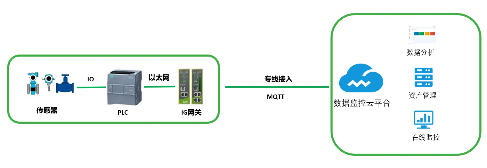

# Remote Intelligent Management System for Large-City Secondary Water Supply Facilities

## 1. Solution Overview

### 1.1 Project Background

A modern city with a population of 17 million, a special economic zone of China and a pioneer of the reform and opening-up, has set a goal. The municipal government proposed to take the lead in making tap water directly drinkable across the entire city, building an end-to-end drinking water safety assurance system from "source to tap", and further improving citizens' sense of gain, happiness, and security.

To achieve the goal of city-wide directly drinkable tap water, the municipal government and a municipal water group launched a large-scale high-quality drinking water household project and a secondary water supply facilities upgrading project, improving the "last mile" of water supply infrastructure, enhancing water supply quality and service quality, and continuously meeting the people's ever-growing needs for a better life.

In the upgrading and new construction of secondary water supply facilities, the water group proposed building an "intelligent management system" for secondary water supply facilities, adopting advanced IoT technology to achieve unified informatized and digital management of secondary water supply facilities, ensuring the water quality, water pressure, and supply safety of the secondary water supply. At the same time, the previous aging water supply approach could not effectively monitor the entire process, resulting in waste. The pump houses need to operate unattended with centralized device management, requiring remote monitoring of sensor status and real-time remote monitoring of the operating conditions of community secondary booster pump stations, with data uploaded to the cloud and simultaneously transmitted back to the water company's monitoring center.

The InHand Networks IG900 edge computing gateway delivers high performance and high reliability, providing greater security for network applications. The cloud platform offers low-cost, high-efficiency backend data storage technology, and a flexible, scalable, and upgradable architecture for performance and functions, enabling centralized network-access management of front-end connected devices.

### 1.2 Construction Objectives

- Implement automatic collection, transmission monitoring, early warning and alarming, remote control, storage backup, and statistical analysis of the operating data and video information of secondary water supply facilities
- Complete the operation and maintenance management of secondary water supply facilities
- Pump houses operate unattended with centralized device management
- Remotely monitor sensor status, and perform real-time remote monitoring of the operating conditions of community secondary booster pump stations
- Upload data to the cloud, while also being able to transmit it back to the water company's monitoring center remotely
- Upgrade the automation of pipeline network monitoring to improve pipeline network monitoring capability and reliability while reducing operating costs
- Comprehensively improve the digitalization and informatization level of secondary water supply facilities

### 1.3 Applicable Scenarios

- Monitoring and management of urban secondary water supply facilities
- Monitoring of community secondary booster pump stations
- Unattended pump house systems
- High-quality drinking water household projects
- "Last mile" monitoring of water supply infrastructure

## 2. Requirements Analysis

### 2.1 Device Status

- Device types: Siemens PLC controllers, variable frequency drives (VFDs), sensor instruments, pump units, water quality monitoring equipment, environmental sensors, etc.
- Communication interfaces: WAN port, LAN port, wired private network, 4G LTE
- Communication protocols: S7 communication protocol, MQTT protocol
- Deployment environment: community secondary water supply pump houses, unattended sites
- Quantity scale: thousands of secondary water supply facilities

### 2.2 Core Requirements

1. **Real-time data collection and parsing**:

   - Water quality information: residual chlorine, turbidity, pH value, etc.
   - Environmental information: temperature, humidity, ground water accumulation, etc.
   - Device information: current, voltage, electric energy, temperature, etc.
   - Water supply information: inlet/outlet water pressure, inlet/outlet water flow, water tank liquid level, etc.

2. **Remote control functions**:

   - Automatic water pressure control
   - Automatic switching of pump units
   - Automatic drainage of the sump
   - Automatic power-off protection against pump house flooding
   - Automatic identification of pressure and liquid level sensor faults

3. **Network access requirements**: support WAN port wired access and LAN interfaces

4. **Protocol support requirements**: support parsing of mainstream PLC protocols, adapting to various sewage treatment equipment

5. **Cloud platform access requirements**: support AWS cloud platform access

6. **Clock synchronization requirements**: support NTP clock synchronization

7. **Data storage requirements**: support local data storage, breakpoint resume of data, and support for expanded TF card

## 3. Overall Architecture Design

This solution uses Siemens PLCs as the control devices, the InHand Networks IG900 edge computing gateway as the communication device, and AWS as the base cloud platform. The IG900 accesses the cloud platform remotely via wired private network access. The IG900 connects to the on-site Siemens 1200 PLC controller, parses the S7 communication protocol, and collects PLC data, enabling local data storage and local query. It supports the MQTT protocol for communication with the cloud platform, with a data collection and transmission cycle of 10 seconds, enabling remote monitoring of on-site device information and remote control.

With a visualized user interface, the cloud platform information management system integrates functions such as video monitoring, device maintenance management, data analysis, and report statistics, performing full-lifecycle informatized management of the thousands of secondary water supply facilities connected to the system. It also optimizes the control mode of the secondary booster facilities based on the analysis results of various production data.

### 3.1 Four-Layer Architecture

1. **Perception layer**: Siemens PLC controllers, variable frequency drives (VFDs), sensor instruments, pump units, water quality monitoring equipment (residual chlorine, turbidity, pH value), environmental sensors (temperature, humidity, ground water accumulation), etc.
2. **Network layer**: InHand Networks IG900 edge computing gateway, supporting wired private network access and 4G LTE wireless network access
3. **Platform layer**: AWS base cloud platform and information management system, integrating video monitoring, device maintenance management, data analysis, and report statistics
4. **Application layer**: visualized user interface, water company monitoring center, full-lifecycle informatized device management, and data optimization analysis

### 3.2 Data Flow

On-site sensors/PLC → IG900 edge computing gateway (S7 protocol parsing, local storage, MQTT conversion) → AWS cloud platform → monitoring center / visualized interface / data analysis

Collection cycle: 10 seconds

## 4. Network and Access Solution

### 4.1 Networking Method Selection

Wired private network access is used as the primary method, with 4G LTE wireless as the backup access method. Leveraging globally deployed 4G wireless networks and a variety of broadband services, it provides uninterrupted Internet access available anywhere.

### 4.2 Edge Gateway Selection Key Points

**IG900 edge computing gateway features**:

- Supports WAN port and LAN interfaces, facilitating device access and commissioning
- Supports wired / 4G LTE wireless network access, providing high-speed network connections available anywhere for device cloud connectivity
- Supports parsing of mainstream PLC protocols (such as the S7 protocol), adapting to various devices
- Supports AWS cloud platform access
- Supports NTP clock synchronization
- Supports local data storage, with built-in FLASH 8GB eMMC, supports TF card expansion (up to 128G), and supports breakpoint resume
- Supports data collection from thousands of devices, meeting the data collection needs of different sites
- Certified by CE, FCC, PTCRB, CCC, Verizon Wireless, and AT&T
- Full industrial-grade design, providing a reliable, secure, and stable data transmission link for on-site unattended sites

## 5. Protocol and Data Collection Solution

### 5.1 Supported Protocols

- **Industrial protocols**: supports various industrial protocols such as S7, meeting the protocol requirements of secondary water supply pump house controllers
- **IoT protocol**: transmitted to the cloud platform via the MQTT protocol
- **Network protocols**: wired private network, 4G LTE
- **Clock protocol**: NTP clock synchronization

### 5.2 Northbound Protocol Support

- Supports the MQTT protocol for communication with the cloud platform
- Supports integration with various IoT cloud platforms as well as third-party data acquisition platforms such as local SCADA
- Supports customization of the application-layer communication protocol between the gateway and the cloud

## 6. Solution Highlights Summary

1. **Edge computing capability**: edge computing capability can be achieved through Python development to perform data analysis and processing. Customers can customize intelligent logical processing and perform local data preprocessing to reduce the load on the cloud. It supports flexible definition of edge data processing logic, providing real-time response, data computation, and data filtering at the edge, reducing pressure on the cloud

2. **Data reliability**: the edge computing gateway supports breakpoint resume, has built-in FLASH 8GB eMMC, and supports TF card expansion up to 128G

3. **Protocol compatibility**: the edge computing gateway supports various industrial protocols such as S7, meeting the protocol requirements of secondary water supply pump house controllers

4. **Cloud + edge solution**: the InHand Networks "cloud" + "edge" solution greatly shortens the commissioning cycle and reduces front-end deployment work

5. **Advanced transmission protocol**: the MQTT IoT protocol is used to transmit data to the cloud platform, which is more advantageous than traditional VPN

6. **International certifications**: certified by CE, FCC, PTCRB, CCC, Verizon Wireless, and AT&T

7. **Industrial-grade reliability**: full industrial-grade design, providing a reliable, secure, and stable data transmission link for on-site unattended sites

8. **Rich hardware interfaces**: provides rich hardware interfaces, including 8 channels of digital I/O

9. **Remote maintenance capability**: enables remote control and preventive maintenance of on-site devices

10. **Secondary development support**: simple and easy-to-use configuration, with multiple methods supporting secondary development
