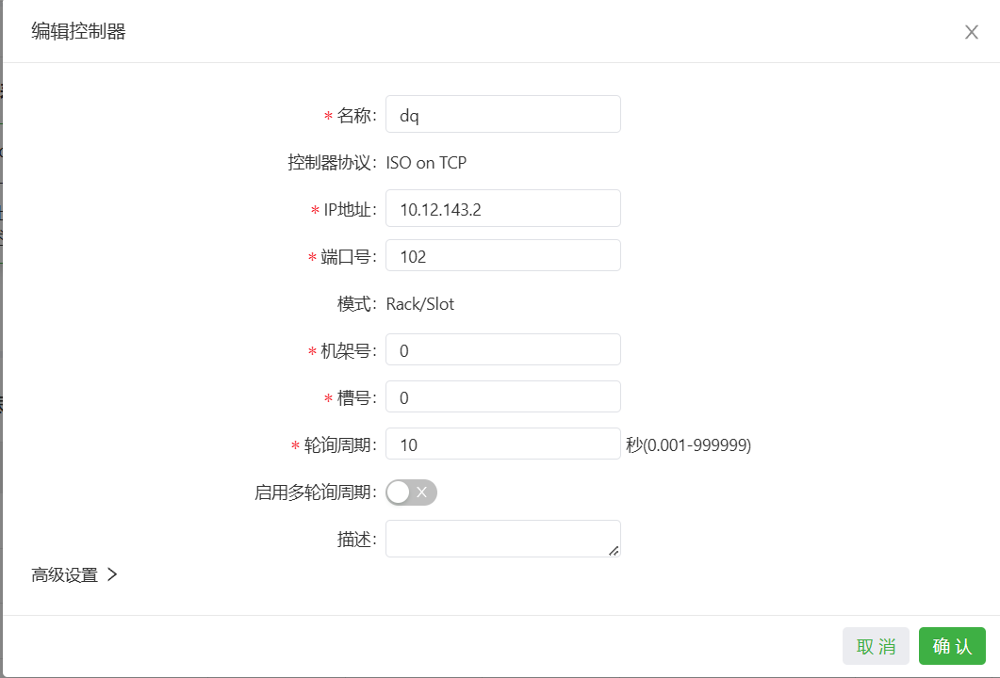
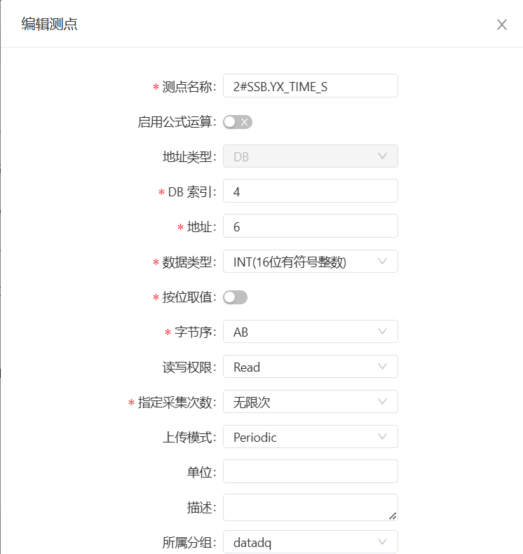
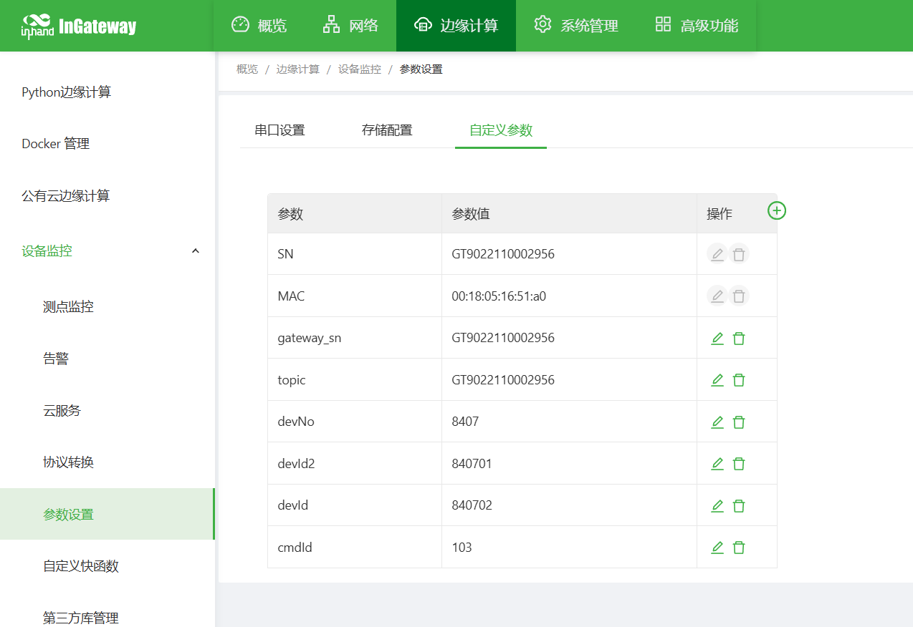

# Configuration Guide for the Remote Management System of Secondary Water Supply Facilities

## 1. Document Information

- Document name: IG902 Gateway Configuration Guide
- Product model: IG902
- Firmware version: V2.1.13
- **APP version: 2.6.1**
- Applicable scenarios: industrial data collection, device networking, edge collection to the cloud
- Date of preparation: March 25, 2026

## 2. Gateway Overview

### 2.1 Product Introduction

This data acquisition gateway is used for data collection from PLCs, instruments, sensors, variable frequency drives (VFDs), servos, and other devices in industrial sites. It supports multi-protocol parsing, edge computing, resumable transmission after network interruption, remote management, and data upload to the cloud.

### 2.2 Main Functions

- Network port collection
- Mainstream industrial protocol parsing
- MQTT data upload
- Edge computing, local caching
- Remote configuration, remote diagnosis, remote upgrade
- Wide-temperature industrial-grade design

### 2.3 Typical Application Topology

Device → Ethernet → data acquisition gateway → 4G / Ethernet → cloud platform

## 3. Hardware Description

### 3.1 Appearance and Interfaces

- Power interface: DC 12–48V
- Serial ports: RS232 ×1 + RS485 ×1 channel
- Network ports: LAN ×2 channels (or 1WAN + 1LAN, configurable)
- Wireless: 4G/5G/Wi-Fi (optional)
- Indicators: PWR, RUN, COM, NET, signal strength
- Reset button: restore factory settings

### 3.2 Wiring Instructions

### 3.2.1 Power Wiring

- Positive pole: V+
- Negative pole: V-
- Note: reverse-connection protection, lightning protection, grounding

### 3.2.2 RS485 Wiring

- A → 485+
- B → 485-
- Shield grounded at one end
- Termination resistor: 120Ω (required for long distances)

### 3.2.3 Ethernet Wiring

Straight-through / crossover auto-adaptive; Category 5e or higher network cable is recommended.

## 4. Factory Default Parameters

- Default IP: **192.168.2.1**
- Subnet mask: 255.255.255.0
- Web username: **adm**
- Web password: 123456
- Serial port default parameters: 9600,8,N,1

## 5. Preparations

- Set the computer to an IP in the same network segment as the gateway
- Connect the computer to the gateway's LAN port with a network cable
- Power on the gateway and wait for the RUN indicator to stay steadily lit
- Enter the gateway's IP in the browser to access the configuration page

## 6. Network Configuration

### 6.1 LAN Port Configuration (Static / DHCP)

- Go to [Network Settings] → [LAN]
- Select static IP / DHCP
- Set IP, subnet mask, gateway, DNS
- Save and apply

### 6.2 4G Wireless Network Configuration (Optional)

- Insert the SIM card
- Enable the mobile network
- APN: automatic / manual entry
- View signal strength
- Enable network backup (wired preferred, 4G backup)

## 7. Serial Port Configuration

### 7.1 Serial Port Parameter Settings

- Go to [Serial Port Configuration] → [COM1/COM2…]
- Mode selection: collection mode
- Baud rate: **9600**
- Data bits: 8
- Parity bit: None
- Stop bit: 1
- Flow control: None
- Save to take effect

## 8. Device and Protocol Configuration

### 8.1 Supported Protocol List

- Modbus RTU / TCP
- PLC protocols: Siemens, Mitsubishi, Omron, Schneider, Delta, Xinje, etc.
- Instrument protocols: DL/T645, CJ/T188, etc.
- Custom protocols

### 8.2 Adding a Collection Device

- Go to [Data Collection Configuration] → [Add Device]



### 8.3 Adding Collection Data Points

- Go to [Data Point Configuration] → [Add Data Point]


### 8.4 Data Point Table Import/Export


Supports Excel batch import and export backup.

## 9. Data Upload Configuration

### 9.1 MQTT Upload (Common Cloud Connection Method)

- Go to [Upload Configuration] → [MQTT]
- Enable MQTT
- Server address: 10.200.6.113:1883
- Client ID: GT9022110002956 (gateway SN)
- Username: wtblnet_sz
- Password: sas@SZ#kj_we3e




- Data format: JSON / custom.

```python
# Publish format
from collections import OrderedDict
import time
from common.Logger import logger
import json

def main(data_collect, wizard_api):
    global_argv = wizard_api.get_global_parameter()
    msg = OrderedDict()
    msg["cmdId"] = global_argv["cmdId"]
    msg["gatewaySn"] = global_argv["gateway_sn"]
    for device, value_dict in data_collect["values"].items():
        for name, value in value_dict.items():
            if "gq" == device and value["status"] == 1:
                msg["devId"] = global_argv["devId"]
                msg["devNo"] = global_argv["devNo"]
                msg["Time"] = time.strftime("%Y-%m-%d %H:%M:%S", time.localtime(data_collect["timestamp"]))
                msg[name] = value["raw_data"]
            if "zq" == device and value["status"] == 1:
                msg["devId"] = global_argv["devId1"]
                msg["devNo"] = global_argv["devNo"]
                msg["Time"] = time.strftime("%Y-%m-%d %H:%M:%S", time.localtime(data_collect["timestamp"]))
                msg[name] = value["raw_data"]
            if "dq" == device and value["status"] == 1:
                msg["devId"] = global_argv["devId2"]
                msg["devNo"] = global_argv["devNo"]
                msg["Time"] = time.strftime("%Y-%m-%d %H:%M:%S", time.localtime(data_collect["timestamp"]))
                msg[name] = value["raw_data"]
            msg[name] = value["raw_data"]
            if "cgq" == device and value["status"] == 1:
                msg["devId"] = global_argv["devId3"]
                msg["devNo"] = global_argv["devNo"]
                msg["Time"] = time.strftime("%Y-%m-%d %H:%M:%S", time.localtime(data_collect["timestamp"]))
                msg[name] = value["raw_data"]
            msg[name] = value["raw_data"]
    res = json.dumps(msg).replace(": ", ":").replace(", ", ",")
    logger.info(res)
return res
Subscribe format:
from common.Logger import logger
from quickfaas.remotebus import publish
import json
import time
from collections import OrderedDict
from quickfaas.measure import recall2
from quickfaas.measure import write_plc_values
from quickfaas.global_dict import get_global_parameter

def main(topic, payload, wizard_api): # Define the main subscription function
    logger.info(topic) # Print the subscribed topic, assuming the topic is request/v1
    logger.info(payload) # Print the subscribed data
    global_parameter = get_global_parameter()
    payload = json.loads(payload) # Deserialize the subscribed data

    if payload["cmdId"] == 87:
        data_dict = {payload["varId"]: eval(payload["writeValue"])}
        logger.info(data_dict)
        write_plc_values(data_dict)
        userdata = ["/sys/"+global_parameter["topic"]+"/up",data_dict]
        write_plc_values(data_dict, callback = write_ack, userdata = userdata, timeout = 60) # Call the send_message_to_partner method to deliver the data in the message dictionary to the specified variable; call the ack method and send ack_tail to the ack method
    elif payload["cmdId"] == 85:
        acl_tail = None 
        if "devId" in payload:
            ack_tail = str(payload["devId"])
        recall2(callback = read_ack, userdata = ack_tail, timeout = 10)

def write_ack(send_result, ack_tail): # Define the ack method
    global_parameter = get_global_parameter()
    sn = global_parameter["gateway_sn"]
    if not send_result and isinstance(send_result, tuple): # Check whether the delivery timed out
        resp_data = {"cmdId":88, "gwSn":sn, "flag":1, "msg": "failed"} # Define the response data for delivery timeout
    else:
        resp_data = {"cmdId":88, "gwSn":sn, "flag":1, "msg": "success"} # Define the response data for delivery without timeout
    resp_data = json.dumps(resp_data).replace(": ", ":").replace(", ", ",")
    logger.info(resp_data)
    publish("/sys/"+global_parameter["topic"]+"/up", resp_data, 1) # Call mqtt_publish to send the response data to the MQTT server

def read_ack(read_result, ack_tail): # Define the ack method
    global_argv = get_global_parameter()
    global_parameter = get_global_parameter()
    sn = global_parameter["gateway_sn"]
    logger.info(ack_tail)
    logger.info(global_parameter["devId"])
    logger.info(read_result)
    if not read_result and isinstance(read_result, tuple): # Check whether the delivery timed out
        pass
        #resp_data = {"cmdId":88, "gwSn":sn, "flag":1, "msg": "failed"} # Define the response data for delivery timeout
    else:
        resp_data = OrderedDict()
        resp_data["varList"] = []
        resp_data["devId"] = ack_tail
        resp_data["cmdId"] = 86
        resp_data["gatewaySn"] = global_argv["gateway_sn"]
        resp_data["flag"] = 1
        resp_data["msg"] = "success"
        read_time = time.strftime("%Y-%m-%d %H:%M:%S", time.localtime(read_result["timestamp"]))
        #if ack_tail:
        for device, value_dict in read_result["values"].items():
            if int(ack_tail) == int(global_parameter["devId"]) and "gq" == device:
                for name, value in value_dict.items():
                    dvar = {"varName": name, "varValue": value["raw_data"], "readTime": read_time, "varId": name, "isWarn": 0}
                    resp_data["varList"].append(dvar)
                break
            elif int(ack_tail) == int(global_parameter["devId1"]) and "zq" == device:
                for name, value in value_dict.items():
                    dvar = {"varName": name, "varValue": value["raw_data"], "readTime": read_time, "varId": name, "isWarn": 0}
                    resp_data["varList"].append(dvar)
                break
            elif int(ack_tail) == int(global_parameter["devId2"]) and "dq" == device:
                for name, value in value_dict.items():
                    dvar = {"varName": name, "varValue": value["raw_data"], "readTime": read_time, "varId": name, "isWarn": 0}
                    resp_data["varList"].append(dvar)
            elif int(ack_tail) == int(global_parameter["devId3"]) and "cgq" == device:
                for name, value in value_dict.items():
                    dvar = {"varName": name, "varValue": value["raw_data"], "readTime": read_time, "varId": name, "isWarn": 0}
                    resp_data["varList"].append(dvar)
                break
        #else:
            #for device, value_dict in read_result["values"].items():
                #for name, value in value_dict.items():
                    #dvar = {"varName": name, "varValue": value["raw_data"], "readTime": read_time, "varId": name, "isWarn": 0}
                    #resp_data["varList"].append(dvar)
    resp_data = json.dumps(resp_data).replace(": ", ":").replace(", ", ",")
    logger.info(resp_data)
    publish("/sys/"+global_parameter["topic"]+"/up", resp_data, 1)
```

Test connection → Save

### 9.2 Configuration Backup and Recovery

- Export the configuration file

## 10. Status Monitoring and Diagnosis

### 10.1 Running Status

- Device online status
- Real-time values of collection data points
- Serial port transmit/receive packet statistics
- Network traffic, signal strength
- CPU, memory, temperature

### 10.2 Log Viewing

- System logs
- Collection logs
- Upload logs
- Alarm logs

## 11. Common Issues and Troubleshooting

- Unable to open the Web
  - Check whether the network segment, network cable, and IP conflict
  - Reset the gateway and retry
- Device online but no data
  - Check the data point address and data type
  - View the collection logs
  - Check whether the device supports the protocol
- MQTT connection failure
  - Whether the network is reachable
  - Server address, port, username, password
  - Whether the firewall / port is open

## 12. Safety Precautions

- Reliable grounding at the industrial site
- Avoid hot-plugging serial ports while powered
- Back up after configuration is complete
- Change the remote password regularly
- Unauthorized personnel are prohibited from operating

## 13. Appendix

### 13.1 Glossary

- RTU, TCP, MQTT, edge computing, data point, register, station number, collection interval
