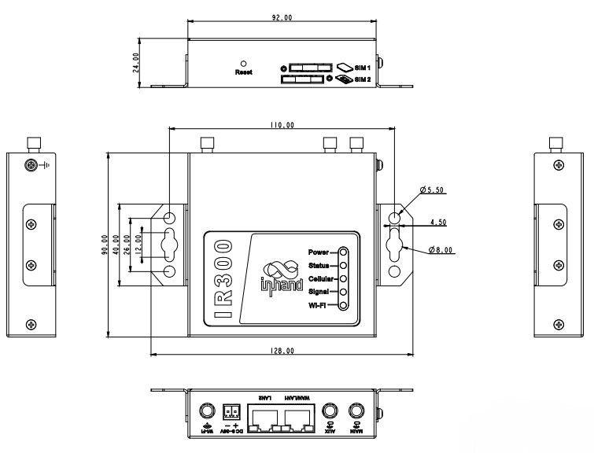

<div style="width: 100%;height: 100%;background: url(images/product_new.jpg); background-size: 100% 100%;">

  <div style="height:75%;">
    <div style="width:35%; padding: 40px 40px">
      
    </div>
    <div style="font-size: 28px; font-weight: bold; color:#000;text-align: center; margin-bottom: 60px;">
      Compact Industrial Cellular Router for IoT
    </div>
  </div>
  <div style="padding-left: 40px;">
    <div style="font-size: 40px; font-weight: bold; color:#000;margin-bottom: 30px;">
      IR302 Series
    </div>
    <div style="text-align: center;">
      <div style="display: flex; flex-wrap: wrap; gap: 16px; ">
        <div style="width: 200px;background-color: #4CAF50; color: white; padding: 8px 8px; border-radius: 6px; font-size: 18px;">Industrial-Grade</div>
        <div style="width: 200px;background-color: rgb(76, 175, 80); color: white; padding: 8px 8px; border-radius: 6px; font-size: 18px;">4G LTE / Wi-Fi</div>
      </div>
      <div style="display: flex; flex-wrap: wrap; gap: 16px;margin-top:16px">
        <div style="width: 200px;background-color: #4CAF50; color: white; padding: 8px 8px; border-radius: 6px; font-size: 18px;">VPN Security</div>
        <div style="width: 200px;background-color: #4CAF50; color: white; padding: 8px 8px; border-radius: 6px; font-size: 18px; ">Smart O&M</div>
      </div>
    </div>
  </div>
</div>

<div style="page-break-after: always; break-before: page;"></div>


# <span style="color: green;">1. Product Overview</span>

The IR302 is a compact industrial cellular router launched by Beijing InHand Networks Technology Co., Ltd., designed specifically for Internet of Things (IoT) and industrial automation scenarios. Built on a high-performance industrial-grade processor, it integrates 4G LTE cellular network, Ethernet, Wi-Fi, and rich industrial interfaces to provide stable and secure network connectivity in harsh environments.

The IR302 adopts a fanless cooling design, supports wide temperature and wide voltage operation, and features comprehensive link backup, VPN encryption, firewall, and remote management functions to meet the stringent requirements of industries such as power, transportation, environmental protection, and smart manufacturing for device networking.


# <span style="color: green;">2. Key Features</span>

## <span style="color: green;">2.1 Industrial-Grade Reliability</span>
- **Wide Temperature Design**: Operating temperature range of Normal:-35℃to70℃，Extended:-40℃ to 75℃
- **Wide Voltage Power Supply**: Supports 9~36V DC input, compatible with 12V DC adapters, with reverse polarity protection and surge protection
- **Fanless Design**: Full metal enclosure with natural convection cooling, no moving parts, significantly improved MTBF
- **Electromagnetic Compatibility**: Passes industrial-grade EMC testing, adaptable to strong electromagnetic interference environments

## <span style="color: green;">2.2 Full-Scene Network Access</span>
- **4G LTE**: Built-in Quectel EC25-AF(D) industrial-grade module, supports full network coverage and overseas frequency bands
- **Wi-Fi**: Supports 802.11 b/g/n, can function as both AP and STA simultaneously, meeting on-site wireless coverage and bridging requirements
- **Ethernet**: 1 x 100 Mbps WAN/LAN switchable port + 1 x 100 Mbps LAN port, supports dual-port isolation and link backup
- **Link Backup**: Intelligent switching among cellular/wired/Wi-Fi multi-link connections to ensure business continuity
- **Dual SIM Redundancy**: Supports dual SIM card network backup, ICCID binding, and signal threshold automatic switching

## <span style="color: green;">2.3 Enterprise-Grade Security and VPN</span>
- **VPN Protocols**: IPSec (IKEv1/v2), GRE, L2TP, PPTP, OpenVPN, WireGuard, ZeroTier
- **Advanced Encryption**: Supports AES256 / SHA512 / ECP521 (DH21) and other military-grade encryption algorithms
- **Firewall**: Access control, port forwarding (50 rules), virtual IP mapping, DMZ, MAC-IP binding (20 rules), NAT, content filtering, SIP ALG
- **Wi-Fi Security**: 802.1X authentication, Portal authentication (captive portal), AP whitelist/blacklist / MAC filtering, Wi-Fi client isolation, Wi-Fi password encrypted storage
- **Access Security**: User login failure lockout (automatic account/IP lockout after consecutive failures), PAM authentication parameter configuration
- **Secure Boot**: SPI Flash version rollback restriction mechanism to prevent downgrade to incompatible versions that could brick the device

## <span style="color: green;">2.4 Intelligent Operations and Maintenance Management</span>
- **Remote Management Platform**: Supports Device Manager (DM) batch management and InConnect Service (ICS) cloud management platform
- **DTU Function**: Supports serial RS232/RS485 and Ethernet DTU modes for transparent data transmission
- **SNMP/Trap**: Standard SNMP v1/v2c/v3 and Trap alarms, compatible with mainstream network management systems
- **WebUI/CLI**: Graphical Chinese interface + complete command line (show/ping/telnet/traceroute/reboot/arping, etc.)
- **SSH Client**: Device can act as SSH client to connect to remote servers
- **HTTP API**: Provides HTTP and HTTPS protocol management interfaces, supporting remote configuration and status queries
- **Network Diagnostics**: Built-in network packet capture (tcpdump), export system operating status, Wake-on-LAN remote wake-up


## <span style="color: green;">2.5 Key Technical Specifications</span>

| Specification | Details |
|---|---|
| Cellular | 4G LTE Cat.4/Cat.1/3G/2G, multi-band coverage, dual-SIM redundancy, ICCID binding and RSRP threshold auto-switching |
| Wi-Fi | IEEE 802.11 b/g/n, 2.4 GHz, AP/STA/AP+STA mixed mode, up to 32 clients |
| VPN | IPSec (IKEv1/v2), GRE, L2TP, PPTP, OpenVPN, WireGuard, ZeroTier |
| Security | Firewall, ACL access contro/l, MAC-IP binding (200 entries), content filtering, SIP ALG, attack protection |
| Cloud Management | Device Manager (DM) batch configuration and firmware upgrade; InConnect Service (ICS) cloud management |
| Remote Management | SNMP v1/v2c/v3, WebUI, CLI, SSH Client, HTTP/HTTPS API |
| Processor | 580MHz industrial-grade embedded processor, 128 MB DDR, 32 MB SPI Flash |
| Ethernet | 1× 10/100 Mbps WAN/LAN switchable + 1× 10/100 Mbps LAN |
| Serial Interface | 1× RS232/RS485 combo terminal, DTU transparent transmission (TCP Server/Client/UDP/MQTT) |
| Power Supply | 9&#126;36V DC wide voltage input, typical power consumption 2~5W, peak &lt; 10W, reverse polarity protection |
| Dimensions | Approx. 100 mm × 30 mm × 100 mm (L × W × H, excluding mounting ears and antennas) |
| Operating Temperature / Protection | Normal:-35℃ to 70℃，Extended:-40℃ to 75℃, IP30, full metal fanless natural convection cooling |

# <span style="color: green;">3. Typical Application Scenarios</span>

## <span style="color: green;">3.1 Smart Grid</span>
- Remote communication for distribution automation terminals (FTU/DTU)
- Charging pile data collection and remote billing
- State Grid encrypted data transmission (supports national cryptographic algorithm module expansion)

## <span style="color: green;">3.2 Smart Transportation</span>
- Intelligent traffic signal controller networking
- On-board video monitoring backhaul
- ETC gantry system backup link

## <span style="color: green;">3.3 Industrial Automation</span>
- PLC/SCADA system remote maintenance
- Industrial equipment condition monitoring (Smart-EMS)
- AGV/RGV wireless roaming control

## <span style="color: green;">3.4 Smart City and Environmental Monitoring</span>
- Environmental water quality/air station data backhaul
- Smart streetlight centralized control
- Self-service terminal (Smart ATM) networking

## <span style="color: green;">3.5 New Energy</span>
- Distributed photovoltaic power station remote monitoring
- Energy storage system BMS data upload to cloud
- Wind farm box transformer measurement and control communication


# <span style="color: green;">4. Product Innovations</span>

## <span style="color: green;">4.1 Dual SIM Intelligent Redundancy and Cellular Refined Operations</span>

- **ICCID Binding + Multi-Dimensional SIM Switching Strategy**: Supports signal strength (RSRP) threshold switching, packet loss rate triggered switching, and maximum dial attempt limit, achieving truly intelligent dual-SIM network backup, eliminating simple polling-based SIM switching
- **Cellular Signal Parameters Real-Time Cloud Upload**: Key RF metrics such as RSRP, RSRQ, SINR, PCI, and BAND are reported in real-time through the DM platform, allowing remote monitoring of on-site network quality without dispatching engineers
- **IMS Parameter Configuration**: Supports VoLTE private network IMS configuration to meet operator private network voice convergence communication requirements

## <span style="color: green;">4.2 Power Industry End-to-End Security Solution</span>

- **State Grid Encryption Hardware Module**: Optional -SEC model includes built-in national cryptographic algorithm chip, supports IEC101/IEC104 power protocols, meeting State Grid access requirements for distribution automation terminals (FTU/DTU)
- **Firmware Signature Verification + Version Rollback Restriction**: System firmware includes digital signature to prevent tampering; before upgrade, firmware-hardware compatibility admission verification is performed through image header model identification matching + integrity/signature verification + version compatibility (anti-downgrade) constraint, with mismatches rejected. Combined with A/B redundant partitions and automatic rollback on failure to prevent bricking from incorrect firmware flashing

## <span style="color: green;">4.3 Military-Grade VPN Encryption Upgrade</span>

- IPSec VPN supports **AES256 / SHA512 / ECP521 (DH21)** advanced encryption suites, meeting Grade Protection 2.0 and power/military industry compliance requirements
- Provides pre-quantum computing era security assurance for cross-border data channels and sensitive business

## <span style="color: green;">4.4 Box-Free Intelligent Operations and Maintenance Toolkit</span>

- **WebUI Built-in Network Packet Capture (tcpdump)**: No need to carry laptops and packet capture tools; capture and download network packets directly in the browser, significantly improving on-site troubleshooting efficiency
- **One-Click System Operating Status Export**: Complete export of device configuration, logs, and diagnostic information enables precise remote technical support issue identification
- **Wake-on-LAN + HTTP API**: Supports remote wake-up of downstream devices in the LAN; HTTP and HTTPS protocol management interfaces enable automated integration with upper-level operations platforms
- **SSH Client**: Device can actively initiate outbound SSH client connections to remote servers, bypassing NAT restrictions

## <span style="color: green;">4.5 DTU Offline Data Resumption</span>

- **TCP Server Channel Expansion**: Virtual serial port function supports up to 32 concurrent channels, meeting multi-device simultaneous access scenarios

## <span style="color: green;">4.6 Compact High-Reliability Industrial Design</span>

- Compared to the IR615 in the same series, the IR302 is more compact, adopting a **1x1 Wi-Fi antenna solution** to achieve balance between cost and performance. It still provides stable throughput of 31 Mbps within 10 meters, meeting the vast majority of industrial inspection and SCADA data interaction requirements


<div style="page-break-after: always;"></div>


# <span style="color: green;">5. Hardware Specifications</span>

| Item | Specification |
|------|---------------|
| **Processor** | 580MHz industrial-grade embedded processor |
| **Hardware Version** | IR302_P_MB_V12 |
| **Memory** | 128 MB DDR |
| **Storage** | 32 MB SPI Flash |
| **Bootloader** | 1.1.3.r4956 |
| **4G Module** | Depends on model configuration, covering Quectel, Fibocom, MeiG and other mainstream industrial modules (see Ordering Information for details) |
| **Ethernet Interfaces** | 1 x 10/100 Mbps WAN/LAN switchable port<br>1 x 10/100 Mbps LAN port |
| **Serial Port** | 1 x RS232 / RS485 combo terminal (supports DTU transparent transmission) |
| **SIM Card Slots** | 2 x dual SIM card slots (drawer type / Nano-SIM, supports dual-SIM network backup) |
| **Antenna Interfaces** | 2 x 4G main/diversity antennas (SMA female)<br>1 x Wi-Fi antenna (SMA female, FQ38-WLAN configuration) |
| **Power Interface** | 2-pin industrial terminal (9~36V DC)<br>Optional 12V DC adapter |
| **Power Consumption** | Typical 2~5W, peak &lt;10W |
| **LED Indicators** | Power (red), Status (green), Cellular (yellow)<br>Signal (red/yellow/green), Wi-Fi (green) |
| **Reset Button** | Supports hardware factory reset |
| **Enclosure Material** | Full metal enclosure, IP30 protection rating |
| **Mounting** | DIN rail mounting / Wall mounting |
| **Product Dimensions** | Approx. 100 mm x 30 mm x 100 mm (L x W x H, excluding mounting ears and antennas) |
| **Total Weight** | Approx. 250g |


<div style="page-break-after: always;"></div>


## <span style="color: green;">5.1 Product Size</span>



**Notes:**
1. All dimensions are in millimeters (mm).
2. Dimensions (L × W × H): 92 × 90 × 24 mm.
3. All dimensions are approximate values and for reference only.

# <span style="color: green;">6. Network Connectivity</span>

## <span style="color: green;">6.1 Cellular Network</span>
- **Standard Support**: Depends on selected cellular module, covering 4G LTE Cat.4 (DL 150 Mbps / UL 50 Mbps), 4G LTE Cat.1, 3G WCDMA, 2G GSM/EDGE, etc.
- **Frequency Bands**: Varies by module, see [8.1 Ordering Information Model Naming Convention](#81-model-naming-convention)
- **Dual SIM Management**: Supports dual SIM card network backup, ICCID binding, signal strength threshold (RSRP) automatic switching, packet loss rate triggered switching, maximum dial attempt limit, minimum connection time control
- **SIM Functions**: Supports operator private network APN, PIN code lock, traffic statistics
- **IMS Configuration**: Supports cellular dial IMS parameter configuration
- **SMS**: SMS remote reboot/dial control, custom commands, access whitelist/blacklist

## <span style="color: green;">6.2 Wi-Fi Wireless LAN</span>
- **Standard**: IEEE 802.11 b/g/n, 2.4 GHz band
- **Antenna Configuration**: 1x1 single antenna, theoretical peak 72 Mbps
- **Operating Modes**: AP mode (default), STA station mode, AP+STA mixed mode
- **Access Control**: AP whitelist/blacklist / MAC filtering, Wi-Fi client isolation (inter-client isolation)
- **AP Capacity**: Supports up to 32 STAs simultaneously
- **Actual Performance** (typical test environment):

| Distance | Negotiated Rate | Throughput (LAN→WLAN Typical) |
|----------|-----------------|-------------------------------|
| 1 m | 72 Mbps | 54 Mbps |
| 5 m | 72 Mbps | 41 Mbps |
| 10 m | 72 Mbps | 31 Mbps |
| 30 m | 72 Mbps | 14 Mbps (depending on obstacles) |

- **Multi-Client Access Capability** (suction cup rod antenna, typical values):

| Number of Clients | LAN→WLAN | WLAN→LAN |
|-------------------|----------|----------|
| 1 | ~29.7 Mbps | ~20.8 Mbps |
| 5 | ~20.8 Mbps | ~13.3 Mbps |
| 10 | ~19.9 Mbps | ~12.1 Mbps |
| 15 | ~16.5 Mbps | ~2.7 Mbps |

> **Note**: Wi-Fi performance is affected by environmental interference, obstacles, and terminal capabilities. The above data represents typical laboratory values for reference only.

## <span style="color: green;">6.3 Wired Ethernet</span>
- **Interface Rate**: 10/100 Mbps auto-negotiation
- **Operating Mode**: WAN/LAN software switchable
- **Protocol Support**: PPPoE, DHCP Client, Static IP

## <span style="color: green;">6.4 Link Backup and Redundancy</span>
- **Backup Strategy**: 4G ↔ wired WAN ↔ Wi-Fi STA intelligent switching
- **Detection Mechanism**: Link keepalive detection (ICMP), fast switching
- **VRRP**: Supports Virtual Router Redundancy Protocol, dual-device hot standby
- **Load Balancing**: Multi-WAN traffic sharing (optional policy)


# <span style="color: green;">7. Software Functional Specifications</span>

## <span style="color: green;">7.1 Network Services</span>

| Function Module | Details |
|-----------------|---------|
| **DHCP Server** | Supports DHCP server/relay, expert options (dhcp-option) customization, supports Option 43/60/82 and other extensions |
| **DNS** | DNS forwarding, domain name service, custom DNS servers |
| **DDNS** | Supports PeanutShell, DynDNS, No-IP and other mainstream dynamic DNS providers |
| **NTP** | Network time synchronization, supports custom NTP servers and calibration cycles |
| **Static Routing** | Supports multiple static routes and policy routes, supports route priority configuration |
| **NAT** | SNAT/DNAT, NAPT, port forwarding (100 rules), virtual IP mapping, DMZ |
| **TCP Checksum** | Supports TCP checksum option configuration |
| **Dual SIM Management** | Dual-SIM network backup, ICCID binding, signal threshold (RSRP) automatic switching, packet loss rate triggered switching, maximum dial attempt limit, minimum connection time control |
| **SMS Management** | SMS remote reboot/dial control, custom commands, access whitelist |

## <span style="color: green;">7.2 VPN Tunnels</span>

| VPN Type | Support Details |
|----------|-----------------|
| **IPSec** | IKEv1 / IKEv2, supports pre-shared key/certificate authentication, encryption algorithms include AES128/192/256, 3DES, DES; hash algorithms include MD5, SHA1, SHA256, SHA384, SHA512; DH groups include Group1/2/5/14/15/16/17/18/19/20/21 (ECP521); supports AES256+SHA512+ECP521 combination |
| **GRE** | Standard GRE tunnel, supports over IPSec |
| **L2TP** | L2TP over IPSec, supports MS-CHAPv2 authentication |
| **PPTP** | PPTP client/server |
| **OpenVPN** | Supports TUN/TAP mode, UDP/TCP transport, TLS/SSL encryption |
| **WireGuard** | Next-generation high-performance VPN protocol, simple configuration, high encryption strength |
| **ZeroTier** | Supports SD-WAN virtual networking, quickly build global private LAN |

## <span style="color: green;">7.3 Firewall and Security</span>

- **Access Control**: IP, port, protocol, and time-period based ACL rules; supports login failure lockout (automatic account/IP lockout after consecutive failures)
- **MAC-IP Binding**: Supports 200 binding entries to prevent ARP spoofing
- **Content Filtering**: URL keyword filtering, MAC address whitelist/blacklist
- **Application Layer Gateway**: SIP ALG (VoIP audio/video transmission support)
- **Attack Protection**: Ping of Death protection, SYN Flood protection

## <span style="color: green;">7.4 Industrial Communication and DTU</span>

| Function | Description |
|----------|-------------|
| **Serial DTU** | RS232/RS485 transparent transmission, supports TCP Server/Client, UDP, MQTT modes, supports multi-center reporting |
| **Ethernet DTU** | Supports transparent transmission of Ethernet port data to remote TCP/UDP servers |
| **Protocol Conversion** | Supports Modbus RTU/TCP protocol conversion (optional) |
| **State Grid Encryption** | Supports national cryptographic algorithm module (optional, model suffix -SEC), supports IEC101/IEC104 power protocols |

## <span style="color: green;">7.5 Bandwidth and Traffic Management</span>

- **IP Rate Limiting**: Uplink/downlink bandwidth rate limiting based on IP address
- **Traffic Statistics**: Interface-level traffic statistics, supports traffic alarm thresholds

### <span style="color: green;">7.5.1 Scheduled Tasks</span>

- **Scheduled Reboot**: Supports daily/advanced rule scheduled device reboot
- **Cellular Scheduled Redial**: Supports planned triggering of cellular interface redial

## <span style="color: green;">7.6 Remote Management</span>

| Platform/Protocol | Function |
|-------------------|----------|
| **Device Manager (DM)** | InHand device management platform, supports batch configuration delivery, firmware upgrades, status monitoring, alarm management |
| **InConnect Service (ICS)** | Cloud management platform, supports OpenVPN cloud configuration delivery and unified management |
| **SNMP** | v1/v2c/v3, supports standard MIB-II and private MIBs, supports Trap alarms; supports custom SNMP ports; extended OIDs can query dial IP, operator, SIM phone number, ICCID, BAND, etc. |
| **WebUI** | Responsive Chinese web management, supports wireless client parameter display, network packet capture (tcpdump), export system operating status |
| **CLI** | Complete command line: show version/system/clock/modem/log/users/interface/ip/route/arp, ping, telnet, traceroute, reboot, arping, etc. |
| **SSH** | Secure remote command line access; device can act as SSH client to connect to remote servers |
| **HTTP API** | HTTP and HTTPS protocol management interfaces, supports remote configuration and status queries |

## <span style="color: green;">7.7 Industry Application Functions</span>

- **Smart ATM**: Self-service terminal device status monitoring and remote management (standard)
- **Status Report**: Device status scheduled reporting to platform, supports alarm message reporting (standard)
- **Smart-EMS**: Energy management system data interface (optional)
- **State Grid Encryption**: Supports national cryptographic algorithm module and IEC101/IEC104 power protocols (optional, model suffix -SEC)


# <span style="color: green;">8. Ordering Information</span>

## <span style="color: green;">8.1 Model Naming Convention</span>

```
IR302 - [4G Module] - [Wi-Fi] - [Other Options]
```

| Field | Code | Description |
|-------|------|-------------|
| 4G Module | LQ28 | China, LTE CAT4<br>FDD: B1/B3/B5/B8<br>TDD: B34/B38/B39/B40/B41<br>WCDMA: B1/B8<br>TD-SCDMA: B34/B39<br>EVDO/CDMA: BC0<br>GSM: B3/B8 |
| | FQ58 | Europe/APAC/Australia, LTE CAT4<br>FDD: B1/B3/B5/B8<br>TDD: B34/B38/B39/B40/B41<br>WCDMA: B1/B5/B8<br>GSM: B3/B8 |
| | FQ53 | Europe/Middle East/Africa, LTE CAT1<br>FDD: B1/B3/B7/B8/B20/B28A<br>WCDMA: B1/B8<br>GSM: B3/B8 |
| | FQ38 | North America, LTE CAT4<br>FDD: B1/B3/B5/B7/B8/B20/B28<br>TDD: B38/B40/B41<br>WCDMA: B1/B5/B8<br>GSM: B3/B8 |
| | FQ33 | North America, LTE CAT1<br>FDD: B1/B3/B7/B8/B20/B28<br>WCDMA: B1/B8<br>GSM: B3/B8 |
| | FQ78 | Australia/Latin America, LTE CAT4<br>FDD: B2/B4/B5/B12/B13/B14/B66/B71<br>WCDMA: B2/B4/B5 |
| | FQ88 | Japan, LTE CAT4<br>FDD: B2/B4/B5/B12/B13/B25/B26<br>WCDMA: B2/B4/B5 |
| | EN00 | No cellular module (Ethernet + Wi-Fi only) |
| | FQ68 | Latin America, LTE CAT4<br>FDD: B1/B2/B3/B4/B5/B7/B8/B28<br>TDD: B40<br>WCDMA: B1/B2/B5/B8<br>GSM: B2/B3/B5/B8 |
| Wi-Fi | WLAN | Supports 802.11 b/g/n Wi-Fi |
| | (blank) | No Wi-Fi function (omitted) |
| Serial/IO | S | 1×RS232 |
| | IO | 2×IO |
| | (blank) | No serial/IO (omitted) |

## <span style="color: green;">8.2 Standard Model List</span>

| Model | 4G | Wi-Fi | Serial/IO | Description |
|-------|-----|-------|-----------|-------------|
| IR302-LQ28-WLAN-S | ✓ | ✓ | 1×RS232 | China (LTE CAT4) |
| IR302-LQ28-S | ✓ | — | 1×RS232 | China, no Wi-Fi |
| IR302-FQ58-WLAN-S | ✓ | ✓ | 1×RS232 | Europe/APAC/Australia (LTE CAT4) |
| IR302-FQ58-WLAN-IO | ✓ | ✓ | 2×IO | Europe/APAC/Australia (LTE CAT4) |
| IR302-FQ58-S | ✓ | — | 1×RS232 | Europe/APAC/Australia, no Wi-Fi |
| IR302-FQ58-IO | ✓ | — | 2×IO | Europe/APAC/Australia, no Wi-Fi |
| IR302-FQ53-WLAN | ✓ | ✓ | — | Europe/Middle East/Africa (LTE CAT1), no serial/IO |
| IR302-FQ53 | ✓ | — | — | Europe/Middle East/Africa (LTE CAT1), no Wi-Fi, no serial/IO |
| IR302-FQ38-WLAN-S | ✓ | ✓ | 1×RS232 | North America (LTE CAT4) |
| IR302-FQ38-WLAN-IO | ✓ | ✓ | 2×IO | North America (LTE CAT4) |
| IR302-FQ38-S | ✓ | — | 1×RS232 | North America (LTE CAT4), no Wi-Fi |
| IR302-FQ38-IO | ✓ | — | 2×IO | North America (LTE CAT4), no Wi-Fi |
| IR302-FQ33-WLAN-S | ✓ | ✓ | 1×RS232 | North America (LTE CAT1) |
| IR302-FQ33-WLAN-IO | ✓ | ✓ | 2×IO | North America (LTE CAT1) |
| IR302-FQ33-S | ✓ | — | 1×RS232 | North America (LTE CAT1), no Wi-Fi |
| IR302-FQ33-IO | ✓ | — | 2×IO | North America (LTE CAT1), no Wi-Fi |
| IR302-FQ78-WLAN-S | ✓ | ✓ | 1×RS232 | Australia/Latin America (LTE CAT4) |
| IR302-FQ78-WLAN-IO | ✓ | ✓ | 2×IO | Australia/Latin America (LTE CAT4) |
| IR302-FQ78-S | ✓ | — | 1×RS232 | Australia/Latin America (LTE CAT4), no Wi-Fi |
| IR302-FQ78-IO | ✓ | — | 2×IO | Australia/Latin America (LTE CAT4), no Wi-Fi |
| IR302-FQ88-WLAN-S | ✓ | ✓ | 1×RS232 | Japan (LTE CAT4) |
| IR302-FQ88-S | ✓ | — | 1×RS232 | Japan (LTE CAT4), no Wi-Fi |
| IR302-EN00-WLAN | — | ✓ | — | No cellular module, Ethernet + Wi-Fi only |
| IR302-FQ68-WLAN-S | ✓ | ✓ | 1×RS232 | Latin America (LTE CAT4) |
| IR302-FQ68-S | ✓ | — | 1×RS232 | Latin America (LTE CAT4), no Wi-Fi |


<div style="page-break-after: always;"></div>


## <span style="color: green;">8.3 Accessories List (Per Unit Standard)</span>

| Accessory Name | Quantity | Remarks |
|----------------|----------|---------|
| IR302 Host | 1 unit | — |
| 12V DC Power Adapter | 1 pc | With 2PIN 3.5 mm pitch industrial terminal |
| Mounting Ears | 1 pair | Wall mounting kit |
| Network Cable | 1 pc | 1.5 m |
| 4G Suction Cup Antenna | 1 pc / 2 pcs | FQ33, FQ38 series models come with 2 pcs, others with 1 pc (cellular-equipped products only) |
| Wi-Fi Suction Cup Antenna | 1 pc | WLAN models only |
| Product Warranty Card | 1 pc | 1 year warranty |
| Certificate of Conformity | 1 pc | — |

## <span style="color: green;">8.4 Optional Accessories</span>

- DIN rail mounting kit (1 set)
- RS232/RS485 serial cable
- Wall mounting bracket
- High-gain 4G/Wi-Fi antenna (extension cable 3m/5m/10m)


<div style="page-break-after: always;"></div>


# <span style="color: green;">9. Reliability Standards and Certifications</span>

## <span style="color: green;">9.1 Environmental Adaptability</span>

| Item | Parameter |
|------|-----------|
| **Operating Temperature** | Normal:-35℃ to 70℃，Extended:-40℃ to 75℃ |
| **Storage Temperature** | -40°C ~ +85°C |
| **Operating Humidity** | 5% ~ 95% RH (non-condensing) |
| **Storage Humidity** | 5% ~ 95% RH (non-condensing) |
| **Protection Rating** | IP30 |
| **Altitude** | ≤ 5000 m |

## <span style="color: green;">9.2 Power and Protection</span>

| Item | Parameter |
|------|-----------|
| **Input Voltage** | 9 ~ 36V DC (typical 12V/24V) |
| **Input Current** | Typical 0.2A@12V, peak 0.8A@12V |
| **Reverse Polarity Protection** | Supported |
| **Surge Protection** | Power port: IEC 61000-4-5 standard, common mode 2kV, differential mode 1kV |
| **ESD Protection** | Contact discharge 4kV, air discharge 8kV (IEC 61000-4-2) |

## <span style="color: green;">9.3 EMC and Safety Certifications</span>

| Certification/Standard | Status/Level |
|------------------------|--------------|
| **CE** | Compliant with EU EMC Directive 2014/30/EU, RED Directive 2014/53/EU |
| **FCC** | Compliant with FCC Part 15/Part 22/Part 24/Part 27 |
| **RoHS** | Compliant with EU RoHS 2.0 Directive |
| **WEEE** | Compliant with EU WEEE Directive |
| **EMC** | IEC 61000-4-2 (Electrostatic Discharge)<br>IEC 61000-4-3 (RF Electromagnetic Field Immunity)<br>IEC 61000-4-4 (Electrical Fast Transient/Burst)<br>IEC 61000-4-5 (Surge Immunity)<br>IEC 61000-4-6 (RF Field Induced Conducted Disturbance Immunity)<br>IEC 61000-4-8 (Power Frequency Magnetic Field Immunity) |
| **Safety** | UL/cUL, CB (IEC 62368-1) |

## <span style="color: green;">9.4 Reliability Indicators</span>

| Item | Indicator |
|------|-----------|
| **MTBF** | ≥ 100,000 hours (Telcordia SR-332 standard, 25°C environment) |
| **Warranty Period** | 1 year (standard terms) |


# <span style="color: green;">10. Contact Us</span>

- **Official Website:** [InHand Networks](https://www.inhand.com.cn)
- **Copyright Notice:** © InHand Networks. All rights reserved.