# Industrial Router IR302 Product User Manual

---

## Preface

### Declaration

Thank you for choosing our product. Before using the product, please read this user manual carefully. Compliance with the following declaration will help maintain intellectual property rights and legal compliance, ensuring that your user experience is consistent with the latest product information. If you have any questions or need to obtain written permission, please feel free to contact our technical support team.

**Copyright Notice**

The contents of this user manual are protected by copyright and are the property of InHand Networks Co., Ltd. and its licensors. No part of this manual may be excerpted, copied, or reproduced in any form without written permission, and may not be disseminated in any form.

**Disclaimer**

Due to continuous updates in product technology and specifications, InHand Networks cannot guarantee that the information in this user manual is fully consistent with the actual product. Therefore, InHand Networks assumes no liability for any disputes arising from inconsistencies between actual technical parameters and this manual. Any changes to the product will be made without prior notice. InHand Networks reserves the right of final modification and interpretation.

**Copyright Information**

The contents of this user manual are protected by copyright law. The copyright belongs to InHand Networks Co., Ltd. and its licensors. All rights reserved. No part of this manual may be used, copied, or disseminated without written permission.

### Graphical Interface Conventions

| Symbol | Meaning | Example |
| --- | --- | --- |
| `< >` | Indicates a variable or parameter to be replaced with an actual value | `<IP Address>` indicates that a specific IP address should be entered |
| `" "` | Indicates text labels on the interface | Click the "Save" button |
| `>` | Indicates menu hierarchy or operation sequence | 【Network】>【Cellular】 |
| `【 】` | Indicates a menu or page name | Enter the 【System Settings】page |

### Technical Support

**InHand Networks Co., Ltd. (Headquarters)**

Phone: +86-10-84170010

Address: 5th Floor, Building 3, No. 18 Ziyue Road, Chaoyang District, Beijing, China

**Chengdu Office**

Phone: +86-28-86798244

Address: 14th Floor, China Taiping Financial Tower, No. 1777 North Tianfu Avenue, Wuhou District, Chengdu, Sichuan, China

**Guangzhou Office**

Phone: +86-20-85629571

Address: Unit B-130, Yuanhang Xinsanban Creative Park, No. 5 Tangdong East Road, Tianhe District, Guangzhou, China

**Wuhan Office**

Phone: +86-27-87163566

Address: Room 2001, Building 11, Bali Haoting, No. 2 Luoyu East Road, Hongshan District, Wuhan, Hubei, China

**Shanghai Office**

Phone: +86-21-54808501

Address: Room 1103, No. 18 Shunyi Road, Putuo District, Shanghai, China

### How to Use This Manual

**a) Find Your Starting Point**

- First-time users: It is recommended to read in sequence: Getting to Know the Device → Installation and First Use → Common Scenario Configuration → Function Description and Parameter Reference.
- Users who already have the device installed: You can directly refer to Function Description and Parameter Reference or Appendix A Troubleshooting.
- Cloud platform management users: You can refer to the DM Cloud Platform Access section in Common Scenario Configuration.

**b) Quick Task Reference**

| Task | Corresponding Chapter | Estimated Time |
| --- | --- | --- |
| Install the device hardware | [Installation and First Use](#chapter-2-installation-and-first-use) | Approx. 10 minutes |
| Access the Internet via cellular network | [Cellular Internet Access](#scenario-1-cellular-internet-access) | Approx. 5 minutes |
| Access the Internet via wired connection | [Wired Internet Access](#scenario-2-wired-internet-access) | Approx. 5 minutes |
| Access the Internet via Wi-Fi | [Wi-Fi Internet Access](#scenario-3-wi-fi-internet-access) | Approx. 5 minutes |
| Connect to DM Cloud Platform | [DM Cloud Platform Access](#scenario-4-dm-cloud-platform-access) | Approx. 10 minutes |
| Configure VPN | [VPN](#46-vpn) | As needed |
| Restore factory settings | [Restoring Factory Settings](#15-restoring-factory-settings) | Approx. 3 minutes |
| Troubleshoot network issues | [Appendix A Troubleshooting](#appendix-a-troubleshooting) | As needed |

---

# Chapter 1 Getting to Know the Device

## 1.1 Overview

The InRouter302 is the next generation of industrial cellular routers, integrating 3G, 4G LTE, and advanced security features. With embedded hardware watchdog, link detection, auto-recovery, and auto-reboot capabilities, the InRouter302 provides reliable communications for unattended sites. Reliable VPN technology secures sensitive data transmissions. The InRouter302 also supports remote management tools including CLI, a Web interface, and the InHand Device Manager Cloud platform for batch configuration and monitoring.

The InRouter302 is ideal for large-scale Internet of Things (IoT) and Machine-to-Machine (M2M) applications including ATM/Kiosks, vending machines, connected retail, medical equipment, and industrial control systems.

## 1.2 Packing List

Each InRouter302 product includes the following standard accessories. Please check carefully upon receipt of the product. Contact InHand sales staff if anything is missing or damaged.

In addition, according to different site characteristics, InHand can provide customers with optional accessories.

**Table 1-2-1 Standard Accessories**

| Item | Quantity | Description |
| --- | --- | --- |
| IR302 | 1 | Industrial router |
| Hanging ear | 2 | For router mounting |
| Power Adapter | 1 | 12V DC power adapter |
| Ethernet cable | 1 | 1.5 m Ethernet cable |
| Cellular Antenna | 1 | Suction antenna |
| Wi-Fi Antenna | 1 | Suction antenna |

**Table 1-2-2 Optional Accessories**

| Item | Quantity | Description |
| --- | --- | --- |
| DIN rail | 1 | For router mounting |

## 1.3 Appearance and Interfaces

<p align="center"></p>

<p align="center"><strong>Fig. 1-1 Equipment Panel (Front View)</strong></p>

<p align="center"></p>

<p align="center"><strong>Fig. 1-2 Equipment Panel (Rear View)</strong></p>

**Table 1-3-1 Interface Description**

| Interface | Position | Function Description |
| --- | --- | --- |
| Power | Rear | DC power input terminal (9~36V DC) |
| Ground | Rear | Protective grounding terminal |
| LAN1/WAN | Rear | Configurable as WAN or LAN1 |
| LAN2 | Rear | LAN2 Ethernet port |
| SIM1/SIM2 | Side | Dual SIM card slots |
| ANT | Rear | Primary cellular antenna connector |
| AUX | Rear | Auxiliary cellular antenna connector |
| WLAN | Rear | Wi-Fi antenna connector |
| Console | Rear | Serial console port |
| Reset | Front panel | Reset button for restoring factory settings |

## 1.4 LED Indicators

**Table 1-4-1 LED Indicator Description**

| LED Indicator | State | Meaning |
| --- | --- | --- |
| Power (Red) | Off | Powered off |
| | On | System powered on |
| Status (Green) | Off | System fault |
| | On | System running normally |
| | Flash | System upgrading |
| | Flash -> On | Reset in progress |
| Cellular (Yellow) | Off | Module or SIM card not identified |
| | Flash | Dialing in progress |
| | On | Dialing successful |
| Wi-Fi (Green) | Off | Wi-Fi not enabled |
| | Flash | AP mode active or STA mode active |
| Signal Strength | Red | Signal value 0~10 |
| | Yellow | Signal value 11~20 |
| | Green | Signal value 21~30 |
| Ethernet Port | Flash | Data transmitting/receiving |

## 1.5 Restoring Factory Settings

To restore the device to default settings using the reset button, follow these steps:

1. Power on the device and immediately press and hold the **RESET** button until the **Status LED** turns **solid**.
2. Release the **RESET** button and wait for the **Status LED** to turn off.
3. Press and hold the **RESET** button again until the **Status LED** starts **flashing**, then release the button. The device will now be restored to its default settings and will restart normally.

Alternatively, users can restore factory settings via the Web interface:

1. Log in to the Web page.
2. Click **System >> Configuration Management** in the navigation tree.
3. Click the **Restore Factory Settings** button.
4. Confirm the recovery. The system will restart and the factory settings will be restored.

## 1.6 Default Settings

**Table 1-6-1 Default Settings**

| Parameter | Default Value |
| --- | --- |
| LAN IP Address | 192.168.2.1 |
| LAN Subnet Mask | 255.255.255.0 |
| DHCP Server | Enabled |
| DHCP IP Pool Range | 192.168.2.2 ~ 192.168.2.100 |
| Web Login Username | adm |
| Web Login Password | Refer to device nameplate |
| WAN/LAN1 Mode | LAN |
| Cellular Dial-up | Enabled |
| Wi-Fi Mode | AP |
| Wi-Fi SSID | inhand |
| Wi-Fi Authentication | Open type |
| Device Manager | Disabled |

---

# Chapter 2 Installation and First Use

## 2.1 Pre-Installation Preparation

**Table 2-1-1 Installation Environment Requirements**

| Item | Requirement |
| --- | --- |
| Power Supply | 9~36V DC (rated current: 0.2~0.22 A) or 100-240V AC with power adapter |
| Operating Temperature | -20℃ to +70℃ |
| Storage Temperature | -40℃ to +85℃ |
| Relative Humidity | 5% to 95% (non-condensing) |
| Network Coverage | Ensure 3G/4G cellular network coverage at the installation site |

**Required Tools and Materials:**

- 1 PC
- 1 or 2 SIM cards (ensure data service is enabled and not suspended)
- Power supply (9~36V DC or 100-240V AC adapter)
- Mounting hardware (DIN rail or screws for wall mounting)
- Flat-head screwdriver
- Grounding wire

> **Caution**: The device shall be installed and operated in a powered-off state. The equipment surface may reach high temperatures during operation; installation should account for the surrounding environment.

## 2.2 Installation Guide

### 2.2.1 DIN-Rail Installation

**Step 1**: Select the installation location of the device and ensure there is sufficient space.

**Step 2**: Tilt the equipment to the right by 45°, so that the upper part of the DIN-rail seat engages with the DIN rail. Hold the lower end of the equipment, push slightly upward, and rotate the equipment until the DIN-rail seat engages with the DIN rail. Verify that the equipment is firmly fixed on the DIN rail.

<p align="center"></p>

<p align="center"><strong>Fig. 2-1 DIN-Rail Installation</strong></p>

### 2.2.2 DIN-Rail Disassembly

**Step 1**: Hold the bottom end of the equipment with one hand and the top end of the DIN-rail side with the other hand. Push the lower end of the device to disengage it from the DIN rail.

**Step 2**: Turn the equipment clockwise and lift it to remove it from the DIN rail.

### 2.2.3 Wall-Mount Installation

**Step 1**: Fix the hanging ears to both sides of the device with screws.

**Step 2**: Fix the hanging ears to the wall with screws.

<p align="center"></p>

<p align="center"><strong>Fig. 2-2 Wall-Mount Installation</strong></p>

### 2.2.4 Wall-Mount Disassembly

Use one hand to hold the device and the other hand to remove the screws with a screwdriver. Remove the device from the fixed position.

### 2.2.5 SIM Card Installation

The IR302 supports dual SIM cards. Press the SIM pop-up button and the card holder will eject. Load the SIM card into the holder and press it back into the card slot.

<p align="center"></p>

<p align="center"><strong>Fig. 2-3 SIM Card Installation</strong></p>

> **Caution**: To replace or insert a SIM card, the device must be powered off and restarted to avoid data loss or equipment damage.

### 2.2.6 Antenna Installation

Rotate the metal interface clockwise until the movable part cannot be rotated further. Do not hold the black rubber stick to twist the antenna.

<p align="center">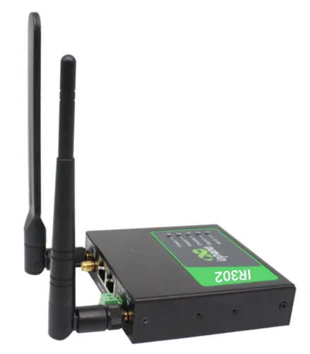</p>

<p align="center"><strong>Fig. 2-4 Rubber Antenna Installation</strong></p>

<p align="center">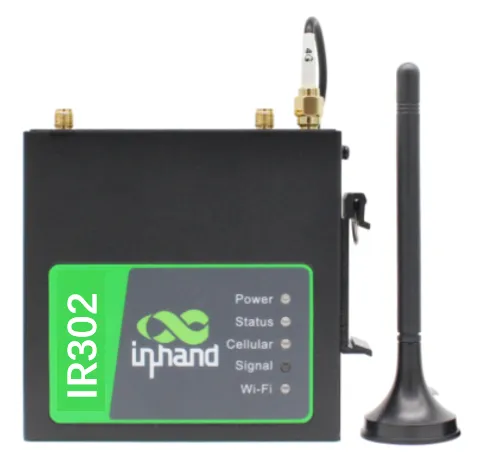</p>

<p align="center"><strong>Fig. 2-5 Suction Antenna Installation</strong></p>

The IR302 supports dual antennas: the ANT antenna and the AUX antenna. The ANT antenna is used for receiving and transmitting data. The AUX antenna can only enhance the antenna signal level and cannot receive or send data by itself, so it cannot be used alone. Generally, only the ANT antenna is required.

### 2.2.7 Grounding

**Step 1**: Unscrew the ground nut.

**Step 2**: Put the grounding ring of the cabinet ground wire onto the ground stud.

**Step 3**: Tighten the ground nut.

> **Caution**: To improve the anti-interference capability of the router, the router must be grounded when in use. The ground wire should be connected to the grounding stud of the router according to the actual usage environment.

### 2.2.8 Power Connection

**Step 1**: Remove the power terminal from the router.

**Step 2**: Unscrew the locking screw on the power terminal.

**Step 3**: Insert the power cable into the terminal and tighten the screws.

<p align="center"></p>

<p align="center"><strong>Fig. 2-6 Power Supply Installation</strong></p>

### 2.2.9 Logging into the Router

After completing the hardware installation, ensure that the Ethernet adapter is installed on the management PC before logging in to the router's Web settings page.

**I. Automatic Acquisition of IP Address (Recommended)**

Set the management computer to "automatically obtain an IP address" and "automatically obtain a DNS server address" (default configuration of the computer operating system) to allow the device to automatically assign an IP address to the management computer.

**II. Set a Static IP Address**

Set the IP address of the management PC (such as 192.168.2.2) to be in the same network segment as the LAN interface of the device (initial IP address of the LAN interface: 192.168.2.1, subnet mask: 255.255.255.0).

**III. Cancel the Proxy Server**

If the management PC uses a proxy server to access the Internet, the proxy service must be disabled. The steps are as follows:
1. In the browser window, select "Tools >> Internet Options".
2. Select the "Connections" tab and click the "LAN Settings" button to enter the "LAN Settings" window. Confirm whether the option "Use a Proxy Server for LAN" is checked; if checked, uncheck it and click the `<OK>` button.

**IV. Log in to the Web Settings Page**

Open a web browser and enter the IP address of the InRouter302, such as `http://192.168.2.1`, in the address bar (default setting of the InRouter302). Upon connection, log in from the login interface as Admin. Enter the username and password at the login interface (please check the device nameplate for the default username and password).

> **Caution**: For security reasons, it is recommended to modify the default login password after the first login and keep the password information secure.

## 2.3 Quick Check

After completing the installation, perform the following checks:

**Table 2-3-1 Installation Quick Check List**

| Check Item | Expected Result |
| --- | --- |
| Power LED (Red) | Illuminated |
| Status LED (Green) | Illuminated (normal operation) or flashing (upgrading) |
| Cellular LED (Yellow) | On (dialing successful) or flashing (dialing in progress) |
| SIM card | Properly inserted and recognized |
| Antenna | Properly connected to ANT interface |
| Grounding | Ground wire securely connected |
| Network cable | PC connected to LAN port |
| Web login | Able to access 192.168.2.1 and log in |

---

# Chapter 3 Common Scenario Configuration

## Scenario 1: Cellular Internet Access

**Objective**: Access the Internet via a 4G/3G cellular network.

**Prerequisites**: The SIM card has been inserted and the cellular antenna has been installed; the device is powered on.

**Estimated Time**: Approx. 5 minutes.

**Operation Steps**:

1. Insert the SIM card into slot 1 and install the 3G/4G LTE antenna to the ANT antenna connector. Connect the network cable and power cable, then power on the device.

   > **Caution**: To replace or insert a SIM card, the device must be powered off and restarted to avoid data loss or equipment damage.

2. Open a browser and log in to the device Web interface. (Refer to Section 2.2.9 for Web login steps.)

3. Click **Network >> Cellular** in the navigation tree to set the dial-up access parameters. The device has the dial-up function enabled by default. Wait a few minutes for the device to access the Internet. (If it does not dial up, the cellular service can be restarted.)

   <p align="center"></p>

   <p align="center"><strong>Fig. 3-1 SIM Card Dial-Up Configuration</strong></p>

4. The device supports dual SIM card mode. When a SIM card is inserted into slot 2, the dual SIM card function must be enabled in advanced settings. Private network dial parameters can be set in the dial parameter settings. Click **Apply**, and then select the cellular network operator.

   <p align="center"></p>

   <p align="center"><strong>Fig. 3-2 Dialing Parameters</strong></p>

5. Click **Status >> Network Connections** in the navigation tree to view the network status. If the status shows "connected" and an IP address has been assigned, this indicates that the SIM card has successfully accessed the Internet.

   <p align="center">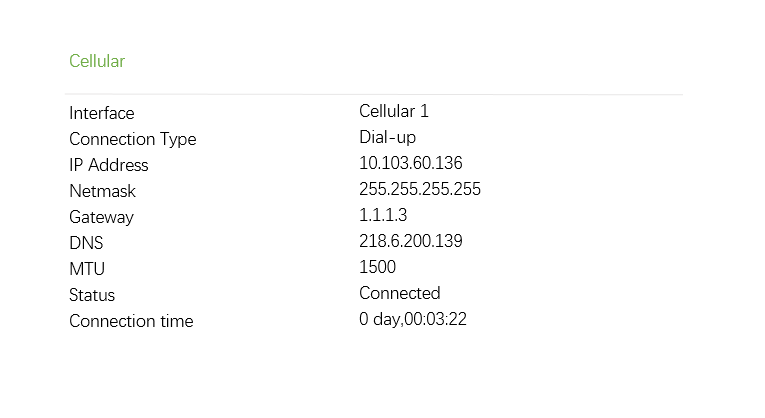</p>

   <p align="center"><strong>Fig. 3-3 Dial-Up Connection Status</strong></p>

**Verification Method**:

1. Check the Cellular LED on the device panel; it should be solid yellow (dialing successful).
2. On the **Status >> Network Connections** page, confirm that the dial-up interface has obtained an IP address.
3. Use the ping tool on the **Tools >> Ping Detection** page to test connectivity to an external address (e.g., 8.8.8.8).

**Common Issues**:

- Dial-up fails: Check whether the SIM card is correctly inserted, whether the APN parameters are correctly configured, and whether the SIM card has sufficient balance and data service enabled.
- Weak signal: Adjust the antenna position or install the AUX antenna to enhance signal reception.
- Frequent reconnection: Check whether the ICMP detection server is reachable and whether the signal strength is stable.

## Scenario 2: Wired Internet Access

**Objective**: Access the Internet via a wired Ethernet connection.

**Prerequisites**: An Ethernet cable is available and the upstream network provides Internet access; the device is powered on.

**Estimated Time**: Approx. 5 minutes.

**Operation Steps**:

1. Plug in the power cord and network cable according to the diagram. Connect the WAN port to the Internet and connect the LAN2 port to the PC.

   <p align="center"></p>

   <p align="center"><strong>Fig. 3-4 Ethernet Connection</strong></p>

2. Set the PC to be in the same network segment as the IP address of the gateway device.

   - **Method 1**: DHCP automatically obtains the address (Recommended).
   - **Method 2**: Use a fixed IP address. Set the PC and gateway in the same address segment (DHCP Server for LAN2 Port is enabled by default).

   <p align="center"></p>

   <p align="center"></p>

   <p align="center"><strong>Fig. 3-5 Dynamic Acquisition / Manual Configuration</strong></p>

   The PC IP address should be set to any value in the range "192.168.2.2 ~ 192.168.2.254". The gateway is "192.168.2.1" and the subnet mask is "255.255.255.0". The DNS should be configured to the operator's DNS server address.

3. Enter the device default address `192.168.2.1` in the browser to enter the device Web management page. (If the page indicates that the connection is not secure, open hidden or advanced options and select continue.)

   <p align="center"></p>

   <p align="center"><strong>Fig. 3-6 Login to Web Page Management</strong></p>

4. Configure the WAN port. Click **Network >> WAN/LAN Switch** in the navigation bar, select WAN mode, and configure the IP address of the WAN port so that the device can access the Internet. (Ensure that the interface is in WAN mode; the initial default is LAN mode.)

   <p align="center"></p>

   <p align="center"><strong>Fig. 3-7 WAN Port Setup</strong></p>

5. Three address assignment methods are available: Dynamic DHCP (recommended), Static IP, and ADSL Dial-up (PPPoE). Click **Apply** after configuration is completed.

   <p align="center">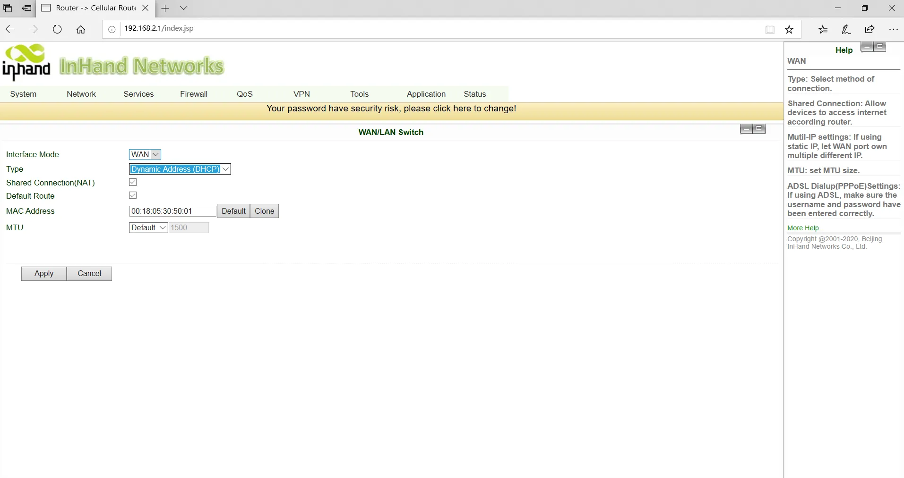</p>

   <p align="center"><strong>Fig. 3-8-a Dynamic IP Configuration of WAN</strong></p>

   <p align="center">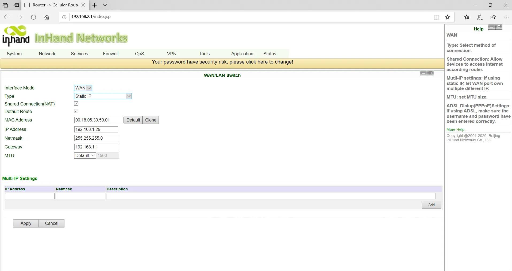</p>

   <p align="center"><strong>Fig. 3-8-b Static IP Configuration of WAN</strong></p>

   <p align="center">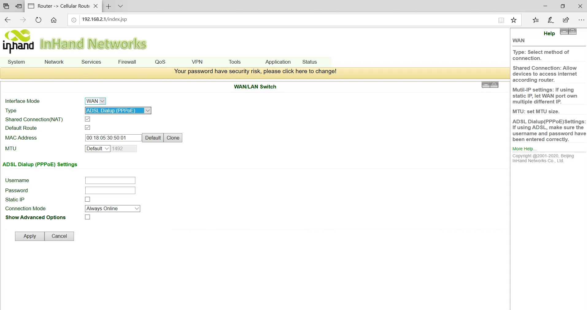</p>

   <p align="center"><strong>Fig. 3-8-c ADSL Dial-up of WAN</strong></p>

6. Use the ping tool to verify the network connection.

   <p align="center">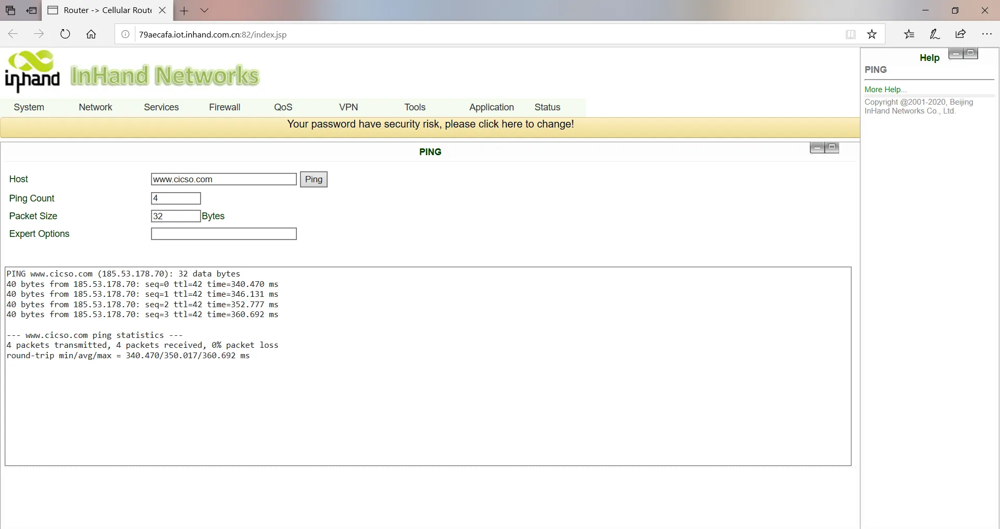</p>

   <p align="center"><strong>Fig. 3-9 Ping Result Diagram</strong></p>

**Verification Method**:

1. On the **Status >> Network Connections** page, confirm that the WAN interface has obtained an IP address.
2. Use the ping tool on the **Tools >> Ping Detection** page to test connectivity to an external address.

**Common Issues**:

- Unable to obtain an IP address: Check whether the upstream DHCP server is functioning or whether the static IP parameters are correctly configured.
- WAN port has no Internet access: Check whether the WAN/LAN Switch is set to WAN mode.
- ADSL dial-up fails: Check whether the username and password are correct.

## Scenario 3: Wi-Fi Internet Access

**Objective**: Access the Internet via Wi-Fi in either AP mode or STA mode.

**Prerequisites**: The Wi-Fi antenna is installed; the device is powered on and connected to the PC.

**Estimated Time**: Approx. 5 minutes.

**Operation Steps**:

### AP Mode (Default)

1. Connect the Wi-Fi antenna to the WLAN antenna connector. Connect the network cable to the PC and insert the power supply.

2. In AP mode (initial default mode), the device acts as a wireless access point and emits a wireless signal, allowing terminal devices to access the Internet through the AP. Ensure that the device has already been connected to the Internet via the wired or cellular dial-up mode described above. Users can set the SSID name and encryption authentication, and choose the terminal connection password according to their needs.

   <p align="center"></p>

   <p align="center"><strong>Fig. 3-10 SSID of AP</strong></p>

### STA Mode

1. STA mode means the device connects to another AP to access the Internet. The device itself does not provide Internet access; it bridges terminal devices that cannot connect to the AP directly.

2. Click **Network >> WLAN Mode Switch** in the navigation bar to switch the working mode to STA, then click **Apply** and restart the device as prompted.

   <p align="center">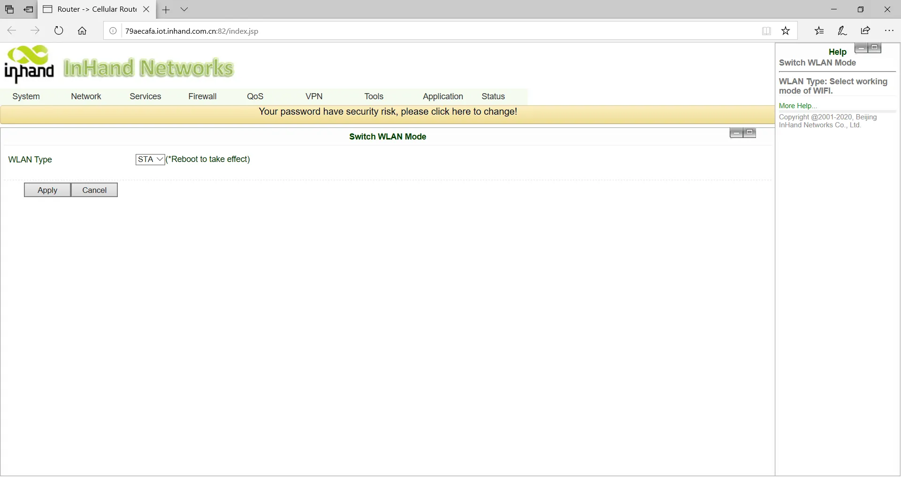</p>

   <p align="center"><strong>Fig. 3-11 WLAN Mode Switch</strong></p>

   <p align="center">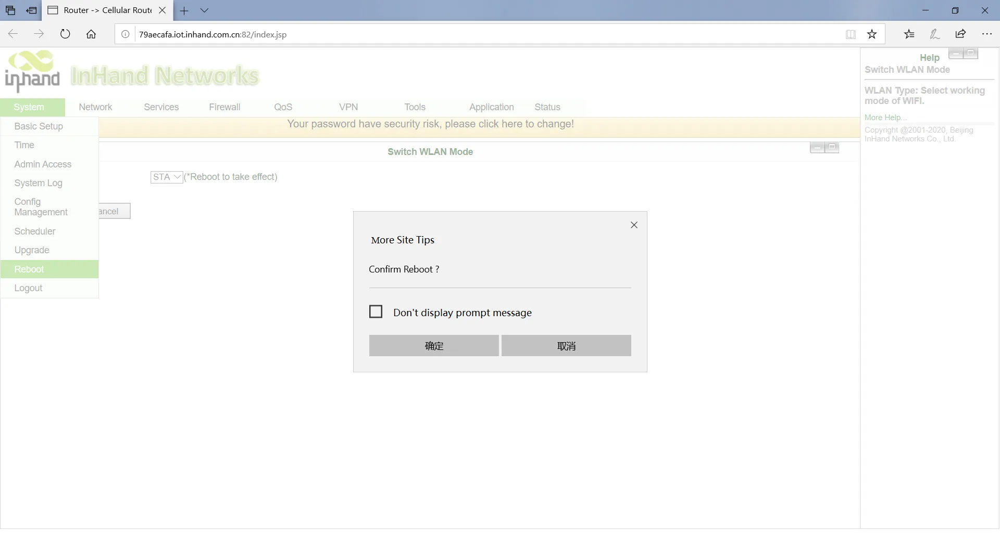</p>

   <p align="center"><strong>Fig. 3-12 Reboot Device</strong></p>

3. Click **Network >> WLAN Client** in the navigation bar, click **Scan** to select the target SSID, and set the encryption and password.

   <p align="center">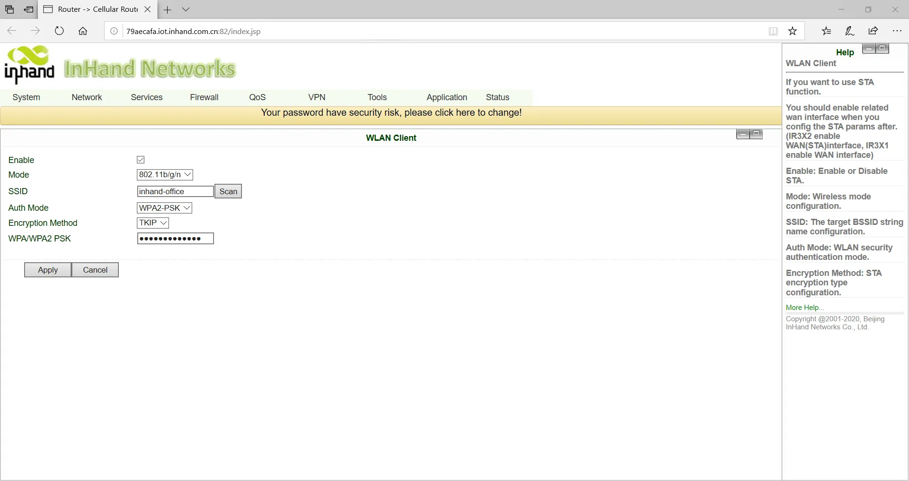</p>

   <p align="center"><strong>Fig. 3-13 Selected SSID</strong></p>

4. Click **Network >> WAN (STA)** in the navigation bar to set the WAN port IP parameters.

   Three methods are available: dynamic address (recommended), static IP, and ADSL dial-up.

   <p align="center"></p>

   <p align="center"><strong>Fig. 3-14-a Dynamic Acquisition WAN (STA) Address</strong></p>

   <p align="center">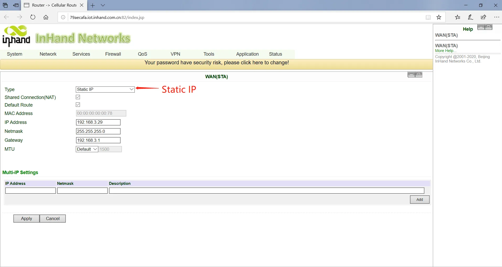</p>

   <p align="center"><strong>Fig. 3-14-b Static IP Configuration of WAN (STA)</strong></p>

   <p align="center">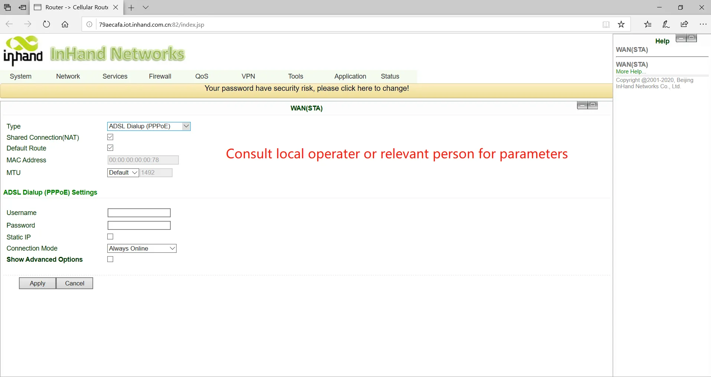</p>

   <p align="center"><strong>Fig. 3-14-c ADSL Dial Configuration of WAN (STA)</strong></p>

5. Click **Status >> Network Connections** in the navigation bar to view the connection status. If the device is connected and has obtained a dynamic DHCP address, this indicates that the device is online.

   <p align="center">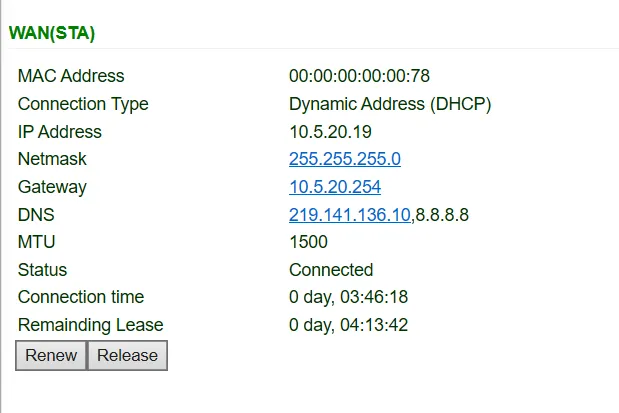</p>

   <p align="center"><strong>Fig. 3-15 Schematic Diagram of Wireless Networking Results</strong></p>

**Verification Method**:

1. For AP mode: Use a wireless terminal to search for the SSID and connect to it.
2. For STA mode: On the **Status >> Network Connections** page, confirm that the WAN (STA) interface has obtained an IP address.
3. Use the ping tool to test Internet connectivity.

**Common Issues**:

- Cannot find the SSID: Check whether the Wi-Fi antenna is properly connected and whether the Wi-Fi function is enabled.
- STA mode connection fails: Check whether the target AP's SSID, encryption method, and password are correctly configured.

## Scenario 4: DM Cloud Platform Access

**Objective**: Connect the device to the InHand DM Cloud Management Platform for remote management.

**Prerequisites**: The device has successfully accessed the Internet; a DM Cloud Platform account has been registered.

**Estimated Time**: Approx. 10 minutes.

**Operation Steps**:

1. Ensure the device has successfully accessed the Internet. Click **Service >> Device Remote Management Platform** in the navigation menu to set up access to the DM Cloud Platform.

   Server address: the address of the Device Manager. The addresses developed by InHand are as follows:

   - Device Manager: iot.inhandnetworks.com
   - InConnect: ics.inhandnetworks.com

   <p align="center"></p>

   <p align="center"><strong>Fig. 3-16 Remote Platform Configuration</strong></p>

2. Register or log in to the DM Cloud Platform account. Access the registration/login page via the link: https://iot.inhandnetworks.com.

   <p align="center">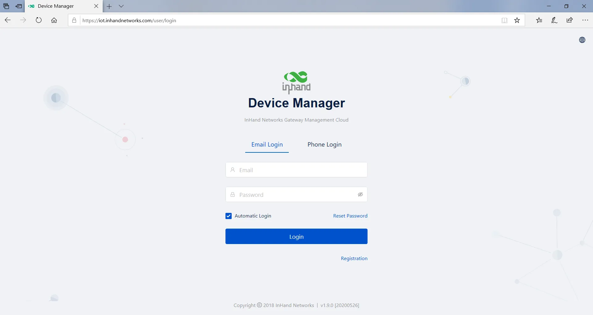</p>

   <p align="center"><strong>Fig. 3-17 Account Registration/Login</strong></p>

3. Log in to the DM platform and click **Gateway >> Create** to add the device. Name the device and fill in the serial number to add the device to the cloud platform.

   <p align="center"></p>

   <p align="center"><strong>Fig. 3-18 Add Device to Platform</strong></p>

   To view the serial number, click **Status** in the navigation bar to view the device serial number and other basic information, or check the label on the back of the device.

   <p align="center"></p>

   <p align="center"><strong>Fig. 3-19 Serial Number Query</strong></p>

**Verification Method**:

1. On the **Status >> Device Manager** page, check whether the connection status between the router and the Device Manager is normal.
2. On the DM Cloud Platform, confirm that the device is online and data is being reported.

**Common Issues**:

- Device cannot connect to the platform: Check whether the device has Internet access and whether the server address is correctly configured.
- Device shows offline on the platform: Check whether the registered account is correct and whether the serial number matches.

---

# Chapter 4 Function Description and Parameter Reference

This chapter describes the functional modules of the InRouter302 and provides detailed parameter references for each configuration page. Users can navigate to the corresponding pages via the Web interface navigation tree.

## 4.1 System

### 4.1.1 Basic Setup

**Path**: Navigation tree >> **System >> Basic Setup**

**Function Description**: Select the display language of the router configuration interface and set a personalized host name.

**Table 4-1-1 Basic Setup Parameters**

| **Parameters** | **Description** | **Default** |
| --- | --- | --- |
| Language | Configure the language of the Web configuration interface | Chinese |
| Host Name | Set a name for the host or device connected to the router for identification | Router |

### 4.1.2 Time

**Path**: Navigation tree >> **System >> Time**

**Function Description**: Set the local time zone and automatic time update via NTP.

**Table 4-1-2 System Time Parameters**

| **Parameters** | **Description** | **Default** |
| --- | --- | --- |
| Time of Router | Display the present time of the router | 8:00:00 AM, 12/12/2015 |
| PC Time | Display the present time of the PC | Present time |
| Timezone | Set the time zone of the router | Custom |
| Custom TZ String | Set the TZ string of the router | CST-8 |
| Auto update Time | Select whether to automatically update the time; options include on startup or every 1/2/...hours | On startup |
| NTP Time Servers | Set the NTP server to synchronize time via the network | 114.80.81.1 |

### 4.1.3 Admin Access

**Path**: Navigation tree >> **System >> Admin Access**

**Function Description**: Modify the username and password of the router. The router may be accessed via HTTP, HTTPS, Telnet, SSHD, and Console. Set the login timeout.

**Table 4-1-3 Admin Access Parameters**

| **Parameters** | **Description** | **Default** |
| --- | --- | --- |
| **Username/Password** | | |
| Username | Set the name of the user who logs into the Web configuration | adm |
| Old Password | Previous password for accessing the Web configuration | N/A |
| New Password | New password for accessing the Web configuration | N/A |
| Confirm New Password | Reconfirm the new password | N/A |
| **Admin Functions** | | |
| Service Port | Service port of HTTP/HTTPS/TELNET/SSHD/Console | 80/443/23/22 |
| Local Access | Enable — Allow local LAN to administrate the router with the corresponding service (e.g., HTTP). Disable — Local LAN cannot administrate the router with the corresponding service. | Enable |
| Remote Access | Enable — Allow remote hosts to administrate the router with the corresponding service. Disable — Remote hosts cannot administrate the router with the corresponding service. | Enable |
| Allowed Access from WAN (Optional) | Set allowed access from WAN (only HTTP/HTTPS/TELNET/SSHD). The host controlling the service at this moment can be set, e.g., 192.168.2.1/30 or 192.168.2.1-192.168.2.10. | N/A |
| Description | For recording the significance of various parameters of admin functions (without influencing router configuration) | N/A |
| **Other Parameters** | | |
| Log Timeout | Set the login timeout (the router will automatically disconnect the configuration interface after login timeout) | 500 seconds |

### 4.1.4 System Log

**Path**: Navigation tree >> **System >> System Log**

**Function Description**: Configure the IP address and port number of the remote log server which will record router logs.

**Table 4-1-4 System Log Parameters**

| **Parameters** | **Description** | **Default** |
| --- | --- | --- |
| Log to Remote System | Enable the log server | Disable |
| Log server address and port (UDP) | Set the address and port of the remote log server | N/A: 514 |
| Log to Console | Output device log via serial port | Disable |

### 4.1.5 Configuration Management

**Path**: Navigation tree >> **System >> Config Management**

**Function Description**: Import, export, and restore router configuration parameters.

**Table 4-1-5 Configuration Management Parameters**

| **Parameters** | **Description** | **Default** |
| --- | --- | --- |
| Browse | Choose the configuration file | N/A |
| Import | Import the configuration file to the router | N/A |
| Backup | Back up the configuration file to the host | N/A |
| Restore default configuration | Select to restore the default configuration (effective after rebooting) | N/A |
| Modem drive program | For configuring the drive program of the module | N/A |
| Network Provider (ISP) | For configuring APN, username, password, and other parameters of network providers across the world | N/A |

> **Note**: The validity and order of imported configurations should be ensured. Valid configurations will be executed sequentially in order after the system reboots. If the configuration files are not arranged according to an effective order, the system will not enter the desired state.

> **Note**: In order not to affect the operation of the current system, when performing an import configuration or restoring the default configuration, users need to restart the device for the new configuration to take effect.

### 4.1.6 Schedule

**Path**: Navigation tree >> **System >> Schedule**

**Function Description**: Set a scheduler for system reboot.

**Table 4-1-6 Scheduler Parameters**

| **Parameters** | **Description** | **Default** |
| --- | --- | --- |
| Enable | Enable/disable this function | Disable |
| Time | Select the reboot time | 0:00 |
| Days | Reboot the router every day | Everyday |
| Show advanced options | Enable more detailed schedule rules, allowing multiple rules to be set to reboot the router at specific times or intervals. Enabling this feature will disable the everyday reboot feature above. | Disable |
| Reboot after dialed | The router will reboot after dial-up is successful. This will not take effect if this parameter is blank. | N/A |

### 4.1.7 Upgrade

**Path**: Navigation tree >> **System >> Upgrade**

**Function Description**: Upgrade the router firmware.

The upgrading process can be divided into two steps. In the first step, firmware will be written to the backup file zone. In the second step, firmware in the backup file zone will be copied to the main firmware zone, which should be carried out during system restart. During software upgrading, any operation on the web page is not allowed; otherwise, the software upgrading may be interrupted.

To upgrade the system, first click `<Browse>` to choose the upgrade file, then click `<Upgrade>` and click `<OK>` to begin the upgrade. After the firmware upgrade succeeds, click `<Reboot>` to restart the device.

### 4.1.8 Reboot

**Path**: Navigation tree >> **System >> Reboot**

**Function Description**: Reboot the router.

Please save the configurations before rebooting; otherwise, the configurations that are not saved will be lost after the reboot.

To reboot the system, click **System >> Reboot**, then click `<OK>`.

### 4.1.9 Logout

**Path**: Navigation tree >> **System >> Logout**

**Function Description**: Log out of the Web management interface.

To log out, click **System >> Logout**, and then click `<OK>`.

## 4.2 Network

### 4.2.1 Cellular

**Path**: Navigation tree >> **Network >> Cellular**

**Function Description**: Configure parameters of PPP dial-up. Generally, users only need to set the basic configuration instead of advanced options.

**Table 4-2-1-1 Dialup/Cellular Parameters**

| **Parameters** | **Description** | **Default** |
| --- | --- | --- |
| Enable | Enable cellular dial-up | Enable |
| Time Schedule | Set time schedule | ALL |
| Force Reboot | Router will reboot if it cannot dial up for a long time and reaches the maximum retry count | Enable |
| Shared connection (NAT) | Enable — Local devices connected to the router can access the Internet via the router. Disable — Local devices connected to the router cannot access the Internet via the router. | Enable |
| Default Route | Enable default route | Enable |
| SIM1 Network Provider | Select the network provider profile for SIM1 | Profile 1 |
| Network Type | Select the network type; the router will try 4G, 3G, and 2G in proper order if Auto is selected | Auto |
| Connection Mode | Options include Always Online, Connect On Demand, and Manual. Triggered by SMS can be configured if Connect On Demand mode is selected. | Always Online |
| Redial Interval | Set the redialing time when login fails | 30 s |
| **Show Advanced Options** | | |
| Dual SIM Enable | Enable Dual SIM card function | Disable |
| SIM2 Network Provider | Select the network provider for SIM2 card | Profile 1 |
| SIM2 Blinding ICCID | Set the ICCID of SIM2 | N/A |
| SIM2 PIN Code | For setting the SIM2 PIN code | N/A |
| SIM2 SIM Card Operator | Set the ISP that the SIM2 card connects to | Auto |
| Main SIM | Set the SIM card that is used for dial-up first | SIM1 |
| Max Number of Dial | Set the maximum number of dial attempts; if dial-up is not successful after this number, the router will switch SIM cards | 5 |
| CSQ Threshold | Set the signal threshold; if the current signal level is lower than this value, the router will switch SIM cards | 0 (Disable) |
| Min Connect Time | Set the minimum connection time for each dial-up attempt | 0 (Disable) |
| Initial Commands | Set customized initial AT commands which will be executed at the beginning of dial-up | AT |
| Blinding ICCID | Set the ICCID of the SIM card | N/A |
| PIN Code | For setting the PIN code of the SIM card | N/A |
| MTU | Set the maximum transmission unit after enabling | 1500 |
| Use Peer DNS | Click to receive the peer DNS assigned by the ISP | Enable |
| Link detection interval | Set the link detection interval | 55 s |
| Debug | Enable debug mode; print debug log in the system log | Disable |
| Debug Modem* | Send modem debug data to the console | Disable |
| ICMP Detection Mode | Set the ICMP detection mode. Ignore Traffic: The router will send ICMP packets regardless of whether there is traffic on the cellular interface. Monitor Traffic: The router will not send ICMP packets if there is traffic on the cellular interface. | Ignore Traffic |
| ICMP Detection Server | Set the ICMP Detection Server. N/A represents that ICMP detection is not enabled. | N/A |
| ICMP Detection Interval | Set the ICMP Detection Interval | 30 s |
| ICMP Detection Timeout | Set the ICMP Detection Timeout (the link will be regarded as down if ICMP times out) | 20 s |
| ICMP Detection Retries | Set the maximum number of retries if ICMP fails (the router will redial if the maximum is reached) | 5 |

**Table 4-2-1-2 Dialup/Cellular Schedule Parameters**

| **Parameters** | **Description** | **Default** |
| --- | --- | --- |
| Name of Schedule | Schedule name | schedule1 |
| Sunday ~ Saturday | Click to enable | |
| Time Range 1 | Set time range 1 | 9:00-12:00 |
| Time Range 2 | Set time range 2 | 14:00-18:00 |
| Time Range 3 | Set time range 3 | 0:00-0:00 |
| Description | Set description content | N/A |

### 4.2.2 WAN/LAN Switch

**Path**: Navigation tree >> **Network >> WAN/LAN Switch**

**Function Description**: The WAN/LAN1 Port supports two types of work modes: WAN and LAN.

WAN supports three types of wired access: static IP, dynamic address (DHCP), and ADSL (PPPoE) dialing.

**Table 4-2-2-1 WAN Static IP Parameters**

| **Parameters** | **Description** | **Default** |
| --- | --- | --- |
| Shared connection (NAT) | Enable — Local devices connected to the router can access the Internet via the router. Disable — Local devices connected to the router cannot access the Internet via the router. | Enable |
| Default route | Enable default route | Enable |
| MAC Address | MAC Address of the device | Device's MAC address |
| IP Address | Set the IP address of the WAN | 192.168.1.29 |
| Subnet mask | Set the subnet mask of the WAN | 255.255.255.0 |
| Gateway | Set the gateway of the WAN | 192.168.1.1 |
| MTU | Maximum transmission unit, default/manual settings | default (1500) |
| **Multiple IP support (at most 8 additional IP addresses can be set)** | | |
| IP Address | Set the additional IP address of the WAN | N/A |
| Subnet mask | Set the subnet mask | N/A |
| Description | For recording the significance of the additional IP address | N/A |

**Table 4-2-2-2 WAN Dynamic Address (DHCP) Parameters**

| **Parameters** | **Description** | **Default** |
| --- | --- | --- |
| Shared connection (NAT) | Enable — Local devices connected to the router can access the Internet via the router. Disable — Local devices connected to the router cannot access the Internet via the router. | Enable |
| Default route | Enable default route | Enable |
| MAC Address | MAC Address of the device | Device's MAC address |
| MTU | Maximum transmission unit, default/manual settings | default (1500) |

**Table 4-2-2-3 WAN ADSL Dialing (PPPoE) Parameters**

| **Parameters** | **Description** | **Default** |
| --- | --- | --- |
| Shared connection | Enable — Local devices connected to the router can access the Internet via the router. Disable — Local devices connected to the router cannot access the Internet via the router. | Enable |
| Default route | Enable default route | Enable |
| MAC Address | MAC Address of the device | Device's MAC address |
| MTU | Maximum transmission unit, default/manual settings | default (1492) |
| **WAN - ADSL Dialing (PPPoE)** | | |
| Username | Set the name of the dialing user | N/A |
| Password | Set the dialing password | N/A |
| Static IP | Click to enable static IP | Disable |
| Connection Mode | Set the dialing connection method (Always Online, Dial On Demand, Manual Dialing) | Always Online |
| **Advanced Options Parameters** | | |
| Service Name | Set the service name | N/A |
| Set length of transmit queue | Set the length of the transmit queue | 3 |
| Enable IP header compression | Click to enable IP header compression | Disable |
| Use Peer DNS | Click to enable the use of peer DNS | Enable |
| Link detection interval | Set the link detection interval | 55 s |
| Link detection Max. Retries | Set the link detection maximum retries | 10 |
| Enable Debug | Click to enable debug mode | Disable |
| Expert Option | Set expert options | N/A |
| ICMP Detection Server | Set the ICMP detection server | N/A |
| ICMP Detection Interval | Set the ICMP Detection Interval | 30 s |
| ICMP Detection Timeout | Set the ICMP detection timeout | 20 s |
| ICMP Detection Retries | Set the ICMP detection maximum retries | 3 |

### 4.2.3 LAN

**Path**: Navigation tree >> **Network >> LAN**

**Function Description**: Devices in the LAN use a static IP to connect to the network.

**Table 4-2-3 LAN Parameters**

| **Parameters** | **Description** | **Default** |
| --- | --- | --- |
| MAC Address | MAC Address of the router's LAN gateway | Router's LAN MAC address |
| IP Address | IP Address of the router's LAN gateway | 192.168.2.1 |
| Netmask | Subnet mask of the LAN gateway | 255.255.255.0 |
| MTU | Maximum transmission unit, default/manual settings | default (1500) |
| LAN Mode | Set the transport mode on the LAN interface | Auto Negotiation |
| **Multi-IP Settings (at most 8 additional IP addresses can be set)** | | |
| IP Address | Set the additional IP address of the LAN | N/A |
| Subnet mask | Set the subnet mask | N/A |
| Description | For recording the significance of the additional IP address | N/A |
| **LAN Port Enable** | | |
| port1/port2 | Enable the corresponding LAN port | Enable |
| **GARP** | | |
| Enable | The router will send ARP broadcasts to LAN devices automatically | Disable |
| Broadcast Count | Set the ARP broadcast times | 5 |
| Broadcast Timeout | Set the ARP broadcast timeout time | 10 |

### 4.2.4 Switch WLAN Mode

**Path**: Navigation tree >> **Network >> Switch WLAN Mode**

**Function Description**: The IR302-WLAN supports two types of WLAN modes: AP and STA. After changing and saving the configuration, reboot the device for the configuration to take effect.

### 4.2.5 WLAN Client (AP Mode)

**Path**: Navigation tree >> **Network >> WLAN**

**Function Description**: When working in AP mode, the IR302 WLAN will provide a network access point for other wireless network devices. Ensure that the IR302 has already connected to the Internet via WAN or cellular dial-up.

**Table 4-2-5 WLAN Access Port Parameters**

| **Parameters** | **Description** | **Default** |
| --- | --- | --- |
| SSID broadcast | After enabling, users can search for the WLAN via the SSID name | Enable |
| Mode | Six types for selection: 802.11g/n, 802.11g, 802.11n, 802.11b, 802.11b/g, 802.11b/g/n | 802.11b/g/n |
| Channel | Select the channel | 11 |
| SSID | SSID name defined by the user | inhand |
| Authentication method | Supports Open type, Shared type, Auto selection of WEP, WPA-PSK, WPA, WPA2-PSK, WPA2, WPA/WPA2, WPAPSK/WPA2PSK | Open type |
| Encryption | Supports NONE, WEP | NONE |
| Wireless bandwidth | Both 20MHz and 40MHz for selection | 20MHz |
| Enable WDS | Click to enable WDS | Disable |
| Default Route | Click to enable Route | Disable |
| Bridged SSID | Set the bridged SSID | None |
| Bridged BSSID | Set the bridged BSSID | None |
| Scan | Click "Scan" to scan for available APs nearby | |
| Auth Mode | Open type, Shared type, WPA-PSK, WPA2-PSK | Open type |
| Encryption Method | Supports NONE, WEP | None |

### 4.2.6 WLAN Client (STA Mode)

**Path**: Navigation tree >> **Network >> WLAN Client**

**Function Description**: When working in STA mode, the router can access the Internet by connecting to other APs.

**Table 4-2-6 WLAN Client Parameters**

| **Parameters** | **Description** | **Default** |
| --- | --- | --- |
| Mode | Supports multiple modes including 802.11b/g/n | 802.11b/g/n |
| SSID | Name of the SSID to be connected | inhand |
| Authentication method | Keep consistent with the access point to be connected | Open type |
| Encryption | Keep consistent with the access point to be connected | NONE |

### 4.2.7 Link Backup

**Path**: Navigation tree >> **Network >> Link Backup**

**Function Description**: When the system is running, the main link will first be enabled for communication. However, when the main link is disconnected, the system will automatically switch to the backup link to ensure communication continuity.

**Table 4-2-7-1 Link Backup Parameters**

| **Parameters** | **Description** | **Default** |
| --- | --- | --- |
| Enable | Click to enable link backup | Disable |
| Backup mode | Options include Hot Failover, Cold Failover, or Load Balance | Hot failover |
| Main Link | Optional WAN or dialing interface | WAN |
| ICMP Detection Server | Set the ICMP detection server | N/A |
| Backup Link | Optional cellular or WAN | Cellular 1 |
| ICMP Detection Interval | Set the ICMP Detection Interval | 10 s |
| ICMP Detection Timeout | Set the ICMP detection timeout | 3 s |
| ICMP Detection Retries | Set the ICMP detection maximum retries | 3 |
| Restart Interface When ICMP Failed | Restart the main link when ICMP fails | Disable |

**Table 4-2-7-2 Link Backup - Backup Mode Parameters**

| **Parameters** | **Description** |
| --- | --- |
| Hot failover | Main link and backup link remain online simultaneously; switching occurs if the current link goes offline. |
| Cold failover | The backup link will only come online when the main link is disconnected. |
| Load balance | Transfer data via the corresponding route after ICMP detection succeeds. |

### 4.2.8 VRRP

**Path**: Navigation tree >> **Network >> VRRP**

**Function Description**: VRRP (Virtual Router Redundancy Protocol) adds a set of routers that can undertake gateway functions into a backup group to form a virtual router.

**Table 4-2-8 VRRP Parameters**

| **Parameters** | **Description** | **Default** |
| --- | --- | --- |
| Enable VRRP-I | Click to enable the VRRP function | Disable |
| Group ID | Select the ID of the router group (range: 1-255) | 1 |
| Priority | Select a priority (range: 1-254) | 20 (the larger the numerical value, the higher the priority) |
| Advertisement Interval | Set an advertisement interval | 60 s |
| Virtual IP | Set a virtual IP | N/A |
| Authentication method | Select "None" or "Password" type | None (a password is required when the password type is selected) |
| Monitor | Set the monitor | N/A |
| VRRP-II | Set as above | Disable |

### 4.2.9 IP Passthrough

**Path**: Navigation tree >> **Network >> IP Passthrough**

**Function Description**: The LAN port device obtains the WAN port address; used for external access to router downstream devices.

**Table 4-2-9 IP Passthrough Parameters**

| **Parameters** | **Description** | **Default** |
| --- | --- | --- |
| IP Passthrough | Enable IP Passthrough | Disable |
| IP Passthrough Mode | Select the work mode (DHCP Dynamic / DHCP Fix MAC) | DHCP Dynamic |
| Fix MAC Address | Set the fixed MAC address if in DHCP Fix MAC mode | 00:00:00:00:00:00 |
| DHCP lease | Set the DHCP lease time; the address will be reacquired after expiration | 120S |

### 4.2.10 Static Route

**Path**: Navigation tree >> **Network >> Static Route**

**Function Description**: Add/delete additional static routes of the router. Generally, it is unnecessary for users to set this.

**Table 4-2-10 Static Route Parameters**

| **Parameters** | **Description** | **Default** |
| --- | --- | --- |
| Destination Address | Set the IP address of the destination | 0.0.0.0 |
| Netmask | Set the subnet mask of the destination | 255.255.255.0 |
| Gateway | Set the gateway of the destination | N/A |
| Interface | Select the LAN/CELLULAR/WAN/WAN(STA) interface of the destination | N/A |
| Description | For recording the significance of the static route address (Chinese characters are not supported) | N/A |

## 4.3 Service

### 4.3.1 DHCP Service

**Path**: Navigation tree >> **Services >> DHCP Service**

**Function Description**: If the host connected to the router chooses to obtain an IP address automatically, this service must be activated. Static designation of DHCP allocation can help certain hosts obtain specified IP addresses.

**Table 4-3-1 DHCP Service Parameters**

| **Parameters** | **Description** | **Default** |
| --- | --- | --- |
| Enable DHCP | Enable the DHCP service and dynamically allocate IP addresses | Enable |
| IP Pool Starting Address | Set the starting IP address of dynamic allocation | 192.168.2.2 |
| IP Pool Ending Address | Set the ending IP address of dynamic allocation | 192.168.2.100 |
| Lease | Set the lease of the dynamically allocated IP | 60 minutes |
| DNS | Set the DNS Server | 192.168.2.1 |
| Windows Name Server | Set the Windows name server | N/A |
| **Static Designation of DHCP Allocation (at most 20 DHCP static allocations can be set)** | | |
| MAC Address | Set a statically specified DHCP MAC address (must be different from other MACs to avoid conflicts) | N/A |
| IP Address | Set a statically specified IP address | 192.168.2.2 |
| Host | Set the hostname | N/A |

### 4.3.2 DNS

**Path**: Navigation tree >> **Service >> Domain Name Service**

**Function Description**: Configure parameters of DNS.

**Table 4-3-2 DNS Parameters**

| **Parameters** | **Description** | **Default** |
| --- | --- | --- |
| Primary DNS | Set the Primary DNS | 0.0.0.0 |
| Secondary DNS | Set the Secondary DNS | 0.0.0.0 |
| Disable local DNS server | Do not transfer the local DNS server address | Disable |

### 4.3.3 DNS Relay

**Path**: Navigation tree >> **Service >> DNS Relay**

**Function Description**: If the host connected to the router chooses to obtain a DNS address automatically, this service must be activated.

**Table 4-3-3 DNS Relay Parameters**

| **Parameters** | **Description** | **Default** |
| --- | --- | --- |
| Enable DNS Relay service | Click to enable the DNS service | Enable (DNS will be available when the DHCP service is enabled.) |
| **Designate [IP address <=> domain name] pair (20 IP address <=> domain name pairs can be designated)** | | |
| IP Address | Set the IP address of the designated IP address <=> domain name pair | N/A |
| Host | Domain Name | N/A |
| Description | For recording the significance of the IP address <=> domain name pair | N/A |

> **Note**: When enabling DHCP, the DNS relay is also enabled automatically. The relay cannot be disabled without disabling DHCP.

### 4.3.4 DDNS

**Path**: Navigation tree >> **Service >> Dynamic Domain Name**

**Function Description**: Set dynamic domain name binding.

**Table 4-3-4-1 Dynamic Domain Name Parameters**

| **Parameters** | **Description** | **Default** |
| --- | --- | --- |
| Current Address | Display the present IP of the router | N/A |
| Service Type | Select the domain name service provider | Disable |

**Table 4-3-4-2 Dynamic Domain Name Main Parameters**

| **Parameters** | **Description** | **Default** |
| --- | --- | --- |
| Service Type | QDNS (3322)-Dynamic | Disable |
| URL | http://www.3322.org/ | http://www.3322.org/ |
| Username | Username assigned during the application for a dynamic domain name | N/A |
| Password | Password assigned during the application for a dynamic domain name | N/A |
| Host Name | Host name assigned during the application for a dynamic domain name | N/A |
| Wildcard | Enable wildcard character | Disable |
| MX | Set MX | N/A |
| Backup MX | Enable backup MX | Disable |
| Force Update | Enable force update | Disable |

### 4.3.5 Device Manager

**Path**: Navigation tree >> **Service >> Device Manager**

**Function Description**: Connect the router to the platform for cloud management.

**Table 4-3-5 Device Remote Management Platform Parameters**

| **Parameters** | **Description** | **Default** |
| --- | --- | --- |
| Enable | Enable the Device Manager | Disable |
| Service Type | Platform work mode: Device Manager, InConnect, or Custom | Device Manager |
| Server | Select the cloud platform address. DM: iot.inhand.com.cn (China), iot.inhandnetworks.com (Global). InConnect: ics.inhandiot.com (China), ics.inhandnetworks.com (Global). | iot.inhandnetworks.com |
| Secure Channel | Use an encryption protocol for secure data transmission between the router and the platform | Enable |
| Registered Account | Account registered in the Device Manager | N/A |
| LBS Info Upload Interval | Cellular information upload interval | 1 Hour |
| Series Info Upload Interval | Traffic information upload interval | 1 Hour |
| Channel Keepalive | Keep-alive packet interval | 30 Seconds |

### 4.3.6 SNMP

**Path**: Navigation tree >> **Service >> SNMP**

**Function Description**: Configure the Simple Network Management Protocol for remote device management.

<p align="center">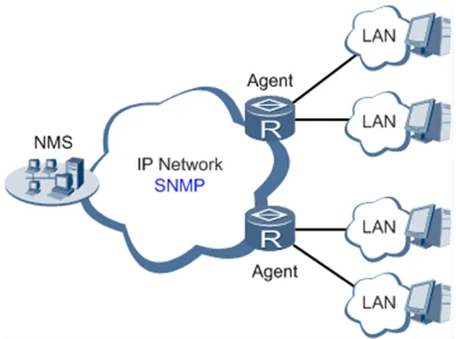</p>

<p align="center"><strong>Fig. 4-1 SNMP Topology</strong></p>

**Table 4-3-6-1 SNMPv1 and SNMPv2c Parameters**

| **Parameters** | **Description** | **Default** |
| --- | --- | --- |
| Enable | Enable/disable the SNMP function. | Disabled |
| Version | Set the version of the SNMP protocol used to manage the router. SNMPv1 is applicable to small-sized networks with simple networking and low security requirements. SNMPv2c is applicable to medium- and large-sized networks with low security requirements. SNMPv3 is applicable to networks of various sizes with strict security requirements. | v1 |
| Contact Information | Fill in the contact information. | Empty |
| Location Information | Fill in the location. | Empty |
| **Community Management** | | |
| Community Name | User-defined community name. The community names of SNMPv1 and SNMPv2c are the passwords used by the NMS to read and write data on agents. | public and private |
| Access Limit | Access limit includes the MIB objects that can be read only or read/written by the NMS. | Read-Only |
| MIB View | Select the MIB objects that can be monitored and managed by the NMS. Only the default view is supported currently. | defaultView |

**Table 4-3-6-2 SNMPv3 Parameters**

| **Parameters** | **Description** | **Default** |
| --- | --- | --- |
| **User Group Management** | | |
| Groupname | User-defined user group name. The length is 1 to 32 characters. | None |
| Security Level | Select a security level for the group. The values include NoAuth/NoPriv, Auth/NoPriv, and Auth/Priv. | NoAuth/NoPriv |
| Read-only View | Select the SNMP read-only view. Only the default view is supported currently. | defaultView |
| Read-write View | Select the SNMP read-write view. Only the default view is supported currently. | defaultView |
| Inform View | Select the SNMP inform view. Only the default view is supported currently. | defaultView |
| **Usm Management** | | |
| Username | User-defined username. The length is 1 to 32 characters. | None |
| Groupname | The group to which a user is added must have been configured in the user group management table. | None |
| Authentication | Select an authentication mode. Three authentication modes are available: MD5, SHA, and None. If None is selected, authentication is disabled. | None |
| Authentication Password | This parameter is available only when the authentication mode is not None. The length is 8 to 32 characters. | None |
| Encryption | Select the encryption mode. The values are None, AES, and DES. | None |
| Encryption Password | This parameter is available only when the authentication mode is not None. The length is 8 to 32 characters. | None |

### 4.3.7 SNMP Trap

**Path**: Navigation tree >> **Service >> SNMP Trap**

**Function Description**: Configure SNMP trap reporting to the NMS.

**Table 4-3-7 SNMP Trap Configuration Parameters**

| **Parameters** | **Description** | **Default** |
| --- | --- | --- |
| Trap SigLevel | Set the trap signal threshold. When this threshold is reached, the agent outputs logs to the NMS. | 10 |
| Destination Address | Fill in the IP address of the NMS. | None |
| Security Name | Fill in the community name for SNMPv1 or SNMPv2c, and fill in the username for SNMPv3. The length is 1 to 32 characters. | None |
| UDP Port | Fill in the UDP port number, ranging from 1 to 65535. | 162 |

### 4.3.8 DTU

**Path**: Navigation tree >> **Service >> DTU**

**Function Description**: Transmit RS232 data to the server.

The IR302-S has 1 RS232 serial port.

**Table 4-3-8 DTU RS232 Parameters**

| **Parameters** | **Description** | **Default** |
| --- | --- | --- |
| Enable | Enable the serial port | Disable |
| **Serial Basic Config** | | |
| Serial type | Serial port type, cannot be changed | RS232 |
| Baudrate | Set the serial port baud rate | 115200 |
| Data Bits | Set the serial port data bits | 8 |
| Parity | Set the parity of the serial port | None |
| Stop Bit | Set the stop bit of the serial port | 1 |
| Software Flow Control | Enabling software flow control can avoid data flow loss | Disable |
| **DTU Configuration** | | |
| DTU Protocol | Set the transmission protocol of the DTU | Transparent |
| Protocol | Configure the type of protocol, TCP/UDP | TCP |
| Mode | Set the connection mode between the router and the server | Client |
| Frame Interval | Set the frame interval of the serial port | 100 ms |
| Serial Buffer Frames | Set the number of serial buffer frames | 4 |
| Keep alive Interval | Set the interval to test the connectivity between the router and the server | 60 |
| Keep alive Retry Time | The number of times to retry when the connection is lost | 5 |
| Multi-Server Policy | The policy for multiple servers | Parallel |
| Min Reconnect Interval | Set the minimum interval to reconnect | 15 |
| Max Reconnect Interval | Set the maximum interval to reconnect | 180 |
| DTU ID | The ID of the router when connecting to the server | |
| Source IP | The source IP the router uses when connecting to the server; the WAN IP will be used if this parameter is blank | |
| Source port | The source port the router uses when connecting to the server; a random port will be used if this parameter is blank | |
| DTU ID Report Interval | Set the interval to upload the DTU ID | 0 |
| **Multi Server** | | |
| Server Address | Set the server address to receive data | |
| Server Port | Set the server port to receive data | |

### 4.3.9 I/O

**Path**: Navigation tree >> **Service >> I/O**

**Function Description**: Configure the I/O mode and relay of the device.

Voltage range:
- DI: 0~30V, 0~3V means low, 10~30V means high, and the maximum input voltage is 30V.
- DO: Wet contact, low means 0V, high means 13V (pull-up, cannot be used as a power supply for other devices directly).

Only the IR302-IO supports this feature.

**Table 4-3-9 I/O Parameters**

| **Parameters** | **Description** | **Default** |
| --- | --- | --- |
| I/O mode | Set the I/O mode, input or output | Output |
| I/O default output level | Set the I/O output level when the I/O mode is output, low or high | low |
| Dry/Wet contact | Set the I/O input type when the I/O mode is input, Dry or Wet contact | Dry |
| Input triggered report | Report when input triggers in certain situations | Disable |
| Trigger edge | Set the trigger edge of the relay | Falling edge |

### 4.3.10 SMS

**Path**: Navigation tree >> **Service >> SMS**

**Function Description**: Configure the SMS function to manage the router in the form of SMS.

**Table 4-3-10 SMS Parameters**

| **Parameters** | **Description** | **Default** |
| --- | --- | --- |
| Enable | Click to enable the SMS function | Disable |
| Status Query | Users define the English query instruction to inquire about the current working status of the router. | N/A |
| Reboot | Users define the English query instruction to reboot the router. | N/A |
| **SMS Access Control** | | |
| Default Policy | Select the manner of access processing. | Accept |
| Phone Number | Fill in the accessible mobile number | N/A |
| Action | Accept or block | Accept |
| Description | Describe SMS control. | |

### 4.3.11 Traffic Manager

**Path**: Navigation tree >> **Services >> Traffic Manager**

**Function Description**: Monitor and manage the traffic usage of the router.

**Table 4-3-11 Traffic Manager - Basic Configuration Parameters**

| **Parameters** | **Description** | **Default** |
| --- | --- | --- |
| Enable | Click to enable the traffic manager function. | Disable |
| Start Day | The day to start counting data traffic every month | 1 |
| Monthly Threshold | Data traffic threshold every month | 0MB |
| When Over Monthly Threshold | Operation when data traffic used within a month reaches the threshold: Only Reporting, Block Except Management (will not influence DM and management requirements), Shutdown Interface | Only Reporting |
| Last 24-Hours Threshold | Data traffic threshold in the last 24 hours | 0KB |
| When Over 24-Hours Threshold | Operation when data traffic used within 24 hours reaches the threshold | Only Reporting |
| Advance | Custom statistics and operations for the last several hours | Disable |

### 4.3.12 Alarm Settings

**Path**: Navigation tree >> **Services >> Alarm Manager**

**Function Description**: Configure alarm notification settings for system events.

When an abnormality occurs, the router will report an alarm according to the settings. Currently, the router supports sending alarms in the following situations: System Service Fault, Memory Low, WAN/LAN1 Link-Up/Down, LAN2 Link-Up/Down, Cellular Up/Down, Traffic Alarm, Traffic Disconnect Alarm, SIM/UIM Card Switch, Active Link Switch, SIM/UIM Card Fault, Signal Quality Fault.

In the Alarm Manager interface, the following operations can be performed:

1. Select alarm types in the "Alarm Input" area.
2. Set the alarm notification method of the console in the "Alarm Output" area.

### 4.3.13 User Experience Plan

**Path**: Navigation tree >> **Services >> User Experience Plan**

**Function Description**: Enable or disable the User Experience Plan to help improve product user experience and customer service quality.

Users can disable or enable the User Experience Plan in **Services >> User Experience Plan**.

## 4.4 Firewall

### 4.4.1 Basic Setup

**Path**: Navigation tree >> **Firewall >> Basic Setup**

**Function Description**: Set basic firewall rules.

**Table 4-4-1 Firewall - Basic Setup Parameters**

| **Parameters** | **Description** | **Default** |
| --- | --- | --- |
| Default Filter Policy | Select accept/block | Accept |
| Filter PING detection from Internet | Select to filter PING detection | Disable |
| Filter Multicast | Select to filter multicast function | Enable |
| Defend DoS Attack | Select to defend DoS attack | Enable |
| SIP ALG | Select to enable SIP ALG | Disable |

### 4.4.2 Filtering

**Path**: Navigation tree >> **Firewall >> Filtering**

**Function Description**: Control the protocol, source/destination address, and source/destination port of network packets passing through the router to provide a secure intranet.

**Table 4-4-2 Filtering Parameters**

| **Parameters** | **Description** | **Default** |
| --- | --- | --- |
| Enable | Check to enable filtering. | Enable |
| Protocol | Select ALL/TCP/UDP/ICMP | ALL |
| Source address | Set the source address of access control | 0.0.0.0/0 |
| Source Port | Set the source port of access control | Not available |
| Destination Address | Set the destination address | N/A |
| Destination Port | Set the destination port of access control | Not available |
| Action | Select accept/block | Accept |
| Log | Click to enable log and the log about access control will be recorded in the system. | Disable |
| Description | Convenient for recording parameters of access control | N/A |

### 4.4.3 Device Access Filtering

**Path**: Navigation tree >> **Firewall >> Device Access Filtering**

**Function Description**: Control the protocol, source/destination address, and source/destination port of access to the router.

**Table 4-4-3 Device Access Filtering Parameters**

| **Parameters** | **Description** | **Default** |
| --- | --- | --- |
| Enable | Check to enable device access filtering. | Enable |
| Protocol | Select ALL/TCP/UDP/ICMP | ALL |
| Source | Set the source address of network access | 0.0.0.0/0 |
| Source Port | Set the source port of network access | Not available |
| Destination | Set the destination address | N/A |
| Destination Port | Set the destination port of network access | Not available |
| Interface | Set the interface of network access | All WANs |
| Action | Select Accept/Block | Accept |
| Log | Click to enable log and the log about access control will be recorded in the system. | Disable |
| Description | Convenient for recording parameters of access control | N/A |

### 4.4.4 Content Filtering

**Path**: Navigation tree >> **Firewall >> Content Filtering**

**Function Description**: Set firewall settings related to filtering; generally used to set forbidden URLs.

**Table 4-4-4 Content Filtering Parameters**

| **Parameters** | **Description** | **Default** |
| --- | --- | --- |
| Enable | Click to enable filtering | Enable |
| URL | Set the URL that needs to be filtered | N/A |
| Action | Select accept/block | Accept |
| Log | Click to write log and the log about filtering will be recorded in the system. | Disable |
| Description | Record the meanings of various parameters of filtering | N/A |

### 4.4.5 Port Mapping

**Path**: Navigation tree >> **Firewall >> Port Mapping**

**Function Description**: Configure parameters of port mapping. At most 50 port mappings can be set.

**Table 4-4-5 Firewall - Port Mapping Parameters**

| **Parameters** | **Description** | **Default** |
| --- | --- | --- |
| Enable | Check to enable port mapping. | Enable |
| Protocol | Select TCP/UDP/ICMP | TCP |
| Source address | Set the source address of port mapping | 0.0.0.0/0 |
| Service Port | Set the service port number of port mapping | 8080 |
| Internal Address | Set the internal address of port mapping | N/A |
| Internal Port | Set the internal port of port mapping | 8080 |
| Log | Click to enable log and the log about port mapping will be recorded in the system. | Disable |
| External address (optional) | Set the external address/tunnel name of port mapping | N/A |
| Description | For recording the significance of each port mapping rule | N/A |

### 4.4.6 Virtual IP Mapping

**Path**: Navigation tree >> **Firewall >> Virtual IP Mapping**

**Function Description**: Configure parameters of virtual IP address.

**Table 4-4-6 Firewall - Virtual IP Mapping Parameters**

| **Parameters** | **Description** | **Default** |
| --- | --- | --- |
| Virtual IP address of router | Set the virtual IP address of the router | N/A |
| Range of source address | Set the range of the external source IP addresses | N/A |
| Enable | Click to enable the virtual IP address | Enable |
| Virtual IP | Set the virtual IP address of virtual IP mapping | N/A |
| Real IP | Set the real IP address of virtual IP mapping | N/A |
| Log | Click to enable log and the log about virtual IP address will be recorded in the system. | Disable |
| Description | For recording the significance of each virtual IP address rule | N/A |

### 4.4.7 DMZ

**Path**: Navigation tree >> **Firewall >> DMZ**

**Function Description**: Configure DMZ settings.

**Table 4-4-7 Firewall - DMZ Parameters**

| **Parameters** | **Description** | **Default** |
| --- | --- | --- |
| Enable DMZ | Check to enable the DMZ. | Disable |
| DMZ Host | Set the address of the DMZ Host | N/A |
| Range of Source Address | Enter the range of the source address | N/A |
| Interface | Select the interface as DMZ: CELLULAR/WAN/VPN Interface | N/A |

### 4.4.8 MAC-IP Binding

**Path**: Navigation tree >> **Firewall >> MAC-IP Binding**

**Function Description**: Configure MAC-IP parameters. At most 20 MAC-IP Bindings can be set.

**Table 4-4-8 Firewall - MAC-IP Binding Parameters**

| **Parameters** | **Description** | **Default** |
| --- | --- | --- |
| MAC Address | Set the binding MAC address | 00:00:00:00:00:00 |
| IP Address | Set the binding IP address | 192.168.2.2 |
| Description | For recording the significance of each MAC-IP binding configuration | N/A |

### 4.4.9 NAT

**Path**: Navigation tree >> **Firewall >> NAT**

**Function Description**: Configure parameters of NAT.

**Table 4-4-9 NAT Parameters**

| **Parameters** | **Description** | **Default** |
| --- | --- | --- |
| Enable | Enable NAT | Enable |
| Type | Set the conversion type | SNAT |
| Proto | Select the protocol | TCP |
| Source IP | Set the source IP of the NAT rule | 0.0.0.0/0 |
| Source Port | Set the source port of the NAT rule | N/A |
| Destination | Set the destination IP of the NAT rule | 0.0.0.0/0 |
| Destination Port | Set the destination port of the NAT rule | 0.0.0.0/0 |
| Interface | Set the interface of the NAT rule | N/A |
| Translated Address | Translate the IP address if it matches the rule | 0.0.0.0 |
| Translated Port | Translate the port if it matches the rule | N/A |

## 4.5 QoS

### 4.5.1 IP Bandwidth Limit

**Path**: Navigation tree >> **QoS >> Bandwidth Control**

**Function Description**: Configure parameters of IP bandwidth limit.

**Table 4-5-1 IP Bandwidth Limit Parameters**

| **Parameters** | **Description** | **Default** |
| --- | --- | --- |
| Enable | Click to enable IP bandwidth limit | Disable |
| Download bandwidth | Set the total download bandwidth | 1000kbit/s |
| Upload bandwidth | Set the total upload bandwidth | 1000kbit/s |
| Control port of flow | Select CELLULAR/WAN | CELLULAR |
| **Host Download Bandwidth** | | |
| Enable | Click to enable | Enable |
| IP Address | Set the IP address | N/A |
| Guaranteed Rate (kbit/s) | Set the rate | 1000kbit/s |
| Priority | Select the priority | Medium |
| Description | Describe the IP bandwidth limit | N/A |

## 4.6 VPN

### 4.6.1 IPSec Settings

**Path**: Navigation tree >> **VPN >> IPSec Settings**

**Function Description**: Select the log level of IPSec.

**Table 4-6-1 IPSec Settings Parameters**

| **Parameters** | **Description** | **Default** |
| --- | --- | --- |
| Log level | Click to select the log level. Normal: Only key logs will be printed into the system log. Debug: More logs in debug level will be printed. Data: All logs of IPSec will be printed. | Normal |

### 4.6.2 IPSec Tunnels

**Path**: Navigation tree >> **VPN >> IPSec Tunnels**

**Function Description**: Configure IPSec tunnels.

**Table 4-6-2 IPSec Tunnels Parameters**

| **Parameters** | **Description** | **Default** |
| --- | --- | --- |
| Show Advanced Options | Click to enable advanced options | Disable (open advanced options after enabling) |
| **Basic Parameters** | | |
| Tunnel Name | User-defined tunnel name | IPSec_tunnel_1 |
| Destination Address | Set the destination IP address or domain name | 0.0.0.0 |
| IKE Version | Set the IKE version: IKEv1/IKEv2 | IKEv1 |
| Startup Modes | Select Auto Activated/Triggered by Data/Passive/Manually Activated | Auto Activated |
| Restart WAN when failed | Click to enable | Enable |
| Negotiation Mode (IKEv1) | Select main mode or aggressive mode | Main Mode |
| IPSec Protocol (Advanced Option) | Select ESP/AH | ESP |
| IPSec Mode (Advanced Option) | Select tunnel mode/transmission mode | Tunnel Mode |
| VPN over IPSec (Advanced Option) | Select L2TP over IPSec/GRE over IPSec/None | None |
| Tunnel Type | Select Host-Host/Host-Subnet/Subnet-Host/Subnet-Subnet | Subnet-Subnet |
| Local subnet address | Set the local subnet IP address | 192.168.2.1 |
| Local Subnet Mask | Set the local subnet mask | 255.255.255.0 |
| Peer Subnet Address | Set the peer subnet IP address | 0.0.0.0 |
| Peer Subnet Mask | Set the remote netmask | 255.255.255.0 |
| **Phase I Parameters** | | |
| IKE Strategy | Multiple strategies available | 3DES-MD5-DH2 |
| IKE Life Cycle | Set the IKE life cycle | 86400 s |
| Local ID Type | Select IP address/User FQDN/FQDN. Fill in the ID according to the ID type (USERFQDN is standard email format). | IP Address |
| Peer ID Type | Select IP address/User FQDN/FQDN | IP Address |
| Authentication method | Select shared key/digital certificate | Shared key |
| Key | Set the IPSec VPN key | N/A |
| **XAUTH Parameters (Advanced Option)** | | |
| XAUTH Mode | Click to enable XAUTH mode | Disable |
| XAUTH username | User-defined XAUTH username | N/A |
| XAUTH password | User-defined XAUTH password | N/A |
| MODECFG | Click to enable MODECFG | Disable |
| **Phase II Parameters** | | |
| IPSec Strategy | Multiple strategies available | 3DES-MD5-96 |
| IPSec Life Cycle | Set the IPSec life cycle | 3600 s |
| Perfect Forward Secrecy (PFS) (Advanced Option) | Select disable/Group 1/Group 2/Group 5 | Disable (this needs to match the server) |
| **Link Detection Parameters (Advanced Option)** | | |
| DPD Interval | Set the time interval | 60 s |
| DPD Timeout | Set the timeout for dropped packets | 180 s |
| ICMP Detection Server | Set the ICMP detection server | N/A |
| ICMP Detection Local IP | Set the ICMP detection local IP | N/A |
| ICMP Detection Interval | Set the ICMP Detection Interval | 60 s |
| ICMP Detection Timeout | Set the ICMP detection timeout | 5 s |
| ICMP Detection Retries | Set the ICMP detection maximum retries | 10 |

> **Note**: The security level of the three encryption algorithms ranks successively: AES, 3DES, DES. The implementation mechanism of the encryption algorithm with stricter security is complex and has a slower arithmetic speed. The DES algorithm can satisfy ordinary safety requirements.

### 4.6.3 GRE Tunnels

**Path**: Navigation tree >> **VPN >> GRE Tunnels**

**Function Description**: Configure GRE tunnels.

**Table 4-6-3 GRE Tunnels Parameters**

| **Parameters** | **Description** | **Default** |
| --- | --- | --- |
| Enable | Click to enable GRE | Enable |
| Name | User-defined name of the GRE tunnel | tun0 |
| Local visual IP | Set the local virtual IP | 0.0.0.0 |
| Destination Address | Set the remote IP address | 0.0.0.0 |
| Peer visual IP | Set the peer virtual IP | 0.0.0.0 |
| Peer Subnet Address | Set the peer subnet IP address | 0.0.0.0 |
| Peer Subnet Mask | Set the remote netmask | 255.255.255.0 |
| Key | Configure the key of the GRE tunnel | N/A |
| NAT | Click to enable NAT | Disable |
| Description | For recording the significance of each GRE tunnel configuration | N/A |

### 4.6.4 L2TP Client

**Path**: Navigation tree >> **VPN >> L2TP Client**

**Function Description**: Configure parameters of the L2TP client.

**Table 4-6-4 L2TP Client Parameters**

| **Parameters** | **Description** | **Default** |
| --- | --- | --- |
| Enable | Click to enable the L2TP client | Disable |
| Tunnel Name | User-defined tunnel name of the L2TP client | L2TP_tunnel_1 |
| L2TP Server | Set the L2TP Server address | N/A |
| Username | Set the server's username | N/A |
| Password | Set the server's password | N/A |
| Server Name | Set the server name | l2tpserver |
| Startup Modes | Select Auto Activated/Triggered by Data/Passive/Manually Activated/L2TPOverIPSec | Auto Activated |
| Authentication Method | Select CHAP/PAP | CHAP |
| Enable Challenge secrets | Click to enable challenge secrets | Disable |
| Challenge secret (after enabling) | Set the challenge secret | N/A |
| Local IP Address | Set the local IP address | N/A |
| Remote IP Address | Set the remote IP address | N/A |
| Remote Subnet | Set the remote subnet address | N/A |
| Remote Netmask | Set the remote subnet mask | 255.255.255.0 |
| Link Detection Interval | Set the link detection interval | 60 s |
| Max. Retries for Link Detection | Set the maximum number of retries | 5 |
| Enable NAT | Click to enable NAT | Disable |
| MTU | Set the maximum transmission unit | 1500 |
| MRU | Set the maximum receiving unit | 1500 |
| Enable Debug | Enable debug mode. | Disable |
| Expert Option (not recommended) | Set the expert option; not recommended | N/A |

### 4.6.5 PPTP Client

**Path**: Navigation tree >> **VPN >> PPTP Client**

**Function Description**: Configure parameters of the PPTP client.

**Table 4-6-5 PPTP Client Parameters**

| **Parameters** | **Description** | **Default** |
| --- | --- | --- |
| Enable | Click to enable the PPTP client | Disable |
| Tunnel Name | User-defined tunnel name | PPTP_tunnel_1 |
| PPTP Server | Set the PPTP Server address | N/A |
| Username | Set the username of the PPTP server | N/A |
| Password | Set the password of the PPTP server | N/A |
| Startup Modes | Select Auto Activated/Triggered by Data/Passive/Manually Activated | Auto Activated |
| Authentication method | Select Auto/CHAP/PAP/MS-CHAPv1/MS-CHAPv2 | Auto |
| Local IP Address | Set the local IP address | N/A |
| Remote IP Address | Set the remote IP address | N/A |
| Remote Subnet | Set the remote subnet address | N/A |
| Remote Netmask | Set the remote subnet mask | 255.255.255.0 |
| Link Detection Interval | Set the link detection interval | 60 s |
| Max. Retries for Link Detection | Set the maximum number of retries | 5 |
| Enable NAT | Click to enable NAT | Disable |
| Enable MPPE | Click to enable MPPE | Disable |
| Enable MPPC | Click to enable MPPC | Disable |
| MTU | Set the maximum transmission unit | 1500 |
| MRU | Set the maximum receiving unit | 1500 |
| Enable Debug | Enable debug mode. | Disable |
| Set expert option (not recommended) | Set the expert option; not recommended | N/A |

### 4.6.6 OpenVPN

**Path**: Navigation tree >> **VPN >> OpenVPN**

**Function Description**: Configure OpenVPN parameters.

**Table 4-6-6 OpenVPN Parameters**

| **Parameters** | **Description** | **Default** |
| --- | --- | --- |
| Tunnel Name | OpenVPN tunnel name; cannot be changed by the system | OpenVPN_T_1 |
| Enable | Click to enable | Enable |
| Mode | Client/Server | Client |
| Protocol | UDP/ICMP | UDP |
| Port | Set the port | 1194 |
| OPENVPN Server | Set the OPENVPN Server address | N/A |
| Authentication method | N/A, pre-shared key, username/password, digital certificate (multiple clients), digital certificate, username+digital certificate | N/A |
| Local IP Address | Set the local IP address | N/A |
| Remote IP Address | Set the remote IP address | N/A |
| Remote Subnet | Set the remote subnet address | N/A |
| Remote Netmask | Set the remote subnet mask | 255.255.255.0 |
| Link Detection Interval | Set the link detection interval | 60 s |
| Link Detection Timeout | Set the link detection timeout | 300 s |
| Enable NAT | Click to enable NAT | Enable |
| Enable LZO | Click to enable LZO compression | Enable |
| Encryption Algorithms | Blowfish(128)/DES(128)/3DES(192)/AES(128)/AES(192)/AES(256) | Blowfish(128) |
| MTU | Set the maximum transmission unit | 1500 |
| Max. Fragment Size | Set the maximum fragment size | N/A |
| Debug Level | Error/warning/information/debug | Warning |
| Interface Type | TUN/TAP | TUN |
| Expert Option (not recommended) | Set the expert option; not recommended | N/A |

### 4.6.7 OpenVPN Advanced

**Path**: Navigation tree >> **VPN >> OpenVPN Advanced**

**Function Description**: Configure parameters of OpenVPN Advanced.

**Table 4-6-7 OpenVPN Advanced Parameters**

| **Parameters** | **Description** | **Default** |
| --- | --- | --- |
| Enable Client-to-Client (Server Mode Only) | Click to enable | Disable |
| **Client Management** | | |
| Enable | Click to enable client management | Enable |
| Tunnel Name | Set the tunnel name | OpenVPN_T_1 |
| Username/CommonName | Set the username/common name | N/A |
| Password | Set the client password | N/A |
| Client IP (4th byte must be 4n+1) | Set the client IP address | N/A |
| Local Static Route | Set the local static route | N/A |
| Remote Static Route | Set the remote static route | N/A |

### 4.6.8 WireGuard Tunnels

**Path**: Navigation tree >> **VPN >> WireGuard Tunnels**

**Function Description**: Configure WireGuard VPN.

**Table 4-6-8 WireGuard Configuration Parameters**

| **Parameters** | **Description** | **Default** |
| --- | --- | --- |
| Tunnel Name | Set the name of the WireGuard tunnel | WireGuard_tun_1 |
| Enable | Enable/Disable the tunnel | Enable |
| Address | Local virtual IP address and mask in CIDR format, for example 192.168.2.1/24 | N/A |
| Shared Connection (NAT) | Enable — Local devices connected to the router can access the Internet via this tunnel. Disable — Local devices connected to the router cannot access the Internet via this tunnel. | Enable |
| Listening Port | VPN port; the system will listen to the default port (51820) if this parameter is blank. Different tunnels need to use different listening ports. | 51820 |
| Private Key | Private key generated by WireGuard | N/A |
| MTU | MTU of the VPN packet | 1500 |
| **Peer Parameters** | | |
| Name | Name of the VPN peer side | N/A |
| End Point | IP address and port of the remote side, for example 1.2.3.4:51820 | N/A |
| Allowed IPs | Limit the local address that can access via this tunnel | 0.0.0.0/0 (all) |
| Public Key | Generated by WireGuard; corresponds to the local private key | N/A |
| Pre-shared Key (Optional) | Generated by WireGuard; can increase the security of the tunnel | N/A |
| Persistent Keepalive | Keep-alive interval when NAT is enabled; 0 means disabled | 25 |
| **WireGuard Key Generator** | | |
| Click the Generate button to create a private key, public key, or pre-shared key via WireGuard. It also supports creating a public key after entering a private key. The private key is used in local tunnel parameters; the public key is used in the peer public key. | | |

### 4.6.9 ZeroTier VPN

**Path**: Navigation tree >> **VPN >> ZeroTier VPN**

**Function Description**: Configure parameters of ZeroTier VPN.

**Table 4-6-9 ZeroTier VPN Parameters**

| **Parameters** | **Description** | **Default** |
| --- | --- | --- |
| Enable | Click to enable/disable ZeroTier VPN | Disable |
| Tunnel Name | Set the local VPN tunnel name to identify the tunnel | N/A |
| Network Type | Select the network type: planet or moon | planet |
| Network ID | Set the network ID (16 characters) to connect to the VPN server | N/A |

### 4.6.10 Certificate Management

**Path**: Navigation tree >> **VPN >> Certificate Management**

**Function Description**: Configure parameters of certificate management.

**Table 4-6-10 Certificate Management Parameters**

| **Parameters** | **Description** | **Default** |
| --- | --- | --- |
| Enable SCEP (Simple Certificate Enrollment Protocol) | Click to enable | Disable |
| Protect Key | Set the protect key | N/A |
| Protect Key Confirm | Confirm the protect key | N/A |
| **Enable SCEP (Simple Certificate Enrollment Protocol)** | | |
| Force to Re-enroll | Click to enable force to re-enroll | Disable |
| Request Status | The system is "ready to refile an enrollment"; cannot be changed | Ready to refile an enrollment |
| Server URL | Set the server URL | N/A |
| Common Name | Set the common name | N/A |
| FQDN | Set the FQDN | N/A |
| Unit 1 | Set unit 1 | N/A |
| Unit 2 | Set unit 2 | N/A |
| Domain | Set the domain | N/A |
| Serial Number | Set the serial number | N/A |
| Challenge | Set the challenge | N/A |
| Challenge Confirm | Challenge confirm | N/A |
| Protect Key | Set the protect key | N/A |
| Protect Key Confirm | Confirm the protect key | N/A |
| Unstructured address | Set the unstructured address | N/A |
| RSA Key Length | Set the RSA key length | 1024 |
| Poll Interval | Set the poll interval | 60 s |
| Poll Timeout | Set the poll timeout | 3600 s |
| **Import/Export Certificate** | | |
| Import CA Certificate | Manually import the local CA to the router | N/A |
| Export CA Certificate | Manually export the CA to the local computer | N/A |
| Import CRL | Manually import the CRL to the router | N/A |
| Export CRL | Manually export the CRL to the local computer | N/A |
| Import Public Key Certificate | Manually import the Public Key Certificate to the router | N/A |
| Export Public Key Certificate | Manually export the Public Key Certificate to the local computer | N/A |
| Import Private Key Certificate | Manually import the Private Key Certificate to the router | N/A |
| Export Private Key Certificate | Manually export the Private Key Certificate to the local computer | N/A |
| Import PKCS12 | Manually import PKCS12 to the router | N/A |
| Export PKCS12 | Manually export PKCS12 to the local computer | N/A |

> **Note**: When using certificates, please ensure that the time of the router is synchronized with the real time.

## 4.7 Tools

### 4.7.1 PING

**Path**: Navigation tree >> **Tools >> Ping Detection**

**Function Description**: PING an outside network.

**Table 4-7-1 PING Detection Parameters**

| **Parameters** | **Description** | **Default** |
| --- | --- | --- |
| Host | Address of the destination host for PING detection is required. | N/A |
| PING Count | Set the PING count | 4 |
| Packet Size | Set the size of the PING detection | 32 bytes |
| Expert Option | Advanced parameters of PING are available. | N/A |

### 4.7.2 Traceroute

**Path**: Navigation tree >> **Tools >> Traceroute**

**Function Description**: Applied for network routing failure detection.

**Table 4-7-2 Traceroute Parameters**

| **Parameters** | **Description** | **Default** |
| --- | --- | --- |
| Host | Address of the destination host to be detected is required. | N/A |
| Max. Hops | Set the maximum hops for traceroute | 20 |
| Timeout | Set the timeout of traceroute | 3 s |
| Protocol | ICMP/UDP | UDP |
| Expert Option | Advanced parameters for traceroute are available. | N/A |

### 4.7.3 Link Speed Test

**Path**: Navigation tree >> **Tools >> Link Speed Test**

**Function Description**: Test the upload and download speed of the network link.

Select a file locally and click upload/download, then check the network speed in the log.

### 4.7.4 TCPDUMP

**Path**: Navigation tree >> **Tools >> TCPDUMP**

**Function Description**: Capture packets transferring through a specific interface.

**Table 4-7-4 TCPDUMP Parameters**

| **Parameters** | **Description** | **Default** |
| --- | --- | --- |
| Interface | Select the interface to capture packets | ANY |
| Capture number | Stop TCP dump after capturing this number of packets | 10 |
| Expert Option | Advanced parameters for TCPDUMP | N/A |

## 4.8 Application

### 4.8.1 Smart ATM

**Path**: Navigation tree >> **Application >> Smart ATM**

**Function Description**: Configure parameters for docking the intelligent ATM cloud platform.

**Table 4-8-1 Smart ATM Parameters**

| **Parameters** | **Description** | **Default** |
| --- | --- | --- |
| Smart ATM | Enable Smart ATM | disable |
| Server | Configure parameters of the server; click Edit to show more information | iot.inhand.com.cn |
| Enable SSL proxy | Enable the proxy of SSL | disable |
| Multi Server | Click Add to set multiple servers | N/A |
| Protocol | Configure the listener protocol type: Standard 1/3, Visa Standard 3 | Standard 1/3 |
| TLS Encryption | Enable TLS encryption | Enable |
| Get TID | Matching TID | Disable |
| Incoming TCP Port | Set the TCP Port of the inbound direction | N/A |
| Outgoing IP/Host | Set the IP/Host name of the outbound direction | N/A |
| Outgoing TCP Port | Set the TCP Port of the outbound direction | N/A |
| Outgoing Backup TCP Port | Set the backup TCP Port of the outbound direction | N/A |
| Outgoing TCP Source Port | Set the TCP Source port of the outbound direction | 0 (All) |

### 4.8.2 Status Report

**Path**: Navigation tree >> **Application >> Status Report**

**Function Description**: Monitor device status and report to the cloud platform.

**Table 4-8-2 Status Report Parameters**

| **Parameters** | **Description** | **Default** |
| --- | --- | --- |
| Status Report | Enable the status upload service | Disable |
| Server | Set the server name | N/A |
| Server Port | Set the server port | N/A |
| Username | Set the username | test |
| User Password | Set the user password | test |
| Status Info Upload Interval | Time of the upload interval | 60 seconds |
| Protocol | Monitor protocol type | TCP |
| Log Enable | Enable log | Close |
| HTTP API | Enable HTTP API | OPEN |
| Show router report args setting | Setting status upload message | Disable |
| Router hostname | Show router name | Disable |
| Router serial number | Show router serial number | Enable |
| Cellular IP address | Show cellular IP address | Enable |
| Signal strength | Show signal strength | Enable |
| Terminal ID | Show terminal ID | Disable |
| MNC, MCC, Cell ID, LAC, Uptime | Show MNC, MCC, Cell ID, LAC, Uptime | Disable |
| Current firmware version | Show current firmware version | Disable |
| Timestamp | Show timestamp | Disable |
| Advice config | Set advanced config | N/A |

### 4.8.3 Smart-EMS

**Path**: Navigation tree >> **Application >> Smart-EMS**

**Function Description**: Configure parameters for docking the intelligent Smart-EMS cloud platform.

**Table 4-8-3 Smart-EMS Parameters**

| **Parameters** | **Description** | **Default** |
| --- | --- | --- |
| Server URL | Fill in the server address | N/A |
| Username | Fill in the username | N/A |
| Password | Fill in the user password | N/A |
| Contact interval | Set the time of the contacting interval | N/A |
| Send running config | Enable sending the running configuration | Disable |
| Write startup | Enable write startup | Disable |

## 4.9 Status

### 4.9.1 System

**Path**: Navigation tree >> **Status >> System**

**Function Description**: Display system statistics.

This page displays system statistics, including name, model, serial number, description, current version, current Bootloader version, router time, PC time, uptime, CPU load, and memory consumption. Technicians may click the `<Sync Time>` button to synchronize the router with the system time of the host.

### 4.9.2 Modem

**Path**: Navigation tree >> **Status >> Modem**

**Function Description**: Display the basic information of dial-up.

This page displays the basic information of dial-up, including status, signal level, register status, IMEI (ESN) code, IMSI code, LAC, and cell ID.

### 4.9.3 Traffic Statistics

**Path**: Navigation tree >> **Status >> Traffic Statistics**

**Function Description**: Query traffic statistics.

This page displays the traffic statistics on the dialing interface, including the statistics on traffic received in the latest month, traffic transmitted in the latest month, traffic received on the last day, traffic transmitted on the last day, traffic received in the last hour, and traffic transmitted in the last hour.

### 4.9.4 Alarm

**Path**: Navigation tree >> **Status >> Alarm**

**Function Description**: View and manage system alarms.

This page displays all alarms generated in the system since power-on. Users can clear or confirm the alarms.

The alarms have the following states:

1. **Raise**: Indicates that the alarm has been generated but not been confirmed.
2. **Confirm**: Indicates that the alarm cannot be solved currently.
3. **All**: Indicates all generated alarms.

The alarms are classified into the following levels:

1. **EMERG**: The device undergoes a serious error that causes a system reboot.
2. **CRIT**: The device undergoes an unrecoverable error.
3. **WARN**: The device undergoes an error that affects system functions.
4. **NOTICE**: The device undergoes an error that affects system performance.
5. **INFO**: A normal event occurs.

### 4.9.5 WLAN Status

**Path**: Navigation tree >> **Status >> WLAN**

**Function Description**: Query the WLAN connection status.

This page displays the WLAN connection information, including channel, SSID, BSSID, security, signal (%), mode, and status.

### 4.9.6 Network Connections

**Path**: Navigation tree >> **Status >> Network Connections**

**Function Description**: View the connection status of dial-up and LAN.

- **WAN**: Includes MAC address, connection type, IP address, netmask, gateway, DNS, MTU, status, etc.
- **Dial-up**: Includes connection type, IP address, netmask, gateway, DNS, MTU, status, and connection time.
- **LAN**: Includes connection type, MAC address, IP address, netmask, gateway, MTU, and DNS.

### 4.9.7 Device Manager

**Path**: Navigation tree >> **Status >> Device Manager**

**Function Description**: Check the connection status between the router and the Device Manager.

### 4.9.8 Route Table

**Path**: Navigation tree >> **Status >> Route Table**

**Function Description**: View the active route table.

This page displays the active route table, including destination, netmask, gateway, metric, and interface.

### 4.9.9 Device List

**Path**: Navigation tree >> **Status >> Device List**

**Function Description**: Inquire about the device list.

This page displays the device list, including interface, MAC address, IP address, host, and lease (click the MAC address to link to IEEE to inquire about the validity of the address).

### 4.9.10 Log

**Path**: Navigation tree >> **Status >> Log**

**Function Description**: View and download system logs.

This page displays the logs, including the option to select the number of log lines to view (20/50/....../all), log level (information, debug, and warning), time, module, and content. Users can clear the log, download the log file, and download the system diagnosis record (the refresh rate of this page is 5/10/…/1 min by default).

### 4.9.11 Third Party Software Notices

**Path**: Navigation tree >> **Status >> Third Party Software Notices**

**Function Description**: Check the third-party software used in the router system.

---

# Chapter 5 Typical Applications

## Case 1: Remote Industrial Equipment Monitoring

**Scene Description**: In an industrial automation environment, the InRouter302 is deployed at a remote unmanned site to provide reliable Internet access for PLCs, sensors, and monitoring cameras. The device uses a 4G cellular network as the primary link and connects to the headquarters via an IPSec VPN tunnel to ensure secure data transmission.

**Network Topology**:

<p align="center"></p>

<p align="center"><strong>Fig. 5-1 Remote Industrial Equipment Monitoring Topology</strong></p>

**Device Role**: The InRouter302 acts as an edge gateway, providing Internet access for downstream industrial devices via the LAN port and establishing a secure VPN tunnel with the headquarters VPN server via the 4G cellular network.

**Configuration Steps**:

1. Install the SIM card and cellular antenna on the InRouter302, then power on the device.
2. Log in to the Web management interface and configure the cellular dial-up parameters in **Network >> Cellular**. Ensure that the device can access the Internet.
3. Navigate to **VPN >> IPSec Tunnels** and click **Add**.
4. Configure the IPSec tunnel parameters:
   - Destination Address: IP address of the headquarters VPN server.
   - IKE Version: IKEv1.
   - Authentication Method: Shared Key.
   - Key: Set the pre-shared key consistent with the headquarters VPN server.
   - Local Subnet Address: LAN subnet of the InRouter302 (e.g., 192.168.2.0).
   - Peer Subnet Address: LAN subnet of the headquarters (e.g., 10.0.0.0).
5. Click **Apply** and check the tunnel status on the VPN status page.
6. Enable the Device Manager in **Service >> Device Manager** to enable remote management via the DM Cloud Platform.

**Reference Chapters**:

- [Cellular Internet Access](#scenario-1-cellular-internet-access)
- [IPSec Tunnels](#462-ipsec-tunnels)
- [DM Cloud Platform Access](#scenario-4-dm-cloud-platform-access)

---

# Appendix A Troubleshooting

## A.1 Network Connection Issues

| Phenomenon | Possible Cause | Troubleshooting Steps | Reference Chapter |
| --- | --- | --- | --- |
| Cannot access the Internet via cellular | SIM card not inserted or contact不良 | 1. Check whether the SIM card is correctly inserted.<br>2. Reinsert the SIM card. | [SIM Card Installation](#225-sim-card-installation) |
| Cannot access the Internet via cellular | APN parameters configured incorrectly | 1. Verify whether the APN parameters are correct.<br>2. Contact the operator to obtain the correct APN. | [Cellular Internet Access](#scenario-1-cellular-internet-access) |
| Cannot access the Internet via cellular | Weak or no signal | 1. Check whether the antenna is connected.<br>2. Adjust the device position. | [Antenna Installation](#226-antenna-installation) |
| Cannot access the Internet via wired connection | WAN port not switched to WAN mode | 1. Check **Network >> WAN/LAN Switch**.<br>2. Set the interface to WAN mode. | [Wired Internet Access](#scenario-2-wired-internet-access) |
| Cannot access the Internet via wired connection | Upstream network failure | 1. Check whether the upstream router is working.<br>2. Verify the WAN IP configuration. | [WAN/LAN Switch](#422-wanlan-switch) |
| Wi-Fi not found | Wi-Fi antenna not connected | 1. Check whether the Wi-Fi antenna is connected to the WLAN interface.<br>2. Check whether the Wi-Fi function is enabled. | [Wi-Fi Internet Access](#scenario-3-wi-fi-internet-access) |

## A.2 Web Interface Access Issues

| Phenomenon | Possible Cause | Troubleshooting Steps | Reference Chapter |
| --- | --- | --- | --- |
| Cannot open the Web interface | IP address incorrect | 1. Confirm that the PC and the device are in the same subnet.<br>2. Check the device default IP (192.168.2.1). | [Logging into the Router](#229-logging-into-the-router) |
| Cannot open the Web interface | Browser compatibility issue | 1. Change the browser (Chrome is recommended).<br>2. Clear the browser cache. | [Logging into the Router](#229-logging-into-the-router) |
| Forgot the login password | Password lost | 1. Restore the device to factory settings via the RESET button.<br>2. Log in with the default password. | [Restoring Factory Settings](#15-restoring-factory-settings) |

## A.3 VPN Connection Issues

| Phenomenon | Possible Cause | Troubleshooting Steps | Reference Chapter |
| --- | --- | --- | --- |
| VPN tunnel cannot be established | Incorrect peer address | 1. Check whether the destination address is correct.<br>2. Verify whether the peer device is reachable. | [IPSec Tunnels](#462-ipsec-tunnels) |
| VPN tunnel cannot be established | Inconsistent pre-shared key | 1. Verify that the keys on both ends are consistent.<br>2. Reconfigure the key. | [IPSec Tunnels](#462-ipsec-tunnels) |
| VPN connected but data cannot pass through | Firewall blocking | 1. Check the firewall rules.<br>2. Add allow rules for VPN traffic. | [Firewall](#44-firewall) |

## A.4 Device Hardware Issues

| Phenomenon | Possible Cause | Troubleshooting Steps | Reference Chapter |
| --- | --- | --- | --- |
| Power LED not illuminated | Fuse burnt out | 1. Check whether the protective tube is burnt out.<br>2. Check the power supply voltage range and polarity. | [Power Connection](#228-power-connection) |
| Frequent auto-restart | Unstable power supply | 1. Check whether the power supply voltage is within the rated range.<br>2. Check whether the module is working normally. | [Installation Environment](#21-pre-installation-preparation) |
| Device overheating | Poor heat dissipation | 1. Ensure the device is installed in a well-ventilated environment.<br>2. Avoid direct sunlight and heat sources. | [Installation Environment](#21-pre-installation-preparation) |

---

# Appendix B Safety Precautions

## B.1 General Safety

1. The IR302 router must be used in compliance with any and all applicable national and international laws and with any special restrictions regulating the utilization of the communication module in prescribed applications and environments.

## B.2 RF Exposure

This device meets the official requirements for exposure to radio waves. This device is designed and manufactured not to exceed the emission limits for exposure to radio frequency (RF) energy set by authorized agencies. The device must be used with a minimum separation of 20 cm from a person's body to ensure compliance with RF exposure guidelines.

External antennas used with the IR302 must be installed to provide a distance of at least 20 cm from any people and must not be co-located or operated in conjunction with any other antenna or transmitter.

## B.3 Operating Conditions

1. Operating temperature: -20℃ to +70℃.
2. Humidity should be in the range of 5% to 95% (non-condensing).
3. Only use the device in dry environments.
4. Keep out of direct sunlight.
5. Keep away from heat sources, corrosive substances, salts, and flammable gases.

> **Attention**: Operation outside the permissible range can considerably shorten the service life of the device.

## B.4 Faulty and Damaged Products

1. Do not attempt to disassemble the device or its accessories.
2. Only qualified personnel must service or repair the device or its accessories.
3. If the device or its accessories have been submerged in water, punctured, or subjected to a severe fall, do not use them until they have been checked at an authorized service center.

## B.5 Electrical Safety

1. Only use approved accessories.
2. Do not connect with incompatible products or accessories.
3. Ensure that the voltage and the rated current of the power source match the device's requirements.
4. During a thunderstorm, no operations should be carried out on the device and cables.

## B.6 Product Handling

1. Do not expose the device or its accessories to open flames, lit tobacco products, liquid, moisture, or high humidity.
2. Do not drop, throw, or try to bend the device or its accessories.
3. Do not use harsh chemicals, cleaning solvents, or aerosols to clean the device or its accessories.
4. Do not paint the device or its accessories.
5. Do not attempt to disassemble the device or its accessories: it does not contain any user-serviceable parts.
6. Do not use the device in an enclosed environment where heat dissipation is poor.
7. Do not operate the device where ventilation is restricted.
8. Do not use or install this product near water to avoid fire or shock hazards.
9. Avoid exposing the equipment to rain or damp areas.
10. Arrange power and Ethernet cables so that they are not likely to be stepped on or have items placed on them.

---

# Appendix C Command Line Reference

## C.1 Help Command

**Command:** `help [<cmd>]`

**Function:** Get help from a command.

**View:** All views

**Parameters:**

- `<cmd>` — Command name

**Example:**

Enter: `help`

Get the list of all currently available commands.

Enter: `help show`

Display all the parameters of the show command and usage instructions.

## C.2 View Switchover Commands

### Enable

**Command:** `enable [15 [<password>]]`

**Function:** Switch over to the privileged user level.

**View:** Ordinary user view.

**Parameters:**

- `15` — User right limit level; only supports right limit 15 (super users) at present.
- `<password>` — Password corresponding to the privileged user limit level.

**Example:**

Enter in the ordinary user view: `enable 123456`

Switch over to super users with the password 123456.

### Disable

**Command:** `disable`

**Function:** Exit the privileged user level.

**View:** Super user view, configure view

**Example:**

Enter in the super user view: `disable`

Return to the ordinary user view.

### End and !

**Command:** `end` or `!`

**Function:** Exit the current view and return to the last view.

**View:** Configure view.

**Example:**

Enter in the configured view: `end`

Return to the super user view.

### Exit

**Command:** `exit`

**Function:** Exit the current view and return to the last view (exit the console if it is the ordinary user view).

**View:** All views

**Example:**

Enter in the configured view: `exit`

Return to the super user view.

Enter `exit` in the ordinary user view: `exit`

Exit the console.

## C.3 System State Check Commands

### Show Version

**Command:** `show version`

**Function:** Display the type and version of the router software.

**View:** All views

**Example:**

Enter: `show version`

Display the following information:

- Type: Display the current factory type of the equipment.
- Serial number: Display the current factory serial number of the equipment.
- Description: www.inhand.com.cn
- Current version: Display the current version of the equipment.
- Current version of Bootloader: Display the current Bootloader version of the equipment.

### Show System

**Command:** `show system`

**Function:** Display the system information of the router.

**View:** All views

**Example:**

Enter: `show system`

Example output: 00:00:38 up 0 min, load average: 0.00, 0.00, 0.00

### Show Clock

**Command:** `show clock`

**Function:** Display the system time of the router.

**View:** All views

**Example:**

Enter: `show clock`

Example output: Sat Jan 1 00:01:28 UTC 2000

### Show Modem

**Command:** `show modem`

**Function:** Display the modem state of the router.

**View:** All views

**Example:**

Enter: `show modem`

Display the following information:

- Modem type
- State
- Manufacturer
- Product name
- Signal level
- Register state
- IMSI number
- Network Type

### Show Log

**Command:** `show log [lines <n>]`

**Function:** Display the log of the router system and display the latest 100 logs by default.

**View:** All views

**Parameters:**

- `lines <n>` — Limits the number of logs displayed. If `n` is a positive integer, it indicates the latest `n` logs. If `n` is a negative integer, it indicates the earliest `n` logs. If `n` is 0, it indicates all logs.

**Example:**

Enter: `show log`

Display the latest 100 log records.

### Show Users

**Command:** `show users`

**Function:** Display the user list of the router.

**View:** All views

**Example:**

Enter: `show users`

The displayed user list of the system is as follows:

```
User:
-------------------------------------------------
* adm
------
```

Wherein, the user marked with * is the super user.

### Show Startup-Config

**Command:** `show startup-config`

**Function:** Display the starting configuration of the router.

**View:** Super user view and configuration view

**Example:**

Enter: `show startup-config`

Display the starting configuration of the system.

### Show Running-Config

**Command:** `show running-config`

**Function:** Display the operational configuration of the router.

**View:** Super user view and configuration view

**Example:**

Enter: `show running-config`

Display the operational configuration of the system.

## C.4 Network Status Check Commands

### Show Interface

**Command:** `show interface`

**Function:** Display the port state information of the router.

**View:** All views

**Example:**

Enter: `show interface`

Display the state of all ports.

### Show IP

**Command:** `show ip`

**Function:** Display the IP information of the router.

**View:** All views

**Example:**

Enter: `show ip`

Display the system IP status.

### Show Route

**Command:** `show route`

**Function:** Display the routing list of the router.

**View:** All views

**Example:**

Enter: `show route`

Display the routing list of the system.

### Show ARP

**Command:** `show arp`

**Function:** Display the ARP list of the router.

**View:** All views

**Example:**

Enter: `show arp`

Display the ARP list of the system.

## C.5 Internet Testing Commands

### Ping

**Command:** `ping <hostname> [count <n>] [size <n>] [source <ip>]`

**Function:** Apply ICMP testing for the appointed host.

**View:** All views

**Parameters:**

- `<hostname>` — The address or domain name of the host to be tested.
- `count <n>` — Testing times.
- `size <n>` — The size of the test data packet (bytes).
- `source <ip>` — The IP address of the appointed testing source.

**Example:**

Enter: `ping www.g.cn`

Test www.g.cn and display the testing results.

### Telnet

**Command:** `telnet <hostname> [<port>] [source <ip>]`

**Function:** Telnet logs in to the appointed host.

**View:** All views

**Parameters:**

- `<hostname>` — The address or domain name of the host to be logged in to.
- `<port>` — Telnet port.
- `source <ip>` — Appoints the IP address for Telnet login.

**Example:**

Enter: `telnet 192.168.2.2`

Telnet logs in to 192.168.2.2.

### Traceroute

**Command:** `traceroute <hostname> [maxhops <n>] [timeout <n>]`

**Function:** Test the acting routing of the appointed host.

**View:** All views

**Parameters:**

- `<hostname>` — The address or domain name of the host to be tested.
- `maxhops <n>` — The maximum routing hops for the test.
- `timeout <n>` — The timeout of each hop testing (seconds).

**Example:**

Enter: `traceroute www.g.cn`

Apply the routing test of www.g.cn and display the testing results.

## C.6 Configuration Commands

### Configure

**Command:** `configure terminal`

**Function:** Switch over to the configuration view.

**View:** Super user view

**Example:**

Enter in the super user view: `configure terminal`

Switch over to the configuration view.

### Hostname

**Command:** `hostname [<hostname>]`, `default hostname`

**Function:** Display or set the host name of the router.

**View:** Configure view.

**Parameters:**

- `<hostname>` — New host name.

**Example:**

Enter in the configured view: `hostname`

Display the host name of the router.

Enter in the configured view: `hostname MyRouter`

Set the host name of the router to MyRouter.

Enter in the configured view: `default hostname`

Recover the host name of the router to the factory setting.

### Clock Timezone

**Command:** `clock timezone <timezone><n>`, `default clock timezone`

**Function:** Set the time zone information of the router.

**View:** Configure view.

**Parameters:**

- `<timezone>` — Time zone name, 3 capitalized English letters.
- `<n>` — Time zone deviation value, -12 to +12.

**Example:**

Enter in the configured view: `clock timezone CST -8`

The time zone of the router is east eighth zone and the name is CST (China Standard Time).

Enter in the configured view: `default clock timezone`

Recover the time zone of the router to the factory setting.

### NTP Server

**Command:**

- `ntp server <hostname>`
- `no ntp server`
- `default ntp server`

**Function:** Set the client end of the Internet time server.

**View:** Configure view.

**Parameters:**

- `<hostname>` — Address or domain name of the time server host.

**Example:**

Enter in the configured view: `ntp server pool.ntp.org`

Set the address of the Internet time server to pool.ntp.org.

Enter in the configured view: `no ntp server`

Disable the router from getting system time via the network.

Enter in the configured view: `default ntp server`

Recover the network time server of the router to the factory setting.

### Config Export

**Command:** `config export`

**Function:** Export the configuration.

**View:** Configure view.

**Example:**

Enter in the configured view: `config export`

The current configuration is exported.

### Config Import

**Command:** `config import`

**Function:** Import the configuration.

**View:** Configure view.

**Example:**

Enter in the configured view: `config import`

The configuration is imported.

## C.7 System Management Commands

### Reboot

**Command:** `reboot`

**Function:** The system restarts.

**View:** Super user view and configuration view

**Example:**

Enter in the super user view: `reboot`

The system restarts.

### Enable Username

**Command:** `enable password [<name>]`

**Function:** Modify the username of the super user.

**View:** Configure view.

**Parameters:**

- `<name>` — New super user username.

**Example:**

Enter in the configured view: `enable username admin`

The username of the super user is changed to admin.

### Enable Password

**Command:** `enable password [<password>]`

**Function:** Modify the password of the super user.

**View:** Configure view.

**Parameters:**

- `<password>` — New super user password.

**Example:**

Enter in the configured view: `enable password`

Enter the password according to the hint.

### Username

**Command:** `username <name> [password [<password>]]`, `no username <name>`, `default username`

**Function:** Set the username and password.

**View:** Configure view.

**Example:**

1. Enter in the configured view: `username abc password 123`

   Add an ordinary user; the name is abc and the password is 123.

2. Enter in the configured view: `no username abc`

   Delete the ordinary user with the name abc.

3. Enter in the configured view: `default username`

   Delete all ordinary users.

---

# Appendix D Frequently Asked Questions

### Question 1: What is the difference between the IR302 and a regular home router?

1. The IR302 is an industrial-grade router designed for harsh environments, with an operating temperature range of -20℃ to +70℃.
2. It supports multiple Internet access methods including 4G LTE, wired WAN, and Wi-Fi STA mode.
3. It supports industrial VPN protocols (IPSec, GRE, L2TP, PPTP, OpenVPN, WireGuard) for secure remote access.
4. It supports remote cloud management via the InHand Device Manager platform.
5. It includes advanced features such as link backup, VRRP, and DTU serial data transmission.

### Question 2: The 4G/3G network cannot connect. How to troubleshoot?

1. **Physical environment**: Check whether the SIM card is inserted into the correct slot and whether the cellular antennas are fully installed.
2. **APN settings**: Ensure that the APN configuration information is consistent with what the operator provided.
3. **Check device connectivity**: Log in to the device local interface and use the built-in ICMP tool to ping 8.8.8.8 to test connectivity. If it is reachable, check the connectivity between the terminal device (such as a PC or mobile phone) and the router.
4. **Check SIM card status**: Remove the SIM card and install it in a mobile phone to check whether it can access the Internet normally.
5. **Restart**: Try powering off the router, waiting a few seconds, and then reconnecting the power to retry the network connection.
6. **Restore factory settings**: Restore the router to factory settings and then retry.

### Question 3: How to restore the InRouter to factory default settings?

To restore the device to default settings using the reset button, follow these steps:

1. Power on the device and immediately press and hold the **RESET** button until the **Status LED** turns **solid**.
2. Release the **RESET** button and wait for the **Status LED** to turn off.
3. Press and hold the **RESET** button again until the **Status LED** starts **flashing**, then release the button. The device will now be restored to its default settings and will restart normally.

Alternatively, log in to the Web interface, go to **System >> Configuration Management**, and click **Restore Factory Settings**.

### Question 4: After modifying the IP address, the settings are forgotten and the InRouter cannot be configured. What should I do?

- **Method 1**: Connect the InRouter with a serial cable and configure it through the console port.
- **Method 2**: Within 5 seconds after the InRouter is powered on, press and hold the Restore button until the ERROR LED flashes, then release the button. The ERROR LED should go off. Press and hold the button again until the ERROR LED blinks 6 times. The InRouter is now restored to factory default settings.

### Question 5: The InRouter is powered on, but the Power LED is not illuminated. What should I check?

1. Check if the protective tube is burnt out.
2. Check the power supply voltage range and whether the positive and negative electrodes are correctly connected.
3. Ensure the power supply is within the rated range of 9~36V DC.

### Question 6: The InRouter is powered on, but the Network LED is not illuminated when connected to the PC. What should I check?

1. When the PC and the InRouter are connected with a network cable, check whether a standard straight-through or crossover cable is used correctly.
2. Check if the network cable is in good condition.
3. Set the network card of the PC to 10/100M and full duplex.

### Question 7: Why does upgrading the firmware of the InRouter always fail?

1. When upgrading locally, check if the local PC and the InRouter are in the same network segment.
2. When upgrading remotely, first ensure that the InRouter can access the Internet.
3. Ensure the firmware file is correct for the device model.

### Question 8: After the InRouter establishes a VPN with the VPN server, the PC under the InRouter cannot connect to the server via ping. What should I check?

Please ensure that "Shared Connection" on **Network >> WAN** or **Network >> Dial-up** is enabled in the configuration of the InRouter.

### Question 9: The InRouter frequently auto-restarts. Why does this happen?

Check the following:
- Whether the module works normally.
- Whether the InRouter has a SIM card inserted.
- Whether the SIM card is enabled with data service and whether the service is suspended due to overdue charges.
- Whether the dial-up parameters, e.g., APN, dial-up number, username, and password, are correctly configured.
- Whether the signal is normal.
- Whether the power supply voltage is normal.

### Question 10: The InRouter dial-up always fails. What should I do?

Please restore the InRouter to factory default settings and configure the parameters again. If the issue persists, check the SIM card status, signal strength, and APN parameters.

---

**End of Document**

