# Industrial Router IR302 Quick Installation Guide

## Part One: Quick Installation

> **You need to:** Unpack → Mount the device → Connect power and Ethernet → (If using cellular) **Power off**, install SIM, connect antennas → Power on → Set PC to same subnet → Open Web in browser.  
> **Then:** Scroll down to **Part Two** for packing list, LED meanings, wall mounting, interface details, and more.

### Must-Read Summary

| Item | Requirement |
|------|-------------|
| Power | **12 V DC** (acceptable range **9~36 V DC**), rated current **0.2~0.22 A**; **PWR red solid** indicates the device is powered on. |
| SIM Card | **Must power off** before insertion or removal; **no hot-swapping**. |
| Cellular / Wi-Fi Antennas | Tighten clockwise onto connectors matching the **silkscreen labels** on the enclosure. ANT is the primary antenna; AUX is secondary. |
| Grounding | The router **must be grounded** during use to improve anti-interference capability. |
| Environment | Operating temperature **-20℃ ~ +70℃**; humidity **5% ~ 95%** (non-condensing). |
| RF Exposure | Maintain a minimum separation of **20 cm** from the human body. |

---

### Step 1: Identify the Panel and Interface Areas

Compare the physical device with the illustrations below. Confirm the locations of LEDs, Ethernet ports, power terminal, ground stud, SIM card slots, and antenna connectors.

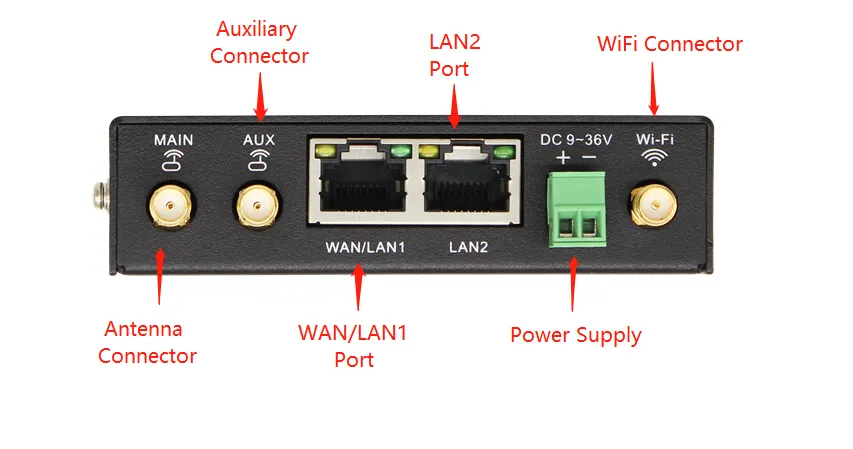

For detailed interface labels and structural dimensions, see §2.2. For LED definitions, see §2.3.

---

### Step 2: Mount the Device

Mount the device on a DIN rail or a wall.

**DIN rail** (recommended): Tilt the device approximately 45° to the right, hook the upper part of the DIN-rail seat onto the rail, then rotate the lower end upward until it clicks into place. Verify the device is firmly fixed.

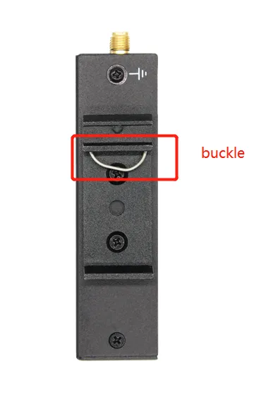

**Wall mounting**: Attach the hanging ears to both sides of the device with screws, then fix the ears to the wall with screws.

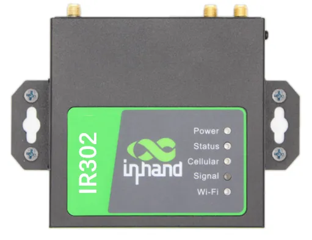

For detailed installation and disassembly steps, see §2.4.

---

### Step 3: Connect Power and Ethernet

1. Remove the power terminal from the router. Loosen the locking screws, insert the power cable, and tighten the screws securely.
2. If grounding is required, unscrew the ground nut, place the grounding ring of the cabinet ground wire onto the ground stud, and tighten the nut.
3. Connect the WAN port to the upstream network (Internet) and the LAN2 port to your PC with the supplied Ethernet cable.

> **Attention:** Ensure the voltage and rated current of the power source match the device requirements: **12 V DC** (range **9~36 V DC**), **0.2~0.22 A**.

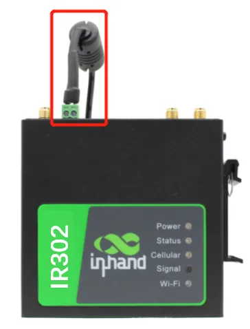

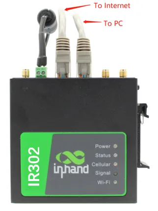

For power terminal wiring, grounding requirements, and Ethernet details, see §2.5.2.

---

### Step 4: (If Using Cellular) Power Off, Install SIM, and Connect Antennas

> **Warning:** To insert or remove a SIM card, you **must power off** the device first. Hot-swapping is prohibited to avoid data loss or equipment damage.

1. Press and hold the SIM pop-up button to eject the card holder. Load the SIM card into the holder and push it back into the slot.
2. Rotate the cellular antenna clockwise onto the **ANT** connector until it is firmly seated. If an **AUX** connector is present, install a second antenna to enhance signal strength.

> **Note:** Do not hold the black rubber antenna body to twist; grip the metal connector only. The ANT antenna transmits and receives data. The AUX antenna can only enhance signal and cannot be used alone.

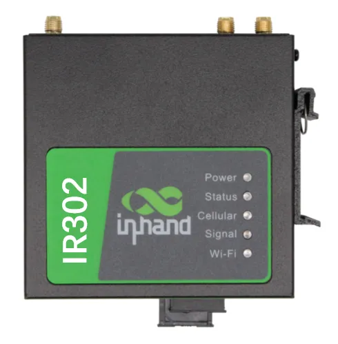

For SIM slot locations, antenna silkscreen names, and installation details, see §2.5.3.

---

### Step 5: Power On and Confirm the Device Is Ready

Apply power and observe the front-panel LEDs:

- **PWR** (red) solid on: Device is powered.
- **STATUS** (green): On or flashing depending on system state.
- **CELLULAR** (yellow): Indicates cellular module status.
- **Wi-Fi** (green): Indicates Wi-Fi status.

Refer to the LED illustration below for approximate positions.

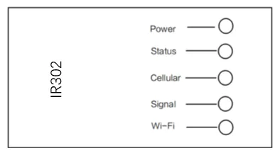

For the complete LED state table, see §2.3.

---

### Step 6: Log In via PC and Browser

1. Set your PC to obtain an IP address automatically via DHCP (recommended), or manually configure an IP address in the same subnet as the gateway (see §2.7.1 for details).
2. Open a browser and enter the device default address: `http://192.168.2.1`
3. If the browser indicates that the page is not secure, open the hidden or advanced options and select continue to proceed.

| Port Role | Default IP |
| :---: | :---: |
| LAN2 | 192.168.2.1 |

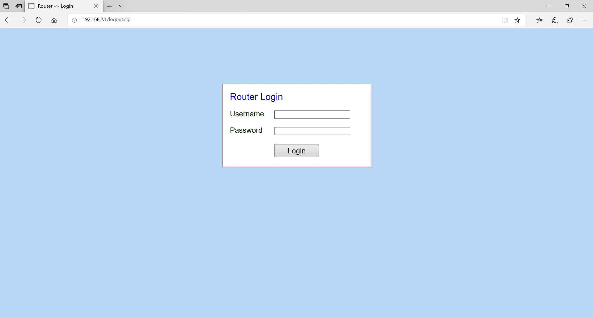

For login details, certificate warnings, and factory reset procedures, see §2.7.

---

### Post-Installation Checklist

- ☐ Device is securely mounted (DIN rail or wall).  
- ☐ Power and Ethernet cables are connected; ground wire is attached if required.  
- ☐ If using cellular, SIM card and antennas are installed.  
- ☐ **PWR is solid red** and **STATUS** shows normal green indication.  
- ☐ Browser can open `192.168.2.1` and display the login page.  

If you cannot log in, verify that your PC is in the same subnet as the device. If you need to restore factory settings, see §2.7.2.

---

## Part Two: Detailed Information

### 2.1 Packing List

Each IR302 product includes common accessories. Please check carefully when you receive the product. Contact the sales staff of InHand if anything is missing or damaged.

In addition, according to different site characteristics, InHand can provide customers with optional accessories.

**Standard Accessories**

| Accessories | Unit | Description |
| --- | --- | --- |
| IR 302 | 1 | Industrial router |
| Hanging ear | 2 | For router mounting |
| Power Adapter | 1 | 12V DC power adapter |
| Ethernet cable | 1 | 1.5 m Ethernet cable |
| Cellular Antenna | 1 | Suction antenna |
| Wi-Fi Antenna | 1 | Suction antenna |

**Optional Accessories**

| Accessories | Unit | Description |
| --- | --- | --- |
| Din rail | 1 | For router mounting |

---

### 2.2 Product Structure and Identification

This manual is for the installation and operation of InRouter302 series routers of InHand Networks Company. InHand makes every effort to provide accurate information in this manual, but InHand does not guarantee that there is no error in the manual. All statements, information and recommendations in this manual do not constitute any expressed or implied warranty.

Please confirm the product model and packaging accessories (power terminal, antenna). Please purchase SIM cards from local network operators.

#### 2.2.1 Front Panel

#### 2.2.2 Structural Dimensions

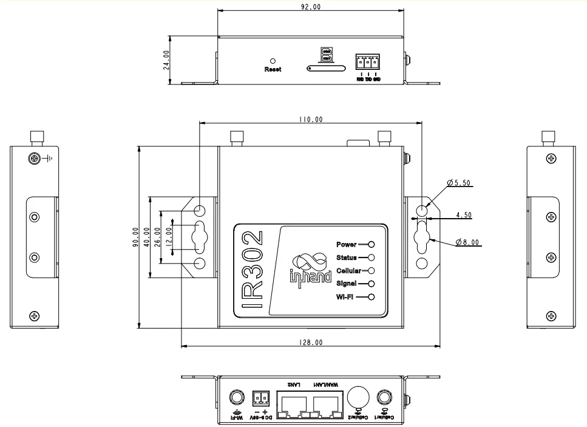

---

### 2.3 LED Indicators and Reset Button

#### 2.3.1 System LED Indicators

Equipment LED Light Description Table:

| Power (red) | Status (Green) | Cellular (Yellow) | Definition |
| --- | --- | --- | --- |
| Off | Off | Off | No Power |
| On | Off | Off | System Fault |
| On | On | Off | Module or SIM Card not identified |
| On | On | Flash | Dialing |
| On | On | On | Dialing Success |
| On | Flash | On | System Upgrade |
| On | Flash -> On | Off | Finalized Writing -> Finalized Writing |

#### 2.3.2 Cellular Signal Strength LEDs

| Signal | Color | Signal Values |
| --- | --- | --- |
|  | Red | 0~10 |
|  | Yellow | 11~20 |
|  | Green | 21~30 |

#### 2.3.3 Wi-Fi LED

| Wi-Fi (Green) | State |
| --- | --- |
| Not enabled | Off |
| AP | Flash |
| STA | Flash |

#### 2.3.4 Reset Button

The **RESET** button is located on the front panel of the device (refer to the panel illustration in §2.2.1). Pressing and holding this button during power-on performs a hardware factory reset. For the complete hardware reset procedure and LED state transitions, see §2.7.2.

---

### 2.4 Mechanical Installation

#### 2.4.1 DIN Rail: Installation

The steps are as follows:

1. Select the installation location of the device and make sure there is enough space.
2. Tilt the equipment to the right 45°, so that the upper part of the DIN-rail seat is stuck on the DIN-rail, holding the lower end of the equipment, up slightly to rotate the equipment, the DIN-rail seat can be stuck on the DIN-rail. Verify that the equipment is fixed on DIN-rail.

#### 2.4.2 DIN Rail: Disassembly

The steps are as follows:

1. Hold the bottom end of the equipment with one hand and the top end of the slippery course side with the other hand, push lower end of the device to leave the DIN-rail.
2. Turn the equipment clockwise and lift the equipment, removed the equipment from the DIN rail.

#### 2.4.3 Wall Mounting

**Installation**

The steps are as follows:

1. Fix the hanging ear to both sides of the device with screws.
2. Fix the hanging ear to the wall with screws.

**Disassembly**

Use one hand to hold the device and the other hand to remove the screws with screwdriver, remove device from the fixed position.

---

### 2.5 Connections and Wiring

#### 2.5.1 Ethernet

The device provides Ethernet ports for wired network connectivity. For initial setup, connect the WAN port to the upstream Internet source and the LAN2 port to your PC.

> **Note:** When the device does not use Cellular Dial-up access, the "dial-up interface" must be disabled, otherwise the device cycle dial-up to the maximum number, it will lead to device restart, network business interruption.

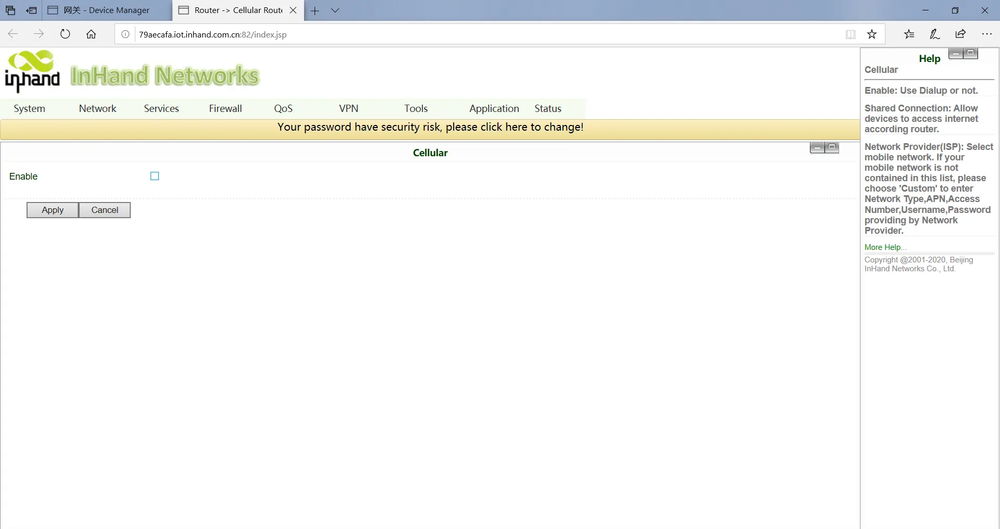

#### 2.5.2 Power and Ground

**Power Installation**

The steps are as follows:

1. Remove power terminal from router.
2. Unscrew the locking screw on the power terminal.
3. Insert the power cable into the terminal and lock the screws.

**Ground Installation**

The steps are as follows:

1. Unscrew the ground nut.
2. Put the grounding ring of the cabinet ground wire into the ground stud.
3. Tighten the ground nut.

> **Attention:** In order to improve the anti-jamming ability of the router, the router must be grounded when it is used, and the ground wire is connected to the grounding stud of the router according to the actual use environment.

#### 2.5.3 Cellular SIM and Antennas

**SIM Card Installation**

IR302 support dual SIM card, hold down SIM pop-up button will pop up the card holder, load the SIM card.

> **Attention:** To replaced or plugged SIM Card, you must power off and restart to avoid data loss or equipment damage.

**Antenna Installation**

Rotate the metal interface clockwise until the movable part cannot be rotated, do not hold the black glue stick to twist the antenna.

IR302 support dual antennas, ANT antenna and AUX antenna. The ANT antenna is the antenna which receives and transmits data, AUX antenna can only enhance the antenna signal degree and cannot receive and sent data, so it can't be used alone. Generally, only use ANT antenna.

---

### 2.6 Power and Environment

| Item | Specification |
|------|--------------|
| Input Voltage | 9~36 V DC (12 V DC nominal) |
| Rated Current | 0.2~0.22 A |
| Operating Temperature | -20℃ to +70℃ |
| Storage Temperature | -40℃ to +85℃ |
| Relative Humidity | 5% to 95% (non-condensing) |

---

### 2.7 First Login and Management

#### 2.7.1 Web Login

Step 1: Plug in the power cord and network cable according to the diagram, connect WAN port to the Internet, connect LAN2 port to PC.

Step 2: Set the PC in the same network segment as the IP address of gateway device.

Method 1: DHCP automatically get the address (Recommended).

Method 2: Use fixed IP address, set the PC and gateway in the same address segment (DHCP Server for LAN2 Port is default enabled).

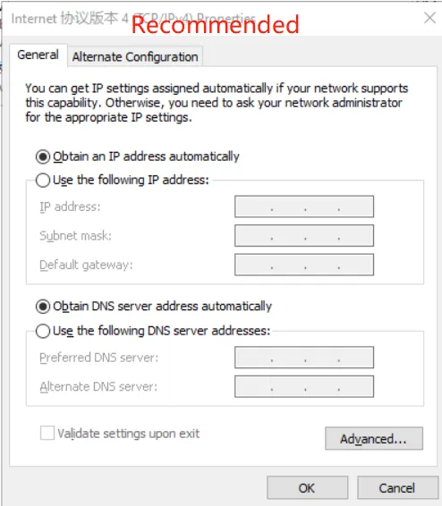

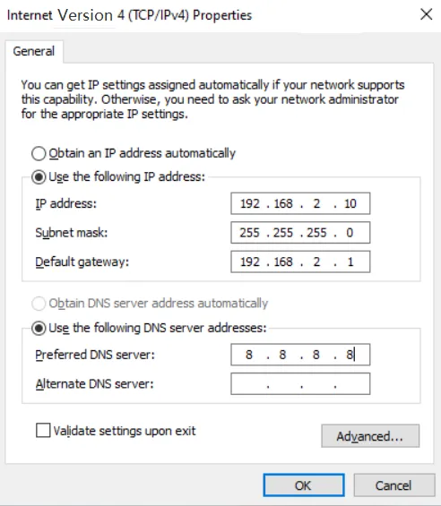

PC only needs to configure the IP address to any value in: "192.168.2.2.2~192.168.2.254"

The gateway is set to: "192.168.2.1", the subnet mask is: "255.255.255.0".

The DNS is configured to "operator DNS server address".

Step 3: Input the device default address 192.168.2.1 in the browser, enter the device Web page management (If the page indicates that the page is not secure, open hidden or advanced, select continue to go).

| Port Role | Default IP |
| :---: | :---: |
| LAN2 | 192.168.2.1 |

#### 2.7.2 Factory Reset

**Web Setting**

Login to the WEB page, click on the "System >> Configuration Management" menu in the navigation tree to enter the "configuration management" interface. Click the "restore factory settings" button to determine the recovery of the factory after the configuration, restart the system, restore factory success.

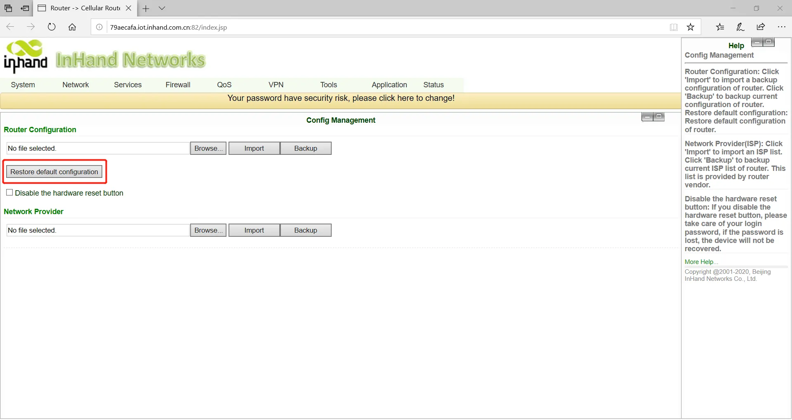

**Hardware Restored**

To restore the device to default settings using the reset button, please follow these steps:

1. Power on the device and immediately press and hold the **RESET** button until the **Status LED** turns **solid**.
2. Release the **RESET** button and wait for the **Status LED** to turn off.
3. Press and hold the **RESET** button again until the **Status LED** starts **flashing**, then release the button. The device will now be restored to its default settings and will restart normally.

#### 2.7.3 Internet Access Configuration

**Wired to Internet**

Step 4: Configuration WAN port, click on the navigation bar "Network >> WAN/LAN Switch", select WAN mode to configure IP address of Wan port, so that the device can access to the Internet. (Make sure the interface is in WAN mode, initial default LAN mode)

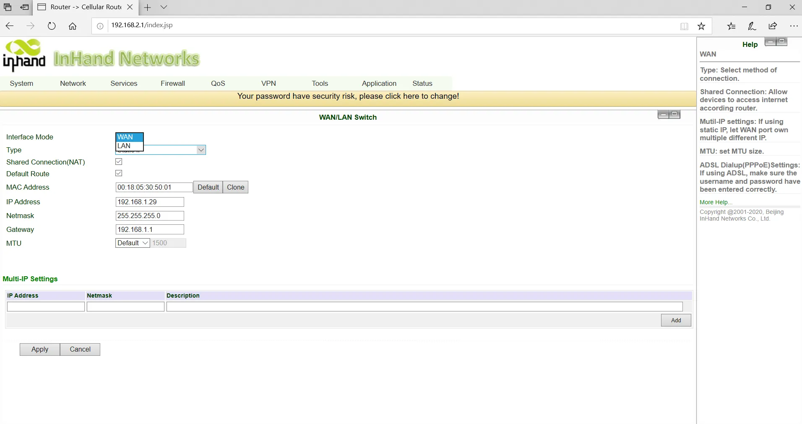

Step 5: Three ways to assign address, dynamic DHCP (recommended), static address, ADSL dial (click application after configuration is completed).

Step 6: Use the PING tool to verify your network connection.

**SIM Card Dial-Up**

Step 1: Insert the SIM card into the slot 1 and Install 3G/4G LTE antenna to the ANT antenna connector, then connect the network cable and power cable, at last, power the device.

> **Attention:** To replaced or plugged SIM Card, you must power off and restart to avoid data loss or equipment damage.

Step 2: Open the browser, login device WEB interface. (refer to 2.7.1 Web Login)

Step 3: Click on the navigation bar "network >> Cellular" set dial-up access parameters, the device initial default on dial-up function, wait a few minutes to access the Internet. (if not dial-up, you can restart Cellular Service).

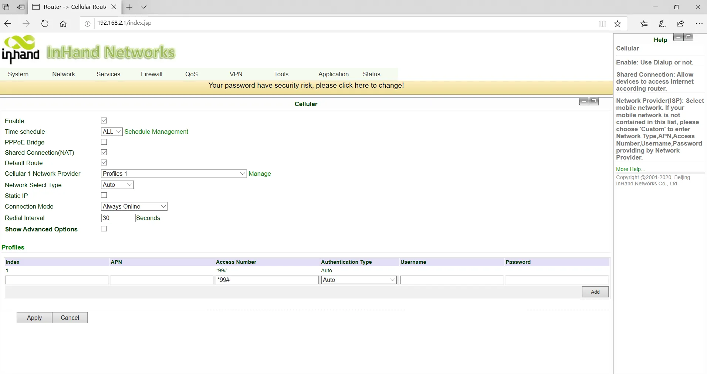

Step 4: The device supports dual card mode, when the SIM card insert card slot 2, need to enable dual SIM card function in advanced settings, private network dial parameters can be set in the dial parameter set, new click on the application, and then select at the cellular network operator.

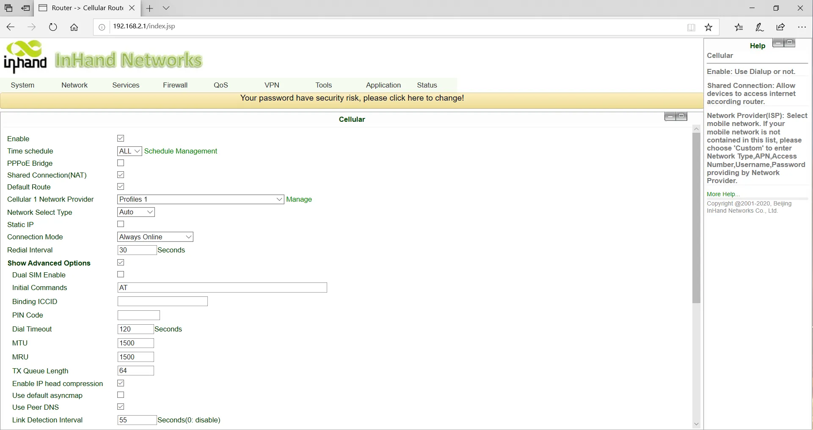

Step 5: Click on the navigation bar "status >> network connection" to view the network status, showing the connected and assigned IP address and other status, indicating that the SIM card has successfully accessed the Internet.

**Wi-Fi to Internet**

Step 1: Wi-Fi the antenna to connect the WLAN antenna column, the network wire to the PC and insert the power supply. (Please refer to 2.7.1 Web Login for login WEB interface)

Step 2: Set Wi-Fi two working modes: AP, STA.

Mode 1: In AP mode (initial default mode), the device acts as a wireless access point and emits the wireless signal, so that terminal devices can access the Internet through the connection to the AP. Ensure that the device has been connected to the Internet through the above wired, cellular dialing mode. You can set the SSID name and encryption authentication, and choose the terminal connection password according to your needs.

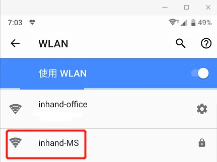

Mode 2: STA mode means that station, device does not have the function of Internet access, it needs to connect to the AP device to provide bridges for the terminal equipment that cannot connect to the AP, such as the PC device.

Step 3: Click on the navigation bar "Network >> WLAN Mode Switch" to switch the working mode to the STA, then apply and restart the device as prompted.

Step 4: Click on the navigation bar "Network >> WLAN Client", click on the scan to select the target SSID, set encryption and password.

Step 5: Click on the navigation bar "Network >> WAN (STA)", set WAN port IP parameter.

Three ways: dynamic address (recommended), static IP, ADSL dial.

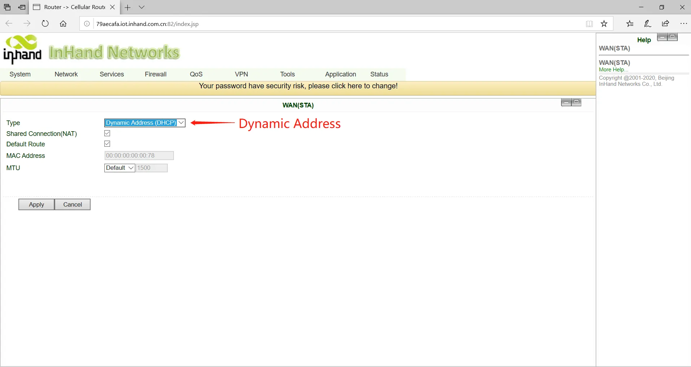

Step 6: Click on the navigation bar "Status >> Network Connection" to see the connection status, if connected and get the dynamic DHCP address, it means that the device is online.

#### 2.7.4 Import/Export Configuration

Login to the WEB page, click on the "System >> Configuration Management" menu in the navigation tree to enter the "configuration management" interface.

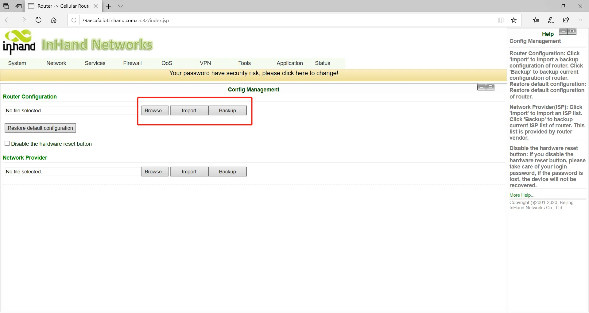

Click Browse to select the profile, and then click the Import button. After importing the configuration file, restart the system to take effect.

Click Backup to export the currently applied configuration parameter file, and the exported file is in ".dat" format, with the default file name config.dat.

#### 2.7.5 Log and Diagnostic Records

Log in to the Web page, click on the "Status >> Log" menu in the navigation tree to enter the "system log" interface. Click the corresponding button to complete the log and diagnostic records download.

#### 2.7.6 DM Cloud Management Platform

**Environmental Conditions**

Make sure the device has been successfully accessed Internet, click on the "Service >> Device remote management platform" of the navigation menu to set up the access of DM Cloud Platform.

(Follow-up version supports user experience plan, which can automatically access Inhand Cloud Platform and enjoy efficient and convenient service)

Server address: the address of the Device Manager. The address of the Device Manager developed by InHand is as follows:

Device Manager: iot.inhandnetworks.com

InConnect: ics.inhandnetworks.com

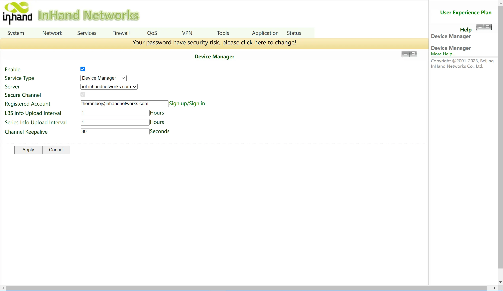

**Platform Account Creation**

Jump to the registration/login page through the link below for user registration.

Link: https://iot.inhandnetworks.com.

**Add Device to Platform**

Login to DM platform address https://iot.inhandnetworks.com, click on "Gateway >> Create" menu to add device.

Name the device and fill in the serial number, the device can be added to the cloud platform.

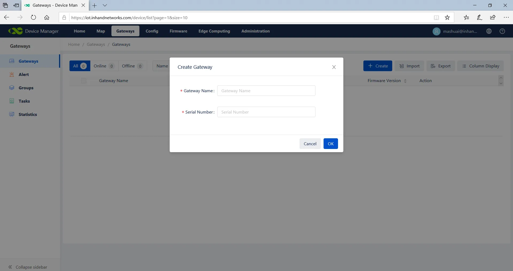

**View Serial Number Method**

Click on the navigation bar "status" to view the device sequence and other basic information, or on the back of the device to view the serial number.

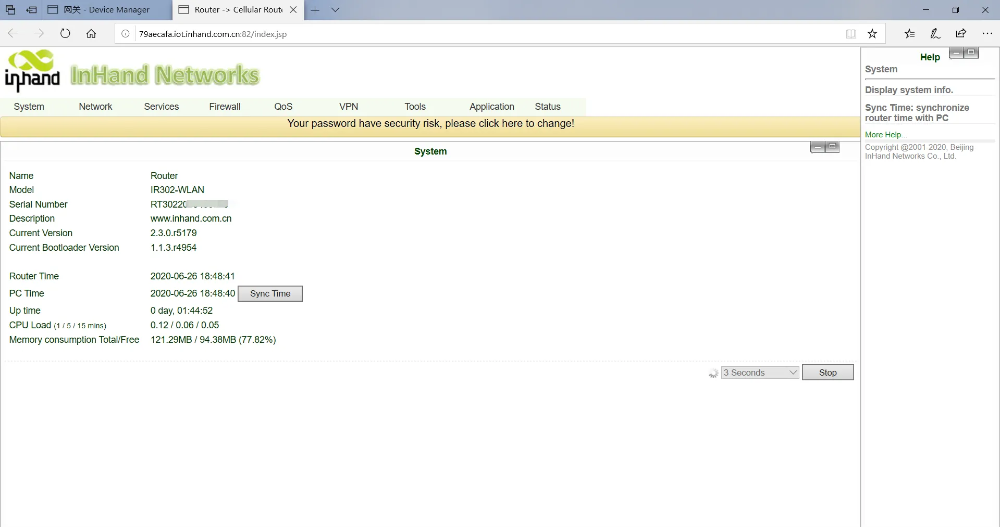

---

### 2.8 Related Documents

| Need | Destination |
|------|-------------|
| Product introduction, detailed configuration, and troubleshooting | IR302 User Manual |
| Ordering information and antenna models | IR302 Product Specification |
| Software downloads and announcements | [www.inhand.com](http://www.inhandnetworks.com) |

---

### 2.9 Legal Information

This manual is for the installation and operation of InRouter302 series routers of InHand Networks Company. InHand makes every effort to provide accurate information in this manual, but InHand does not guarantee that there is no error in the manual. All statements, information and recommendations in this manual do not constitute any expressed or implied warranty.

IR302 router must be used in compliance with any and all applicable national and international laws and with any special restrictions regulating the utilization of the communication module in prescribed applications and environments.

This device meets the official requirements for exposure to radio waves. This device is designed and manufactured not to exceed the emission limits for exposure to radio frequency (RF) energy set by authorized agencies. The device must be used with a minimum separation of 20 cm from a person's body to ensure compliance with RF exposure guidelines. Failure to observe these instructions could result in your RF exposure exceeding the applicable limits.

External antennas used with IR300 must be installed to provide a distance of at least 20 cm from any people and must not be co-located or operated in conjunction with any other antenna or transmitter.

Any external antenna gain must meet RF exposure and maximum radiated output power limits of the applicable rule section.

Like any wireless device, this device operates using radio signals, which cannot guarantee connection in all conditions. Therefore, you must never rely solely on any wireless device for emergency communications or otherwise use the device in situations where the interruption of data connectivity could lead to death, personal injury, property damage, data, or other loss.

---

**Contact Us**

Add: 3650 Concorde Pkwy, Suite 200, Chantilly, VA 20151, USA

E-mail: [support@inhandneworks.com](mailto:support@inhandneworks.com)

T: +1 (703) 348-2988

URL: [www.inhand.com](http://www.inhandnetworks.com)
