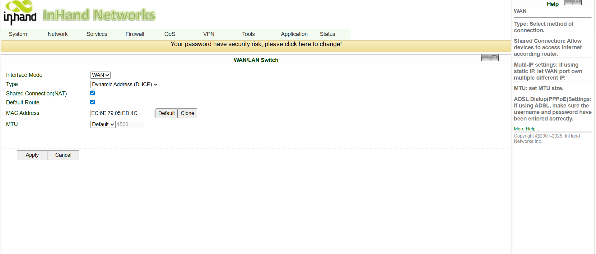
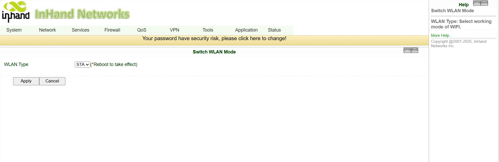
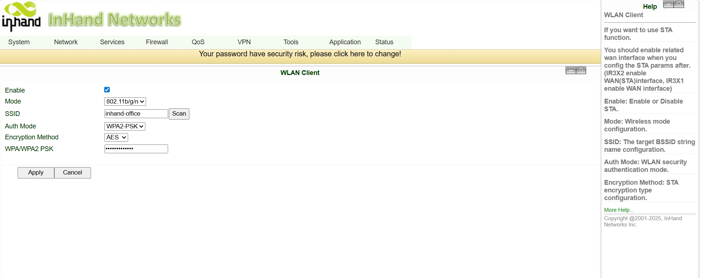
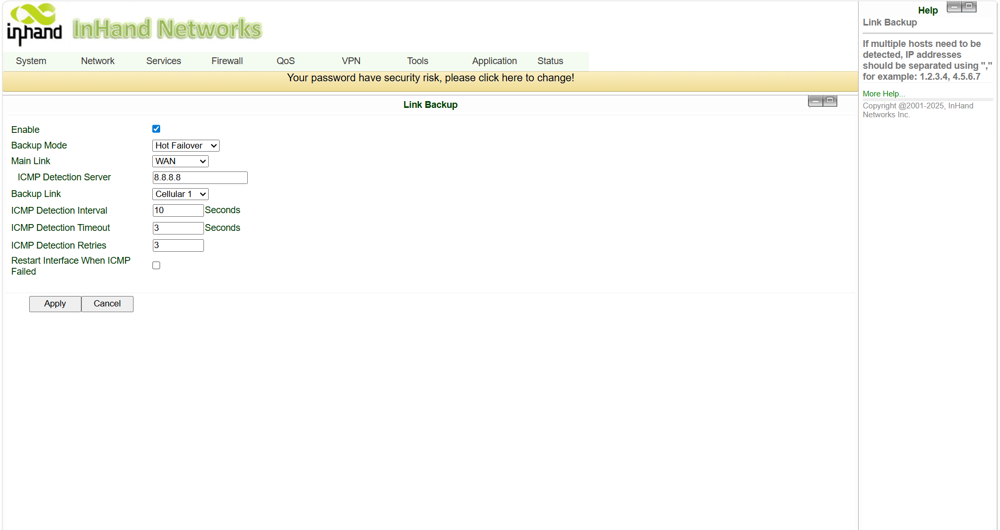
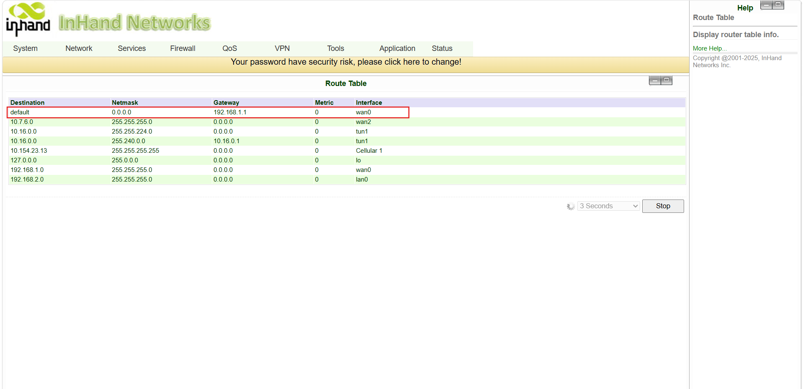
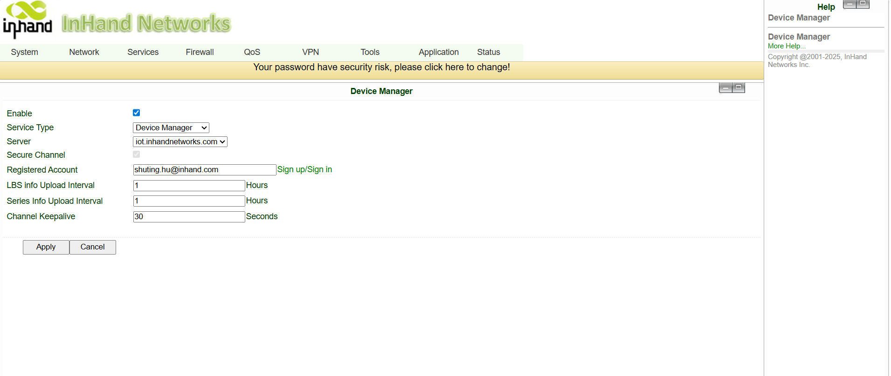
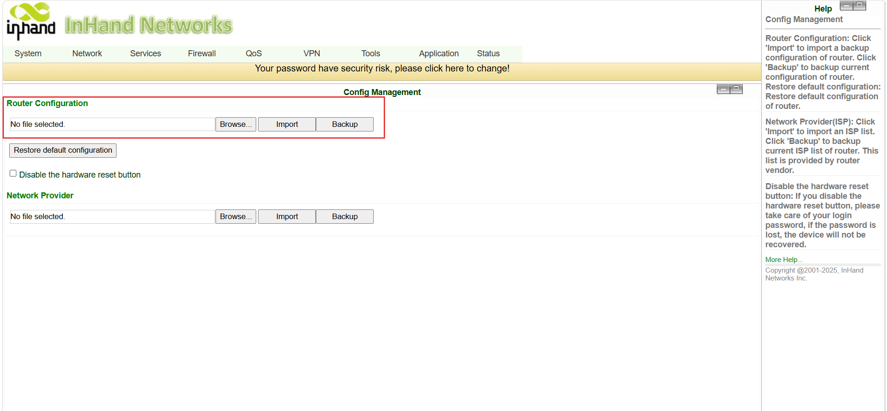

# Always-Online Connectivity Configuration Guide

## 1. Document Information

- **Product model:** InHand IR302 Industrial Cellular Router
- **Feature:** Link Backup (WAN / Cellular / Wi-Fi automatic failover)
- **Reference case:** Ethernet WAN as Main Link, 4G cellular as Backup Link, ICMP probe to `8.8.8.8`, Hot failover mode
> **Overall flow:** Bring up at least two uplinks on the IR302 (WAN + Cellular, or WAN + Wi-Fi, or Cellular + Wi-Fi). Then enable **Link Backup**, pick a **Main Link** and a **Backup Link**, set an **ICMP detection target**, and choose a **Backup mode** (Hot failover / Cold failover / Load Balance). The router automatically monitors and switches the default route based on the probe result.

---

## 2. Prerequisites

1. IR302 powered on (DC 9–36 V) and reachable on its LAN port.
2. A laptop connected to **IR302 LAN2** and configured to the same subnet (default LAN `192.168.2.0/24`).
3. **SIM card** inserted (insert with the device powered OFF) if cellular is used as one of the links.
4. **Ethernet uplink** plugged into the `WAN/LAN` port (set as WAN) if Ethernet is used as one of the links.
5. **Upstream Wi-Fi credentials** (SSID + password) if Wi-Fi STA is used as one of the links.
6. A web browser for the IR302 Web UI.

Default credentials (factory):

| Item | Value |
|---|---|
| LAN IP | `192.168.2.1` |
| Subnet mask | `255.255.255.0` |
| Web username | `adm` |
| Web password | `123456` *(or random — see device label)* |

> **Change all default passwords after first login.**

---

## 3. Part 1 — Log in to the IR302 Web UI

1. Connect the PC to the IR302 **LAN2** port with an Ethernet cable.
2. Set the PC IP to the same subnet as `192.168.2.1` (e.g. `192.168.2.100/24`).
3. Open a browser and go to `http://192.168.2.1`.
4. Log in with the default credentials (`adm` / `123456`) or the random password on the device label.

---

## 4. Part 2 — Bring up the Uplinks

Before enabling Link Backup, both uplinks must already be configured and confirmed online individually. Go to **Status → Network Connections** and verify that each of the links you intend to use shows an active state.

### 4.1 Ethernet WAN

1. Go to **Network → WAN/LAN Switch**).
2. Set the `WAN/LAN` port to **WAN** mode.
3. Choose **DHCP**, **Static**, or **PPPoE** according to what the ISP provides; apply.
4. Plug the ISP cable into the `WAN/LAN` port.
5. Confirm on **Status → Network Connections** that the WAN link has obtained an IP and is online.

### 4.2 4G Cellular

1. Power the device OFF, insert the SIM card, power back ON.
2. Go to **Network → Cellular**.
3. For public IoT SIMs, no APN is required. For private / customized SIMs, fill in the APN, username, and password provided by the carrier.
4. Apply and wait for the cellular link to come up.
5. Check the **Signal** indicator on the front panel: red = poor (0–10), yellow = medium (11–20), green = good (21–30). Aim for green.
6. Confirm on **Status → Network Connections** that cellular has obtained an IP.

### 4.3 Wi-Fi STA (optional)

If Wi-Fi is to be used as one of the links, the IR302 Wi-Fi must be set to **STA** (client) mode, not AP.

1. Go to **Network -> Switch WLAN Mode**, swith from **AP -> STA**, apply and **reboot** the device.

2. Enable **WAN(STA)** mode,choose **DHCP**, **Static**, or **PPPoE** according to what the ISP provides; apply.

3. Go to **Network -> WLAN Client**, scan for the upstream SSID, enter the Wi-Fi password, apply.

4. Confirm on **Status → Network Connections** that Wi-Fi STA has obtained an IP from the upstream Wi-Fi.

---

## 5. Part 3 — Enable Link Backup

1. Go to **Network → Link Backup**.
2. Tick **Enable**.
3. Select **Main Link** and **Backup Link**
3. Click **Apply**.

### 5.1. Configure Main Link, Backup Link & Detection

Still on the **Network → Link Backup** page, fill in the parameters below.

| Field | Value (this case) | Notes |
|---|---|---|
| Main Link | `WAN` | The preferred uplink under normal operation |
| Backup Link | `Cellular` | Takes over when the main link fails |
| ICMP detection server | `8.8.8.8` | Any always-on public IP; can be replaced with the customer's own HQ/server |
| Backup mode | `Hot failover` | See section 6.1 below |

Click **Apply** to save.

### 5.2 Choosing the Backup mode

The IR302 supports three backup modes:

| Mode | Behavior | When to use |
|---|---|---|
| **Hot failover** | The router keeps **both** links connected at all times. If the main link fails, traffic switches to the already-online backup link **immediately**. Uses a small amount of data on the backup link to keep it alive. | Sites where the **fastest** failover is critical (payments, alarms, medical, mission-critical control). |
| **Cold failover** | Only the main link is up. The backup link **only dials up when the main link is down**. **Zero cellular usage** while the main link is healthy. Failover takes a few extra seconds because the backup needs to dial up. | Sites where **minimizing SIM data charges** is more important than the last few seconds of failover time. |
| **Load Balance** | The router uses **both links at the same time** and distributes outbound traffic across them. | Throughput aggregation, dual-SIM bonded use cases. |

> For most fixed sites with wired WAN + 4G backup, **Hot failover** is the recommended default.

---

## 7. Part 5 — Verify the Default Route

1. Go to **Status → Route Table**.
2. The default route (`0.0.0.0/0`) should point to the **Main Link** interface (in this case, the WAN interface).

---

## 8. Part 6 — Test Failover

Test the failover by simulating a main-link outage:

1. Disconnect the Ethernet cable from the `WAN/LAN` port (or pull the upstream ISP cable).
2. Wait a few seconds for the ICMP probes to declare the WAN link down.
3. Go to **Status → Route Table**.
4. The default route should now point to the **Backup Link** (cellular). All outbound traffic from the LAN device is now going through 4G.

### 8.1 Test fallback

1. Reconnect the Ethernet cable to the `WAN/LAN` port.
2. Wait for the WAN to come back online and pass the ICMP probe.
3. Go to **Status → Route Table** again.
4. The default route should automatically switch back to the **Main Link** (WAN). No manual action required.

---

## 9. Optional — Hardening & Operations

### 9.1 Change the default Web password

1. Go to **System → Admin Access** (or **System Settings → Management**).
2. Enter the username, old password, and a new strong password.
3. Apply and save.

### 9.2 Restrict / open remote management

1. Go to **System → Admin Access**.
2. In the Management section, choose the service type (HTTPS / SSH), the port, and whether to allow Remote (WAN) management.
3. Apply and save.

### 9.3 Enable Device Manager (cloud O&M)

1. Go to **Services → Device Remote Management Platform**.
2. Tick **Enable**.
3. Service type: **Device Manager**.
4. Server: choose **China** or **International** based on your project region.
5. Account: your registered InHand Device Manager account.
6. Apply and save.

### 9.4 Backup the configuration

1. Go to **System → Configuration Management**.
2. In **Router Configuration**, click **Backup** to download a backup file.
3. To restore, click **Import Config** and reboot to apply.

---

## 10. Troubleshooting

| Symptom | Check |
|---|---|
| Cannot open the Web UI | Same subnet as `192.168.2.1`? IP conflict? Cable OK? Try a factory reset. |
| Cellular cannot dial up | SIM seated? APN correct (for private SIMs)? Signal value ≥ 21? |
| WAN does not come up | Cable in the `WAN/LAN` port? Port set to WAN mode? Correct IP mode (DHCP / Static / PPPoE)? |
| Wi-Fi STA does not connect | Wi-Fi set to **STA** (not AP) mode? Correct SSID / password? Signal strong enough? |
| Failover does not happen | Is **Link Backup → Enable** ticked and applied? Is the ICMP target reachable from a known-good link? Is the SIM whitelisted to reach `8.8.8.8`? |
| Fallback to main does not happen | Is the main link actually passing the ICMP probe? Try pinging the target from the WAN side. |
| Both links online but traffic stuck on backup | Check **Status → Route Table** — the default route should match the active link. Re-apply Link Backup config. |
| Signal OK but cannot reach the server | LAN device gateway / DNS set correctly? SIM whitelist allows the server endpoint? |

---

## 11. Safety Notes

- Ground the device properly on industrial / outdoor / vehicle sites.
- Do not hot-plug serial cables while powered.
- Back up the configuration after every change.
- Change default passwords periodically.
- Only authorized personnel should operate the gateway.

---
