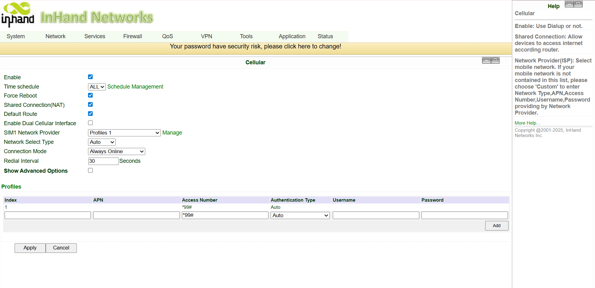
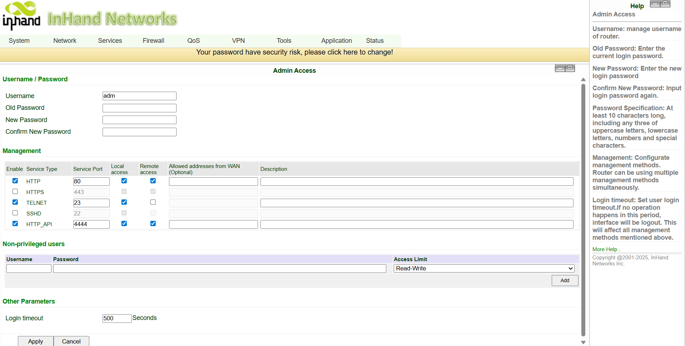
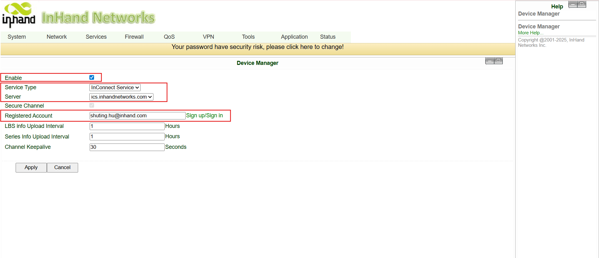
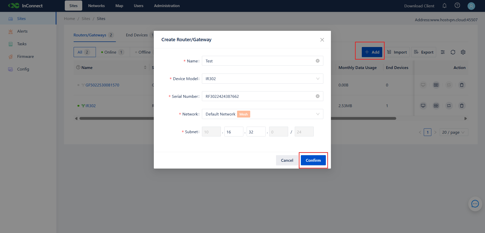
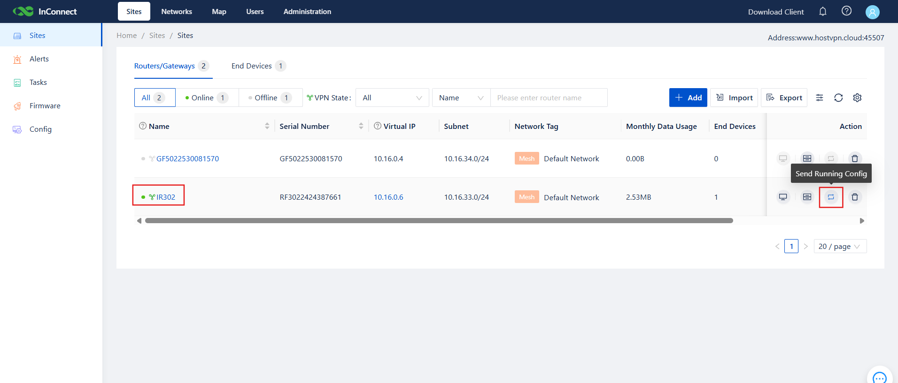
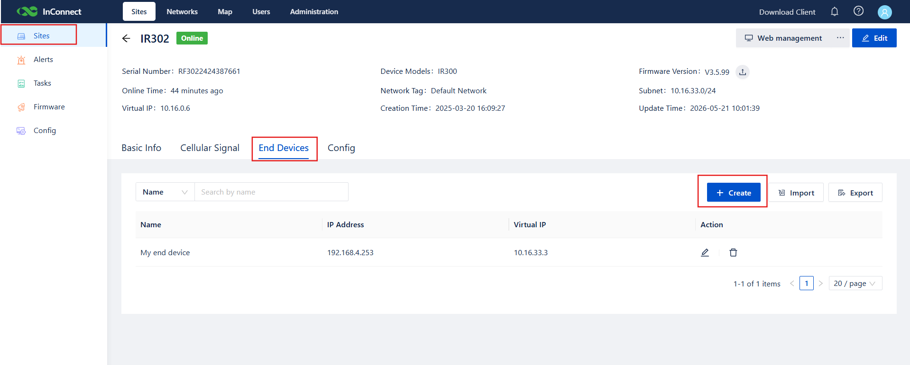

# End Devices Remote Management - Configuration Guide

## 1. Document Information

- Product Model: IR302
- Companion Platform: InConnect Service (ICS)
- Platform URL: `ics.inhandnetworks.com` 
- Applicable Scenarios: Industrial / medical / kiosk / POS terminal networking, remote O&M

## 2. Router Overview

### 2.1 Product Introduction

The InRouter302 (IR302) is an industrial IoT wireless router that integrates 4G cellular, Wi-Fi, and VPN technologies to deliver a simple, reliable, and secure internet connection. It is designed for unattended field communication, featuring software and hardware watchdogs together with multi-level link detection to ensure connection stability. It supports the InHand **Device Manager / InConnect Service** cloud platforms for end-to-end remote management, making it well suited for industrial and commercial IoT deployments.

### 2.2 Key Features

- Provides internet connectivity to Ethernet and serial devices
- Multi-link uplink: 4G, Wi-Fi, wired Ethernet
- Remote configuration, remote diagnostics, remote upgrade, remote management 

### 2.3 Topology

## 3. Hardware Description

### 3.1 Appearance and Interfaces

- Power input: DC 9–36 V, reverse-polarity and over-current protection
- Serial port: 1× RS232 (optional)
- Ethernet: 2× RJ45, WAN/LAN
- Wireless: 4G / Wi-Fi (optional)
- LEDs: Power, Status, Cellular, Signal, Wi-Fi
- Reset button: restore factory defaults

### 3.2 Interface Notes

- Positive: V+
- Negative: V−
- Notes: reverse-polarity / lightning / grounding protection
- MAIN → 4G main antenna
- WiFi → Wi-Fi antenna
- AUX → 4G auxiliary antenna (North America models only)
- WAN/LAN → Ethernet port (can be switched to WAN mode)
- LAN2 → Ethernet LAN port (for downstream devices)
- Ground: connect to earth ground; prevents static and noise interference

## 4. Factory Defaults

- Default IP: `192.168.2.1`
- Subnet mask: `255.255.255.0`
- Web username: `adm`
- Web password: `123456` (some batches ship with a random password printed on the nameplate)
- ICS server (default): `ics.inhandnetworks.com`

## 5. Pre-deployment Checklist

1. Set the PC's IP to the same subnet as the IR302 LAN (gateway `192.168.2.1`).
2. Connect the PC to the IR302 LAN port with an Ethernet cable.
3. Power on the router and wait until the Status LED is solid.
4. Make sure a working browser (Chrome recommended) is installed on the PC.
5. Register an account on `https://ics.inhandnetworks.com` ahead of time and confirm you can log in.
6. Prepare the field devices to be managed; record their real IPs and set their gateway to the IR302 LAN IP.

## 6. Network Configuration

### 6.1 LAN Configuration (Static)

1. Go to **Network Settings → LAN**.
2. Set an IP address that shares a subnet with the downstream devices and acts as their gateway.
3. Click **Apply**.
4. After applying, log in again using the new LAN IP.

### 6.2 4G Cellular Configuration

1. Power off the router and insert the SIM card.
2. Go to **Network → Cellular**.
3. For customized SIMs, configure the APN; a standard IoT SIM typically requires no APN.
4. Check the Signal LED on the front panel — red: weak (0–10) / yellow: medium (11–20) / green: good (21–30).

## 7. Router User Management

### 7.1 Change Username & Password (optional)

1. Go to **System Settings → Admin**.
2. Enter the username, old password, and new password.
3. Click **Apply** and save the configuration.

### 7.2 Enable the Remote Management Platform (InConnect Service)

1. Go to **Services → Device Manager**.
2. Check **Enable**.
3. Set **Service Type** to **InConnect Service**.
4. Set **Server** to your regional endpoint (`ics.inhandnetworks.com`).
5. Set **Registered Account** to the email you used when registering on ICS.
6. Click **Apply** and save.

### 7.4 Configuration Backup & Restore (optional)

#### Backup configuration

1. Go to **Services → Configuration Management**.
2. Under Router Configuration, click **Backup**.

#### Import configuration

1. Go to **Services → Configuration Management**.
2. Under Router Configuration, click **Import**.
3. The imported configuration takes effect after reboot.

## 8. Adding the Router on InConnect Service

### 8.1 Add the Router

1. Log in to ICS, go to **Sites → Routers**, and click **Add**.
2. In the **Create Router** dialog, fill in:
   - A custom name (e.g., `Test`)
   - The router's serial number (printed on the nameplate, also visible on the router's Web Status page)
   - Router model: select **IR302**
3. Click **OK**.
4. After the router is added, ICS automatically allocates a virtual IP (10.16.x.x) to it.

> The model must be correct; otherwise the connection will fail.

### 8.2 Verify the Connection

1. On the router Web UI, **Services → Device Manager** should show **Connected**.

2. On ICS:
   - Online status of the router is green → router is online.
   - VPN status is green → the OpenVPN tunnel is established.
   - If VPN remains offline, click **Send running Config** in the action column of the **Routers / Gateways** page.
   

## 9. Adding Downstream End Devices

1. On the ICS **Sites** page, choose **End Devices → Add**.
2. Enter the device name and its real IP (e.g., PLC at `192.168.2.215`).
3. Select the parent site (the IR302 you just added).
4. Click **Submit**. ICS automatically maps the device to a virtual IP (e.g., `10.16.46.1`).
5. Up to 254 downstream devices are supported per IR302.

## 10. Remote Client Access (OpenVPN)

### 10.1 Windows

1. Log in to ICS, download the OpenVPN client, and install it.
2. In the **Users** list, download your `.ovpn` profile.
3. Run **OpenVPN GUI** as administrator. Right-click the tray icon → **Import file**, and import the profile.
4. Click **Connect**. The tray icon turns green when the tunnel is up.
5. Open a Command Prompt and ping the router's virtual IP (e.g., `10.16.0.3`).
   - If the ping succeeds, you are connected.
   - If it fails, allow ICMP in Windows Defender Firewall or disable the firewall temporarily.

### 10.2 Android / iOS

1. Scan the QR code in ICS to download the OpenVPN mobile client.
2. Send the `.ovpn` profile to your phone.
3. In the client: **FILE → select profile → IMPORT → ADD**, then toggle on the profile.
4. After the tunnel is up, use a ping app to verify the virtual IP is reachable.

## 11. Network Isolation (Optional)

### 11.1 Mesh Network — Device-to-Device Access

1. Go to **Networks → +**, create a network and choose **Mesh Network**.
2. Toggle on **Device-to-Device Access**.
3. Add members (router sites + users) and click **Submit**.

> Users and sites in the same Mesh can communicate; different Meshes are isolated, which is a clean way to avoid real-IP conflicts across multiple projects.

### 11.2 Star Network — Telecommuting

1. Go to **Networks → +**, choose **Star Network**, fill in the center IP.
2. Add users and sites, then submit.

> Use Star Network when employees need to reach company intranet servers via the ICS channel.

## 12. Advanced Remote Management

- **Remote Web** — On ICS, click the router name to launch a remote Web session without any port forwarding.
- **Remote configuration delivery** — Push a previously backed-up router config to multiple IR302s in one batch.
- **Remote firmware upgrade** — Upload firmware to ICS, then trigger or schedule a batch upgrade.
- **Tasks** — Automate upgrades and configuration delivery; review execution status and logs.
- **Consumption & billing** — Per-device traffic and billing visibility.

## 13. Troubleshooting

1. **Cannot open the Web UI**
   - Check the subnet, cable, and IP conflicts.
   - Restore factory defaults and retry.

2. **Cellular fails to dial up**
   - Verify the SIM card is healthy.
   - Verify the APN is correct.
   - Confirm cellular coverage (Signal LED green, value 21–30 recommended).

3. **Cellular works, but cannot reach the server**
   - Verify downstream devices have the correct IP and gateway.
   - Verify DNS is configured.
   - If the SIM is a whitelist card, add `ics.inhandnetworks.com` (or `.eu`) to the allowlist.

4. **IR302 shows "Registering" on ICS, never reaches "Connected"**
   - Confirm the serial number in ICS exactly matches the device.
   - Confirm the router can resolve and reach the ICS server.
   - Confirm the **Registered Account** on the router matches the ICS login email.

5. **Device online but VPN offline (green + grey)**
   - On ICS, click **Send running Config** in the Routers/Gateways action column.
   - Check whether the SIM provider blocks OpenVPN (UDP 1194).

6. **OpenVPN client connects but virtual IP unreachable**
   - Disable Windows Defender Firewall or allow ICMP.
   - Confirm both router status and VPN status are green on ICS.
   - Confirm the user and the site are members of the same Mesh network.

7. **Downstream device unreachable via virtual IP**
   - Confirm the device's gateway points to the IR302 LAN IP.
   - Some devices block ICMP — test the actual service port (Web / Telnet / Modbus) instead.
   - Re-check the device's real IP in ICS.

## 14. Security Notes

- Ground the device properly in industrial environments.
- Do not hot-plug the serial port or SIM card while powered.
- Change the default IR302 password after first login and rotate it periodically.
- Enable 2FA or bind a mobile number on the ICS account; enforce a strong password policy.
- Use ICS **External User** to invite contractors; do not share the main account.
- Back up router configuration after every major change.
- Restrict on-site operations and remote-client usage to authorized personnel.

