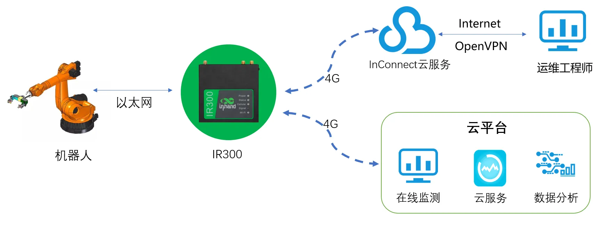

# Robot Remote Monitoring Solution

## 1. Solution Overview

### 1.1 Project Background

An internationally renowned automation group company, one of the world's leading providers of intelligent automation solutions, offers customers one-stop solutions ranging from robots and work cells to fully automated systems and their networking. Its market sectors span automotive, electronics, metal and plastics, consumer goods, e-commerce/retail, and healthcare.

Enthusiasm for building smart manufacturing and digital robots in China continues to grow, and society attaches increasing importance to this endeavor. In the development of high-end equipment manufacturing, smart manufacturing is an inevitable trend. Among these, the application of industrial robot interconnection has become an important part of smart manufacturing. Promoting and applying robot networking can, on the one hand, drive improvements in robot intelligence and, on the other hand, transform the traditional manual production model while replacing some mental labor.

Against the backdrop of the rising global Industrial Internet wave, modern industrial robots are increasingly widely used in production such as flexible manufacturing. The stability and reliability of robots and robotic arms on production lines are of great significance to ensuring the economic benefits of enterprise production. With the large-scale deployment of mobile industrial robots, the complex structure and high maintenance costs of industrial robots place high demands on the maintenance capabilities of production enterprise technicians. It is required to detect abnormalities in the robot mechanism, control device, and other aspects before a robot failure occurs, and to remind users to perform targeted maintenance and repair before downtime occurs, thereby reducing downtime to zero and achieving continuous production.

### 1.2 Construction Objectives

- Large-scale centralized management and preventive maintenance through networking
- Reduce labor costs and spare parts costs
- Solve O&M problems such as high production pressure, short maintenance windows, and heavy weekend overhaul pressure
- Provide early warning through device networking to reduce the likelihood of accidents
- Collect large amounts of data through device networking for comprehensive analysis to optimize asset management
- Achieve remote diagnosis, early warning, and maintenance to reduce downtime

### 1.3 Applicable Scenarios

- Industrial robot remote monitoring and maintenance
- Robot management for automated production lines
- Smart manufacturing digital workshop
- O&M of large-scale robot automated production lines
- Robot networking for flexible manufacturing production

## 2. Requirements Analysis

### 2.1 Device Status

- Device types: industrial robots, robotic arms, robot controllers
- Communication interfaces: LAN port, 4G LTE
- Communication protocols: supports multiple industrial protocols
- Deployment environment: production workshops, automated production lines, digital workshops
- Quantity scale: large number of devices, large-scale deployment

### 2.2 Core Requirements

1. **Centralized management requirements**: The number of robot devices is large, and performing preventive maintenance on all devices incurs high labor and spare parts costs. Large-scale centralized management and preventive maintenance through networking are required.
2. **O&M efficiency requirements**: Production pressure is high, maintenance windows are short, and weekend overhaul pressure is heavy. O&M problems need to be solved through device networking.
3. **Early warning and prediction requirements**: Major device downtime is unpredictable. Early warning through device networking is needed to reduce the likelihood of accidents.
4. **Data management requirements**: Asset management is costly and inaccurate, with no reference data available during reuse. Traditional emergency repair, corrective repair, and preventive maintenance methods can no longer meet the O&M requirements of large-scale robot automated production lines. Comprehensive analysis of large amounts of data collected through device networking is required.

## 3. Overall Architecture Design

This solution adopts an overall architecture of robot (controller) + communication device (industrial router) + server + InConnect cloud platform. The InHand Networks IR300 4G industrial router forms a local network with the on-site robots, and the 4G industrial router transmits data to the cloud monitoring center via 4G. It ensures data reliability, real-time performance, and security while taking network overhead into account, uploading on-site data to the cloud monitoring center. Staff can perform remote diagnosis, early warning, and maintenance on the robots in real time while away from the production site.

The InHand Networks InConnect cloud service provides a channel for remote maintenance. Engineers establish a VPN tunnel through the OpenVPN client to quickly diagnose and locate sudden robot failures, and can remotely update or modify the robot controller program.

### 3.1 Four-Layer Architecture

1. **Perception layer**: On-site automation devices such as industrial robots, robotic arms, and robot controllers
2. **Network layer**: InHand Networks IR300 4G industrial router, supporting 4G LTE high-speed network and Wi-Fi
3. **Platform layer**: Cloud monitoring center and InConnect cloud platform, providing remote maintenance channels
4. **Application layer**: Remote diagnosis, early warning, maintenance, remote program update and modification, and rapid fault location

### 3.2 Data Flow

Robot controller → IR300 industrial router (4G transmission) → cloud monitoring center → remote diagnosis/early warning/maintenance

Remote maintenance channel: Engineer OpenVPN client → InConnect cloud platform → IR300 → robot controller

## 4. Network and Access Solution

### 4.1 Networking Method Selection

The 4G LTE high-speed network access method is adopted, supporting CAT4 high-speed network and CAT1/CATM low-speed network. Leveraging technologies such as 4G wireless WAN and Wi-Fi wireless LAN, it provides uninterrupted multiple network access capabilities.

### 4.2 Edge Gateway Selection Points

**IR300 industrial router features**:

- Supports 4G LTE CAT4 high-speed network and LTE CAT1/CATM low-speed network
- Redundant link design and dual-SIM switchover ensure uninterrupted device network communication
- High-reliability design and link detection design; link-layer detection detects link conditions and achieves automatic redial on disconnection
- Maintains long-lived link connections and PPP-layer detection, maintains the connection with the operator network side, prevents forced dormancy, and keeps the network smooth
- Hardware watchdog and device fault self-healing design; device operating faults self-repair to ensure high availability
- Compact size for easy installation
- Stable and reliable operation, providing an uninterrupted network for unattended sites
- Supports LAN ports for easy device access and debugging
- Supports access to the InConnect cloud platform, enabling remote management and deployment, on-demand establishment of maintenance channels, and control of the site
- Supports firewall and access control functions; blacklist/whitelist can be set as needed to allow specified IPs to access the network
- Secure, reliable, and uninterrupted network connection
- High performance and small size
- Can establish remote maintenance tunnels on demand for remote robot maintenance

## 5. Protocol and Data Collection Solution

### 5.1 Supported Protocols

- **Network protocols**: 4G LTE CAT4/CAT1/CATM, Wi-Fi
- **Security protocols**: OpenVPN, firewall
- **Access control**: Supports blacklist/whitelist, allowing specified IPs to access the network

### 5.2 Northbound Protocol Support

- Supports access to the InConnect cloud platform
- Supports the OpenVPN client to establish VPN tunnels
- Supports remote program update and modification

## 6. Solution Highlights Summary

1. **Remote maintenance capability**: Staff can perform remote diagnosis, early warning, and maintenance on robots in real time while away from the production site. Engineers establish a VPN tunnel through the OpenVPN client to quickly diagnose and locate sudden robot failures, and can remotely update or modify the robot controller program.

2. **Network reliability**: Redundant link design and dual-SIM switchover ensure uninterrupted device network communication. High-reliability design, link detection design, hardware watchdog, and device fault self-healing design.

3. **Size advantage**: Compact size for easy installation.

4. **Access control security**: Supports firewall and access control functions; blacklist/whitelist can be set as needed to allow specified IPs to access the network.

5. **Cloud management capability**: Supports access to the InConnect cloud platform, enabling remote management and deployment, on-demand establishment of maintenance channels, and control of the site.

6. **High-speed networking**: Leveraging technologies such as 4G wireless WAN and Wi-Fi wireless LAN, it provides uninterrupted multiple network access capabilities, offering a high-speed data path for device networking.
