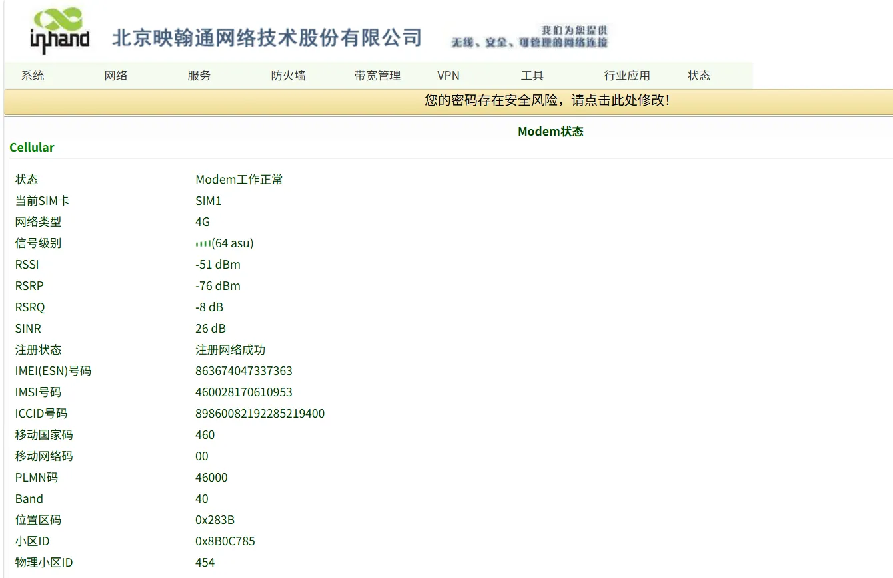

# Configuration Guide

## 1. Document Information

- Document name: Configuration Manual
- Product model: **IR302**
- Firmware version: **V**3.5.96
- Applicable scenario: device networking
- Date written: March 25, 2026

## 2. Gateway Overview

### 2.1 Product Introduction

The InRouter302 (IR302 for short) series is an IoT wireless router integrating multiple technologies such as 4G network, Wi-Fi, and virtual private network, providing simple, reliable, and secure Internet connectivity. Designed with the requirements of unattended site communication in mind, the product adopts software and hardware watchdogs and a multi-level link detection mechanism to ensure communication stability and reliability. In addition, the IR302 series supports the InHand Networks Device Manager "Device Cloud" management platform, enabling users to achieve remote intelligent device management. The IR302 series is suitable for various industrial and commercial IoT applications, providing an efficient and reliable solution for the digital IoT.

### 2.2 Main Functions

- 4G Internet access
- Remote configuration, remote diagnosis, remote upgrade
- Wide-temperature industrial-grade design

### 2.3 Typical Application Topology

Device → Ethernet → IR302 router → 4G → cloud platform

## 3. Hardware Description

### 3.1 Appearance and Interfaces

- Power interface: DC 9–36V
- Network ports: LAN ×1 + 1 WAN
- Wireless: 4G
- Indicator lights: Power, status, cellular, Signal
- Reset button: restore factory settings

### 3.2 Wiring Description

#### 3.2.1 Power Wiring

- Positive: V+
- Negative: V-
- Note: reverse-connection protection, lightning protection, grounding

#### 3.2.2 Ethernet Wiring

Straight-through/crossover auto-sensing; Cat5e or better cable is recommended.

## 4. Factory Default Parameters

- Default IP: 192.168.2.1
- Subnet mask: 255.255.255.0
- Web username: **adm**
- Web password: 123456

## 5. Preparation

- Set the computer to an IP on the same network segment as the gateway
- Connect the computer to the gateway LAN port with a network cable
- Power on the router and wait for the RUN light to stay solid
- Enter the device IP in a browser to access the configuration page

## 6. Network Configuration

### 6.1 Local Network Configuration

- Insert the 4G SIM card
- Enable the mobile network
- APN: automatic / manual entry
- View signal strength

## 7. Enable the ics platform and enter the account

## 8. Configuration Backup and Restoration

- Export the configuration file
- Restore factory configuration

## 9. Status Monitoring and Diagnosis

### 9.1 Running Status

- Device online status

- Network traffic, signal strength

### 9.2 Log Viewing

- System logs

## 10. Common Problems and Troubleshooting

- Unable to open the Web page
  - Check the network segment, network cable, and whether the IP conflicts
  - Reset the gateway and retry

## 10. Safety Precautions

- Ensure reliable grounding at industrial sites
- Change the LAN port address to the gateway of the local subnet
- Back up after configuration is complete
- Change the remote password regularly
- Prohibit operation by unauthorized personnel
