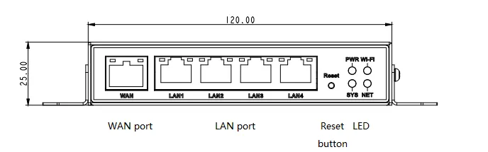
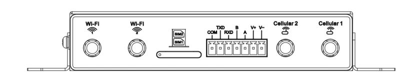
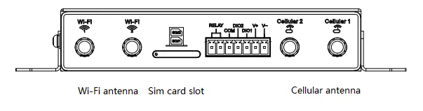
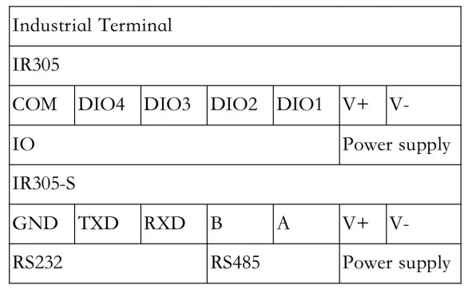
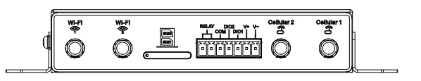
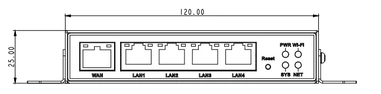
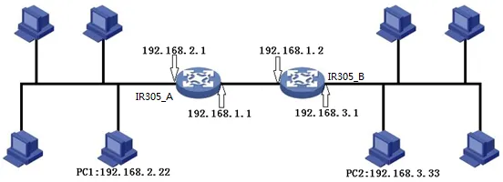
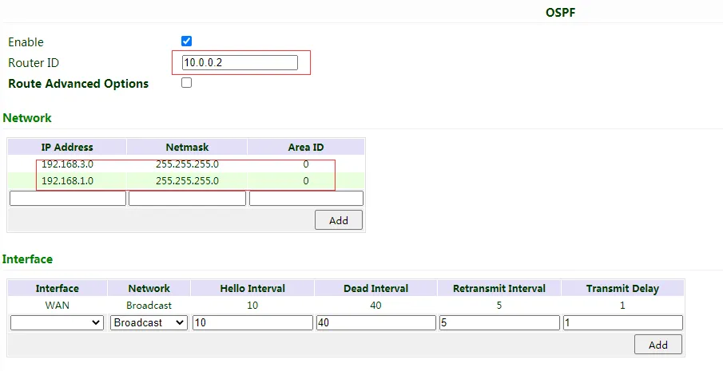
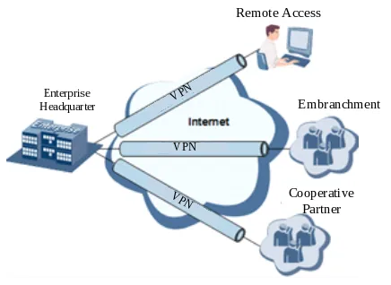
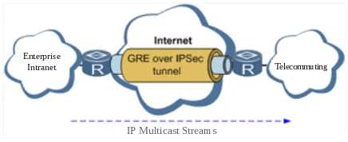

# Industrial Router IR305 Product User Manual

---

## Declaration

Thank you for choosing our product. Before using the product, read this manual carefully.

The contents of this manual cannot be copied or reproduced in any form without the written permission of InHand.

Due to continuous updating, InHand cannot promise that the contents are consistent with the actual product information, and does not assume any disputes caused by the inconsistency of technical parameters. The information in this document is subject to change without notice. InHand reserves the right of final change and interpretation.

© 2023 InHand Networks. All rights reserved.

---

## Conventions

| Symbol | Indication |
|--------|------------|
| `< >` | Content in angle brackets indicates a button name. For example, the `<OK>` button. |
| `" "` | Double quotes indicate a window name or menu name. For example, the pop-up window "New User". |
| `>` | A multi-level menu is separated by the angle brackets ">". For example, File > New > Folder indicates the menu item [Folder] under the sub-menu [New], which is under the menu [File]. |
| `【 】` | Menu or page name. For example, enter the 【System Settings】page. |
| Cautions | Means reader be careful. Improper action may result in loss of data or device damage. |
| Note | Notes contain detailed descriptions and helpful suggestions. |

---

## Contact Us

**InHand Networks (Headquarters)**

Add: 3650 Concorde Pkwy, Suite 200, Chantilly, VA 20151, USA

E-mail: support@inhandneworks.com

T: +1 (703) 348-2988

URL: [www.inhand.com](http://www.inhandnetworks.com/)

---

## How to Use This Manual

**Find your starting point:**

- **First-time users**: Read "Getting to Know the Device" → "Installation and First-Time Use" → "Common Scenario Configurations" → "Feature Descriptions and Parameter Reference" in sequence.
- **Existing device users**: Refer directly to "Feature Descriptions and Parameter Reference" or "Appendix Troubleshooting".
- **Cloud platform administrators**: Refer to "Common Scenario Configurations" for Device Manager (DM) platform configuration.

**Quick task reference:**

| Task | Corresponding Chapter | Estimated Time |
|------|----------------------|----------------|
| Unpack and identify device components | [Getting to Know the Device](#chapter-1-getting-to-know-the-device) | About 5 minutes |
| Install hardware and power on | [Installation and First-Time Use](#chapter-2-installation-and-first-time-use) | About 10 minutes |
| Access the Internet via cellular | [Common Scenario Configurations](#chapter-3-common-scenario-configurations) | About 5 minutes |
| Access the Internet via wired WAN | [Common Scenario Configurations](#chapter-3-common-scenario-configurations) | About 5 minutes |
| Configure VPN tunnel | [Feature Descriptions and Parameter Reference](#chapter-4-feature-descriptions-and-parameter-reference) | About 15 minutes |
| Connect to Device Manager cloud | [Common Scenario Configurations](#chapter-3-common-scenario-configurations) | About 10 minutes |
| Troubleshoot network issues | [Appendix Troubleshooting](#appendix-troubleshooting) | As needed |

---

# Chapter 1 Getting to Know the Device

## 1.1 Overview

The InRouter305 (IR305) is an IoT cellular router that integrates 4G LTE, Wi-Fi, and VPN technologies to provide easy, reliable, and secure Internet connectivity. With technologies such as 4G wireless wide area network and Wi-Fi wireless local area network, it provides uninterrupted multiple network access capabilities, and with its comprehensive security and wireless services, it realizes up to 10 thousands equipment networking and provides high-speed data access for equipment networking.

This product is suitable for the networking of unattended devices and sites. It is embedded with watchdog and multi-layer link detection mechanisms to ensure reliable and stable communications. The router can be deployed easily to build large scale networks scaling up to tens of thousands of devices. Using our InHand Device Manager cloud platform, users can manage their network efficiently.

The IR305 can be used in a wide range of industrial and commercial IoT applications, providing an option of good balance between cost and performance.

## 1.2 Packing List

Each IR305 product includes common accessories. Please check carefully when you receive our products. If there is any missing or damage, please contact InHand sales staff.

| Item | Quantity | Description |
|------|----------|-------------|
| IR305 | 1 | Industrial router |
| Panel mounting lug | 2 | For router mounting |
| Cellular antenna | 1/2 | Suction cup antenna (2m cable): 1pc (LQ20 series), 2pcs (other series) |
| Wi-Fi antenna | 2 | Suction cup antenna (2m cable) |
| Ethernet cable | 1 | 1.5m Ethernet Cable |
| Power adaptor | 1 | 12V DC power adapter |

InHand can provide customers with optional accessories according to different field. Please refer to the list of optional accessories for detailed information.

## 1.3 Appearance and Interfaces

<p align="center"></p>

<p align="center"><strong>Figure 1-1 IR305 Panel Overview</strong></p>

IR305-S:

<p align="center"></p>

<p align="center"><strong>Figure 1-2 IR305-S Panel</strong></p>

IR305:

<p align="center"></p>

<p align="center"><strong>Figure 1-3 IR305 Panel Detail</strong></p>

<p align="center"></p>

<p align="center"><strong>Figure 1-4 IR305 Interface Layout</strong></p>

| Interface | Position | Function Description |
|-----------|----------|---------------------|
| WAN/LAN1 | Front panel | Wired network port, can be configured as WAN or LAN |
| LAN2-LAN4 | Front panel | Local area network ports |
| Cellular antenna connector | Front panel | Connect 4G LTE cellular antenna |
| Wi-Fi antenna connector | Front panel | Connect Wi-Fi antenna (2 ports) |
| SIM card slot | Left side | Dual nano SIM card slot |
| RESET button | Front panel | Restore factory settings |
| Power input | Front panel | 9~36V DC power input |
| Console (RS232) | IR305-S only | Serial console access |
| I/O terminal | IR305-WMNN-WLAN/NA | Digital input/output |
| RS232/RS485 | IR305-S serial type | DTU serial data transmission |

## 1.4 LED Indicator Description

<p align="center"></p>

<p align="center"><strong>Figure 1-5 LED Indicator Positions</strong></p>

| Indicator | Status | Meaning |
|-----------|--------|---------|
| PWR | Red off | Power off |
| | Steady in red | Power on |
| SYS | Yellow off | System error |
| | Flash in Yellow | System upgrading |
| | Steady in Yellow | System working |
| Wi-Fi | Green off | Wi-Fi disable |
| | Flash in Green | Wi-Fi connecting |
| | Steady in Green | Wi-Fi working |
| NET | Green off | Network disconnected |
| | Flash in Green | Network connecting |
| | Steady in Green | Network connected |

## 1.5 Restore Factory Settings

To restore the device to default settings using the reset button, follow these steps:

1. Power on the device and immediately press and hold the **RESET** button until the **SYS LED** turns **solid**.
2. Release the **RESET** button and wait for the **SYS LED** to turn off.
3. Press and hold the **RESET** button again until the **SYS LED** starts **flashing**, then release the button. The device will now be restored to its default settings and will restart normally.

Alternatively, log in to the WEB management page, click on the 【System】>【Config Management】 menu in the navigation tree. Click "Restore default configuration" button; the router will restore to default settings after reboot.

## 1.6 Default Settings

| Parameter | Default Value |
|-----------|---------------|
| LAN IP address | 192.168.2.1 |
| Subnet mask | 255.255.255.0 |
| DHCP server | Enable |
| DHCP IP pool range | 192.168.2.2 ~ 192.168.2.100 |
| Web login username | adm (see device nameplate) |
| Web login password | See device nameplate |
| Cellular dialup | Enable |
| Wi-Fi mode | AP mode |
| Wi-Fi SSID | inhand |
| Firewall default policy | Accept |

---

# Chapter 2 Installation and First-Time Use

## 2.1 Preparations

### Environment Requirements

| Item | Requirement |
|------|-------------|
| Power supply | 9~36V DC (Ripple voltage < 100 mV) or 100-240V AC with DC power adapter |
| Working temperature | -20°C ~ 70°C |
| Storage temperature | -40°C ~ 85°C |
| Relative humidity | 5% ~ 95% (no frosting) |
| Network coverage | 3G/4G network coverage on site, no shield |

### Tools and Materials Required

| Item | Quantity | Description |
|------|----------|-------------|
| PC | 1 | For device configuration |
| SIM card | 1 or 2 | Enabled with data service, not suspended |
| Ethernet cable | 1 or more | For LAN/WAN connection |
| Power adapter | 1 | 12V DC power adapter (included) |
| Panel mounting lug | 2 | Included in packing list |

> **Caution**: The device shall be installed and operated in powered-off status!
> **Caution**: Pay attention to the power voltage level before connection.
> **Caution**: Avoid direct sunlight, keep away from heat sources or strong electromagnetic interference.

## 2.2 Installation Guide

### 2.2.1 SIM/UIM Card Installation

InRouter305 uses pop-up card holder. Stab the hollow at the left of the card holder and the card holder will pop up. Then, install the SIM/UIM card and press the card holder back to the card slot.

> **Caution**: When insert or plug out SIM card, please unplug the power cable to prevent data loss or damage the router.

### 2.2.2 Antenna Installation

Slightly rotate the movable part of metal SMA-J interface until it cannot be rotated (at this time, external thread of antenna cable cannot be seen). Do not forcibly screw the antenna by holding black rubber lining.

<p align="center"></p>

<p align="center"><strong>Figure 2-1 Antenna Installation Reference</strong></p>

### 2.2.3 Power Supply Connection

Upon installation of the antenna, connect the device to 9~36V DC power and see if the Power LED on the panel of the device is on. If not, please contact technical support of InHand Networks immediately.

### 2.2.4 Mounting

Please place InRouter on flat level and have it installed in an environment with small vibrational frequency. Device should be installed in the restricted area.

### 2.2.5 Web Login

Upon installation of hardware, be sure the Ethernet card has been mounted in the supervisory PC prior to logging in the page of Web settings of the router.

**I. Automatic Acquisition of IP Address (Recommended)**

Set the supervisory computer to "automatic acquisition of IP address" and "automatic acquisition of DNS server address" (default configuration of computer system) to let the device automatically assign IP address for supervisory computer.

**II. Set a Static IP Address**

Set the IP address of supervisory PC (such as 192.168.2.2) and LAN interface of device in same network segment (initial IP address of LAN interface of device: 192.168.2.1, subnet mask: 255.255.255.0).

**III. Cancel the Proxy Server**

If the current supervisory PC uses a proxy server to access the Internet, cancel the proxy service:
1. In the browser window, select "Tools > Internet options".
2. Select "Connection" page and click the button of LAN Settings to enter "LAN Settings" window interface. Confirm if the option "Use a Proxy Server for LAN" is checked; if it is checked, please cancel and click the button `<OK>`.

**IV. Log in to Web Settings Page**

Open IE or other browser and enter IP address of InRouter305, such as [http://192.168.2.1](http://192.168.2.1/) in address bar (default setting of InRouter305). Upon connection, log in from the login interface as Admin, i.e. enter username and password at the login interface (Please look at the nameplate at the bottom of the device for login credentials).

> **Caution**: For security, modify the default login password after the first login and safe keep the password information.

## 2.3 Quick Check

After completing the installation, verify the following items:

| Check Item | Expected Result |
|------------|-----------------|
| Power LED (PWR) | Steady red |
| System LED (SYS) | Steady yellow (system working) |
| Ethernet cable connection | Corresponding LAN port LED lights up |
| SIM card inserted | SIM card holder fully seated |
| Antenna connection | All antennas firmly tightened |
| PC IP configuration | In same subnet as router (192.168.2.x) |
| Web login | Can access 192.168.2.1 and log in successfully |

---

# Chapter 3 Common Scenario Configurations

## Scenario 1: Cellular Networking

**Objective**: Access the Internet via 4G/5G cellular network.

**Prerequisites**: SIM card inserted and antenna installed, device powered on.

**Estimated Time**: About 5 minutes.

**Operation Steps**:
1. Power off the device, insert the SIM card into the SIM card slot, and connect the 4G antenna to the router.
2. Connect PC to the router and power on the device.
3. Open a browser and access the router's WEB management page at 192.168.2.1 (refer to [Web Login](#225-web-login)).
4. Click 【Network】>【Cellular】, set the profile. The device enables cellular by default; it will connect to the Internet within a few minutes.
5. If the device cannot connect to the Internet, disable and restart dialup. (If using a private network SIM card, configure APN parameters accordingly.)
6. Check the dialup status in 【Status】. If it shows Connected and there is an IP address and other dialup parameters, the router has connected to the Internet by SIM card.

**Verification Method**:
1. Check the NET LED status; confirm it is steady green (network connected).
2. Navigate to 【Tools】>【Ping】, ping an external address (e.g., 8.8.8.8) to verify connectivity.

**Common Issues**:
- Network connection failure: Check whether the SIM card is correctly inserted and whether APN parameters are correct.
- Data transmission/reception abnormal: Check signal strength and data balance.

## Scenario 2: Wired WAN Networking

**Objective**: Access the Internet via wired WAN connection.

**Prerequisites**: Ethernet cable connected to WAN port, device powered on, PC connected to LAN port.

**Estimated Time**: About 5 minutes.

**Operation Steps**:
1. Connect power and Ethernet cable to IR305, connect WAN/LAN1 port to the public network, and connect one of LAN ports to the PC.
2. Configure the PC to be in the same network segment as the IP address of the router (enable DHCP auto-obtain recommended).
3. Access the default IP address 192.168.2.1 in a browser, enter the username and password (see device nameplate), and access the router's WEB management page.
4. Create a WAN port in 【Network】>【WAN】 in the left menu. Configure an IP address for the WAN port and let the router connect to the Internet.
5. Select one of the IP obtain methods: Dynamic DHCP (recommended), Static IP (click Apply & Save after configuring manually), or ADSL Dialup (PPPoE).
6. Check the connectivity in 【Tools】>【Ping】.

**Verification Method**:
1. Check the NET LED status; confirm it is steady green.
2. Navigate to 【Tools】>【Ping】, ping an external address to verify connectivity.

**Common Issues**:
- Unable to obtain IP address: Check WAN cable connection and upstream router/modem status.
- No Internet access: Check whether the correct IP obtain method is selected.

## Scenario 3: Wi-Fi Client (STA) Networking

**Objective**: Access the Internet by connecting IR305 to an existing Wi-Fi access point.

**Prerequisites**: Wi-Fi antenna connected, device powered on, target AP SSID and password known.

**Estimated Time**: About 10 minutes.

**Operation Steps**:
1. Connect Wi-Fi antenna, and connect PC to the device. Access the router's WEB management page (refer to [Web Login](#225-web-login)).
2. Go to 【Network】>【Switch WLAN Mode】, select WLAN Type to STA, and save. Then reboot the router.
3. After reboot, click 【Network】>【WLAN Client】, click "Scan" to scan available APs, select the target AP, and click "Connect".
4. Configure Wi-Fi parameters (SSID, authentication method, encryption, password) and save. Then check the connection status in 【Status】.
5. Configure WAN mode in 【Network】>【WAN(STA)】, set WAN parameters for Wi-Fi.
6. Check the connectivity in 【Tools】>【Ping】.

**Verification Method**:
1. Check the Wi-Fi LED status; confirm it is steady green.
2. Navigate to 【Status】>【WLAN】 to confirm the connection status.

**Common Issues**:
- Cannot scan AP: Check Wi-Fi antenna connection and ensure the target AP is within range.
- Connection fails: Verify the authentication method and password match the target AP.

## Scenario 4: Connect to InHand Device Manager (Cloud)

**Objective**: Register the router to InHand Device Manager (DM) for remote management.

**Prerequisites**: Router has already connected to the Internet.

**Estimated Time**: About 10 minutes.

**Operation Steps**:
1. Ensure the router has Internet access (via cellular or wired WAN).
2. Navigate to 【Service】>【Device Manager】 to set the router to connect to DM.
3. Enter the URL: `iot.inhandnetworks.com` (for North American users).
4. Fill in the DM account in "Registered Account", then click "Apply" to save the configuration.
5. If there is no DM account, click "Sign up/Sign in" after selecting the server, then follow the instructions to register an account.
6. Log in to the Device Manager account, add the device in "Gateways", name the device, and fill in the serial number from the device.
7. The serial number can be found in 【Status】>【System】, or on the back of the device.

**Verification Method**:
1. Navigate to 【Status】>【Device Manager】 to check the connection status between the router and Device Manager.
2. In the Device Manager web interface, confirm the device is online.

**Common Issues**:
- Cannot connect to DM: Verify the router has Internet access and the server URL is correct.
- Device offline in DM: Check firewall settings and confirm the "Secure Channel" option is enabled.

---

# Chapter 4 Feature Descriptions and Parameter Reference

## 4.1 System

### 4.1.1 Basic Setup

Here, WEB configuration interface language can be set; name of mainframe of router can be customized.

From the navigation tree, select 【System】>【Basic Setup】, then enter the "Basic Setup" page.

**Table 4-1-1 Basic Setup Parameters**

| Parameters | Description | Default |
|------------|-------------|---------|
| Language | Configure language of WEB configuration interface | Chinese |
| Host Name | Set a name for the host or device connected to the router for viewing. | Router |

### 4.1.2 System Time

To ensure the coordination between this device and other devices, the system time needs to be set accurately. This function is used to configure and check system time as well as system time zone. System time is used to configure and view system time and system time zone. It aims to achieve time synchronization of all devices equipped with a clock on network so as to provide multiple applications based on synced time.

From the navigation tree, select 【System】>【Time】, then enter the "Time" webpage. Click `<Sync Time>` to synchronize the time of the gateway with the system time of the host.

**Table 4-1-2 Parameters of System Time**

| Parameters | Description | Default |
|------------|-------------|---------|
| Router Time | Display present time of router | 8:00:00 AM, 12/12/2015 |
| PC Time | Display present time of PC | Present time |
| Timezone | Set time zone of router | Custom |
| Custom TZ String | Set TZ string of router | CST-8 |
| Auto update Time | Select whether to automatically update time; select on startup or every 1/2/... hours. | On startup |
| NTP Time Servers | Set NTP server to sync time via network | 114.80.81.1 |

### 4.1.3 Admin Access

Admin services include HTTP, HTTPS, TELNET, SSHD, HTTP API and Console.

**HTTP**

HTTP (Hypertext Transfer Protocol) is used for transferring web pages on Internet. After enabling HTTP service on device, users can log on via HTTP and access and control the device using a web browser.

**HTTPS**

HTTPS (Secure Hypertext Transfer Protocol) is the secure version of hypertext transfer protocol. As a HTTP protocol which supports SSL protocol, it is more secure.

**TELNET**

Telnet protocol provides telnet and virtual terminal functions through a network. Depending on Server/Client, Telnet Client could send request to Telnet server which provides Telnet services. The device supports Telnet Client and Telnet Server.

**SSHD**

SSH protocol provides security for remote login sessions and other network services. The SSHD service uses the SSH protocol, which has higher security than Telnet.

**HTTP_API**

User can check router's status and configure router without login the router remotely by sending HTTP request with HTTP API. Please ask technical support for more information about HTTP API.

**Console** (only in IR305-S)

User can access to IR305 CLI via RS232 and enable Console.

From the navigation tree, select 【System】>【Admin Access】, then enter "Admin Access" page.

**Table 4-1-3 Parameters of Admin Access**

| Parameters | Description | Default |
|------------|-------------|---------|
| **Username/Password** | | |
| Username | Set name of user who logs in WEB configuration | adm |
| Old Password | Previous password access to WEB configuration | N/A |
| New Password | New password access to WEB configuration | N/A |
| Confirm New Password | Reconfirm the new password | N/A |
| **Admin functions** | | |
| Service Port | Service port of HTTP/HTTPS/TELNET/SSHD/HTTP_API | 80/443/23/22/4444 |
| Local Access | Enable - Allow local LAN to administrate the router with corresponding service; Disable - Local LAN cannot administrate the router with corresponding service | Enable |
| Remote Access | Enable - Allow remote host to administrate the router with corresponding service; Disable - Remote host cannot administrate the router with corresponding service | Enable |
| Allowed Access from WAN (Optional) | Set allowed access from WAN | The host controlling service at this moment can be set, e.g. 192.168.2.1/30 or 192.168.2.1-192.168.2.10 |
| Description | For recording significance of various parameters of admin functions (without influencing router configuration) | N/A |
| **Console Login User (Click <new> button after setting a group of username and password)** | | |
| Username | Configure console login user, custom | N/A |
| Password | Configure the password, custom | N/A |
| **Other Parameters** | | |
| Log Timeout | Set login timeout (router will automatically disconnect the configuration interface after login timeout) | 500 seconds |

Note:

In "Username/Password" section, users can modify username and password rather than create new username, i.e. only this username can be used in logins.

In "Console Login User" section, multiple usernames can be created, i.e. multiple usernames can be used by serial port or TELNET console logins.

### 4.1.4 System Log

A remote log server can be set through "System Log Settings," and all system logs will be uploaded to the remote log server through the gateway. This makes remote log software, such as Kiwi Syslog Daemon, a necessity on the host.

Kiwi Syslog Daemon is free log server software for Windows. It can receive, record and display logs from host (such as gateway, exchange board and Unix host). After downloading and installing Kiwi Syslog Daemon, it must be configured through the menus "File >> Setup >> Input >> UDP".

From the navigation tree, select 【System】>【System Log】, then enter "System Log" page.

**Table 4-1-4 Parameters of System Log**

| Parameters | Description | Default |
|------------|-------------|---------|
| Log to Remote System | Enable log server | Disable |
| Log server address and port (UDP) | Set address and port of remote log server | N/A: 514 |
| Log to Console | Output device log by serial port | Disable |

### 4.1.5 Config Management

Here you can back up the configuration parameters, import the desired parameters backup and reset the router.

From the navigation tree, select 【System】>【Config Management】, then enter the "Config Management" page.

**Table 4-1-5 Parameters of Config Management**

| Parameters | Description | Default |
|------------|-------------|---------|
| Browse | Choose the configuration file | N/A |
| Import | Import configuration file to router | N/A |
| Backup | Backup configuration file to host | N/A |
| Restore default configuration | Select to restore default configuration (effective after rebooting) | N/A |
| Disable the hardware reset button | Select to disable hardware reset button of the router | Disable |
| Modem drive program | For configuring drive program of module | N/A |
| Network Provider (ISP) | For configuring APN, username, password and other parameters of the network providers across the world | N/A |

> **Note**: Validity and order of imported configurations should be ensured. The good configs will later be serially executed in order after system reboot. If the configuration files didn't be arranged according to effective order, the system won't enter the desired state.

> **Note**: In order not to affect the operation of the current system, when performing an import configuration and restore default configuration, users need to restart the device to make the new configuration to take effect.

### 4.1.6 Schedule

After this function is enabled, the device will reboot as the scheduled time. Scheduler function will take effect after router sync time.

From the navigation tree, select 【System】>【Schedule】, then enter "Schedule" page.

**Table 4-1-6 Parameters of Scheduler**

| Parameters | Description | Default |
|------------|-------------|---------|
| Enable | Enable/disable this function | Disable |
| Time | Select the reboot time | 0:00 |
| Days | Reboot the router everyday | Everyday |
| Show advanced options | Enable more detailed schedule rules, allow to set multiple rules to reboot the router in specific time or interval. Enable this feature will disable everyday reboot feature above. | Disable |
| Reboot after dialed | Router will reboot after dial up successfully, will not take effort if this parameter is blank. | N/A |

### 4.1.7 Upgrade

The upgrading process can be divided into two steps. In the first step, firmware will be written in backup file zone; in the second step, firmware in backup file zone will be copied to main firmware zone, which should be carried out during system restart. During software upgrading, any operation on web page is not allowed, otherwise software upgrading may be interrupted.

From the navigation tree, select 【System】>【Upgrade】, then enter the "Upgrade" page.

To upgrade the system: firstly, click `<Browse>` to choose the upgrade file; secondly, click `<Upgrade>` and then click `<OK>` to begin upgrade; thirdly, after upgrade firmware succeeds, click `<Reboot>` to restart the device.

### 4.1.8 Reboot

Please save the configurations before reboot, otherwise the configurations that are not saved will be lost after reboot.

To reboot the system, click 【System】>【Reboot】, then click `<OK>`.

### 4.1.9 Logout

To logout, click 【System】>【Logout】, and then click `<OK>`.

## 4.2 Network

### 4.2.1 Cellular

Insert SIM card and dial to achieve the wireless network connection function of router.

Click the 【Network】>【Dial Interface】 menu in the navigation tree to enter the "Dial Interface".

**Table 4-2-1-1 Parameters of Dialup/Cellular**

| Parameters | Description | Default |
|------------|-------------|---------|
| Enable | Enable cellular dialup. | Enable |
| Time Schedule | Set time schedule | ALL |
| Force Reboot | Router will reboot if cannot dialup for a long time and reach the max retry time | Enable |
| Shared connection (NAT) | Enable—Local device connected to Router can access to the Internet via Router. Disable—Local device connected to Router cannot access to the Internet via Router. | Enable |
| Default Route | Enable default route | Enable |
| SIM1 Network Provider | Select network provider profile for SIM1 | Profile 1 |
| Network Type | Select network type, router will try 4G, 3G, 2G in proper order if select in Auto | Auto |
| Connection Mode | Optional Always Online, Connect On Demand, Manual. It will support to configure Triggered by SMS if select Connect On Demand mode. | Always Online |
| Redial Interval | Set the redialing time when login fails. | 30 s |
| **Show Advanced Options** | | |
| Dual SIM Enable | Enable Dual SIM card | Disable |
| SIM2 Network Provider | Select network provider for SIM2 card | Profile 1 |
| SIM2 Blinding ICCID | Set ICCID of SIM2 | N/A |
| SIM2 PIN Code | For setting SIM2 PIN code | N/A |
| SIM2 SIM Card Operator | Set the ISP that SIM2 card connects to | Auto |
| Main SIM | Set the SIM card that uses to dialup at first | SIM1 |
| Max Number of Dial | Set max number of dial, if cannot dial up successfully after this number, router will switch SIM card | 5 |
| CSQ Threshold | Set threshold of signal, if current signal level is lower than this, router will switch SIM card | 0(Disable) |
| Min Connect Time | Set the min connect time for each try of dial up | 0(Disable) |
| Initial Commands | Set customize initial AT commands which will be operated at the beginning of dialing up | AT |
| Blinding ICCID | Set ICCID of SIM | N/A |
| PIN Code | For setting PIN code of SIM | N/A |
| MTU | Set max transmission unit after enable | 1500 |
| Use Peer DNS | Click to receive peer DNS assigned by the ISP | Enable |
| Link detection interval | Set link detection interval | 55 s |
| Debug | Enable debug mode, print debug log in system log | Disable |
| Debug Modem* | Send modem debug data to console | Disable |
| ICMP Detection Mode | Set ICMP detection mode, router will check the link connection status via ICMP packet. Ignore Traffic: Router will send ICMP packet no matter whether there is traffic in cellular interface. Monitor Traffic: Router will not send ICMP packet if there is traffic in cellular interface. | Ignore Traffic |
| ICMP Detection Server | Set the ICMP Detection Server. N/A represents not to enable ICMP detection. | N/A |
| ICMP Detection Interval | Set ICMP Detection Interval | 30 s |
| ICMP Detection Timeout | Set ICMP Detection Timeout (the link will be regarded as down if ICMP times out) | 20 s |
| ICMP Detection Retries | Set the max. number of retries if ICMP fails (router will redial if reaching max. times) | 5 |

*Not all models support this.

**Table 4-2-1-2 Parameters of Dialup/Cellular - Schedule**

| Parameters | Description | Default |
|------------|-------------|---------|
| Name of Schedule | schedule 1 | schedule1 |
| Sunday ~ Saturday | Click to enable | |
| Time Range 1 | Set time range 1 | 9:00-12:00 |
| Time Range 2 | Set time range 2 | 14::00-18:00 |
| Time Range 3 | Set time range 3 | 0:00-0:00 |
| Description | Set description content | N/A |

### 4.2.2 WAN

Click the 【Network】>【WAN】 to set WAN port.

WAN supports three types of wired access including static IP, dynamic address (DHCP) and ADSL (PPPoE) dialing.

DHCP adopts Client/Server communication mode. Client sends configuration request to Server which feeds back corresponding configuration information, including distributed IP address to the Client to achieve the dynamic configuration of IP address and other information.

PPPoE is a point-to-point protocol over Ethernet. User has to install a PPPoE Client on the basis of original connection way. Through PPPoE, remote access devices could achieve the control and charging of each accessed user.

WAN of the device is disabled by default.

Click the 【Network】>【WAN】 menu in the navigation tree to enter the "WAN" Interface.

**Table 4-2-2-1 Static IP Parameters of WAN**

| Parameters | Description | Default |
|------------|-------------|---------|
| Shared connection (NAT) | Enable—Local device connected to Router can access to the Internet via Router. Disable—Local device connected to Router cannot access to the Internet via Router. | Enable |
| Default route | Enable default route | Enable |
| MAC Address | MAC Address of the device | Device's MAC address |
| IP Address | Set IP address of WAN | 192.168.1.29 |
| Subnet mask | Set subnet mask of WAN | 255. 255. 255. 0 |
| Gateway | Set gateway of WAN | 192. 168. 1. 1 |
| MTU | Max. transmission unit, default/manual settings | default (1500) |
| **Multiple IP support (at most 8 additional IP addresses can be set)** | | |
| IP Address | Set additional IP address of LAN | N/A |
| Subnet mask | Set subnet mask | N/A |
| Description | For recording significance of additional IP address | N/A |

**Table 4-2-2-2 Dynamic Address (DHCP) Parameters of WAN**

| Parameters | Description | Default |
|------------|-------------|---------|
| Shared connection (NAT) | Enable—Local device connected to Router can access to the Internet via Router. Disable—Local device connected to Router cannot access to the Internet via Router. | Enable |
| Default route | Enable default route | Enable |
| MAC Address | MAC Address of the device | Device's MAC address |
| MTU | Max. transmission unit, default/manual settings | default (1500) |

**Table 4-2-2-3 ADSL Dialing (PPPoE) Parameters of WAN**

| Parameters | Description | Default |
|------------|-------------|---------|
| Shared connection | Enable—Local device connected to Router can access to the Internet via Router. Disable—Local device connected to Router cannot access to the Internet via Router. | Enable |
| Default route | Enable default route | Enable |
| MAC Address | MAC Address of the device | Device's MAC address |
| MTU | Max. transmission unit, default/manual settings | default (1492) |
| **WAN - ADSL Dialing (PPPoE)** | | |
| Username | Set name of dialing user | N/A |
| Password | Set dialing password | N/A |
| Static IP | Click to enable static IP | Disable |
| Connection Mode | Set dialing connection method (always online, dial on demand, manual dialing) | Always online |
| **Parameters of Advanced Options** | | |
| Service Name | Set service name | N/A |
| Set length of transmit queue. | Set length of transmit queue. | 3 |
| Enable IP header compression | Click to enable IP header compression | Disable |
| Use Peer DNS | Click to enable use peer DNS | Enable |
| Link detection interval | Set link detection interval | 55 s |
| Link detection Max. Retries | Set link detection max. retries | 10 |
| Enable Debug | Click to enable debug | Disable |
| Expert Option | Set expert options | N/A |
| ICMP Detection Server | Set ICMP detection server | N/A |
| ICMP Detection Interval | Set ICMP Detection Interval | 30 s |
| ICMP Detection Timeout | Set ICMP detection timeout | 20 s |
| ICMP Detection Retries | Set ICMP detection max. retries | 3 |

### 4.2.3 VLAN

A virtual LAN (VLAN) comprises a group of logical devices and users. These devices and users are not limited by physical locations, but can be organized base on functions, departments, applications, and other factors. They communicate with each other as if they are in the same network segment, which contributes to the name of VLAN.

After set VLAN, click "modify" to configure LAN settings of each VLAN.

Click 【Network】>【VLAN】 to configure VLAN in router.

**Table 4-2-3 VLAN Parameters**

| Parameters | Description | Default |
|------------|-------------|---------|
| VLAN ID | Set VLAN ID | 1 |
| LAN1~LAN4 | Set which LAN port to be a part of VLAN | LAN1~LAN4 enabled |
| Primary IP/Netmask | Set VLAN's IP and netmask | 192.168.2.1/255.255.255.0 |
| **Port mode** | | |
| MAC | Device's MAC address | Hardware MAC address |
| Enable | Able to configure Trunk mode after enable | Enable |
| Speed Duplex | Set speed and duplex of LAN port | Auto Negotiation |
| Mode | Set LAN mode, Access or Trunk | Access |
| Native LAN | Traffic will not have VLAN tag if it is transferred by native VLAN | 1 |
| **GARP** | | |
| Enable | Router will send ARP broadcast to LAN devices automatically | Disable |
| Broadcast Count | Set ARP broadcast times | 5 |
| Broadcast Timeout | Set ARP broadcast timeout time | 10 |

**LAN Parameters**

**Table LAN – Static IP Parameters**

| Parameters | Description | Default |
|------------|-------------|---------|
| IP Address | IP Address of router's LAN gateway | 192.168.2.1 |
| Netmask | Subnet mask of LAN gateway | 255.255.255.0 |
| MTU | Max. transmission unit, default/manual settings | default (1500) |
| **Secondary IP(s) (at most 8 additional IP addresses can be set)** | | |
| IP Address | Set additional IP address of LAN | N/A |
| Subnet mask | Set subnet mask | N/A |

### 4.2.4 Switch WLAN Mode

IR305 supports two types of WLAN mode: AP and STA.

Click the 【Network】>【Switch WLAN Mode】 menu in the navigation tree to set WLAN mode of the router. After change and save the configuration, please reboot the device to make the configuration take effort.

### 4.2.5 WLAN Client (AP Mode)

When working in AP mode, the device WLAN will provide network access point for other wireless network devices so that they will have normal network communication.

Click the 【Network】>【WLAN】 menu in the navigation tree to enter the "WLAN" interface.

**Table 4-2-5 Parameters of WLAN Access Port**

| Parameters | Description | Default |
|------------|-------------|---------|
| SSID broadcast | After turning on, use can search the WLAN via SSID name | Enable |
| Mode | Six type for options: 802.11g/n, 802.11g, 802.11n, 802.11b, 802.11b/g, 802.11b/g/n | 802.11b/g/n |
| Channel | Select the channel | 11 |
| SSID | SSID name defined by user | inhand |
| Authentication method | Support open type, shared type, auto selection of WEP, WPA-PSK, WPA, WPA2-PSK, WPA2, WPA/WPA2, WPAPSK/WPA2PSK | Open type |
| Encryption | Select encryption method of AP | NONE |
| Wireless bandwidth | Support 20MHz and 40MHz | 20MHz |
| Enable WDS | Click to enable WDS, router will connect other AP to extend wireless coverage | Disable |
| Default Route | Click to enable Route | Disable |
| Bridged SSID | Set bridged SSID of other AP, support to click "Scan" button to connect to available AP in network | None |
| Bridged BSSID | Set bridged BSSID | None |
| Scan | Click "Scan" to scan the available AP nearby | |
| Auth Mode | Open type, shared type, WPA-PSK, WPA2-PSK | Open type |
| Encryption Method | Support NONE, WEP | None |

### 4.2.6 WLAN Client (STA Mode)

When working in STA mode, the router can access the Internet by connecting to access point. The Router need to reboot after this operation.

Click the 【Network】>【WLAN Client】 menu in the navigation tree to enter the "WLAN" interface. Select "Client" for the interface type and configure relevant parameters. (At this moment, the dialing interface in the 【Network】>【Dialing Interface】 should be closed.)

The SSID scan function is enabled only when Client is selected as WLAN interface. Click "Scan" button to get all available AP and status, select AP and configure corresponding parameter to connect. After configure WLAN Client, please configure access type in 【Network】>【WAN(STA)】.

**Table 4-2-6 Parameters of WLAN Client**

| Parameters | Description | Default |
|------------|-------------|---------|
| Mode | Support many modes including 802.11b/g/n | 802.11b/g/n |
| SSID | Name of the SSID to be connected | inhand |
| Authentication method | Keep consistent with the access point to be connected | Open type |
| Encryption | Keep consistent with the access point to be connected | NONE |

### 4.2.7 Link Backup

Click the 【Network】>【Link Backup】 in the navigation tree to configuration interface.

**Table 4-2-7-1 Parameters of Link Backup**

| Parameters | Description | Default |
|------------|-------------|---------|
| Enable | Click to enable link backup | Disable |
| Backup mode | Optional hot failover, cold failover or load balance | Hot failover |
| Main Link | Optional WAN or dialing interface | WAN |
| ICMP Detection Server | Set ICMP detection server | N/A |
| Backup Link | Optional cellular or WAN | Cellular 1 |
| ICMP Detection Interval | Set ICMP Detection Interval | 10 s |
| ICMP Detection Timeout | Set ICMP detection timeout | 3 s |
| ICMP Detection Retries | Set ICMP detection max. retries | 3 |
| Restart Interface When ICMP Failed | Restart main link when ICMP failed | Disable |

**Table 4-2-7-2 Parameters of Link Backup - Backup Mode**

| Parameters | Description |
|------------|-------------|
| Hot failover | Main link and backup Link keep online at the same time, switch if current link is off |
| Cold failover | Backup line will only be online when the main link is disconnected. |
| Load balance | Transfer data via corresponding route after ICMP detect succeed |

### 4.2.8 VRRP

VRRP (Virtual Router Redundancy Protocol) adds a set of routers that can undertake gateway function into a backup group to form a virtual router. The election mechanism of VRRP will decide which router to undertake the forwarding task and the host in LAN is only required to configure the default gateway for the virtual router.

VRRP will bring together a set of routers in LAN. It consists of multiple routers and is similar to a virtual router in respect of function. According to the VLAN interface IP of different network segments, it can be virtualized into multiple virtual routers. Each virtual router has an ID number and up to 255 can be virtualized.

VRRP has the following characteristics:

1. Virtual router has an IP address, known as the Virtual IP address. For the host in LAN, it is only required to know the IP address of virtual router, and set it as the address of the next hop of the default route.
2. Host in local communicates with the external network through this virtual router.
3. A router will be selected from the set of routers based on priority to undertake the gateway function. Other routers will be used as backup routers to perform the duties of gateway for the gateway router in case of fault of gateway router, thus to guarantee uninterrupted communication between the host and external network.

Monitor interface function of VRRP better expands backup function: the backup function can be offered when interface of a certain router has fault or other interfaces of the router are unavailable.

When uplink interface is Down or Removed, the router actively reduces its priority so that the priority of other routers in the backup group is higher and thus the router with highest priority becomes the gateway for the transmission task.

From navigation tree, select 【Network】>【VRRP】 menu, then enter "VRRP" page.

**Table 4-2-8 VRRP Parameters**

| Parameters | Description | Default |
|------------|-------------|---------|
| Enable VRRP-I | Click to enable VRRP function | Disable |
| Group ID | Select ID of router group (range: 1-255) | 1 |
| Priority | Select a priority (range: 1-254) | 20 (the larger numerical value indicates higher priority) |
| Advertisement Interval | Set an advertisement interval. | 60 s |
| Virtual IP | Set a virtual IP | N/A |
| Authentication method | Select "None" or Password type | None (a password is needed when password type is selected) |
| Monitor | Set monitor | N/A |
| VRRP-II | Set as above | Disable |

### 4.2.9 IP Passthrough

IP penetration function distributes the address obtained by WAN port to the device at the lower end of LAN port. When external access to the router downstream devices the router transmits data to the downstream device. Click 【Network】>【IP Passthrough】 menu, then enter "IP Passthrough" page.

**Table 4-2-9 IP Passthrough Parameters**

| Parameters | Description | Default |
|------------|-------------|---------|
| IP Passthrough | Enable IP Passthrough | Disable |
| IP Passthrough Mode | Select work mode (DHCP Dynamic/DHCP fix MAC) | DHCP Dynamic |
| Fix MAC Address | Set fix MAC address if in DHCP fix MAC mode | 00:00:00:00:00:00 |
| DHCP lease | Set DHCP lease time and reacquired after expiration | 120S |

### 4.2.10 Static Route

Static route needs to be set manually, after which packets will be transferred to appointed routes.

To set static route, click the 【Network】>【Static Route】 menu in the navigation tree, then enter "Static Route" interface.

**Table 4-2-10 Static Route Parameters**

| Parameters | Description | Default |
|------------|-------------|---------|
| Destination Address | Set IP address of the destination | 0.0.0.0 |
| Netmask | Set subnet mask of the destination | 255.255.255.0 |
| Gateway | Set the gateway of the destination | N/A |
| Interface | Select LAN/CELLULAR/WAN/WAN(STA) interface of the destination | N/A |
| Description | For recording significance of static route address (not support Chinese characters) | N/A |

### 4.2.11 OSPF

The Open Shortest Path First (OSPF) protocol is a link-status-based internal gateway protocol mainly used on large-scale networks.

Example: Build OSPF route between two routers, and allow their LAN can be accessed by each other.

<p align="center"></p>

<p align="center"><strong>Figure 4-1 OSPF Example Topology</strong></p>

a. Configure IR305_A. Click 【Network】>【OSPF】 to access to OSPF configure page. "Router ID" should be in the same segment to IR305_B. Configure IR305_A in "Network" bar to announce the routing entry of the device.

<p align="center"></p>

<p align="center"><strong>Figure 4-2 OSPF Configuration IR305_A</strong></p>

b. Configure IR305_B.

<p align="center"></p>

<p align="center"><strong>Figure 4-3 OSPF Configuration IR305_B</strong></p>

c. OSPF has been built successfully if PC1 and PC2 can access to each other.

## 4.3 Service

### 4.3.1 DHCP Service

DHCP adopts Client/Server communication mode. Client sends configuration request to Server which feeds back corresponding configuration information, including distributed IP address to the Client to achieve the dynamic configuration of IP address and other information.

1. The duty of DHCP Server is to distribute IP address when Workstation logs on and ensure each workstation is supplied with different IP address. DHCP Server has simplified some network management tasks requiring manual operations before to the largest extent.
2. As DHCP Client, the device receives the IP address distributed by DHCP server after logging in the DHCP server, so the Ethernet interface of the device needs to be configured into an automatic mode.

**Table 4-3-1 Parameters of DHCP Service**

| Parameters | Description | Default |
|------------|-------------|---------|
| Enable DHCP | Enable DHCP service and dynamically allocate IP address | Enable |
| IP Pool Starting Address | Set starting IP address of dynamic allocation | 192.168.2.2 |
| IP Pool Ending Address | Set ending IP address of dynamic allocation | 192.168.2.100 |
| Lease | Set lease of IP allocated dynamically | 60 minutes |
| DNS | Set DNS Server | 192.168.2.1 |
| Windows Name Server | Set windows name server. | N/A |
| **Static designation of DHCH allocation (at most 20 DHCPs designated statically can be set)** | | |
| MAC Address | Set a statically specified DHCP's MAC address (different from other MACs to avoid confliction) | N/A |
| IP Address | Set a statically specified IP address | 192.168.2.2 |
| Host | Set the hostname. | N/A |

### 4.3.2 DNS

DNA (Domain Name System) is a DDB used in TCP/IP application programs, providing switch between domain name and IP address. Through DNS, user could directly use some meaningful domain name which could be memorized easily and DNS Server in network could resolve the domain name into correct IP address. The device makes analysis on dynamic domain name via DNS.

Manually set the DNS, use DNS via dialing if it is empty. Generally, it needs to set only when static IP is used on the WAN port.

Click the 【Service】>【Domain Name Service】 menu in the navigation tree to enter the "Domain Name Service" interface.

**Table 4-3-2 DNS Parameters**

| Parameters | Description | Default |
|------------|-------------|---------|
| Primary DNS | Set Primary DNS | 0.0.0.0 |
| Secondary DNS | Set Secondary DNS | 0.0.0.0 |
| Disable local DNS server | Not to transfer local DNS server address | Disable |

### 4.3.3 DNS Relay

IR305 works as a DNS Agent and relays DNS request and response message between DNS Client and DNS Server to carry out domain name resolution in lieu of DNS Client.

From navigation tree, select 【Service】>【DNS Relay】 menu, then enter "DNS Relay" page.

**Table 4-3-3 DNS Transfer Parameters**

| Parameters | Description | Default |
|------------|-------------|---------|
| Enable DNS Relay service | Click to enable DNS service | Enable (DNS will be available when DHCP service is enabled.) |
| **Designate [IP address <=> domain name] pair (20 IP address <=> domain name pairs can be designated)** | | |
| IP Address | Set IP address of designated IP address <=> domain name | N/A |
| Host | Domain Name | N/A |
| Description | For recording significance of IP address <=> domain name | N/A |

> **Note**: When enabling DHCP, the DHCP relay is also enabled automatically. Relay cannot be disabled without disabling DHCP.

### 4.3.4 DDNS

DDNS maps user's dynamic IP address to a fixed DNS service. When the user connects to the network, the client program will pass the host's dynamic IP address to the server program on the service provider's host through information passing. The server program is responsible for providing DNS service and realizing dynamic DNS. It means that DDNS captures user's each change of IP address and matches it with the domain name, so that other Internet users can communicate through the domain name. What end customers have to remember is the domain name assigned by the dynamic domain name registrar, regardless of how it is achieved.

DDNS serves as a client tool of DDNS and is required to coordinate with DDNS Server. Before the application of this function, a domain name shall be applied for and registered on a proper website such as www.3322.org.

InRouter305 DDNS service types include QDNS (3322)-Dynamic, QDNS(3322)-Static, DynDNS-Dynamic, DynDNS-Static, DynDNS-Custom and No-IP.com.

To set DDNS, click the 【Service】>【Dynamic Domain Name】 menu in the navigation tree, then enter "Dynamic Domain Name" interface.

**Table 4-3-4-1 Parameters of Dynamic Domain Name**

| Parameters | Description | Default |
|------------|-------------|---------|
| Current Address | Display present IP of router | N/A |
| Service Type | Select the domain name service providers | Disable |

**Table 4-2-4-2 Main Parameters of Dynamic Domain Name**

| Parameters | Description | Default |
|------------|-------------|---------|
| Service Type | QDNS (3322)-Dynamic | Disable |
| URL | http://www.3322.org/ | http://www.3322.org/ |
| Username | User name assigned in the application for dynamic domain name | N/A |
| Password | Password assigned in the application for dynamic domain name | N/A |
| Host Name | Host name assigned in the application for dynamic domain name | N/A |
| Wildcard | Enable wildcard character | Disable |
| MX | Set MX | N/A |
| Backup MX | Enable backup MX | Disable |
| Force Update | Enable force update | Disable |

### 4.3.5 Device Manager

Inhand provides a software platform to manage devices. The device can be managed and operated via software platform. For instance, the operating status of device can be checked, device software can be upgraded, device can be restarted, configuration parameters can be sent down to device, and transmitting control or message query can be realized on device via Device Manager.

Click the 【Service】>【Device Manager】 menu in the navigation tree to enter the "Device Manager" interface. It only supports three modes, i.e. "Device manager, InConnect Service, Custom".

DM: North American users should select Servicer address-----iot.inhandnetworks.com

**Table 4-3-5 Device Remote Management Platform Parameters**

| Parameters | Description | Default |
|------------|-------------|---------|
| Enable | Enable platform | Disable |
| Service Type | Platform work mode: Device Manager / InConnect Service / Custom | Device Manager |
| Server | Input address of server | Ics.inhand.com.cn |
| Secure Channel | Enable Secure Channel | Enable |
| Registered Account | Account registered in Device Manager | N/A |
| LBS info Upload Interval | Cellular information upload interval | 1 Hour |
| Series Info Upload Interval | Traffic information upload interval | 1 Hour |
| Channel Keepalive | Keep alive packet interval | 30 Seconds |

### 4.3.6 SNMP

Network devices are usually sparsely-located on a network. It is time-consuming for the administrator to configure and manage these network devices on site. In addition, if these devices are from different vendors, each of which provides a suite of independent management interfaces (for example, different command line interfaces), the workload of configuring the devices in batches is huge. In this situation, traditional manual configuration method has the deficiencies of high cost and low efficiency. The network administrator can use the Simple Network Management Protocol (SNMP) to remotely configure and manage the devices and perform real-time monitoring on them.

<p align="center"></p>

<p align="center"><strong>Figure 4-4 SNMP Topology</strong></p>

To run the SNMP protocol on a network, configure the NMS program on the management side and SNMP agent on the managed devices.

By using SNMP:

1. The NMS can collect status information of the managed devices anytime and anywhere through agents and remotely control these devices.
2. The agents can promptly report the current status and faults of managed devices to the NMS.

Currently, the SNMP agents support SNMPv1, SNMPv2c and SNMPv3. SNMPv1 and SNMPv2c use community names for authentication; SNMPv3 uses user names and passwords for authentication. Click 【Service】>【SNMP】 menu to configure.

**Table 4-3-6-1 SNMPv1 and SNMPv2c Parameters**

| Parameters | Description | Default |
|------------|-------------|---------|
| Enable | Enable/disable the SNMP function. | Disabled |
| Version | Set the version of the SNMP protocol used to manage the router. The versions of SNMPv1, v2c, and v3 are available. SNMPv1 is applicable to small-sized networks with simple networking and low security requirements, or the secure and stable small networks, such as campus networks and small enterprise networks. SNMPv2c is applicable to the medium- and large-sized networks with low security requirements, or with good security (for example, VPNs) but running many services, which may lead to traffic congestion. SNMPv3 is applicable to networks of various sizes, especially the networks that have strict security requirements and can be managed only by authorized network administrators. For example, SNMPv3 can be used if data between the NMS and managed device is transmitted over a public network. | v1 |
| Contact Information | Fill in the contact information. | Empty |
| Location Information | Fill in the location. | Empty |
| **Community Management** | | |
| Community Name | User-defined community name. The community names of SNMPv1 and SNMPv2c are the passwords used by the NMS to read and write data on agents. This parameter must be set the same on both agents and NMS. | public and private |
| Access Limit | Access limit includes the MIB objects that can be read only or read/written by the NMS. | Read-Only |
| MIB View | Select the MIB objects that can be monitored and managed by the NMS. Only the default view is supported currently. | defaultView |

**Table 4-3-6-2 SNMPv3 Parameters**

| Parameters | Description | Default |
|------------|-------------|---------|
| **User Group Management** | | |
| Groupname | User-defined user group name. The length is 1 to 32 characters. | None |
| Security Level | Select a security level for the group. The values include NoAuth/NoPriv, Auth/NoPriv, and Auth/Priv. | NoAuth/NoPriv |
| Read-only View | Select the SNMP read-only view. Only the default view is supported currently. | defaultView |
| Read-write View | Select the SNMP read-write view. Only the default view is supported currently. | defaultView |
| Inform View | Select the SNMP inform view. Only the default view is supported currently. | defaultView |
| **Usm Management** | | |
| Username | User-defined user name. The length is 1 to 32 characters. | None |
| Groupname | The group to which a user is added must have been configured in the user group management table. | None |
| Authentication | Select an authentication mode. Three authentication modes are available: MD5, SHA, and None. If you select None, authentication is disabled. | None |
| Authentication Password | This parameter is available only when the authentication mode is not None. The length is 8 to 32 characters. | None |
| Encryption | Select the encryption mode. The values are None, AES, and DES. | None |
| Encryption Password | This parameter is available only when the authentication mode is not None. The length is 8 to 32 characters. | None |

### 4.3.7 SNMP Trap

SNMP trap is a type of entrance. When this entrance is reached, the SNMP managed devices actively notify the NMS, instead of waiting for the polling of NMS. On an SNMP-enabled network, the agents on managed devices can report errors to the NMS anytime, without the need of waiting for the polling of NMS. The errors are reported to the NMS through traps. Click 【Service】>【SNMP Trap】 menu to configure.

**Table 4-3-7 SNMP Trap Configuration Parameters**

| Parameters | Description | Default |
|------------|-------------|---------|
| Trap SigLevel | Set the trap signal threshold. When this threshold is reached, the agent outputs logs to the NMS. | 10 |
| Destination Address | Fill in the IP address of the NMS. | None |
| Security Name | Fill in the community name for SNMPv1 or SNMPv2c, and fill in the user name for SNMPv3. The length is 1 to 32 characters. | None |
| UDP Port | Fill in the UDP port number, ranging from 1 to 65535. | 162 |

### 4.3.8 I/O

Click 【Service】>【I/O】 in the navigation menu to check and configure I/O and relay of the device.

Voltage range:

- DI: 0~30V, 0~3V means low, 10~30V means high, and the max input voltage is 30V.
- DO: Wet contact, low means 0V, high means 13V (pull up, cannot be used as power supply for other device directly).

Only IR305-<WMNN>-<WLAN/NA> supports this feature.

**Table 4-3-8 I/O Parameters**

| Parameters | Description | Default |
|------------|-------------|---------|
| I/O mode | Set I/O mode, input or output | Output |
| I/O default output level | Set I/O output level when I/O mode is output, low or high | low |
| Dry/Wet contract | Set I/O input type when I/O mode is input, Dry or Wet contact | Dry |
| Input triggered report | Report when input triggers in some situation | Disable |
| Trigger edge | Set trigger edge of the relay | Falling edge |

### 4.3.9 DTU RS232/RS485

Configure DTU function, device can transmit serial data to customer's server.

Only IR305-<WMNN>-<WLAN/NA>-S supports this feature.

**Table 4-3-9 DTU RS232/RS485 Parameters**

| Parameters | Description | Default |
|------------|-------------|---------|
| Enable | Enable serial port | Disable |
| **Serial Basic Config** | | |
| Serial type | Serial port type, cannot change | RS232 or RS485 |
| Baudrate | Set serial port's baudrate | 115200 |
| Data Bits | Set serial port's data bits | 8 |
| Parity | Set parity of serial port | None |
| Stop Bit | Set stop bit of serial port | 1 |
| Software Flow Control | Enable software flow control can avoid data flow lost | Disable |
| **DTU Configuration** | | |
| DTU Protocol | Set the transmit protocol of DTU | Transparent |
| Protocol | Configure type of protocol, TCP/UDP | TCP |
| Mode | Set the connection mode between router and server | Client |
| Frame Interval | Set frame interval of serial | 100 ms |
| Serial Buffer Frames | Set the number of serial buffer frames | 4 |
| Keep alive Interval | Set the interval to test the connectivity between router and server | 60 |
| Keep alive Retry Time | The number of times to retry when connection lose | 5 |
| Multi-Server Policy | The policy for multi server | Parallel |
| Min Reconnect Interval | Set the min interval to reconnect | 15 |
| Max Reconnect Interval | Set the max interval to reconnect | 180 |
| DTU ID | The ID of router when connect to server | |
| Source IP | The source IP router uses when connect to server, will use WAN IP if this parameter is blank | |
| Source port | The source port router uses when connect to server, will use random port if this parameter is blank | |
| DTU ID Report Interval | Set the interval to upload DTU ID | 0 |
| DTU Serial Port Traffic Statistics | Upload serial port statistics data to "Status/DTU" | Disable |
| **Multi Server** | | |
| Server Address | Set the server address to receive data | |
| Server Port | Set the server port to receive data | |

### 4.3.10 SMS

SMS permits message-based reboot and manual dialing. Configure Permit to Phone Number and click `<Apply and Save>`. After that you can send "reboot" command to restart the device or send custom connection or disconnection command to redial or disconnect the device.

From navigation tree, select 【Service】>【SMS】 menu, then enter "SMS" page.

**Table 4-3-10 SMS Parameters**

| Parameters | Description | Default |
|------------|-------------|---------|
| Enable | Click to enable backup DTU function | Disable |
| Status Query | Users define the English query instruction to inquire current working status of the router. | N/A |
| Reboot | Users define the English query instruction to reboot the router. | N/A |
| **SMS Access Control** | | |
| Default Policy | Select the manner of access processing. | Accept |
| Phone Number | Fill in accessible mobile number | N/A |
| Action | Accept or block | Accept |
| Description | Describe SMS control. | |

### 4.3.11 Traffic Manager

This function is mainly used to count data traffic in cellular interface. If the threshold is 0, router will only count and the rules will not take effort. This function requires enabling NTP function.

Choose 【Services】>>【Traffic Manager】 to go to the "Traffic Manager" page.

**Table 4-3-11 Traffic Manager - Basic Configuration Parameters**

| Parameters | Description | Default |
|------------|-------------|---------|
| Enable | Click to enable the traffic manager function. | Disable |
| Start Day | The day to start counting data traffic every month | 1 |
| Monthly Threshold | Data traffic threshold every month | 0MB |
| When Over Monthly Threshold | Operation when data traffic used within a month reaches the threshold: Only Reporting, Block Except Management (will not influence DM and management requirement), Shutdown Interface | Only Reporting |
| Last 24-Hours Threshold | Data traffic threshold in last 24 Hours | 0KB |
| When Over 24-Hours Threshold | Operation when data traffic used within 24 hours reaches the threshold | Only Reporting |
| Advance | Custom statistics and operations last several hours | Disable |

### 4.3.12 Alarm Settings

When an abnormality occurs, router will report alarm according to the settings. Currently router supports sending alarm in following situations: System Service Fault, Memory Low, WAN/LAN1 Link-Up/Down, LAN2 Link-Up/Down, Cellular Up/Down, Traffic Alarm, Traffic Disconnect Alarm, SIM/UIM Card Switch, Active Link Switch, SIM/UIM Card Fault, Signal Quality Fault.

In the Alarm Manager interface, you can perform the following operations:

1. Select alarm types in the "Alarm Input" area.
2. Set the alarm notification method of the console in the "Alarm Output" area.

Choose 【Services】>>【Alarm Manager】 to go to the "Alarm Manager" page.

### 4.3.13 User Experience Plan

InHand Networks' User Experience Program is designed to improve the product user experience and customer service quality.

User can disable or enable User Experience Plan in 【Services】>>【User Experience Plan】.

## 4.4 Firewall

The firewall function of the router implements corresponding control to data flow at entry direction (from Internet to LAN) and exit direction (from LAN to Internet) according to the content features of message (such as: protocol style, source/destination IP address, etc.) and ensures safe operation of router and host in local area network.

### 4.4.1 Basic Setup

From the navigation tree, select 【Firewall】>【Basic Setup】, then enter the "Basic Setup" page.

**Table 4-4-1 Firewall - Basic Setup Parameters**

| Parameters | Description | Default |
|------------|-------------|---------|
| Default Filter Policy | Select accept/block | Accept |
| Filter PING detection from Internet | Select to filter PING detection | Disable |
| Filter Multicast | Select to filter multicast function | Enable |
| Defend DoS Attack | Select to defend DoS attack | Enable |
| SIP ALG | Select to enable SIP ALG | Disable |

### 4.4.2 Filtering

Filter the network data by customize rules to allow or prohibit the specified data flow forwarded by router.

To enable Access Control from the navigation tree, select 【Firewall】>【Filtering】, then enter "Filtering" page.

**Table 4-4-2 Filtering Parameters**

| Parameters | Description | Default |
|------------|-------------|---------|
| Enable | Check to enable filtering. | Enable |
| Protocol | Select all/TCP/UDP/ICMP | ALL |
| Source address | Set source address of access control | 0.0.0.0/0 |
| Source Port | Set source port of access control | Not available |
| Destination Address | Set destination address | N/A |
| Destination Port | Set destination port of access control | Not available |
| Action | Select accept/block | Accept |
| Log | Click to enable log and the log about access control will be recorded in the system. | Disable |
| Description | Convenient for recording parameters of access control | N/A |

### 4.4.3 Device Access Filtering

Set customize rules to allow or prohibit data and access to the router.

From the navigation tree, select 【Firewall】>【Device Access Filtering】, then enter "Device Access Filtering" page.

**Table 4-4-3 Device Access Filtering Parameters**

| Parameters | Description | Default |
|------------|-------------|---------|
| Enable | Check to enable device access filtering. | Enable |
| Protocol | Select ALL/TCP/UDP/ICMP | ALL |
| Source | Set source address of network access | 0.0.0.0/0 |
| Source Port | Set source port of network access | Not available |
| Destination | Set destination address | N/A |
| Destination Port | Set destination port of network access | Not available |
| Interface | Set interface of network access | All WANs |
| Action | Select Accept/Block | Accept |
| Log | Click to enable log and the log about access control will be recorded in the system. | Disable |
| Description | Convenient for recording parameters of access control | N/A |

### 4.4.4 Content Filtering

Set rules to disable access to specific URLs.

From navigation tree, select 【Firewall】>【Content Filtering】 menu, then enter "Content Filtering" page.

**Table 4-4-4 Content Filtering Parameters**

| Parameters | Description | Default |
|------------|-------------|---------|
| Enable | Click to enable filtering | Enable |
| URL | Set URL that needs to be filtered | N/A |
| Action | Select accept/block | Accept |
| Log | Click to write log and the log about filtering will be recorded in the system. | Disable |
| Description | Record the meanings of various parameters of filtering | N/A |

### 4.4.5 Port Mapping

Port mapping is also called virtual server. Setting of port mapping can enable the host of extranet to access to specific port of host corresponding to IP address of intranet.

To configure port mapping, go into the navigation tree, select 【Firewall】>【Port Mapping】, then enter "Port Mapping" page.

**Table 4-4-5 Firewall - Port Mapping Parameters**

| Parameters | Description | Default |
|------------|-------------|---------|
| Enable | Check to enable port mapping. | Enable |
| Proto | Select TCP/UDP/TCP&UDP | TCP |
| Source | Set source address of port mapping | 0.0.0.0/0 |
| Service Port | Set service port number of port mapping | 8080 |
| Internal Address | Set internal address of port mapping | N/A |
| Internal Port | Set internal port of port mapping | 8080 |
| Log | Click to enable log and the log about port mapping will be recorded in the system. | Disable |
| External Interface (optional) | Set external interface of port mapping | N/A |
| External Address (optional) | Set external address/tunnel name of port mapping | N/A |
| Description | For recording significance of each port mapping rule | N/A |

### 4.4.6 Virtual IP Mapping

Both router and the IP address of the host of intranet can correspond with one virtual IP. Without changing IP allocation of intranet, the extranet can access to the host of intranet via virtual IP. This function is always used with VPN.

To configure virtual IP mapping, go into the navigation tree, select 【Firewall】>【Virtual IP Mapping】.

**Table 4-4-6 Firewall - Virtual IP Mapping Parameters**

| Parameters | Description | Default |
|------------|-------------|---------|
| Virtual IP address of router | Set virtual IP address of router | N/A |
| Range of source address | Set range of the external source IP addresses. | N/A |
| Enable | Click to enable virtual IP address | Enable |
| Virtual IP | Set virtual IP address of virtual IP mapping | N/A |
| Real IP | Set real IP address of virtual IP mapping | N/A |
| Log | Click to enable log and the log about virtual IP address will be recorded in the system. | Disable |
| Description | For recording significance of each virtual IP address rule | N/A |

### 4.4.7 DMZ

After mapping all ports, extranet PC can access to all ports of internal device by DMZ settings.

From the navigation tree, select 【Firewall】>【DMZ】, then enter the "DMZ" page.

**Table 4-4-7 Firewall - DMZ Parameters**

| Parameters | Description | Default |
|------------|-------------|---------|
| Enable DMZ | Check to enable the DMZ. | Disable |
| DMZ Host | Set address of DMZ Host | N/A |
| Source Address Range | Enter range of external source address | N/A |
| Interface | Select external interface of DMZ | N/A |

### 4.4.8 MAC-IP Binding

If the default filter policy in the basic setting of firewall is disabled, only hosts specified in MAC-IP Binding can have an access to outer net.

From the navigation tree, select 【Firewall】>【MAC-IP Binding】, then enter the "MAC-IP Binding" page.

**Table 4-4-8 Firewall - MAC-IP Binding Parameters**

| Parameters | Description | Default |
|------------|-------------|---------|
| MAC Address | Set the binding MAC address | 00:00:00:00:00:00 |
| IP Address | Set the binding IP address | 192.168.2.2 |
| Description | For recording the significance of each MAC-IP binding configuration | N/A |

### 4.4.9 NAT

NAT is the network address translation function, including source address translation (SNAT) and destination address translation (DNAT).

SNAT refers to the communication between the internal network and the external network when the destination address remains unchanged. DNAT refers to the translation of the destination address of the internal network into the external network without changing the source address when accessing the internal network.

**Table 4-4-9 NAT Parameters**

| Parameters | Description | Default |
|------------|-------------|---------|
| Enable | Enable NAT | Enable |
| Type | Set convert type | SNAT |
| Proto | Select protocol | TCP |
| Source IP | Set source IP of the NAT rule | 0.0.0.0/0 |
| Source Port | Set source port of the NAT rule | N/A |
| Destination | Set destination IP of the NAT rule | 0.0.0.0/0 |
| Destination Port | Set destination port of the NAT rule | 0.0.0.0/0 |
| Interface | Set interface of the NAT rule | N/A |
| Translated Address | Translate the IP address if match the rule | 0.0.0.0 |
| Translated Port | Translate the port if match the rule | N/A |

## 4.5 QoS

To ensure all LAN users can normally get access to network resources, IP traffic control function can limit the flow of specified host in LAN. QoS provides dedicated bandwidth and different service quality for different applications, greatly improving the network service capabilities.

### 4.5.1 IP BW Limit

Bandwidth control sets a limit on the upload and download speeds when accessing external networks.

From the navigation tree, select 【QoS】>【Bandwidth Control】, then enter the "IP BW Limit" page.

**Table 4-5-1 Parameters of IP BW Limit**

| Parameters | Description | Default |
|------------|-------------|---------|
| Enable | Click to enable IP bandwidth limit | Disable |
| Download bandwidth | Set download total bandwidth | 1000kbit/s |
| Upload bandwidth | Set upload total bandwidth | 1000kbit/s |
| Control port of flow | Select CELLULAR/WAN | CELLULAR |
| **Host Download Bandwidth** | | |
| Enable | Click to enable | Enable |
| IP Address | Set IP address | N/A |
| Guaranteed Rate (kbit/s) | Set rate | 1000kbit/s |
| Priority | Select priority | Medium |
| Description | Describe IP bandwidth limit | N/A |

## 4.6 VPN

VPN is for building a private dedicated network on a public network via the Internet. "Virtuality" is a logical network.

Two Basic Features of VPN:

- Private: the resources of VPN are unavailable to unauthorized VPN users on the internet; VPN can ensure and protect its internal information from external intrusion.
- Virtual: the communication among VPN users is realized via public network which, meanwhile can be used by unauthorized VPN users so that what VPN users obtained is only a logistic private network. This public network is regarded as VPN Backbone.

Build a credible and secure link by connecting remote users, company branches, partners to the network of the headquarters via VPN so as to realize secure transmission of data.

It is shown in the figure below:

<p align="center"></p>

<p align="center"><strong>Figure 4-5 Fundamental Principle of VPN</strong></p>

The fundamental principle of VPN indicates to enclose VPN message into tunnel with tunneling technology and to establish a private data transmission channel utilizing VPN Backbone so as to realize the transparent message transmission.

Tunneling technology encloses the other protocol message with one protocol. Also, encapsulation protocol itself can be enclosed or carried by other encapsulation protocols. To the users, tunnel is logical extension of PSTN/link of ISDN, which is similar to the operation of actual physical link.

### 4.6.1 IPSec Settings

A majority of data contents are Plaintext Transmission on the Internet, which has many potential dangers such as password and bank account information stolen and tampered, user identity imitated, suffering from malicious network attack, etc. After disposal of IPSec on the network, it can protect data transmission and reduce risk of information disclosure.

IPSec is a group of open network security protocol made by IETF, which can ensure the security of data transmission between two parties on the Internet via data origin authentication, data encryption, data integrity and anti-replay function on the IP level. It is able to reduce the risk of disclosure and guarantee data integrity and confidentiality and well as maintain security of service transmission of users.

IPSec, including AH, ESP and IKE, can protect one and more date flows between hosts, between host and gateway, and between gateways. The security protocols of AH and ESP can ensure security and IKE is used for cipher code exchange.

IPSec can establish bidirectional Security Alliance on the IPSec peer pairs to form a secure and interworking IPSec tunnel and to realize the secure transmission of data on the Internet.

From navigation tree, select 【VPN】>【IPSec Settings】, then enter "IPSec Settings" page.

**Table 4-6-1 Parameters of IPSec Settings**

| Parameters | Description | Default |
|------------|-------------|---------|
| Log level | Click to select log level. Normal: Only key log will be printed into system log. Debug: More log in debug level will be printed. Data: All log of IPSec will be printed. | Normal |

### 4.6.2 IPSec Tunnels

From navigation tree, select 【VPN】>【IPSec Tunnels】, enter "IPSec Tunnels" and click `<add>`.

**Table 4-6-2 Parameters of IPSec Tunnels**

| Parameters | Description | Default |
|------------|-------------|---------|
| Show Advanced Options | Click to enable advanced options | Disable (open advanced options after enabling) |
| **Basic parameters** | | |
| Tunnel Name | User defines tunnel name | IPSec_tunnel_1 |
| Destination Address | Set destination IP address or domain name | 0.0.0.0 |
| IKE Version | Set IKE version: IKEv1/IKEv2 | IKEv1 |
| Startup Modes | Select Auto Activated/Triggered by Data/Passive/Manually Activated | Auto Activated |
| Restart WAN when failed | Router will restart WAN interface cannot establish IPsec tunnel | Enable |
| Negotiation Mode (IKEv1) | Select main mode or aggressive mode | Main Mode |
| IPSec Protocol (Advanced Option) | Select ESP/AH | ESP |
| IPSec Mode (Advanced Option) | Select tunnel mode/transmission mode | Tunnel Mode |
| VPN over IPSec (Advanced Option) | Select L2TP over IPSec/GRE over IPSec/None | None |
| Tunnel Type | Select Host-Host/Host-Subnet/Subnet-Host/Subnet-Subnet | Subnet-Subnet |
| Local subnet address | Set local subnet IP address | 192.168.2.1 |
| Local Subnet Mask | Set local subnet mask | 255.255.255.0 |
| Peer Subnet Address | Set peer subnet IP address | 0.0.0.0 |
| Peer Subnet Mask | Set remote netmask | 255.255.255.0 |
| **Phase I Parameters** | | |
| IKE Policy | Multiple strategies available | 3DES-MD5-DH2 |
| IKE Lifetime | Set IKE lifetime | 86400 s |
| Local ID Type | Select IP address/User FQDN/FQDN. Fill in the ID according to the ID type (User FQDN is standard email format) | IP Address |
| Remote ID Type | Select IP address/User FQDN/FQDN | IP Address |
| Authentication type | Select shared key/digital certificate | Shared key |
| Key | Set IPSec VPN key | N/A |
| **XAUTH Parameters (Advanced Option)** | | |
| XAUTH Mode | Click to enable XAUTH mode | Disable |
| XATUTH username | User defines XATUTH username | N/A |
| XATUTH password | User defines XATUTH password | N/A |
| MODECFG | Click to enable MODECFG | Disable |
| **Phase II Parameters** | | |
| IPSec Policy | Multiple strategies available | 3DES-MD5-96 |
| IPSec Lifetime | Set IPSec lifetime | 3600 s |
| Perfect Forward Secrecy (PFS) (Advanced Option) | Select disable/Group 1/Group 2/Group 5 | Disable (this needs to match the server) |
| **Link Detection Parameters (Advanced Option)** | | |
| DPD Interval | Set time interval. | 60 s |
| DPD Timeout | Set the timeout for dropped packets. | 180 s |
| ICMP Detection Server | Set ICMP detection server | N/A |
| ICMP Detection Local IP | Set ICMP detection local IP | N/A |
| ICMP Detection Interval | Set ICMP Detection Interval | 60 s |
| ICMP Detection Timeout | Set ICMP detection timeout | 5 s |
| ICMP Detection Retries | Set ICMP detection max. retries | 10 |

> **Note**: The security level of three encryption algorithms ranks successively: AES, 3DES, DES. The implementation mechanism of encryption algorithm with stricter security is complex and slow arithmetic speed. DES algorithm can satisfy the ordinary safety requirements.

### 4.6.3 GRE Tunnels

Generic Route Encapsulation (GRE) defines the encapsulation of any other network layer protocol on a network layer protocol. GRE could be used as the L3TP of VPN to provide a transparent transmission channel for VPN data. In simple terms, GRE is a tunneling technology which provides a channel through which encapsulated data message could be transmitted and encapsulation and decapsulation could be realized at both ends. GRE tunnel application networking shown as the following figure:

<p align="center"></p>

<p align="center"><strong>Figure 4-6 GRE Tunnel Application</strong></p>

Along with the extensive application of IPv4, to have messages from some network layer protocol transmitted on IPv4 network, those messages could by encapsulated by GRE to solve the transmission problems between different networks.

In following circumstances GRE tunnel transmission is applied:

1. GRE tunnel could transmit multicast data packets as if it were a true network interface. Single use of IPSec cannot achieve the encryption of multicast.
2. A certain protocol adopted cannot be routed.
3. A network of different IP address shall be required to connect other two similar networks.

GRE application example: combined with IPSec to protect multicast data.

GRE can encapsulate and transmit multicast data in GRE tunnel, but IPSec, currently, could only carry out encryption protection against unicast data. In case of multicast data requiring to be transmitted in IPSec tunnel, a GRE tunnel could be established first for GRE encapsulation of multicast data and then IPSec encryption of encapsulated message so as to achieve the encryption transmission of multicast data in IPSec tunnel. As shown below:

<p align="center"></p>

<p align="center"><strong>Figure 4-7 GRE over IPSec</strong></p>

From navigation tree, select 【VPN】>【GRE Tunnels】 and enter "GRE Tunnels".

**Table 4-6-3 Parameters of GRE Tunnels**

| Parameters | Description | Default |
|------------|-------------|---------|
| Enable | Click to enable GRE | Enable |
| Name | User defines name of GRE tunnel | tun0 |
| Local visual IP | Set local virtual IP | 0.0.0.0 |
| Destination Address | Set remote IP address | 0.0.0.0 |
| Peer visual IP | Set peer virtual IP | 0.0.0.0 |
| Peer Subnet Address | Set peer subnet IP address | 0.0.0.0 |
| Peer Subnet Mask | Set remote netmask | 255.255.255.0 |
| Key | Configure the key of GRE tunnel | N/A |
| NAT | Click to enable NAT | Disable |
| Description | For recording the significance of each GRE tunnel configuration | N/A |

### 4.6.4 L2TP Client

L2TP, one of VPDN TPs, has expanded the applications of PPP, known as a very important VPN technology for remote dial-in user to access the network of enterprise headquarters.

L2TP, through dial-up network (PSTN/ISDN), based on negotiation of PPP, and could establish a tunnel between enterprise branches and enterprise headquarters so that remote user has access to the network of enterprise headquarters. PPPoE is applicable in L2TP. Through the connection of Ethernet and Internet, a L2TP tunnel between remote mobile officers and enterprise headquarters could be established.

L2TP-Layer 2 Tunnel Protocol encapsulates private data from user network at the head of L2 PPP. No encryption mechanism is available, thus IPSes is required to ensure safety.

Main Purpose: branches in other places and employees on a business trip could access to the network of enterprise headquarter through a virtual tunnel by public network remotely.

Typical L2TP network diagram is shown below:

<p align="center"></p>

<p align="center"><strong>Figure 4-8 L2TP Network Diagram</strong></p>

From navigation tree, select 【VPN】>【L2TP Client】, enter "L2TP Client" and click `<add>`.

**Table 4-6-4 Parameters of L2TP Client**

| Parameters | Description | Default |
|------------|-------------|---------|
| Enable | Click to enable L2TP client | Disable |
| Tunnel Name | User defines tunnel name of L2TP client | L2TP_tunnel_1 |
| L2TP Server | Set L2TP Server address | N/A |
| Username | Set server's username | N/A |
| Password | Set server's password | N/A |
| Server Name | Set server name | l2tpserver |
| Startup Modes | Select Auto Activated/Triggered by Data/Passive/Manually Activated/L2TPOverIPSec | Auto Activated |
| Authentication Method | Select CHAP/PAP | CHAP |
| Enable Challenge secrets | Click to enable challenge secrets | Disable |
| Challenge secret (after enabling) | Set challenge secret | N/A |
| Local IP Address | Set local IP address | N/A |
| Remote IP Address | Set remote IP address | N/A |
| Remote Subnet | Set remote subnet address | N/A |
| Remote Netmask | Set remote subnet mask | 255.255.255.0 |
| Link Detection Interval | Set link detection interval | 60 s |
| Max. Retries for Link Detection | Set the max. number of retries | 5 |
| Enable NAT | Click to enable NAT | Disable |
| MTU | Set max. transmission unit | 1500 |
| MRU | Set max. receiving unit | 1500 |
| Enable Debug | Enable debug mode. | Disable |
| Expert Option (not recommended) | Set expert option, not recommended | N/A |

### 4.6.5 PPTP Client

From navigation tree, select 【VPN】>【PPTP Client】, enter "PPTP Client" and click `<add>`.

**Table 4-6-5 Parameters of PPTP Client**

| Parameters | Description | Default |
|------------|-------------|---------|
| Enable | Click to enable PPTP client | Disable |
| Tunnel Name | User defines tunnel name | PPTP_tunnel_1 |
| PPTP Server | Set PPTP Server address | N/A |
| Username | Set username of PPTP server | N/A |
| Password | Set password of PPTP server | N/A |
| Startup Modes | Select Auto Activated/Triggered by Data/Passive/Manually Activated | Auto Activated |
| Authentication method | Select Auto/CHAP/PAP/MS-CHAPv1/MS-CHAPv2 | Auto |
| Local IP Address | Set local IP address | N/A |
| Remote IP Address | Set remote IP address | N/A |
| Remote Subnet | Set remote subnet address | N/A |
| Remote Netmask | Set remote subnet mask | 255.255.255.0 |
| Link Detection Interval | Set link detection interval | 60 s |
| Max. Retries for Link Detection | Set the max. number of retries | 5 |
| Enable NAT | Click to enable NAT | Disable |
| Enable MPPE | Click to enable MPPE | Disable |
| Enable MPPC | Click to enable MPPC | Disable |
| MTU | Set max. transmission unit | 1500 |
| MRU | Set max. receiving unit | 1500 |
| Enable Debug | Enable debug mode. | Disable |
| Set expert option (not recommended) | Set expert option, not recommended | N/A |

### 4.6.6 OpenVPN

Single point participating in the establishment of VPN is allowed to carry out ID verification by preset private key, third-party certificate or username/password. OpenSSL encryption library and SSLv3/TLSv1 protocol are massively used.

In OpenVPN, if a user needs to access to a remote virtual address (address family matching virtual network card), then OS will send the data packet (TUN mode) or data frame (TAP mode) to the visual network card through routing mechanism. Upon the reception, service program will receive and process those data and send them out through outer net by SOCKET, owing to which, the remote service program will receive those data and carry out processing, then send them to the virtual network card, then application software receive and accomplish a complete unidirectional transmission, vice versa.

From navigation tree, select 【VPN】>【OpenVPN】, then enter "OpenVPN" page, and click `<Add>`.

**Table 4-6-6 OpenVPN Parameters**

| Parameters | Description | Default |
|------------|-------------|---------|
| Tunnel Name | OpenVPN tunnel name, cannot be changed by the system | OpenVPN_T_1 |
| Enable | Click to enable | Enable |
| Mode | Client/server | Client |
| Protocol | UDP/ICMP | UDP |
| Port | Set port | 1194 |
| OPENVPN Server | Set OPENVPN Server address | N/A |
| Authentication method | N/A, pre-shared key, username/password, digital certificate (multiple client), digital certificate, username+digital certificate | N/A |
| Local IP Address | Set local IP address | N/A |
| Remote IP Address | Set remote IP address | N/A |
| Remote Subnet | Set remote subnet address | N/A |
| Remote Netmask | Set remote subnet mask | 255.255.255.0 |
| Link Detection Interval | Set link detection interval | 60 s |
| Link Detection Timeout | Set link detection timeout | 305 s |
| Enable NAT | Click to enable NAT | Enable |
| Enable LZO | Click to enable LZO compression | Enable |
| Encryption Algorithms | Blowfish(128)/DES(128)/3DES(192)/AES(128)/AES(192)/AES(256) | Blowfish(128) |
| MTU | Set max. transmission unit | 1500 |
| Max. Fragment Size | Set max. fragment size | N/A |
| Debug Level | Error/warning/information/debug | Warning |
| Interface Type | TUN/TAP | TUN |
| Expert Option (not recommended) | Set expert option, not recommended | N/A |

### 4.6.7 OpenVPN Advanced

From navigation tree, select 【VPN】>【OpenVPN Advanced】 and enter "OpenVPN Advanced" interface.

**Table 4-6-7 Configuration Parameters of OpenVPN Advanced**

| Parameters | Description | Default |
|------------|-------------|---------|
| Enable Client-to-Client (Server Mode Only) | Click to enable | Disable |
| **Client Management** | | |
| Enable | Click to enable client management | Enable |
| Tunnel Name | Set tunnel name | OpenVPN_T_1 |
| Username/CommonName | Set username/commonname | N/A |
| Password | Set client password | N/A |
| Client IP (4th byte must be 4n+1) | Set client IP address | N/A |
| Local Static Route | Set local static route | N/A |
| Remote Static Route | Set remote static route | N/A |

### 4.6.8 WireGuard Tunnels

WireGuard is a new generation VPN which aims at providing more efficient and more security VPN service with advanced encryption algorithm.

Click Add button to configure and create WireGuard tunnel, and check the VPN status in this page.

From navigation tree, select 【VPN】>【WireGuard Tunnels】, then enter WireGuard VPN configure page.

**Table 4-6-8 WireGuard Configure Parameters**

| Parameters | Description | Default |
|------------|-------------|---------|
| Tunnel Name | Set the name of WireGuard tunnel | WireGuard_tun_1 |
| Enable | Enable/Disable tunnel | Enable |
| Address | Local virtual IP address and mask in CIDR format, for example 192.168.2.1/24 | N/A |
| Shared Connection(NAT) | Enable—Local device connected to Router can access to the Internet via this tunnel. Disable—Local device connected to Router cannot access to the Internet via this tunnel. | Enable |
| Listening Port | VPN port, system will listen to default port (51820) if this parameter is blank. Different tunnel needs to use different listening port. | 51820 |
| Private Key | Private key generated by WireGuard | N/A |
| MTU | MTU of VPN packet | 1500 |
| **Peer Parameters** | | |
| Name | Name of VPN peer side | N/A |
| End Point | IP address and port of remote side, for example 1.2.3.4:51820 | N/A |
| Allowed IPs | Limit the local address that can access via this tunnel | 0.0.0.0/0(all) |
| Public Key | Generated by WireGuard, is corresponding to the local private key | N/A |
| Pre-shared Key(Optional) | Generated by WireGuard, can increase the security of the tunnel | N/A |
| Persistent Keepalive | Keep alive interval when enable NAT, 0 means disable | 25 |
| **WireGuard Key Generator** | | |
| Click Generate button to create private key, public key or pre-shared key by WireGuard. It is also supports to create public key after entering private key. Private key is used in local tunnel parameters, public key is used in peer public key. | | |

### 4.6.9 ZeroTier VPN

ZeroTier VPN supports user to build a network that allow all client devices to access to each other. There are two network types in ZeroTier VPN, planet and moon. In planet network, user needs to login and create VPN network in https://www.zerotier.com/ at first. Moon network is private VPN network created by user.

From navigation tree, select 【VPN】>【ZeroTier VPN】, then enter "ZeroTier VPN" configure page.

**Table 4-6-9 ZeroTier VPN Parameters**

| Parameters | Description | Default |
|------------|-------------|---------|
| Enable | Click to enable/disable ZeroTier VPN | Disable |
| Tunnel Name | Set local VPN tunnel name to identify tunnel | N/A |
| Network Type | Select network type: planet or moon | planet |
| Network ID | Set network ID (16 letters) to connect to VPN server | N/A |

### 4.6.10 Certificate Management

From navigation tree, select 【VPN】>【Certificate Management】, then enter "Certificate Management" page.

**Table 4-6-10 Parameters of Certificate Management**

| Parameters | Description | Default |
|------------|-------------|---------|
| Enable SCEP (Simple Certificate Enrollment Protocol) | Click to enable | Disable |
| Protect Key | Set protect key | N/A |
| Protect Key Confirm | Confirm protect key | N/A |
| **Enable SCEP (Simple Certificate Enrollment Protocol)** | | |
| Force to Re-enroll | Click to enable force to re-enroll | Disable |
| Request Status | The system is "ready to refile an enrollment", cannot be changed | Ready to refile an enrollment |
| Server URL | Set server URL | N/A |
| Common Name | Set common name | N/A |
| FQDN | Set FQDN | N/A |
| Unit 1 | Set unit 1 | N/A |
| Unit 2 | Set unit 2 | N/A |
| Domain | Set domain | N/A |
| Serial Number | Set serial number | N/A |
| Challenge | Set challenge | N/A |
| Challenge Confirm | Challenge confirm | N/A |
| Protect Key | Set protect key | N/A |
| Protect Key Confirm | Confirm protect key | N/A |
| Unstructured address | Set unstructured address | N/A |
| RSA Key Length | Set RSA key length | 1024 |
| Poll Interval | Set poll interval | 60 s |
| Poll Timeout | Set poll timeout | 3600 s |
| **Import/Export Certificate** | | |
| Import CA Certificate | Manually import local CA to the router | N/A |
| Export CA Certificate | Manually export CA to local computer | N/A |
| Import CRL | Manually import CRL to the router | N/A |
| Export CRL | Manually export CRL to local computer | N/A |
| Import Public Key Certificate | Manually import Public Key Certificate to the router | N/A |
| Export Public Key Certificate | Manually export Public Key Certificate to local computer | N/A |
| Import Private Key Certificate | Manually import Private Key Certificate to the router | N/A |
| Export Private Key Certificate | Manually export Private Key Certificate to local computer | N/A |
| Import PKCS12 | Manually import PKCS12 to the router | N/A |
| Export PKCS12 | Manually export PKCS12 to local computer | N/A |

> **Note**: When using certificate, please make sure the time of the router is sync with real time.

## 4.7 Tools

### 4.7.1 PING

To do a ping, enter the navigation tree, select 【Tools】>【Ping Detection】, then enter the "Ping Detection" page.

**Table 4-7-1 PING Detection Parameters**

| Parameters | Description | Default |
|------------|-------------|---------|
| Host | Address of the destination host of PING detection is required. | N/A |
| PING Count | Set the PING count | 4 |
| Packet Size | Set the size of PING detection | 32 bytes |
| Expert Option | Advanced parameter of PING is available. | N/A |

### 4.7.2 Traceroute

To perform traceroute, select 【Tools】>【Traceroute】 menu in the navigation tree, then enter the "Traceroute" page.

**Table 4-7-2 Traceroute Parameters**

| Parameters | Description | Default |
|------------|-------------|---------|
| Host | Address of the destination host which to be detected is required. | N/A |
| Maximum Hops | Set the max. hops for traceroute | 20 |
| Timeout | Set the timeout of traceroute | 3 s |
| Protocol | ICMP/UDP | UDP |
| Expert Option | Advanced parameter for traceroute is available. | N/A |

### 4.7.3 Link Speed Test

Enter the navigation tree, select 【Tools】>【Link Speed Test】, then enter the "Link Speed Test" page.

Select a file locally and click upload/download, then check the network speed in log.

### 4.7.4 TCPDUMP

Enter the navigation tree, select 【Tools】>【TCPDUMP】, then enter the TCP dump page.

**Table 4-7-4 TCPDUMP Parameters**

| Parameters | Description | Default |
|------------|-------------|---------|
| Interface | Select the interface to capture the packet | ANY |
| Capture number | Stop TCP dump after capture this number of packets | 10 |
| Expert Option | Advanced parameter for TCPDUMP | N/A |

## 4.8 Application

### 4.8.1 Smart ATM

Select 【Application】>【Smart ATM】, then enter the "Smart ATM" page. You can set the configuration about ATM platform.

**Table 4-8-1 Smart ATM Parameters**

| Parameters | Description | Default |
|------------|-------------|---------|
| Smart ATM | Enable Smart ATM | disable |
| Server | Configure parameters of server, Click Edit to show more information | iot.inhand.com.cn |
| Enable SSL proxy | Enable proxy of SSL | diable |
| Multi Server | Click add to set multi server | N/A |
| Protocol | Configure listener protocol type standard1/3, Visa Standard 3 | Standard 1/3 |
| TLS Encryption | Enable TLS encryption | Enable |
| Get TID | Matching TID | Disable |
| Incoming TCP Port | Set TCP Port of inbound direction | N/A |
| Outgoing IP/Host | Set IP/Host name of outbound direction | N/A |
| Outgoing TCP Port | Set TCP Port of outbound direction | N/A |
| Outgoing Backup TCP Port | Set Backup TCP Port of outbound direction | N/A |
| Outgoing TCP Source Port | Set TCP Source port of outbound direction | 0 (All) |

### 4.8.2 Status Report

Select 【Application】>【Status Report】, then enter the "Status Report" page. You can set the configuration about Status Report.

**Table 4-8-2 Status Report Parameters**

| Parameters | Description | Default |
|------------|-------------|---------|
| Status Report | Enable status upload service | Disable |
| Server | Set server name | N/A |
| Server Port | Set server port | N/A |
| Username | Set user name | test |
| User Password | Set user password | test |
| Status info Upload Interval | Time of upload interval | 60 second |
| Protocol | Monitor protocol type | TCP |
| Log Enable | Enable log | Close |
| HTTP API | Enable HTTP API | OPEN |
| Show router report args setting | Setting status upload message | Disable |
| Router hostname | show router name | Disable |
| Router serial number | Show router serial number | Enable |
| Cellular ip address | Show cellular ip address | Enable |
| Signal strength | Show signal strength | Enable |
| Terminal ID | Show terminal ID | Disable |
| MNC、MCC、Cell ID、LAC Uptime | Show MNC、MCC、Cell ID、LAC Uptime | Disable |
| Current firmware version | Show current firmware version | Disable |
| Timestamp | Show timestamp | Disable |
| Advice config | Set advance config | N/A |

### 4.8.3 Smart-EMS

Select 【Application】>【Smart-EMS】, then enter the "Smart-EMS" page. You can set the configuration about Smart-EMS.

**Table 4-8-3 Smart-EMS Parameters**

| Parameters | Description | Default |
|------------|-------------|---------|
| Server URL | Fill in server address | N/A |
| Username | Fill in user name | N/A |
| Password | Fill in user password | N/A |
| Contact interval | Set time of contacting interval | N/A |
| Send running config | Enable send run configuration | Disable |
| Write startup | Enable write startup | Disable |

## 4.9 Status

### 4.9.1 System

From navigation tree, select 【Status】>【System】, then enter the "System" page.

This page displays system statistics, including name, model, serial number, description, current version, current Bootloader version, router time, PC time, UP time, CPU load and memory consumption. Technicians may click the `<Sync Time>` button to synchronize the router with the system time of the host, as covered in the set-up chapter.

### 4.9.2 Modem

From navigation tree, select 【Status】>【Modem】, then enter the "Modem" page.

This page displays the basic information of dialup, including status, signal level, register status, IMEI (ESN) code, IMSI code, LAC and cell ID.

Click 【Status】>【Modem】, then enter the "Modem" page to configure parameters.

### 4.9.3 Traffic Statistics

Choose 【Status】>【Traffic Statistics】 to go to the "Traffic Statistics" page to query traffic statistics.

This page displays the traffic statistics on the dialing interface, including the statistics on the traffic received in the latest month, traffic transmitted in the latest month, traffic received on the last day, traffic transmitted on the last day, traffic received in the last hour, and traffic transmitted in the last hour.

### 4.9.4 DTU

Only IR305 serial type supports this page.

Choose 【Status】>【DTU】 to go to the "DTU" page to check serial connection status.

### 4.9.5 Alarm

Choose 【Status】>【Alarm】 to go to the "Alarm" page to view all alarms generated in the system since power-on. You can clear or confirm the alarms.

The alarms have the following states:

- Raise: indicates that the alarm has been generated but not been confirmed.
- Confirm: indicates that the alarm cannot be solved currently.
- All: indicates all generated alarms.

The alarms are classified into the following levels:

- EMERG: The device undergoes a serious error that causes a system reboot.
- CRIT: The device undergoes an unrecoverable error.
- WARN: The device undergoes an error that affects system functions.
- NOTICE: The device undergoes an error that affects system performance.
- INFO: A normal event occurs.

### 4.9.6 WLAN

Choose 【Status】>【WLAN】 to go to the "WLAN" page to query the WLAN connection status.

This page displays the WLAN connection information, including channel, SSID, BSSID, security, signal (%), mode, and status.

### 4.9.7 Network Connections

From navigation tree, select 【Status】>【Network Connections】, then enter "Network Connections" page to see the connections status.

This page shows the basis information of dialup and LAN.

WAN includes MAC address, connection type, IP address, netmask, gateway, DNS, MTU, Status and etc.

Dialup includes connection type, IP address, netmask, gateway, DNS, MTU, status and connection time.

LAN includes connection type, MAC address, IP address, netmask, gateway, MTU and DNS.

### 4.9.8 Device Manager

From navigation tree, select 【Status】>【Device Manager】, then enter "Device Manager" page to check the connections status between router and Device Manager.

### 4.9.9 Route Table

From navigation tree, select 【Status】>【Route Table】, then enter "Route Table" page to see router status.

This page displays the active route table, including destination, netmask, gateway, metric and interface.

### 4.9.10 Device List

From navigation tree, select 【Status】>【Device List】, then enter "Device List" page to inquire the device list.

This page displays the device list, including interface, MAC address, IP address, host and lease (click MAC address to link to IEEE to inquire validity of the address).

### 4.9.11 Log

From navigation tree, select 【Status】>【Log】, then enter "Log" page.

This page displays the logs, including select to see the number of log lines (20/50/....../all), log level (information, debug and warning), time, module and content. Clear log, download log file, download system diagnosis record (refresh rate of this page is 5/10/…... 1min by default).

### 4.9.12 Third Party Software Notices

From navigation tree, select 【Status】>【Third Party Software Notices】, then enter "Third Party Software Notices" page to check the third party software used in router system.

---

# Chapter 5 Typical Applications

## Case 1: Smart ATM Remote Management

**Scenario Description**: Financial institutions deploy ATMs at various unmanned locations. Each ATM needs secure, reliable network connectivity to communicate with the bank's central management platform. The IR305 industrial router provides 4G cellular backup for primary wired connections, ensuring continuous ATM operation even when the primary line fails.

**Device Role**: The IR305 acts as an edge gateway at each ATM site. It provides primary wired WAN access with 4G cellular backup, connects to the ATM controller via LAN, and establishes a secure VPN tunnel to the bank's data center for encrypted transaction data transmission.

**Configuration Steps**:
1. Install the IR305 at the ATM site. Connect the WAN/LAN1 port to the site's wired broadband router.
2. Insert a SIM card into the SIM slot and connect the cellular antenna as backup.
3. Power on the device and log in to the WEB management page at 192.168.2.1.
4. Configure WAN in 【Network】>【WAN】: set the connection type to DHCP or Static IP according to the ISP.
5. Enable cellular dialup in 【Network】>【Cellular】 as backup link.
6. Configure Link Backup in 【Network】>【Link Backup】: set Main Link to WAN and Backup Link to Cellular 1, mode to Hot Failover.
7. Configure IPSec VPN in 【VPN】>【IPSec Tunnels】: set the destination address to the bank's VPN concentrator, configure IKE and IPSec policies as required.
8. Configure Smart ATM in 【Application】>【Smart ATM】: enable Smart ATM, set the server to the ATM cloud platform address, enable TLS encryption.
9. Save all configurations and verify the VPN tunnel status in 【Status】>【Network Connections】.

**Reference Chapters**:
- [Wired WAN Configuration](#422-wan)
- [Cellular Configuration](#421-cellular)
- [Link Backup](#427-link-backup)
- [IPSec VPN](#462-ipsec-tunnels)
- [Smart ATM](#481-smart-atm)

---

# Appendix Troubleshooting

## A.1 Network Connection Issues

| Symptom | Possible Cause | Troubleshooting Steps | Reference Chapter |
|---------|---------------|----------------------|-------------------|
| Cannot access the Internet | SIM card not inserted or poor contact | 1. Check whether the SIM card is correctly inserted.<br>2. Re-insert the SIM card. | [SIM/UIM Card Installation](#221-simuim-card) |
| Cannot access the Internet | APN parameter misconfiguration | 1. Verify APN parameters against operator requirements.<br>2. Contact the operator for correct APN. | [Cellular Configuration](#421-cellular) |
| Cannot access the Internet | No signal or weak signal | 1. Check antenna connection.<br>2. Adjust device position or antenna orientation. | [Antenna Installation](#222-antenna) |
| Cannot access the Internet | WAN cable disconnected or wrong port | 1. Verify WAN/LAN1 cable connection.<br>2. Check upstream router/modem status. | [Wired WAN Configuration](#422-wan) |
| Cannot access the Internet | IP address mismatch | 1. Confirm PC and router are in the same subnet.<br>2. Check that gateway is set to router LAN IP. | [Web Login](#225-web-login) |
| Network LED (NET) off | Network disconnected | 1. Check physical cable connections.<br>2. Verify dialup/WAN parameters.<br>3. Check signal strength. | [LED Indicator Description](#14-led-indicator-description) |

## A.2 Web Access Issues

| Symptom | Possible Cause | Troubleshooting Steps | Reference Chapter |
|---------|---------------|----------------------|-------------------|
| Cannot open Web interface | Wrong IP address | 1. Confirm PC and device are in the same subnet.<br>2. Check device default IP (192.168.2.1). | [Web Login](#225-web-login) |
| Cannot open Web interface | Browser compatibility issue | 1. Switch browser (Chrome recommended).<br>2. Clear browser cache and cookies. | [Web Login](#225-web-login) |
| Cannot open Web interface | PC proxy settings enabled | 1. Disable proxy server in browser settings.<br>2. Confirm "Use a Proxy Server for LAN" is unchecked. | [Web Login](#225-web-login) |
| Cannot open Web interface | Firewall blocking | 1. Check PC firewall settings.<br>2. Disable third-party plugins (e.g., 3721, IEMate). | [Web Login](#225-web-login) |

## A.3 VPN Issues

| Symptom | Possible Cause | Troubleshooting Steps | Reference Chapter |
|---------|---------------|----------------------|-------------------|
| VPN tunnel cannot be established | Wrong peer address or key | 1. Verify destination IP and pre-shared key.<br>2. Check IKE/IPSec policy consistency. | [IPSec Tunnels](#462-ipsec-tunnels) |
| PC under router can ping server, but server cannot ping PC | Firewall enabled on PC | 1. Disable the PC firewall.<br>2. Check port mapping or DMZ settings. | [Firewall](#44-firewall) |
| PC under router cannot ping server after VPN up | Shared Connection disabled | 1. Enable "Shared Connection" on 【Network】>【WAN】 or 【Network】>【Dialup】. | [WAN](#422-wan) |

## A.4 System Issues

| Symptom | Possible Cause | Troubleshooting Steps | Reference Chapter |
|---------|---------------|----------------------|-------------------|
| Frequent auto restart | Abnormal power supply | 1. Check power supply voltage is within 9~36V DC.<br>2. Verify ripple voltage < 100 mV. | [Power Supply Connection](#223-power-supply-connection) |
| Frequent auto restart | Module or SIM card abnormal | 1. Check module status in 【Status】>【Modem】.<br>2. Re-insert SIM card and verify data service. | [SIM/UIM Card Installation](#221-simuim-card) |
| Firmware upgrade fails | PC and router not in same subnet | 1. Verify PC IP is in 192.168.2.x subnet.<br>2. Reconnect and retry. | [Upgrade](#417-upgrade) |
| Firmware upgrade fails | Remote upgrade without Internet | 1. Confirm router can access Internet.<br>2. Check server reachability. | [Upgrade](#417-upgrade) |
| Forgot login password | Password lost | 1. Restore factory settings via hardware RESET button.<br>2. Reconfigure the device. | [Restore Factory Settings](#15-restore-factory-settings) |
| Power LED not on | Power supply fault | 1. Check if the protective tube is burnt out.<br>2. Verify power supply voltage and polarity. | [Power Supply Connection](#223-power-supply-connection) |

---

# Appendix Safety Precautions

1. The device shall be used within the specified temperature and humidity range.
2. Do not use the device in flammable or explosive environments.
3. Before connecting power, confirm the voltage complies with device specifications.
4. The device surface may be high temperature; consider the surrounding environment before installation.
5. Avoid direct sunlight and keep away from heat sources or strong electromagnetic interference.
6. Install and operate the device in powered-off status when performing hardware installation.
7. When inserting or removing the SIM card, unplug the power cable to prevent data loss or device damage.

> **Warning**: Non-professionals should not open the device enclosure. Risk of electric shock.

---

# Appendix Command Line Reference

## B.1 Help Command

Help command can be obtained after entering help or "?" into console. "?" can be entered at any time during the process of command input to obtain the current command or help from command parameters, and command or parameters can be automatically complemented in case of only command or command parameter.

### B.1.1 Help

**Command**: `Help [<cmd>]`

**Function**: Get help from command.

**View**: All views

**Parameter**:

- `<cmd>`: command name

**Example**:

1. Enter: `help`

   Get the list of all current available command.

2. Enter: `help show`

   Display all the parameters of show command and using instructions thereof.

## B.2 View Switchover Command

### B.2.1 Enable

**Command**: `Enable [15 [<password>]]`

**Function**: Switchover to privileged user level.

**View**: Ordinary user view.

**Parameter**:

- `15`: User right limit level, only supports right limit 15 (super users) at current.
- `<password>`: Password corresponded to privileged user limit level, hint of password inputting will be given in case of no entering.

**Example**:

Enter in ordinary user view: `enable 123456`

Switchover to super users and the password 123456.

### B.2.2 Disable

**Command**: `Disable`

**Function**: Exit the privileged user level.

**View**: Super user view, configure view

**Parameter**: No

**Example**:

Enter in super user view: `disable`

Return to ordinary user view.

### B.2.3 End and !

**Command**: `End` or `!`

**Function**: Exit the current view and return to the last view.

**View**: Configure view.

**Parameter**: No

**Example**:

Enter in configured view: `end`

Return to super user view.

### B.2.4 Exit

**Command**: `Exit`

**Function**: Exit the current view and return to the last view (exit console in case that it is ordinary user).

**View**: All views

**Parameter**: No

**Example**:

1. Enter in configured view: `exit`

   Return to super user view.

2. Enter exit in ordinary user view: `exit`

   Exit console.

## B.3 Check System State Command

### B.3.1 Show version

**Command**: `Show version`

**Function**: Display the type and version of software of router.

**View**: All views

**Parameter**: No

**Example**:

Enter: `show version`

Display the following information:

- Type: display the current factory type of equipment
- Serial number: display the current factory serial number of equipment
- Description: www.inhand.com.cn
- Current version: display the current version of equipment
- Current version of Bootloader: display the current version of equipment

### B.3.2 Show system

**Command**: `Show system`

**Function**: Display the information of router system.

**View**: All views

**Parameter**: No

**Example**:

Enter: `show system`

Display the following information:

Example: `00:00:38 up 0 min, load average: 0.00, 0.00, 0.00`

### B.3.3 Show clock

**Command**: `Show clock`

**Function**: Display the system time of router.

**View**: All views

**Parameter**: No

**Example**:

Enter: `show clock`

Display the following information:

For example `Sat Jan 1 00:01:28 UTC 2000`

### B.3.4 Show modem

**Command**: `Show modem`

**Function**: Display the MODEM state of router.

**View**: All views

**Parameter**: No

**Example**:

Enter: `show modem`

Display the following information:

- Modem type
- state
- manufacturer
- Product name
- signal level
- register state
- IMSI number
- Network Type

### B.3.5 Show log

**Command**: `Show log [lines <n>]`

**Function**: Display the log of router system and display the latest 100 logs in default.

**View**: All views

**Parameter**:

- `Lines <n>` limits the log numbers displayed, wherein, n indicates the latest n logs in case that it is positive integer and indicates the earliest n logs in case that it is negative integer and indicates all the logs in case that it is 0.

**Example**:

Enter: `show log`

Display the latest 100 log records.

### B.3.6 Show users

**Command**: `Show users`

**Function**: Display the user list of router.

**View**: All views

**Parameter**: No

**Example**:

Enter: `show users`

Displayed user list of system is as follows:

```
User:
-------------------------------------------------
* adm
------
```

Wherein, user marked with * is super user.

### B.3.7 Show startup-config

**Command**: `Show startup-config`

**Function**: Display the starting device of router.

**View**: Super user view and configuration view

**Parameter**: No

**Example**:

Enter: `show startup-config`

Display the starting configuration of system.

### B.3.8 Show running-config

**Command**: `Show running-config`

**Function**: Display the operational configuration of router.

**View**: Super user view and configuration view

**Parameter**: No

**Example**:

Enter: `show startup-config`

Display the operational configuration of system.

## B.4 Check Network Status Command

### B.4.1 Show interface

**Command**: `Show interface`

**Function**: Display the information of port state of router.

**View**: All views

**Parameter**: No

**Example**:

Enter: `show interface`

Display the state of all ports.

### B.4.2 Show ip

**Command**: `Show ip`

**Function**: Display the information of port state of router.

**View**: All views

**Parameter**: No

**Example**:

Enter: `show ip`

Display system ip status.

### B.4.3 Show route

**Command**: `Show route`

**Function**: Display the routing list of router.

**View**: All views

**Parameter**: No

**Example**:

Enter: `show route`

Display the routing list of system.

### B.4.4 Show arp

**Command**: `Show arp`

**Function**: Display the ARP list of router.

**View**: All views

**Parameter**: No

**Example**:

Enter: `show arp`

Display the ARP list of system.

## B.5 Internet Testing Command

Router has provided ping, telnet and traceroute for Internet testing.

### B.5.1 Ping

**Command**: `Ping <hostname> [count <n>] [size <n>] [source <ip>]`

**Function**: Apply ICMP testing for appointed mainframe.

**View**: All views

**Parameter**:

- `<hostname>`: tests the address or domain name of mainframe.
- `count <n>`: testing times.
- `size <n>`: tests the size of data package (byte).
- `source <ip>`: IP address of appointed testing.

**Example**:

Enter: `ping www.g.cn`

Test www.g.cn and display the testing results.

### B.5.2 Telnet

**Command**: `Telnet <hostname> [<port>] [source <ip>]`

**Function**: Telnet logs in the appointed mainframe.

**View**: All views

**Parameter**:

- `<hostname>`: in need of the address or domain name of mainframe logged in.
- `<port>`: telnet port.
- `source <ip>`: appoints the IP address of telnet logged in.

**Example**:

Enter: `telnet 192.168.2.2`

Telnet logs in 192.168.2.2.

### B.5.3 Traceroute

**Command**: `Traceroute <hostname> [maxhops <n>] [timeout <n>]`

**Function**: Test the acting routing of appointed mainframe.

**View**: All views

**Parameter**:

- `<hostname>`: tests the address or domain name of mainframe.
- `maxhops <n>`: tests the maximum routing jumps.
- `timeout <n>`: timeout of each jumping testing (sec).

**Example**:

Enter: `traceroute www.g.cn`

Apply the routing of www.g.cn and display the testing results.

## B.6 Configuration Command

In super user view, router can use configure command to switch it over configure view for management.

Some setting command can support no and default, wherein, no indicates the setting of canceling some parameter and default indicates the recovery of default setting of some parameter.

### B.6.1 Configure terminal

**Command**: `Configure terminal`

**Function**: Switchover to configuration view and input the equipment at the terminal end.

**View**: Super user view

**Parameter**: No

**Example**:

Enter in super user view: `configure terminal`

Switchover to configuration view.

### B.6.2 Hostname

**Command**: `Hostname [<hostname>]` / `default hostname`

**Function**: Display or set the mainframe name of router.

**View**: Configure view.

**Parameter**:

- `<hostname>`: new mainframe name.

**Example**:

1. Enter in configured view: `hostname`

   Display the mainframe name of router.

2. Enter in configured view: `hostname MyRouter`

   Set the mainframe name of router MyRouter.

3. Enter in configured view: `default hostname`

   Recover the mainframe name of router to the factory setting.

### B.6.3 Clock timezone

**Command**: `Clock timezone <timezone><n>` / `default clock timezone`

**Function**: Set the time zone information of the router.

**View**: Configure view.

**Parameter**:

- `<timezone>`: timezone name, 3 capitalized English letters.
- `<n>`: time zone deviation value, -12~+12.

**Example**:

1. Enter in configured view: `clock timezone CST -8`

   The time zone is east eighth area and the name is CST (China's standard time).

2. Enter in configured view: `default clock timezone`

   Recover the timezone of router to the factory setting.

### B.6.4 Ntp server

**Command**: `ntp server <hostname>` / `no ntp server` / `default ntp server`

**Function**: Set the customer end of Internet time server.

**View**: Configure view.

**Parameter**:

- `<hostname>`: address or domain name of mainframe of time server.

**Example**:

1. Enter in configured view: `ntp server pool.ntp.org`

   Set the address of Internet time server pool.ntp.org.

2. Enter in configured view: `no ntp server`

   Disable the router to get system time via network.

3. Enter in configured view: `default ntp server`

   Recover the network time server of router to the factory setting.

### B.6.5 Config export

**Command**: `Config export`

**Function**: Export config.

**View**: Configure view.

**Parameter**: No

**Example**:

Enter in configured view: `config export`

The current config. is exported.

### B.6.6 Config import

**Command**: `Config import`

**Function**: Import config.

**View**: Configure view.

**Parameter**: No

**Example**:

Enter in configured view: `config import`

The config. is imported.

## B.7 System Management Command

### B.7.1 Reboot

**Command**: `Reboot`

**Function**: System restarts.

**View**: Super user view and configuration view

**Parameter**: No

**Example**:

Enter in super user view: `reboot`

System restarts.

### B.7.2 Enable username

**Command**: `Enable password [<name>]`

**Function**: Modify the username of super user.

**View**: Configure view.

**Parameter**:

- `<name>`: new super user username.

**Example**:

Enter in configured view: `enable username admin`

The username of super user is changed to admin.

### B.7.3 Enable password

**Command**: `Enable password [<password>]`

**Function**: Modify the password of super user.

**View**: Configure view.

**Parameter**:

- `<password>`: new super user password.

**Example**:

1. Enter in configured view: `enable password`

   Enter password according to the hint.

### B.7.4 Username

**Command**: `Username <name> [password [<password>]]` / `no username <name>` / `default username`

**Function**: Set user name, password.

**View**: Configure view.

**Parameter**: No

**Example**:

1. Enter in configured view: `username abc password 123`

   Add an ordinary user, the name is abc and the password is 123.

2. Enter in configured view: `no username abc`

   Delete the ordinary user with the name of abc.

3. Enter in configured view: `default username`

   Delete all the ordinary users.

---

# FAQ

### Question 1: IR305 is powered on, but cannot access the Internet through it?

1. Whether the IR305 is inserted with a SIM card.
2. Whether the SIM card is enabled with data service, whether the service of the SIM card is suspended because of an overdue charge.
3. Whether the dialup parameters, e.g. APN, dialup number, username and password are correctly configured.
4. Whether the IP Address of your computer is the same subnet with InRouter and the gateway address is InRouter LAN address.

### Question 2: IR305 is powered on, have a ping to detect InRouter from your PC and find packet loss?

1. Please check if the network crossover cable is in good condition.

### Question 3: Forget the setting after revising IP address and cannot configure InRouter?

1. Method 1: connect InRouter with serial cable, configure it through console port.
2. Method 2: Within 5 seconds after InRouter is powered on, press and hold the Restore button until the ERROR LED flashes, then release the button and the ERROR LED should goes off, press and hold the button again until the ERROR LED blinks 6 times, the InRouter is now restored to factory default settings. You may configure it now.

### Question 4: After IR305 is powered on, it frequently auto restarts. Why does this happen?

1. Whether the module works normally.
2. Whether the InRouter is inserted with a SIM card.
3. Whether the SIM card is enabled with data service, whether the service of the SIM card is suspended because of an overdue charge.
4. Whether the dialup parameters, e.g. APN, dialup number, username and password are correctly configured.
5. Whether the signal is normal.
6. Whether the power supply voltage is normal.

### Question 5: Why does upgrading the firmware of my InRouter always fail?

1. When upgrading locally, check if the local PC and InRouter are in the same network segment.
2. When upgrading remotely, please first make sure the InRouter can access Internet.

### Question 6: After InRouter establishes VPN with the VPN server, your PC under InRouter can connect to the server, but the center cannot connect to your PC under InRouter?

1. Please make sure the firewall of your computer is disabled.

### Question 7: After InRouter establishes VPN with the VPN server, your PC under InRouter cannot connect to the server ping?

1. Please make sure "Shared Connection" on "Network=>WAN" or "Network=>Dialup" is enabled in the configuration of InRouter.

### Question 8: InRouter is powered on, but the Power LED is not on?

1. Check if the protective tube is burn out.
2. Check the power supply voltage range and if the positive and negative electrodes are correctly connected.

### Question 9: InRouter is powered on, but the Network LED is not on when connected to PC?

1. When the PC and InRouter are connected with a network cable, please check whether a network crossover cable is used.
2. Check if the network cable is in good condition.
3. Please set the network card of the PC to 10/100M and full duplex.

### Question 10: InRouter is powered on, when connected with PC, the Network LED is normal but cannot have a ping detection to the InRouter?

1. Check if the IP Address of the PC and InRouter are in the same subnet and the gateway address is InRouter LAN address.

### Question 11: InRouter is powered on, but cannot configure through the web interface?

1. Whether the IP Address of your computer is the same subnet with InRouter and the gateway address is InRouter LAN address.
2. Check the firewall settings of the PC used to configure InRouter, whether this function is shielded by the firewall.
3. Please check whether your IE has any third-party plugin (e.g. 3721 and IEMate). It is recommended to configure after unloading the plugin.

### Question 12: The InRouter dialup always fails, cannot find out why?

1. Please restore InRouter to factory default settings and configure the parameters again.

### Question 13: How to restore InRouter to factory default settings?

1. To restore the device to default settings using the reset button, please follow these steps:
   - Step 1: Power on the device and immediately press and hold the **RESET** button until the **SYS LED** turns **solid**.
   - Step 2: Release the **RESET** button and wait for the **SYS LED** to turn off.
   - Step 3: Press and hold the **RESET** button again until the **SYS LED** starts **flashing**, then release the button. The device will now be restored to its default settings and will restart normally.


