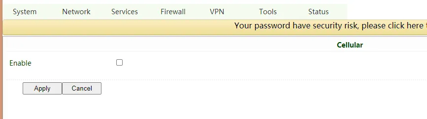
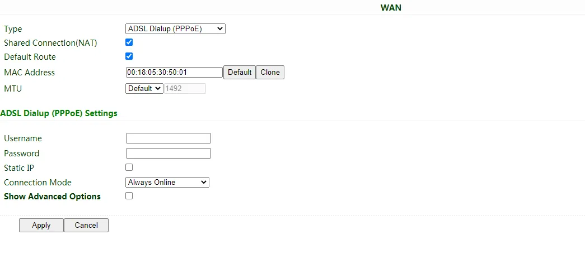

# IR305 Industrial Router Quick Install Guide

> **What you need to do first:** Unbox → Mount the device → Connect power and Ethernet → (If using cellular) **Power off** to install SIM, attach antennas → Power on → Set PC to same subnet → Open Web in browser.  
> **Then:** Scroll down to **Part II** to check packing list, LED meanings, mounting, and interface details.

## Must-Read Summary (Before Wiring and Power-On)

| Item | Requirement |
|------|-------------|
| Power | **12 V DC** via the included adapter or terminal; **PWR steady red** indicates power on. |
| SIM card | **Power off** before inserting or removing; **no hot-swapping**. |
| Antennas | Tighten by the **metal connector** clockwise until snug; do **not** twist by the black rubber stick. |
| Environment | Working temp **-20 ℃ ~ 70 ℃**; avoid direct sunlight, heat sources, and strong EMI. |

---

## Step 1: Identify the Front and Rear Panels

Take out the router and compare it with the panel diagrams below. Locate the WAN/LAN1 port, LAN port, power jack, SIM slots, antenna connectors, and RESET button.

For LED positions and meanings, see §2.3. For mounting options, see §2.4.

---

## Step 2: Mount the Device

Use the two **panel mounting lugs** included in the box to secure the router to a panel or inside a cabinet. See §2.4 for details.

---

## Step 3: Connect Power and Ethernet

1. Connect the **12 V DC power adapter** to the router's power jack.
2. Connect the **WAN/LAN1** port to your upstream network (modem, switch, or public network).
3. Connect your **PC** to one of the **LAN** ports.

For wired Internet configuration, see §2.7.

---

## Step 4: (If Using Cellular) Power Off to Install SIM and Attach Antennas

> **Warning:** Always power off the device before inserting or removing a SIM card to prevent data loss or damage.

1. Make sure the router is **powered off**.
2. Insert a **nano SIM** into the slot on the left side of the device. Use a pin to eject the tray.
3. Attach the **cellular antenna(s)** to the corresponding connectors. Tighten by rotating the metal interface clockwise until snug. Do not twist by the black rubber stick.
4. If using Wi-Fi, attach the **Wi-Fi antennas** to their connectors.

For antenna details and SIM specifications, see §2.5.3.

---

## Step 5: Power On and Verify

Power on the router. Watch the LEDs:

- **PWR** turns **steady red** — power is on.
- **SYS** turns **steady green** — system is working normally.

For a full LED reference, see §2.3.

---

## Step 6: Log In via Browser

1. Configure your PC to obtain an IP address automatically via **DHCP** (recommended). Or manually set a static IP in the **192.168.2.2 ~ 192.168.2.254** range with subnet mask **255.255.255.0** and gateway **192.168.2.1**.
2. Open a browser and go to **http://192.168.2.1**.
3. Enter the username and password shown on the nameplate at the bottom of the device.
4. If the browser warns that the connection is not private, click **Advanced** and proceed.

| Port Role | Default IP |
| :-------: | :--------: |
| WAN/LAN   | 192.168.2.1 |

For certificate warnings, default credentials, and recovery options, see §2.7.

---

## Installation Checklist

- ☐ Device is mounted securely with the panel lugs.  
- ☐ Power and Ethernet cables are connected.  
- ☐ If using cellular, SIM card(s) and antenna(s) are installed while powered off.  
- ☐ **PWR is steady red** and **SYS is steady green**.  
- ☐ Browser opens the Web login page and login succeeds.

If you cannot access the Web page, verify your PC is in the same subnet and check the Ethernet connection. To restore factory settings, see §2.7.

---

# Part II: Detailed Description

## 2.1 Packing List

### Standard Accessories

| No. | Name | Qty | Unit | Remarks |
|-----|------|-----|------|---------|
| 1 | IR305 Industrial Router | 1 | pc | — |
| 2 | Panel mounting lug | 2 | pc | For router mounting |
| 3 | Cellular antenna | 1/2 | pc | Suction cup antenna (2 m cable): 1 pc (LQ20 series), 2 pcs (other series) |
| 4 | Wi-Fi antenna | 2 | pc | Suction cup antenna (2 m cable) |
| 5 | Ethernet cable | 1 | pc | 1.5 m |
| 6 | Power adapter | 1 | pc | 12 V DC |

### Optional Accessories

Contact InHand sales staff for optional accessories according to your field requirements.

---

## 2.2 Product Structure and Identification

This manual is a guide for the installation and operation of IR305 routers from InHand Networks. Please confirm the product model and packaging accessories (power terminal, antenna), and purchase SIM cards from local network operators.

### Front / Top Panel

### Rear / Bottom Panel

---

## 2.3 LED Indicators and Reset Button

### 2.3.1 Operating Status LEDs

| LED | Status | Meaning |
|-----|--------|---------|
| PWR | Red off | Power off |
| | Steady red | Power on |
| SYS | Green off | System error |
| | Flashing green | System upgrading |
| | Steady green | System working |
| Wi-Fi | Green off | Wi-Fi disabled |
| | Flashing green | Wi-Fi connecting |
| | Steady green | Wi-Fi working |
| NET | Green off | Network disconnected |
| | Flashing green | Network connecting |
| | Steady green | Network connected |

### 2.3.2 Reset Button

The **RESET** button is located on the device (see §2.2 panel diagrams). Pressing and holding it according to the sequence in §2.7 restores the device to factory defaults.

---

## 2.4 Mechanical Installation

### 2.4.1 Panel Mounting

Use the two included **panel mounting lugs** to secure the IR305 to a panel or inside a cabinet with appropriate screws.

---

## 2.5 Connections and Cabling

### 2.5.1 Ethernet

The IR305 provides one **WAN/LAN1** port and one **LAN** port for wired network access.

### 2.5.2 Power

The IR305 is powered by **12 V DC** via the included power adapter. Connect the adapter to the DC power jack on the device. When powered on, the **PWR LED** turns steady red.

### 2.5.3 Cellular SIM and Antennas

#### SIM Card

IR305 supports **dual nano SIM** cards.

> **Warning:** When inserting or removing a SIM card, please unplug the power cable to prevent data loss or damage to the router.

To install: stick a pin into the hole on the left of the SIM card slot to eject the tray, then insert the nano SIM card.

#### Antennas

Rotate the metal interface clockwise until the movable part cannot be rotated. Do not hold the black rubber stick to twist the antenna.

| Antenna | Qty | Remarks |
|---------|-----|---------|
| Cellular antenna | 1 / 2 | Suction cup antenna (2 m cable): 1 pc for LQ20 series, 2 pcs for other series |
| Wi-Fi antenna | 2 | Suction cup antenna (2 m cable) |

---

## 2.6 Power and Environmental Specifications

| Item | Specification |
|------|---------------|
| Input voltage | 12 V DC |
| Working temperature | -20 ℃ ~ 70 ℃ |
| Storage temperature | -40 ℃ ~ 85 ℃ |
| Relative humidity | 5 % ~ 95 % (no frosting) |

---

## 2.7 First Login and Factory Reset

### Web Login

1. Connect power and Ethernet cable to IR305. Connect WAN/LAN1 port to the public network, and one of LAN ports to your PC.
2. Configure your PC to obtain an IP address from DHCP automatically (recommended). Or configure a fixed IP address in the same network segment: IP in **192.168.2.2 ~ 192.168.2.254**, subnet mask **255.255.255.0**, default gateway **192.168.2.1**, DNS **8.8.8.8** or your ISP's DNS.
3. Access **http://192.168.2.1** in a browser. Enter the username and password (see the nameplate at the bottom of the device).

4. If the browser alarms that the connection is not private, show advanced and proceed.

| Port Role | Default IP |
| :-------: | :--------: |
| WAN/LAN | 192.168.2.1 |

### Wired Internet Setup

After login, create a WAN port in **Network >> WAN**. Configure the WAN port with one of the following methods:

- **Dynamic DHCP** (recommended)
- **Static IP** — configure manually, then click Apply & Save
- **ADSL Dialup** — configure manually, then click Apply & Save

Then check connectivity in **Tools >> PING**.

*Obtain IP address by Dynamic DHCP*

*Obtain IP address by Static IP*

*Obtain IP address by ADSL Dialup*

*Ping test*

### Cellular Dialup Setup

1. Insert the SIM card when the device is **powered off**. Connect the cellular antenna(s), and connect the PC to the router. Then power on.
2. Open a browser and access the router's Web management page (refer to Web Login above).
3. Click **Network >> Cellular** and set the profile. The device enables cellular by default; it will connect to the Internet within a few minutes. If it cannot connect, disable and restart dialup. (If you use a private network SIM card, you also need to configure the APN parameter.)

4. Check the dialup status in **Status**. If it shows **Connected** and there is an IP address and other dialup parameters, the router has connected to the Internet via SIM card.

### Wi-Fi Setup

#### AP Mode (Default)

IR305 acts as an access point to radiate wireless signals. Other terminal devices can connect to this device to access the Internet. Ensure that IR305 itself is already connected to the Internet through wired or cellular. AP mode supports setting SSID name and encryption authentication mode.

#### STA Mode

IR305 connects to another AP Wi-Fi device to access the Internet.

1. Select WLAN Type to **STA** in **Network >> Switch WLAN Mode** and save. Then reboot the router.

2. Click **Scan** in **Network >> WLAN Client** to scan available APs, and click **Connect** to choose one.

3. Configure Wi-Fi parameters and save. Then check the connection status in **Status**.
4. Configure WAN mode in **Network >> WAN(STA)**, and set WAN parameters for Wi-Fi.

### Factory Reset

#### Web Reset

Login to the Web management page, click **System >> Config Management** in the navigation tree. Click the **Restore default configuration** button. The router will restore to default settings after reboot.

#### Hardware Reset

1. Power on the device and immediately press and hold the **RESET** button until the **SYS LED** turns **solid**.
2. Release the **RESET** button and wait for the **SYS LED** to turn off.
3. Press and hold the **RESET** button again until the **SYS LED** starts **flashing**, then release the button. The device will now be restored to its default settings and will restart normally.

---

## 2.8 Related Documents

| Need | Destination |
|------|-------------|
| Product introduction, configuration, and troubleshooting | *IR305 User Manual* |
| Ordering information and antenna models | *IR305 Product Datasheet* |
| Software and announcements | [InHand Networks website](https://www.inhandnetworks.com) |

---

## 2.9 Legal Information

All statements, information and recommendations in this manual do not constitute any expressed or implied warranty.
