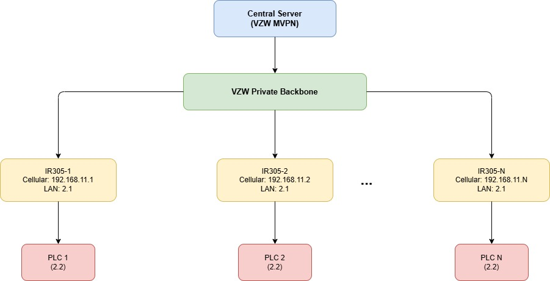

# Remote Device Management via VZW MVPN Configuration Guide

## 1. Document Information

- Product Model: IR305 (also applicable to other IR devices, including IR302 and IR315)
- Firmware Version: V1.0.118
- Applicable Scenario: Industrial device networking, medical device networking, self-service terminal networking, POS/cash register networking, etc.
- Document Date: April 5, 2026

## 2. Router Overview

### 2.1 Product Introduction

The InRouter305 (IR305) is an industrial-grade cellular router designed for IoT applications. It supports multiple WAN connection types including 4G LTE, and provides stable, secure communication for multi-site deployments. The IR305 is suitable for scenarios where multiple remote devices need to communicate with each other through a shared network backbone.

### 2.2 Key Features

- Supports multiple routers within the same LAN for mutual terminal access
- Supports DMZ (Demilitarized Zone) configuration for traffic forwarding
- Supports remote configuration, diagnostics, and firmware upgrade
- Industrial-grade design for unattended environments

### 2.3 Typical Application Topology

Multiple routers are connected to the same upstream network. Each router has a downstream server or terminal device. All downstream devices need to access each other using the router WAN IP.

## 3. Hardware Description

### 3.1 Interfaces

- Power: DC 9–36V, with reverse polarity and overcurrent protection
- Network ports: 5 x 10/100Mbps fast Ethernet port, RJ45，WAN/LAN/VLAN port, 1.5KV network isolation transformer protection
- Wireless: 4G LTE
- LED Indicator: PWR, SYS, Wi-Fi, NET 
- Reset button: Restores factory default settings

### 3.2 Interface Description

- WAN: Upstream network interface (connected to shared LAN or cellular)
- LAN: Downstream interface (connected to local terminal devices)
- Antenna Connector: 4G ：SMA x 1; Wi-Fi ：RP-SMA x 2; GPS(Optional): SMA x 1 (Note：For the North America models: 2 x SMA 4G antenna connectors; GPS models：1 x RP-SMA Wi-Fi antenna connector; 1 x SMA GPS antenna connector)

## 4. Factory Default Parameters

- Default IP: 192.168.2.1
- Subnet Mask: 255.255.255.0
- Web Username: adm
- Web Password: 123456 (some units use a random password — refer to the device label)

## 5. Pre-Configuration Requirements

1. Set your PC to the same subnet as the router LAN IP (gateway: 192.168.2.1)
2. Connect your PC to the router LAN port via Ethernet cable
3. Power on the router and wait for the Status indicator to turn on
4. Ensure a supported web browser is installed on your PC

## 6. Network Configuration

### 6.1 Background and Requirements

Multiple routers are deployed within the same Verizon SIM card (VZW MVPN). Each router has a downstream device (server, PLC, or terminal). The goal is for all downstream devices to access each other using the router's cellular WAN IP address.

Network address example:

| Device | WAN IP | LAN IP | Downstream Device IP |
|---|---|---|---|
| IR305-1 | 192.168.11.1/24 | 192.168.2.1/24 | 192.168.2.2/24 |
| IR305-2 | 192.168.11.2/24 | 192.168.2.1/24 | 192.168.2.2/24 |
| IR305-N | 192.168.11.N/24 | 192.168.2.1/24 | 192.168.2.2/24 |

### 6.2 Solution — DMZ Configuration

DMZ (Demilitarized Zone) forwards all inbound traffic on the WAN interface directly to a specified downstream host.

Configuration steps:

1. Log in to the router Web interface
2. Navigate to **Firewall** → **DMZ**
3. Check **Enable DMZ**
4. Set **DMZ Host** to the downstream device IP address (e.g., `192.168.2.2`)
5. Leave **Source Address Range** empty to allow all sources
6. Set **Interface** to `All WANs` or the specific WAN interface in use
7. Click **Apply** to save

Configuration parameters:

| Parameter | Description | Value Type | Default |
|---|---|---|---|
| DMZ Host | IP address of the host to place in the DMZ zone | IP Address | Empty |
| Source Address Range | Restrict forwarding to specific source IPs (optional) | IP Range | Empty |
| Interface | The upstream WAN interface to apply DMZ on | Interface | All WANs |

Result: After configuration, any traffic reaching the router WAN IP will be forwarded directly to the DMZ host.

## 7. Verification

After applying the DMZ configuration, verify connectivity:

1. From the Server connected to IR305-1, open a browser and access `http://192.168.11.2`
2. If the page of the downstream device behind IR305-2 loads successfully, the configuration is working correctly
3. Repeat the test for other router WAN IPs to confirm all end devices are reachable

## 8. Troubleshooting

1. Cannot access the router's Web interface
   - Check that your PC is on the same subnet as the router LAN IP
   - Check the Ethernet cable connection
   - Try restoring factory defaults and retry

2. DMZ not forwarding traffic
   - Confirm the downstream device IP is correct and reachable from the router LAN
   - Confirm the Interface field is set to the correct WAN interface
   - Check if any firewall rules are blocking the traffic

3. Downstream devices cannot reach each other
   - Verify all routers are connected to Verizon's private network and get the IP address assigned
   - Confirm each router's cellular WAN IP is unique and reachable
   - Check that the downstream device is using the router LAN IP as its default gateway
