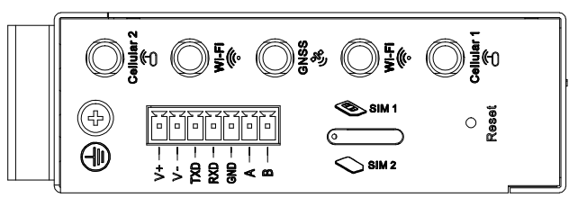
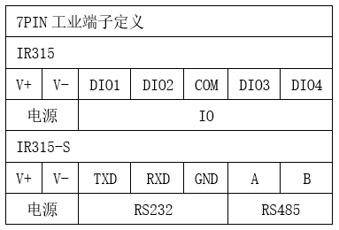

  

    

      
    

    

      5G Cost-Effective Multi-Port Industrial Router for Secure Networking and Cloud O&M
    

  

  

    

      InRouter315 Industrial Router
    

    

      

        
· 5G

        
· Wi-Fi

      

      

        
· Cloud Management

        
· Rich Industrial Interfaces

      

    

  

# 1. Product Overview

**The InRouter315 (IR315) series is a 5G cost-effective multi-port industrial router designed for industrial IoT scenarios, integrating cellular, Wi-Fi, VPN, and cloud management capabilities.**

The IR315 provides uninterrupted multi-network access with comprehensive security and wireless service features, enabling tens of thousands of devices to connect and delivering high-speed data pathways for industrial field equipment. The product is designed to meet the requirements of unattended field communication, utilizing hardware and software watchdogs and multi-level link detection mechanisms to ensure communication stability and reliability. It also supports the InHand Device Manager "Device Cloud" management platform, facilitating remote management and ensuring intelligent device management.

## Key Technical Specifications

| Technical Specification | Specification |
|---------|------|
| Cellular Network | 5G NR (SA/NSA) or LTE (depending on model); dual Nano SIM; supports PDP configuration (IPv4/IPv4V6) |
| VPN | IPSec (IKEv2, AES256-SHA512), PPTP, L2TP, GRE, DMVPN, OpenVPN, WireGuard, ZeroTier |
| Wi-Fi (optional) | 2.4 GHz, IEEE 802.11 b/g/n, up to 300 Mbps |
| Firewall and Access Control | SPI stateful inspection, DoS protection, ACL, content filtering (domain auto-refresh), 802.1x, IP-MAC binding, MAC address filtering, etc. |
| Cloud Management and Network Management | Device Manager/ICS platform; SNMP v1/v2c/v3 (supports custom communication port), SNMP TRAP |
| Dynamic Routing and High Availability | Static/OSPF routing; VRRP (supports virtual MAC), link online detection, dual SIM switching, SIM switching policy, embedded watchdog |
| Ethernet Interface | 5 × 10/100 Mbps RJ45, supports WAN/LAN/VLAN, 1.5KV network isolation transformer protection |
| Serial Port and IO (optional) | 1×RS232+1×RS485 or 4×IO (depending on model) |
| Power Supply | DC 9~36 V, overcurrent/reverse polarity protection, 2-pin industrial terminal |
| Dimensions and Weight | 127 × 108.2 × 35 mm; 454 g |
| Operating Temperature | Standard: -35 ~ 70 ℃; Extended: -40 ~ 75 ℃ |
| Protection Rating | IP30 |

# 2. Core Features

## 2.1 Multi-Network Access

- **Cellular Network:** Supports 5G NR (SA/NSA) or LTE (depending on model), covering global mainstream operator frequency bands, adaptable to diverse field network environments
- **Wired Network:** 5 × 10/100 Mbps RJ45 Ethernet ports, supports flexible WAN/LAN/VLAN configuration, 1.5KV network isolation transformer protection
- **Wi-Fi Access:** 2.4 GHz IEEE 802.11 b/g/n, up to 300 Mbps, supports AP/Client/WDS three working modes
- **Dual SIM Card Slots:** Drawer-type slot supports 2 × Nano SIM, dual-SIM hot backup ensures network continuity

## 2.2 Reliable Online Connectivity

- **Dual SIM Switching:** Supports SIM switching policies triggered by signal threshold, packet loss threshold, dial failure count, and other conditions
- **VRRP Hot Backup:** Supports Virtual Router Redundancy Protocol (virtual MAC), seamless master/backup gateway switching
- **Multi-Level Link Detection:** ICMP probing, link online detection, supports hot backup/cold backup/load balancing modes
- **Embedded Watchdog:** Hardware and software watchdog dual protection, automatically recovers abnormal systems

## 2.3 Security Protection

- **Multiple VPNs:** Supports IPSec (IKEv2, AES256-SHA512), PPTP, L2TP, GRE, DMVPN, OpenVPN, WireGuard, ZeroTier
- **Firewall System:** SPI stateful inspection, DoS protection, ACL, port mapping, virtual IP mapping, DMZ, NAT
- **Access Control:** 802.1x authentication, IP-MAC binding, MAC address filtering, device local access control
- **User Security:** User permission management, PAM authentication parameter configuration, login failure lockout, system password protection mechanism

## 2.4 Cloud O&M

- **Device Manager Platform:** Batch management of distributed devices, supports JWT secure registration, public/private key registration
- **SNMP Network Management:** SNMP v1/v2c/v3, supports custom communication port, SNMP TRAP
- **Remote Management:** Supports HTTP/HTTPS API for remote device information viewing and parameter configuration
- **Status Reporting:** Supports cellular signal parameters (RSRP, RSRQ, SINR, RSSI, etc.) reporting to cloud platform

## 2.5 Industrial Expansion

- **Rich Interfaces:** Five Ethernet port design, optional RS232+RS485 serial port or 4×IO (DI/DO configurable)
- **GNSS Positioning:** Some models support GPS/BeiDou positioning functions
- **Industrial-Grade Design:** Metal enclosure fanless cooling, DIN rail mounting, IP30 protection rating
- **Wide-Temperature Operation:** Standard -35 ~ 70 ℃, extended models support -40 ~ 75 ℃

# 3. Typical Application Scenarios

## 3.1 Smart Manufacturing

The IR315 provides stable network access for factory automation production lines, PLCs, industrial robots, and other equipment. It collects device data through serial ports/IO, and securely transmits it to enterprise MES/ERP systems via cellular networks or VPN, enabling remote monitoring and predictive maintenance.

## 3.2 Smart Energy

Suitable for distribution automation, charging pile monitoring, photovoltaic power station monitoring, and other scenarios. The IR315 supports State Grid encryption (IEC101/IEC104), meeting the communication security requirements of the power industry; dual SIM switching and VRRP mechanisms ensure the continuity and reliability of power communication.

## 3.3 Smart Transportation

Suitable for intelligent traffic signals, electronic police, vehicle monitoring, logistics fleet management, and other scenarios. Supports GNSS positioning function for real-time vehicle location reporting; wide-temperature design and anti-vibration characteristics adapt to vehicle and outdoor harsh environments.

## 3.4 Smart Retail

Suitable for self-service vending machines, smart lockers, digital signage, and other scenarios. Batch management of widely distributed terminal devices through the Device Manager platform; Portal authentication supports commercial Wi-Fi access, reducing on-site O&M costs.

## 3.5 Environmental Monitoring

Suitable for atmospheric monitoring, water quality monitoring, noise monitoring, and other environmental protection scenarios. The DTU function supports serial device transparent transmission, Modbus RTU to TCP bridge facilitates access to various sensors, and remote logging and alarm functions help detect abnormalities in time.

# 4. Product Innovation Points

## 4.1 Product Innovation Summary

| Innovation Direction | Innovation Point | Core Capability/Value |
|---------|--------|--------------|
| Multi-Mode Cellular Communication | Intelligent Dialing Mode Adaptation | Supports QMI / PPP / ECM multiple dialing modes, automatically selects the optimal method according to module and network environment |
| | Dual SIM Intelligent Switching | Supports automatic SIM switching based on signal quality, ICMP detection, packet loss rate, dial failure count, and other strategies |
| | 5G / RedCap Support | Supports NRQ2, NRR0, NRR2 and other 5G modules, as well as NRF2/NRF4 and other RedCap modules |
| | Global Operator Adaptation | Automatically matches APN, BAND, IMS configurations for operators such as Verizon / AT&T / T-Mobile |
| Link Reliability | Link Backup and Hot Backup | Automatic master/backup link switching, supports hot backup + policy routing, actively reports alarms when switching |
| | Load Balancing | Multi-link load balancing optimization, improving bandwidth utilization and business continuity |
| VPN Technology Matrix | Full-Protocol VPN Support | Supports IPSec (IKEv1/v2), OpenVPN (TAP/TUN), L2TP, PPTP, GRE |
| | Modern VPN Protocols | Added WireGuard, ZeroTier to meet flexible networking needs |
| | Enhanced Tunnel Management | Supports peer domain name, multiple remote subnets, independent start/stop control of single tunnel |
| Industrial IoT Protocols | Industrial Serial Port / DTU | RS232/RS485 independent configuration, DTU supports TCP/UDP/domain name/multi-channel/DC protocol |
| | State Grid Encryption | Supports IEC101/IEC104/DC protocol state cryptography encryption, model 305NRQ2-SEC |
| | I/O Edge Control | 4-channel digital I/O, relay output, I/O status reporting to cloud platform, alarm triggering |
| Cloud Platform Management | Multi-Cloud Platform Adaptation | Supports InHand DM, InConnect, Smart-EMS, ICS and other platform access |
| | Secure Registration and Authentication | Supports MQTT/MQTTS, JWT registration, public/private key authentication, remote firmware upgrade |
| | Network Diagnosis and Observation | Built-in TCPDUMP, ping, traceroute, Qlog; cellular signal / GNSS parameter reporting |
| Security Hardening | Firmware Security | Firmware signature verification, system password protection, PAM authentication, login failure lockout |
| | Vulnerability Repair | Continuously fixes CVE, Talos, Fortinet, CISA and other disclosed vulnerabilities |
| | Software Component Upgrade | Continuous updates of OpenSSL, OpenVPN, curl, tcpdump, dnsmasq, mosquitto, busybox, etc. |
| Network Security Access | Access Control | Firewall, NAT, virtual IP mapping, 802.1X, Portal, MAC filtering, Wi-Fi black/whitelist |
| | Permission and Encryption | User permission management, HTTPS API, Wi-Fi password encryption, SSH login banner |
| Industrial Reliability | High Availability Design | Hardware watchdog, 72-hour offline traffic cache, NTP/GPS time synchronization |
| | Configuration Integrity | Configuration import/export verification, supports configuration files up to 128KB |
| O&M and Deployment | FCT Factory Test | Supports Wi-Fi, GNSS, I/O, network port, AT command, version query and other factory tests |
| | O&M Command Enhancement | Factory mode supports nvram / show / info version / net test / factory reset |
| WLAN Capability | Multi-Mode Wi-Fi | Supports AP / AP Client / WDS, 2.4GHz, automatic channel selection, special character SSID |
| | Enterprise Access | Radius authentication, Wi-Fi user isolation, password show/hide, calibration data backup |
| Network Management | Flexible Layer 2/Layer 3 | VLAN supports IP address pool and multiple IPs, static routing priority, DHCP static binding 200 entries |
| | DDNS Enhancement | Supports HTTPS DDNS update |
| Globalization and OEM | Multi-OEM Customization | Supports Global / InHand / Welotec / Blank / Blank_China and other OEMs |
| | Compliance Adaptation | Supports U.S. TAA Act requirements, automatic replacement of logo/domain/SSID/alarm page |

## 4.2 Differentiation Advantages

- **Global Frequency Band Coverage:** Supports mainstream frequency bands in China, Europe, North America, Australia, Japan, etc., certified by CE/FCC/PTCRB/RCM/MIC, etc.
- **Multiple VPNs in Parallel:** Supports 8 VPN protocols simultaneously to meet security access needs of different industries
- **Cloud-Edge Collaboration:** Device Manager + InConnect dual-platform support, realizing full lifecycle management of devices
- **Industrial-Grade Reliability:** Passed IEC 62443-4-2 network security certification and EN18031 regulatory certification
- **Flexible Customization:** Supports OEM/ODM customization, including logo, domain name, SSID, certificate and other white-label solutions

# 5. Hardware Specifications

## 5.1 Product Dimensions

  

    
    
Front View

  

  

    
    
Interface View

  

  

    
    
Side View

  

  
Note:

  
1. All dimensions are in millimeters (mm).

  
2. All dimensions are approximate values, for reference only.

  
3. The dimensions shown shall not be used for production and processing.

  
4. Dimensions must meet part and manufacturing tolerance requirements.

  
5. Dimensions are subject to change without notice.

## 5.2 Hardware Parameter Table

| Category/Parameter | Specification |
|--------------------------|------|
| **CPU and Storage** | |
| CPU | 580 MHz |
| RAM | 128 MB DDR2 |
| Flash | 64 MB SPI |
| **Connectivity and Interfaces** | |
| Ethernet Ports | 5 × 10/100 Mbps RJ45, supports WAN/LAN/VLAN, 1.5KV network isolation transformer protection |
| Power Interface | DC 9~36V, overcurrent/reverse polarity protection, 2-pin industrial terminal |
| I/O Port (optional) | 4 × IO (DI/DO configurable) |
| Serial Port (optional) | 1 × RS232 + 1 × RS485 |
| Reset Button | Pinhole reset button |
| SIM Card Slot | Drawer-type slot ×1, supports 2 × Nano SIM |
| Antenna Connectors | 5G: SMA ×2; 4G: SMA ×1 (overseas 4G models are SMA ×2); Wi-Fi: RP-SMA ×2 |
| Grounding Terminal | Supported |
| LED Indicators | Power, System, Network, Wi-Fi, Signal |
| GNSS (optional) | Some models support (see ordering information <G/NA>) |
| **Wi-Fi** | |
| Radio Frequency | 2.4 GHz |
| Maximum Transmission Rate | 300 Mbps |
| Protocol | IEEE 802.11 b/g/n |
| Working Mode | AP / Client / WDS |
| Transmit Power | 802.11b: 16 dBm ±2 dBm (11 Mbps); 802.11g: 16 dBm ±2 dBm (54 Mbps); 802.11n @2.4 GHz: 16 dBm ±2 dBm (HT20 MCS7); 802.11n @2.4 GHz: 16 dBm ±2 dBm (HT40 MCS7) |
| Transmission Distance | Approx. 50 meters line-of-sight (affected by site environment) |
| Wi-Fi Performance Test | Test conditions: AP: IR305LQ20-WLAN / STA: Xiaomi 10S, WPA2-PSK AES, Channel 11, 40MHz |
| 1m | Suction cup antenna: 91.26 Mbps (signal -36 dBm); Rod antenna: 90.22 Mbps (signal -25 dBm) |
| 5m | Suction cup antenna: 90.25 Mbps (signal -47 dBm); Rod antenna: 90.30 Mbps (signal -38 dBm) |
| 10m | Suction cup antenna: 90.96 Mbps (signal -54 dBm); Rod antenna: 90.74 Mbps (signal -45 dBm) |
| 30m | Suction cup antenna: 1.28 Mbps (signal -62 dBm); Rod antenna: 7.20 Mbps (signal -64 dBm) |
| **Device Power** | |
| Standby Power | 120~200 mA@12V |
| Operating Power | 150~320 mA@12V |
| Peak Power | 320 mA@12V |
| **Mechanical Specifications** | |
| Product Dimensions (W × D × H) | 127 × 108.2 × 35 mm |
| Product Weight | 454 g |
| Mounting Method | DIN rail |
| Protection Rating | IP30 |
| Enclosure and Cooling | Metal shell, fanless cooling |
| **Environment and Certifications** | |
| Storage Temperature | -40~85 ℃ |
| Operating Temperature | Standard: -35 ~ 70 ℃ Extended: -40 ~ 75 ℃ |
| Ambient Humidity | 5~95% (non-condensing) |
| Physical Characteristics | Shock IEC60068-2-27 Vibration IEC60068-2-6 Drop IEC60068-2-32 |
| EMC Indicators | EN61000-4-2, level 3, ESD EN61000-4-3, level 3, Radiated Electric Field EN61000-4-4, level 3, Burst Electric Field EN61000-4-5, level 3, Surge EN61000-4-6, level 3, Conducted Disturbance Immunity EN61000-4-8, >level 2, Power Frequency Magnetic Field Immunity, horizontal/vertical 400A/m EN61000-4-12, level 3, Oscillatory Wave Immunity |
| Certifications | CE, E-MARK, FCC, IC, PTCRB, AT&T, Verizon, T-Mobile, RCM, IMDA, MIC&JATE, SRRC, UL, C1D2, IEC 62443-4-2, EN18031 |

# 6. Network Connectivity Capability

## 6.1 Cellular Network

| Parameter | Specification |
|------|------|
| Network Standard | GSM/GPRS/EDGE, UMTS/HSPA+/EVDO/TD-SCDMA, TDD LTE/FDD LTE, 5G NR (SA/NSA) |
| SIM Card | Dual Nano SIM, drawer-type slot |
| Dialing Mode | PPP, QMI, ECM (depending on model) |
| PDP Configuration | Supports IPv4/IPv4V6 |
| Network Access | APN, VPDN |
| Access Authentication | CHAP/PAP |
| Connection Mode | Always online, on-demand dialing, manual dialing |
| Dual SIM Switching | Supports SIM switching policies triggered by signal threshold, packet loss threshold, dial failure count, etc. |
| Operator Configuration | Built-in global mainstream operator APN configurations, supports T-Mobile, AT&T, Verizon, etc. |
| Signal Reporting | Supports RSRP, RSRQ, SINR, RSSI, RSCP, Ec/Io, PCI, BAND and other parameter reporting |

## 6.2 Wired Network

| Parameter | Specification |
|------|------|
| Ethernet Ports | 5 × 10/100 Mbps RJ45 |
| Port Roles | Supports flexible WAN/LAN/VLAN configuration |
| Isolation Protection | 1.5KV network isolation transformer protection |
| WAN Protocol | Static IP, DHCP, PPPoE |
| VLAN | Supports Access/Trunk mode, VLAN IP address pool configuration |
| Gratuitous ARP | Supports GARP broadcast, configurable broadcast count (1-10) and timeout (1-60 seconds) |
| IP Passthrough | Supports IP Passthrough function, distributing WAN port address to LAN port devices |

## 6.3 Wi-Fi Network

| Parameter | Specification |
|------|------|
| Radio Frequency | 2.4 GHz |
| Protocol Standard | IEEE 802.11 b/g/n |
| Maximum Rate | 300 Mbps |
| Working Mode | AP / Client / WDS |
| Bandwidth | 20 MHz / 40 MHz |
| Authentication Mode | Open, WEP, WPA-PSK, WPA2-PSK, WPA/WPA2, etc. |
| Encryption Mode | NONE, WEP, TKIP, AES |
| Security Features | Wi-Fi password encrypted display, Wi-Fi user isolation, AP black/whitelist |
| Transmit Power | 16 dBm ±2 dBm |
| Antenna Interface | RP-SMA ×2 |

## 6.4 Link Backup and Redundancy

| Function | Description |
|------|------|
| Link Backup | Supports cellular/WAN mutual backup, hot backup/cold backup/load balancing three modes |
| VRRP | Virtual Router Redundancy Protocol, supports virtual MAC, priority election |
| ICMP Detection | Supports detection server, interval, timeout, maximum retry count configuration |
| Load Balancing | After ICMP detection succeeds, data is transmitted through the corresponding link |

## 6.5 Routing Capability

| Function | Description |
|------|------|
| Static Routing | Supports destination network, subnet mask, gateway, interface configuration, supports priority |
| OSPF | Open Shortest Path First dynamic routing protocol, supports router ID and network advertisement |
| NAT | Network Address Translation, supports port mapping, virtual IP mapping |
| Dynamic Domain Name | DDNS, supports HTTPS update |

# 7. Software Functions

## 7.1 VPN and Data Security

| VPN Type | Function Description |
|----------|----------|
| IPSec VPN | Supports IKEv1/IKEv2, AES256-SHA512 encryption algorithm, up to 10 tunnels, supports peer domain name configuration |
| PPTP | Supports client/server mode |
| L2TP | Supports L2TP over IPSec, supports NAT traversal |
| GRE | Generic Routing Encapsulation tunnel |
| DMVPN | Dynamic Multipoint VPN |
| OpenVPN | Supports TAP/TUN mode, TLS-auth/tls-crypt options, AES-256-GCM/SHA256 encryption |
| WireGuard | New-generation high-performance VPN protocol, supports connection status detection |
| ZeroTier | Supports virtual LAN networking, multiple tunnels configurable |
| Certificate Management | Supports CA certificate, PKCS12 certificate import/export |

## 7.2 Firewall and Access Control

| Function | Description |
|------|------|
| SPI Firewall | Stateful packet inspection |
| DoS Protection | Denial of Service attack protection |
| ACL | Access Control List, supports source/destination address, port, protocol configuration |
| Content Filtering | Supports domain filtering, domain auto-refresh mechanism |
| Port Mapping | Supports protocol, source address, service port, internal port, external interface configuration |
| Virtual IP Mapping | Supports source address range configuration |
| DMZ | DMZ host configuration |
| NAT | Supports source address, destination address, port, interface configuration |
| IP-MAC Binding | Static binding of IP and MAC address |
| 802.1x | Port-level access authentication |
| MAC Address Filtering | Supports black/whitelist mode |
| Device Access Control | Supports interface, protocol, source address, port configuration |

## 7.3 Device Management and O&M

| Function | Description |
|------|------|
| Device Manager | InHand device cloud platform, supports batch management, remote configuration, firmware upgrade |
| InConnect | Supports device remote access and NAT rule issuance |
| SNMP | SNMP v1/v2c/v3, supports custom communication port |
| SNMP TRAP | Alarm information active reporting |
| HTTP API | Supports HTTP/HTTPS API, remote query and configuration |
| SSH/Telnet | Remote command line management |
| Console | Local serial console management |
| Configuration Management | Supports configuration import/export, factory reset |
| System Upgrade | Supports Web upgrade and Device Manager remote upgrade |
| Firmware Signature | System firmware adds signature verification to prevent firmware tampering |

## 7.4 Logs and Alarms

| Function | Description |
|------|------|
| System Log | Local/remote/serial log output, supports user-defined remote log prefix |
| Remote Log | Supports Syslog server (UDP 514 port) |
| Traffic Alarm | Monthly/24-hour/hourly traffic threshold alarm, traffic overrun reporting to cloud platform |
| System Alarm | System restart, LAN up/down, SIM failure, signal quality abnormal alarm |
| Status Reporting | Supports system, Modem, network connection, routing status, GPIO pin status reporting |
| SMS Alarm | Supports SMS query and configuration of APN/SIM/operator, remote status query and restart |

## 7.5 Industrial Protocols and Interfaces

| Function | Description |
|------|------|
| DTU | TCP/UDP transparent transmission, DCTCP/DCUDP mode, supports domain name configuration |
| Serial Port Traffic Statistics | Supports RS232/RS485 serial port traffic statistics, TCP connection status display |
| Modbus Bridge | Modbus RTU to Modbus TCP |
| State Grid Encryption | Supports IEC101/IEC104 power protocol encryption (specific models) |
| I/O Control | 4 × IO (DI/DO configurable), supports edge-triggered status reporting |
| SMART-EMS | Supports cellular IP address reporting, optional no restart when connection fails |

## 7.6 Network Services

| Function | Description |
|------|------|
| DHCP | Server/Client, supports static binding (up to 200 entries), address pool range automatic verification |
| DNS | DNS proxy, DNS forwarding, supports custom domain name server |
| DDNS | Supports HTTPS update |
| NTP | NTP server function, GPS time synchronization |
| Portal | Captive portal authentication |
| QoS | Bandwidth limiting, IP rate limiting |
| SIP ALG | SIP Application Layer Gateway |
| Scheduled Tasks | Scheduled restart, supports advanced options to configure multiple rules |
| Network Packet Capture | Built-in TCPDUMP packet capture tool, supports interface, capture count, expert options configuration |
| Maintenance Tools | Ping, traceroute, speed test, ARPING |

# 8. Ordering Information

## 8.1 Model Rules

**Model code:** IR315-<WMNN>-<WLAN/NA>-<S/NA>-<G/NA>

<WMNN>: Wireless communication type & module  
<WLAN/NA>: Wi-Fi  
<S/NA>: Serial/IO  
<G/NA>: GNSS

## 8.2 Product Models

### Quick Selection Table

| Model | Region | Cellular Network | Wi-Fi | Serial/IO | GNSS |
|------|------|----------|-------|---------|------|
| IR315-NRQ2-<WLAN/NA>-<S/NA> | China | 5G NR SA/NSA | Optional | Optional | — |
| IR315-LQ20-<WLAN/NA>-S | China | CAT4 | Optional | S | — |
| IR315-FQ58-<WLAN/NA>-<S/NA> | Europe/APAC/Australia/NZ | CAT4 | Optional | Optional | — |
| IR315-FQ58-WLAN-<S/NA>-G | Europe/APAC | CAT4 | Standard | Optional | Supported |
| IR315-FQ78-<WLAN/NA>-<S/NA> | Australia/New Zealand | CAT4 | Optional | Optional | — |
| IR315-FQ78-WLAN-G | Australia/New Zealand | CAT4 | Standard | IO | Supported |
| IR315-FQ88-<WLAN/NA>-S | Japan | CAT4 | Optional | S | — |
| IR315-FQ38-<WLAN/NA> | North America | CAT4 | Optional | IO | — |
| IR315-FF39-<WLAN/NA>-<S/NA> | North America | CAT6 | Optional | Optional | — |
| IR315-FF39-WLAN-<S/NA>-G | North America | CAT6 | Standard | Optional | Supported |
| IR315-EN00-<WLAN/NA>-S | Global | No cellular | Optional | S | — |

> **Note:**
> - `Optional` = This position is optional (e.g., `<WLAN/NA>` can be WLAN or NA, `<S/NA>` can be S or NA)
> - `S` = 1×RS232 + 1×RS485; `IO` = 4×IO
> - `—` = Not supported

### Frequency Band Specification Details

| Module | Region | 5G NR | LTE-FDD | LTE-TDD | WCDMA | GSM |
|------|------|-------|---------|---------|-------|-----|
| NRQ2 | China | NSA: n41/n77/n78/n79 SA: n1/n3/n5*/n8/n28/n41/n77/n78/n79 | B1/B3/B5/B8 | B34/B38/B39/B40/B41 | B1/B5/B8 | — |
| LQ20 | China | — | B1/B3/B5/B8 | B34/B38/B39/B40/B41 | B1/B5/B8 | B3/B8 |
| FQ58 | Europe/APAC/Australia/NZ | — | B1/B3/B5/B7/B8/B20/B28 | B38/B40/B41 | B1/B5/B8 | B3/B8 |
| FQ78 | Australia/New Zealand | — | B1/B2/B3/B4/B5/B7/B8/B28 | B40 | B1/B2/B5/B8 | B2/B3/B5/B8 |
| FQ88 | Japan | — | B1/B3/B8/B18/B19/B26 | B41 | B1/B6/B8/B19 | — |
| FQ38 | North America | — | B2/B4/B5/B12/B13/B14/B66/B71 | — | B2/B4/B5 | — |
| FF39 | North America | — | B2/B4/B5/B7/B12/B13/B14/B17/B25/B26/B29/B30/B66/B71 | B41/B42/B43/B46/B48 | B2/B4/B5 | — |
| EN00 | Global | — | — | — | — | — |

# 9. Contact Us

- **Official Website:** [InHand Networks](https://www.inhand.com.cn)
- **Copyright Notice:** © InHand Networks. All rights reserved.
