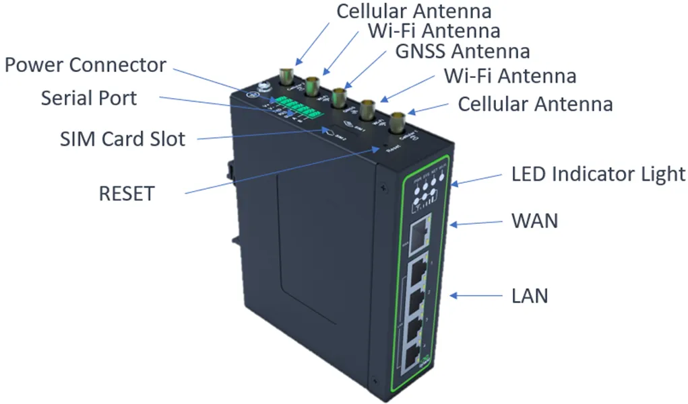
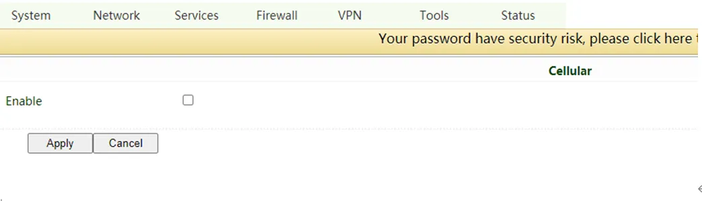
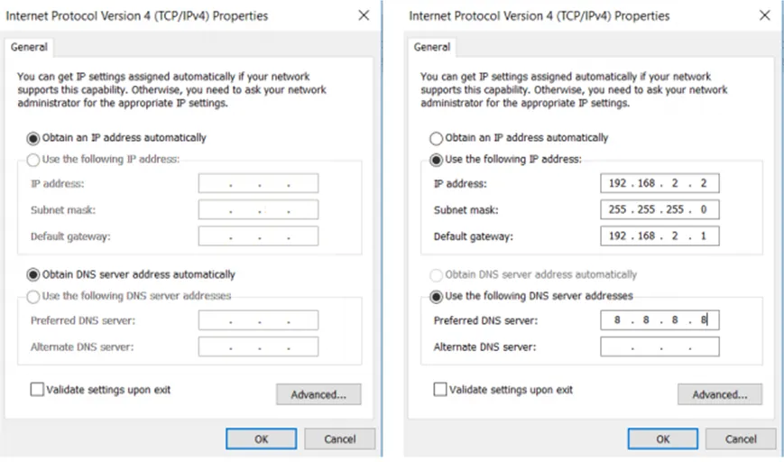
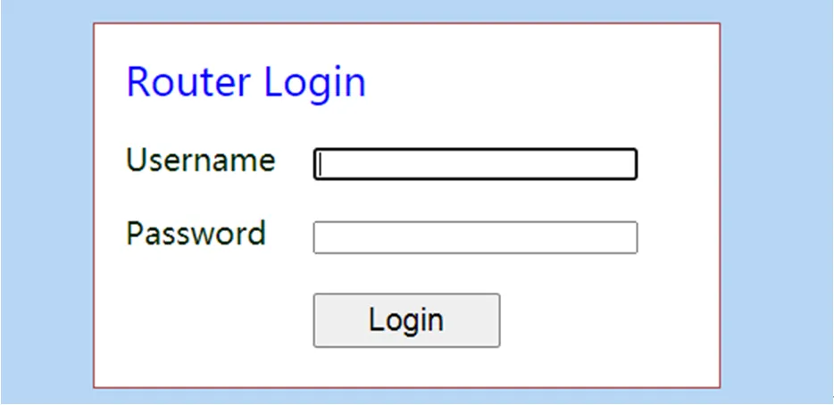
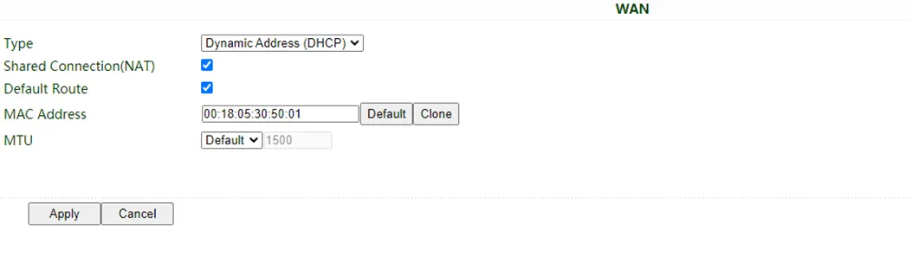
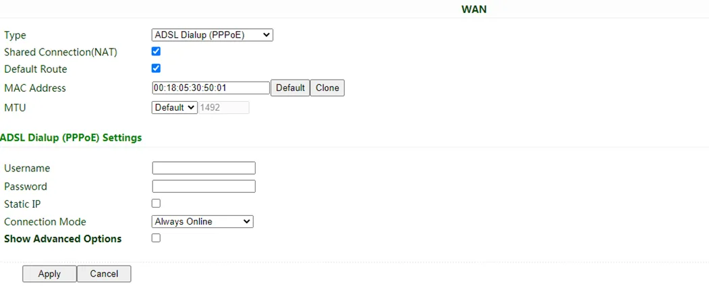
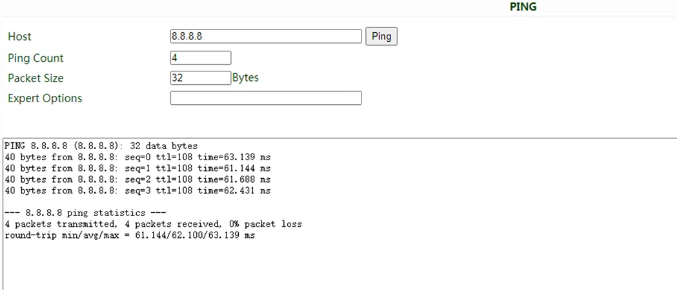
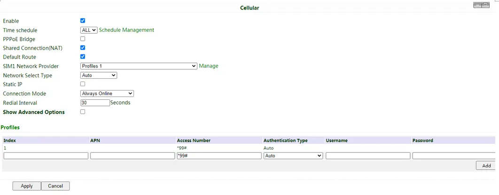
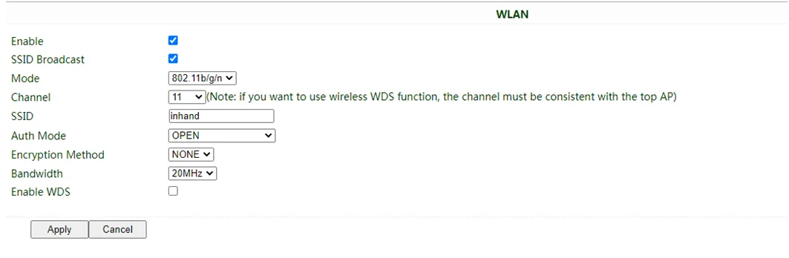
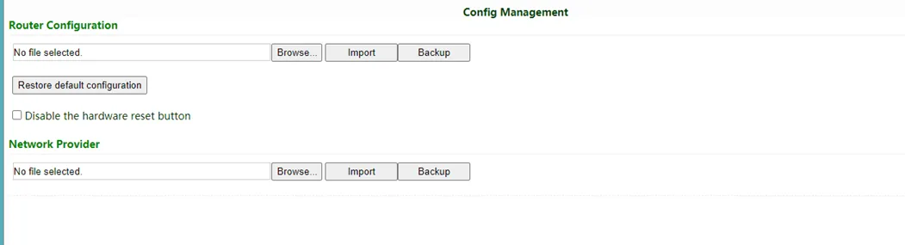

# Industrial Router IR315 Quick Installation Guide

> **What you need to do first:** Unbox → Mount the device → Connect power and Ethernet → (If using cellular) **Power off** to install SIM and connect antennas → Power on → Set PC to same subnet → Open Web in browser.  
> **Then:** Scroll down to **Part 2** to check packing list, indicator meanings, mounting methods, antenna details, etc.

---

## Part 1: Quick Installation (Visual Step-by-Step)

### Must-Read Summary (Before Wiring and Powering On)

| Item | Requirement |
|------|-------------|
| Power supply | **12V DC** using the included power adapter; **PWR steady red** indicates power on. |
| SIM card | **Must power off** before inserting or removing; **no hot swapping**. |
| Cellular / Wi-Fi antenna | Tighten clockwise by the **metal connector** according to the housing silkscreen; do not twist by the black stick. |
| Environment | Operating temperature **-20℃ ~ 70℃**; keep away from heat sources, strong electromagnetic interference, and direct sunlight. |

---

### Step 1: Check the Panel and Interface Areas Against the Actual Device

Look at the device panel to confirm the location of each interface. The IR315 provides a WAN/LAN1 port, a LAN port, cellular antenna connectors, Wi-Fi antenna connectors, SIM card slots, and a power connector.

> For detailed port locations and labels, see §2.2.

---

### Step 2: Mount the Device on a DIN Rail or Inside a Cabinet

Attach the included DIN-rail clip to the back of the device, then snap the device onto a standard 35mm DIN rail. For panel mounting, use the optional panel mount kit.

> For detailed DIN rail installation and removal steps, see §2.4.

---

### Step 3: Connect Power and Ethernet

1. Connect the power adapter to the device's power connector.
2. Connect the WAN/LAN1 port to the upstream network (e.g., modem or switch).
3. Connect your PC to the device's LAN port with an Ethernet cable.

> For Ethernet port details, see §2.5.1; for power supply details, see §2.5.2.

---

### Step 4: (If Using Cellular) Power Off to Install SIM and Connect Antennas

1. **Make sure the device is powered off.**
2. Insert the eject pin into the small hole on the left side of the SIM slot to eject the tray, place a nano SIM card in it, and push the tray back in.
3. Tighten the cellular antenna clockwise by the metal connector until it cannot turn further. Connect the Wi-Fi antennas in the same way.

> **Warning: Always power off the device before inserting or removing a SIM card to prevent data loss or damage.**  
> For antenna and SIM details, see §2.5.6.

---

### Step 5: Power On and Confirm the Device Is Ready

After powering on, check the LEDs:
- **PWR steady red** — Power is normal.
- **SYS steady green** — The system is running normally.

> For a complete list of indicator meanings, see §2.3.

---

### Step 6: Log In via PC and Browser

1. Set your PC network adapter to **DHCP automatic IP** (recommended), or manually configure an IP in the **192.168.2.2 ~ 192.168.2.254** range, subnet mask **255.255.255.0**, gateway **192.168.2.1**.
2. Open a browser and go to **192.168.2.1**.
3. Enter the username and password in the pop-up window (see the nameplate on the bottom of the device).
4. If the browser warns that the connection is not private, click **Advanced** → **Proceed**.

| Port Role | Default IP |
| :---: | :---: |
| WAN/LAN1 | 192.168.2.1 |

> For complete first-login and factory-reset instructions, see §2.7.

---

### Post-Installation Checklist

- ☐ The device is securely mounted (DIN rail or panel).
- ☐ Power and Ethernet cables are connected; if using cellular, the SIM and antennas are in place.
- ☐ **PWR is steady red** and **SYS is steady green**.
- ☐ The browser can open the Web login page and log in successfully.

If you cannot log in, check your PC subnet settings. If you need to restore factory settings, refer to the hardware reset procedure in §2.7.

---

## Part 2: Detailed Information

### 2.1 Packing List

**Standard Accessories**

| No. | Name | Qty | Unit | Remarks |
|-----|------|-----|------|---------|
| 1 | IR315 Router | 1 | pcs | — |
| 2 | DIN-rail Clip | 1 | pcs | For DIN rail mounting |
| 3 | Cellular Antenna | 1/2 | pcs | Suction cup antenna (2m cable): 1pc for LQ20 series, 2pcs for other series |
| 4 | Wi-Fi Antenna | 2 | pcs | Suction cup antenna (2m cable) |
| 5 | Ethernet Cable | 1 | pcs | 1.5m |
| 6 | Power Adaptor | 1 | pcs | 12V DC |

**Optional Accessories**

| No. | Name | Qty | Unit | Remarks |
|-----|------|-----|------|---------|
| 1 | Panel Mount Kit Option 1 | 1 | set | — |
| 2 | Panel Mount Kit Option 2 | 1 | set | — |

Panel mount kit option 1:

Panel mount kit option 2:

---

### 2.2 Product Structure and Identification

The IR315 is an industrial router that supports three ways of accessing the Internet: wired, cellular, and Wi-Fi. Please confirm the product model and packaging accessories before use, and purchase SIM cards from local network operators.

Panel introduction:

You can find the serial number in "Status >> System" on the Web management page, or on the nameplate at the back of the device.

---

### 2.3 Indicators and Reset Button

#### 2.3.1 Status LEDs

| LED | Status | Meaning |
|-----|--------|---------|
| PWR | Red off | Power off |
| | Steady red | Power on |
| SYS | Green off | System error |
| | Flashing green | System upgrading |
| | Steady green | System working |
| Wi-Fi | Green off | Wi-Fi disabled |
| | Flashing green | Wi-Fi connecting |
| | Steady green | Wi-Fi working |
| NET | Green off | Network disconnected |
| | Flashing green | Network connecting |
| | Steady green | Network connected |
| Signal | 3 green lights steady on | Dial-up successful, signal strength ≥ 20 |
| | 2 green lights steady on | Dial-up successful, 10 ≤ signal strength ≤ 19 |
| | 1 green light steady on | Dial-up successful, signal strength ≤ 9 |

#### 2.3.2 Reset Button

The RESET button is located on the front panel (see the diagram in §2.2). Press and hold the RESET button to restore the device to factory settings. For detailed steps, see §2.7.

---

### 2.4 Mechanical Installation

#### 2.4.1 DIN Rail: Installation

Attach the DIN-rail clip to the back of the device, then snap the device onto a standard 35mm DIN rail from above. A "click" sound indicates it is locked in place.

#### 2.4.2 DIN Rail: Removal

Use a screwdriver to push down the bottom of the clip to release the device from the rail, then pull the device outward.

#### 2.4.3 Panel Mounting

First attach the panel mount kit to the device with screws, then secure the device to a wall or cabinet with screws. To remove, reverse the order: loosen the wall screws first, then remove the kit.

See §2.1 for illustrations of Option 1 and Option 2.

---

### 2.5 Connections and Cabling

#### 2.5.1 Ethernet

The IR315 provides one WAN/LAN1 port and one LAN port, both supporting 10/100Mbps auto-negotiation.

> Note: When the IR315 does not access the Internet via cellular, please disable Cellular in "Network > Cellular", otherwise the device will restart after trying to dial up and fail several times.

#### 2.5.2 Power Supply

The IR315 uses **12V DC** power. Please use the included power adapter. Pay attention to the voltage level to avoid over-voltage or under-voltage conditions.

#### 2.5.6 Cellular SIM and Antennas

**SIM Card**

The IR315 supports dual nano SIM cards. Stick the eject pin into the hole on the left of the SIM card slot to eject it, then insert a SIM card.

> **Warning: When inserting or plugging out the SIM card, please unplug the power cable to prevent data loss or damage to the router.**

**Antenna Installation**

Rotate the metal interface clockwise until the movable part cannot be rotated. Do not hold the black glue stick to twist the antenna.

---

### 2.6 Power Supply and Environment

| Item | Specification |
|------|---------------|
| Input Voltage | 12V DC |
| Operating Temperature | -20℃ ~ 70℃ |
| Storage Temperature | -40℃ ~ 85℃ |
| Relative Humidity | 5%~95% (no frosting) |

---

### 2.7 First Login and Factory Reset

#### Web Login

The steps are identical to "Step 6" in Part 1:

1. Enable the PC to obtain an IP address from DHCP automatically (recommended), or configure a fixed IP address in the same network segment as the router (192.168.2.2 ~ 192.168.2.254), subnet mask 255.255.255.0, default gateway 192.168.2.1. The DNS server should be 8.8.8.8 or the address of the ISP's DNS server.
2. Open a browser and access the default IP address 192.168.2.1.
3. Enter the username and password (see the nameplate at the bottom of the device).
4. If the browser alarms the connection is not private, click Advanced, and proceed to access the address.

#### Creating a WAN Port

After logging in, create a WAN port in "Network >> WAN" in the left menu and configure the Internet access method:

- **Dynamic DHCP (recommended)**: Obtain IP address automatically.

  

- **Static IP**: Configure manually, then click Apply & Save.

  

- **ADSL Dialup**: Configure manually, then click Apply & Save.

  

After configuration, check connectivity in "Tools > PING".

#### SIM Card Dial-up

If accessing the Internet via cellular:

1. **Power off** to insert the SIM card. Connect the 4G antenna to the router, and connect the PC to the router. Then power on.
2. Open a browser and access the router's WEB management page.
3. Click "Network >> Cellular", and set your profile. The device enables cellular by default; it will connect to the Internet within a few minutes. If the device cannot connect, please disable and restart dial-up. (If you use a private network SIM card, you also need to configure the APN parameter.)

4. Check the dial-up status in the "Status" section. If it displays "Connected" and shows an IP address along with other dial-up parameters, the router has successfully connected to the Internet via the SIM card.

#### Wi-Fi Internet Access

1. Connect the Wi-Fi antenna, and connect the PC to the device. Access the router's WEB management page.
2. Set Wi-Fi mode: AP or STA.

   - **AP mode (default)**: The IR315 acts as an access point to radiate wireless signals, and other terminal devices can connect to this device to access the Internet. Ensure that the IR315 itself has already been connected to the Internet through wired or cellular. AP mode supports setting the SSID name and encryption authentication mode; terminal devices will need to input a password when connecting.

     

   - **STA mode**: The IR315 connects to other AP Wi-Fi devices to access the Internet.
     1. Select WLAN Type to STA in "Network>>Switch WLAN Mode" and save. Then reboot the router.

        

     2. Click "Scan" to scan available APs in "Network>>WLAN Client", and click Connect to choose one of the APs.

        

     3. Configure Wi-Fi parameters and save. Then check the connection status in "Status".
     4. Configure WAN mode in "Network>>WAN(STA)", and set WAN parameters for Wi-Fi.

#### Restore to Factory Settings

**Web Method**

Log in to the WEB management page, and click on the "System>> Config Management" menu in the navigation tree. Click the "Restore default configuration" button; the router will restore to default settings after reboot.

**Hardware Method**

To restore the device to default settings using the reset button, follow these steps:

1. Power on the device and immediately press and hold the **RESET** button until the **SYS LED** turns **solid**.
2. Release the **RESET** button and wait for the **SYS LED** to turn off.
3. Press and hold the **RESET** button again until the **SYS LED** starts **flashing**, then release the button. The device will now be restored to its default settings and will restart normally.

#### Connect to InHand Device Manager

Make sure that the router is already connected to the Internet. Click "Service>>Device Manager" to set the router to connect to DM. iot.inhand.com.cn is the server for China, and iot.inhandnetworks.com is the server for global.

Fill in your DM account in Registered Account, then click "Apply" to save the configuration.

If you don't have a DM account, please click "Sign up/Sign in" after selecting the server; you will be directed to the InHand Device Manager website to register an account.

Log in to your account in Device Manager, and add your device in "Gateways". Name your device and fill in the serial number from the device, then you can manage your router in DM.

---

### 2.8 Related Documents

| Need | Where to Go |
|------|-------------|
| Product introduction, detailed configuration and troubleshooting | *IR315 User Manual* |
| Ordering and antenna models | *IR315 Product Datasheet* |
| Software and announcements | [InHand Networks Official Website](https://www.inhandnetworks.com) |

---

### 2.9 Legal Information

All statements, information and recommendations in this manual do not constitute any expressed or implied warranty.
