# Industrial Router IR315 Product User Manual

---

## Declaration

Thank you for choosing our product! Before use, please read this user manual carefully and comply with the following statements, which will help maintain intellectual property rights and legal compliance, and ensure your usage experience is consistent with the latest product information. If you have any questions or need to obtain written permission, please contact our technical support team at any time.

- Copyright Statement

This user manual contains copyright-protected content, and the copyright belongs to Beijing InHand Networks Technology Co., Ltd. and its licensors. Without written permission, no unit or individual may extract, copy part or all of the contents of this manual, or disseminate it in any form.

- Disclaimer

Due to continuous updates in product technology and specifications, the company cannot guarantee that the information in this user manual is completely consistent with the actual product. Therefore, the company assumes no responsibility for any disputes arising from inconsistencies between actual technical parameters and the user manual. Any changes to the product will not be notified in advance, and the company reserves the right to final changes and interpretation.

- Copyright Information

The contents of this user manual are protected by copyright law, and the copyright belongs to Beijing InHand Networks Technology Co., Ltd. and its licensors, with all rights reserved. Without written permission, the contents of this manual may not be used, copied, or disseminated without authorization.

## GUI Conventions

| Symbol | Meaning | Example |
|--------|---------|---------|
| `< >` | Indicates a variable or parameter to be replaced with an actual value | `<IP Address>` means to fill in the specific IP |
| `" "` | Indicates a text label on the interface | Click the "Save" button |
| `→` | Indicates menu hierarchy or operation sequence | 【Network】→【Cellular】 |
| `【 】` | Indicates a menu or page name | Enter the 【System Settings】page |
| **Caution** | Reminds the reader to be careful | Improper operation may result in data loss or device damage |
| **Note** | Contains detailed descriptions and helpful suggestions | Supplementary information to aid understanding |

## Technical Support
Email: support@inhandnetworks.com

URL: www.inhand.com

## How to Use This Manual

### Find Your Role

- First-time users: It is recommended to read in sequence: "Getting to Know the Device" → "Installation and First Use" → "Common Scenario Configuration" → "Feature Description and Parameter Reference"
- Existing device users: You may directly consult "Feature Description and Parameter Reference" or "Appendix: Troubleshooting"
- Cloud platform management users: You may consult "Device Remote Management Platform" in "Common Scenario Configuration" (if applicable)

### Quick Navigation by Task

| Task | Corresponding Chapter | Estimated Time |
|------|----------------------|----------------|
| Learn about device appearance and interfaces | [Getting to Know the Device](#chapter-1-getting-to-know-the-device) | Approx. 5 min |
| Install the device and power on for the first time | [Installation and First Use](#chapter-2-installation-and-first-use) | Approx. 10 min |
| Access the Internet via cellular network | [Common Scenario Configuration](#chapter-3-common-scenario-configuration) | Approx. 10 min |
| Access the Internet via wired connection | [Common Scenario Configuration](#chapter-3-common-scenario-configuration) | Approx. 10 min |
| Configure Wi-Fi functionality | [Common Scenario Configuration](#chapter-3-common-scenario-configuration) | Approx. 10 min |
| Connect device to InHand Device Manager | [Common Scenario Configuration](#chapter-3-common-scenario-configuration) | Approx. 15 min |
| Configure VPN tunnel | [Feature Description and Parameter Reference](#chapter-4-feature-description-and-parameter-reference) | As needed |
| Troubleshoot network connection issues | [Appendix: Troubleshooting](#appendix-troubleshooting) | As needed |

---

# Chapter 1 Getting to Know the Device

## 1.1 Overview

The InRouter315 (IR315) is an IoT cellular router that integrates 4G LTE, Wi-Fi, and VPN technologies to provide easy, reliable, and secure internet connectivity. Through technologies such as 4G wireless wide-area network and Wi-Fi wireless local area network, it offers uninterrupted access to multiple networks. Its comprehensive security mechanisms and wireless services support networking for tens of thousands of devices, enabling high-speed data access.

This product is suitable for networking unattended devices and sites. It is embedded with watchdog and multi-layer link detection mechanisms, ensuring reliable and stable communications.

The router can be easily deployed to build large-scale networks scaling up to tens of thousands of devices. Through the InHand Device Manager cloud platform, users can efficiently manage their networks.

The IR315 finds application in a wide range of industrial and commercial IoT scenarios, providing a good balance between cost and performance.

## 1.2 Packing List

### Standard Accessories

| Item | Quantity | Description |
|------|----------|-------------|
| IR315 Router | 1 | Router main unit |
| DIN-rail | 1 | For router mounting |
| Cellular antenna | 1/2 | Suction cup antenna (2m cable): 1pc (LQ20 series), 2pcs (other series) |
| Wi-Fi antenna | 2 | Suction cup antenna (2m cable) |
| Ethernet cable | 1 | 1.5m ethernet cable |
| Power adaptor | 1 | 12V DC Power Adapter |

### Optional Accessories

| Item | Quantity | Description |
|------|----------|-------------|
| Panel mount kit option 1 | 1 | Router panel mounting |
| Panel mount kit option 2 | 1 | For router mounting |

Panel mount kit option 1 is shown in the figure below:

<p align="center">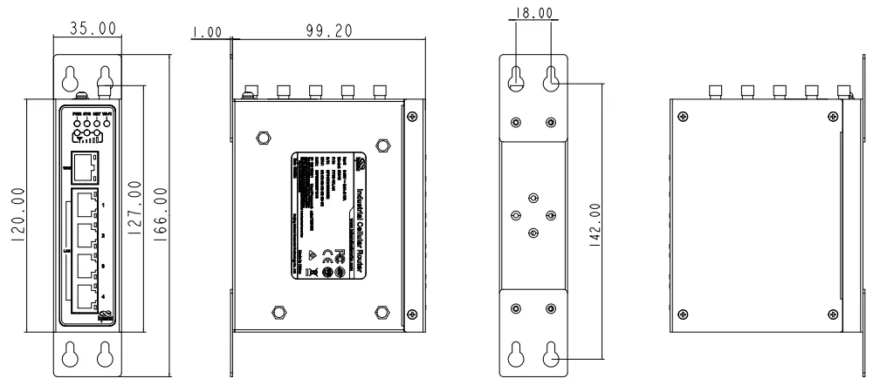</p>

<p align="center"><strong>Figure 1-1 Panel Mount Kit Option 1</strong></p>

Panel mount kit option 2 is shown in the figure below:

<p align="center">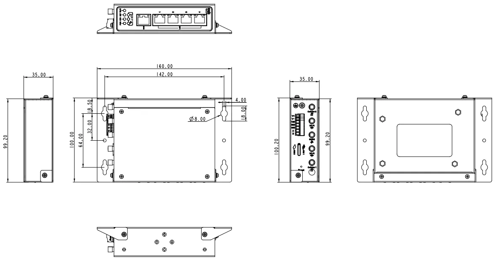</p>

<p align="center"><strong>Figure 1-2 Panel Mount Kit Option 2</strong></p>

## 1.3 Appearance and Interfaces

<p align="center"></p>

<p align="center"><strong>Figure 1-3 IR315 Panel Appearance</strong></p>

| Interface | Position | Description |
|-----------|----------|-------------|
| WAN/LAN1 | Front panel | Wired WAN/LAN interface, configurable as WAN or LAN |
| LAN2~LAN4 | Front panel | Wired LAN interfaces |
| Cellular antenna interface | Front panel | Connect 4G cellular antenna (SMA-J interface) |
| Wi-Fi antenna interface | Front panel | Connect Wi-Fi antenna (SMA-J interface) |
| SIM card slot | Side | Dual Nano SIM card slots, pop-up card tray |
| Power interface | Front panel | 9~36V DC power input |
| RESET button | Front panel | Restore factory settings button |
| Console interface (IR315-S only) | Front panel | RS232 serial console |
| I/O interface (certain models) | Front panel | Digital input/output and relay interface |

## 1.4 LED Indicators

| LED Indicator | Status | Meaning |
|---------------|--------|---------|
| PWR | Off | Device not powered on |
|  | Steady red | Device powered on |
| SYS | Off | System error |
|  | Flashing green | System upgrading |
|  | Steady green | System operating normally |
| Wi-Fi | Off | Wi-Fi function disabled |
|  | Flashing green | Wi-Fi connecting |
|  | Steady green | Wi-Fi operating normally |
| NET | Off | Network disconnected |
|  | Flashing green | Network connecting |
|  | Steady green | Network connected |
| Signal | Three green lights steady on | Dial-up successful, signal strength ≥ 20 |
|  | Two green lights steady on | Dial-up successful, 19 ≥ signal strength ≥ 10 |
|  | One green light steady on | Dial-up successful, signal strength ≤ 9 |

## 1.5 Restore to Factory Settings

Factory settings can be restored in the following two ways:

### Web Interface Restore

Log in to the Web management page, enter the 【System】→【Config Management】menu, and click the "Restore default configuration" button. The device will restore to default settings after reboot.

<p align="center"></p>

<p align="center"><strong>Figure 1-4 Web Restore Factory Settings</strong></p>

### Hardware Restore

To restore the device to default settings using the reset button, follow these steps:

1. Power on the device and immediately press and hold the **RESET** button until the **SYS LED** turns **solid**.
2. Release the **RESET** button and wait for the **SYS LED** to turn off.
3. Press and hold the **RESET** button again until the **SYS LED** starts **flashing**, then release the button. The device will now be restored to its default settings and will restart normally.

## 1.6 Default Settings

| Parameter | Default Value |
|-----------|---------------|
| LAN port IP address | 192.168.2.1 |
| Subnet mask | 255.255.255.0 |
| DHCP server | Enabled |
| DHCP pool start | 192.168.2.2 |
| DHCP pool end | 192.168.2.100 |
| Web login username/password | See device nameplate at the bottom |
| Cellular network | Enabled (auto dial-up) |
| Wi-Fi mode | AP mode |
| SSID | inhand |
| WAN port | Disabled |

---

# Chapter 2 Installation and First Use

## 2.1 Preparation Before Installation

### Environmental Requirements

| Item | Requirement |
|------|-------------|
| Power supply | 12V DC (using power adapter) or 9~36V DC |
| Operating temperature | -20℃～70℃ |
| Storage temperature | -40℃～85℃ |
| Relative humidity | 5%~95% (no condensation) |
| Network coverage | 3G/4G network coverage required on site, no shielding |

### Tools and Materials Preparation

1. 1 PC
2. 1 or 2 SIM cards: Ensure the card is enabled with data service and its service is not suspended because of an overdue charge.
3. Power supply: 100-240V AC: can be used with the DC power adaptor of the device. 9~36V DC: Ripple voltage < 100 mV
4. Fixation: Please place InRouter on a flat level and have it installed in an environment with a small vibrational frequency.

> **Caution**
>
> The device shall be installed and operated in power-off status!

> **Caution**
>
> Please pay attention to the power voltage level before installation. The equipment surface may be high temperature; please consider the surrounding environment before installation. The device should be installed in the restricted area. Avoid direct sunlight, away from heat sources or strong electromagnetic interference.

## 2.2 Installation Guide

### 2.2.1 SIM Card Installation

IR315 supports dual nano SIM cards. Stick/stab the hole on the left of the SIM card slot to eject it. Then insert a SIM card.

> **Caution**
>
> When inserting or plugging out the SIM card, please unplug the power cable to prevent data loss or damage to the router.

### 2.2.2 Antenna Installation

Rotate the metal SMA-J interface clockwise until the movable part cannot be rotated (at this time, an external thread of the antenna cable cannot be seen). Do not forcibly screw the antenna by holding the black rubber lining.

### 2.2.3 DIN-rail/Panel Mounting

Mount the DIN-rail mounting bracket onto a standard DIN-rail, or fix the device to a mounting panel through the panel mount kit.

### 2.2.4 Power Supply Connection

Upon installation of the antenna, connect the device to 9~36V DC power and see if the Power LED on the panel of the device is on. If not, please contact technical support of InHand Networks immediately.

### 2.2.5 Network Connection

Connect the PC to the router's LAN port via an Ethernet cable, or connect the WAN/LAN1 port to the public network.

### 2.2.6 Web Interface Login

Upon installation of hardware, be sure the Ethernet card has been mounted in the supervisory PC before logging in to the Web settings page of the router.

1. **Automatic Acquisition of IP Address (Recommended):** Please set the supervisory computer to "automatic acquisition of IP address" and "automatic acquisition of DNS server address" (default configuration of computer system) to let the device automatically assign an IP address for the supervisory computer.

2. **Set a Static IP Address:** Set the IP address of the supervisory PC (such as 192.168.2.2) and LAN interface of the device in the same network segment (initial IP address of LAN interface of device: 192.168.2.1, subnet mask: 255.255.255.0).

3. **Cancel the Proxy Server:** If the current supervisory PC uses a proxy server to access the Internet, it is required to cancel the proxy service. The operating steps are shown below:
   1. In the browser window, select "Tools"→"Internet options";
   2. Select the "Connections" page and click the "LAN Settings" button to enter the "LAN Settings" window. Please confirm if the option "Use a Proxy Server for LAN" is checked. If it is checked, please cancel and click the "OK" button.

4. **Log in/Exit the Web Setting Page:** Open IE or another browser and enter the IP address of InRouter315, such as http://192.168.2.1 (default setting of InRouter315) in the address bar. Upon connection, log in from the login interface as Admin, i.e. enter username and password at the login interface (Please look at the nameplate at the bottom of the device for login credentials).

<p align="center"></p>

<p align="center"><strong>Figure 2-1 Web Login Interface</strong></p>

> **Note**
>
> For security, you are suggested to modify the default login password after the first login and safely keep the password information.

## 2.3 Quick Check

After installation is complete, please check the following items:

- [ ] SIM card has been correctly inserted into the slot (if cellular network is required)
- [ ] Cellular antenna has been correctly installed (if cellular network is required)
- [ ] Wi-Fi antenna has been correctly installed (if Wi-Fi is required)
- [ ] Power is connected, PWR LED is steady red
- [ ] Device has finished booting, SYS LED is steady green
- [ ] PC is connected to the router LAN port and can obtain an IP address
- [ ] Can access http://192.168.2.1 via browser and log in to the Web management interface

---

# Chapter 3 Common Scenario Configuration

## Scenario 1: Cellular Networking

**Objective**: Access the Internet through 4G cellular network.

**Prerequisites**: SIM card inserted and antenna installed, device powered on, SYS LED steady green.

**Estimated Time**: Approx. 10 minutes.

**Operation Steps**:

1. Insert the SIM card when the device is powered off. Connect the 4G antenna to the router, and connect the PC to the router. Then power on.
2. Open a browser and access the router's Web management page (refer to Chapter 2).
3. Click 【Network】→【Dial Interface】, and set your profile. The device enables the cellular by default; it will connect to the Internet within a few minutes. If the device cannot connect to the Internet, please disable and restart dial-up. (If you use a private network SIM card, you also need to configure the APN parameter.)

<p align="center"></p>

<p align="center"><strong>Figure 3-1 Cellular Network Configuration</strong></p>

4. Check the dial-up status in the "Status" section. If it displays "Connected" and shows an IP address along with other dial-up parameters, it means the router has successfully connected to the Internet via the SIM card.

**Verification Method**:

1. Enter 【Tools】→【Ping Detection】, ping an external address (such as 8.8.8.8) to confirm network connectivity.
2. Check the NET LED status to confirm the network connection is normal.

**Common Issues**:

- Network connection failure: Check whether the SIM card is correctly inserted, whether the APN parameters are correct, and whether the SIM card data service is enabled.
- Data sending/receiving abnormality: Check signal strength and data balance.
- Device frequently restarts: Check whether the power supply voltage is normal, or try disabling the cellular network and observe.

## Scenario 2: Wired Access to Internet

**Objective**: Access the Internet through a wired connection.

**Prerequisites**: Device powered on, power and Ethernet cable connected, WAN/LAN1 port connected to public network, PC connected to LAN port.

**Estimated Time**: Approx. 10 minutes.

**Operation Steps**:

1. Connect power and Ethernet cable to IR315, connect WAN/LAN1 port to public network, and connect PC to LAN port.
2. Configure the PC to be in the same network segment as the IP address of the router.
   - Enable the PC to obtain an IP address from DHCP automatically (recommended).
   - Or configure a fixed IP address for the PC (within 192.168.2.2~192.168.2.254), subnet mask 255.255.255.0, default gateway 192.168.2.1, DNS server 8.8.8.8 or the ISP's DNS address.

<p align="center"></p>

<p align="center"><strong>Figure 3-2 PC Network Configuration</strong></p>

3. Access the default IP address 192.168.2.1 in a browser, enter username and password, and log in to the router's Web management page.
4. Create a WAN port in 【Network】→【WAN】 in the left menu. Configure an IP address for the WAN port and let the router connect to the Internet.

<p align="center"></p>

<p align="center"><strong>Figure 3-3 Obtain IP Address by Dynamic Address (DHCP)</strong></p>

<p align="center">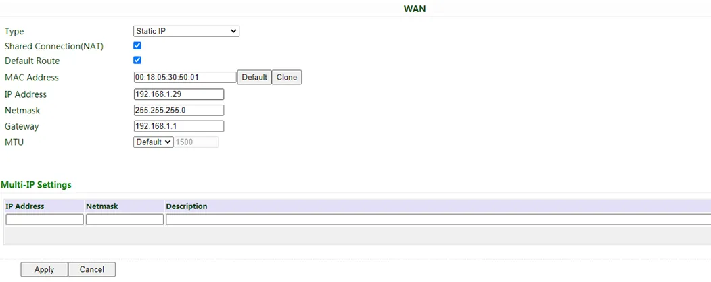</p>

<p align="center"><strong>Figure 3-4 Static IP Configuration</strong></p>

<p align="center"></p>

<p align="center"><strong>Figure 3-5 ADSL Dialup Configuration</strong></p>

There are three methods to obtain an IP address: Dynamic Address (DHCP, recommend), Static IP (Click Apply & Save after configure manually), and ADSL Dialup (Click Apply & Save after configure manually).

5. Check the connectivity in 【Tools】→【Ping Detection】.

<p align="center"></p>

<p align="center"><strong>Figure 3-6 Ping Detection Tool</strong></p>

**Verification Method**:

1. Check the WAN port status page to confirm that an IP address has been obtained.
2. Use the Ping tool to test external network connectivity.

**Common Issues**:

- Unable to obtain IP address: Check the Ethernet cable connection and whether the upstream network device is operating normally.
- Cannot access the Internet after static IP configuration: Check whether the IP address, subnet mask, gateway, and DNS configurations are correct.

## Scenario 3: Wi-Fi Networking

**Objective**: Access the Internet via Wi-Fi or provide wireless access as an AP.

**Prerequisites**: Wi-Fi antenna connected, device powered on, PC connected to the device via cable or Wi-Fi.

**Estimated Time**: Approx. 10 minutes.

**Operation Steps**:

### AP Mode (Default Mode)

IR315 acts as an access point to radiate wireless signals, and other terminal devices can connect to this device to access the Internet. It is necessary to ensure that IR315 itself has been connected to the Internet through wired or cellular. AP mode supports setting SSID name and encryption authentication mode, and terminal devices will need to input a password when connecting.

1. Enter the 【Network】→【WLAN】 menu, and configure SSID, authentication mode, and encryption mode.

<p align="center"></p>

<p align="center"><strong>Figure 3-7 WLAN AP Mode Configuration</strong></p>

2. Click "Apply & Save".

### STA Mode

IR315 connects to other AP Wi-Fi devices to access the Internet.

1. Select WLAN Type to STA in 【Network】→【Switch WLAN Mode】 and save. Then reboot the router.

<p align="center">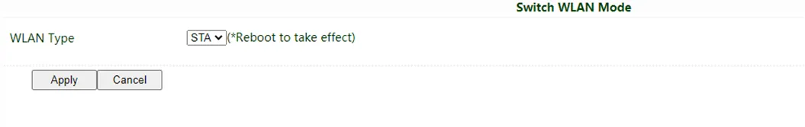</p>

<p align="center"><strong>Figure 3-8 Switch WLAN Mode</strong></p>

2. Click "Scan" to scan available APs in 【Network】→【WLAN Client】, and click "Connect" to choose one of the APs.

<p align="center">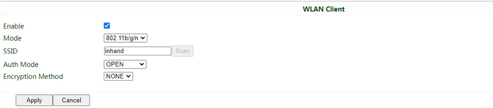</p>

<p align="center"><strong>Figure 3-9 Scan Available APs</strong></p>

3. Configure Wi-Fi parameters and save. Then check the connection status in "Status".
4. Configure WAN mode in 【Network】→【WAN(STA)】, and set WAN parameters for Wi-Fi.

**Verification Method**:

1. Check the Wi-Fi LED status to confirm the Wi-Fi function is normal.
2. Use a wireless terminal to connect to the IR315 SSID (AP mode) or confirm that IR315 has connected to the upstream AP (STA mode).
3. Access an Internet website to confirm it can be opened normally.

**Common Issues**:

- AP mode cannot search for SSID: Check whether SSID broadcast is enabled and whether Wi-Fi is enabled.
- STA mode cannot connect to AP: Check whether the password is correct and check the AP signal strength.

## Scenario 4: Connect to InHand Device Manager

**Objective**: Connect IR315 to the InHand Device Manager cloud platform for remote management.

**Prerequisites**: The device has accessed the Internet via cellular network or wired connection.

**Estimated Time**: Approx. 15 minutes.

**Operation Steps**:

1. Confirm that the router is already connected to the Internet.
2. Enter 【Service】→【Device Manager】, and set the router to connect to the DM platform. iot.inhand.com.cn is the server for China, and iot.inhandnetworks.com is the server for global.
3. Fill in your DM account in "Registered Account", then click "Apply" to save the configuration.
4. If you don't have a DM account, please click "Sign up/Sign in". After selecting the server, you will be directed to the InHand Device Manager website; please follow the instructions to register an account.

<p align="center">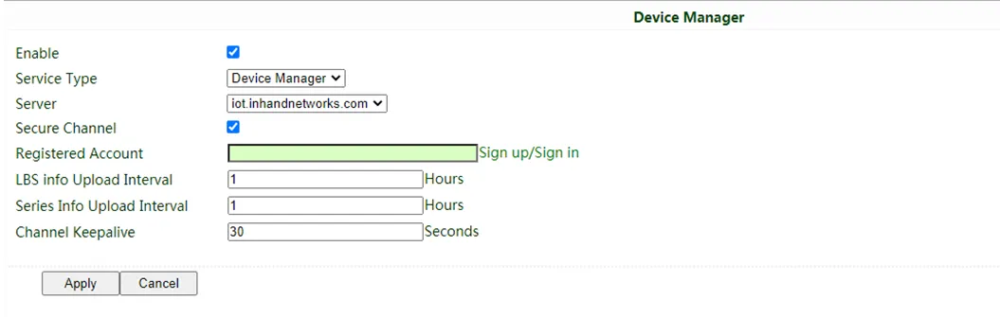</p>

<p align="center"><strong>Figure 3-10 Device Manager Configuration</strong></p>

5. Login to your account in Device Manager, and add your device in "Gateways". Name your device and fill in the serial number from the device; then you can manage your router in DM. You can find the serial number in 【Status】→【System】, or you can find it at the back of the device.

<p align="center">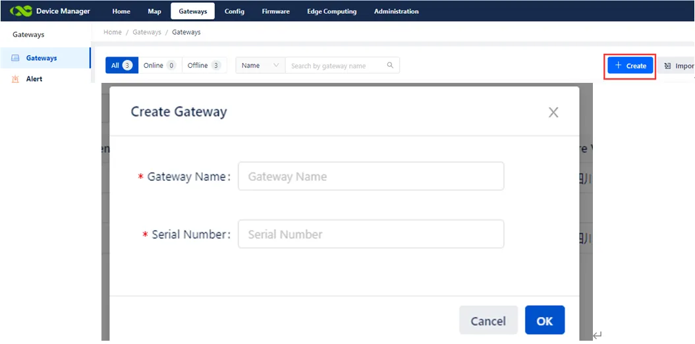</p>

<p align="center"><strong>Figure 3-11 Check Device Serial Number</strong></p>

**Verification Method**:

1. Check whether the device is online in the "Gateways" page of the Device Manager platform.
2. Check the connection status between the router and the DM platform in 【Status】→【Device Manager】.

**Common Issues**:

- Device cannot connect to DM: Check whether the device has accessed the Internet, and whether the server address and account are correct.
- Device shows offline in DM: Check the device network connection and confirm that the Device Manager function is enabled.

---

# Chapter 4 Feature Description and Parameter Reference

## 4.1 System

### 4.1.1 Basic Settings

From the navigation tree, select System >> Basic Setup, then enter the "Basic Setup" page. Here, the Web configuration interface language can be set, and the name of the mainframe of the router can be customized.

**Table 4-1-1 Basic Setup Parameters**

| Parameter | Description | Default |
|-----------|-------------|---------|
| Language | Configure language of WEB configuration interface | Chinese |
| Host Name | Set a name for the host or device connected to the router for viewing | Router |

### 4.1.2 System Time

To ensure the coordination between this device and other devices, a user is required to set the system time accurately since this function is used to configure and check system time as well as the system time zone. System time is used to configure and view system time and system time zone. It aims to achieve time synchronization of all devices equipped with a clock on the network to provide multiple applications based on synced time.

From the navigation tree, select System >> Time, then enter the "Time" webpage. Click <Sync Time> to synchronize the time of the gateway with the system time of the host.

**Table 4-1-2 System Time Parameters**

| Parameter | Description | Default |
|-----------|-------------|---------|
| Router Time | Display the present time of the router | 8:00:00 AM, 12/12/2015 |
| PC Time | Display the present time of the PC | Present time |
| Timezone | Set the time zone of the router | Custom |
| Custom TZ String | Set TZ string of router | CST-8 |
| Auto update Time | Select whether to automatically update time; you may select when on startup or every 1/2/...hours | On startup |
| NTP Time Servers | Set the NTP server to sync time via the network | 114.80.81.1 |

### 4.1.3 Admin Access

Admin services include HTTP, HTTPS, TELNET, SSHD, HTTP API and Console.

1. **HTTP**: HTTP (Hypertext Transfer Protocol) is used for transferring web pages on the Internet. After enabling HTTP service on the device, users can log on via HTTP and access and control the device using a web browser.
2. **HTTPS**: HTTPS (Secure Hypertext Transfer Protocol) is the secure version of hypertext transfer protocol. As an HTTP protocol which supports SSL protocol, it is more secure.
3. **TELNET**: Telnet protocol provides telnet and virtual terminal functions through a network. Depending on the Server/Client, the Telnet Client could send a request to the Telnet server which provides Telnet services. The device supports Telnet Client and Telnet Server.
4. **SSHD**: SSH protocol provides security for remote login sessions and other network services. The SSHD service uses the SSH protocol, which has higher security than Telnet.
5. **HTTP_API**: Users can check the router's status and configure the router without login the router remotely by sending an HTTP request with HTTP API. Please ask technical support for more information about HTTP API.
6. **Console (only in IR315-S)**: Users can access IR315 CLI via RS232 and enable Console.

From the navigation tree, select System >> Admin Access, then enter the "Admin Access" page.

**Table 4-1-3 Admin Access Parameters**

| Parameter | Description | Default |
|-----------|-------------|---------|
| **Username/Password** | | |
| Username | Set the name of the user who logs in WEB configuration | adm |
| Old Password | Previous password access to WEB configuration | N/A |
| New Password | New password access to WEB configuration | N/A |
| Confirm New Password | Reconfirm the new password | N/A |
| **Admin functions** | | |
| Service Port | Service port of HTTP/HTTPS/TELNET/SSHD/HTTP_API | 80/443/23/22/4444 |
| Local Access | Enable - Allow local LAN to administrate the router with the corresponding service (e.g. HTTP); Disable - Local LAN cannot administrate the router with the corresponding service (e.g. HTTP) | Enable |
| Remote Access | Enable - Allow the remote host to administrate the router with the corresponding service (e.g. HTTP); Disable - The remote host cannot administrate the router with the corresponding service (e.g. HTTP) | Enable |
| Allowed Access from WAN (Optional) | Set allowed access from WAN | The host controlling service at this moment can be set, e.g. 192.168.2.1/30 or 192.168.2.1-192.168.2.10 |
| Description | For recording the significance of various parameters of admin functions (without influencing router configuration) | N/A |
| **Console Login User (Click <new> button after setting a group of username and password)** | | |
| Username | Configure console login user, custom | N/A |
| Password | Configure the password, custom | N/A |
| **Other Parameters** | | |
| Log Timeout | Set login timeout (router will automatically disconnect the configuration interface after login timeout) | 500 seconds |

> **Note:**
>
> 1. In the "Username/Password" section, users can modify their username and password rather than create a new username, i.e. only this username can be used in logins.
> 2. In the "Console Login User" section, we can create multiple usernames, i.e. multiple usernames can be used by serial port or TELNET console logins.

### 4.1.4 System Log

A remote log server can be set through "System Log Settings," and all system logs will be uploaded to the remote log server through the gateway. This makes remote log software, such as Kiwi Syslog Daemon, a necessity on the host.

Kiwi Syslog Daemon is free log server software for Windows. It can receive, record and display logs from a host (such as a gateway, exchange board and Unix host). After downloading and installing Kiwi Syslog Daemon, it must be configured through the menus "File > Setup > Input > UDP".

From the navigation tree, select System >> System Log, then enter the "System Log" page.

**Table 4-1-4 System Log Parameters**

| Parameter | Description | Default |
|-----------|-------------|---------|
| Log to Remote System | Enable log server | Disable |
| Log server address and port (UDP) | Set the address and port of the remote log server | N/A: 514 |
| Log to Console | Output device log by serial port | Disable |

### 4.1.5 Configuration Management

Here you can back up the configuration parameters, import the desired parameters backup and reset the router.

From the navigation tree, select "System > Config Management", then enter the "Config Management" page.

**Table 4-1-5 Config Management Parameters**

| Parameter | Description | Default |
|-----------|-------------|---------|
| Browse | Choose the configuration file | N/A |
| Import | Import configuration file to router | N/A |
| Backup | Backup configuration file to host | N/A |
| Restore default configuration | Select to restore default configuration (effective after rebooting) | N/A |
| Disable the hardware reset button | Select to disable the hardware reset button of the router | Disable |
| Modem drive program | For configuring the drive program of the module | N/A |
| Network Provider (ISP) | For configuring APN, username, password and other parameters of the network providers across the world | N/A |

> **Caution**
>
> Validity and order of imported configurations should be ensured. The good configs will later be serially executed in order after the system reboot. If the configuration files aren't arranged according to effective order, the system won't enter the desired state.

> **Note**
>
> In order not to affect the operation of the current system, when performing an import configuration and restoring the default configuration, users need to restart the device to make the new configuration take effect.

### 4.1.6 Schedule

After this function is enabled, the device will reboot at the scheduled time. The scheduler function will take effect after router sync time.

From the navigation tree, select "System > Schedule", then enter the "Schedule" page.

**Table 4-1-6 Schedule Parameters**

| Parameter | Description | Default |
|-----------|-------------|---------|
| Enable | Enable/disable this function | Disable |
| Time | Select the reboot time | 0:00 |
| Days | Reboot the router every day | Everyday |
| Show advanced options | Enable more detailed schedule rules, and allow setting multiple rules to reboot the router at a specific time or interval. Enable this feature will disable the everyday reboot feature above | Disable |
| Reboot after dialed | The router will reboot after dialling up successfully, and will not take effort if this parameter is blank | N/A |

### 4.1.7 Upgrade

The upgrading process can be divided into two steps. In the first step, firmware will be written in the backup file zone; in the second step, firmware in the backup file zone will be copied to the main firmware zone, which should be carried out during system restart. During software upgrading, any operation on the web page is not allowed, otherwise software upgrading may be interrupted.

From the navigation tree, select "System > Upgrade", then enter the "Upgrade" page. To upgrade the system, firstly, click <Browse> to choose the upgrade file; secondly, click <Upgrade> and then click <OK> to begin the upgrade; thirdly, upgrade firmware succeed, and click <Reboot> to restart the device.

### 4.1.8 Reboot

Please save the configurations before reboot, otherwise the configurations that are not saved will be lost after reboot.

To reboot the system, please click the "System>Reboot", then click <OK>.

### 4.1.9 Log Out

To log out, click "System >> Logout", and then click <OK>.

## 4.2 Network

### 4.2.1 Cellular

Insert the SIM card and dial to achieve the wireless network connection function of the router. Click the "Network>>Dial Interface" menu in the navigation tree to enter the "Dial Interface".

**Table 4-2-1-a Dialup/Cellular Parameters**

| Parameter | Description | Default |
|-----------|-------------|---------|
| Enable | Enable cellular dialup | Enable |
| Time Schedule | Set schedule | ALL |
| Force Reboot | The router will reboot if cannot dialup for a long time and reach the max retry time | Enable |
| Shared connection (NAT) | Enable - Local devices connected to the Router can access the Internet via the Router; Disable - Local devices connected to the Router cannot access the Internet via the Router | Enable |
| Default Route | Enable default route | Enable |
| SIM1 Network Provider | Select the network provider profile for SIM1 | Profile 1 |
| Network Type | Select network type; the router will try 4G, 3G, and 2G in proper order if selected in Auto | Auto |
| Connection Mode | Optional Always Online, Connect On Demand, Manual. It will support configuring Triggered by SMS if select Connect On Demand mode | Always Online |
| Redial Interval | Set the redialing time when the login fails | 30 s |
| **Show Advanced Options** | | |
| Dual SIM Enable | Enable Dual SIM card | Disable |
| SIM2 Network Provider | Select network provider for SIM2 card | Profile 1 |
| SIM2 Blinding ICCID | Set ICCID of SIM2 | N/A |
| SIM2 PIN Code | For setting the SIM2 PIN code | N/A |
| SIM2 SIM Card Operator | Set the ISP that the SIM2 card connects to | Auto |
| Main SIM | Set the SIM card that is used to dialup at first | SIM1 |
| Max Number of Dial | Set the max number of dials; if cannot dial up successfully after this number, the router will switch the SIM card | 5 |
| CSQ Threshold | Set threshold of signal; if the current signal level is lower than this, the router will switch SIM card | 0(Disable) |
| Min Connect Time | Set the min connect time for each try of dial-up | 0(Disable) |
| Initial Commands | Set customised initial AT commands which will be operated at the beginning of dialing up | AT |
| Blinding ICCID | Set ICCID of SIM | N/A |
| PIN Code | For setting the PIN code of SIM | N/A |
| MTU | Set max transmission unit after enable | 1500 |
| Use Peer DNS | Click to receive peer DNS assigned by the ISP | Enable |
| Link detection interval | Set link detection interval | 55 s |
| Debug | Enable debug mode, print debug log in the system log | Disable |
| Debug Modem* | Send modem debug data to the console | Disable |
| ICMP Detection Mode | Set ICMP detection mode; router will check the link connection status via the ICMP packet. Ignore Traffic: The Router will send an ICMP packet no matter whether there is traffic in the cellular interface. Monitor Traffic: Router will not send an ICMP packet if there is traffic in the cellular interface | Ignore Traffic |
| ICMP Detection Server | Set the ICMP Detection Server. N/A represents not to enable ICMP detection | N/A |
| ICMP Detection Interval | Set ICMP Detection Interval | 30 s |
| ICMP Detection Timeout | Set ICMP Detection Timeout (the link will be regarded as down if ICMP times out) | 20 s |
| ICMP Detection Retries | Set the max. number of retries if ICMP fails (router will redial if reaching max. times) | 5 |

*Not all models support this:

**Table 4-2-1-b Dialup/Cellular-Schedule Parameters**

| Parameter | Description | Default |
|-----------|-------------|---------|
| Name of Schedule | schedule 1 | schedule1 |
| Sunday ~ Saturday | Click to enable | |
| Time Range 1 | Set time range 1 | 9:00-12:00 |
| Time Range 2 | Set time range 2 | 14:00-18:00 |
| Time Range 3 | Set time range 3 | 0:00-0:00 |
| Description | Set description content | N/A |

### 4.2.2 WAN

Click the "Network>>WAN" to set the WAN port. WAN supports three types of wired access including static IP, dynamic address (DHCP) and ADSL (PPPoE) dialling.

DHCP adopts Client/Server communication mode. The client sends a configuration request to the Server which feeds back corresponding configuration information, including the distributed IP address to the Client to achieve the dynamic configuration of the IP address and other information.

PPPoE is a point-to-point protocol over Ethernet. The user has to install a PPPoE Client based on the original connection way. Through PPPoE, remote access devices could achieve the control and charging of each accessed user.

The WAN of the device is disabled by default.

Click the "Network>>WAN" menu in the navigation tree to enter the "WAN" Interface.

**Table 4-2-2-a WAN Static IP Parameters**

| Parameter | Description | Default |
|-----------|-------------|---------|
| Shared connection (NAT) | Enable - Local devices connected to the Router can access the Internet via the Router; Disable - Local devices connected to the Router cannot access the Internet via the Router | Enable |
| Default route | Enable default route | Enable |
| MAC Address | MAC Address of the device | Device's MAC address |
| IP Address | Set the IP address of WAN | 192.168.1.29 |
| Subnet mask | Set subnet mask of WAN | 255.255.255.0 |
| Gateway | Set gateway of WAN | 192.168.1.1 |
| MTU | Max. transmission unit, default/manual settings | default (1500) |
| **Multiple IP support (at most 8 additional IP addresses can be set)** | | |
| IP Address | Set the additional IP address of the LAN | N/A |
| Subnet mask | Set subnet mask | N/A |
| Description | For recording the significance of additional IP address | N/A |

**Table 4-2-2-b WAN Dynamic Address (DHCP) Parameters**

| Parameter | Description | Default |
|-----------|-------------|---------|
| Shared connection (NAT) | Enable - Local devices connected to the Router can access the Internet via the Router; Disable - Local devices connected to the Router cannot access the Internet via the Router | Enable |
| Default route | Enable default route | Enable |
| MAC Address | MAC Address of the device | Device's MAC address |
| MTU | Max. transmission unit, default/manual settings | default (1500) |

**Table 4-2-2-c WAN ADSL Dialing (PPPoE) Parameters**

| Parameter | Description | Default |
|-----------|-------------|---------|
| Shared connection | Enable - Local devices connected to the Router can access the Internet via the Router; Disable - Local devices connected to the Router cannot access the Internet via the Router | Enable |
| Default route | Enable default route | Enable |
| MAC Address | MAC Address of the device | Device's MAC address |
| MTU | Max. transmission unit, default/manual settings | default (1492) |
| Username | Set the name of the dialing user | N/A |
| Password | Set dialing password | N/A |
| Static IP | Click to enable static IP | Disable |
| Connection Mode | Set dialling connection method (always online, dial on demand, manual dialling) | Always online |
| **Parameters of Advanced Options** | | |
| Service Name | Set service name | N/A |
| Set the length of the transmit queue | Set the length of the transmit queue | 3 |
| Enable IP header compression | Click to enable IP header compression | Disable |
| Use Peer DNS | Click to enable the use of peer DNS | Enable |
| Link detection interval | Set link detection interval | 55 s |
| Link detection Max. Retries | Set link detection max. retries | 10 |
| Enable Debug | Click to enable debug | Disable |
| Expert Option | Set expert options | N/A |
| ICMP Detection Server | Set ICMP detection server | N/A |
| ICMP Detection Interval | Set ICMP Detection Interval | 30 s |
| ICMP Detection Timeout | Set ICMP detection timeout | 20 s |
| ICMP Detection Retries | Set ICMP detection max. retries | 3 |

### 4.2.3 VLAN

A virtual LAN (VLAN) comprises a group of logical devices and users. These devices and users are not limited by physical locations but can be organized based on functions, departments, applications, and other factors. They communicate with each other as if they are in the same network segment, which contributes to the name of VLAN.

After setting the VLAN, click "modify" to configure the LAN settings of each VLAN. Click "Network >> VLAN" to configure VLAN in the router.

**Table 4-2-3 VLAN Parameters**

| Parameter | Description | Default |
|-----------|-------------|---------|
| VLAN ID | Set VLAN ID | 1 |
| LAN1~LAN4 | Set which LAN port to be a part of the VLAN | LAN1~LAN4 enabled |
| Primary IP/Netmask | Set VLAN's IP and netmask | 192.168.2.1/255.255.255.0 |
| **Port mode** | | |
| MAC | Device's MAC address | Hardware MAC address |
| Enable | Able to configure Trunk mode after enable | Enable |
| Speed Duplex | Set speed and duplex of LAN port | Auto-Negotiation |
| Mode | Set LAN mode, Access or Trunk | Access |
| Native LAN | Traffic will not have a VLAN tag if it is transferred by a native VLAN | 1 |
| **GARP** | | |
| Enable | The router will send ARP broadcast to LAN devices automatically | Disable |
| Broadcast Count | Set ARP broadcast times | 5 |
| Broadcast Timeout | Set ARP broadcast timeout time | 10 |

**Table 4-2-4 LAN Parameters**

| Parameter | Description | Default |
|-----------|-------------|---------|
| IP Address | IP Address of router's LAN gateway | 192.168.2.1 |
| Netmask | The subnet mask of the LAN gateway | 255.255.255.0 |
| MTU | Max. transmission unit, default/manual settings | default (1500) |
| **Secondary IP(s) (at most 8 additional IP addresses can be set)** | | |
| IP Address | Set the additional IP address of the LAN | N/A |
| Subnet mask | Set subnet mask | N/A |

### 4.2.4 Switch WLAN Mode

IR315 supports two types of WLAN modes: AP and STA.

Click the "Network>>Switch WLAN Mode" menu in the navigation tree to set the WLAN mode of the router. After changing and saving the configuration, please reboot the device to make the configuration take more effort.

### 4.2.5 WLAN Client (AP Mode)

When working in AP mode, the device WLAN will provide a network access point for other wireless network devices so that they will have normal network communication.

Click the "Network>>WLAN" menu in the navigation tree to enter the "WLAN" interface.

**Table 4-2-5 WLAN Access Port Parameters**

| Parameter | Description | Default |
|-----------|-------------|---------|
| SSID broadcast | After turning it on, users can search the WLAN via the SSID name | Enable |
| Mode | Six types of options: 802.11g/n, 802.11g, 802.11n, 802.11b, 802.11b/g, 802.11b/g/n | 802.11b/g/n |
| Channel | Select the channel | 11 |
| SID | SSID name defined by the user | inhand |
| Authentication method | Support open type, shared type, auto-selection of WEP, WPA-PSK, WPA, WPA2-PSK, WPA2, WPA/WPA2, WPA-PSK/WPA2PSK | Open type |
| Encryption | Select the encryption method of AP | NONE |
| Wireless bandwidth | Support 20MHz and 40MHz | 20MHz |
| Enable WDS | Click to enable WDS, router will connect to other APs to extend wireless coverage | Disable |
| Default Route | Click to enable Route | Disable |
| Bridged SSID | Set bridged SSID of other AP, support to click "Scan" button to connect to available AP in network | None |
| Bridged BSSID | Set bridged BSSID | None |
| Scan | Click "Scan" to scan the available AP nearby | |
| Auth Mode | Open type, shared type, WPA-PSK, WPA2-PSK | Open type |
| Encryption Method | Support NONE, WEP | None |

### 4.2.6 WLAN Client (STA Mode)

When working in STA mode, the router can access the Internet by connecting to the access point. The Router need to reboot after this operation.

Click the "Network>>WLAN Client" menu in the navigation tree to enter the "WLAN" interface. Select "Client" for the interface type and configure relevant parameters. (At this moment, the dialling interface in the "Network>>Dialing Interface" should be closed.)

The SSID scan function is enabled only when the Client is selected as a WLAN interface. Click the "Scan" button to get all available APs and status, select AP and configure the corresponding parameter to connect. After configuring the WLAN Client, please configure the access type in "Network > WAN(STA)".

**Table 4-2-6 WLAN Client Parameters**

| Parameter | Description | Default |
|-----------|-------------|---------|
| Mode | Support many modes including 802.11b/g/n | 802.11b/g/n |
| SSID | Name of the SSID to be connected | inhand |
| Authentication method | Keep consistent with the access point to be connected | Open type |
| Encryption | Keep consistent with the access point to be connected | NONE |

### 4.2.7 Link Backup

Click the "Network>>Link Backup" in the navigation tree to configure the interface.

**Table 4-2-7-a Link Backup Parameters**

| Parameter | Description | Default |
|-----------|-------------|---------|
| Enable | Click to enable link backup | Disable |
| Backup mode | Optional hot failover, cold failover or load balance | Hot failover |
| Main Link | Optional WAN or dialling interface | WAN |
| ICMP Detection Server | Set ICMP detection server | N/A |
| Backup Link | Optional cellular or WAN | Cellular 1 |
| ICMP Detection Interval | Set ICMP Detection Interval | 10 s |
| ICMP Detection Timeout | Set ICMP detection timeout | 3 s |
| ICMP Detection Retries | Set ICMP detection max. retries | 3 |
| Restart Interface When ICMP Failed | Restart the main link when ICMP failed | Disable |

**Table 4-2-7-b Link Backup-Backup Mode Parameters**

| Parameter | Description |
|-----------|-------------|
| Hot failover | The main link and backup Link remain online at the same time, switch if the current link is off |
| Cold failover | The backup line will only be online when the main link is disconnected |
| Load balance | Transfer data via the corresponding route after ICMP detect succeed |

### 4.2.8 VRRP

VRRP (Virtual Router Redundancy Protocol) adds a set of routers that can undertake gateway function into a backup group to form a virtual router. The election mechanism of VRRP will decide which router to undertake the forwarding task and the host in LAN is only required to configure the default gateway for the virtual router.

VRRP will bring together a set of routers in LAN. It consists of multiple routers and is similar to a virtual router in respect of function. According to the VLAN interface IP of different network segments, it can be virtualized into multiple virtual routers. Each virtual router has an ID number and up to 255 can be virtualized.

VRRP has the following characteristics:

1. The virtual router has an IP address, known as the Virtual IP address. For the host in LAN, it is only required to know the IP address of the virtual router and set it as the address of the next hop of the default route.
2. The host locally communicates with the external network through this virtual router.
3. A router will be selected from the set of routers based on priority to undertake the gateway function. Other routers will be used as backup routers to perform the duties of gateway for the gateway router in case of a fault of the gateway router, thus guaranteeing uninterrupted communication between the host and external network.

The monitor interface function of VRRP better expands the backup function: the backup function can be offered when the interface of a certain router has a fault or other interfaces of the router are unavailable.

When the uplink interface is Down or Removed, the router actively reduces its priority so that the priority of other routers in the backup group is higher and thus the router with the highest priority becomes the gateway for the transmission task.

From the navigation tree, select the "Network >>VRRP" menu, then enter the "VRRP" page.

**Table 4-2-8 VRRP Parameters**

| Parameter | Description | Default |
|-----------|-------------|---------|
| Enable VRRP-I | Click to enable the VRRP function | Disable |
| Group ID | Select ID of router group (range: 1-255) | 1 |
| Priority | Select a priority (range: 1-254) | 20 (the larger numerical value indicates higher priority) |
| Advertisement Interval | Set an advertisement interval | 60 s |
| Virtual IP | Set a virtual IP | N/A |
| Authentication method | Select "None" or Password type | None (a password is needed when password type is selected) |
| Monitor | Set monitor | N/A |
| VRRP-II | Set as above | Disable |

### 4.2.9 IP Passthrough

IP penetration function distributes the address obtained by the WAN port to the device at the lower end of the LAN port. When external access to the router downstream devices, the router transmits data to the downstream device.

Click the "Network >IP Passthrough" menu, then enter the "IP Passthrough" page.

**Table 4-2-9 IP Passthrough Parameters**

| Parameter | Description | Default |
|-----------|-------------|---------|
| IP Passthrough | Enable IP Passthrough | Disable |
| IP Passthrough Mode | Select work mode (DHCP Dynamic/DHCP fix MAC) | DHCP Dynamic |
| Fix MAC Address | Set fix MAC address if in DHCP fix MAC mode | 00:00:00:00:00:00 |
| DHCP lease | Set DHCP lease time and reacquired after expiration | 120S |

### 4.2.10 Static Route

Static route needs to be set manually, after which packets will be transferred to appointed routes.

To set a static route, click the "Network >> Static Route" menu in the navigation tree, then enter the "Static Route" interface.

**Table 4-2-10 Static Route Parameters**

| Parameter | Description | Default |
|-----------|-------------|---------|
| Destination Address | Set the IP address of the destination | 0.0.0.0 |
| Netmask | Set the subnet mask of the destination | 255.255.255.0 |
| Gateway | Set the gateway of the destination | N/A |
| Interface | Select LAN/CELLULAR/WAN/WAN(STA) interface of the destination | N/A |
| Description | For recording the significance of static route address (not support Chinese characters) | N/A |

### 4.2.11 OSPF

The Open Shortest Path First (OSPF) protocol is a link-status-based internal gateway protocol mainly used on large-scale networks.

Example: Build an OSPF route between two routers, and allow their LAN can be accessed by each other.

<p align="center">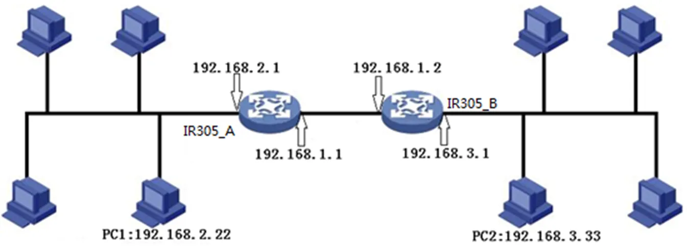</p>

<p align="center"><strong>Figure 4-1 OSPF Networking Example</strong></p>

1. Configure IR315-A: Click "Network >> OSPF" to access to OSPF configure page. "Router ID" should be in the same segment as IR315_B. Configure IR315_A in the "Network" bar to announce the routing entry of the device.

<p align="center">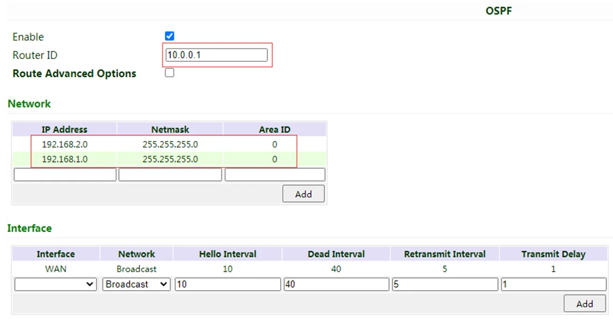</p>

<p align="center"><strong>Figure 4-2 IR315-A OSPF Configuration</strong></p>

2. Configure IR315-B

<p align="center">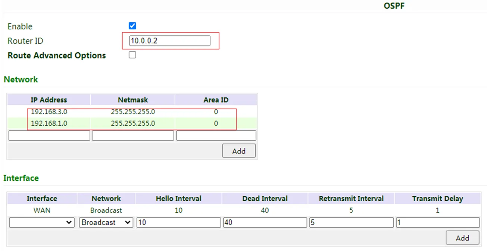</p>

<p align="center"><strong>Figure 4-3 IR315-B OSPF Configuration</strong></p>

3. OSPF has been built successfully if PC1 and PC2 can access each other.

## 4.3 Service

### 4.3.1 DHCP Service

DHCP adopts Client/Server communication mode. The client sends a configuration request to the Server which feeds back corresponding configuration information, including the distributed IP address to the Client to achieve the dynamic configuration of the IP address and other information.

1. DHCP Server has to distribute the IP address when the Workstation logs on and ensure each workstation is supplied with a different IP address. DHCP Server has simplified some network management tasks requiring manual operations before to the largest extent.
2. As a DHCP Client, the device receives the IP address distributed by the DHCP server after logging in to the DHCP server, so the Ethernet interface of the device needs to be configured into an automatic mode.

To enable the DHCP server, find the navigation tree, select Services >> DHCP Service, then enter the "DHCP Service" page.

**Table 4-3-1 DHCP Service Parameters**

| Parameter | Description | Default |
|-----------|-------------|---------|
| Enable DHCP | Enable DHCP service and dynamically allocate IP address | Enable |
| IP Pool Starting Address | Set starting IP address of dynamic allocation | 192.168.2.2 |
| IP Pool Ending Address | Set the ending IP address of the dynamic allocation | 192.168.2.100 |
| Lease | Set lease of IP allocated dynamically | 60 minutes |
| DNS | Set DNS Server | 192.168.2.1 |
| Windows Name Server | Set Windows name server | N/A |
| **Static designation of DHCP allocation (at most 20 DHCPs designated statically can be set)** | | |
| MAC Address | Set a statically specified DHCP's MAC address (different from other MACs to avoid conflict) | N/A |
| IP Address | Set a statically specified IP address | 192.168.2.2 |
| Host | Set the hostname | N/A |

### 4.3.2 DNS

DNS (Domain Name System) is a DDB used in TCP/IP application programs, providing a switch between domain name and IP address. Through DNS, users could directly use some meaningful domain name which could be memorized easily and the DNS Server in a network could resolve the domain name into the correct IP address. The device analyzes dynamic domain names via DNS.

Manually set the DNS, use DNS via dialling if it is empty. Generally, it needs to be set only when a static IP is used on the WAN port.

Click the "Service>Domain Name Service" menu in the navigation tree to enter the "Domain Name Service" interface.

**Table 4-3-2 DNS Parameters**

| Parameter | Description | Default |
|-----------|-------------|---------|
| Primary DNS | Set Primary DNS | 0.0.0.0 |
| Secondary DNS | Set Secondary DNS | 0.0.0.0 |
| Disable the local DNS server | Not to transfer local DNS server address | Disable |

### 4.3.3 DNS Relay

IR315 works as a DNS Agent and relays DNS request and response messages between DNS Client and DNS Server to carry out domain name resolution instead of the DNS Client.

From the navigation tree, select the "Service>>DNS Relay" menu, then enter the "DNS Relay" page.

**Table 4-3-3 DNS Relay Parameters**

| Parameter | Description | Default |
|-----------|-------------|---------|
| Enable DNS Relay service | Click to enable DNS service | Enable (DNS will be available when DHCP service is enabled.) |
| **Designate [IP address <=> domain name] pair (20 IP address <=> domain name pairs can be designated)** | | |
| IP Address | Set the IP address of designated IP address <=> domain name | N/A |
| Host | Domain Name | N/A |
| Description | For recording the significance of IP address <=> domain name | N/A |

> **Caution:**
>
> When enabling DHCP, the DHCP relay is also enabled automatically. Relay cannot be disabled without disabling DHCP.

### 4.3.4 DDNS

DDNS maps a user's dynamic IP address to a fixed DNS service. When the user connects to the network, the client program will pass the host's dynamic IP address to the server program on the service provider's host through information passing. The server program is responsible for providing DNS service and realizing dynamic DNS. It means that DDNS captures the user's change of IP address and matches it with the domain name so that other Internet users can communicate through the domain name. What end customers have to remember is the domain name assigned by the dynamic domain name registrar, regardless of how it is achieved. DDNS serves as a client tool of DDNS and is required to coordinate with DDNS Server. Before the application of this function, a domain name shall be applied for and registered on a proper website such as www.3322.org.

InRouter315 DDNS service types include QDNS (3322)-Dynamic, QDNS(3322)-Static, DynDNS-Dynamic, DynDNS-Static, DynDNS-Custom and No-IP.com.

To set DDNS, click the "Service >> Dynamic Domain Name" menu in the navigation tree, then enter the "Dynamic Domain Name" interface.

**Table 4-3-4-a Dynamic Domain Name Parameters**

| Parameter | Description | Default |
|-----------|-------------|---------|
| Current Address | Display the present IP of the router | N/A |
| Service Type | Select the domain name service providers | Disable |

**Table 4-3-4-b Dynamic Domain Name Main Parameters**

| Parameter | Description | Default |
|-----------|-------------|---------|
| Service Type | QDNS (3322)-Dynamic | Disable |
| URL | http://www.3322.org/ | http://www.3322.org/ |
| Username | User name assigned in the application for dynamic domain name | N/A |
| Password | Password assigned in the application for dynamic domain name | N/A |
| Host Name | Host name assigned in the application for dynamic domain name | N/A |
| Wildcard | Enable wildcard character | Disable |
| MX | Set MX | N/A |
| Backup MX | Enable backup MX | Disable |
| Force Update | Enable force update | Disable |

### 4.3.5 Device Manager

InHand provides a software platform to manage devices. The device can be managed and operated via a software platform. For instance, the operating status of the device can be checked, the device software can be upgraded, the device can be restarted, configuration parameters can be sent down to the device, and transmitting control or message query can be realized on the device via the Device Manager.

Click the "Service>>Device Manager" menu in the navigation tree to enter the "Device Manager" interface. North American users should select the Server address: iot.inhandnetworks.com.

**Table 4-3-5 Device Remote Management Platform Parameters**

| Parameter | Description | Default |
|-----------|-------------|---------|
| Enable | Enable platform | Disable |
| Service Type | Platform work mode: Device Manager / InConnect Service / Custom | Device Manager |
| Server | Input address of a server | Ics.inhand.com.cn |
| Secure Channel | Enable Secure Channel | Enable |
| Registered Account | Account Registered in Device Manager | N/A |
| LBS info Upload Interval | Cellular information upload interval | 1 Hour |
| Series Info Upload Interval | Traffic information upload interval | 1 Hour |
| Channel Keepalive | Keep-alive packet interval | 30 Seconds |

### 4.3.6 SNMP

Network devices are usually sparsely located on a network. It is time-consuming for the administrator to configure and manage these network devices on-site. In addition, if these devices are from different vendors, each of which provides a suite of independent management interfaces (for example, different command line interfaces), the workload of configuring the devices in batches is huge. In this situation, the traditional manual configuration method has the deficiencies of high cost and low efficiency. The network administrator can use the Simple Network Management Protocol (SNMP) to remotely configure and manage the devices and perform real-time monitoring of them.

<p align="center">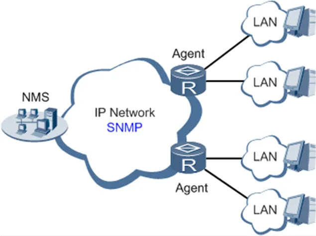</p>

<p align="center"><strong>Figure 4-4 SNMP Architecture</strong></p>

To run the SNMP protocol on a network, configure the NMS program on the management side and the SNMP agent on the managed devices.

By using SNMP:

1. The NMS can collect status information of the managed devices anytime and anywhere through agents and remotely control these devices.
2. The agents can promptly report the current status and faults of managed devices to the NMS.

Currently, the SNMP agents support SNMPv1, SNMPv2c and SNMPv3. SNMPv1 and SNMPv2c use community names for authentication; SNMPv3 uses user names and passwords for authentication. Click the "Service>SNMP" menu to configure.

**Table 4-3-6-1 SNMPv1 and SNMPv2 Parameters**

| Parameter | Description | Default |
|-----------|-------------|---------|
| Enable | Enable/disable the SNMP function | Disabled |
| Version | Set the version of the SNMP protocol used to manage the router. The versions of SNMPv1, v2c, and v3 are available. SNMPv1 applies to small-sized networks with simple networking and low-security requirements, or secure and stable small networks, such as campus networks and small enterprise networks. SNMPv2c applies to medium- and large-sized networks with low-security requirements, or with good security (for example, VPNs) but running many services, which may lead to traffic congestion. SNMPv3 applies to networks of various sizes, especially networks that have strict security requirements and can be managed only by authorized network administrators. For example, SNMPv3 can be used if data between the NMS and managed device is transmitted over a public network. | v1 |
| Contact Information | Fill in the contact information | Empty |
| Location Information | Fill in the location | Empty |
| **Community Management** | | |
| Community Name | User-defined community name. The community names SNMPv1 and SNMPv2c are the passwords used by the NMS to read and write data on agents. This parameter must be set the same on both agents and NMS. | public and private |
| Access Limit | Access limit includes the MIB objects that can be read only or read/written by the NMS. | Read-Only |
| MIB View | Select the MIB objects that can be monitored and managed by the NMS. Only the default view is supported currently. | default view |

**Table 4-3-6-2 SNMPv3 Parameters**

| Parameter | Description | Default |
|-----------|-------------|---------|
| **User Group Management** | | |
| Group name | User-defined user group name. The length is 1 to 32 characters. | None |
| Security Level | Select a security level for the group. The values include NoAuth/NoPriv, Auth/NoPriv, and Auth/Priv. | NoAuth/NoPriv |
| Read-only View | Select the SNMP read-only view. Only the default view is supported currently. | default view |
| Read-write View | Select the SNMP read-write view. Only the default view is supported currently. | default view |
| Inform View | Select the SNMP inform view. Only the default view is supported currently. | default view |
| **Usm Management** | | |
| Username | User-defined user name. The length is 1 to 32 characters. | None |
| Group name | The group to which a user is added must have been configured in the user group management table. | None |
| Authentication | Select an authentication mode. Three authentication modes are available: MD5, SHA, and None. If you select None, authentication is disabled. | None |
| Authentication Password | This parameter is available only when the authentication mode is None. The length is 8 to 32 characters. | None |
| Encryption | Select the encryption mode. The values are None, AES, and DES. | None |
| Encryption Password | This parameter is available only when the authentication mode is None. The length is 8 to 32 characters. | None |

### 4.3.7 SNMP Trap

SNMP trap is a type of entrance. When this entrance is reached, the SNMP-managed devices actively notify the NMS, instead of waiting for the polling of NMS. On an SNMP-enabled network, the agents on managed devices can report errors to the NMS anytime, without the need to wait for the polling of the NMS. The errors are reported to the NMS through traps. Click the "Service>>SNMP Trap" menu to configure.

**Table 4-3-7 SNMP Trap Configuration Parameters**

| Parameter | Description | Default |
|-----------|-------------|---------|
| Trap Signal Level | Set the trap signal threshold. When this threshold is reached, the agent outputs logs to the NMS. | 10 |
| Destination Address | Fill in the IP address of the NMS. | None |
| Security Name | Fill in the community name for SNMPv1 or SNMPv2c, and fill in the user name for SNMPv3. The length is 1 to 32 characters. | None |
| UDP Port | Fill in the UDP port number, ranging from 1 to 65535. | 162 |

### 4.3.8 I/O

Click "Service >> I/O" in the navigation menu to check and configure I/O and relay the device.

Voltage range:

1. DI: 0~30V, 0~3V means low, 10~30V means high, and the max input voltage is 30V.
2. DO: Wet contact, low means 0V, high means 13V (pull up, cannot be used as a power supply for another device directly).

Only IR315-<WMNN>-<WLAN/NA> supports this feature.

**Table 4-3-8 I/O Parameters**

| Parameter | Description | Default |
|-----------|-------------|---------|
| I/O mode | Set I/O mode, input or output | Output |
| I/O default output level | Set I/O output level when I/O mode is output, low or high | low |
| Dry/Wet contract | Set I/O input type when I/O mode is input, Dry or Wet contact | Dry |
| Input triggered report | Report when input triggers in some situation | Disable |
| Trigger edge | Set the trigger edge of the relay | Falling edge |

### 4.3.9 DTU RS232/RS485

Configure the DTU function; the device can transmit serial data to the customer's server.

Only IR315-<WMNN>-<WLAN/NA>-S supports this feature.

**Table 4-3-9 DTU RS232/RS485 Parameters**

| Parameter | Description | Default |
|-----------|-------------|---------|
| Enable | Enable serial port | Disable |
| **Serial Basic Config** | | |
| Serial type | Serial port type, cannot change | RS232 or RS485 |
| Baudrate | Set the serial port's baud rate | 115200 |
| Data Bits | Set serial port's data bits | 8 |
| Parity | Set parity of the serial port | None |
| Stop Bit | Set stop bit of serial port | 1 |
| Software Flow Control | Enable software flow control can avoid data flow lost | Disable |
| **DTU Configuration** | | |
| DTU Protocol | Set the transmit protocol of DTU | Transparent |
| Protocol | Configure type of protocol, TCP/UDP | TCP |
| Mode | Set the connection mode between the router and the server | Client |
| Frame Interval | Set frame interval of serial | 100 ms |
| Serial Buffer Frames | Set the number of serial buffer frames | 4 |
| Keep alive Interval | Set the interval to test the connectivity between the router and the server | 60 |
| Keep alive Retry Time | The number of times to retry when a connection lose | 5 |
| Multi-Server Policy | The policy for multi-server | Parallel |
| Min Reconnect Interval | Set the min interval to reconnect | 15 |
| Max Reconnect Interval | Set the max interval to reconnect | 180 |
| DTU ID | The ID of the router when connected to the server | |
| Source IP | The source IP router uses when connected to the server, will use WAN IP if this parameter is blank | |
| Source port | The source port the router uses when connecting to the server, will use a random port if this parameter is blank | |
| DTU ID Report Interval | Set the interval to upload the DTU ID | 0 |
| DTU Serial Port Traffic Statistics | Upload serial port statistics data to "Status/DTU" | Disable |
| **Multi Server** | | |
| Server Address | Set the server address to receive data | N/A |
| Server Port | Set the server port to receive data | N/A |

### 4.3.10 SMS

SMS permits message-based reboot and manual dialling. Configure Permit to Phone Number and click <Apply and Save>. After that, you can send a "reboot" command to restart the device or send a custom connection or disconnection command to redial or disconnect the device.

From the navigation tree, select the "Service>>SMS" menu, then enter the "SMS" page.

**Table 4-3-10 SMS Parameters**

| Parameter | Description | Default |
|-----------|-------------|---------|
| Enable | Click to enable the backup DTU function | Disable |
| Status Query | Users define the English query instruction to inquire current working status of the router | N/A |
| Reboot | Users define the English query instruction to reboot the router | N/A |
| **SMS Access Control** | | |
| Default Policy | Select the manner of access processing | Accept |
| Phone Number | Fill in the accessible mobile number | N/A |
| Action | Accept or block | Accept |
| Description | Describe SMS control | |

### 4.3.11 Traffic Manager

This function is mainly used to count data traffic in the cellular interface. If the threshold is 0, the router will only count and the rules will not take effort. This function requires enabling the NTP function.

Choose Services >> Traffic Manager to go to the "Traffic Manager" page.

**Table 4-3-11 Traffic Manager - Basic Configuration Parameters**

| Parameter | Description | Default |
|-----------|-------------|---------|
| Enable | Click to enable the traffic manager function | Disable |
| Start Day | The day to start counting data traffic every month | 1 |
| Monthly Threshold | Data traffic threshold every month | 0MB |
| When Over the Monthly Threshold | Operation when data traffic used within a month reaches the threshold: Only Reporting / Block Except Management (will not influence DM and management requirement) / Shutdown Interface | Only Reporting |
| Last 24-Hours Threshold | Data traffic threshold in the last 24 Hours | 0KB |
| When Over 24-Hours Threshold | Operation when data traffic used within 24 hours reaches the threshold | Only Reporting |
| Advance | Custom statistics and operations last several hours | Disable |

### 4.3.12 Alarm Settings

When an abnormality occurs, the router will report an alarm according to the settings. Currently, the router supports sending alarms in the following situations: System Service Fault, Memory Low, WAN/LAN1 Link-Up/Down, LAN2 Link-Up/Down, Cellular Up/Down, Traffic Alarm, Traffic Disconnect Alarm, SIM/UIM Card Switch, Active Link Switch, SIM/UIM Card Fault, Signal Quality Fault.

In the Alarm Manager interface, you can perform the following operations:

1. Select alarm types in the "Alarm Input" area.
2. Set the alarm notification method of the console in the "Alarm Output" area.

Choose Services > Alarm Manager to go to the "Alarm Manager" page.

### 4.3.13 User Experience Plan

InHand Networks' User Experience Program is designed to improve the product user experience and customer service quality.

Users can disable or enable the User Experience Plan in "Services >> User Experience Plan".

## 4.4 Firewall

The firewall function of the router implements corresponding control to data flow at the entry direction (from Internet to LAN) and exit direction (from LAN to Internet) according to the content features of the message (such as protocol style, source/destination IP address, etc.) and ensures safe operation of router and host in local area network.

### 4.4.1 Basic

From the navigation tree, select Firewall > Basic Setup, then enter the "Basic Setup" page.

**Table 4-4-1 Firewall - Basic Setup Parameters**

| Parameter | Description | Default |
|-----------|-------------|---------|
| Default Filter Policy | Select accept/block | Accept |
| Filter PING detection from the Internet | Select to filter PING detection | Disable |
| Filter Multicast | Select to filter multicast function | Enable |
| Defend DoS Attack | Select to defend DoS attack | Enable |
| SIP ALG | Select to enable SIP ALG | Disable |

### 4.4.2 Filtering

Filter the network data by customising rules to allow or prohibit the specified data flow forwarded by the router.

To enable Access Control from the navigation tree, select Firewall >> Filtering, then enter the "Filtering" page.

**Table 4-4-2 Filtering Parameters**

| Parameter | Description | Default |
|-----------|-------------|---------|
| Enable | Check to enable filtering | Enable |
| Protocol | Select all/TCP/UDP/ICMP | ALL |
| Source address | Set source address of access control | 0.0.0.0/0 |
| Source Port | Set source port of access control | Not available |
| Destination Address | Set destination address | N/A |
| Destination Port | Set the destination port of access control | Not available |
| Action | Select accept/block | Accept |
| Log | Click to enable the log and the log about access control will be recorded in the system | Disable |
| Description | Convenient for recording parameters of access control | N/A |

### 4.4.3 Device Access Filtering

Set customised rules to allow or prohibit data and access to the router.

From the navigation tree, select Firewall > Device Access Filtering, then enter the "Device Access Filtering" page.

**Table 4-4-3 Device Access Filtering Parameters**

| Parameter | Description | Default |
|-----------|-------------|---------|
| Enable | Check to enable device access filtering | Enable |
| Protocol | Select ALL/TCP/UDP/ICMP | ALL |
| Source | Set source address of network access | 0.0.0.0/0 |
| Source Port | Set source port of network access | Not available |
| Destination | Set destination address | N/A |
| Destination Port | Set the destination port of network access | Not available |
| Interface | The set interface of network access | All WANs |
| Action | Select Accept/Block | Accept |
| Log | Click to enable log and the log about access control will be recorded in the system | Disable |
| Description | Convenient for recording parameters of access control | N/A |

### 4.4.4 Content Filtering

Set rules to disable access to specific URLs.

From the navigation tree, select the "Firewall > Content Filtering" menu, then enter the "Content Filtering" page.

**Table 4-4-4 Content Filtering Parameters**

| Parameter | Description | Default |
|-----------|-------------|---------|
| Enable | Click to enable filtering | Enable |
| URL | Set URL that needs to be filtered | N/A |
| Action | Select accept/block | Accept |
| Log | Click to write log and the log about filtering will be recorded in the system | Disable |
| Description | Record the meanings of various parameters of filtering | N/A |

### 4.4.5 Port Mapping

Port mapping is also called a virtual server. Setting port mapping can enable the host of the extranet to access to specific port of the host corresponding to the IP address of the intranet.

To configure port mapping, go into the navigation tree, select "Firewall >> Port Mapping", then enter the "Port Mapping" page.

**Table 4-4-5 Firewall Port Mapping Parameters**

| Parameter | Description | Default |
|-----------|-------------|---------|
| Enable | Check to enable port mapping | Enable |
| Proto | Select TCP/UDP/TCP&UDP | TCP |
| Source | Set source address of port mapping | 0.0.0.0/0 |
| Service Port | Set service port number of port mapping | 8080 |
| Internal Address | Set the internal address of the port mapping | N/A |
| Internal Port | Set the internal port of port mapping | 8080 |
| Log | Click to enable log and the log about port mapping will be recorded in the system | Disable |
| External Interface (optional) | Set the external interface of port mapping | N/A |
| External Address (optional) | Set the external address/tunnel name of the port mapping | N/A |
| Description | For recording the significance of each port mapping rule | N/A |

### 4.4.6 Virtual IP Mapping

Both the router and the IP address of the host of an intranet can correspond with one virtual IP. Without changing the IP allocation of the intranet, the extranet can access the host of the intranet via virtual IP. This function is always used with VPN.

To configure virtual IP mapping, go into the navigation tree, and select "Firewall >> Virtual IP Mapping".

**Table 4-4-6 Firewall - Virtual IP Mapping Parameters**

| Parameter | Description | Default |
|-----------|-------------|---------|
| The virtual IP address of the router | Set a virtual IP address for the router | N/A |
| Range of source address | Set the range of the external source IP addresses | N/A |
| Enable | Click to enable the virtual IP address | Enable |
| Virtual IP | Set the virtual IP address of the virtual IP mapping | N/A |
| Real IP | Set the real IP address of the virtual IP mapping | N/A |
| Log | Click to enable the log and the log about the virtual IP address will be recorded in the system | Disable |
| Description | For recording the significance of each virtual IP address rule | N/A |

### 4.4.7 DMZ

After mapping all ports, the extranet PC can access all ports of an internal device by DMZ settings.

From the navigation tree, select Firewall >> DMZ, then enter the "DMZ" page.

**Table 4-4-7 Firewall - DMZ Parameters**

| Parameter | Description | Default |
|-----------|-------------|---------|
| Enable DMZ | Check to enable the DMZ | Disable |
| DMZ Host | Set address of DMZ Host | N/A |
| Source Address Range | Enter the range of external source address | N/A |
| Interface | Select the external interface of DMZ | N/A |

### 4.4.8 MAC-IP Binding

If the default filter policy in the basic setting of the firewall is disabled, only hosts specified in MAC-IP Binding can have access to the outer net.

From the navigation tree, select Firewall >> MAC-IP Binding, then enter the "MAC-IP Binding" page.

**Table 4-4-8 Firewall - MAC-IP Binding Parameters**

| Parameter | Description | Default |
|-----------|-------------|---------|
| MAC Address | Set the binding MAC address | 00:00:00:00:00:00 |
| IP Address | Set the binding IP address | 192.168.2.2 |
| Description | For recording the significance of each MAC-IP binding configuration | N/A |

### 4.4.9 NAT

NAT is the network address translation function, including source address translation (SNAT) and destination address translation (DNAT).

SNAT refers to the communication between the internal network and the external network when the destination address remains unchanged. DNAT refers to the translation of the destination address of the internal network into the external network without changing the source address when accessing the internal network.

**Table 4-4-9 NAT Parameters**

| Parameter | Description | Default |
|-----------|-------------|---------|
| Enable | Enable NAT | Enable |
| Type | Set convert type | SNAT |
| Proto | Select protocol | TCP |
| Source IP | Set the source IP of the NAT rule | 0.0.0.0/0 |
| Source Port | Set the source port of the NAT rule | N/A |
| Destination | Set the destination IP of the NAT rule | 0.0.0.0/0 |
| Destination Port | Set the destination port of the NAT rule | 0.0.0.0/0 |
| Interface | Set the interface of the NAT rule | N/A |
| Translated Address | Translate the IP address if matches the rule | 0.0.0.0 |
| Translated Port | Translate the port if matches the rule | N/A |

## 4.5 QoS

To ensure all LAN users can normally get access to network resources, the IP traffic control function can limit the flow of specified hosts in LAN. QoS provides dedicated bandwidth and different service quality for different applications, greatly improving the network service capabilities.

### 4.5.1 IP BW Limit

Bandwidth control sets a limit on the upload and download speeds when accessing external networks.

From the navigation tree, select QoS >> Bandwidth Control, then enter the "IP BW Limit" page.

**Table 4-5-1 IP BW Limit Parameters**

| Parameter | Description | Default |
|-----------|-------------|---------|
| Enable | Click to enable the IP bandwidth limit | Disable |
| Download bandwidth | Set download total bandwidth | 1000kbit/s |
| Upload bandwidth | Set upload total bandwidth | 1000kbit/s |
| Control port of flow | Select CELLULAR/WAN | CELLULAR |
| **Host Download Bandwidth** | | |
| Enable | Click to enable | Enable |
| IP Address | Set IP address | N/A |
| Guaranteed Rate (kbit/s) | Set rate | 1000kbit/s |
| Priority | Select priority | Medium |
| Description | Describe the IP bandwidth limit | N/A |

## 4.6 VPN

VPN is for building a private dedicated network on a public network via the Internet. "Virtuality" is a logical network.

Two Basic Features of VPN:

1. Private: the resources of a VPN are unavailable to unauthorized VPN users on the internet; a VPN can ensure and protect its internal information from external intrusion.
2. Virtual: the communication among VPN users is realized via the public network which, meanwhile can be used by unauthorized VPN users so that what VPN users obtain is only a logistic private network. This public network is regarded as a VPN Backbone.

Build a credible and secure link by connecting remote users, company branches, and partners to the network of the headquarters via VPN to realize secure transmission of data. It is shown in the figure below:

<p align="center">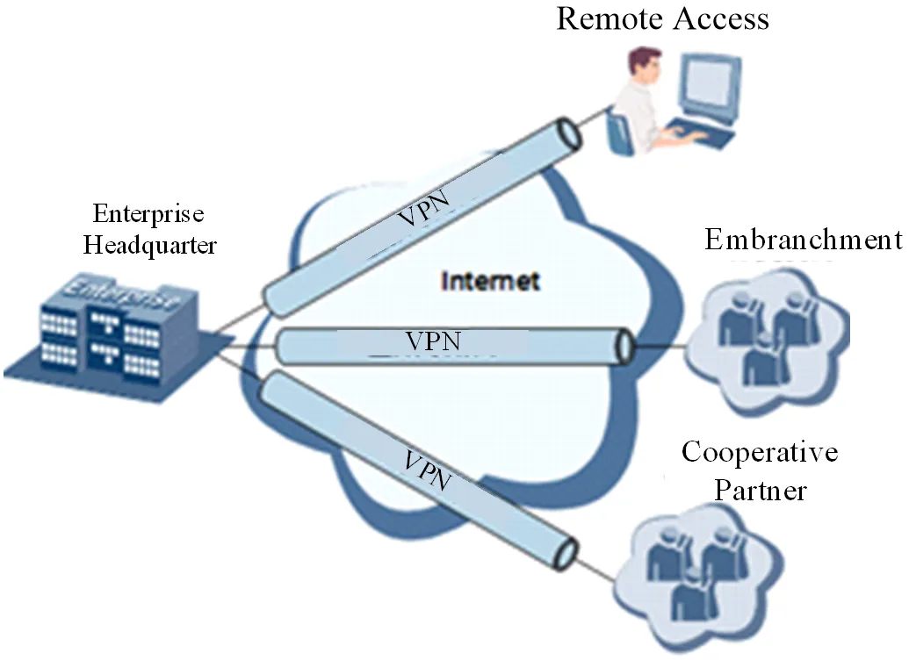</p>

<p align="center"><strong>Figure 4-5 VPN Networking Diagram</strong></p>

**Fundamental Principle of VPN**

The fundamental principle of VPN indicates enclosing the VPN message into the tunnel with tunnelling technology and establishing a private data transmission channel utilizing VPN Backbone to realize transparent message transmission.

Tunnelling technology encloses the other protocol message with one protocol. Also, the encapsulation protocol itself can be enclosed or carried by other encapsulation protocols. To the users, the tunnel is a logical extension of PSTN/link of ISDN, which is similar to the operation of the actual physical link.

### 4.6.1 IPSec Setting

A majority of data contents are Plaintext Transmission on the Internet, which has many potential dangers such as password and bank account information being stolen and tampered with, user identity being imitated, suffering from malicious network attacks, etc. After the disposal of IPSec on the network, it can protect data transmission and reduce the risk of information disclosure.

IPSec is a group of open network security protocols made by IETF, which can ensure the security of data transmission between two parties on the Internet via data origin authentication, data encryption, data integrity and anti-replay function on the IP level. It can reduce the risk of disclosure and guarantee data integrity and confidentiality as well as maintain security of service transmission of users.

IPSec, including AH, ESP and IKE, can protect one or more data flows between hosts, between host and gateway, and between gateways. The security protocols of AH and ESP can ensure security and IKE is used for cypher code exchange.

IPSec can establish a bidirectional Security Alliance on the IPSec peer pairs to form a secure and interworking IPSec tunnel and to realize the secure transmission of data on the Internet.

From the navigation tree, select VPN>>IPSec Settings, then enter the "IPSec Settings" page.

**Table 4-6-1 IPSec Setting Parameters**

| Parameter | Description | Default |
|-----------|-------------|---------|
| Log level | Click to select log level. Normal: Only the key log will be printed into the system log. Debug: More log-in debug levels will be printed. Data: All logs of IPSec will be printed. | Normal |

### 4.6.2 IPSec Tunnels

From the navigation tree, select VPN>>IPSec Tunnels, enter "IPSec Tunnels" and click <add>.

**Table 4-6-2 IPSec Tunnels Parameters**

| Parameter | Description | Default |
|-----------|-------------|---------|
| Show Advanced Options | Click to enable advanced options | Disable (open advanced options after enabling) |
| **Basic parameters** | | |
| Tunnel Name | The user defines the tunnel name | IPSec_tunnel_1 |
| Destination Address | Set destination IP address or domain name | 0.0.0.0 |
| IKE Version | Set IKE version: IKEv1/IKEv2 | IKEv1 |
| Startup Modes | Select Auto Activated/Triggered by Data/Passive/Manually Activated | Auto Activated |
| Restart WAN when failed | The router will restart the WAN interface but cannot establish an IPsec tunnel | Enable |
| Negotiation Mode (IKEv1) | Select main mode or aggressive mode | Main Mode |
| IPSec Protocol (Advanced Option) | Select ESP/AH | ESP |
| IPSec Mode (Advanced Option) | Select tunnel mode/transmission mode | Tunnel Mode |
| VPN over IPSec (Advanced Option) | Select L2TP over IPSec/GRE over IPSec/None | None |
| Tunnel Type | Select Host-Host/Host-Subnet/Subnet-Host/Subnet-Subnet | Subnet-Subnet |
| Local subnet address | Set the local subnet IP address | 192.168.2.1 |
| Local Subnet Mask | Set the local subnet mask | 255.255.255.0 |
| Peer Subnet Address | Set peer subnet IP address | 0.0.0.0 |
| Peer Subnet Mask | Set remote netmask | 255.255.255.0 |
| **Phase I Parameters** | | |
| IKE Policy | Multiple strategies available | 3DES-MD5-DH2 |
| IKE Lifetime | Set IKE lifetime | 86400 s |
| Local ID Type | Select IP address/User FQDN/FQDN Fill in the ID according to the ID type (User FQDN is standard email format) | IP Address |
| Remote ID Type | Select IP address/User FQDN/FQDN | IP Address |
| Authentication type | Select shared key/digital certificate | Shared key |
| Key | Set the IPSec VPN key | N/A |
| **XAUTH Parameters (Advanced Option)** | | |
| XAUTH Mode | Click to enable XAUTH mode | Disable |
| XATUTH username | The user defines XATUTH username | N/A |
| XATUTH password | The user defines XATUTH password | N/A |
| MODECFG | Click to enable MODECFG | Disable |
| **Phase II Parameters** | | |
| IPSec Policy | Multiple strategies available | 3DES-MD5-96 |
| IPSec Lifetime | Set IPSec lifetime | 3600 s |
| Perfect Forward Secrecy (PFS) (Advanced Option) | Select disable/Group 1/Group 2/Group 5 | Disable (this needs to match the server) |
| **Link Detection Parameters (Advanced Option)** | | |
| DPD Interval | Set time interval | 60 s |
| DPD Timeout | Set the timeout for dropped packets | 180 s |
| ICMP Detection Server | Set ICMP detection server | N/A |
| ICMP Detection Local IP | Set ICMP detection local IP | N/A |
| ICMP Detection Interval | Set ICMP Detection Interval | 60 s |
| ICMP Detection Timeout | Set ICMP detection timeout | 5 s |
| ICMP Detection Retries | Set ICMP detection max. retries | 10 |

> **Note:**
>
> The security level of three encryption algorithms ranks successively: AES, 3DES, and DES. The implementation mechanism of an encryption algorithm with stricter security is complex and slow arithmetic speed. DES algorithm can satisfy ordinary safety requirements.

### 4.6.3 GRE Tunnels

Generic Route Encapsulation (GRE) defines the encapsulation of any other network layer protocol on a network layer protocol. GRE could be used as the L3TP of a VPN to provide a transparent transmission channel for VPN data. In simple terms, GRE is a tunnelling technology which provides a channel through which encapsulated data messages can be transmitted and encapsulation and decapsulation can be realized at both ends. GRE tunnel application networking is shown in the following figure:

<p align="center">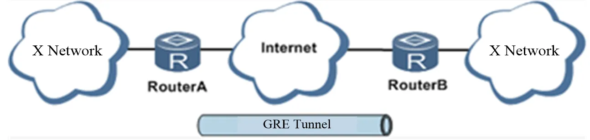</p>

<p align="center"><strong>Figure 4-6 GRE Tunnel Application Networking</strong></p>

Along with the extensive application of IPv4, to have messages from some network layer protocol transmitted on the IPv4 network, those messages could be encapsulated by GRE to solve the transmission problems between different networks.

In the following circumstances, GRE tunnel transmission is applied:

1. GRE tunnel could transmit multicast data packets as if it were a true network interface. Single-use of IPSec cannot achieve the encryption of multicast.
2. A certain protocol adopted cannot be routed.
3. A network of different IP addresses shall be required to connect other two similar networks.

**GRE application example: combined with IPSec to protect multicast data**

GRE can encapsulate and transmit multicast data in GRE tunnel, but IPSec, currently, could only carry out encryption protection against unicast data. In the case of multicast data requiring to be transmitted in an IPSec tunnel, a GRE tunnel could be established first for GRE encapsulation of multicast data and then IPSec encryption of encapsulated message to achieve the encryption transmission of multicast data in an IPSec tunnel. As shown below:

<p align="center">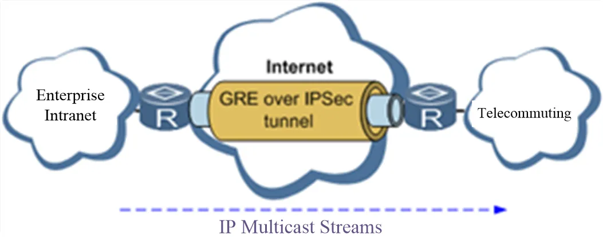</p>

<p align="center"><strong>Figure 4-7 GRE over IPSec</strong></p>

From the navigation tree, select VPN>>GRE Tunnels and enter "GRE Tunnels".

**Table 4-6-3 GRE Tunnels Parameters**

| Parameter | Description | Default |
|-----------|-------------|---------|
| Enable | Click to enable the GRE | Enable |
| Name | The user defines the name of the GRE tunnel | tun0 |
| Local visual IP | Set local virtual IP | 0.0.0.0 |
| Destination Address | Set the remote IP address | 0.0.0.0 |
| Peer visual IP | Set peer virtual IP | 0.0.0.0 |
| Peer Subnet Address | Set peer subnet IP address | 0.0.0.0 |
| Peer Subnet Mask | Set remote netmask | 255.255.255.0 |
| Key | Configure the key of the GRE tunnel | N/A |
| NAT | Click to enable the NAT | Disable |
| Description | For recording the significance of each GRE tunnel configuration | N/A |

### 4.6.4 L2TP Client

L2TP, one of VPDN TPs, has expanded the applications of PPP, known as a very important VPN technology for remote dial-in users to access the network of enterprise headquarters.

L2TP, through the dial-up network (PSTN/ISDN), based on the negotiation of PPP, could establish a tunnel between enterprise branches and enterprise headquarters so that remote user has access to the network of enterprise headquarters. PPPoE is applicable in L2TP. Through the connection of Ethernet and the Internet, an L2TP tunnel between remote mobile officers and enterprise headquarters could be established.

L2TP-Layer 2 Tunnel Protocol encapsulates private data from the user network at the head of L2 PPP. No encryption mechanism is available, thus IPSec are required to ensure safety.

Main Purpose: branches in other places and employees on a business trip could access the network of enterprise headquarters through a virtual tunnel by public network remotely.

A typical L2TP network diagram is shown below:

<p align="center">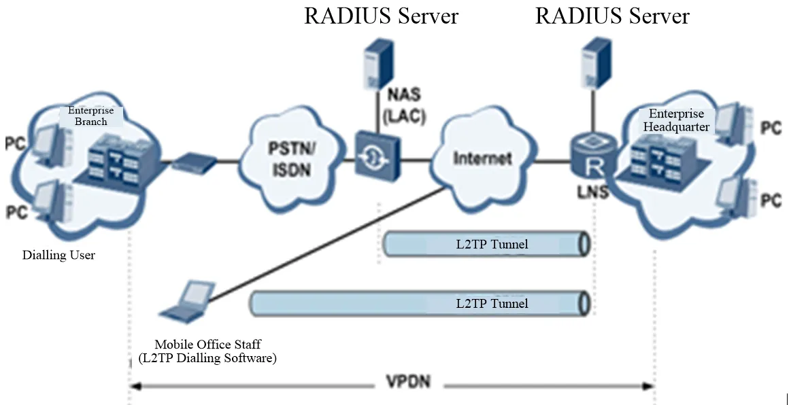</p>

<p align="center"><strong>Figure 4-8 L2TP Network Topology</strong></p>

From the navigation tree, select VPN>>L2TP Client, enter "L2TP Client" and click <add>.

**Table 4-6-4 L2TP Client Parameters**

| Parameter | Description | Default |
|-----------|-------------|---------|
| Enable | Click to enable the L2TP client | Disable |
| Tunnel Name | The user defines the tunnel name of the L2TP client | L2TP_tunnel_1 |
| L2TP Server | Set the L2TP Server address | N/A |
| Username | Set the server's username | N/A |
| Password | Set the server's password | N/A |
| Server Name | Set server name | l2tpserver |
| Startup Modes | Select Auto Activated/Triggered by Data/Passive/Manually Activated/L2TPOverIPSec | Auto Activated |
| Authentication Method | Select CHAP/PAP | CHAP |
| Enable Challenge secrets | Click to enable challenge secrets | Disable |
| Challenge secret (after enabling) | Set challenge secret | N/A |
| Local IP Address | Set the local IP address | N/A |
| Remote IP Address | Set the remote IP address | N/A |
| Remote Subnet | Set remote subnet address | N/A |
| Remote Netmask | Set the remote subnet mask | 255.255.255.0 |
| Link Detection Interval | Set link detection interval | 60 s |
| Max. Retries for Link Detection | Set the max. number of retries | 5 |
| Enable NAT | Click to enable the NAT | Disable |
| MTU | Set max. transmission unit | 1500 |
| MRU | Set max. receiving unit | 1500 |
| Enable Debug | Enable debug mode | Disable |
| Expert Option (not recommended) | Set expert option, not recommended | N/A |

### 4.6.5 PPTP Client

From the navigation tree, select VPN>>PPTP Client, enter "PPTP Client" and click <add>.

**Table 4-6-5 PPTP Client Parameters**

| Parameter | Description | Default |
|-----------|-------------|---------|
| Enable | Click to enable the PPTP client | Disable |
| Tunnel Name | The user defines the tunnel name | PPTP_tunnel_1 |
| PPTP Server | Set the PPTP Server address | N/A |
| Username | Set username of PPTP server | N/A |
| Password | Set the password of the PPTP server | N/A |
| Startup Modes | Select Auto Activated/Triggered by Data/Passive/Manually Activated | Auto Activated |
| Authentication method | Select Auto/CHAP/PAP/MS-CHAPv1/MS-CHAPv2 | Auto |
| Local IP Address | Set the local IP address | N/A |
| Remote IP Address | Set the remote IP address | N/A |
| Remote Subnet | Set remote subnet address | N/A |
| Remote Netmask | Set the remote subnet mask | 255.255.255.0 |
| Link Detection Interval | Set link detection interval | 60 s |
| Max. Retries for Link Detection | Set the max. number of retries | 5 |
| Enable NAT | Click to enable the NAT | Disable |
| Enable MPPE | Click to enable MPPE | Disable |
| Enable MPPC | Click to enable MPPC | Disable |
| MTU | Set max. transmission unit | 1500 |
| MRU | Set max. receiving unit | 1500 |
| Enable Debug | Enable debug mode | Disable |
| Set expert option (not recommended) | Set expert option, not recommended | N/A |

### 4.6.6 OpenVPN

A single point participating in the establishment of a VPN is allowed to carry out ID verification by a preset private key, third-party certificate or username/password. OpenSSL encryption library and SSLv3/TLSv1 protocol are massively used.

In OpenVPN, if a user needs to access a remote virtual address (address family matching virtual network card), then the OS will send the data packet (TUN mode) or data frame (TAP mode) to the visual network card through the routing mechanism. Upon reception, the service program will receive and process those data and send them out through outer net by SOCKET, owing to which, the remote service program will receive those data and carry out the processing, then send them to the virtual network card, then application software receive and accomplish a complete unidirectional transmission, vice versa.

From the navigation tree, select "VPN>>OpenVPN", then enter the "OpenVPN" page, and click <Add>.

**Table 4-6-6 OpenVPN Parameters**

| Parameter | Description | Default |
|-----------|-------------|---------|
| Tunnel Name | OpenVPN tunnel name, cannot be changed by the system | OpenVPN_T_1 |
| Enable | Click to enable | Enable |
| Mode | Client/server | Client |
| Protocol | UDP/ICMP | UDP |
| Port | Set port | 1194 |
| OpenVPN Server | Set the OpenVPN Server address | N/A |
| Authentication method | N/A / pre-shared key / username/password / digital certificate (multiple client) / digital certificate / username and digital certificate | N/A |
| Local IP Address | Set the local IP address | N/A |
| Remote IP Address | Set the remote IP address | N/A |
| Remote Subnet | Set remote subnet address | N/A |
| Remote Netmask | Set the remote subnet mask | 255.255.255.0 |
| Link Detection Interval | Set link detection interval | 60 s |
| Link Detection Timeout | Set link detection timeout | 315 s |
| Enable NAT | Click to enable NAT | Enable |
| Enable LZO | Click to enable LZO compression | Enable |
| Encryption Algorithms | Blowfish(128)/DES(128)/3DES(192)/AES(128)/AES(192)/AES(256) | Blowfish(128) |
| MTU | Set max. transmission unit | 1500 |
| Max. Fragment Size | Set max. fragment size | N/A |
| Debug Level | Error/warning/information/debug | Warning |
| Interface Type | TUN/TAP | TUN |
| Expert Option (not recommended) | Set expert option, not recommended | N/A |

### 4.6.7 OpenVPN Advanced

From the navigation tree, select "VPN>>OpenVPN Advanced" and enter the "OpenVPN Advanced" interface.

**Table 4-6-7 OpenVPN Advanced Parameters**

| Parameter | Description | Default |
|-----------|-------------|---------|
| Enable Client-to-Client (Server Mode Only) | Click to enable | Disable |
| **Client Management** | | |
| Enable | Click to enable client management | Enable |
| Tunnel Name | Set tunnel name | OpenVPN_T_1 |
| Username/CommonName | Set username/common name | N/A |
| Password | Set client password | N/A |
| Client IP (4th byte must be 4n+1) | Set the client's IP address | N/A |
| Local Static Route | Set a local static route | N/A |
| Remote Static Route | Set a remote static route | N/A |

### 4.6.8 WireGuard Tunnels

WireGuard is a new generation VPN which aims to provide a more efficient and more secure VPN service with advanced encryption algorithms.

Click the Add button to configure and create a WireGuard tunnel, and check the VPN status on this page.

From the navigation tree, select VPN >> WireGuard Tunnels, then enter the WireGuard VPN configure page.

**Table 4-6-8 WireGuard Tunnels Parameters**

| Parameter | Description | Default |
|-----------|-------------|---------|
| Tunnel Name | Set the name of the WireGuard tunnel | WireGuard_tun_1 |
| Enable | Enable/Disable tunnel | Enable |
| Address | Local virtual IP address and mask in CIDR format, for example, 192.168.2.1/24 | N/A |
| Shared Connection (NAT) | Enable - Local devices connected to the Router can access the Internet via this tunnel; Disable - Local devices connected to the Router cannot access the Internet via this tunnel | Enable |
| Listening Port | VPN port, the system will listen to the default port (51820) if this parameter is blank. The different tunnel needs to use different listening ports | 51820 |
| Private Key | Private key generated by WireGuard | N/A |
| MTU | MTU of VPN packet | 1500 |
| **Peer Parameters** | | |
| Name | Name of VPN peer side | N/A |
| End Point | IP address and port of remote side, for example, 1.2.3.4:51820 | N/A |
| Allowed IPs | Limit the local address that can be accessed via this tunnel | 0.0.0.0/0 (all) |
| Public Key | Generated by WireGuard, it corresponds to the local private key | N/A |
| Pre-shared Key (Optional) | Generated by WireGuard, can increase the security of the tunnel | N/A |
| Persistent Keepalive | Keep alive interval when enabling NAT, 0 means disable | 25 |
| **WireGuard Key Generator** | | |
| Click the Generate button to create a private key, public key or pre-shared key by WireGuard. It also supports creation of public key after entering the private key. The private key is used in local tunnel parameters, public key is used in the peer public key. | | |

### 4.6.9 ZeroTier VPN

ZeroTier VPN supports users to build a network that allows all client devices to access each other. There are two network types in ZeroTier VPN, planet and moon. In Planet network, the user needs to log in and create a VPN network at https://www.zerotier.com/ at first. Moon network is a private VPN network created by the user.

From the navigation tree, select VPN >> ZeroTier VPN, then enter the "ZeroTier VPN" configure page.

**Table 4-6-9 ZeroTier VPN Parameters**

| Parameter | Description | Default |
|-----------|-------------|---------|
| Enable | Click to enable/disable ZeroTier VPN | Disable |
| Tunnel Name | Set local VPN tunnel name to identify the tunnel | N/A |
| Network Type | Select network type: planet or moon | planet |
| Network ID | Set network ID (16 letters) to connect to the VPN server | N/A |

### 4.6.10 Certificate Management

From the navigation tree, select VPN >> Certificate Management, then enter the "Certificate Management" page.

**Table 4-6-10 Certificate Management Parameters**

| Parameter | Description | Default |
|-----------|-------------|---------|
| Enable SCEP (Simple Certificate Enrollment Protocol) | Click to enable | Disable |
| Protect Key | Set protect key | N/A |
| Protect Key Confirm | Confirm protect key | N/A |
| **Enable SCEP (Simple Certificate Enrollment Protocol)** | | |
| Force to Re-enroll | Click to enable force to re-enroll | Disable |
| Request Status | The system is "ready to refile an enrollment", and cannot be changed | Ready to refile an enrollment |
| Server URL | Set server URL | N/A |
| Common Name | Set common name | N/A |
| FQDN | Set FQDN | N/A |
| Unit 1 | Set unit 1 | N/A |
| Unit 2 | Set unit 2 | N/A |
| Domain | Set domain | N/A |
| Serial Number | Set serial number | N/A |
| Challenge | Set challenge | N/A |
| Challenge Confirm | Challenge confirm | N/A |
| Protect Key | Set protect key | N/A |
| Protect Key Confirm | Confirm protect key | N/A |
| Unstructured address | Set unstructured address | N/A |
| RSA Key Length | Set RSA key length | 1024 |
| Poll Interval | Set poll interval | 60 s |
| Poll Timeout | Set poll timeout | 3600 s |
| **Import/Export Certificate** | | |
| Import CA Certificate | Manually import local CA to the router | N/A |
| Export CA Certificate | Manually export CA to local computer | N/A |
| Import CRL | Manually import CRL to the router | N/A |
| Export CRL | Manually export CRL to local computer | N/A |
| Import Public Key Certificate | Manually import the Public Key Certificate to the router | N/A |
| Export Public Key Certificate | Manually export Public Key Certificate to local computer | N/A |
| Import Private Key Certificate | Manually import the Private Key Certificate to the router | N/A |
| Export Private Key Certificate | Manually export Private Key Certificate to local computer | N/A |
| Import PKCS12 | Manually import PKCS12 to the router | N/A |
| Export PKCS12 | Manually export PKCS12 to the local computer | N/A |

> **Note:**
>
> When using the certificate, please make sure the time of the router is synced with real-time.

## 4.7 Tools

### 4.7.1 Ping

To do a ping, enter the navigation tree, select Tools>>Ping Detection, then enter the "Ping Detection" page.

**Table 4-7-1 Ping Detection Parameters**

| Parameter | Description | Default |
|-----------|-------------|---------|
| Host | The address of the destination host of PING detection is required | N/A |
| PING Count | Set the Ping count | 4 |
| Packet Size | Set the size of the Ping detection | 32 bytes |
| Expert Option | Advanced parameters of Ping are available | N/A |

### 4.7.2 Traceroute

To perform a traceroute, select the "Tools>>Traceroute" menu in the navigation tree, then enter the "Traceroute" page.

**Table 4-7-2 Traceroute Parameters**

| Parameter | Description | Default |
|-----------|-------------|---------|
| Host | The address of the destination host which to be detected is required | N/A |
| Maximum Hops | Set the max. hops for traceroute | 20 |
| Timeout | Set the timeout of the traceroute | 3 s |
| Protocol | ICMP/UDP | UDP |
| Expert Option | Advanced parameters for traceroute are available | N/A |

### 4.7.3 Link Speed Test

Enter the navigation tree, select "Tools>>Link Speed Test", then enter the "Link Speed Test" page.

Select a file locally and click upload/download, then check the network speed in the log.

### 4.7.4 TCPDUMP

Enter the navigation tree, select "Tools>>TCPDUMP", then enter the TCP dump page.

**Table 4-7-4 TCPDUMP Parameters**

| Parameter | Description | Default |
|-----------|-------------|---------|
| Interface | Select the interface to capture the packet | ANY |
| Capture number | Stop TCP dump after capturing this number of packets | 10 |
| Expert Option | Advanced parameter for TCPDUMP | N/A |

## 4.8 Application

### 4.8.1 Smart ATM

Select Application >> Smart ATM, then enter the "Smart ATM" page. You can set the configuration of the ATM platform.

**Table 4-8-1 Smart ATM Parameters**

| Parameter | Description | Default |
|-----------|-------------|---------|
| Smart ATM | Enable Smart ATM | disable |
| Server | Configure the parameters of the server, Click Edit to show more information | iot.inhand.com.cn |
| Enable SSL proxy | Enable proxy of SSL | disable |
| Multi Server | Click add to set multi-server | N/A |
| Protocol | Configure listener protocol type standard1/3, Visa Standard 3 | Standard 1/3 |
| TLS Encryption | Enable TLS encryption | Enable |
| Get TID | Matching TID | Disable |
| Incoming TCP Port | Set TCP Port of inbound direction | N/A |
| Outgoing IP/Host | Set the IP/Host name of the outbound direction | N/A |
| Outgoing TCP Port | Set TCP Port of outbound direction | N/A |
| Outgoing Backup TCP Port | Set Backup TCP Port of outbound direction | N/A |
| Outgoing TCP Source Port | Set TCP Source port of outbound direction | 0 (All) |

### 4.8.2 Status Report

Select Application >> Status Report, then enter the "Status Report" page. You can set the configuration of the Status Report.

**Table 4-8-2 Status Report Parameters**

| Parameter | Description | Default |
|-----------|-------------|---------|
| Status Report | Enable status upload service | Disable |
| Server | Set server name | N/A |
| Server Port | Set server port | N/A |
| Username | Set user name | test |
| User Password | Set user password | test |
| Status info Upload Interval | Time of upload interval | 60 second |
| Protocol | Monitor protocol type | TCP |
| Log Enable | Enable log | Close |
| HTTP API | Enable HTTP API | OPEN |
| Show router report args setting | Setting status upload message | Disable |
| Router hostname | show router name | Disable |
| Router serial number | Show router serial number | Enable |
| Cellular IP address | Show cellular IP address | Enable |
| Signal strength | Show signal strength | Enable |
| Terminal ID | Show terminal ID | Disable |
| MNC, MCC, Cell ID, LAC, Uptime | Show MNC, MCC, Cell ID, LAC, Uptime | Disable |
| Current firmware version | Show the current firmware version | Disable |
| Timestamp | Show timestamp | Disable |
| Advice config | Set advance config | N/A |

### 4.8.3 Smart-EMS

Select Application >> Smart-EMS, then enter the "Smart-EMS" page. You can set the configuration for Smart-EMS.

**Table 4-8-3 Smart-EMS Parameters**

| Parameter | Description | Default |
|-----------|-------------|---------|
| Server URL | Fill in the server address | N/A |
| Username | Fill in the user name | N/A |
| Password | Fill in the user password | N/A |
| Contact interval | Set time of contacting interval | N/A |
| Send running-config | Enable send run configuration | Disable |
| Write startup | Enable write startup | Disable |

## 4.9 Status

### 4.9.1 System

From the navigation tree, select Status >> System, then enter the "System" page. This page displays system statistics, including name, model, serial number, description, current version, current Bootloader version, router time, PC time, UP time, CPU load and memory consumption. Technicians may click the <Sync Time> button to synchronize the router with the system time of the host, as covered in the set-up chapter.

### 4.9.2 Modem

From the navigation tree, select Status >> Modem, then enter the "Modem" page. This page displays the basic information of dialup, including status, signal level, register status, IMEI (ESN) code, IMSI code, LAC and cell ID.

Click Status > Modem, then enter the "Modem" page to configure parameters.

### 4.9.3 Traffic Statistic

Choose Status >> Traffic Statistics to go to the "Traffic Statistics" page to query traffic statistics. This page displays the traffic statistics on the dialling interface, including the statistics on the traffic received in the latest month, traffic transmitted in the latest month, traffic received on the last day, traffic transmitted on the last day, traffic received in the last hour, and traffic transmitted in the last hour.

### 4.9.4 DTU

Only the IR315 serial type supports this page.

Choose Status >> DTU to go to the "DTU" page to check the serial connection status.

### 4.9.5 Alarm

Choose Status >> Alarm to go to the "Alarm" page to view all alarms generated in the system since power-on. You can clear or confirm the alarms.

**The alarms have the following states**:

1. Raise: indicates that the alarm has been generated but has not been confirmed.
2. Confirm: indicates that the alarm cannot be solved currently.
3. All: indicates all generated alarms.

**The alarms are classified into the following levels:**

1. EMERG: The device undergoes a serious error that causes a system reboot.
2. CRIT: The device undergoes an unrecoverable error.
3. WARN: The device undergoes an error that affects system functions.
4. NOTICE: The device undergoes an error that affects system performance.
5. INFO: A normal event occurs.

### 4.9.6 WLAN

Choose Status > WLAN to go to the "WLAN" page to query the WLAN connection status. This page displays the WLAN connection information, including channel, SSID, BSSID, security, signal (%), mode, and status.

### 4.9.7 Network Connections

From the navigation tree, select Status >> Network Connections, then enter the "Network Connections" page to see the status of the connections. This page shows the basic information of dialup and LAN. WAN includes MAC address, connection type, IP address, netmask, gateway, DNS, MTU, Status, etc. Dialup includes connection type, IP address, netmask, gateway, DNS, MTU, status and connection time. LAN includes connection type, MAC address, IP address, netmask, gateway, MTU and DNS.

### 4.9.8 Device Manager

From the navigation tree, select Status >> Device Manager, then enter the "Device Manager" page to check the status of the connections between the router and Device Manager.

### 4.9.9 Route Table

From the navigation tree, select Status >> Route Table, then enter the "Route Table" page to see router status. This page displays the active route table, including destination, netmask, gateway, metric and interface.

### 4.9.10 Device List

From the navigation tree, select Status >> Device List, then enter the "Device List" page to inquire about the device list. This page displays the device list, including interface, MAC address, IP address, host and lease (click MAC address to link to IEEE to inquire validity of the address).

### 4.9.11 Log

From the navigation tree, select Status >> Log, then enter the "Log" page. This page displays the logs, including select to see the number of log lines (20/50/....../all), log level (information, debug and warning), time, module and content. Clear log, download log file, download system diagnosis record (refresh rate of this page is 5/10/…... 1min by default).

### 4.9.12 Third-Party Software Notices

From the navigation tree, select Status > Third Party Software Notices, then enter the "Third Party Software Notices" page to check the third-party software used in the router system.

---

## Appendix A Troubleshooting

This appendix provides troubleshooting guidance organized by symptom. Refer to the corresponding chapters for detailed configuration instructions.

### A.1 Power and Boot Issues

| Symptom | Possible Cause | Troubleshooting Steps | Reference Section |
|---------|----------------|----------------------|-------------------|
| Power LED is off | Protective fuse burned out | 1. Check if the protective fuse is burned out<br>2. Check the power supply voltage range and verify positive/negative polarity | [Power Supply](#21-power-supply) |
| Power LED is off | Incorrect power connection | 1. Verify power supply is 12V DC<br>2. Check power terminal connections | [Power Supply](#21-power-supply) |
| Device frequently auto-restarts | Module malfunction | 1. Verify module works normally<br>2. Check if SIM card is inserted<br>3. Verify SIM card data service is active<br>4. Check dialup parameters (APN, username, password)<br>5. Verify signal strength<br>6. Check power supply voltage stability | [Cellular Configuration](#411-cellular-configuration), [Installation Precautions](#22-installation) |

### A.2 Network Connection Issues

| Symptom | Possible Cause | Troubleshooting Steps | Reference Section |
|---------|----------------|----------------------|-------------------|
| Cannot access the Internet | SIM card not inserted or not activated | 1. Verify SIM card is inserted correctly<br>2. Confirm SIM card data service is enabled and not suspended | [SIM Card Installation](#221-simuim-card) |
| Cannot access the Internet | APN parameters incorrect | 1. Verify APN, dialup number, username and password<br>2. Contact operator to obtain correct parameters | [Cellular Configuration](#411-cellular-configuration) |
| Cannot access the Internet | PC IP configuration error | 1. Verify PC IP address is in the same subnet as the router<br>2. Set gateway address to the router LAN address | [Wired Access](#321-wired-access) |
| Cannot access the Internet | Cellular dialup failed | 1. Disable and restart dialup<br>2. Check signal strength<br>3. Restore factory defaults and reconfigure | [Cellular Configuration](#411-cellular-configuration), [Restore Factory Settings](#15-restore-factory-settings) |
| Network LED is off when connected to PC | Wrong cable type | 1. Verify network crossover cable is used when required<br>2. Check cable condition | [Wired Access](#321-wired-access) |
| Network LED is off when connected to PC | Network card settings incorrect | 1. Set PC network card to 10/100M full duplex<br>2. Try a different cable | [Wired Access](#321-wired-access) |
| Cannot ping the router | IP subnet mismatch | 1. Verify PC IP address is in the same subnet as the router<br>2. Set gateway address to the router LAN address | [Login Router](#23-login-router) |
| Packet loss when pinging router | Cable issue | 1. Check if the network crossover cable is in good condition<br>2. Replace the cable and test again | [Wired Access](#321-wired-access) |

### A.3 Web Management Issues

| Symptom | Possible Cause | Troubleshooting Steps | Reference Section |
|---------|----------------|----------------------|-------------------|
| Cannot open Web interface | IP address error | 1. Confirm PC and device are in the same subnet<br>2. Check device default IP address | [Login Router](#23-login-router) |
| Cannot open Web interface | Browser compatibility | 1. Use recommended browser (Chrome)<br>2. Clear browser cache | [Login Router](#23-login-router) |
| Cannot open Web interface | PC firewall blocking | 1. Check PC firewall settings<br>2. Disable firewall temporarily for testing | [Login Router](#23-login-router) |
| Cannot open Web interface | Browser plugin interference | 1. Check for third-party browser plugins<br>2. Disable or uninstall interfering plugins | [Login Router](#23-login-router) |
| Forgot IP address after modification | Configuration lost | 1. Connect via serial cable and configure through console port<br>2. Restore factory defaults using RESET button | [Restore Factory Settings](#15-restore-factory-settings) |

### A.4 VPN Issues

| Symptom | Possible Cause | Troubleshooting Steps | Reference Section |
|---------|----------------|----------------------|-------------------|
| PC under router can connect to VPN server, but center cannot connect to PC | PC firewall enabled | 1. Disable the firewall on the target PC<br>2. Verify port forwarding rules are configured | [Firewall](#44-firewall), [Port Mapping](#445-port-mapping) |
| PC under router cannot ping VPN server | Shared connection not enabled | 1. Enable "Shared Connection" in 【Network】→【WAN】 or 【Network】→【Dialup】<br>2. Save and apply the configuration | [WAN Configuration](#412-wan-configuration) |

### A.5 Firmware Upgrade Issues

| Symptom | Possible Cause | Troubleshooting Steps | Reference Section |
|---------|----------------|----------------------|-------------------|
| Firmware upgrade fails | Local network segment mismatch | 1. Verify local PC and router are in the same network segment<br>2. Check network connectivity before upgrade | [Upgrade](#417-upgrade) |
| Firmware upgrade fails | Remote network unreachable | 1. Verify router can access the Internet<br>2. Check DNS and gateway settings | [Upgrade](#417-upgrade) |

---

## Appendix B Command Line Reference

This appendix describes the command line interface (CLI) commands available on the IR315 router. Access the CLI via the console port using a serial connection.

### B.1 View Switchover Commands

| Command | Function | View | Parameter |
|---------|----------|------|-----------|
| `enable [15 [<password>]]` | Switch to privileged user level | Ordinary user view | 15: User privilege level (supports level 15 for super users only); `<password>`: Password for privileged user level |
| `disable` | Exit the privileged user level | Superuser view, configure view | None |
| `end` or `!` | Exit the current view and return to the last view | Configure view | None |
| `exit` | Exit the current view and return to the last view (exit console if ordinary user) | All views | None |

**Example: Switch to superuser**

```
> enable 123456
```

Switch to superuser with password 123456.

**Example: Return to ordinary user view**

```
# disable
```

**Example: Return to superuser view from configure view**

```
(config)# end
```

### B.2 System Status Commands

| Command | Function | View | Parameter |
|---------|----------|------|-----------|
| `show version` | Display software type and version | All views | None |
| `show system` | Display router system information | All views | None |
| `show clock` | Display router system time | All views | None |
| `show modem` | Display MODEM state | All views | None |
| `show log [lines <n>]` | Display system log (latest 100 logs by default) | All views | `lines <n>`: Limit displayed log lines; positive integer = latest n logs, negative integer = earliest n logs, 0 = all logs |
| `show users` | Display user list of router | All views | None |
| `show startup-config` | Display startup configuration | Superuser view, configuration view | None |
| `show running-config` | Display operational configuration | Superuser view, configuration view | None |

**Example: Display software version**

```
# show version
```

Output includes: Type, Serial number, Description, Current version, Current version of Bootloader.

**Example: Display system information**

```
# show system
```

Output example: `00:00:38 up 0 min, load average: 0.00, 0.00, 0.00`

**Example: Display system time**

```
# show clock
```

Output example: `Sat Jan 1 00:01:28 UTC 2000`

**Example: Display MODEM state**

```
# show modem
```

Output includes: Modem type, state, manufacturer, product name, signal level, register state, IMSI number, network type.

**Example: Display user list**

```
# show users
```

Output marks the superuser with `*`.

### B.3 Network Status Commands

| Command | Function | View | Parameter |
|---------|----------|------|-----------|
| `show interface` | Display port state information | All views | None |
| `show ip` | Display IP status | All views | None |
| `show route` | Display routing list | All views | None |
| `show arp` | Display ARP list | All views | None |

**Example: Display all port states**

```
# show interface
```

**Example: Display routing list**

```
# show route
```

### B.4 Network Testing Commands

| Command | Function | View | Parameter |
|---------|----------|------|-----------|
| `ping <hostname> [count <n>] [size <n>] [source <ip>]` | ICMP test to specified host | All views | `<hostname>`: Target address or domain name; `count <n>`: Test times; `size <n>`: Packet size in bytes; `source <ip>`: Source IP address |
| `telnet <hostname> [<port>] [source <ip>]` | Telnet login to specified host | All views | `<hostname>`: Target address or domain name; `<port>`: Telnet port; `source <ip>`: Source IP address |
| `traceroute <hostname> [maxhops <n>] [timeout <n>]` | Test routing path to specified host | All views | `<hostname>`: Target address or domain name; `maxhops <n>`: Maximum routing hops; `timeout <n>`: Timeout per hop in seconds |

**Example: Ping test**

```
# ping www.g.cn
```

**Example: Telnet login**

```
# telnet 192.168.2.2
```

**Example: Traceroute**

```
# traceroute www.g.cn
```

### B.5 Configuration Commands

In superuser view, use `configure terminal` to enter configuration view. Some setting commands support `no` (cancel a parameter) and `default` (restore default setting).

| Command | Function | View | Parameter |
|---------|----------|------|-----------|
| `configure terminal` | Enter configuration view | Superuser view | None |
| `hostname [<hostname>]` / `default hostname` | Display or set router hostname | Configure view | `<hostname>`: New hostname |
| `clock timezone <timezone> <n>` / `default clock timezone` | Set timezone information | Configure view | `<timezone>`: Timezone name (3 capital letters); `<n>`: Timezone offset (-12 to +12) |
| `ntp server <hostname>` / `no ntp server` / `default ntp server` | Set network time server | Configure view | `<hostname>`: Time server address or domain name |
| `config export` | Export current configuration | Configure view | None |
| `config import` | Import configuration | Configure view | None |

**Example: Set router hostname**

```
(config)# hostname MyRouter
```

**Example: Set timezone to CST (China Standard Time, UTC+8)**

```
(config)# clock timezone CST -8
```

**Example: Set NTP server**

```
(config)# ntp server pool.ntp.org
```

**Example: Disable NTP**

```
(config)# no ntp server
```

### B.6 System Management Commands

| Command | Function | View | Parameter |
|---------|----------|------|-----------|
| `reboot` | Restart the system | Superuser view, configuration view | None |
| `enable password [<name>]` | Modify superuser username | Configure view | `<name>`: New superuser username |
| `enable password [<password>]` | Modify superuser password | Configure view | `<password>`: New superuser password |
| `username <name> [password [<password>]]` / `no username <name>` / `default username` | Set or delete user credentials | Configure view | `<name>`: Username; `<password>`: Password |

**Example: Restart system**

```
# reboot
```

**Example: Change superuser username to admin**

```
(config)# enable username admin
```

**Example: Add ordinary user**

```
(config)# username abc password 123
```

**Example: Delete ordinary user**

```
(config)# no username abc
```

**Example: Delete all ordinary users**

```
(config)# default username
```

---

## Appendix C FAQ

### Question 1: Router is powered on but cannot access the Internet

1. Verify the router is inserted with a SIM card.
2. Verify the SIM card is enabled with data service and not suspended due to overdue charges.
3. Verify dialup parameters (APN, dialup number, username, password) are correctly configured.
4. Verify the PC IP address is in the same subnet as the router and the gateway address is the router LAN address.

### Question 2: Packet loss when pinging the router from PC

1. Check if the network crossover cable is in good condition.
2. Try replacing the network cable.

### Question 3: Forgot the IP address after modification and cannot configure the router

1. Method 1: Connect the router with a serial cable and configure through the console port.
2. Method 2: Restore factory defaults using the RESET button. Power on the device and immediately press and hold the RESET button until the SYS LED turns solid. Release the RESET button and wait for the SYS LED to turn off. Press and hold the RESET button again until the SYS LED starts flashing, then release. The device will restore to default settings and restart.

### Question 4: Router frequently auto-restarts after power-on

1. Verify the module works normally.
2. Verify the SIM card is inserted and data service is active.
3. Verify dialup parameters are correct.
4. Verify signal strength is normal.
5. Verify power supply voltage is stable.

### Question 5: Firmware upgrade always fails

1. When upgrading locally, verify the local PC and router are in the same network segment.
2. When upgrading remotely, verify the router can access the Internet.

### Question 6: After VPN is established, PC under router can connect to server, but center cannot connect to PC

1. Disable the firewall on the target PC.
2. Verify port forwarding or DMZ settings are configured if needed.

### Question 7: After VPN is established, PC under router cannot ping the server

1. Enable "Shared Connection" in 【Network】→【WAN】 or 【Network】→【Cellular】.
2. Save and apply the configuration.

### Question 8: Power LED is not on when router is powered on

1. Check if the protective fuse is burned out.
2. Check the power supply voltage range and verify positive/negative polarity.

### Question 9: Network LED is not on when connected to PC

1. Verify a network crossover cable is used when required.
2. Check if the network cable is in good condition.
3. Set the PC network card to 10/100M full duplex.

### Question 10: Network LED is normal but cannot ping the router

1. Verify the PC IP address and router are in the same subnet.
2. Verify the gateway address is set to the router LAN address.

### Question 11: Cannot configure through Web interface

1. Verify the PC IP address is in the same subnet as the router.
2. Check PC firewall settings and ensure the function is not blocked.
3. Check for third-party browser plugins that may interfere with the Web interface.

### Question 12: Dialup always fails

1. Restore the router to factory default settings.
2. Reconfigure the parameters.

### Question 13: How to restore factory default settings

1. Power on the device and immediately press and hold the RESET button until the SYS LED turns solid.
2. Release the RESET button and wait for the SYS LED to turn off.
3. Press and hold the RESET button again until the SYS LED starts flashing, then release. The device will restore to default settings and restart normally.
