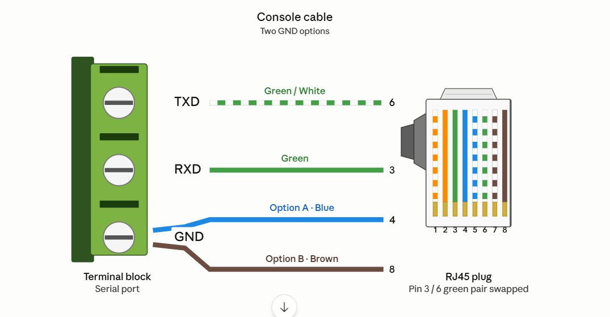
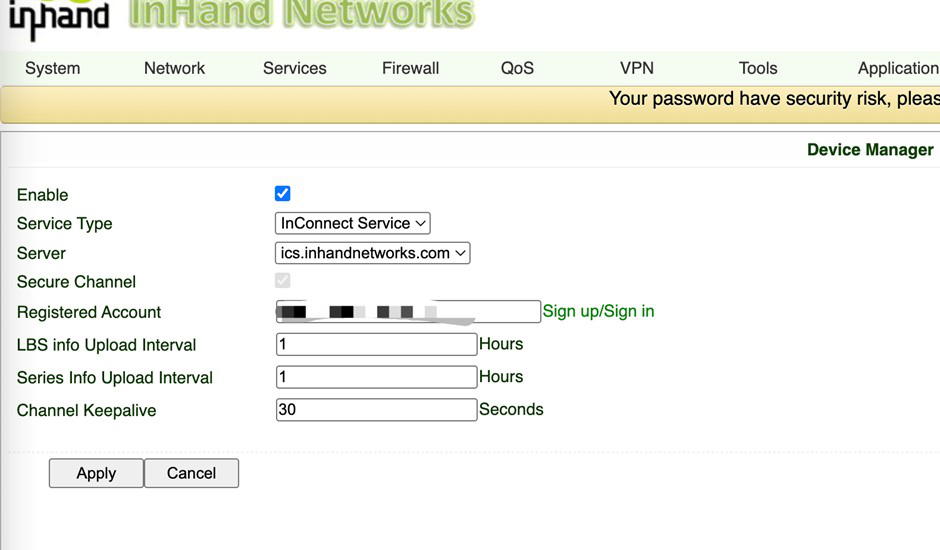
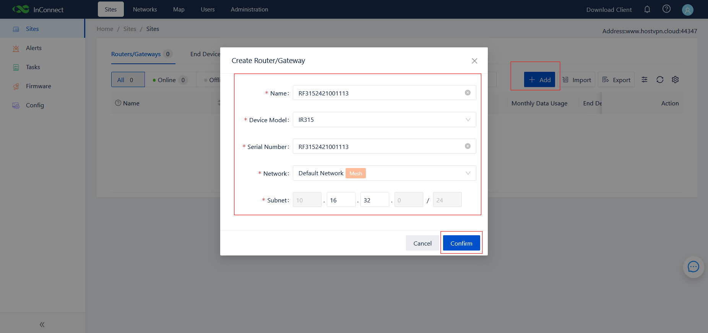
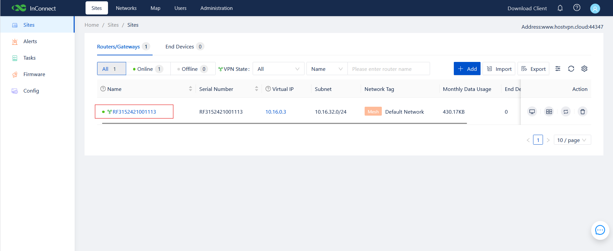
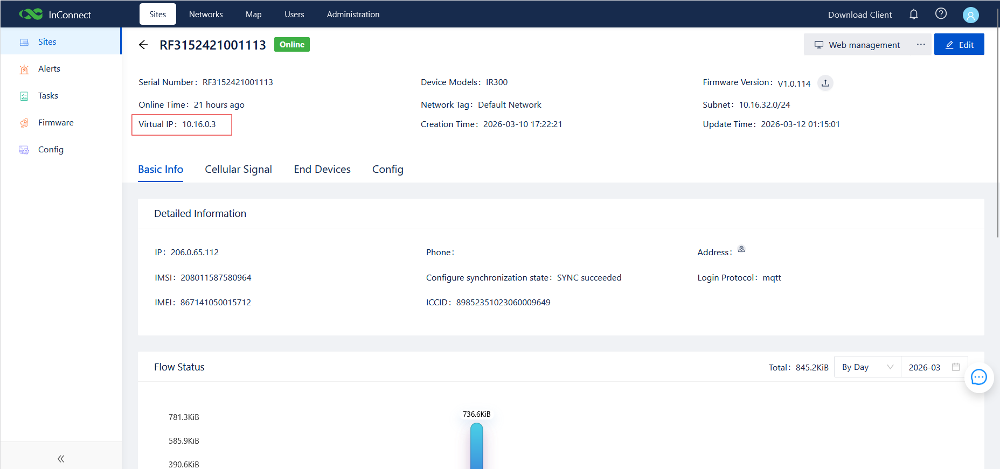
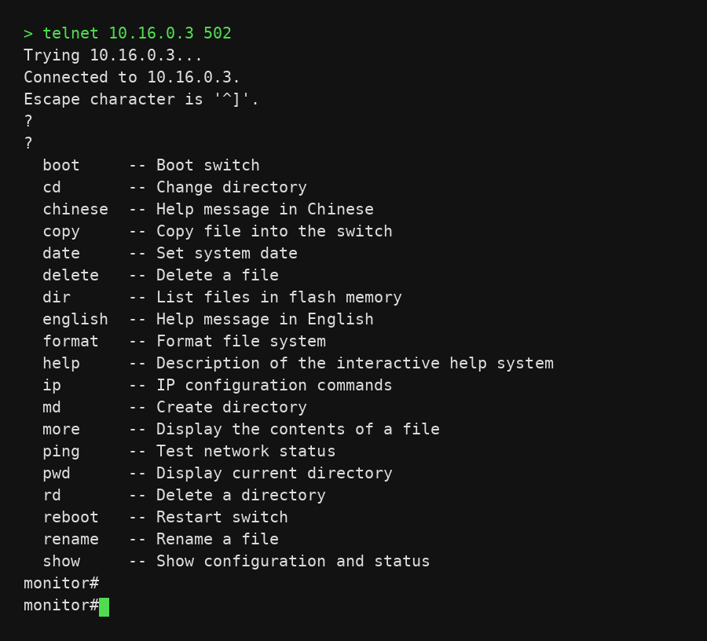

# Out-of-Band Management (OOBM) Configuration Guide

**Product:** InHand IR315 Industrial Cellular Router
**Cloud Platform:** InConnect Server (ICS) — `ics.inhandnetworks.com`

This manual describes the end-to-end configuration required to deploy Out-of-Band Management (OOBM) of a managed device's console port using the InHand IR315 industrial router and the InConnect Server (ICS) cloud platform. 

## 1. Document Information

- **Product model:** IR315
- **Cloud platform:** ICS (InConnect Server) — `ics.inhandnetworks.com`
- **Applicable scenario:** Out-of-band remote console access to switches, routers, firewalls, servers, and other equipment with an RS232 console port.

## 2. Device Overview

### 2.1 Product Introduction

The InHand **IR315** is an industrial cellular router with a 4G LTE uplink, Ethernet WAN/LAN ports, and an industrial 3.5 mm pitch terminal block exposing RS232 and RS485. It is designed for unattended cabinets and supports the InHand InConnect Server (ICS) cloud platform for centralized, secure remote management. In this manual the IR315 is used as a **serial-to-cloud bridge**: its RS232 port connects to a managed device's console, and its cellular uplink delivers the console session to an engineer's PC through ICS.

### 2.2 Key Features Used in This Solution

- 4G LTE cellular uplink for an out-of-band management plane.
- RS232 serial port for console connection to switches / routers / servers.
- **DTU (Data Transfer Unit)** function for transparent serial-to-TCP forwarding.
- Native ICS cloud registration with a private virtual IP per device.
- Industrial-grade design (wide temperature, DC 9–36 V, surge / ESD protection).

### 2.3 Typical OOBM Topology

The high-level topology is shown below.

## 3. Hardware Description

### 3.1 Interfaces Used in This Solution

- **Power input:** DC 9–36 V (V+ / V−), reverse-polarity and surge protected.
- **Serial port:** 3.5 mm pitch industrial terminal block exposing TXD / RXD / GND (RS232) and A / B (RS485). Used to connect the managed device's console.
- **Ethernet:** RJ45 WAN / LAN (not required for OOBM uplink, but useful for local commissioning).
- **Cellular:** SIM1 slot + screw-on ANT antenna.
- **LEDs:** Power, Status, Cellular, Signal — used to confirm power and 4G status.
- **Reset button:** restore factory defaults.

### 3.2 IR315 Serial Terminal Pin Definitions

| Pin | Signal | Direction | Description |
| --- | --- | --- | --- |
| 1 | V+   | Power (+)        | Power supply positive |
| 2 | V−   | Power (−)        | Power supply negative |
| 3 | TXD  | Output (RS232 TX)| Transmit — IR315 sends to managed-device RXD |
| 4 | RXD  | Input (RS232 RX) | Receive — IR315 receives from managed-device TXD |
| 5 | GND  | Signal Ground    | Signal ground — must be connected |
| 6 | A    | RS485+           | RS485 differential signal (+) |
| 7 | B    | RS485−           | RS485 differential signal (−) |

> ⚠️ **Wiring rule:** for a Console cable, connect TXD, RXD and GND at a minimum. IR315 `TXD` → managed-device `RXD`, IR315 `RXD` → managed-device `TXD`, common `GND` (cross-connect). Reversed TXD/RXD is the most common reason for a blank console.

### 3.3 Wiring Diagram (Console Cable)

## 4. Factory Defaults

- **Default LAN IP:** `192.168.2.1`
- **Subnet mask:** `255.255.255.0`
- **Web username:** `adm`
- **Web password:** `123456` (some batches ship with a random password — see the device label)

## 5. Pre-Configuration Checklist

Before starting, prepare the following:

1. An activated SIM card with adequate cellular coverage at the deployment site.
2. The console cable described in §3.3, pre-built per the managed-device pinout.
3. An ICS account on `ics.inhandnetworks.com` with permission to add devices.
4. A laptop on the same subnet as the IR315 LAN port (`192.168.2.x`) for initial web login.
5. A modern browser (Chrome / Edge / Firefox).
6. Optional: a serial terminal tool (PuTTY / SecureCRT / MobaXterm) for end-to-end testing.

Power-up sequence:

1. Insert the SIM card into SIM1 **with the device powered off**.
2. Screw the cellular antenna firmly onto the ANT connector.
3. Connect the console cable from the IR315 serial terminal to the managed-device console port.
4. Apply DC 9–36 V power.
5. Wait until the **Status** LED is solid and the **Signal** LED indicates good signal (green = 21–30).

## 6. IR315 Local Configuration

All steps in this chapter are performed in the IR315 web management interface. Connect your laptop to the IR315 LAN port, set your laptop NIC to `192.168.2.x / 24`, and browse to `https://192.168.2.1` (accept the certificate warning if any). Log in with the factory username/password from §4 — and **change the password immediately** after first login.

### 6.1 Serial Port Parameter Configuration

Serial parameters must **exactly match** the managed device's console port — a mismatch produces garbled output or no output.

1. Navigate to **Services → DTU RS232**.
2. Configure the following parameters and click **Apply**:
   - **Baud rate:** typically `9600` or `115200` — match the managed device
   - **Data bits:** `8`
   - **Stop bit:** `1`
   - **Parity:** `None`
   - **Software flow control:** disabled

### 6.2 DTU Function Configuration (Serial Port Forwarding)

The DTU (Data Transfer Unit) function is the core mechanism that enables serial OOBM on the IR315. It encapsulates serial bytes into TCP and forwards them through the cellular network to ICS.

1. On the **Services → DTU RS232** page, enable the **DTU** function (toggle to Enabled).
2. Set **DTU Protocol** to **Virtual-Serial**. In this mode the IR315 listens on a TCP port and waits for connections from the engineer's PC through the ICS tunnel.
3. Set **Protocol** to **TCP**, **Mode** to **Server**.
4. Set the **Listening Port** to `502` (or any port in the range 1024–65535 as required).
5. (Optional) Set **Frame Interval** = `100` ms and **Max Idle Time** = `30000` seconds to match the example.
6. Tick **DTU Serial Port Traffic Statistics** if you want byte counters in the web UI.
7. Click **Apply** and reboot if prompted.

The configured page should look like this:

## 7. ICS Cloud Platform Configuration

### 7.1 Register the IR315 with ICS (from the IR315 web UI)

1. In the IR315 web UI, navigate to **Services → Device Manager** (also labelled InConnect on some firmware versions).
2. Configure as follows:
   - **Enable:** ticked
   - **Service Type:** `InConnect Service`
   - **Server:** `ics.inhandnetworks.com`
   - **Registered Account:** the account you created on the ICS platform (Sign up / Sign in link is on the same page)
   - **LBS info Upload Interval / Series Info Upload Interval:** `1` hour (default)
   - **Channel Keepalive:** `30` seconds
3. Click **Apply**. The IR315 will automatically establish a secure tunnel to ICS. After ~30 seconds the device should appear as **Online** in the ICS dashboard.

### 7.2 Add the IR315 in the ICS Web Console

1. Open a browser and log in to ICS at `https://ics.inhandnetworks.com`.
2. Navigate to **Sites → Routers/Gateways** and click **+ Add**.
3. In the **Create Router/Gateway** dialog enter:
   - **Name:** any friendly name (often the device serial number)
   - **Device Model:** `IR315`
   - **Serial Number:** the IR315 serial number (printed on the device label)
   - **Network:** select the target ICS network (e.g. `Default Network`, with mesh enabled)
   - **Subnet:** the virtual subnet for this device (e.g. `10.16.32.0/24`)
4. Click **Confirm**.

### 7.3 Locate the IR315 Virtual IP

After the IR315 comes online, ICS assigns it a **Virtual IP** inside the configured subnet. This Virtual IP is what the engineer's terminal tool will connect to.

1. Navigate to **Sites → Routers/Gateways** and locate the IR315 in the list. The **VPN State** indicator and the green online dot should both confirm it is online.

   

2. Click the device name to open the detail page. Copy the **Virtual IP** field (in this example `10.16.0.3`).

   

### 7.4 Download and Install the InConnect OpenVPN Client

1. From any page in ICS, click **Download Client** in the top-right of the page header.
2. Select the appropriate package for the engineer's PC — Windows 7, Windows 8 / 8.1, Windows 10, iPhone, or Android.

   

3. Install the client on the engineer's PC.

### 7.5 Download the per-User OpenVPN Profile (`.ovpn`)

Each engineer needs their own OpenVPN configuration file from ICS:

1. Navigate to **Users**.
2. Locate the engineer's user account in the list.
3. Click the **Download OpenVPN config file** icon (download icon in the Action column).

   

4. Save the `.ovpn` file to the engineer's PC and import it into the InConnect OpenVPN client.

### 7.6 Establish the OpenVPN Tunnel

1. Launch the InConnect OpenVPN client on the engineer's PC.
2. Select the profile imported in §7.5 and click **Connect**.
3. The client should report a connected state and assign the PC a virtual IP in the same ICS subnet as the IR315 (e.g. `10.16.0.2`).

## 8. End-to-End Verification

Once the OpenVPN tunnel is up, the engineer can reach the IR315's DTU listener at `<Virtual IP>:<Listening Port>` exactly as if it were a local TCP socket.

1. Open a serial terminal tool — **PuTTY**, **SecureCRT** or **MobaXterm**.
2. Configure a session as follows:
   - **Connection type:** Telnet or Raw
   - **Host:** the IR315 Virtual IP from §7.3 (in the example, `10.16.0.3`)
   - **Port:** the DTU listening port from §6.2 (in the example, `502`)
3. Click **Connect**.

If the wiring and serial parameters are correct, the managed device's console output will appear in the terminal — pressing Enter should produce the device's CLI prompt, exactly as if a local console cable were plugged in.

Example using telnet from a Windows command prompt:

In this example a connection is made to `10.16.0.3 502` and the managed switch displays its `monitor#` interactive help — confirming the OOBM channel is fully operational.

## 9. Hardening and Day-2 Operations

After the OOBM channel is confirmed working, perform the following hardening steps:

### 9.1 Change the IR315 Admin Password

1. Navigate to **System → Administration**.
2. Enter the current password and a new strong password.
3. Click **Apply** and save the configuration.

### 9.2 Limit IR315 Management Services

1. Navigate to **System → Administration → Service**.
2. Disable any service not required for OOBM (e.g. HTTP if HTTPS is sufficient, Telnet if SSH is sufficient).
3. Restrict **Remote Management** to ICS only — do not expose the IR315 web UI on the public internet.

### 9.3 Backup the IR315 Configuration

1. Navigate to **Services → Configuration Management** (also labelled **Config Management** on some firmware versions).
2. Click **Backup Configuration** and save the file to a secure location.
3. The same page can be used to **Import Configuration** when commissioning a replacement unit; the device must be rebooted for the imported configuration to take effect.

### 9.4 Rotate Passwords and Audit Sessions Periodically

- Rotate IR315 admin passwords on a fixed cadence.
- Review the ICS audit log for unexpected user sessions or device disconnects.
- Confirm that every engineer's ICS account has only the permissions they actually need.

## 10. Troubleshooting

### 10.1 Quick Reference

| Symptom | Recommended checks |
| --- | --- |
| IR315 cannot connect to the 4G network | SIM card seated and active, APN correct, antenna tight, signal strength (green Signal LED, RSSI ≥ −90 dBm) |
| IR315 shows offline in ICS for an extended period | ICS server address (`ics.inhandnetworks.com`), account credentials, internet reachability (ping 8.8.8.8), firewall on TCP 443 / 8883 |
| No console output after terminal connection | Serial parameters, cable wiring (TXD/RXD reversed?), managed device powered on and producing console output, cable type (some devices need a rollover cable) |
| Console output is garbled | Serial parameter mismatch — re-check baud rate, data bits, stop bit, parity on both sides |
| Console connection drops frequently | Weak 4G signal, ICS keep-alive timeout too short (30–60 s recommended), loose terminal-block connection, power supply not meeting rated power |
| ICS client cannot establish a tunnel | PC internet access, local firewall / proxy blocking the client, ICS account permission, restart the client / log out & back in |

### 10.2 Detailed Problem Analysis

#### 10.2.1 IR315 Cannot Connect to the 4G Network

**Symptom:** the cellular signal LED on the IR315 front panel is off or flashing continuously; the management UI shows cellular status as **Not Connected**.

Troubleshooting steps:

1. Confirm the SIM card is properly inserted in SIM1 and is neither locked nor suspended for non-payment.
2. Verify the antennas are firmly screwed onto the ANT connectors with good contact.
3. Log in to the management UI and verify the APN setting (contact the carrier for the correct APN).
4. Verify cellular coverage at the deployment location with a mobile phone.
5. Reboot the IR315 and watch whether the cellular connection comes up.

> **Tip:** Some carrier SIMs must first be activated in a phone or have a data plan enabled before they will work in a router.

#### 10.2.2 Device Shows Offline in ICS for an Extended Period

**Symptom:** IR315 has an active 4G connection but the device status on ICS still shows **Offline** or **Unregistered**.

Troubleshooting steps:

1. Verify the ICS server address (`ics.inhandnetworks.com`) is configured exactly.
2. Verify the IR315 SN matches the device record on ICS.
3. From the IR315 management UI, run a ping test to `8.8.8.8` to confirm internet reachability.
4. Confirm any upstream firewall allows the IR315 to reach ICS on TCP 443 / 8883.
5. In ICS, confirm the device account is not disabled and the license has not expired.

#### 10.2.3 No Console Output After Terminal Connection

**Symptom:** the terminal tool reports a successful connection but the screen is blank — Enter has no effect.

Troubleshooting steps:

1. Verify the console cable is firmly seated in both the IR315 SERIAL terminal block and the managed-device console port.
2. Verify the cable type — some devices require a rollover cable rather than straight-through.
3. Verify the IR315 serial parameters match those of the managed-device console (especially baud rate).
4. Verify the managed device is powered on and is producing console output (test first with a directly connected local PC).
5. In the terminal tool, try **Enter** or **Ctrl+C** to trigger output.

#### 10.2.4 Console Output Is Garbled

**Symptom:** the terminal tool receives data but it is unreadable (`????`, `□□□`, etc.).

**Root cause:** the classic symptom of a serial parameter mismatch.

Resolution:

1. Re-check baud rate, data bits, stop bit, and parity on both the IR315 and the managed device — they must be identical.
2. Most common mismatch: managed device at 9600 vs. IR315 at 115200 (or vice versa).
3. After correcting, reconnect and confirm the output is now readable.

#### 10.2.5 Console Connection Drops Frequently

**Symptom:** the console connection is intermittent or drops after a period of time.

Troubleshooting steps:

1. Check the IR315 cellular signal strength. If RSRP < −110 dBm, reposition the antenna or relocate the deployment.
2. Review the **Channel Keepalive** value in the ICS / Device Manager page — 30–60 seconds is recommended.
3. Check for any loose connection on the serial terminal block or the cable strain relief.
4. Confirm the power supply meets the rated wattage of the IR315.

#### 10.2.6 ICS Client Cannot Establish a Tunnel

**Symptom:** the InConnect OpenVPN client is installed and logged in, but cannot establish a tunnel to ICS.

Troubleshooting steps:

1. Confirm the engineer's PC has internet access and can reach `ics.inhandnetworks.com`.
2. Check whether local firewall / endpoint-protection software is blocking the client; temporarily disable for testing.
3. Confirm the user account in ICS has permission to access the target IR315.
4. Restart the client, or log out and back in, and wait for the tunnel to re-establish.
5. If the PC uses an HTTP proxy, configure the client with the correct proxy settings.

## 11. Safety Notes

- Earth the IR315 chassis to a reliable ground in industrial environments.
- Do not hot-plug the serial terminal block while the device is powered.
- Back up the IR315 configuration after every successful change.
- Rotate the IR315 admin password and the ICS user passwords on a fixed cadence.
- Restrict physical access to the IR315 — only authorized personnel should touch the device.
