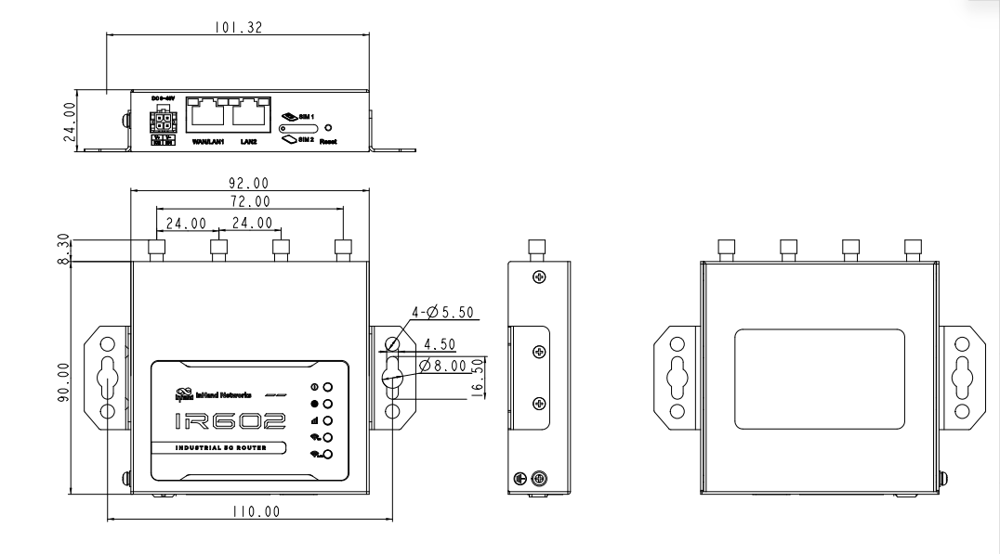

  

    

      

        
      

      

        

          Lightweight 5G Connectivity, Build Industrial Digital Foundation
        

      

    

    

      

        IR602 5G RedCap Industrial Router
      

      

        

          
· 5G RedCap

          
· Wi-Fi 6

        

        

          
· 2.5GbE

          
· Multi-Protocol VPN

          
· Cloud Management

        

      

    

  

# 1. Product Overview

The IR602 series is a lightweight 5G RedCap industrial router designed by InHand for large-scale, mid-speed industrial IoT scenarios. Integrating 5G RedCap cellular, Wi-Fi 6 wireless, and 2.5G high-speed wired access into a unified three-link communication architecture, the product leverages native 5G SA capabilities, multi-dimensional security protection, and intelligent multi-link scheduling to deliver a highly stable, low-latency, easy-to-maintain integrated networking solution for distributed industrial sites across plants and remote areas.

Addressing the distributed networking needs of industrial digitalization, the product balances lightweight deployment costs with long-term 5G evolution requirements. Based on the integrated communication architecture, it builds a complete transmission path connecting local sites and remote locations. Combined with encrypted tunnels, link redundancy, and centralized cloud management, it establishes an end-to-end reliable industrial transmission foundation, supporting unified networked operation of massive numbers of endpoints. The device fully complies with industrial harsh-environment standards and runs reliably in workshops, open outdoor sites, and unattended stations, serving as the standardized core networking hardware for large-scale industrial 5G deployment.

## Key Features

- **Unified Three-Link Architecture**: Multi-link networking across 5G RedCap, Wi-Fi 6, and 2.5G wired access to cover all application scenarios.
- **High-Performance Local Access**: Gigabit wired Ethernet and gigabit Wi-Fi 6 wireless provide stable access for on-site terminals.
- **Continuous Online Guarantee**: Dual SIM hot backup, multi-WAN intelligent link switchover, heartbeat detection, and hardware watchdog ensure uninterrupted communication in unattended scenarios.
- **Granular Traffic Control**: QoS priority scheduling to prioritize stable transmission of critical industrial services.
- **Secure Encrypted Networking**: Compatible with mainstream VPN protocols, built-in firewall and access control for encrypted remote transmission of business data.
- **Cloud Management**: Integrated with InHand's DeviceLive cloud platform for batch configuration, remote OTA, fault diagnosis, and alarm push, enabling unified management of massive distributed sites.
- **Rich Network Protocol Stack**: IPv4/IPv6, IP passthrough, DDNS, and more to flexibly adapt to diverse industrial networking solutions.
- **All-Environment Industrial Design**: IP30 fanless metal enclosure, -40 °C to +70 °C wide-temperature operation, industrial EMC protection, DIN rail and wall-mount installation.

## Typical Application Scenarios

### Smart Manufacturing Factory

Suitable for workshop PLC remote networking, AGV wireless roaming, production line video surveillance, and production line fault alarms. Industrial workshops have complex electromagnetic environments and require cross-plant equipment remote debugging and uninterrupted mobile robot communication. The IR602 connects the transmission path between field terminals and headquarters, enabling secure remote transmission of industrial messages and continuous AGV roaming. The device features excellent electromagnetic interference resistance, adapted to complex factory conditions. With the DeviceLive cloud platform, field devices can be remotely debugged and centrally maintained at scale.

### Smart Energy

Covers distribution network FTU/RTU, distributed PV plants, oil field well sites, and pipeline monitoring stations. Field sites commonly lack wired networks and are unattended for long periods. Leveraging the 5G SA lightweight private network, the device enables low-latency remote transmission of control messages. Dual SIM link redundancy and cloud management capabilities ensure the product continues to operate stably on site.

### Smart City Municipal Facilities

Adapted to massive dispersed sites such as outdoor security surveillance, public EV charging stations, road information screens, and smart streetlights. Municipal sites are numerous and widely dispersed, with many relying solely on solar power. The lightweight 5G RedCap solution offers controllable power consumption, suitable for photovoltaic-powered scenarios. Link backup capabilities ensure stable upload of video and business data. With the DeviceLive cloud platform, terminals can be batch-configured and remotely upgraded and maintained.

### Transportation Infrastructure

Includes road monitoring stations, tunnel surveillance, port yard auxiliary equipment, and access control systems. These sites are deployed outdoors for long periods, facing temperature variations and electromagnetic interference, while needing to stably carry multiple video services. The wide-temperature industrial hardware withstands complex outdoor environments, and 2.5G wired bandwidth carries multiple video streams. Multi-WAN automatic link failover ensures uninterrupted transmission of surveillance images and control commands.

### Environmental & Chemical Safety Management

Applied to wastewater treatment stations, atmospheric monitoring stations, chemical parks, and hazardous waste yards. These sites commonly face dust, humidity, and other harsh conditions, with high requirements for public network data transmission security. The device builds encrypted networking through VPN tunnels, enabling secure remote transmission of surveillance video and environmental condition data. In addition, the DI/DO interfaces support over-limit signal collection and linkage with audible/visual alarm devices, and the metal dust-proof enclosure can adapt to high-dust, humid plant environments over the long term.

### Emergency Communication

For emergency command sites and on-site temporary rescue points. Emergency scenarios require rapid setup of temporary communication networks while ensuring secure backhaul of on-site information. The device is flexible and easy to deploy, with Wi-Fi 6 providing local wireless coverage on site and 5G SA links providing encrypted backhaul of business data to the command center, quickly building end-to-end temporary communication channels.

## Product Dimensions

    
    
Dimensions

    
<strong>Note:</strong>

    
1. All dimensions are in millimeters (mm).

    
2. Dimensions (L &times; W &times; H): 98.3 &times; 92 &times; 24 mm (3.87 &times; 3.62 &times; 0.94 in).

    
3. All dimensions are approximate and for reference only.

    
4. Dimensions are subject to change without notice.

# 2. Product Highlights

## Highlight 1: Unified Three-Link Architecture for All-Scenario Networking

The IR602 integrates 5G RedCap cellular, Wi-Fi 6 wireless, and 2.5G high-speed wired access into a unified three-link communication architecture. Gigabit wired and gigabit Wi-Fi 6 carry high-speed local access of field terminals, while the 5G SA cellular link provides remote business backhaul. One link architecture connects the complete transmission path from local sites to remote centers, flexibly adapting to diverse industrial networking scenarios.

## Highlight 2: Lightweight 5G Smooth Evolution for Large-Scale Deployment

For large-scale, mid-speed industrial IoT scenarios, the product leverages native 5G SA capabilities to balance lightweight deployment costs with long-term 5G evolution requirements. With controllable power consumption and easy deployment, it serves as the standardized core networking hardware for large-scale industrial 5G deployment, supporting unified networked operation of massive numbers of endpoints.

## Highlight 3: Enterprise-Grade Security for Encrypted Remote Networking

Built-in stateful inspection firewall and access control, compatible with mainstream VPN protocols including IPsec, L2TP, WireGuard, and OpenVPN. QoS priority scheduling enables encrypted remote transmission of critical industrial business data, prioritizing stable delivery of important services.

## Highlight 4: Multi-Layer Link Redundancy for Continuous Online Operation

Dual SIM hot backup, multi-WAN intelligent link switchover, heartbeat detection, and hardware watchdog form a progressive multi-dimensional protection logic, with millisecond-level link failover to keep communication uninterrupted in unattended scenarios, suitable for production lines, energy, and municipal applications with high online requirements.

## Highlight 5: All-Environment Industrial Design for Reliable Operation in Harsh Conditions

IP30 fanless all-metal enclosure, -40 °C to +70 °C wide-temperature operation, industrial EMC protection, and DIN rail/wall-mount installation enable reliable operation in workshops, open outdoor sites, and unattended stations, fully complying with industrial harsh-environment standards.

# 3. Hardware Specifications

## 3.1 Hardware Overview

| Parameter | Specification |
| :--- | :--- |
| **Processor** | Cortex-A53 dual-core @ 1.3 GHz |
| **Memory** | 512 MB DDR3 |
| **Storage** | 128 MB SPI NAND Flash |
| **Wi-Fi** | IEEE 802.11 ax/ac/a/b/g/n, Wi-Fi 6, 2.4 GHz + 5 GHz, 3000 Mbps |
| **Wi-Fi Security** | WPA3-Enterprise, WPA2-Enterprise, WEP/TKIP/AES encryption |
| **Wi-Fi Max Power** | 5 GHz: 20 dBm, 2.4 GHz: 20 dBm |
| **Cellular Standards** | 5G NR SA; 4G LTE FDD/TDD |
| **SIM Slots** | 2 &times; Nano-SIM (4FF), eSIM reserved |
| **Ethernet Ports** | 1 &times; 2.5GbE RJ45 (WAN/LAN switchable) + 1 &times; GbE RJ45 |
| **Ethernet Isolation** | 1.5 kV network transformer isolation |
| **Industrial I/O** | 2 &times; GPIO, 4-pin industrial terminal block |
| **DI Characteristics** | Input 0-30 V, logic high &ge;10 V, logic low &le;3 V |
| **DO Characteristics** | Wet contact, open-drain output 1 mA; output low 0 V, high 13 V (pull-up resistor, no drive capability) |
| **Antenna Connectors** | 4 &times; SMA external antennas: 2 &times; cellular + 2 &times; Wi-Fi |
| **LED Indicators** | 1 &times; SYS, 1 &times; NET, 3 &times; Signal (red/yellow/green), 1 &times; Wi-Fi 2.4G, 1 &times; Wi-Fi 5G |
| **Reset Button** | 1 &times; Reset pinhole |
| **Power Input** | DC 12 V / 2 A, 4-pin industrial terminal block |
| **Power Consumption** | &le; 15 W |
| **Cooling** | Fanless passive cooling |
| **Enclosure** | All-metal SGCC galvanized steel, black fine-texture coating |
| **Ingress Protection** | IP30 |
| **Operating Temperature** | -40 &deg;C to +70 &deg;C (-40 &deg;F to +158 &deg;F), extended to +75 &deg;C (+167 &deg;F) |
| **Storage Temperature** | -40 &deg;C to +85 &deg;C (-40 &deg;F to +185 &deg;F) |
| **Humidity** | 5% to 95% (non-condensing) |
| **Dimensions** | 98.3 &times; 92 &times; 24 mm (3.87 &times; 3.62 &times; 0.94 in) |
| **Weight** | Approx. 390 g (0.86 lb) |
| **Mounting** | DIN rail / wall-mount |

# 4. Network Connectivity

## 4.1 Cellular Network

- **Network Standards**: 5G NR SA, 4G LTE FDD/TDD
- **Network Access**: APN, VPDN; supports dual APN custom configuration
- **Access Authentication**: CHAP/PAP
- **Peak Rates**: Global model (IR602-GLRC-WLAN) 5G DL 223 Mbps / UL 123 Mbps; China model (IR602-CNRC-WLAN) 5G DL 226 Mbps / UL 120 Mbps
- **Connection Mode**: Automatic network mode switching

## 4.2 SIM Card Management

- **Dual SIM Support**: 2 &times; Nano-SIM (4FF) slots
- **Dual SIM Hot Backup**: Automatic switchover on dial failure
- **eSIM Reserved**: eSIM capability reserved

## 4.3 Wired Network

- **WAN Protocols**: DHCP, Static IP, PPPoE
- **LAN Interface**: 1 &times; GbE RJ45
- **Interface Modes**: 1 &times; 2.5GbE RJ45 (WAN/LAN switchable) + 1 &times; GbE RJ45
- **Port Expansion**: WAN port switchable to LAN for dual LAN access
- **IPv6 Support**: IPv6 network access supported

## 4.4 Wi-Fi 6 Wireless

- **Standard**: IEEE 802.11 ax/ac/a/b/g/n (Wi-Fi 6)
- **Frequency Bands**: 2.4 GHz (2 &times; 2 MIMO) + 5 GHz (2 &times; 2 MIMO) dual-band concurrent
- **Max Rate**: 3000 Mbps (AX3000, 2.4 GHz 574 Mbps + 5 GHz 2402 Mbps)
- **Channel Bandwidth**: 20/40/80 MHz
- **Max Connections**: 64 terminals (each &ge;20 Mbps concurrent)
- **Modes**: Access Point (AP), Client (STA)
- **Security**: OPEN / WPA-PSK / WPA2-PSK / WPA3-PSK / Mixed mode
- **Encryption**: WEP/TKIP/AES
- **Fast Roaming**: 802.11kvr

# 5. Link Management & Backup

## 5.1 Intelligent Link Backup

- **Multi-WAN Access**: Three uplink options: Ethernet WAN / Cellular / Wi-Fi STA
- **Backup Mode**: Priority-based link backup, millisecond failover
- **Load Balancing**: Multiple WANs online simultaneously for traffic distribution
- **Probe Methods**: ICMP/TCP multi-method health checks

## 5.2 Link Quality Assurance

- **Link Detection**: Heartbeat monitoring, automatic reconnection on disconnection
- **Dual SIM Switchover**: Automatic switchover to backup SIM on cellular link or dial abnormality
- **Built-in Watchdog**: Device self-check, automatic fault recovery
- **Link Monitoring**: Real-time latency, jitter, packet loss, throughput

# 6. Security Features

## 6.1 Firewall

| Security Feature | Description |
| :--- | :--- |
| **Stateful Inspection** | Connection-state-based packet inspection |
| **Inbound/Outbound Rules** | Granular inbound and outbound access control |
| **Port Forwarding** | Port mapping and intranet penetration |
| **NAT** | SNAT / DNAT |
| **MAC Filtering** | Blacklist / whitelist mode |
| **Domain Filtering** | Domain-based access control |
| **Policy Routing** | Intelligent traffic distribution based on source/destination addresses |
| **Traffic Shaping (QoS)** | Interface-level bandwidth limiting and queue management |

## 6.2 VPN Support

| VPN Protocol | Supported Modes | Description |
| :--- | :--- | :--- |
| **IPsec** | IKEv1 / IKEv2 | PSK/certificate authentication, full Web UI configuration |
| **L2TP** | Client / Server | Up to 10 concurrent sessions, supports L2TP over IPsec |
| **WireGuard** | Client / Server | Public/private key encryption, UDP single-port communication |
| **OpenVPN** | Client / Server | Certificate/password authentication, TUN/TAP modes |

## 6.3 Traffic Shaping (QoS)

- **Bandwidth Control**: Interface-level bandwidth limiting
- **QoS Policy**: Priority scheduling and queue management

# 7. Local Network Services

## 7.1 DHCP Service

- **DHCP Server**: Dynamic IP address allocation
- **DHCP Client**: Client address acquisition

## 7.2 DNS Service

- **DNS Proxy**: Local caching and forwarding
- **DNS Filtering**: Domain-based filtering control
- **Custom DNS**: Configurable DNS servers

## 7.3 Dynamic DNS (DDNS)

- **Multi-Provider Support**: Mainstream DDNS providers
- **Automatic Update**: Automatic domain resolution update when WAN/cellular IP changes

## 7.4 Static Routing

- **Routing Table**: Static routing configuration
- **Dynamic Routing**: BGP, OSPF supported

## 7.5 IP Passthrough

- **Bridge Mode**: WAN/dial IP passthrough to downstream devices
- **Flexible Configuration**: Passthrough mode on dial-up and WAN ports

# 8. Cloud Management & Maintenance

The IR602 integrates the DeviceLive cloud management platform, providing full device lifecycle cloud management to support unified remote operation and maintenance of massive distributed sites.

## 8.1 DeviceLive Cloud Management

| Feature | Description |
| :--- | :--- |
| **Real-Time Monitoring** | Visualized real-time device status, signal strength, data usage |
| **Remote Diagnostics** | Remote troubleshooting without on-site access |
| **Batch Management** | Configure multiple devices simultaneously |
| **Remote Maintenance** | Reduce on-site visits through remote configuration and troubleshooting |
| **OTA Updates** | Over-the-air firmware and configuration updates |
| **Alarm Management** | Device anomaly alerts and notifications |
| **Signal Analysis** | Cellular signal quality monitoring and evaluation |

- **Cloud Platform URLs**: China `device.inhandcloud.cn` / Global `device.inhandcloud.com`
- **Remote Access**: Remote configuration and maintenance channel supported
- **Remote API**: REST API interface for third-party system integration

# 9. System Management & Maintenance

## 9.1 Device Management

- **Web Management**: Graphical configuration interface, default access 192.168.2.1
- **CLI Management**: SSH command-line advanced configuration
- **Configuration Import/Export**: Backup and restore
- **Factory Reset**: Restore factory settings
- **Firmware Upgrade**: System firmware upgrade

## 9.2 Logs & Diagnostics

- **System Logs**: System logs, diagnostic logs, device event records
- **Alarm Notification**: Email alarm notifications
- **Diagnostic Tools**: Ping (connectivity), Traceroute (route tracing), packet capture, Iperf (link performance)

## 9.3 Other System Capabilities

- **Dashboard**: Device information overview, interface status, traffic statistics, Wi-Fi connection count
- **Link Monitoring**: Link latency, jitter, packet loss, throughput
- **Login Security**: Multi-level user permissions (admin/operator), Web login timeout, access control policies

# 10. Ordering Information

## 10.1 Product Models

| Model | Cellular Standard | Region | Frequency Bands | Wi-Fi | Application |
| :--- | :--- | :--- | :--- | :--- | :--- |
| **IR602-GLRC-WLAN** | 5G RedCap | Global | 5G NR: n1/2/3/5/7/8/12/13/14/18/20/25/26/28/30/38/40/41/48/66/70/71/77/78/79 LTE-FDD: B1/2/3/4/5/7/8/12/13/14/17/18/19/20/25/26/28/30/66/70/71 LTE-TDD: B34/38/39/40/41/42/43/48 | AX3000 | Multi-national deployment requiring global band coverage |
| **IR602-CNRC-WLAN** | 5G RedCap | China | 5G NR: n1/3/5/8/28/40/41/78/79 LTE-FDD: B1/3/5/8 LTE-TDD: B34/38/39/40/41 | AX3000 | China domestic use, ideal 5G transition solution |
| **IR602-EN00-WLAN** | None (Wired only) | Global | — | AX3000 | Pure wired network scenarios |

## 10.2 Package Contents

**Standard Package**
- IR602 Router &times; 1
- Cellular antenna (SMA) &times; 2
- Wi-Fi antenna (SMA) &times; 2
- DC power adapter &times; 1
- 1 m RJ45 Ethernet cable &times; 1
- 4-pin industrial terminal block (pre-installed) &times; 1
- Warranty card &times; 1 (China)

**Optional Accessories**
- DIN rail mounting kit
- Wall-mount bracket

> Note: Accessories are subject to the actual shipping model.

# 11. Reliability Standards & Certifications

## 11.1 Ingress Protection

- **IP Protection**: IP30 (dust and solid object protection)

## 11.2 Mechanical Reliability

| Test Item | Standard |
| :--- | :--- |
| Shock | IEC 60068-2-27 |
| Vibration | IEC 60068-2-6 |
| Free Fall | IEC 60068-2-32 |

## 11.3 EMC Immunity

| Test Item | Standard |
| :--- | :--- |
| ESD (Electrostatic Discharge) | EN 61000-4-2, Level 3 |
| Radiated Susceptibility (RS) | EN 61000-4-3, Level 3 |
| EFT (Electrical Fast Transient) | EN 61000-4-4, Level 3 |
| Surge | EN 61000-4-5, Level 3 |
| Conducted Susceptibility (CS) | EN 61000-4-6, Level 3 |
| Power Frequency Magnetic Field (PFMF) | EN 61000-4-8, Level 3 |

## 11.4 Certifications & Compliance

- CE
- FCC
- PTCRB
- IC
- RoHS
- Verizon
- AT&T
- T-Mobile

> Note: Certification status is subject to change at the time of release. Please contact the InHand sales team for the latest certification status of specific SKUs.

# 12. Contact Us

**InHand Networks**

- **Website**: [www.inhand.com](https://www.inhand.com)
- **Copyright**: &copy; InHand Networks. All rights reserved.
