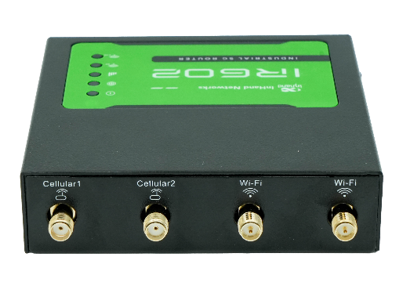
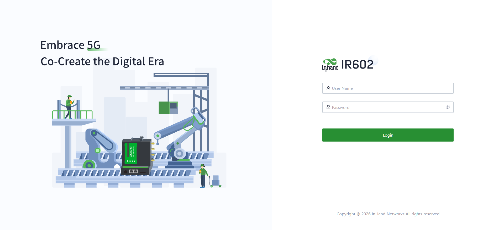
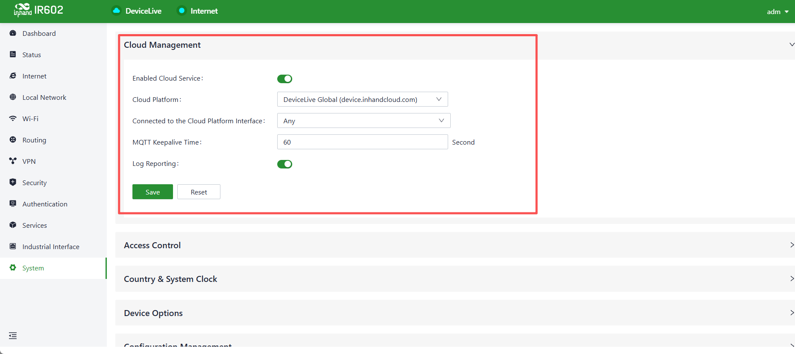
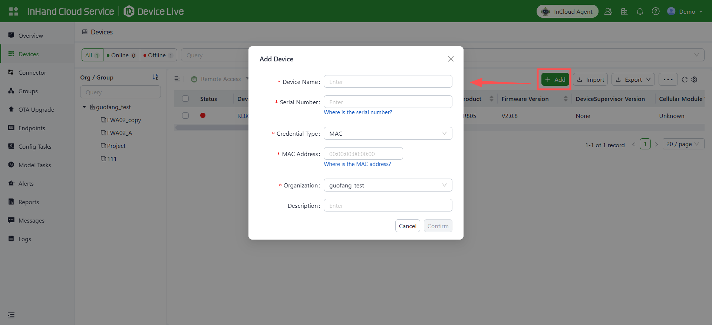
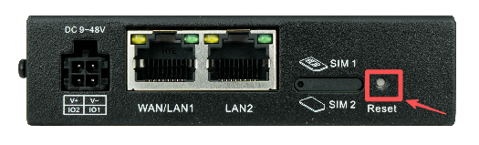

**Packing List**

The IR602 ships with standard accessories. On receipt, check the package to make sure all items are present.
If any item is missing or damaged, contact InHand Networks sales or technical support.

|Item |Qty |Description|
|---|---|---|
|IR602| 1 |IR602 router unit|
|Power adapter| 1 |DC 12 V power adapter (barrel connector)
|Ethernet cable| 1 | 1m Ethernet cable|
|Mounting kit| 1 |Wall-mounting kit (1 set)|

**Quick Start Guide**

**1. Installing the IR602**

Method 1: Wall Mounting
(1) Secure the wall-mounting kit to the device with screws.

<strong>Figure 1-1 Bracket Mounting</strong>

(2) Secure the device to a wall or cabinet with screws, and make sure the device is firmly
fixed without loosening or wobbling.

Method 2: DIN Rail Mounting
(1) Secure the DIN rail mounting plate to the device with screws.

<strong>Figure 1-2 DIN Rail Mounting</strong>

(2) Hook the upper hooks of the DIN rail mounting plate onto the top edge of the DIN rail, then push it forward slowly until the bottom snaps into place.

**2. Inserting the SIM Card and Connecting Antennas (For Cellular Use)**

The IR602 supports dual-SIM single standby. To access the Internet via cellular data, insert a Nano-SIM card first. If cellular data is not needed, skip this step.
(1) The SIM card slot is on the same side as the Ethernet ports. Use the SIM ejector pin to take out the SIM card tray.

<strong>Figure 2-1 SIM Card Installation</strong>

(2) Place the Nano-SIM card on the tray with the notched corner aligned, then push the tray back into the slot.
(3) Following the silkscreen markings on the device housing, install the cellular antenna and the Wi-Fi antenna onto the corresponding connectors and tighten them.

<strong>Figure 2-2 Antenna Installation</strong>

>Note: **Always insert or remove the SIM card with the device powered off; otherwise, the device may malfunction.**

**3. Connecting Power and Ethernet**

Connect the DC power cable to the power connector on the side of the IR602, then connect the Ethernet cable to the WAN/LAN1 port.

**4. Accessing the Device**

(1) Connect the LAN port of the device to your computer with an Ethernet cable, then visit https://192.168.2.1 in a browser to access the login page of the device.

<strong>Figure 4-1 Local Login Page of the Device</strong>

(2) Check the nameplate on the back of the device to obtain the login username and password. Enter them to log in to the device locally.
>Note: It is recommended to change the password promptly after first use.

**5. Managing the Device via Cloud**
(1) Log in to the device locally and enable the cloud service on the "System -> Cloud Management" page.

<strong>Figure 5-1 Cloud Management Configuration</strong>

(2) Log in to DeviceLive (https://device.inhandcloud.com), go to the "Devices" menu, click "Add", and enter the serial number and MAC address printed on the device nameplate.

<strong>Figure 5-2 Adding a Device to DeviceLive</strong>

(3) After successful addition, you can manage your device remotely.

**Factory Reset**

To reset the device, follow the steps below to restore it to factory settings:
1. Power on the device. When the SYS LED just goes off, press and hold the Reset button for 5–10 seconds, then release it. The SYS LED will blink red.
2. Press and hold the Reset button again until the SYS LED stays steady red, then release the button. The device enters the reset procedure.

<strong>Figure 6 Reset Button</strong>

**LED Indicators**

| LED Indicator | Status | Meaning |
|--------------|--------|---------|
| SYS | Off | Power off |
| | Steady red | Device starting |
| | Blink red | System error |
| | Steady green | Working properly |
| | Blink red | Firmware updating |
| NET | Off | The WAN port is not connected |
| | Steady green | The WAN port is connected normally |
| | Blink green | Data transferring |
| Cellular | Steady green with one indicator | Poor cellular signal |
| | Steady green with two indicators | Medium cellular signal |
| | Steady green with three indicators | Good cellular signal |
| Wi-Fi 2.4G | Off | AP&STA is disabled |
| | Blink green | Working properly |
| | Steady green | Work as STA and AP is not associated |
| Wi-Fi 5G | Off | AP&STA is disabled |
| | Blink green | Working properly |
| | Steady green | Work as STA and AP is not associated |
| | Steady green | Other abnormalities |

**FAQ**

1.The status LED does not light up.

Check whether the power supply is connected.

2.Unable to access the local page of the device.

Check whether the PC is connected to the LAN port of the device. If it is connected, make sure the PC and the device are on the same subnet, and check whether HTTPS is used.

3.The device remains offline after being added to the DeviceLive platform.

First make sure the device is powered on and connected to the network, then log in to the device locally and check whether the cloud management function is enabled.