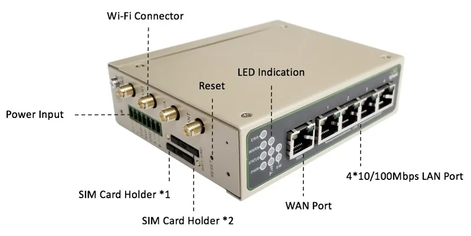
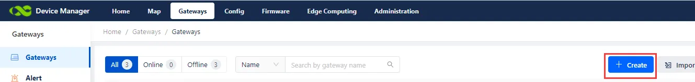
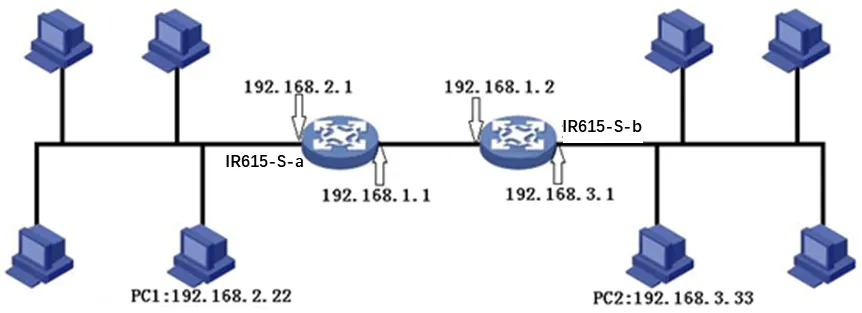
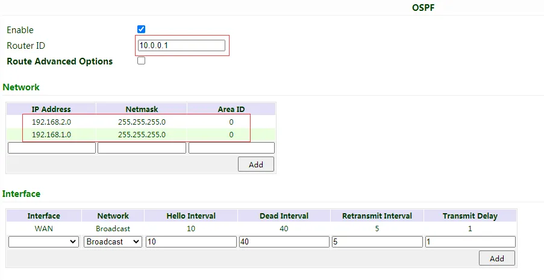
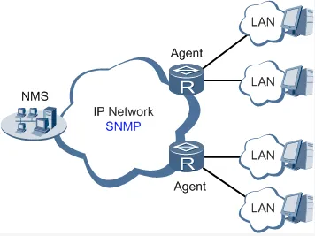
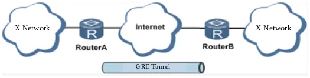
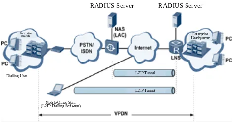

# Industrial Router IR615-S Product User Manual

# Front Matter

### Declaration

Thank you for choosing the InRouter615-S Industrial Cellular Router. Before using the product, read this manual carefully.

The contents of this manual cannot be copied or reproduced in any form without the written permission of InHand Networks.

Due to continuous product and technology updates, InHand Networks cannot promise that the contents of this manual are fully consistent with the actual product information, and does not assume any disputes caused by the inconsistency of technical parameters. The information in this document is subject to change without notice. InHand Networks reserves the right of final change and interpretation.

© 2024 InHand Networks. All rights reserved.

### Graphical Interface Conventions

The following symbols and conventions are used throughout this manual.

| Symbol | Meaning | Example |
|--------|---------|---------|
| `< >` | Indicates a variable or parameter to be replaced with an actual value | `<IP address>` means enter a specific IP address |
| `" "` | Indicates text labels on the interface | Click the "Save" button |
| `→` | Indicates menu hierarchy or operation sequence | 【Network】→【Cellular】 |
| `【 】` | Indicates a menu or page name | Enter the 【System Settings】page |
| `>` | A multi-level menu is separated by the angle bracket ">". For example, File > New > Folder indicates the menu item [Folder] under the sub-menu [New], which is under the menu [File]. |

Additional symbols used in this manual:

| Symbol | Meaning |
|--------|---------|
| Caution | Improper action may result in loss of data or device damage. |
| Note | Notes contain detailed descriptions and helpful suggestions. |

### Technical Support

**InHand Networks (Headquarters)**

Address: 43671 Trade Center Place, Suite 100, Dulles, VA 20166 USA

E-mail: support@inhandnetworks.com

Tel: +1 (703) 348-2988

URL: [www.inhand.com](http://www.inhandnetworks.com/)

**UL MARKINGS:**

1. UL File: E364742, E509340.
2. Electrical ratings: Input: 9-26V DC, 0.2-0.6A. (Optional)
3. Model number: IR615-S-x-y-z
4. Ambient temperature range: -20 ℃ to +70 ℃
5. Temperature class: T-5
6. Class I, Division 2, Groups A, B, C and D Hazardous Locations

**UL INSTALLATION AND OPERATING INSTRUCTIONS:**

1. These devices are open-type devices that are to be installed in an enclosure suitable for the environment and where the internal compartment is only accessible by the use of tool.
2. "Suitable for use in Class I, Division 2, Groups A, B, C and D Hazardous Locations, or Nonhazardous Locations only."
3. Warning - explosion hazard - do not disconnect equipment while the circuit is live or unless the area is known to be free of ignitable concentration.

   AVERTISSEMENT - RISQUE D'EXPLOSION - NE DÉBRANCHEZ PAS L'ÉQUIPEMENT PENDANT QUE LE CIRCUIT SOIT VIVANT OU À MOINS QUE LA ZONE NE SOIT SANS PROBLÈME DE CONCENTRATIONS IGNITABLES.
4. The unit shall be powered by a UL listed external AC adapter, output rated 9-26V DC, MINIMUM: 0.2-0.6A, marked LPS or CLASS 2.

### How to Use This Manual

**Match Your Role**

- First-time users: It is recommended to read in sequence: [Understanding the Device](#chapter-1-understanding-the-device) → [Installation and First Use](#chapter-2-installation-and-first-use) → [Common Scenario Configuration](#chapter-3-common-scenario-configuration) → [Feature Description and Parameter Reference](#chapter-4-feature-description-and-parameter-reference).
- Existing device users: Directly refer to [Feature Description and Parameter Reference](#chapter-4-feature-description-and-parameter-reference) or [Appendix A Troubleshooting](#appendix-a-troubleshooting).
- Cloud platform management users: Refer to [Common Scenario Configuration](#chapter-3-common-scenario-configuration) for device remote management platform configuration.

**Quick Task Navigation**

| Task | Corresponding Section | Estimated Time |
|------|----------------------|----------------|
| Install and power on the device | [Chapter 2 Installation and First Use](#chapter-2-installation-and-first-use) | About 10 minutes |
| Access the Internet via cellular network | [Scenario 1: Cellular Internet Access](#31-scenario-1-cellular-internet-access) | About 5 minutes |
| Access the Internet via wired WAN | [Scenario 2: Wired Internet Access](#32-scenario-2-wired-internet-access) | About 5 minutes |
| Configure Wi-Fi AP or STA mode | [Scenario 3: Wi-Fi Internet Access](#33-scenario-3-wi-fi-internet-access) | About 10 minutes |
| Configure VPN tunnel | [Scenario 4: VPN Tunnel Configuration](#34-scenario-4-vpn-tunnel-configuration) | About 15 minutes |
| Connect to Device Manager cloud platform | [Scenario 5: Device Manager Connection](#35-scenario-5-device-manager-connection) | About 10 minutes |
| Check system status and logs | [Section 4.9 Status](#49-status) | As needed |
| Restore factory settings | [Section 1.5 Restore Factory Settings](#15-restore-factory-settings) | About 5 minutes |

---

# Chapter 1 Understanding the Device

## 1.1 Overview

The InRouter615-S is the next generation of the InRouter600 series cellular router, integrating 3G, 4G LTE, and advanced security features. With embedded hardware watchdog, link detection, auto-recovery, and auto-reboot capabilities, the InRouter615-S provides reliable communications for unattended sites. Reliable VPN technology secures sensitive data. The InRouter615-S also utilizes remote management tools such as CLI, a web interface, and the InHand Device Manager cloud platform for batch configuration and monitoring.

The InRouter615-S is ideal for large-scale Internet of Things (IoT) and Machine-to-Machine (M2M) applications including ATM/kiosks, vending machines, connected retail, medical equipment, and industrial control systems.

## 1.2 Packing List

Each IR615-S product includes standard accessories. Check carefully upon receipt. If any item is missing or damaged, contact InHand sales staff.

InHand can provide customers with optional accessories according to different field requirements.

**Standard Accessories**

| Item | Quantity | Remarks |
|------|----------|---------|
| IR615-S router | 1 | |
| Ethernet cable | 1 | |
| DIN-rail clip | 1 | |
| 4G antenna | 1 | North America models have 2 antennas |
| Power terminal | 1 | |

**Optional Accessories**

| Item | Quantity | Remarks |
|------|----------|---------|
| Power adaptor | 1 | 9~26V DC |
| Wi-Fi antenna | 2 | |

## 1.3 Appearance and Interfaces

<p align="center"></p>

<p align="center"><strong>Figure 1-1 IR615-S Panel</strong></p>

<p align="center"></p>

<p align="center"><strong>Figure 1-2 IR615-S Appearance and Interfaces</strong></p>

| Interface | Position | Function Description |
|-----------|----------|----------------------|
| POWER terminal | Rear | 9~26V DC power input |
| WAN/LAN1 port | Rear | WAN port or LAN port (configurable) |
| LAN2~LAN4 ports | Rear | Ethernet LAN ports |
| SIM card slot | Side | Dual micro-SIM card slots (SIM1, SIM2) |
| Cellular antenna connector | Rear | 4G LTE antenna (SMA-J interface) |
| Wi-Fi antenna connector | Rear | Wi-Fi antenna (SMA-J interface, optional) |
| RESET button | Side | Restore factory settings |
| Console port | Rear | Serial console for CLI management |

## 1.4 LED Indicator Description

The IR615-S is equipped with multiple LED indicators on the front panel to display device status.

### 1.4.1 System Status Indicators

| Indicator | State | Meaning |
|-----------|-------|---------|
| POWER (Red) | On | Device powered on |
| STATUS (Green) | Off | Device powered on, system initializing |
| | Blinking | System running |
| WARN (Yellow) | On | Dialing in progress |
| | Off | Dial successful or idle |
| | Blinking | Upgrading firmware |
| ERROR (Red) | Off | Normal operation |
| | Blinking | Reset successful |

The combined states of the system indicators are as follows:

| POWER | STATUS | WARN | ERROR | Description |
|-------|--------|------|-------|-------------|
| On | Off | Off | Off | Powered on |
| On | Blinking | On | Off | Dialing |
| On | Blinking | Off | Off | Dial successful |
| On | Blinking | Blinking | Blinking | Upgrading |
| On | Blinking | On | Blinking | Reset successful |

### 1.4.2 WLAN Indicator

| Indicator | State | Meaning |
|-----------|-------|---------|
| WLAN (Green) | On | WLAN enabled |
| | Off | WLAN disabled |
| | Blinking | Reset successful |

### 1.4.3 SIM Card Indicator

| Indicator | State | Meaning |
|-----------|-------|---------|
| SIM1 (Green) | On | SIM1 is in use |
| SIM2 (Green) | On | SIM2 is in use |

### 1.4.4 Cellular Signal Strength

| Indicator | Description |
|-----------|-------------|
|  | Signal strength 1-9 (weak signal; check antenna and location signal strength) |
|  | Signal strength 10-19 (signal strength is basically normal, device can be used) |
|  | Signal strength 20-31 (strong signal) |

## 1.5 Restore Factory Settings

Factory settings can be restored via the web interface or the hardware reset button.

**Method 1: Web Interface**

1. Log in to the WEB management page.
2. Navigate to 【System】→【Config Management】.
3. Click the "Restore default configuration" button.
4. The router will restore default settings after reboot.

<p align="center"></p>

<p align="center"><strong>Figure 1-3 Restore Factory Settings via Web Interface</strong></p>

**Method 2: Hardware Reset Button**

1. When the device is powered on, press the RESET button immediately and keep it held for approximately 10 seconds until the STATUS LED is steady on.
2. Release the RESET button; the STATUS LED will turn off.
3. Immediately press and hold the RESET button again; the STATUS LED will flash.
4. When the STATUS LED blinks slowly, release the RESET button. The device has been restored to default settings and will start up normally.

> **Note:** The method to restore factory default settings via the reset button can also be performed as follows:
> 1. Press and hold the Restore button, then power on the InRouter.
> 2. Release the button after the STATUS LED flashes and the ERROR LED turns on.
> 3. After the button is released, the ERROR LED will go off. Within 30 seconds, press and hold the Restore button again until the ERROR LED flashes.
> 4. Release the button. The system is now successfully restored to factory default settings.

## 1.6 Default Settings

The factory default settings of the IR615-S are listed below.

| Parameter | Default Value |
|-----------|---------------|
| LAN IP address | 192.168.2.1 |
| LAN subnet mask | 255.255.255.0 |
| Web login username | adm |
| Web login password | Refer to product nameplate |
| DHCP server | Enabled |
| DHCP IP pool range | 192.168.2.2 ~ 192.168.2.100 |
| Cellular dialup | Enabled |
| Wi-Fi mode | AP |
| Wi-Fi SSID | inhand |
| Wi-Fi authentication | Open type |
| Device Manager server | iot.inhandnetworks.com |

---

# Chapter 2 Installation and First Use

## 2.1 Pre-Installation Preparation

Before installing the IR615-S, confirm the following environmental and material requirements.

**Environmental Requirements**

| Item | Requirement |
|------|-------------|
| Working temperature | -20℃ ~ 70℃ |
| Storage temperature | -40℃ ~ 85℃ |
| Relative humidity | 5% ~ 95% (non-condensing) |
| Power supply | 9~26V DC (ripple voltage < 100 mV) |

**Material Preparation**

| Item | Quantity | Remarks |
|------|----------|---------|
| IR615-S router | 1 | Confirm model and accessories |
| PC | 1 | For configuration and management |
| SIM card | 1 or 2 | Enabled with data service, not suspended |
| Power supply | 1 | 220V AC with DC power adaptor, or 9~26V DC |
| Ethernet cable | 1 or more | For LAN/WAN connection |
| Antenna | 1 or more | Cellular antenna (Wi-Fi antenna optional) |

**Safety Precautions**

> **Caution:** The device shall be installed and operated in powered-off status.

> **Caution:** Equipment surface may be high temperature. Consider the surrounding environment before installation. Device should be installed in the restricted area.

> **Caution:** Avoid direct sunlight, keep away from heat sources or strong electromagnetic interference.

> **Caution:** Suitable for use in Class I, Division 2, Groups A, B, C and D Hazardous Locations, or Nonhazardous Locations only.

> **Warning:** Explosion hazard - do not disconnect equipment while the circuit is live or unless the area is known to be free of ignitable concentration.

## 2.2 Installation Guide

### 2.2.1 SIM/UIM Card Installation

The IR615-S uses a pop-up card holder. Insert the SIM/UIM card as follows:

1. Ensure the device is powered off.
2. Push the hole on the left of the SIM card slot to eject the card holder.
3. Insert the SIM/UIM card into the card holder.
4. Press the card holder back into the card slot until it clicks into place.

> **Note:** When inserting or removing the SIM card, unplug the power cable to prevent data loss or damage to the router.

### 2.2.2 Antenna Installation

1. Align the antenna's SMA-J connector with the antenna port on the device.
2. Slightly rotate the movable metal part clockwise until it cannot be rotated further (at this time, the external thread of the antenna cable cannot be seen).
3. Do not forcibly screw the antenna by holding the black rubber lining.

### 2.2.3 Power Supply Connection

1. Connect the power terminal to the device's POWER interface.
2. Connect the power supply (9~26V DC).
3. Check whether the POWER LED on the front panel is on. If the POWER LED is not on, check the protective tube and verify the power supply voltage range and polarity.

### 2.2.4 DIN-Rail Mounting (Optional)

The IR615-S can be mounted on a standard DIN rail using the included DIN-rail clip. Attach the clip to the rear of the device and snap it onto the DIN rail.

### 2.2.5 Web Management Login

After hardware installation, configure the supervisory PC to access the router's web management interface.

**I. Automatic Acquisition of IP Address (Recommended)**

Set the supervisory computer to "automatic acquisition of IP address" and "automatic acquisition of DNS server address" (default configuration of computer system) to let the device automatically assign an IP address for the supervisory computer.

**II. Set a Static IP Address**

Set the IP address of the supervisory PC (such as 192.168.2.2) in the same network segment as the LAN interface of the device (initial IP address of LAN interface: 192.168.2.1, subnet mask: 255.255.255.0).

**III. Cancel the Proxy Server**

If the current supervisory PC uses a proxy server to access the Internet, cancel the proxy service:

1. In the browser window, select "Tools" → "Internet options".
2. Select the "Connections" page and click the "LAN Settings" button.
3. Confirm whether the option "Use a Proxy Server for LAN" is checked; if checked, cancel it and click "OK".

**IV. Log in to the Web Settings Page**

1. Open a browser (Chrome recommended) and enter the IP address of the IR615-S: `http://192.168.2.1`.
2. At the login interface, enter the username and password (check the product nameplate to obtain the default username and password).
3. If the browser alarms that the connection is not private, click "Advanced" and proceed to the address.

<p align="center"></p>

<p align="center"><strong>Figure 2-1 Web Login Page</strong></p>

> **Note:** For security, modify the default login password after the first login and keep the password information safe.

## 2.3 Quick Check

After completing installation, verify the following items:

| Check Item | Expected Result |
|------------|-----------------|
| POWER LED | Steady red on |
| STATUS LED | Blinking green |
| SIM card inserted | SIM LED indicates active SIM |
| Antenna connected | Screwed tightly, no loose connection |
| PC IP address | In the same subnet as 192.168.2.1 |
| Web login | Able to access 192.168.2.1 and log in |

---

# Chapter 3 Common Scenario Configuration

The IR615-S supports three ways of accessing the Internet: wired, cellular, and Wi-Fi.

<p align="center"></p>

<p align="center"><strong>Figure 3-1 Internet Access Methods</strong></p>

## Scenario 1: Cellular Internet Access

**Objective**: Access the Internet via 4G LTE cellular network.

**Prerequisites**: SIM card inserted and antenna installed; device powered on; SIM card enabled with data service.

**Estimated Time**: About 5 minutes.

**Operation Steps**:

1. Ensure the device is powered off. Insert the SIM card into the SIM card slot and install the cellular antenna.
2. Power on the device. Wait for the system to initialize (STATUS LED blinking).
3. Open a browser and access the router's web management page at `http://192.168.2.1`. Log in with the username and password.
4. Navigate to 【Network】→【Cellular】.
5. Verify that cellular dialup is enabled by default. The device will attempt to connect to the Internet automatically within a few minutes.
6. If using a private network SIM card, configure the APN parameters. Click the network provider profile and enter the APN, username, and password provided by the operator.
7. Click "Apply & Save".

<p align="center"></p>

<p align="center"><strong>Figure 3-2 Cellular Configuration Page</strong></p>

**Verification Method**:

1. Navigate to 【Status】→【Modem】 and check whether the dialup status shows "Connected" with an assigned IP address.
2. Navigate to 【Tools】→【Ping Detection】, enter `8.8.8.8` or another public IP address, and click "Ping" to verify Internet connectivity.

**Common Issues**:

- Unable to dial up: Verify the SIM card is correctly inserted and the APN parameters match the operator's requirements.
- Weak signal or no signal: Check antenna connection and adjust device position or antenna orientation.
- SIM card not recognized: Power off the device and re-insert the SIM card.

## Scenario 2: Wired Internet Access

**Objective**: Access the Internet via a wired WAN connection.

**Prerequisites**: Ethernet cable connected from the upstream network to the WAN/LAN1 port; PC connected to a LAN port; device powered on.

**Estimated Time**: About 5 minutes.

**Operation Steps**:

1. Connect the WAN/LAN1 port to the upstream public network via an Ethernet cable. Connect the PC to one of the LAN ports.
2. Configure the PC to obtain an IP address automatically via DHCP (recommended). Alternatively, configure a static IP address in the same subnet as the router (e.g., 192.168.2.2, subnet mask 255.255.255.0, gateway 192.168.2.1).

<p align="center"></p>

<p align="center"><strong>Figure 3-3 PC Network Configuration</strong></p>

3. Open a browser and access the router's web management page at `http://192.168.2.1`. Log in.
4. Navigate to 【Network】→【WAN】.
5. Create a WAN port and select the connection type:
   - **Dynamic Address (DHCP)** (recommended): The router automatically obtains an IP address from the upstream DHCP server.
   - **Static IP**: Manually configure the IP address, subnet mask, gateway, and DNS.
   - **ADSL Dialup (PPPoE)**: Enter the username and password provided by the ISP.
6. Click "Apply & Save".

<p align="center"></p>

<p align="center"><strong>Figure 3-4 WAN Configuration - Dynamic Address (DHCP)</strong></p>

<p align="center"></p>

<p align="center"><strong>Figure 3-5 WAN Configuration - Static IP</strong></p>

<p align="center"></p>

<p align="center"><strong>Figure 3-6 WAN Configuration - ADSL Dialup (PPPoE)</strong></p>

**Verification Method**:

1. Navigate to 【Status】→【Network Connections】 and verify the WAN interface has obtained an IP address.
2. Navigate to 【Tools】→【Ping Detection】, enter a public IP address or domain name, and click "Ping" to verify Internet connectivity.

<p align="center"></p>

<p align="center"><strong>Figure 3-7 Ping Detection Tool</strong></p>

**Common Issues**:

- No IP address obtained: Verify the Ethernet cable is connected to the WAN/LAN1 port and the upstream network is functional.
- Static IP not working: Verify the IP address, subnet mask, gateway, and DNS are correct and in the same subnet as the upstream network.
- PPPoE dialup failure: Verify the username and password are correct and the ISP service is active.

## Scenario 3: Wi-Fi Internet Access

**Objective**: Provide wireless LAN access (AP mode) or connect to an existing Wi-Fi network (STA mode).

**Prerequisites**: Wi-Fi antenna installed (optional); device powered on; PC connected to the router.

**Estimated Time**: About 10 minutes.

### 3.3.1 AP Mode Configuration

In AP mode, the IR615-S acts as a wireless access point, radiating wireless signals for other terminal devices to connect.

**Operation Steps**:

1. Ensure the IR615-S itself is connected to the Internet via wired or cellular.
2. Navigate to 【Network】→【WLAN】.
3. Configure the SSID name, authentication method, and encryption.
4. Click "Apply & Save".

<p align="center"></p>

<p align="center"><strong>Figure 3-8 WLAN AP Mode Configuration</strong></p>

### 3.3.2 STA Mode Configuration

In STA mode, the IR615-S connects to another AP device to access the Internet.

**Operation Steps**:

1. Navigate to 【Network】→【Switch WLAN Mode】.
2. Select "STA" for WLAN Type and save. Reboot the router.

<p align="center"></p>

<p align="center"><strong>Figure 3-9 Switch WLAN Mode</strong></p>

3. After reboot, navigate to 【Network】→【WLAN Client】.
4. Click "Scan" to scan available APs in the network.
5. Select an AP and click "Connect".

<p align="center"></p>

<p align="center"><strong>Figure 3-10 WLAN Client Scan</strong></p>

6. Configure the Wi-Fi parameters to match the target AP and save.
7. Navigate to 【Network】→【WAN(STA)】 and configure WAN parameters for the Wi-Fi connection.

**Verification Method**:

1. For AP mode: Use a wireless device to search for the configured SSID and connect. Verify Internet access.
2. For STA mode: Navigate to 【Status】→【WLAN】 and verify the connection status shows connected with signal strength.

**Common Issues**:

- AP mode not broadcasting: Verify the WLAN function is enabled and the SSID broadcast is turned on.
- STA mode cannot connect: Verify the authentication method and password match the target AP.

## Scenario 4: VPN Tunnel Configuration

**Objective**: Establish a secure VPN tunnel for remote site interconnection.

**Prerequisites**: Router connected to the Internet; VPN server address and credentials available.

**Estimated Time**: About 15 minutes.

**Operation Steps**:

1. Log in to the web management page.
2. Navigate to the corresponding VPN menu based on the VPN type:
   - 【VPN】→【IPSec Tunnels】 for IPSec VPN
   - 【VPN】→【GRE Tunnels】 for GRE tunnel
   - 【VPN】→【L2TP Client】 for L2TP VPN
   - 【VPN】→【PPTP Client】 for PPTP VPN
   - 【VPN】→【OpenVPN】 for OpenVPN
   - 【VPN】→【WireGuard Tunnels】 for WireGuard VPN
3. Click "Add" to create a new tunnel.
4. Configure the tunnel parameters including destination address, authentication credentials, and local/remote subnet settings.
5. Click "Apply & Save".
6. Navigate to 【Status】→【Network Connections】 to verify the VPN tunnel status.

**Verification Method**:

1. Check the VPN tunnel status in 【Status】→【Network Connections】.
2. Use the Ping tool in 【Tools】→【Ping Detection】 to test connectivity to remote subnet addresses.

**Common Issues**:

- Tunnel cannot be established: Verify the destination address is reachable and the authentication parameters match the VPN server.
- Remote subnet unreachable: Verify the local and remote subnet configurations and ensure "Shared Connection (NAT)" is enabled on the WAN or dialup interface.

##  Scenario 5: Device Manager Connection

**Objective**: Connect the router to the InHand Device Manager (DM) cloud platform for remote management.

**Prerequisites**: Router connected to the Internet; DM account registered.

**Estimated Time**: About 10 minutes.

**Operation Steps**:

1. Ensure the router has connected to the Internet.
2. Navigate to 【Service】→【Device Manager】.
3. Set the Service Type to "Device Manager".
4. For North American users, enter the server URL: `iot.inhandnetworks.com`.
5. Enter the registered DM account in "Registered Account".
6. Click "Apply & Save".

<p align="center"></p>

<p align="center"><strong>Figure 3-11 Device Manager Configuration</strong></p>

7. Log in to the Device Manager web portal.
8. Add the device in "Gateways". Name the device and fill in the serial number.

<p align="center"></p>

<p align="center"><strong>Figure 3-12 Device Serial Number Location (Web Interface)</strong></p>

<p align="center"></p>

<p align="center"><strong>Figure 3-13 Device Serial Number Label</strong></p>

**Verification Method**:

1. Navigate to 【Status】→【Device Manager】 and verify the connection status shows connected.
2. In the Device Manager portal, check whether the device appears online in the gateway list.

**Common Issues**:

- Cannot connect to DM: Verify the router has Internet access and the server URL is correct.
- Device not appearing in DM: Verify the serial number entered matches the device label or the serial number shown in 【Status】→【System】.

---

# Chapter 4 Feature Description and Parameter Reference

This chapter introduces all configurable features and parameters of the IR615-S via the web management interface. Navigate through the left navigation tree to access each configuration page.

## 4.1 System

### 4.1.1 Basic Setup

The Basic Setup page is used to configure the display language of the web interface and set a personalized device name.

Navigate to 【System】→【Basic Setup】.

**Table 4-1-1 Basic Setup Parameters**

| **Basic Setup** |     |     |
| --- | --- | --- |
| Function description: Select display language of the router configuration interface and set personalized name. |     |     |
| **Parameters** | **Description** | **Default** |
| Language | Configure language of WEB configuration interface | Chinese |
| Host Name | Set a name for the host or device connected to the router for viewing. | Router |

### 4.1.2 System Time

To ensure coordination between this device and other devices, the system time must be set accurately. This function is used to configure and check system time as well as system time zone. System time is used to configure and view system time and system time zone. It aims to achieve time synchronization of all devices equipped with a clock on the network so as to provide multiple applications based on synced time.

Navigate to 【System】→【Time】. Click "Sync Time" to synchronize the time of the gateway with the system time of the host.

**Table 4-1-2 System Time Parameters**

| **System Time** |     |     |
| --- | --- | --- |
| Function description: Set local time zone and automatic updating time of NTP. |     |     |
| **Parameters** | **Description** | **Default** |
| Router Time | Display present time of router | 8:00:00 AM, 12/12/2015 |
| PC Time | Display present time of PC | Present time |
| Timezone | Set time zone of router | Custom |
| Custom TZ String | Set TZ string of router | CST-8 |
| Auto update Time | Select whether to automatically update time. Options: On startup, or every 1/2/... hours. | On startup |
| NTP Time Servers | Set NTP server to sync time via network | 114.80.81.1 |

### 4.1.3 Serial Port

Set the parameters of the router's serial port according to the serial port of the terminal device connected with the router to achieve normal communication between the router and the terminal device.

Navigate to 【System】→【Serial Port】.

**Table 4-1-3 Serial Port Setting Parameter Description**

| **Serial Port** |     |     |
| --- | --- | --- |
| Function description: Set relevant parameters based on application of the serial port. |     |     |
| **Parameters** | **Description** | **Default** |
| Baud Rate | Serial baud rate | 115200 |
| Data Bit | Serial data bits | 8   |
| Parity | Set parity bit of serial data | None |
| Stop Bit | Set stop bit of serial data | 1   |
| Software FlowControl | Set whether to enable software flow control | Disable |

### 4.1.4 Admin Access

Admin services include HTTP, HTTPS, TELNET, SSHD, HTTP API, and Console.

- **HTTP**: Hypertext Transfer Protocol is used for transferring web pages on the Internet. After enabling HTTP service on the device, users can log on via HTTP and access and control the device using a web browser.
- **HTTPS**: Secure Hypertext Transfer Protocol is the secure version of HTTP. As an HTTP protocol which supports SSL protocol, it is more secure.
- **TELNET**: Telnet protocol provides telnet and virtual terminal functions through a network. Depending on Server/Client, Telnet Client could send request to Telnet server which provides Telnet services. The device supports Telnet Client and Telnet Server.
- **SSHD**: SSH protocol provides security for remote login sessions and other network services. The SSHD service uses the SSH protocol, which has higher security than Telnet.
- **HTTP_API**: Users can check the router's status and configure the router without logging in remotely by sending HTTP requests with HTTP API. Contact technical support for more information about HTTP API.
- **Console**: The console port, also called the access or serial port, refers to initial configuration and subsequent management of a device. It has the same terminal as the telnet client.

Navigate to 【System】→【Admin Access】.

**Table 4-1-4 Admin Access Parameters**

| **Admin Access** |     |     |
| --- | --- | --- |
| Function description: Modify username and password of router. The router may be set by the following 5 ways: HTTP, HTTPS, TELNET, SSHD, and console. Set login timeout. |     |     |
| **Parameters** | **Description** | **Default** |
| **Username/Password** |     |     |
| Username | Set name of user who logs in WEB configuration | adm |
| Old Password | Previous password access to WEB configuration | N/A |
| New Password | New password access to WEB configuration | N/A |
| Confirm New Password | Reconfirm the new password | N/A |
| **Admin functions** |     |     |
| Service Port | Service port of HTTP/HTTPS/TELNET/SSHD/HTTP_API | 80/443/23/22/4444 |
| Local Access | Enable - Allow local LAN to administrate the router with corresponding service (e.g. HTTP). Disable - Local LAN cannot administrate the router with corresponding service (e.g. HTTP). | Enable |
| Remote Access | Enable - Allow remote host to administrate the router with corresponding service (e.g. HTTP). Disable - Remote host cannot administrate the router with corresponding service (e.g. HTTP). | Enable |
| Allowed Access from WAN (Optional) | Set allowed access from WAN. Example: 192.168.2.1/30 or 192.168.2.1-192.168.2.10. | The host controlling service at this moment |
| Description | For recording significance of various parameters of admin functions (without influencing router configuration) | N/A |
| **Console Login User (Click "New" button after setting a group of username and password)** |     |     |
| Username | Configure console login user, custom | N/A |
| Password | Configure the password, custom | N/A |
| **Other Parameters** |     |     |
| Log Timeout | Set login timeout (router will automatically disconnect the configuration interface after login timeout) | 500 seconds |

In the "Username/Password" section, users can modify the username and password rather than create a new username; only this username can be used in logins.

In the "Console Login User" section, multiple usernames can be created; multiple usernames can be used by serial port or TELNET console logins.

### 4.1.5 System Log

A remote log server can be set through "System Log Settings," and all system logs will be uploaded to the remote log server through the gateway. This makes remote log software, such as Kiwi Syslog Daemon, a necessity on the host.

Kiwi Syslog Daemon is free log server software for Windows. It can receive, record, and display logs from hosts (such as gateway, exchange board, and Unix host). After downloading and installing Kiwi Syslog Daemon, it must be configured through the menus "File" → "Setup" → "Input" → "UDP".

Navigate to 【System】→【System Log】.

**Table 4-1-5 System Log Parameters**

| **System Log** |     |     |
| --- | --- | --- |
| Function description: Configure IP address and port number of remote log server which will record router log. |     |     |
| **Parameters** | **Description** | **Default** |
| Log to Remote System | Enable log server | Disable |
| Log server address and port (UDP) | Set address and port of remote log server | N/A: 514 |
| Log to Console | Output device log by serial port | Disable |

### 4.1.6 Config Management

Back up the configuration parameters, import desired parameter backups, and reset the router.

Navigate to 【System】→【Config Management】.

**Table 4-1-6 Config Management Parameters**

| **Config Management** |     |     |
| --- | --- | --- |
| Function description: Set parameters of configuration management. |     |     |
| **Parameters** | **Description** | **Default** |
| Browse | Choose the configuration file | N/A |
| Import | Import configuration file to router | N/A |
| Backup | Backup configuration file to host | N/A |
| Restore default configuration | Select to restore default configuration (effective after rebooting) | N/A |
| Disable the hardware reset button | Select to disable hardware reset button of the router | Disable |
| Modem drive program | For configuring drive program of module | N/A |
| Network Provider (ISP) | For configuring APN, username, password and other parameters of the network providers across the world | N/A |

|  |
| --- |
|  Validity and order of imported configurations should be ensured. The good configs will later be serially executed in order after system reboot. If the configuration files were not arranged according to effective order, the system will not enter the desired state. |
|  In order not to affect the operation of the current system, when performing an import configuration and restore default configuration, users need to restart the device to make the new configuration take effect. |

### 4.1.7 Schedule

After this function is enabled, the device will reboot at the scheduled time. The scheduler function will take effect after the router syncs time.

Navigate to 【System】→【Schedule】.

**Table 4-1-7 Schedule Parameters**

| **Scheduler** |     |     |
| --- | --- | --- |
| Function description: Set scheduler for system reboot. |     |     |
| **Parameters** | **Description** | **Default** |
| Enable | Enable/disable this function | Disable |
| Time | Select the reboot time | 0:00 |
| Days | Reboot the router everyday | Everyday |
| Show advanced options | Enable more detailed schedule rules, allow setting multiple rules to reboot the router at specific times or intervals. Enabling this feature will disable the everyday reboot feature above. | Disable |
| Reboot after dialed | Router will reboot after dial up successfully. Will not take effect if this parameter is blank. | N/A |

### 4.1.8 System Upgrading

The upgrading process can be divided into two steps. In the first step, firmware will be written to the backup file zone. In the second step, firmware in the backup file zone will be copied to the main firmware zone, which should be carried out during system restart. During software upgrading, any operation on the web page is not allowed; otherwise software upgrading may be interrupted.

Navigate to 【System】→【Upgrade】.

To upgrade the system:
1. Click "Browse" to choose the upgrade file.
2. Click "Upgrade" and then click "OK" to begin upgrade.
3. After upgrade firmware succeeds, click "Reboot" to restart the device.

### 4.1.9 Reboot

Save the configurations before reboot; otherwise the configurations that are not saved will be lost after reboot.

To reboot the system, navigate to 【System】→【Reboot】, then click "OK".

### 4.1.10 Logout

To logout, navigate to 【System】→【Logout】, and then click "OK".

## 4.2 Network

### 4.2.1 Cellular

Insert a SIM card and dial to achieve the wireless network connection function of the router.

Navigate to 【Network】→【Dial Interface】.

**Table 4-2-1-1 Cellular Dialup Parameters**

| **Dialup/Cellular Connection** |     |     |
| --- | --- | --- |
| Function description: Configure parameters of PPP dialup. Generally, users only need to set basic configuration instead of advanced options. |     |     |
| **Parameters** | **Description** | **Default** |
| Enable | Enable cellular dialup. | Enable |
| Time Schedule | Set time schedule | ALL |
| Force Reboot | Router will reboot if cannot dialup for a long time and reach the max retry time | Enable |
| Shared connection (NAT) | Enable: Local device connected to Router can access to the Internet via Router. Disable: Local device connected to Router cannot access to the Internet via Router. | Enable |
| Default Route | Enable default route | Enable |
| SIM1 Network Provider | Select network provider profile for SIM1 | Profile 1 |
| Network Type | Select network type. Router will try 4G, 3G, 2G in proper order if Auto is selected. | Auto |
| Connection Mode | Optional: Always Online, Connect On Demand, Manual. Supports "Triggered by SMS" if Connect On Demand mode is selected. | Always Online |
| Redial Interval | Set the redialing time when login fails. | 30 s |
| **Show Advanced Options** |     |     |
| Dual SIM Enable | Enable Dual SIM card | Disable |
| SIM2 Network Provider | Select network provider for SIM2 card | Profile 1 |
| SIM2 Blinding ICCID | Set ICCID of SIM2 | N/A |
| SIM2 PIN Code | For setting SIM2 PIN code | N/A |
| SIM2 SIM Card Operator | Set the ISP that SIM2 card connects to | Auto |
| Main SIM | Set the SIM card that uses to dialup at first | SIM1 |
| Max Number of Dial | Set max number of dial. If cannot dial up successfully after this number, router will switch SIM card. | 5 |
| CSQ Threshold | Set threshold of signal. If current signal level is lower than this, router will switch SIM card. | 0 (Disable) |
| Min Connect Time | Set the min connect time for each try of dial up | 0 (Disable) |
| Initial Commands | Set customize initial AT commands which will be operated at the beginning of dialing up | AT |
| Blinding ICCID | Set ICCID of SIM | N/A |
| PIN Code | For setting PIN code of SIM | N/A |
| MTU | Set max transmission unit after enable | 1500 |
| Use Peer DNS | Click to receive peer DNS assigned by the ISP | Enable |
| Link detection interval | Set link detection interval | 55 s |
| Debug | Enable debug mode, print debug log in system log | Disable |
| Debug Modem* | Send modem debug data to console | Disable |
| ICMP Detection Mode | Set ICMP detection mode. Router will check the link connection status via ICMP packet. Ignore Traffic: Router will send ICMP packet no matter whether there is traffic in cellular interface. Monitor Traffic: Router will not send ICMP packet if there is traffic in cellular interface. | Ignore Traffic |
| ICMP Detection Server | Set the ICMP Detection Server. N/A represents not to enable ICMP detection. | N/A |
| ICMP Detection Interval | Set ICMP Detection Interval | 30 s |
| ICMP Detection Timeout | Set ICMP Detection Timeout (the link will be regarded as down if ICMP times out) | 20 s |
| ICMP Detection Retries | Set the max. number of retries if ICMP fails (router will redial if reaching max. times) | 5 |

*Not all models support this parameter.

**Table 4-2-1-2 Cellular Dialup Schedule Parameters**

| **Administration of Dialup/Cellular - Schedule** |     |     |
| --- | --- | --- |
| Function description: Online or offline based on the specified time. |     |     |
| **Parameters** | **Description** | **Default** |
| Name of Schedule | Schedule name | schedule1 |
| Sunday ~ Saturday | Click to enable |  |
| Time Range 1 | Set time range 1 | 9:00-12:00 |
| Time Range 2 | Set time range 2 | 14:00-18:00 |
| Time Range 3 | Set time range 3 | 0:00-0:00 |
| Description | Set description content | N/A |

### 4.2.2 WAN

Navigate to 【Network】→【WAN】 to set the WAN port.

WAN supports three types of wired access: static IP, dynamic address (DHCP), and ADSL (PPPoE) dialing.

DHCP adopts Client/Server communication mode. Client sends configuration request to Server which feeds back corresponding configuration information, including distributed IP address to the Client to achieve the dynamic configuration of IP address and other information.

PPPoE is a point-to-point protocol over Ethernet. The user has to install a PPPoE Client on the basis of the original connection way. Through PPPoE, remote access devices could achieve the control and charging of each accessed user.

WAN of the device is disabled by default.

**Table 4-2-2-1 WAN Static IP Parameters**

| **WAN - Static IP** |     |     |
| --- | --- | --- |
| Function description: Access to Internet via wired lines with fixed IP. |     |     |
| **Parameters** | **Description** | **Default** |
| Shared connection (NAT) | Enable: Local device connected to Router can access to the Internet via Router. Disable: Local device connected to Router cannot access to the Internet via Router. | Enable |
| Default route | Enable default route | Enable |
| MAC Address | MAC Address of the device | Device's MAC address |
| IP Address | Set IP address of WAN | 192.168.1.29 |
| Subnet mask | Set subnet mask of WAN | 255.255.255.0 |
| Gateway | Set gateway of WAN | 192.168.1.1 |
| MTU | Max. transmission unit, default/manual settings | default (1500) |
| **Multiple IP support (at most 8 additional IP addresses can be set)** |     |     |
| IP Address | Set additional IP address of WAN | N/A |
| Subnet mask | Set subnet mask | N/A |
| Description | For recording significance of additional IP address | N/A |

**Table 4-2-2-2 WAN Dynamic Address (DHCP) Parameters**

| **WAN - Dynamic Address (DHCP)** |     |     |
| --- | --- | --- |
| Function description: Support DHCP and can automatically get the address allocated by other routers. |     |     |
| **Parameters** | **Description** | **Default** |
| Shared connection (NAT) | Enable: Local device connected to Router can access to the Internet via Router. Disable: Local device connected to Router cannot access to the Internet via Router. | Enable |
| Default route | Enable default route | Enable |
| MAC Address | MAC Address of the device | Device's MAC address |
| MTU | Max. transmission unit, default/manual settings | default (1500) |

**Table 4-2-2-3 WAN ADSL Dialing (PPPoE) Parameters**

| **WAN - ADSL Dialing (PPPoE)** |     |     |
| --- | --- | --- |
| Function description: Set ADSL dialing parameters. |     |     |
| **Parameters** | **Description** | **Default** |
| Shared connection | Enable: Local device connected to Router can access to the Internet via Router. Disable: Local device connected to Router cannot access to the Internet via Router. | Enable |
| Default route | Enable default route | Enable |
| MAC Address | MAC Address of the device | Device's MAC address |
| MTU | Max. transmission unit, default/manual settings | default (1492) |
| **WAN - ADSL Dialing (PPPoE)** |     |     |
| Username | Set name of dialing user | N/A |
| Password | Set dialing password | N/A |
| Static IP | Click to enable static IP | Disable |
| Connection Mode | Set dialing connection method (always online, dial on demand, manual dialing) | Always online |
| **Parameters of Advanced Options** |     |     |
| Service Name | Set service name | N/A |
| Set length of transmit queue. | Set length of transmit queue. | 3 |
| Enable IP header compression | Click to enable IP header compression | Disable |
| Use Peer DNS | Click to enable use peer DNS | Enable |
| Link detection interval | Set link detection interval | 55 s |
| Link detection Max. Retries | Set link detection max. retries | 10 |
| Enable Debug | Click to enable debug | Disable |
| Expert Option | Set expert options | N/A |
| ICMP Detection Server | Set ICMP detection server | N/A |
| ICMP Detection Interval | Set ICMP Detection Interval | 30 s |
| ICMP Detection Timeout | Set ICMP detection timeout | 20 s |
| ICMP Detection Retries | Set ICMP detection max. retries | 3 |

#### 4.2.3 VLAN

A virtual LAN (VLAN) comprises a group of logical devices and users. These devices and users are not limited by physical locations, but can be organized based on functions, departments, applications, and other factors. They communicate with each other as if they are in the same network segment, which contributes to the name of VLAN.

After setting VLAN, click "Modify" to configure LAN settings of each VLAN.

Navigate to 【Network】→【VLAN】.

**Table 4-2-3 VLAN Parameters**

| **VLAN** |     |     |
| --- | --- | --- |
| Function description: Set VLAN parameters for LAN port. |     |     |
| **Parameters** | **Description** | **Default** |
| VLAN ID | Set VLAN ID | 1 |
| LAN1~LAN4 | Set which LAN port to be a part of VLAN | LAN1~LAN4 enabled |
| Primary IP/Netmask | Set VLAN's IP and netmask | 192.168.2.1/255.255.255.0 |
| **Port mode** |     |     |
| MAC | Device's MAC address | Hardware MAC address |
| Enable | Able to configure Trunk mode after enable | Enable |
| Speed Duplex | Set speed and duplex of LAN port | Auto Negotiation |
| Mode | Set LAN mode, Access or Trunk | Access |
| Native LAN | Traffic will not have VLAN tag if it is transferred by native VLAN | 1 |
| **GARP** |     |     |
| Enable | Router will send ARP broadcast to LAN devices automatically | Disable |
| Broadcast Count | Set ARP broadcast times | 5 |
| Broadcast Timeout | Set ARP broadcast timeout time | 10 |

**LAN Parameters**

**Table 4-2-3-1 LAN Static IP Parameters**

| **LAN - Static IP** |     |     |
| --- | --- | --- |
| Function description: Devices in LAN use static IP to connect to network. |     |     |
| **Parameters** | **Description** | **Default** |
| IP Address | IP Address of router's LAN gateway | 192.168.2.1 |
| Netmask | Subnet mask of LAN gateway | 255.255.255.0 |
| MTU | Max. transmission unit, default/manual settings | default (1500) |
| **Secondary IP(s) (at most 8 additional IP addresses can be set)** |     |     |
| IP Address | Set additional IP address of LAN | N/A |
| Subnet mask | Set subnet mask | N/A |

### 4.2.4 Switch WLAN Mode

The IR615-S supports two types of WLAN mode: AP and STA.

Navigate to 【Network】→【Switch WLAN Mode】 to set the WLAN mode of the router. After changing and saving the configuration, reboot the device to make the configuration take effect.

### 4.2.5 WLAN Client (AP Mode)

When working in AP mode, the device WLAN will provide a network access point for other wireless network devices so that they will have normal network communication.

Navigate to 【Network】→【WLAN】.

**Table 4-2-5 WLAN AP Mode Parameters**

| **WLAN** |     |     |
| --- | --- | --- |
| Function description: Support Wi-Fi function and provide wireless LAN access on site and identity authentication of wireless user. |     |     |
| **Parameters** | **Description** | **Default** |
| SSID broadcast | After turning on, user can search the WLAN via SSID name | Enable |
| Mode | Six types for options: 802.11g/n, 802.11g, 802.11n, 802.11b, 802.11b/g, 802.11b/g/n | 802.11b/g/n |
| Channel | Select the channel | 11 |
| SSID | SSID name defined by user | inhand |
| Authentication method | Support open type, shared type, auto selection of WEP, WPA-PSK, WPA, WPA2-PSK, WPA2, WPA/WPA2, WPAPSK/WPA2PSK | Open type |
| Encryption | Select encryption method of AP | NONE |
| Wireless bandwidth | Support 20MHz and 40MHz | 20MHz |
| Enable WDS | Click to enable WDS, router will connect other AP to extend wireless coverage | Disable |
| Default Route | Click to enable Route | Disable |
| Bridged SSID | Set bridged SSID of other AP, support to click "Scan" button to connect to available AP in network | None |
| Bridged BSSID | Set bridged BSSID | None |
| Scan | Click "Scan" to scan the available AP nearby |  |
| Auth Mode | Open type, shared type, WPA-PSK, WPA2-PSK | Open type |
| Encryption Method | Support NONE, WEP | None |

### 4.2.6 WLAN Client (STA Mode)

When working in STA mode, the router can access the Internet by connecting to an access point. The router needs to reboot after this operation.

Navigate to 【Network】→【WLAN Client】. Select "Client" for the interface type and configure relevant parameters. (At this moment, the dialing interface in 【Network】→【Dialing Interface】 should be closed.)

The SSID scan function is enabled only when "Client" is selected as the WLAN interface. Click the "Scan" button to get all available APs and their status, select an AP, and configure corresponding parameters to connect. After configuring WLAN Client, configure the access type in 【Network】→【WAN(STA)】.

**Table 4-2-6 WLAN Client Parameters**

| **WLAN Client** |     |     |
| --- | --- | --- |
| Function description: Support Wi-Fi function and access to wireless LAN as client. |     |     |
| **Parameters** | **Description** | **Default** |
| Mode | Support many modes including 802.11b/g/n | 802.11b/g/n |
| SSID | Name of the SSID to be connected | inhand |
| Authentication method | Keep consistent with the access point to be connected | Open type |
| Encryption | Keep consistent with the access point to be connected | NONE |

### 4.2.7 Link Backup

Navigate to 【Network】→【Link Backup】.

**Table 4-2-7-1 Link Backup Parameters**

| **Link Backup** |     |     |
| --- | --- | --- |
| Function description: When the system runs, the main link will first be enabled for communication. However, when the main link is disconnected, the system will automatically switch to the backup link to ensure communication. |     |     |
| **Parameters** | **Description** | **Default** |
| Enable | Click to enable link backup | Disable |
| Backup mode | Optional: hot failover, cold failover, or load balance | Hot failover |
| Main Link | Optional: WAN or dialing interface | WAN |
| ICMP Detection Server | Set ICMP detection server | N/A |
| Backup Link | Optional: cellular or WAN | Cellular 1 |
| ICMP Detection Interval | Set ICMP Detection Interval | 10 s |
| ICMP Detection Timeout | Set ICMP detection timeout | 3 s |
| ICMP Detection Retries | Set ICMP detection max. retries | 3 |
| Restart Interface When ICMP Failed | Restart main link when ICMP failed | Disable |

**Table 4-2-7-2 Link Backup Mode Parameters**

| **Link Backup - Backup Mode** |     |    
| --- | --- |
| Function description: Select the way of link backup. |     |
| **Parameters** | **Description** |
| Hot failover | Main link and backup Link keep online at the same time, switch if current link is off |
| Cold failover | Backup line will only be online when the main link is disconnected. |
| Load balance | Transfer data via corresponding route after ICMP detect succeed |

### 4.2.8 VRRP

VRRP (Virtual Router Redundancy Protocol) adds a set of routers that can undertake gateway function into a backup group to form a virtual router. The election mechanism of VRRP will decide which router to undertake the forwarding task, and the host in LAN is only required to configure the default gateway for the virtual router.

VRRP will bring together a set of routers in LAN. It consists of multiple routers and is similar to a virtual router in respect of function. According to the VLAN interface IP of different network segments, it can be virtualized into multiple virtual routers. Each virtual router has an ID number and up to 255 can be virtualized.

VRRP has the following characteristics:

1. Virtual router has an IP address, known as the Virtual IP address. For the host in LAN, it is only required to know the IP address of the virtual router, and set it as the address of the next hop of the default route.
2. Host in local communicates with the external network through this virtual router.
3. A router will be selected from the set of routers based on priority to undertake the gateway function. Other routers will be used as backup routers to perform the duties of gateway for the gateway router in case of fault of gateway router, thus to guarantee uninterrupted communication between the host and external network.

Monitor interface function of VRRP better expands backup function: the backup function can be offered when interface of a certain router has fault or other interfaces of the router are unavailable.

When uplink interface is Down or Removed, the router actively reduces its priority so that the priority of other routers in the backup group is higher and thus the router with highest priority becomes the gateway for the transmission task.

Navigate to 【Network】→【VRRP】.

**Table 4-2-8 VRRP Parameters**

| **VRRP** |     |     |
| --- | --- | --- |
| Function description: Configure parameters of VRRP. |     |     |
| **Parameters** | **Description** | **Default** |
| Enable VRRP-I | Click to enable VRRP function | Disable |
| Group ID | Select ID of router group (range: 1-255) | 1 |
| Priority | Select a priority (range: 1-254) | 20 (the larger numerical value indicates higher priority) |
| Advertisement Interval | Set an advertisement interval. | 60 s |
| Virtual IP | Set a virtual IP | N/A |
| Authentication method | Select "None" or Password type | None (a password is needed when password type is selected) |
| Monitor | Set monitor | N/A |
| VRRP-II | Set as above | Disable |

### 4.2.9 IP Passthrough

IP penetration function distributes the address obtained by WAN port to the device at the lower end of LAN port. When external access to the router downstream devices occurs, the router transmits data to the downstream device.

Navigate to 【Network】→【IP Passthrough】.

**Table 4-2-9 IP Passthrough Parameters**

| **IP Passthrough** |     |     |
| --- | --- | --- |
| Function description: LAN port device to obtain WAN port address, used for external access to router downstream devices. |     |     |
| **Parameters** | **Description** | **Default** |
| IP Passthrough | Enable IP Passthrough | Disable |
| IP Passthrough Mode | Select work mode (DHCP Dynamic/DHCP fix MAC) | DHCP Dynamic |
| Fix MAC Address | Set fix MAC address if in DHCP fix MAC mode | 00:00:00:00:00:00 |
| DHCP lease | Set DHCP lease time and reacquired after expiration | 120S |

### 4.2.10 Static Route

Static route needs to be set manually, after which packets will be transferred to appointed routes.

Navigate to 【Network】→【Static Route】.

**Table 4-2-10 Static Route Parameters**

| **Static Route** |     |     |
| --- | --- | --- |
| Function description: Add/delete additional static route of router. Generally, it's unnecessary for users to set it. |     |     |
| **Parameters** | **Description** | **Default** |
| Destination Address | Set IP address of the destination | 0.0.0.0 |
| Netmask | Set subnet mask of the destination | 255.255.255.0 |
| Gateway | Set the gateway of the destination | N/A |
| Interface | Select LAN/CELLULAR/WAN/WAN(STA) interface of the destination | N/A |
| Description | For recording significance of static route address (not support Chinese characters) | N/A |

### 4.2.11 OSPF

The Open Shortest Path First (OSPF) protocol is a link-status-based internal gateway protocol mainly used on large-scale networks.

Example: Build OSPF route between two routers, and allow their LAN to be accessed by each other.

<p align="center"></p>

<p align="center"><strong>Figure 4-1 OSPF Application Topology</strong></p>

a. Configure IR615-S-a. Navigate to 【Network】→【OSPF】. The "Router ID" should be in the same segment as IR615-S-b. Configure IR615-S-a in the "Network" bar to announce the routing entry of the device.

<p align="center"></p>

<p align="center"><strong>Figure 4-2 OSPF Configuration - IR615-S-a</strong></p>

b. Configure IR615-S-b similarly.

<p align="center"></p>

<p align="center"><strong>Figure 4-3 OSPF Configuration - IR615-S-b</strong></p>

c. OSPF has been built successfully if PC1 and PC2 can access each other.

## 4.3 Service

### 4.3.1 DHCP Service

DHCP adopts Client/Server communication mode. Client sends configuration request to Server which feeds back corresponding configuration information, including distributed IP address to the Client to achieve the dynamic configuration of IP address and other information.

1. The duty of DHCP Server is to distribute IP address when Workstation logs on and ensure each workstation is supplied with different IP address. DHCP Server has simplified some network management tasks requiring manual operations before to the largest extent.
2. As DHCP Client, the device receives the IP address distributed by DHCP server after logging in the DHCP server, so the Ethernet interface of the device needs to be configured into an automatic mode.

**Table 4-3-1 DHCP Service Parameters**

| **DHCP Service** |     |     |
| --- | --- | --- |
| Function description: If the host connected with router chooses to obtain IP address automatically, then such service must be activated. Static designation of DHCP allocation could help certain host to obtain specified IP address. |     |     |
| **Parameters** | **Description** | **Default** |
| Enable DHCP | Enable DHCP service and dynamically allocate IP address | Enable |
| IP Pool Starting Address | Set starting IP address of dynamic allocation | 192.168.2.2 |
| IP Pool Ending Address | Set ending IP address of dynamic allocation | 192.168.2.100 |
| Lease | Set lease of IP allocated dynamically | 60 minutes |
| DNS | Set DNS Server | 192.168.2.1 |
| Windows Name Server | Set windows name server. | N/A |
| **Static designation of DHCP allocation (at most 20 DHCPs designated statically can be set)** |     |     |
| MAC Address | Set a statically specified DHCP's MAC address (different from other MACs to avoid confliction) | N/A |
| IP Address | Set a statically specified IP address | 192.168.2.2 |
| Host | Set the hostname. | N/A |

### 4.3.2 DNS

DNS (Domain Name System) is a DDB used in TCP/IP application programs, providing switch between domain name and IP address. Through DNS, user could directly use some meaningful domain name which could be memorized easily and DNS Server in network could resolve the domain name into correct IP address. The device makes analysis on dynamic domain name via DNS.

Manually set the DNS; use DNS via dialing if it is empty. Generally, it needs to set only when static IP is used on the WAN port.

Navigate to 【Service】→【Domain Name Service】.

**Table 4-3-2 DNS Parameters**

| **DNS (DNS Settings)** |     |     |
| --- | --- | --- |
| Function description: Configure parameters of DNS. |     |     |
| **Parameters** | **Description** | **Default** |
| Primary DNS | Set Primary DNS | 0.0.0.0 |
| Secondary DNS | Set Secondary DNS | 0.0.0.0 |
| Disable local DNS server | Not to transfer local DNS server address | Disable |

### 4.3.3 DNS Relay

The IR615-S works as a DNS Agent and relays DNS request and response messages between DNS Client and DNS Server to carry out domain name resolution in lieu of DNS Client.

Navigate to 【Service】→【DNS Relay】.

**Table 4-3-3 DNS Relay Parameters**

| **DNS Relay service** |     |     |
| --- | --- | --- |
| Function description: If the host connected with router chooses to obtain DNS address automatically, then such service must be activated. |     |     |
| **Parameters** | **Description** | **Default** |
| Enable DNS Relay service | Click to enable DNS service | Enable (DNS will be available when DHCP service is enabled.) |
| **Designate [IP address <=> domain name] pair (20 IP address <=> domain name pairs can be designated)** |     |     |
| IP Address | Set IP address of designated IP address <=> domain name | N/A |
| Host | Domain Name | N/A |
| Description | For recording significance of IP address <=> domain name | N/A |

 When enabling DHCP, the DHCP relay is also enabled automatically. Relay cannot be disabled without disabling DHCP.

### 4.3.4 DDNS

DDNS maps user's dynamic IP address to a fixed DNS service. When the user connects to the network, the client program will pass the host's dynamic IP address to the server program on the service provider's host through information passing. The server program is responsible for providing DNS service and realizing dynamic DNS. It means that DDNS captures user's each change of IP address and matches it with the domain name, so that other Internet users can communicate through the domain name. What end customers have to remember is the domain name assigned by the dynamic domain name registrar, regardless of how it is achieved.

DDNS serves as a client tool of DDNS and is required to coordinate with DDNS Server. Before the application of this function, a domain name shall be applied for and registered on a proper website such as www.3322.org.

The IR615-S DDNS service types include QDNS (3322)-Dynamic, QDNS(3322)-Static, DynDNS-Dynamic, DynDNS-Static, DynDNS-Custom, and No-IP.com.

Navigate to 【Service】→【Dynamic Domain Name】.

**Table 4-3-4-1 Dynamic Domain Name Parameters**

| **Dynamic Domain Name** |     |     |
| --- | --- | --- |
| Function description: Set dynamic domain name binding. |     |     |
| **Parameters** | **Description** | **Default** |
| Current Address | Display present IP of router | N/A |
| Service Type | Select the domain name service providers | Disable |

**Table 4-3-4-2 Dynamic Domain Name Main Parameters**

| **Enable function of dynamic domain name** |     |     |
| --- | --- | --- |
| Function description: Set dynamic domain name binding. (Explain with the configuration of QDNS service type) |     |     |
| **Parameters** | **Description** | **Default** |
| Service Type | QDNS (3322)-Dynamic | Disable |
| URL | http://www.3322.org/ | http://www.3322.org/ |
| Username | User name assigned in the application for dynamic domain name | N/A |
| Password | Password assigned in the application for dynamic domain name | N/A |
| Host Name | Host name assigned in the application for dynamic domain name | N/A |
| Wildcard | Enable wildcard character | Disable |
| MX | Set MX | N/A |
| Backup MX | Enable backup MX | Disable |
| Force Update | Enable force update | Disable |

### 4.3.5 Device Manager

InHand provides a software platform to manage devices. The device can be managed and operated via the software platform. For instance, the operating status of the device can be checked, device software can be upgraded, device can be restarted, configuration parameters can be sent down to device, and transmitting control or message query can be realized on device via Device Manager.

Navigate to 【Service】→【Device Manager】. It supports three modes: "Device Manager", "InConnect Service", and "Custom".

DM: North American users should select Server address: `iot.inhandnetworks.com`

**Table 4-3-5 Device Manager Parameters**

| **Device Manager - Only SMS** |     |     |
| --- | --- | --- |
| Function description: Configuration of device manager functions can connect the router to the platform. |     |     |
| **Parameters** | **Description** | **Default** |
| Enable | Enable platform | Disable |
| Service Type | Platform work mode: Device Manager / InConnect Service / Custom | Device Manager |
| Server | Input address of server | Ics.inhand.com.cn |
| Secure Channel | Enable Secure Channel | Enable |
| Registered Account | Account registered in Device Manager | N/A |
| LBS info Upload Interval | Cellular information upload interval | 1 Hour |
| Series Info Upload Interval | Traffic information upload interval | 1 Hour |
| Channel Keepalive | Keep alive packet interval | 30 Seconds |

### 4.3.6 SNMP

Network devices are usually sparsely-located on a network. It is time-consuming for the administrator to configure and manage these network devices on site. In addition, if these devices are from different vendors, each of which provides a suite of independent management interfaces (for example, different command line interfaces), the workload of configuring the devices in batches is huge. In this situation, traditional manual configuration method has the deficiencies of high cost and low efficiency. The network administrator can use the Simple Network Management Protocol (SNMP) to remotely configure and manage the devices and perform real-time monitoring on them.

<p align="center"></p>

<p align="center"><strong>Figure 4-4 SNMP Topology</strong></p>

To run the SNMP protocol on a network, configure the NMS program on the management side and SNMP agent on the managed devices.

By using SNMP:

1. The NMS can collect status information of the managed devices anytime and anywhere through agents and remotely control these devices.
2. The agents can promptly report the current status and faults of managed devices to the NMS.

Currently, the SNMP agents support SNMPv1, SNMPv2c, and SNMPv3. SNMPv1 and SNMPv2c use community names for authentication; SNMPv3 uses user names and passwords for authentication.

Navigate to 【Service】→【SNMP】.

**Table 4-3-6-1 SNMPv1 and SNMPv2c Parameters**

| **Parameters**       | **Description**                                                                                                                                                                                                         | **Default**        |
| -------------------- | ----------------------------------------------------------------------------------------------------------------------------------------------------------------------------------------------------------------------- | ------------------ |
| Enable               | Enable/disable the SNMP function.                                                                                                                                                                                       | Disabled           |
| Version              | Set the version of the SNMP protocol used to manage the router. The versions of SNMPv1, v2c, and v3 are available. SNMPv1 is applicable to small-sized networks with simple networking and low security requirements, or the secure and stable small networks, such as campus networks and small enterprise networks. SNMPv2c is applicable to the medium- and large-sized networks with low security requirements, or with good security (for example, VPNs) but running many services, which may lead to traffic congestion. SNMPv3 is applicable to networks of various sizes, especially the networks that have strict security requirements and can be managed only by authorized network administrators. For example, SNMPv3 can be used if data between the NMS and managed device is transmitted over a public network. | v1                 |
| Contact Information  | Fill in the contact information.                                                                                                                                                                                        | Empty              |
| Location Information | Fill in the location.                                                                                                                                                                                                   | Empty              |
| Community Management |                                                                                                                                                                                                                         |                    |
| Community Name       | User-defined community name. The community names of SNMPv1 and SNMPv2c are the passwords used by the NMS to read and write data on agents. This parameter must be set the same on both agents and NMS.                 | public and private |
| Access Limit         | Access limit includes the MIB objects that can be read only or read/written by the NMS.                                                                                                                               | Read-Only          |
| MIB View             | Select the MIB objects that can be monitored and managed by the NMS. Only the default view is supported currently.                                                                                                    | defaultView        |

**Table 4-3-6-2 SNMPv3 Parameters**

| **Parameters**            | **Description**                                                                                                                              | **Default**   |
| ------------------------- | -------------------------------------------------------------------------------------------------------------------------------------------- | ------------- |
| **User Group Management** |                                                                                                                                              |               |
| Groupname                 | User-defined user group name. The length is 1 to 32 characters.                                                                              | None          |
| Security Level            | Select a security level for the group. The values include NoAuth/NoPriv, Auth/NoPriv, and Auth/Priv.                                         | NoAuth/NoPriv |
| Read-only View            | Select the SNMP read-only view. Only the default view is supported currently.                                                                | defaultView   |
| Read-write View           | Select the SNMP read-write view. Only the default view is supported currently.                                                               | defaultView   |
| Inform View               | Select the SNMP inform view. Only the default view is supported currently.                                                                   | defaultView   |
| **Usm Management**        |                                                                                                                                              |               |
| Username                  | User-defined user name. The length is 1 to 32 characters.                                                                                    | None          |
| Groupname                 | The group to which a user is added must have been configured in the user group management table.                                             | None          |
| Authentication            | Select an authentication mode. Three authentication modes are available: MD5, SHA, and None. If you select None, authentication is disabled. | None          |
| Authentication Password   | This parameter is available only when the authentication mode is not None. The length is 8 to 32 characters.                                 | None          |
| Encryption                | Select the encryption mode. The values are None, AES, and DES.                                                                               | None          |
| Encryption Password       | This parameter is available only when the authentication mode is not None. The length is 8 to 32 characters.                                 | None          |

### 4.3.7 SNMP Trap

SNMP trap is a type of entrance. When this entrance is reached, the SNMP managed devices actively notify the NMS, instead of waiting for the polling of NMS. On an SNMP-enabled network, the agents on managed devices can report errors to the NMS anytime, without the need of waiting for the polling of NMS. The errors are reported to the NMS through traps.

Navigate to 【Service】→【SNMP Trap】.

**Table 4-3-7 SNMP Trap Configuration Parameters**

| **Parameters**      | **Description**                                                                                                           | **Default** |
| ------------------- | ------------------------------------------------------------------------------------------------------------------------- | ----------- |
| Trap SigLevel       | Set the trap signal threshold. When this threshold is reached, the agent outputs logs to the NMS.                         | 10          |
| Destination Address | Fill in the IP address of the NMS.                                                                                        | None        |
| Security Name       | Fill in the community name for SNMPv1 or SNMPv2c, and fill in the user name for SNMPv3. The length is 1 to 32 characters. | None        |
| UDP Port            | Fill in the UDP port number, ranging from 1 to 65535.                                                                     | 162         |

### 4.3.8 DTU

Configure DTU function; the device can transmit serial data to the customer's server.

**Table 4-3-8 DTU Parameters**

| **DTU Configuration** |     |     |
| --- | --- | --- |
| Function Description: Configure the protocol of data transmission, take transparent transmission as example |     |     |
| **Parameters** | **Description** | **Default** |
| DTU Protocol | Set the transmit protocol of DTU | Transparent |
| Protocol | Configure type of protocol, TCP/UDP | TCP |
| Mode | Set the connection mode between router and server | Client |
| Frame Interval | Set frame interval of serial | 100 ms |
| Serial Buffer Frames | Set the number of serial buffer frames | 4 |
| Keep alive Interval | Set the interval to test the connectivity between router and server | 60 |
| Keep alive Retry Time | The number of times to retry when connection is lost | 5 |
| Multi-Server Policy | The policy for multi server | Parallel |
| Min Reconnect Interval | Set the min interval to reconnect | 15 |
| Max Reconnect Interval | Set the max interval to reconnect | 180 |
| DTU ID | The ID of router when connect to server |  |
| Source IP | The source IP router uses when connect to server, will use WAN IP if this parameter is blank |  |
| Source port | The source port router uses when connect to server, will use random port if this parameter is blank |  |
| DTU ID Report Interval | Set the interval to upload DTU ID | 0 |
| DTU Serial Port Traffic Statistics | Upload serial port statistics data to "Status/DTU" | Disable |
| **Multi Server** |     |     |
| Function Description: Router can transmit data to multi servers, take transparent transmission as example |     |     |
| Server Address | Set the server address to receive data |  |
| Server Port | Set the server port to receive data |  |

### 4.3.9 SMS

SMS permits message-based reboot and manual dialing. Configure "Permit to Phone Number" and click "Apply and Save". After that, send "reboot" command to restart the device or send custom connection or disconnection command to redial or disconnect the device.

Navigate to 【Service】→【SMS】.

**Table 4-3-9 SMS Parameters**

| **Short message** |     |     |
| --- | --- | --- |
| Function description: Configuration SMS function to manage the router in the form of SMS. |     |     |
| **Parameters** | **Description** | **Default** |
| Enable | Click to enable backup DTU function | Disable |
| Status Query | Users define the English query instruction to inquire current working status of the router. | N/A |
| Reboot | Users define the English query instruction to reboot the router. | N/A |
| **SMS Access Control** |     |     |
| Default Policy | Select the manner of access processing. | Accept |
| Phone Number | Fill in accessible mobile number | N/A |
| Action | Accept or block | Accept |
| Description | Describe SMS control. |  |

### 4.3.10 Traffic Manager

This function is mainly used to count data traffic in the cellular interface. If the threshold is 0, the router will only count and the rules will not take effect. This function requires enabling NTP function.

Navigate to 【Services】→【Traffic Manager】.

**Table 4-3-10 Traffic Manager - Basic Configuration Parameters**

| **Traffic Manager** |     |     |
| --- | --- | --- |
| Function: Monitor and manage the traffic use of the router. |     |     |
| **Parameters** | **Description** | **Default** |
| Enable | Click to enable the traffic manager function. | Disable |
| Start Day | The day to start counting data traffic every month | 1 |
| Monthly Threshold | Data traffic threshold every month | 0MB |
| When Over Monthly Threshold | Operation when data traffic used within a month reaches the threshold: Only Reporting, Block Except Management (will not influence DM and management requirement), Shutdown Interface | Only Reporting |
| Last 24-Hours Threshold | Data traffic threshold in last 24 Hours | 0KB |
| When Over 24-Hours Threshold | Operation when data traffic used within 24 hours reaches the threshold | Only Reporting |
| Advance | Custom statistics and operations last several hours | Disable |

### 4.3.11 Alarm Settings

When an abnormality occurs, the router will report alarm according to the settings. Currently the router supports sending alarm in following situations: System Service Fault, Memory Low, WAN/LAN1 Link-Up/Down, LAN2 Link-Up/Down, Cellular Up/Down, Traffic Alarm, Traffic Disconnect Alarm, SIM/UIM Card Switch, Active Link Switch, SIM/UIM Card Fault, Signal Quality Fault.

In the Alarm Manager interface, the following operations can be performed:

1. Select alarm types in the "Alarm Input" area.
2. Set the alarm notification method of the console in the "Alarm Output" area.

Navigate to 【Services】→【Alarm Manager】.

### 4.3.12 User Experience Plan

InHand Networks' User Experience Program is designed to improve the product user experience and customer service quality.

Users can disable or enable User Experience Plan in 【Services】→【User Experience Plan】.

## 4.4 Firewall

The firewall function of the router implements corresponding control to data flow at entry direction (from Internet to LAN) and exit direction (from LAN to Internet) according to the content features of messages (such as protocol style, source/destination IP address, etc.) and ensures safe operation of router and host in local area network.

### 4.4.1 Basic Setup

Navigate to 【Firewall】→【Basic Setup】.

**Table 4-4-1 Firewall - Basic Setup Parameters**

| **Basic Setup of Firewall** |     |     |
| --- | --- | --- |
| Function description: Set basic firewall rules. |     |     |
| **Parameters** | **Description** | **Default** |
| Default Filter Policy | Select accept/block | Accept |
| Filter PING detection from Internet | Select to filter PING detection | Disable |
| Filter Multicast | Select to filter multicast function | Enable |
| Defend DoS Attack | Select to defend DoS attack | Enable |
| SIP ALG | Select to enable SIP ALG | Disable |

### 4.4.2 Filtering

Filter the network data by customized rules to allow or prohibit the specified data flow forwarded by router.

Navigate to 【Firewall】→【Filtering】.

**Table 4-4-2 Filtering Parameters**

| **Access Control of Firewall** |     |     |
| --- | --- | --- |
| Function description: Control the protocol, source/destination address and source/destination port passing through network packet of the router to provide a safe intranet. |     |     |
| **Parameters** | **Description** | **Default** |
| Enable | Check to enable filtering. | Enable |
| Protocol | Select all/TCP/UDP/ICMP | ALL |
| Source address | Set source address of access control | 0.0.0.0/0 |
| Source Port | Set source port of access control | Not available |
| Destination Address | Set destination address | N/A |
| Destination Port | Set destination port of access control | Not available |
| Action | Select accept/block | Accept |
| Log | Click to enable log and the log about access control will be recorded in the system. | Disable |
| Description | Convenient for recording parameters of access control | N/A |

### 4.4.3 Device Access Filtering

Set customized rules to allow or prohibit data and access to the router.

Navigate to 【Firewall】→【Device Access Filtering】.

**Table 4-4-3 Device Access Filtering Parameters**

| **Device Access Filtering** |     |     |
| --- | --- | --- |
| Function description: Control the protocol, source/destination address and source/destination port to the router. |     |     |
| **Parameters** | **Description** | **Default** |
| Enable | Check to enable device access filtering. | Enable |
| Protocol | Select ALL/TCP/UDP/ICMP | ALL |
| Source | Set source address of network access | 0.0.0.0/0 |
| Source Port | Set source port of network access | Not available |
| Destination | Set destination address | N/A |
| Destination Port | Set destination port of network access | Not available |
| Interface | Set interface of network access | All WANs |
| Action | Select Accept/Block | Accept |
| Log | Click to enable log and the log about access control will be recorded in the system. | Disable |
| Description | Convenient for recording parameters of access control | N/A |

### 4.4.4 Content Filtering

Set rules to disable access to specific URLs.

Navigate to 【Firewall】→【Content Filtering】.

**Table 4-4-4 Content Filtering Parameters**

| **Filtering** |     |     |
| --- | --- | --- |
| Function description: Set settings of firewall related to filtering and generally set forbidden URL. |     |     |
| **Parameters** | **Description** | **Default** |
| Enable | Click to enable filtering | Enable |
| URL | Set URL that needs to be filtered | N/A |
| Action | Select accept/block | Accept |
| Log | Click to write log and the log about filtering will be recorded in the system. | Disable |
| Description | Record the meanings of various parameters of filtering | N/A |

### 4.4.5 Port Mapping

Port mapping is also called virtual server. Setting of port mapping can enable the host of extranet to access to specific port of host corresponding to IP address of intranet.

Navigate to 【Firewall】→【Port Mapping】.

**Table 4-4-5 Firewall - Port Mapping Parameters**

| **Port Mapping (at most 100 port mappings can be set)** |     |     |
| --- | --- | --- |
| Function description: Configure parameters of port mapping. |     |     |
| **Parameters** | **Description** | **Default** |
| Enable | Check to enable port mapping. | Enable |
| Proto | Select TCP/UDP/TCP&UDP | TCP |
| Source | Set source address of port mapping | 0.0.0.0/0 |
| Service Port | Set service port number of port mapping | 8080 |
| Internal Address | Set internal address of port mapping | N/A |
| Internal Port | Set internal port of port mapping | 8080 |
| Log | Click to enable log and the log about port mapping will be recorded in the system. | Disable |
| External Interface (optional) | Set external interface of port mapping | N/A |
| External Address (optional) | Set external address/tunnel name of port mapping | N/A |
| Description | For recording significance of each port mapping rule | N/A |

### 4.4.6 Virtual IP Mapping

Both router and the IP address of the host of intranet can correspond with one virtual IP. Without changing IP allocation of intranet, the extranet can access to the host of intranet via virtual IP. This function is always used with VPN.

Navigate to 【Firewall】→【Virtual IP Mapping】.

**Table 4-4-6 Firewall - Virtual IP Mapping Parameters**

| **Virtual IP Address** |     |     |
| --- | --- | --- |
| Function description: Configure parameters of virtual IP address. |     |     |
| **Parameters** | **Description** | **Default** |
| Virtual IP address of router | Set virtual IP address of router | N/A |
| Range of source address | Set range of the external source IP addresses. | N/A |
| Enable | Click to enable virtual IP address | Enable |
| Virtual IP | Set virtual IP address of virtual IP mapping | N/A |
| Real IP | Set real IP address of virtual IP mapping | N/A |
| Log | Click to enable log and the log about virtual IP address will be recorded in the system. | Disable |
| Description | For recording significance of each virtual IP address rule | N/A |

### 4.4.7 DMZ

After mapping all ports, extranet PC can access to all ports of internal device by DMZ settings.

Navigate to 【Firewall】→【DMZ】.

**Table 4-4-7 Firewall - DMZ Parameters**

| **DMZ** |     |     |
| --- | --- | --- |
| Function description: Configure DMZ settings. |     |     |
| **Parameters** | **Description** | **Default** |
| Enable DMZ | Check to enable the DMZ. | Disable |
| DMZ Host | Set address of DMZ Host | N/A |
| Source Address Range | Enter range of external source address | N/A |
| Interface | Select external interface of DMZ | N/A |

### 4.4.8 MAC-IP Binding

If the default filter policy in the basic setting of firewall is disabled, only hosts specified in MAC-IP Binding can have access to outer net.

Navigate to 【Firewall】→【MAC-IP Binding】.

**Table 4-4-8 Firewall - MAC-IP Binding Parameters**

| **MAC-IP Binding (at most 20 MAC-IP Bindings can be set)** |     |     |
| --- | --- | --- |
| Function description: Configure MAC-IP parameters. |     |     |
| **Parameters** | **Description** | **Default** |
| MAC Address | Set the binding MAC address | 00:00:00:00:00:00 |
| IP Address | Set the binding IP address | 192.168.2.2 |
| Description | For recording the significance of each MAC-IP binding configuration | N/A |

### 4.4.9 NAT

NAT is the network address translation function, including source address translation (SNAT) and destination address translation (DNAT).

SNAT refers to the communication between the internal network and the external network when the destination address remains unchanged. DNAT refers to the translation of the destination address of the internal network into the external network without changing the source address when accessing the internal network.

**Table 4-4-9 NAT Parameters**

| **NAT** |     |     |
| --- | --- | --- |
| Function description: Configure parameters of NAT |     |     |
| **Parameters** | **Description** | **Default** |
| Enable | Enable NAT | Enable |
| Type | Set convert type | SNAT |
| Proto | Select protocol | TCP |
| Source IP | Set source IP of the NAT rule | 0.0.0.0/0 |
| Source Port | Set source port of the NAT rule | N/A |
| Destination | Set destination IP of the NAT rule | 0.0.0.0/0 |
| Destination Port | Set destination port of the NAT rule | 0.0.0.0/0 |
| Interface | Set interface of the NAT rule | N/A |
| Translated Address | Translate the IP address if match the rule | 0.0.0.0 |
| Translated Port | Translate the port if match the rule | N/A |

## 4.5 QoS

To ensure all LAN users can normally get access to network resources, IP traffic control function can limit the flow of specified host in LAN. QoS provides dedicated bandwidth and different service quality for different applications, greatly improving the network service capabilities.

### 4.5.1 IP BW Limit

Bandwidth control sets a limit on the upload and download speeds when accessing external networks.

Navigate to 【QoS】→【Bandwidth Control】.

**Table 4-5-1 IP BW Limit Parameters**

| **IP Bandwidth Limit** |     |     |
| --- | --- | --- |
| Function description: Configure parameters of IP bandwidth limit. |     |     |
| **Parameters** | **Description** | **Default** |
| Enable | Click to enable IP bandwidth limit | Disable |
| Download bandwidth | Set download total bandwidth | 1000kbit/s |
| Upload bandwidth | Set upload total bandwidth | 1000kbit/s |
| Control port of flow | Select CELLULAR/WAN | CELLULAR |
| **Host Download Bandwidth** |     |     |
| Enable | Click to enable | Enable |
| IP Address | Set IP address | N/A |
| Guaranteed Rate (kbit/s) | Set rate | 1000kbit/s |
| Priority | Select priority | Medium |
| Description | Describe IP bandwidth limit | N/A |

## 4.6 VPN

VPN is for building a private dedicated network on a public network via the Internet. "Virtuality" refers to a logical network.

Two Basic Features of VPN:

- **Private**: the resources of VPN are unavailable to unauthorized VPN users on the internet; VPN can ensure and protect its internal information from external intrusion.
- **Virtual**: the communication among VPN users is realized via public network which, meanwhile can be used by unauthorized VPN users so that what VPN users obtained is only a logical private network. This public network is regarded as VPN Backbone.

Build a credible and secure link by connecting remote users, company branches, partners to the network of the headquarters via VPN so as to realize secure transmission of data.

<p align="center"></p>

<p align="center"><strong>Figure 4-5 VPN Fundamental Principle</strong></p>

The fundamental principle of VPN indicates to enclose VPN message into tunnel with tunneling technology and to establish a private data transmission channel utilizing VPN Backbone so as to realize the transparent message transmission.

Tunneling technology encloses the other protocol message with one protocol. Also, encapsulation protocol itself can be enclosed or carried by other encapsulation protocols. To the users, tunnel is logical extension of PSTN/link of ISDN, which is similar to the operation of actual physical link.

### 4.6.1 IPSec Settings

A majority of data contents are Plaintext Transmission on the Internet, which has many potential dangers such as password and bank account information stolen and tampered, user identity imitated, suffering from malicious network attack, etc. After disposal of IPSec on the network, it can protect data transmission and reduce risk of information disclosure.

IPSec is a group of open network security protocol made by IETF, which can ensure the security of data transmission between two parties on the Internet via data origin authentication, data encryption, data integrity and anti-replay function on the IP level. It is able to reduce the risk of disclosure and guarantee data integrity and confidentiality as well as maintain security of service transmission of users.

IPSec, including AH, ESP and IKE, can protect one and more data flows between hosts, between host and gateway, and between gateways. The security protocols of AH and ESP can ensure security and IKE is used for cipher code exchange.

IPSec can establish bidirectional Security Alliance on the IPSec peer pairs to form a secure and interworking IPSec tunnel and to realize the secure transmission of data on the Internet.

Navigate to 【VPN】→【IPSec Settings】.

**Table 4-6-1 IPSec Settings Parameters**

| **IPSec settings** |     |     |
| --- | --- | --- |
| Function description: Select the log level of IPSec. |     |     |
| **Parameters** | **Description** | **Default** |
| Log level | Click to select log level. Normal: Only key log will be printed into system log. Debug: More log in debug level will be printed. Data: All log of IPSec will be printed. | Normal |

### 4.6.2 IPSec Tunnels

Navigate to 【VPN】→【IPSec Tunnels】, enter "IPSec Tunnels" and click "Add".

**Table 4-6-2 IPSec Tunnels Parameters**

| **IPSec Tunnels** |     |     |
| --- | --- | --- |
| Function description: Configure IPSec tunnels |     |     |
| **Parameters** | **Description** | **Default** |
| Show Advanced Options | Click to enable advanced options | Disable (open advanced options after enabling) |
| **Basic parameters** |     |     |
| Tunnel Name | User defines tunnel name | IPSec_tunnel_1 |
| Destination Address | Set destination IP address or domain name | 0.0.0.0 |
| IKE Version | Set IKE version: IKEv1/IKEv2 | IKEv1 |
| Startup Modes | Select Auto Activated/Triggered by Data/Passive/Manually Activated | Auto Activated |
| Restart WAN when failed | Router will restart WAN interface if cannot establish IPsec tunnel | Enable |
| Negotiation Mode (IKEv1) | Select main mode or aggressive mode | Main Mode |
| IPSec Protocol (Advanced Option) | Select ESP/AH | ESP |
| IPSec Mode (Advanced Option) | Select tunnel mode/transmission mode | Tunnel Mode |
| VPN over IPSec (Advanced Option) | Select L2TP over IPSec/GRE over IPSec/None | None |
| Tunnel Type | Select Host-Host/Host-Subnet/Subnet-Host/Subnet-Subnet | Subnet-Subnet |
| Local subnet address | Set local subnet IP address | 192.168.2.1 |
| Local Subnet Mask | Set local subnet mask | 255.255.255.0 |
| Peer Subnet Address | Set peer subnet IP address | 0.0.0.0 |
| Peer Subnet Mask | Set remote netmask | 255.255.255.0 |
| **Phase I Parameters** |     |     |
| IKE Policy | Multiple strategies available | 3DES-MD5-DH2 |
| IKE Lifetime | Set IKE lifetime | 86400 s |
| Local ID Type | Select IP address/User FQDN/FQDN. Fill in the ID according to the ID type (User FQDN is standard email format). | IP Address |
| Remote ID Type | Select IP address/User FQDN/FQDN | IP Address |
| Authentication type | Select shared key/digital certificate | Shared key |
| Key | Set IPSec VPN key | N/A |
| **XAUTH Parameters (Advanced Option)** |     |     |
| XAUTH Mode | Click to enable XAUTH mode | Disable |
| XATUTH username | User defines XATUTH username | N/A |
| XATUTH password | User defines XATUTH password | N/A |
| MODECFG | Click to enable MODECFG | Disable |
| **Phase II Parameters** |     |     |
| IPSec Policy | Multiple strategies available | 3DES-MD5-96 |
| IPSec Lifetime | Set IPSec lifetime | 3600 s |
| Perfect Forward Secrecy (PFS) (Advanced Option) | Select disable/Group 1/Group 2/Group 5 | Disable (this needs to match the server) |
| **Link Detection Parameters (Advanced Option)** |     |     |
| DPD Interval | Set time interval. | 60 s |
| DPD Timeout | Set the timeout for dropped packets. | 180 s |
| ICMP Detection Server | Set ICMP detection server | N/A |
| ICMP Detection Local IP | Set ICMP detection local IP | N/A |
| ICMP Detection Interval | Set ICMP Detection Interval | 60 s |
| ICMP Detection Timeout | Set ICMP detection timeout | 5 s |
| ICMP Detection Retries | Set ICMP detection max. retries | 10 |

 The security level of three encryption algorithms ranks successively: AES, 3DES, DES. The implementation mechanism of encryption algorithm with stricter security is complex and slow arithmetic speed. DES algorithm can satisfy the ordinary safety requirements.

### 4.6.3 GRE Tunnels

Generic Route Encapsulation (GRE) defines the encapsulation of any other network layer protocol on a network layer protocol. GRE could be used as the L3TP of VPN to provide a transparent transmission channel for VPN data. In simple terms, GRE is a tunneling technology which provides a channel through which encapsulated data messages could be transmitted and encapsulation and decapsulation could be realized at both ends.

<p align="center"></p>

<p align="center"><strong>Figure 4-6 GRE Tunnel Networking</strong></p>

Along with the extensive application of IPv4, to have messages from some network layer protocol transmitted on IPv4 network, those messages could be encapsulated by GRE to solve the transmission problems between different networks.

In following circumstances GRE tunnel transmission is applied:

1. GRE tunnel could transmit multicast data packets as if it were a true network interface. Single use of IPSec cannot achieve the encryption of multicast.
2. A certain protocol adopted cannot be routed.
3. A network of different IP address shall be required to connect other two similar networks.

GRE application example: combined with IPSec to protect multicast data.

GRE can encapsulate and transmit multicast data in GRE tunnel, but IPSec, currently, could only carry out encryption protection against unicast data. In case of multicast data requiring to be transmitted in IPSec tunnel, a GRE tunnel could be established first for GRE encapsulation of multicast data and then IPSec encryption of encapsulated message so as to achieve the encryption transmission of multicast data in IPSec tunnel.

<p align="center"></p>

<p align="center"><strong>Figure 4-7 GRE over IPSec for Multicast Data</strong></p>

Navigate to 【VPN】→【GRE Tunnels】.

**Table 4-6-3 GRE Tunnels Parameters**

| **GRE Tunnels** |     |     |
| --- | --- | --- |
| Function description: Configure GRE tunnels |     |     |
| **Parameters** | **Description** | **Default** |
| Enable | Click to enable GRE | Enable |
| Name | User defines name of GRE tunnel | tun0 |
| Local visual IP | Set local virtual IP | 0.0.0.0 |
| Destination Address | Set remote IP address | 0.0.0.0 |
| Peer visual IP | Set peer virtual IP | 0.0.0.0 |
| Peer Subnet Address | Set peer subnet IP address | 0.0.0.0 |
| Peer Subnet Mask | Set remote netmask | 255.255.255.0 |
| Key | Configure the key of GRE tunnel | N/A |
| NAT | Click to enable NAT | Disable |
| Description | For recording the significance of each GRE tunnel configuration | N/A |

### 4.6.4 L2TP Client

L2TP, one of VPDN TPs, has expanded the applications of PPP, known as a very important VPN technology for remote dial-in user to access the network of enterprise headquarters.

L2TP, through dial-up network (PSTN/ISDN), based on negotiation of PPP, and could establish a tunnel between enterprise branches and enterprise headquarters so that remote user has access to the network of enterprise headquarters. PPPoE is applicable in L2TP. Through the connection of Ethernet and Internet, a L2TP tunnel between remote mobile officers and enterprise headquarters could be established.

L2TP (Layer 2 Tunnel Protocol) encapsulates private data from user network at the head of L2 PPP. No encryption mechanism is available, thus IPSec is required to ensure safety.

Main Purpose: branches in other places and employees on a business trip could access to the network of enterprise headquarter through a virtual tunnel by public network remotely.

Typical L2TP network diagram is shown below:

<p align="center"></p>

<p align="center"><strong>Figure 4-8 L2TP Network Diagram</strong></p>

Navigate to 【VPN】→【L2TP Client】, enter "L2TP Client" and click "Add".

**Table 4-6-4 L2TP Client Parameters**

| **L2TP Client** |     |     |
| --- | --- | --- |
| Function description: Configure parameters of L2TP client. |     |     |
| **Parameters** | **Description** | **Default** |
| Enable | Click to enable L2TP client | Disable |
| Tunnel Name | User defines tunnel name of L2TP client | L2TP_tunnel_1 |
| L2TP Server | Set L2TP Server address | N/A |
| Username | Set server's username | N/A |
| Password | Set server's password | N/A |
| Server Name | Set server name | l2tpserver |
| Startup Modes | Select Auto Activated/Triggered by Data/Passive/Manually Activated/L2TPOverIPSec | Auto Activated |
| Authentication Method | Select CHAP/PAP | CHAP |
| Enable Challenge secrets | Click to enable challenge secrets | Disable |
| Challenge secret (after enabling) | Set challenge secret | N/A |
| Local IP Address | Set local IP address | N/A |
| Remote IP Address | Set remote IP address | N/A |
| Remote Subnet | Set remote subnet address | N/A |
| Remote Netmask | Set remote subnet mask | 255.255.255.0 |
| Link Detection Interval | Set link detection interval | 60 s |
| Max. Retries for Link Detection | Set the max. number of retries | 5 |
| Enable NAT | Click to enable NAT | Disable |
| MTU | Set max. transmission unit | 1500 |
| MRU | Set max. receiving unit | 1500 |
| Enable Debug | Enable debug mode. | Disable |
| Expert Option (not recommended) | Set expert option, not recommended | N/A |

### 4.6.5 PPTP Client

Navigate to 【VPN】→【PPTP Client】, enter "PPTP Client" and click "Add".

**Table 4-6-5 PPTP Client Parameters**

| **PPTP Client** |     |     |
| --- | --- | --- |
| Function description: Configure parameters of PPTP client. |     |     |
| **Parameters** | **Description** | **Default** |
| Enable | Click to enable PPTP client | Disable |
| Tunnel Name | User defines tunnel name | PPTP_tunnel_1 |
| PPTP Server | Set PPTP Server address | N/A |
| Username | Set username of PPTP server | N/A |
| Password | Set password of PPTP server | N/A |
| Startup Modes | Select Auto Activated/Triggered by Data/Passive/Manually Activated | Auto Activated |
| Authentication method | Select Auto/CHAP/PAP/MS-CHAPv1/MS-CHAPv2 | Auto |
| Local IP Address | Set local IP address | N/A |
| Remote IP Address | Set remote IP address | N/A |
| Remote Subnet | Set remote subnet address | N/A |
| Remote Netmask | Set remote subnet mask | 255.255.255.0 |
| Link Detection Interval | Set link detection interval | 60 s |
| Max. Retries for Link Detection | Set the max. number of retries | 5 |
| Enable NAT | Click to enable NAT | Disable |
| Enable MPPE | Click to enable MPPE | Disable |
| Enable MPPC | Click to enable MPPC | Disable |
| MTU | Set max. transmission unit | 1500 |
| MRU | Set max. receiving unit | 1500 |
| Enable Debug | Enable debug mode. | Disable |
| Set expert option (not recommended) | Set expert option, not recommended | N/A |

### 4.6.6 OpenVPN

Single point participating in the establishment of VPN is allowed to carry out ID verification by preset private key, third-party certificate or username/password. OpenSSL encryption library and SSLv3/TLSv1 protocol are massively used.

In OpenVPN, if a user needs to access to a remote virtual address (address family matching virtual network card), then OS will send the data packet (TUN mode) or data frame (TAP mode) to the visual network card through routing mechanism. Upon the reception, service program will receive and process those data and send them out through outer net by SOCKET, owing to which, the remote service program will receive those data and carry out processing, then send them to the virtual network card, then application software receive and accomplish a complete unidirectional transmission, vice versa.

Navigate to 【VPN】→【OpenVPN】, enter "OpenVPN" page, and click "Add".

**Table 4-6-6 OpenVPN Parameters**

| **OpenVPN** |     |     |
| --- | --- | --- |
| Function description: Configure OpenVPN parameters. |     |     |
| **Parameters** | **Description** | **Default** |
| Tunnel Name | OpenVPN tunnel name, cannot be changed by the system | OpenVPN_T_1 |
| Enable | Click to enable | Enable |
| Mode | Client/server | Client |
| Protocol | UDP/ICMP | UDP |
| Port | Set port | 1194 |
| OPENVPN Server | Set OPENVPN Server address | N/A |
| Authentication method | N/A, pre-shared key, username/password, digital certificate (multiple client), digital certificate, username+digital certificate | N/A |
| Local IP Address | Set local IP address | N/A |
| Remote IP Address | Set remote IP address | N/A |
| Remote Subnet | Set remote subnet address | N/A |
| Remote Netmask | Set remote subnet mask | 255.255.255.0 |
| Link Detection Interval | Set link detection interval | 60 s |
| Link Detection Timeout | Set link detection timeout | 305 s |
| Enable NAT | Click to enable NAT | Enable |
| Enable LZO | Click to enable LZO compression | Enable |
| Encryption Algorithms | Blowfish(128)/DES(128)/3DES(192)/AES(128)/AES(192)/AES(256) | Blowfish(128) |
| MTU | Set max. transmission unit | 1500 |
| Max. Fragment Size | Set max. fragment size | N/A |
| Debug Level | Error/warning/information/debug | Warning |
| Interface Type | TUN/TAP | TUN |
| Expert Option (not recommended) | Set expert option, not recommended | N/A |

### 4.6.7 OpenVPN Advanced

Navigate to 【VPN】→【OpenVPN Advanced】 and enter "OpenVPN Advanced" interface.

**Table 4-6-7 OpenVPN Advanced Parameters**

| **OpenVPN Advanced** |     |     |
| --- | --- | --- |
| Function description: Configure parameters of OpenVPN Advanced. |     |     |
| **Parameters** | **Description** | **Default** |
| Enable Client-to-Client (Server Mode Only) | Click to enable | Disable |
| **Client Management** |     |     |
| Enable | Click to enable client management | Enable |
| Tunnel Name | Set tunnel name | OpenVPN_T_1 |
| Username/CommonName | Set username/commonname | N/A |
| Password | Set client password | N/A |
| Client IP (4th byte must be 4n+1) | Set client IP address | N/A |
| Local Static Route | Set local static route | N/A |
| Remote Static Route | Set remote static route | N/A |

### 4.6.8 WireGuard Tunnels

WireGuard is a new generation VPN which aims at providing more efficient and more secure VPN service with advanced encryption algorithm.

Click "Add" button to configure and create WireGuard tunnel, and check the VPN status in this page.

Navigate to 【VPN】→【WireGuard Tunnels】.

**Table 4-6-8 WireGuard Tunnels Parameters**

| **WireGuard Tunnels** |     |     |
| --- | --- | --- |
| Function description: Configure WireGuard VPN. |     |     |
| **Parameters** | **Description** | **Default** |
| Tunnel Name | Set the name of WireGuard tunnel | WireGuard_tun_1 |
| Enable | Enable/Disable tunnel | Enable |
| Address | Local virtual IP address and mask in CIDR format, for example 192.168.2.1/24 | N/A |
| Shared Connection(NAT) | Enable: Local device connected to Router can access to the Internet via this tunnel. Disable: Local device connected to Router cannot access to the Internet via this tunnel. | Enable |
| Listening Port | VPN port, system will listen to default port (51820) if this parameter is blank. Different tunnel needs to use different listening port. | 51820 |
| Private Key | Private key generated by WireGuard | N/A |
| MTU | MTU of VPN packet | 1500 |
| **Peer Parameters** |     |     |
| Name | Name of VPN peer side | N/A |
| End Point | IP address and port of remote side, for example 1.2.3.4:51820 | N/A |
| Allowed IPs | Limit the local address that can access via this tunnel | 0.0.0.0/0 (all) |
| Public Key | Generated by WireGuard, is corresponding to the local private key | N/A |
| Pre-shared Key (Optional) | Generated by WireGuard, can increase the security of the tunnel | N/A |
| Persistent Keepalive | Keep alive interval when enable NAT, 0 means disable | 25 |
| **WireGuard Key Generator** |     |     |
| Click "Generate" button to create private key, public key or pre-shared key by WireGuard. It also supports creating public key after entering private key. Private key is used in local tunnel parameters, public key is used in peer public key. |     |     |

### 4.6.9 ZeroTier VPN

ZeroTier VPN supports users to build a network that allows all client devices to access each other. There are two network types in ZeroTier VPN: planet and moon. In planet network, user needs to login and create VPN network in https://www.zerotier.com/ at first. Moon network is private VPN network created by user.

Navigate to 【VPN】→【ZeroTier VPN】.

**Table 4-6-9 ZeroTier VPN Parameters**

| **ZeroTier VPN** |     |     |
| --- | --- | --- |
| Function description: Configure parameters of ZeroTier VPN. |     |     |
| **Parameters** | **Description** | **Default** |
| Enable | Click to enable/disable ZeroTier VPN | Disable |
| Tunnel Name | Set local VPN tunnel name to identify tunnel | N/A |
| Network Type | Select network type: planet or moon | planet |
| Network ID | Set network ID (16 letters) to connect to VPN server | N/A |

### 4.6.10 Certificate Management

Navigate to 【VPN】→【Certificate Management】.

**Table 4-6-10 Certificate Management Parameters**

| **Certificate Management** |     |     |
| --- | --- | --- |
| Function description: Configure parameters of certificate management. |     |     |
| **Parameters** | **Description** | **Default** |
| Enable SCEP (Simple Certificate Enrollment Protocol) | Click to enable | Disable |
| Protect Key | Set protect key | N/A |
| Protect Key Confirm | Confirm protect key | N/A |
| **Enable SCEP (Simple Certificate Enrollment Protocol)** |     |     |
| Force to Re-enroll | Click to enable force to re-enroll | Disable |
| Request Status | The system is "ready to refile an enrollment", cannot be changed | Ready to refile an enrollment |
| Server URL | Set server URL | N/A |
| Common Name | Set common name | N/A |
| FQDN | Set FQDN | N/A |
| Unit 1 | Set unit 1 | N/A |
| Unit 2 | Set unit 2 | N/A |
| Domain | Set domain | N/A |
| Serial Number | Set serial number | N/A |
| Challenge | Set challenge | N/A |
| Challenge Confirm | Challenge confirm | N/A |
| Protect Key | Set protect key | N/A |
| Protect Key Confirm | Confirm protect key | N/A |
| Unstructured address | Set unstructured address | N/A |
| RSA Key Length | Set RSA key length | 1024 |
| Poll Interval | Set poll interval | 60 s |
| Poll Timeout | Set poll timeout | 3600 s |
| **Import/Export Certificate** |     |     |
| Import CA Certificate | Manually import local CA to the router | N/A |
| Export CA Certificate | Manually export CA to local computer | N/A |
| Import CRL | Manually import CRL to the router | N/A |
| Export CRL | Manually export CRL to local computer | N/A |
| Import Public Key Certificate | Manually import Public Key Certificate to the router | N/A |
| Export Public Key Certificate | Manually export Public Key Certificate to local computer | N/A |
| Import Private Key Certificate | Manually import Private Key Certificate to the router | N/A |
| Export Private Key Certificate | Manually export Private Key Certificate to local computer | N/A |
| Import PKCS12 | Manually import PKCS12 to the router | N/A |
| Export PKCS12 | Manually export PKCS12 to local computer | N/A |

> **Note:** When using certificate, make sure the time of the router is synced with real time.

## 4.7 Tools

### 4.7.1 Ping

Navigate to 【Tools】→【Ping Detection】.

**Table 4-7-1 Ping Detection Parameters**

| **PING Detection** |     |     |
| --- | --- | --- |
| Function description: PING outside network. |     |     |
| **Parameters** | **Description** | **Default** |
| Host | Address of the destination host of PING detection is required. | N/A |
| PING Count | Set the PING count | 4 |
| Packet Size | Set the size of PING detection | 32 bytes |
| Expert Option | Advanced parameter of PING is available. | N/A |

### 4.7.2 Traceroute

Navigate to 【Tools】→【Traceroute】.

**Table 4-7-2 Traceroute Parameters**

| **Traceroute** |     |     |
| --- | --- | --- |
| Function description: Applied for network routing failures detection. |     |     |
| **Parameters** | **Description** | **Default** |
| Host | Address of the destination host which to be detected is required. | N/A |
| Maximum Hops | Set the max. hops for traceroute | 20 |
| Timeout | Set the timeout of traceroute | 3 s |
| Protocol | ICMP/UDP | UDP |
| Expert Option | Advanced parameter for traceroute is available. | N/A |

### 4.7.3 Link Speed Test

Navigate to 【Tools】→【Link Speed Test】.

Select a file locally and click upload/download, then check the network speed in log.

### 4.7.4 TCPDUMP

Navigate to 【Tools】→【TCPDUMP】.

**Table 4-7-4 TCPDUMP Parameters**

| **TCPDUMP** |     |     |
| --- | --- | --- |
| Function description: Capture the packet transferring through specific interface |     |     |
| **Parameters** | **Description** | **Default** |
| Interface | Select the interface to capture the packet | ANY |
| Capture number | Stop TCP dump after capture this number of packets | 10 |
| Expert Option | Advanced parameter for TCPDUMP | N/A |

## 4.8 Application

### 4.8.1 Smart ATM

Navigate to 【Application】→【Smart ATM】.

**Table 4-8-1 Smart ATM Parameters**

| **Smart ATM** |     |     |
| --- | --- | --- |
| Function description: Configure parameters for docking intelligent ATM cloud platform |     |     |
| **Parameters** | **Description** | **Default** |
| Smart ATM | Enable Smart ATM | disable |
| Server | Configure parameters of server, click Edit to show more information | iot.inhand.com.cn |
| Enable SSL proxy | Enable proxy of SSL | disable |
| Multi Server | Click add to set multi server | N/A |
| Protocol | Configure listener protocol type standard1/3, Visa Standard 3 | Standard 1/3 |
| TLS Encryption | Enable TLS encryption | Enable |
| Get TID | Matching TID | Disable |
| Incoming TCP Port | Set TCP Port of inbound direction | N/A |
| Outgoing IP/Host | Set IP/Host name of outbound direction | N/A |
| Outgoing TCP Port | Set TCP Port of outbound direction | N/A |
| Outgoing Backup TCP Port | Set Backup TCP Port of outbound direction | N/A |
| Outgoing TCP Source Port | Set TCP Source port of outbound direction | 0 (All) |

### 4.8.2 Status Report

Navigate to 【Application】→【Status Report】.

**Table 4-8-2 Status Report Parameters**

| **Status Report** |     |     |
| --- | --- | --- |
| Function description: Monitor device status and Report to cloud platform |     |     |
| **Parameters** | **Description** | **Default** |
| Status Report | Enable status upload service | Disable |
| Server | Set server name | N/A |
| Server Port | Set server port | N/A |
| Username | Set user name | test |
| User Password | Set user password | test |
| Status info Upload Interval | Time of upload interval | 60 second |
| Protocol | Monitor protocol type | TCP |
| Log Enable | Enable log | Close |
| HTTP API | Enable HTTP API | OPEN |
| Show router report args setting | Setting status upload message | Disable |
| Router hostname | Show router name | Disable |
| Router serial number | Show router serial number | Enable |
| Cellular ip address | Show cellular ip address | Enable |
| Signal strength | Show signal strength | Enable |
| Terminal ID | Show terminal ID | Disable |
| MNC, MCC, Cell ID, LAC, Uptime | Show MNC, MCC, Cell ID, LAC, Uptime | Disable |
| Current firmware version | Show current firmware version | Disable |
| Timestamp | Show timestamp | Disable |
| Advice config | Set advance config | N/A |

### 4.8.3 Smart-EMS

Navigate to 【Application】→【Smart-EMS】.

**Table 4-8-3 Smart-EMS Parameters**

| **Smart-EMS** |     |     |
| --- | --- | --- |
| Function description: Configure parameters for docking intelligent Smart-EMS cloud platform |     |     |
| **Parameters** | **Description** | **Default** |
| Server URL | Fill in server address | N/A |
| Username | Fill in user name | N/A |
| Password | Fill in user password | N/A |
| Contact interval | Set time of contacting interval | N/A |
| Send running config | Enable send run configuration | Disable |
| Write startup | Enable write startup | Disable |

## 4.9 Status

### 4.9.1 System

Navigate to 【Status】→【System】.

This page displays system statistics, including name, model, serial number, description, current version, current Bootloader version, router time, PC time, UP time, CPU load, and memory consumption. Technicians may click the "Sync Time" button to synchronize the router with the system time of the host, as covered in the setup chapter.

### 4.9.2 Modem

Navigate to 【Status】→【Modem】.

This page displays the basic information of dialup, including status, signal level, register status, IMEI (ESN) code, IMSI code, LAC, and cell ID.

### 4.9.3 Traffic Statistics

Navigate to 【Status】→【Traffic Statistics】.

This page displays the traffic statistics on the dialing interface, including the statistics on the traffic received in the latest month, traffic transmitted in the latest month, traffic received on the last day, traffic transmitted on the last day, traffic received in the last hour, and traffic transmitted in the last hour.

### 4.9.4 DTU

Navigate to 【Status】→【DTU】.

This page is used to check serial connection status.

### 4.9.5 Alarm

Navigate to 【Status】→【Alarm】.

This page displays all alarms generated in the system since power-on. Alarms can be cleared or confirmed.

The alarms have the following states:

- **Raise**: indicates that the alarm has been generated but has not been confirmed.
- **Confirm**: indicates that the alarm cannot be solved currently.
- **All**: indicates all generated alarms.

The alarms are classified into the following levels:

- **EMERG**: The device undergoes a serious error that causes a system reboot.
- **CRIT**: The device undergoes an unrecoverable error.
- **WARN**: The device undergoes an error that affects system functions.
- **NOTICE**: The device undergoes an error that affects system performance.
- **INFO**: A normal event occurs.

### 4.9.6 WLAN

Navigate to 【Status】→【WLAN】.

This page displays the WLAN connection information, including channel, SSID, BSSID, security, signal (%), mode, and status.

### 4.9.7 Network Connections

Navigate to 【Status】→【Network Connections】.

This page shows the basic information of dialup and LAN.

- WAN includes MAC address, connection type, IP address, netmask, gateway, DNS, MTU, status, etc.
- Dialup includes connection type, IP address, netmask, gateway, DNS, MTU, status, and connection time.
- LAN includes connection type, MAC address, IP address, netmask, gateway, MTU, and DNS.

### 4.9.8 Device Manager

Navigate to 【Status】→【Device Manager】.

This page is used to check the connection status between the router and Device Manager.

### 4.9.9 Route Table

Navigate to 【Status】→【Route Table】.

This page displays the active route table, including destination, netmask, gateway, metric, and interface.

### 4.9.10 Device List

Navigate to 【Status】→【Device List】.

This page displays the device list, including interface, MAC address, IP address, host, and lease (click MAC address to link to IEEE to inquire validity of the address).

### 4.9.11 Log

Navigate to 【Status】→【Log】.

This page displays the logs, including select to see the number of log lines (20/50/....../all), log level (information, debug and warning), time, module, and content. Clear log, download log file, download system diagnosis record (refresh rate of this page is 5/10/…... 1min by default).

### 4.9.12 Third Party Software Notices

Navigate to 【Status】→【Third Party Software Notices】.

This page is used to check the third party software used in the router system.

# Chapter 5 Typical Applications

## 5.1 Case 1: Remote ATM Monitoring Network

**Scene Description**

A financial institution deploys ATMs at retail locations such as convenience stores and shopping malls. Each ATM requires a secure, reliable network connection to the bank's data center for transaction processing and real-time monitoring. The IR615-S cellular router provides primary Internet connectivity via 4G LTE, with VPN encryption ensuring secure data transmission. Remote management through InHand Device Manager enables centralized monitoring and maintenance of all deployed devices.

**Network Topology**

<p align="center"></p>

<p align="center"><strong>Figure 5-1 Remote ATM Monitoring Network Topology</strong></p>

**Device Role**

The IR615-S acts as an edge gateway at each ATM site. It is responsible for:
- Providing Internet connectivity via 4G LTE cellular network
- Establishing an encrypted VPN tunnel (IPSec or OpenVPN) to the bank's data center
- Enabling remote device management via InHand Device Manager
- Providing local LAN access for the ATM terminal and auxiliary devices

**Configuration Steps**

1. **Hardware Installation**
   - Install the IR615-S in the ATM enclosure.
   - Insert the SIM card enabled with data service.
   - Install the cellular antenna.
   - Connect the ATM terminal to a LAN port via Ethernet cable.
   - Connect the 9~26V DC power supply.

2. **Cellular Internet Access Configuration**
   - Log in to the web management page at `http://192.168.2.1`.
   - Navigate to 【Network】→【Cellular】.
   - Verify that cellular dialup is enabled.
   - Configure the APN parameters if using a private network SIM card.
   - Click "Apply & Save".
   - Verify Internet connectivity in 【Tools】→【Ping Detection】.

3. **VPN Tunnel Configuration (IPSec)**
   - Navigate to 【VPN】→【IPSec Tunnels】.
   - Click "Add" to create a new tunnel.
   - Configure the destination address (bank VPN server IP).
   - Set the authentication type to "Shared key" and enter the pre-shared key.
   - Configure local subnet (e.g., 192.168.2.0/24) and peer subnet (bank internal network).
   - Set Phase I and Phase II parameters to match the bank VPN server configuration.
   - Click "Apply & Save".

4. **Device Manager Registration**
   - Navigate to 【Service】→【Device Manager】.
   - Set Service Type to "Device Manager".
   - Enter the server URL: `iot.inhandnetworks.com`.
   - Enter the registered DM account.
   - Click "Apply & Save".
   - Log in to the Device Manager portal and add the device using its serial number.

5. **Smart ATM Application Configuration (Optional)**
   - Navigate to 【Application】→【Smart ATM】.
   - Enable Smart ATM.
   - Configure the server parameters for the ATM platform.
   - Set the protocol type and TLS encryption as required.
   - Click "Apply & Save".

**Reference Chapters**

- [Scenario 1: Cellular Internet Access](#31-scenario-1-cellular-internet-access)
- [Section 4.2.1 Cellular](#421-cellular)
- [Section 4.6.2 IPSec Tunnels](#462-ipsec-tunnels)
- [Scenario 5: Device Manager Connection](#35-scenario-5-device-manager-connection)
- [Section 4.8.1 Smart ATM](#481-smart-atm)

---

# Appendix A Troubleshooting

## A.1 Network Connection Issues

| Phenomenon | Possible Cause | Troubleshooting Steps | Reference Section |
|------------|---------------|----------------------|-------------------|
| Cannot connect to cellular network | SIM card not inserted or poorly connected | 1. Check whether the SIM card is correctly inserted.<br>2. Re-insert the SIM card. | [SIM/UIM Card Installation](#221-simuim-card-installation) |
| Cannot connect to cellular network | APN parameter configuration error | 1. Verify APN parameters match the operator's requirements.<br>2. Contact the operator to obtain the correct APN. | [Cellular Internet Access](#31-scenario-1-cellular-internet-access) |
| Cannot connect to cellular network | Weak signal or no signal | 1. Check whether the antenna is connected.<br>2. Adjust the device position or antenna orientation. | [Antenna Installation](#222-antenna-installation) |
| Cannot connect to cellular network | SIM card service suspended | 1. Verify the SIM card is enabled with data service.<br>2. Check whether the service is suspended due to overdue charges. | [Pre-Installation Preparation](#21-pre-installation-preparation) |
| Cannot obtain IP address on WAN | Ethernet cable not connected | 1. Verify the Ethernet cable is connected to the WAN/LAN1 port.<br>2. Check whether the upstream network is functional. | [Wired Internet Access](#32-scenario-2-wired-internet-access) |
| PPPoE dialup failure | Incorrect username or password | 1. Verify the username and password are correct.<br>2. Confirm the ISP service is active. | [WAN ADSL Dialing](#422-wan) |
| Wi-Fi not broadcasting | WLAN function disabled | 1. Verify the WLAN function is enabled.<br>2. Check whether the SSID broadcast is turned on. | [WLAN AP Mode](#425-wlan-client-ap-mode) |
| Wi-Fi STA mode cannot connect | Authentication mismatch | 1. Verify the authentication method and password match the target AP.<br>2. Re-scan and select the correct AP. | [WLAN Client STA Mode](#426-wlan-client-sta-mode) |

## A.2 Web Access Issues

| Phenomenon | Possible Cause | Troubleshooting Steps | Reference Section |
|------------|---------------|----------------------|-------------------|
| Cannot open web interface | PC IP address not in same subnet | 1. Confirm the PC is in the same subnet as the router (192.168.2.x).<br>2. Check the PC network adapter settings. | [Web Management Login](#225-web-management-login) |
| Cannot open web interface | Browser compatibility issue | 1. Use Chrome browser (recommended).<br>2. Clear browser cache and cookies. | [Web Management Login](#225-web-management-login) |
| Cannot open web interface | Firewall blocking | 1. Check the PC firewall settings.<br>2. Disable third-party plugins (e.g., 3721, IEMate). | [Web Management Login](#225-web-management-login) |
| Forgot login password | Password lost | 1. Restore factory settings via the hardware reset button.<br>2. Reconfigure the device. | [Restore Factory Settings](#15-restore-factory-settings) |

## A.3 VPN Connection Issues

| Phenomenon | Possible Cause | Troubleshooting Steps | Reference Section |
|------------|---------------|----------------------|-------------------|
| VPN tunnel cannot be established | Destination address unreachable | 1. Verify the destination IP or domain name is correct.<br>2. Check Internet connectivity. | [VPN Tunnel Configuration](#34-scenario-4-vpn-tunnel-configuration) |
| VPN tunnel cannot be established | Authentication parameter mismatch | 1. Verify the pre-shared key or certificate matches the VPN server.<br>2. Check Phase I and Phase II parameters. | [IPSec Tunnels](#462-ipsec-tunnels) |
| Remote subnet unreachable after VPN | NAT not enabled | 1. Verify "Shared Connection (NAT)" is enabled on WAN or dialup interface.<br>2. Check firewall rules. | [WAN Parameters](#422-wan) |
| Center cannot access PC under router | PC firewall blocking | 1. Disable the firewall of the PC under the router.<br>2. Check port mapping or DMZ settings. | [Firewall](#44-firewall) |

## A.4 System Issues

| Phenomenon | Possible Cause | Troubleshooting Steps | Reference Section |
|------------|---------------|----------------------|-------------------|
| Device frequently auto-restarts | Module abnormal | 1. Check whether the cellular module works normally in Status page.<br>2. Verify the SIM card and signal status. | [Modem Status](#492-modem) |
| Device frequently auto-restarts | Power supply unstable | 1. Check whether the power supply voltage is within 9~26V DC.<br>2. Verify ripple voltage is below 100 mV. | [Power Supply Connection](#223-power-supply-connection) |
| Firmware upgrade fails | Network segment mismatch | 1. Verify the local PC and router are in the same network segment.<br>2. For remote upgrade, ensure the router can access the Internet. | [System Upgrading](#418-system-upgrading) |
| Power LED not on | Protective tube burned out | 1. Check whether the protective tube is burned out.<br>2. Verify the power supply voltage and polarity. | [Power Supply Connection](#223-power-supply-connection) |
| Network LED not on when connected to PC | Cable or duplex issue | 1. Verify the network cable is in good condition.<br>2. Set the PC network card to 10/100M and full duplex. | [Web Management Login](#225-web-management-login) |

## A.5 Device Manager Connection Issues

| Phenomenon | Possible Cause | Troubleshooting Steps | Reference Section |
|------------|---------------|----------------------|-------------------|
| Cannot connect to DM | No Internet access | 1. Verify the router has Internet access.<br>2. Check the server URL is correct. | [Device Manager Connection](#35-scenario-5-device-manager-connection) |
| Device not appearing in DM | Serial number mismatch | 1. Verify the serial number entered matches the device label.<br>2. Check the serial number in 【Status】→【System】. | [Device Manager](#435-device-manager) |

---

# Appendix B Safety Precautions

1. The device shall be powered by a UL listed external AC adapter, output rated 9-26V DC, MINIMUM: 0.2-0.6A, marked LPS or CLASS 2.
2. These devices are open-type devices that are to be installed in an enclosure suitable for the environment and where the internal compartment is only accessible by the use of tool.
3. Suitable for use in Class I, Division 2, Groups A, B, C and D Hazardous Locations, or Nonhazardous Locations only.
4. Warning - explosion hazard - do not disconnect equipment while the circuit is live or unless the area is known to be free of ignitable concentration.
5. The device shall be installed and operated in powered-off status.
6. Equipment surface may be high temperature. Consider the surrounding environment before installation.
7. Avoid direct sunlight, and keep the device away from heat sources or strong electromagnetic interference.
8. Ensure the installation site has 3G/4G network coverage and no shielding.
9. The device should be installed in an environment with small vibrational frequency.
10. First installation shall be done under direction of the engineer recognized by InHand Networks.

> **Warning:** Non-professionals should not open the device enclosure. There is a risk of electric shock.

---

# Appendix C Command Line Reference

### C.1 Help Commands

Help command can be obtained after entering `help` or `?` into the console. `?` can be entered at any time during the process of command input to obtain the current command or help from command parameters. Command or parameters can be automatically complemented in case of only command or command parameter.

#### C.1.1 Help

**Command:** `Help [<cmd>]`

**Function:** Get help from command.

**View:** All views

**Parameter:**

- `<cmd>`: command name

**Example:**

1. Enter: `help`

   Get the list of all current available commands.

2. Enter: `help show`

   Display all the parameters of show command and using instructions thereof.

### C.2 View Switchover Commands

#### C.2.1 Enable

**Command:** `Enable [15 [<password>]]`

**Function:** Switchover to privileged user level.

**View:** Ordinary user view.

**Parameter:**

- `15`: User right limit level, only supports right limit 15 (super users) at current.
- `<password>`: Password corresponded to privileged user limit level. Hint of password inputting will be given in case of no entering.

**Example:**

Enter in ordinary user view: `enable 123456`

Switchover to super users and the password is 123456.

#### C.2.2 Disable

**Command:** `Disable`

**Function:** Exit the privileged user level.

**View:** Super user view, configure view

**Parameter:** No

**Example:**

Enter in super user view: `disable`

Return to ordinary user view.

#### C.2.3 End and !

**Command:** `End` or `!`

**Function:** Exit the current view and return to the last view.

**View:** Configure view.

**Parameter:** No

**Example:**

Enter in configured view: `end`

Return to super user view.

#### C.2.4 Exit

**Command:** `Exit`

**Function:** Exit the current view and return to the last view (exit console in case that it is ordinary user).

**View:** All views

**Parameter:** No

**Example:**

1. Enter in configured view: `exit`

   Return to super user view.

2. Enter `exit` in ordinary user view:

   Exit console.

### C.3 Check System State Commands

#### C.3.1 Show version

**Command:** `Show version`

**Function:** Display the type and version of software of router.

**View:** All views

**Parameter:** No

**Example:**

Enter: `show version`

Display the following information:

- Type: display the current factory type of equipment
- Serial number: display the current factory serial number of equipment
- Description: www.inhand.com.cn
- Current version: display the current version of equipment
- Current version of Bootloader: display the current version of equipment

#### C.3.2 Show system

**Command:** `Show system`

**Function:** Display the information of router system.

**View:** All views

**Parameter:** No

**Example:**

Enter: `show system`

Display the following information:

Example: `00:00:38 up 0 min, load average: 0.00, 0.00, 0.00`

#### C.3.3 Show clock

**Command:** `Show clock`

**Function:** Display the system time of router.

**View:** All views

**Parameter:** No

**Example:**

Enter: `show clock`

Display the following information:

For example: `Sat Jan 1 00:01:28 UTC 2000`

#### C.3.4 Show modem

**Command:** `Show modem`

**Function:** Display the MODEM state of router.

**View:** All views

**Parameter:** No

**Example:**

Enter: `show modem`

Display the following information:

- Modem type
- State
- Manufacturer
- Product name
- Signal level
- Register state
- IMSI number
- Network Type

#### C.3.5 Show log

**Command:** `Show log [lines <n>]`

**Function:** Display the log of router system and display the latest 100 logs by default.

**View:** All views

**Parameter:**

- `Lines <n>`: limits the log numbers displayed, wherein, n indicates the latest n logs in case that it is positive integer and indicates the earliest n logs in case that it is negative integer and indicates all the logs in case that it is 0.

**Example:**

Enter: `show log`

Display the latest 100 log records.

#### C.3.6 Show users

**Command:** `Show users`

**Function:** Display the user list of router.

**View:** All views

**Parameter:** No

**Example:**

Enter: `show users`

Displayed user list of system is as follows:

```
User:
-------------------------------------------------
* adm
------
```

Wherein, user marked with * is super user.

#### C.3.7 Show startup-config

**Command:** `Show startup-config`

**Function:** Display the starting device of router.

**View:** Super user view and configuration view

**Parameter:** No

**Example:**

Enter: `show startup-config`

Display the starting configuration of system.

#### C.3.8 Show running-config

**Command:** `Show running-config`

**Function:** Display the operational configuration of router.

**View:** Super user view and configuration view

**Parameter:** No

**Example:**

Enter: `show running-config`

Display the operational configuration of system.

### C.4 Check Network Status Commands

#### C.4.1 Show interface

**Command:** `Show interface`

**Function:** Display the information of port state of router.

**View:** All views

**Parameter:** No

**Example:**

Enter: `show interface`

Display the state of all ports.

#### C.4.2 Show ip

**Command:** `Show ip`

**Function:** Display the information of port state of router.

**View:** All views

**Parameter:** No

**Example:**

Enter: `show ip`

Display system IP status.

#### C.4.3 Show route

**Command:** `Show route`

**Function:** Display the routing list of router.

**View:** All views

**Parameter:** No

**Example:**

Enter: `show route`

Display the routing list of system.

#### C.4.4 Show arp

**Command:** `Show arp`

**Function:** Display the ARP list of router.

**View:** All views

**Parameter:** No

**Example:**

Enter: `show arp`

Display the ARP list of system.

### C.5 Internet Testing Commands

Router has provided ping, telnet, and traceroute for Internet testing.

#### C.5.1 Ping

**Command:** `Ping <hostname> [count <n>] [size <n>] [source <ip>]`

**Function:** Apply ICMP testing for appointed mainframe.

**View:** All views

**Parameter:**

- `<hostname>`: tests the address or domain name of mainframe.
- `count <n>`: testing times.
- `size <n>`: tests the size of data package (byte).
- `source <ip>`: IP address of appointed testing.

**Example:**

Enter: `ping www.g.cn`

Test www.g.cn and display the testing results.

#### C.5.2 Telnet

**Command:** `Telnet <hostname> [<port>] [source <ip>]`

**Function:** Telnet logs in the appointed mainframe.

**View:** All views

**Parameter:**

- `<hostname>`: address or domain name of mainframe logged in.
- `<port>`: telnet port.
- `source <ip>`: appoints the IP address of telnet logged in.

**Example:**

Enter: `telnet 192.168.2.2`

Telnet logs in 192.168.2.2.

#### C.5.3 Traceroute

**Command:** `Traceroute <hostname> [maxhops <n>] [timeout <n>]`

**Function:** Test the acting routing of appointed mainframe.

**View:** All views

**Parameter:**

- `<hostname>`: tests the address or domain name of mainframe.
- `maxhops <n>`: tests the maximum routing jumps.
- `timeout <n>`: timeout of each jumping testing (sec).

**Example:**

Enter: `traceroute www.g.cn`

Apply the routing of www.g.cn and display the testing results.

### C.6 Configuration Commands

In super user view, router can use configure command to switch it over to configure view for management.

Some setting commands can support `no` and `default`, wherein, `no` indicates the setting of canceling some parameter and `default` indicates the recovery of default setting of some parameter.

#### C.6.1 Configure terminal

**Command:** `Configure terminal`

**Function:** Switchover to configuration view and input the equipment at the terminal end.

**View:** Super user view

**Parameter:** No

**Example:**

Enter in super user view: `configure terminal`

Switchover to configuration view.

#### C.6.2 Hostname

**Command:** `Hostname [<hostname>]` / `default hostname`

**Function:** Display or set the mainframe name of router.

**View:** Configure view.

**Parameter:**

- `<hostname>`: new mainframe name.

**Example:**

1. Enter in configured view: `hostname`

   Display the mainframe name of router.

2. Enter in configured view: `hostname MyRouter`

   Set the mainframe name of router to MyRouter.

3. Enter in configured view: `default hostname`

   Recover the mainframe name of router to the factory setting.

#### C.6.3 Clock timezone

**Command:** `Clock timezone <timezone> <n>` / `default clock timezone`

**Function:** Set the time zone information of the router.

**View:** Configure view.

**Parameter:**

- `<timezone>`: timezone name, 3 capitalized English letters.
- `<n>`: time zone deviation value, -12~+12.

**Example:**

Enter in configured view: `clock timezone CST -8`

The time zone is east eighth area and the name is CST (China Standard Time).

Enter in configured view: `default clock timezone`

Recover the timezone of router to the factory setting.

#### C.6.4 Ntp server

**Command:**

- `ntp server <hostname>`
- `no ntp server`
- `default ntp server`

**Function:** Set the customer end of Internet time server.

**View:** Configure view.

**Parameter:**

- `<hostname>`: address or domain name of mainframe of time server.

**Example:**

1. Enter in configured view: `ntp server pool.ntp.org`

   Set the address of Internet time server pool.ntp.org.

2. Enter in configured view: `no ntp server`

   Disable the router to get system time via network.

3. Enter in configured view: `default ntp server`

   Recover the network time server of router to the factory setting.

#### C.6.5 Config export

**Command:** `Config export`

**Function:** Export config.

**View:** Configure view.

**Parameter:** No

**Example:**

Enter in configured view: `config export`

The current config is exported.

#### C.6.6 Config import

**Command:** `Config import`

**Function:** Import config.

**View:** Configure view.

**Parameter:** No

**Example:**

Enter in configured view: `config import`

The config is imported.

### C.7 System Management Commands

#### C.7.1 Reboot

**Command:** `Reboot`

**Function:** System restarts.

**View:** Super user view and configuration view

**Parameter:** No

**Example:**

Enter in super user view: `reboot`

System restarts.

#### C.7.2 Enable username

**Command:** `Enable password [<name>]`

**Function:** Modify the username of super user.

**View:** Configure view.

**Parameter:**

- `<name>`: new super user username.

**Example:**

Enter in configured view: `enable username admin`

The username of super user is changed to admin.

#### C.7.3 Enable password

**Command:** `Enable password [<password>]`

**Function:** Modify the password of super user.

**View:** Configure view.

**Parameter:**

- `<password>`: new super user password.

**Example:**

Enter in configured view: `enable password`

Enter password according to the hint.

#### C.7.4 Username

**Command:**

- `Username <name> [password [<password>]]`
- `no username <name>`
- `default username`

**Function:** Set user name, password.

**View:** Configure view.

**Parameter:** No

**Example:**

1. Enter in configured view: `username abc password 123`

   Add an ordinary user, the name is abc and the password is 123.

2. Enter in configured view: `no username abc`

   Delete the ordinary user with the name of abc.

3. Enter in configured view: `default username`

   Delete all the ordinary users.

---

## FAQ

### Question 1: What is the difference between the InRouter615-S and a common home router?

1. The InRouter615-S is an industrial-grade cellular router designed for IoT and M2M applications. It supports 4G LTE cellular connectivity, multiple VPN protocols (IPSec, GRE, L2TP, PPTP, OpenVPN, WireGuard), and remote management via InHand Device Manager.
2. Common home routers typically rely on fixed broadband connections and lack industrial-grade features such as wide temperature range operation (-20℃ to 70℃), DIN-rail mounting, hardware watchdog, and advanced link backup capabilities.

### Question 2: The router is powered on but cannot access the Internet. What should be checked?

1. Verify the router is inserted with a SIM card (for cellular) or connected to an upstream network (for WAN).
2. Verify the SIM card is enabled with data service and the service is not suspended because of an overdue charge.
3. Verify the dialup parameters (e.g., APN, dialup number, username, and password) are correctly configured.
4. Verify the IP address of the computer is in the same subnet with the router and the gateway address is the router's LAN address.

### Question 3: How to restore the router to factory default settings?

Method 1: Log in to the web management page, navigate to 【System】→【Config Management】, and click "Restore default configuration".

Method 2: Use the hardware reset button:
1. Press and hold the Restore button, then power on the router.
2. Release the button after the STATUS LED flashes and the ERROR LED turns on.
3. After the button is released, the ERROR LED will go off. Within 30 seconds, press and hold the Restore button again until the ERROR LED flashes.
4. Release the button. The system is now successfully restored to factory default settings.

### Question 4: The router frequently auto-restarts. Why?

Check the following:
1. Whether the cellular module works normally.
2. Whether the router is inserted with a SIM card.
3. Whether the SIM card is enabled with data service and whether the service is suspended due to an overdue charge.
4. Whether the dialup parameters (APN, dialup number, username, password) are correctly configured.
5. Whether the signal is normal.
6. Whether the power supply voltage is stable within the rated range.

### Question 5: Why does firmware upgrade always fail?

1. When upgrading locally, check whether the local PC and router are in the same network segment.
2. When upgrading remotely, ensure the router can access the Internet.
3. Ensure the correct firmware file for the specific model is used.

### Question 6: After establishing VPN with the VPN server, the PC under the router can connect to the server, but the center cannot connect to the PC under the router.

Ensure the firewall of the PC under the router is disabled or configured to allow the required traffic.

### Question 7: After establishing VPN with the VPN server, the PC under the router cannot ping the server.

Ensure "Shared Connection" on 【Network】→【WAN】 or 【Network】→【Dialup】 is enabled in the configuration of the router.

### Question 8: The router is powered on, but the Power LED is not on.

1. Check whether the protective tube is burned out.
2. Check the power supply voltage range and whether the positive and negative electrodes are correctly connected.

### Question 9: The router is powered on, but the Network LED is not on when connected to PC.

1. Verify the network cable is in good condition.
2. Set the network card of the PC to 10/100M and full duplex.
3. Try a different Ethernet cable.

### Question 10: The router dialup always fails and the cause cannot be determined.

Restore the router to factory default settings and configure the parameters again. If the issue persists, contact InHand technical support.

---

*End of Document*
