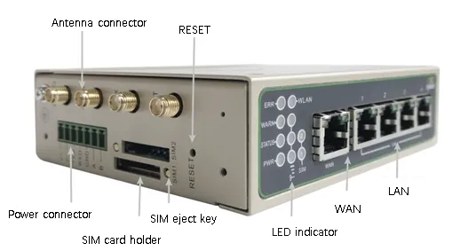
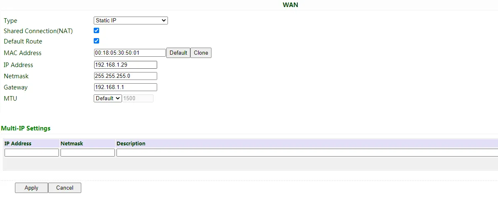
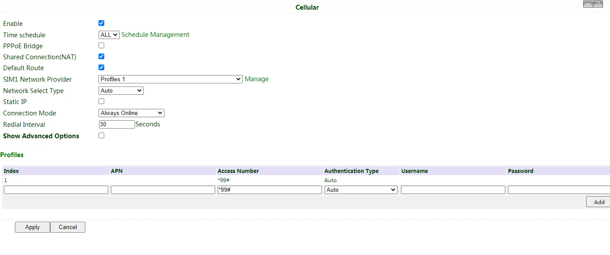
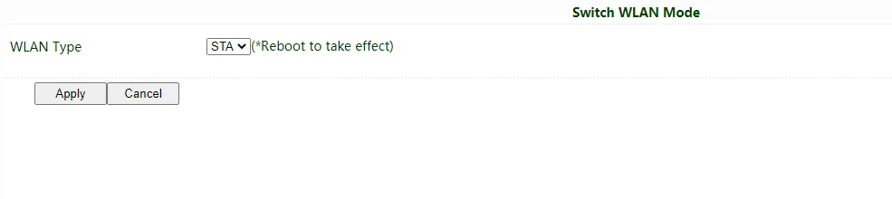
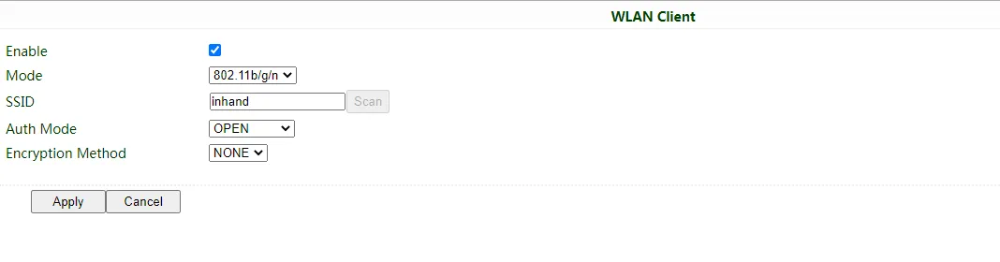

# Industrial Router IR615-S Quick Installation Guide

> **What you need to do first:** Unbox → Mount the device → Connect power and Ethernet → (If using cellular) **Power off** to install SIM and connect antennas → Power on → Set PC to same subnet → Open Web in browser.  
> **Then:** Scroll down to **Part 2** to check packing list, indicator meanings, mounting methods, antenna details, etc.

---

## Part 1: Quick Installation (Visual Step-by-Step)

### Must-Read Summary (Before Wiring and Powering On)

| Item | Requirement |
|------|-------------|
| Power supply | **12V DC** via the power terminal (optional **9~26V DC** adapter available); **POWER LED on** indicates power on. |
| SIM card | **Must power off** before inserting or removing; **no hot swapping**. |
| Cellular / Wi-Fi antenna | Tighten clockwise by the **metal connector** according to the housing silkscreen; do not twist by the black glue stick. |
| Environment | Operating temperature **-20℃ ~ 70℃**; keep away from heat sources, strong electromagnetic interference, and direct sunlight. |

---

### Step 1: Check the Panel and Interface Areas Against the Actual Device

Look at the device panel to confirm the location of each interface. The IR615-S provides a WAN/LAN1 port, a LAN port, 4G antenna connectors, Wi-Fi antenna connectors (if equipped), SIM card slots, and a power terminal.

> For detailed port locations and labels, see §2.2.

---

### Step 2: Mount the Device on a DIN Rail or Inside a Cabinet

Attach the included DIN-rail clip to the back of the device, then snap the device onto a standard 35mm DIN rail. For panel mounting, optional panel mount kits are available.

> For detailed DIN rail installation and removal steps, see §2.4.

---

### Step 3: Connect Power and Ethernet

1. Connect the power wires to the device's power terminal.
2. Connect the WAN/LAN1 port to the upstream network (e.g., modem or switch).
3. Connect your PC to the device's LAN port with an Ethernet cable.

> For Ethernet port details, see §2.5.1; for power supply details, see §2.5.2.

---

### Step 4: (If Using Cellular) Power Off to Install SIM and Connect Antennas

1. **Make sure the device is powered off.**
2. Push the eject pin into the hole on the left side of the SIM slot to eject the tray, place a micro SIM card in it, and push the tray back in.
3. Tighten the 4G antenna clockwise by the metal connector until it cannot turn further. If equipped, connect the Wi-Fi antennas in the same way.

> **Warning: Always power off the device before inserting or removing a SIM card to prevent data loss or damage.**  
> For antenna and SIM details, see §2.5.6.

---

### Step 5: Power On and Confirm the Device Is Ready

After powering on, check the LEDs:
- **POWER LED on** — Power is normal.
- **STATUS LED flashing** — The system is running.

> For a complete list of indicator meanings, see §2.3.

---

### Step 6: Log In via PC and Browser

1. Set your PC network adapter to **DHCP automatic IP** (recommended), or manually configure an IP in the **192.168.2.2 ~ 192.168.2.254** range, subnet mask **255.255.255.0**, gateway **192.168.2.1**.
2. Open a browser and go to **192.168.2.1**.
3. Enter the username and password in the pop-up window (see the product nameplate).
4. If the browser warns that the connection is not private, click **Advanced** → **Proceed**.

| Port Role | Default IP |
| :---: | :---: |
| WAN/LAN1 | 192.168.2.1 |

> For complete first-login and factory-reset instructions, see §2.7.

---

### Post-Installation Checklist

- ☐ The device is securely mounted (DIN rail or panel).
- ☐ Power and Ethernet cables are connected; if using cellular, the SIM and antennas are in place.
- ☐ **POWER LED is on** and **STATUS LED is flashing**.
- ☐ The browser can open the Web login page and log in successfully.

If you cannot log in, check your PC subnet settings. If you need to restore factory settings, refer to the hardware reset procedure in §2.7.

---

## Part 2: Detailed Information

### 2.1 Packing List

**Standard Accessories**

| No. | Name | Qty | Unit | Remarks |
|-----|------|-----|------|---------|
| 1 | IR615-S Router | 1 | pcs | — |
| 2 | Ethernet Cable | 1 | pcs | — |
| 3 | DIN-rail Clip | 1 | pcs | For DIN rail mounting |
| 4 | 4G Antenna | 1 | pcs | North America models have 2 antennas |
| 5 | Power Terminal | 1 | pcs | — |

**Optional Accessories**

| No. | Name | Qty | Unit | Remarks |
|-----|------|-----|------|---------|
| 1 | Power Adaptor | 1 | pcs | 9~26V DC |
| 2 | Wi-Fi Antenna | 2 | pcs | — |

---

### 2.2 Product Structure and Identification

The IR615-S is an industrial router that supports three ways of accessing the Internet: wired, cellular, and Wi-Fi. Please confirm the product model and packaging accessories before use, and purchase SIM cards from local network operators.

Panel introduction:

You can find the serial number in "Status >> System" on the Web management page, or on the nameplate at the back of the device.

---

### 2.3 Indicators and Reset Button

#### 2.3.1 POWER / STATUS / WARN / ERROR Indicators

| POWER | STATUS | WARN | ERROR | Meaning |
|-------|--------|------|-------|---------|
| On | Off | Off | Off | Power on |
| On | Flashing | On | Off | Dialing |
| On | Flashing | Off | Off | Dial success |
| On | Flashing | Flashing | Flashing | Upgrading |
| On | Flashing | On | Flashing | Reset successful |

#### 2.3.2 WLAN Indicator

| WLAN | Meaning |
|------|---------|
| On | WLAN enabled |
| Off | WLAN disabled |
| Flashing | Reset successful |

#### 2.3.3 SIM Indicators

| SIM1 | SIM2 | Meaning |
|------|------|---------|
| On | Off | SIM1 is in use |
| Off | On | SIM2 is in use |

#### 2.3.4 Reset Button

The RESET button is located on the device (see the diagram in §2.2). Press and hold the RESET button to restore the device to factory settings. For detailed steps, see §2.7.

---

### 2.4 Mechanical Installation

#### 2.4.1 DIN Rail: Installation

Attach the DIN-rail clip to the back of the device, then snap the device onto a standard 35mm DIN rail from above. A "click" sound indicates it is locked in place.

#### 2.4.2 DIN Rail: Removal

Use a screwdriver to push down the bottom of the clip to release the device from the rail, then pull the device outward.

---

### 2.5 Connections and Cabling

#### 2.5.1 Ethernet

The IR615-S provides one WAN/LAN1 port and one LAN port.

> Note: When the IR615-S does not access the Internet via cellular, please disable Cellular in "Network >> Cellular", otherwise the device will restart after trying to dial up and fail several times.

#### 2.5.2 Power Supply

The IR615-S is powered via the **power terminal** using **12V DC** (optional **9~26V DC** power adapter available). Please pay attention to the power voltage level to avoid over-voltage or under-voltage conditions.

#### 2.5.6 Cellular SIM and Antennas

**SIM Card**

The IR615-S supports dual micro-SIM cards. Push the eject pin into the hole on the left of the SIM card slot to eject it, then insert the SIM card.

> **Warning: When inserting or plugging out the SIM card, please unplug the power cable to prevent data loss or damage to the router.**

**Antenna Installation**

Rotate the metal interface clockwise until the movable part cannot be rotated. Do not hold the black glue stick to twist the antenna.

---

### 2.6 Power Supply and Environment

| Item | Specification |
|------|---------------|
| Input Voltage | 12V DC (power terminal); optional 9~26V DC adapter |
| Operating Temperature | -20℃ ~ 70℃ |
| Storage Temperature | -40℃ ~ 85℃ |
| Relative Humidity | 5%~95% (non-condensing) |

---

### 2.7 First Login and Factory Reset

#### Web Login

The steps are identical to "Step 6" in Part 1:

1. Enable the PC to obtain an IP address from DHCP automatically (recommended), or configure a fixed IP address in the same network segment as the router (192.168.2.2 ~ 192.168.2.254), subnet mask 255.255.255.0, default gateway 192.168.2.1. The DNS server should be 8.8.8.8 or the address of the ISP's DNS server.
2. Open a browser and access the default IP address 192.168.2.1.
3. Enter the username and password in the pop-up window (please check the product nameplate to obtain it).
4. If the browser alarms the connection is not private, show advanced, and proceed to access the address.

#### Creating a WAN Port

After logging in, create a WAN port in "Network >> WAN" in the left menu and configure the Internet access method:

- **Dynamic DHCP (recommended)**: Obtain IP address automatically.

  

- **Static IP**: Configure manually, then click Apply & Save.

  

- **ADSL Dialup**: Configure manually, then click Apply & Save.

  

After configuration, check connectivity in "Tools >> PING".

#### SIM Card Dial-up

If accessing the Internet via cellular:

1. **Power off** to insert the SIM card. Connect the 4G antenna to the router, and connect the PC to the router. Then power on.
2. Open a browser and access the router's WEB management page.
3. Click "Network >> Cellular", and set your profile. The device enables cellular by default; it will connect to the Internet within a few minutes. If the device cannot connect to the Internet, please disable and restart dial-up. (If you use a private network SIM card, you also need to configure the APN parameter.)

4. Check the dial-up status in "Status". If it shows "Connected" and there is an IP address and other dial-up parameters, the router has connected to the Internet by SIM card.

#### Wi-Fi Internet Access

1. Connect the Wi-Fi antenna, and connect the PC to the device. Access the router's WEB management page.
2. Set Wi-Fi mode: AP or STA.

   - **AP mode (default)**: The IR615-S acts as an access point to radiate wireless signals, and other terminal devices can connect to this device to access the Internet. Ensure that the IR615-S itself has already been connected to the Internet through wired or cellular. AP mode supports setting the SSID name and encryption authentication mode; terminal devices will need to input a password when connecting.

     

   - **STA mode**: The IR615-S connects to other AP Wi-Fi devices to access the Internet.
     1. Select WLAN Type to STA in "Network>>Switch WLAN Mode" and save. Then reboot the router.

        

     2. Click "Scan" to scan available APs in "Network>>WLAN Client", and click Connect to choose one of the APs.

        

     3. Configure Wi-Fi parameters and save. Then check the connection status in "Status".
     4. Configure WAN mode in "Network>>WAN(STA)", and set WAN parameters for Wi-Fi.

#### Restore to Factory Settings

**Web Method**

Log in to the WEB management page, click on the "System>> Config Management" menu in the navigation tree. Click the "Restore default configuration" button; the router will restore to default settings after reboot.

**Hardware Method**

To restore to default settings via the reset button, please perform the following steps:

1. Press the RESET button immediately after powering on the device.
2. The System indicator will blink after a few seconds, and after blinking for about half a minute, it will be steady on.
3. Release the RESET button; the System indicator will blink, then press the RESET button again.
4. When the System indicator blinks slowly, release the RESET button. The device has been restored to default settings and will start up normally later.

#### Connect to InHand Device Manager

Make sure that the router has already connected to the Internet. Click "Service>>Device Manager" to set the router to connect to DM. Enter the URL: iot.inhandnetworks.com.

Fill in your DM account in Registered Account, then click "Apply" to save the configuration.

If you don't have a DM account, please click "Sign up/Sign in" after selecting the server; you will be directed to the InHand Device Manager website to register an account.

Log in to your account in Device Manager, and add your device in "Gateways". Name your device and fill in the serial number from the device, then you can manage your router in DM.

---

### 2.8 Related Documents

| Need | Where to Go |
|------|-------------|
| Product introduction, detailed configuration and troubleshooting | *IR615-S User Manual* |
| Ordering and antenna models | *IR615-S Product Datasheet* |
| Software and announcements | [InHand Networks Official Website](https://www.inhandnetworks.com) |

---

### 2.9 Legal Information

All statements, information and recommendations in this manual do not constitute any expressed or implied warranty.
