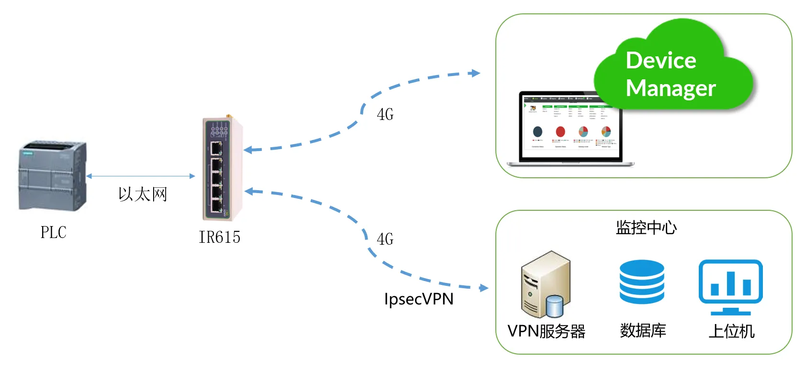

# Rural Drinking Water Remote Monitoring Solution

## 1. Solution Overview

### 1.1 Project Background

A water treatment equipment company is a technology-driven enterprise focused on the R&D, manufacturing, and servicing of high-end water treatment technologies and equipment. By applying advanced technologies such as artificial intelligence, the Internet of Things, and big data to the water supply industry, and building on a smart water management integrated control platform, the company introduces advanced treatment technologies such as ultrafiltration and nanofiltration systems. It develops and manufactures intelligent products that deeply integrate new high-end equipment with network-based informatization, creating a brand-new "water supply center" that fully applies intelligent, unattended operation and big data analytics to municipal drinking water treatment, wastewater treatment, booster pump stations, urban water supply, secondary water supply equipment, end-point water quality purification, rural safe drinking water, and quality-differentiated water supply.

In 2020, the company took the lead in implementing rural drinking water monitoring across 200 townships and more than 3,000 villages in Qiandongnan Prefecture, providing high-quality drinking water to local residents. Because the water supply stations are widely scattered and monitoring and video systems were not centrally managed, operations and maintenance personnel were unable to promptly grasp the chemical dosing processes, water purification processes, and safety conditions of all stations, posing certain safety risks. Therefore, it is imperative to build high-standard centralized water supply projects and leverage information technology to strengthen the informatized management of rural drinking water.

The IR615 industrial-grade router provided by InHand Networks offers a stable transmission channel for building informatized management. Data is encrypted and transmitted via IPsec VPN, ensuring information security. The InHand Networks DeviceManager cloud platform supports massive-scale device access, centrally manages communication equipment across the country, and monitors data traffic usage and signal status in real time, reducing losses caused by device disconnection failures.

### 1.2 Construction Objectives

- Enable automatic operation and remote monitoring of water supply station equipment
- Enable automatic water production and automatic forward wash / backwash of water purification equipment, with real-time monitoring of its operating status
- Enable centralized control of water supply stations to reduce management costs and improve management level and operational efficiency
- Enable online real-time monitoring of water volume, inlet water turbidity, outlet water residual chlorine, turbidity, and pH value
- Enable precise chemical dosing to ensure outlet water quality
- Enable security protection and video surveillance of critical parts of the project, with 24/7 uninterrupted remote monitoring
- Promote standardized and informatized management of water conservancy projects

### 1.3 Applicable Scenarios

- Remote monitoring of rural drinking water supply stations
- Municipal drinking water treatment
- Urban water supply and secondary water supply equipment
- End-point water quality purification and rural safe drinking water
- Booster pump station monitoring

## 2. Requirements Analysis

### 2.1 Equipment Status

- Equipment types: PLC controllers, variable frequency drives, sensing instruments, water purification equipment, water treatment equipment, controllers, etc.
- Communication interfaces: Ethernet, 4G LTE, LAN ports
- Communication protocol: IPsec VPN
- Deployment environment: rural water supply stations, widely scattered (200 townships, more than 3,000 villages)
- Scale: large-scale distribution, requiring access capability for tens of thousands of devices

### 2.2 Core Requirements

1. **Automated operation requirements**: Automate the water purification equipment at water supply stations to achieve automatic water production and automatic forward wash / backwash
2. **Remote monitoring requirements**: Upload the operating status of each water supply station to the central control room in real time for centralized control
3. **Water quality monitoring requirements**: Online real-time monitoring of water volume, inlet water turbidity, outlet water residual chlorine, turbidity, and pH value
4. **Intelligent chemical dosing requirements**: Adjust chemical dosing volumes based on real-time feedback of water quality and water volume data to achieve precise chemical dosing
5. **Video security requirements**: 24/7 uninterrupted remote video surveillance of critical security areas such as the water source area, raw-water pump house, clear water tank, and water supply stations
6. **Standardized management requirements**: Achieve standardized and informatized management of rural drinking water supply stations
7. **Data security requirements**: Encrypt and transmit data via VPN to ensure information security

## 3. Overall Architecture Design

This solution adopts an overall architecture of field automation equipment + communication equipment + monitoring center + DeviceManager cloud platform. The field water treatment equipment, controllers, and InHand Networks IR615 industrial-grade router form a local area network. The PLC controller connects to the IR615 via Ethernet. The InHand Networks IR615 router connects to the network over 4G and establishes an IPsec VPN tunnel with the monitoring center to transmit data to the monitoring center. The InHand Networks DeviceManager cloud platform supports massive-scale device access for centralized and unified management.

### 3.1 Four-Layer Architecture

1. **Perception layer**: Field automation equipment such as water treatment equipment, PLC controllers, variable frequency drives, sensing instruments, and water purification equipment
2. **Network layer**: InHand Networks IR615 industrial-grade router, supporting 4G LTE network and Wi-Fi, providing IPsec VPN encrypted transmission
3. **Platform layer**: Monitoring center and InHand Networks DeviceManager cloud platform, supporting massive-scale device access and unified management
4. **Application layer**: Central control room supervision platform, video surveillance system, data report analysis, and remote configuration and maintenance

### 3.2 Data Flow

Field water treatment equipment/sensors → PLC controller → IR615 industrial router (4G networking, IPsec VPN encryption) → monitoring center/cloud platform → central control room display/video surveillance/data reports

## 4. Network and Access Solution

### 4.1 Networking Method Selection

The 4G LTE wireless network access method is adopted. Leveraging 3G/4G wireless wide area network and Wi-Fi wireless local area network technologies, it provides uninterrupted multi-network access capability. Multiple link redundancy backup options are supported to ensure a stable connection between the devices and the monitoring center.

### 4.2 Edge Gateway Selection Key Points

**IR615 industrial-grade router features**:

- Supports 4G LTE network to ensure uninterrupted device network communication
- Supports LAN ports for easy device access and commissioning
- Supports IPsec VPN for easy access to the monitoring center via VPN, ensuring data security
- Supports network management, enabling centralized management of dispersed devices
- Supports retrieval of signal value, LAN port IP address, data traffic usage, and SIM card number
- Fully industrial design for long-term stable operation even in harsh environments
- Built-in software and hardware watchdog, resistant to disconnection
- Highly reliable multi-level link detection and self-recovery functions
- Multiple link redundancy backup functions
- Supports retrieval of LAN IP address, signal value, data traffic usage, etc. via API interface
- Easy to deploy and manage: multiple network access methods including Ethernet, 3G/4G, and Wi-Fi, flexibly selectable according to field conditions
- Professional and easy-to-use network configuration with a logically clear web configuration interface

## 5. Protocol and Data Acquisition Solution

### 5.1 Supported Protocols

- **Network protocols**: Ethernet, 3G/4G, Wi-Fi
- **Security protocol**: IPsec VPN encrypted transmission
- **Management protocol**: Supports network management protocols for centralized management of dispersed devices

### 5.2 Northbound Protocol Support

- Supports retrieval of device status information (LAN IP address, signal value, data traffic usage, etc.) via API interface
- Cloud platform access for data reporting and remote management

## 6. Solution Highlights Summary

1. **Highly reliable connection**: The IR615-S has a built-in software and hardware watchdog and is resistant to disconnection; highly reliable multi-level link detection and self-recovery functions, along with multiple link redundancy backup functions, ensure a stable connection between the devices and the monitoring center

2. **Data security assurance**: The IR615-S security protection covers multiple VPN encryption methods such as IPsec and network security protection measures, effectively protecting user business data from leakage or theft

3. **Easy to deploy and manage**: Multiple network access methods including Ethernet, 3G/4G, and Wi-Fi, flexibly selectable according to field conditions. Professional and easy-to-use network configuration includes a logically clear web configuration interface

4. **DeviceManager cloud platform advantages**:

   - Provides customers with a cloud platform for communication product management
   - Enables access for tens of thousands of devices with unified management
   - Real-time communication product status: signal value, firmware version, IP, product model, data traffic, and other information
   - Enables permission-based group management
   - Enables data reports, including online reports and traffic reports
   - Enables batch addition, deletion, configuration, and upgrades
   - Supports LAN IP viewing, SIM signal value viewing, SIM card number viewing, traffic statistics, and online fault diagnosis and analysis
   - Remote fault location and operation log diagnosis, traffic consumption management, device asset management, device preventive maintenance, big data mining, and other functions

5. **Fully industrial-grade design**: Long-term stable operation even in harsh environments, suitable for the complex deployment environment of rural water supply stations

6. **Standardization and informatization**: Promotes standardized management of water conservancy projects and achieves standardized and informatized management of rural drinking water supply stations
