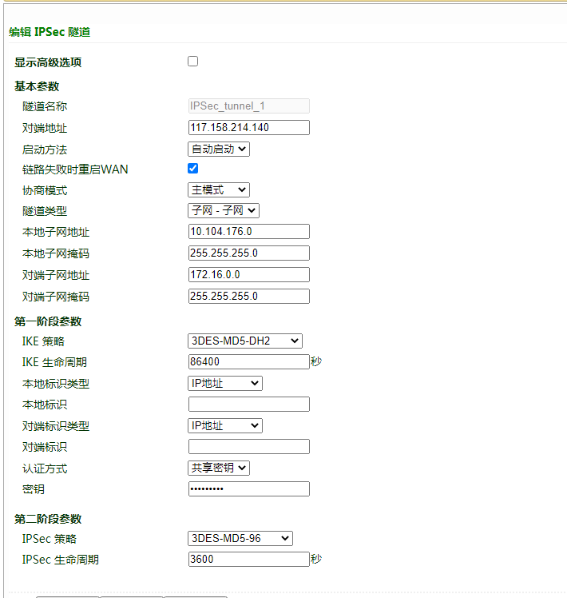

# IR615 IPsec VPN Configuration Guide

## 1. Document Information

- Document name: VPN Configuration Guide
- Product model: **IR615**
- Firmware version: **V1.0.95**
- Applicable scenarios: device networking, remote maintenance, IPsec VPN applications
- Date of preparation: March 25, 2026

## 2. Gateway Overview

### 2.1 Product Introduction

The InHand Networks IR615 series is a 4G industrial wireless router designed for industrial IoT scenarios, featuring three core characteristics: "stability, ease of use, and security." It is mainly used to solve the networking problems of industrial field equipment (such as PLCs, sensors, and self-service terminals), and is suitable for distributed unattended scenarios such as charging piles, vending machines, smart parcel lockers, and advertising media.

### 2.2 Main Functions

- 4G Internet access
- VPN tunnel encryption
- Remote configuration, remote diagnosis, remote upgrade
- Wide-temperature industrial-grade design

### 2.3 Typical Application Topology

Device → Ethernet → VPN client → 4G / Ethernet → VPN server → cloud platform

## 3. Hardware Description

### 3.1 Appearance and Interfaces

- Power interface: DC 9–36V
- Network ports: LAN ×4 + 1 WAN
- Wireless: 4G
- Indicators: PWR, RUN, COM, NET, signal strength
- Reset button: restore factory settings

### 3.2 Wiring Instructions

#### 3.2.1 Power Wiring

- Positive: V+
- Negative: V-
- Note: reverse-polarity protection, lightning protection, grounding

#### 3.2.2 Ethernet Wiring

Auto MDI/MDIX (straight-through / crossover auto-sensing); Cat5e or better cable recommended.

## 4. Factory Default Parameters

- Default IP: 10.164.176.1
- Subnet mask: 255.255.255.0
- Web username: **adm**
- Web password: 123456

## 5. Preparation

- Set the computer to an IP in the same subnet as the gateway
- Connect the computer to the gateway LAN port with a network cable
- Power on the router and wait for the RUN indicator to stay solid
- Enter the device IP in a browser to access the configuration page

## 6. Network Configuration

### 6.1 LAN Port Configuration (Static / DHCP)

- Go to [Network Settings] → [WAN]
- Select static IP / DHCP
- Set the IP, subnet mask, gateway, and DNS
- Save and apply

### 6.2 4G Wireless Network Configuration

- Insert a 4G SIM card
- Enable the mobile network
- APN: automatic
- Check signal strength

## 7. VPN Tunnel Configuration

**Pre-shared key:** HWzhsw123

## 8. Configuration Backup and Recovery

- Export configuration file
- Restore factory configuration

## 9. Status Monitoring and Diagnosis

### 9.1 Operating Status

- Device online status
- Network traffic, signal strength

### 9.2 Log Viewing

- System logs

## 10. Common Problems and Troubleshooting

- Unable to open the Web page
  - Check the subnet, network cable, and whether the IP conflicts
  - Reset the gateway and retry
- Device online but no data
  - Check the point addresses and data types
  - Check the collection logs
  - Check whether the device supports the protocol
  - Check whether the firewall / ports are open

## 10. Safety Precautions

- Reliable grounding at industrial sites
- Change the LAN port address to the gateway of the local subnet
- Back up after configuration is complete
- Change remote passwords regularly
- Prohibit operation by unauthorized personnel
