First and foremost, thank you for choosing our company's product. Before use, carefully read this user manual. Compliance with the following statements helps maintain intellectual property rights and legal compliance, ensuring that the user experience aligns with the latest product information. If there are any questions or if written permission is needed, contact the technical support team at any time.

- Copyright Statement

This user manual contains copyrighted content. The copyright belongs to Beijing InHand Networks Technology Co., Ltd. and its licensors. Without written permission, no organization or individual may excerpt, copy any part of the content of this manual, or distribute it in any form.

- Disclaimer

Due to ongoing updates in product technology and specifications, the company cannot guarantee that the information in the user manual is entirely consistent with the actual product. Therefore, the company does not accept any disputes arising from discrepancies between the actual technical parameters and the user manual. Any changes to the product will not be notified in advance. The company reserves the right to make final changes and interpretations.

- Copyright Information

The content of this user manual is protected by copyright law. The copyright belongs to Beijing InHand Networks Technology Co., Ltd. and its licensors. All rights reserved. Without written permission, no one may use, copy, or distribute the content of this manual.

## Graphical Interface Conventions

The following symbols are used throughout this manual.

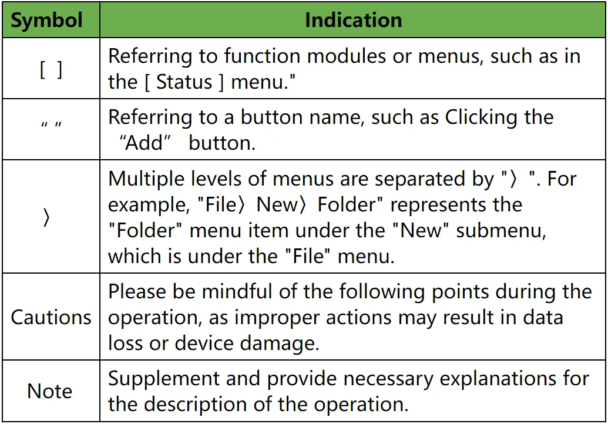

<strong>Figure 0-1 Graphical Interface Conventions</strong>

| Symbol | Meaning | Example |
|--------|---------|---------|
| `< >` | Indicates a variable or parameter to be replaced with an actual value | `<IP Address>` means enter a specific IP address |
| `" "` | Indicates a text label on the interface | Click the "Save" button |
| `→` | Indicates menu hierarchy or operation sequence | 【Network】→【Cellular】 |
| `【 】` | Indicates a menu or page name | Enter the 【System Settings】page |

## Technical Support

**Beijing InHand Networks Technology Co., Ltd. (Headquarters)**

Phone: 010-8417 0010

Address: 5th Floor, Building 3, No. 18 Ziyue Road, Chaoyang District, Beijing

**Chengdu Office**

Phone: 028-8679 8244

Address: 14th Floor, China Taiping Financial Tower, No. 1777 North Tianfu Avenue, Wuhou District, Chengdu, Sichuan

**Guangzhou Office**

Phone: 020-8562 9571

Address: Unit B-130, Yuanyang New Third Board Creative Park, No. 5 Tangdong East Road, Tianhe District, Guangzhou

**Wuhan Office**

Phone: 027-8716 3566

Address: Room 2001, Building 11, Paris Haoting, No. 2 Luoyu East Road, Hongshan District, Wuhan, Hubei

**Shanghai Office**

Phone: 021-5480 8501

Address: Room 1103, No. 18 Shunyi Road, Putuo District, Shanghai

## How to Use This Manual

### Choose Your Path

- First-time users: Read in sequence: "Device Overview" → "Installation and First Use" → "Common Scenario Configuration" → "Function Description and Parameter Reference"
- Existing device users: Directly refer to "Function Description and Parameter Reference" or "Appendix A Troubleshooting"
- Cloud platform management users: Refer to "Common Scenario Configuration" for device remote management platform content (if applicable)

### Quick Task Navigation

| Task | Corresponding Chapter | Estimated Time |
|------|----------------------|----------------|
| Install the device and power it on | [Installation and First Use](#chapter-2-installation-and-first-use) | About 10 minutes |
| Connect to the internet via cellular network | [Scenario 1: Cellular Networking](#scenario-1-cellular-networking) | About 5 minutes |
| Connect to the internet via wired network | [Scenario 2: Wired Networking](#scenario-2-wired-networking) | About 5 minutes |
| Connect to the internet via Wi-Fi STA | [Scenario 3: Wi-Fi STA Networking](#scenario-3-wi-fi-sta-networking) | About 5 minutes |
| Configure VPN | [4.6 VPN](#46-vpn) | About 15 minutes |
| Check device status and logs | [4.1 Dashboard](#41-dashboard) | About 5 minutes |
| Configure firewall rules | [4.7 Security](#47-security) | About 10 minutes |
| Troubleshoot network issues | [Appendix A Troubleshooting](#appendix-a-troubleshooting) | As needed |

# Chapter 1 Getting to Know the Device

## 1.1 Overview

The IR624 series is an industrial router product that integrates 4G/5G, Wi-Fi, virtual private network (VPN), and other technologies. It provides uninterrupted network access capabilities, comprehensive security features, and intelligent software services for various IoT industry applications, offering a secure and reliable business data link for enterprises to achieve digital networking.

The IR624 series is suitable for the networking of unattended devices and sites. It is embedded with watchdog and multi-layer link detection mechanisms to ensure reliable and stable communications. Combined with the InHand DeviceLive cloud platform, enterprise users can conduct unified cloud management centrally, monitor device status in real time, save deployment costs, and improve management efficiency, providing one-stop solutions for large-scale IoT deployment.

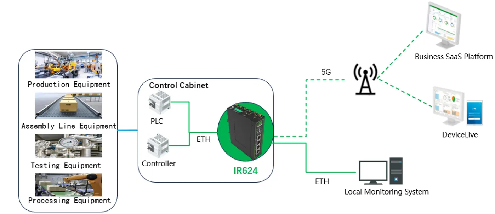

<strong>Figure 1-1 IR624 Device Overview</strong>

## 1.2 LED Indicators

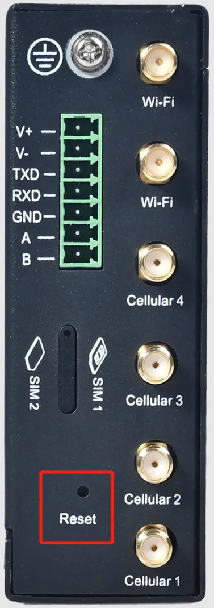

<strong>Figure 1-2 LED Indicators</strong>

| LED Indicator | Status | Meaning |
|--------------|--------|---------|
| SYS | Off | Power off |
| | Steady red | Device starting |
| | Blink red | System error |
| | Steady green | Working properly |
| | Blink red | Firmware updating |
| NET | Off | The WAN port is not connected |
| | Steady green | The WAN port is connected normally |
| | Blink green | Data transferring |
| Cellular | Steady green with one indicator | Poor cellular signal |
| | Steady green with two indicators | Medium cellular signal |
| | Steady green with three indicators | Good cellular signal |
| Wi-Fi 2.4G | Off | AP&STA is disabled |
| | Blink green | Working properly |
| | Steady green | Work as STA and AP is not associated |
| Wi-Fi 5G | Off | AP&STA is disabled |
| | Blink green | Working properly |
| | Steady green | Work as STA and AP is not associated |
| | Steady green | Other abnormalities |

## 1.3 Restore Factory Defaults

To reset to factory default settings using the Reset button:

1. Power on the device. As soon as the SYS indicator light goes out, press and hold the Reset button for 5 to 10 seconds, then release it promptly. The SYS indicator light will then start flashing.
2. While the SYS indicator light is flashing, press and hold the SYS indicator until the light stays on, and then release the button. At this time, the factory reset operation of the device is successful.

## 1.4 Default Settings

| No. | Function | Default Settings |
|-----|----------|-----------------|
| 1 | Cellular Dialing | Default dialing is set to "SIM1" |
| 2 | Wi-Fi | 1. Wi-Fi 2.4G access point enabled, SSID: Prefixed with "IR624-", followed by the last 6 digits of the wireless MAC address. 2. Wi-Fi 5G access point enabled, SSID: Prefixed with "IR624-5G-", followed by the last 6 digits of the wireless MAC address. 3. The authentication method is WPA2-PSK. 4. The password for both is the last 8 digits of the serial number. |
| 3 | Ethernet | 1. Enable all 3 LAN ports. 2. IP Address: 192.168.2.1 Subnet Mask: 255.255.255.0 3. DHCP server enabled, with an address pool from 192.168.2.2 to 192.168.2.100 for automatic IP address assignment to connected devices. |
| 4 | Network Access Control | Local HTTP and HTTPS are enabled with port numbers 80 and 443 respectively. Disable access from the cellular network. |
| 5 | Username/Password | The login credentials are printed on the nameplate at the bottom of the device |

# Chapter 2 Installation and First-Time Use

## 2.1 Pre-installation Preparation

Before installing the IR624, the following items must be prepared:

| Item | Quantity | Description |
|------|----------|-------------|
| IR624 router | 1 | Main device |
| Power adapter | 1 | Original power adapter included with the device |
| Antennas | 3+ | 4G/5G antennas and Wi-Fi antennas (quantity depends on model) |
| SIM card | 1 | Valid SIM card from a supported carrier (for cellular models) |
| Ethernet cable | 1+ | Standard RJ45 Ethernet cable |
| PC or laptop | 1 | For initial configuration and verification |

> **Note:** Use the original power adapter to avoid device damage caused by mismatched power adapters.

> **Note:** The device should not be placed in an environment with strong electromagnetic interference. Keep it at a safe distance from high-power equipment.

## 2.2 Installation Guide

### 2.2.1 Physical Installation

1. Install the 4G/5G and Wi-Fi antennas onto the corresponding antenna connectors on the device.
2. Insert the SIM card into the SIM card slot (for cellular models).
3. Connect the power cable to the device and power it on.
4. Connect an Ethernet cable from any LAN port on the IR624 to the PC.

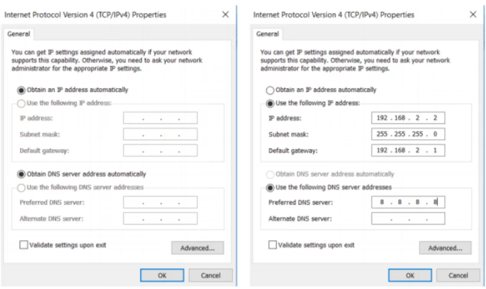

<strong>Figure 2-1 Environment Setup</strong>

### 2.2.2 PC Network Configuration

The device's LAN port has DHCP Server functionality enabled by default. Once the PC has automatically obtained an IP address, ensure that the PC and router are in the same address range.

If the PC fails to obtain an IP address automatically, configure it with a static IP address and the following parameters:

- IP Address: 192.168.2.x (Choose an available address within the range of 192.168.2.2 to 192.168.2.254)
- Subnet Mask: 255.255.255.0
- Default Gateway: 192.168.2.1
- DNS Servers: 8.8.8.8 (or the ISP's DNS server address)

### 2.2.3 Access the Web Management Interface

1. Enter the default device address 192.168.2.1 in the browser's address bar.
2. Enter the username and password (the login credentials are printed on the nameplate at the bottom of the device).
3. Access the device's web management interface. If the page shows a security warning, click the "Hide" or "Advanced" button and select "Proceed" to continue.

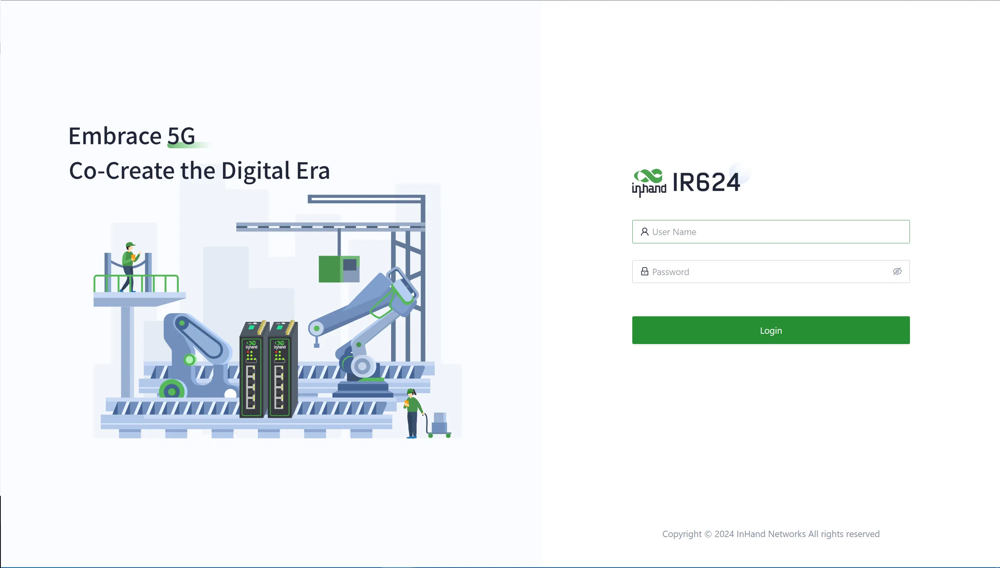

<strong>Figure 2-2 Web Login Interface</strong>

## 2.3 Quick Check

After installation, verify the following items:

- [ ] The SYS indicator light is steady green (device working properly).
- [ ] The PC has obtained an IP address in the 192.168.2.x range.
- [ ] The web management interface at 192.168.2.1 is accessible.
- [ ] The device can be logged in with the credentials from the nameplate.
- [ ] For cellular models: the SIM card is properly inserted and recognized.

# Chapter 3 Common Scenario Configurations

## Scenario 1: Cellular Networking

**Objective**: Access the internet via 4G/5G cellular network.

**Prerequisites**: SIM card inserted and antennas installed, device powered on.

**Estimated Time**: About 5 minutes.

**Operation Steps**:
1. Insert the SIM card and install the cellular antennas.
2. Power on the device. The IR624 router will automatically establish a dial-up connection and connect to the network.
3. To configure APN (Access Point Name, which can be understood as the "address" of the operator's network) parameters, navigate to 【Internet】→【Cellular】 and click the "Edit" button.

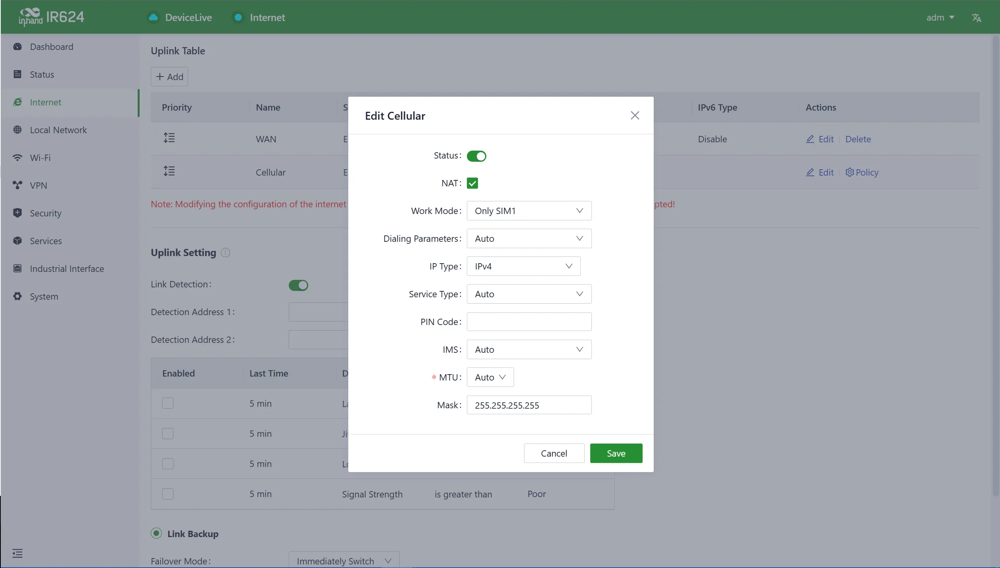

<strong>Figure 3-1 Cellular APN Configuration</strong>

4. Enter the APN parameters provided by the carrier and click "Save."
5. (Optional) To configure a traffic policy, navigate to 【Internet】→【Cellular】 and click the "Policy" button.

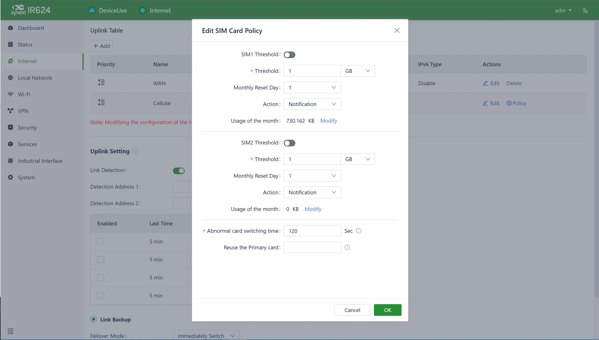

<strong>Figure 3-2 Cellular Traffic Policy</strong>

| Action | Description |
|--------|-------------|
| Notification | Generates an event when traffic reaches the threshold but does not stop forwarding regular business traffic |
| Cloud Management Only | Generates an event when traffic reaches the threshold, allowing only cloud-based management traffic while blocking regular business internet access |
| Switch the SIM Card | Generates an event when traffic reaches the threshold and switches to another SIM card for internet access |

**Verification Methods**:
1. Check the NET indicator light. A steady green light indicates the WAN port is connected normally.
2. Navigate to 【Status】→【Link Monitor】 to verify the cellular link status.

**Common Issues**:
- Unable to connect to cellular network: Verify the SIM card is properly inserted and the APN parameters are correct.
- Poor signal: Check antenna connections and adjust the device position.

**Cautions**:
1. In certain dedicated network scenarios, it may be necessary to manually disable the "Link Detection" function under the 【Internet】 menu to prevent cellular connectivity issues caused by unsuccessful detection.
2. In some cases, manual configuration of the subnet mask for the cellular interface may be required to ensure the proper functioning of the ARP (Address Resolution Protocol, which can be understood as a network "directory inquiry" service) feature.
3. When inserting or removing a SIM card, it is essential to disconnect the power to prevent data loss or damage to the device.

## Scenario 2: Wired Networking

**Objective**: Connect the IR624 to the internet via a wired Ethernet connection.

**Prerequisites**: An Ethernet cable is available, and the upstream network device is functioning properly.

**Estimated Time**: About 5 minutes.

**Operation Steps**:
1. Connect an Ethernet cable from the WAN port of the IR624 to the upstream network device (such as a modem or another router).
2. The device's WAN interface has DHCP service enabled by default. It will automatically obtain an IP address and establish an internet connection.

<strong>Figure 3-3 Wired Connection</strong>

3. To configure wired connection parameters, navigate to 【Internet】→【Uplink Table】, add or select the WAN interface, and click "Edit."

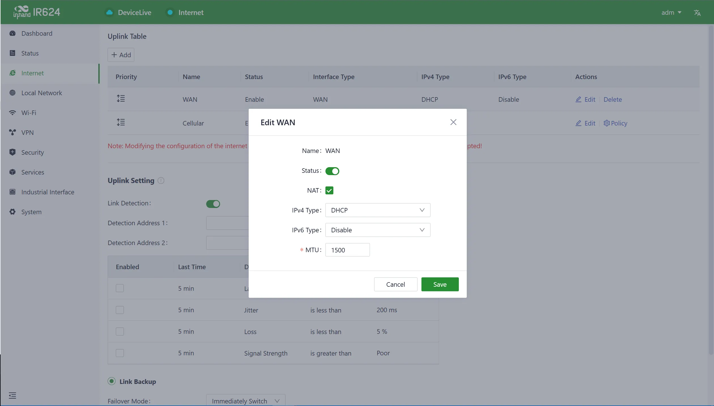

<strong>Figure 3-4 Wired Connection Configuration</strong>

4. Select the connection type:
   - **DHCP**: The default mode. The device automatically obtains an IP address from the upstream device.
   - **Static IP**: Manually configure an IP address, subnet mask, gateway, and DNS provided by the ISP or within the same network segment as the upstream device.

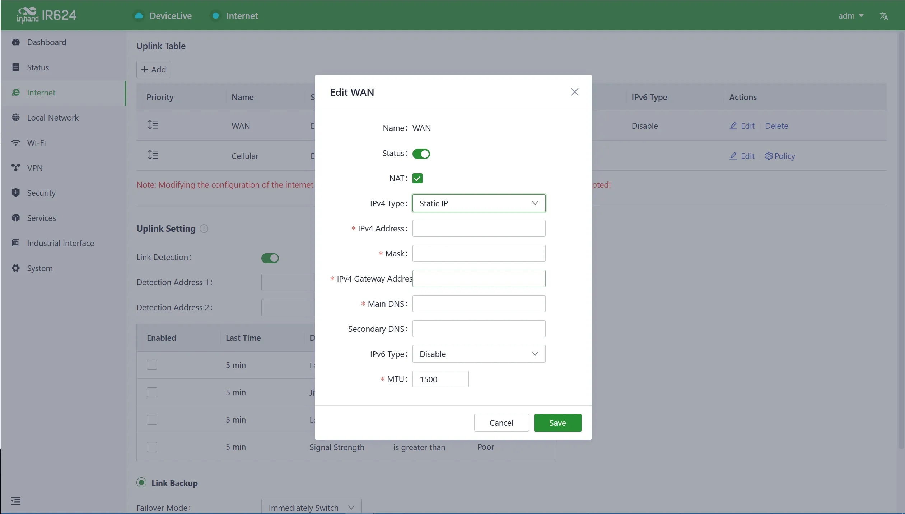

<strong>Figure 3-5 Static IP Configuration</strong>

   - **PPPoE**: Configure broadband dial-up with the username and password provided by the ISP.

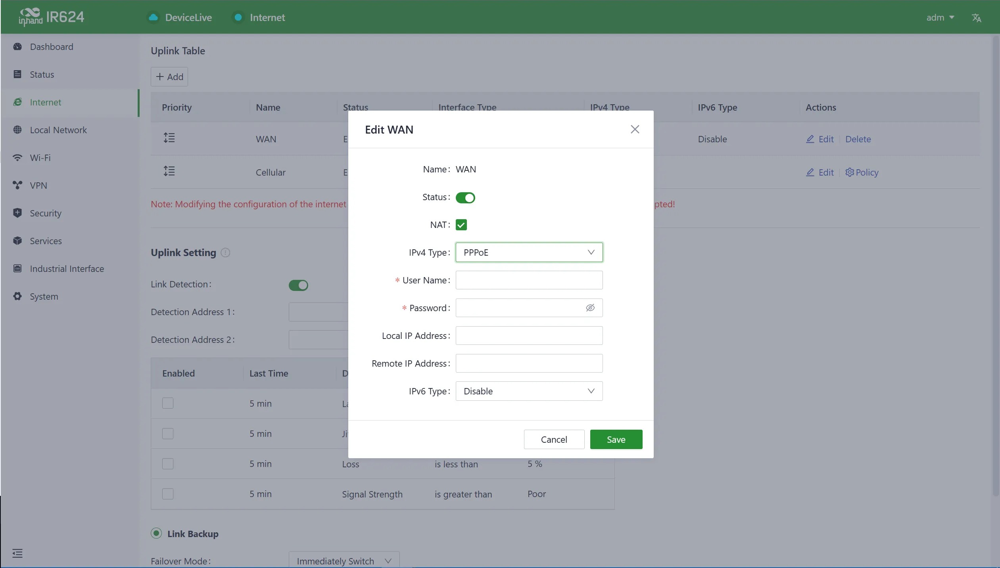

<strong>Figure 3-6 PPPoE Configuration</strong>

5. Click "Save" to apply the settings.

**Verification Methods**:
1. Check the NET indicator light. A steady green light indicates the WAN port is connected normally.
2. Navigate to 【Status】→【Link Monitor】 to verify the WAN link status.

**Common Issues**:
- Unable to obtain an IP address automatically: Verify the upstream device has DHCP enabled, or configure a static IP.
- PPPoE dial-up failure: Verify the username and password are correct.

## Scenario 3: Wi-Fi STA Networking

**Objective**: Connect the IR624 to an existing Wi-Fi network as a client (STA).

**Prerequisites**: The target Wi-Fi network (SSID) is within range, and the SSID name and password are known.

**Estimated Time**: About 5 minutes.

**Operation Steps**:
1. Navigate to 【Internet】→【Uplink Table】 and click the "Add" button.
2. Select "Wi-Fi (STA)" as the interface type.
3. Enter the SSID name and password of the target Wi-Fi network.

<strong>Figure 3-7 Wi-Fi STA Configuration</strong>

4. Click "Save" to establish the connection.

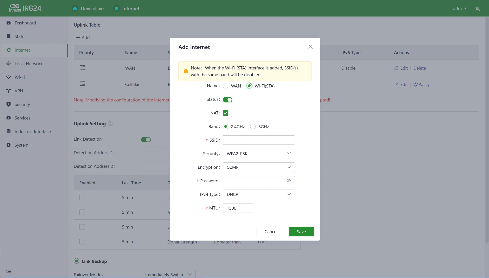

<strong>Figure 3-8 Wi-Fi STA Connection</strong>

**Verification Methods**:
1. Navigate to 【Status】→【Link Monitor】 to verify the Wi-Fi (STA) link status.
2. Access an internet website from a downstream device to confirm connectivity.

**Common Issues**:
- Unable to connect: Verify the SSID and password are correct, and the signal strength is adequate.
- Connection drops intermittently: Check for interference from other Wi-Fi networks or physical obstacles.

**Cautions**:
1. Upon adding Wi-Fi (STA), the IR624 will automatically disable SSIDs in the same frequency band within the Wi-Fi settings, and the status field for those SSIDs cannot be modified.
2. After removing Wi-Fi (STA), the "Status" field and SSIDs in the same frequency band within the Wi-Fi settings can be modified.
3. When Wi-Fi (STA) is deleted, all configuration associated with the Wi-Fi (STA) interface, including static routes, inbound/outbound rules, port forwarding, policy routing, and traffic shaping settings, will be removed.

# Chapter 4 Feature Descriptions and Parameter Reference

## 4.1 Dashboard

### 4.1.1 Device Information

In the 【Dashboard】 interface, basic device information is displayed at the top, including the device name, model, serial number, MAC address, online duration, and upstream interface address.

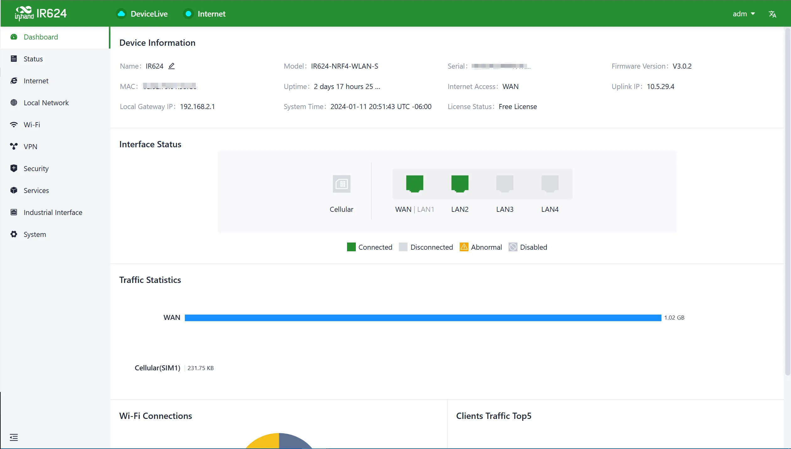

<strong>Figure 4-1 Dashboard Device Information</strong>

| Parameter | Description |
|-----------|-------------|
| Name | Identifies the device's name, initially set to "IR624" but can be customized |
| MAC Address | Identifies the device's physical MAC address |
| Local Gateway Address | The default gateway address of the device's subnet |
| Model | Specifies the device's specific model, which can help determine if it supports cellular and WLAN features |
| Uptime | Reflects the device's running time since it was powered on |
| System Time | Displays the device's time zone and system time |
| Serial | A unique code that serves as an identifier for the device and can be used for indexing or adding the device to a platform account |
| Internet Access | The upstream interface used by the device for internet connectivity |
| License Status | Information about the applied license on the device, distinguishing between Small Star Cloud Manager Basic and Small Star Cloud Manager Professional |
| Firmware Version | Shows the device's current software version |
| Uplink IP | The IP address of the upstream interface used for device internet connectivity |

### 4.1.2 Interface Status

In the **Dashboard > Interface Status** feature, the operational status of each interface can be visually inspected. By clicking the "Interface Icon," detailed information for each interface can be accessed in a pop-up box on the right-hand side of the interface.

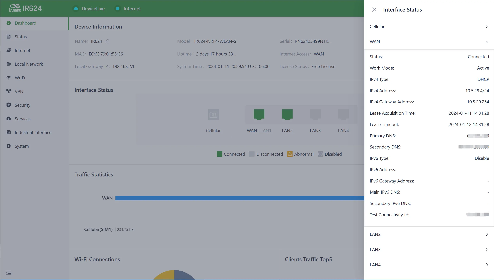

<strong>Figure 4-2 Interface Status</strong>

### 4.1.3 Traffic Statistics

The usage of traffic on each upstream interface since the router was powered on can be monitored through the **Dashboard > Traffic Statistics** feature. The data in traffic statistics will reset after the device is rebooted. If historical traffic records are needed, they can be accessed on the device's details page within InCloud Manager.

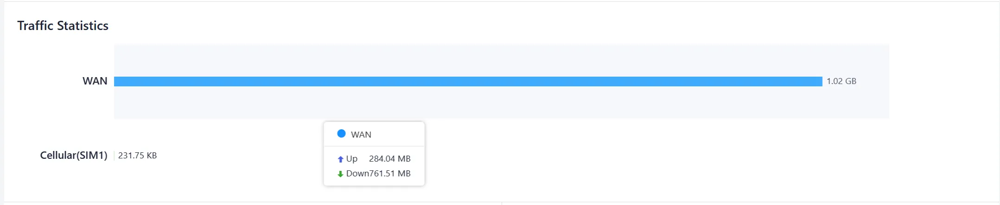

<strong>Figure 4-3 Traffic Statistics</strong>

### 4.1.4 Wi-Fi Connections

In the **Dashboard > Wi-Fi Client Count** feature, the number of active SSIDs on the IR624 and the number of connected clients under each SSID can be checked.

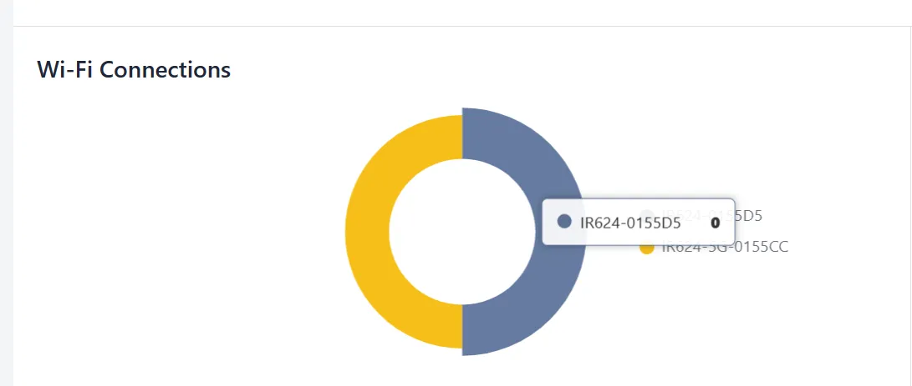

<strong>Figure 4-4 Wi-Fi Connections</strong>

### 4.1.5 Clients Traffic Top 5

In the **Dashboard > Top 5 Client Traffic** feature, the current ranking of client traffic usage for devices connected to the router can be viewed. It displays up to 5 records, and when a client disconnects, its statistical data will be cleared.

<strong>Figure 4-5 Clients Traffic Top 5</strong>

## 4.2 Status

Under the **Status** function, the device uplink status, operation logs, and events can be viewed to accurately grasp the device operation status.

### 4.2.1 Link Monitor

The **Status > Link Monitoring** feature displays the health status of each upstream link, along with information about throughput, latency, packet loss, and signal strength for each interface.

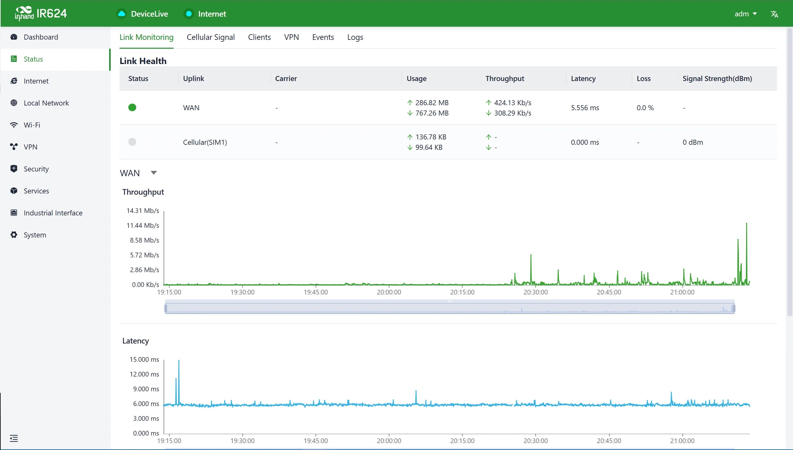

<strong>Figure 4-6 Link Monitoring</strong>

### 4.2.2 Cellular Signal

The **Status > Cellular Signal** feature displays the signal strength of SIM cards under the cellular interface, along with parameters such as RSSI, SINR, and RSRP.

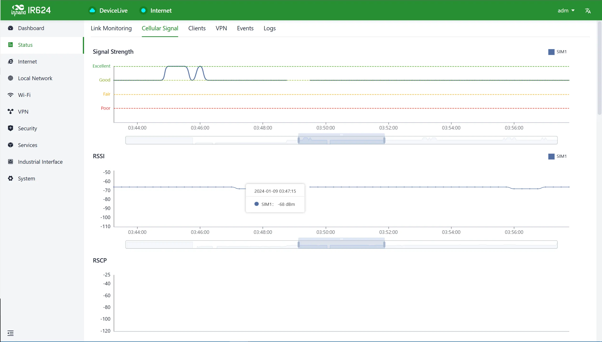

<strong>Figure 4-7 Cellular Signal</strong>

### 4.2.3 Clients

The **Status > Clients** feature displays detailed information about wired and wireless clients connected to the router, including names, addresses, MAC addresses, VLANs, connected subnets, traffic usage, and online duration.

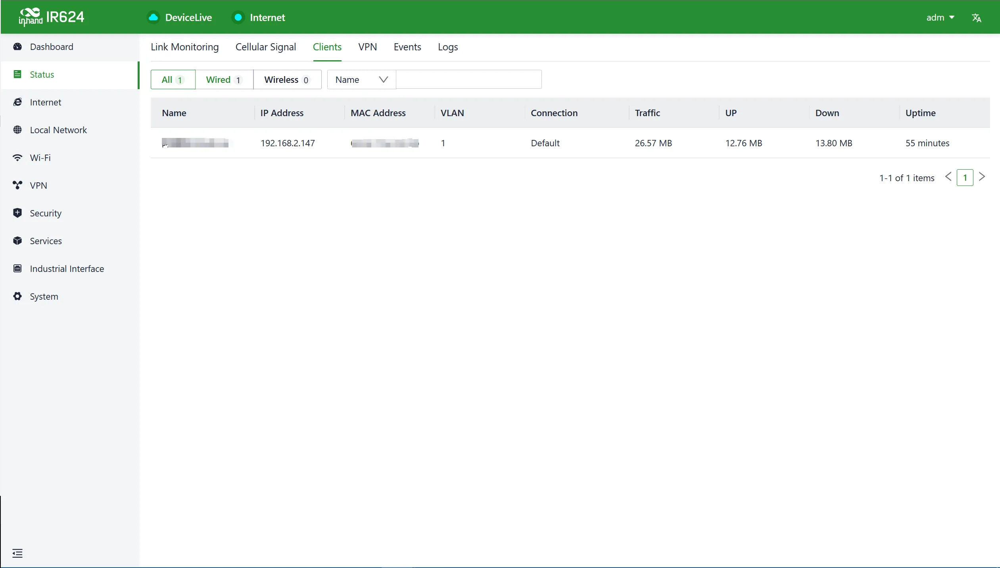

<strong>Figure 4-8 Clients</strong>

### 4.2.4 VPN

The **Status > VPN** feature displays information about IPsec VPN and L2TP VPN, including their status, traffic, and the duration of the most recent connection.

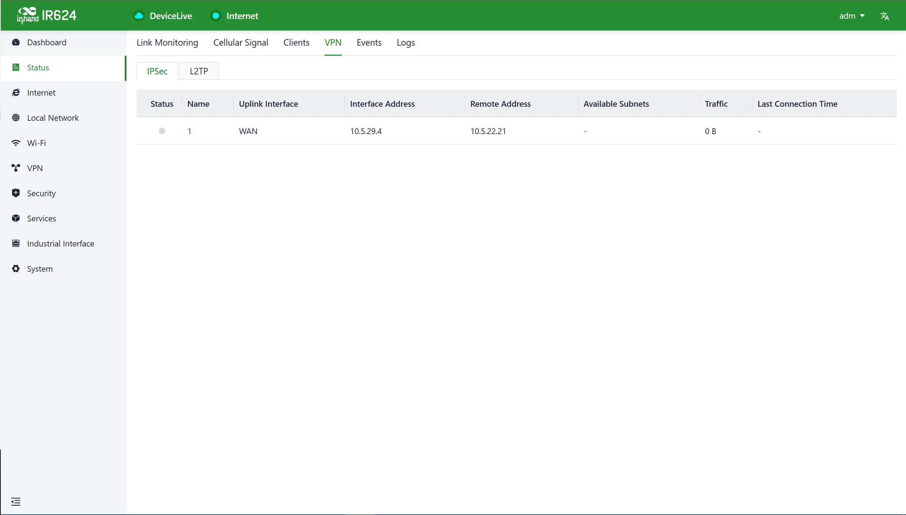

<strong>Figure 4-9 VPN Status</strong>

### 4.2.5 Events

The **Status > Events** feature displays event information related to the device's operation to help users understand the device's operational status.

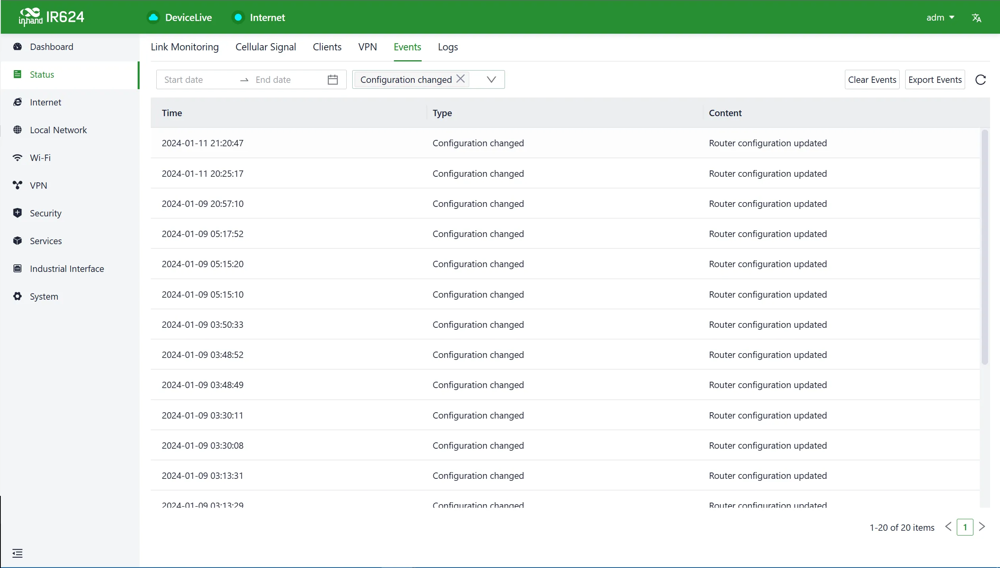

<strong>Figure 4-10 Events</strong>

Currently supported event types are as follows:

1. Successful/Failed User Logins
2. High CPU Utilization in the Last 5 Minutes
3. High Memory Utilization in the Last 5 Minutes
4. Cellular Traffic Reaches Threshold
5. VPN Status Changes
6. Uplink Status Changes
7. Uplink Switching
8. WAN2/LAN1 Switching
9. Reboot
10. Upgrade

### 4.2.6 Logs

The **Status > Logs** feature allows users to examine the system logs, which contain information about the device's operational history. When the device encounters issues, technical personnel can use these logs for troubleshooting and diagnosis.

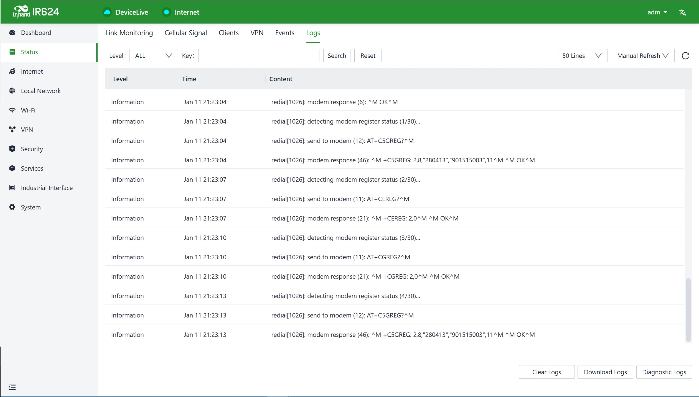

<strong>Figure 4-11 Logs</strong>

The log management functions are as follows:

1. **Download Logs**: Download the device's operational logs.
2. **Download Diagnostic Logs**: Download the device's diagnostic logs, which include system operation logs, device information, and device configurations.
3. **Clear Logs**: Clear the device's operational logs. This does not clear the device's diagnostic logs.

## 4.3 Internet

The Internet function is used to configure the parameters and operational modes of each upstream interface. The IR624 supports three access network modes: wired, cellular, and Wi-Fi. The device comes with two non-removable upstream links by default: WAN1 and Cellular. It can support up to four upstream links, including WAN1, Cellular, and Wi-Fi (STA). Wi-Fi (STA) interfaces need to be manually added and can be removed as needed.

### 4.3.1 Wired Connection

The parameters and operation modes for each upstream interface can be configured under the **Internet** function. The IR624 supports three access network modes: wired, cellular, and Wi-Fi. It can support up to three upstream links, including WAN, cellular, and Wi-Fi (STA).

The WAN and Wi-Fi (STA) interfaces need to be manually added and can be deleted as needed; the cellular upstream link cannot be deleted.

<strong>Figure 4-17 Wired Connection Configuration</strong>

**DHCP**: The device's WAN interface has DHCP service enabled by default. Simply connect the WAN interface to the internet using an Ethernet cable, and it will automatically establish an internet connection.

**Static IP**: Users have the option to manually configure an address either obtained from their internet service provider or one that is within the same network segment as their upstream device. Once the configuration is complete, the router will access the network via the specified static IP address.

<strong>Figure 4-18 Static IP Configuration</strong>

**PPPoE**: Users have the option to configure broadband dial-up. Once the configuration is complete, the router will establish an internet connection through the broadband dial-up.

<strong>Figure 4-19 PPPoE Configuration</strong>

### 4.3.2 Wireless Connection

The IR624 supports connecting as a client to an on-site AP's network. To do this, click the "Add" button, select "Wi-Fi (STA)," and fill in the required parameters, including the SSID name and password.

<strong>Figure 4-20 Wi-Fi STA Configuration</strong>

**Cautions:**
1. Upon adding Wi-Fi (STA), the IR624 will automatically disable SSIDs in the same frequency band within the Wi-Fi settings, and the status field for those SSIDs cannot be modified.
2. After removing Wi-Fi (STA), the "Status" field and SSIDs in the same frequency band within the Wi-Fi settings can be modified.
3. When Wi-Fi (STA) is deleted, all configuration associated with the Wi-Fi (STA) interface, including static routes, inbound/outbound rules, port forwarding, policy routing, and traffic shaping settings, will be removed.

### 4.3.3 5G/4G Connection

In the usual scenario, upon inserting the SIM card and connecting the antennas, the IR624 router will automatically establish a dial-up connection and connect to the network when powered on.

To configure APN (Access Point Name) parameters, select the "Cellular" interface in the 【Internet】 menu and click the "Edit" button to access the APN parameter configuration interface.

<strong>Figure 4-21 Cellular APN Configuration</strong>

The IR624 also includes a traffic policy feature. Once the policy is enabled, the SIM card will take specific actions when the traffic reaches a threshold. Traffic usage statistics will reset at the beginning of the next month.

Select the "Cellular" interface in the 【Internet】 menu and click the "Policy" button to access the SIM card's policy parameter configuration interface.

<strong>Figure 4-22 Cellular Traffic Policy</strong>

| Action | Description |
|--------|-------------|
| Notification | Generates an event when traffic reaches the threshold but does not stop forwarding regular business traffic |
| Cloud Management Only | Generates an event when traffic reaches the threshold, allowing only the forwarding of cloud-based management traffic while blocking access to the internet for regular business traffic |
| Switch the SIM Card | Generates an event when traffic reaches the threshold and switches to another SIM card for internet access |

**Cautions:**
1. In certain dedicated network scenarios, it may be necessary to manually disable the "Link Detection" function under the 【Internet】 menu to prevent cellular connectivity issues caused by unsuccessful detection.
2. In some cases, manual configuration of the subnet mask for the cellular interface may be required to ensure the proper functioning of the ARP feature.
3. When inserting or removing a SIM card, it is essential to disconnect the power to prevent data loss or damage to the device.

### 4.3.4 Uplink Table

The WAN and Wi-Fi (STA) interfaces can be added, edited, or removed in the **Internet > Uplink Table**. The priority of each interface can also be adjusted by dragging the "Priority" icon. Interfaces are arranged from top to bottom based on their priority, with higher priority interfaces taking precedence in determining the current upstream interface for device operation.

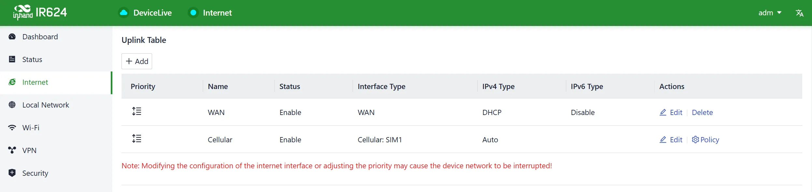

<strong>Figure 4-30 Uplink Table</strong>

### 4.3.5 Uplink Settings

Link detection settings and collaboration modes between different upstream interfaces can be configured through the **Internet > Upstream Link Settings** feature.

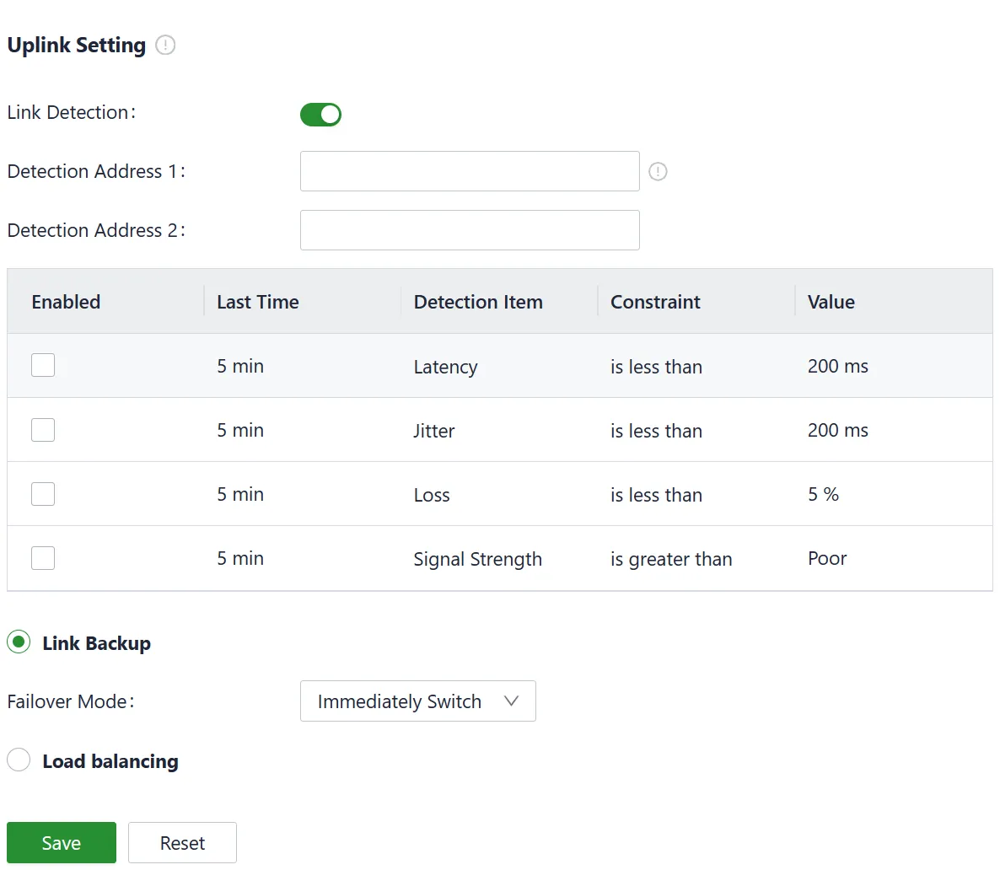

<strong>Figure 4-31 Uplink Settings</strong>

**Link Detection Switch:** The device has link detection functionality enabled by default. However, in certain specialized network environments where external communication is not possible, users may need to manually disable link detection. When link detection is turned off, latency, jitter, packet loss, signal strength, and other information for upstream interfaces will not be viewable in the 【Status】 menu.

**Notes:**
1. Modifying settings in the Internet menu can potentially lead to a disruption in device connectivity. Exercise caution when making changes.
2. When the link detection address is left empty, the default behavior is to detect the DNS address via the upstream interface. If a detection address is specified, all upstream interfaces will only detect the address provided.
3. In the router's link backup mode, users can customize detection parameters, and the device will switch links based on the enabled detection items. When detection items are not enabled, upstream link switching will only occur based on priority and link connectivity.
4. In the device's load balancing mode, all operational upstream links will forward business traffic, provided they are functioning correctly.

## 4.4 Local Network

The Local Network feature allows users to define local subnets, including the address range, VLAN ID, DHCP services, and other related parameters. After the configuration is complete, the settings must be applied to the device's LAN port through Interface Management or to the desired SSID in the Wi-Fi settings. This ensures that client devices can connect to the local network according to the planned network addresses.

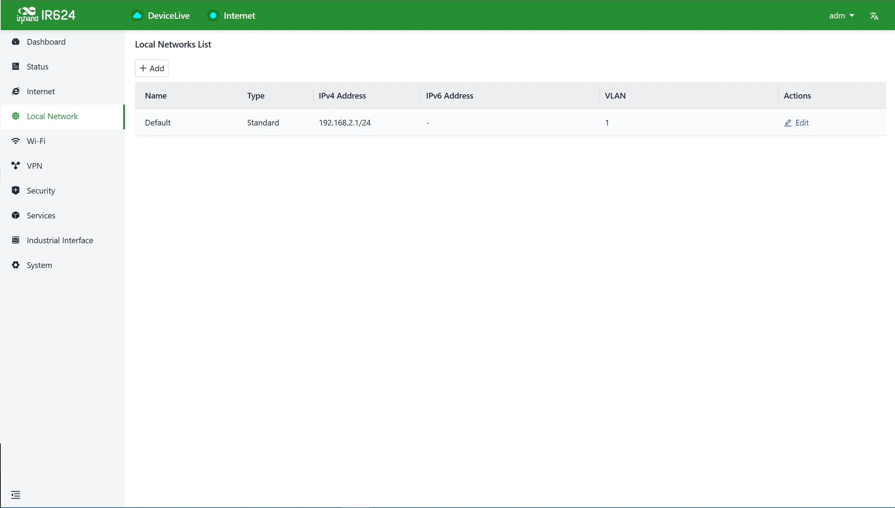

<strong>Figure 4-12 Local Network List</strong>

Click the "Add/Edit" button to add a new local network or edit an existing one.

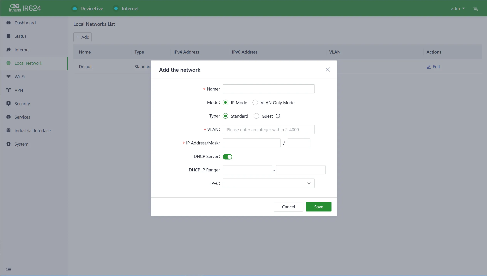

<strong>Figure 4-13 Local Network Add/Edit</strong>

### Parameter Description

| Parameter | Description |
|-----------|-------------|
| Name | Used to identify the network. Users can select this name to apply the network in both Wi-Fi and Interface Management. |
| Mode | Specifies whether the current subnet operates in Layer 2 transparent mode or Layer 3 IP mode. The default is "IP mode." |
| VLAN | Allows the local network to be divided into different virtual logical networks. The default VLAN for all interfaces and Wi-Fi is "default (VLAN1)." |
| IP Address/Subnet Mask | The gateway address for accessing the router through the LAN port or Wi-Fi. The default is "192.168.2.1." |
| DHCP Server | Clients connecting to the router can obtain IP addresses through this function. It is enabled by default, and the address range is generated based on the IP Address/Subnet Mask. |

### Notes

1. The default local network cannot be deleted. Only the IP address/subnet mask and DHCP server settings can be modified.
2. Once a local network is added, its mode cannot be changed.
3. The VLAN Only mode is designed for Layer 2 transparent operation and does not require configuration of IP address/subnet mask or DHCP server settings.

## 4.5 Wi-Fi

### 4.5.1 SSIDs

The IR624 functions as an Access Point (AP) to provide multiple SSID wireless network access. Different SSIDs can be configured for various purposes and configurations.

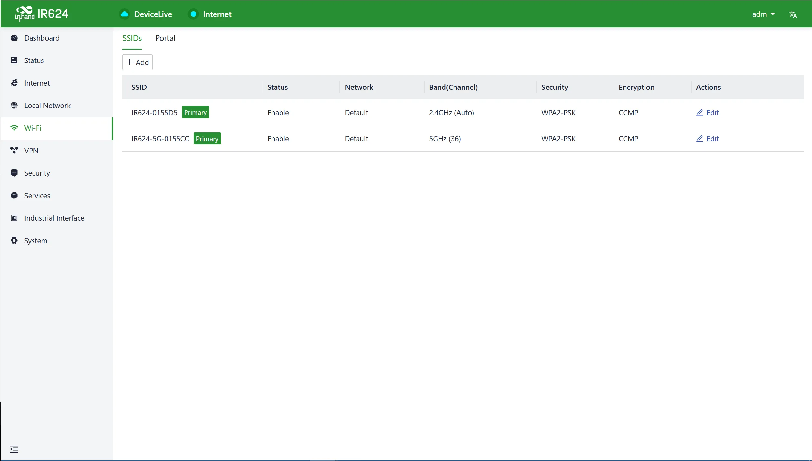

<strong>Figure 4-14 Wi-Fi List</strong>

To add a new SSID or edit an existing one, navigate to 【Wi-Fi】→【Wi-Fi List】 and click the "Add/Edit" button.

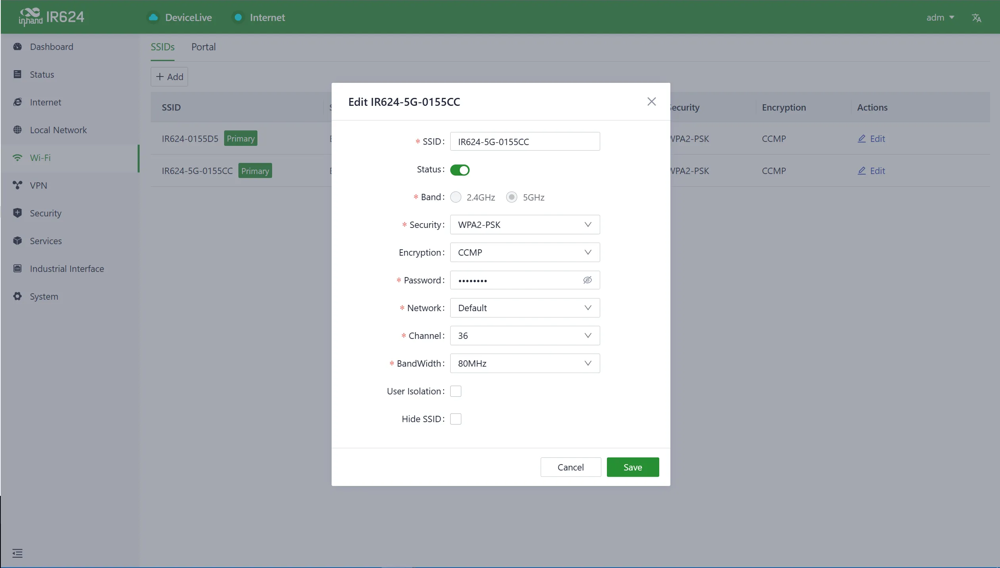

<strong>Figure 4-15 SSID Add/Edit</strong>

**Notes:**

1. The device is equipped with default 2.4GHz and 5GHz main SSIDs. The frequency bands of these main SSIDs cannot be modified, and the main SSIDs cannot be deleted.
2. Once an SSID is added, its frequency band cannot be changed. The added SSID automatically uses the same channel as its corresponding main SSID.
3. If a user creates a Wi-Fi (STA) interface in the 【Internet】 menu with the same frequency band as an existing SSID, that SSID cannot be enabled until the Wi-Fi (STA) interface is deleted.

### 4.5.2 Portal

In scenarios such as hotels and restaurants that provide time-limited Wi-Fi access for customers, the Wi-Fi portal function enhances wireless access security to a certain extent. Merchants can customize slogans and backgrounds on the authentication page for promotional purposes.

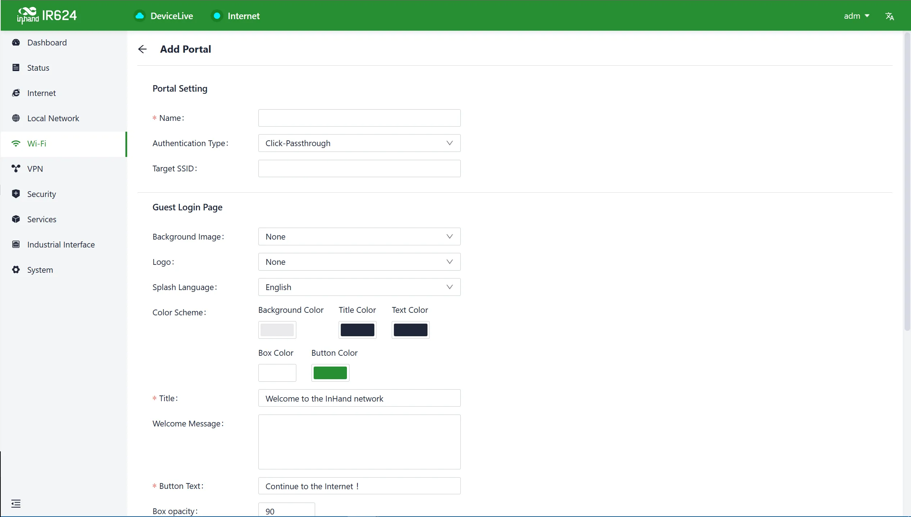

<strong>Figure 4-16 Wi-Fi Portal Configuration</strong>

## 4.6 VPN

In the **VPN** menu, users can configure IPSec VPN and L2TP VPN parameters to establish secure network connections.

### 4.6.1 IPSec VPN

IPSec (Internet Protocol Security) VPN is a protocol suite designed to enhance network communication security by encrypting and authenticating data transmission. It is widely used for establishing secure remote access, site-to-site connections, and virtual private networks. IPSec VPN ensures data protection and security through encryption and authentication methods.

To add a new IPSec VPN, navigate to **VPN > IPSec VPN** and click the "Add" button.

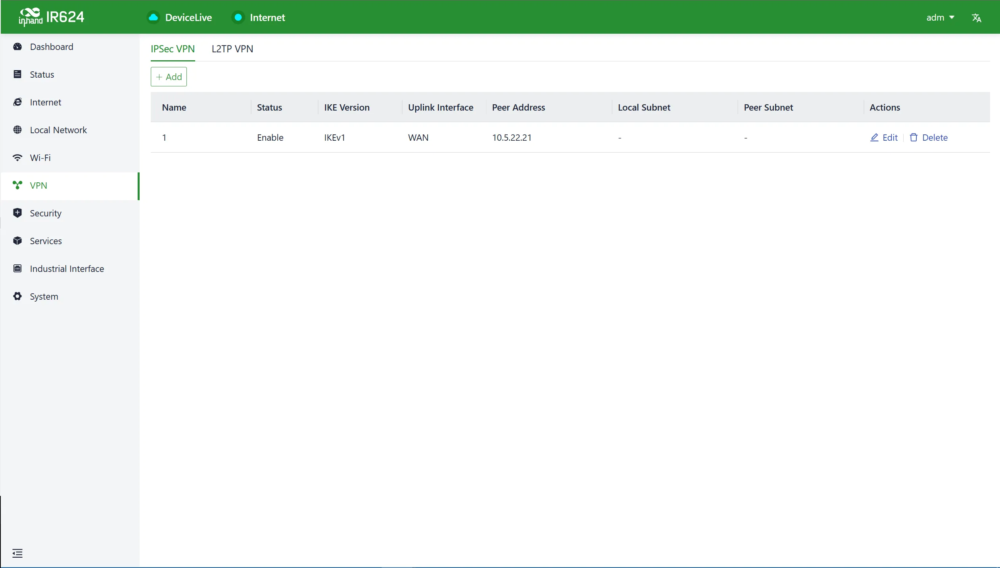

<strong>Figure 4-32 IPSec VPN List</strong>

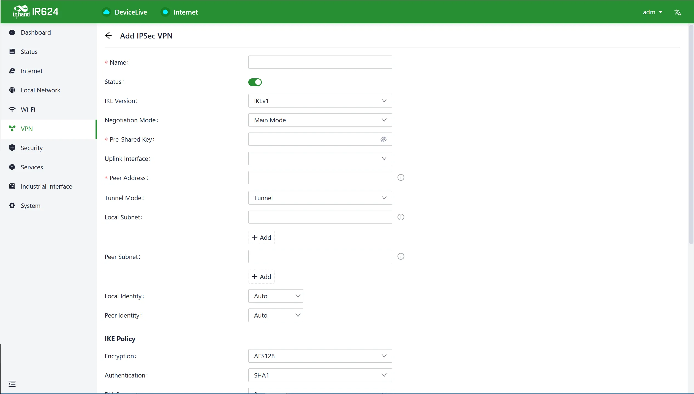

<strong>Figure 4-33 IPSec VPN Configuration</strong>

Once configurations are completed at both ends, the tunnel can be established. The tunnel establishment status can be checked in the **Status > VPN** menu.

The IPSec VPN parameters are described in the following table.

| Parameter | Description |
|-----------|-------------|
| Name | The user-assigned name for the IPSec VPN, used for local management and identification |
| IKE Version | The version of the Internet Key Exchange (IKE) protocol. Supports IKEv1 and IKEv2 |
| Pre-Shared Key | A secret shared key that must be configured identically on both devices for authentication during IKE negotiation |
| Internet Interface | The upstream interface used to establish the IPSec VPN locally |
| Tunnel Mode | The encapsulation mode for IPSec on IP packets. Supports tunnel mode and transport mode |
| Peer Address | The address of the remote endpoint with which the IR624 establishes the IPSec tunnel |
| Local Subnet | The subnet addresses that need to communicate through the IR624 IPSec VPN tunnel |
| Remote Subnet | The subnet address on the other end of the tunnel that needs to communicate through the IPSec VPN tunnel |

**IKE Policy Parameters:**

| Parameter | Description |
|-----------|-------------|
| Encryption Method | The encryption algorithm used by IKE. Options: DES, 3DES, AES128, AES192, AES256. Default: AES128 |
| Authentication Method | The authentication algorithm used by IKE. Options: MD5, SHA1, SHA2-256, SHA2-384, SHA2-512. Default: SHA1 |
| DH Group | The Diffie-Hellman exchange parameters used during IKE phase key negotiation. Options: 1, 2, 5, 14, 15, 16, 19, 20 |
| Timeout | The IKE SA (Security Association) lifetime, in seconds. Default: 86400 |

**IPSec Policy Parameters:**

| Parameter | Description |
|-----------|-------------|
| Security Protocol | The security protocol used by the ESP protocol |
| Encryption Method | The encryption algorithm used by the ESP protocol. Options: DES, 3DES, AES128, AES192, AES256. Default: AES128 |
| Authentication Method | The authentication algorithm used by the ESP protocol. Options: MD5, SHA1, SHA2-256, SHA2-384, SHA2-512. Default: SHA1 |
| PFS Group | An additional key exchange performed in Phase 2 to enhance communication security. Options: 1, 2, 5, 14, 15, 16, 19, 20 |
| Timeout | The IPSec SA lifetime, in seconds. Default: 86400 |

**Notes:**

1. The device with the public IP address acts as the server, and client devices connect to it using the server's public IP address.

### 4.6.2 L2TP VPN

The Layer 2 Tunneling Protocol (L2TP) is a Layer 2 VPN protocol designed to establish secure point-to-point or site-to-site virtual private network connections. It is commonly used for remote access and branch office connectivity, creating secure communication channels to protect the privacy and integrity of data transmission.

#### 4.6.2.1 Work as Client

The IR624 can act as an L2TP client and establish a tunnel with a remote L2TP server. To configure an L2TP client, navigate to **VPN > L2TP VPN > Client** and click the "Add" button.

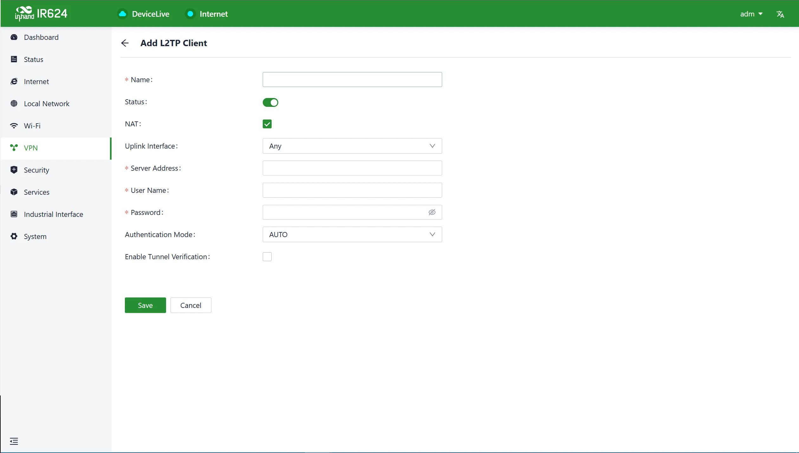

<strong>Figure 4-34 L2TP VPN Client Configuration</strong>

The L2TP client parameters are described in the following table.

| Parameter | Description |
|-----------|-------------|
| Name | The name of the L2TP client for local identification |
| Status | The switch to enable or disable the L2TP client tunnel |
| NAT | The switch for NAT functionality when forwarding with the L2TP client |
| Upstream Interface | The upstream interface used for communication between the L2TP client and the server |
| Server Address | The communication address of the remote L2TP server |
| Username/Password | Credentials that must be configured identically on both ends during L2TP negotiation |
| Authentication Mode | The L2TP authentication mode |
| Enable Tunnel Authentication | When enabled, both ends must configure identical usernames and passwords for tunnel authentication |

#### 4.6.2.2 Work as Server

A typical L2TP server is usually deployed at the headquarters of an enterprise, serving as a remote access server for mobile office or branch offices. To configure the L2TP server settings, navigate to **VPN > L2TP VPN > Server** to access the L2TP server editing page.

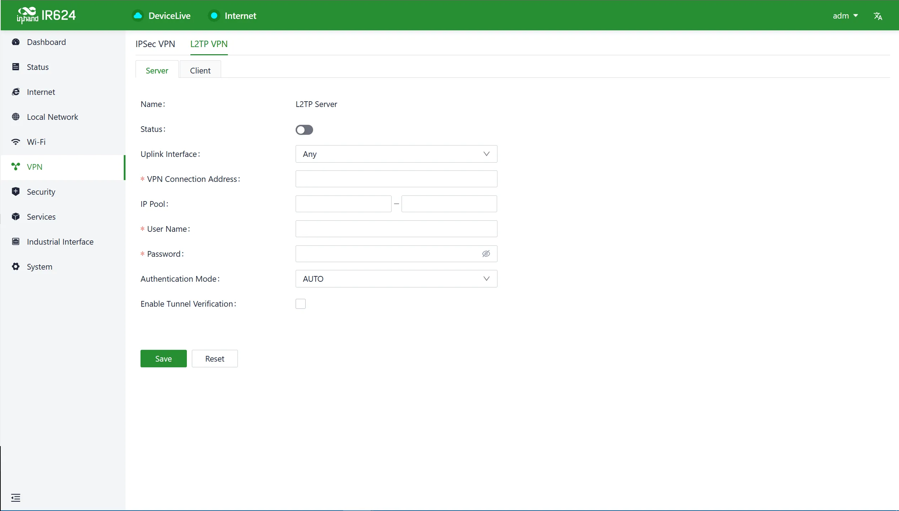

<strong>Figure 4-35 L2TP VPN Server Configuration</strong>

The L2TP server parameters are described in the following table.

| Parameter | Description |
|-----------|-------------|
| Name | The name of the L2TP server. Not editable |
| Status | The on/off switch for the L2TP server function. Default: off |
| Upstream Interface | The upstream interface used by the L2TP server |
| VPN Communication Address | The gateway address for L2TP clients, which can be assigned to devices within the IP address pool |
| Address Pool | The IP address pool used for communication when L2TP clients connect |
| Username/Password | Credentials that must be identical on both ends for L2TP negotiation |
| Authentication Mode | The L2TP authentication mode |
| Enable Tunnel Verification Function | When enabled, the usernames and passwords for tunnel verification on both ends must be identical |

## 4.7 Security

In the **Security** menu, users can configure advanced features related to firewalls, policy routing, and traffic shaping.

### 4.7.1 Firewall

The firewall includes functions such as inbound rules, outbound rules, port forwarding, MAC address filtering, and more.

#### 4.7.1.1 Inbound/Outbound Rules

Traffic in/out control can be implemented based on interfaces through the **Security > Firewall > Outbound Rules/Inbound Rules** feature. For example, if a user is subjected to a significant amount of attacks from a specific source IP address, inbound firewall rules can be used to restrict traffic from that IP address.

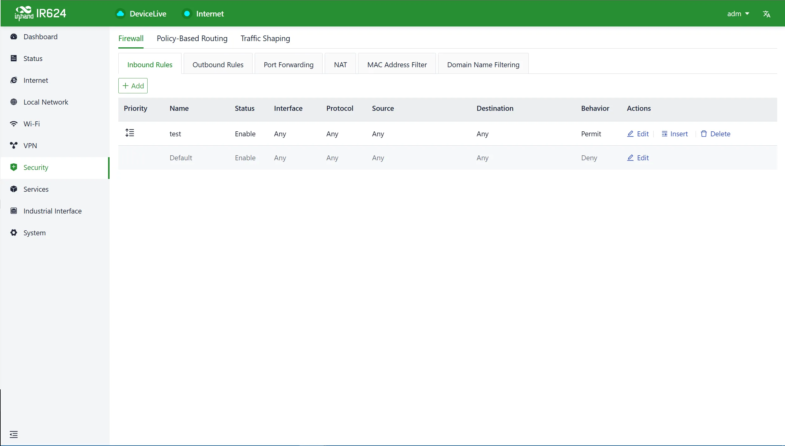

<strong>Figure 4-23 Inbound/Outbound Rules Configuration</strong>

Furthermore, IT personnel can utilize outbound firewall rules to restrict certain users' access to external networks. Inbound and outbound rules share the same configurable content, with the only distinction being the default rules.

The parameters for inbound/outbound rules are described in the following table.

| Parameter | Description |
|-----------|-------------|
| Name | The name of the inbound/outbound rule for local identification. |
| Status | Rule function switch. |
| Interface | For outbound rules, it specifies the upstream interface where traffic leaves the router. For inbound rules, it specifies the upstream interface where traffic enters the router. |
| Protocol | Match traffic based on the protocol type, with options like Any, TCP, UDP, ICMP, or custom. |
| Source | Match the source address for traffic, supporting custom, with the default as Any. |
| Destination | Match the destination address for traffic, supporting custom, with the default as Any. |
| Action | Action taken for matching traffic in inbound/outbound rules, supporting allow and deny. |
| Inbound Rules | Traffic management rules for external network accessing the router, with the default as deny all. |
| Outbound Rules | Traffic management rules for traffic going out through the router, with the default allowing all. |

Users can adjust the priority of inbound and outbound rules.

#### 4.7.1.2 Port Forwarding

Port forwarding, also known as port mapping or port redirection, is used to redirect network packets from one network port (or address) to another network port or address. Users can configure port forwarding rules under **Security > Firewall > Port Forwarding**. When external traffic accesses a specific port on the router, the device forwards the data to the corresponding port of an internal client, enabling external access to services inside the router.

For example, when a user needs to access the service on port 1024 of the internal client at 192.168.2.10 from the external network, this client's port can be mapped to port 1024 under the WAN1 interface. External users only need to enter `https://WAN address:1024` in their browser to access the target device's data, where the "WAN address" is the IP address of the WAN interface.

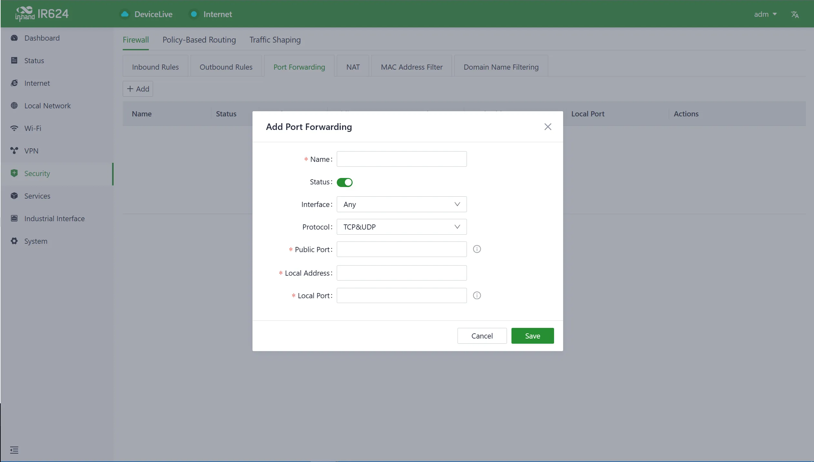

<strong>Figure 4-24 Port Forwarding Configuration</strong>

The parameters for port forwarding rules are described in the following table.

| Parameter | Description |
|-----------|-------------|
| Name | The name of the port forwarding rule, used for local identification. |
| Status | The on/off switch for the port forwarding rule. |
| Interface | The upstream interface that provides mapping functionality for internal clients. The upstream interface needs public IP address support. |
| Protocol | The protocol type of the traffic for port mapping, supports TCP, UDP, and TCP & UDP. |
| Public Port | The port number on the upstream interface that provides mapping. |
| Local Address | The address of the target device located under the router that the external network needs to access. |
| Local Port | The port of the target device that the external network needs to access. It needs to be consistent with the public port input range. |

#### 4.7.1.3 MAC Address Filter

MAC address filtering involves allowing or disallowing devices in a MAC address list to access the internet, which means controlling LAN devices' internet access requests through MAC address filtering on the router. Users can configure MAC address filtering rules in **Security > Firewall > MAC Address Filtering**.

Multiple MAC addresses can be created in the list, address descriptions can be added, and the list can be set to allow only the MAC addresses to access the network (whitelist), or block MAC addresses in the list from accessing the network (blacklist).

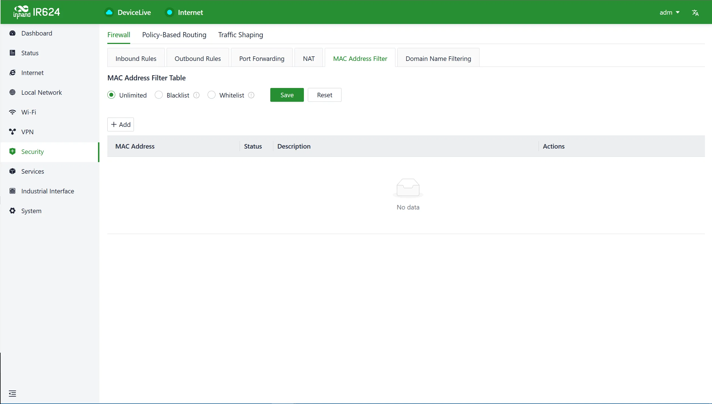

<strong>Figure 4-25 MAC Address Filtering Configuration</strong>

#### 4.7.1.4 NAT

NAT (Network Address Translation) is a technology used to use a private address in a local network and switch to a global IP address when connecting to the Internet. Users can set source or destination address translation as needed in **Security > Firewall > NAT**.

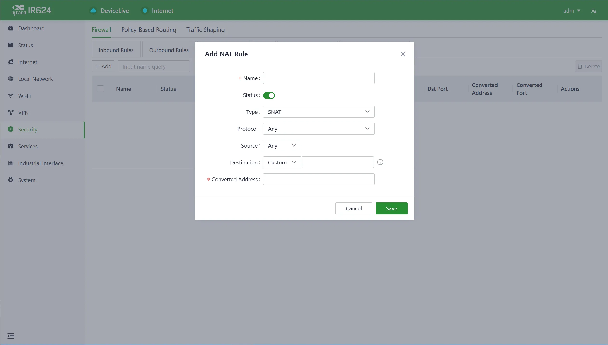

<strong>Figure 4-26 NAT Configuration</strong>

The parameters for NAT rules are described in the following table.

| Parameter | Description |
|-----------|-------------|
| Name | The user sets a name for the rule. |
| Type | The type of this rule. |
| Protocol | The scope of the rule. |
| Source | The source IP address that needs to be translated. |
| Destination | The destination IP address that needs to be translated. |
| Converted Address | Translated address. |

The Type parameter supports the following options:

| Type | Description |
|------|-------------|
| SNAT | Translate the source IP address. |
| DNAT | Translate the destination IP address. |

The Protocol parameter supports the following options:

| Protocol | Description |
|----------|-------------|
| Any | This rule is effective for all protocols. |
| TCP | This rule takes effect only for TCP protocol. |
| UDP | This rule takes effect only for UDP protocol. |
| TCP&UDP | This rule takes effect only for TCP and UDP protocols. |

#### 4.7.1.5 Domain Name Filtering

Domain name filtering allows or disallows (whitelist/blacklist) the domain names that can be accessed by clients as needed.

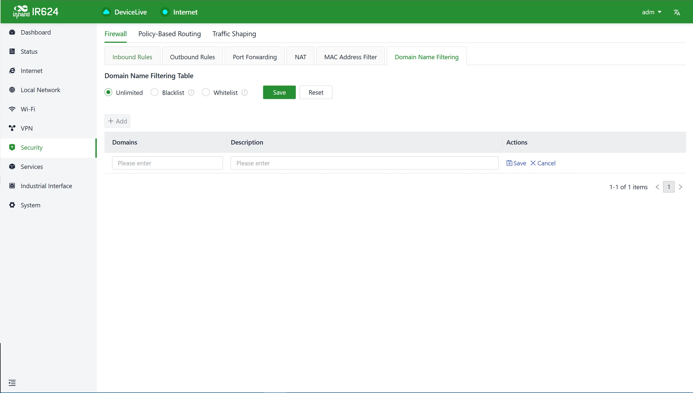

<strong>Figure 4-27 Domain Name Filtering Configuration</strong>

### 4.7.2 Policy-Based Routing

Policy routing is a feature that allows users to create policies based on their specific needs, enabling them to route different data flows through different links. This improves the flexibility and control of routing decisions, enhances link utilization efficiency, and reduces enterprise costs. Click the **Add** button under **Security > Policy Routing** to create a new policy routing rule.

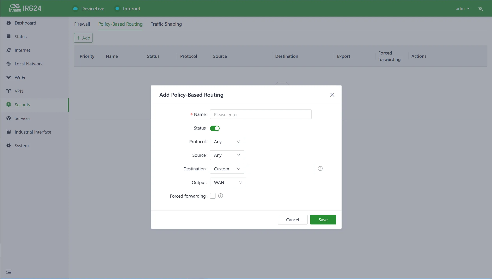

<strong>Figure 4-28 Policy-Based Routing Configuration</strong>

> **Note:**
> The source address and destination address in a policy routing rule cannot both be set as "Any."

### 4.7.3 Traffic Shaping

Traffic shaping is used to optimize the network based on each protocol, giving users control and prioritizing critical business traffic. This feature can also reduce the bandwidth allocated to entertainment traffic. Traffic shaping rules can be configured in **Security > Traffic Shaping > Add/Edit**.

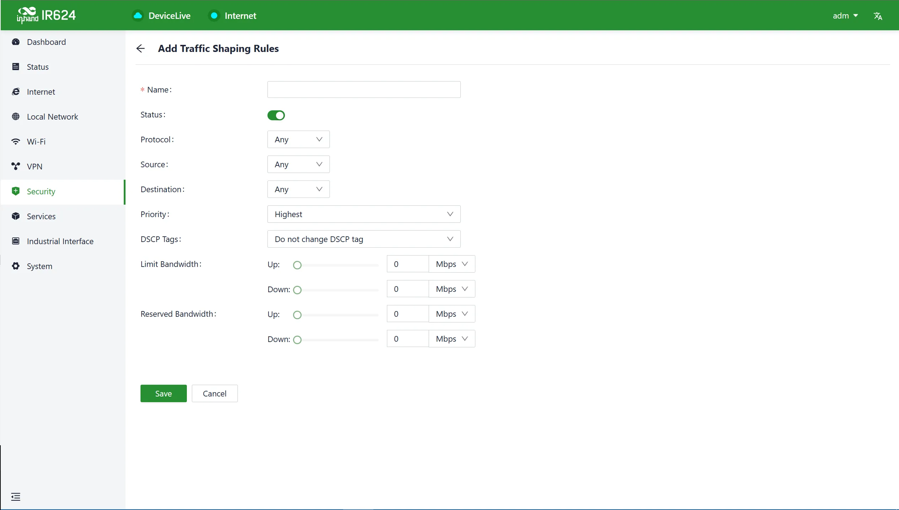

<strong>Figure 4-29 Traffic Shaping Configuration</strong>

Traffic shaping policies consist of a series of rules executed sequentially, similar to custom firewall rules. Each rule comprises two main components: the type of traffic to restrict or adjust and how to limit or adjust that traffic.

> **Notes:**
> 1. Traffic forwarding priority for unmatched rules is medium.
> 2. When Limit Bandwidth is set to 0, the system will not limit the bandwidth.
> 3. The value of Reserved Bandwidth should not be greater than the Limit Bandwidth.

## 4.8 Service

In the **Service** menu, users can configure interface management, DHCP server, DNS server, fixed address allocation, static routing, and dynamic DNS functions.

### 4.8.1 Interface Management

The local networks allowed through a specific interface and the interface speed can be configured in the **Service > Interface Management** function.

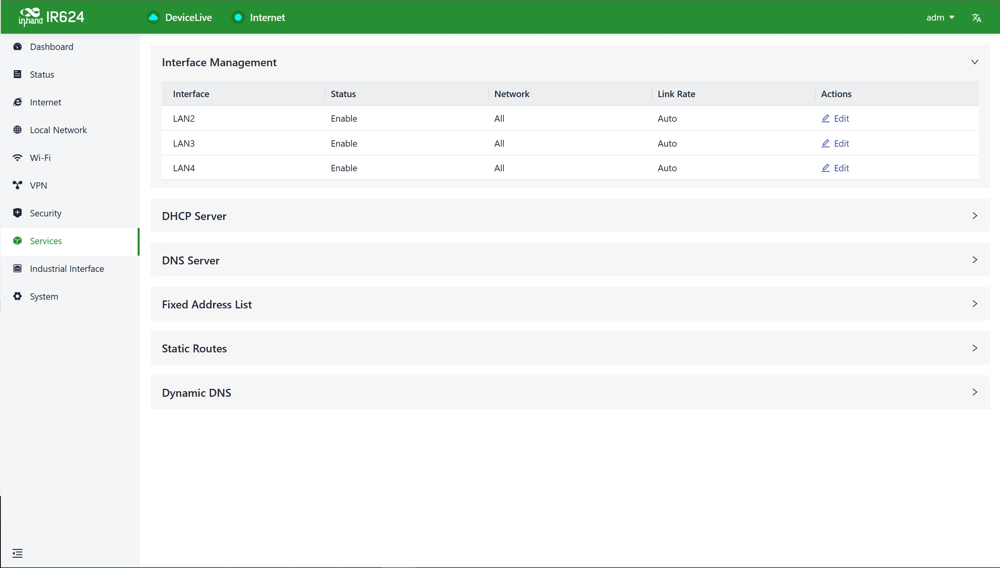

<strong>Figure 4-36 Interface Management List</strong>

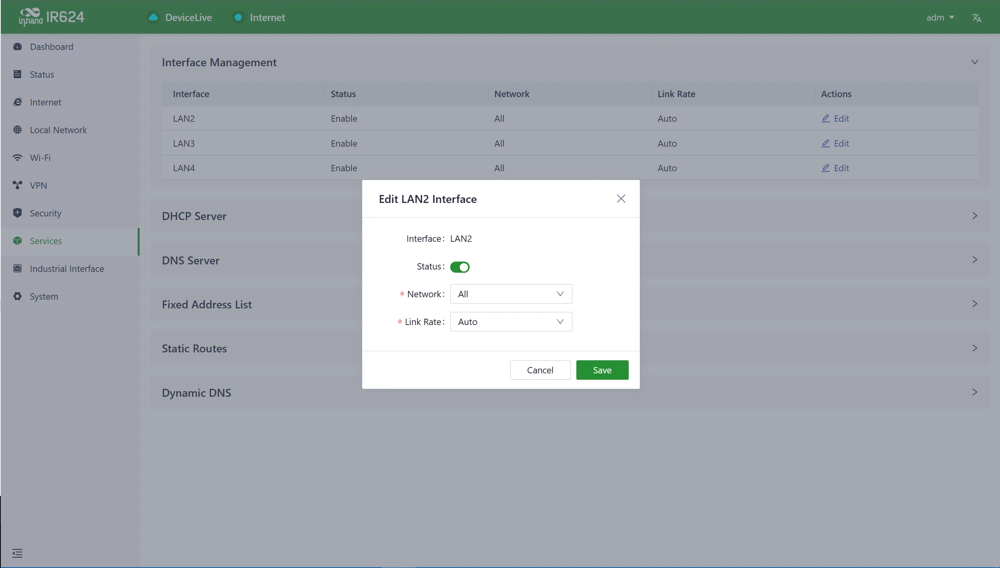

<strong>Figure 4-37 Interface Management Configuration</strong>

### 4.8.2 DHCP Server

The DHCP (Dynamic Host Configuration Protocol) service operates in a client/server communication mode, where clients request IP addresses from servers, and servers respond by assigning IP addresses dynamically to clients. The DHCP server's IP address pool can be configured using the **Service > DHCP Server** feature.

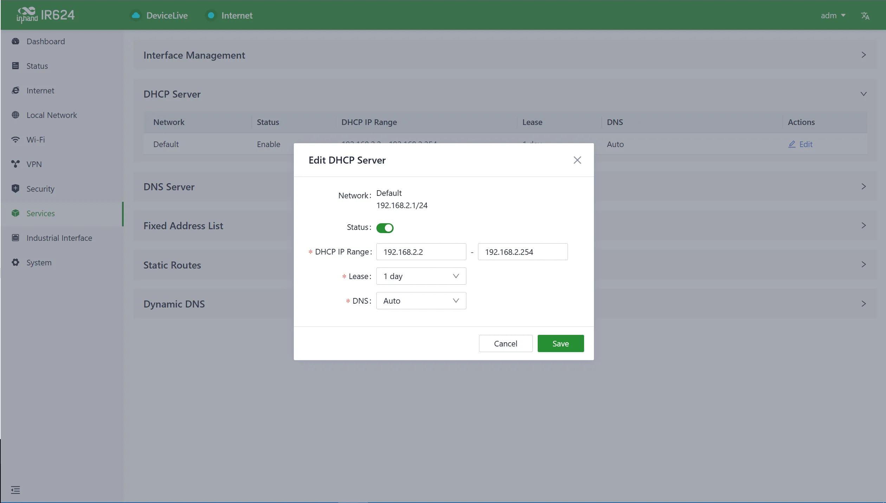

<strong>Figure 4-38 DHCP Server Configuration</strong>

**Notes:**

1. The device's DHCP service is generated based on the network information in the local network. If a local subnet is removed from the Local Network list, the DHCP server for that local subnet will also be deleted.
2. Local network entries need to be set in "IP" mode for the DHCP server function to take effect. Networks in "VLAN Only" mode are not within the selectable range.

### 4.8.3 DNS Server

DNS (Domain Name System) servers are a crucial network component responsible for translating human-readable domain names into computer-understandable IP addresses. DNS servers act as the address book of the internet, helping computers and devices locate other devices and ensuring that information can be correctly delivered across the network.

When DNS server addresses are not configured in **Service > DNS Server**, the DNS addresses obtained from the device's upstream interface will be used for domain name resolution. When DNS server addresses are configured, the configured DNS addresses will be used for domain name resolution.

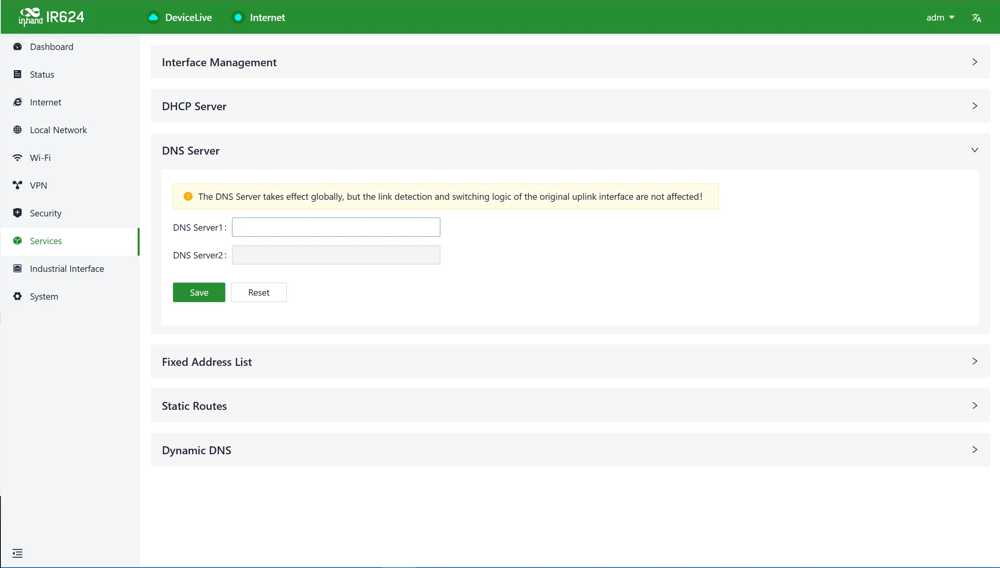

<strong>Figure 4-39 DNS Server Configuration</strong>

### 4.8.4 Fixed Address List

The **Service > Fixed Address List** function can be used to allocate a fixed IP address to a device based on its MAC address. This means that the device will consistently receive the same IP address every time it connects to the IR624.

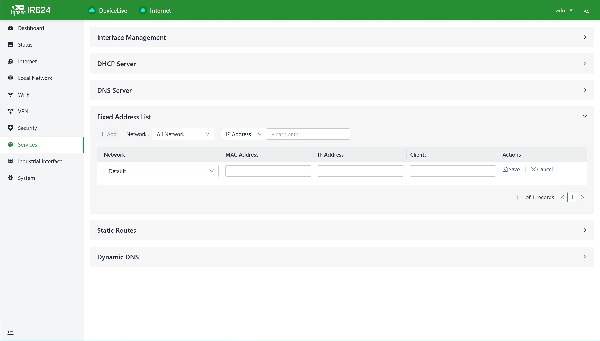

<strong>Figure 4-40 Fixed Address List Configuration</strong>

**Cautions:**

1. The available addresses for allocation must fall within the address range of the local network in IP mode, or the configuration will not take effect.
2. When the local network is deleted, all fixed address allocation rules within the local network's address range will be removed.

### 4.8.5 Static Routes

Static routing entries can be configured using the **Service > Static Routing** feature to enable data to be forwarded through specified paths and interfaces. The contents of the static routing table are manually created by users. Routing entries generated by other services, such as VPN functionality, will not be displayed in this table.

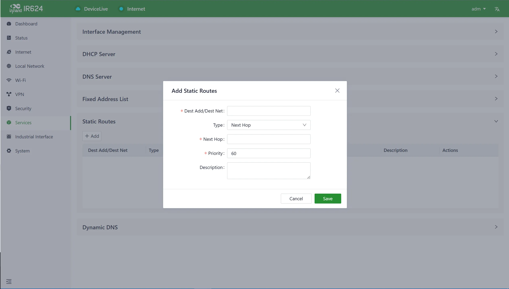

<strong>Figure 4-41 Static Routing Configuration</strong>

**Cautions:**

1. For static routes with the same destination address or network, the next-hop address, interface, or priority cannot be the same; otherwise, it will result in a non-functional route.
2. When Wi-Fi (STA) or L2TP Client VPN is deleted, the corresponding static routes using those interfaces will also be removed.

### 4.8.6 Dynamic DNS

Dynamic DNS (Dynamic Domain Name System) is used to automatically update the name server content in the domain system. According to internet domain rules, domain names are typically associated with fixed IP addresses. Dynamic DNS technology allows users with dynamic IP addresses to have a fixed name server, enabling external users to connect through regular updates.

The Dynamic DNS server address can be manually configured under the **Service > Dynamic DNS** feature.

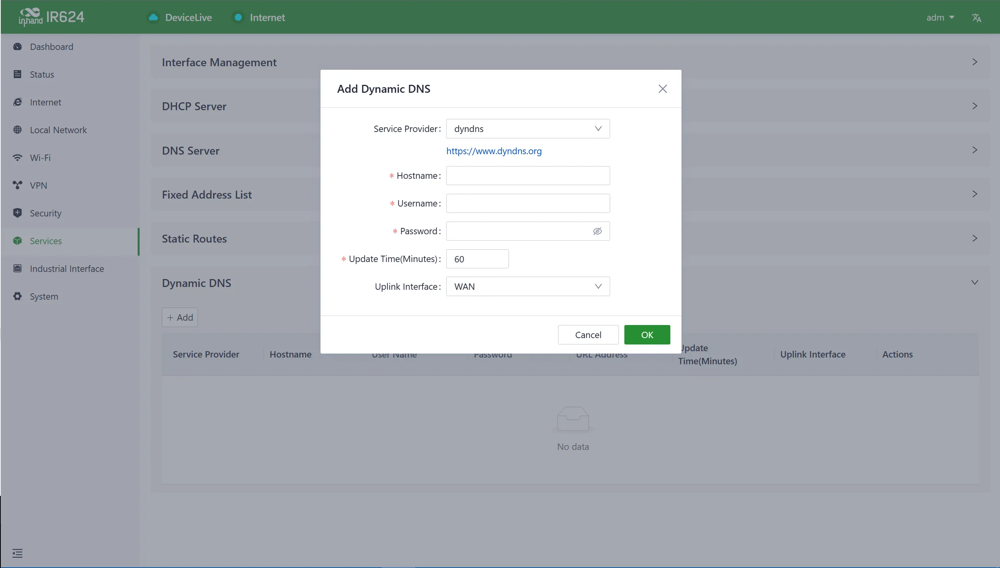

<strong>Figure 4-42 Dynamic DNS Configuration</strong>

The Dynamic DNS parameters are described in the following table.

| Parameter | Description |
|-----------|-------------|
| Service Provider | Provided by the Dynamic DNS service operator. Options: dyndns, 3322, oray, no-ip, or custom (requires a URL) |
| Hostname | The hostname registered with the service provider |
| Username | The username registered with the service provider |
| Password | The password set during registration |

## 4.9 Industrial Interface

The IR624 supports RS232 and RS485 industrial serial port protocols, which can be used for PLCs and industrial equipment to access the IR624 and transmit data.

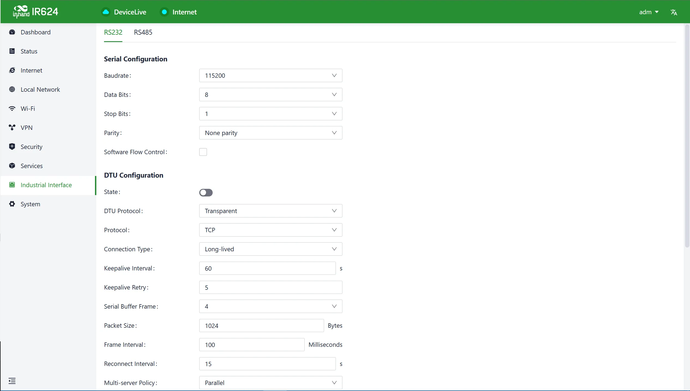

<strong>Figure 4-43 Industrial Interface Configuration</strong>

## 4.10 System

In the **System** menu, settings related to cloud management, remote access control, clock settings, device options, configuration management, device alarms, tools, scheduled reboot, log server, account management, and other functions can be configured.

### 4.10.1 Cloud Management

Device Live (device.inhandcloud.com) is a cloud platform developed by InHand Networks to address challenges in industrial networks, such as slow deployment, complex operations, and poor user experiences. This platform integrates features like zero-touch deployment, intelligent operations and maintenance, security protection, and user experience capabilities. Once devices are connected to the cloud platform, remote management, batch configuration, traffic monitoring, and other operations can be performed through the platform.

The IR624 automatically connects to Device Live after establishing an internet connection by default. If the cloud management function is not required, it can be disabled manually in the **System > Cloud Management** function.

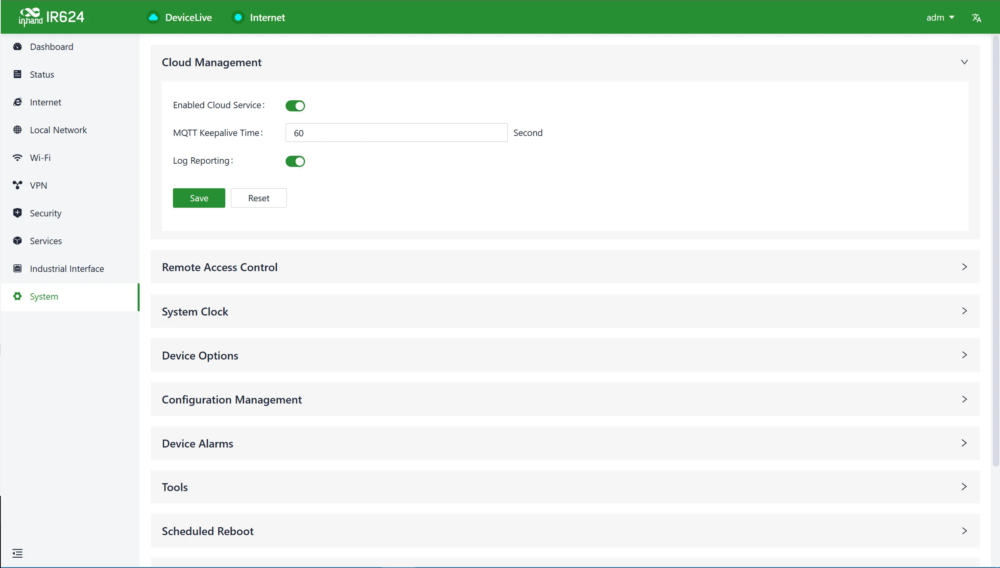

<strong>Figure 4-44 Cloud Management Configuration</strong>

### 4.10.2 Remote Access Control

Whether to allow external access to the router's web configuration interface from the internet can be configured through the **System > Remote Access Control** function. The service port for this purpose can also be set.

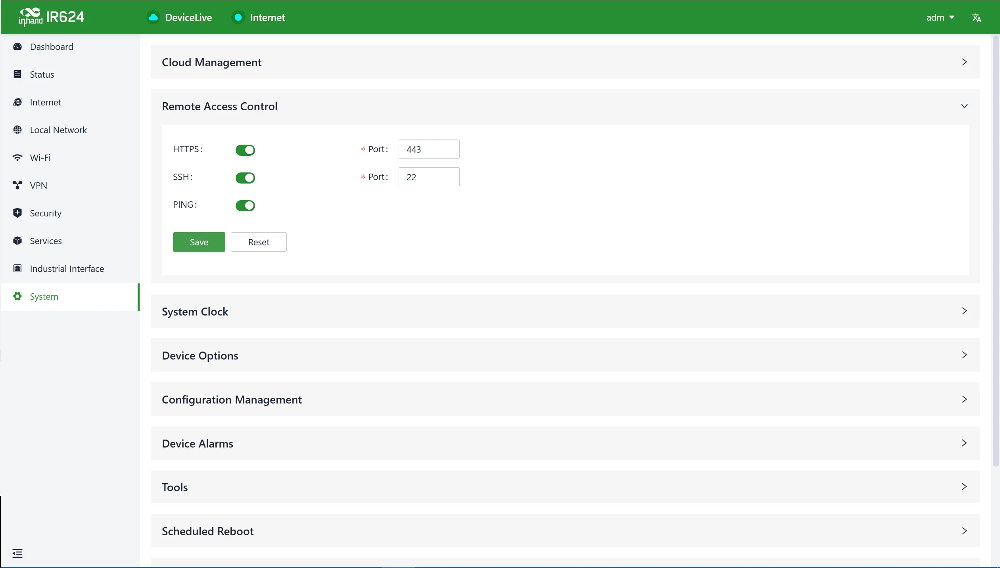

<strong>Figure 4-45 Remote Access Control Configuration</strong>

The remote access control parameters are described in the following table.

| Parameter | Description |
|-----------|-------------|
| HTTPS | When enabled, the router's web interface can be accessed remotely by entering the public IP address and port number of the upstream interface in a web browser |
| SSH | When enabled, the router's backend can be accessed remotely using remote tools by providing the public IP address, port number, username, and password |
| Ping | When enabled, the upstream interface allows external networks to initiate ping requests |

### 4.10.3 System Clock

The clock function is used to coordinate and synchronize time between network devices. Clock functionality within a network is crucial for data transmission, log recording, security, coordination, and troubleshooting. It ensures that various devices in the network operate with synchronized times.

The **System > Clock** function can be used to select the current time zone and configure NTP (Network Time Protocol) server addresses to synchronize the device's system time with an NTP server.

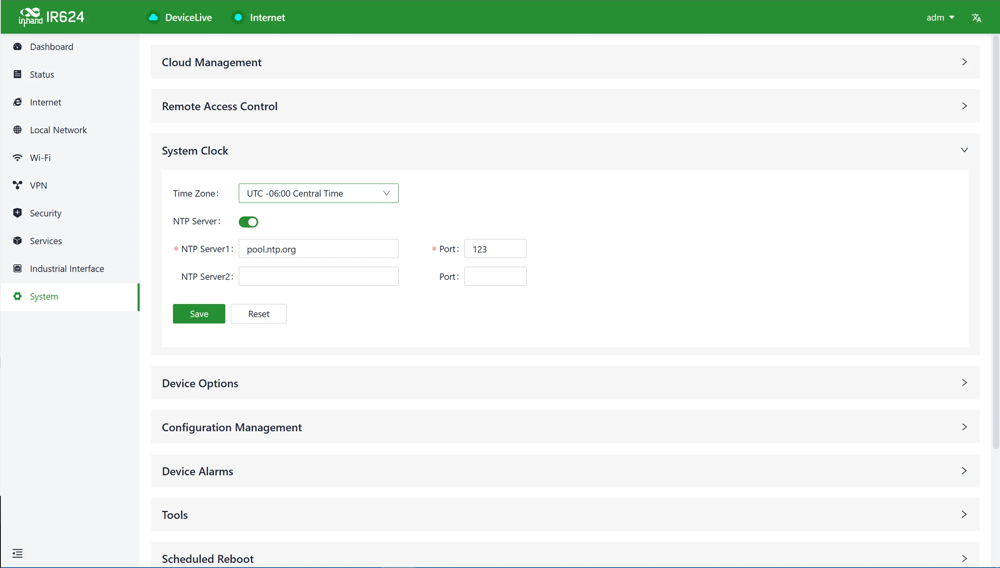

<strong>Figure 4-46 System Clock Configuration</strong>

### 4.10.4 Device Option

In the **System > Device Options** section, various device operations can be performed, such as rebooting, upgrading firmware, and restoring factory settings.

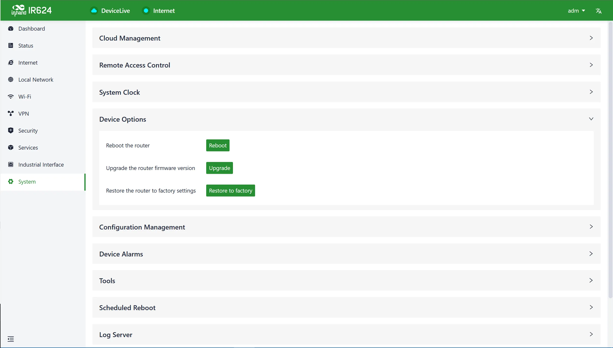

<strong>Figure 4-47 Device Options</strong>

**Cautions:**

1. When performing a local firmware upgrade, it is essential to ensure that the firmware is obtained from a legitimate source to avoid rendering the device inoperable due to incorrect firmware imports.
2. When a device is connected to the cloud platform, the platform will synchronize the previous configuration to the device again due to cloud-based configuration synchronization. The device will only clear historical data during the factory reset.

### 4.10.5 Configuration Management

Configuration backups and backup recovery are critical tasks in network management and maintenance. They involve saving the configuration information of network devices so that it can be quickly restored or transferred when needed.

Device configurations can be exported to local storage in the **System > Configuration Management** menu. This backup can be imported into the device in case of configuration loss or when overwriting the existing configuration is required.

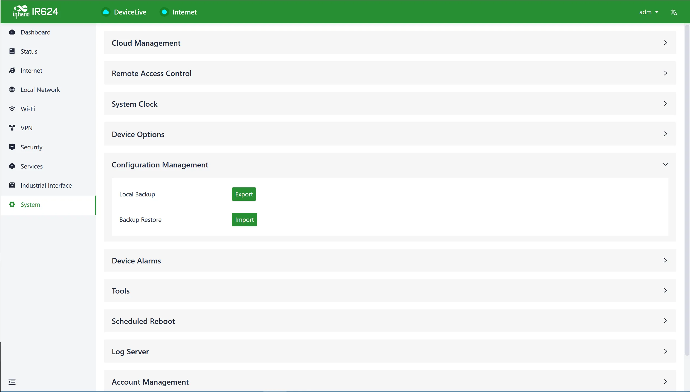

<strong>Figure 4-48 Configuration Management</strong>

### 4.10.6 Device Alarms

Specific events that may occur on the device can be selected as alarm events, and the email address for receiving alerts can be configured. When an alarm event occurs, the device will automatically send an email notification. Even if certain alarm options are not selected, related alarm events will still be recorded in the device's local logs.

Alarm event types and email addresses for alarm notifications can be configured in the **System > Device Alarms** menu.

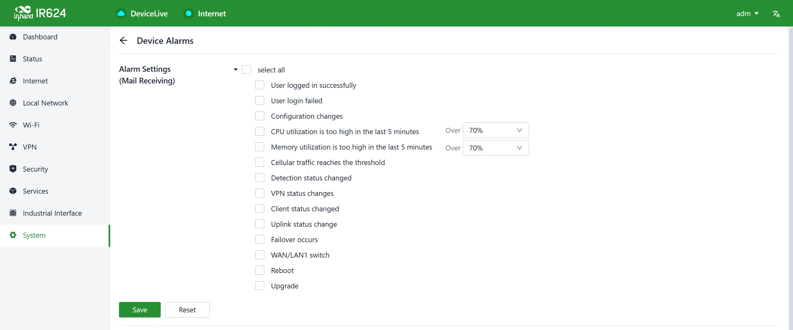

<strong>Figure 4-49 Device Alarms Configuration</strong>

After configuring the outgoing email server address, port, username, and password, the device will use this email account to send alarm notifications. The "Send Test Email" option can be used to verify whether the outgoing email configuration is correct.

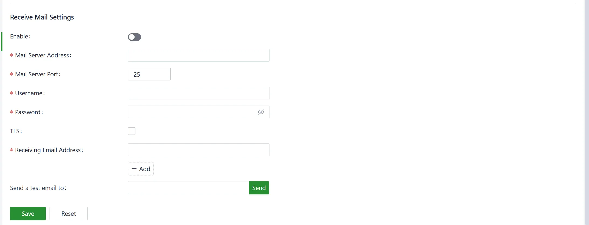

<strong>Figure 4-50 Email Server Configuration</strong>

### 4.10.7 Tools

**Ping**

ICMP (Internet Control Message Protocol) can be used to check the device's external network connectivity. In the "Target" field, enter any domain name or IP address to test the device's connectivity to, and click "Start" to check the connectivity status between the device and the specified target.

This function is accessed via **System > Tools > Ping**.

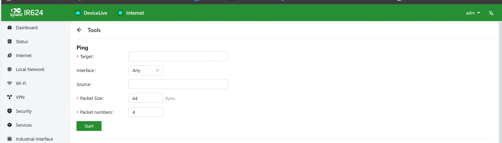

<strong>Figure 4-51 Ping Tool</strong>

**Traceroute**

Traceroute is a network diagnostic tool used to determine the network path that data packets take from the source to the destination, as well as the intermediate routers or hops along that path.

The target host's IP address can be entered in **System > Tools > Traceroute**, the outgoing interface for the traffic can be selected, and "Start" can be clicked to check the device's connectivity to the target IP by tracing the route.

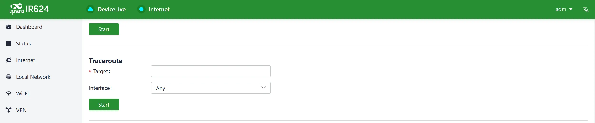

<strong>Figure 4-52 Traceroute Tool</strong>

**Packet Capture**

Packet capturing is a network monitoring and analysis technique used to capture and record data packets transmitted over a computer network. Packet capture tools are typically used for network troubleshooting, network performance analysis, security auditing, and protocol analysis.

Packets passing through a specific interface can be captured in **System > Tools > Packet Capture**. By selecting the "Output" option, the captured data can be displayed within the interface or exported locally for further analysis.

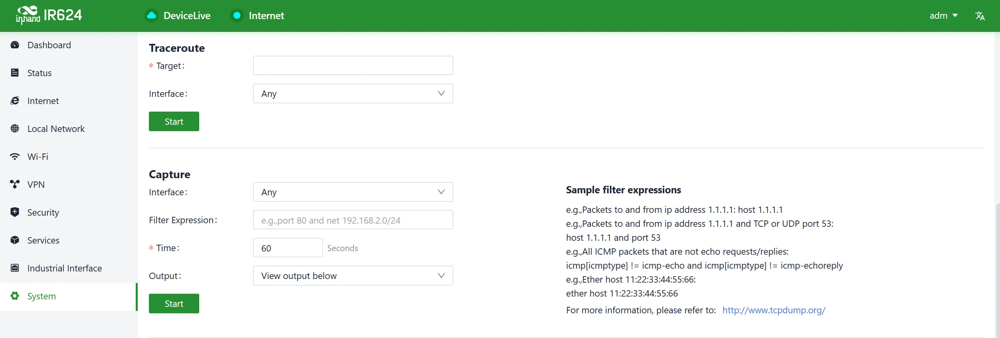

<strong>Figure 4-53 Packet Capture Tool</strong>

### 4.10.8 Scheduled Reboot

Scheduled reboot is a network device management strategy that allows administrators to automatically restart a device at a specific time or under certain conditions to ensure normal operation and performance.

Scheduled reboots can be configured in the **System > Scheduled Reboot** function based on business requirements. The device supports scheduled reboots at fixed times daily, weekly, or monthly.

In the case of monthly reboots, if the selected reboot day exceeds the actual number of days in the month, the device will reboot on the last day of the month. For example, if the 31st of every month is selected, the device will reboot on the 30th in a month with only 30 days.

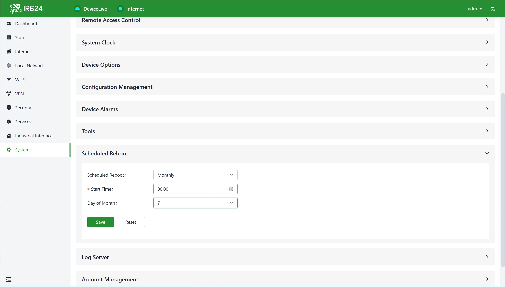

<strong>Figure 4-54 Scheduled Reboot Configuration</strong>

### 4.10.9 Log Server

A log server is a dedicated server or software application used to collect, store, and manage log information generated by network devices, applications, and operating systems. These log records include events, warnings, errors, activities, and other relevant information and are crucial for monitoring, troubleshooting, and performance optimization.

When the log file server function is enabled in the **System > Log Server** feature, the device will periodically upload log files to the specified log server.

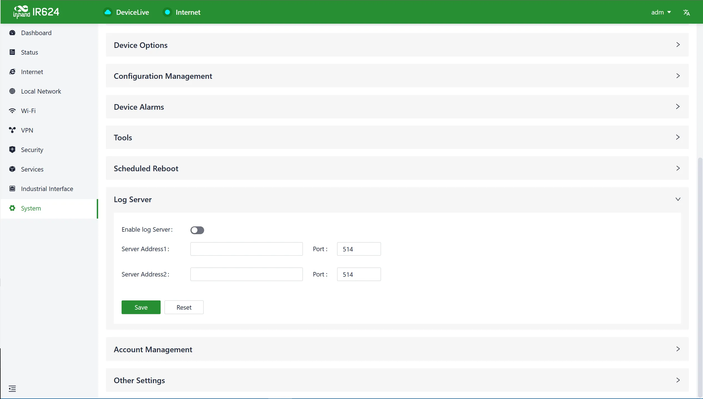

<strong>Figure 4-55 Log Server Configuration</strong>

### 4.10.10 Account Management

The username and password for logging in to the device's web page can be changed in the **System > Account Management** menu.

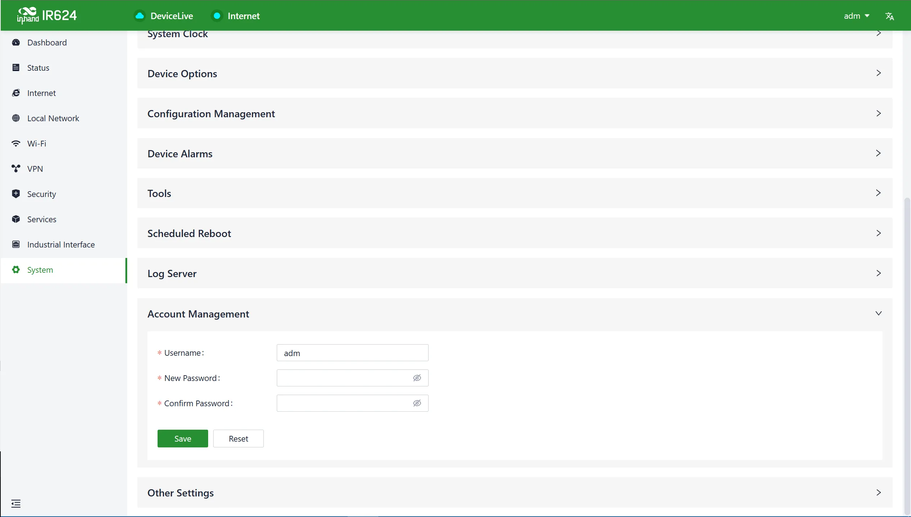

<strong>Figure 4-56 Account Management</strong>

### 4.10.11 Other Settings

**Web Login Management**

When a user logs in to the local interface of the device through the web and the session remains active for a certain period, it will automatically log out or disconnect to protect privacy and security.

The logout time can be configured in **System > Other Settings > Web Login Management**. If the online time during a single login session on the device's web page exceeds the configured time, the system will automatically log the user out, and re-login will be required to continue operations.

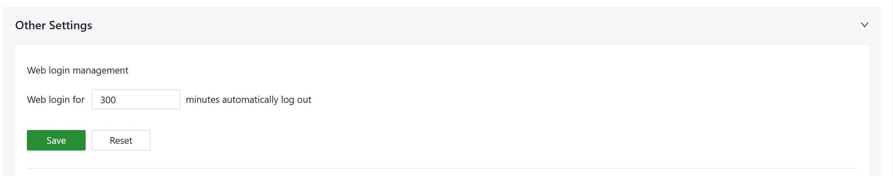

<strong>Figure 4-57 Web Login Management Configuration</strong>

**Fast Forward**

The fast forward feature can be used to quickly forward packets, improving network performance. By default, it is turned off. When this feature is enabled in **System > Other Settings > Fast Forward**, the device's data forwarding rate will significantly increase.

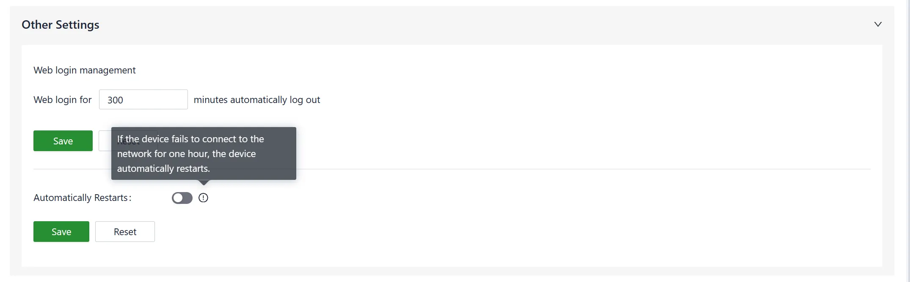

<strong>Figure 4-58 Fast Forward Configuration</strong>

# Appendix A Troubleshooting

## A.1 Network Connection Issues

| Symptom | Possible Cause | Troubleshooting Steps | Related Section |
|---------|---------------|----------------------|-----------------|
| Unable to access the internet via cellular network | SIM card not inserted or inserted incorrectly | 1. Verify the SIM card is properly inserted 2. Ensure the SIM card is not damaged | [5G/4G Connection](#43-internet) |
| Unable to access the internet via cellular network | APN parameters configured incorrectly | 1. Verify APN parameters match the operator's requirements 2. Contact the operator to obtain correct APN parameters | [5G/4G Connection](#43-internet) |
| Unable to access the internet via cellular network | Link Detection function interfering with dedicated network connectivity | 1. Navigate to the Internet menu 2. Manually disable the Link Detection function | [5G/4G Connection](#43-internet) |
| Unable to access the internet via WAN | DHCP not obtaining an IP address | 1. Verify the Ethernet cable is securely connected 2. Check upstream device DHCP server status | [Wired Connection](#43-internet) |
| Unable to access the internet via WAN | Static IP parameters configured incorrectly | 1. Verify the IP address is in the correct subnet 2. Confirm subnet mask and gateway settings with the ISP or upstream device | [Wired Connection](#43-internet) |
| Unable to access the internet via Wi-Fi (STA) | SSID or password entered incorrectly | 1. Verify the SSID name and password 2. Ensure the target AP is within range | [Wireless Connection](#43-internet) |

## A.2 Wi-Fi Issues

| Symptom | Possible Cause | Troubleshooting Steps | Related Section |
|---------|---------------|----------------------|-----------------|
| SSID cannot be enabled or modified | Wi-Fi (STA) interface exists on the same frequency band | 1. Navigate to Internet > Uplink Table 2. Remove the Wi-Fi (STA) interface 3. Return to Wi-Fi settings to enable or modify the SSID | [SSIDs](#45-wi-fi) |
| Wi-Fi (STA) configuration lost after deletion | Associated settings removed automatically upon interface deletion | 1. Re-add the Wi-Fi (STA) interface 2. Reconfigure static routes, port forwarding, and other associated settings | [Wireless Connection](#43-internet) |

## A.3 Device Management Issues

| Symptom | Possible Cause | Troubleshooting Steps | Related Section |
|---------|---------------|----------------------|-----------------|
| Device becomes inoperable after firmware upgrade | Firmware obtained from an illegitimate source | 1. Obtain firmware only from official legitimate sources 2. Contact technical support if the device fails to boot | [Device Options](#410-system) |
| Configuration not cleared after factory reset | Cloud platform synchronizing previous configuration | 1. Disconnect the device from the cloud platform before performing a factory reset 2. Manually clear historical data if required | [Device Options](#410-system) |
| Unable to view upstream interface statistics | Link Detection function disabled | 1. Navigate to Internet > Upstream Link Settings 2. Enable the Link Detection function | [Uplink Settings](#43-internet) |
| Device connectivity disrupted after modifying Internet settings | Configuration change affecting active upstream link | 1. Verify alternative access method (e.g., LAN) is available before making changes 2. Exercise caution when modifying Internet menu settings | [Uplink Settings](#43-internet) |

## A.4 SIM Card and Hardware Issues

| Symptom | Possible Cause | Troubleshooting Steps | Related Section |
|---------|---------------|----------------------|-----------------|
| SIM card data loss or device damage | SIM card inserted or removed while power is connected | 1. Disconnect power before inserting or removing the SIM card 2. Verify the SIM card is properly seated after power-off installation | [5G/4G Connection](#43-internet) |
| PC fails to obtain an IP address automatically | DHCP client disabled or subnet mismatch | 1. Verify the PC is configured to obtain an IP address automatically 2. If automatic acquisition fails, configure a static IP in the 192.168.2.x range with subnet mask 255.255.255.0 and gateway 192.168.2.1 | [Environment Setup](#22-installation-guide) |

---

# Appendix B Safety Precautions

1. The original power adapter must be used to avoid device damage caused by mismatched power adapters.

2. When installing the device, it should not be placed in an environment with strong electromagnetic interference. The device must be kept at a safe distance from high-power equipment. After installation, the device must be secured to prevent accidental drops and potential damage.

3. The device's operating environment must meet the temperature and humidity requirements specified in the user manual.

4. The device's cables, including Ethernet cables and power adapter connections, must be inspected regularly. Cables must be kept clean and replaced if any damage is detected.

5. When cleaning the device, chemical agents must not be sprayed directly on the device's surface to prevent damage to the housing or internal components. A soft cloth must be used for cleaning.

6. The device must not be disassembled or modified by unauthorized personnel, as this can pose safety risks and may void the device's warranty.

---

# Appendix C EU Declaration of Conformity

**IR624 supported frequency bands and transmit power are as follows:**

WCDMA B1:

Tx(MHz): 1920-1980, Rx(MHz): 2110-2170, Power: 25dBm

WCDMA B3:

Tx(MHz): 1710-1785, Rx(MHz): 1805-1880, Power: 25dBm

WCDMA B5:

Tx(MHz): 824-849, Rx(MHz): 869-894, Power: 25dBm

WCDMA B8:

Tx(MHz): 880-915, Rx(MHz): 925-960, Power: 25dBm

LTE B1:

UL(MHz): 1920-1980, DL(MHz): 2110-2170, Power: 24.5dBm

LTE B3:

UL(MHz): 1710-1785, DL(MHz): 1805-1880, Power: 24.5dBm

LTE B5:

UL(MHz): 824-849, DL(MHz): 869-894, Power: 24.5dBm

LTE B7:

UL(MHz): 2500-2570, DL(MHz): 2620-2690, Power: 24.5dBm

LTE B8:

UL(MHz): 880-915, DL(MHz): 925-960, Power: 24.5dBm

LTE B20:

UL(MHz): 832-862, DL(MHz): 791-821, Power: 24.5dBm

LTE B28:

UL(MHz): 703-748, DL(MHz): 758-803, Power: 24.5dBm

LTE B38:

UL(MHz): 2570-2620, DL(MHz): 2570-2620, Power: 24.5dBm

LTE B40:

UL(MHz): 2300-2400, DL(MHz): 2300-2400, Power: 24.5dBm

LTE B41:

UL(MHz): 2496-2690, DL(MHz): 2496-2690, Power: 24.5dBm

5G NR n1:

UL(MHz): 1920-1980, DL(MHz): 2110-2170, Power: 24.5dBm

5G NR n3:

UL(MHz): 1710-1785, DL(MHz): 1805-1880, Power: 24.5dBm

5G NR n5:

UL(MHz): 824-849, DL(MHz): 869-894, Power: 24.5dBm

5G NR n7:

UL(MHz): 2500-2570, DL(MHz): 2620-2690, Power: 24.5dBm

5G NR n8:

UL(MHz): 880-915, DL(MHz): 925-960, Power: 24.5dBm

5G NR n20:

UL(MHz): 832-862, DL(MHz): 791-821, Power: 24.5dBm

5G NR n28:

UL(MHz): 703-748, DL(MHz): 758-803, Power: 24.5dBm

5G NR n38:

UL(MHz): 2570-2620, DL(MHz): 2570-2620, Power: 24.5dBm

5G NR n40:

UL(MHz): 2300-2400, DL(MHz): 2300-2400, Power: 24.5dBm

5G NR n41:

UL(MHz): 2496-2690, DL(MHz): 2496-2690, Power: 27.5dBm

5G NR n77:

UL(MHz): 3300-4200, DL(MHz): 3300-4200, Power: 27.5dBm

5G NR n78:

UL(MHz): 3300-3800, DL(MHz): 3300-3800, Power: 27.5dBm

2.4G Wi-Fi:

2412MHz-2472MHz, Power: 19.92dBm

5G Wi-Fi:

5150MHz-5250MHz, 5725MHz-5825MHz, Power: 19.19dBm

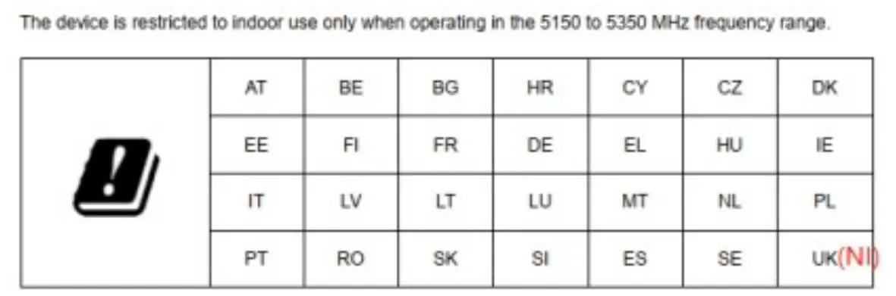

<strong>Figure 6-1 EU Declaration of Conformity</strong>

The operation temperature range of IR624: -20℃- +70℃.

This equipment should be installed and operated with minimum distance of 30 cm between the radiator and your body. This transmitter must not be co-located or operating in conjunction with any other antenna or transmitter.

Warning: Operation of this equipment in a residential environment could cause radio interference.

Hereby, Beijing InHand Networks Technology Co., Ltd. declares that the radio equipment type [IR624,IR6X4 Where X represents the numbers 0-9] is in compliance with Directive 2014/ 53/EU. The full text of the EU declaration of conformity is available at the following internet address: https://www.inhand.com.cn

