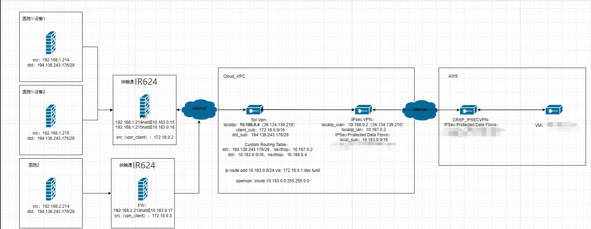

# Medical Device Data Transmission Solution Configuration Manual

## I. Document Information

- **Document Name**: Medical Device Data Transmission Solution Configuration Manual

- **Product Model**: IR624

- **Firmware Version**: V3.0.9

- **Applicable Scenarios**: Unified equipment access, VPN networking

- **Writing Date**: March 30, 2026

## II. Gateway Overview

### 2.1 Product Introduction

In this scenario, the router product is mainly used for **unified equipment access** and **building VPN networking between branch ends and central end** in enterprise branch networking scenarios.

### 2.2 Main Functions

- Unified access for on-site medical equipment

- Build VPN networking between branch ends and central end

- Remote configuration, remote diagnosis, remote upgrade

- Wide temperature industrial-grade design

### 2.3 Typical Application Topology

## III. Hardware Description

## 3.1 Appearance and Interfaces

- Power interface: DC 9-48V

- Network ports: 4×10/100/1000Mbps Ethernet ports supporting WAN/LAN/VLAN

- Wireless: 4G/5G/Wi-Fi (optional)

- Indicator lights: PWR, RUN, NET, signal strength

- Reset button: Restore factory settings

## 3.2 Wiring Instructions

#### 3.2.1 Power Wiring

- Positive: V+

- Negative: V-

- Note: Reverse polarity protection, lightning protection, grounding

#### 3.2.2 Ethernet Wiring

Direct/crossover adaptive, recommends Cat5e or higher network cables.

## IV. Factory Default Parameters

- Default IP: 192.168.2.1

- Subnet mask: 255.255.255.0

- Web username: adm

- Web password: Random password, refer to corresponding equipment nameplate

## V. Preliminary Preparation

1. Set computer to same network segment IP as gateway

2. Connect computer to gateway LAN port with network cable

3. Power on gateway, wait for RUN light to illuminate steadily

4. Enter gateway IP in browser to access configuration page

## VI. Network Configuration

1. Insert SIM card (supports NB-IoT/4G) / Connect Ethernet, configure according to on-site requirements

2. Enable mobile network

3. APN: Automatic / Manual entry

4. View signal strength

   5. Set VLAN address to 192.168.1.104/24

   6. Configure connection to Xiaoxing Cloud platform

## VII. VPN and NAT Configuration

### 7.1 VPN Configuration

Add OpenVPN client on the device side

### 7.2 NAT Configuration

Configure NAT according to customer network networking requirements

## VIII. Same Configuration Can Import Configuration Files

Configuration files are in the config directory
