# Industrial Router IR900 Quick Install Manual

> **You need to do first:** Unbox → Mount the device → Connect power and Ethernet → (If using cellular) **Power off** to install SIM, connect antennas → Power on → Set PC to same subnet → Open Web in browser.  
> **Then:** Scroll down to **Part 2** for packing list, LED meanings, mounting details, terminal pinouts, and more.

---

## Part 1: Quick Install (Visual Step-by-Step)

### Must-Read Summary (Before Wiring and Power-On)

| Item | Requirement |
|------|-------------|
| Power Supply | **24 V DC (12–48 V DC)**, rated current **0.15–0.6 A**. Pay attention to the voltage level. |
| SIM Card | **Power off** the device before inserting or removing the SIM card. |
| Cellular / WLAN Antenna | Tighten according to the **silkscreen** on the enclosure. |
| Environment | Working temperature: **-25 °C ~ 70 °C**; storage: **-40 °C ~ 85 °C**; humidity: **5% ~ 95%** (non-condensing). |

Avoid direct sunlight, away from heat source or strong electromagnetic interference. The equipment surface may be high temperature; please consider the surrounding environment before installation. Device should be installed in the restricted area.

---

### Step 1: Check the Panel and Interface Areas Against the Physical Unit

Please refer to the physical product for specific panel details. The IR900 series products come in various panel designs, but the installation method is the same for all.

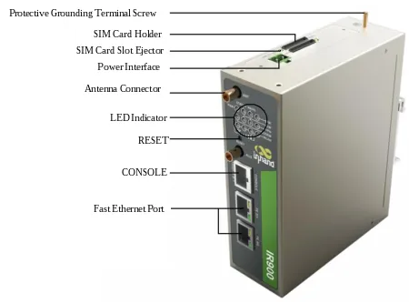

For panel layout and structural dimensions, see §2.2.

---

### Step 2: Mount the Device on a DIN Rail or in a Cabinet

Choose an installation location with enough space.

**DIN rail (recommended):** Slide the upper part of the DIN card holder onto the DIN rail. At the lower end of the device, apply slight upward force and rotate the device to secure the DIN card holder onto the DIN rail. Confirm that the equipment is securely installed.

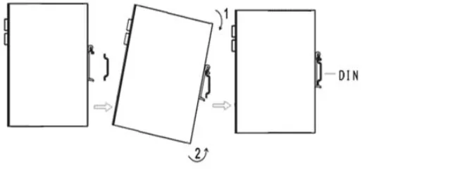

**Wall mount:** First attach the wall-mounting bracket to the back of the device with screws, then secure the device to the wall or cabinet with screws.

For detailed installation and removal steps, see §2.4.

---

### Step 3: Connect Power and Ethernet

1. Remove the terminals from the router.
2. Loosen the locking screws on the terminals.
3. Insert the power cables into the terminals and tighten the screws.

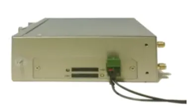

Connect the router and PC directly using an Ethernet cable.

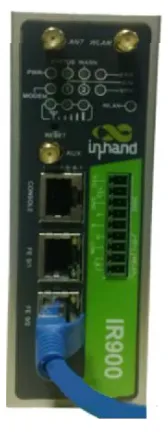

To enhance the router's overall immunity to interference, it is necessary to ground the router when in use. Depending on the operating environment, connect the ground wire to the router's grounding bolt.

For power specifications, serial port, and grounding details, see §2.5.2. For Ethernet details, see §2.5.1.

---

### Step 4: (If Using Cellular) Power Off to Install SIM and Attach Antennas

**Make sure the device is powered off.**

Push the hole on the left of the SIM card slot to eject it, then insert the micro-SIM card.

Rotate the metal interface clockwise until the movable part cannot be rotated; **do not hold the black glue stick to twist the antenna**.

The IR900 supports dual antennas: the **ANT** antenna and the **AUX** antenna. The ANT antenna is used for both data transmission and reception, while the AUX antenna is solely for enhancing signal strength and cannot be used for data transmission or reception independently. In most cases, using only the ANT antenna is sufficient. You would only use the AUX antenna in conjunction with the ANT antenna when you have poor signal quality and need to boost the signal.

For SIM card slot location and antenna silkscreen details, see §2.5.6.

---

### Step 5: Power On and Confirm the Device Is Ready

After confirming all wiring is correct, power on the device. Observe the device LED indicators.

For LED descriptions, see §2.3.

---

### Step 6: Log In via PC and Browser

Set the IP address of the management computer within the same network segment as the router's FE port IP address.

| Port Role | Default IP |
| :---: | :---: |
| FE 0/1 | 192.168.1.1 |
| FE 0/2 | 192.168.2.1 |

Subnet mask: **255.255.255.0**.

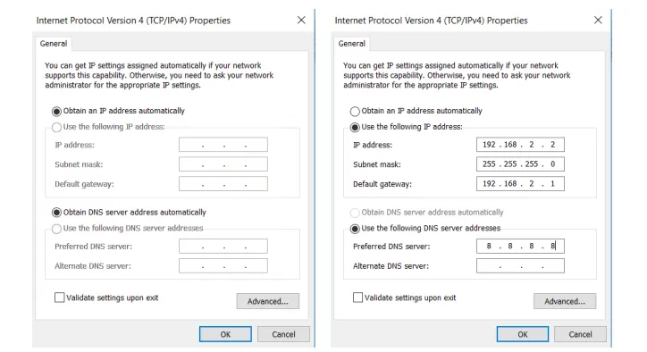

Access the default IP address in a browser, enter the username and password (please look at the nameplate at the bottom of the device for login credentials) in the pop-up window, and then access the router's WEB management page. If the browser alarms the connection is not private, show advanced, and proceed to access the address.

For login details and certificate alarm handling, see §2.7.

---

### Post-Install Checklist

- ☐ Device is securely mounted (DIN rail or wall).  
- ☐ Power and Ethernet cables are connected; if using cellular, SIM and antennas are in place.  
- ☐ Device LED indicators appear normal.  
- ☐ Browser can open the Web login page and login succeeds.  

If you cannot log in, check whether the PC IP settings are correct, or perform a hardware factory reset (see §2.7).

---

## Part 2: Detailed Reference

### 2.1 Packing List

Each IR900 product shipped from the factory includes common accessories for customer sites. Upon receiving our product, please carefully inspect it. If you find any missing or damaged items, please promptly contact an InHand Networks sales representative. Additionally, InHand Networks can provide optional accessories to customers based on site-specific requirements.

**Standard accessories**

| No. | Accessories | Quantity | Unit | Remarks |
| --- | --- | --- | --- | --- |
| 1 | IR900 | 1 | pc | IR900 Series Industrial 4G Router |
| 2 | Ethernet cable | 1 | pc | 1.5 m |
| 3 | DIN-rail | 1 | pc | Fixed Router |
| 4 | 4G antenna | 1 | pc | North America models have 2 antennas |
| 5 | Power terminal | 1 | pc | 2-pin green power terminal |
| 6 | Product Warranty Card | 1 | pc | Warranty period is 3 years |
| 7 | Conformity Certificate | 1 | pc | |

**Optional accessories**

| No. | Accessories | Quantity | Unit | Remarks |
| --- | --- | --- | --- | --- |
| 1 | AC Power Cable | 1 | pc | |
| 2 | Power Supply Adapter | 1 | pc | VDC Power Adapter |
| 3 | Wi-Fi Antenna | 1 | pc | |
| 4 | Serial Connection Cable | 1 | pc | |

---

### 2.2 Product Structure and Identification

#### 2.2.1 Panel Layout

This guide is intended for the installation and operation of IR900 series routers manufactured by InHand Networks. Before proceeding, please verify the product model and ensure that all included accessories (power adapter, antennas) are present. Additionally, you will need to purchase a SIM card from your local network service provider.

This manual serves as an example for specific products within the IR900 series. For precise instructions, please refer to the physical product.

Note: The IR900 series products come in various panel designs, but the installation method is the same for all. Please refer to the actual product for specific panel details.

#### 2.2.2 Structural Dimensions

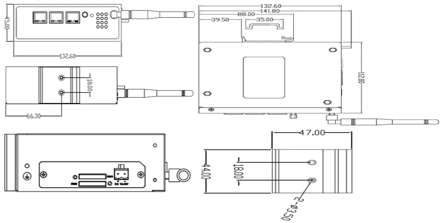

---

### 2.3 LED Indicators and Reset Button

#### 2.3.1 System Status LEDs

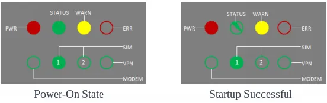

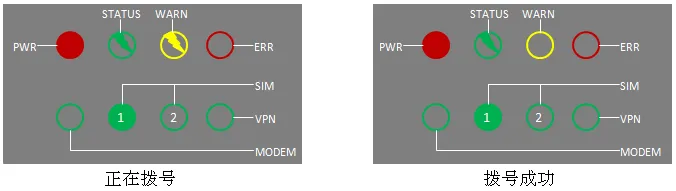

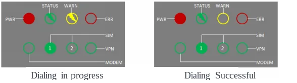

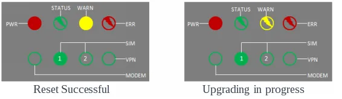

#### 2.3.2 Cellular Signal Strength LEDs

| Signal Level | Description |
| :---: | --- |
| 1–9 | At this point, there is an issue with the signal condition. Please check if the antenna is properly installed and if the signal in your area is strong enough. |
| 10–19 | At this point, the signal status is essentially normal, and the device should function correctly. |
| 20–31 | The signal level is very good. |

#### 2.3.3 Reset Button

Locate the RESET button on the device panel. Refer to §2.2 for the panel introduction.

Function: Hardware factory reset.

For detailed reset steps, see §2.7.

---

### 2.4 Mechanical Installation

#### 2.4.1 DIN Rail — Installation

1. Choose the installation location for the equipment, ensuring there is enough space.
2. Slide the upper part of the DIN card holder onto the DIN rail. At the lower end of the device, apply slight upward force and rotate the device as indicated by arrow 2 to secure the DIN card holder onto the DIN rail. Confirm that the equipment is securely installed on the DIN rail, as shown in the right image below.

#### 2.4.2 DIN Rail — Removal

1. Press the device downwards to create a gap at the lower end, detaching it from the DIN rail.
2. Rotate the device in the direction of arrow 2 while simultaneously moving the lower end of the device outward. Once the lower end is detached from the DIN rail, lift the device upwards to remove it from the DIN rail.

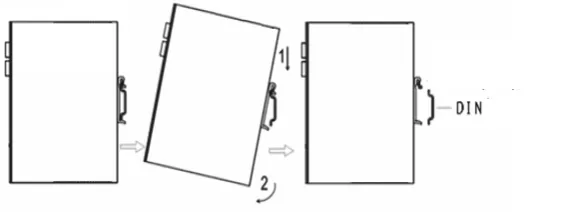

#### 2.4.3 Wall Mount — Installation

First attach the wall-mounting bracket to the back of the device with screws, then secure the device to the wall or cabinet with screws. To remove, reverse the sequence.

**Step 1:** Choose the installation location for the equipment, ensuring there is enough space.

**Step 2:** Use a screwdriver to attach the wall-mounting bracket to the back of the device.

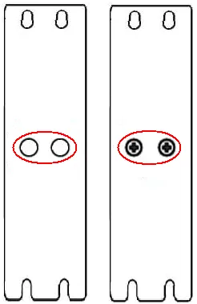

**Step 3:** Remove the screws (included in the wall-mount bracket packaging), use a screwdriver to secure the screws at the installation location, and then lower the device to ensure it is in a stable position.

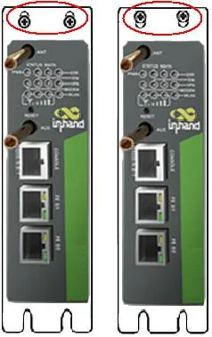

#### 2.4.4 Wall Mount — Removal

With one hand supporting the device, use the other hand to remove the screws that secure the upper end of the device. This will allow you to detach the device from its mounting location.

---

### 2.5 Connection and Wiring

#### 2.5.1 Ethernet

The router has two FE ports. Connect the router and PC directly using an Ethernet cable.

#### 2.5.2 Power, Serial Port, and IO

**Power supply**

- Input voltage: **24 VDC (12–48 VDC)**
- Rated current: **0.15–0.6 A**

Please pay attention to the power voltage level.

**Protective grounding**

To enhance the router's overall immunity to interference, it is necessary to ground the router when in use. Depending on the operating environment, connect the ground wire to the router's grounding bolt.

1. Unscrew the grounding nut.
2. Slide the grounding ring of the cabinet ground wire onto the grounding bolt.
3. Tighten the grounding nut.

**Serial port and IO terminals**

The device's serial port provides two interface modes: RS232 and RS485.

IO interface input terminals: IN represents digital input terminals, and COM represents the ground terminal.

IO interface output terminals: RELAY represents the relay output terminal.

For installation, remove the terminals from the device, loosen the locking screws on the terminals, insert the corresponding cables into the terminals, and then tighten the screws. The arrangement of the wires is as shown below.

#### 2.5.3 Cellular SIM and Antenna

**SIM card**

IR900 supports dual micro-SIM cards. Push the hole on the left of the SIM card slot to eject it. Then insert the SIM card.

**Antenna**

Rotate the metal interface clockwise until the movable part cannot be rotated; do not hold the black glue stick to twist the antenna.

The IR900 supports dual antennas: the **ANT** antenna and the **AUX** antenna. The ANT antenna is used for both data transmission and reception, while the AUX antenna is solely for enhancing signal strength and cannot be used for data transmission or reception independently.

In most cases, using only the ANT antenna is sufficient. You would only use the AUX antenna in conjunction with the ANT antenna when you have poor signal quality and need to boost the signal.

---

### 2.6 Power and Environment (Quick Reference)

| Item | Specification |
|------|---------------|
| Input Voltage | 24 VDC (12–48 VDC) |
| Rated Current | 0.15–0.6 A |
| Working Temperature | -25 °C ~ 70 °C |
| Storage Temperature | -40 °C ~ 85 °C |
| Relative Humidity | 5% ~ 95% (non-condensing) |

---

### 2.7 First Login and Factory Reset

#### 2.7.1 Web Login

1. Set the IP address of the management computer within the same network segment as the router's FE port IP address (FE 0/1: **192.168.1.1**, FE 0/2: **192.168.2.1**, subnet mask **255.255.255.0**).
2. Access the default IP address in a browser.
3. Enter the username and password (please look at the nameplate at the bottom of the device for login credentials) in the pop-up window and then access the router's WEB management page.
4. If the browser alarms the connection is not private, show advanced, and proceed to access the address.

#### 2.7.2 Factory Reset

**Via Web**

Login to the WEB management page, click on the "Administration >> Config Management" menu in the navigation tree. Click "Restore default configuration" button, router will restore to default settings after reboot.

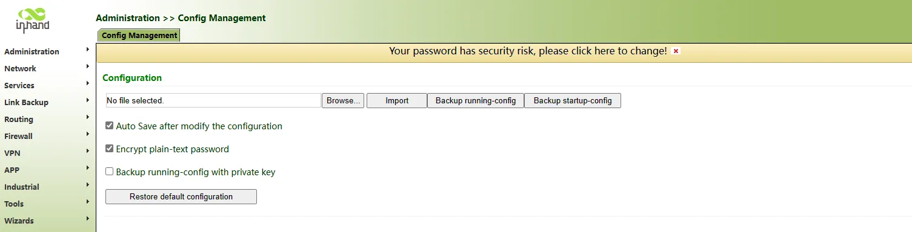

**Via RESET button**

To restore to default settings via the reset button, please perform the following steps:

1. Locate the RESET button on the device panel. Refer to §2.2 for panel introduction.
2. Power on the device and continue holding down the RESET button for 10 seconds.
3. Release the RESET button when you see the ERR light illuminated.
4. After a few seconds, when the ERR light goes off, press and hold the RESET button again.
5. Release the RESET button when you see the ERR light blinking. Shortly after, when the ERR light goes off, it indicates a successful factory reset.

---

### 2.8 Related Documents

| Need | Document |
|------|----------|
| Product introduction, configuration and troubleshooting | 《IR900 User Manual》 |
| Ordering and antenna models | 《IR900 Product Specification》 |
| Software and announcements | [InHand Networks Official Website](https://www.inhandnetworks.com) |

---

### 2.9 Legal Information

All statements, information and recommendations in this manual do not constitute any expressed or implied warranty.
