# Industrial Router IR900 Product User Manual

---

## Declaration

Thank you for choosing InHand Networks product. Before using the product, read this manual carefully.

The contents of this manual cannot be copied or reproduced in any form without the written permission of InHand Networks.

Due to continuous product and technology updates, InHand Networks cannot promise that the contents are consistent with the actual product information, and does not assume any disputes caused by the inconsistency of technical parameters. The information in this document is subject to change without notice. InHand Networks reserves the right of final change and interpretation.

**© 2023 InHand Networks. All rights reserved.**

---

## Conventions

The following symbols and conventions are used throughout this manual:

| Symbol | Meaning | Example |
|--------|---------|---------|
| `< >` | Indicates a button name | Click the `<OK>` button |
| `" "` | Indicates a window name or menu name | The pop-up window `"New User"` |
| `>` | Multi-level menu separator | `File > New > Folder` indicates the menu item [Folder] under the sub-menu [New], which is under the menu [File] |
| `Cautions` | Improper action may result in loss of data or device damage | — |
| `Note` | Contains detailed descriptions and helpful suggestions | — |

---

## Technical Support
Email: support@inhandnetworks.com

URL: www.inhand.com

## How to Use This Manual

**Match your situation:**

- First-time users: Read [Chapter 1 Understanding the Device](#chapter-1-understanding-the-device) → [Chapter 2 Installation and First Use](#chapter-2-installation-and-first-use) → [Chapter 3 Common Scenario Configuration](#chapter-3-common-scenario-configuration) → [Chapter 4 Feature Description and Parameter Reference](#chapter-4-feature-description-and-parameter-reference) in sequence.
- Existing device users: Refer directly to [Chapter 4 Feature Description and Parameter Reference](#chapter-4-feature-description-and-parameter-reference) or [Appendix Troubleshooting](#appendix-troubleshooting).
- Cloud platform management users: Refer to [Chapter 3 Common Scenario Configuration](#chapter-3-common-scenario-configuration) for device remote management platform content.

**Quick jump by task:**

| Task | Chapter | Estimated Time |
|------|---------|----------------|
| Install the device on DIN rail | [DIN Rail Installation](#21-din-rail-mounting-and-disassembly) | About 5 minutes |
| Connect to the Internet via cellular | [Scenario: Cellular Internet Access](#scenario-1-cellular-internet-access) | About 10 minutes |
| Connect to Device Manager platform | [Scenario: Connect to Device Manager](#scenario-2-connect-to-device-manager) | About 10 minutes |
| Configure VPN tunnel | [VPN](#37-vpn) | About 15 minutes |
| Restore factory settings | [Restore Factory Settings](#15-restore-factory-settings) | About 5 minutes |
| Troubleshoot network issues | [Appendix Troubleshooting](#appendix-troubleshooting) | As needed |

---

# Chapter 1 Understanding the Device

## 1.1 Overview

IR900 is a new generation of 4G LTE VPN industrial router developed by InHand Networks. Integrating 4G LTE and various broadband WANs, IR900 provides uninterrupted access to the Internet. With complete security and wireless service features, IR900 can connect up to ten thousand devices, providing high-speed data access for equipment informatization. IR900 has been built for rapid deployment and easy management with advanced software functions and full-industrialized hardware design platform, enabling enterprises to quickly set up large scale industrial networks within a minimized investment scope. It can also provide multi-services such as data, voice, and video.

There are currently three IR900 series: IR9x2, IR9x5, IR9x8, which can provide up to 8 intelligent ports at most and support LAN/WAN protocol. IR900 products not only offer more options on WAN port access, but also effectively save additional purchasing cost on switch equipment.

By serving IR900 router as an access device at industrial sites, a virtual tunnel with high encryption performance can be set up via the VPN gateway of far-end industrial site and data centre, which can save expensive special line lease input. The data is transmitted via IR900 secure tunnel, effectively ensuring safe, rapid and reliable transmission of business data. The network diagram is shown in Fig. 1-1.

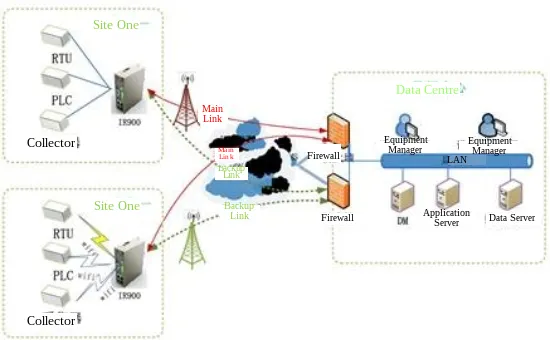

<strong>Fig. 1-1 Network diagram</strong>

## 1.2 Packing List

### Standard Accessories

| Accessories | Quantity | Description |
|-------------|----------|-------------|
| IR900 | 1 | IR900 series industrial 4G router |
| DIN-Rail | 1 | Router fixation |
| Power Terminal | 1 | 2-pin green power terminal |
| Cable | 1 | 1.5m cable |
| Antenna | 1 | 3G/4G antenna |

### Optional Accessories

| Accessories | Quantity | Description |
|-------------|----------|-------------|
| AC power cord | 1 | AC power cord |
| Power Adapter | 1 | 12VDC power adapter |
| Antenna | 1 | Wi-Fi antenna |
| Serial port cable | 1 | Serial port cable |

## 1.3 Panel Introduction

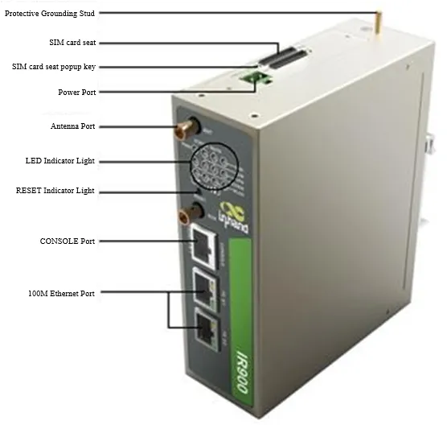

<strong>Fig. 1-2 Panel introduction</strong>

> **Note:** IR900 series has a variety of panel appearances, but all of the installation methods are the same. The specific panel condition should be subject to the real object.

### Interface Description

| Interface | Position | Function Description |
|-----------|----------|----------------------|
| Power Terminal | Rear | 2-pin green power terminal, 24VDC (12~48VDC) input |
| FE 0/1 | Front | Fast Ethernet port 0/1, default IP: 192.168.1.1 |
| FE 0/2 | Front | Fast Ethernet port 0/2, default IP: 192.168.2.1 |
| SIM Card Slot | Side | Dual micro-SIM card slots |
| Antenna Interface | Top/Side | 4G LTE antenna connectors (SMA-J) |
| RESET Button | Front | Restore factory settings button |
| Serial/IO Terminal | Rear | RS232/RS485 serial port and digital IO terminal (industrial interface models only) |
| Grounding Bolt | Rear | Protective grounding connection |

## 1.4 LED Indicator Description

### System Status LED

| LED | State | Meaning |
|-----|-------|---------|
| POWER (Red) | On | Powered on |
| STATUS (Green) | On | Powered on |
| | Blinking | Powered on succeed |
| WARN (Yellow) | On | Normal state |
| | Blinking | Dialing |
| ERROR (Red) | Off | Normal operation |
| | Blinking | Reset succeed / Upgrading |

### Signal Status LED

| Signal LED | State | Description |
|------------|-------|-------------|
| Green LED 1, 2, 3 | All Off | No signal |
| Green LED 1 On | On | Signal strength 1-9 (weak signal, check antenna and signal strength of current location) |
| Green LED 1, 2 On | On | Signal strength 10-19 (signal strength is basically normal) |
| Green LED 1, 2, 3 On | On | Signal strength 20-31 (signal strong) |

### Ethernet Status LED

| LED | State | Description |
|-----|-------|-------------|
| Green LED | On | ETH 100M, normal, no data transmission |
| | Blinking | ETH 100M, normal, there is data transmission |
| | Off | No connection |

### MODEM LED

| LED | State | Description |
|-----|-------|-------------|
| MODEM Green LED | On | Dialing succeed |
| | Blinking | Dialing failed |

### WLAN LED

| LED | State | Description |
|-----|-------|-------------|
| WLAN Green LED | On | Enable WLAN |
| | Off | Disable WLAN |

## 1.5 Restore Factory Settings

### Method 1: Via Web Interface

1. Log in to the WEB management page.
2. Click [Administration] > [Configuration Management] in the navigation tree.
3. Click `<Restore default configuration>` button.
4. The router will restore to default settings after reboot.

### Method 2: Via RESET Button

1. Locate the RESET button on the device panel.
2. Power on the device and continue holding down the RESET button for 10 seconds.
3. Release the RESET button when the ERR LED is illuminated.
4. After a few seconds, when the ERR LED goes off, press and hold the RESET button again.
5. Release the RESET button when the ERR LED is blinking. Shortly after, when the ERR LED goes off, the factory reset is successful.

## 1.6 Default Settings

| Parameter | Default Value |
|-----------|---------------|
| FE 0/1 IP Address | 192.168.1.1 |
| FE 0/2 IP Address | 192.168.2.1 |
| Subnet Mask | 255.255.255.0 |
| Web Login Username | adm (refer to device nameplate) |
| Web Login Password | Refer to device nameplate |
| Cellular | Enabled by default |
| DHCP Server | Enabled on FE 0/2 by default |
| Wi-Fi SSID | InRouter900 |
| Wi-Fi Authentication | Open type |

---

# Chapter 2 Installation and First Use

## 2.1 Pre-Installation Preparation

### Environment Requirements

| Item | Specification |
|------|---------------|
| Power supply | 24VDC (12~48VDC), rated current: 0.15~0.6A |
| Working temperature | -25°C ~ 70°C |
| Storage temperature | -40°C ~ 85°C |
| Relative humidity | 5%~95% (non-condensing) |

### Tools Required

- Screwdriver
- DIN rail (included) or wall-mount bracket (optional)
- Ethernet cable (included)
- Power cable
- SIM card (purchased separately)
- Antennas (included)

> **Caution:** Pay attention to the power voltage level before installation. Equipment surface may be high temperature; consider the surrounding environment before installation. Avoid direct sunlight, and keep away from heat sources or areas with strong electromagnetic interference.

## 2.2 Installation Guide

### 2.2.1 DIN Rail Mounting

1. Select the installation location for the equipment, ensuring there is enough space.
2. Slide the upper part of the DIN card holder onto the DIN rail. At the lower end of the device, apply slight upward force and rotate the device to secure the DIN card holder onto the DIN rail. Confirm that the equipment is securely installed on the DIN rail, as shown in Fig. 2-1.

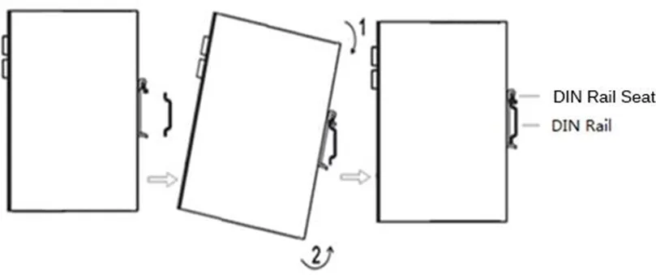

<strong>Fig. 2-1 DIN Rail-Based Installation</strong>

### DIN Rail Removal

1. Press down the equipment to make the bottom of the equipment off the DIN rail.
2. Rotate the equipment outward while simultaneously moving the lower end of the device outward. Once the lower end is detached from the DIN rail, lift the device upwards to remove it from the DIN rail, as shown in Fig. 2-2.

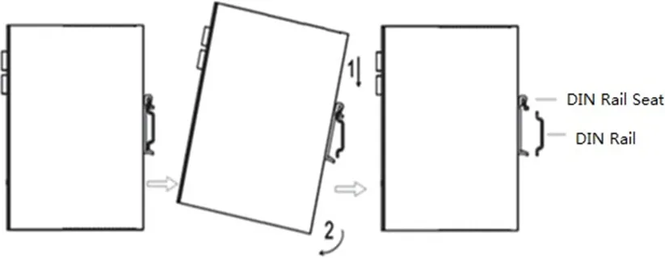

<strong>Fig. 2-2 DIN Rail-Based Removal</strong>

### 2.2.2 Wall-Mount Installation

1. Select the installation location of the device, making sure there is enough space.
2. Use a screwdriver to attach the wall mounting plate to the back of the device, as shown in Fig. 2-3.

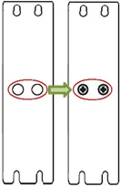

<strong>Fig. 2-3 Wall-Mount Bracket Installation</strong>

3. Take out the screw (packaged with wall mounting plate) and fix the screw at the installation location. Lower the device to ensure it is in a stable position, as shown in Fig. 2-4.

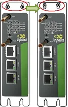

<strong>Fig. 2-4 Wall-Mount Installation</strong>

### Wall-Mount Removal

Hold the device with one hand and remove the fixing screw on the top of the device with the other hand, then detach the device from its mounting location.

### 2.2.3 SIM Card Installation

The IR900 supports dual micro-SIM cards. Push the hole on the left of the SIM card slot to eject it, then insert the SIM card, as shown in Fig. 2-5.

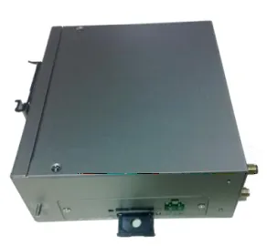

<strong>Fig. 2-5 SIM Card Installation</strong>

### 2.2.4 Antenna Installation

Rotate the metal interface clockwise until the movable part cannot be rotated. Do not hold the black rubber lining to twist the antenna, as shown in Fig. 2-6.

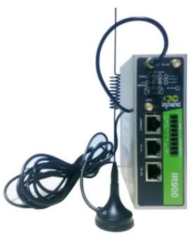

<strong>Fig. 2-6 Antenna Installation</strong>

> **Note:** The IR900 supports dual antennas: the ANT antenna and the AUX antenna. The ANT antenna is used for both data transmission and reception, while the AUX antenna is solely for enhancing signal strength and cannot be used for data transmission or reception independently. In most cases, using only the ANT antenna is sufficient. The AUX antenna is only used in conjunction with the ANT antenna when signal quality is poor and needs to be boosted.

### 2.2.5 Power Installation

1. Remove the terminals from the router.
2. Loosen the locking screws on the terminals.
3. Insert the power cables into the terminals and tighten the screws, as shown in Fig. 2-7.

<strong>Fig. 2-7 Power Installation</strong>

### 2.2.6 Protective Grounding Installation

1. Remove the grounding nut.
2. Slide the grounding ring of the cabinet ground wire onto the grounding bolt.
3. Tighten the grounding nut.

> **Note:** To enhance the router's overall immunity to interference, the router must be grounded when in use. Depending on the operating environment, connect the ground wire to the router's grounding bolt.

### 2.2.7 Terminal Connection (Industrial Interface Models)

The serial port and IO interface connections are achieved through terminal connections. Before use, the corresponding wires need to be connected to the terminals.

The device's serial port provides two interface modes: RS232 and RS485. IO interface input terminals: IN represents digital input terminals, and COM represents the ground terminal. IO interface output terminals: RELAY represents the relay output terminal.

For installation, remove the terminals from the device, loosen the locking screws on the terminals, insert the corresponding cables into the terminals, and then tighten the screws. The arrangement of the wires is as shown in Fig. 2-8.

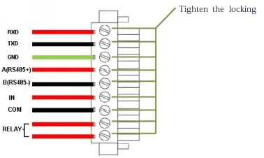

<strong>Fig. 2-8 Terminal Wire Arrangement</strong>

## 2.3 First Login

### 2.3.1 PC Network Configuration

Set the IP address of the management computer within the same network segment as the router's FE port IP address (the router has two FE ports, with the initial IP address of FE 0/1 port being 192.168.1.1, and the initial IP address of FE 0/2 port being 192.168.2.1, with a subnet mask of 255.255.255.0). The following is an example of setting up the connection between FE 0/2 port and a management computer, as shown in Fig. 2-9.

<strong>Fig. 2-9 Network Configuration for PC</strong>

### 2.3.2 Logging into the Router

Access the default IP address 192.168.2.1 in a browser, enter username and password (refer to the nameplate at the bottom of the device for login credentials) in the pop-up window and then access the router's WEB management page. If the browser alarms the connection is not private, click advanced, and proceed to access the address, as shown in Fig. 2-10.

<strong>Fig. 2-10 Login Interface</strong>

> **Note:** The router allows up to four users to manage through the Web setting page. When multi-user management is implemented for the router, it is suggested not to conduct configuration operation for the router at the same time; otherwise it may lead to inconsistent data configuration. For security, modify the default login password after the first login and safe keep the password information.

## 2.4 Quick Check

After installation is complete, verify the following:

- [ ] Power LED is on (red)
- [ ] STATUS LED is blinking (green)
- [ ] WARN LED is on or blinking (yellow)
- [ ] ERROR LED is off
- [ ] PC can ping the router's default IP address (192.168.1.1 or 192.168.2.1)
- [ ] Web management page can be accessed via browser
- [ ] SIM card is properly inserted (if using cellular)
- [ ] Antenna is properly connected (if using cellular)
- [ ] Grounding wire is properly connected

---

# Chapter 3 Common Scenario Configuration

## Scenario 1: Cellular Internet Access

**Objective:** Access the Internet via 4G LTE cellular network.

**Prerequisites:** SIM card is inserted, antenna is installed, and the device is powered on.

**Estimated Time:** About 10 minutes.

**Operation Steps:**
1. Insert the SIM card when device is powered off. Connect the 4G antenna to the router, and connect the PC to the router. Then power on.
2. Open a browser and access the router's WEB management page.
3. Click [Network] > [Cellular], and set the profile. The device enables the cellular by default; it will connect to the Internet within a few minutes. If the device cannot connect to the Internet, disable and restart dialup. (If a private network SIM card is used, the APN parameter also needs to be configured.)

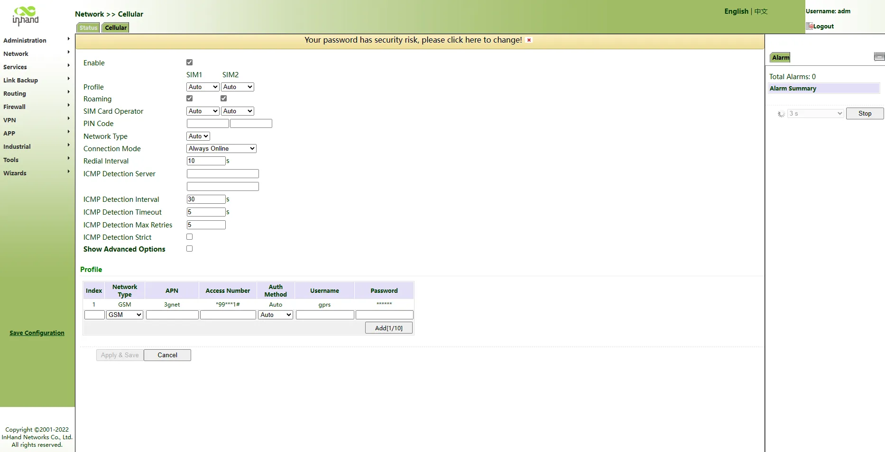

<strong>Fig. 3-1 Cellular Configuration Page</strong>

4. Click [Network] > [Cellular] and view the Status page. On this page, the network connection status can be viewed and the IP address obtained by the router can be checked. Alternatively, verify by opening a web page.

**Verification Method:**
1. Check the indicator light status and confirm that the network connection is normal (MODEM LED is on).
2. Visit any Internet website and confirm that it can be opened normally.

**Common Issues:**
- Network connection failure: Check whether the SIM card is correctly inserted and whether the APN parameters are correct.
- Data sending/receiving abnormality: Check signal strength and data balance.

---

## Scenario 2: Connect to Device Manager

**Objective:** Connect the router to the InHand Device Manager (DM) platform for remote management.

**Prerequisites:** The router has already connected to the Internet.

**Estimated Time:** About 10 minutes.

**Operation Steps:**
1. Ensure the router has already connected to the Internet.
2. Click [Administration] > [Device Manager] to set the router to connect to DM. The domain "iot.inhandnetworks.com" is the server for global.
3. Fill in the DM account in Registered Account, then click `<Apply & Save>` to save the configuration.
4. If there is no DM account, click `<Sign up/Sign in>` after selecting the server, then follow the instructions to register an account.

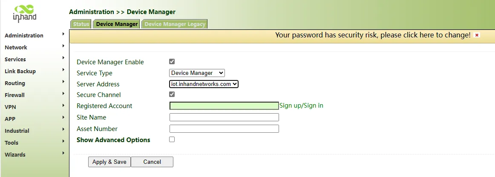

<strong>Fig. 3-2 Device Manager Configuration Page</strong>

5. Log in to the account in Device Manager, and add the device in "Gateways". Name the device and fill in the serial number from the device, then the router can be managed in DM.

The serial number can be found in [Status] > [System], or at the back of the device.

<strong>Fig. 3-3 System Status Page</strong>

<strong>Fig. 3-4 Device Serial Number Location</strong>

**Verification Method:**
1. Check the Device Manager platform to confirm the device is online.
2. Verify that remote operations (such as checking status) can be performed.

**Common Issues:**
- Device cannot connect to DM: Check whether the router can access the Internet and whether the server address and port are correct.
- Device shows offline in DM: Check the serial number and account information.

---

## Scenario 3: Configure Dynamic Domain Name (DDNS)

**Objective:** Map the dynamic IP address obtained via dial-up to a fixed domain name service.

**Prerequisites:** The router is connected to the Internet via dial-up and has obtained a public IP address.

**Estimated Time:** About 10 minutes.

**Operation Steps:**
1. Click [Network] > [Dynamic DNS] to enter the DDNS configuration page.
2. Configure the parameters of the dynamic domain name. Refer to Fig. 3-5 for tailored domain name parameters and Fig. 3-6 for general domain name parameters.
3. Save the configuration and wait for a few minutes.
4. Ping the domain name to confirm the successful configuration of the dynamic domain name.

**Verification Method:**
1. Ping the configured domain name from an external network and confirm it resolves to the router's IP address.

**Common Issues:**
- DDNS update failure: Check whether the username, password, and host name are correct.
- Domain name cannot be resolved: Confirm that the router has obtained a public IP address (private IP addresses do not support DDNS).

---

## Scenario 4: Import/Export Configuration

**Objective:** Back up the current configuration or import a saved configuration.

**Prerequisites:** The router is powered on and the Web management page is accessible.

**Estimated Time:** About 5 minutes.

**Operation Steps:**
1. Log in to the WEB management page, click [Administration] > [Configuration Management] in the navigation tree.
2. To import: Click `<Browse>` to select a configuration file, then click `<Import>`. Reboot the system after the configuration file is imported to take effect.
3. To export: Click `<Backup running-config>` to export and save the currently applied configuration parameter files. The format of exported files is .cnf, default file name is running-config.cnf.
4. Click `<Backup startup-config>` to export and save the configuration parameter files in the equipment starting process. The format of exported files is .cnf, default file name is startup-config.cnf.

<strong>Fig. 3-5 Configuration Management Page</strong>

**Verification Method:**
1. After importing, verify that the configuration has been applied by checking the relevant settings.
2. After exporting, verify that the .cnf file has been downloaded successfully.

**Common Issues:**
- Import failure: Ensure the configuration file is valid and arranged in the correct order.
- Configuration not taking effect: Reboot the router after importing the configuration.

---

## Scenario 5: Download Logs and Diagnostics

**Objective:** Download system logs and diagnostic data for troubleshooting.

**Prerequisites:** The router is powered on and the Web management page is accessible.

**Estimated Time:** About 5 minutes.

**Operation Steps:**
1. Log in to the WEB management page, click [Administration] > [Log] in the navigation tree.
2. Click `<Download Log File>` to download logs from the router.
3. Click `<Download Diagnosing Data>` to download diagnostic records from the router.

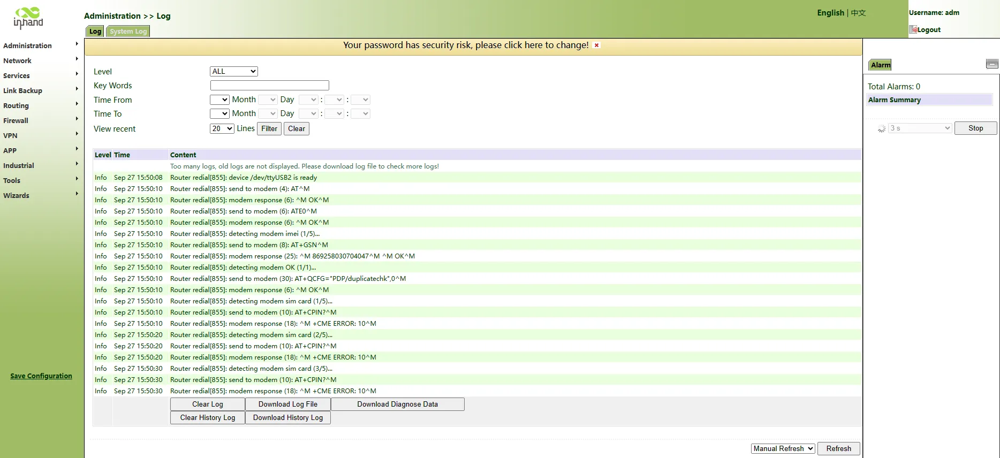

<strong>Fig. 3-6 Log and Diagnose Page</strong>

**Verification Method:**
1. Confirm that the log file and diagnostic data file have been downloaded successfully.

**Common Issues:**
- Download failure: Check the browser settings and network connection.

---

# Chapter 4 Feature Description and Parameter Reference

## 4.1 Management

The management module includes 12 function modules: system, system time, management access, AAA, configuration management, SNMP, alarm, system log, system upgrade, reboot, network management platform, and GPS locating information.

### 4.1.1 System

The system page displays system and network state. The system time of synchronizing device and PC can be checked, and the router WEB configuration interface language can be set as well as the name of the mainframe of the router can be customized. The configuration interface can be directly entered via "Settings" after clicking Cellular1, Fastethernet 0/1 and Fastethernet 0/2 under network state.

### 4.1.2 System Time

To ensure coordination between this device and other devices, the system time needs to be set accurately. This function is used to configure and check system time as well as system time zone. System time can be set as any expected value after Year 2000 manually. Users can also use SNTP to achieve time synchronization of all devices equipped with a clock on the network.

**Table 4-1-1 SNTP Client Parameter Description**

| Parameters | Description | Default |
|------------|-------------|---------|
| Enable | Enable/Disable SNTP client | Disable |
| Update Interval | Synchronization time intervals with SNTP server | 3600 |
| Source Interface | Cellular1, Fastethernet 0/1 and Fastethernet 0/2 | None |
| Source IP | The corresponding IP of source interface | None |
| **SNTP Servers List** | | |
| Server Address | SNTP server address (domain name /IP), maximum 10 SNTP servers | None |
| Port | The service port of SNTP server | 123 |

> **Note:** Before setting a SNTP server, ensure the SNTP server is reachable. Especially when the IP address of the SNTP server is a domain, ensure the DNS server has been configured correctly. Users should configure either Source Interface or Source IP. Source Interface and source IP cannot be configured at the same time. When setting multiple SNTP servers, the system will poll all SNTP servers until an available SNTP server is found.

### 4.1.3 Admin Access

Admin Access allows creating users, modifying users, and managing services. Users include Super User and Common User:

- Super user: Only one super user is automatically created by the system, username adm. It has all access rights to the router.
- Common user: Created by super user. Common users can view router configurations but do not have access to change configurations.

User rights include three levels:

1. User right 1-11: Only access to parameter check rather than configuration.
2. User right 12-14: Access to configure LAN IP, system time setting, basic configuration of firewall, virtual IP mapping table, system log, certificate application, access control, static routing, system upgrade, and tool-ping detection. Others are shown as grey, which can be checked but the configuration cannot be modified.
3. User right 15: Access to the check and configuration for all parameters.

Management services include HTTP, HTTPS, TELNET, and SSH.

1. **HTTP:** Users can log in to the device via HTTP and access and control it through Web after clicking the "enable" button.
2. **HTTPS:** HTTPS (security version of hypertext transfer protocol) is HTTP which supports SSL.
3. **TELNET:** After clicking the "enable" button, users can provide remote login via network. Depending on Server/Client, Telnet Client could send requests to Telnet server which provides Telnet services. The device supports Telnet Client and Telnet Server.
4. **SSH:** Based on the RSA certification or the measures of encrypting username password and data transmission via encryption algorithm DES, 3DES and AES128, secure remote login can be provided via insecure network. IR900 only supports SSH server and it can receive many connections from SSH client.

**Table 4-1-2 Management Service Parameter Description**

| Parameters | Description | Default |
|------------|-------------|---------|
| HTTP | Hypertext Transfer Protocol, Plaintext Transmission, Port: 80. | On |
| HTTPS | Secure SSL Encryption Transmission Protocol. Port: 443 | Off |
| TELNET | Standard protocol and main way for Internet telnet service. Port: 23 | On |
| SSH | Port: 22. **Timeout:** timeout of SSH session. No operation within this period on SSH Client, SSH Server disconnect. Default: 120s. **Cipher Mode:** set up public key encryption method (currently only RSA supported). **Cipher Code Length:** set up cipher code length, 512 or 1024. Default: 1024 | Off |

### 4.1.4 AAA

AAA access control is used to control visitors and corresponding services available as long as access is allowed. The same method is adopted to configure three independent safety functions. It provides modularization methods for the following services:

1. Authentication: Verify whether the user is qualified to access the network.
2. Authorization: Related services available.
3. Charging: Records of the utilization of network resources.

1) Radius

UDP protocol, generally applied in various network environments with higher requirements on security and that permit remote user access.

2) Tacacs+

TCP protocol, mainly used for authentication, authorization and charging of access users and terminal users adopting PPP and VPDN.

3) LDAP

LDAP, simple as a table, only requires username, command, and other information.

**Table 4-1-3 LDAP Parameter Description**

| Parameters | Description | Default |
|------------|-------------|---------|
| Name | Customized server name | None |
| Server Address | Server address (domain name / IP) | None |
| Port | Consistent with the server port | None |
| Base DN | The top of LDAP directory tree | None |
| Username | Username accessing the server | None |
| Password | Password accessing the server | None |
| Security | Encryption mode: None, SSL, StartTLS | None |
| Verify opposite end | Click to enable | Unopened |

4) AAA

AAA supports the following authentication ways:

1. None: With great confidence to users, legal check omitted, generally not recommended.
2. Local: Have user's information stored on NAS. Advantages: rapidness, cost reduction. Disadvantages: storage capacity limited by hardware.
3. Remote: Have user's information stored on authentication server. Radius, Tacacs+ and LDAP supported for remote authentication.

AAA supports the following authorization ways:

1. None: Authorization rejected.
2. Local: Authorization based on relevant attributions configured by NAS for local user's account.
3. Tacacs+: Authorization done by Tacacs+ Server.
4. Radius Authentication Based: Authentication bonded with authorization, authorization only by Radius not allowed.
5. LDAP Authorization

> **Note:** Authentication 1 should be set consistently with Authorization 1; Authentication 2 should be set consistently with Authorization 2; Authentication 3 should be set consistently with Authorization 3. When configuring radius, Tacacs+, and local at the same time, priority order follows: 1 > 2 > 3.

### 4.1.5 Configuration Management

This page can back up the configuration parameters, import the desired parameters configuration backup, and reset the router.

**Table 4-1-4 Configuration Management Parameter Description**

| Parameters | Description | Default |
|------------|-------------|---------|
| Browse | Choose the configuration file | None |
| Import | Import configuration file to router startup-config | None |
| Backup running-config | Backup running-config file to host. | None |
| Backup startup-config | Backup startup-config file to host. | None |
| Automatically save modified configuration | Decide whether to automatically save configuration after modifying the configuration. | On |
| Restore default configuration | Restore factory configuration | None |

> **Note:** Validity and order of imported configurations should be ensured. When importing the configuration, the system will filter incorrect configuration commands, and save the correct configuration as startup-config. When the system restarts, it will orderly execute these configurations. If the configuration files are not arranged according to effective order, the system will not enter the desired state. In order not to affect the current system running, when performing the import configuration and restoring the default configuration, the new configuration will take effect after rebooting the router.

### 4.1.6 SNMP

Administrator is required to carry out configuration and management of all devices in the same network, which are scattered, making onsite device configuration impracticable. Moreover, in case that those network devices are supplied by different manufacturers and each manufacturer has its independent management interfaces (for example, different command lines), the workload of batch configuration of network devices will be considerable. Therefore, under such circumstances, traditional manual ways will result in lower efficiency at higher cost. At that time, network administrator would make use of SNMP to carry out remote management and configuration of attached devices and achieve real-time monitoring.

Figure showing how to manage devices through SNMP is shown below:  

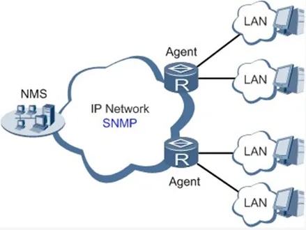

<strong>Fig. 4-1 SNMP Management Diagram</strong>

Through SNMP:

1. NMS could collect status information of devices whenever and wherever and achieve remote control of devices under management through Agent.
2. Agent could timely report current status information of the device to NMS. In case of any problem, NMS will be notified immediately.

Currently, SNMP Agent of the device supports SNMPv1, SNMPv2c, and SNMPv3 versions. SNMPv1 and SNMPv2c employ community name authentication; SNMPv3 employs the authentication encryption way of username and password.

**Table 4-1-5 SNMPv1 and SNMPv2c Parameter Description**

| Parameters | Description | Default |
|------------|-------------|---------|
| Enable SNMP | Enable/disable SNMP | Disable |
| SNMP version | Select SNMP version of management router, support SNMP v1/v2c/v3 | v2c |
| Contact information | Fill contact information | Beijing_Inhand_Networks_Technology_Co.,Ltd. |
| Location information | Fill location information | Beijing_China |
| **Community Management** | | |
| Community Name | User define Community Name | Public and private |
| Access Limit | Select access limit | ro (Read-only) |
| MIB View | Select MIB View | defaultView |

**Table 4-1-6 SNMPv3 Parameter Description**

| Parameters | Description | Default |
|------------|-------------|---------|
| **User Group Management** | | |
| Groupname | User define, length: 1-32 characters | None |
| Security Level | Includes NoAuth/NoPriv, Auth/NoPriv, Auth/priv | NoAuth/NoPriv |
| Read-only View | Only support defaultView at present | defaultView |
| Read-write View | Only support defaultView at present | defaultView |
| Inform View | Only support defaultView at present | defaultView |
| **User Management** | | |
| Username | User define, length: 1-32 characters | None |
| Authentication mode | Select authentication mode, including MD5 and SHA. Select "NoAuth" to disable it | SHA |
| Authentication Password | Enter authentication password only when authentication mode is not "NoAuth". | None |
| Encryption mode | Select whether to employ DES encryption mode | DES |
| Encrypted password | Enter encrypted password only when encryption mode is not "NoPriv". Length: 8-32 characters | None |
| Groupname | Select corresponding user group, which should be identified firstly in the management table of groupname | None |

SNMP trap: A certain port where devices under the management of SNMP will notify the SNMP manager rather than waiting for polling from the SNMP manager.

**Table 4-1-7 SnmpTrap Configuration Parameter Description**

| Parameters | Description | Default |
|------------|-------------|---------|
| Host Address | Fill in the NMS IP address | None |
| Security Name | Fill in the groupname when using SNMP v1/v2c; Fill in the username when using SNMP v3. Length: 1-32 characters | None |
| UDP Port | Fill in UDP port, the default port range is 1-65535 | 162 |

### 4.1.7 Alarm

The alarm function is provided for users to get exceptions of the device, which can help users find and solve exceptions as soon as possible. When abnormality happens, the device will send an alarm. Users can choose many kinds of exceptions which the system defined and choose an appropriate notice way to get these exceptions. All the exceptions should be recorded in the alarm log so that users can troubleshoot problems.

**According to the type of alarm, it can be divided into system alarm and port alarm:**

1. System Alarm: Produced because of system or environment exceptions, divided into hot start, cold start, and insufficient memory.
2. Port Alarm: Produced because of the network interface being up or down, divided into LINK-UP and LINK-DOWN.

**Alarm status:**

1. Raise: Alarm is not confirmed.
2. Confirm: Alarm is temporarily unable to be resolved by users.
3. All: All alarms occurred.

**Alarm level:**

1. EMERG: Device occurs some faults, it could lead to the system restart.
2. CRIT: Device occurs some faults which are unrecoverable.
3. WARN: Device occurs some faults which could affect system function.
4. NOTICE: Device occurs some faults which could affect system properties.
5. INFO: Device occurs some normal events.

**The following operations are feasible via alarm configuration dialog:**

1. On the "Alarm Status" page, all the alarms since the system was powered on can be viewed.
2. On the "Alarm Input" page, alarm types of concern can be defined.
3. On the "Alarm Output" page, the way of alarm notice can be set. Log record is a default output way.
4. On the "Alarm Map" page, the alarm type of concern can be mapped to one or more alarm notice ways. Alarm Map includes two types: CLI (console port) and Email.

### 4.1.8 System Log

System Log includes massive information about the network and devices, including operating status, configuration changes, and so on. Remote log server is feasible, and the router will upload all system logs to the remote log server, which requires the cooperation of remote log software of the mainframe.

> **Note:** When downloading system diagnosis records, configuration information of the router will also be downloaded.

### 4.1.9 System Upgrading

The upgrading process can be divided into two steps. In the first step, upgrading files will be written in the backup firmware zone; in the second step, files in the backup firmware zone will be copied to the main firmware zone, which should be carried out during system restart. During software upgrading, any operation on the web page is not allowed, otherwise software upgrading may be interrupted.

### 4.1.10 Reboot

Save the configurations before reboot, otherwise the configurations that are not saved will be lost after reboot.

### 4.1.11 Device Management

Device Management is a software platform to manage equipment. The equipment can be managed and operated via the software platform when Device Management is started so that the Internet can be in efficient operation. For instance, the operating status of equipment can be checked, equipment software can be upgraded, equipment can be restarted, configuration parameters can be sent down to equipment, and transmitting control or message query can be realized on equipment via Device Management.

**Table 4-1-8 Device Management Parameter Description**

| Parameters | Description | Default |
|------------|-------------|---------|
| Schema | Message + IP | Forbidden |
| Supplier | Set name of equipment supplier | default |
| Equipment ID | Unaltered equipment ID | |
| server | Set IP address of device management | c.inhandnetworks.com |
| Port | Set port No. of device management | 9002 |
| Login retry times | Set retry times | 3 |
| Heartbeat interval time | Set heartbeat interval | 120 seconds |
| Serial port type | RS232/RS485 | RS232 |

### 4.1.12 GPS Locating Information

The GPS function can be enabled or disabled and GPS IP transfer and GPS serial port transfer can be configured. GPS IP transfer has two types: client and server.

**Table 4-1-9 GPS-IP Transfer Parameter Description**

| Parameters | Description | Default |
|------------|-------------|---------|
| **GPS IP Transfer-Client** | | |
| Protocol | TCP or UDP | TCP |
| Connection Type | Long connection or short connection. Keep consistency with server | Long connection |
| Heartbeat interval time | User define | 100s |
| Heartbeat retry times | User define | 10 |
| Min. Reconnect Interval | User define | 15s |
| Max. Reconnect Interval | User define | 180s |
| Source Interface | Interface used to connect equipment with server | None |
| Information reporting interval | User define | 30s |
| Including RMC | Send RMC data of GPS data | Enabled |
| Including GSA | Send GSA data of GPS data | Enabled |
| Including GGA | Send GGA data of GPS data | Enabled |
| Including GSV | Send GSV data of GPS data | Enabled |
| Message prefix | User define | None |
| Message suffix | User define | None |
| **GPS IP Transfer-Client-Objective IP Address** | | |
| Server Address | Server address reported by GPS data | None |
| Server Port | Report the port number of server | None |
| **GPS IP Transfer-Server** | | |
| Connection Type | Long connection or short connection. Keep consistency with client | Long connection |
| Heartbeat interval time | User define | 60s |
| Heartbeat retry times | User define | 5 |
| Information reporting interval | User define | 30s |
| Including RMC | Send RMC data of GPS data | Enabled |
| Including GSA | Send GSA data of GPS data | Enabled |
| Including GGA | Send GGA data of GPS data | Enabled |
| Including GSV | Send GSV data of GPS data | Enabled |
| Message prefix | User define | None |
| Message suffix | User define | none |

**Table 4-1-10 GPS Serial Port Transfer Parameter Description**

| Parameters | Description | Default |
|------------|-------------|---------|
| Serial Port Type | Keep consistency with opposite end | RS232 |
| Baud Rate | Keep consistency with opposite end | 9600 |
| Data Bit | Keep consistency with opposite end | 8 bits |
| Parity | Keep consistency with opposite end | No check |
| Stop Bit | Keep consistency with opposite end | 1 bits |
| Software Flow Control | Click to enable | Disabled |
| Including RMC | Send RMC data of GPS data | Enabled |
| Including GSA | Send GSA data of GPS data | Enabled |
| Including GGA | Send GGA data of GPS data | Enabled |
| Including GSV | Send GSV data of GPS data | Enabled |

---

## 4.2 Network

The network module includes 10 function modules in total: Ethernet port, dialup port, ADSL dialing (PPPoE), loopback interface, DHCP service, DNS service, dynamic DNS, SMS, VLAN port, and WLAN port.

### 4.2.1 Ethernet Port

Ethernet Port supports three connection modes:

1. Automatic: Configuration interface as DHCP Client and IP address obtained by DHCP.
2. Manual: Manually configure IP address and subnet mask for the interface.
3. PPPoE: Configuration interface as PPPoE Client.

The connection of Ethernet port here is manual mode, namely, manually configuring an IP address and subnet mask.

**Table 4-2-1 Ethernet Port Parameter Description**

| Parameters | Description | Default |
|------------|-------------|---------|
| Primary IP | IP address could be configured or changed according to demand | 192.168.1.1 |
| Subnet Mask | Auto generation | 255.255.255.0 |
| MTU | Maximal transmission unit, byte as the unit | 1500 |
| Speed/Duplex | Five options: Auto Negotiation, 100M Full Duplex, 100M Half-Duplex, 10M Full Duplex and 10M Half-Duplex | Auto Negotiation |
| Track L2 State | On: Port status after disconnection: Down. Off: Port status after disconnection: UP | Off |
| Description | User defines the description | N/A |
| Multi-IP Settings | In addition to the primary IP, user could set Secondary IP addresses, 10 maximum. | N/A |

> **Note:** In factory default state, DNS of PC connected at the lower end of F0/1 cannot be applied with the original port IP of F0/1, otherwise, public domain cannot be visited. But visiting public domain can be realized by starting DHCP server or setting other DNS servers.

**Table 4-2-2 Bridge Interface Parameter Description**

| Parameters | Description | Default |
|------------|-------------|---------|
| Bridge ID | Bridge ID can only be matched with 1 | No |
| **Bridge Interface** | | |
| IP Address of Main Address and Subnet Mask | Main IP address and subnet mask can be matched or modified according to the demand | No |
| IP Address of Slave Address and Subnet Mask | Users can be matched with IP address and subnet mask except for main IP | No |
| **Bridge Member** | | |
| Click through the name of interface starting bridge interface | | No |

### 4.2.2 Dialup Port

SIM card dial out through dial access to achieve the wireless network connection function of the router.

IR900 supports dial SIM card for backup. When the primary SIM card breaks down or balance insufficiency results in network disconnection, rapid switching to the backup SIM card is available, which will assume the task of network connection so as to improve the reliability of network connection.

Dial access supports three ways of connection: Always Online, Dial on Demand, and Manual Dial.

**Table 4-2-3 Dialup Port Parameter Description**

| Parameters | Description | Default |
|------------|-------------|---------|
| Dialup parameter set | Dial-up strategy | 1 |
| Roaming | Enable/Disable roaming | Enable |
| PIN Code | SIM card PIN code | None |
| Network Type | Five options: Auto, 2G, 3G, 4G and 3G2G | Auto |
| Static IP | Enable Static IP if the SIM card can get static IP address | Disable |
| Connection Mode | Optional: Always Online, dial on demand (data activation, phone activation, SMS activation are allowed), manual dialing | Always Online |
| Redial Interval | The time interval between first dial fails can redial | 10s |
| ICMP Detection Server | Far-end IP address to be detected | None |
| ICMP Detection Interval | Set ICMP Detection Interval | 30s |
| ICMP Detection Timeout | Set ICMP Detection Timeout | 5s |
| ICMP Detection Max Retries | Set the max number of retries if ICMP failed (redial if reaching max. times) | 5 |
| ICMP Detection Strict | Click to enable | Disable |
| **Dialup Parameter Set** | | |
| Network Type | Choose mobile network type | GSM |
| APN (inapplicable to CDMA2000 series) | Mobile operator provides relevant parameters (according to ISP) | 3gnet |
| Access Number | Mobile operator provides relevant parameters (according to ISP) | *99***1# |
| Username | Mobile operator provides relevant parameters (according to ISP) | gprs |
| Password | Mobile operator provides relevant parameters (according to ISP) | ****** |
| **Advanced Options (following items are relevant parameters after enabling advanced options)** | | |
| Initial Commands | Used for advanced parameters, no need to be filled in generally | None |
| RSSI Poll interval | Set the signal query interval | 120s |
| Dial Timeout | Dial timeout, the system will redial | 120s |
| MTU | Set max transmit unit, in bytes | 1500 |
| MRU | Set max receive unit, in bytes | 1500 |
| Use default asyncmap | Enable default asyncmap | Forbidden |
| Use Peer DNS | Receiving mobile operators assigned DNS | Enable |
| Link detection interval | Set link detection interval | 55s |
| Link detection Max Retries | Set the max retries if link detection failed (redial if reaching max. times) | 5 |
| Debug | System can print a more detailed log | Enable |
| Expert Option | Provide extra PPP parameters, normally user needn't set this. | None |
| Dual SIM Enable | Enable dual SIM card mode (following items are relevant parameter configuration after enabling) | Disable |
| Main SIM | Choose to be a SIM card of main card | SIM1 |
| Max Number of Dial | Set Max. dialing times (Reach the max number, SIM card will be switched) | 5 |
| Min Connected Time | Set min. connection time | 0s |
| Signal threshold | Set signal threshold (signal detection will be performed again when lower than signal threshold) | 0 |
| Signal detect interval | Set signal detect interval | 0 |
| Signal detect retries | Set signal detect retries (redial if reaching max. times) | 0 |
| Backup SIM Timeout | From beginning to switch to the backup card counting, exceeds the timeout, router will switch to the primary card | 0 |

### 4.2.3 ADSL Dialing (PPPoE)

PPPoE is a point-to-point protocol over Ethernet. The user has to install a PPPoE Client on the basis of the original connection way. Through PPPoE, remote access devices could achieve the control and charging of each accessed user.

Connection mode at Ethernet port must be PPPoE, namely, the configuration interface must be the PPPoE Client.

**Table 4-2-4 PPPoE Parameter Description**

| Parameters | Description | Default |
|------------|-------------|---------|
| Pool ID | User define, easy to memorize and manage | None |
| Interface | Fastethernet0/1 and Fastethernet0/2 are choosable | Fastethernet0/1 |
| **PPPoE List** | | |
| ID | User define, easy to memorize and manage | 1 |
| Pool ID | Same as the dialup pool | None |
| Authentication Type | Auto, PAP, CHAP | Auto |
| User Name | Operators provide the relevant parameters | None |
| Password | Operators provide the relevant parameters | None |
| Local IP Address | Set the IP address assigned for Ethernet interface | None |
| Remote IP Address | Set the IP of remote device | None |

### 4.2.4 Loopback Interface

Loopback interface is used to take the place of the router's ID since as long as an active interface is used, when it turns to DOWN, the ID of the router has to be selected again, resulting in a long convergence time of OSPF. Therefore, generally the loopback interface is recommended as the ID of the router.

Loopback interface is a logic and virtual interface on the router. Under default conditions, a router has no loopback interface which can be created for a number as required. Those interfaces are the same as physical interfaces on the router: addressing information allocated, including their network number in router upgrade and even IP connection could be terminated on them.

**Table 4-2-5 Loopback Interface Parameter Description**

| Parameters | Description | Default |
|------------|-------------|---------|
| IP Address | Users cannot change | 127.0.0.1 |
| Netmask | Users cannot change | 255.0.0.0 |
| Multi-IP Settings | Apart from the above IP, user can configure other IP address | N/A |

> **Note:** Since the loopback interface monopolizes one IP address, subnet mask is generally suggested to be 255.255.255.255 for the purpose of saving resources.

### 4.2.5 DHCP Service

DHCP adopts Client/Server communication mode. The Client sends a configuration request to the Server which feeds back corresponding configuration information, including distributed IP address to the Client to achieve the dynamic configuration of IP address and other information.

1. The duty of DHCP Server is to distribute IP address when Workstation logs on and ensure each workstation is supplied with a different IP address. DHCP Server has simplified some network management tasks requiring manual operations before to the largest extent.
2. As DHCP Client, the device receives the IP address distributed by DHCP server after logging in to the DHCP server, so the Ethernet interface of the device needs to be configured into an automatic mode.

**Table 4-2-6 DHCP Server Parameters**

| Parameters | Description | Default |
|------------|-------------|---------|
| Enable | On/Off | Off |
| Interface | Fastethernet 0/1 and Fastethernet 0/2 available | Fastethernet 0/1 |
| Starting Address | Dynamical distribution of starting IP address | N/A |
| Ending Address | Dynamical distribution of ending IP address | N/A |
| Lease | Dynamical distribution of IP validity | 1440 |
| DNS Server | One or two, or None | N/A |
| WINS | Setup of WINS, generally left blank | N/A |
| **Static IP Setup** | | |
| MAC Address | Set up a static specified DHCP's MAC address (different from other MACs to avoid confliction) | 0000.0000.0000 |
| IP Address | Set up a static specified IP address (within the scope from start IP to end IP) | N/A |

> **Note:** If the host connected with the router chooses to obtain IP address automatically, then such service must be activated. Static IP setup could help a certain host to obtain a specified IP address. InRouter900 F0/2 enables DHCP server by default; obtaining IP address automatically is suggested. Generally, DHCP data packet is unable to be transmitted through the router. That is to say, DHCP Server is unable to provide DHCP services for two or more devices connected with a router remotely. Through DHCP relay, DHCP requests and response data packets could go through many routers.

**Table 4-2-7 DHCP Transfer Parameters**

| Parameters | Description | Default |
|------------|-------------|---------|
| Enable | On/Off | Off |
| DHCPServer | Set DHCP server; up to 4 servers can be configured | N/A |
| Source address | Address of the interface connected to the DHCP server | N/A |

### 4.2.6 DNS Services

DNS (Domain Name System) is a DDB used in TCP/IP application programs, providing switch between domain name and IP address. Through DNS, the user could directly use some meaningful domain name which could be memorized easily and the DNS Server in the network could resolve the domain name into the correct IP address.

The device supports achieving the following two functions through domain name service configuration:

1. DNS Server: For dynamic domain name resolution.
2. DNS relay: The device, as a DNS Agent, relays DNS request and response messages between DNS Client and DNS Server to carry out domain name resolution in lieu of DNS Client.

Manually set the DNS; use DNS via dialing if it is empty. Generally, it needs to set this only when using the static IP at the WAN port.

**Table 4-2-8 DNS Parameters**

| Parameters | Description | Default |
|------------|-------------|---------|
| Primary DNS | User define Primary DNS address | N/A |
| Secondary DNS | User define Secondary DNS address | N/A |

DNS forwarding is open by default. The specified [Domain Name <=> IP Address] can be set to let the IP address match with the domain name, thus allowing access to the appropriate IP through accessing the domain name.

**Table 4-2-9 DNS Transfer Parameters**

| Parameters | Description | Default |
|------------|-------------|---------|
| Enable DNS Relay | On/Off | On |
| Host | Domain Name | N/A |
| IP Address 1 | Set IP Address 1 | N/A |
| IP Address 2 | Set IP Address 2 | N/A |

> **Note:** Once DHCP is turned on, DNS relay will be turned on as default and cannot be turned off; to turn off DNS relay, DHCP Server has to be closed first.

### 4.2.7 Dynamic Domain Name

DDNS maps the user's dynamic IP address to a fixed DNS service. When the user connects to the network, the client program will pass the host's dynamic IP address to the server program on the service provider's host through information passing. The server program is responsible for providing DNS service and realizing dynamic DNS. DDNS captures the user's each change of IP address and matches it with the domain name, so that other Internet users can communicate through the domain name.

DDNS serves as a client tool of DDNS and is required to coordinate with DDNS Server. Before the application of this function, a domain name shall be applied for and registered on a proper website such as [www.3322.org](http://www.3322.org/). After the settings of dynamic domain name on the device, a corresponding relationship between the domain name and IP address of WAN port of the device is established.

IR900 DDNS service types include DynAccess, QDNS (3322)-Dynamic, QDNS (3322)-Static, DynDNS-Dynamic, DynDNS-Static, and NoIP.

**Table 4-2-10 DDNS Parameters**

| Parameters | Description | Default |
|------------|-------------|---------|
| Method Name | User define | None |
| Service Type | Select the domain name service providers | None |
| User Name | User name assigned in the application for dynamic domain name | None |
| Password | Password assigned in the application for dynamic domain name | None |
| Host Name | Host name assigned in the application for dynamic domain name | None |
| Method | The update method of specified interface | None |

> **Note:** If the IP address obtained via router dialing is a private address, the dynamic DNS function is not available.

### 4.2.8 SMS

SMS permits message-based reboot and manual dialing. Configure Permit action to Phone Number and click `<Apply & Save>`. After that, send "reboot" command to restart the device or "cellular 1 ppp up/down" to redial or disconnect the device.

**Table 4-2-11 SMS Parameters**

| Parameters | Description | Default |
|------------|-------------|---------|
| Enable | On/Off | Off |
| Mode | TEXT and PDU | TEXT |
| Poll Interval | User define Poll Interval | 120 |
| **SMS Access Control** | | |
| ID | User define ID | 1 |
| Action | Permit and refuse are available | Permit |
| Phone Number | Trusting phone number | N/A |

### 4.2.9 VLAN Interface

VLAN is a kind of new data exchange technology that realizes virtual workgroups by logically dividing the LAN device into network segments.

**Table 4-2-12 VLAN Parameters**

| Parameters | Description | Default |
|------------|-------------|---------|
| VLAN ID | i.e. VLAN ID, user defined | N/A |
| **Interface Configuration** | | |
| Primary IP address | User can configure or change the primary IP address as required | N/A |
| Subnet mask | User can configure or change the subnet mask as required | N/A |
| Secondary IP address | Besides the primary IP, user can also configure 10 secondary IP addresses | N/A |
| Subnet mask | Configure required | N/A |

### 4.2.10 WLAN Interface

WLAN refers to Wireless Local Area Network. WLAN has two types of interfaces: the Access point and the Client.

**Table 4-2-13 WLAN Parameters**

| Parameters | Description | Default |
|------------|-------------|---------|
| **Access point** | | |
| SSID broadcast | After turning on, user can search the WLAN via SSID name | Turn on |
| RF type | Six types for options: 802.11g/n, 802.11g, 802.11n, 802.11b, 802.11b/g, 802.11b/g/n | 802.11g/n |
| Channel | Select the channel | 11 |
| SSID | SSID name defined by user | InRouter900 |
| Authentication method | Four authentication methods for option: open type, shared type, WPA-PSK and WPA2-PSK | Open type |
| Encryption | Support NONE, WEP40 and WEP104 as per different authentication methods | NONE |
| Wireless bandwidth | Both 20MHz and 40MHz for selection | 20MHz |
| Maximum Number of Clients | User defined (at most 128) | N/A |
| **Client** | | |
| SSID | Fill in the name of the SSID to be connected | N/A |
| Authentication method | Stay the same with the authentication method of the SSID to be connected | Open type |
| Encryption | Stay the same with the encryption method of the SSID to be connected | NONE |

**The device usually needs three steps of setting when used as Client:**

Step 1: Click the [Network] > [Dial interface] menu in the navigation tree to enter the "Dial interface", close the dial interface. This step will be unnecessary when the device is without a module. Instead, directly operate the second step.

Step 2: Click the [Network] > [WLAN interface] menu in the navigation tree to enter the "WLAN interface". Select "Client" for the interface type and configure relevant parameters.

Step 3: Click the [Setup Wizard] > [New WLAN] menu in the navigation tree to enter the "New WLAN" interface. Select fastethernet 0/1 as the interface; the type can be either the dynamic address (DHCP) or static IP. If static IP is selected, it needs to configure relevant parameters in the "IP setting" interface and the Client IP address must be the same with that of the AP network segment.

The scanning function of the SSID can be started only when selecting the Client at the WLAN interface type. In the "SSID scanning" interface, all available SSID names as well as the connection status of the device as Client will be displayed.

---

## 4.3 Link Backup

### 4.3.1 SLA

**Basic principles of InHand SLA:**

1. Object track: Track the reachability of the specified object.
2. SLA probe: The object track function can use InHand SLA to send different types of detections to the object.
3. Policy-based routing using route mapping table: It associates the track results with the routing process.
4. Using static routing and track options.

**SLA Configuration Steps:**

Step 1: Define one or more SLA operations (detection).
Step 2: Define one or more track objects to track the status of SLA operation.
Step 3: Define measures associated with track objects.

**Table 4-3-1 SLA Parameters**

| Parameters | Description | Default |
|------------|-------------|---------|
| Index | SLA index or ID | 1 |
| Type | Detection type, default is icmp-echo, the user cannot change | icmp-echo |
| IP Address | Detected IP address | None |
| Data Size | User define data size | 56 |
| Interval | User define detection interval | 30 |
| Timeout (ms) | User define, Timeout for detection to fail | 5000 |
| Connective | Detection retries | 5 |
| Life | Default is "forever", user cannot change | forever |
| Start-time | Detection Start-time, select "now" or None | now |

### 4.3.2 Track Module

Track is designed to achieve linkage consisting of application module, Track module, and monitoring module. Track module is located between application module and monitoring module with main functions of shielding the differences of different monitoring modules and providing uniform interfaces for application module.

**Track Module and Monitoring Module Linkage**

Through configuration, the linkage relationship between Track module and monitoring module is established. Monitoring module is responsible for detection of link status, network performance and notification to application module of detection results via Track module so as to carry out timely change of the status of Track item:

1. Successful detection, corresponding track item is Positive.
2. Failed detection, corresponding track item is Negative.

**Track Module and Application Module Linkage**

Through configuration, the linkage relationship between Track module and application module is established. In case of any changes in track item, a notification requiring correspondent treatment will be sent to application module.

Currently, application modules which could achieve linkage with track module include: VRRP, static routing, strategy-based routing, and interface backup.

Under certain circumstances, once any changes in Track item are found, if a timely notification is sent to application module, then communication may be interrupted due to routing's failure in timely restoration and other reasons. Under such circumstances, the user can configure that once any changes take place in Track item, it delays a period of time to notify the application module.

**Table 4-3-2 Track Module Parameters**

| Parameters | Description | Default |
|------------|-------------|---------|
| Index | Track index or ID | 1 |
| Type | Default "sla", User cannot change | sla |
| SLA ID | Defined SLA Index or ID | None |
| Interface | Detect interface's up/down state | cellular 1 |
| Negative Delay | In case of negative status, switching can be delayed based on the set time (0 represents immediate switching), rather than immediate switching. | 0 |
| Positive Delay | In case of failure recovery, switching can be delayed based on the set time (0 represents immediate switching), rather than immediate switching. | 0 |

### 4.3.3 VRRP

Default route provides convenience for user's configuration operations but also imposes high requirements on stability of the default gateway device. All hosts in the same network segment are set up with an identical default route with gateway being the next hop in general. When fault occurs on the gateway, all hosts with the gateway being default route in the network segment cannot communicate with the external network.

Increasing exit gateway is a common method for improving system reliability. VRRP (Virtual Router Redundancy Protocol) adds a set of routers that can undertake gateway function into a backup group to form a virtual router. The election mechanism of VRRP will decide which router to undertake the forwarding task and the host in LAN is only required to configure the default gateway for the virtual router.

VRRP will bring together a set of routers in LAN. It consists of multiple routers and is similar to a virtual router in respect of function. According to the VLAN interface IP of different network segments, it can be virtualized into multiple virtual routers. Each virtual router has an ID number and up to 255 can be virtualized.

VRRP has the following characteristics:

1. Virtual router has an IP address, known as the Virtual IP address. For the host in LAN, it is only required to know the IP address of the virtual router, and set it as the address of the next hop of the default route.
2. Host in the network communicates with the external network through this virtual router.
3. One router will be selected from the set of routers based on priority to undertake the gateway function. Other routers will be used as backup routers to perform the duties of gateway for the gateway router in case of fault of gateway router, thus guaranteeing uninterrupted communication between the host and external network.

Monitor interface function of VRRP better expands backup function: the backup function can be offered when the interface of a certain router has fault or other interfaces of the router are unavailable.

When the interface connected with the uplink is at the state of Down or Removed, the router actively reduces its priority so that the priority of other routers in the backup group is higher and thus the router with the highest priority becomes the gateway for the transmission task.

**Table 4-3-3 VRRP Parameters**

| Parameters | Description | Default |
|------------|-------------|---------|
| Enable | Enable/Disable | Enable |
| Virtual Route ID | User define Virtual Route ID | None |
| Interface | Configure the interface of Virtual Route | None |
| Virtual IP Address | Configure the IP address of Virtual Route | None |
| Priority | The VRRP priority range is 0-255 (a larger number indicates a higher priority). The router with higher priority will be more likely to become the gateway router. | 100 |
| Advertisement Interval | Heartbeat package transmission time interval between routers in the virtual IP group | 1 |
| Preemptive Mode | If the router works in the preemptive mode, once it finds that its own priority is higher than that of the current gateway router, it will send VRRP notification package, resulting in re-election of gateway router and eventually replacing the original gateway router. Accordingly, the original gateway router will become a Backup router. | Enable |
| Track ID | Trace Detection, select the defined Track index or ID | None |

### 4.3.4 Interface Backup

Interface backup refers to the backup relationship formed between appointed interfaces in the same equipment. When service transmission cannot be carried out normally due to fault of a certain interface or lack of bandwidth, the rate of flow can be switched to the backup interface quickly and the backup interface will carry out service transmission and share network flow so as to raise reliability of communication of data equipment.

When the link state of the main interface is switched from up to down, the system will wait for a preset delay first instead of switching to the link of the backup interface immediately. Only if the state of the main interface still keeps down after the delay, the system will switch to the link of the backup interface. Otherwise, the system will not switch.

After the link state of the main interface is switched from down to up, the system will wait for a preset delay first instead of switching back to the main interface immediately. Only if the state of the main interface still keeps up after the delay, the system will switch back to the main interface. Otherwise, the system will not switch.

**Table 4-3-4 Interface Backup Parameters**

| Parameters | Description | Default |
|------------|-------------|---------|
| Primary Interface | The interface being used | cellular 1 |
| Backup Interface | Interface to be switched | cellular 1 |
| Start-up Delay | Set how long to wait for the start-up tracking detection policy to take effect | 60 |
| Up Delay | When the primary interface switches from failed detection to successful detection, switching can be delayed based on the set time (0 represents immediate switching), rather than immediate switching. | 0 |
| Down Delay | When the primary interface switches from successful detection to failed detection, switching can be delayed based on the set time (0 represents immediate switching), rather than immediate switching. | 0 |
| Track ID | Trace Detection, select the defined Track index or ID | None |

---

## 4.4 Routing

### 4.4.1 Static Route

Generally, the user does not need to set this. Static routing is a special routing that requires manual setting. After setting static routing, the package for the specified destination will be forwarded according to the path designated by the user.

**Table 4-4-1 Static Route Parameters**

| Parameters | Description | Default |
|------------|-------------|---------|
| Destination address | Enter the destination IP address need to be reached | 0.0.0.0 |
| Subnet Mask | Enter the subnet mask of destination address need to be reached | 0.0.0.0 |
| Interface | The interface through which the data reaches the destination address | Cellular1 |
| Gateway | IP address of the next router to be passed by before the input data reaches the destination address | None |
| Distance | Priority, smaller value contributes to higher priority | None |
| Track ID | Select the defined Track index or ID | None |

### 4.4.2 Dynamic Routing

The gateway protocol used in the autonomous system (AS) consists of the OSPF protocol and the RIP protocol.

**RIP**

RIP is mainly used for smaller networks. RIP uses Hop Count to measure the distance to the destination address and it is called Routing Cost. In RIP, the hop count from the router to its directly connected network is 0 and the hop count of network to be reached through a router is 1 and so on. In order to limit the convergence time, the specified Routing Cost of RIP is an integer in the range of 0~15 and hop count larger than or equal to 16 is defined as infinity, which means that the destination network or host is unreachable. Because of this limitation, RIP is not suitable for large-scale networks. To improve performance and prevent routing loops, RIP supports split horizon function. RIP also introduces routing obtained by other routing protocols.

It is specified in RFC1058 RIP that RIP is controlled by three timers: Period update, Timeout, and Garbage-Collection.

Each router that runs RIP manages a routing database, which contains routing entries to reach all reachable destinations. The routing entries contain the following information:

1. Destination address: IP address of host or network.
2. Address of next hop: IP address of interface of the router's adjacent router to be passed by on the way to reach the destination.
3. Output interface: The output interface for the router to forward package.
4. Routing Cost: Cost for the router to reach the destination.
5. Routing time: The time from the last update of router entry to the present. Each time the router entry is updated, the routing time will be reset to 0.

**Table 4-4-2 RIP Parameters**

| Parameters | Description | Default |
|------------|-------------|---------|
| Enable | Enable/ Disable | Disable |
| Update timer | It defines the interval to send routing updates | 30 |
| Timeout timer | It defines the routing aging time. If no update package on a routing is received within the aging time, the routing's Routing Cost in the routing table will be set to 16. | 180 |
| Clear Timer | It defines the time from the time when the Routing Cost of a routing becomes 16 to the time when it is deleted from the routing table. | 120 |
| Version | Version number of RIP | V2 |
| Network | The first IP address and subnet mask of the segment | None |
| **Advanced Options** | | |
| Filter In | Only send RIP packets, do not receive RIP packets | Disable |
| Filter Out | RIP packets sent to the default routing interface | Disable |
| Default-Information Originate | Default information will be released | Disable |
| Default Metric | The default overhead of the router reach to destination | 1 |
| Distance | Set the RIP routing administrative distance | 120 |
| Redistribute router | Introduce the directly connected, static, OSPF protocols into the RIP protocol | Disable |
| Passive Default | Interface only receives RIP packets, do not send RIP packets | None |
| Neighbour | For neighbouring routers, after configuring neighbours, RIP package will only be sent to neighbouring routers | None |

#### 4.4.2.2 OSPF

Open Shortest Path First (OSPF) is a link status based interior gateway protocol developed by IETF.

**Router ID**

If a router wants to run the OSPF protocol, there should be a Router ID. Router ID can be manually configured. If no Router ID is configured, the system will automatically select one IP address of an interface as the Router ID.

The selection order is as follows:

1. If a Loopback interface address is configured, then the last configured IP address of the Loopback interface will be used as the Router ID.
2. If no LoopBack interface address is configured, choose the interface with the biggest IP address from other interfaces as the Router ID.

**OSPF has five types of packets:**

1. Hello Packet
2. DD Packet (Database Description Packet)
3. LSR packet (Link State Request Packet)
4. LSU Packet (Link State Update Packet)
5. LSAck packet (Link State Acknowledgment Packet)

**Neighbour and Neighbouring**

After the start-up of the OSPF router, it will send out Hello packets through the OSPF interface. Upon receipt of Hello packet, OSPF router will check the parameters defined in the packet. If both are consistent, a neighbour relationship will be formed. Not all both sides in neighbour relationship can form the adjacency relationship. It is determined based on the network type. Only when both sides successfully exchange DD packets and LSDB synchronization is achieved, the adjacency in the true sense can be formed. LSA describe the network topology around a router, LSDB describe the entire network topology.

**Table 4-4-3 OSPF Parameters**

| Parameters | Description | Default |
|------------|-------------|---------|
| Enable | Enable/Disable | Disable |
| Router ID | RouterID of the originating the LSA | None |
| **Advanced Options** | | |
| Default Metric | The default overhead of the router reach to destination | None |
| Redistribute Router | Introduce the directly connected, static, RIP protocols into the OSPF protocol | Disable |
| **Network** | | |
| IP Address | IP Address of local network | None |
| Subnet Mask | Subnet Mask of IP Address of local network | None |
| Area ID | Area ID of router which originating LSA | None |
| **Interface** | | |
| Interface | The interface | None |
| Hello Interval | Send interval of Hello packet. If the Hello time between two adjacent routers is different, you cannot establish a neighbour relationship. | None |
| Dead Interval | Dead Time. If no Hello packet is received from the neighbours, the neighbour is considered failed. | None |
| Network | Select OSPF network type | None |
| Priority | Set the OSPF priority of interface | None |
| Retransmit Interval | When the router notifies an LSA to its neighbour, it is required to make acknowledgement. If no acknowledgement packet is received within the retransmission interval, this LSA will be retransmitted to the neighbour. | None |
| Interface | The interface | None |
| Hello Interval | Send interval of Hello packet. If the Hello time between two adjacent routers is different, you cannot establish a neighbour relationship. | None |

**Routing Policy**

**Table 4-4-4 Routing Policy Parameters**

| Parameters | Description | Default |
|------------|-------------|---------|
| **Access Control List** | | |
| Access list | User defined | None |
| Action | Permit and deny | Permit |
| Any Address | Any address after clicking, no matching IP address and subnet mask again | Forbidden |
| IP Address | User defined | None |
| Subnet Mask | User defined | None |
| **Prefix List** | | |
| Prefix Name List | User defined | None |
| Serial Number | A prefix name list can be matched with multiple rules, one rule is matched with one serial number | None |
| Action | Permit and deny | Permit |
| Any Address | Any address after clicking, no matching IP address and subnet mask again | None |
| IP Address | User defined | None |
| Subnet Mask | User defined | None |
| Grand Equal Prefix Length | Filling in network marking length of subnet mask and restricting the minimum IP address in IP section | None |
| Less Equal Prefix Length | Filling in network marking length of subnet mask and restricting the maximum IP address in IP section | None |

### 4.4.3 Multicast Routing

Multicast routing sets up an acyclic data transmission route from data source end to multiple receiving ends, which refers to the establishment of a multicast distribution tree. The multicast routing protocol is used for establishing and maintaining the multicast routing and for relaying multicast data packet correctly and efficiently.

The basic setup mainly defines the source of multicast routing.

**Table 4-4-5 Basic Setup Parameters**

| Parameters | Description | Default |
|------------|-------------|---------|
| Enable | Open/Close | Close |
| Source | IP Address of Source | None |
| Netmask | Netmask of Source | 255.255.255.0 |
| Interface | Interface of Source | cellular1 |

IGMP, being a multicast protocol in Internet protocol family, is used for IP host to report its constitution to any directly adjacent router. IGMP defines the way for multicast communication of hosts amongst different network segments with the precondition that the router itself supports multicast and is used for setting and maintaining the relationship between multicast members between IP host and the directly adjacent multicast routing.

In the multicast communication model, the sender, without paying attention to the position information of the receiver, only needs to send data to the appointed destination address, while the information about the receiver will be collected and maintained by network facility. IGMP is such a signalling mechanism for a host used in the network segment of the receiver to the router. IGMP informs the router the information about members and the router will acquire whether the multicast member exists on the subnet connected with the router via IGMP.

Function of multicast routing protocol:

1. Discovering upstream interface and interface closest to the source for the reason that multicast routing protocol only cares the shortest route to the source.
2. Deciding the real downstream interface via (S, G). A multicast tree will be finished after all routers acquire their upstream and downstream interfaces with root being the router directly connected with the source host and branches being routers directly connected via subnet with member discovered by IGMP.
3. Managing multicast tree. The message can be transferred once the address of next hop can be acquired by unicast routing, while multicast refers to relay messages generated by source to a group.

**Table 4-4-6 IGMP Parameters**

| Parameters | Description | Default |
|------------|-------------|---------|
| Upper port | The port connecting the upper-level network device | N/A |
| **Lower port list** | | |
| Lower port | The port connecting the lower terminal device | cellular 1 |
| Upper port | The port connecting the upper-level network device | cellular 1 |

---

## 4.5 Firewall

The firewall function of the router implements corresponding control to data flow at entry direction (from Internet to local area network) and exit direction (from local area network to Internet) according to the content features of messages (such as: protocol style, source/destination IP address, etc.) and ensures safe operation of the router and host in the local area network.

### 4.5.1 Access Control (ACL)

ACL, namely access control list, implements permission or prohibition of access for appointed data flow (such as prescribed source IP address and account number, etc.) via configuration of a series of matching rules so as to filter the network interface data. After a message is received by the port of the router, the field is analyzed according to the ACL rule applied on the current port. After the special message is identified, the permission or prohibition of the corresponding packet is implemented according to the present strategy.

ACL classifies data packages through a series of matching conditions. These conditions can be data packages' source MAC address, destination MAC address, source IP address, destination IP address, port number, etc.

The data package matching rules as defined by ACL can also be used by other functions requiring flow distinguish.

**Table 4-5-1 ACL Parameters**

| Parameters | Description | Default |
|------------|-------------|---------|
| Type | **Standard ACL** can prevent all the communication flow of some network or permit all the communication flow of some network or refuse all the communication flow of some protocol stack (like IP). **Expanded ACL** can provide more extensive control scope than standard ACL does. | Expanded |
| ID | User self-defined number | No |
| Action | Permit/refuse | Permit |
| Agreement | ACP | Ip |
| Source address | Source network address (blank in case of any configuration) | No |
| Source address wildcard mask | Radix-minus-one complement of mask in source network address | No |
| Destination address | Destination network address (blank in case of any configuration) | No |
| Destination address wildcard mask | Radix-minus-one complement of mask in destination address | No |
| Writing log | Click starting and the log about access control will be recorded in the system after starting | Forbidden |
| Description | Convenient for recording parameters of access control | No |
| **Network Interface List** | | |
| Port name | Select the name of network interface | cellular1 |
| Rule | Select the rules for in and out and management | none |

### 4.5.2 NAT

NAT can achieve Internet access by multiple hosts within the LAN through one or more public network IP addresses. It means that few public network IP addresses represent more private network IP addresses, thus saving public network IP addresses.

**Table 4-5-2 Network Address Translation (NAT) Parameters**

| Parameters | Description | Default |
|------------|-------------|---------|
| Action | **SNAT:** Source NAT: Translate IP packet's source address into another address. **DNAT:** Destination NAT: Map a set of local internal addresses to a set of legal global addresses. **1:1NAT:** Transfer IP address one to one. | SNAT |
| Source Network | Inside: Inside address. Outside: Outside address | Inside |
| Translation Type | Select the Translation Type | IP to IP |

> **Note:** NAT rule is to apply ACL into the address pool, and only the address matched with ACL can be translated.

Private network IP address refers to the IP address of the home network or mainframe, and IP address of the public network refers to the only global IP address on the internet. RFC 1918 reserves 3 IP addresses for private network:

- A: 10.0.0.0 ~ 10.255.255.255
- B: 172.16.0.0 ~ 172.31.255.255
- C: 192.168.0.0 ~ 192.168.255.255

The addresses in the three types above will not be distributed on the internet, so they can be used in companies or enterprises instead of being applied to operator or registration center.

### 4.5.3 MAC-IP Binding

If the default process in the basic setting of firewall is disabled, only hosts specified in MAC-IP can have access to the outer net.

**Table 4-5-3 MAC-IP Binding Parameters**

| Parameters | Description | Default |
|------------|-------------|---------|
| MAC address | Set the binding MAC address | 00:00:00:00:00:00 |
| IP address | Set the binding IP address | Empty |
| description | Convenient for recording the meaning of the binding rule of each piece of MAC-IP | Empty |

---

## 4.6 QoS

QoS can control network traffic, avoid and manage network congestion, and reduce packet dropping rate. Some applications bring convenience to users, but they also take up a lot of network bandwidth. To ensure all LAN users can normally get access to network resources, IP traffic control function can limit the flow of specified host on the local network.

QoS provides users with dedicated bandwidth and different service quality for different applications, greatly improving the network service capabilities. Users can meet various requirements of different applications like guaranteeing low latency of time-sensitive business and bandwidth of multimedia services.

QoS can guarantee high priority data frames receiving, accelerate high-priority data frame transmission, and ensure that critical services are unaffected by network congestion. IR900 supports four service levels, which can be identified by receiving port of data frame, Tag priority, and IP priority.

**Table 4-6-1 Flow Control Parameters**

| Parameters | Description | Default |
|------------|-------------|---------|
| **Type** | | |
| Name | Name of user self-defined flow control | No |
| Any Message | Click starting, control the flow of any message after starting | Forbidden |
| Source Address | Source address of flow control (blank in case of any configuration) | No |
| Destination Address | Destination address of flow control (blank in case of any configuration) | No |
| Protocol | Click protocol type | No |
| **Strategy** | | |
| Name | Name of user self-defined flow control strategy | No |
| Type | Name of defined types above | No |
| Assured Bandwidth Kbps | Assured bandwidth in user self-definition | No |
| Maximum Bandwidth Kbps | Maximum bandwidth in user self-definition | No |
| Local Preference | Local preference in selecting strategy | No |
| **Application QoS** | | |
| Port | Control port of selecting flow | cellular1 |
| Maximum Input Bandwidth Kbps | Maximum bandwidth more than input strategy in user self-definition | No |
| Maximum Output Bandwidth Kbps | Maximum bandwidth more than output strategy in user self-definition | No |
| Input Strategy | Strategy name defined above | No |
| Output Strategy | Strategy name defined above | No |

---

## 4.7 VPN

VPN is for building a private dedicated network on a public network via the Internet. "Virtuality" mainly refers to that the network is a logical network.

Two Basic Features of VPN:

1. Private: The resources of VPN are unavailable to unauthorized VPN users on the internet; VPN can ensure and protect its internal information from external intrusion.
2. Virtual: The communication among VPN users is realized via public network which, meanwhile, can be used by unauthorized VPN users so that what VPN users obtained is only a logistic private network. This public network is regarded as VPN Backbone.

Build a credible and secure link by connecting remote users, company branches, and partners to the network of the headquarters via VPN so as to realize secure transmission of data. It is shown in the figure below:

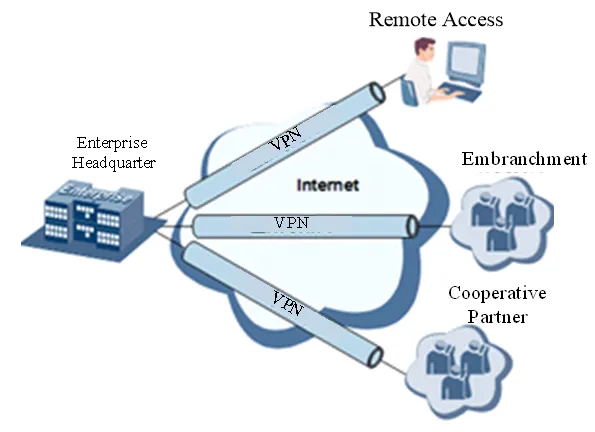

<strong>Fig. 4-2 VPN Network Diagram</strong>

**Fundamental Principle of VPN**

The fundamental principle of VPN indicates enclosing VPN messages into a tunnel with tunneling technology and establishing a private data transmission channel utilizing VPN Backbone so as to realize transparent message transmission.

Tunneling technology encloses the other protocol message with one protocol. Also, the encapsulation protocol itself can be enclosed or carried by other encapsulation protocols. To the users, the tunnel is a logical extension of PSTN/link of ISDN, which is similar to the operation of an actual physical link.

The common tunnel protocols include L2TP, PPTP, GRE, IPSec, MPLS, etc.

### 4.7.1 IPSec

A majority of data contents are Plaintext Transmission on the Internet, which has many potential dangers such as password and bank account information stolen and tampered, user identity imitated, suffering from malicious network attack, etc. After disposal of IPSec on the network, it can protect data transmission and reduce the risk of information disclosure.

IPSec is a group of open network security protocols made by IETF, which can ensure the security of data transmission between two parties on the Internet, reduce the risk of disclosure and eavesdropping, guarantee data integrity and confidentiality as well as maintain security of service transmission of users via data origin authentication, data encryption, data integrity, and anti-replay function on the IP level.

IPSec, including AH, ESP, and IKE, can protect one and more data flows between hosts, between host and gateway, and between gateways. The security protocols of AH and ESP can ensure security and IKE is used for cipher code exchange.

IPSec can establish bidirectional Security Alliance on the IPSec peer pairs to form a secure and interworking IPSec tunnel and to realize the secure transmission of data on the Internet.

**Table 4-7-1 IPSec Configuration Parameters**

| Parameters | Description | Default |
|------------|-------------|---------|
| **IKEv1 Policy** | | |
| Identification | Policy identification of user defined IKE | N/A |
| Authentication | Alternative authentication: shared key and digital certificate | AES128 |
| Encryption | 3DES: encrypt plaintext with three DES cipher codes of 64bit. DES: encrypt a 64bit plaintext block with 64bit cipher code. AES: encrypt plaintext block with AES Algorithm with cipher code length of 128bit, 192bit or 256bit. | SHA1 |
| Hash | MD5: input information of arbitrary length to obtain 128bit message digest. SHA-1: input information with shorter length of bit to obtain 160bit message digest. Comparing both, md5 is faster while sha-1 is safer. | Group2 |
| Diffie-Hellman Key Exchange | Three options: Group 1, Group 2 and Group 5 | 86400 |
| **IKEv2 policy** | | |
| Identification | User defined IKE policy identification | N/A |
| Encryption algorithm | 3DES: encrypt plaintext with three DES cipher codes of 64bit. DES: encrypt a 64bit plaintext block with 64bit cipher code. AES: encrypt plaintext block with AES Algorithm with cipher code length of 128bit, 192bit or 256bit. | AES128 |
| Integrity | MD5: input information of arbitrary length to obtain 128bit message digest. SHA-1: input information with shorter length of bit to obtain 160bit message digest. | SHA1 |
| Diffie-Hellman key exchange | Multiple options | Group2 |
| Lifetime | Valid time of policy | 86400 |
| **IPSec Policy** | | |
| Name | User define Transform Set name | N/A |
| Encapsulation | Choose encapsulation forms of data packet. AH: protect integrity and authenticity of data packet from hacker intercepting data packet or inserting false data packet on the internet. ESP: encrypt the user data needing protection, and then enclose into IP packet for the purpose of confidentiality of data. | ESP |
| Encryption | Multiple options | AES128 |
| Authentication | Multiple options | SHA1 |
| IPSec Mode | **Tunnel Mode:** besides source host and destination host, special gateway will be operated with password to ensure the safety from gateway to gateway. **Transmission Mode:** source host and destination host must directly be operated with all passwords for the purpose of higher work efficiency, but comparing with tunnel mode the security will be inferior. | Tunnel Mode |
| **IPSec tunnel configuration-basic parameters** | | |
| Opposite end address | Opposite end IP address | |
| Interface name | Select the interface name | Cellular 1 |
| IKE version | Select the IKE version | IKEv1 |
| IKEv1 policy | Policy identification defined in the IKEv1 policy list | |
| Ipsec policy | Policy identification defined in the IPsec policy list | |
| Negotiation Mode | **Main mode:** as an exchange method of IKE, main mode shall be established in the situation where stricter identity protection is required. **Aggressive mode:** as an exchange method of IKE, aggressive mode exchanging fewer messages, can accelerate negotiation in the situation where ordinary identity protection is required. | Main mode |
| Authentication | Alternative authentication: shared key and digital certificate | Shared key |
| Local subnet address | The source network in the reverse crypto map ACL defined by IPSEC | N/A |
| Subnet address of subnet addresses | The source network in the destination network defined by IPSEC | N/A |
| **IPSec tunnel configuration-IKE advanced option (stage 1)** | | |
| Local identification | The local identification corresponds to the selected local identification | N/A |
| Opposite end identification | The opposite end identification corresponds to the selected opposite end identification | N/A |
| IKE connection detection (DPD) | Receiving end will make DPD check and send request message automatically to opposite end for check. If it does not receive IPSec cryptographic message from peer end beyond timeout, ISAKMP Profile will be deleted. | 0, 0. Proposed parameter 60, 180 |
| XAUTH | XAUTH user name, XAUTH code | N/A |
| **IPSec tunnel configuration- IPSec advanced option (stage 2)** | | |
| Perfect Forward Security (PFS) | Means the reveal of one cipher code will not endanger information protected by other cipher codes. | Ban |
| IPsec SA Lifetime | Lifetime of IPSec Profile | 3600 |
| **IPSec tunnel configuration-Tunnel advanced option** | | |
| Respond Only | If it is used, the local can only passively receive the Ipsec request and will not connect actively. It is commonly used in the server mode. | Ban |
| Rules for local/remote sending of certificates | When using the certificate to build Ipsec, both ends shall know the certificate of each other and pass the verification before a successful connection can be built. **Always send certificate:** Some ipsec server does not send a "certificate request" request and it has no place to keep the certificate sent from the opposite end, so the opposite end can build Ipsec only by being configured as "always send certificate". **Send certificate under request:** The local certificate is sent only when the opposite end sends a request. **Not send certificate:** The certificate will be sent to the opposite end no matter the opposite end sends a request or not. | Always send certificate |
| ICMP detection | Detection server, detecting local address, detection interval, detection time-out, maximum number of retries | N/A, N/A, 60, 5, 10 |

**Table 4-7-2 IPSec Extension Parameters**

| Parameters | Description | Default |
|------------|-------------|---------|
| **Basic parameters** | | |
| Name | User defined | admin |
| IKE version | Select the IKE version | IKEv1 |
| IKEv1 policy | Policy identification defined in the IKEv1 policy list | N/A |
| Ipsec policy | Policy identification defined in the IPsec policy list | N/A |
| Negotiation Mode | **Main mode:** as an exchange method of IKE, main mode shall be established in the situation where stricter identity protection is required. **Aggressive mode:** as an exchange method of IKE, aggressive mode exchanging fewer messages, can accelerate negotiation in the situation where ordinary identity protection is required. | Main mode |
| Authentication | Alternative authentication: shared key and digital certificate | Shared key |
| **IKE advanced option (stage 1)** | | |
| Local identification | The local identification corresponds to the selected local identification | N/A |
| Opposite end identification | The opposite end identification corresponds to the selected opposite end identification | N/A |
| IKE connection detection (DPD) | Receiving end will make DPD check and send request message automatically to opposite end for check. If it does not receive IPSec cryptographic message from peer end beyond timeout, ISAKMP Profile will be deleted. | 0, 0 |
| **IPSec advanced option (stage 2)** | | |
| Perfect Forward Security (PFS) | Means the reveal of one cipher code will not endanger information protected by other cipher codes. | Ban |
| IPsec SA Lifetime | Lifetime of IPSec Profile | 3600 |

> **Note:** The security level of three encryption algorithms ranks successively: AES, 3DES, DES. The implementation mechanism of encryption algorithm with stricter security is complex and slow arithmetic speed. DES algorithm can satisfy the ordinary safety requirements.

### 4.7.2 GRE

Generic Route Encapsulation (GRE) defines the encapsulation of any other network layer protocol on a network layer protocol. GRE could be used as the L3TP of VPN to provide a transparent transmission channel for VPN data. In simple terms, GRE is a tunneling technology which provides a channel through which encapsulated data messages could be transmitted and encapsulation and decapsulation could be realized at both ends. GRE tunnel application networking is shown as the following figure:

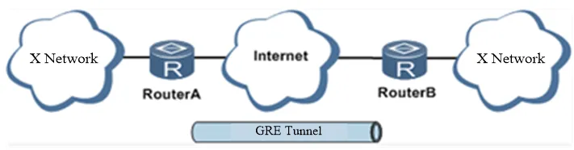

<strong>Fig. 4-3 GRE Tunnel Application Networking</strong>

Along with the extensive application of IPv4, to have messages from some network layer protocol transmitted on IPv4 network, those messages could be encapsulated by GRE to solve the transmission problems between different networks.

**In following circumstances GRE tunnel transmission is applied:**

1. GRE tunnel could transmit multicast data packets as if it were a true network interface. Single use of IPSec cannot achieve the encryption of multicast.
2. A certain protocol adopted cannot be routed.
3. A network of different IP address shall be required to connect other two similar networks.

**GRE application example: combined with IPSec to protect multicast data**

GRE can encapsulate and transmit multicast data in GRE tunnel, but IPSec, currently, could only carry out encryption protection against unicast data. In case of multicast data requiring to be transmitted in IPSec tunnel, a GRE tunnel could be established first for GRE encapsulation of multicast data and then IPSec encryption of encapsulated messages so as to achieve the encryption transmission of multicast data in IPSec tunnel. As shown below:

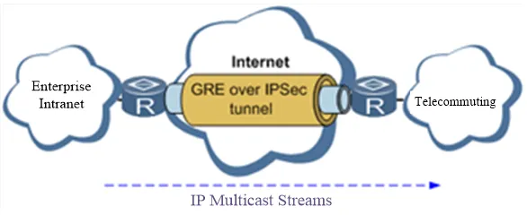

<strong>Fig. 4-4 GRE over IPSec</strong>

From the navigation tree, select [VPN] > [GRE Tunnels] and enter "GRE Tunnels".

**Table 4-7-3 GRE Key Parameters Description**

| Parameters | Description | Default |
|------------|-------------|---------|
| Enable | Click to enable | Enabled |
| Interface Identifier | Configure the name of GRE tunnel | NO |
| Network type | Select GRE network type | Point-to-point |
| Local visual IP | Configure local visual IP address | NO |
| Peer visual IP | Configure peer visual IP address | NO |
| Source address type | Select source address type, and configure corresponding types of IP addresses or interface names | IP |
| Local IP address | Configure local IP address | NO |
| Peer address | Configure peer address | NO |
| Password | Configure tunnel password | NO |
| MTU | Configure maximum transmission unit, in bytes | NO |
| Enable NHRP | Next Hop Resolution Protocol applied in access connected source stations with non-broadcast multiple access (NBMA) sub-network (mainframe or router). It also determines the network layer address and NBMA sub-network address of "NBMA next hop" before reaching targeted stations. | Enabled |
| Description | Add description | NO |

### 4.7.3 L2TP

L2TP, one of VPDN TPs, has expanded the applications of PPP, known as a very important VPN technology for remote dial-in user to access the network of enterprise headquarters.

L2TP, through dial-up network (PSTN/ISDN), based on negotiation of PPP, could establish a tunnel between enterprise branches and enterprise headquarters so that remote users have access to the network of enterprise headquarters. PPPoE is applicable in L2TP. Through the connection of Ethernet and Internet, an L2TP tunnel between remote mobile officers and enterprise headquarters could be established.

L2TP-Layer 2 Tunnel Protocol encapsulates private data from user network at the head of L2 PPP. No encryption mechanism is available, thus IPSec is required to ensure safety.

Main Purpose: Branches in other places and employees on business trips could access the network of enterprise headquarters through a virtual tunnel by public network remotely.

Typical L2TP network diagram is shown below:

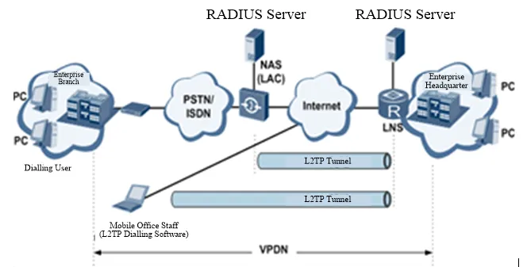

<strong>Fig. 4-5 L2TP Network Diagram</strong>

**Table 4-7-4 L2TP Key Parameters Description**

| Parameters | Description | Default |
|------------|-------------|---------|
| **L2TP Class** | | |
| Name | User-defined L2TP Class name | No |
| Authentication | Click to enable, authentication of backend is needed in network connection | Disable |
| Host Name | Host name for home terminal network connection, unmatched is acceptable | No |
| Tunnel Authentication Password | When authentication is enabled, tunnel authentication password must be configured, or no configuration will be required | No |
| **Pseudowire Class** | | |
| Name | User defined pseudowire class name | No |
| L2TP Class | L2TP class name defined above | No |
| Source port | Select Source port name | cellular 1 |
| **L2TP Tunnel** | | |
| Enable | Click to enable | Enabled |
| Identifier | Generated Automatically | 1 |
| L2TP Server | Set L2TP Server address | No |
| Pseudowire Class | Pseudowire class name defined above | No |
| Authentication Type | Select authentication type | Auto |
| Username | Peer server username | No |
| Password | Peer server password | No |
| Local IP Address | Set local IP address automatically, or let peer server allocate | No |
| Remote IP Address | Set remote IP address, unmatched is acceptable | No |

### 4.7.4 OPENVPN

Single point participating in the establishment of VPN is allowed to carry out ID verification by preset private key, third-party certificate, or username/password. OpenSSL encryption library and SSLv3/TLSv1 protocol are massively used.

In OpenVpn, if a user needs to access a remote virtual address (address family matching virtual network card), then the OS will send the data packet (TUN mode) or data frame (TAP mode) to the visual network card through the routing mechanism. Upon reception, the service program will receive and process those data and send them out through the outer net by SOCKET, owing to which, the remote service program will receive those data and carry out processing, then send them to the virtual network card, then application software receives and accomplishes a complete unidirectional transmission, vice versa.

**Table 4-7-5 OPENVPN Client Parameters Description**

| Parameters | Description | Default |
|------------|-------------|---------|
| Enable | Click to enable | Enabled |
| ID | Set channel ID | No |
| Server IP Address | Fill in IP address of backend server | No |
| Port Number | Fill in port number of backend server | 1194 |
| Certification Type | Select certification type and configure corresponding parameters of certification type | Username/Password |
| Username | Keep consistency with server | No |
| Password | Keep consistency with server | No |
| Channel Description | Content described in user's self-defined channel | No |
| **Advanced Options** | | |
| Source Port | Select name of source port | No |
| Network Type | Select type of network | net30 |
| Port Type | Select the data form sending out from the port. tun-data package, tap-data frame | Tun |
| Protocol Type | Protocol in server communication and keep consistency with server protocol | Udp |
| Encryption Algorithm | Keep consistency with server | Default |
| LZO Compression | Click to enable | Off |
| Connection Testing Interval | Set connecting testing time interval | No |
| Connection Testing Overtime | Set connecting testing overtime | No |
| Expert Configuration | Set expert option: blank advisable | No |

> **Note:** Import configurations can be directly imported into the configured documents generated from the backend server and manual configuration of OPENVPN client end parameter is not needed after import.

### 4.7.5 Authentication Management

**Table 4-7-6 Authentication Management Parameters Description**

| Parameters | Description | Default |
|------------|-------------|---------|
| Authentication Protected Password | Configure authentication protected password | No |
| Confirmation of Authentication Protected Password | Confirm authentication protected password | No |

---

## 4.8 Industrial (This Chapter Only Applies for IR900 Devices with Industrial Interface)

Routers can connect with terminals through industrial interfaces, and can wirelessly upload data to upper devices. This realizes the wireless communication between terminals and upper devices.

The router's industrial interface has two types: serial port and IO interface. Serial port has RS232 and RS485 modes and IO interface has digital input and relay output modes.

RS232 adopts full-duplex communication with one transmission line, one receiving line and one ground line. RS232 is generally used for communication within 20m.

RS485 adopts half-duplex communication to achieve long-distance transmission of serial communication data. To ensure the accuracy of long distance transmission for industrial sites, RS485 is normally used on industrial sites. RS485 is used for communication from tens of meters to kilometers.

Digital input of IO interface can convert electrical signals into binary digital control signals. The digital is a logical variable or switch variable with only two values 0 and 1. Low voltage corresponds to the "0" and high voltage to the "1".

IO's relay output functions as an "auto switch" to automatically adjust, protect and switch circuit.

### 4.8.1 DTU

**Serial Port Settings**

Setting the parameters of the router's serial port according to the serial port of the terminal device connected with the router to achieve normal communication between router and terminal device.

**Table 4-8-1 Serial Port Setting Parameter Description**

| Parameters | Description | Default |
|------------|-------------|---------|
| Serial Port Type | Serial Port 1 is RS232, Serial Port 2 is RS485; cannot be changed | RS232/RS485 |
| Baud Rate | Same with the baud rate of connected terminal device | 9600 |
| Data Bit | Same with the data bit of connected terminal device | 8 bits |
| Parity | Same with the parity of connected terminal device | None |
| Stop Bit | Same with the stop bit of connected terminal device | 1 bits |
| Software Flow Control | Click to enable | Off |
| Description | User define | No |

> **Note:** The parameters of the router's serial port must be the same with that of the terminal device connected.

 **DTU**

**Table 4-8-2 DTU Parameter Description**

| Parameters | Description | Default |
|------------|-------------|---------|
| Enable | Click to enable | Off |
| DTU Protocol | Transparent and TCP: router used as client when Transparent is chosen, router used as server when TCP is chosen. RFC2217: no need to configure serial port. IEC101-104: for power industry, similar with TCP in function. | Transparent |
| Protocol | TCP or UDP | TCP Protocol |
| Connection Type | Long connection or Short connection | Long connection |
| Heartbeat interval time | User define | 60 |
| Heartbeat Retry | User define, TCP connection is off when reaching retry limit | 5 |
| Serial Frames Buffer | User define | 4 |
| Serial Frame Length | User define | 1024 |
| Serial Interval Frame | User define | 100 |
| Min Reconnect Interval | User define. If connection fails in device start-up, reconnection will be done based on this min interval, until the max reconnection interval reaches user defined value. | 15 |
| Max Interval Reconnect | User define. When connection interval reaches maximum, reconnection will be done according to this interval (user defined value). | 180 |
| Multi-Server Policy | **Parallel:** connect the center of destination IP address list at the same time. **Polling:** connect to the first address in the list, if connect fail, continue to connect next address until connect one successfully, then stop. | Parallel |
| Source port | 4 options; No need to choose | IP |
| Local IP Address | The device's IP in Source port "IP" selection. No need to configure | No |
| DTU Identification | User defined. DTU identification will be sent automatically to server after successful connection. Can remain empty without configuration. | No |
| Debug Log | Click to enable | Off |
| **Destination IP Address** | | |
| Server Address | User define | No |
| Server Port | User define | No |

> **Note:** Destination IP Addresses maximum 10. DTU 2 configuration is the same as DTU 1.

### 4.8.2 IO Interface

Relay output is off by default and it can be turned on/off manually. The disconnect time can be set manually and after reaching the set parameters relay output is automatically turned off.

**Table 4-8-3 IO Interface Status Parameters Description**

| Parameters | Description | Default |
|------------|-------------|---------|
| **Digital Input** | | |
| Digital Input 1 | Voltage under 10V corresponds to "low" (0). Voltage equals and above 10V corresponds to "high" (1). | Low (0) |
| **Relay Output** | | |
| Relay Output 1 | Off by default. Can be turned on manually, otherwise it remains off. | On |
| Action | **Off:** Click to turn off. **On:** Click to turn on. **Off->On:** user define off time, after off time, it turns on automatically. | Off time: 1000ms |

---

## 4.9 Tools

### 4.9.1 PING Detection

Provide the function of router ping outer network.

**Table 4-9-1 PING Detection Parameter Description**

| Parameters | Description | Default |
|------------|-------------|---------|
| Host | Address of the destination host of PING detection is required. | 192.168.2.1 |
| PING Count | Set the PING count | 4 times |
| Packet Size | Set the packet size | 32 bytes |
| Expert Options | Advanced parameter of PING is available. | No |

### 4.9.2 Traceroute

Applied for network routing failures detection.

**Table 4-9-2 Traceroute Parameter Description**

| Parameters | Description | Default |
|------------|-------------|---------|
| Host | Address of the destination host which to be detected is required. | 192.168.2.1 |
| Maximum Hops | Set the maximum hops for traceroute | 20 |
| Timeout | Set the timeout of traceroute | 3 seconds |
| Protocol | Optional: ICMP/UDP | UDP |
| Expert Options | Advanced parameter for traceroute is available. | No |

### 4.9.3 Link Speed Test

Determine link speed using uploading and downloading files.

---

## 4.10 Configuration Wizard

Simplified normal configuration allows the rapid, simple and basic configuration of the router, but cannot display the results of configuration which can be checked in corresponding configuration details previously upon accomplishment.

### 4.10.1 New LAN

**Table 4-10-1 New LAN Parameters Description**

| Parameters | Description | Default |
|------------|-------------|---------|
| Port | Select new LAN port | fastethernet 0/2 |
| Host IP | Host IP address can be configured or altered according to user definition | No |
| Subnet Mask | User define subnet mask (generates automatically) | 255.255.255.0 |
| DHCP Service | Enable/Disable | Disabled |
| Start Address | Set a starting IP address of dynamic allocation | No |
| End Address | Set an ending IP address of dynamic allocation | No |
| Validity Period | Set IP time limits of dynamic allocation | 1440 |

### 4.10.2 New WAN

**Table 4-10-2 New WAN Parameters Description**

| Parameters | Description | Default |
|------------|-------------|---------|
| Port | Select new WAN port | fastethernet 0/1 |
| Type | Configuration type of WAN port IP Address | Static IP |
| Host IP | Host IP address can be configured or altered according to user definition | No |
| Subnet Mask | User define subnet mask (generates automatically) | 255.255.255.0 |
| Gateway | Configure gateway IP address | No |
| Network Address Switch | Click to enable, can switch IP address of private network into public ones | Disabled |

### 4.10.3 New Dial

**Table 4-10-3 New Dial Parameters Description**

| Parameters | Description | Default |
|------------|-------------|---------|
| APN | Select new WAN port | 3gnet |
| Dialing Number | Relevant dialing parameters provided by mobile operators (select according to local operator) | *99***1# |
| Username | Relevant dialing parameters provided by mobile operators (select according to local operator) | gprs |
| Password | Relevant dialing parameters provided by mobile operators (select according to local operator) | ●●●● |
| Network Address Switch | Click to enable, can switch IP address of private network into public ones | Disabled |

### 4.10.4 New IPSec Tunnel

**Table 4-10-4 New IPSec Parameters Description**

| Parameters | Description | Default |
|------------|-------------|---------|
| **Basic Parameters** | | |
| Tunnel Serial Number | Set a serial number for new tunnel | 1 |
| Port Name | Select port name | cellular 1 |
| Peer Address | Set VPN peer IP | No |
| Negotiation Mode | Main mode or aggressive mode selectable. (Main mode is chosen normally) | Main Mode |
| Local Subnet Address | Set IPSec local protection subnet | No |
| Local Subnet Mask | Set IPSec local protection subnet mask | 255.255.255.0 |
| Peer Subnet Address | Set IPSec peer protection subnet | No |
| Peer Subnet Mask | Set IPSec peer protection subnet mask | 255.255.255.0 |
| **Phase I Parameters** | | |
| IKE Strategy | 3DES-MD5-DH1 or 3DES-MD5-DH2 | 3DES-MD5-DH2 |
| IKE Life Cycle | Set IKE life cycle | 86400 seconds |
| Local Identifier Type | FQDN, USERFQDN, IP address | IP address |
| Local Identifier | FQDN and USER FQDN only. Fill in the identifier according to the identifier type (USER FQDN is standard email format) | No |
| Peer Identifier Type | FQDN, USER FQDN, IP address | IP address |
| Peer Identifier | FQDN and USER FQDN only. Fill in the identifier according to the identifier type (USER FQDN is standard email format) | No |
| Authentication Type | Shared key, digital certificate | Shared key |
| Password | This item is displayed if the authentication type is shared password. Set the IPSec VPN negotiation password | No |
| **Phase II Parameters** | | |
| IPSec Strategy | 3DES-MD5-96 or 3DES-SHA1-96 | 3DES-MD5-96 |
| IPSec Life Cycle | Set IPSec life cycle | 3600 seconds |

> **Note:** Inbound and outbound protocols shall be set for each tunnel connection. In the case of setting filter for one-way connections, the protocols will not be applied.

### 4.10.5 New Port Mapping

**Table 4-10-5 New Port Mapping Parameters Description**

| Parameters | Description | Default |
|------------|-------------|---------|
| Protocol | TCP or UDP | TCP |
| Outside Port | Outer net connection port selected by user | Cellular |
| Service Port | TCP or UDP data transmission port | No |
| Internal Address | The device address of mapping subject | No |
| Internal Port | TCP or UDP port of mapping subject | No |
| Description | User define | No |

---

# Chapter 5 Typical Application

## Case 1: DDNS Application

**Scenario Description:** An IR900 is connected with IP of public network via dial mode. Set DDNS to address map the dynamic IP of users on a fixed domain name service.

**Network Topology:**

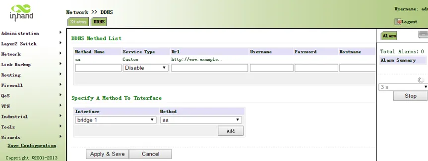

<strong>Fig. 5-1 DDNS Tailored Domain Configuration</strong>

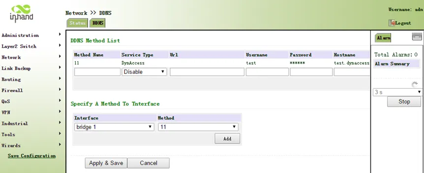

<strong>Fig. 5-2 DDNS General Domain Configuration</strong>

**Device Role:** This device acts as an edge gateway, connecting the local network to the Internet via 4G LTE dial-up and providing dynamic domain name resolution services.

**Configuration Steps:**
1. Ensure the router is connected to the Internet via cellular dial-up and has obtained a public IP address.
2. Click [Network] > [Dynamic DNS] to enter the DDNS configuration page.
3. Configure the parameters of the dynamic domain name. Refer to Fig. 5-1 for tailored domain name parameters and Fig. 5-2 for general domain name parameters.
4. Save the configuration and wait for a few minutes.
5. Ping the domain name to confirm the successful configuration of the dynamic domain name, as shown in Fig. 5-3.

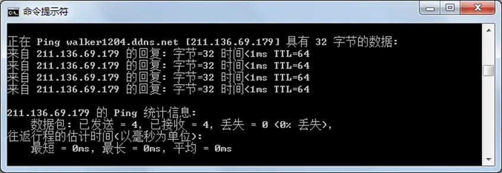

<strong>Fig. 5-3 DDNS Verification</strong>

**Reference Chapters:**
- [Dynamic Domain Name](#427-dynamic-domain-name)
- [Dialup Port](#422-dialup-port)

---

## Case 2: Device Management Application

**Scenario Description:** Add the IR900 equipment to the InHand Device Management platform for centralized remote management, monitoring, and maintenance.

**Network Topology:** The IR900 connects to the Internet via 4G LTE and establishes a connection to the InHand Device Manager cloud platform.

**Device Role:** This device acts as a managed edge gateway, reporting status and receiving management commands from the Device Manager platform.

**Configuration Steps:**
1. Ensure the router has already connected to the Internet.
2. Click [Administration] > [Device Manager] to set the router to connect to DM. Configure server: c2.inhandnetworks.com, port: 20003, as shown in Fig. 5-4.

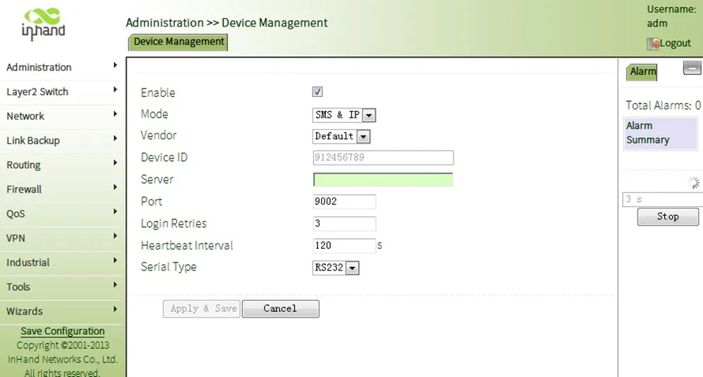

<strong>Fig. 5-4 Device Manager Configuration</strong>

3. Save the configuration.
4. Log in to the Device Manager platform ([http://c2.inhandnetworks.com](http://c2.inhandnetworks.com)) and add the equipment.
5. Enter the device serial number and name the device.

**Reference Chapters:**
- [Device Management](#4111-device-management)
- [Cellular Internet Access](#scenario-1-cellular-internet-access)

---

## Case 3: Network Mode Configuration

**Scenario Description:** Configure the IR900 to use different Internet access modes according to site conditions: cellular dial-up, ADSL dial-up (PPPoE), or static IP.

**Device Role:** This device acts as an edge router, providing Internet access for the local network through various WAN connection methods.

**Configuration Steps:**

**Cellular Mode:**
1. Click [Network] > [Cellular] in the navigation panel and enter the "Cellular" page, as shown in Fig. 5-5.

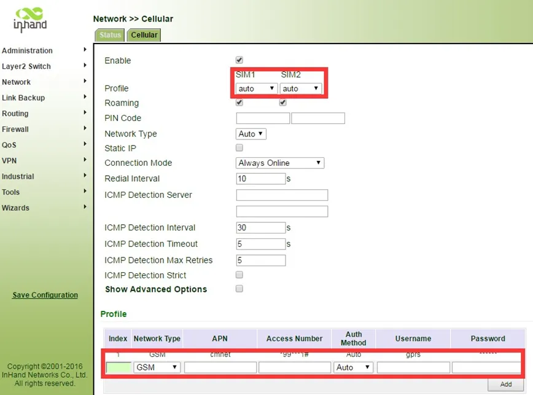

<strong>Fig. 5-5 Cellular Configuration</strong>

2. Ensure the cellular interface is enabled and the SIM card is properly configured.

**ADSL Dialup Mode:**
1. Disable cellular. Click [Network] > [Cellular] menu in navigation, uncheck Enable, as shown in Fig. 5-6.

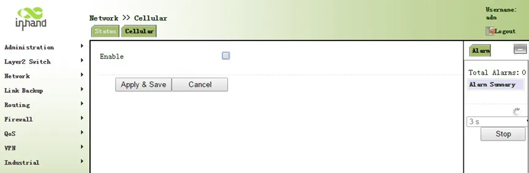

<strong>Fig. 5-6 Disable Cellular</strong>

2. Establish new WAN. Click [Wizards] >> [New WAN] menu in navigation panel. Fig. 5-7, Fig. 5-8, and Fig. 5-9 are examples of static IP type, ADSL dialup (PPPoE) type, and DHCP type.

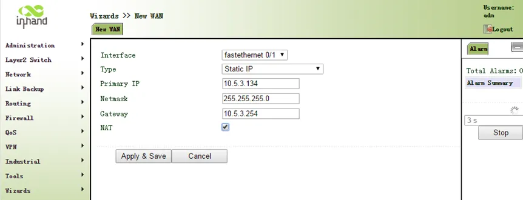

<strong>Fig. 5-7 New WAN - Static IP</strong>

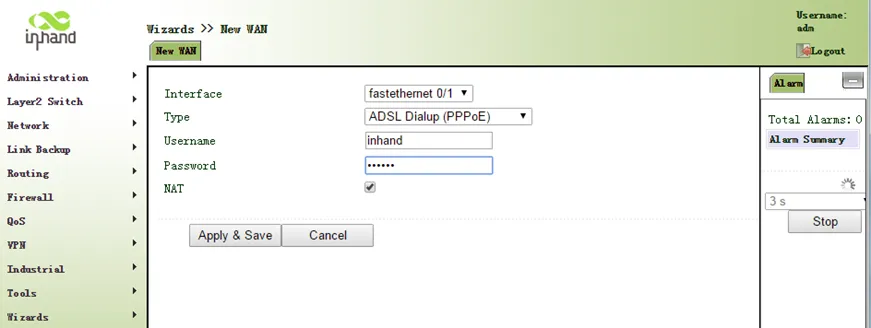

<strong>Fig. 5-8 New WAN - PPPoE</strong>

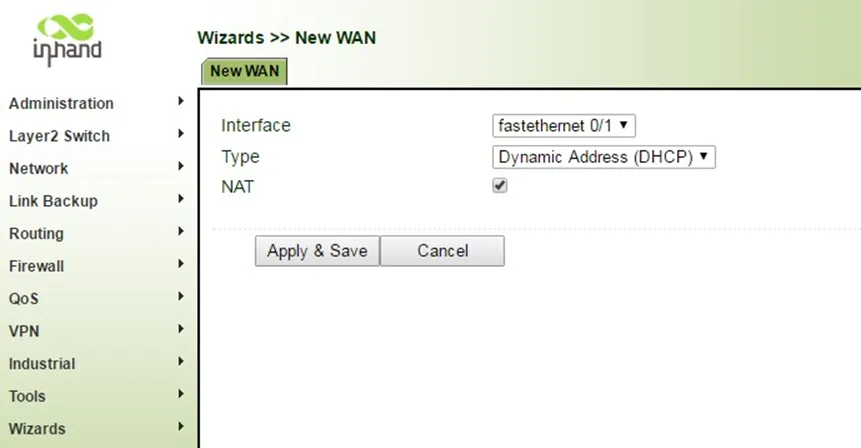

<strong>Fig. 5-9 New WAN - DHCP</strong>

**New LAN Configuration:**
1. From the navigation panel, select [Wizards] >> [New LAN], as shown in Fig. 5-10.

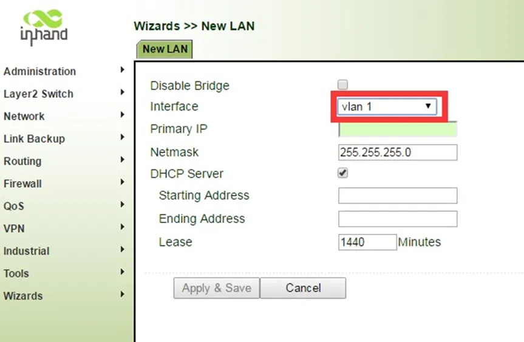

<strong>Fig. 5-10 New LAN Configuration</strong>

**Reference Chapters:**
- [Ethernet Port](#421-ethernet-port)
- [Dialup Port](#422-dialup-port)
- [ADSL Dialing (PPPoE)](#423-adsl-dialing-pppoe)
- [New LAN](#4101-new-lan)
- [New WAN](#4102-new-wan)

---

# Appendix Troubleshooting

## 1 Network Connection Issues

| Phenomenon | Possible Cause | Troubleshooting Steps | Reference Chapter |
|------------|--------------|----------------------|-------------------|
| Cannot connect to cellular network | SIM card not inserted or poor contact | 1. Check whether the SIM card is correctly inserted 2. Re-insert the SIM card | [SIM Card Installation](#223-sim-card-installation) |
| Cannot connect to cellular network | APN parameter configuration error | 1. Verify APN parameters are correct 2. Contact the operator for correct APN | [Dialup Port](#422-dialup-port) |
| Cannot connect to cellular network | Weak or no signal | 1. Check whether the antenna is connected 2. Adjust the device position 3. Install the AUX antenna to boost signal | [Antenna Installation](#224-antenna-installation) |
| Cannot connect to cellular network | PIN code required | 1. Enter the correct SIM card PIN code in the cellular settings | [Dialup Port](#422-dialup-port) |
| Cannot access the Internet via Ethernet | IP address configuration error | 1. Confirm the PC and device are in the same network segment 2. Check the device default IP address | [First Login](#23-first-login) |
| Cannot access the Internet via Ethernet | DNS configuration error | 1. Check DNS settings 2. Enable DHCP server or manually set DNS | [DNS Services](#426-dns-services) |

## 2 Web Interface Access Issues

| Phenomenon | Possible Cause | Troubleshooting Steps | Reference Chapter |
|------------|--------------|----------------------|-------------------|
| Cannot open Web management page | IP address error | 1. Confirm the PC and device are in the same network segment 2. Check the device default IP (192.168.1.1 or 192.168.2.1) | [First Login](#23-first-login) |
| Cannot open Web management page | Browser compatibility issue | 1. Change browser (Chrome recommended) 2. Clear browser cache | [First Login](#23-first-login) |
| Cannot open Web management page | Proxy server enabled | 1. Cancel the proxy server in browser settings | [First Login](#23-first-login) |
| Login password incorrect | Wrong password entered | 1. Check the nameplate at the bottom of the device for correct credentials 2. Restore factory settings if password is forgotten | [Restore Factory Settings](#15-restore-factory-settings) |

## 3 VPN Connection Issues

| Phenomenon | Possible Cause | Troubleshooting Steps | Reference Chapter |
|------------|--------------|----------------------|-------------------|
| IPSec tunnel cannot be established | Incorrect peer address | 1. Verify the peer IP address or domain name is correct | [IPSec](#471-ipsec) |
| IPSec tunnel cannot be established | Inconsistent IKE/IPSec policy | 1. Verify both ends use the same encryption, authentication, and DH group 2. Check IKE version consistency | [IPSec](#471-ipsec) |
| IPSec tunnel cannot be established | Shared key mismatch | 1. Verify the shared key is identical on both ends | [IPSec](#471-ipsec) |
| GRE tunnel cannot be established | Incorrect peer address | 1. Verify the local and peer IP addresses 2. Check routing to peer address | [GRE](#472-gre) |
| OpenVPN connection failed | Server unreachable | 1. Verify server IP address and port 2. Check network connectivity to server | [OPENVPN](#474-openvpn) |

## 4 Device Management Platform Issues

| Phenomenon | Possible Cause | Troubleshooting Steps | Reference Chapter |
|------------|--------------|----------------------|-------------------|
| Device shows offline in DM | Router not connected to Internet | 1. Verify the router can access the Internet 2. Check cellular or WAN connection status | [Cellular Internet Access](#scenario-1-cellular-internet-access) |
| Device shows offline in DM | Incorrect server address or port | 1. Verify the DM server address and port 2. Check firewall rules | [Device Management](#4111-device-management) |
| Device shows offline in DM | Wrong serial number | 1. Verify the serial number in [Status] > [System] 2. Check the serial number at the back of the device | [Connect to Device Manager](#scenario-2-connect-to-device-manager) |

## 5 Industrial Interface Issues

| Phenomenon | Possible Cause | Troubleshooting Steps | Reference Chapter |
|------------|--------------|----------------------|-------------------|
| Serial port communication failure | Mismatched serial parameters | 1. Verify baud rate, data bit, parity, and stop bit match the terminal device | [Serial Port Settings](#4811-serial-port-settings) |
| Serial port communication failure | Incorrect wiring | 1. Check RS232/RS485 wiring connections 2. Verify TX/RX connections for RS232 | [Terminal Connection](#227-terminal-connection-industrial-interface-models) |
| DTU cannot connect to server | Server address or port error | 1. Verify destination IP address and port 2. Check network connectivity | [DTU](#4812-dtu) |
| IO input not responding | Incorrect voltage level | 1. Verify input voltage is above 10V for "high" state | [IO Interface](#482-io-interface) |

---

# Appendix Command Line Reference

## 1 Help Command

Help command can be obtained after entering help or "?" into console. "?" can be entered at any time during the process of command input to obtain the current command or help from command parameters, and command or parameters can be automatically complemented in case of only command or command parameter.

### 1.1 Help

| Item | Description |
|------|-------------|
| Command | `help [<cmd>]` |
| Function | Get the list of all current available commands or display parameters of a specific command |
| View | All views |
| Parameters | `<cmd>` — command name |
| Example | `help` — Get the list of all current available commands. `help show` — Display all the parameters of show command and using instructions thereof. |

## 2 View Switchover Command

### 2.1 Enable

| Item | Description |
|------|-------------|
| Command | `enable [15 [<password>]]` |
| Function | Switchover to privileged user level |
| View | Ordinary user view |
| Parameters | `15` — User right limit level, only supports right limit 15 (super users) at present. `<password>` — Password corresponded to privileged user limit level, hint of password inputting will be given in case of no entering. |
| Example | `enable adm` — Switchover to super users and enter the password |

### 2.2 Disable

| Item | Description |
|------|-------------|
| Command | `disable` |
| Function | Exit the privileged user level |
| View | Super user view, configure view |
| Parameters | No |
| Example | `disable` — Return to ordinary user view |

### 2.3 End and !

| Item | Description |
|------|-------------|
| Command | `end` or `!` |
| Function | Exit the current view and return to the last view |
| View | Configure view |
| Parameters | No |
| Example | `end` — Return to super user view |

### 2.4 Exit

| Item | Description |
|------|-------------|
| Command | `exit` |
| Function | Exit the current view and return to the last view (exit console in case that it is ordinary user) |
| View | All views |
| Parameters | No |
| Example | `exit` — Return to super user view (from configuration view). `exit` — Exit console (from ordinary user view) |

## 3 Check System State Command

### 3.1 Show version

| Item | Description |
|------|-------------|
| Command | `show version` |
| Function | Display the type and version of software of router |
| View | All views |
| Parameters | No |
| Example | `show version` — Display Type, Serial number, Description, Current version, Current version of Bootloader |

### 3.2 Show system

| Item | Description |
|------|-------------|
| Command | `show system` |
| Function | Display the information of router system |
| View | All views |
| Parameters | No |
| Example | `show system` — Display system uptime and load average |

### 3.3 Show clock

| Item | Description |
|------|-------------|
| Command | `show clock` |
| Function | Display the system time of router |
| View | All views |
| Parameters | No |
| Example | `show clock` — Display system date and time |

### 3.4 Show modem

| Item | Description |
|------|-------------|
| Command | `show modem` |
| Function | Display the MODEM state of router |
| View | All views |
| Parameters | No |
| Example | `show modem` — Display Modem type, state, manufacturer, product name, signal level, register state, IMSI number, Internet state |

### 3.5 Show log

| Item | Description |
|------|-------------|
| Command | `show log [lines <n>]` |
| Function | Display the log of router system |
| View | All views |
| Parameters | `lines <n>` — limits the log numbers displayed. n indicates the latest n logs if positive integer, earliest n logs if negative integer, and all logs if 0. |
| Example | `show log` — Display the latest 100 log records. |

### 3.6 Show users

| Item | Description |
|------|-------------|
| Command | `show users` |
| Function | Display the user list of router |
| View | All views |
| Parameters | No |
| Example | `show users` — Display user list. User marked with * is super user. |

### 3.7 Show startup-config

| Item | Description |
|------|-------------|
| Command | `show startup-config` |
| Function | Display the starting configuration of router |
| View | Super user view and configuration view |
| Parameters | No |
| Example | `show startup-config` — Display the starting configuration of system |

### 3.8 Show running-config

| Item | Description |
|------|-------------|
| Command | `show running-config` |
| Function | Display the operational configuration of router |
| View | Super user view, configuration view |
| Parameters | No |
| Example | `show running-config` — Display the operational configuration of system |

## 4 Check Internet State Command

### 4.1 Show interface

| Item | Description |
|------|-------------|
| Command | `show interface` |
| Function | Display the information of port state of router |
| View | All views |
| Parameters | No |
| Example | `show interface` — Display the state of all ports |

### 4.2 Show route

| Item | Description |
|------|-------------|
| Command | `show ip route` |
| Function | Display the routing list of router |
| View | All views |
| Parameters | No |
| Example | `show ip route` — Display the routing list of system |

### 4.3 Show arp

| Item | Description |
|------|-------------|
| Command | `show arp` |
| Function | Display the ARP list of router |
| View | All views |
| Parameters | No |
| Example | `show arp` — Display the ARP list of system |

## 5 Internet Testing Command

The router provides ping, telnet, and traceroute for Internet testing.

### 5.1 Ping

| Item | Description |
|------|-------------|
| Command | `ping <hostname> [count <n>] [size <n>] [source <ip>]` |
| Function | Apply ICMP testing for appointed mainframe |
| View | All views |
| Parameters | `<hostname>` — tests the address or domain name of mainframe. `count <n>` — testing times. `size <n>` — tests the size of data package (byte). `source <ip>` — IP address of appointed testing. |
| Example | `ping www.g.cn` — Test www.g.cn and display the testing results |

### 5.2 Telnet

| Item | Description |
|------|-------------|
| Command | `telnet <hostname> [<port>] [source <ip>]` |
| Function | Telnet logs in the appointed mainframe |
| View | All views |
| Parameters | `<hostname>` — address or domain name of mainframe logged in. `<port>` — telnet port. `source <ip>` — appoints the IP address of telnet logged in. |
| Example | `telnet 192.168.2.2` — Telnet logs in 192.168.2.2 |

### 5.3 Traceroute

| Item | Description |
|------|-------------|
| Command | `traceroute <hostname> [maxhops <n>] [timeout <n>]` |
| Function | Test the acting routing of appointed mainframe |
| View | All views |
| Parameters | `<hostname>` — tests the address or domain name of mainframe. `maxhops <n>` — tests the maximum routing jumps. `timeout <n>` — timeout of each jumping testing (sec). |
| Example | `traceroute www.g.cn` — Apply the routing of www.g.cn and display the testing results |

## 6 Configuration Command

In super user view, the router can use the configure command to switch over to configure view for management. Some setting commands can support `no` and `default`, wherein, `no` indicates the setting of cancelling some parameter and `default` indicates the recovery of default setting of some parameter.

### 6.1 Configure terminal

| Item | Description |
|------|-------------|
| Command | `configure terminal` |
| Function | Switchover to configuration view and input the equipment at the terminal end |
| View | Super user view |
| Parameters | No |
| Example | `configure terminal` — Switchover to configuration view |

### 6.2 Hostname

| Item | Description |
|------|-------------|
| Command | `hostname [<hostname>]` / `default hostname` |
| Function | Display or set the mainframe name of router |
| View | Configuration view |
| Parameters | `<hostname>` — new mainframe name |
| Example | `hostname` — Display the mainframe name of router. `hostname MyRouter` — Set the mainframe name of router to MyRouter. `default hostname` — Recover the mainframe name of router to the factory setting. |

### 6.3 Clock set

| Item | Description |
|------|-------------|
| Command | `clock set <YEAR/MONTH/DAY> [<HH:MM:SS>]` |
| Function | Set the date and time of router |
| View | Configuration view |
| Parameters | `<YEAR/MONTH/DAY>` — date, format: Y-M-D. `<HH:MM:SS>` — time, format: H-M-S. |
| Example | `clock set 2009-10-5 10:01:02` — The time of router set is 10:01:02 of Oct. 5th, 2009 morning |

### 6.4 NTP server

| Item | Description |
|------|-------------|
| Command | `ntp server <hostname>` / `no ntp server` / `default ntp server` |
| Function | Set the customer end of Internet time server |
| View | Configuration view |
| Parameters | `<hostname>` — address or domain name of mainframe of time server |
| Example | `sntp-client server pool.ntp.org` — Set the address of Internet time server pool.ntp.org |

## 7 System Management Command

### 7.1 Reboot

| Item | Description |
|------|-------------|
| Command | `reboot` |
| Function | System restarts |
| View | Super user view, configuration view |
| Parameters | No |
| Example | `reboot` — System restarts |

### 7.2 Enable password

| Item | Description |
|------|-------------|
| Command | `enable password [<password>]` |
| Function | Modify the password of super user |
| View | Configuration view |
| Parameters | `<password>` — new super user password |
| Example | `enable password` — Enter password according to the hint |

### 7.3 Username

| Item | Description |
|------|-------------|
| Command | `username <name> [password [<password>]]` / `no username <name>` / `default username` |
| Function | Set user name, password |
| View | Configuration view |
| Parameters | `<name>` — username. `<password>` — password. |
| Example | `username abc password 123` — Add an ordinary user, the name is abc and the password is 123. `no username abc` — Delete the ordinary user with the name of abc. `default username` — Delete all the ordinary users. |

---

*End of Document*
