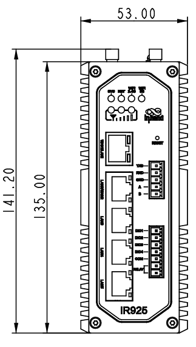
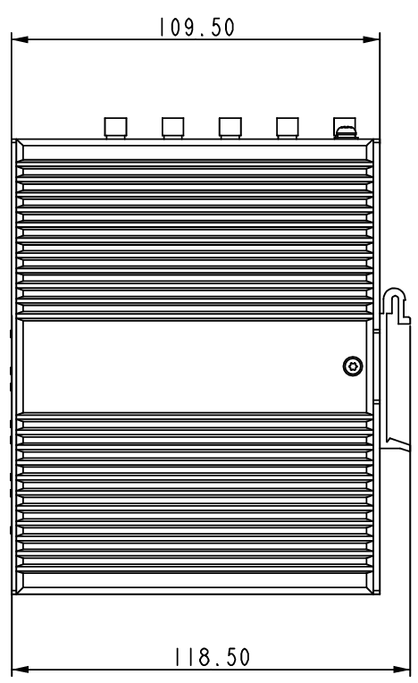
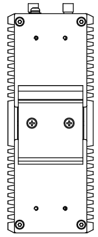
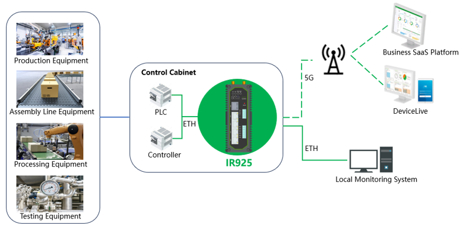

  

    

      
    

    

      Embracing 5G, Shaping the Digital Future
    

  

  

    

      IR925 Industrial Router
    

    

      

        
· 5G

        
· Wi-Fi 6

      

      

        
· Security

        
· Cloud Management

      

    

  

## 1. Product Overview

The InRouter925 (IR925) series is an industrial-grade router designed by InHand Networks to enable enterprise digital transformation. Integrating 5G cellular connectivity, Wi-Fi, and VPN technologies, the IR925 delivers efficient, secure, and intelligent networking solutions for a wide range of IoT applications. Its multi-level link detection mechanism ensures stable and reliable communications, fully meeting the requirements of unattended industrial sites. When paired with the InHand DeviceLive cloud management platform, the IR925 enables centralized cloud-based management and remote maintenance, allowing users to monitor device status effortlessly, reduce deployment costs, and improve operational efficiency.

### 1.1 Key Features and Benefits

| Value Proposition | Description |
|---|---|
| **5G** | 5G cellular connectivity with downlink speeds up to 3.4 Gbps; backward-compatible with 4G/3G; high bandwidth and low latency for next-generation industrial networking |
| **Wi-Fi 6** | Dual-band concurrent throughput up to 3000 Mbps (2.4 GHz & 5.8 GHz); 802.11 ax/ac/a/b/g/n; AP/Client dual-mode; Wi-Fi captive portal and multi-SSID support |
| **Always-On Connectivity** | Link backup, link detection, dual-SIM failover, and embedded hardware watchdog ensure reliable and stable connections with minimized risk of network outages |
| **Security** | Multi-layered security including VPN, firewall, and policy-based routing; supports IPsec/L2TP/OpenVPN/WireGuard; TPM hardware security module |
| **Cloud Management** | Integration with DeviceLive platform for centralized management of tens of thousands of distributed sites; remote connectivity, diagnostics, debugging, and remediation reduce on-site maintenance costs |
| **Industrial-Grade Design** | Metal enclosure, fanless cooling, IP30-rated; operating temperature -40°C to +70°C; DC 9–48 V wide-range input; DIN-rail or wall-mount installation |

### 1.2 Application Scenarios

| Scenario | Typical Customers | Key Requirements | Value Proposition |
|---|---|---|---|
| **Smart Factory** | Manufacturing enterprises, system integrators | Production-line equipment connectivity, remote O&M, high-availability links | 5G/wired multi-link access to support 24/7 continuous production |
| **Warehouse Automation** | Logistics & warehousing, automation integrators | AGV/AMR connectivity, on-site wireless coverage, centralized management | Wi-Fi 6 with cellular backup to improve operational efficiency and reduce labor costs |
| **Telemedicine** | Hospitals, medical device manufacturers | Remote consultation, secure medical data transmission | High-bandwidth, low-latency connectivity to extend the reach of specialist care |
| **Inspection Robots** | Power, petrochemical, manufacturing inspection | Real-time video and telemetry backhaul, mobile always-on connectivity | Dual SIM and link detection for rigorous monitoring of production processes |
| **Distribution Automation** | Utilities, energy service providers | Rapid alarm transmission, secure isolated communications | VPN and multi-layer firewall for faster, more accurate grid control |
| **Smart City** | Municipal authorities, campus/city operators | Distributed site connectivity, unified cloud management | DeviceLive centralized management for secure, sustainable urban connectivity |

### 1.3 Product Dimensions

  

    
  

  

    
  

  

    
  

**Notes:**

1. All dimensions are in millimeters.
2. Dimensions (L × W × H): 141.2 × 118.5 × 53 mm.
3. All dimensions are approximate and for reference only.

---

## 2. System Architecture

### 2.1 Solution Components

The IR925 solution comprises the industrial router unit and external antennas, and interfaces with local monitoring systems and the DeviceLive cloud platform for on-site device connectivity and remote O&M.

### 2.2 Deployment

Typical single-site standard configuration (subject to adjustment based on model and site requirements):

| Component | Quantity | Description |
|---|---|---|
| IR925 Unit | 1 | DIN-rail or wall-mount, deployed in cabinet or field enclosure |
| 5G Antennas | 4 | 4 × 5G antennas |
| Wi-Fi Antennas | 2 | 2 × Wi-Fi antennas |
| GNSS Antenna | 1 | 1 × GNSS antenna |
| SIM Cards | 2 | Drawer-type slot, dual Nano-SIM support |
| Power Supply | 1 | DC 9–48 V, 2-pin industrial terminal block, overcurrent and reverse-polarity protection |
| Ethernet Ports | 5 | RJ45: 1 × 2.5GbE + 4 × 1GbE, WAN/LAN/VLAN configurable |

---

## 3. Hardware Specifications

### 3.1 Hardware Overview

| Parameter | Specification |
|---|---|
| **Processor** | 1 GHz |
| **Memory** | 512 MB |
| **Storage** | 8 GB eMMC |
| **Cellular** | 5G NR, downlink up to 3.4 Gbps, Sub-6 GHz (450 MHz – 6 GHz); backward-compatible with 4G/3G (see ordering information for supported bands) |
| **SIM Slot** | 1 × drawer-type slot, dual Nano-SIM, 1.8 V / 3 V; eSIM (optional) |
| **Ethernet Ports** | 1 × 2.5GbE + 4 × 1GbE RJ45, WAN/LAN/VLAN configurable; 1.5 kV network isolation transformer protection |
| **Serial Ports** | 1 × RS232, 1 × RS485; ESD protection: 15 kV |
| **I/O** | 4 × DIO (DO/DI configurable); 1 × relay, 2 A @ 30 V DC |
| **Wi-Fi** | 2.4 GHz & 5.8 GHz, dual-band concurrent up to 3000 Mbps; 802.11 ax/ac/a/b/g/n (WLAN model) |
| **Wi-Fi Tx Power** | 5 GHz: 21 dBm; 2.4 GHz: 21 dBm |
| **Wi-Fi Range** | Up to 50 m line-of-sight (actual range depends on environment) |
| **Antenna Connectors** | 4 × 5G or 2 × 4G; 2 × Wi-Fi; 1 × GNSS |
| **LED Indicators** | 1 × System, 1 × Cellular, 1 × 2.4G Wi-Fi, 1 × 5G Wi-Fi, 3 × Signal |
| **Grounding Terminal** | Supported |
| **Hardware Components** | RTC supported; TPM supported |
| **Power Input** | DC 9–48 V, overcurrent protection, reverse-polarity protection, 2-pin industrial terminal block |
| **Reset Button** | Pinhole reset |
| **Enclosure** | Metal |
| **Cooling** | Fanless |
| **Ingress Protection** | IP30 |
| **Operating Temperature** | -40°C to +70°C |
| **Storage Temperature** | -40°C to +85°C |
| **Operating Humidity** | 5% – 95% (non-condensing) |
| **Dimensions** | 141.2 × 118.5 × 53 mm |
| **Weight** | 1002 g |
| **Mounting** | DIN-rail, wall-mount |

### 3.2 Interface Overview

**Ethernet Ports (×5)**

- 1 × 2.5GbE + 4 × 1GbE RJ45
- WAN/LAN/VLAN configurable
- 1.5 kV network isolation transformer protection

**Serial Ports**

- 1 × RS232, 1 × RS485
- ESD protection: 15 kV

**I/O and Relay**

- 4 × DIO (DO/DI configurable)
- 1 × relay, 2 A @ 30 V DC

**Power / Antenna / SIM**

- DC 9–48 V, 2-pin industrial terminal block, overcurrent and reverse-polarity protection
- Antennas: 4 × 5G; 2 × Wi-Fi; 1 × GNSS
- Drawer-type dual Nano-SIM; eSIM optional
- Pinhole reset button; grounding terminal supported

### 3.3 Environmental and Reliability Standards

| Test Item | Standard | Level / Result |
|---|---|---|
| **ESD (Electrostatic Discharge)** | EN 61000-4-2 | Level 3 |
| **Radiated Immunity** | EN 61000-4-3 | Level 3 |
| **EFT (Electrical Fast Transient)** | EN 61000-4-4 | Level 3 |
| **Surge** | EN 61000-4-5 | Level 3 |
| **Conducted Immunity** | EN 61000-4-6 | Level 3 |
| **Oscillatory Wave** | EN 61000-4-12 | Level 3 |
| **Power Frequency Magnetic Field** | EN 61000-4-8 | Horizontal/Vertical 400 A/m (≥ Level 2) |
| **Shock** | IEC 60068-2-27 | Compliant |
| **Vibration** | IEC 60068-2-6 | Compliant |
| **Free Fall** | IEC 60068-2-32 | Compliant |

### 3.4 Key Hardware Advantages

| Advantage | Description |
|---|---|
| **Multi-Rate Ethernet** | 1 × 2.5GbE + 4 × 1GbE to accommodate high-bandwidth field devices and multi-terminal access |
| **Comprehensive Industrial Interfaces** | RS232/RS485, 4 × DIO, and relay output for seamless integration with industrial control systems and field devices |
| **Wide Temperature & Voltage Range** | -40°C to +70°C operating temperature, DC 9–48 V power input for harsh industrial environments |
| **Multi-SIM Support** | Dual Nano-SIM link switching with eSIM footprint reserved to enhance cellular connectivity availability |
| **TPM + Fanless Design** | Hardware TPM support; fanless passive cooling for long-term unattended operation |
| **Flexible Mounting** | DIN-rail and wall-mount options for easy deployment in cabinets and enclosures |

---

## 4. Software Features

### 4.1 Network Protocols

| Category | Supported Protocols |
|---|---|
| **Network Access** | APN, VPDN |
| **Authentication** | CHAP, PAP |
| **Network Types** | WCDMA, TDD LTE / FDD LTE, 5G NR (SA/NSA) (see ordering information for supported bands) |
| **LAN Protocols** | ARP, Ethernet |
| **WAN Protocols** | Static IP, DHCP, PPPoE |
| **Routing** | Static routing, OSPF, BGP |
| **Protocols & Applications** | TCP, UDP, IPv4, IPv6, ICMP, NTP, DNS, HTTP, HTTPS, SSL/TLS, ARP, VRRP*, PPPoE, SSH, DHCP Server, DHCP Relay, DHCP Client, DDNS, Telnet, IP Passthrough |

### 4.2 Network Security

| Security Feature | Description |
|---|---|
| **Firewall** | MAC/IP/port/protocol-based filtering; NAT and port mapping; access control; policy-based routing; 802.1X |
| **Data Security** | IPsec VPN, L2TP VPN, OpenVPN, WireGuard VPN, VXLAN*; CA certificate support |
| **Management Security** | Role-based access control with privilege levels |

### 4.3 Link Management and Backup

**Failover**
- Interface backup, VRRP*

**Dual-SIM Switching**
- Dual-SIM link failover

**Link Keepalive**
- Heartpack-based detection with automatic reconnection

**Embedded Watchdog**
- Self-diagnostic monitoring with automatic fault recovery

### 4.4 Wi-Fi Features

**Operating Modes**
- AP and Client dual-mode

**Security**
- Open system, shared key, WPA/WPA2/WPA3 authentication
- WEP/TKIP/AES encryption

**Additional Features**
- Wi-Fi captive portal
- Multi-SSID support

### 4.5 GNSS

- GNSS IP forwarding and serial forwarding
- Time synchronization

### 4.6 DTU Function

- TCP/UDP transparent transmission
- Modbus RTU to Modbus TCP conversion

### 4.7 Monitoring, Alarm, and QoS

**Dashboard**
- Device information, interface status, granular traffic statistics

**Link Monitoring**
- Link latency, jitter, packet loss, and throughput monitoring

**Cellular Signal**
- Real-time cellular signal metrics: RSSI, RSRP, RSRQ, SINR

**Logging and Alarms**
- System logs, diagnostic logs, device events, email alarms

**QoS**
- Traffic shaping

### 4.8 System Management

**Remote Access**
- Web and CLI remote access

**Network Management**
- InHand DeviceLive cloud NMS platform with batch management and remote maintenance
- SNMP v1/v2c/v3

**SMS**
- SMS-based device reboot

**Network Diagnostics**
- Ping, Traceroute, packet capture, speed test

**Configuration Backup**
- Configuration import/export

---

## 5. Cloud Management

### 5.1 DeviceLive Platform Integration

The IR925 integrates with the InHand DeviceLive device management and operations platform, enabling centralized management of tens of thousands of distributed site devices through a unified cloud interface. Users can remotely connect to field devices via cloud services for diagnostics, debugging, and remediation, reducing losses caused by device failures and making management easier, more efficient, and more cost-effective.

### 5.2 Cloud Management Features

| Feature | Description |
|---|---|
| **Real-Time Monitoring** | Monitor field device status anytime, anywhere |
| **Batch Management** | Batch manage distributed site devices through DeviceLive |
| **Remote Maintenance** | Remote maintenance to reduce on-site O&M costs |
| **Remote Connectivity** | Cloud-based remote connection to field devices for diagnostics, debugging, and remediation |

---

## 6. Ordering Information

### 6.1 Model Number Structure

| Model | Region | Supported Bands |
|---|---|---|
| **IR925-CNNR-WLAN** | **China** | **5G NR NSA:** n41/78/79 **5G NR SA:** n1/3/5/8/28A/41/77/78/79 **LTE FDD:** B1/3/5/8 **LTE TDD:** B34/38/39/40/41 **WCDMA:** B1/5/8 |
| **IR925-GLNR-WLAN** | **North America** | **5G NR NSA:** n1/2/3/5/7/8/12/13/14/18/20/25/26/28/29/30/38/40/41/48/66/70/71/75/76/77/78/79 **5G NR SA:** n1/2/3/5/7/8/12/13/14/18/20/25/26/28/29/30/38/40/41/48/66/70/71/75/76/77/78/79 **LTE FDD:** B1/2/3/4/5/7/8/12/13/14/17/18/19/20/25/26/28/29/30/32/66/71 **LTE TDD:** B34/38/39/40/41/42/43/48 **LTE LAA:** B46 **WCDMA:** B1/2/4/5/8/19 |
| **IR925-EUNR-WLAN** | **Europe / Asia-Pacific** | **5G NR NSA:** n1/3/7/28/38/40/41/77/78 **5G NR SA:** n1/3/5/7/8/20/28/38/40/41/66/77/78 **LTE FDD:** B1/2/3/4/5/7/8/20/28/66 **LTE TDD:** B38/40/41 **LTE LAA:** B46 **WCDMA:** B1/2/5/8 |

**Note:** The model number IR925-CNNR-WLAN denotes the IR925 series wireless router with 5G/4G cellular connectivity, Wi-Fi 6 with AP & Client modes, RS232 and RS485 serial interfaces, digital I/O, and GPS.

---

## 7. Installation and Deployment

### 7.1 Mounting Options

**DIN-Rail Mount**
- DIN-rail mounting for industrial cabinet deployment

**Wall Mount**
- Wall-mount installation for enclosure and wall fixation

### 7.2 Installation Steps

| Step | Task |
|---|---|
| 1 | Select DIN-rail or wall-mount installation based on site requirements and install the IR925 unit |
| 2 | Connect external antennas (5G/4G, Wi-Fi, GNSS as per model configuration) |
| 3 | Insert SIM cards (install both SIMs for dual-SIM configuration as needed) |
| 4 | Connect power supply (DC 9–48 V) and ensure proper grounding |
| 5 | Connect Ethernet, serial, and I/O devices as required |
| 6 | Power on and complete initial configuration via Web or CLI |
| 7 | (Optional) Connect to the DeviceLive cloud platform |

### 7.3 Installation Precautions

- Ensure optimal antenna placement for best signal reception
- Verify power supply voltage (9–48 V DC) before connection
- Properly ground the device
- Route cables away from strong interference sources and heat sources
- Verify SIM card orientation before insertion
- After initial power-up, complete basic network security configuration (firewall / VPN, etc.)

---

## 8. Contact Us

- **Website:** [InHand Networks](https://www.inhand.com)
- **Copyright:** © InHand Networks. All rights reserved.
