# InSwitch Series Web Configuration Manual

## Declaration

Thank you for choosing our product. Before using the product, read this manual carefully.

The contents of this manual cannot be copied or reproduced in any form without the written permission of InHand. Due to continuous updating, InHand cannot promise that the contents are consistent with the actual product information, and does not assume any disputes caused by the inconsistency of technical parameters. The information in this document is subject to change without notice. InHand reserves the right of final change and interpretation.

漏 2024 InHand Networks. All rights reserved.

## Conventions

| Symbol | Indication | Example |
|:---:|------|------|
| `< >` | Indicates a variable or parameter to be replaced with an actual value | `<IP address>` indicates a specific IP is required |
| `" "` | Indicates a window name or menu name | Click the "Save" button |
| `>>` | Separates a multi-level menu | Security >> User Management |
| `>` | Indicates a button name | Click the >Set< button |
| `[ ]` | Indicates optional parameters in CLI commands | `[no] ip http language {english}` |
| `{ }` | Indicates required parameters in CLI commands | `ip http port {portNumber}` |

## Technical Support

Email: support@inhandnetworks.com

URL: www.inhand.com

## How to Use This Manual

**Finding the Right Section**:

- First-time users: Read sequentially: "Getting to Know the Device" >> "Installation and First Use" >> "Common Scenario Configurations" >> "Feature Descriptions and Parameter Reference"
- Existing device users: Refer directly to "Feature Descriptions and Parameter Reference" or "Appendix A Troubleshooting"
- Network administrators: Refer to "Common Scenario Configurations" for task-based guidance

**Quick Navigation by Task**:

| Task | Chapter | Estimated Time |
|------|----------|----------|
| Learn about InSwitch appearance and interfaces | [1 Getting to Know the Device](#chapter-1-getting-to-know-the-device) | ~5 min |
| Access the switch Web interface for the first time | [2 Installation and First Use](#chapter-2-installation-and-first-use) | ~5 min |
| Configure HTTPS secure access | [3.2 HTTPS Secure Access](#scenario-2-configuring-https-secure-access) | ~10 min |
| Create and configure VLANs | [3.3 VLAN Network Segmentation](#scenario-3-vlan-network-segmentation) | ~10 min |
| Set up port security (IP-MAC binding) | [3.4 Port Security](#scenario-4-port-security-with-ip-mac-binding) | ~10 min |
| Configure Spanning Tree redundancy | [3.5 Spanning Tree Redundancy](#scenario-5-spanning-tree-redundancy) | ~15 min |
| Set up DHCP server | [3.6 DHCP Server Setup](#scenario-6-dhcp-server-setup) | ~10 min |
| View feature parameter details | [4 Feature Descriptions](#chapter-4-feature-descriptions-and-parameter-reference) | As needed |
| Troubleshoot common issues | [Appendix A Troubleshooting](#appendix-a-troubleshooting) | As needed |
| CLI command reference | [Appendix C CLI Reference](#appendix-c-cli-reference) | As needed |

---

## Chapter 1 Getting to Know the Device

### 1.1 Overview

The InSwitch Series is a family of industrial-grade managed Ethernet switches designed for demanding environments in industrial automation, transportation, energy, and smart city applications. These switches provide comprehensive Layer 2 and Layer 3 networking capabilities, including VLAN management, Spanning Tree Protocol (STP), link aggregation, QoS/priority management, and multiple redundancy ring protocols (EAPS, MEAPS, ERPS). The devices support Web-based management, CLI (Command Line Interface), and SNMP for flexible configuration and monitoring. Security features include 802.1X port authentication, RADIUS, ACL, DHCP Snooping, and DoS prevention.

### 1.2 Factory Reset

The switch can be restored to factory settings via the Web interface.

Navigate to Basic Setting >> Factory Settings. The factory reset page is displayed.

<p align="center">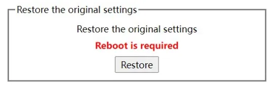</p>

<p align="center"><strong>Figure 1-1 Factory Settings Page</strong></p>

Click the "Restore" button to reset the device to factory settings.

> **Note**: Restoring factory settings erases all custom configurations. Ensure the current configuration is backed up before performing this operation.

### 1.3 Default Settings

| Parameter | Default Value |
|-----------|---------------|
| Management IP Address | 192.168.2.1 |
| Subnet Mask | 255.255.255.0 |
| Username | admin |
| Password | admin |
| HTTP Port | 80 |
| HTTPS Port | 443 |
| HTTP Service | Enabled |
| Max VLAN Display | 100 |
| Max IGMP Groups Display | 15 |

---

## Chapter 2 Installation and First Use

### 2.1 Pre-installation Preparation

(Physical installation instructions not detailed in source document, to be supplemented)

Before accessing the switch via Web browser, verify the following requirements are met:

| Requirement | Details |
|-------------|---------|
| Browser compatibility | HTML 4.0, HTTP 1.1, JavaScript 1.5 or above |
| Network connectivity | The computer must be connected to the same network as the switch |
| Switch firmware | The main program file running on the switch must support Web access |

> **Note**: Ensure the switch firmware supports Web access. If the switch was upgraded to a Web-supported version during operation, additional steps may be required. See [Upgrading to Web-Supported Version](#424-upgrading-to-web-supported-version) for details.

### 2.2 Installation Guide

(Physical installation steps 鈥?DIN rail mounting, wall mounting, power connection, network cabling 鈥?not detailed in source document, to be supplemented)

#### 2.2.1 Initial Web Access

To access the switch Web interface for the first time:

1. Set the computer's network adapter IP address to 192.168.2.2 and subnet mask to 255.255.255.0.
2. Open a Web browser and enter `192.168.2.1` in the address bar. This is the default management address of the switch.
3. Enter the username and password in the authentication dialog box. Both the default username and password are `admin` (case-sensitive).

<p align="center">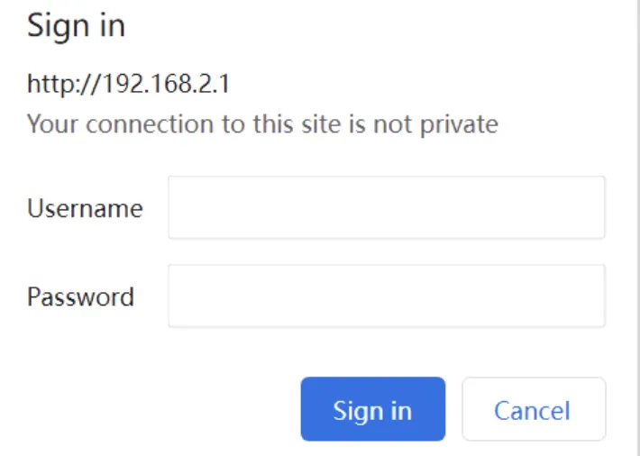</p>

<p align="center"><strong>Figure 2-1 Web Login Authentication Dialog</strong></p>

4. After successful authentication, the system information page of the switch is displayed.

### 2.3 Quick Check

After completing the initial access, verify the following:

- [ ] The Web login page loads correctly at `http://192.168.2.1`
- [ ] Authentication succeeds with the default credentials (admin/admin)
- [ ] The system information page displays the switch model and firmware version
- [ ] The navigation bar on the left side lists all configuration categories
- [ ] The "Save" button on the top control bar is accessible

---

## Chapter 3 Common Scenario Configurations

### Scenario 1: Initial Web Access to the Switch

**Objective**: Access the switch management Web interface from a computer for the first time.

**Prerequisites**: The computer is connected to the same network as the switch. The switch is powered on.

**Estimated Time**: ~5 minutes.

**Steps**:

1. Configure the computer's network adapter with IP address 192.168.2.2 and subnet mask 255.255.255.0.
2. Open a Web browser (Chrome, Firefox, or Internet Explorer) and enter `http://192.168.2.1` in the address bar.
3. In the authentication dialog, enter username `admin` and password `admin`.
4. After successful login, the switch system information page is displayed.
5. Click "Save" on the top control bar to save any configuration changes.

**Verification**:

1. Confirm the system information page displays correctly with device model and firmware version.
2. Navigate through the menu items to verify all configuration pages are accessible.

**Common Issues**:

- Unable to load the login page: Verify the computer IP address is in the 192.168.2.x range and the subnet mask is 255.255.255.0.
- Authentication failure: Confirm the username and password are entered in the correct case. The default credentials are `admin`/`admin`.

### Scenario 2: Configuring HTTPS Secure Access

**Objective**: Enable HTTPS encrypted access to the switch Web interface and disable insecure HTTP access.

**Prerequisites**: The switch is accessible via CLI (Console or Telnet). A management IP address is configured.

**Estimated Time**: ~10 minutes.

**Steps**:

1. Connect to the switch via Console port or Telnet to the management address.
2. Enter global configuration mode (prompt: `Switch_config#`).
3. If the management IP address is not configured, create the VLAN interface and assign an IP address.
4. Enter `ip http server` to enable the Web service.
5. Set the username and password using the `username` command (refer to the Security Configuration section).
6. Enter `ip http ssl-access enable` to enable HTTPS secure access.
7. Enter `no ip http http-access enable` to disable insecure HTTP access.
8. Enter `write` to save the configuration.
9. Open a Web browser on the connected computer and enter `https://192.168.2.1` (replace with the actual management IP) in the address bar.

**Verification**:

1. Confirm that `https://192.168.2.1` loads the login page with a secure connection indicator.
2. Confirm that `http://192.168.2.1` is no longer accessible.

**Common Issues**:

- Browser shows a certificate warning: This is expected for self-signed certificates. Proceed by accepting the security exception.
- HTTPS page does not load: Verify that `ip http ssl-access enable` was entered in global configuration mode and the configuration was saved.

### Scenario 3: VLAN Network Segmentation

**Objective**: Create VLANs and assign ports to separate network segments for traffic isolation.

**Prerequisites**: The switch is accessible via the Web interface. Login credentials are available.

**Estimated Time**: ~10 minutes.

**Steps**:

1. Navigate to Switching >> VLAN and select the "VLAN configuration" tab.
2. Click "Create" at the bottom control bar to create a new VLAN.
3. Enter a VLAN ID (e.g., 10) and an optional VLAN name (e.g., "Engineering").
4. In the port list, configure each port's default VLAN, VLAN mode (Trunk or Access), and whether to allow current VLAN packets.
5. Click "Set" to apply the configuration.
6. Repeat steps 2鈥? for additional VLANs as needed.
7. Click "Save" on the top control bar to save the configuration.

**Verification**:

1. Navigate to the VLAN configuration page and confirm the newly created VLANs appear in the list.
2. Verify that port assignments match the intended configuration.
3. Test network connectivity between devices in the same VLAN and confirm isolation between different VLANs.

**Common Issues**:

- VLAN list does not display all VLANs: The default maximum display is 100 VLANs. Use CLI command `ip http web max-vlan` to increase the limit.
- Port mode configuration error: When a port in Trunk mode serves as an egress port, it untags the default VLAN by default.

### Scenario 4: Port Security with IP-MAC Binding

**Objective**: Bind specific IP and MAC addresses to switch ports to prevent unauthorized network access.

**Prerequisites**: The switch is accessible via the Web interface. The IP and MAC addresses of authorized devices are known.

**Estimated Time**: ~10 minutes.

**Steps**:

1. Navigate to Security >> Port Security and click "IP MAC Binding".
2. Click "Detail" next to the target port to view existing binding information.
3. Click "Create" to add a new IP-MAC binding entry.
4. Enter the IP address, MAC address, and select the target port.
5. Click "Set" to apply the binding.
6. Repeat for additional binding entries as needed.
7. Click "Save" on the top control bar to save the configuration.

**Verification**:

1. Navigate back to the IP-MAC Binding page and confirm the new entries appear in the list.
2. Test that authorized devices can access the network through the configured port.
3. Test that unauthorized devices (with different IP/MAC combinations) are blocked.

**Common Issues**:

- Binding entry not taking effect: Verify that the DHCP Snooping protocol is enabled if using dynamic bindings.
- Devices losing connectivity: Ensure the bound IP and MAC addresses match the actual device parameters exactly.

### Scenario 5: Spanning Tree Redundancy

**Objective**: Enable Spanning Tree Protocol (STP) to prevent network loops and provide link redundancy.

**Prerequisites**: The switch is accessible via the Web interface. The network topology includes redundant links.

**Estimated Time**: ~15 minutes.

**Steps**:

1. Navigate to Redundancy >> Spanning Tree >> Global.
2. Select the protocol type (STP, RSTP, or MSTP) and configure the spanning tree priority.
3. Click "Set" to apply the global configuration.
4. Navigate to Redundancy >> Spanning Tree >> Ports and select the "Port Configuration" tab.
5. Configure per-port parameters: protocol status, priority, path cost, edge port, BPDU guard, and BPDU filter.
6. Click "Set" to apply the port configuration.
7. Click "Save" on the top control bar to save the configuration.

**Verification**:

1. Navigate to the "Port Status" tab under Spanning Tree Ports and verify port roles (Root, Designated, Blocking, etc.).
2. Confirm that the network operates without loops.
3. Disconnect a primary link and verify that traffic fails over to the secondary link.

**Common Issues**:

- Spanning tree not converging: Verify that all switches in the network have compatible STP configurations.
- Port stuck in blocking state: Check port priority and path cost settings.

### Scenario 6: DHCP Server Setup

**Objective**: Configure the switch as a DHCP server to automatically assign IP addresses to connected devices.

**Prerequisites**: The switch is accessible via the Web interface. A VLAN interface with an IP address is configured.

**Estimated Time**: ~10 minutes.

**Steps**:

1. Navigate to Advanced >> DHCP Server >> Global.
2. Enable the DHCP server feature. Configure ICMP packet count and timeout as needed (defaults: 2 packets, 5 seconds).
3. Click "Set" to apply the global configuration.
4. Navigate to Advanced >> DHCP Server >> Pool.
5. Click "Create" to add a new DHCP address pool.
6. Configure pool parameters: pool name, network address, subnet mask, default gateway, DNS server, and lease time.
7. Click "Set" to apply the pool configuration.
8. Click "Save" on the top control bar to save the configuration.

**Verification**:

1. Connect a client device to a switch port associated with the DHCP pool's VLAN.
2. Verify the client automatically receives an IP address within the configured pool range.
3. Confirm the client can reach the default gateway and DNS server.

**Common Issues**:

- Client not receiving an IP address: Verify the DHCP server is enabled globally and the pool network matches the VLAN interface subnet.
- IP address conflict: Ensure the DHCP pool range does not overlap with statically assigned addresses.

---

## Chapter 4 Feature Descriptions and Parameter Reference

### 4.1 HTTP/HTTPS Protocol Configuration

The switch supports configuration via CLI, SNMP, and Web interface. This section describes the HTTP and HTTPS protocol configuration options.

#### 4.1.1 Language Selection

The Web interface supports English and Chinese. The language setting can be configured in global configuration mode via CLI.

| Command | Description |
|---------|-------------|
| `[no] ip http language {english}` | Set the Web language to English. The Web interface displays in the English version. |

#### 4.1.2 HTTP Service Port Configuration

The default HTTP port is 80. Users can access the switch by entering the IP address directly. The service port can be changed; after modification, the IP address and new port must be used together to access the switch. For example, if the IP address is 192.168.2.1 and the port is changed to 1234, the access address becomes `http://192.168.2.1:1234`.

> **Note**: Avoid using well-known protocol ports (e.g., FTP-20, Telnet-23, DNS-53, SNMP-161). Ports above 1024 are recommended.

| Command | Description |
|---------|-------------|
| `ip http port {portNumber}` | Configure the HTTP service port |

#### 4.1.3 Enabling the HTTP Service

HTTP access is controlled by enabling or disabling the HTTP service. When disabled, HTTP communication between the switch and PC stops.

| Command | Description |
|---------|-------------|
| `ip http server` | Enable the HTTP service |

#### 4.1.4 HTTP Access Mode Configuration

The switch supports two access modes: HTTP and HTTPS.

| Command | Description |
|---------|-------------|
| `ip http http-access enable` | Configure HTTP access mode |

#### 4.1.5 Max-VLAN Display Setting

Configure the maximum number of VLANs displayed on the Web page. Valid range: 1鈥?094 (default: 100).

| Command | Description |
|---------|-------------|
| `ip http web max-vlan {max-vlan}` | Set the maximum VLAN count displayed on the Web page |

#### 4.1.6 IGMP-Groups Display Setting

Configure the maximum number of IGMP groups displayed on the Web page. Valid range: 1鈥?00 (default: 15).

| Command | Description |
|---------|-------------|
| `ip http web igmp-groups {igmp-groups}` | Set the maximum IGMP group count displayed on the Web page |

#### 4.1.7 HTTPS Access Configuration

| Command | Description |
|---------|-------------|
| `ip http ssl-access enable` | Enable HTTPS access mode |

#### 4.1.8 HTTPS Service Port Configuration

The default HTTPS port is 443. The port can be changed via CLI. Ports above 1024 are recommended to avoid collision.

| Command | Description |
|---------|-------------|
| `ip http secure-port {portNumber}` | Set the HTTPS port number |

### 4.2 Web Interface Overview

After login, the Web homepage consists of four areas: the top control bar, the navigation bar, the configuration display area, and the bottom control bar.

#### 4.2.1 Top Control Bar

<p align="center"></p>

<p align="center"><strong>Figure 4-1 Top Control Bar</strong></p>

| Button | Function |
|--------|----------|
| Save | Write the current settings to the device configuration file. Equivalent to the `write` command. Configuration changes made via Web are not automatically saved. Unsaved configuration is lost after reboot. |
| English | Switch the interface to English. |
| Chinese | Switch the interface to Chinese. |

#### 4.2.2 Navigation Bar

<p align="center">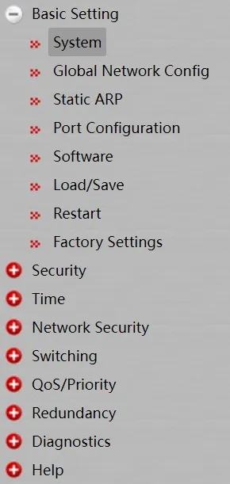</p>

<p align="center"><strong>Figure 4-2 Navigation Bar</strong></p>

The navigation bar displays configuration categories in a list format, classified by type. The default view opens at "System". To configure a specific item, click the group name and then the sub-item. For example, to view port traffic statistics, navigate to "Diagnostics" >> "Ports" >> "Statistics Table".

> **Note**: A limited user can only view the device state and cannot modify configuration. When logged in with limited user permissions, only "System" is displayed.

#### 4.2.3 Configuration Display Area

<p align="center"></p>

<p align="center"><strong>Figure 4-3 Configuration Display Area</strong></p>

The configuration display area shows the device state and configuration. The content changes based on the selected navigation bar item.

#### 4.2.4 Bottom Control Bar

<p align="center"></p>

<p align="center"><strong>Figure 4-4 Bottom Control Bar - Set and Reload</strong></p>

<p align="center"></p>

<p align="center"><strong>Figure 4-5 Bottom Control Bar - Create and Delete</strong></p>

<p align="center"></p>

<p align="center"><strong>Figure 4-6 Bottom Control Bar - Go Back and Clear</strong></p>

| Button | Function |
|--------|----------|
| Set | Apply the modified configuration to the device. Applying configuration does not save it to the configuration file. To save, click "Save" on the top control bar. |
| Reload | Refresh the content displayed in the current configuration area. |
| Create | Create a new list item (e.g., a VLAN or a new user). |
| Delete | Delete a selected item from the list. |
| Go Back | Return to the previous-level configuration page. |
| Clear | Clear current configuration content (e.g., port statistics). |

#### 4.2.5 Upgrading to Web-Supported Version

If the switch is upgraded to a Web-supported firmware version during operation and has stored configuration files, Web access may not be directly available. Perform the following steps to enable Web access:

1. Connect to the console port of the switch with the accessory cable, or Telnet to the management address.
2. Enter global configuration mode (`Switch_config#`).
3. If the management address is not configured, create the VLAN interface and configure the IP address.
4. Enter `ip http server` in global configuration mode to start the Web service.
5. Run the `username` command to set the username and password. Refer to the Security Configuration section.
6. Enter `write` to save the configuration.

After these steps, enter the switch address in a Web browser to access the device.

### 4.3 Basic Settings

<p align="center">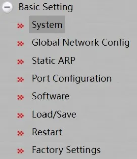</p>

<p align="center"><strong>Figure 4-7 Basic Setting Navigation Menu</strong></p>

#### 4.3.1 System

Navigate to Basic Setting >> System.

<p align="center"></p>

<p align="center"><strong>Figure 4-8 System Information Page</strong></p>

<p align="center">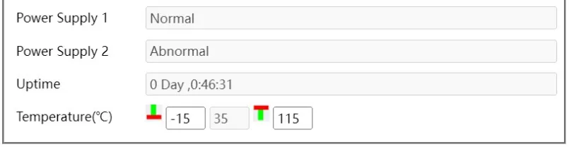</p>

<p align="center"><strong>Figure 4-9 System Configuration Page</strong></p>

This page displays system messages and allows configuration of the device hostname. The default hostname is "Switch". Enter a new hostname in the text box and click "Set" in the bottom control bar to apply.

#### 4.3.2 Global Network Configuration (Management Interface)

Navigate to Basic Setting >> Global Network Config.

<p align="center"></p>

<p align="center"><strong>Figure 4-10 Global Network Configuration Page</strong></p>

This page configures the IP address of Interface VLAN 1 for switch management access. In the initial state, the device MAC address, interface IP address, subnet mask, and gateway are displayed.

#### 4.3.3 Port Configuration

Navigate to Basic Setting >> Port Configuration.

<p align="center">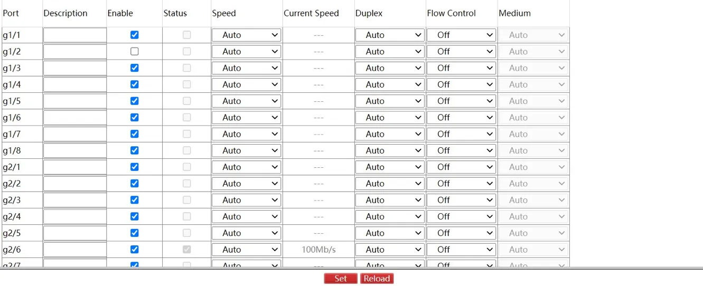</p>

<p align="center"><strong>Figure 4-11 Port Configuration Page</strong></p>

This page allows modification of port status, speed, duplex mode, and flow control.

> **Note**: Modifying a port's speed or duplex mode may cause link switching, which can affect network communication.

#### 4.3.4 Auto-Shutdown

Navigate to Basic Setting >> Auto-Shutdown.

<p align="center"></p>

<p align="center"><strong>Figure 4-12 Auto-Shutdown Configuration Page</strong></p>

This page configures the auto-shutdown port and shutdown delay time. Click "Set" to apply the configuration, then click "Save" on the top control bar. The corresponding port shuts down after the configured delay time following switch power-on.

#### 4.3.5 Software Management

Navigate to Basic Setting >> Software.

<p align="center">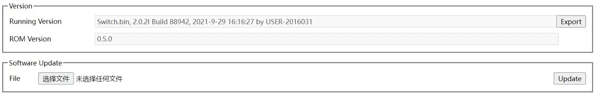</p>

<p align="center"><strong>Figure 4-13 Software Management Page</strong></p>

This page displays the current running version and ROM version. Click "Export" to export the current running version to a computer. In the Software Update section, select the firmware file to update and click "Update" to change the system software version.

> **Note**: The updated software takes effect only after the device is restarted.

#### 4.3.6 Load/Save Configuration

Navigate to Basic Setting >> Load/Save.

<p align="center">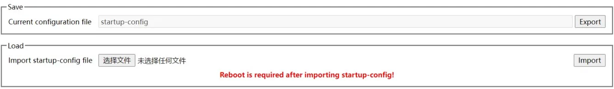</p>

<p align="center"><strong>Figure 4-14 Load/Save Configuration Page</strong></p>

Click "Export" to export the current system configuration to a computer. Click "Import" to import a configuration file to the switch.

#### 4.3.7 Restart

Navigate to Basic Setting >> Restart.

<p align="center"></p>

<p align="center"><strong>Figure 4-15 Restart Page</strong></p>

Options available on this page:
- **Reboot**: Restart the switch.
- **Clear MAC Address Table**: Clear the MAC address table.
- **Clear ARP Table**: Clear the ARP table.
- **Clear port counters**: Reset all port statistics counters.

#### 4.3.8 Factory Settings

Navigate to Basic Setting >> Factory Settings.

<p align="center"></p>

<p align="center"><strong>Figure 4-16 Factory Settings Page</strong></p>

Click the "Restore" button to reset the device to factory settings.

### 4.4 Security

<p align="center">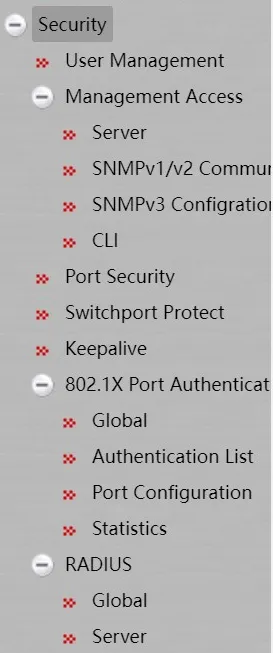</p>

<p align="center"><strong>Figure 4-17 Security Navigation Menu</strong></p>

#### 4.4.1 User Management

**User Management**

Navigate to Security >> User Management.

<p align="center"></p>

<p align="center"><strong>Figure 4-18 User Management Page</strong></p>

Click "Modify" to change a user's configuration. Select a user and click "Delete" to remove the selected user.

Click "Create" to open the user creation page:

<p align="center"></p>

<p align="center"><strong>Figure 4-19 Create User Page</strong></p>

Fill in the configuration fields and click "Set" to create a new user. Click "Reload" to refresh user information. Click "Go Back" to return to the previous page.

**Group Management**

Navigate to Security >> User Management, then click "Group Management".

<p align="center"></p>

<p align="center"><strong>Figure 4-20 Group Management Page</strong></p>

Click "Modify" to change a user group's configuration. Select a group and click "Delete" to remove it. Click "Detail" to view and configure group members:

<p align="center"></p>

<p align="center"><strong>Figure 4-21 Group Detail Page</strong></p>

Click "Create" to open the group creation page:

<p align="center"></p>

<p align="center"><strong>Figure 4-22 Create Group Page</strong></p>

Fill in the configuration fields and click "Set" to create a new user group.

**Password Rule Management**

Navigate to Security >> User Management, then click "Pass Management".

<p align="center"></p>

<p align="center"><strong>Figure 4-23 Password Rule Management Page</strong></p>

Click "Modify" to change password rules. Click "Delete" to remove a password rule.

Click "Create" to open the password rule creation page:

<p align="center"></p>

<p align="center"><strong>Figure 4-24 Create Password Rule Page</strong></p>

Fill in the configuration fields and click "Set" to create a new password rule.

**Authorization Rule Management**

Navigate to Security >> User Management, then click "Author Management".

<p align="center"></p>

<p align="center"><strong>Figure 4-25 Authorization Rule Management Page</strong></p>

Click "Modify" to change authorization rules. Click "Delete" to remove authorization rules.

Click "Create" to open the authorization rule creation page:

<p align="center"></p>

<p align="center"><strong>Figure 4-26 Create Authorization Rule Page</strong></p>

Fill in the configuration fields and click "Set" to create new authorization rules.

**Authentication Rule Management**

Navigate to Security >> User Management, then click "Authen Management".

<p align="center"></p>

<p align="center"><strong>Figure 4-27 Authentication Rule Management Page</strong></p>

Click "Modify" to change authentication rules. Click "Delete" to remove authentication rules.

Click "Create" to open the authentication rule creation page:

<p align="center"></p>

<p align="center"><strong>Figure 4-28 Create Authentication Rule Page</strong></p>

Fill in the configuration fields and click "Set" to create new authentication rules.

#### 4.4.2 Management Access

**Server Configuration**

Navigate to Security >> Management Access >> Server. This page allows configuration of HTTP, HTTPS, SSH, and SNMP services.

Click "HTTP" to configure HTTP settings:

<p align="center">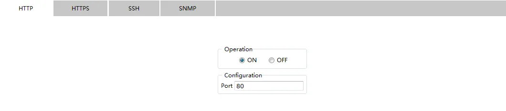</p>

<p align="center"><strong>Figure 4-29 HTTP Server Configuration</strong></p>

Click "HTTPS" to configure HTTPS settings:

<p align="center">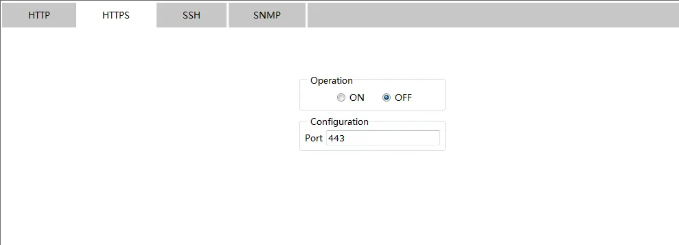</p>

<p align="center"><strong>Figure 4-30 HTTPS Configuration</strong></p>

Click "SSH" to configure SSH settings.

Click "SNMP" to configure SNMP settings:

<p align="center"></p>

<p align="center"><strong>Figure 4-31 SNMP Configuration - Part 1</strong></p>

<p align="center">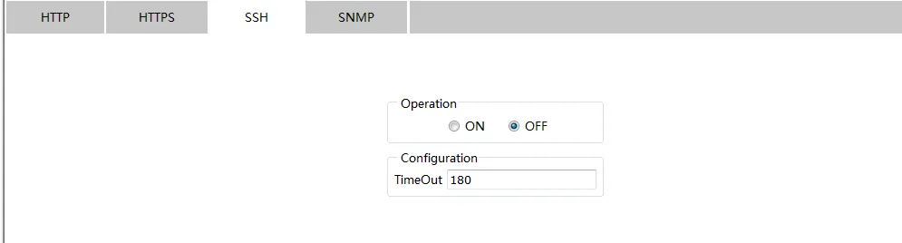</p>

<p align="center"><strong>Figure 4-32 SNMP Configuration - Part 2</strong></p>

**SNMP Community Management (SNMPv1/v2)**

Navigate to Security >> Management Access >> SNMPv1/v2 Community.

<p align="center"></p>

<p align="center"><strong>Figure 4-33 SNMP Community Management Page</strong></p>

Click "Modify" to change SNMP Community properties. Click "Delete" to remove a selected community.

Click "Create" to create a new SNMP Community:

<p align="center"></p>

<p align="center"><strong>Figure 4-34 Create SNMP Community Page</strong></p>

Click "SNMP Host" to switch to the SNMP Host configuration page:

<p align="center"></p>

<p align="center"><strong>Figure 4-35 SNMP Host Configuration Page</strong></p>

Click "Create" to create a new SNMP Host:

<p align="center"></p>

<p align="center"><strong>Figure 4-36 Create SNMP Host Page</strong></p>

Click "Modify" to modify SNMP Host properties. Click "Delete" to remove a selected SNMP Host.

**SNMPv3 Configuration**

Navigate to Security >> Management Access >> SNMPv3 Configuration.

<p align="center">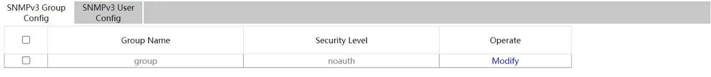</p>

<p align="center"><strong>Figure 4-37 SNMPv3 Group Configuration Page</strong></p>

Click "Modify" to change SNMPv3 Group configuration properties. Click "Reload" to refresh the information. Click "Delete" to remove a selected group.

Click "Create" to create a new SNMPv3 Group:

<p align="center">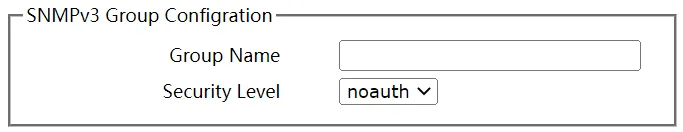</p>

<p align="center"><strong>Figure 4-38 Create SNMPv3 Group Page</strong></p>

Click "SNMPv3 User Config" to enter the user configuration page:

<p align="center">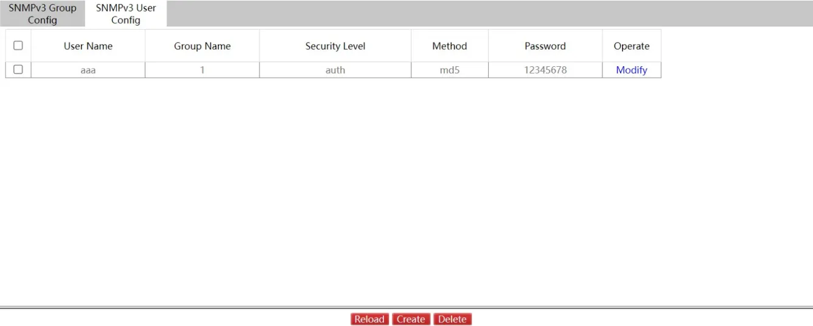</p>

<p align="center"><strong>Figure 4-39 SNMPv3 User Configuration Page</strong></p>

Click "Modify" to change SNMPv3 User configuration properties. Click "Reload" to refresh the information.

Click "Create" to create a new SNMPv3 User:

<p align="center">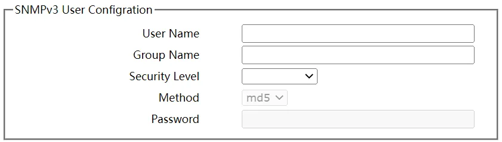</p>

<p align="center"><strong>Figure 4-40 Create SNMPv3 User Page</strong></p>

**CLI (Command Line Interface)**

Navigate to Security >> Management Access >> CLI.

<p align="center"></p>

<p align="center"><strong>Figure 4-41 CLI Global Configuration Page</strong></p>

This page configures the terminal timeout. A value of 0 disables the timeout (no automatic disconnection).

Click "Login Banner" to configure the terminal login banner:

<p align="center"></p>

<p align="center"><strong>Figure 4-42 Login Banner Configuration Page</strong></p>

#### 4.4.3 Port Security

**IP MAC Binding**

Navigate to Security >> Port Security, then click "IP MAC Binding".

<p align="center">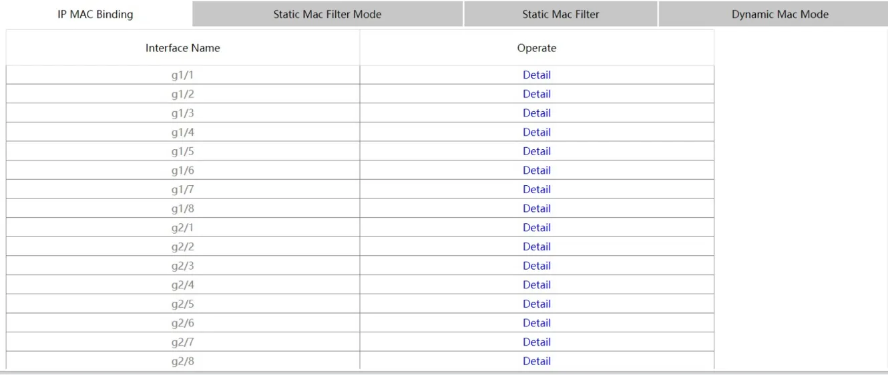</p>

<p align="center"><strong>Figure 4-43 IP MAC Binding Page</strong></p>

Click "Detail" to view the IP-MAC binding information for a specific port:

<p align="center"></p>

<p align="center"><strong>Figure 4-44 IP MAC Binding Detail Page</strong></p>

Click "Modify" to change selected binding items. Click "Reload" to refresh the binding configuration.

Click "Create" to create a new IP-MAC binding entry:

<p align="center"></p>

<p align="center"><strong>Figure 4-45 Create IP MAC Binding Page</strong></p>

Click "Delete" to remove a selected binding entry.

**Static MAC Filter Mode**

Navigate to Security >> Port Security, then click "Static MAC Filter Mode".

<p align="center">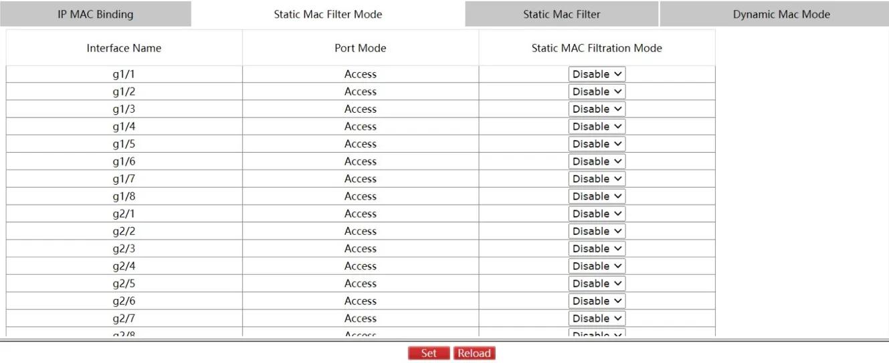</p>

<p align="center"><strong>Figure 4-46 Static MAC Filter Mode Page</strong></p>

This page configures the static MAC filtration mode for each interface.

**Static MAC Filter**

Navigate to Security >> Port Security, then click "Static MAC Filter".

<p align="center">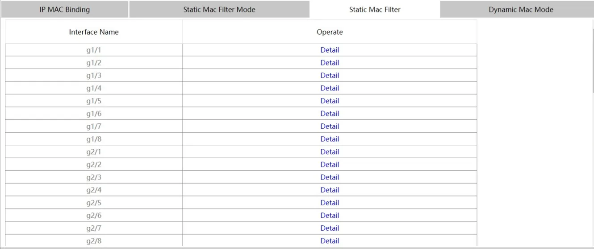</p>

<p align="center"><strong>Figure 4-47 Static MAC Filter Page</strong></p>

Click "Detail" to view the static MAC filtration entries for a specific interface:

<p align="center"></p>

<p align="center"><strong>Figure 4-48 Static MAC Filter Detail Page</strong></p>

Click "Modify" to modify static MAC filtration entries. Click "Create" to add new entries:

<p align="center"></p>

<p align="center"><strong>Figure 4-49 Create Static MAC Filter Page</strong></p>

Click "Delete" to remove selected static MAC filtration entries.

**Dynamic MAC Mode**

Navigate to Security >> Port Security, then click "Dynamic MAC Mode".

<p align="center">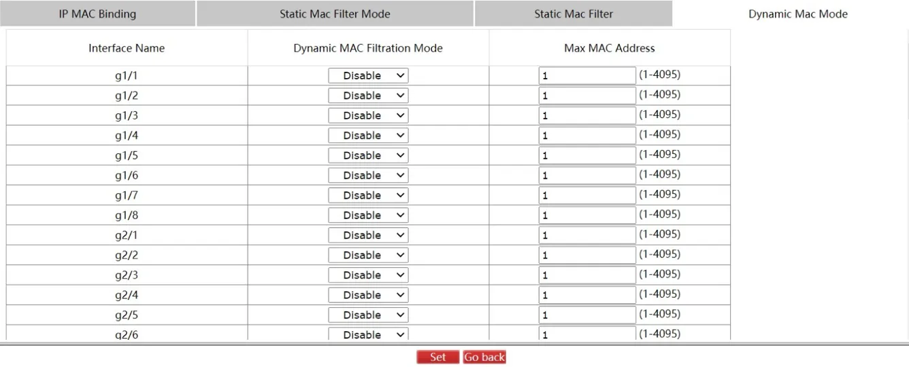</p>

<p align="center"><strong>Figure 4-50 Dynamic MAC Mode Page</strong></p>

This page configures the dynamic MAC mode for each interface.

#### 4.4.4 Switchport Protect

Navigate to Security >> Switchport Protect.

<p align="center">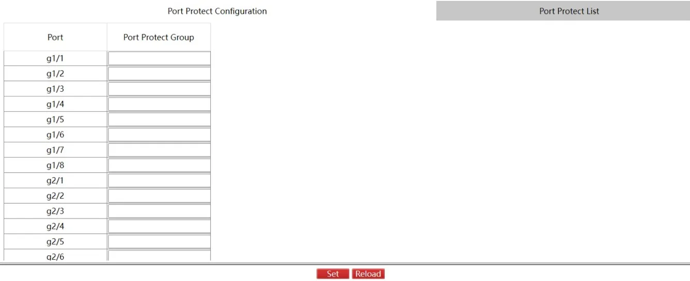</p>

<p align="center"><strong>Figure 4-51 Switchport Protect Page</strong></p>

Configure the port protection group on this page. Click "Set" to apply the configuration. Click "Reload" to refresh the information.

Click "Port Protect List" to enter the group management page:

<p align="center">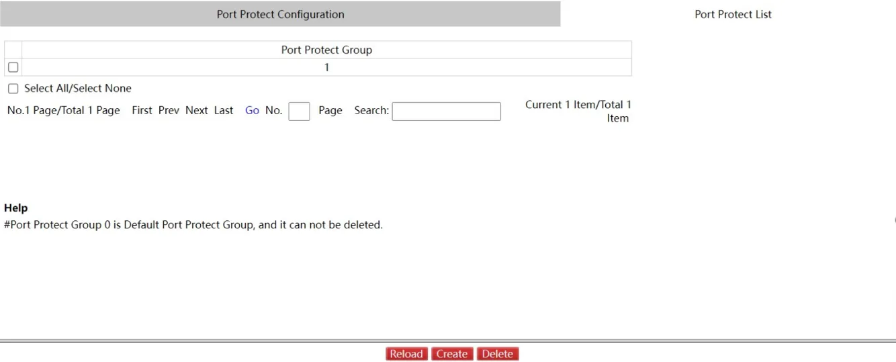</p>

<p align="center"><strong>Figure 4-52 Port Protect List Page</strong></p>

Click "Reload" to refresh the information. Click "Delete" to remove a selected protection group.

Click "Create" to create a new port protection group:

<p align="center"></p>

<p align="center"><strong>Figure 4-53 Create Port Protect Group Page</strong></p>

Click "Set" to apply the configuration. Click "Go Back" to return to the Port Protect List page.

#### 4.4.5 Keepalive

Navigate to Security >> Keepalive.

<p align="center">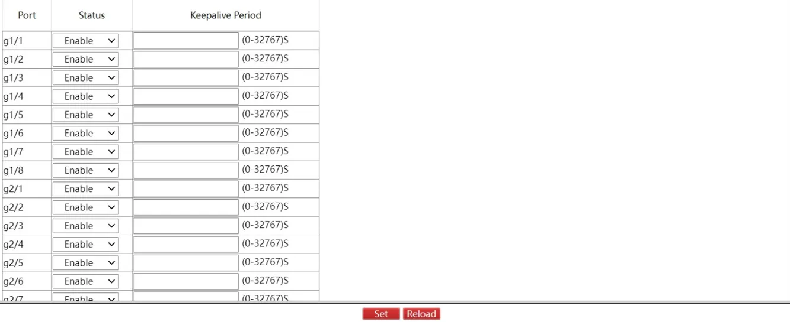</p>

<p align="center"><strong>Figure 4-54 Keepalive Configuration Page</strong></p>

Configure port keepalive status on this page. Click "Set" to apply the configuration. Click "Reload" to refresh the information.

#### 4.4.6 802.1X Port Authentication

**Global Configuration**

Navigate to Security >> 802.1X Port Authentication >> Global.

<p align="center"></p>

<p align="center"><strong>Figure 4-55 802.1X Global Configuration Page</strong></p>

This page enables or disables 802.1X port authentication globally.

**Authentication List**

Navigate to Security >> 802.1X Port Authentication >> Authentication List.

<p align="center"></p>

<p align="center"><strong>Figure 4-56 802.1X Authentication List Page</strong></p>

Click "Reload" to refresh the authentication list. Click "Delete" to remove a selected entry.

Click "Create" to create a new authentication entry:

<p align="center"></p>

<p align="center"><strong>Figure 4-57 Create Authentication Entry Page</strong></p>

**Port Configuration**

Navigate to Security >> 802.1X Port Authentication >> Port Configuration.

<p align="center"></p>

<p align="center"><strong>Figure 4-58 802.1X Port Configuration Page</strong></p>

This page configures per-interface 802.1X port authentication settings, including: enable/disable, authentication type, authentication mode, and method.

> **Note**: Some configuration options are available only when 802.1X port authentication is enabled.

**Statistics**

Navigate to Security >> 802.1X Port Authentication >> Statistics.

<p align="center">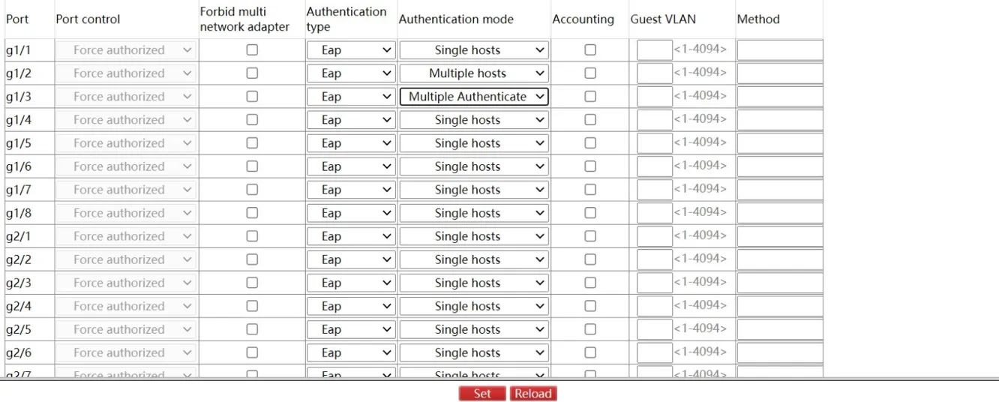</p>

<p align="center"><strong>Figure 4-59 802.1X Statistics Page</strong></p>

This page displays 802.1X message statistics for all ports.

#### 4.4.7 RADIUS

**Global Configuration**

Navigate to Security >> RADIUS >> Global.

<p align="center"></p>

<p align="center"><strong>Figure 4-60 RADIUS Global Configuration Page</strong></p>

This page configures: maximum retransmit count, timeout, NAS settings, and RADIUS server key.

**Service Configuration**

Navigate to Security >> RADIUS >> Service.

<p align="center"></p>

<p align="center"><strong>Figure 4-61 RADIUS Service Configuration Page</strong></p>

This page configures the RADIUS server authentication port and accounting port. Click "Set" to apply. Click "Reload" to refresh. Click "Delete" to remove a selected server entry.

Click "Create" to create a new RADIUS server entry:

<p align="center"></p>

<p align="center"><strong>Figure 4-62 Create RADIUS Server Page</strong></p>

### 4.5 Time Configuration

<p align="center">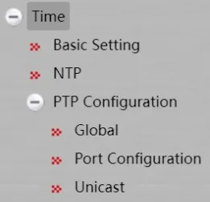</p>

<p align="center"><strong>Figure 4-63 Time Navigation Menu</strong></p>

#### 4.5.1 Basic Setting

Navigate to Time >> Basic Setting.

<p align="center"></p>

<p align="center"><strong>Figure 4-64 Time Basic Setting Page</strong></p>

Click "Reload" to refresh the displayed system time. Configure the system time zone on this page. Select "Set Time Manually" to set the system time manually.

#### 4.5.2 NTP

Navigate to Time >> NTP.

<p align="center">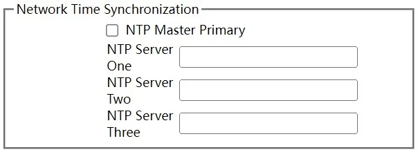</p>

<p align="center"><strong>Figure 4-65 NTP Configuration Page</strong></p>

This page configures the NTP (Network Time Protocol) server IP address for time synchronization.

#### 4.5.3 PTP Configuration

**Global**

Navigate to Time >> PTP >> Global.

<p align="center"></p>

<p align="center"><strong>Figure 4-66 PTP Global Configuration - Part 1</strong></p>

<p align="center"></p>

<p align="center"><strong>Figure 4-67 PTP Global Configuration - Part 2</strong></p>

This page configures: PTP enable/disable, PTP basic settings, default PTP data set, PTP time properties, regulator settings, sync process mechanism, and clock frequency synchronization. Click "Set" to apply. Click "Reload" to refresh.

**Port Configuration**

Navigate to Time >> PTP >> Port Configuration.

<p align="center">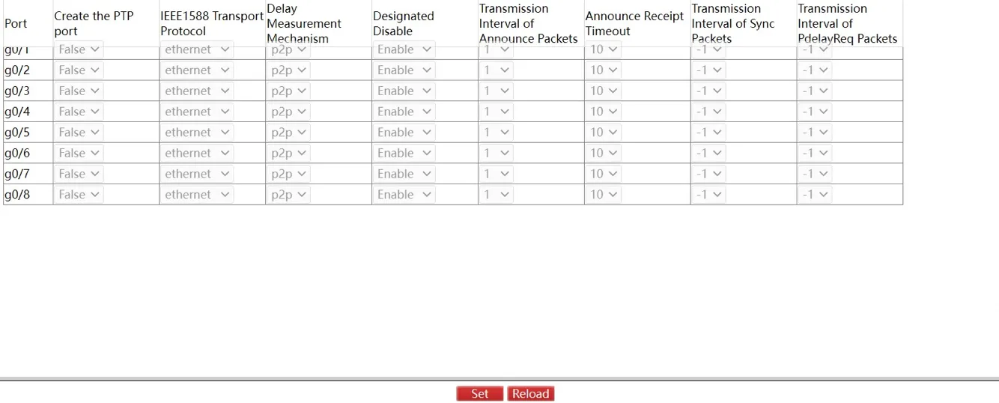</p>

<p align="center"><strong>Figure 4-68 PTP Port Configuration Page</strong></p>

This page configures PTP port settings, including: IEEE 1588 transport protocol type and delay measurement mechanism. Click "Reload" to refresh the configuration.

> **Note**: This page can only be configured after PTP protocol is enabled.

**Unicast**

Navigate to Time >> PTP >> Unicast.

<p align="center">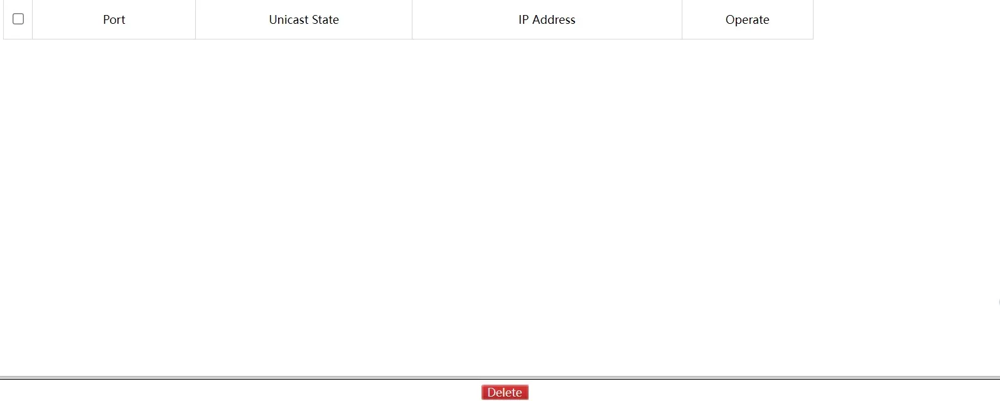</p>

<p align="center"><strong>Figure 4-69 PTP Unicast Configuration Page</strong></p>

This page displays the unicast status and IP address of each port, and allows modification of the unicast state.

### 4.6 Network Security

<p align="center">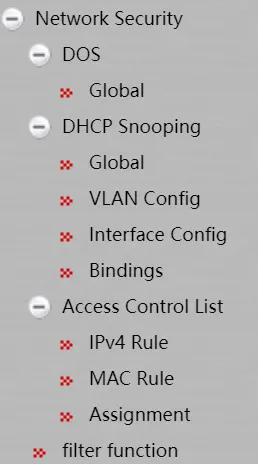</p>

<p align="center"><strong>Figure 4-70 Network Security Navigation Menu</strong></p>

#### 4.6.1 DoS Configuration

**DoS Global Configuration**

Navigate to Network Security >> DOS >> Global.

<p align="center">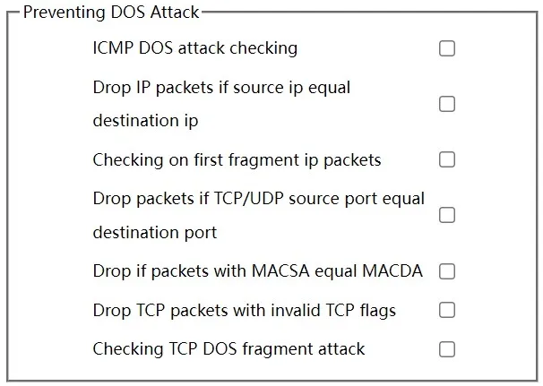</p>

<p align="center"><strong>Figure 4-71 DoS Global Configuration Page</strong></p>

Enable or disable specific DoS attack prevention mechanisms as needed. Click "Set" to save the configuration.

#### 4.6.2 DHCP Snooping Configuration

**DHCP Snooping Global Configuration**

Navigate to Network Security >> DHCP Snooping >> Global.

<p align="center">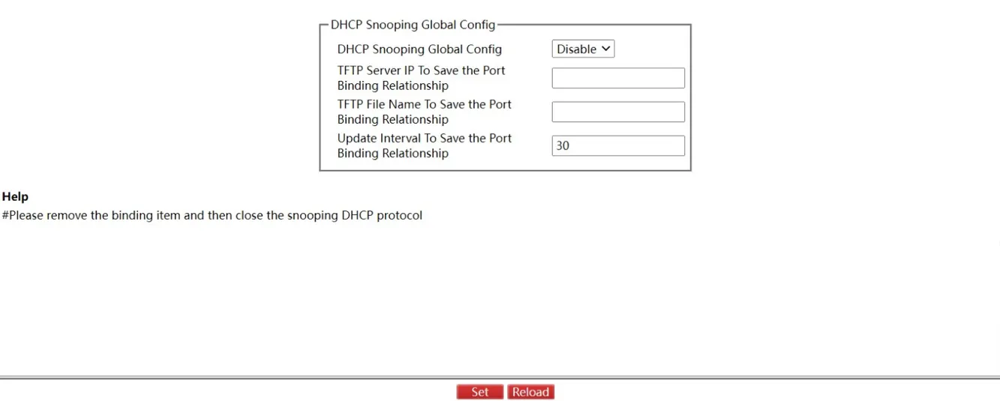</p>

<p align="center"><strong>Figure 4-72 DHCP Snooping Global Configuration Page</strong></p>

Enabling global DHCP Snooping detects all DHCP messages and forms corresponding binding relationships. If a client obtains an address before DHCP Snooping is enabled, the switch cannot add the binding relationship.

After saving the switch configuration and restarting, all previously configured interface binding relationships are cleared. When IP source address monitoring is enabled and no binding relationship exists for an interface, the switch denies forwarding of all IP messages on that interface. To prevent this, configure a TFTP backup server for binding relationships, which allows the switch to download the binding list from the TFTP server automatically after restart.

When configuring backup interface binding relationships, different switches can copy their binding lists to the same TFTP server by using different filenames.

The binding relationship list of interface MAC and IP addresses is dynamic. The default update interval is 30 minutes.

**DHCP Snooping VLAN Configuration**

Navigate to Network Security >> DHCP Snooping >> VLAN Config.

<p align="center"></p>

<p align="center"><strong>Figure 4-73 DHCP Snooping VLAN Configuration Page</strong></p>

When DHCP Snooping is enabled on a VLAN, all DHCP messages received by untrusted physical ports on that VLAN are inspected. Any DHCP response messages received by untrusted ports are dropped to prevent forged messages or rogue DHCP servers from assigning addresses. DHCP requests from untrusted ports where the MAC address does not match the hardware address field are treated as DoS attack messages and are discarded.

ARP dynamic monitoring inspects ARP messages on all physical ports of a VLAN. If the source MAC and IP addresses do not match the configured binding relations, the messages are not processed. Binding relations may be dynamically configured via DHCP or manually configured.

IP source address monitoring functions similarly for IP messages within the VLAN.

**DHCP Snooping Interface Configuration**

Navigate to Network Security >> DHCP Snooping >> Interface Config.

<p align="center"></p>

<p align="center"><strong>Figure 4-74 DHCP Snooping Interface Configuration Page</strong></p>

- **DHCP-trusted port**: DHCP messages received on this port are not inspected.
- **ARP-trusted port**: ARP monitoring is not applied. Ports are untrusted by default.
- **IP source trusted port**: Source address inspection is not applied.

**DHCP Snooping Bindings**

Navigate to Network Security >> DHCP Snooping >> Bindings.

<p align="center">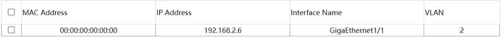</p>

<p align="center"><strong>Figure 4-75 DHCP Snooping Bindings Page</strong></p>

For hosts that do not use DHCP, manually add binding entries at switch ports to allow network access. Manually configured entries take precedence over dynamically configured bindings. If the MAC address of a manual entry matches a dynamic entry, the dynamic entry is updated based on the manual configuration. The MAC address is the unique index for binding entries on a port.

Click "Create" to create a manually configured binding entry:

<p align="center"></p>

<p align="center"><strong>Figure 4-76 Create DHCP Snooping Binding Page</strong></p>

> **Note**: Binding entries can only be created when DHCP Snooping protocol is enabled.

#### 4.6.3 Access Control List

**IPv4 Rules**

Navigate to Network Security >> Access Control List >> IPv4 Rules.

<p align="center">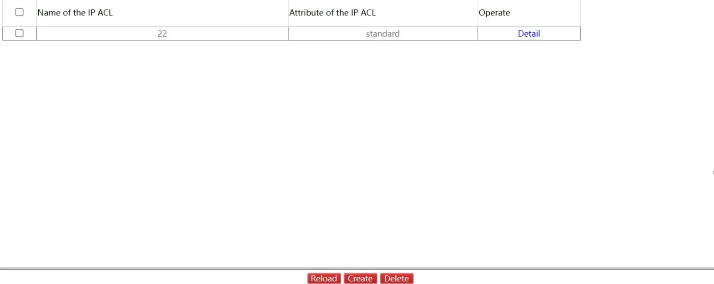</p>

<p align="center"><strong>Figure 4-77 IPv4 Rules Page</strong></p>

Click "Delete" to remove a selected access control list. Click "Detail" to view the IP Access Control List entries:

<p align="center"></p>

<p align="center"><strong>Figure 4-78 IP Access Control List Detail Page</strong></p>

Click "Modify" to configure the rules of the corresponding IP Access Control List. Click "Go Back" to return to the IPv4 Rules page.

Click "Create" to create an IP access control list:

<p align="center"></p>

<p align="center"><strong>Figure 4-79 Create IP Access Control List Page</strong></p>

**MAC Rules**

Navigate to Network Security >> Access Control List >> MAC Rules.

<p align="center"></p>

<p align="center"><strong>Figure 4-80 MAC Rules Page</strong></p>

Click "Create" to create a MAC access control list. Click "Delete" to remove a selected list.

<p align="center"></p>

<p align="center"><strong>Figure 4-81 Create MAC Access Control List Page</strong></p>

**Assignment**

Navigate to Network Security >> Access Control List >> Assignment.

<p align="center"></p>

<p align="center"><strong>Figure 4-82 ACL Assignment Page</strong></p>

This page assigns access control lists to interfaces.

#### 4.6.4 Filter Function

Navigate to Network Security >> Filter Function.

<p align="center">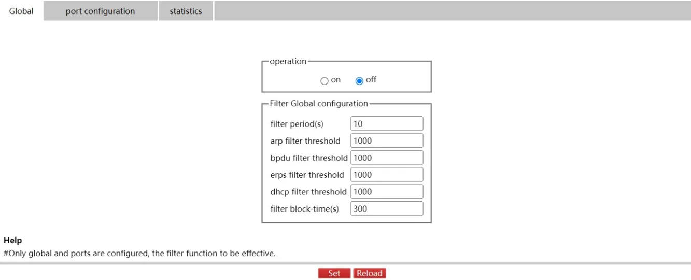</p>

<p align="center"><strong>Figure 4-83 Filter Function Global Configuration Page</strong></p>

Click "Set" to apply the global filter configuration. Click "Reload" to refresh.

Click "Port Configuration" to enter the per-port filter configuration page:

<p align="center"></p>

<p align="center"><strong>Figure 4-84 Filter Function Port Configuration Page</strong></p>

Click "Set" to apply port filter configuration. Click "Reload" to refresh.

Click "Statistics" to view filter blocking and counting statistics:

<p align="center"></p>

<p align="center"><strong>Figure 4-85 Filter Function Statistics Page</strong></p>

Click "Reload" to refresh the statistics.

### 4.7 Switching

<p align="center">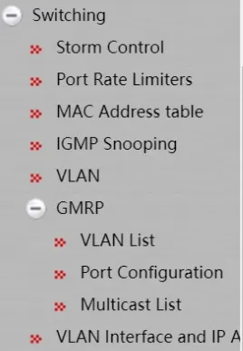</p>

<p align="center"><strong>Figure 4-86 Switching Navigation Menu</strong></p>

#### 4.7.1 Storm Control

**Broadcast Storm Control**

Navigate to Switching >> Storm Control, select the Broadcast tab.

<p align="center"></p>

<p align="center"><strong>Figure 4-87 Broadcast Storm Control Page</strong></p>

Use the Status column dropdown to enable or disable broadcast storm control per port. Enter the threshold value for broadcast packets in the Threshold column. The valid threshold range for each port is displayed.

**Multicast Storm Control**

<p align="center"></p>

<p align="center"><strong>Figure 4-88 Multicast Storm Control Page</strong></p>

Use the Status column dropdown to enable or disable multicast storm control per port. Enter the threshold value for multicast packets in the Threshold column.

**Unicast Storm Control**

<p align="center"></p>

<p align="center"><strong>Figure 4-89 Unicast Storm Control Page</strong></p>

Use the Status column dropdown to enable or disable unicast storm control per port. Enter the threshold value for unicast packets in the Threshold column.

#### 4.7.2 Port Rate Limits

Navigate to Switching >> Port Rate Limits.

<p align="center"></p>

<p align="center"><strong>Figure 4-90 Port Rate Limits Page</strong></p>

Configure rate limits on port receive and transmit speeds. By default, all ports have no speed limit. Receive and transmit speeds can be configured by ratio or by the switch's defined unit.

#### 4.7.3 MAC Address Table

Navigate to Switching >> MAC Address Table.

<p align="center">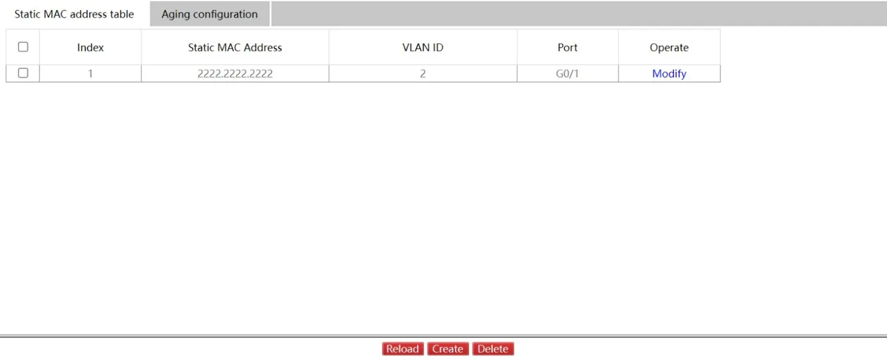</p>

<p align="center"><strong>Figure 4-91 Static MAC Address Table Page</strong></p>

This page displays the static MAC address, VLAN ID, and index. Click "Modify" or "Create" to enter the static MAC address configuration page:

<p align="center"></p>

<p align="center"><strong>Figure 4-92 Static MAC Address Configuration Page</strong></p>

Click "Aging Configuration" to enter the aging time configuration page:

<p align="center">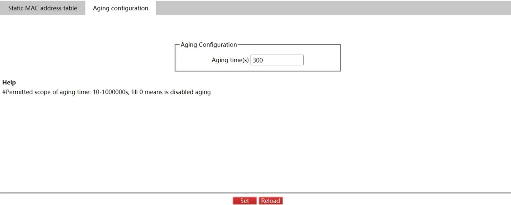</p>

<p align="center"><strong>Figure 4-93 MAC Address Aging Configuration Page</strong></p>

#### 4.7.4 IGMP Snooping

**IGMP Snooping Configuration**

Navigate to Switching >> IGMP Snooping, select the "IGMP Snooping" tab.

<p align="center"></p>

<p align="center"><strong>Figure 4-94 IGMP Snooping Configuration Page</strong></p>

This page configures: unknown multicast forwarding behavior, IGMP Snooping enable/disable, and IGMP Querier designation.

**IGMP Snooping VLAN**

Navigate to Switching >> IGMP Snooping, select the "IGMP Snooping VLAN" tab.

<p align="center"></p>

<p align="center"><strong>Figure 4-95 IGMP Snooping VLAN Page</strong></p>

Click "Modify" to modify member ports, running status, and immediate-leave settings. Click "Create" to add IGMP Snooping VLAN configuration (up to 8 physical ports per VLAN via Web). Click "Delete" to remove a selected entry.

<p align="center"></p>

<p align="center"><strong>Figure 4-96 IGMP Snooping VLAN Configuration Page</strong></p>

When creating an IGMP Snooping VLAN, the VLAN ID can be modified; when editing an existing entry, the VLAN ID cannot be changed. Use ">>" and "<<" buttons to add and remove routing ports.

**Static Multicast MAC Address Configuration**

Navigate to Switching >> IGMP Snooping, select the "Static Multicast Address" tab.

<p align="center">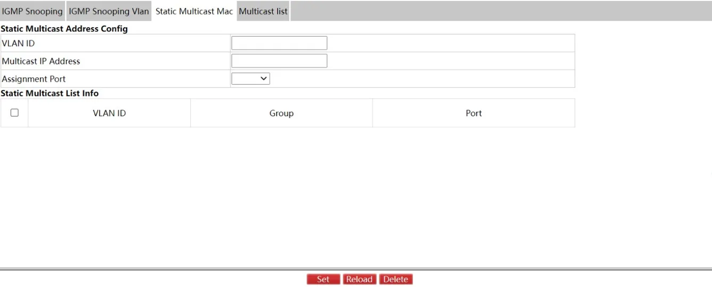</p>

<p align="center"><strong>Figure 4-97 Static Multicast Address Page</strong></p>

This page displays existing static multicast groups and port groups. Click "Reload" to refresh.

**Multicast List**

Navigate to Switching >> IGMP Snooping, select the "Multicast List" tab.

<p align="center"></p>

<p align="center"><strong>Figure 4-98 Multicast List Page</strong></p>

This page displays multicast groups in the current network and the port set for each group member as counted by IGMP Snooping. Click "Reload" to refresh.

> **Note**: By default, up to 15 VLAN items are displayed. Modify the count using `ip http web igmp-groups` via Console or Telnet.

#### 4.7.5 VLAN

**VLAN Configuration**

Navigate to Switching >> VLAN, select the "VLAN configuration" tab.

<p align="center"></p>

<p align="center"><strong>Figure 4-99 VLAN Configuration Page</strong></p>

Click "Modify" to change VLAN name and port properties. Select a VLAN and click "Delete" to remove it.

> **Note**: The default maximum VLAN display count is 100. To configure more VLANs via Web, use `ip http web max-vlan` via Console or Telnet.

Click "Create" or "Modify" to enter the VLAN configuration page:

<p align="center"></p>

<p align="center"><strong>Figure 4-100 VLAN Detail Configuration Page</strong></p>

When creating a new VLAN, enter a VLAN ID and optional VLAN name. The port list allows configuration of: default VLAN, VLAN mode (Trunk or Access), whether to allow current VLAN packets, and whether to untag the current VLAN on egress.

> **Note**: When a port in Trunk mode serves as an egress port, it untags the default VLAN by default.

**VLAN Batch Configuration**

Navigate to Switching >> VLAN, select the "VLAN Batch Configuration" tab.

<p align="center">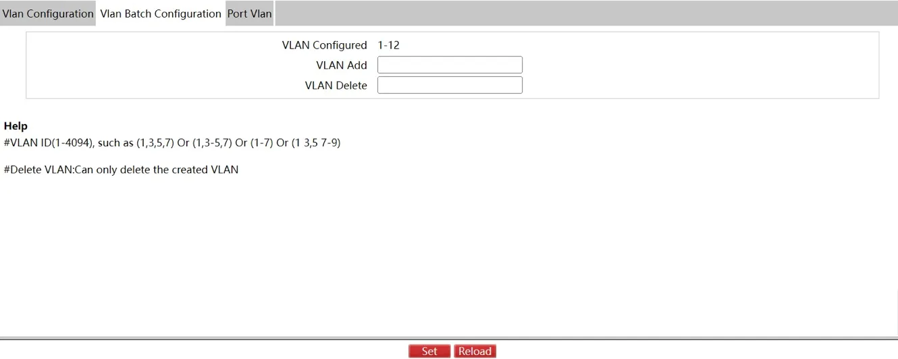</p>

<p align="center"><strong>Figure 4-101 VLAN Batch Configuration Page</strong></p>

> **Note**: A VLAN must be created before it can be deleted via batch operations.

**Port VLAN Configuration**

Navigate to Switching >> VLAN, select the "Port VLAN" tab.

<p align="center"></p>

<p align="center"><strong>Figure 4-102 Port VLAN Configuration Page</strong></p>

This page displays all ports' PVIDs, modes, allowed VLAN ranges, and untagged VLAN ranges. Click "Modify" to change port VLAN properties:

<p align="center">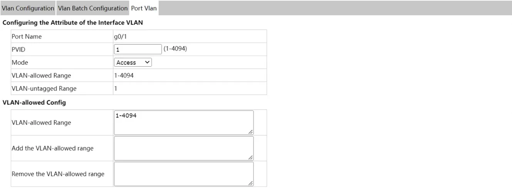</p>

<p align="center"><strong>Figure 4-103 Port VLAN Feature Configuration Page</strong></p>

<p align="center">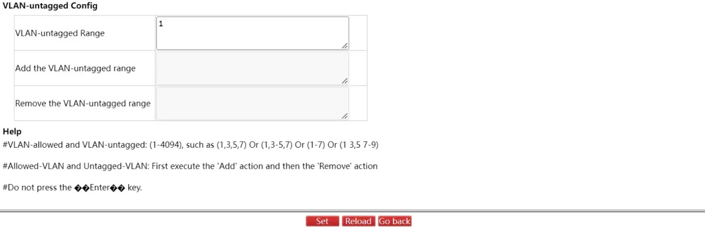</p>

<p align="center"><strong>Figure 4-104 Port VLAN Allowed/Untagged Configuration Page</strong></p>

> **Note**: For VLAN-allowed and VLAN-untagged operations, add VLANs before performing delete operations. Do not use the Enter key during configuration.

#### 4.7.6 GMRP

**VLAN List**

Navigate to Switching >> GMRP >> VLAN List.

<p align="center">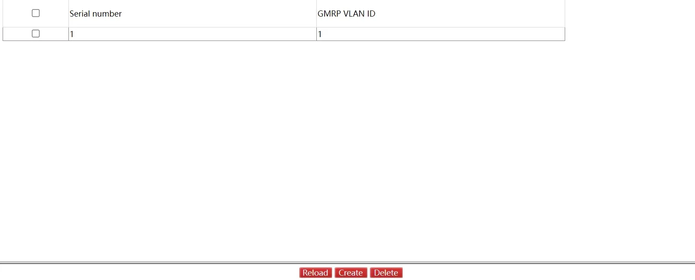</p>

<p align="center"><strong>Figure 4-105 GMRP VLAN List Page</strong></p>

This page displays GMRP VLAN ID list information. Click "Reload" to refresh.

Click "Create" to create a GMRP VLAN configuration:

<p align="center"></p>

<p align="center"><strong>Figure 4-106 Create GMRP VLAN Page</strong></p>

**Port Configuration**

Navigate to Switching >> GMRP >> Port Configuration.

<p align="center">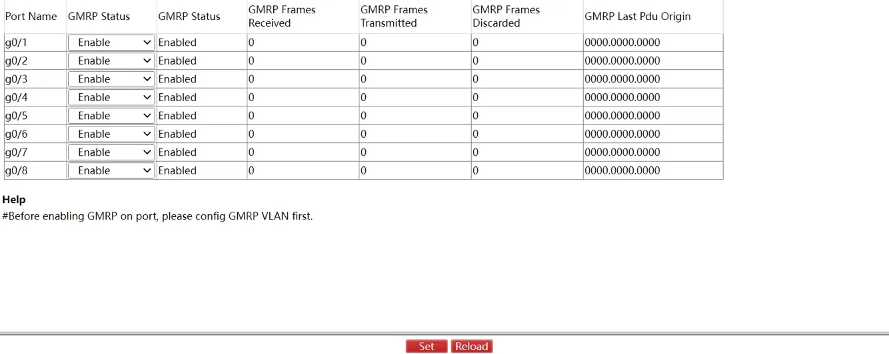</p>

<p align="center"><strong>Figure 4-107 GMRP Port Configuration Page</strong></p>

Click "Set" to apply the configuration.

**Multicast List**

Navigate to Switching >> GMRP >> Multicast List.

<p align="center"></p>

<p align="center"><strong>Figure 4-108 GMRP Multicast List Page</strong></p>

This page displays VLAN ID, multicast MAC address, and member port information. Click "Reload" to refresh.

### 4.8 Routing

<p align="center">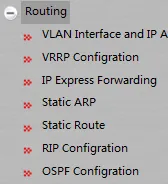</p>

<p align="center"><strong>Figure 4-109 Routing Navigation Menu</strong></p>

#### 4.8.1 VLAN Interface and IP Address Configuration

Navigate to Routing >> VLAN Interface and IP Address.

<p align="center"></p>

<p align="center"><strong>Figure 4-110 VLAN Interface Configuration Page</strong></p>

Click "Modify" to edit VLAN interface items. Click "Create" to add a new VLAN interface. Click "Delete" to remove a selected entry.

When creating a new entry, the VLAN name can be changed. When modifying an existing entry, the VLAN name cannot be changed 鈥?only related items can be modified.

<p align="center">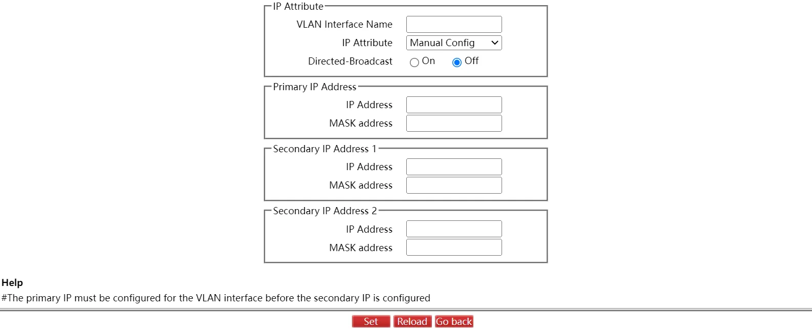</p>

<p align="center"><strong>Figure 4-111 VLAN Interface Detail Configuration Page</strong></p>

> **Note**: Before setting the VLAN secondary IP address, the primary IP address must be configured first.

#### 4.8.2 VRRP Configuration

Navigate to Routing >> VRRP Configuration.

<p align="center">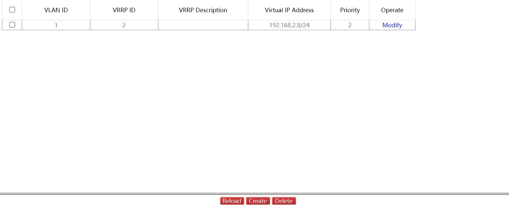</p>

<p align="center"><strong>Figure 4-112 VRRP List Page</strong></p>

Click "Reload" to refresh the VRRP list. Click "Delete" to remove a selected VRRP entry.

Click "Create" to enter the VRRP configuration page:

<p align="center">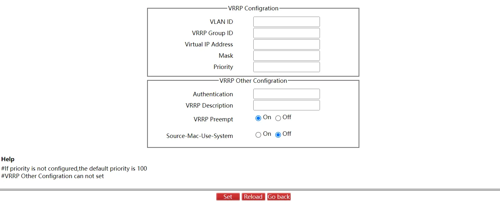</p>

<p align="center"><strong>Figure 4-113 VRRP Configuration Page</strong></p>

Click "Set" to apply the VRRP configuration. Click "Go Back" to return to the VRRP List page.

#### 4.8.3 IP Express Forwarding

Navigate to Routing >> IP Express Forwarding.

<p align="center">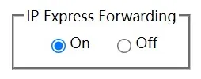</p>

<p align="center"><strong>Figure 4-114 IP Express Forwarding Page</strong></p>

Click "Set" to apply the IP Express Forwarding configuration. Click "Reload" to refresh.

#### 4.8.4 Static ARP

Navigate to Routing >> Static ARP.

<p align="center"></p>

<p align="center"><strong>Figure 4-115 Static ARP Page</strong></p>

Click "Modify" to edit a static ARP entry. Click "Delete" to remove selected entries.

Click "New" to create a new static ARP entry:

<p align="center"></p>

<p align="center"><strong>Figure 4-116 Create Static ARP Page</strong></p>

#### 4.8.5 Static Route

Navigate to Routing >> Static Route.

<p align="center"></p>

<p align="center"><strong>Figure 4-117 Static Route Page</strong></p>

Click "Modify" to edit a static route. Click "Reload" to refresh. Click "Delete" to remove selected entries.

Click "Create" to create a new static route:

<p align="center"></p>

<p align="center"><strong>Figure 4-118 Create Static Route Page</strong></p>

> **Note**: The static route configuration page is available only on Layer 3 switches.

#### 4.8.6 RIP Configuration

**RIP Process**

Navigate to Routing >> RIP Configuration.

<p align="center">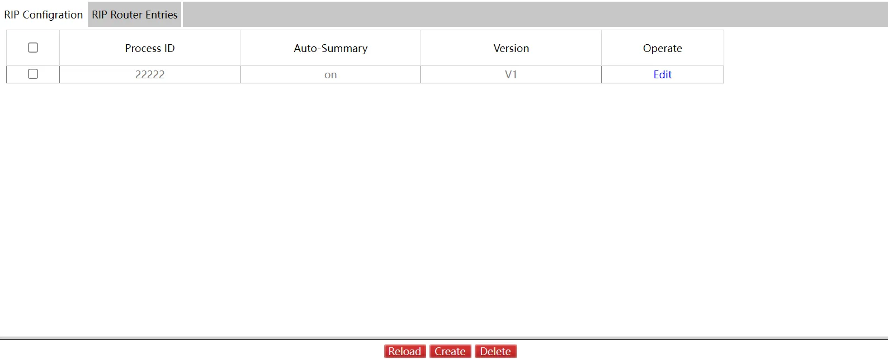</p>

<p align="center"><strong>Figure 4-119 RIP Configuration Page</strong></p>

A RIP process must be created before configuring RIP entries. Click "Create" to create a new RIP process:

<p align="center"></p>

<p align="center"><strong>Figure 4-120 Create RIP Process Page</strong></p>

**RIP Router Entries**

Navigate to Routing >> RIP Configuration, then click "RIP Router Entries".

<p align="center"></p>

<p align="center"><strong>Figure 4-121 RIP Router Entries Page</strong></p>

Enter the RIP process ID and click "Set" to view the entries for the selected process:

<p align="center"></p>

<p align="center"><strong>Figure 4-122 RIP Router Entries Detail Page</strong></p>

Click "Create" to add a new RIP router entry:

<p align="center"></p>

<p align="center"><strong>Figure 4-123 Create RIP Router Entry Page</strong></p>

#### 4.8.7 OSPF Configuration

**OSPF Process**

Navigate to Routing >> OSPF Configuration, then click "OSPF Process".

<p align="center"></p>

<p align="center"><strong>Figure 4-124 OSPF Process Page</strong></p>

An OSPF process must be created before configuring OSPF router entries.

Click "Create" to create a new OSPF process:

<p align="center"></p>

<p align="center"><strong>Figure 4-125 Create OSPF Process Page</strong></p>

**OSPF Router Entries**

Navigate to Routing >> OSPF Configuration, then click "OSPF Router Entries".

<p align="center"></p>

<p align="center"><strong>Figure 4-126 OSPF Router Entries Page</strong></p>

Enter the OSPF process ID and click "Set" to view entries for the selected process:

<p align="center"></p>

<p align="center"><strong>Figure 4-127 OSPF Router Entries Detail Page</strong></p>

Click "Create" to add a new OSPF router entry:

<p align="center"></p>

<p align="center"><strong>Figure 4-128 Create OSPF Router Entry Page</strong></p>

> **Note**: The Area column accepts both integer and IP address formats.

### 4.9 QoS/Priority

<p align="center">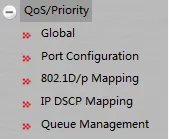</p>

<p align="center"><strong>Figure 4-129 QoS/Priority Navigation Menu</strong></p>

#### 4.9.1 Global Configuration

Navigate to QoS/Priority >> Global.

<p align="center">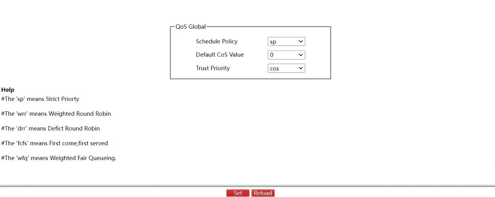</p>

<p align="center"><strong>Figure 4-130 QoS Global Configuration Page</strong></p>

This page configures: Schedule Policy, Default CoS Value, and Trust Priority.

#### 4.9.2 Port Configuration

Navigate to QoS/Priority >> Port Configuration.

<p align="center"></p>

<p align="center"><strong>Figure 4-131 QoS Port Configuration Page</strong></p>

Configure the Port CoS value per port. Click "Set" to save changes.

#### 4.9.3 802.1D/p Mapping

Navigate to QoS/Priority >> 802.1D/p Mapping.

<p align="center"></p>

<p align="center"><strong>Figure 4-132 802.1D/p Mapping Page</strong></p>

Click "Set" to save all 802.1D/p mapping configurations.

#### 4.9.4 IP DSCP Mapping

Navigate to QoS/Priority >> IP DSCP Mapping.

<p align="center"></p>

<p align="center"><strong>Figure 4-133 IP DSCP Mapping Page</strong></p>

This page lists 64 DSCP values with configurable mapping values for each. Click "Clear" to reset all DSCP mapping configurations.

> **Note**: The number of table parameters may vary between device models.

#### 4.9.5 Queue Management

Navigate to QoS/Priority >> Queue Management.

<p align="center"></p>

<p align="center"><strong>Figure 4-134 Queue Management Page</strong></p>

Click "Set" to save all configurations.

> **Note**: If one Queue ID has its bandwidth weight set to zero, all other Queue IDs must also have their weight values set to zero.

### 4.10 Redundancy

<p align="center">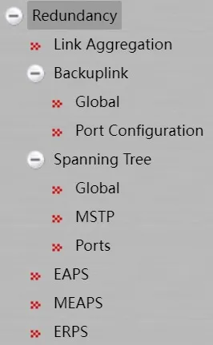</p>

<p align="center"><strong>Figure 4-135 Redundancy Navigation Menu - Part 1</strong></p>

<p align="center">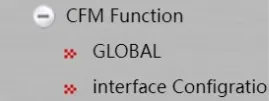</p>

<p align="center"><strong>Figure 4-136 Redundancy Navigation Menu - Part 2</strong></p>

#### 4.10.1 Link Aggregation Configuration

**Port Aggregation Configuration**

Navigate to Redundancy >> Link Aggregation.

<p align="center">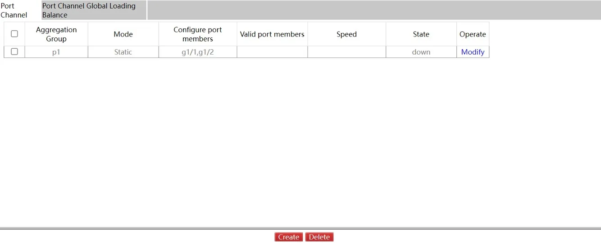</p>

<p align="center"><strong>Figure 4-137 Port Aggregation Configuration Page</strong></p>

Click "Modify" to change the member ports and aggregation mode. Click "Create" to create a new aggregation group (up to 32 groups via Web, each with up to 8 physical ports). Click "Delete" to remove a selected group.

<p align="center"></p>

<p align="center"><strong>Figure 4-138 Aggregation Group Configuration Page</strong></p>

The aggregation group ID is selectable during creation but not during modification. When member ports exist, the aggregation mode can be set to: Static, LACP Active, or LACP Passive. Use "<<" and ">>" buttons to add or remove member ports.

**Port Channel Global Load Balancing**

Some models support link aggregation load balancing configuration. Layer 3 switches support per-group load balancing configuration:

<p align="center"></p>

<p align="center"><strong>Figure 4-139 Port Channel Load Balancing Page</strong></p>

Different aggregation groups can use different load balancing modes.

#### 4.10.2 Backup Link

**Backup Link Global Configuration**

Navigate to Redundancy >> Backuplink >> Global.

<p align="center">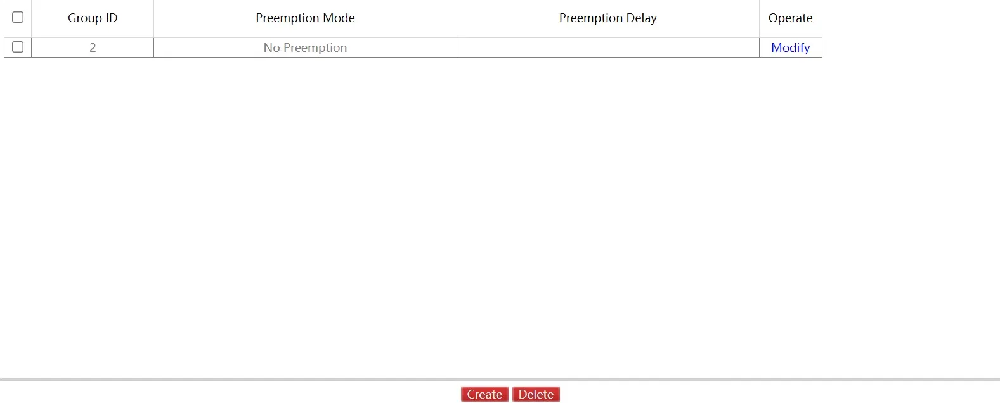</p>

<p align="center"><strong>Figure 4-140 Backup Link Global Configuration Page</strong></p>

This page lists configured link backup groups with preemption mode and delay settings. Click "Modify" to configure. Click "Create" to create a new backup group:

<p align="center"></p>

<p align="center"><strong>Figure 4-141 Create Backup Link Group Page</strong></p>

> **Note**:
> 1. The system supports up to 8 link backup group numbers.
> 2. The preemption mode determines the policy for selecting between primary and backup ports for forwarding packets.

**Backup Link Port Configuration**

Navigate to Redundancy >> Backuplink >> Port Configuration.

<p align="center">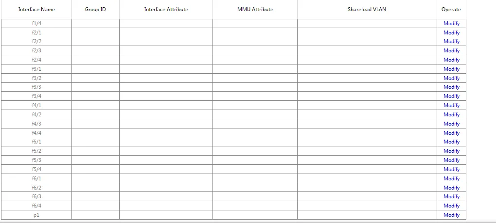</p>

<p align="center"><strong>Figure 4-142 Backup Link Port Configuration Page</strong></p>

This page lists member ports in backup link groups with port attributes, MMU attributes, and load balance VLANs. MMU sender transmits messages to MMU receiver for fast MAC address table updates.

Click "Modify" to configure port settings:

<p align="center"></p>

<p align="center"><strong>Figure 4-143 Backup Link Port Detail Configuration Page</strong></p>

A link backup group configured with a primary port cannot assign another port as primary. Similarly, a group with a configured backup port cannot assign another port as backup.

#### 4.10.3 Spanning Tree

**Global Configuration**

Navigate to Redundancy >> Spanning Tree >> Global.

<p align="center">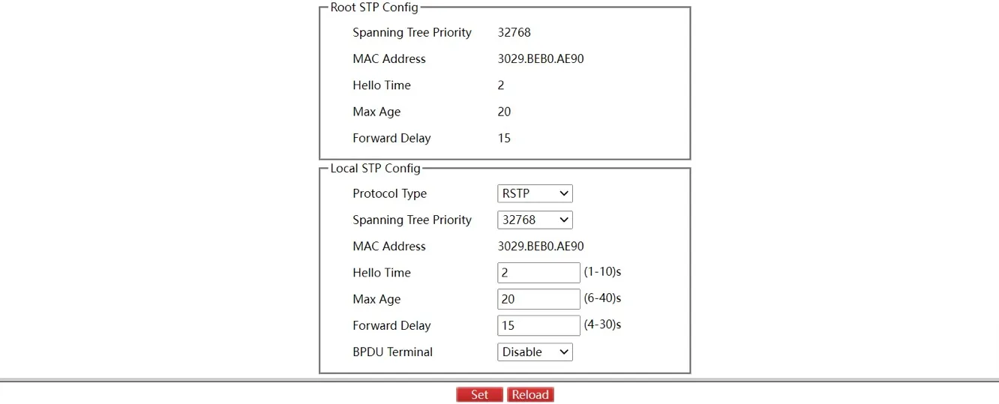</p>

<p align="center"><strong>Figure 4-144 Spanning Tree Global Configuration Page</strong></p>

This page configures the local STP protocol settings: protocol type, spanning tree priorities, and other parameters. Click "Set" to save.

**MSTP Configuration**

*MST Global*

Navigate to Redundancy >> Spanning Tree >> MSTP, then click "MST Global".

<p align="center">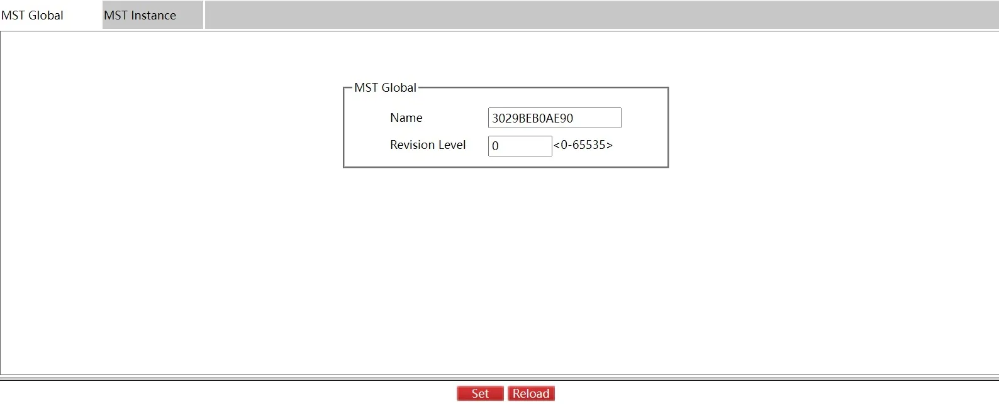</p>

<p align="center"><strong>Figure 4-145 MST Global Configuration Page</strong></p>

Configure the MST Global Revision Level. Click "Set" to save.

*MST Instance*

Navigate to Redundancy >> Spanning Tree >> MSTP, then click "MST Instance".

<p align="center">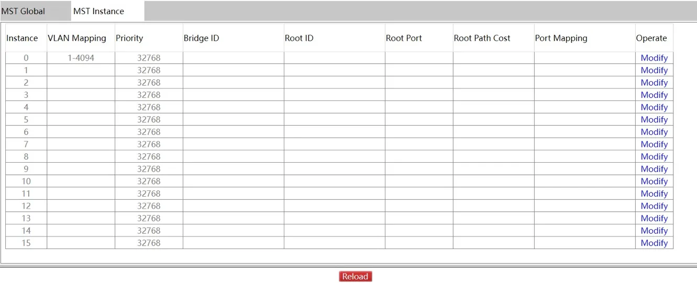</p>

<p align="center"><strong>Figure 4-146 MST Instance Page</strong></p>

This page displays VLAN mapping, priority, and other settings for each instance. Click "Reload" to refresh. Click "Modify" to configure:

<p align="center">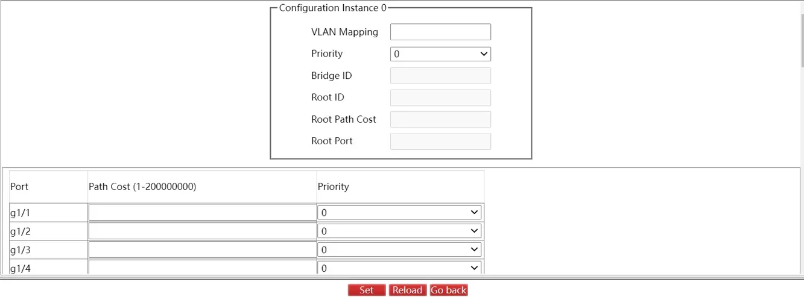</p>

<p align="center"><strong>Figure 4-147 MST Instance Configuration Page</strong></p>

Configure path cost and priority on this page. Click "Set" to save.

**Spanning Tree Ports**

*Port Configuration*

Navigate to Redundancy >> Spanning Tree >> Ports, then click "Port Configuration".

<p align="center">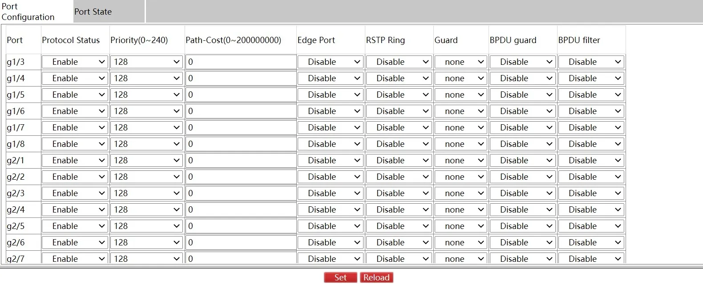</p>

<p align="center"><strong>Figure 4-148 Spanning Tree Port Configuration Page</strong></p>

This page displays and allows configuration of: protocol status, priority, path cost, edge port, RSTP ring, guard, BPDU guard, and BPDU filter. Click "Set" to save.

*Port Status*

Navigate to Redundancy >> Spanning Tree >> Ports, then click "Port Status".

<p align="center"></p>

<p align="center"><strong>Figure 4-149 Spanning Tree Port Status Page</strong></p>

This page lists port information and spanning tree usage status. Click "Reload" to refresh.

#### 4.10.4 EAPS (Ether-Ring)

Navigate to Redundancy >> EAPS (ether-ring).

<p align="center"></p>

<p align="center"><strong>Figure 4-150 EAPS Ring List Page</strong></p>

This page displays EAPS ring configuration: ring ID, node type, description, CONTROL VLAN, status, Hello Time, Fail Time, Pre Forward Time, and primary/secondary ports.

Click "Modify" to change time and port configuration. Click "Create" to create a new EAPS ring:

<p align="center">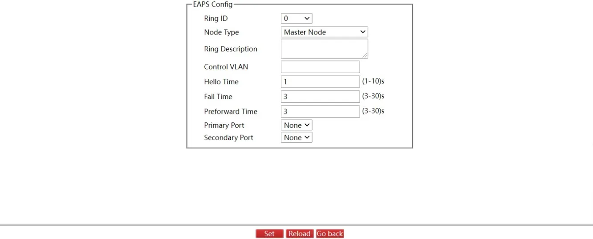</p>

<p align="center"><strong>Figure 4-151 EAPS Ring Configuration Page</strong></p>

Select the primary and secondary ports from the dropdown lists, or select "None".

> **Note**:
> 1. The system supports up to 32 EAPS rings.
> 2. After an EAPS ring is configured, the ring ID, node type, and CONTROL VLAN cannot be changed. To modify these, delete the ring and recreate it.

#### 4.10.5 MEAPS

Navigate to Redundancy >> MEAPS.

<p align="center"></p>

<p align="center"><strong>Figure 4-152 MEAPS List Page</strong></p>

This page lists configured MEAPS rings: Domain ID, Ring ID, Ring Type, Control VLAN, Hello Time, Failed Time, Pre Forward Time, and primary/secondary ports.

Click "Modify" to configure time and port parameters. Click "Create" to create a new MEAPS ring:

<p align="center"></p>

<p align="center"><strong>Figure 4-153 MEAPS Configuration Page</strong></p>

- Master node and transit node can only be configured in the primary ring.
- Primary node, transit node, and edge node can be configured in the secondary ring.
- Primary node and transit node can exist in only one ring; edge node and assistant edge node can exist in multiple rings simultaneously.

Select ports as ring ports or "None" in the Primary Port and Secondary Port fields.

> **Note**:
> 1. Up to 4 MEAPS domains (0鈥?) are supported.
> 2. Up to 8 rings per domain (0鈥?) are supported.
> 3. After configuration, Domain ID, Ring ID, Ring Type, Node Type, and Control VLAN cannot be changed. Delete and recreate the ring to modify these parameters.

#### 4.10.6 ERPS

Navigate to Redundancy >> ERPS.

<p align="center">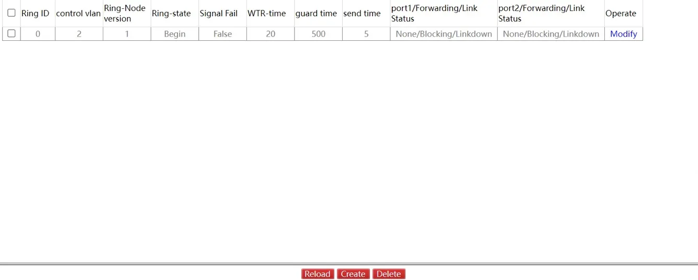</p>

<p align="center"><strong>Figure 4-154 ERPS List Page</strong></p>

This page displays configured ERPS rings: ring ID, control VLAN, Ring-Node version, Ring-state, Signal Fail, WTR-time, guard time, send-time, and primary/secondary ports.

Click "Modify" to configure time and port parameters. Click "Create" to create a new ERPS ring:

<p align="center">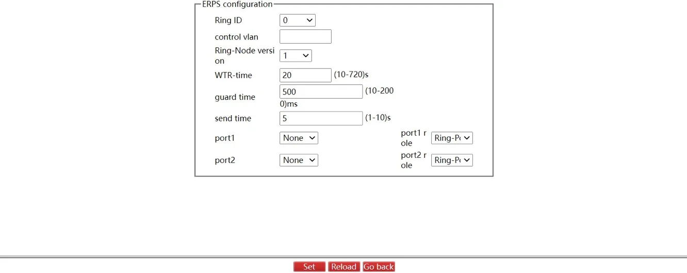</p>

<p align="center"><strong>Figure 4-155 ERPS Configuration Page</strong></p>

The ring ID range is 1鈥?. After configuring Port 1 and Port 2, assign the corresponding port roles.

> **Note**:
> 1. The system supports ERPS single ring configuration only.
> 2. Up to 8 ERPS ring nodes are supported.
> 3. After configuration, the ID, ring ID, and control VLAN cannot be changed. Delete and recreate to modify.

#### 4.10.7 CFM Function

**Global Configuration**

Navigate to Redundancy >> CFM Function >> GLOBAL.

<p align="center">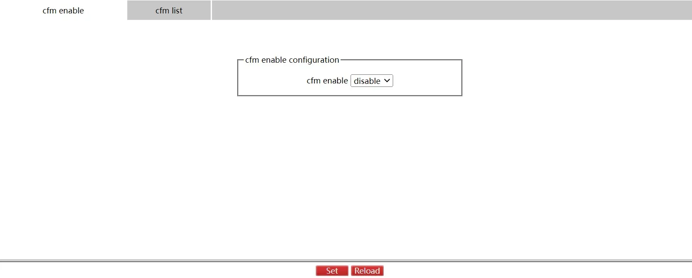</p>

<p align="center"><strong>Figure 4-156 CFM Enable Configuration Page</strong></p>

Click "Set" to apply.

Click "CFM List" to view the CFM list:

<p align="center"></p>

<p align="center"><strong>Figure 4-157 CFM List Page</strong></p>

Click "Create" to enter the CFM global configuration page:

<p align="center">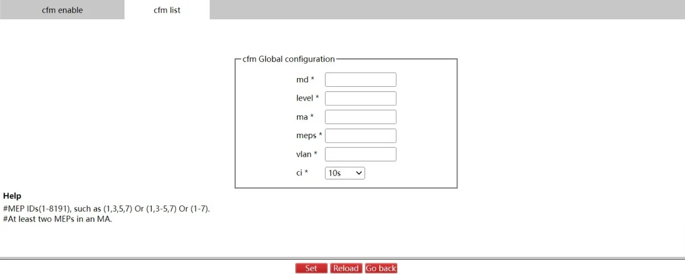</p>

<p align="center"><strong>Figure 4-158 CFM Global Configuration Page</strong></p>

Click "Set" to apply. Click "Go Back" to return to the CFM List page.

**Interface Configuration**

Navigate to Redundancy >> CFM Function >> Interface Configuration.

<p align="center">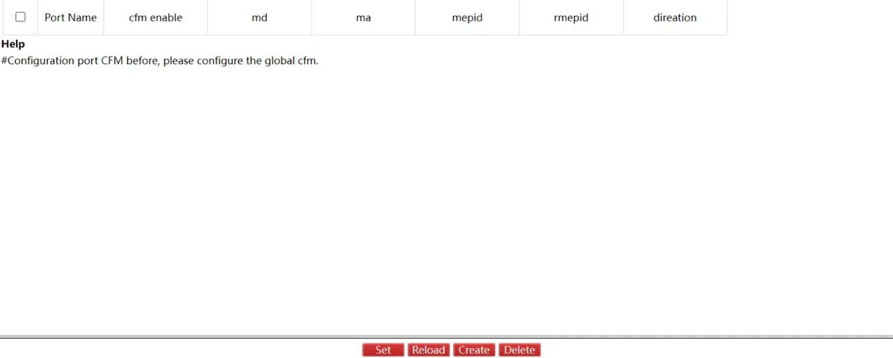</p>

<p align="center"><strong>Figure 4-159 CFM Port List Page</strong></p>

Click "Set" to apply. Click "Reload" to refresh. Click "Delete" to remove selected entries.

Click "Create" to enter the CFM port configuration page:

<p align="center">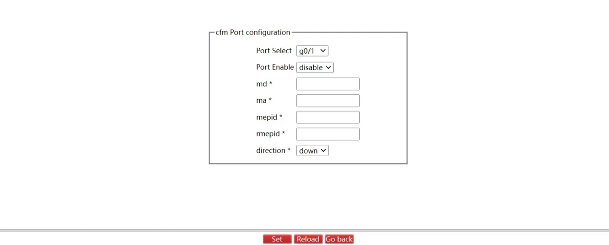</p>

<p align="center"><strong>Figure 4-160 CFM Port Configuration Page</strong></p>

Click "Set" to apply. Click "Go Back" to return to the CFM port list page.

### 4.11 Diagnostics

<p align="center">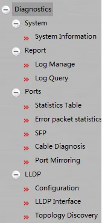</p>

<p align="center"><strong>Figure 4-161 Diagnostics Navigation Menu</strong></p>

#### 4.11.1 System Information

Navigate to Diagnostics >> System >> System Information.

<p align="center">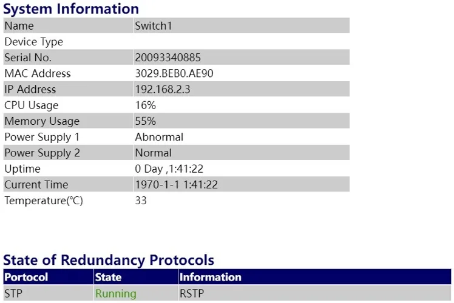</p>

<p align="center"><strong>Figure 4-162 System Information Page - Part 1</strong></p>

<p align="center">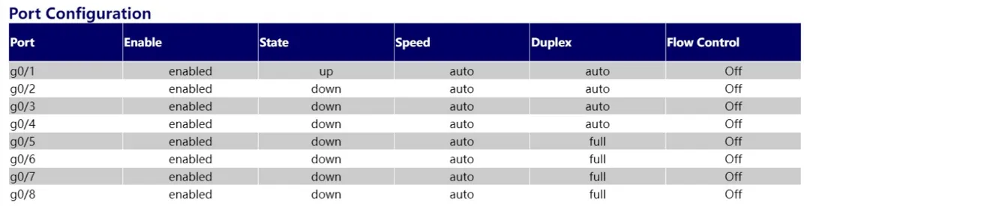</p>

<p align="center"><strong>Figure 4-163 System Information Page - Part 2</strong></p>

<p align="center">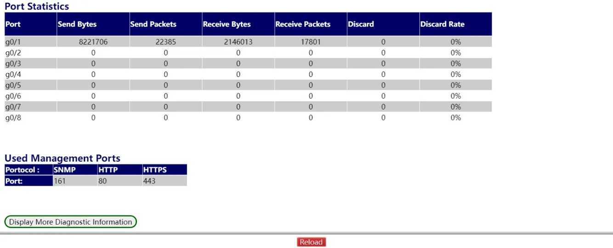</p>

<p align="center"><strong>Figure 4-164 System Information Page - Part 3</strong></p>

This page displays: system information, redundancy protocol state, port configuration, port statistics, and user management ports. Click "Display More" to view additional information such as CPU utilization and task information:

<p align="center"></p>

<p align="center"><strong>Figure 4-165 CPU Utilization and Task Information Page</strong></p>

#### 4.11.2 Report

**Log Management**

Navigate to Diagnostics >> Report >> Log Manage.

<p align="center"></p>

<p align="center"><strong>Figure 4-166 Log Management Page</strong></p>

- **Log server**: When enabled, the device transmits log information to the designated server. Enter the server address and select the log grade (grade 9 鈥?debugging is the lowest).
- **Log buffer**: When enabled, log information is recorded to memory. Use `show log` via Console or Telnet to view buffered logs. Log information in memory is lost upon device restart. Configure buffer size and cache log grade.

**Log Query**

Navigate to Diagnostics >> Report >> Log Query.

<p align="center"></p>

<p align="center"><strong>Figure 4-167 Log Query Page</strong></p>

Filter logs by log level and time range. Leaving time fields empty queries all timestamps. Setting only a start time queries from that time onward; setting only an end time queries up to that time.

#### 4.11.3 Ports

**Statistics Table**

Navigate to Diagnostics >> Ports >> Statistics Table.

<p align="center"></p>

<p align="center"><strong>Figure 4-168 Port Statistics Table Page</strong></p>

This page displays port statistics: Receive Packets, Receive Bytes, Received Unicast Packets, Received Multicast Packets, Received Broadcast Packets, and others.

**Error Packet Statistics**

Navigate to Diagnostics >> Ports >> Error Packet Statistics.

<p align="center">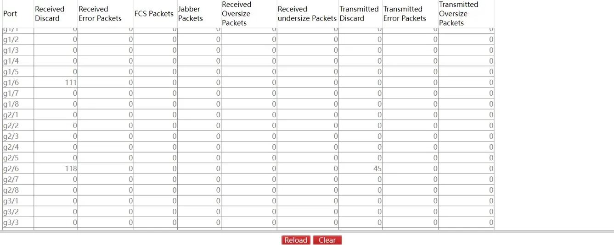</p>

<p align="center"><strong>Figure 4-169 Error Packet Statistics Page</strong></p>

This page displays: received discard, received error packets, FCS packets, Jabber packets, received oversize packets, received undersize packets, transmitted discard, transmitted error packets, and transmitted oversize packets. Click "Clear" to reset all error packet statistics.

**SFP**

Navigate to Diagnostics >> Ports >> SFP.

<p align="center"></p>

<p align="center"><strong>Figure 4-170 SFP Information Page</strong></p>

> **Note**: SFP port information is readable only when DDM (Digital Diagnostics Monitoring) is enabled.

**Cable Diagnosis**

Navigate to Diagnostics >> Ports >> Cable Diagnosis.

<p align="center">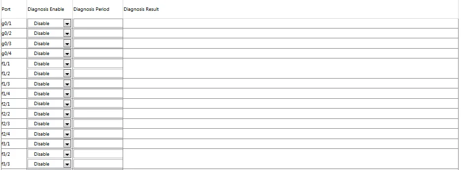</p>

<p align="center"><strong>Figure 4-171 Cable Diagnosis Page</strong></p>

Enable or disable cable diagnosis per port and configure the diagnosis period. Click "Set" to view diagnosis results.

**Port Mirroring**

Navigate to Diagnostics >> Ports >> Port Mirroring.

<p align="center">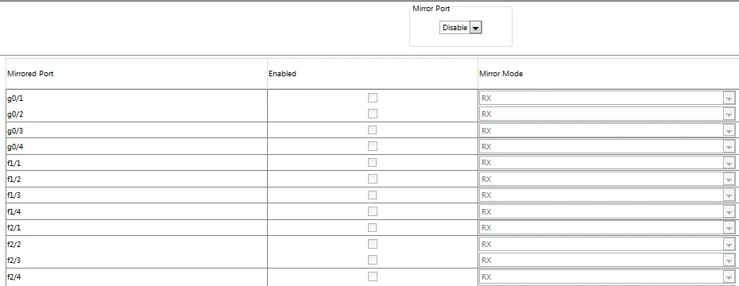</p>

<p align="center"><strong>Figure 4-172 Port Mirroring Page</strong></p>

Select a destination (mirror) port from the dropdown. Configure mirroring source ports by selecting:
- **RX**: Received packets are mirrored to the destination port.
- **TX**: Transmitted packets are mirrored to the destination port.
- **RX & TX**: Both received and transmitted packets are mirrored simultaneously.

#### 4.11.4 LLDP Configuration

**LLDP Basic Configuration**

Navigate to Diagnostics >> LLDP >> Configuration.

<p align="center"></p>

<p align="center"><strong>Figure 4-173 LLDP Basic Configuration Page</strong></p>

Enable or disable the LLDP protocol. Port-level LLDP configuration is not available when LLDP is disabled.

- **HoldTime**: TTL value for LLDP messages. Default: 120 seconds.
- **Reinit**: LLDP transmission delay. Default: 2 seconds.

**LLDP Interface**

Navigate to Diagnostics >> LLDP >> LLDP Interface.

<p align="center"></p>

<p align="center"><strong>Figure 4-174 LLDP Interface Configuration Page</strong></p>

Configure per-port LLDP packet transmission (receive/send). Default: both receive and send are disabled. MED-TLV is enabled by default.

**Topology Discovery**

Navigate to Diagnostics >> LLDP >> Topology Discovery.

<p align="center"></p>

<p align="center"><strong>Figure 4-175 LLDP Topology Discovery Page</strong></p>

This page lists devices discovered by the local switch via LLDP.

### 4.12 Advanced Features

<p align="center">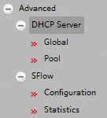</p>

<p align="center"><strong>Figure 4-176 Advanced Navigation Menu</strong></p>

#### 4.12.1 DHCP Server

**DHCP Server Global Configuration**

Navigate to Advanced >> DHCP Server >> Global.

<p align="center"></p>

<p align="center"><strong>Figure 4-177 DHCP Server Global Configuration Page</strong></p>

Enable or disable the DHCP server feature. Default ICMP packet count: 2; default ICMP timeout: 5 seconds. DHCP database parameters can also be configured: server IP address, database file name, and timestamp appended to filename.

**DHCP Server Pool Configuration**

Navigate to Advanced >> DHCP Server >> Pool.

<p align="center"></p>

<p align="center"><strong>Figure 4-178 DHCP Server Pool List Page</strong></p>

This page lists configured DHCP server pools. Click "Modify" to edit pool parameters.

Click "Create" to create a new DHCP server pool:

<p align="center"></p>

<p align="center"><strong>Figure 4-179 Create DHCP Server Pool Page</strong></p>

#### 4.12.2 SFlow

**SFlow Global Configuration**

Navigate to Advanced >> SFlow >> Configuration, select the "Global" tab.

<p align="center">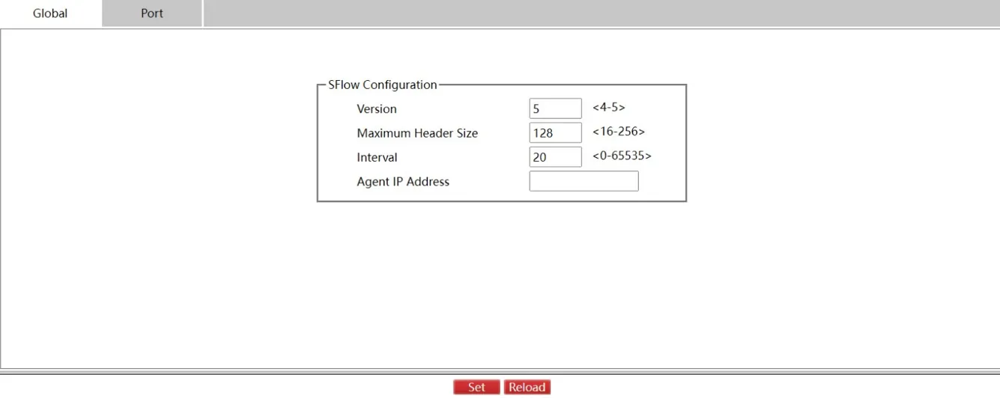</p>

<p align="center"><strong>Figure 4-180 SFlow Global Configuration Page</strong></p>

Configure the Agent IP address. Default SFlow version: 5. Default Maximum Header Size: 20 (maximum: 128).

Click the "Port" tab to enter the SFlow port configuration:

<p align="center">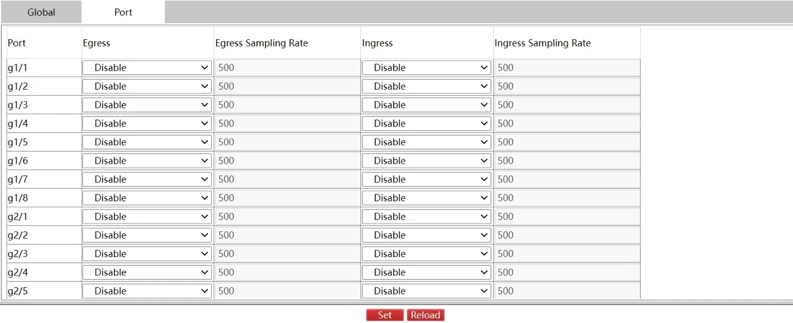</p>

<p align="center"><strong>Figure 4-181 SFlow Port Configuration Page</strong></p>

This page lists SFlow enable/disable status per port. Default Egress/Ingress Sampling Rate: 500. The rate is configurable when SFlow is enabled on a port.

**SFlow Statistics**

Navigate to Advanced >> SFlow >> Statistics, select the "Poller" tab:

<p align="center">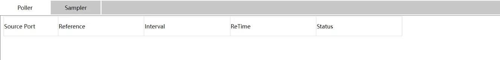</p>

<p align="center"><strong>Figure 4-182 SFlow Poller Statistics Page</strong></p>

Select the "Sampler" tab:

<p align="center">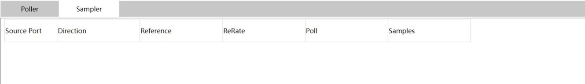</p>

<p align="center"><strong>Figure 4-183 SFlow Sampler Statistics Page</strong></p>

---

## Chapter 5 Typical Applications

### Case 1: Industrial Network with VLAN Segmentation and Redundancy

**Scenario Description**: (Not detailed in source document, to be supplemented)

**Network Topology**: (Not detailed in source document, to be supplemented)

**Device Role**: (Not detailed in source document, to be supplemented)

**Configuration Steps**: (Not detailed in source document, to be supplemented)

**Reference Sections**:
- [VLAN Configuration](#475-vlan)
- [Spanning Tree](#4103-spanning-tree)
- [EAPS (Ether-Ring)](#4104-eaps-ether-ring)

---

## Appendix A Troubleshooting

### 1 Web Access Issues

| Symptom | Possible Cause | Troubleshooting Steps | Reference Section |
|---------|---------------|----------------------|-------------------|
| Cannot open Web interface | IP address mismatch | 1. Verify the computer IP is in the 192.168.2.x subnet<br>2. Confirm the switch management IP is 192.168.2.1 (default) | [Initial Web Access](#221-initial-web-access) |
| Cannot open Web interface | HTTP service disabled | 1. Connect via Console or Telnet<br>2. Enter `ip http server` in global configuration mode | [HTTP Service Configuration](#413-enabling-the-http-service) |
| Cannot open Web interface | HTTP port changed | 1. If the port was changed, use `http://<IP>:<port>` format<br>2. Verify the port via Console using `show running-config` | [HTTP Service Port Configuration](#412-http-service-port-configuration) |
| Cannot open Web interface | Browser incompatibility | 1. Use a browser supporting HTML 4.0, HTTP 1.1, JavaScript 1.5<br>2. Try Chrome or Firefox | [Pre-installation Preparation](#21-pre-installation-preparation) |
| Login authentication fails | Incorrect credentials | 1. Verify username and password (case-sensitive)<br>2. Default credentials: admin/admin | [Initial Web Access](#221-initial-web-access) |
| HTTPS connection fails | HTTPS not enabled | 1. Enable HTTPS via CLI: `ip http ssl-access enable`<br>2. Save configuration with `write` | [HTTPS Access Configuration](#417-https-access-configuration) |

### 2 Configuration Issues

| Symptom | Possible Cause | Troubleshooting Steps | Reference Section |
|---------|---------------|----------------------|-------------------|
| Configuration lost after reboot | Configuration not saved | 1. Click "Save" on the top control bar after making changes<br>2. This is equivalent to the `write` CLI command | [Top Control Bar](#421-top-control-bar) |
| VLAN list incomplete | Max-VLAN display limit reached | 1. Default maximum is 100 VLANs<br>2. Increase via CLI: `ip http web max-vlan <value>` | [Max-VLAN Display Setting](#415-max-vlan-display-setting) |
| Cannot modify some settings | Logged in as limited user | 1. Log out and log in with an admin account<br>2. Limited users can only view device state | [Navigation Bar](#422-navigation-bar) |
| Software update not effective | Device not restarted | 1. Navigate to Basic Setting >> Restart<br>2. Click "Reboot" to restart the switch | [Restart](#437-restart) |

### 3 Network Issues

| Symptom | Possible Cause | Troubleshooting Steps | Reference Section |
|---------|---------------|----------------------|-------------------|
| Network loop detected | STP not configured | 1. Enable Spanning Tree Protocol globally<br>2. Configure port-level STP settings | [Spanning Tree](#4103-spanning-tree) |
| Broadcast storm | Storm control not enabled | 1. Navigate to Switching >> Storm Control<br>2. Enable broadcast storm control and set threshold | [Storm Control](#471-storm-control) |
| Port not forwarding traffic | Port disabled or speed mismatch | 1. Check port status in Basic Setting >> Port Configuration<br>2. Verify speed and duplex mode settings | [Port Configuration](#433-port-configuration) |
| DHCP clients not receiving addresses | DHCP server not enabled | 1. Enable DHCP server globally<br>2. Create a DHCP server pool with correct parameters | [DHCP Server](#4121-dhcp-server) |

---

## Appendix B Safety Notices

1. The switch should be operated within the specified temperature and humidity ranges as indicated in the product datasheet.
2. Do not use the device in flammable or explosive environments.
3. Verify that the power supply voltage matches the device specifications before connecting power.
4. Use only approved power adapters and accessories provided with the device.
5. Ensure proper ventilation around the device to prevent overheating.
6. Do not block the ventilation openings of the device.

> **Warning**: Do not open the device enclosure. There is a risk of electric shock. All maintenance and repair work should be performed by qualified personnel.

---

## Appendix C CLI Reference

### 1 HTTP/HTTPS Commands

| Command | Function | Example |
|---------|----------|---------|
| `ip http server` | Enable HTTP service | `ip http server` |
| `ip http port {portNumber}` | Set HTTP port | `ip http port 8080` |
| `ip http http-access enable` | Enable HTTP access | `ip http http-access enable` |
| `ip http ssl-access enable` | Enable HTTPS access | `ip http ssl-access enable` |
| `ip http secure-port {portNumber}` | Set HTTPS port | `ip http secure-port 8443` |
| `[no] ip http language {english}` | Set Web language | `ip http language english` |
| `ip http web max-vlan {max-vlan}` | Set max VLAN display count | `ip http web max-vlan 200` |
| `ip http web igmp-groups {igmp-groups}` | Set max IGMP group display count | `ip http web igmp-groups 50` |

### 2 Usage Examples

**Example 1: Enable HTTP Service and Set Custom Port**

```
Switch_config# ip http server
Switch_config# ip http port 8080
Switch_config# write
```

After this configuration, access the switch at `http://192.168.2.1:8080`.

**Example 2: Enable HTTPS and Disable HTTP**

```
Switch_config# ip http server
Switch_config# ip http ssl-access enable
Switch_config# no ip http http-access enable
Switch_config# write
```

After this configuration, access the switch at `https://192.168.2.1`. HTTP access is disabled.

**Example 3: Increase VLAN Display Limit**

```
Switch_config# ip http web max-vlan 500
Switch_config# write
```

The Web interface now displays up to 500 VLANs.
