Chapter 1  Basic Configuration

## 1.1  HTTP protocol configuration

Switches support not only can be configured by CLI and SNMP protocol, it also supports being configured by web. HTTP service port configuration and time configuration of abnormal message overtime and etc are also supported.

### 1.1.1  Language Selection 

Currently, there are two languages in the Industrial Switch: you may choose English or Chinese. User can set the language in the global configuration mode through the command line as below: 

  

Enter the command as shown as below in global configuration mode and then system language changed.

  

| Command | Description |
| --- | --- |
| \[no\] ip http language {english} | Setting the Web language to English. The Web interface will turn into the English version. |

### 1.1.2  HTTP service port configuration 

Generally, the HTTP port is port 80 by default, and users can access a switch by entering the IP address directly; however, switches also support users to change the service port and after the service port is changed you have to use the IP address and the changed port to access switches. For example, if you set the IP address and the service port to 192.168.2.1 and 1234 respectively, the HTTP access address should be changed to http:// 192.168.2.1:1234. You’d better not use other common protocols’ ports so that access collision would not happen. For example, ftp-20，telnet-23，dns-53，snmp-161. Because the ports used by a lot of protocols are hard to remember, you’d better use port IDs following port 1024.

  

| Command | Purpose |
| --- | --- |
| ip http port { portNumber } | Configuring HTTP service port |

### 1.1.3  Enabling the HTTP service

Switches support to control the HTTP access. Only when the HTTP service is enabled can HTTP exchange happen between switch and PC and, when the HTTP service is closed, HTTP exchange stops. Configure global mode by the following command:

| Command | Purpose |
| --- | --- |
| ip http server | Enabling HTTP service |

### 1.1.4  HTTP access mode Configuration 

You can access a switch through two access modes: HTTP access and HTTPS access, and you can use the following command to set the access mode to HTTP.

  

| Command | Purpose |
| --- | --- |
| ip http http-access enable | Configuring HTTP access mode |

  

### 1.1.5  Setting the Max-VLAN number to display in Web page

Setting a value between 1 and 4094 in the global configuration mode ( 4094 which is the max value, default max-vlan value is 100) .

  

| Command | Description |
| --- | --- |
| ip http web max-vlan { max-vlan } | Setting the Max-VLAN numbers to display in Web page |

### 1.1.6  Setting the IGMP-Groups number to display in Web page 

Setting a value between 1 and 100 in the global configuration mode (100 is the max value, default value is 15).

  

| Command | Description |
| --- | --- |
| ip http web igmp-groups { igmp-groups } | Setting the IGMP-Groups number to display in Web page |

## 1.2  HTTPS Configuration 

In order to improve the security of communications, switches support not only the HTTP protocol but also the HTTPS protocol. HTTPS is a security-purposed HTTP channel and it is added to the SSL layer under HTTP.

### 1.2.1  HTTPS Access Configuration 

You can run the following command to set the access mode to HTTPS at global configuration mode.

| Command | Description |
| --- | --- |
| ip http ssl-access enable | Enable the HTTPS access mode |

### 1.2.2  HTTPS Service Port Configuration

As same as the HTTP service port, the service port in HTTPS is number 443. User can change the port number through command line in global configuration mode. Suggesting the port number is bigger than 1024 so as to avoid the port number collision. 

| Command | Description |
| --- | --- |
| ip http secure-port {portNumber} | Setting the HTTPS port number |

# Chapter 2   Accessing Switch

## 2.1      Accessing the Switch Through Web 

When accessing the switch through Web browser, please make sure that the applied browser complies with the following requirements:

  

HTML of version 4.0 

HTTP of version 1.1 

JavaScriptTM of version 1.5 

  

What's more, please ensure that the main program file, which is running on the switch, supports Web access and your computer has already connected to the network which the switch is located.

  

## 2.2  Initially Accessing the Switch

When the switch is initially used, you can use the Web access without any extra settings:

1.  Modify the IP address of the network adapter and subnet mask of your computer to 192.168.2.2 and 255.255.255.0 respectively.
2.  Open the Web browser and enter 192.168.2.1 in the address bar. It is noted that 192.168.2.1 is the default management address of the switch.
3.  If the IE browser is used, please enter the username and the password in the ID authentication dialog box. Both the original username and the password are “admin”, which is capital sensitive.

 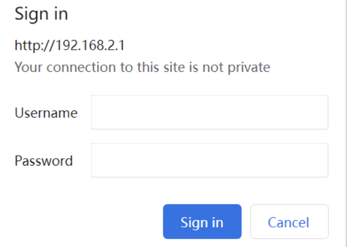

  

4.  After successful authentication, the systematic information about the switch will appear on the IE browser.

  

### 2.2.1  Upgrading to the Web-Supported Version 

If your switch is upgraded to the Web-supported version during its operation and the switch has already stored its configuration files, then Web visit cannot be directly applied on the switch. Perform the following steps one by one to enable the Web visit on the switch:

1.  Connect the console port of the switch with the accessory cable, or telnet to the management address of the switch through computer.
2.  Enter the global configuration mode of the switch through the command line, the DOS prompt of which is similar to “Switch\_config#”. 
3.  If the management address of the switch is not configured, please create the VLAN interface and configure the IP address.
4.  Enter the ip http server command in global configuration mode and start the Web service.
5.  Run username to set the username and password of the switch. For how to use this command, refer to the “Security Configuration” section in the user manual.

After the above-mentioned steps are performed, you can enter the address of the switch in the Web browser to access the switch.

6.  Enter write to save the current configuration to the configuration file.

  

## 2.3      Accessing Switch Through Secure Links

The data between the WEB browser and the switch will not be encrypted if you access switch through common HTTP. To encrypt these data, you can use the secure links, which are based on the secure sockets layer, to access the switch.

  

To do this, you should follow the following steps:

  

1.  Connect the console port of the switch with the accessory cable, or telnet to the management address of the switch through computer.
2.  Enter the global configuration mode of the switch through the command line, the DOS prompt of which is similar to “Switch\_config#”.
3.  If the management address of the switch is not configured, please create the VLAN interface and configure the IP address.
4.  Enter the ip http server command at global configuration mode and start the Web service.
5.  Run username to set the username and password of the switch. For how to use this command, please refer to the “Security Configuration” section in the user manual.
6.  Run ip http ssl-access enable to enable the secure link access of the switch.
7.  Run no ip http http-access enable to forbid to access the switch through insecure links.
8.  Enter write to store the current configuration to the configuration file.
9.  Open the WEB browser on PC that the switch connects, enter https://192.168.2.1 on the address bar (192.168.2.1 stands for the management IP address of the switch) and then press the Enter key. Then the switch can be accessed through the secure links.

## 2.4  Introduction of Web Interface 

The Web homepage appears after login, the whole homepage consists of the top control bar, the navigation bar, the configuration display area and the bottom control bar.

  

### 2.4.1  Top Control Bar 

| Save | Write the current settings to the configuration file of the device. It is equivalent to the execution of the write command.The configuration that is made through Web will not be promptly written to the configuration file after validation. If you click “Save”, the unsaved configuration will be lost after rebooting. |
| --- | --- |
| English | The interface will turn into the English version. |
| Chinese | The interface will turn into the Chinese version. |

  

### 2.4.2  Navigation Bar

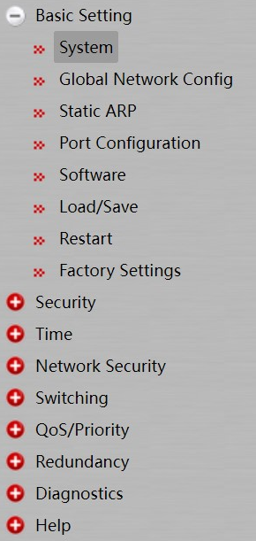

The contents in the navigation bar are shown in a form of list and classified according to types. By default, the list is located at “system”. If a certain item need be configured, please click the group name and then the sub-item. For example, to browse the flux of the current port, you have to click “Diagnostics" and then “Ports”, “Statistics Table”.

Note:

The limited user can only browse the state of the device and cannot modify the configuration of the device. If you log on to the Web with limited user’s permissions, only “System” will appear.

### 2.4.3  Configuration Display Area

  

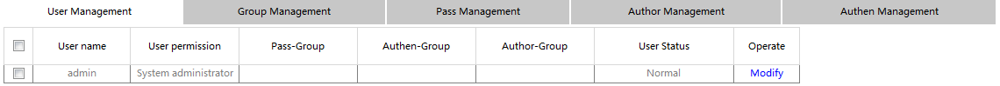

  

The configuration display area shows the state and configuration of the device. The contents of this area can be modified by the clicking of the items in the navigation bar.

  

### 2.4.4  Bottom Control Bar

The configuration area always contains one or more buttons, and their functions are listed in the following table:

| Set | Apply the modified configuration to the device.The application of the configuration does not mean that the configuration is saved in the configuration file. To save the configuration, you have to click “Save” on the top control bar. |
| --- | --- |
| Reload | Refresh the content shown in the current configuration area. |
| Create | Create a list item. For example, you can create a VLAN item or a new user. |
| Delete | Delete an item in the list. |
| Go Back | Go back to the previous-level configuration page. |
| Clear | Clear the content of current configuration, such as statistics of port. |

  

  

# Chapter 3    Basic Configuration 

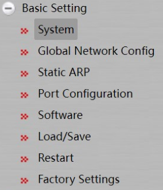

## 3.1  System

If you click Basic Setting -> System in the navigation bar, the page appears as shown as below：

 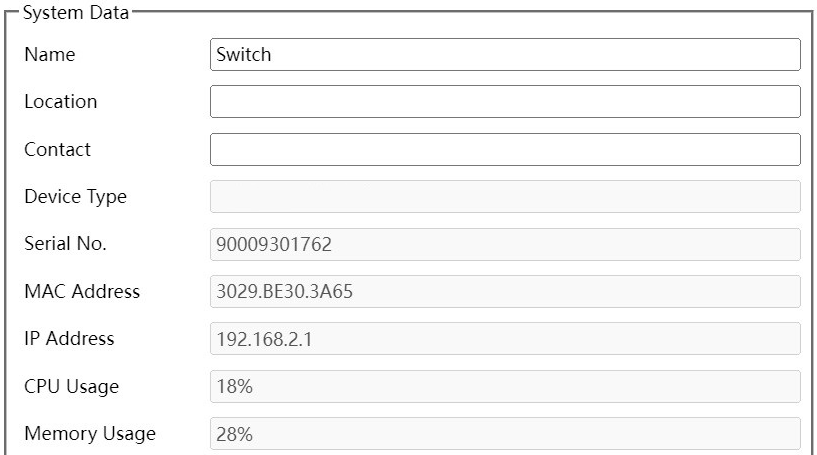

 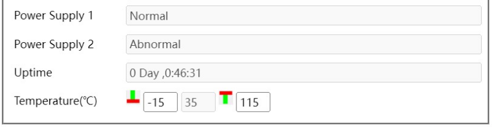

  

The system message will be displayed in the dialog box.

The default name of the device is “Switch”. You can enter the new hostname in the text box and then click “Set” in the bottom control bar.

  

## 3.2  Global Configuration Mode (Management Interface) 

If you click Basic Setting -> Global Network Config in the navigation bar, the page appears as shown as below: 

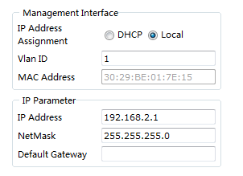

2.  Setting the IP address of Interface VLAN 1 , in order to access the switch
3.  This page is used to set the IP address of Interface Vlan 1 in the management interface of the device. In initial conditions, the MAC address of the device, the IP address, mask and gateway of the interface will appear on this page. 

  

## 3.3  Port Configuration 

If you click Basic Setting -> Port Configuration in the navigation bar, the Port Configuration page appears, as shown as below figure:

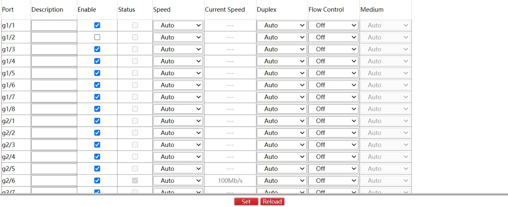

  

You can change the status, speed, duplex mode and flow control of a port on this page.

Note: 

Port link switching might happen if modifying port’s speed or duplex mode. Network communication might be affected.

  

## 3.4  Auto-Shutdown

Click Basic Setting -> auto-shutdown in the navigation bar, the auto-shutdown page appears, as shown as bellow:

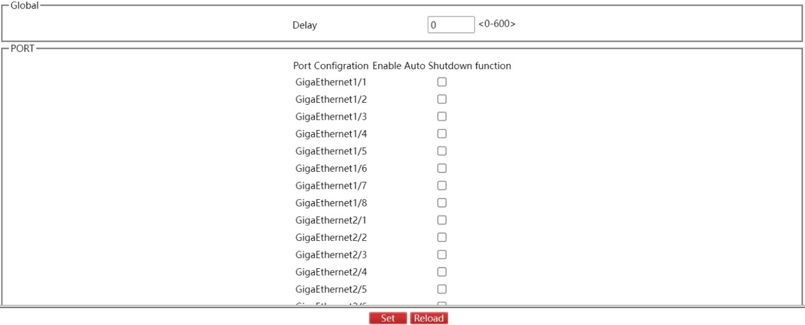

This page set the auto-shutdown port and delay time of shutdown. Click the Set in the bottom control bar to complete the configuration, and click the Save on the top. The corresponding port will be shutdown in delayed time after the switch turned on.

## 3.5  Software 

If you click Basic Setting -> Software in the navigation bar, the Software management page appears, as shown as below figure:

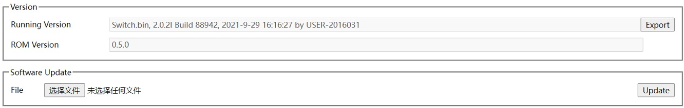

  

Current running version and ROM version could be checked at this page. Click Export to export current running version to computer. Choose the to-be-updated software version and click Update to change system’s software version on Software Update Column.

  

Note: The updated system’s software will be valid only if the device is restarted.

  

## 3.6  Load/Save 

If you click Basic Setting -> Load/Save in the navigation bar, the page appears as shown as below figure:

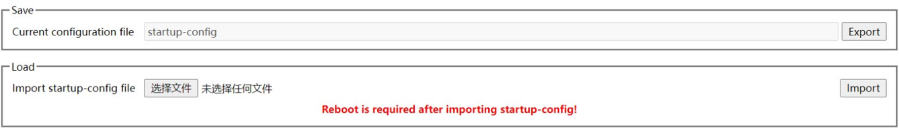

Click the “Export” then the current configuration of system will be exported to computer, click the “ Import” then related configuration document will be imported to switch.

## 3.7  Restart 

If you click Basic Setting -> Restart in the navigation bar, the page appears as shown as below figure:

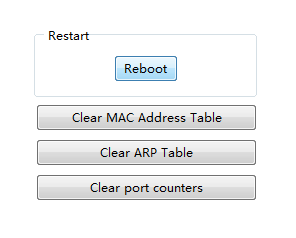

You can choose “Reboot” to reboot the switch, or choose “Clear MAC Address Table” , “Clear ARP Table”, “Clear port counters”.

## 3.8  Factory Settings

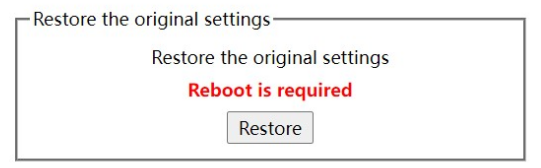

On this page you can reset the equipment to factory setting, click the “Restore” button to reset to factory setting.

# Chapter 4  Security 

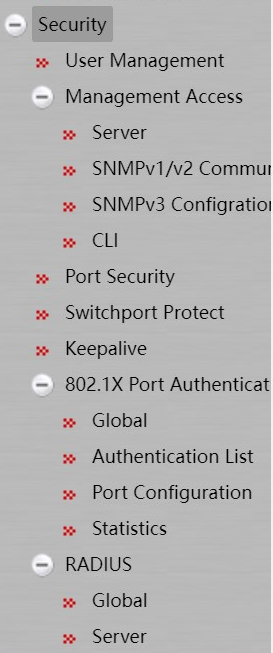

## 4.1  User Management 

### 4.1.1  User Management 

If you click Security -> User Management in the navigation bar, the page appears as shown as below figure:

  

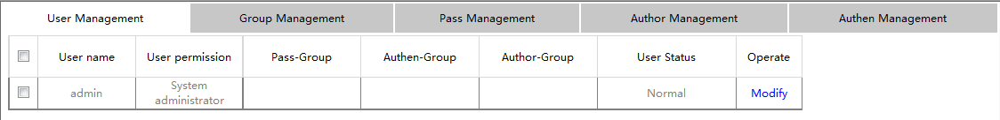

Click Modify to change user’s configuration at this page, and click Delete at the bottom bar to delete the selected user.

  

Click Create at the bottom bar to enter the following page:

  

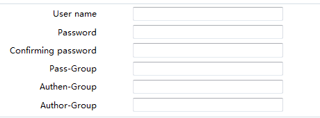

Fill in configuration at every configuration column and click Set at the bottom bar to create new user. Click Reload to refresh the user information. And click Go Back to go back to previous level page.

  

### 4.1.2  Group Management

Click Security -> User Management in order and then click Group Management to open configuration page as following:

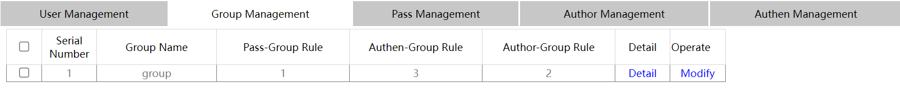

Click Modify to change user group’s configuration at this page. Select user and click Delete at the bottom bar to delete the selected user group. Click Detail to check and configure members of group as following:

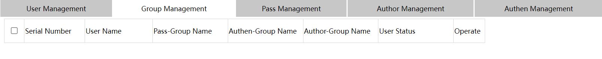

  

Click Create at the bottom bar of group management page to enter the following page:

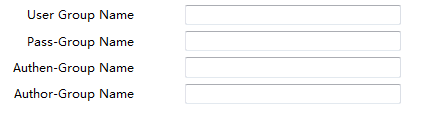

Fill in configuration at every configuration column and click Set at the bottom bar to create a new user group.

  

### 4.1.3  Password Rule Management

Click Security -> User Management in order and then click Pass Management to open configuration page as following:

  

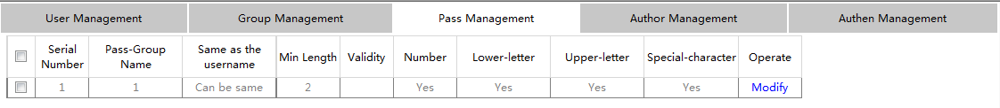

Click Modify to change password regulation at this page. Click Delete at the bottom bar to delete password regulation. 

  

Click Create at the bottom bar to enter the following configuration page:

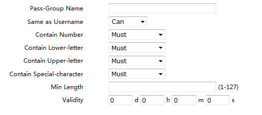

Fill in configuration at every configuration column and click Set at the bottom bar to create new password regulation.

  

### 4.1.4  Author Rule Management

Click Security -> User Management in order and then click Author Management to open configuration page as following:

  

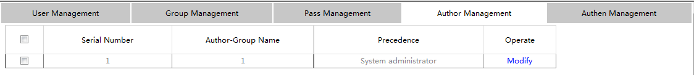

Click Modify to change author rules at this page. Click Delete at the bottom bar to delete author rules. 

Click Create at the bottom bar to enter the following page:

  

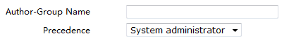

Fill in configuration at every configuration column and click Set at the bottom bar to create new author rules.

  

### 4.1.5  Authentication Rule Management

Click Security -> User Management in order and then click Authen Management to open configuration page as following:

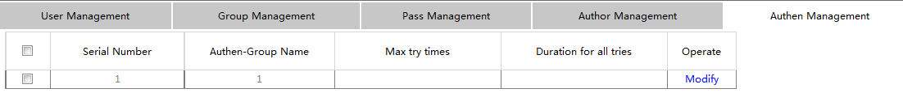

Click Modify to change authentication rules at this page. Click Delete at the bottom bar to delete the selected authentication rules. 

Click Create at the bottom bar to enter the following page:

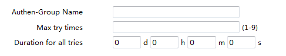

Fill in configuration at every configuration column and click Setup at the bottom bar to create new authentication rules。

  

## 4.2  Management Access

### 4.2.1  Server 

HTTP, HTTPS, SSH and SNMP could be configured at this page. Click Security -> Management Access -> Server at navigation bar in order to enter service configuration page. Click HTTP at this page to enter HTTP configuration.

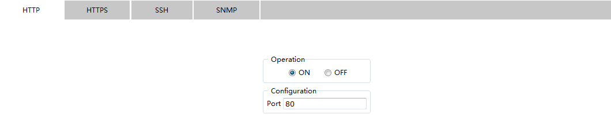

Click HTTPS to configure HTTPS related:

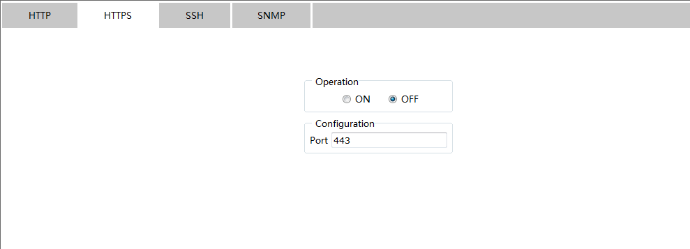

Click SSH to configure SSH related:

  

  

Click SNMP to configure SNMP related:

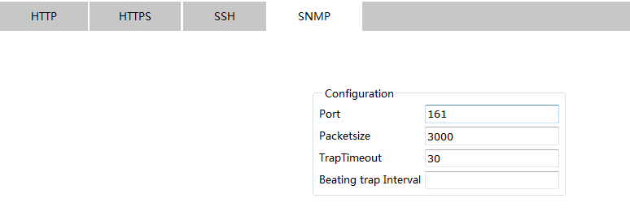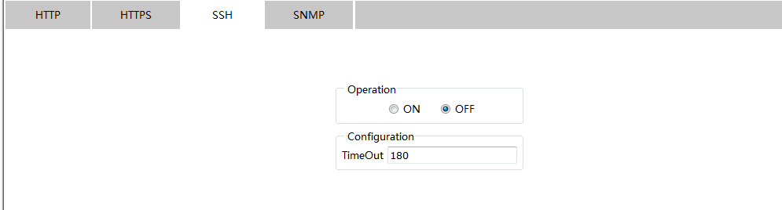

### 4.2.2  SNMP Community Management (SNMPv1/v2 community)

Click Security -> Management Access -> SNMPv1/v2 Community at navigation bar in order to enter configuration page as following:

  

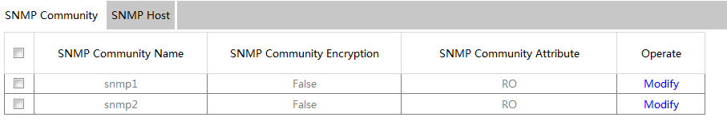

Click Modify to change the feature of SNMP Community.

Click Create to create a new SNMP Community:

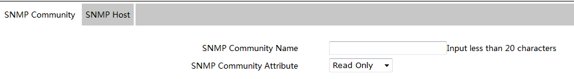

Click Delete to delete the selected SNMP Community.

Click SNMP Host to switch to the SNMP Host configuration page:

  

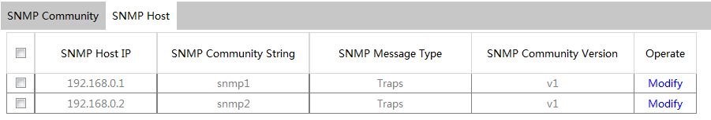

Click Create to create a new SNMP Host:

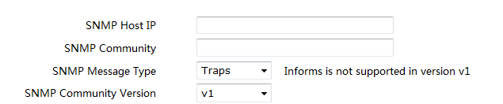

  

Click Modify to modify feature of SNMP Host;

Click Delete to delete the selected SNMP Host.

  

### 4.2.3  SNMPv3 Configuration

Click Security -> Management Access -> SNMPv3 Configuration at navigation bar in order to enter configuration page as following:

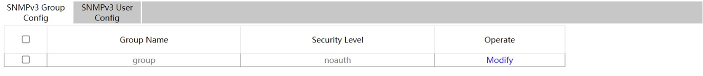

Click the Modify to change the features of SNMPv3 Group Configuration.

Click the Reload at the bottom control bar to refresh the configuration information of SNMPv3 Group.

Click Create to create a new configuration for SNMPv3 Group:

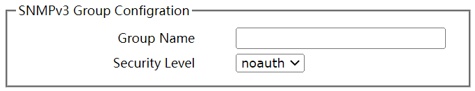

Click SNMPv3 User Config to enter the following configuration page:

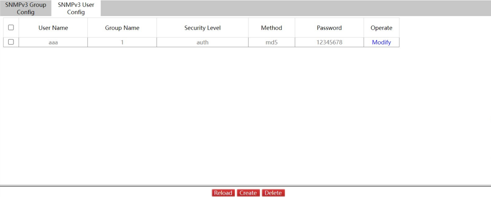

Click Modify to change the features of SNMPv3 User Configuration.

Click Reload at the bottom control bar to refresh the information of SNMPv3 User Configuration.

Click Create to create new configuration of SNMPv3:

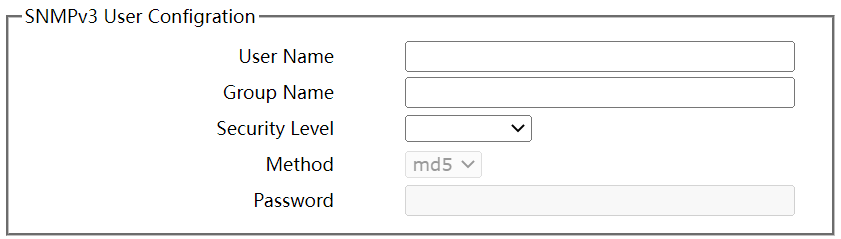

Click Delete at bottom control bar to delete the selected configuration information of SNMPv3 Group.

  

### 4.2.4  CLI ( Command Line Interface )

Click Security -> Management Access -> CLI at navigation bar in order to enter GLOBAL configuration page as following:

  

Terminal’s overtime time could be configured at this page, and if configured as 0, it means there would be never overtime.

  

Click Login Banner to enter the following page:

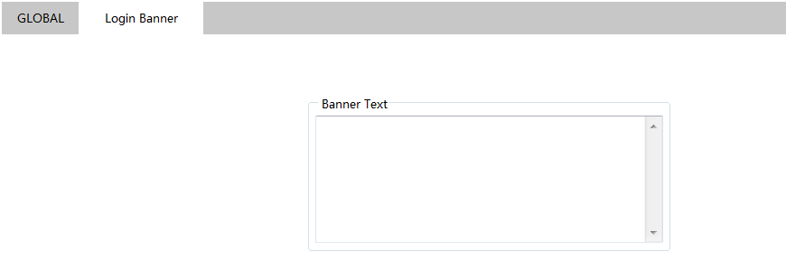

  

Terminal’s Login Banner could be configured at this page.

  

  

  

## 4.3  Port Security

  

### 4.3.1  IP MAC Binding

Click Security -> Port Security at navigation bar in order, and then click IP MAC Binding to enter configuration page as following:

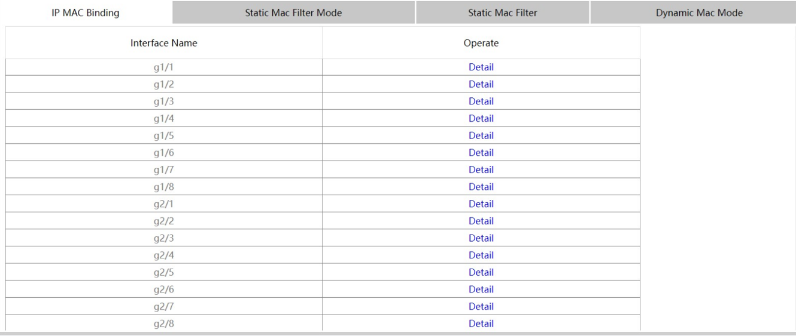

Click Detail to check the IP MAC binding information of that port.

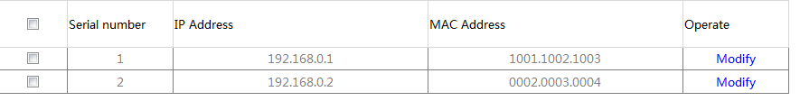

Click Modify to change the selected binding items of the IP MAC.

Click Reload to refresh the configuration of the IP MAC binding.

Click Create to create a new IP MAC binding item.

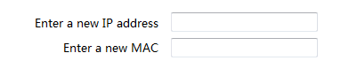

Click Delete at the bottom control bar to delete the selected IP MAC binding item.

  

### 4.3.2  Static MAC Filter Mode

Click Security -> Port Security at navigation bar in order, and then click Static MAC Filter Mode to enter configuration page as following:

  

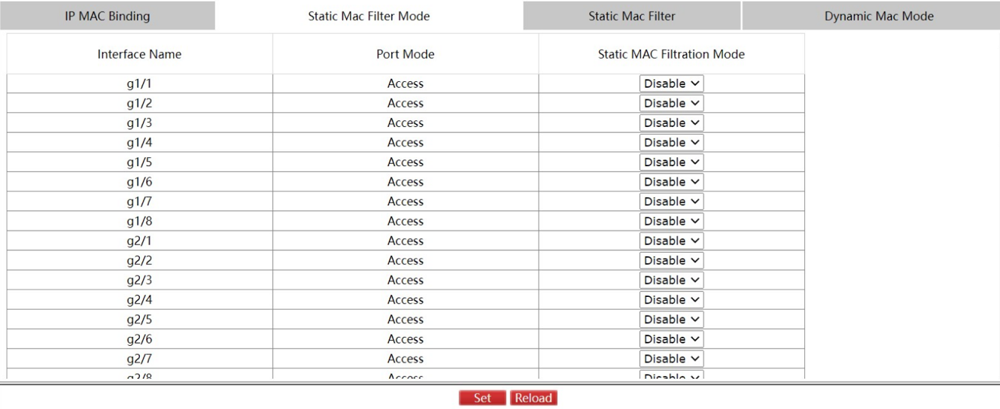

Interface’s Static MAC Filtration Mode could be configured at this page.

  

### 4.3.3  Static MAC Filter

Click Security -> Port Security at navigation bar in order, and then click Static MAC Filter to enter configuration page as following:

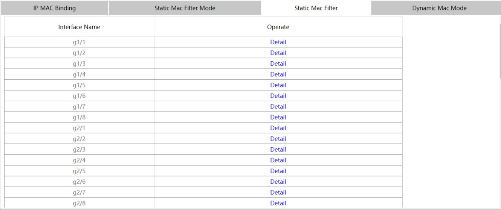

  

Click Detail to check the interface’s static MAC filtration items.

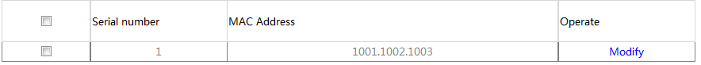

Click Modify to modify static MAC filtration items.

Click Create to create new static MAC filtration items.

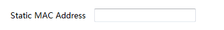

Click Delete at bottom control bar to delete the selected static MAC filtration items.

  

### 4.3.4  Dynamic MAC Mode

Click Security -> Port Security at navigation bar in order, and then click Dynamic MAC Mode to enter configuration page as following:

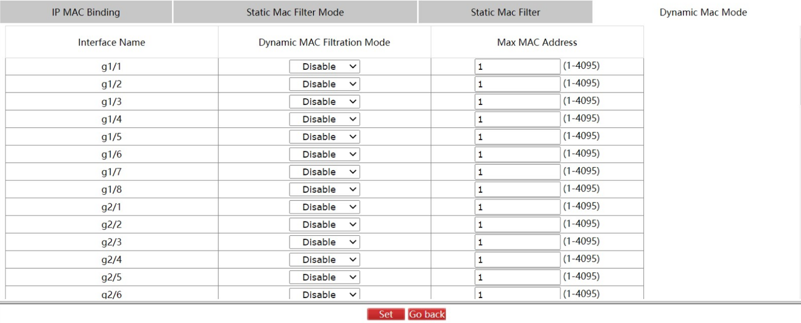

Interface’s Dynamic MAC Mode could be configured at this page.

  

## 4.4  Switchport Protect

Click Security -> Switchport Protect at navigation bar in order to enter configuration page as following:

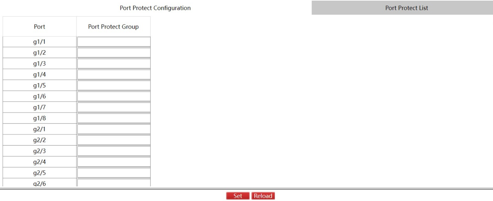

Set the Port Protect Group at this page, click Set at the bottom control bar to finish the setting.

Click Reload to refresh the port protection group information.

  

Click “Port Protect List”, enter the Port Protect Group Creating page:

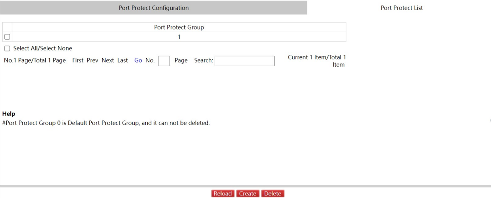

Click Reload at the bottom control bar, refresh the Port Protect Group information.

Click Delete at the bottom control bar, delete the selected port protect group.

Click Create at the bottom control bar, enter the Port Protect Group Creating page:

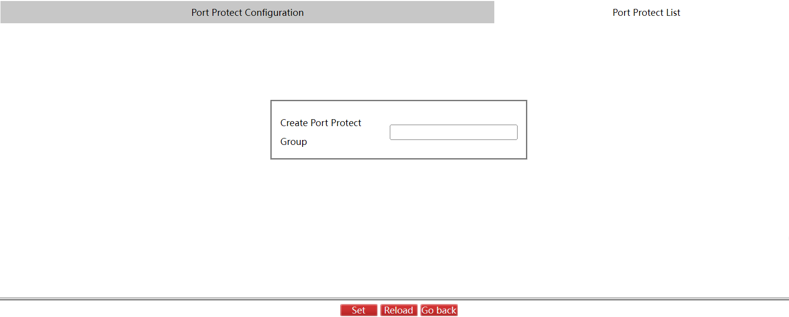

Click Set at the bottom control bar, to finish the setting.

Click Reload at the bottom control bar, refresh the Port Protect Group Creating page.

Click Go Back at the bottom control bar, go back to the “Port Protect List” page.

  

## 4.5  Keepalive

Click Security -> Keepalivel at navigation bar in order to enter port status configuration page as following:

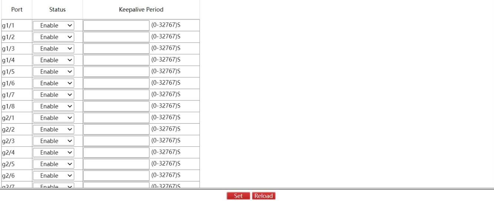

Click Set at the bottom control bar after configuration, to finish the port status setting.

Click Reload at the bottom control bar, refresh the port setting information.

  

## 4.6  802.1X Port Authentication

### 4.6.1  Global

Click Security -> 802.1X Port Authentication -> Global at navigation bar in order to enter configuration page as following:

  

Configure the enabling/disabling operations of 802.1X port authentication at this page.

  

### 4.6.2  Authentication List

Click Security -> 802.1X Port Authentication -> Authentication List at navigation bar in order to enter configuration page as following:

Click Reload at the bottom control bar, to refresh the authentication list.

Click Delete at the bottom control bar, to delete the selected port authentication list.

Click Create to create new authentication entry:

### 4.4.3  Port Configuration

Click Security -> 802.1X Port Authentication -> Port Configuration at navigation bar in order to enter configuration page as following:

You could configure interface’s enabling/disabling 802.1x port authentication, authentication type, authentication mode, method and etc at this page.

  

Note:

Some configurations can only be configured when 802.1x port authentication is enabled.

  

### 4.6.4  Statistics

Click Security -> 802.1X Port Authentication -> Statistics at navigation bar in order to enter configuration page as following:

All ports’ statistic information of 802.1x messages could be checked at this page.

  

## 4.7  RADIUS

### 4.7.1  Global

Click Security -> RADIUS -> Global at navigation bar in order to enter configuration page as following: 

  

Max. Number of retransmits of radius, overtime, NAS and Radius-Server Key could be configured at this page.

### 4.7.2  Service

Click Security -> RADIUS -> Service at navigation bar in order to enter configuration page as following:

  

Radius server’s authentication port and accounting port can be configured at this page.

Click Set at the bottom control bar, to finish the setting.

Click Reload at the bottom control bar, refresh the authentication port and accounting port information.

Click Delete at the bottom control bar, to delete the selected authentication port and accounting port information of RADIUS Server.

Click Create to create new radius server items:

# Chapter 5   Time

## 5.1  Basic Setting

Click Time -> Basic Setting at navigation bar in order to enter configuration page as following:

  

Click Reload to refresh the current displayed system time.

System’s time-zone could be configured at this page. Select Set Time Manually to set system time manually.

  

## 5.2  NTP

Click Time -> NTP at navigation bar in order to enter configuration page as following:

  

NTP server’s IP address of NTP (Network Time Synchronization) could be configured at this page.

  

  

  

## 5.3  PTP Configuration

### 5.3.1  Global

Click Time -> PTP -> Global at navigation bar in order to enter configuration page as following:

  

  

Enabling/disabling PTP and PTP basic setting, default PTP data set, PTP Time Properties Settings, Regulator Settings, Sync Process Mechanism and Clock Frequency Synchronization can be configured at this page. Click Set at the bottom control bar at settings, to finish the setting.

Click Reload at the bottom control bar, refresh the PTP Global Configuration.

  

### 5.3.2  Port Configuration

Click Time -> PTP -> Port Configuration at navigation bar in order to enter configuration page as following:

  

PTP port’s creation, IEEE1588 Transport Protocol type, delay measurement mechanism, and etc, all of which are under port, could be configured at this page. Click Reload at the bottom control bar, refresh the configuration of each port.

Note：

This page could only be configured after PTP protocol is enable。

  

  

### 5.3.3  Unicast

Click Time -> PTP -> Unicast at navigation bar in order to enter configuration page as following:

  

Unicast status and IP address of each port could be checked and the unicast state of each port could be changed at this page. 

  

  

  

# Chapter 6   Network Security

6.1  DOS Configuration

6.1.1  DOS Global Configuration

Click Network Security -> DOS \-> Global at navigation bar in order to enter DOS global configuration page as following:

You could set or cancel the related Preventing DOS Attack according to needs. Click Set to save configuration.

  

6.2      DHCP Snooping Configuration

6.2.1  DHCP Snooping Global Configuration

Click Network Security -> DHCP Snooping -> Global at navigation bar in order to enter DHCP Snooping global configuration page as following:

  

Enable global DHCP Snooping protocol to detect all DHCP messages. Relative binding relationships forms. If client obtains addresses by the switch before the command is configured previously, switch cannot add relative binding relationships.

  

After switch’s configuration is saved, restart the switch. All previous configured interface binding relationship would be dropped. At the meantime, the interface has no binding relationship, and switch would denying the forwarding of all IP messages after IP source address monitoring function is enabled. After the interface binding relationship’s backup TFTP server is configured, binding relationship would be copied to server by TFTP protocol. After switch restarted, it would download binding list from TFTP server automatically to ensure network’s normal operation.

  

When configuring backup interface binding relationships, save file name on TFTP server. Therefore, different switches can copy their interface binding relationship list to the same TFTP server.

  

The binding relationship list of interface’s MAC address and IP address is dynamic. It is required to check whether the binding is updated. If there is (like binding items are added or deleted), backup should be done again. The default time interval is 30 minutes.

  

  

  

6.2.2  DHCP Snooping VLAN Configuration

Click Network Security -> DHCP Snooping -> VLAN Config at navigation bar in order to enter DHCP Snooping VLAN configuration page as following:

  

After the DHCP Snooping function is enabled on the VLAN, the DHCP messages received by all untrusted physical ports on the entire VLAN will be legally inspected. Any responded DHCP messages received by untrusted physical ports within a VLAN will be lost to prevent users from counterfeiting messages or prevent a mistaken DHCP server from assigning addresses. For the DHCP requests from untrusted ports, if the MAC address does not match the hardware address field in the messages, the requests will be considered as attacking messages counterfeited by users for the purpose of DHCP DOS (denial of service) and the switch will be abandoned too.

Monitor the ARP dynamics of all physical ports of a VLAN. If the source MAC and IP addresses of the ARP messages received by the ports do not match the MAC and IP address binding relations configured for the ports, the messages cannot be processed. The binding relations configured for the ports may be dynamic along with the DHCP or manually configured. If no MAC and IP address binding relations are configured for a physical port, the switch will refuse to forward all the ARP messages.

In a VLAN where IP source addresses are monitored, if the source MAC and IP addresses of the IP messages received by all the physical ports in the VLAN do not match the MAC and IP address binding relations configured for the ports, the messages cannot be processed. The binding relations configured for the ports may be dynamic along with the DHCP or manually configured. If no MAC and IP address binding relations are configured for a physical port, the switch will refuse to forward all the IP messages received by all the ports.

  

  

6.2.3  DHCP Snooping Interface Configuration

Click Network Security -> DHCP Snooping -> Interface Config at navigation bar in order to enter DHCP Snooping Port configuration page as following:

  

  

If a port is configured as the DHCP-trusted port, the DHCP messaged received by this port will not be inspected.

The ARP monitoring function will not be enabled for ARP-trusted ports. Ports are untrusted by default.

The source address inspection function is not enabled for ports trusted by IP source addresses.

  

  

6.2.4  DHCP Snooping Bindings

Click Network Security -> DHCP Snooping -> Bindings at navigation bar in order to enter DHCP Snooping Binding configuration page as following:

For hosts that do not use DHCP to obtain addresses, users can manually add entries for binding at the switch ports to enable the host to smoothly access to the network. The “no” command can be used to delete the binding entries.

Entries bound manually proceed over those bindings through dynamic configuration. If the MAC address of the configured entry is the same as the MAC address of the dynamically configured entry, the latter will be updated based on the former. The MAC address is the only one index for binding entries of a port.

Click "Create" to create entries for binding manually configured DHCP Snooping ports.

  

Note：

Binding entries can be created only if enabling DHCP Snooping protocol.

  

  

6.3  Access Control List

6.3.1  IPv4 Rules

Click Network Security -> Access Control List -> IPv4 Rules at navigation bar in order to enter IPv4 rules’ page as following:

Click Delete at the bottom control bar, delete the selected access control list.

Click Detail on the right of the table to enter the IP Access Control List page.

Click Modify on this page, to configure the rules of corresponding IP Access Control list.

Click Go Back on the IP Access Control List page to go back to IPv4 Rules’ Page. 

Click Create to create an IP access control list. 

Click Delete to delete the access control list.

  

6.3.2  MAC Rules

Click Network Security -> Access Control List -> MAC Rules at navigation bar in order to enter MAC rules’ page as following:

Click Create at the bottom control bar to create a MAC access control list. Click Delete to delete the selected access control list.

  

6.3.3  Assignment

Click Network Security -> Access Control List -> Assignment at navigation bar in order to enter distribution page of access control list as following:

  

6.4  Filter Function

Click Network Security -> Filter Function at navigation bar in order to enter the filter function global page as following:

Click Set at the bottom control bar to finish the global configuration of filter function.

Click Reload at the bottom control bar to refresh the global configuration of filter function.

  

Click “Port Configuration” on the right of “Global”, enter the port configuration page as follows:

Click Set at the bottom control bar, to finish the configuration of port.

Click Reload at the bottom control bar, refresh the port configuration of filter function.

  

Click “Statistics” on the right of “Port Configuration” enter the statistics page of filters blocked and filters counting as following:

Click Reload at the bottom control bar, refresh the filters blocked and filters accounting information.

# Chapter 7   Switching

  

7.1  Storm Control

Click Switching \-> Storm Control at navigation bar in order to enter broadcast storm control, multicast storm control and unicast storm control configuration pages.

  

7.1.1  Broadcast Storm Control

Through the dropdown boxes in the Status column, you can decide whether to enable broadcast storm control on a port. In the Threshold column you can enter the threshold value of the broadcast packets. The legal threshold range for each port is given behind the threshold.

  

7.1.2  Multicast Storm Control

  

Through the dropdown boxes in the Status column, you can decide whether to enable multicast storm control on a port. In the Threshold column you can enter the threshold value of the multicast packets. The legal threshold range for each port is given behind the threshold.

  

  

7.1.3  Unicast Storm Control

  

  

Through the dropdown boxes in the Status column, you can decide whether to enable unicast storm control on a port. In the Threshold column you can enter the threshold value of the unicast packets. The legal threshold range for each port is given behind the threshold.

  

  

7.2  Port Rate Limits 

Click Switching \-> Port Rate Limits at navigation bar in order to enter port rate limit page as following:

  

  

  

Set rate\-limit on ports receive speed and send speed of port at this page. By default all ports’ speed is not limited. Receive speed and send speed can be configured according to ratio or switch’s defined unit.

  

7.3  MAC Address Table 

Click Switching -> MAC Address Table at navigation bar in order to enter static MAC address table as following:

Static MAC address, VLAN ID and index are shown on the page. Click Modify or Create to enter static MAC address configuration page and do modifications on configured static MAC address table.

Click “Aging Configuration” on the right of “Static MAC Address Table”, enter the aging configuration page:

  

  

7.4      IGMP Snooping

7.4.1  IGMP Snooping Configuration

Click Switching -> IGMP Snooping, at navigation bar in order, and select “IGMP Snooping” tab page to enter IGMP Snooping configuration page as following:

  

Whether switch forwarding unknown multicast, whether enabling IGMP-Snooping and whether taken as IGMP’s Querier can be configured at this page.

  

### 7.4.2  IGMP-Snooping VLAN

Click Switching -> IGMP Snooping, at navigation bar in order, and select “IGMP Snooping VLAN” tab page to enter IGMP Snooping VLAN configuration page as following:

Click Modify, you can modify the member port, running status and immediate-leave of IGMP-Snooping VLAN. Click Create, IGMP-snooping VLAN configuration can be done. Through Web up to 8 physical ports can be set on each IGMP snooping VLAN. Click Delete, a selected IGMP-Snooping VLAN can be deleted.

  

When an IGMP-Snooping VLAN is created, its VLAN ID can be modified; but when the IGMP-Snooping VLAN is modified, its VLAN ID cannot be modified.

You can click “\>>” and “<<” to delete and add a routing port.

### 7.4.3  Static Multicast Mac Address Configuration

Click Switching -> IGMP Snooping, at navigation bar in order, and select “Static Multicast Address” tab page to enter static multicast address page as following:

  

On this page, the currently existing static multicast groups and port groups in each static multicast group are shown.

  

Click Reload to refresh the contents in the list.

  

### 7.4.4  Multicast list

Click Switching -> IGMP Snooping, at navigation bar in order, and select “Multicast List” tab page to enter multicast member list configuration page as following:

The multicast groups in current network and ports’ set where every group member exists counted by IGMP-Snooping, are shown on this page.

Click Reload to refresh the contents in the list.

Note:

By default, a multicast list can display up to 15 VLAN items. You can modify the number of multicast items by running ip http web igmp-groups after you log on to the device through the Console port or Telnet.

  

  

  

7.5  VLAN

7.5.1  VLAN configuration

Click Switching -> VLAN, at navigation bar in order, and select “VLAN configuration” tab page to enter VLAN configuration page as following:

Click Modify after VLAN entry to change VLAN name and the VLAN’s port feature.

Select the check box before item and click Delete at the bottom control bar to delete the selected VLAN.

Note: 

By default, the maximum quantity of shown items of VLAN list is 100. If you want to configure more VLAN through Web, please login switch by Console port or Telnet to enter global configuration mode and use command ip http web max-vlan to modify maximum shown VLAN quantity.

  

Click Create or Modify to enter VLAN configuration page.

  

If you want to create a new VLAN, enter a VLAN ID and a VLAN name; the VLAN name can be null.

  

Through the port list, you can set for each port the default VLAN, the VLAN mode (Trunk or Access), whether to allow the entrance of current VLAN packets and whether to execute the untagging of the current VLAN when the port works as the egress port.

  

  

Note:

When a port in Trunk mode serves as an egress port, it will untag the default VLAN by default.

  

  

  

7.5.2  VLAN Batch Configuration

Click Switching -> VLAN, at navigation bar in order, and select “VLAN Batch Configuration” tab page to enter VLAN configuration page as following:

  

  

Note:

Before VLAN to be deleted, it should be added first.

  

  

7.5.3  Port VLAN Configuration

Click Switching -> VLAN, at navigation bar in order, and select “Port VLAN” tab page to enter port VLAN configuration page as following:

This page shows all ports’ PVIDs, modes, allowed VLAN range and VLAN range without tag. Click Modify to change port’s VLAN feature configuration, VLAN-allowed configuration and VLAN-untagged configuration.

  

  

Note:

VLAN-allowed and VLAN-untagged: Please add first before do delete operation.

Please do not use Enter key.

  

7.6  GMRP

7.6.1  VLAN List

Click Switching -> GMRP \-> VLAN List at navigation bar in order, to enter port VLAN configuration page as following:

This page shows the ID list information of GMRP VLAN. Click Reload at the bottom control bar to refresh the list.

Click Create at the bottom control bar, create GMRP VLAN configuration.

  

7.6.2  Port Configuration

Click Switching -> GMRP \-> Port Configuration at navigation bar in order, to enter Port Configuration page as following:

Click Set at the bottom control bar, finish the configuration.

  

7.6.3  Multicast List

Click Switching -> GMRP \-> Multicast List at navigation bar in order, to enter Multicast List page as following:

This page shows the VLAN ID, multicast MAC address and member port information of GMRP multicast list. Click Reload at the bottom control bar, refresh the multicast list information.

# Chapter 8  Routing

  

## 8.1      VLAN Interface and IP Address Configuration

Click Routing -> VLAN Interface and IP Address at navigation bar in order, and then enter  configuration page as following：

Click Modify to enter relative VLAN interface items to do the modification.

Click Create to create a new VLAN interface items.

Click Delete to delete the selected VLAN interface items.

You can change the VLAN name when you click the “Create” bottom. It’s cannot change VLAN name when click “Modify” just can do the VLAN related items modification.

Note：

Before setting the VLAN secondary IP address, you need to set the Primary IP Address first。

  

  

## 8.2  VRRP Configuration 

Click Routing -> VRRP Configuration at navigation bar in order, and then enter VRRP List page as following:

Click Reload at the bottom control bar, refresh VRRP list information.

Click Delete at the bottom control bar, delete the selected VRRP configuration information.

Click Create at the bottom control bar, to enter new VRRP configuration page:

Click Set at the bottom control bar, finish the configuration of VRRP and other information.

Click Go Back at the bottom control bar, back to the VRRP List Page.

  

8.3  IP Express Forwarding

Click Routing -> IP Express Forwarding at navigation bar in order, and then enter IP Express Forwarding switch page as following:

Click Set at the bottom control bar, to finish the setting of IP Express Forwarding.

Click Reload at the bottom control bar, refresh the information of IP Express Forwarding information.

  

## 8.4  Static ARP

Click Routing -> Static ARP at navigation bar in order, and then enter configuration page as following

Click Modify to modify the current Static ARP.

Click Delete to delete the selected Static ARP items.

Click New to create a new Static ARP.

  

## 8.5  Static Route

Click Routing -> Static Route at navigation bar in order, and then enter configuration page as following: 

Click Modify to modify the current Static Route.

Click Reload to refresh the static route information.

Click Delete to delete the selected Static Route items.

Click Create to create a new Static Route.

  

Note:

Only the Layer3 switches have the static route configuration page.

  

## 8.6  RIP Configuration

### 8.6.1  RIP Configuration 

Click Routing -> RIP Configuration at navigation bar in order, and then enter RIP configuration page as following:

You should have created a RIP process firstly, before do the RIP entry configuration. When Edit the RIP process can create the new RIP process or delete it also.

Click Create to create a new RIP process.

### 8.6.2  RIP Router Entries 

Click Routing -> RIP Configuration at navigation bar in order, and then click RIP Router Entries to enter RIP Router Entries configuration page as following：

  

Enter the created RIP process ID, Click Set to enter the selected RIP Router Entries page.

  

Click Create to create a new RIP Router Entries of selected RIP process.

  

## 8.7  OSPF Configuration 

### 8.7.1  OSPF process 

Click Routing -> OSPF Configuration at navigation bar in order, and then click OSPF Process to enter configuration page as following:

  

  

You should have created a OSPF process firstly, before to do the OSPF Router Entries  configuration otherwise cannot do any editing. 

  

Click Create to entry the RIP process creating page。

  

### 8.7.2  OSPF Router Entries 

Click Routing -> OSPF Configuration at navigation bar in order, and then click OSPF Router Entries to enter OSPF Router Entries configuration page as following:

  

Enter the OSPF process ID which was created already, click Set to enter the selected OSPF Router Entries configuration page.

  

Click Create to create the OSPF Router Entries of OSPF process selected.

The format that the Area column can accept is an integer or IP address。

# Chapter 9  QoS/Priority

  

## 9.1  Global 

Click QoS/Priority -> Global at navigation bar in order, and then enter the global configuration page as following：

You can do the setting of Schedule Policy, Default CoS Value and Trust Priority in the QoS Global page.

  

## 9.2  Port Configuration 

Click QoS/Priority -> Port Configuration at navigation bar in order, and then enter the configuration page as following: 

  

  

  

You can set the Port CoS value by port, and then click Set to save the changes.

  

## 9.3  802.1D/p Mapping 

Click QoS/Priority -> 802.1D/p Mapping at navigation bar in order, and then enter the configuration page as following: 

Click Set to save all 802.1D/p mapping configurations.

  

## 9.4  IP DSCP Mapping

Click QoS/Priority -> IP DSCP Mapping at navigation bar in order, and then enter the configuration page as following:

  

  

  

There are listed the 64 values of DSCP in the IP DSCP mapping page, you can set the mapping value per each DSCP.

Click Clear and then clean all of the DSCP mapping configuration.

Note:

    The number of table parameter may be different between different device model.

  

## 9.5  Queue Management 

Click QoS/Priority -> Queue Management at navigation bar in order, and then enter the configuration page as following:

Click Set to save all configuration.

  

Note:

        If one Queue ID set the bandwidth weight to Zero value. then the weight value of the other queue ID must must be set to Zero.

# Chapter 10  Redundancy 

10.1  Link Aggregation Configuration

### 10.1.1  Port Aggregation Configuration 

Click Redundancy -> Link Aggregation at navigation bar in order, and then enter the link aggregation configuration port channel page as following:

  

  

Click Modify to modify the member port and aggregation mode of the aggregation port.

Click Create to create a new aggregation group. As much as 32 aggregation groups can be configured through Web. Each group can configure at most 8 physical port aggregations. 

Click Delete to delete the selected aggregation group. 

An aggregation group is selectable when it is created but is not selectable when it is modified. 

When a member port exists on the aggregation port, you can choose the aggregation mode to be Static, LACP Active or LACP Passive. 

You can add or delete the aggregation group member port by buttons “<<” or “>>”. 

  

### 10.1.2  Port Channel Global Loading Balance

Some models support link aggregation load balancing configuration and others not, but the configuration can be done in the global configuration mode. 

Layer 3 model switch can support the aggregation group based load balancing configuration:

  

You can use different aggregation groups to set different aggregation modes。

  

## 10.2  Backup Link 

### 10.2.1  Backup Link Global Configuration 

Click Redundancy -> Backuplink -> Global at navigation bar in order, and then enter the link backup global configuration page as following：

Click Modify on the right of the entry and configure the preemption mode and the preemption delay mode of the link backup group.

The page lists current configured link backup group, including the preemption mode and the preemption delay mode. Click Create to create a new link backup group.

  

Note：

1.  There are supported 8 group numbers of link backup group in this system.
2.  The preemption mode of the link backup group decides the policy of the primary port and the backup port selecting forwarding packets.

  

### 10.2.2  Link Backup Protocol Port Configuration 

Click Redundancy -> Backuplink -> Port Configuration at navigation bar in order, and then enter the backup link protocol port configuration page as following:

The page lists the member port has joined the backup link group, port attribute of the member port, MMU attribute, load balance vlan. MMU sender can transmit the message to MMU receiver to make the receiver quickly update the mac address table. 

Click Modify on the right of the entry and configure the link backup protocol of the port.

The link backup group which has been configured to be primary port cannot be configured other port as the primary. In the same way, the link backup group which has been configured backup port cannot be configured other port as backup.

  

10.3  Spanning Tree

### 10.3.1  Global

Click Redundancy -> Spanning Tree -> Global at navigation bar in order, and then enter the spanning tree global configuration page as following: 

The page can configure the local STP protocol, such as protocol type, spanning tree priorities etc. Click Set to save configuration.

  

### 10.3.2  MSTP 

10.3.2.1 MST Global

Click Redundancy -> Spanning Tree -> MSTP at navigation bar in order, and then click the MST Global to enter the configuration page as following:

You can configure the MST Global Revision Level in this page.

Click Set to save configuration.

10.3.2.2 MST Instance

Click Redundancy -> Spanning Tree -> MSTP at navigation bar in order, and then click the MST Instance to enter the configuration page as following:

This page shows the VLAN Mapping, priority and etc. of every instance.

Click Reload at the bottom control bar, refresh the MST Instance information.

Click Modify on the right of the table, configure the instance. 

On this page, the path cost and priority can be configured. And click Set at the bottom control bar to save the configuration.

  

### 10.3.3  Spanning Tree Ports

10.3.3.1 Port Configuration

Click Redundancy -> Spanning Tree -> Ports at navigation bar in order, and then click the Port Configuration to enter the configuration page as following:

This page shows the protocol status, priority, path cost, edge port, RSTP ring, guard, BPDU guard and BPDU filter enabling status, which can be configured. After configuration, click Set at the bottom control bar to save the configuration.

10.3.3.2 Port Status

Click Redundancy -> Spanning Tree -> Ports at navigation bar in order, and then click the Port Status tab to enter the status page as following:

The page lists the port information and usage status of spanning tree, Click Reload can refresh the data.

  

## 10.4  EAPS (ether-ring)

Click Redundancy -> EAPS(ether-ring) at navigation bar in order, and then enter the EAPS ring (Ether-ring) list configuration page as following:

This page shows the configuration of EAPS ring (ether-ring), including ring ID, node type, ring description, CONTROL VLAN, status, Hello Time, Fail Time, Pre Forward Time and primary and secondary port on the ring.

Click Modify on the right, change the time, primary and secondary port configuration on the EAPS (ether-ring).

Click Create at the bottom control bar, create new EAPS (ether-ring).

Note:

1.  The EAPS ring (ether-ring) number the system supported is 32.
2.  After the EAPS ring (ether-ring) configured, the ring ID, node type and CONTROL VLAN cannot be changed. If they needed to be changed, please delete the EAPS (ether-ring) and create new.

  

Click Create at the bottom control bar on the EAPS (ether-ring) page, or click Modify on the right, enter the EAPS ring (ether-ring) configuration page:

In the drop-down list on the right of primary and secondary port, port of the ring can be chosen, or “None” can be chosen.

Note:

If configure the existed EAPS ring (ether-ring), the ring ID, node type and CONTROL VLAN cannot be changed.

  

## 10.5  MEAPS   

Click Redundancy -> MEAPS at navigation bar in order, and then enter the MEAPS list configuration page as following:

The list displays the currently configured MEAPS ring, including the Domain ID、Ring ID、Ring Type、Control VLAN、Hello Time、Failed Time、Pre Forward Time and the Primary/Secondary Port on the ring.

Click Modify right of the entry to configure the time parameter and the Primary and Secondary port of the MEAPS ring network.

Click Create to create MEAPS ring network.

  

Note：

1.  Supporting max four MEAPS domains (0-3).
2.  Supporting max eight Rings in one domain (0-7).
3.  Once one MEAPS has configured, its Domain ID, Ring ID, Ring Type, Node Type and Control VLAN cannot be changed. If these parameters need to be configured, please delete this ring and re-create it. 

  

Click New or Modify on the right of the entry in MEAPS network ring list, and enter MEAPS configuration page.

Master node and the transit node can only be configured in the the primary ring.

Primary node, transit node and edge node can be configured in the secondary ring.

The primary node and the transit node can only be exited in one ring, and the edge node and the assistant edge node can be existed in many rings simultaneously.

In the text boxes of “Primary Port” and “Secondary Port”, select a port as the ring port respectively or select “None”.

Note:

Once one MEAPS has configured, its ID, ring ID, ring type, node type and control Vlan cannot be configured.

  

## 10.6  ERPS

Click Redundancy -> ERPS at navigation bar in order, and then enter the ERPS list configuration page as following:

This page shows the configured ERPS ring, including ring ID, control vlan, Ring-Node version, Ring-state, Signal Fail, WTR-time, guard time, send-time, primary and secondary port.

Click Modify on the right of the list, configure the time and primary and secondary port.

Click Create at the bottom control bar, create new ERPS ring.

Note:

1.  This system only supports ERPS single ring configuration.
2.  Max 8 ERPS ring node.
3.  Once one ERPS has been configured, its ID, ring ID and control Vlan cannot be configured. If these parameters need to be configured, please delete this ring and re-create it.

Click Create at the bottom control bar or click Modify on the right of the item, enter the ERPS configuration page as following:

The ring ID of ERPS can be from 1 to 7.

After the port 1 and port 2 configured, the corresponding port role should be configured.

In the text boxes of “Port 1” and “Port 2”, select a port as the ring port respectively or select “None”.

Note:

Once one MEAPS has been configured, its ID, ring ID, ring type, node type and control Vlan cannot be configured

  

## 10.7  CFM Function

10.7.1  Global

Click Redundancy -> CFM Function -> GLOBAL at navigation bar in order, and then enter the cfm enable configuration page as following:

Click Set at the bottom control bar, finish the setting.

  

Click the “cfm list” on the top, enter the CFM list page:

Click Create at the bottom control bar, enter the CFM Global configuration page:

After configuration, click Set at the bottom control bar to finish the setting.

Click Go Back at the bottom control bar, back to the CFM List page.

  

10.7.2  Interface Configuration

Click Redundancy -> CFM Function -> interface configuration at navigation bar in order, and then enter the cfm port list page as following:

Click Set at the bottom control bar, finish the cfm port list configuration.

Click Reload at the bottom control bar, refresh cfm port list information.

Click Delete at the bottom control bar, delete the selected cfm port configuration.

Click Create at the bottom control bar, enter the cfm port configuration page:

Click Set to finish the cfm port configuration.

Click Go Back, back to the cfm port list page.

# Chapter 11  Diagnostics

  

11.1  System 

11.1.1  System Information

Click Diagnostics -> System -> System Information at navigation bar in order, and then enter the configuration page as following：

The page lists the system information, state of redundancy protocol, port configuration, port statistics, user management port. Click Display More can check more information such as CPU utilization, task information and etc.

  

11.2  Report 

11.2.1  Log Management

Click Diagnostics -> Report -> Log Manage at navigation bar in order, and then enter the configuration page as following：

  

When Enabling the log server was selected, the device will transmit the log information to the designated server. In this case, you need enter the address of the server in the Web Configuration “Address of the system log server” textbox and select the log's grade in the “Grade of the system log information” dropdown box (grade 9 – debugging is the lowest grade of log).

When enabling the log buffer was selected, the device will record the log information to the memory. By logging on to the device through the Console port or Telnet, you can run the command “show log” to browse the logs which are saved on the device. The log information saved in the memory will lost when restarting the device. Please enter the size of the buffer area in the “Size of the system log buffer” textbox and select the grade of the cached log in the “Grade of the cache log information” dropdown box.

  

11.2.2  Log Query

Click Diagnostics -> Report -> Log Query at navigation bar in order, and then enter the configuration page as following:

Note:

If you need more information, you can Query it by setting the log level and log time. Do not set the log time means that the query log of all time. Only set the starting time of log queries are expressed by the time for starting time log of all, only set the end time means queries are expressed by the time as the end time of all log.

11.3  Ports  

11.3.1  Statistics Table  

Click Diagnostics -> Ports -> Statistics Table at navigation bar in order, and then enter the configuration page as following:

  

  

The page lists the port information, including the Receive Packets, Receive Bytes, Received Unicast Packets, Received Multicast Packets, Received Broadcast Packets …etc.

  

10.3.2  Error Packet Statistics

Click Diagnostics -> Port -> Error Packet Statistics at navigation bar in order, and then enter the error packet statistics page as following:

This page shows the communication data, including received discard, received error packets, FCS packets, Jabber packets, received oversize packets, received undersize packets, transmitted discard, transmitted error packets, transmitted oversize packets etc. 

Click Clear at the bottom control bar, to clean all the error packet statistics information.

  

11.3.3  SFP 

Click Diagnostics -> Port -> SFP at navigation bar in order, and then enter the configuration page as following:

  

  

Note: SFP port information can be read when the DDM has been enabled.

  

  

11.3.4  Cable Diagnosis   

Click Diagnostics -> Port -> Cable Diagnosis at navigation bar in order, and then enter the configuration page as following：

You can configure each port of cable diagnosis is enable or disable, and also can configure the diagnosis period.

Click Set to view the results of the diagnosis。

### 11.3.5  Port Mirroring   

Click Diagnostics -> Port -> Port Mirroring at navigation bar in order, and then enter the configuration page as following:

  

Click the dropdown box right of the Mirror Port and select a port to be the destination port of mirror.

Click the checkbox and select the mirroring source port:

RX The received packets will be mirrored to the destination port 。

TX The transmitted packets will be mirrored to a destination port。

RX & TX The received and transmitted packets will be mirrored simultaneously。

  

  

11.4  LLDP Configuration   

11.4.1  LLDP Basic Configuration 

Click Diagnostics -> LLDP -> Configuration at navigation bar in order, and then enter the basic configuration page of LLDP protocol as following：

  

You can enable or disable the LLDP protocol. You cannot configure the LLDP protocol of the port when LLDP is disabled.

HoldTime refers to the ttl value for transmitting the LLDP message. The default value is 120s.

Reinit refers to the transmission delay of LLDP. The default value is 2s.

  

11.4.2  LLDP Interface 

Click Diagnostics -> LLDP -> LLDP Interface at navigation bar in order, and then enter the LLDP port configuration page as following:

LLDP port configuration can enable or disable the port transmitting LLDP packets, the default value was disable both of receive and send LLDP packet. The default of MED-TLV is enabled.

  

11.4.3  Topology Discovery

Click Diagnostics -> LLDP -> Topology Discovery at navigation bar in order, and then enter the LLDP topology discovery and configuration page as following:

The page lists the devices that have been found by this device.

  

  

  

  

  

  

  

  

  

  

  

  

  

# Chapter 12  Advanced  

12.1  DHCP Server   

12.1.1  DHCP Server Global Configuration 

Click Advanced -> DHCP Server -> Global at navigation bar in order, and then enter the DHCP server global configuration page as following:

  

You can enable or disable the DHCP server feature in this page. The default value is 2 for Number of ICMP packets, ICMP timeout default value is 5 seconds. BTW you also can configure the DHCP database parameters such as server IP address, database file name, time stamp appends to filename.

  

12.1.2  DHCP Server Pool Configuration  

Click Advanced -> DHCP Server -> Pool at navigation bar in order, and then enter the DHCP server pool configuration page as following: 

  

The page lists the DHCP server pool information that have been configured.

Click Modify on the right of the entry and configure the parameter of DHCP server pool.

Click Create to create a new DHCP server pool, page as following:

  

  

12.2  SFlow

12.2.1  SFlow Global Configuration

Click Advanced -> SFlow -> Configuration at navigation bar in order, and then click the Global tab page enter the SFlow global configuration page as following:

You can configure the Agent IP address on this page, the default value of SFlow Version is 5, default value of Maximum Header Size is 20 (maximum number is 128).

Click Port tab to enter the SFlow port configuration page as following:

The page lists the port of SFlow enable/disable status, the default value of Egress/Ingress Sampling Rate is 500. You can configure the rate upon your requirement when it is setting to be enabled.

  

12.2.2  SFlow Statistics 

Click Advanced -> SFlow -> Statistics at navigation bar in order, and then click the Poller tab page enter the SFlow poller information page as following:

  

Click Advanced -> SFlow -> Statistics at navigation bar in order, and then click the Sampler tab page enter the SFlow poller information page as following:

  

  

  

\--- End of File ---