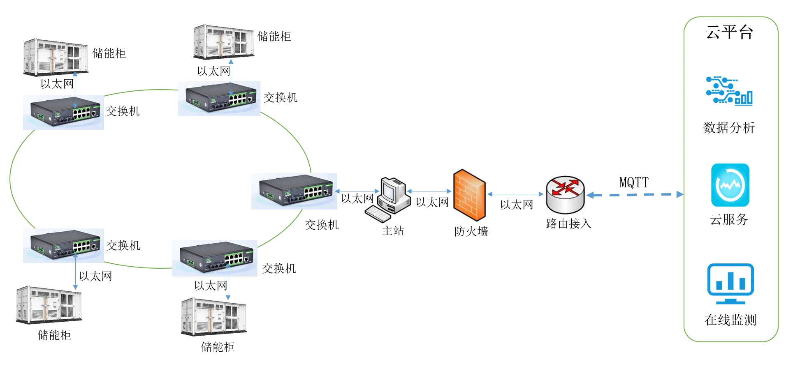

# Energy Storage System Ring Network Solution

## 1. Solution Overview

### 1.1 Project Background

The photovoltaic (PV) industry, also known as the solar industry, uses solar-grade semiconductor electronic devices to absorb solar radiation energy and convert it into electrical energy. As the renewable energy source with the greatest potential, solar energy is increasingly favored for its inexhaustible reserves, universal availability, clean utilization, and practical economics. Vigorously developing the PV industry and actively harnessing solar energy have received unprecedented attention worldwide and have become an important part of the sustainable development strategies of many countries. Energy storage plays a particularly critical role throughout the photovoltaic power generation process.

### 1.2 Construction Objectives

- Provide a stable and reliable data transmission channel for the energy storage system
- Support ring network redundancy to ensure network reliability

### 1.3 Applicable Scenarios

- Photovoltaic power generation energy storage systems
- Energy storage power station monitoring
- New energy power generation sites
- Network communication in harsh industrial environments

## 2. Requirements Analysis

### 2.1 Current Equipment Status

- Equipment types: energy storage systems, monitoring systems, industrial switches
- Communication interfaces: gigabit RJ45 network interfaces, single-mode single-fiber gigabit SC optical ports
- Communication protocols: 802.1Q VLAN, STP/RSTP/MSTP ring network redundancy protocols, ITU-T G.8032
- Deployment environment: harsh industrial environments such as power, transportation, and industrial applications
- Quantity and scale: multiple sub-station rooms serving as sub-units of the monitoring system

### 2.2 Core Requirements

1. **Temperature adaptability**: support normal operation under harsh temperatures of at least -40 to +50°C
2. **Optical port requirements**: support 2 or more single-mode single-fiber gigabit SC optical ports, accessible via optical modules, with a transmission distance of 20 km or more
3. **Optical module requirements**: the optical modules must be wide-temperature optical modules, supporting a temperature range of at least -40 to +50°C
4. **Network port requirements**: support 4 or more gigabit RJ45 network interfaces
5. **Network management requirements**: support Web-based management
6. **Protocol requirements**: support Layer 2 switching protocols such as 802.1Q VLAN and ring network redundancy protocols

## 3. Overall Architecture Design

Each sub-station room serves as a sub-unit of the monitoring system and is connected in a ring topology, ultimately enabling the monitoring system in the main control room to remotely monitor, control, and manage all points. In the system, the InHand Networks ISM5010D-S industrial-grade managed switch—designed to meet the demands of harsh industrial environments such as power, transportation, and industrial applications—is deployed. The switches are redundantly interconnected in a ring topology using existing spare optical fibers plus optical modules. Meanwhile, the Spanning Tree Protocol (STP) is enabled on the switches to ensure network reliability, and VLAN partitioning is used to logically isolate different applications to safeguard application data security.

### 3.1 Four-Layer Architecture

1. **Perception layer**: energy storage system equipment, on-site monitoring equipment
2. **Network layer**: ISM5010D-S industrial-grade managed switches, supporting ring network redundancy and optical fiber interconnection
3. **Platform layer**: main control room monitoring system
4. **Application layer**: remote monitoring, control and management, data analysis

### 3.2 Data Flow

Energy storage equipment → ISM5010D-S switches (ring network interconnection) → main control room → remote monitoring/control and management

## 4. Network and Access Solution

### 4.1 Networking Method Selection

An industrial Ethernet ring network topology is adopted. The switches are redundantly interconnected in a ring topology via optical fiber plus optical modules, and the STP/RSTP/MSTP spanning tree protocols are enabled to ensure network reliability.

### 4.2 Edge Device Selection Highlights

**ISM5010D-S industrial-grade managed switch features**:

- Supports normal operation under harsh temperatures of at least -40 to +50°C, with actual wide-temperature operation from -40 to +85°C
- Supports 2 or more single-mode single-fiber gigabit SC optical ports, accessible via optical modules, with a transmission distance of 20 km or more
- The optical modules are wide-temperature optical modules, supporting a temperature range of at least -40 to +50°C
- Supports 8 RJ45 gigabit Ethernet interfaces and 2 gigabit optical ports, offering high network scalability
- Supports Web-based management and multiple management methods such as console
- Supports Layer 2 switching protocols such as 802.1Q VLAN and ring network redundancy protocols
- Supports the open international standard protocol ITU-T G.8032, with a ring network self-healing time of <5 ms
- Supports STP/RSTP/MSTP ring network redundancy protocols for high network reliability
- The product complies with FCC, CE, and ROHS standards
- Features a rugged metal enclosure and protective coating that resists pressure and corrosion, with IP40 protection against dust and contamination
- EMC rating reaches industrial level 4, providing the high stability required in industrial sites
- Operates normally under harsh conditions of 5–95% humidity (non-condensing)

## 5. Protocol and Data Acquisition Solution

### 5.1 Supported Protocols

- **Layer 2 switching protocols**: 802.1Q VLAN, STP/RSTP/MSTP
- **Ring network protocol**: ITU-T G.8032 (ring network self-healing time <5 ms)
- **Management protocols**: Web-based management, console management

### 5.2 Northbound Protocol Support

- Supports Web-based management protocols
- Supports enhanced network management protocols
- Supports VLAN partitioning for logical isolation of applications

## 6. Solution Highlights Summary

1. **Wide-temperature adaptability**: supports wide-temperature operation from -40 to +85°C and normal operation under harsh conditions of 5–95% humidity (non-condensing), meeting the requirements of harsh industrial environments such as power, transportation, and industrial applications

2. **High ring network reliability**: supports the open international standard protocol ITU-T G.8032, with a ring network self-healing time of <5 ms. Supports STP/RSTP/MSTP ring network redundancy protocols for high network reliability

3. **Rich interfaces**: supports 8 RJ45 gigabit Ethernet interfaces and 2 gigabit optical ports, offering high network scalability

4. **Network security**: supports the 802.1Q VLAN protocol and can logically isolate different applications through VLAN partitioning to safeguard application data security

5. **Industrial-grade quality**:

   - The product complies with FCC, CE, and ROHS standards
   - Features a rugged metal enclosure and protective coating that resists pressure and corrosion, with IP40 protection against dust and contamination
   - EMC rating reaches industrial level 4, providing the high stability required in industrial sites

6. **Convenient management**: supports enhanced network management protocols and multiple management methods such as Web and console

7. **Long-distance transmission**: supports single-mode single-fiber optical module access, with a transmission distance of up to 20 km or more
