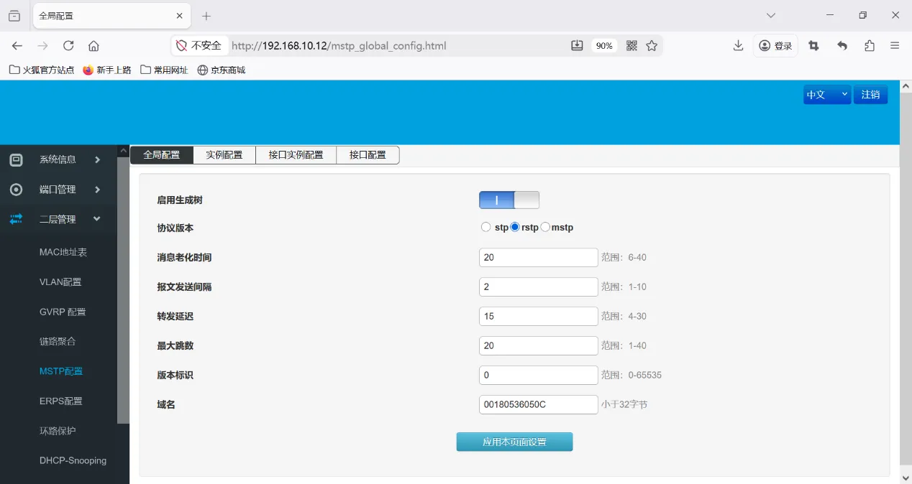

# ISM5010D Ring Network Configuration Guide

## 1. Document Information

- Document name: Switch Ring Configuration Guide
- Product model: **ISM5010D**
- Applicable scenario: device networking
- Date of preparation: March 25, 2026

## 2. Device Overview

### 2.1 Product Introduction

The InHand Networks ISM5010D is a **managed industrial Ethernet switch** whose primary function is to build a reliable and manageable industrial data communication network. It features **8 gigabit electrical (copper) ports and 2 gigabit optical (fiber) ports**, and supports redundant power supplies, wide-temperature operation (-40°C to +75°C), and fanless cooling, making it suitable for network connectivity in harsh environments such as wind power generation and smart manufacturing.

### 2.2 Main Functions

- Device ring networking
- Wide-temperature industrial-grade design

### 2.3 Typical Application Topology

Device → Ethernet → energy storage controller → Ethernet → server

## 3. Hardware Description

### 3.1 Appearance and Interfaces

- Power interface: DC 12–48V
- Interfaces: 2 optical + 8 electrical
- Indicator lights: PWR, RUN, network port indicators
- Reset button: restore factory settings

### 3.2 Wiring Instructions

#### 3.2.1 Power Wiring

- Positive terminal: V+
- Negative terminal: V-
- Note: reverse-polarity protection, lightning protection, grounding

#### 3.2.2 Ethernet Wiring

Auto-MDI/MDIX (straight-through/crossover auto-sensing). Cat5e or better cable is recommended.

## 4. Factory Default Parameters

- Default IP: 192.168.10.12
- Subnet mask: 255.255.255.0
- Web username: admin
- Web password: admin

## 5. Preparation

- Set the computer to an IP address on the same network segment as the gateway
- Connect the computer to the gateway LAN port with a network cable
- Power on the switch and wait for the RUN indicator to stay steadily lit
- Enter the device IP in a browser to access the configuration page

## 6. Network Configuration

### 6.1 Rapid Spanning Tree (RSTP) Configuration

Port configuration

Enable loop protection

## 7. Configuration Backup and Restoration

- Export the configuration file
- Restore factory configuration

## 8. Status Monitoring and Diagnostics

### 8.1 Operating Status

- Device online status

### 8.2 Log Viewing

- System logs

## 9. Common Issues and Troubleshooting

### 9.1 Unable to Open the Web Interface

- Unable to open the Web interface
  - Check whether the network segment, network cable, and IP address conflict
  - Reset the switch and try again

## 10. Safety Precautions

- Ensure reliable grounding at the industrial site
- Back up after completing the configuration
- Change the remote access password regularly
- Prohibit operation by unauthorized personnel
