# **About the platform**  

The InCloud Manager is a cloud-based network management platform. Integrating InHand edge routers and AP, it helps enterprises build a modern network environment and quickly realize digital retail and office. InCloud Manager supports enterprises to migrate network and application management to the cloud, enhancing the IT capabilities of the company to enable employees to focus on higher-value tasks.  

# 

**Quick Guide**  

**Definition of Terms**  

1.  **Company/Enterprise:** When you successfully register with your email in the system, it creates an company/enterprise for you. Data between different company/enterprises is completely separate.

1.  **Organization:** After successfully registering your company/enterprise, it defaults to being a top-level organization. Depending on your business needs, you can create other organizations within this top-level organization. The top-level organization has the highest data permissions and can access all data within the current organization. Lower-level organization can only see data from their own organization and any subgroups, without access to data from higher-level organization.

1.  **Internal Users:** Users belonging to the current company/enterprise.

1.  **External Users:** Individuals outside the current company/enterprise cannot access its data by default. However, based on specific business needs, such as providing technical support, these individuals can be invited to access the company/enterprise data.

### 1\. Organization Management  

In the InHand Cloud Service, the "**User**" page allows control over your organization's structure and users. This service supports multiple levels of organization. When managing business by regions or locations, you can create several subgroups for independent management. At the same level, organizations' data is separate; however, higher-level organizations can view data from lower-level ones.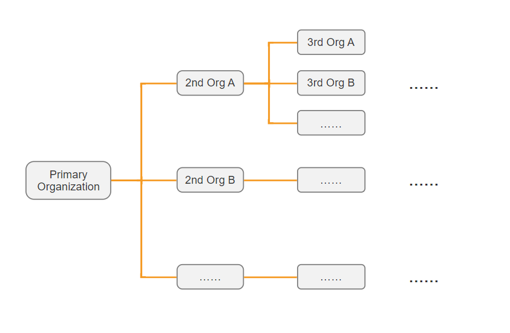

**1.1** **Add Organization**  

Click "**Add** ", enter the organization name, choose the parent organization, and then click "**OK**" to create an organization. Each institution can create up to five levels of organizations.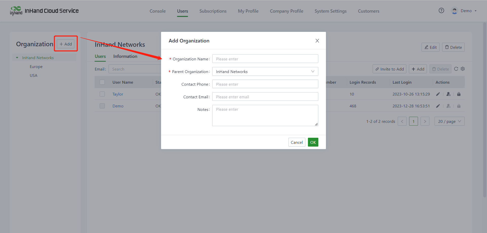

  

| Field Name | Description |
| --- | --- |
| Organization Name | Custom organization names. |
| Parent Organization | The current organization's parent within the hierarchy. Higher-level organizations have access to all data within their suborganizations. |
| Contact Phone | Organization's contact phone number. |
| Contact Email | Organization's contact email. |
| Notes | Organization's description. |

  

**1.2 Add User**  

In the user list, click "**Add**" and input user details. After successful addition, users can log in to the platform using their account and password. Page permissions for users are determined by their assigned roles. Users can only access data authorized for their current organization. For instance, if a user is in Suborganization A at the tertiary level, they can solely view data within Suborganization A and its lower-level suborganizations, without access to data from primary, secondary organizations, or other tertiary organizations.  

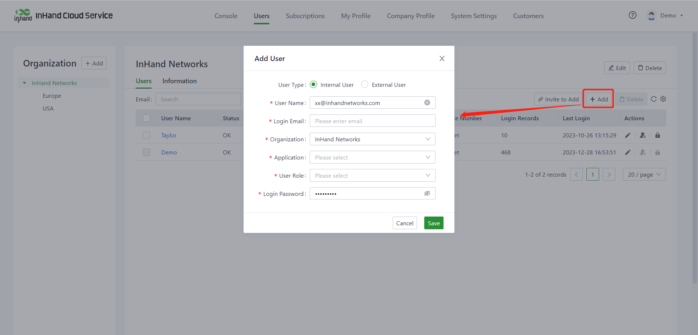

  

| Field Name | Description |
| --- | --- |
| User Name | User's name. |
| Login Email | User's email information, used for platform login and receiving platform notifications. |
| Organization | For the organization associated with the current account. Users can view resources such as devices within their current organization and its subordinate organizations. |
| Application | All applications provided by InHand Cloud Service, including InCloud Manager, DeviceLive, and others. |
| User Role | According to your selected application, corresponding roles will be displayed. InCloud Manager comprises four roles—refer to the roles section. |
| Login Password | The password used for logging in. To ensure your account's security, please set a login password according to system requirements. Safeguard your account credentials and periodically update your password for security reasons. |

  

**1.3** **Organization Data Management**  

Administrators from higher-level organizations can allocate authorized resources to lower-level organizations, including devices, groups, networks, users, and more.

**1.3.1** **Device Transfer**  

You can transfer devices within the organization to a lower-level organization or a specific group by following these steps:  

1.  Go to the "**Devices**" page in InCloud Manager.  
    
2.  Select the device(s) you want to transfer.  
    
3.  Click "Move," select the target organization, and then click "**Save**."
    

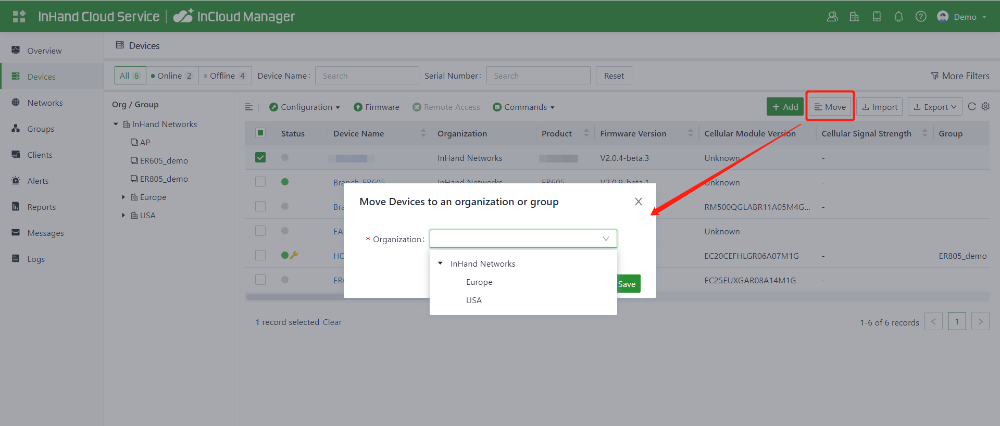  

  

**1.3.2** **Network Transfer**  

You can transfer networks within the organization to a lower-level organization by following these steps:  

1.  Go to the "**Networks**" page in InCloud Manager.  
    
2.  Click on the "**Edit**" button for the network you want to transfer.  
    
3.  Choose the target organization and click "**Save**."  
    

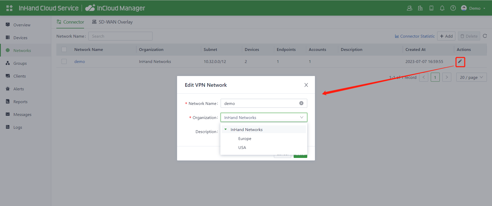  

**1.3.3 Group** **Transfer**  

You can transfer groups within the organization to a lower-level organization by following these steps:  

1.  Go to the "**Groups**" page in InCloud Manager.  
    
2.  Click on the "**Edit**" button for the group you want to transfer.  
    
3.  Choose the target organization and click "**Save**."

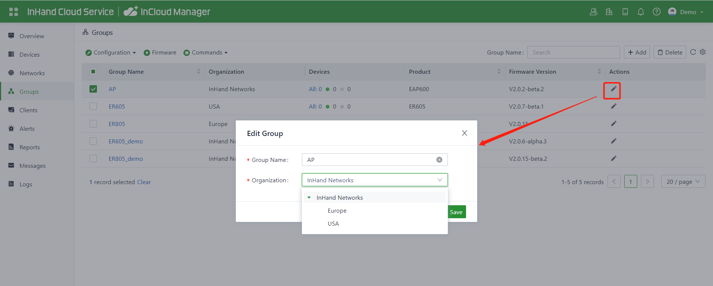  

**1.3.4** **User Transfer**  

You can transfer users within the organization to a lower-level organization by following these steps:  

1.  Go to the "**User**" page in InHand Cloud Service.  
    
2.  Click on the "**Edit**" button for the user you want to transfer.  
    
3.  Choose the target organization and click "**Save**."

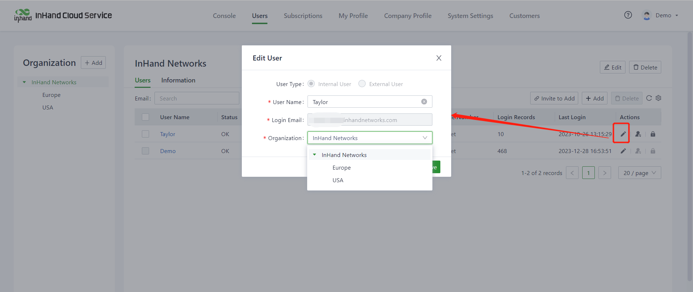

### 2.Cross-Organization Access  

When your management requirements are met:  

1.  Administrators can view all devices and resources.
2.  Devices across different projects require separate management.
3.  A single engineer maintains multiple projects, and there is overlap in the projects maintained by engineers.  
    

As shown below: The General Manager needs to view data from all departments, while each department manager needs to view data specific to their own unit. Engineer 01 manages Project 1 and Project 2, while Engineer 02 manages Project 3 and also needs to manage Project 2.  

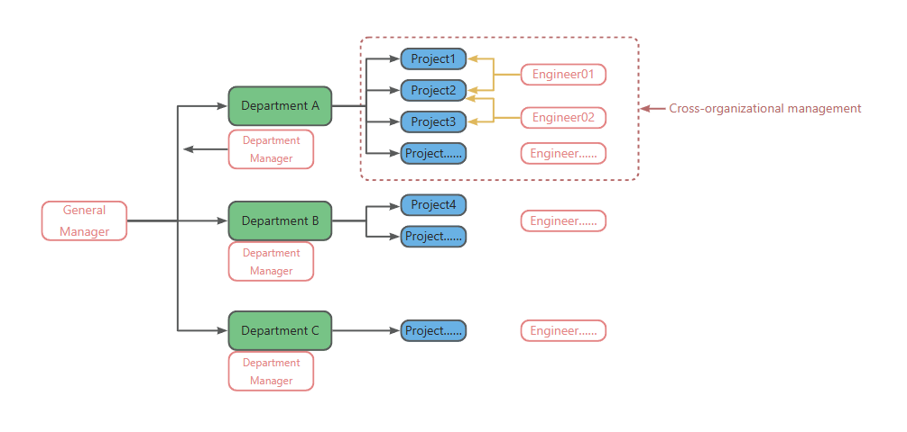  

On the InHand Cloud Service, you can add Engineer 01 to the organizations of Project 1 and Project 2, and add Engineer 02 to the organizations of Project 3 and Project 2. This fulfills the requirement for one engineer to manage multiple projects. Follow these steps:  

1\. Enter Project 1 and add Engineer 01 as an internal user.

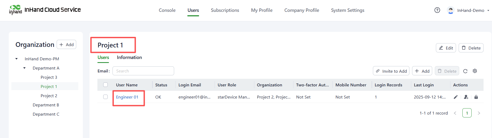  

2.Enter Project 2 and add Engineer 01 as an external user.  

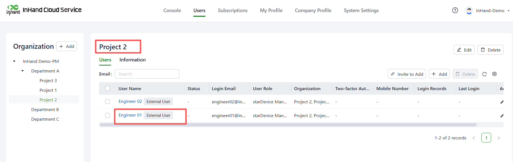  

3.Similarly, add Engineer 02 to Project 2 and Project 3.  

4.After logging in, Engineer 01 can use the “Switch Organization” feature to switch between different projects for device management.  

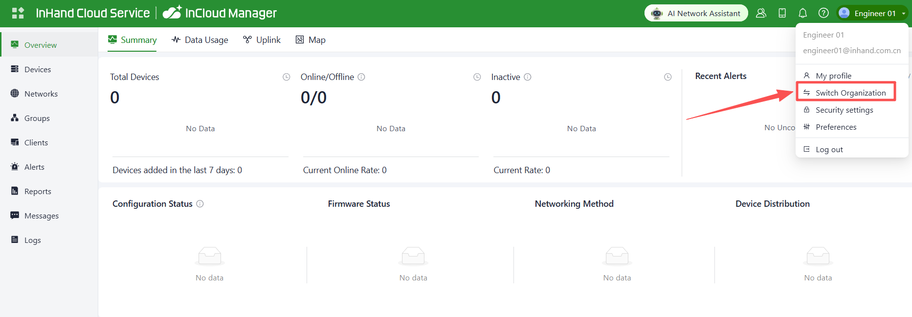

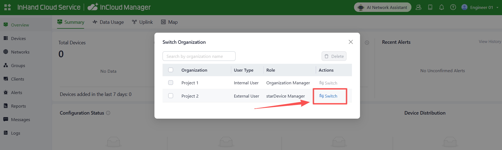  

  

### 3.Cross-company Access

When a company requires your technical support, besides creating another account for you or providing their account (internal user), the company's administrator can invite you to join their organization using the "external user" method if you have a registered email account in InCloud Manager. This approach ensures the security of the customer's account while facilitating your support provision.  

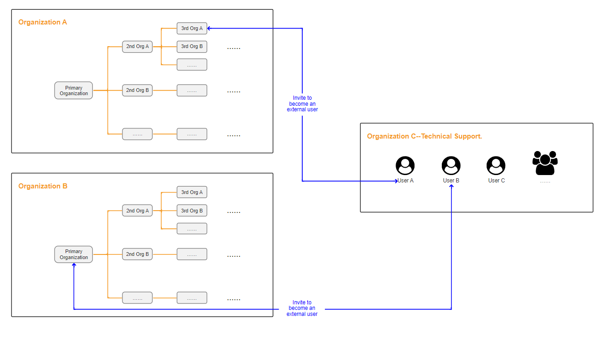  

Invite External User Procedure (Using the example of Organization A inviting User A from Organization C to provide support in InCloud Manager):  

1.  Administrators from Organizations A navigate to the "Users" page in InHand Cloud Service.  
    
2.  In the user list, click "**Add**."  
    
3.  Choose the user type as "**External User**."  
    
4.  Enter the email login of User A in InCloud Manager.  
    
5.  Select the relevant organization where User A will provide support, for instance: Suborganization A in level three.  
    
6.  Choose the application as "InCloud Manager."  
    
7.  Select the user role and **save**.

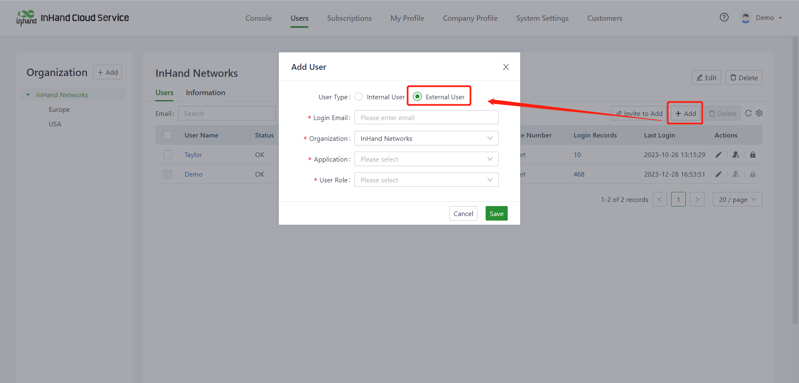  

User A will receive an invitation email. After accepting the invitation, User A can switch to Organization A to provide technical support, following these steps:  

1.  Log in to InCloud Manager.  
    
2.  Click on the profile icon at the top right corner of the page, then click "**Switch**."  
    
3.  In the organization switch popup, select Organization A, and click "**Switch**" to successfully switch to Organization A for providing technical support.  
    

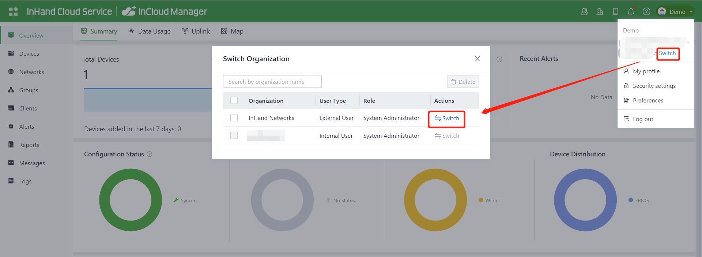  

# 1. **Login to InCloud Manager** 

## **1.1 Registration**

To access InCloud Manager using a web browser, visit the platform at [https://star.inhandcloud.com.](https://star.inhandcloud.com/) This will take you to the registration and login page for InCloud Manager (we recommend using Google).

## **1.2 Login**

After successful registration, you can log in using your account and password. Once logged in, you will access the **Console** page for InHand Cloud Service. Click on **'Access'** under 'InCloud Manager' to enter InCloud Manager.

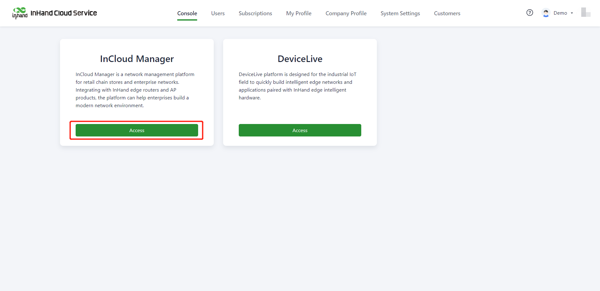

  

You can also directly log in to InCloud Manager by visiting [https://star.inhandcloud.com/](https://star.inhandcloud.com/).

For your account's security, after logging in, you can access the **Security Settings** page to change your password and link your mobile phone number. After linking your phone number, you can log in to the cloud platform using your phone number next time.

  
If you wish to access Device Manager or InConnect via InHand Cloud Service, [click here](https://help.inhand.com/portal/en/kb/articles/access-to-device-manager).

# **2.****Organizations & Accounts**

Click "**Users**" to enter InHand Cloud Service, and you can manage your accounts in the system.

Describe account management, user operate permissions controlled by role, user data permissions controlled by organization, and external accounts in the system.   

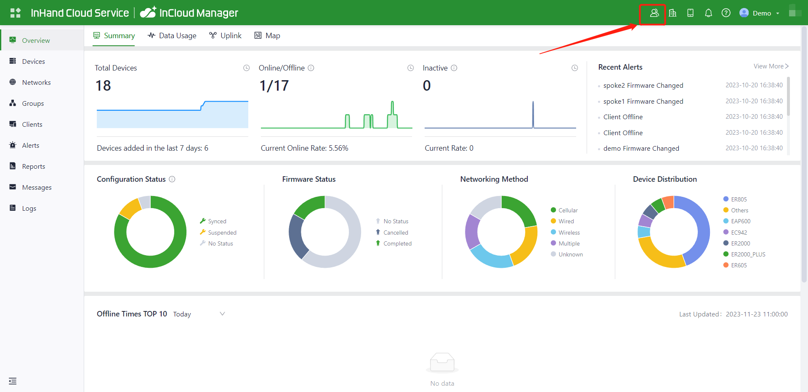

  

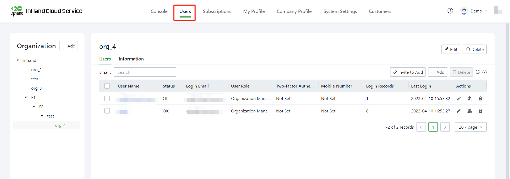  

## **2.1 Accounts**

Click **Users** at the top of InCloud Manager to manage the organization and user information of the system.

### **2.1.1 Add Users**

**1.Add Users**  

In the user list, click "**Add**," and enter the user information as follows:  

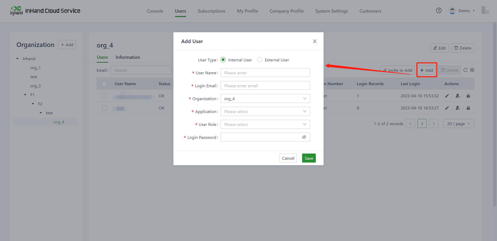  

  

| Field Name | Description |
| --- | --- |
| **User Name** | The name of the current user. |
| **Login Email** | The user's email information is used for logging into the platform and receiving messages from the platform. |
| **Organization** | Belongs to the organization associated with the current account. Users can view resources such as devices within the current organization and its subordinate organizations. |
| **Applications** | All applications provided by InHand Networks Cloud Services, including InCloud Manager, DeviceLive, and more. |
| **User Roles** | The roles available in InCloud Manager may vary depending on the selected application. |
| **Login Password** | The password is used for logging in. For the security of your account, please set a login password according to the system requirements. Please keep your account password secure and change it regularly. |

**2.Invite**

Click on "**Invite**", enter organization and role information, copy the link to the user. The user can register an account using that link, and after registration, the user's account will be automatically added to the list.  

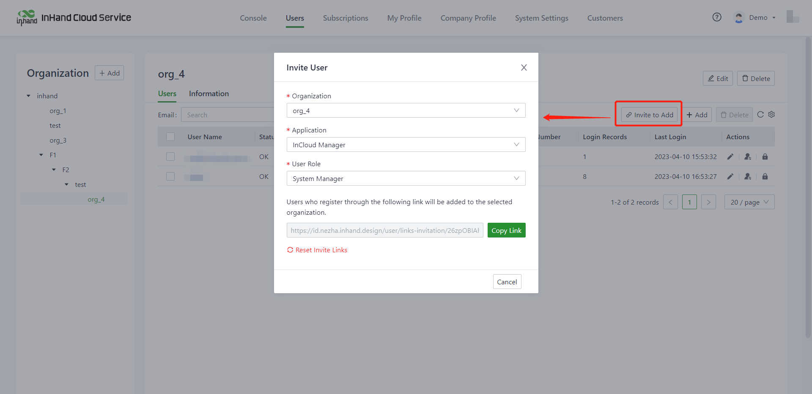  

### **2.1.2 User Roles**

The system provides four roles: system administrator, organization manager, device full access, and device read only . The functional permissions of each role are as follows:  

| Role | Functionality Permission |
| --- | --- |
| system administrator | Have all the functions and data permissions of current registered account. |
| organization manager | 1.  Users of this role have all functionality permissions in InCloud Manager, but only have functional permissions for Console，Users and My Profile pages in InHand Cloud Service.        2.  Users of this role can view resources from the current organization and sub-organizations, and have the permission to operate these resources. |
| device full access | 1.  Users of this role have all functionality permissions of these pages: Overview, Devices, Networks, Groups, Clients, Alerts, Reports, Messages, Console, My Profile. 2.  Users of this role can view resources from the current organization and sub-organizations, and have the permission to operate these resources. |
| device read only | 1.  Users of this role have the "view" functionality permissions of these pages: Overview, Devices, Networks, Groups, Clients, Alerts, Messages, Console, My Profile. 2.  Users can create and download reports for authorized resources. 3.  Users of this role can view resources from the current organization and sub-organizations, but don't have the permission to operate these resources. |

### **2.1.3 Assign Roles**

Admin can assign roles to other users.Each user can only have one role in an application.A new role assignment will overwrite the current role.

If you assign a user the role of system administrator, the user has the highest permission in all applications of the InHand Cloud Service.

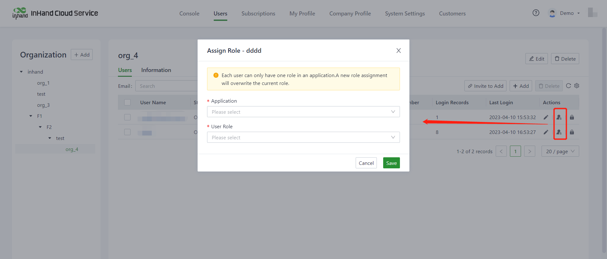  

  

### **2.1.4 Delete Users**

Select the target user and click **Delete**. Confirm the delete operation to delete the user.

### **2.1.5 Lock Users**

Admin accounts can lock other accounts to prevent accounts from logging into the platform.

On the Accounts page, click the "**Lock**" button in the "Operation" column to lock the account. If you need to unlock the account, click "**Unlock**" and the account can resume login.

## **2.2 My Profile**

After logging into InCloud Manager, click on the application switch icon in the top left corner to access the InHand Cloud Service. From there, you can navigate to the "**My Profile**" page to change your account login password, link your mobile phone number, and set up two-factor authentication. Alternatively, you can click on the account icon in the top right corner, then scroll down and select "Security Settings".

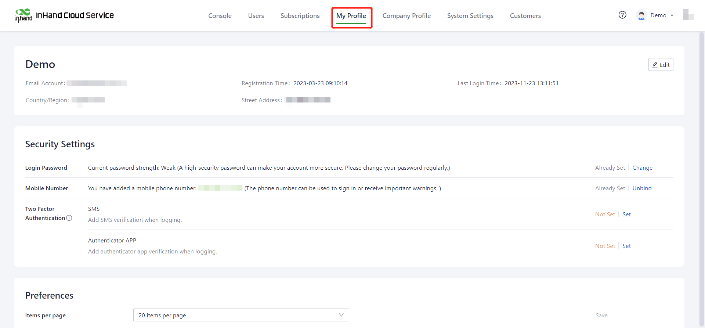  

### **2.2.1 Change Login Password**

Passwords with high security can make your account more secure. We recommend that you change your password regularly.

Click **Change**, enter the current password of your account to verify your identity. Enter the new password and **confirm** it.

### **2.2.2 Mobile Phone Binding**

After binding the mobile phone number, you can use the mobile phone number and SMS verification code to log on to InCloud manager. Or you can use this phone number to receive alert messages when configuring alerts.

### **2.2.3 Two-factor Authentication**

To enhance account security, you can set up two-factor authentication (2FA) using multiple methods. This allows you to have a backup authentication method in case you lose your device or cannot access the app for verification.

**1.SMS Verification**

1. Click on "**Settings**" and follow the prompts to bind your mobile phone number. After successfully binding your phone number, you will receive a verification code on your bound phone number during subsequent logins for two-factor authentication.

2. If you no longer wish to use SMS verification, you can click on "**Disable**" to turn off SMS verification.

**2.APP Verification**

1. Click on "**Settings**" and follow the prompts to download and install the Google Authenticator or Microsoft Authenticator app on your mobile phone.

2. Open the app and **scan the QR code** on the screen to set up your account.

3. After scanning the code, enter the **6-digit code** displayed in the app to verify your identity. Once verified, the app authentication is successfully bound to your account. You will need to enter the 6-digit code from the app for two-factor authentication during login.

4. If you no longer wish to use app authentication, you can click on "**Disable**" to turn off app authentication.

**3.Recovery Code Verification**

When setting up two-factor authentication for the first time, you will also receive a backup code. This backup code can be used in case you are unable to receive SMS codes or use the authenticator app. You can use this backup code to bypass two-factor authentication during login by selecting "Use Backup Code.

### **2.2.4 Preferences**

Set the default number of items displayed per page in the current account list.  

  

## **2.3 System Settings**

Administrators can go to the System Settings page to set **Idle T****imeout** and **Force MFA** for the entire organization.  

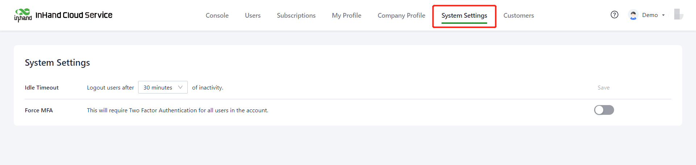  

**1.Idle Timeout**

After setting, if the idle timeout of the account in the whole organization exceeds the setting time, you will need to log in again to access it.

**2.Force MFA**

After opening，this will require Two Factor Authentication for all users in the account.  

  

## **2.4 Organizations**

InCloud Manager supports multi-level organizations. Users, devices, and other resources belong to a specific organization; users of one organization can view the devices and other data of this organization and its subordinate organizations. You can use this function to realize the data access control of different users. The isolated management of multiple sub-customers can make the data management more organized and the privacy security of the account more secure.

### **2.4.1 Add organizations**

On the "**Users**" page, click "**Create**" to add a new organization, you need to select the parent organization of the organization. By default, the organization where the account is registered is the root organization.

### **2.4.2 Devices with Organizations** 

On the Devices page, adding and importing devices will assign the devices to the operator's organization by default. You can modify the device's organization.

1\. Select the device, click "**Move**", then select the organization or the group you want to move in

2\. After selection, save the changes. Then the device is moved to the new organization, and only users within the same organization can view the device on the "Devices" page.

### **2.4.3 Groups with Organizations** 

On the **Groups** page, click add and then select the organization the group is in. Only users within the same organization can view these groups on the Groups page, and the devices within these groups can also be seen by these users on the Devices page.

### **2.4.4 Networks with Organizations** 

On the Networks page, click **add** and then select the organization the network is in. Only users within the same organization can view these networks on the "Networks" page. They can operate the devices, endpoints, and accounts in the network. When a user has the permission of a network but does not have permission for the devices that are within the network, the user can only operate the devices from the network dimension and cannot view the device on the "Devices" page or operate the devices through InCloud Manager.

### **2.4.5 Users with Organizations**

On the Users page, click add and then select the organization the group is in. The data resources an account can view (including devices, groups, networks, and users) are the data within the same organization that the user is in and its subordinate organizations. Particularly, users within the root organization can view all the data in the current registered account, which includes all devices, groups, networks, and users.

## **2.5 Company Profile**  

Click "**Company Profile**" in InCloud Manager's top menu to handle the current organization's information in InHand Cloud Service.  

  

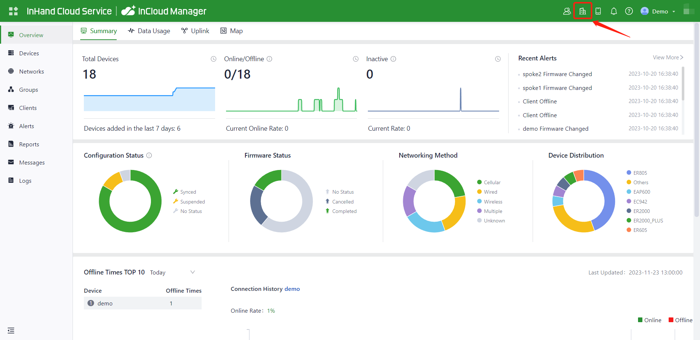  

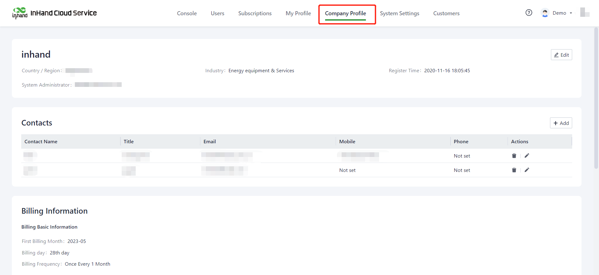  

Company information management includes the following details：  

1.  **Basic Information**: such as company name, region, and system administrator.
2.  **Contacts**: the enterprise's contact information.
3.  **Billing Information**: including billing dates and invoice mailing details.
4.  **Shipping Information**: the details of the recipient and address for the current enterprise.
5.  **Associate an MSP Account**: By inputting the MSP's email account in InCloud Manager. Once linked, MSP can transfer devices and licenses to your account.

## **2.6 External Users**  

If an external user with a registered email account in InCloud Manager needs to join your organization to provide external support, you can invite them by adding them as an "**External User**" to your current organization.

1. Go to the "**Users**" page and click on "**Add**" above the user list.

2. Select the user type as "**External User**".

3. Set the external user's login email, organization, application, and role information, then click "**Save**".

4. The external user will receive an email invitation. After accepting the invitation, the user will be able to switch to your organization to provide technical support.  

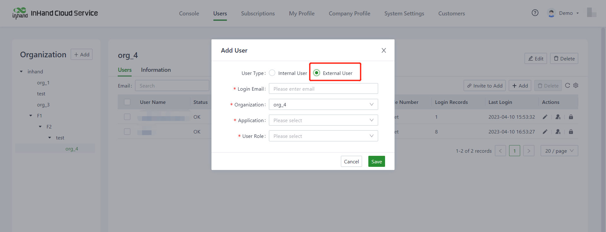  

┃**Note** ：To ensure data security, it is important to carefully configure user roles and organizational relationships when creating external users. This helps control the access and operational permissions of external users within your organization.  

  

External users switching organizations should follow these steps:  

1.  External users must first accept the email invitation and then log in to InCloud Manager.  
    
2.  Click on the personal information at the top right corner of the page, then click "Switch."  
    
3.  In the organization switch dialog box, select the organization requiring assistance, and click "Switch" to successfully transition and provide technical support for the corresponding organization.  
    

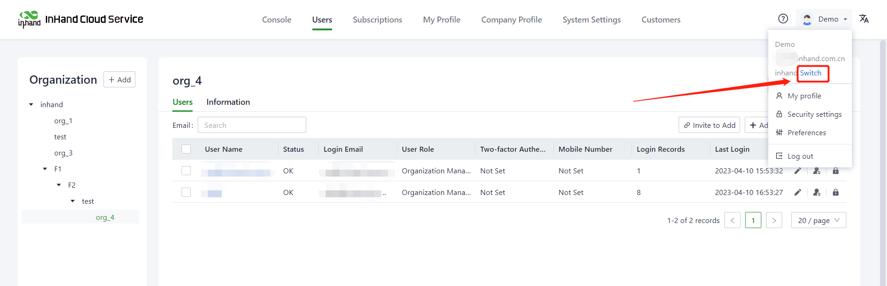  

# 3\. Device networking

After connecting to InCloud Manager, devices will automatically synchronize their configurations to enable cloud-based management. Steps for connecting devices to the platform:

1\. Configure cloud management locally on the device.

2\. Add the device to the platform.  

## **3.1** **Configuring an Internet Connection**

To enable cloud-based management, it is essential to ensure that the device is connected to the internet. Configuration methods may vary across different product series; please refer to the configuration steps for the specific product series you are using. Additionally, please note that interface variations may exist due to different firmware versions. For illustrative purposes, we will use the ER805 product series as an example.

**Method 1: Ethernet connection**

Environment: Use network cables to connect the PC to the LAN1 interface of ER805 and connect the WAN1 interface to the Internet.

Set an IP address in the 192.168.2.X network segment for the PC, such as 192.168.2.100. Set the mask to 255.255.255.0. You can also use the default function of automatic DHCP-based IP address acquisition. Type [https://192.168.2.1](https://192.168.2.1) in Google Chrome. The following page appears:  

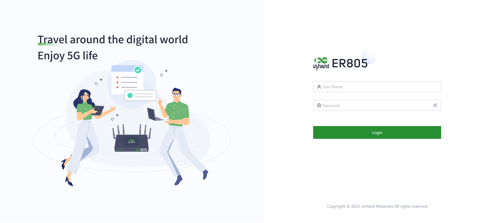  

  

**DHCP** ： The device automatically connects to the Internet without manual operations if the WAN interface can automatically obtain an IP address over DHCP.  

**Static IP address** ： Click **Internet** in the left-side navigation pane. Set **WAN1** to **static IP** mode and set the IP address to the public IP address and mask.

**PPPoE** ： Support WAN port broadband access, PPPoE dial-up access.  

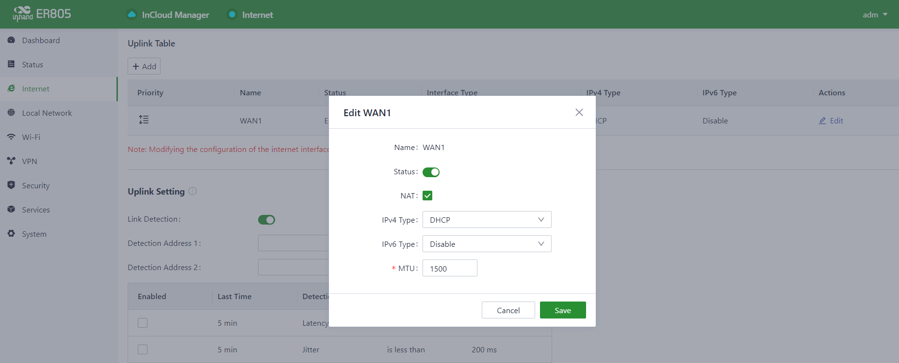  

**Method 2: Cellular Connectivity**

In most cases, simply inserting a SIM card will establish a network connection. If you have custom requirements, you can configure APN parameters in the "**Internet >> Cellular**" popup to enable connectivity.

 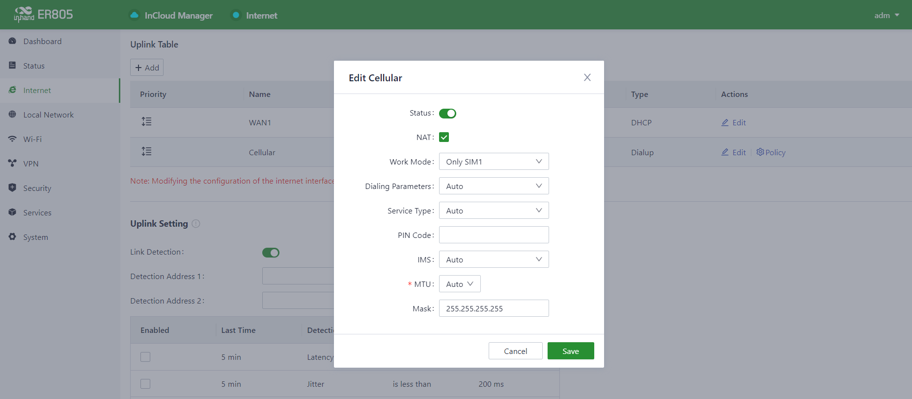

**Method 3: Wi-Fi (STA) Connectivity**

Under the **Internet** menu, click the **Add** button to create a Wi-Fi (STA) connection. Configure the relevant parameters to connect it to the on-site SSID for internet connectivity.  

 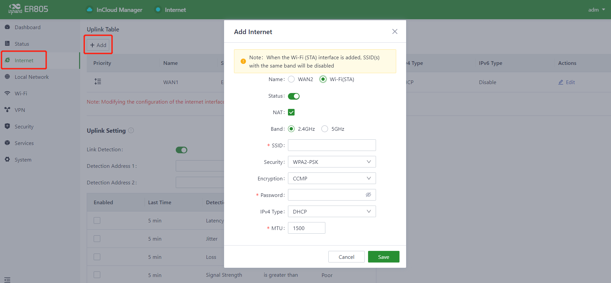  

## **3.2 Adding Devices to the Platform**

Once the device is connected to the network, you can add it to the platform. After successful addition, the device will automatically synchronize with the platform, allowing for cloud-based management of the device. Here are the steps for adding a device:

(1) In the "**Devices**" menu, click on "**Add**."

(2) In the window, enter the **device name** and **serial number**, then click "**Save**."

(3) Once added, the device will appear in the list of devices.  

# 4. **Overview**

InCloud Manager offers an overview feature that allows you to easily monitor real-time information such as device status, data usage, uplink, and device distribution under your account.  

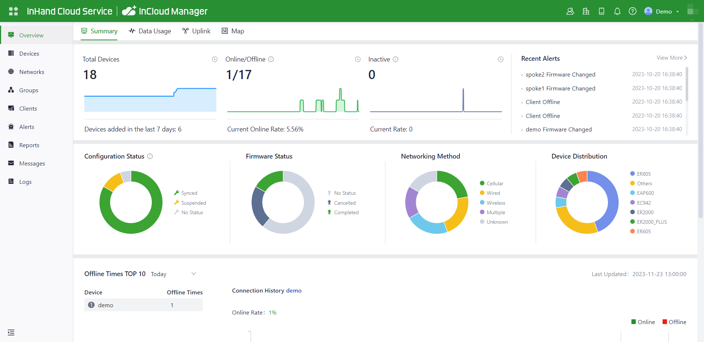  

  

## **4.1 Summary**

The **overview** page displays essential information including the number of devices, their online status, and upgrade status under the current account.

| Function Modules | Description |
| --- | --- |
| **The number of devices** | **Total Devices**: Displays the total number of devices on the platform and the number of devices added in the last 7 days.  **Online/Offline**: Shows the number of devices that are currently online and offline on the platform.  **Inactive**: Displays the number of devices that have been added to the platform but have never been online. It also supports viewing historical records of devices that were never activated. |
| **Recent Alerts** | To view the latest alert information for all devices/networks under the platform, click '**View More**' to navigate to the alert details. |
| **Configuration Status** | Device Configuration Synchronization Status Ratio Information, including the following configuration states:   1.  **No Status**: Indicates that the device has never online or it’s status is unknown.  1.  **Suspended**: Represents the status when the configuration synchronization between the platform and the device is paused due to a mismatch in device and group versions. It automatically resumes synchronization when the device and group versions are consistent.         1.   **Pending**: Indicates that the device and the platform are currently synchronizing configurations.         1.   **Synced**: Denotes that the device and platform configurations have successfully synchronized.         1.  **Sync Failed**: Indicates that the configuration synchronization between the device and the platform has failed. |
| **Firmware Status** | Firmware Upgrade Status Ratio Information for Devices, including the following firmware upgrade states:  1.  **Scheduled**: Refers to upgrade tasks that are planned but have not yet started.  1.  **Pending**: Indicates that the upgrade is pending execution.  1.  **Upgrading**: Means the upgrade is currently in progress.  1.  **Completed**: Indicates that the upgrade task has been successfully completed.  1.  **Cancelled**: Denotes that the upgrade task has been canceled.  1.  **Failed**: Represents a failed upgrade task.  1.  **No Status**: Refers to devices that have never come online or have an unknown status. |
| **Networking Method** | Device networking method include:    1.  **Unknown**: Refers to the connectivity method when the device has never come online.  1.  **Wired**: Represents connectivity through Ethernet.         1.  **Cellular**: Denotes connectivity through cellular networks.  1.  **Wireless**: Indicates connectivity via Wi-Fi (STA).  1.  **Multiple**: Refers to the simultaneous presence of two or more connectivity methods. |
| **Device Distribution** | Distribution of device models across the account. |
| **Offline Times TOP 10** | View detailed connection information for the top 10 devices with the highest number of offline occurrences on the platform. |
| **Alerts TOP 10** | 1.  **Alerts TOP 10 by Device**: Refers to the top 10 devices ranked by the number of alerts.  1.  **Alerts TOP 10 by Type**: Indicates the top 10 alert types ranked by occurrence. |

  

## **4.2 Data Usage**

The **Data Usage** page allows you to view the total data usage of all devices under the account and supports viewing by network connectivity type. Basic information includes:  

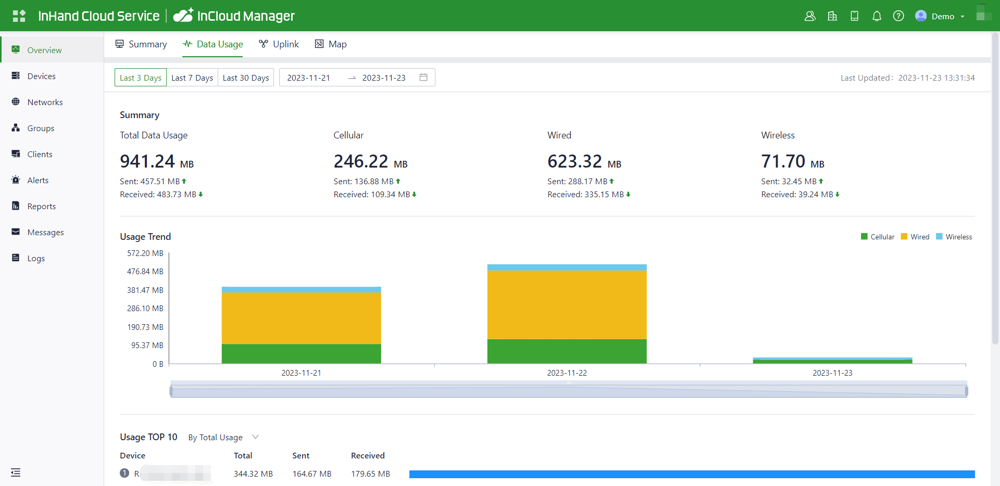  

  

  

| Function Modules | Description |
| --- | --- |
| **Summary** | Total data usage, cellular data usage, wired data usage, and wireless data usage information for all devices. |
| **Usage Trend** | Data usage trends over time for all devices. |
| **Usage TOP 10** | The top 10 devices ranked by data usage and their corresponding data usage information. |

  

## **4.3 Uplink**

Uplink for all devices, with specific details as follows:  

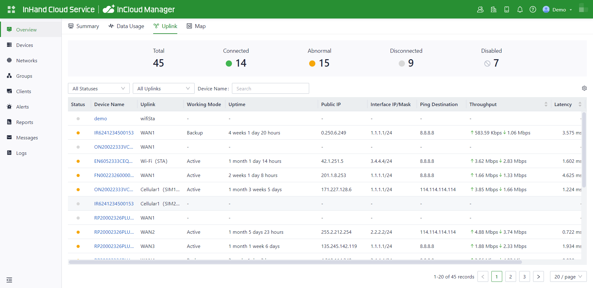  

| Field Name | Description |
| --- | --- |
| **Status** | The device's uplink status include:  1.  **Connected** 2.  **Disabled** 3.  **Disconnected**  ┃**Note:** Due to the device reporting the latest link information every 30 minutes, there may be a delay in this status. |
| **Uplink** | Types of uplink include:  1.  **WAN** 2.  **Cellular** 3.  **Wi-Fi** **（STA）** |
| **Working Mode** | 1.   **Active** ：Active indicates that the current link is the primary link.        2.  **Backup** |
| **Uptime** | The connection duration of the current link. |
| **Public IP** | Public IP information for the current link. |
| **Interface IP/Mask** | Interface IP/Mask for thecurrent link. |
| **Throughput** | Throughput for thecurrent link. |
| **Latency** | Latency for thecurrent link. |
| **Jitter** | ┃**Note:** This metric is not available for cellular and Wi-Fi links. |
| **Loss** | ┃**Note:** This metric is not available for cellular and Wi-Fi links. |

## **4.4 Map**

You can view the actual locations of all devices and their distribution on the **Map** page.  

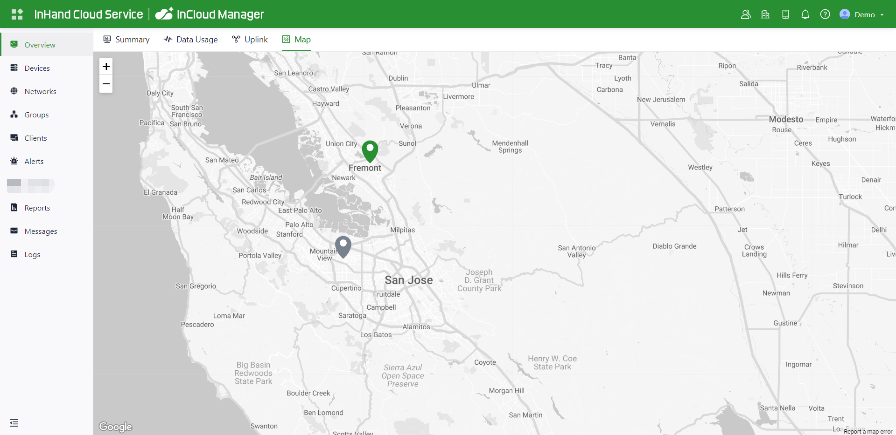  

# **5.Devices**  

The device page allows you to view the basic information of all devices and supports operations such as remote configuration, firmware upgrades, remote access, commands, add, delete, move, import, export, and filter.  

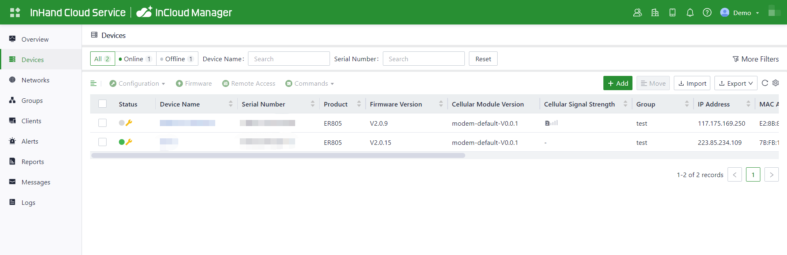  

## **5.1 Device Management**

### **5.1.1** **Devices List**

The information displayed in the device list is as follows:

| Field Name | Description |
| --- | --- |
| **Status** | The device online/offline status, where green represents online and gray represents offline. |
| **Device Name** | The name that you set for the device when adding the device. |
| **Serial Number** | Indicates the unique ID of a device. |
| **Organization** | The name of the organization where the device is currently located. |
| **Product** | Indicates the device model. |
| **Firmware Version** | Indicates the current firmware version of a device. |
| **Cellular Module Version** | The current cellular module version of a device. |
| **Cellular Signal Strength** | The signal strength of a cellular card. |
| **Group** | The group to which a device belongs. |
| **IP Address** | The public address that a device uses to connect to the Internet. |
| **MAC Address** | The physical MAC address of a device. |
| **ICCID** | The unique ID of a SIM card. |
| **Config Status** | 1.  **Unknown**: Indicates that the platform has never retrieved the device's configuration synchronization status, represented by "-".  1.  **Synced**: Means that the platform and the device have completed the configuration synchronization.  1.  **Pending**: Implies that the platform has modified the device's configuration, but the device has not yet synchronized the platform's configuration.  1.  **Sync Failed**: Suggests that there is a conflict between the platform and device configurations. In this case, an "Error Details" will appear after synchronization failure. Clicking on it will open a window displaying error details, allowing users to resolve conflicts based on the error information.  1.  **Suspended**: When the device's firmware version does not match the firmware version of its group, the platform's configuration changes will not synchronize with the device. This status will persist until the device and group versions are aligned. |
| **Firmware Status** | Firmware upgrade status for devices include:  1.  **Completed**: Indicates that an upgrade task exists and that upgrade is successful.  1.  **Failed**: Indicates that an upgrade task exists and that upgrade fails.         1.  **Pending**: Indicates that an upgrade task exists and that upgrade will be performed.  1.  **Upgrading**: Indicates that an upgrade is being performed.  1.  **Cancelled**: Indicates that an upgrade task exists but is canceled. |
| **Networking Method** | Networking method for devices include:  1.  **WAN1** 2.  **WAN2** 3.  **SIM1** 4.  **SIM2** 5.  **Wi-Fi(STA)** |
| **Location** | The part displays the geographic location of a device. |
| **Description** | Description information when adding a device. |
| **Actions** | 1.  **Delete**: Click the "**Delete**" button, and after a secondary confirmation, the target device will be removed from the platform.  1.  **Config Details**: Click "**Config Details**" to view the configuration details of the target device. |

  

### **5.1.2 Add Device**

Click '**Add**' on the **'Devices'** menu page. In the '**Add Device**' popup, enter the **device name**, **serial number**, and **MAC address**, then click '**Confirm**'.

### **5.1.3 Import Devices**

Click **'Import'** on the **'Devices'** menu page to bulk add devices to the cloud platform.

1. Click **'Import'** at the top right of the device list.

2. **Download** the import template and fill in device information according to the template.

3. Click '**Upload File**'， select the file, and then click **'Import**'.

┃**Note:** When there are errors in the imported file, the page will provide notifications of successful and failed imports, along with the row numbers where the failures occurred.

### **5.1.4 Export Devices**

Click the **'Export'** button to export the existing device asset information from the platform in table format.

### **5.1.5 Move Devices**

Click **'Move'** on the 'Devices' menu page to move devices to a specific organization or a subgroup within an organization.

1. Select the devices you want to move in the device list.

2. Click **'Move'** at the top right of the device list.

3. Choose the **target organization** or **group** and click **'Save'**.

┃**Note:** Only devices from the same product can be added to a group. When the device's firmware version does not match that of the group, the configuration changes made on the platform will not synchronize with the device.  

## **5.2 Configuration**

In the device list, you can perform remote configuration operations on individual devices, including editing configuration, viewing configuration, clearing configuration,copying configuration, and more.

### **5.2.1 Edit Configuration**

The device list supports editing device configurations. After editing and submitting the configuration, the new configuration will be pushed to the device. The configuration edited here is the device's personalized configuration.

1. Select the **target device**.

2. Click **'Configuration'** at the top of the device list and choose the **'Edit'** operation.

3. Change the configuration in the editing configuration popup, and after making changes, click **'Commit Charges'**.  

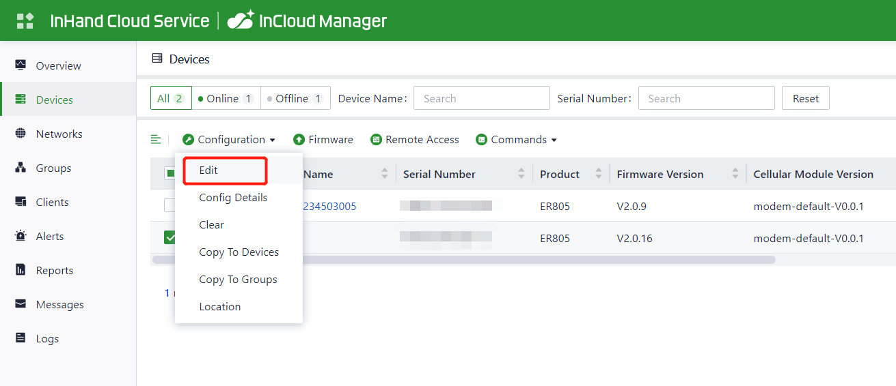  

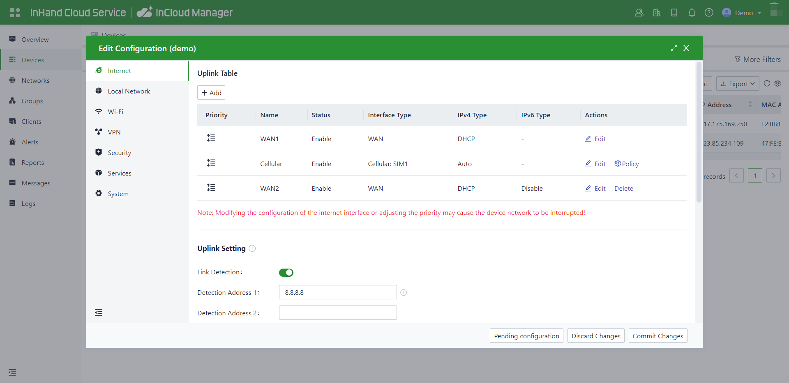  

In the editing configuration popup, the following operations are supported:

1. **Pending**: Click the **'Pending Configuration'** button, and the configuration modified during this session will be saved in the platform backend but not yet pushed to the device.

2. **Discard Changes**: Click **'Discard Changes'**, and the operations made during this session will be cleared.

3. **Commit Changes**: Click **'****Commit Changes****'**, and the configuration changes made during this session will be applied to the device.

┃**Note:**  

      ① Devices must be online on the platform, and the current firmware version must support remote configuration.

      ② When the device's configuration synchronization status is 'Suspended', the platform's configuration will not be pushed to the device.  

  

### **5.2.2 Config Details**

The device list allows you to view the configuration information of the target device, including: Running Configuration, Individual Configuration, Group Configuration, Target Configuration, and Pending Configuration.

1. Select the **target device**.

2. Click **'Remote Configuration'** at the top of the device list and choose **'Configuration Details'.**

3. In the configuration details popup, you can view all the configuration information for the current device. Configuration information includes:

1.  **Running**: The current configuration that the device is running, including any configuration changes made by the user on the device locally or in the cloud.
2.  **Individual**: Configuration information made on the individual device's editing interface or local interface. Personalized configurations take precedence over group configurations.
3.  **Group**: Displays the configuration information of the device's parent group.
4.  **Target**: The combination of personalized and group configurations that users expect the device to execute after making configuration changes. Target configurations can be customized to show/hide group configurations.
5.  **Pending**: Configurations modified by the user on the platform but not yet synchronized with the device.  
    

### **5.2.3 Clear Configuration**

Select the target device, click the **'Clear'** button, and after a secondary confirmation, the clear operation will be executed.

┃**Note:** The copy-to-devices operation copies the target configurations of a device to the individual configurations of the selected device.

### **5.2.4 Copy to Devices**

The **'Copy to Device'** operation allows you to copy the target configuration from the source device to the target device, and the copied configuration will be treated as the personalized configuration for the target device.

1. Select the source device.

2. Click **'Configuration'** at the top of the device list and choose **'Copy to Device'.**

3. In the popup, select the target device(s), you can select multiple, and then click **'Save'**.

### **5.2.5 Copy to Groups**

The **'Copy to Groups'** operation allows you to copy the target configuration from the source device to a group, and the copied configuration will become the group configuration for the selected group(s).

1. Select the source device.

2. Click **'Configuration'** at the top of the device list and choose **'Copy to Groups'**.

3. In the popup, select the target device group(s), you can select multiple, and then click **'Save'**.

### **5.2.6 Location**

Clicking will redirect to the map management page for the target device, where you can manage the device's location information using base station data or manual configuration.  

  

## **5.3 Firmware Upgrade**

The device list supports individual device firmware upgrades or batch upgrades for devices of the same model.

1. Select the devices for which you want to upgrade the firmware.

2. Click **'Firmware'** at the top of the device list.

3. In the firmware upgrade popup, select the **target firmware version**. If the selected device models are not consistent, you will need to select the product model for the upgrade first.

4. Choose the current firmware version that you want to upgrade.

5. Select the **upgrade time** and click **'Save'**:

1.  **Upgrade Now**: Online devices will immediately start the upgrade process, while offline devices will perform the upgrade upon their next online status.
2.  **Later Date**: Devices will perform the upgrade at the specified time. If a device is still offline at the specified time, it will execute the upgrade upon its next online status.

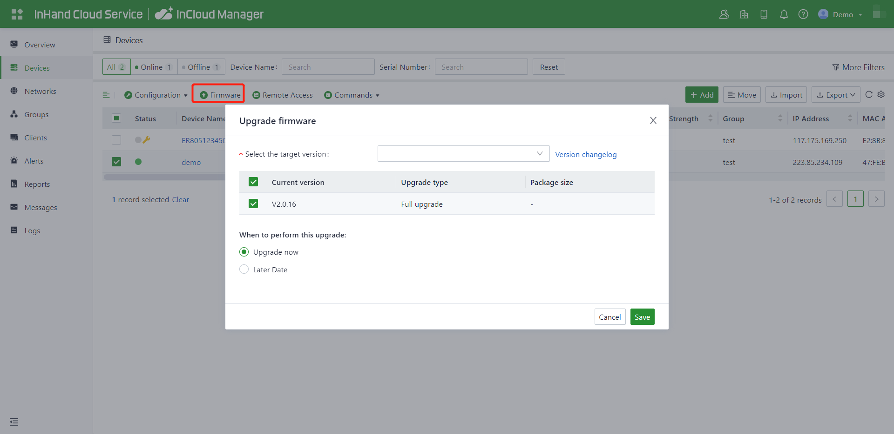  

## **5.4 Remote Access**

Users can select the target device in the **'Devices'** menu, click **'Remote Access',** and achieve remote access to the device's local interface.

┃**Note:**  

      ① Remote access functionality cannot be used when the device is offline.  

      ② Remote access consumes data traffic, so please avoid using it for extended periods if it is not necessary.  

  

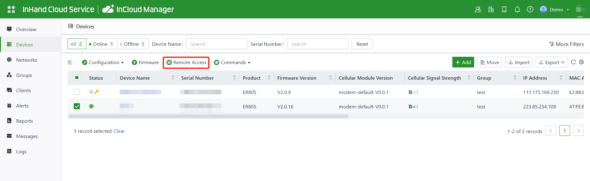  

## **5.5 Commands**  

### **5.5.1 Reboot**

Users can select the target device in the **'Devices'** menu, click **'Reboot'**, and after a secondary confirmation, the device will execute the restart operation.

┃**Note**: The device cannot be rebooted remotely when it is offline.  

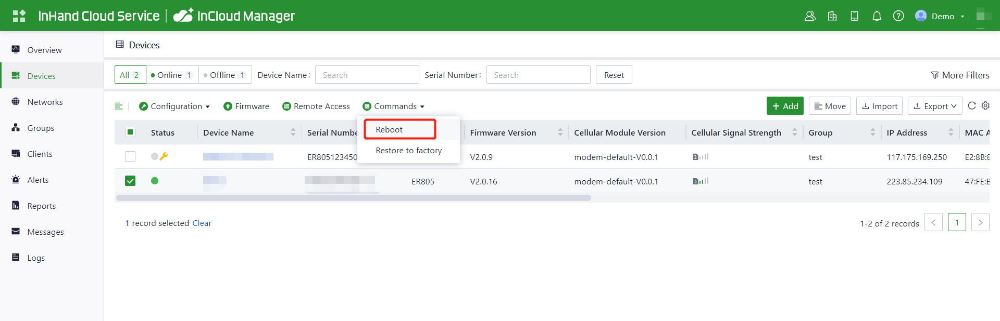  

### **5.5.2 Restore to Factory**

Users can select the target device in the **'Devices'** menu, click 'Restore to Factory', and after a secondary confirmation, the device will execute the factory reset operation.  

 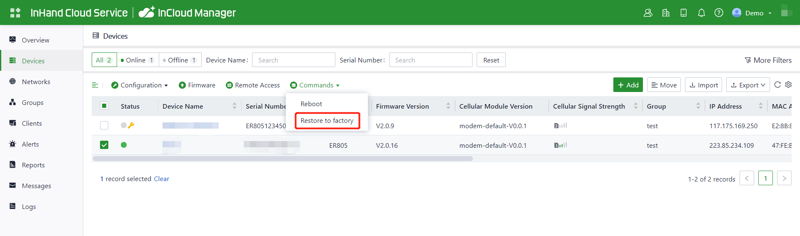  

┃**Note:**  

      ① The factory reset operation cannot be executed when the device is offline.  

      ② After a factory reset, historical data will be cleared, but upon the device coming online again on the platform, personalized configurations and group configurations will be reapplied.  

  

## **5.6 Device Details**

Clicking on the **'Device Name'** allows direct access to the device's detail page, where you can view the current device's overview, traffic, cellular signal, clients, and basic information.

### **5.6.1 Overview**

The **'Overview'** menu provides a view of the device's basic usage information, including interface status, uplink status, and connection history. Basic information is as follows:  

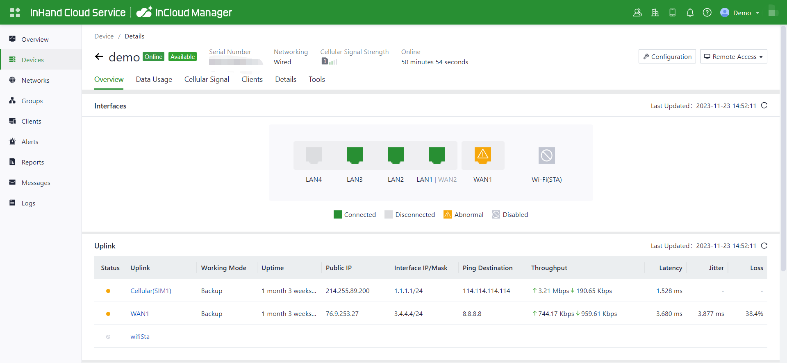  

  

| Function Modules | Description |
| --- | --- |
| **Interfaces** | Displays a simulation of the device interface's real-time connectivity. Click the **interface icon** to view the interface details. |
| **Uplink** | All currently existing links for the device. Clicking on the **uplink name** allows you to view detailed information about the link, including throughput, latency, and historical data. |
| **Connection History** | The historical information of the device's connections established with the platform. |

The detailed information for the uplink link is as follows:

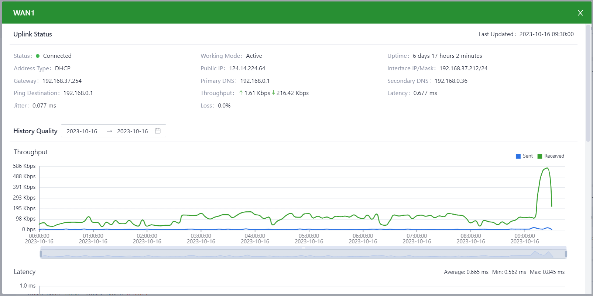  

### **5.6.2 Data Usage**

By clicking on the **'Data Usage'** menu, you can use a graphical interface to view the device's data usage from multiple perspectives, including data usage overview, usage trend, and usage trend by interface.  

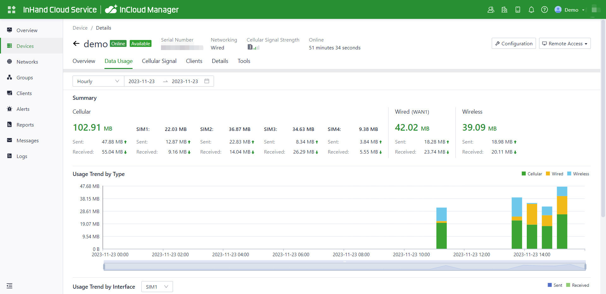  

### **5.6.3 Cellular Signal**

Display detailed data information for various cellular signal parameters to comprehensively analyze the current and historical network conditions of the cellular network. The displayed information includes signal level, RSSI, RSCP, EC/IO, RSRP, RSRQ, SINR, SS-RSRP, SS-RSRQ, and SS-SINR.  

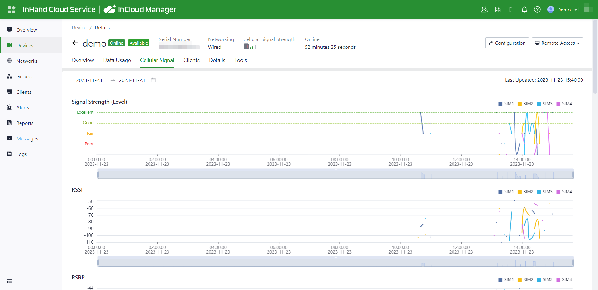  

Signal strength level classification explanation:

| Network Standard | Signal Strength Level Definitions |
| --- | --- |
| 5G | SS-RSRP values are used to categorize signal levels (unit: dBm)：  -   Excellent：(-31,-95\] -   Good：\[-96, -105\] -   Fair：\[-106, -115\] -   Poor： \[-116, -155\] -   No Signal：≤-156 |
| 4G | RSRP values are used to categorize signal levels (unit: dBm)：  -   Excellent：(-44,-95\] -   Good：\[-96, -105\] -   Fair：\[-106, -115\] -   Poor： \[-116, -139\] -   No Signal：≤-140 |
| 3G | RSCP values are used to categorize signal levels (unit: dBm)：  -   Excellent：(-25,-49\] -   Good：\[-50, -73\] -   Fair：\[-74 -97\] -   Poor： \[-98, -114\] -   No Signal： ≤-115 |
| 2G | RSSI values are used to categorize signal levels (unit: dBm)：  -   Excellent：(31,12\] -   Good：\[11, 8\] -   Fair：\[7, 5\] -   Poor： \[4, 1\] -   No Signal：≤0 |

┃**Note:** The device reports cellular signal data every 30 minutes, which means there may be a maximum delay of 30 minutes in the data.  

### **5.6.4 Clients**  

Click the **Clients** tab to view the connection information of online clients.  

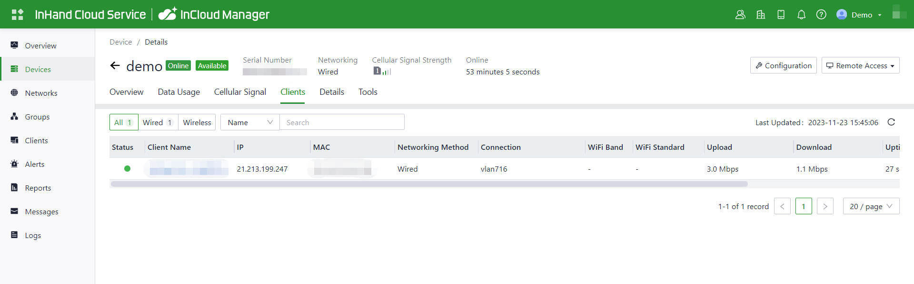  

### **5.6.5 Details**

Click the **Details** tab to view the device's basic information, license information, upgrade package information, physical location and etc.  

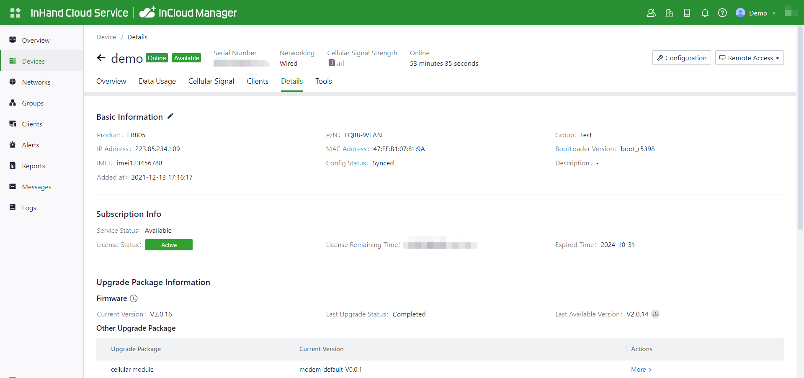  

### **5.6.6 Tools  
**

This function page provides users with a variety of troubleshooting tools. When the device encounters an abnormal situation, these tools can be used to analyze and identify the problem. 

┃**Note:** The support for diagnostic tools varies for different products/firmware versions. Please refer to the page's prompt information for details.

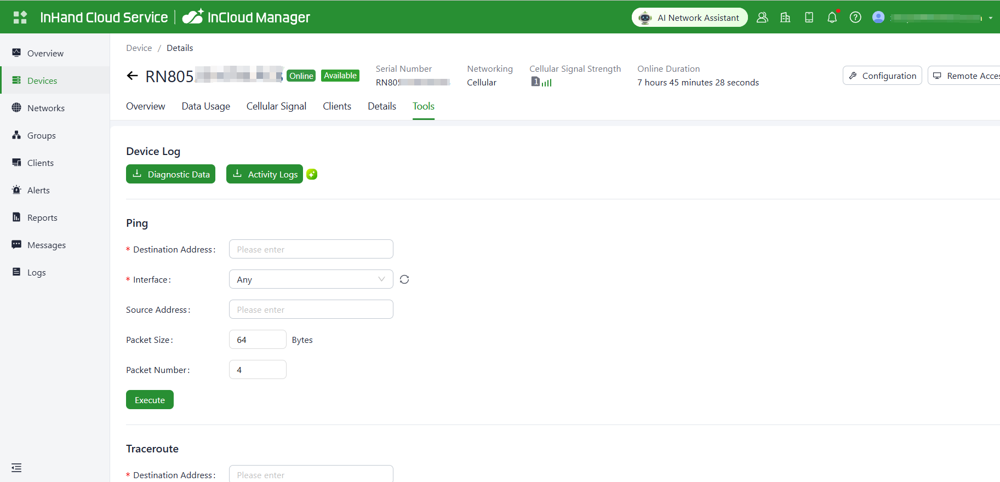  

1.Device Log  

The platform supports downloading the device's **activity logs** and **diagnostic logs**. You can download these logs to troubleshoot issues when the device experiences problems.  

1.  Diagnostic Data：Record the detailed log content of the device, including historical logs and bug information, etc.  
    
2.  Activity Logs：Record lightweight logs during the operation of the system.  
    

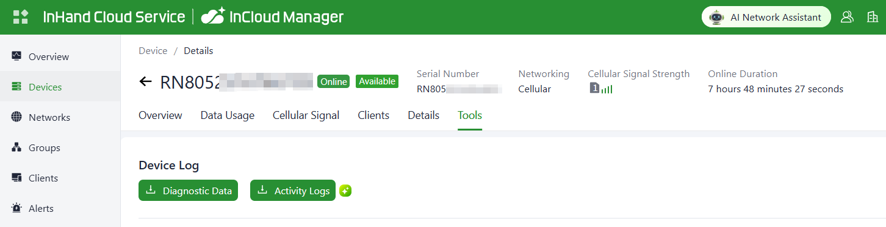  

┃**Note:**  

      ① You can download activity logs for up to the past 7 days.  

      ② Diagnostic logs are only available when the device is online.  

2.Ping  

Ping is a network management tool. It is used to test whether data packets can successfully reach another network device (the destination host) from the local computer (the source host), and to measure the time required for the round trip. When you need to check the network connectivity from the current device to a certain address, you can use this function.  

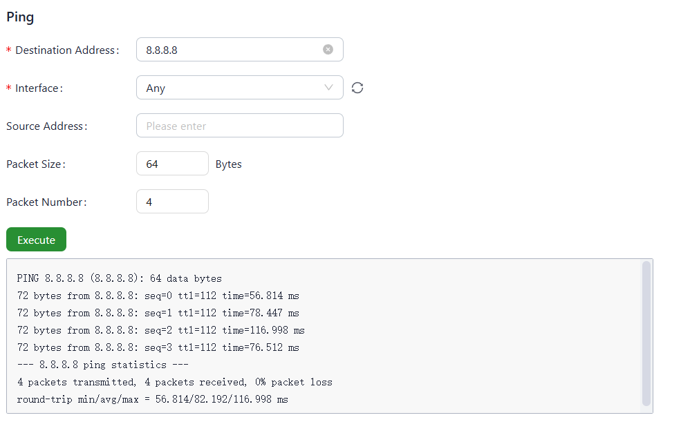  

3.Traceroute  

Traceroute is a network diagnostic tool. It is used to determine the network path that data packets take from the source to the destination, as well as each intermediate router or hop along this path. When you need to check the routing connectivity from your current device to the target address, you can use this function.  

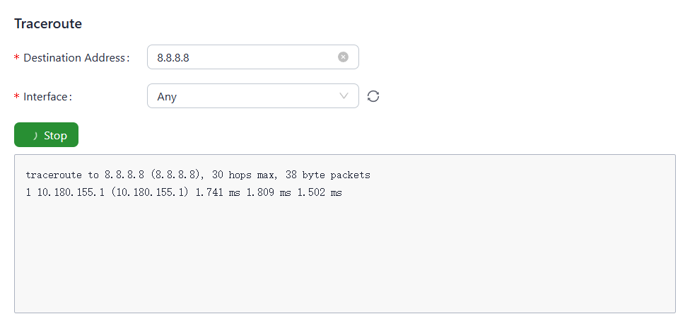  

4.Capture  

Packet capture is a network monitoring and analysis technique used to capture and record data packets transmitted through a computer network. This function can be utilized when you need to troubleshoot network issues, analyze network performance, conduct security audits, and perform protocol analysis.

During packet capture, you can specify a particular interface. After the capture is completed, you can download the captured file for analysis.  

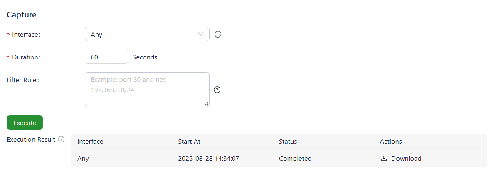  

  

5.Speed Test  

When you need to test the network quality of your device (download speed, upload speed, latency, etc.), you can use this function. Before starting the speed test, please configure the following parameters:

● Interface: Select the network interface that needs to be tested for speed;

● Server Node: Please click "Scan" first to obtain the latest speed test nodes. After obtaining them, the first node in the drop-down list is the optimal speed test node for the current interface.  

  

┃**Note:**

① Speed testing will occupy the network bandwidth of the device. It is recommended to perform the operation during off-peak hours when the system is not busy.

② Each speed test will consume tens to hundreds of megabytes of data. It is recommended not to perform frequent tests to avoid incurring high data charges.

③ Speed testing permission: By default, only the system administrator has the operation permission. If you need it, please contact your system administrator to "User Management >> User Details" to enable it for you.

④ The speed test results may be affected by the following factors. Therefore, the speed test results are for reference only and do not represent the network performance of the device itself.  

1.  Distance of the speed testing node: The farther the speed testing node is from the device, the slower the speed.
2.  Network congestion: The speed may decrease when testing during peak internet usage hours.
3.  Wi-Fi interference, carrier bandwidth limitations, and other factors.

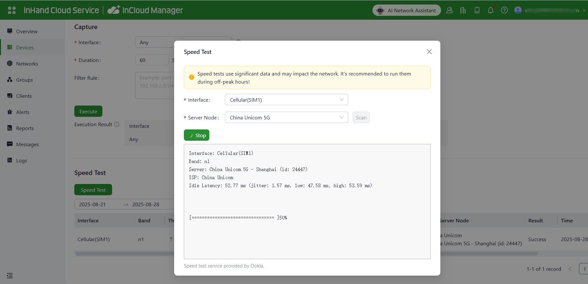

  

  

# **6.Networks**

This function module includes two types of networking applications: Connector Network and SD-WAN Overlay network.

| Type | Use Cases |
| --- | --- |
| **Connector** | 1.  **IoT-like applications:**         1.  The data of the endpoints is continuously reported to the business data center. 2.  The business data center continuously obtains data from the endpoints. 3.  Remote access to the endpoints connected to the router. |
| **SD-WAN Overlay Network** | 1.  **Branch Network Applications:**         1.  Distributed chain store networking.        2.  Distributed office networking.  1.  **IoT application:**  1.  The data of the endpoints is continuously reported to the business data center. 2.  The business data center continuously obtains data from the endpoints. 3.  Remote access to the endpoints connected to the router. |

## **6.1 Connector**

A Connector network has three types of resources: devices, endpoints, and accounts. The respective functions are as follows:

| resource | Description |
| --- | --- |
| **devices** | Networking devices such as routers and gateways. |
| **endpoints** | The business terminal connected to the router or gateway, such as PLC and IP telephone. |
| **accounts** | The account used by the engineer or administrator to establish VPN tunnels. |

**【Procedure】**

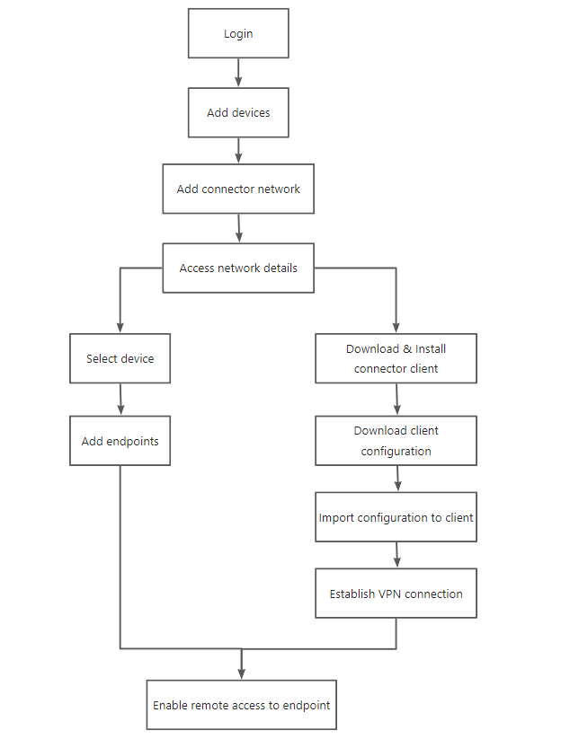  

### **6.1.1 Configure**  **Network**

To access the **'Connector'** page, click on **'Add'**, enter network information such as the network name, and click **'Save'** to create a new cloud connection network.

### **6.1.2 Configure Device**

To add devices to the connector network, follow these steps:

1. Click on the **'Add'** action in the upper right corner of the device list.

2. In the **'Add Devices'** popup, select the devices you want to add to the current connector network.

3. Configure the device's subnet address to establish a VPN communication tunnel. There are two ways to assign subnet addresses:

1.  **Auto**: The system automatically assigns addresses to devices.  
    
2.  **Manual**: In cases where specific subnet addresses are required, you can define the subnet addresses yourself. The allowable range for subnet addresses is: 10.16.32.0/24-10.31.255.0/24.  
    

After devices are added, the system automatically assigns a virtual IP to each device and establishes a VPN connection tunnel. When the VPN channel for device cloud connectivity is online, users can use this virtual IP to remotely access the local web management interface of the router device.  

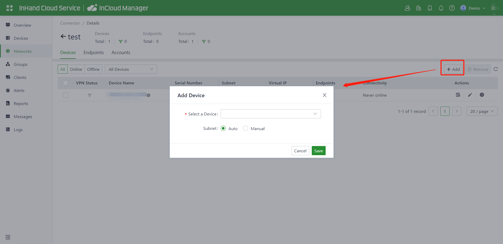  

┃**Note:** A maximum of 4,000 devices and accounts can be added to a connector network.

### **6.1.3 Configure Endpoint**

To add endpoint resources to the connector network, follow these steps:

1. Click on the **'Add'** action in the upper right corner of the endpoint list.

2. In the **'Add'** popup, enter the **endpoint name** and **LAN IP**.

3. Select the device to which the endpoint belongs.

4. Configure the endpoint's **virtual IP** to enable remote communication through the router's VPN communication tunnel. There are two ways to assign virtual IP to endpoint:

1.  **Auto**: The system automatically assigns virtual addresses to endpoints.  
    
2.  **Manual**: In cases where specific virtual IP are required for endpoints, you can define them yourself. The allowable range for virtual IP is: x.x.x.2-x.x.x.254.  
    

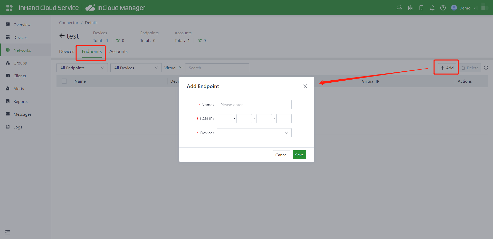  

┃**Note:** A maximum of 243 endpoints can be added to a connector device.

### **6.1.4 Configure Account**

**1、 Add an account**

When accessing the Connector network details, go to the **'Accounts'** page to add accounts to the Connector network.

1. Click on the **'Add'** action in the upper right corner of the Accounts list.

2. In the 'Add Account' popup, enter the **account name**.

3. Configure the **virtual IP** for the account to establish a VPN communication tunnel through the virtual IP and InCloud Manager. There are two types of virtual IP assignment:

1.  **Float IP**: A floating IP is not pre-assigned and is dynamically allocated based on server availability when the account connects.  
    
2.  **Static IP**: In cases where specific virtual IP are required for the account, you can define them as static IP. Once defined, they will not change. The allowable range for virtual IP is: 10.16.0.2-10.16.15.255.  
    

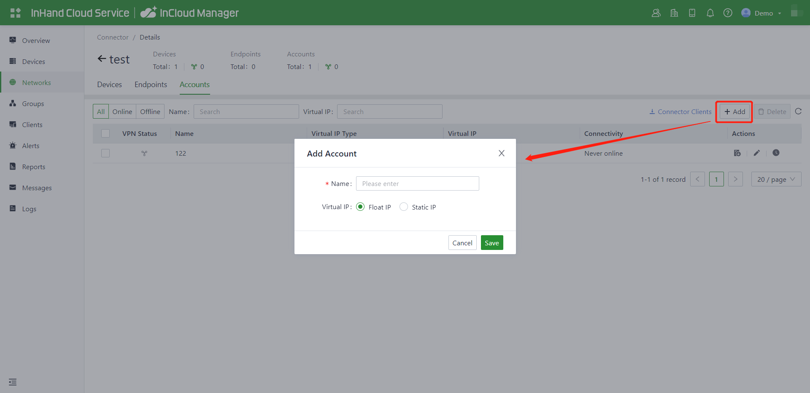  

┃**Note:** A maximum of 4,000 devices and accounts can be added to a connector network.  

**2、 Connect the account to the client**

After the account is added, you must use the connector client to establish a VPN tunnel. The platform supports MacOS, Windows, iOS, and Android clients.Below is an example of Windows operation:

1\. **Download the Windows client:** Access the Connector Network details, go to the **'Accounts'** tab, and click on the Connector Client to **download the Windows version**.

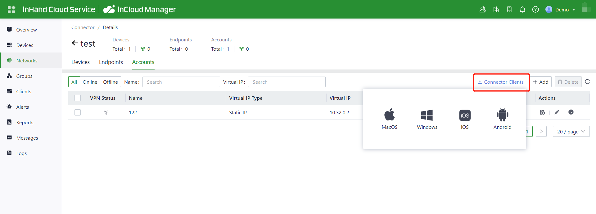  

2\. **Download the client configuration file:** On the **'Accounts'** tab, select an account, and **download** the corresponding client configuration.  

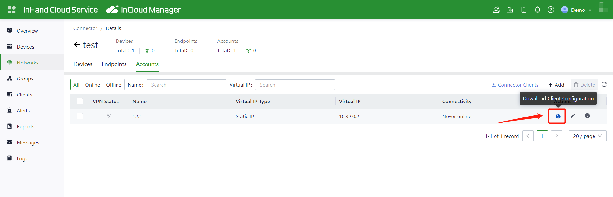  

3\. After the client has installed well, open the client software, import the client configuration file, and then click "**CONNECT**" to establish the VPN tunnel between the account and InCloud Manager. Next, you can use this VPN tunnel to remotely access your endpoints under the device or download and upload data.

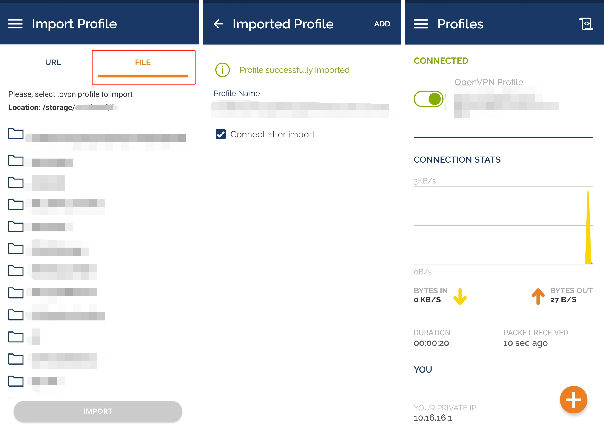  

### **6.1.5 View Connection Records**

Both devices and accounts can view the history of connector, which can assist in analyzing business trends or identifying abnormal nodes. The recorded information includes historical connection status, duration of individual connections, total VPN traffic, and uplink and downlink traffic of a single connection.

To access the connector history, go to the connector network details and click on the **'Connection History'** option in the device list and account list operations column.  

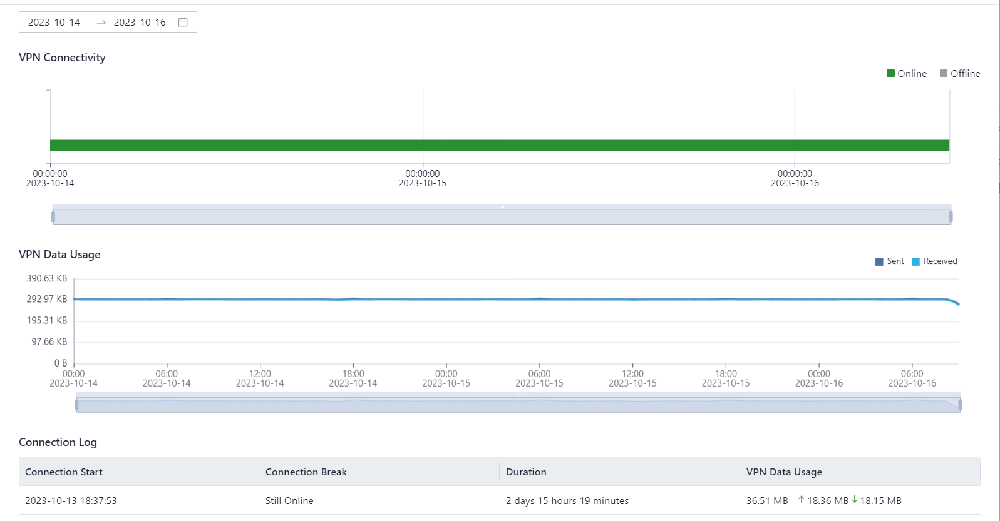  

## **6.2 SD-WAN Overlay**

### **6.2.1 Background**

Enterprises often need mutual access between branches to facilitate business data transmission, video conferencing, and other requirements. Traditional VPN implementation methods are complex and challenging to troubleshoot. InHand's SD-WAN network functionality, introduced through a user-friendly interface, assists users in achieving fast inter-branch connectivity. It enhances link flexibility and significantly reduces operational management complexities, providing a superior network experience for enterprise users.  

  

**\[Procedure\]**  

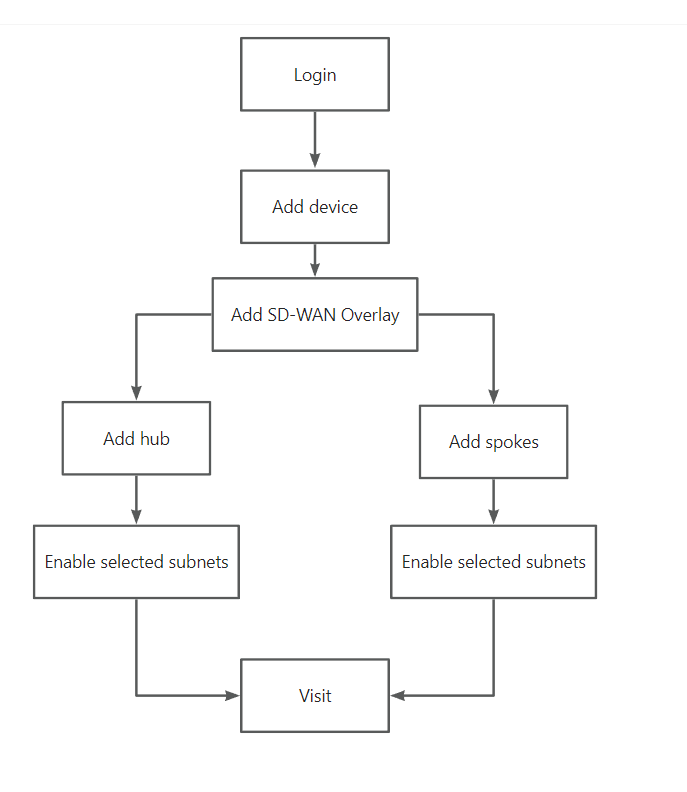

For configuration examples, please refer to：[SD-WAN Configuration Example](https://help.inhand.com/portal/en/kb/articles/sd-wan-configuration-example)

### **6.2.2 Configure Network**

Access the '**SD-WAN Overlay'** page, click on '**Add**', and you will be directed to the SD-WAN overlay addition page.  
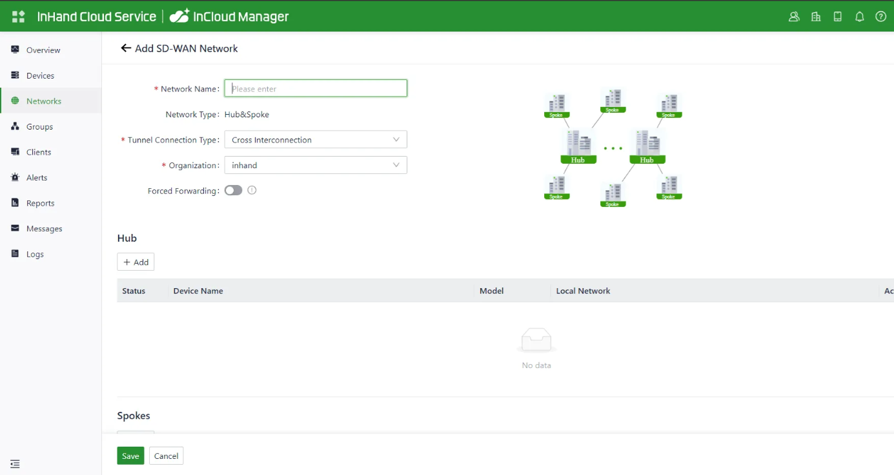

The SD-WAN overlay supports the Hub & Spoke topology, with device roles divided into hub devices and spoke devices. All spoke devices establish tunnels with the hub device, and the traffic between the spoke devices passes through the hub device.

| Field Name | Description |
| --- | --- |
| **Network Name** | The name of SD-WAN network. |
| **Tunnel Connection Type** | The method for establishing VPN tunnels between devices is as follows:  1.  **Cross Interconnection**: Tunnel connections are established only between the top 2 priority uplink links among the devices.  1.  **Symmetrical connection**: Devices establish tunnels with the opposite side in priority order, one by one. |
| **Organization** | Information about the current network's organization. |
| **Forced Forwarding** | Whether the traffic of spoke devices is routed through the hub device. |

### **6.2.3 Add Device**

On the **"Add Network"** page, click the "**Add**" button for either the "Hub" or "Spokes" to select the devices you want to add to the network.

After selecting the devices, add the public IP mapping information for the devices. If you need to modify the network configuration of the devices, you can click the "**Edit**" button for the local network to perform remote configuration.

| Field Name | Description |
| --- | --- |
| **Hub** | 1.  The hub device requires a public IP address to ensure the operation of the SD-WAN network. Users can also achieve this by using port mapping to provide public address services to the hub device.        2.  When deploying the hub device through public port mapping, you need to enter the port mapped by the upstream device in the location shown in the figure below. The port range is from 1 to 65535: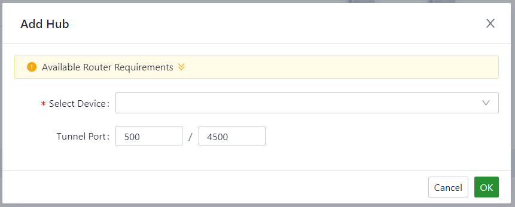         1.  The currently supported device models are ER805 and ER2000, and each network can only have a maximum of 1 hub device. |
| **Spokes** | 1.  Spoke devices do not have specific requirements for public IP addresses.        2.  Multiple spoke devices can be added, and the final quantity depends on the performance of the hub device.        3.  Currently supported device models are ER805 and ER605. |

  

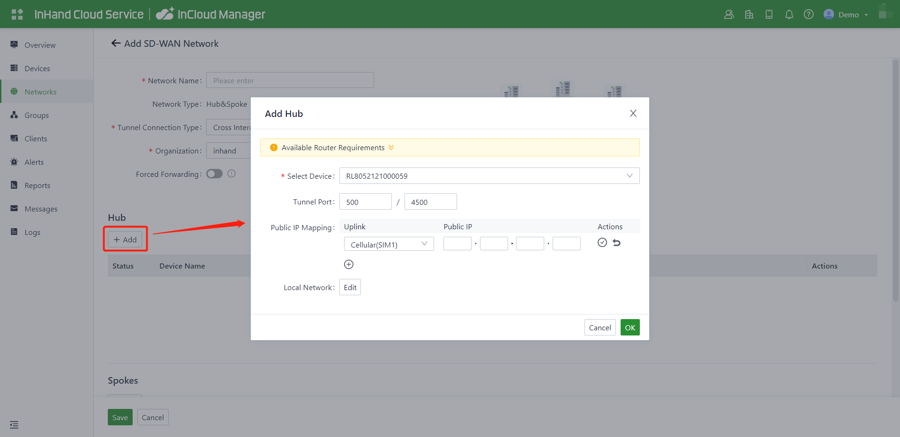  

After adding the devices and configuring the network, click the "**Save**" button in the lower-left corner of the page to successfully create the network. All devices and selected subnets will be fully interconnected.  

┃**Note:** In a single network, the local networks of hub device and spokes cannot be the same, as it may affect communication.

### **6.2.4 Network Details**

After adding the network, you will be automatically directed to the **topology** page. Alternatively, you can access the topology details page by clicking on the network name in the "SD-WAN Network List." All spoke devices within the network will establish connections with the hub device in a star configuration.

**1.Topology**

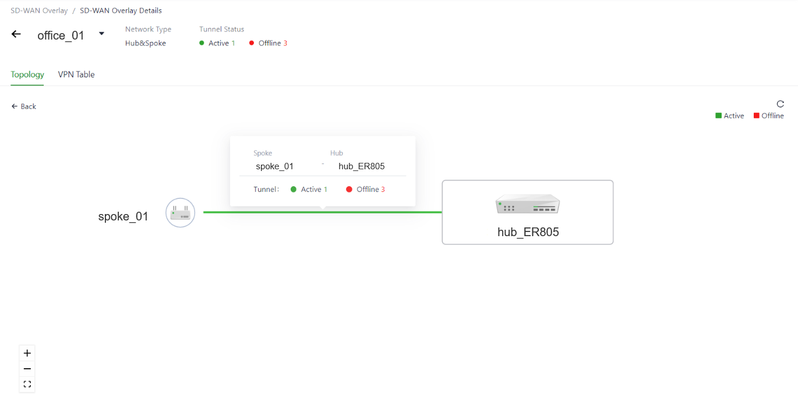  

  

1.  Slide the mouse over the device icon to display the available subnet information of the current device. When the subnet conflicts, there will be a conflict flag.

1.  When the mouse slides over the link, the establishment of tunnels with each interface of the central device is displayed.

**2.VPN Table**

Click on the **"VPN Table"** in the top left corner of the "SD-WAN Network Details" page to switch to a table view that displays information about all devices within the network and their VPN connections to the hub device.  

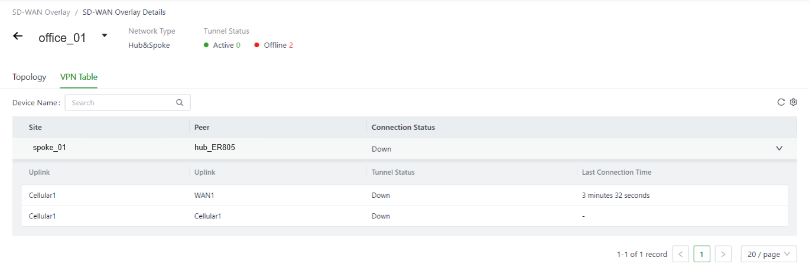  

# **7.Groups**

Devices can be added to device groups for batch management, supporting operations such as remote configuration, firmware upgrades, remote access, commands, adding and deleting groups, etc.

Under this menu, you can add or delete groups and achieve batch configuration by editing groups. When group configuration and individualized configuration conflict for the same functional module, the device will prioritize individualized configuration. 

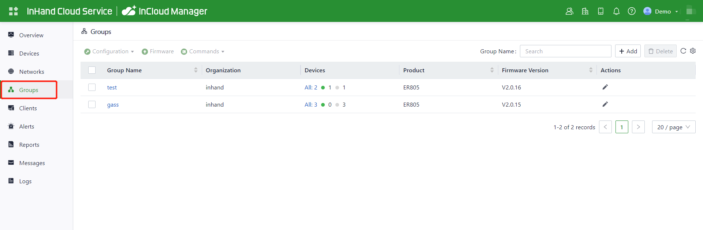  

## **7.1 Configuration**

### **7.1.1 Edit Confirmation**

Users can go to the "**Groups**" menu, select the target group, and click the "**Edit**" button to edit the group.   

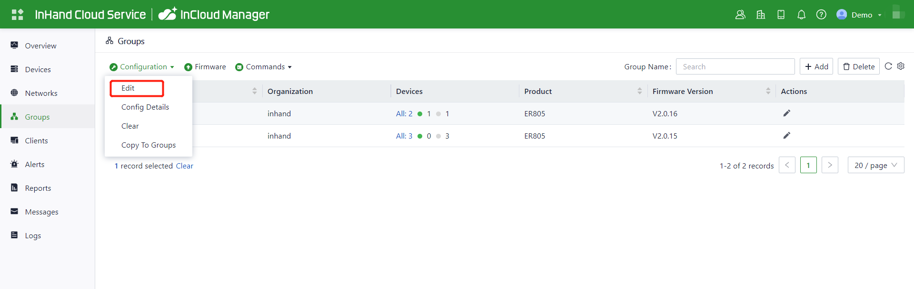  

In the configuration editing popup, the following operations are supported:

1.  **Pending Configuration**: Click the "Pending Configuration" button, and the configurations made during this session will be saved to the platform backend but not yet deployed to the devices within the group.  
    
2.  **Discard Changes**: Click the **"Discard Changes"** button, and any operations made during this session will be discarded.  
    
3.  **Commit Charges**: Click the "**Commit Charges**" button to apply the configurations made during this session to the devices within the group.  
    

┃**Note:**  

      ①Individual configurations take precedence over group configurations.  

      ②Combining individual and group configurations may lead to configuration conflicts. It is recommended to avoid individual configurations on devices before adding them to a group.  

      ③When performing local configurations or individual device editing within a group, group configurations for the corresponding functional modules may become ineffective.  

  

### **7.1.2 Config Details**

The group list allows you to view the configuration information for a single group.

1. Select the **target group**.

2. Click on "**Configuration**" at the top of the group list, then choose "**Config Details**".

3. In the configuration details popup, you can view the current configuration information for the selected group.

### **7.1.3 Clear**

In the "**Groups**" menu, select the group, then click on "**Clear**" in the configuration section. After confirming the action, the group configuration will be cleared.

┃**Note:** This operation only clears the group configuration, and the individual configurations of devices within the group will still be retained.

### **7.1.4 Copy to Groups**

In the "**Groups**" menu, select a group, click on "**Copy to Groups**" in the configuration section, to copy the group configuration and perform batch configurations for devices within the target group.

## **7.2 Firmware Upgrade**

The group list supports firmware upgrade operations for individual groups.

1. Select the group you want to upgrade the firmware for.

2. Click on "**Firmware**" at the top of the group list.

3. In the firmware upgrade pop-up window, choose **the target firmware version**.

4. Select the current firmware version that needs to be upgraded.

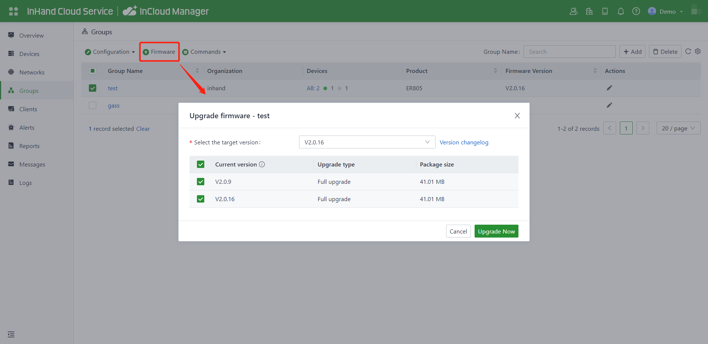  

  

┃**Note** ：         

      ①Online devices within the group will immediately execute the upgrade task.  

      ②Devices that are offline will perform the upgrade operation upon their next online status.  

## **7.3 Commands**

### **7.3.1 Reboot**

In the "**Groups**" menu, select the target group, and click "**Reboot**" to perform a batch restart of devices within the group.  

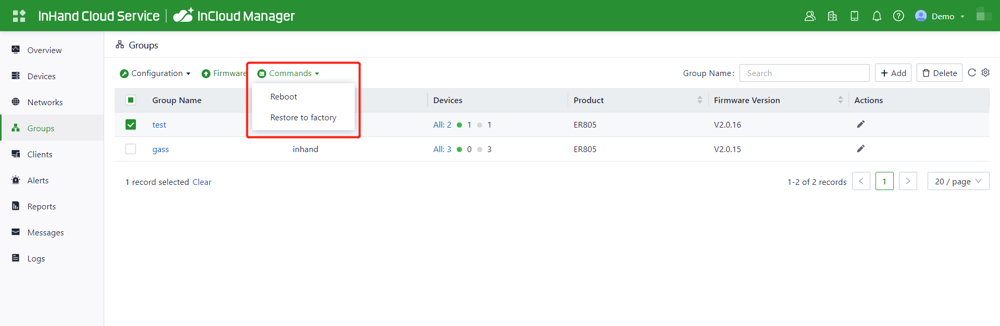  

┃**Note:**The restart command will only affect devices within the group that are currently online. Devices within the group that are offline will not execute this command (even when they come online later, they will not restart automatically).

### **7.3.2 Restore to Factory**

In the "**Groups**" menu, select the target group, click on "**Restore to Factory**",and you can perform a batch factory reset for the devices within that group.

┃**Note:**  

      ①The factory reset command will only affect the devices within the group that are currently online. Offline devices within the group will not execute this command, even when they come online later.  

      ②After a device is restored to factory settings, all historical data will be cleared. When the device comes online again, it will reapply both its individualized configuration and the group configuration.  

## 7.4 Group Details  

Click on group name to access group details and view more information about the group.  

### 7.4.1 Overview  

You can view statistics for the current group, including distribution of device configuration status, firmware upgrade status, firmware versions,offline  top 10, alerts top 10 by device, and alerts top 10 by type.  

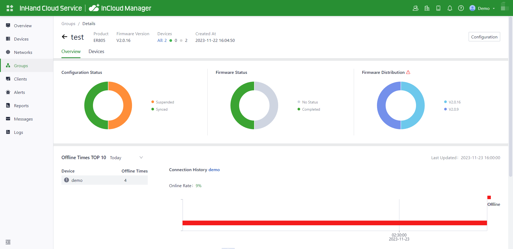  

  

┃**Note:** If a device has a different firmware version than the group, it's marked as "suspended," meaning you can't configurate it remotely. Click the **unusual icon** in "**Firmware Distribution**" on the "**Overview**" page to upgrade devices with mismatched firmware.  

### 7.4.2 Devices  

Display current group information and easily manage device transfers as needed for your business.  

1.  **Add Devices**: Click "**Move Devices**" and the system will automatically filter devices that match the group's product model. You can then select multiple devices to add them to the group.  
    
2.  **Remove Devices**:After selecting the devices, click "**Remove**". After a confirmation, the devices will be removed from the group, and their group configurations will be automatically cleared.   
    

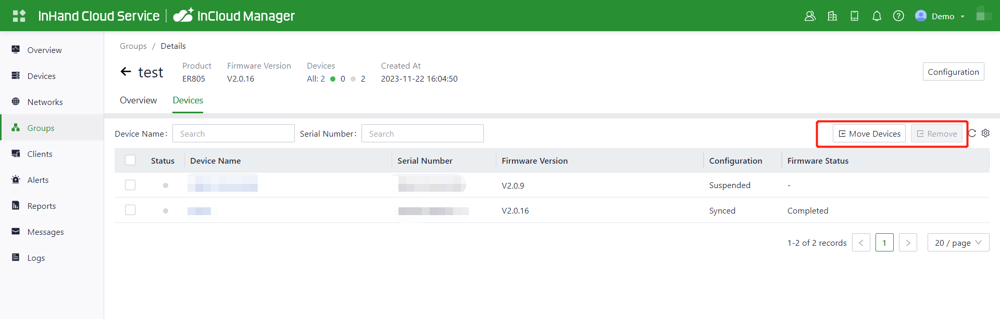  

# **8.Clients**

The client page allows you to view information about all the clients reported by devices under the current account. This information includes the client's status, connection method, network quality, and usage of network traffic, among other details.

## **8.1 Client List**

The client list only displays currently online clients and clients that have been offline for less than 7 days.  

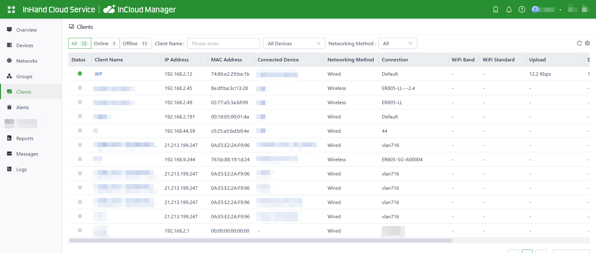  

## **8.2 Client Details**

Click on the **client's name** to access client details, where you can view the current client's connection status, connection history, traffic usage, speed, and other information.  

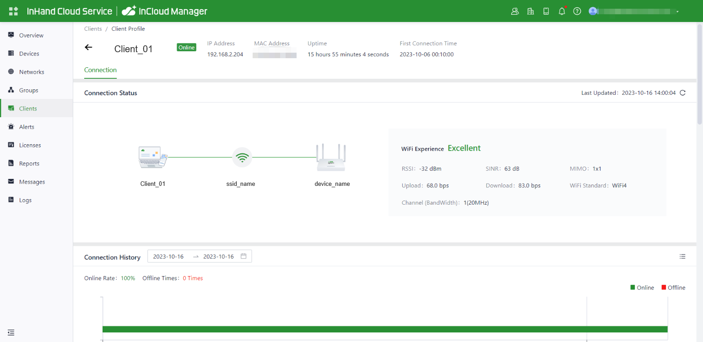

  

  

# **9.Alerts**

## **9.1 Alert Settings**

The platform supports multiple types of alarms, allowing you to customize the specific alert types you wish to receive and the groups for which alerts should be reported. Additionally, you can choose the notification recipients and methods for these alerts.

1. Go to the **Alerts** menu and click "**Alert Settings**" in the upper left corner of the alert list.

2. Click "**Add Rule**" in the upper right corner of the alert rule list.

3. Select the group to be monitored, alert type, notification users, and notification method, then

click "**Save**". If no notification users are set, the generated alarms will only be displayed on the platform. The platform supports three notification methods:

1.  **Email**: When an alert is triggered, an alert email will be sent to the configured notification users.  
    
2.  **APP**: Users need to install the InCloud Manager APP. When an alert is triggered, the APP will receive a notification.  
    
3.  **SMS**: When an alert is triggered, an alert SMS will be sent to the configured notification users. Users need to bind their phone numbers to the platform.   
    

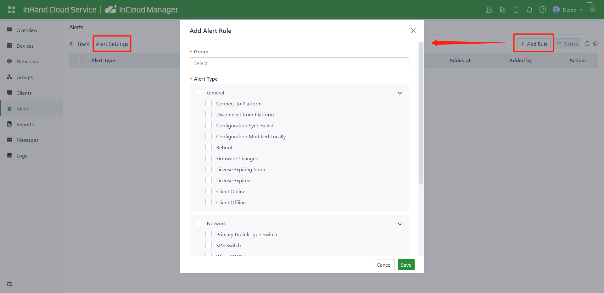  

The explanation for alarm types is as follows:  

  

| Alert Type | Description |
| --- | --- |
| **Connect to the Platform** | Devices can be online on the platform for more than N minutes.Configurable time range: 5 -120 minutes. |
| **Disconnect from Platform** | Devices can be disconnected (offline) from the platform for more than N minutes. Configurable time range: 5 -120 minutes. |
| **Configuration Sync Failed** | The device failed to synchronize its configuration with the cloud platform due to network or other issues. |
| **Configuration Modified Locally** | The device configuration was modified by the user via the local interface or CLI. |
| **Reboot** | The device's system has been rebooted. |
| **Firmware Changed** | The device's local firmware has been upgraded or downgraded, including: local device execution of upgrades, platform upgrades to the device firmware version. |
| **License Expiring Soon** | The license applied to the device on the platform will expire in N days. Configurable time range: 1-30 days. |
| **License Expired** | The license applied to the device has expired, rendering the device unable to utilize the platform's functionalities. |
| **Client Online** | A client connected under the device has connected. |
| **Client Offline** | A client connected under the device has disconnected. |
| **Cellular Usage Threshold Reache****d** | This trigger activates when the device's SIM card data usage reaches the locally configured threshold. Configuration must be performed on the device's local cellular link. |
| **High Average CPU Utilization** | CPU utilization exceeds the threshold for an extended period. |
| **High Memory Utilization** | Memory usage exceeds the threshold for an extended period. |
| **Poor Cellular Signal Strength** | The device's cellular signal remains below a certain threshold for an extended period. |
| **Primary Uplink Type Switch** | The upstream link type of the device has changed, either due to manual intervention or backup link switching. |
| **SIM Switch** | The device with dual SIM cards has undergone a primary-secondary SIM card switch, such as the cellular link transitioning from SIM1 to SIM2. |
| **Wired Wan Connected** | The current upstream link for the device is wired, and it's connected. |
| **Wired Wan Disconnected** | The current upstream link for the device is wired, and it's disconnected. |
| **Cellular Wan Connected** | The current upstream link for the device is cellular, and it's connected. |
| **Cellular Wan Disconnected** | The current upstream link for the device is cellular, and it's disconnected. |
| **Wi-Fi(STA) Wan connected** | The current upstream link for the device is Wi-Fi（STA）, and it's connected. |
| **Wi-Fi(STA) Wan Disconnected** | The current upstream link for the device is Wi-Fi(STA), and it's disconnected. |
| **Loop Detection** | A loop has formed in the device's interface. |
| **Carrier Switched** | The device uses multiple network cards, and the carrier for the cards has been switched. |
| **Link Up/Down** | The master uplink or a selected uplink connection remains connected/disconnected for an extended period. |

  

## **9.2 Alert List**

Under the "**Alerts**" menu, you can view the alert information for all devices on the platform. This information includes the time when the alert was generated, its type, device name, group, description, and more.  

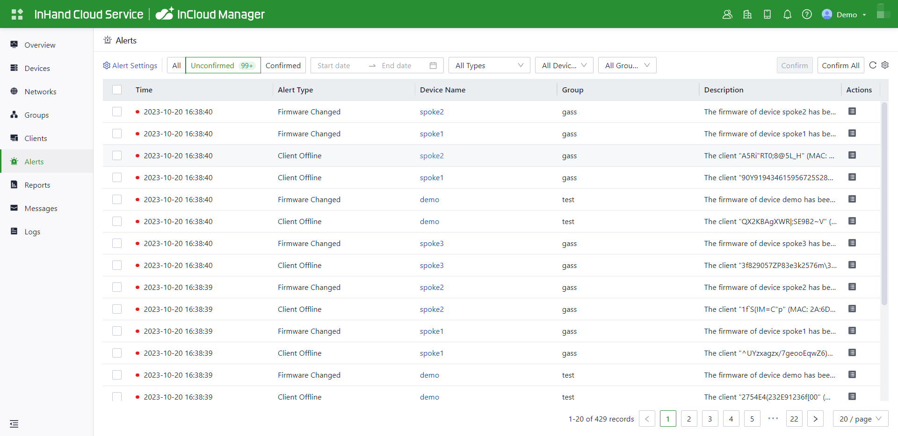  

  

# **10.Reports**

The report page displays historical generated report information and supports adding new reports and managing report information.

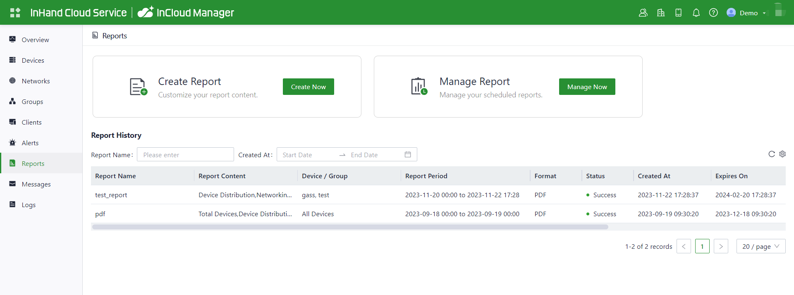  

## **10.1 Create Report**

Click "**Create New**" to create a new report by selecting report information based on your business requirements.

1. In the "**Reports**" menu, click "**Create New**" to enter the report content selection page.

2. **Choose the type of report**: Select the report content you want to include in the report.

3. **Select Devices/Groups**: Choose whether you want to include all devices, organizations, or specific groups in the report.

4. **Set the reporting period**: Define the time range for the report data, with a maximum selection of up to the last 30 days.

5. **Configure report details**: Specify whether you want to generate the report in PDF or Excel format and provide an email address for receiving the report. If you want to schedule regular report generation, you can set the time for daily, weekly, or monthly reports.

6. After submission, the platform will generate the report according to the selected configuration at the specified time. If you have set an email address to receive the report, you will receive an email notification when the report is ready.

## **10.2 Manage reports**

Clicking "**Manage Now**" allows you to view all the newly added reports with scheduled tasks.

1.  **Edit Report**: Click on "**Edit**" to go to the "Choose Report" page, where you can configure other information besides the report content. After saving the configuration, the platform will generate the report based on the new configuration rules.  
    
2.  **Delete Report**: Click "**Delete**" to delete a scheduled report. Once deleted, the platform will no longer generate reports for that scheduled task.  
    

## **10.3 Report History**

You can view the generated reports on InCloud Manager from the Report menu. You can perform the following operations:

1.  **Download Report**: You can download the generated PDF or Excel report file.  
    
2.  **Delete Report**: You can delete the report if you no longer need the report.  
    
3.  **Re-run**: After clicking "Re-run", the list will generate a new report information immediately with the original configuration.  
    

  

# **11.Messages**

Click the Messages menu to receive messages from InCloud Manager, including product messages, firmware messages, and service messages.

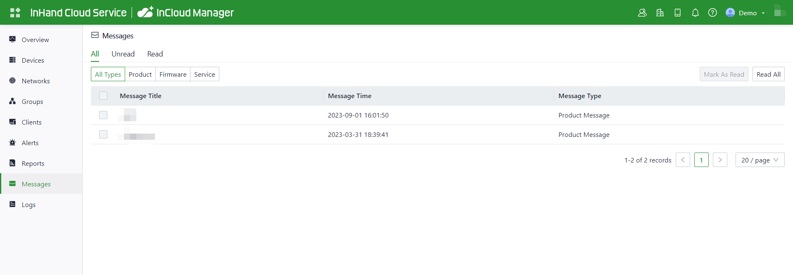  

# **12.Logs**

On the page Logs, you can view Upgrade Logs, Activity Logs, Login Logs.  

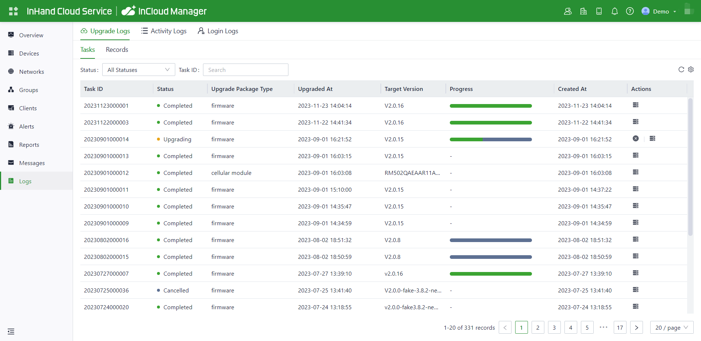  

## **12.1 Upgrade Logs**

**1.Tasks**

On the Tasks tab, you can view the statuses of upgrade tasks for devices on InCloud Manager and manually cancel upgrade tasks.

1.  Click **Cancel** to cancel an ongoing or scheduled upgrade.  
    
2.  Click **Device** to view the upgrade records of a device.  
    

**2.Records**

On the Records tab, you can view the upgrade records of each device, including the device name, serial number, upgrade status, firmware version, tasks, task creation time, start time, and end time. You can also sort devices by upgrade type.

| Upgrade Status | Description |
| --- | --- |
| **Pending** | Displays the devices waiting for upgrade. |
| **Upgrading** | Displays the devices being upgraded. |
| **Completed** | Displays the successfully upgraded devices. |
| **Failed** | Displays the devices that cannot be upgraded. |
| **Cancelled** | Displays the devices with upgrade tasks canceled. |

## **12.2 Activity Logs**

Click the **Activity Logs** tab to view the operations performed by all users on InCloud Manager.

## **12.3 Login Logs**

Click the **Login Logs** tab to view the login records of all users on InCloud Manager.

# **13.Licenses**

InCloud Manager subscribes to each device based on licenses and charges accordingly. You can choose different types of licenses for devices based on your needs, and the service scope of each type of license is as shown on the purchase page. The platform supports online purchase of service licenses, eliminating the need for cumbersome offline communication. Upon successful online purchase and application to the device, the service is immediately activated.  

To access "InHand Cloud Service," click on "**Subscription**" to view the usage status of licenses and device permits under the current account. You can also manage and purchase licenses.

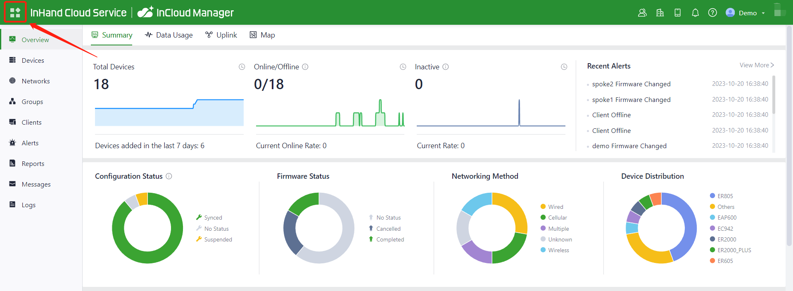  

  

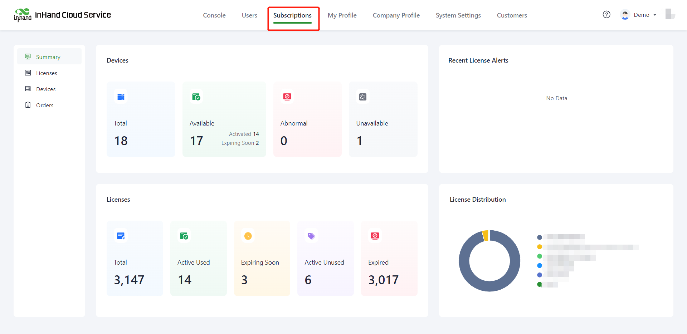  

## **13.1 Summary**

On the "**Subscriptions>> Overview**" page, you can view statistical information about the licenses under your account.

| Function Modules | Description |
| --- | --- |
| **Device Overview** | View the number of devices in different service statuses, click to apply filter conditions, and navigate to the "Devices" page:    1.  **Total**: Total count of devices under the current account.  1.  **Available**: Devices capable of connecting to the platform and using its functionalities (determined by applied device licenses).  1.  **Unavailable**: Devices unable to connect to the platform due to expired or unapplied licenses. Licensing required for these devices.  1.  **Anomaly**: After a device license expires, the device might retain partial platform functionality, but it may lack expected features. |
| **License Overview** | To view the total number of licenses and statistics for different license statuses, click to apply filter conditions and navigate to the "Licenses" page:    1.  **Total**:The total count of licenses under the current account.  1.  **Active Used**: Licenses in an activated state and already applied to devices.  1.  **Expiring Soon**: The number of licenses expiring within 30 days. You can extend the remaining duration of these licenses to reduce adverse impacts on your business due to license expiration.  1.  **Active Unused**: Licenses in an activated state but not yet applied to any devices. These licenses still consume remaining duration. To avoid waste, prioritize applying these licenses to devices.  1.  **Expired**: Number of licenses that have expired. |
| **Recent License Alerts** | View license alarm information for all devices, and click "**View More**" to jump to the alarm menu. |
| **License Distribution** | View the percentage of different types of licenses in the account. |

## **13.2 Licenses Information**

On the "**Subscriptions>> Licenses**" page, you can view the purchased licenses, and the license information includes the following:  

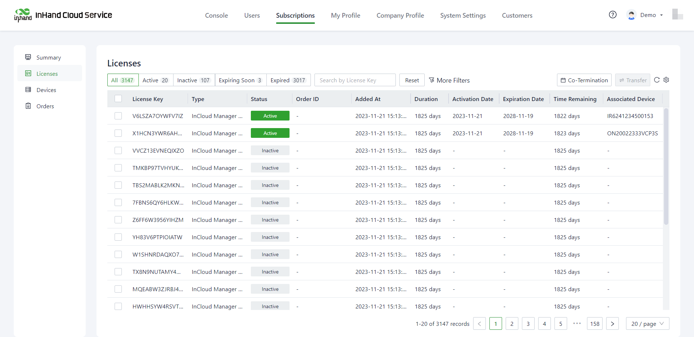  

| Field Name | Description |
| --- | --- |
| **License Key** | The unique ID of a license. |
| **Type** | The plan type of a license. |
| **Status** | The working status of a license:  1.  **Inactive**: The initial status of a license when it has not been applied to any device.  1.  **Active**: When a license is first applied to a device, it becomes "Active." Active licenses start consuming their subscription period, regardless of whether they are applied to a device or not.  1.  **Expiring Soon**: The remaining validity period of the license is less than 30 days.  1.  **Expired**: When the remaining subscription period of a license reaches zero, it becomes "Expired". |
| **Order ID** | The order from which the license was generated. |
| **Added At** | The time when the license was added to this account. |
| **Duration** | The subscription duration of a license is measured in days. |
| **Activation Date** | The time when the license is activated. |
| **Expiration Date** | The time when the license expires. |
| **Time Remaining** | The remaining usable duration of a license is the time left until the license expires. Once the duration is consumed, the license status changes to "expired." |
| **Associated Device** | The device to which the license is currently applied. |

  

┃**Note:**  

      ①Once a license is applied to a device for the first time, it becomes activated.  

      ②An activated license will continue to consume its remaining valid duration, whether or not it is applied to a device.  

      ③After a license has expired, it cannot be applied to any more devices. Any devices that had the license applied will lose access to the features covered by that license once it expires.  

  

## **13.3 Orders**  

The Orders page allows you to purchase licenses, manage historical order information, and access invoice details.The purchasing process for licenses is as follows:

1.Go to the "**Subscriptions****\>> Orders**" page and click on "**New Order**".

2. On the "**Purchase Licenses**" page, choose the desired license type, subscription duration, quantity, and click "**Buy Now**".

3. **Confirm** your order and select the **payment method**. Then click "**Check out**".

4. After completing the payment, the platform will automatically generate the licenses.

┃**Note:** Unpaid orders can be continued to be paid within 2 hours after placing the order. If the payment is not completed within this 2-hour window, the order will be automatically canceled.  

  

## **13.4 Use Licenses**

On the "**Subscriptions****\>> Devices**" page, you can manage the application of licenses to devices, which includes the following functions:

**1、License status of devices**

In the "**Subscriptions****\>> Devices**" section, you can view the current service status for each device. The service status can have the following states:

| Status | Description |
| --- | --- |
| **Available** | Devices capable of connecting to the platform and using its functionalities (determined by applied device licenses). |
| **Unavailable** | Devices unable to connect to the platform due to expired or unapplied licenses. Licensing required for these devices. |
| **Anomaly** | After a device license expires, the device might retain partial platform functionality, but it may lack expected features. |

**2、Assign a license to one device**

On the "**Subscriptions****\>> Devices**" page, you can apply a license to an individual device using the following steps:

1. Click on "**Assign License**" in the operations column of the device list (The device that have not yet applied a license).

2. In the "Assign License" pop-up window, select the **license type** and the specific license you want to use, then click "**Assign**".

**3、Extend device license duration**

For a licensed device, you can extend the license period before the license expires to prevent service termination and avoid affecting service operation. InCloud Manager support extending the duration of a license by merging the duration of multiple licenses. You can only superimpose licenses of the same type to a licensed device.

1. On the "**Subscriptions****\>> Devices**" page, click on the "Assign License" option in the operations column (These devices that have already applied a license).

2. In the "**Extend License**" pop-up window, select the desired license, and then click the "**Assign**" button.

┃**Note**:  

      ①After stacking, the duration of the originally applied license to the device will be extended.  

      ②Stacking is irreversible; once licenses are stacked, they cannot be separated again.  

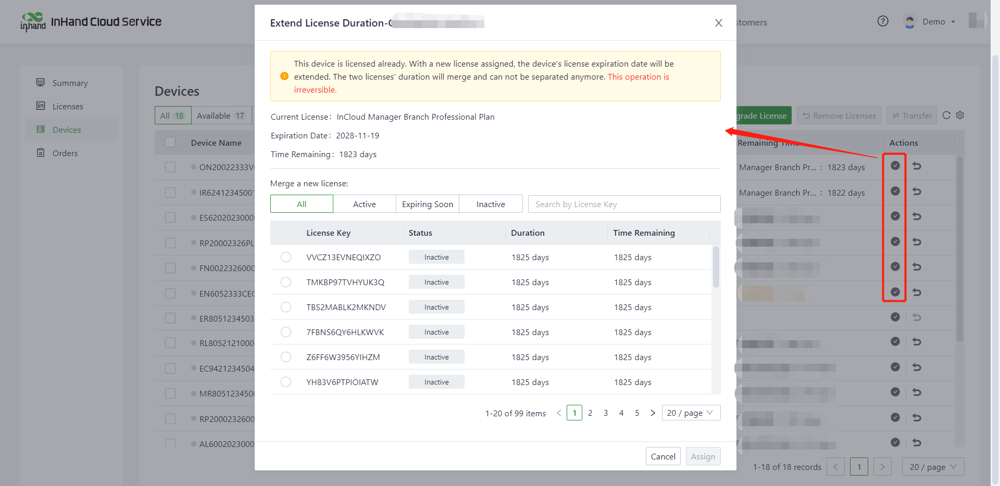  

  

**4、 Assign licenses to multiple devices**

When dealing with a large number of devices, the platform supports the quick batch application of licenses to multiple devices:

1. In the "**Subscriptions****\>> Devices**" page, click on "**Assign Licenses**" above the device list.

2. Select the license types you want to apply and the devices you want to apply them to. Click "Assign Licenses", and the platform will automatically allocate the licenses.

3. Confirm the license results and click "**Assign**" to make the batch licenses effective.

To maximize the utilization of licenses under your account, the platform will prioritize the allocation of activated licenses. Other types of licenses will be randomly allocated without considering the duration.

┃**Note**: If a device already has a similar license in use, applying it again will result in the license duration being extended. This action is irreversible, so please proceed with caution.

**5、 Remove license**

When a device's business use case changes, and you need to switch to a different type of license, or if the device experiences a malfunction and needs to be replaced with another device, you can revoke the license from the original device. After revoking it, the canceled license can be applied to another device, and the original device will become "unlicensed," causing the services within the license scope to immediately terminate.

1. On the "**Subscriptions****\>> Devices**" page, click the "**Remove License**" option in the action column for the target device.

2. After confirming the action in a second dialog, the license will be removed from the device.

**6、 Remove licenses in batches**

The platform supports quickly revoking the licenses of multiple devices. After revocation, the revoked licenses can still be applied to other devices. The original devices will become "Unlicensed," and services within the license scope will be terminated immediately.

1. On the "**Subscriptions****\>> Devices**" page, select the devices from which you want to remove licenses.

2. Click on "Remove License" at the top of the device list and confirm the action when prompted.

┃**Note:** Devices without applied licenses cannot have their licenses canceled.  

  

## **13.5 Upgrade License**

When the functionality of a device with a lower version of the license does not meet your business requirements, you can upgrade the license for that device.

1. On the "**Subscriptions****\>> Devices**" page, click "**Upgrade License**" at the top of the device list.

2. Select the type of license you want to upgrade. Once selected, the platform will automatically filter devices bound to this license type.

3. Choose the devices you want to upgrade the license for.

4. Select the **license type** to which you want to upgrade, then click "**Submit**".

5. Confirm the results of the license upgrade. After clicking "**Confirm**", the license upgrade will take effect, and the device's license will change to the advanced version. If you choose to cancel the license upgrade, it will not take effect.

┃**Note:** You can batch upgrade already activated licenses of the same type. After the upgrade, the remaining duration of the license will be adjusted proportionally based on the price ratio between the two license types before and after the upgrade.  

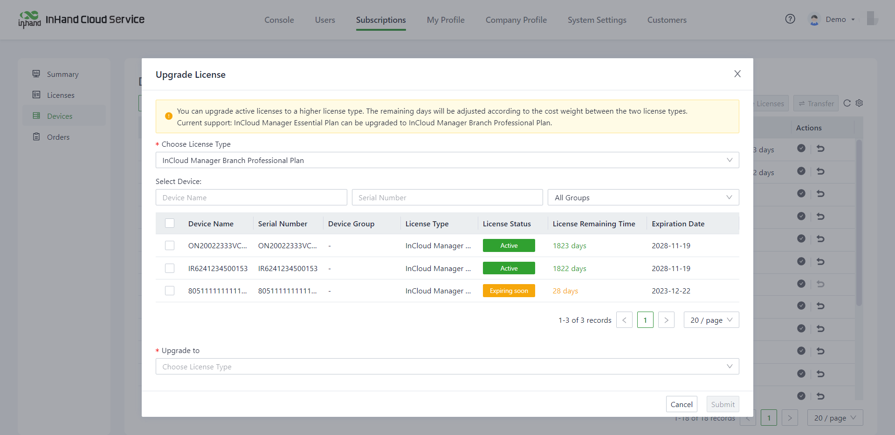  

## **13.6 License co-termination**

When you need to align the expiration dates of device licenses to simplify business management and streamline financial reconciliation, you can take the following steps:

1. On the "**Subscriptions****\>> Licenses**" or "**Subscriptions****\>> Devices**" page.

2. Select the licenses whose expiration dates you want to align.

3. Click **Co-termination**.

4. Review the updated expiration details and click **OK**. The system will automatically align the selected licenses to the same expiration date.

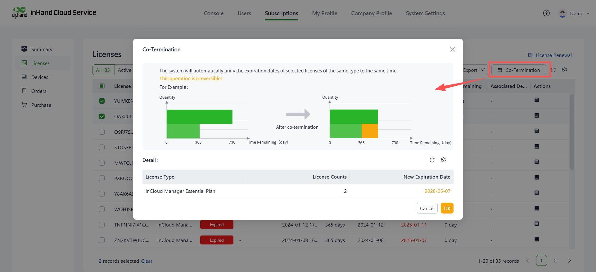  

  

┃**Note:**  

      ①The system will automatically align the expiration dates of the selected licenses **of the same type** to a single date.For example, if today is **June 1, 2024**, and you select: two Basic licenses with **1 year** remaining each, and one Basic license with **60 days** remaining, the average remaining duration is calculated as: (2 × 365 + 1 × 60) ÷ 3 = **264 days.** As a result, the unified expiration date for all three licenses will be: **June 1, 2024 + 264 days = February 20, 2025**.

      ②The **Co-termination** action is **irreversible**. Please proceed with caution before confirming.

## **13.7 Transfer licenses**

The platform supports users in transferring licenses to other accounts. After the transfer, the license will be removed from the original account. However, licenses that have already been applied to devices cannot be transferred.

The other account needs to bind your InCloud Manager email account:

1. The system administrator should click on "**Company**" in the page header to access the Enterprise Management page.

2. In the "**Associate an MSP Account**" section, enter your InCloud Manager email account and click "**Update**". You will see that account in the customer list.

3. In the "**Subscriptions****\>> Licenses**" page, select the license you want to transfer.

4. In the "**Transfer Licenses**" popup, confirm the license you want to transfer, select the customer, and click "**Transfer**" to complete the transfer successfully.

┃**Note**:  

      ①Transferring licenses that are currently in use or have expired is not supported.  

      ②You can transfer a maximum of 1000 licenses at a time.  

  

## **13.8 Transfer Devices**

The platform supports transferring devices and their associated licenses to another account. Before performing the transfer operation, you need to follow the same steps as described in "Transfer" to have the other account bind to your InCloud Manager account.

1. On the "**Subscriptions****\>> Devices**" page, select the devices you want to transfer to the customer.

2. Click on the "**Transfer**" button at the top of the list.

3. In the "**Transfer Devices**" pop-up window, confirm the devices to be transferred and select the customer account to transfer to. Click "**Transfer**" to complete the transfer successfully.  

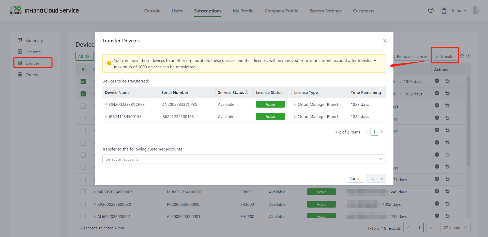  

  

┃**Note:** After the transfer, the devices and the associated licenses will be removed from the current account.  

  

# **14.APP Guide**

## **14.1 APP Introduction**

InCloud Manager APP can help you use InCloud cloud services anytime, anywhere, and manage your networks easily and conveniently. You can add devices to your account through the InCloud Manager APP and configure the device to connect to the cloud. Check the running status of the device in real-time on the mobile terminal and respond to device alarms promptly, and analyze the network status in multiple dimensions through the dashboard.

## **14.2 Download and Install**

You can visit InCloud Manager([https://star.inhandcloud.com)](https://star.inhandcloud.com\)) or scan the QR code below to get the latest APP version.

  

For the iOS system, you can search “InCloud Manager” in the app store, find the app of this LOGO  , then download to install.        

  

## **14.3 Instructions  
**

### **14.3.1 Register and Login**

If you don't have an InCloud Manager account, you need to register an account first. Open the InCloud Manager APP and click "Create now" on the login page to register an account. You need to activate your account after registration, and you can log in after successful activation.  

If you wish to delete your account, please follow these steps:  

1\. Log in to the InCloud Manager app.

2\. Click **More**.

3\. Click **Account**. 

4\. Go to the **Security** page.

5\. Click **Delete Account** and confirm the deletion.  

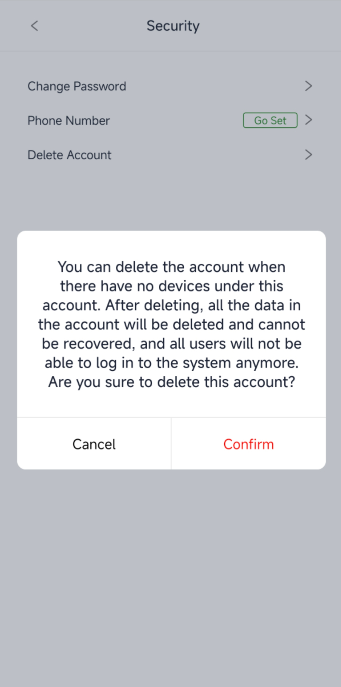  

After deletion, all data in your account will be deleted and cannot be recovered, including but not limited to:  

● Login logs

● Operation records

● All resources under the account: users, groups, networks, etc.

● Alert records  

● Others.

  

### **14.3.****2 Add a Device**

1\.  Click the "**Devices**" directory below to enter the device page, click the menu button in the upper right corner, and select "Add Device".

2\. Then **scan the code** to add the device, and point the phone camera at the QR code on the device nameplate.

3\. After successfully scanning the code, configure the device name, serial number, and description information to complete the addition.

### **14.3.****3 Connect device to the Internet**

1\. After the device is added, if the device fails to connect to the Internet, you can click "Configure Local Device" to configure the device to connect to the Internet.

n When configuring the local device, you need to make sure that the HTTP access and Wi-Fi AP functions are enabled on the device.

n The ER805 enables HTTP access and Wi-Fi (AP mode) by default.

2\. Scan the QR code on the device nameplate, and then the APP will automatically connect to the device's Wi-Fi. If the Wi-Fi configuration of the device is not set to factory settings and cannot be automatically connected, you can choose to manually connect to the device's Wi-Fi.

Currently, ER805 and ER605 support automatic connection, and the Wi-Fi configuration needs to be set by default.

3\. After the connection is successful, it will automatically log in to the device and jump to the network configuration page.

4\. After the networking configuration is finished, the device can be supervised on the APP or the  InCloud Manager WEB portal.

### **14.3.****4 Device Monitoring**

Click the "**Devices**" directory below to enter the device page, and click the device name to know more about this device.

1.Overview

The overview page contains device status, network status, connection history, and signal quality information. Click an interface on the page, you can learn the detailed interface information and the network quality.

Double-finger operation can zoom in and out the chart, and single-finger long press and slide left and right to switch the displayed period, click the zoom icon to zoom in and out the chart.

2\. Data Usage

Click "**Data Usage**" at the top to know about the data usage statistics and total usage trends. Swipe left and right in the usage statistics to switch to display cellular, wired, and wireless usage statistics.

3\. Cellular Signals

Click "**Cellular Signal**" to view the quality of the current device's cellular network, and the changing trend of RSSI, RSCP, RSRP, RSRQ, SINR, EC/IO, SS-RSCP, SS-RSRQ, SS-RSRP will be displayed according to the network standard.

4\. Information

Click "**Details**" at the top to know about the asset information and location information of the device. Click “Edit" to modify the asset information of the device.

### **14.3.****5 Alerts**

1\. Click the "**Alerts**" category below to enter the alerts page, which displays all types of device alerts in the last 7 days by default.

2\. Slide the alert banner to the left, there will be a pop-up confirmation box. Click "**Confirm**" to confirm a single alert, and mark the alarm as read state to reduce information interference.

3\.  Click "**Confirm All**" to confirm all unconfirmed alerts in batches.

4\. Click the alert information to enter the corresponding alert details page, you can view the detailed information of the alert. You can also confirm a single unconfirmed alert in the alert details.  

### **14.3.6 Delete Devices  
**

If you wish to delete a device and its data, you can do so by accessing InCloud Manager in your browser. Follow these steps:

1\. Access and log in to [InCloud Manager](https://star.inhandcloud.com/) in your browser.

2\. Go to the **Devices** menu.

3\. Select the device you wish to delete, click **Delete**, and **confirm**.

  

Once deleted, the device's data will be erased and cannot be recovered. Please proceed with caution.  

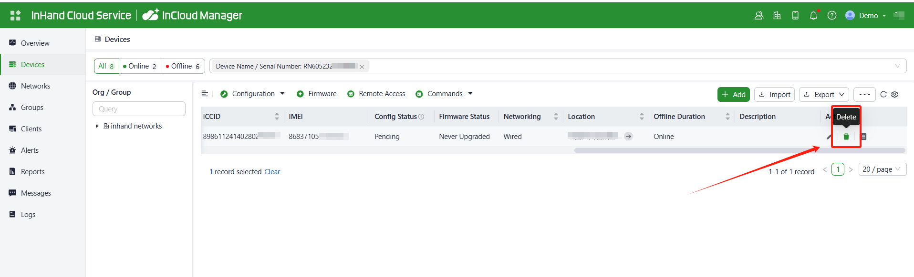  

# **FAQ**  

**1\.  What kinds of devices does the APP support to configure?**  

ER805 ,ER605,ER615,FWA02,FWA12,ODU2002, etc.

**2\. Why the APP can't connect to the device after scanning?**  

The following are the reasons that the APP can't build a connection with the device after scanning the QR code on its nameplate:

1\. The device is not enabled for HTTP access.

2\. The 2.4G Wi-Fi access point function of the device has been turned off.

3\. The Wi-Fi connection parameters of the device are not factory settings.

4\. The Wi-Fi signal is weak, such as far away from the device or the device is not connected to the Wi-Fi antenna.

When you can't connect to the device by scanning, please try to connect to the device's Wi-Fi manually or use the network cable to configure the device's networking parameters.  

**3.** Error occurred while adding device to the platform.  

When adding a device to the platform, the error usually occurs due to the following reasons:

1\. Serial number already exists: This device has already been added to the platform and cannot be added again.

2\. Invalid device information: Please ensure that the serial number and MAC address of the device are consistent with the information on the device label.

If the problem persists, please contact technical support.  

  

**4.T** **he device cannot be connected to the platform.**

After the device is added to the platform, it fails to connect. Please check:

1\. Whether the device's network is normal.

2\. Whether the local cloud service of the device has been enabled.

3\. Confirm whether the current firmware version of the device supports connecting to the cloud platform.

4\. If the device connects via cellular network, please check if the whitelist addresses of the IoT card include: \*.inhandcloud.com, \*.amazonaws.com.

5\. Whether the device is bound with a license. If not, you can enter "InHand Cloud Service >> Subscription" to bind the license.

**5.****Device configuration synchronization is suspended.**

Device configuration synchronization is suspended.

"Suspended" indicates that the action of synchronizing configuration from the cloud to the device has been interrupted. This state occurs when the firmware version of the device does not match the firmware version of the group to which the device belongs. Once it changes to the suspended state, any configuration from the cloud will not be sent to the device. You can solve this problem in the following two ways:

1\. Upgrade the firmware version of the device/group to ensure that the firmware versions of the device and the group are consistent.

2\. Directly remove the device from the group.

**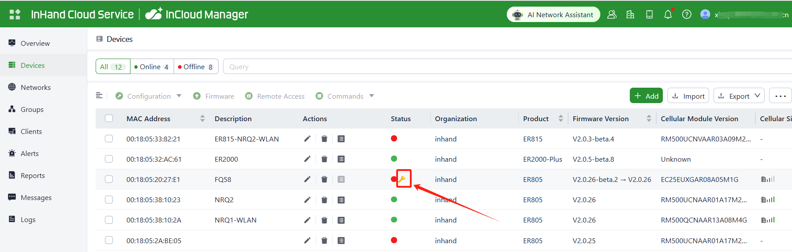**

**6.****Device configuration synchronization failed.  
**

The reasons for the configuration failure are usually as follows:

1\. The configuration content is incorrect.

2\. The network quality of the device is poor, resulting in the failure of configuration distribution.

You can also click the "Configuration Failure" icon to view the specific reasons for the configuration failure. You can also click "Clear Pending Configuration" to eliminate the configuration failure status, and this will not have any impact on the existing configuration of the device.  

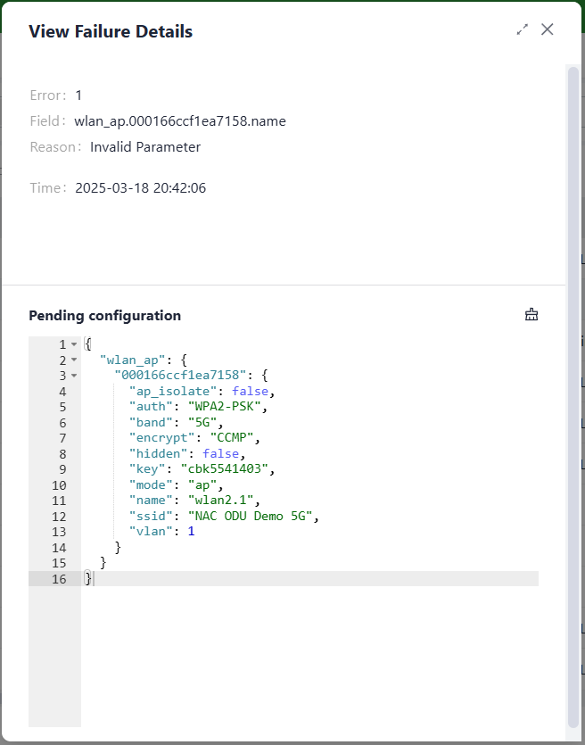  

  

**7.How to restore the device to factory settings?**  

After the device is connected to the platform, the configuration stored on the platform will be re-applied. If you need to restore the device to factory settings, please follow the steps below:

1\. Confirm whether the device has group configuration. If so, you need to either remove the device from the group or clear the group's configuration.

2\. Go to the device list/ device details, and clear the device's Individual configuration.

3\. Select the device, and click "Command >> Restore to Factory".  

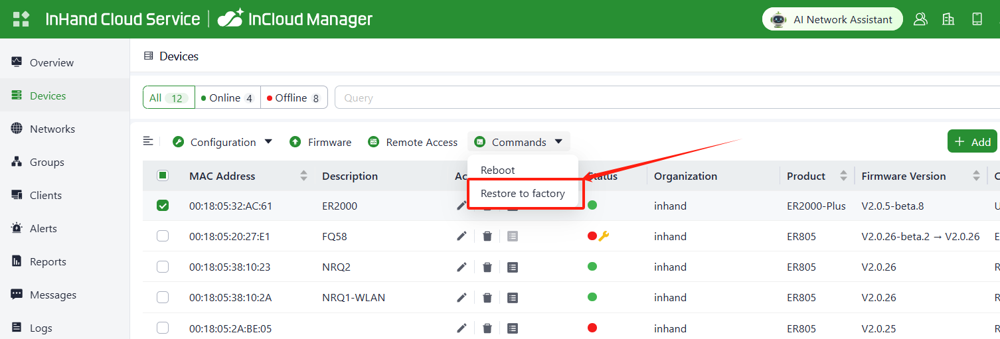

  

  

**8.Does the offline device support remote firmware upgrade?**  

The firmware upgrade of the cloud platform does not distinguish between online and offline states. It can create upgrade tasks for offline devices. When the device next connects to the platform and goes online, it will receive the upgrade task from the platform and perform the upgrade operation.

After the offline device issues the firmware upgrade task, the firmware upgrade status will change to "Pending". If you do not need this upgrade operation, you can cancel the task in the task list.  

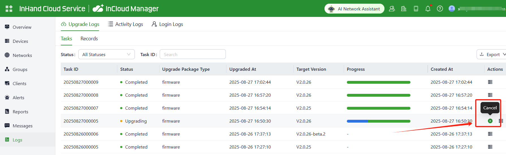

  

**9.How can external users switch to other organizations to provide technical support?  
**

1.External users must first accept the email invitation and then log in to InCloud Manager.

2.Click on the personal information at the top right corner of the page, then click "Switch."

3.In the organization switch dialog box, select the organization requiring assistance, and click "Switch" to successfully transition and provide technical support for the corresponding organization.  

| Note:  

①The permissions after switching to another organization are determined by the roles assigned by the invite initiator when adding external users.  

②If you need to switch back to your own institution, use the same entry point as above.  

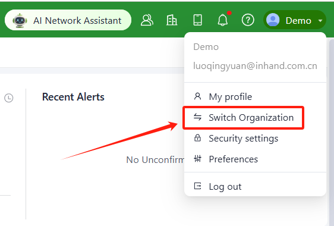  

  

**10.****The device's geographical location is not displayed or the location is incorrect on the platform.**

Please check:

1\. Whether "Sync GPS or base station position" has been configured.

2\. Check if the device's card is functioning properly and if it can read the cell tower data such as cellID, LAC, etc.

You can refresh to obtain the latest device location information.  

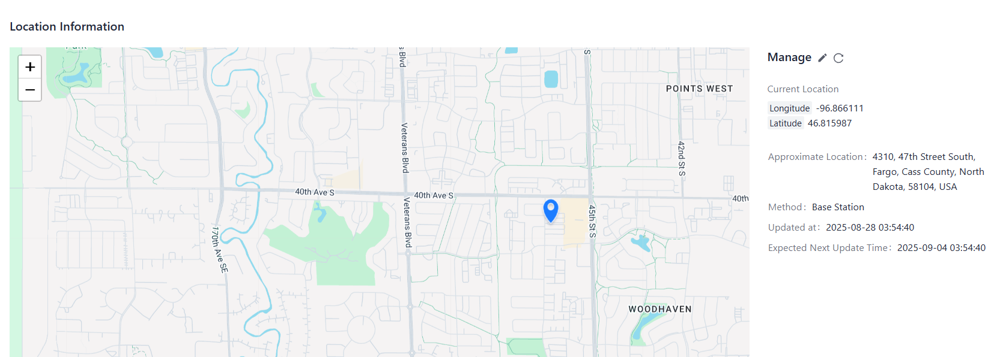  

  

**11.****Where can I measure speed? Why is the speed test function not displayed on the page?**

The speed test function is only supported by the InCloud Manager platform. The local page of the device does not support this function. If you want to measure speed, please click the device name in the device list, enter the "Tools" page of the device details to operate.

If the "Tools" page does not display the "Speed Test" function module, please check:

● Whether the current product supports the speed test function;

● Whether the firmware version of the current device supports this function;

● If both of the above are supported, please confirm with your organization's system administrator whether the speed test permission has been granted to you.

  

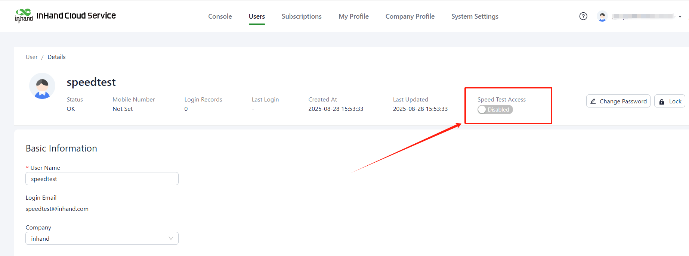