  InPAD070S/3101

 User Manual

  

InHand Networks 

[http://www.inhandnetworks.com](http://www.inhandnetworks.com)

  

Version: v1.0

October 2021

  

Copyright © 2021-2023 All rights reserved by InHand Networks Technology Co., Ltd. and its licensors. Without the written permission of the company, no unit or individual may excerpt or reproduce part or all of the content of this book, and shall not distribute it in any form.

Due to product version upgrades or other reasons, the content of this manual may change. Please refer to the actual situation of the product for details. InHand reserves the right to modify the content of this manual without any notice or hint. This manual is only intended as a guide. InHand Networks does its best to provide accurate information in this manual, but does not guarantee that the content of the manual is completely error-free. All statements, information, and suggestions in this manual do not constitute any express or implied guarantee.

  

# Foreword

Welcome to use InBOX/InPAD series from InHand Networks, this user manual will guide you in detail how to use this product. Note that most of the examples in this brochure will use one of the products in this series as a demonstration.

  

## Readers

This manual is mainly applicable to the following persons:

3.  R & D personnel
4.  On-site technical support and maintenance personnel
5.  Personnel responsible for device configuration and management

  

Conventions in the Manual

1.    Format Conventions on Command Line

| Format | Significance |
| --- | --- |
| Bold | Keywords of command line (the part that should be remained unchanged in command and be entered as it is) are expressed with  bold font. |
| Italic | The parameters of command line (the part that must be replaced with  the actual value in command) are expressed in italic. |
| \[ \] | Indicating that the part in “\[\]” is optional in command configuration. |
| { x | y | ... } | Indicating to select one from multiple options. |
| \[ x | y | ... \] | Indicating to select one or not to select from multiple options. |
| { x | y | ... } \* | Indicating to select at least one from multiple options. |
| \[ x | y | ... \] \* | Indicating to select one or more or not to select from multiple options. |
| &<1-n> | Indicating that the parameter in front of the symbol & can be  repeatedly entered for 1~n times. |
| # | The lines starting from no. “#” are comment lines. |

  

2.    Format Conventions on Command Line

| Format | Significance |
| --- | --- |
| <> | The content in angle brackets "<>" indicates button name, e.g. "click  <OK> button.” |
| \[ \] | The content in square brackets "\[\]" indicates window name, menu  name or data sheet, e.g. “pop-up the \[New User\] window”. |
| / | Multi-level menu is separated by "/". For example, the multi-level  menu \[File / New / Folder\] indicates the menu item \[Folder\] under the submenu \[New\] under the menu \[File\]. |

  

3.    Various Signs

The manual also uses a variety of eye-catching signs to indicate the places to which special attention should be paid in operation. The significances of these signs are as follows:

|  | It indicates matters to be noted. Improper operation may causedata loss or damage to the device. |
| --- | --- |
|  | The necessary complement or description on the contents of  operation. |

  

Technical Support

E-mail: [support@inhandneworks.com](mailto:support@inhandneworks.com) 

Information Feedback

If you have any question on product information in use, you can feed back through the following ways: E-mail : [info@inhandnetworks.com](mailto:info@inhandnetworks.com)

  

Thanks for your feedback to let us do better!

  

  

  

  

  

  

# 1. Equipment Introduction

## 1.1 Overview

InPAD series is a new generation of 4G smart terminal product for smart business. It is powered by the RK3288 processor and supports various connectivity options including 3G/4G, Wi-Fi, and wired connections, offering uninterrupted and stable internet access anywhere. It helps customers collect and organize local data, enabling real-time uploading data to third-party cloud management platforms and realize remote monitoring and management functions on the cloud. InPAD070S provides a higher performance, lower power consumption, and more stable hardware and software environment, ensuring fast and more reliable data transmission. 

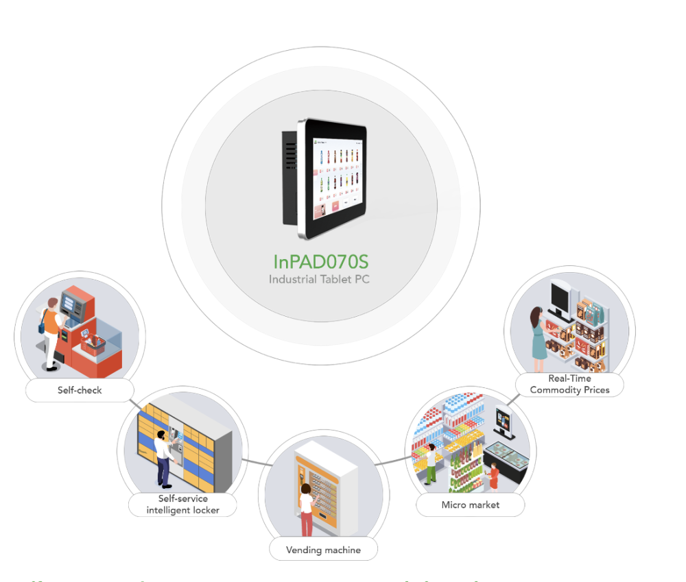

Application Diagram

  

  

## 1.2 Packing List

  

Note: Due to differences in product models and accessory selection, the following items may, but are not required, be included in the package.

| Type | Num | Description |
| --- | --- | --- |
| InPAD | 1 | InPAD series product |
| RS485 terminal | 1 | 5pin industrial green terminal |
| RS232 terminal | 2 | 3pin industrial green terminal |
| Product warranty card | 1 | Warranty period: 1 year |
| Antenna  （Optional accessories） | 1 | 3G/4G Antenna |
|  | 1 | Wi-Fi Antenna |
| AC power cord  （Optional accessories） | 1 | Power cord for American， English， Australian or European Standard |
| Power Adapter  （Optional accessories） | 1 | 12VDC Power Adapter |

  

  

  

  

  

  

  

## 1.3 Panel introduction and Structure and Dimensions

  

### 1.3.1 Front Panel

The front panel of this series of products is a high-brightness capacitive touch screen, which supports 7 inches (1024\*600) and 10.1 inches (1280\*800); the dustproof and waterproof level of the screen is IP65 (as shown in Figure 1\-3-1).

Figure 1\-3-1 Front Panel

  

### 1.3.2 Rear Panel

The rear panel of the InPAD070S product has two types of mounting holes:

1.  4 VESA mounting holes (75 x 75 mm, indicated by the red circles in Figure 1\-3-2). VESA mounting screws: M4 × 8 screws, screw depth: 8mm (maximum)
2.  4 mounting holes for hanging or fixed mounting components (indicated by the yellow circles in Figure 1.2). Mounting screws: M3 × 6 screws.

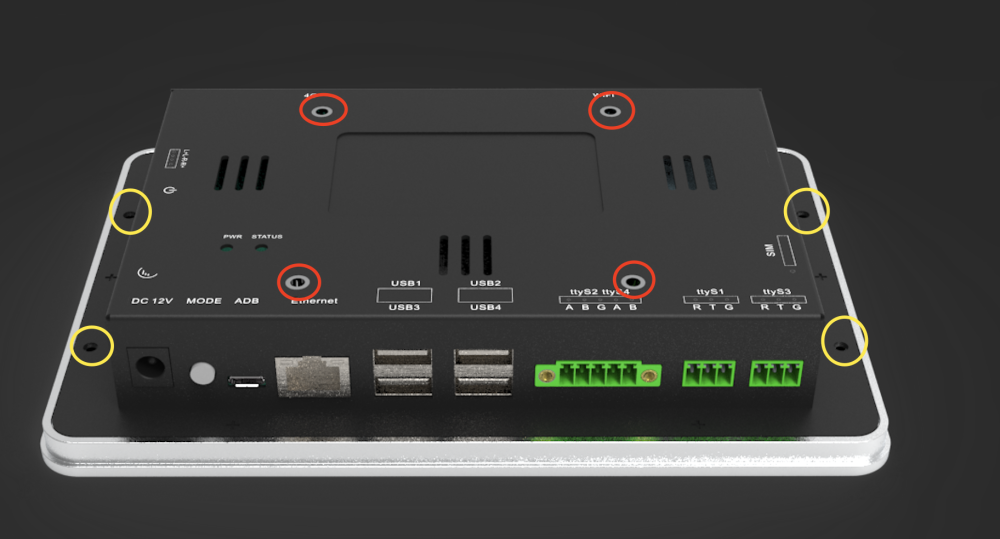

Figure1\-3-2 Rear Panel

  

### 1.3.3 Equipment Interface

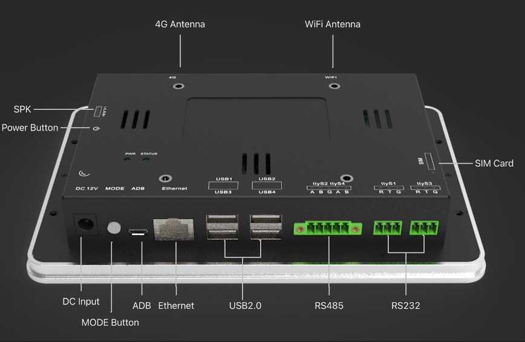

Figure1\-3-3 Rear Interface

  

This series is mainly divided into two types of equipment: InPAD070S and InPAD3101. The peripheral interfaces of the equipment are as follows: 

|  | InPAD070S | InPAD3101 |
| --- | --- | --- |
| Display | 7\-inch display   Resolution:1024x600 | 10.1\-inch display   Resolution：1280x800 |
| Button | PWR\*1，MODE\*1 |  |
| Power interface | Power input: DC-input, 12V, the power interface is a circular inter-face(5521) |  |
| SIM Card | SIM card slot \*1 |  |
| USB | USB2.0 \*4 |  |
| RS485 | RS485 serial port \*2,   5-pin industrial terminal, pitch 3.5mm, with flange \[respectively ttyS2, ttyS4\] |  |
| RS232 | RS232 serial port \*2,  3-pin industrial terminal, spacing 3.5mm, no flange |  |
| Network port | 10/100Mbps \*1，WAN/LAN |  |
| Antenna interface | Wi\-Fi\*1 ，4G\*1 |  |
| Debug interface | Micro USB \*1 |  |
| Bluetooth | 4.2 |  |

  

  

#### 1.3.3.1 RS485 Interface Definition

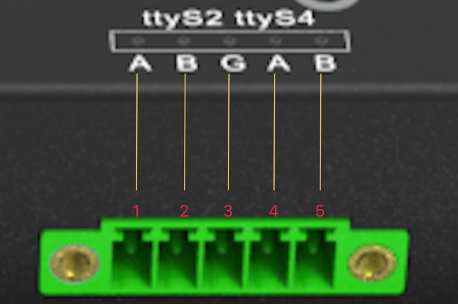

Figure1-3-3-1 RS485

| No. | Definition |
| --- | --- |
| 1 | RS-485 Signal A(ttyS2) |
| 2 | RS-485 Signal B(ttyS2) |
| 3 | GND |
| 4 | RS-485 Signal A(ttyS4) |
| 5 | RS-485 Signal B(ttyS4) |

  

#### 1.3.3.2 RS232 Interface Definition

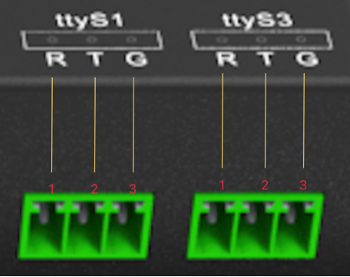

Figure1-3-3-2 RS232

| Number | Definition |
| --- | --- |
| 1 | RS-232 RxD |
| 2 | RS-232 TxD |
| 3 | RS-232 GND |

### 1.3.4 Equipment Indicators

#### 1.3.4.1 LED Indicator

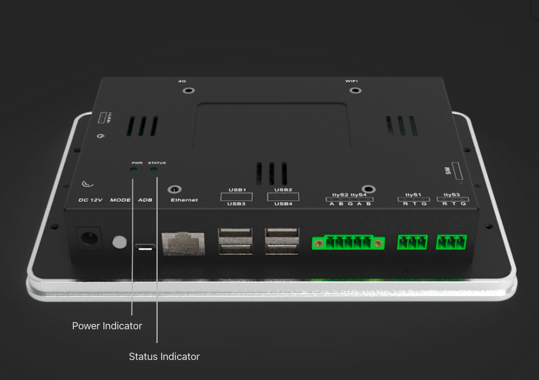

Figure1\-3-4-1 

| Indicator | Description |
| --- | --- |
| Power Indicator | Power supply indicator light, always on after power on |
| Status Indicator | Status indicator light, blinking during normal operation |

### 1.3.5 Dimensions

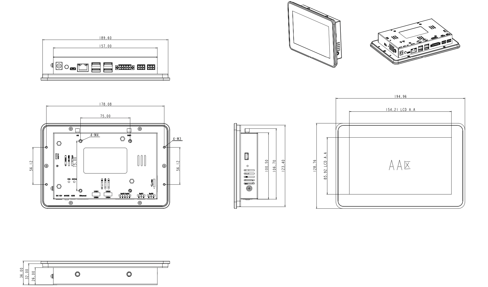

Figure1\-3-5-1 InPAD070S Dimensions

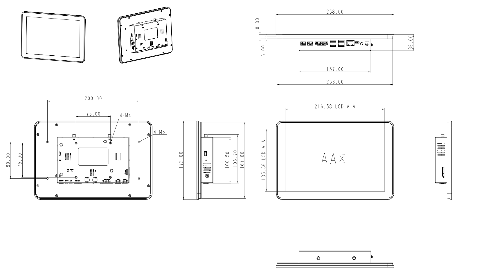

Figure1\-3-5-2 InPAD101S Dimensions

# 2. Installation

  

## 2.1 Precautions

4.  Power requirements: 12 V DC.
5.  Environmental requirements: Operating temperature –10°C to 60°C; storage temperature –40°C to 85°C; relative humidity 5% to 95% (no condensation).
6.  Keep out of direct sunlight, away from heat sources or areas with strong electromagnetic interference.
7.  Check that required cables and connectors are installed.

  

## 2.2 Equipment installation method

Note: This series of products is not equipped with mounting parts by default, and you need to choose the appropriate mounting parts for installation according to your own installation environment;

  

### 2.2.1 M3 hole installation 

2.  Step 1: Find a suitable installation position on the machine, and consider reserving a certain space for wiring operations.
3.  Step 2: Choose the appropriate installation method according to your installation parts, and fix the sheet metal parts to the back of the device and the installation panel through the screw holes, as shown in the figure below.

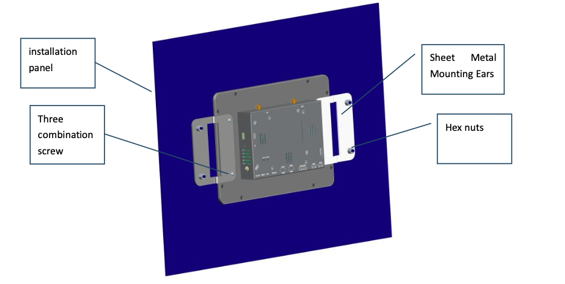

Figure2-2-1 Sheet Metal Mounting Ear Installation 

  

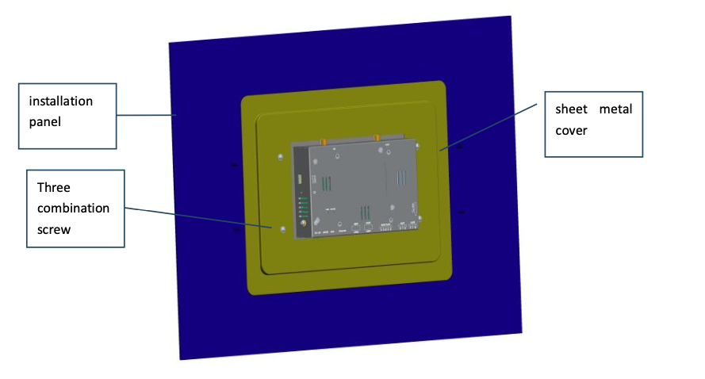

Figure2-2-1\-1 Sheet metal cover installation 

  

  

### 2.2.2 VESA standard hole installation

4.  Step 1: Find a suitable installation position on the machine, and consider reserving a certain space for wiring operations.
5.  Step 2: Choose the appropriate installation method according to your installation parts, and fix the sheet metal parts to the back of the device and the installation panel through the screw holes, as shown in the figure below.

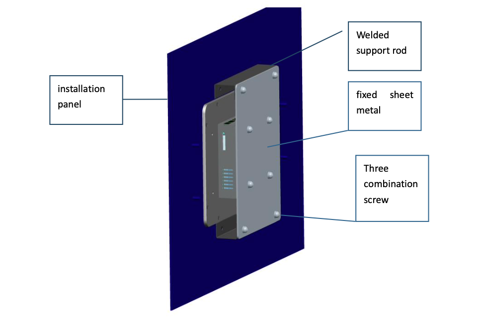

Figure2\-2-2 Fixed sheet metal installation 

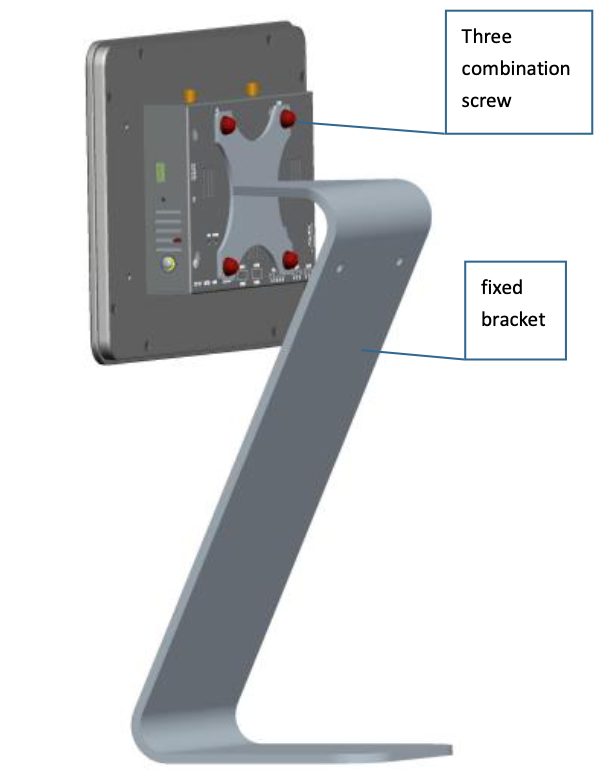

Figure2\-2-2\-1 Fixed bracket installation

  

  

## 2.3 Install ground protection

3.  Step 1: Loosen the ground nut.
4.  Step 2: Put the grounding ring of the cabinet grounding cable on the grounding post.
5.  Step 3: Tighten the ground nut.

Note: Ground the device to improve its immunity to interference. Depending on the environment of use, connect the ground wire to the grounding post of the device.

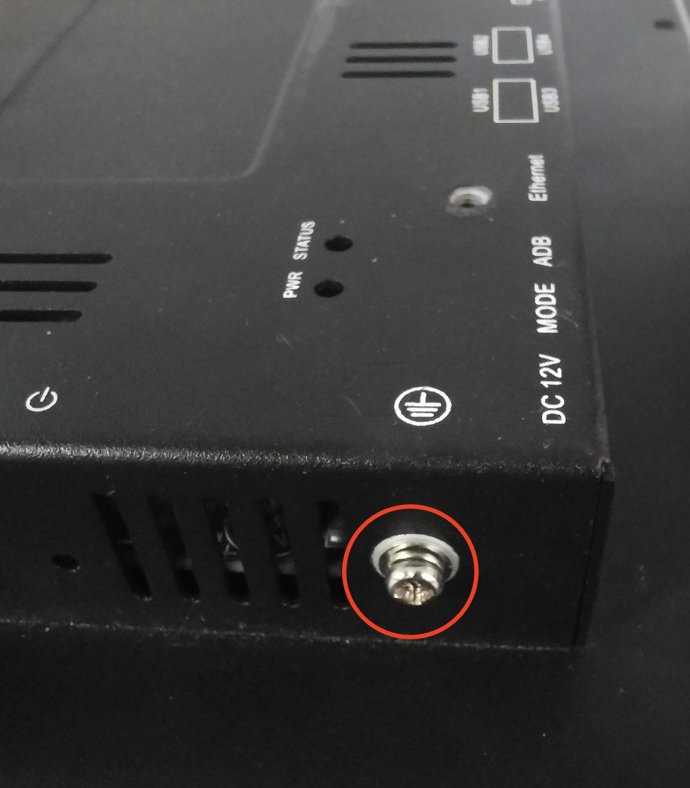

Figure2-3

  

# 3. Operation Instructions

  

## 3.1 Developer Options

Due to differences in versions and products, we have two ways to enter the developer mode,

2.  Click "Settings >> About Tablet" in the desktop application, click the “Build number” 5 times continuously, and prompt to enter the developer mode. At this point in the settings or System（Android12）page "Developer options" will appear.
3.  Click the "settings" application and then click "About tablet", successively click "Android security patch level" twice, "Baseband version" 3 times, "Android security patch level" 4 times, and then keep clicking the "Build number" until "You are now a developer" is indicated. Then users can find "Developer options" in the "settings" application.

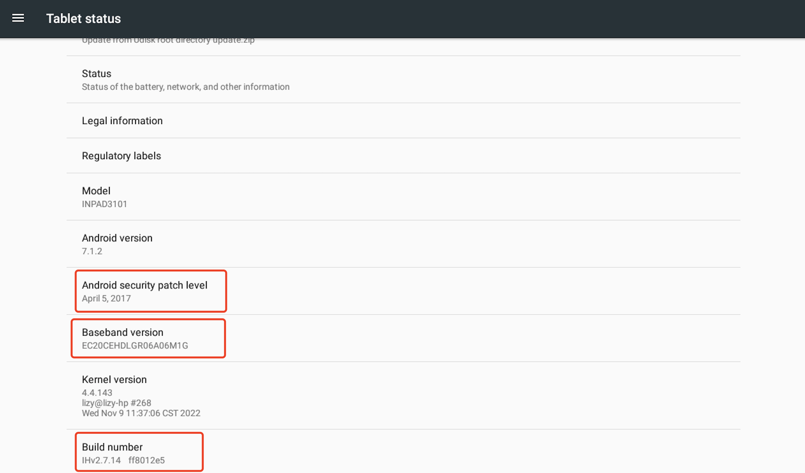

Figure3-1

In the developer options, commonly used function items include:

1\. Logging. After it is enabled, the system will record logs to the /data/logger directory.

2\. USB debugging. After it is enabled, users can access the device through the ADB interface.

3\. Hardware watchdog. Once enabled, a restart is required to take effect.

## 3.2 System Upgrade

Users can upgrade in Android system Settings or recovery mode through U disk, or send broadcast command to upgrade through ADB.

Method 1: Upgrade with U disk in Android system

  

If the current system is Android7.1:

Rename the upgrade file as "update.zip" and copy it to a U disk, then plug the U disk into InBOX/InPAD. Click " About tablet > > Udisk system updates in the "settings" application, as shown in figure 3-2-1, and the system will automatically upgrade and restart.

  

If the current system is Android12:

Rename the upgrade file as "update.zip" and copy it to a U disk, then plug the U disk into InBOX/InPAD. Click " System > > Udisk system updates in the "settings" application, as shown in figure 3-2-1, and the system will automatically upgrade and restart.

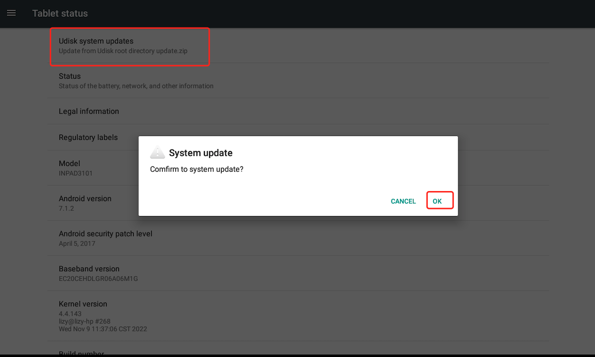

Figure3-2-1

Method 2. Send a broadcast command to upgrade:

1\. Rename the upgrade file to: update.zip, and copy it to the /sdcard directory of the device.

2\. Turn on USB debugging in the developer options.

3\. Execute the adb command:

“adb shell am broadcast -a com.ubox.upgraderom --include-stopped-packages

”

4. Device will upgrade and restart automatically if the command is executed successfully.

Note: Method 2 can be used for FOTA of InBOX/InPAD. Download the upgrade file to the “/sdcard” directory, rename it to update.zip, and execute the broadcast command:

“am broadcast -a com.ubox.upgraderom --include-stopped-packages”.

  

  

## 3.3 Display Setting

### 3.3.1 Full Screen

Click "Settings >> Display" in the desktop application, enable Full Screen display.

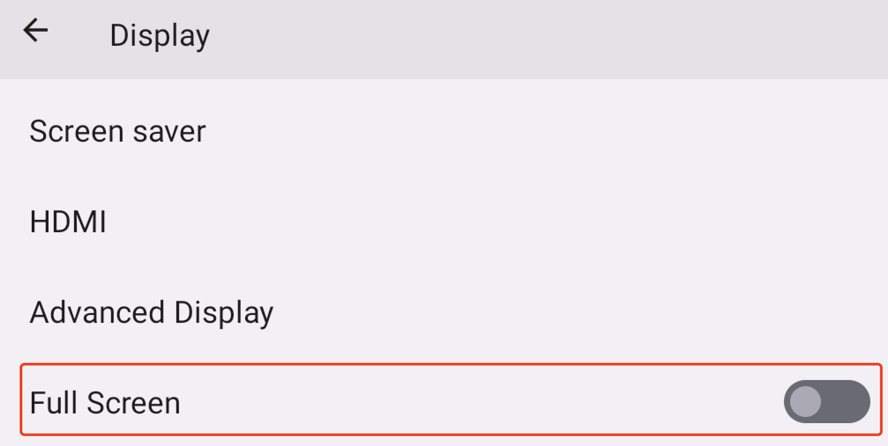 

Figure3-3-1\-1

After the prompt box "The device needs to be restarted for the settings to take effect" appears, click OK. As shown in Figure 3\-3\-2. After restarting the device will display in full screen.

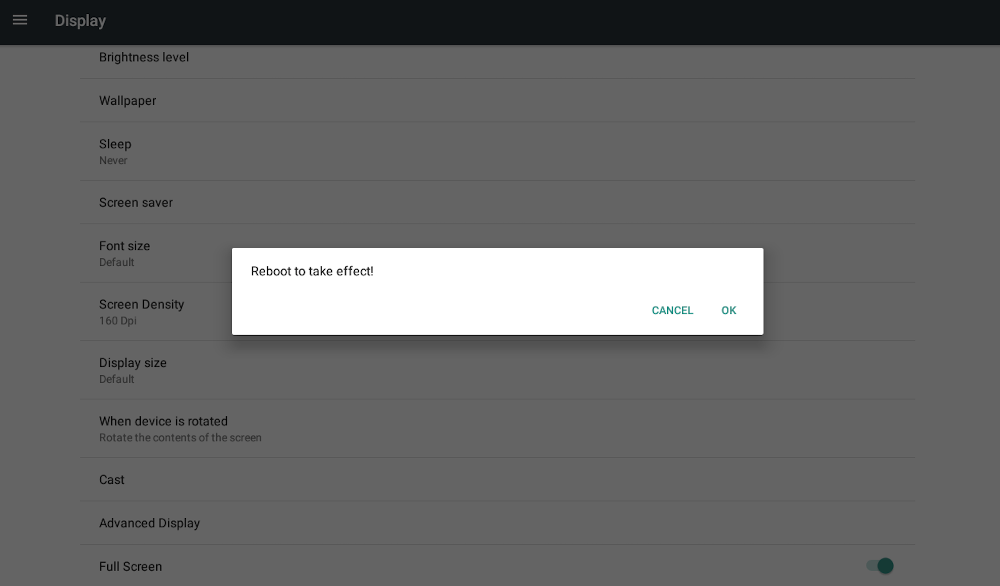

Figure3-3-1\-2

### 3.3.2 Screen Rotation Settings

Click "Settings > > Display > >Advanced Display", select "Rotation" to open the Rotation setting dialog box, and select the required rotation direction, as shown in Figure 3-3-2.

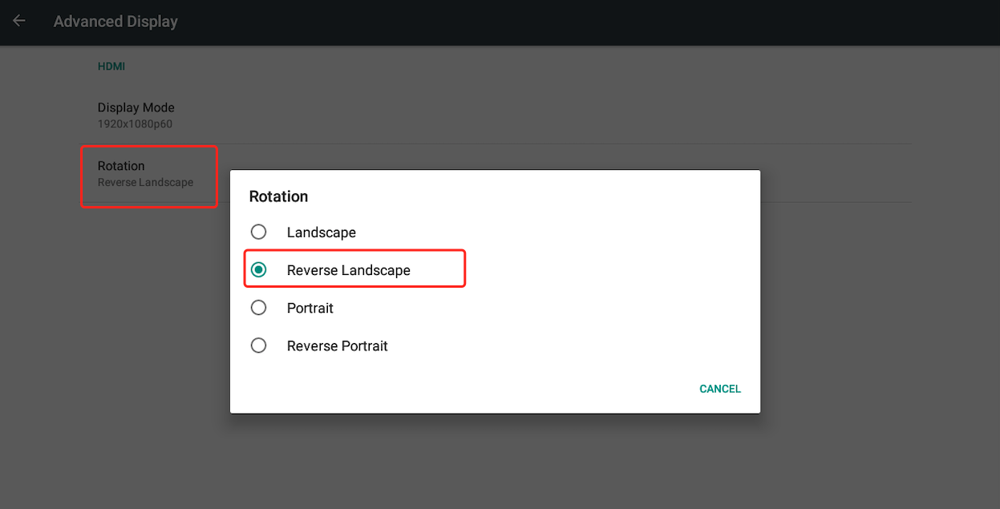

Figure3-3-2

After selecting the rotation, click OK in the pop-up dialog box of "Configuration Change, Need reboot", Then device will reboot to make the configuration take effort, as shown in Figure 3-3-2.

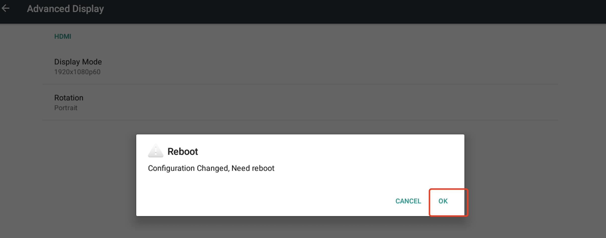

Figure3-3-3-2

  

## 3.4 Ethernet Settings

The Ethernet port of InBOX/InPAD can be used as WAN port or LAN port. It is disabled by default. As shown in Figure 3-4.

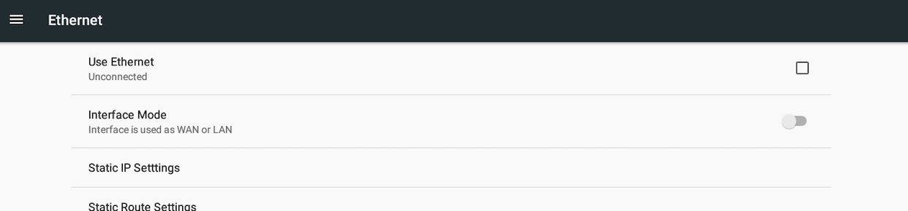

Figure3-4

  

### 3.4.1 Used As WAN Interface

If the current system is Android7.1:

Click "Settings > > Ethernet". And Click "Use Ethernet" to enable the Ethernet port. When enabled, the Ethernet is used as WAN interface by default. The WAN interface obtains IP address through DHCP by default. After successfully obtaining the address, the system will display the obtained WAN port IP address, netmask, default gateway, DNS server and other interface information, as well as routing information. As shown in Figure 3-4\-1.

  

If the current system is Android12:

Click "Settings \>\> Network&internet >> Ethernet". And Click "Use Ethernet" to enable the Ethernet port. When enabled, the Ethernet is used as WAN interface by default. The WAN interface obtains IP address through DHCP by default. After successfully obtaining the address, the system will display the obtained WAN port IP address, netmask, default gateway, DNS server and other interface information, as well as routing information. As shown in Figure 3-4\-1.

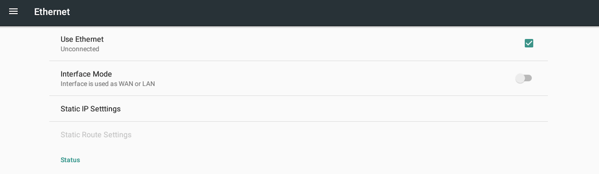

Figure3-4\-1

The WAN interface can set a static IP address. Click "Static IP Settings". On the "static IP address" page, click "Use static IP" to set the IP address, netmask, default gateway, preferred DNS server and alternative DNS server of the WAN interface. Click save in the upper right corner to save the configuration. As shown in figure 3-4\-1-1.

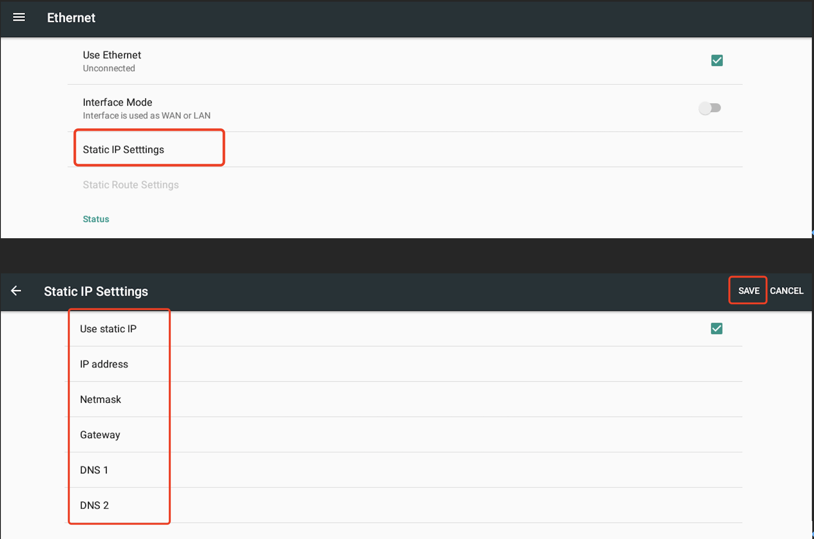

Figure3-4\-1-1

On the Ethernet page, users can see the IP address, netmask, default gateway, DNS server and other information of the WAN interface, as well as the generated routing information.

  

### 3.4.2 Used As LAN Interface

On the "Ethernet" page, click "Use Ethernet" to enable Ethernet. Click "interface mode", and the Ethernet will be used as a LAN interface. The default IP address of LAN interface is 192.168.1.100 and the mask is 255.255.255.0. As shown in Figure 3-4\-2.

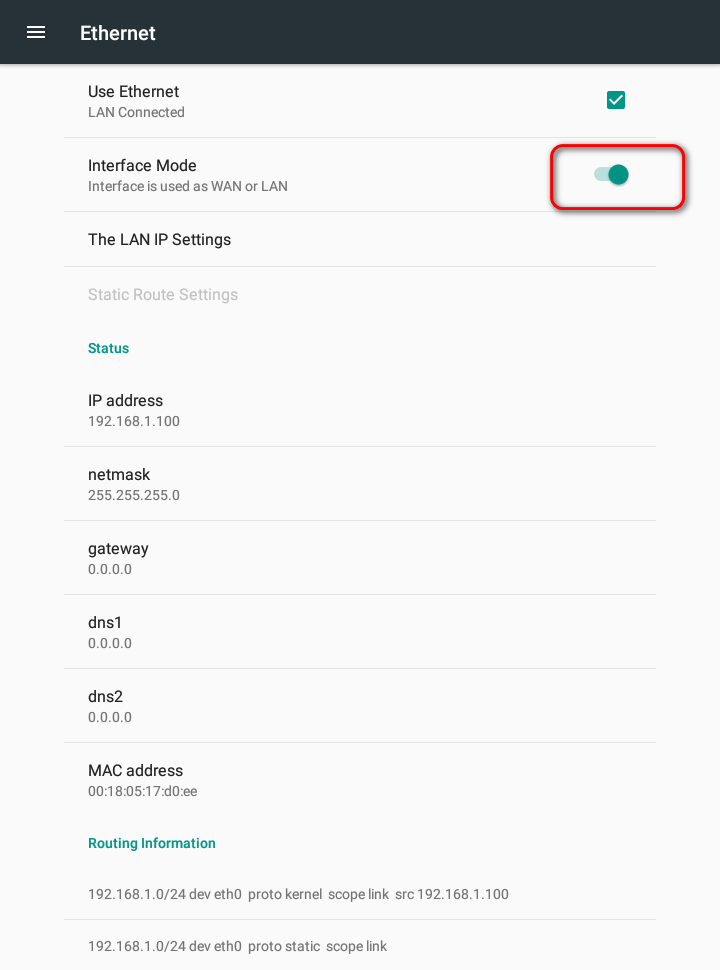

Figure3-4\-2

On the "Ethernet" page, click "The LAN IP Settings". Users can customize LAN interface IP settings. On the "The LAN IP Settings" page, modify the IP address and netmask, and click "SAVE" to save the configuration. As shown in Figure 3-4\-2-1.

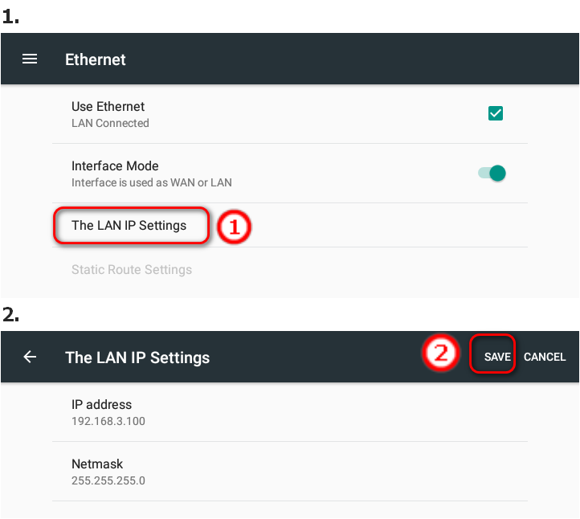

Figure3-4\-2-1

Then on the "Ethernet" page, Users can see information of LAN interface.

  

  

## 3.5 Wi\-Fi Settings

Make sure the Wi\-Fi antenna is connected before enabling WLAN interface.

  

If the current system is Android7.1:

Click "Settings > > Wi-Fi". Click the switch symbol in the upper right corner to turn on Wi\-Fi. As shown in Figure 3-5.

If the current system is Android12:

Click "Settings >> Network&internet > > Internet>>Wi\-Fi". Click the switch symbol in the upper right corner to turn on Wi\-Fi. As shown in Figure 3-5.

  

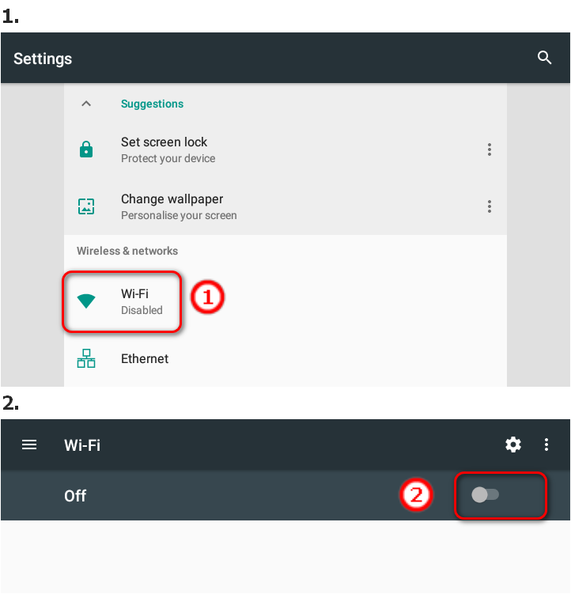 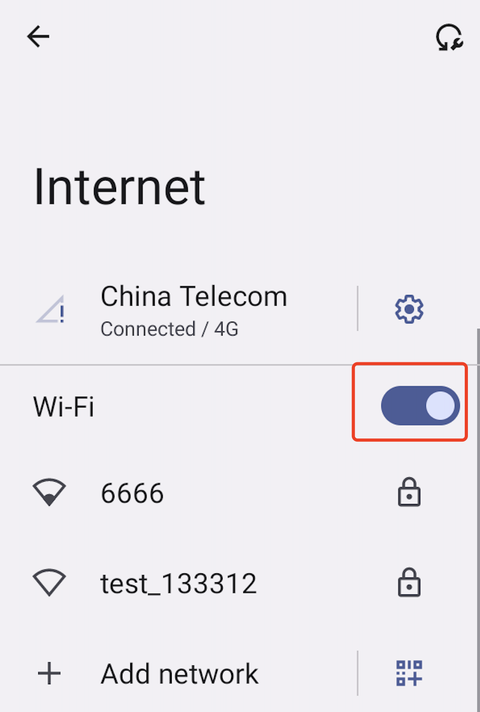

Figure3-5（left Android7.1；right Android12）

In the Wi\-Fi networks list, the SSID and security settings (open network or WPA / WPA2 protection) of the surrounding Wi\-Fi networks will be automatically scanned. Select one of the Wi\-Fi networks to connect. When the encrypted network is selected, the enter password dialog box will pop up automatically. Enter the password and click "CONNECT". As shown in figure 3-5\-1.

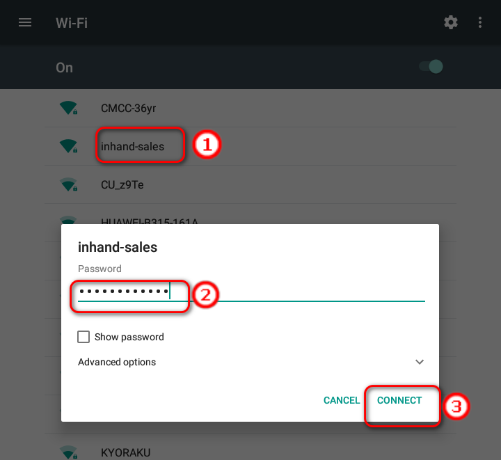

Figure3-5\-1

If the connection is successful, the Wi-Fi will be displayed in the network list. Click the connected network to display the status information, signal strength, connection speed, security and frequency of the current network, as shown in Figure 3-5\-2.

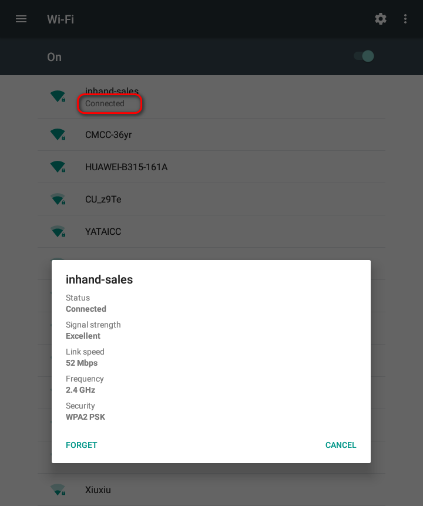

Figure3-5\-2

When users need to remove the current network, select "FORGET" in the current network information dialog box. 

Click the setting symbol in the upper right corner, users can see the MAC address and IP address of the Wi\-Fi interface. As shown in figure3-5\-3

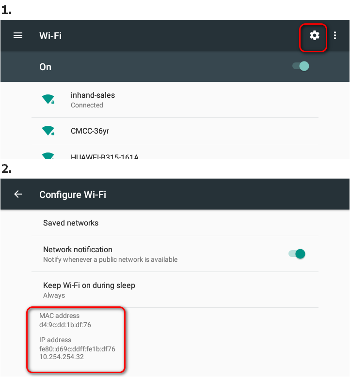

Figure3-5\-3

  

  

## 3.6 4G Settings

### 3.6.1 APN Settings

If the current system is Android7.1:

Click "Settings > > more > >Cellular networks > > Access Point Names ", click the add symbol in the upper right corner, fill in the name and APN, and click the upper right corner to save. As shown in Figure 3-6-1.

  

If the current system is Android12:

Click "Settings > > Network&internet > >SIMs > > Access Point Names ", click the add symbol in the upper right corner, fill in the name and APN, and click the upper right corner to save. As shown in Figure 3-6-1.

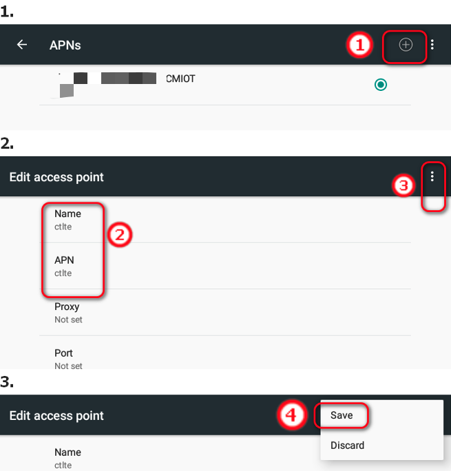

Figure 3-6-1

  

 In the APN list, select the added APN. As shown in Figure 3-6\-2.

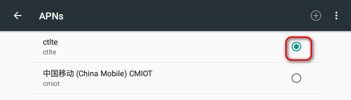

Figure 3-6-2

### 3.6.2 ICMP Detection

If the current system is Android7.1:

Inbox/InPAD supports network detection and automatically detects the current network connectivity. If the detection fails, Inbox/InPAD will automatically redial. Click "Settings > > more > >ICMP detection" to the ICMP detection page. ICMP detection is enabled by default. Click "Configure ICMP detail", in the pop-up dialog box, set parameters such as detection server, and then click save. As shown in Figure 3\-6-2.

If the current system is Android12:

Inbox/InPAD supports network detection and automatically detects the current network connectivity. If the detection fails, Inbox/InPAD will automatically redial. Click "Settings > > Network&internet > >ICMP detection" to the ICMP detection page. ICMP detection is enabled by default. Click "Configure ICMP detail", in the pop-up dialog box, set parameters such as detection server, and then click save. As shown in Figure 3-6-2.

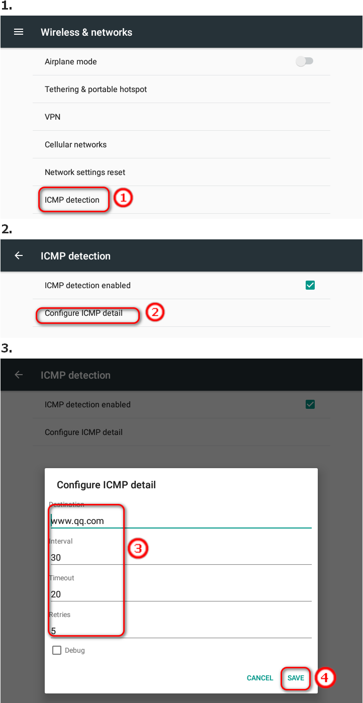

Figure 3-6-2

## 3.7 File Management

Select the "File Explorer" application to view the files and folders of the system. Users can also view external storage. File path of built in SD card is: / MNT / sdcard.

  

## 3.8 Application Installation and Uninstallation

### 3.8.1 Application Installation

Select the "File Explorer" application, find the installation file (APK file) in the "File" tab and click it. The installation prohibition dialog box will pop up for the first installation. Click "SETTINGS" to enable "Unknown source" in the "security" interface, as shown in Figure 3\-8-1. Then you can return to the File Explorer and click the installation file to complete installation.

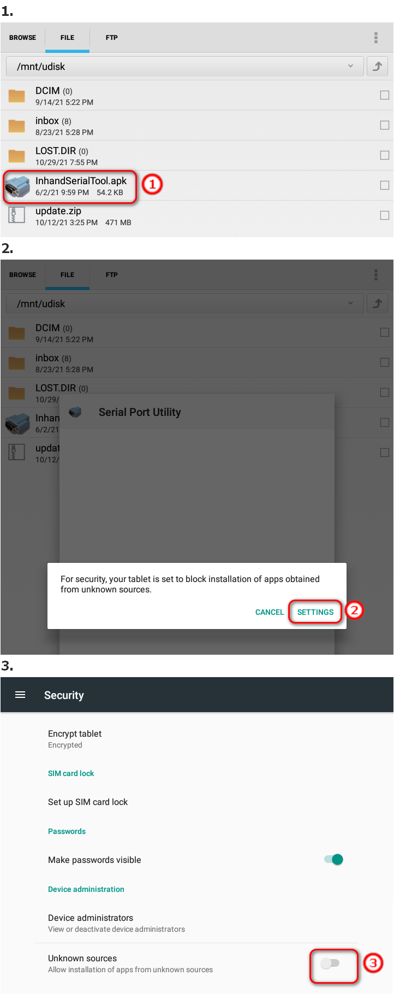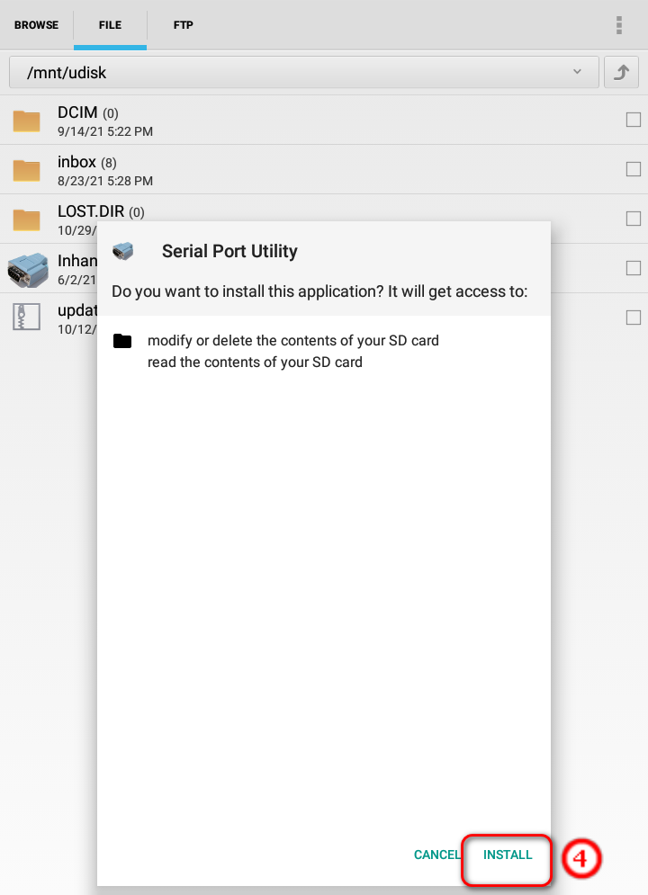

Figure 3-8-1

### 3.8.2 Application Uninstallation

Click "Settings > > Apps", click the application to be uninstalled in the application list, click "UNINSTALL", and click "OK" in the application information dialog box to uninstall the application.

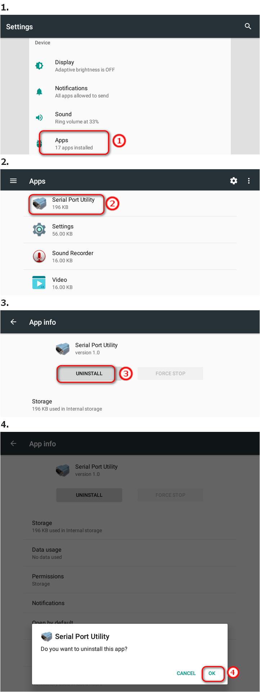

Figure 3-8-2

## 3.9 Serial Test

This chapter mainly test whether the serial port communication on InBOX/InPAD is working normally. Connect the serial port on the InBOX/InPAD to the serial port on the PC with a serial Convertor, as shown in Figure 3-9.

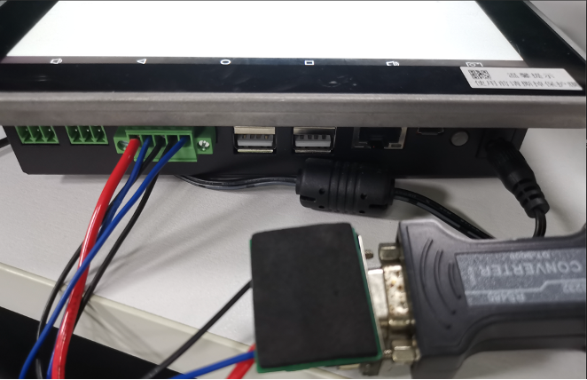

Figure 3-9

View the connected serial port through the device manager on the PC, as shown in Figure 3-9-1.

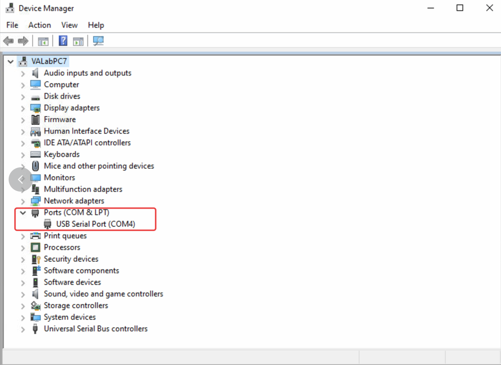

Figure 3-9-1

Download and run the serial port test APP on the device, as shown in Figure 3-9-2.

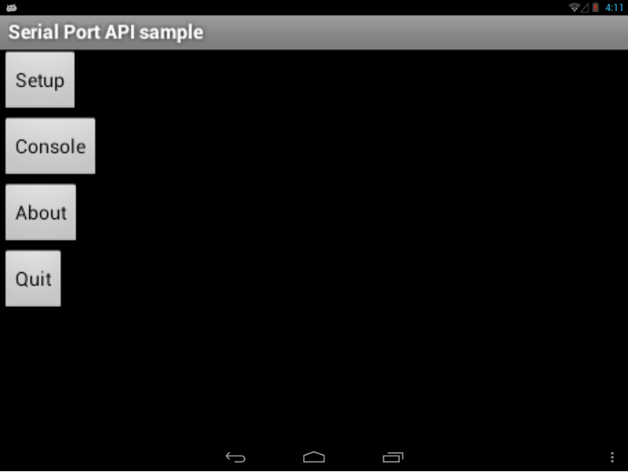

Figure 3-9-2

Click setup, select the serial port you connected in Device. And set the baud rate, as shown in Figure3-9-3.

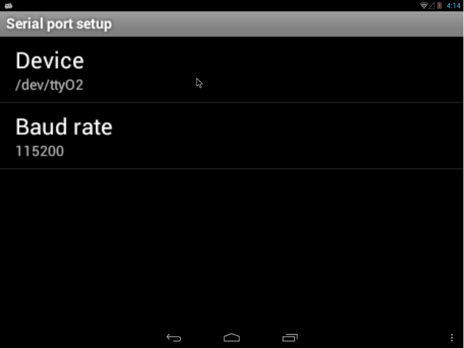

Figure3-9-3

Open "Console" after configuration, as shown in Figure3-9-4.

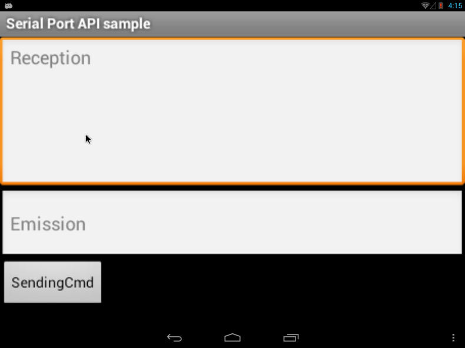

Figure3-9-4

  

Open the serial port assistant on the PC side, set the correct port, and configure the baud rate to be consistent. Then test serial port by sending data in both device and PC sides.

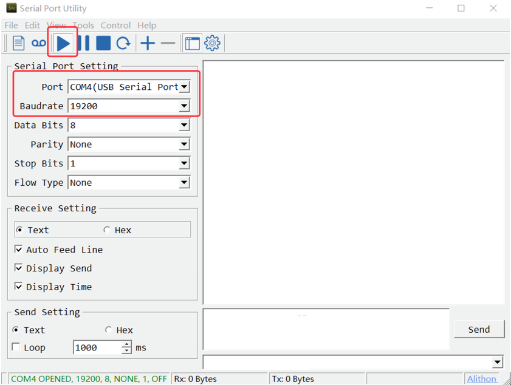

Figure 3-9-5

  

  

## 3.10 Backup and Reset

If the current system is Android7.1:

Click "Settings > > Backup & reset > > Factory data reset > > RESET TABLET". Please use this function with caution. After selecting the factory setting, all data on the product will be clear.

  

If the current system is Android12:

Click "Settings > > System >> Reset options > > Erase all data > > RESET TABLET". Please use this function with caution. After selecting the factory setting, all data on the product will be clear.

  

  

## 3.11 On/off Button

Press and hold On/off button for more than 1 second, then select and restart the InBOX/InPAD, as shown in Figure 3-11.

Figure 3-11

  

## 3.12 MODE Button

MODE button can be programmed to realize some special functions.

1