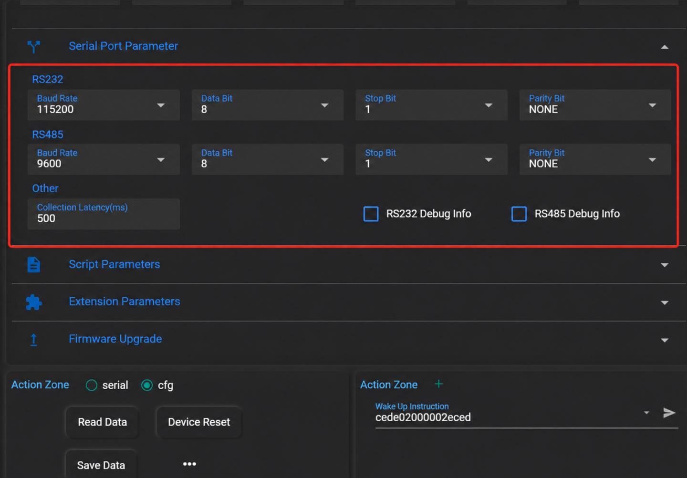
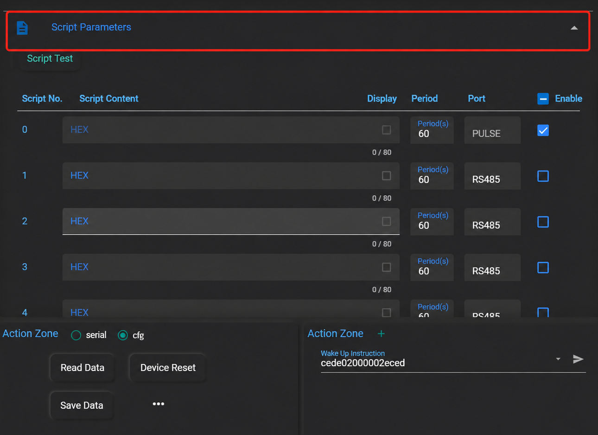
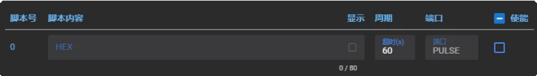
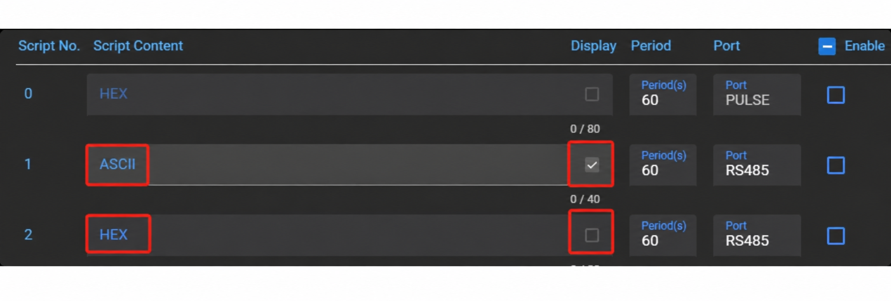
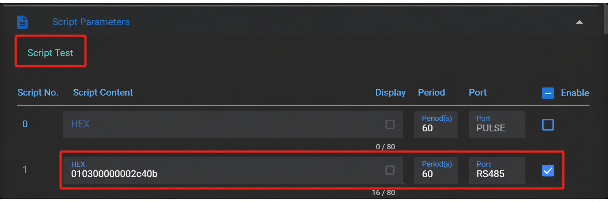
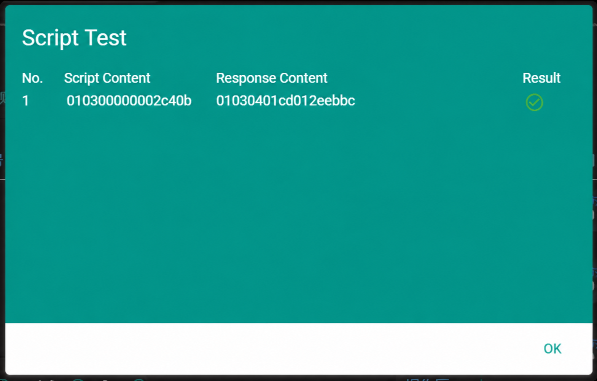
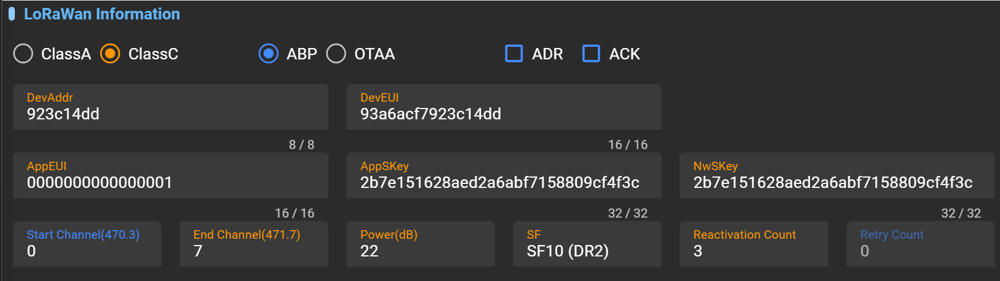
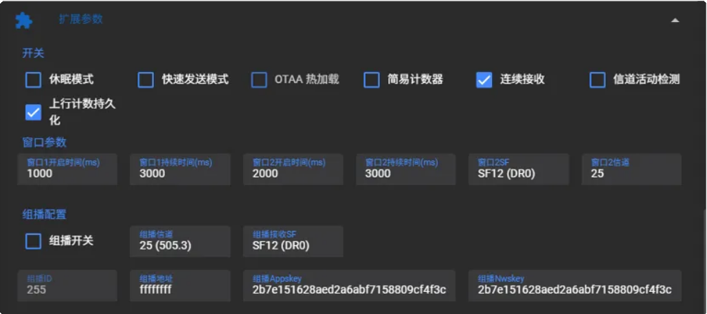

# LT312 User Manual

**LoRaWAN  DTU Series** **User Manual**

Version1.0 | www.inhand.com.cn

The software described in this manual is provided under a license agreement and may only be used in accordance with the terms of that agreement.

## Copyright Notice

© 2025 InHand Networks. All rights reserved.

## Trademarks

The InHand logo is a registered trademark of InHand Networks.

All other trademarks or registered trademarks mentioned in this manual belong to their respective manufacturers.

## Disclaimer

The company reserves the right to make changes to this manual without prior notice when the product is subsequently modified. The company shall not be liable for any direct, indirect, intentional or unintentional damage or hazards caused by improper installation or use.

## 1 Introduction

This user manual will guide you on how to use this product. Please read this user guide carefully before using the product.

All contents of this document are legally protected. Without permission, no organization or individual may reproduce or distribute this document in any way.

We make every effort to ensure the accuracy of this document, but unavoidable errors may still exist. We will periodically review the contents of this document to keep it consistent with the corresponding product. We would greatly appreciate your suggestions.

The following describes the correct usage of the product to prevent danger and property damage. Please read this manual carefully before using the device and strictly follow it during use.

## 2  Safety Instructions

- Avoid placing the device in direct sunlight, near heat sources, or in flammable, explosive, humid, dusty, or sooty environments

- Keep away from fire, strong electric fields, strong magnetic fields, and complex interference sources to avoid permanent damage

- Avoid large metal equipment during installation; the antenna must not be placed inside a metal enclosure

- Do not install on high-vibration equipment; avoid external impact or vibration.

- Do not allow liquid to drip or splash into the device; outdoor installation requires proper waterproofing.

- Wiring must be performed with the device powered off, and strictly follow the manual.

- This product emits radio frequency signals, which may interfere with other wireless communications; this cannot be completely avoided in certain environments.

- Strictly follow the requirements of this manual during use. The company is not responsible for damage caused by improper operation.

- Do not modify this product; avoid using it in environments beyond the specified temperature and humidity range

- When removing the housing, be careful not to lose or damage internal components.

## 3 User Guide

### 3.1 Configuring the LT312

**Preparation:**

1. LT312 device;

2. RS485 or RS232 device (referred to as the “application device”);

3. USB-to-RS485 / USB-to-RS232 cable;

4. PC;

5. Inhand-Toolbox configuration tool software;

**Configuration steps:**

1. Set the LT312 serial port parameters so they match those of the application device;

2. Set the LT312 to transparent transmission or timed acquisition reporting;

3. Set the LT312 communication frequency to match the LoRaWAN gateway;

4. Fill in the network access parameters on the LoRaWAN server / LoRaWAN edge gateway (a gateway with a LoRaWAN server) to register the LT312 device.

#### 3.1.1 Obtaining Device Information

1. Connect the LT312 to the PC via USB-to-RS485 or USB-to-RS232, then open the Toolbox tool;

2. Set the serial port parameters, click Open Serial Port, click “Read Data” to obtain all LT312 parameters;

#### Default Serial Port Parameters

| Serial Port Parameter | RS485 | RS232 |
| --- | --- | --- |
| Baud Rate | 9600 | 115200 |
| Data Bits | 8 | 8 |
| Stop Bits | 1 | 1 |
| Parity | None | None |

#### 3.1.2 Serial Port Parameter Settings

In this step, configure the LT312 serial port parameters to match those of the application device so that the LT312 and the application device can establish serial communication.

1. Serial Port Acquisition Delay:

At low baud rates with multiple script acquisition, the serial acquisition delay should be extended appropriately; otherwise acquisition failures may occur. Applicable when the baud rate is below 1200.

2. Baud Rate Settings:

110/300/600/1200/2400/4800/9600/14400/19200/38400/43000/57600/76800/115200

3. RS485 Debug Information:

Once enabled, more detailed serial data on the 485 interface can be printed for easier testing and debugging.

4)  RS232 Debug Information:

Once enabled, more detailed serial data on the 232 interface can be printed for easier testing and debugging.

> Note: Some sensors may fail acquisition because of the DTU debug print information. Therefore, it is recommended to disable serial debug information during script acquisition

#### 3.1.3 Working Mode Settings

Transparent transmission mode:

The LT312 is shipped with transparent transmission mode enabled by default. In transparent mode, the LT312 obtains data from the application device in two ways:

- The application device actively reports data; the LT312 uploads the received data to the gateway;

- The gateway sends a command to the LT312 to obtain data from the application device.

Active acquisition mode:

Since most LoRaWAN gateways have few downlink channels, the LT312 features script-based acquisition. This function uses configuration commands sent by the LT312 at a configured interval to obtain data from the application device, thereby reducing the downlink load on the gateway.

> Note: A script is a command sent to the application device to read data. When writing a script, refer to the application device's communication protocol.

1.  Script 0 is the heartbeat packet, used to periodically report device information to determine whether the device is online; the interval is configurable. (For detailed parsing, refer to Section 3.3 of the communication protocol.) (The contents of this heartbeat packet cannot be modified)

2.  Scripts support both HEX and ASCII formats, with a maximum length of 40 bytes.

3. Up to 16 scripts are supported for acquisition. With multiple scripts, allocate the acquisition intervals reasonably.

4. The minimum acquisition interval is 10 s and the maximum is 86400 s.

> Note: Set the minimum acquisition interval according to the sensor device status; setting it too short may cause acquisition failure.

5. After configuring a script, you can verify its correctness. Fill in the script, check the script enable option, and click Script Test.

> Note: Script testing requires the corresponding sensor device to be connected to the corresponding serial port. Also make sure the wiring is correct.

The steps above complete the communication configuration between the LT312 and the application device. Next, configure communication between the LT312 and the LoRaWAN network

#### 3.1.4 Basic LoRaWAN Configuration

Before connecting the device to the LoRaWAN network, the relevant network communication parameters must be set,

and complete the LoRaWAN network configuration as follows

If you are unfamiliar with common LoRaWAN parameters, refer to the following table for their meanings:

| Parameter | Description |
| --- | --- |
| DevAddr | Device short address: used for ABP network access; can be found on the product label. |
| DevEUI | Unique device identifier: used for OTAA network access; can be found on the product label. |
| AppEUI | Application identifier: a 64-bit globally unique identifier used to identify and manage a specific application in the LoRaWAN network. Default:  0000000000000001 |
| AppSKey | Application session key: used in ABP mode; the key used to encrypt and decrypt data transmitted between the device and the application server. Default key:  2b7e151628aed2a6abf7158809cf4f3c |
| NwkSKey | Network session key: used in ABP mode; the key used to encrypt and decrypt data transmitted between the device and the network server, and used for device authentication. Default key:  2b7e151628aed2a6abf7158809cf4f3c |
| AppKey | Application key: used in OTAA mode; the key used to encrypt and decrypt data transmitted between the device and the application server, and used for device authentication. Default key:  2b7e151628aed2a6abf7158809cf4f3c |
| ABP Mode | Local activation: a method for LoRaWAN devices to join the network. The device's network session key, application session key, and short address are pre-configured at the factory, allowing plug-and-play communication. Suitable for application scenarios that do not require frequent key changes. |
| OTAA Mode | Over-the-air activation: a method for LoRaWAN devices to join the network. Device activation is performed through dynamic key negotiation and over-the-air transmission, providing higher security and flexibility. Suitable for mobile and cross-network application scenarios . |
| Class A | Class A device: uses the standard ALOHA communication mode, including uplink, downlink, and fixed receive windows. Suitable for most low-power sensors and application scenarios. |
| Class C | Class C device: keeps receive window 2 open at all times to ensure downlink messages can be received at any time. Suitable for application scenarios requiring low latency and high-frequency downlink communication. |
| ADR | Adaptive data rate: when enabled, the network server can adjust the terminal's data rate and power consumption. Recommended when the device is stationary. |
| ACK | Acknowledgement: a message confirming successful packet reception, ensuring reliable data transmission. Suitable for application scenarios requiring high reliability. |
| Initial Channel | The first frequency channel used when the device joins the LoRaWAN network or communicates for the first time. |
| End Channel | The last frequency channel used by the device within the configured frequency range, ensuring communication within the specified spectrum range . |
| Power | Transmit power: 27 dBm by default for the PA version, 22 dBm by default for the standard version |
| SF | Spreading factor: when ADR is disabled, the device transmits data using the configured SF. The smaller the SF, the higher the transmission rate, which suits short-distance transmission, and vice versa. Setting range:  7-12 |
| Number of Re-activations | In OTAA mode, the number of times the device retries network access after a failure. |

### 3.2 Extended Parameters

| Function | Description |
| --- | --- |
| Sleep Mode | After transmitting data, the DTU automatically enters low-power mode. Suitable for battery-powered applications. Note: The LT312 is not a low-power DTU. Do not enable this feature. |
| Fast Transmission Mode | Sacrifices downlink reception performance for the fastest acquisition and upload. In special cases, transparent mode can send 1 data packet per second at the fastest. Note: In fast transmission mode, downlink data may not be received. |
| OTAA Hot Reload | After successful network access in OTAA mode, a power-off restart does not require re-registering; the device can communicate directly. |
| Simple Counter | Uplink counter up to 65535; disabled by default. Note: To use this feature, coordination with the LoRaWAN server is required. |
| Continuous Reception | When enabled, power consumption increases but reception stability improves. |
| Channel Activity Detection | Quickly determines whether there is ongoing LoRa signal transmission on the current LoRa channel. If the channel is detected idle, data is sent immediately; if the channel is detected busy, it waits a while and retries. |
| Uplink Counter Persistence | The terminal's uplink counter is not cleared on power loss; restoring factory settings clears the counter. |
| Window 1 Open Time | Default 1 s. Changing is not recommended; contact technical personnel if issues arise. |
| Window 1 Duration | Default 3 s. Changing is not recommended; contact technical personnel if issues arise. |
| Window 2 Open Time | Default 2 s. Changing is not recommended; contact technical personnel if issues arise. |
| Window 2 Duration | Default 3 s. Changing is not recommended; contact technical personnel if issues arise. |
| Window 2 SF | The spreading factor of receive window 2. Default SF12, settable from SF7 to SF12. When the DTU is modified, change the server's window 2 spreading factor accordingly. Used for frequent downlink data packets to multiple Class C devices. Note: Modifying requires coordination with the LoRaWAN server. |
| Window 2 Downlink Channel | Default channel 25 (505.3). Used for frequent downlink data packets to multiple Class C devices. Note: Modifying requires coordination with the LoRaWAN server. |
| Multicast Switch | When enabled, DTUs can be configured in batches. |
| Multicast Channel | Default channel 25 (505.3 MHz), window 2 downlink frequency |
| Multicast Window 2 SF | Default SF12 (DR0), window 2 downlink spreading factor |
| Multicast Address | Default: ffffffff, multicast short address |
| Multicast AppSKey | Multicast application key Default:  2b7e151628aed2a6abf7158809cf4f3c |
| Multicast NwkSKey | Multicast network key: Default:  2b7e151628aed2a6abf7158809cf4f3c |

### 3.3 Communication Protocol

Both uplink and downlink data of the device are based on hexadecimal format.

**1. Restart packet**

Restart packet port:  214

Data packet:

01 indicates hardware restart

03 indicates software restart

04 indicates hardware watchdog restart

05 indicates software watchdog restart

**2. Uplink data packet**

Heartbeat packet parsing

Heartbeat packet port:  40

Heartbeat packet: cede3400003c0a8201460000000100000000c6eced

| cede | Header |
| --- | --- |
| 34 | Packet type; 34 indicates a heartbeat packet |
| 00003c | Heartbeat packet period, unit s, decimal:  60 s |
| 0a82 | Module temperature, unit °C, decimal / 100:  26.9 °C |
| 0146 | Module voltage, unit V, decimal / 100:  3.26 V |
| 00000001 | Script 1 enabled 4 bytes, 32-bit data; each bit represents the on/off state of one script; 0 = off, 1 = on |
| 00000000 | Number of scripts currently collected successfully Example: if 3 scripts are all collected successfully, it displays 00000003 |
| C6 | XOR checksum |
| eced | Packet tail |

#### Power-on Packet Parsing

Power-on packet port:  215

Power-on packet:  110401020000000104

| 11 | Device type: power-enhanced DTU 10: standard version DTU |
| --- | --- |
| 04 | Communication protocol:  04 |
| 0102 | Software version:  1.2 |
| 00000001 | Indicates script 1 is enabled 4 bytes, 32-bit data; each bit represents the on/off state of one script; 0 = off, 1 = on |
| 04 | Device battery level 04: full |

#### Packet Port Description

| Port No. | Description |
| --- | --- |
| 214 | Restart packet |
| 215 | DTU power-on packet |
| 40 | Heartbeat packet |
| 42 | Data packet returned for a get-command |
| 43 | Reply packet for downlink configuration data |
| 51 | RS232 transparent uplink data packet |
| 52 | RS485 transparent uplink data packet |
| 1 | Script 1 data packet |
| 2 | Script 2 data packet |
| 3 | Script 3 data packet |
| … | … |
| 15 | Script 15 data packet |
| 16 | Script 16 data packet |
