# MO-62A Hardware Interface Description

This document summarizes MO-62A from a hardware perspective: system structure, power and boot behavior, on-board peripheral interfaces, and the 40-pin expansion definition, with pointers to datasheets. The tone is descriptive; user-facing cautions are added where selection and cabling matter.

---

## On this page

| Section | Summary |
| --- | --- |
| [Connector quick reference](#connector-quick-reference) | Find the physical interface by use case |
| [System block diagram](#system-block-diagram) | Board-level functional blocks |
| [Processor block diagram](#processor-block-diagram) | SoC-side resource overview |
| [Power](#power) | USB-C supply requirements and risks |
| [Boot mode](#boot-mode) | Behavior with or without SD card |
| [Storage](#storage) | LPDDR4, Micro SD, EEPROM |
| [On-board interfaces](#on-board-interfaces) | Ethernet, USB, display, fan, audio, camera, wireless, RTC |
| [Expansion interface (40-pin)](#expansion-interface-40-pin) | GPIO header pin table |
| [LEDs and debug port](#leds-and-debug-port) | LED roles and serial debug header |
| [Key components and references](#key-components-and-references) | Major ICs and local datasheet links |

---

## Connector quick reference

Use this table to map a goal to the right connector; details are in the sections below.

| Goal | Suggested interface | Notes |
| --- | --- | --- |
| Power the board | USB Type-C (5 V) | Use an adapter that can sustain **5 V at ≥ 3 A** |
| Local display | Micro HDMI | Up to **1080p** |
| Wired Ethernet | RJ45 Gigabit | **PoE** requires an add-on PoE expansion board; the on-board RJ45 alone is **not** a PoE powered-device interface |
| Keyboard, mouse, USB storage | 4 × USB 2.0 Type-A | USB **2.0** speed |
| Data to PC or shared USB (depends on image) | USB Type-C | Same connector as power; electrical roles in [Power](#power) |
| MIPI camera (e.g. IMX219 class) | 22-pin FPC CSI | Raspberry Pi–compatible mechanical footprint; MIPI CSI-2 |
| Headset or microphone | 3.5 mm 4-pole jack | Microphone input included |
| Better Wi-Fi / Bluetooth | On-module radio + **U.FL antenna** | Without an antenna, RF performance is usually much worse |
| Sensors, buses, GPIO | 40-pin header | Mostly **3.3 V** GPIO by default; pin list in [Expansion interface (40-pin)](#expansion-interface-40-pin) |
| Active cooling | 4-pin PWM fan | 1.0 mm pitch connector |
| RTC backup | RTC + external coin cell holder | Battery type in the RTC subsection |
| Headless bring-up / serial login | 3-pin debug header (UART) | Boot and console output; **115200 8N1** |

---

## System block diagram

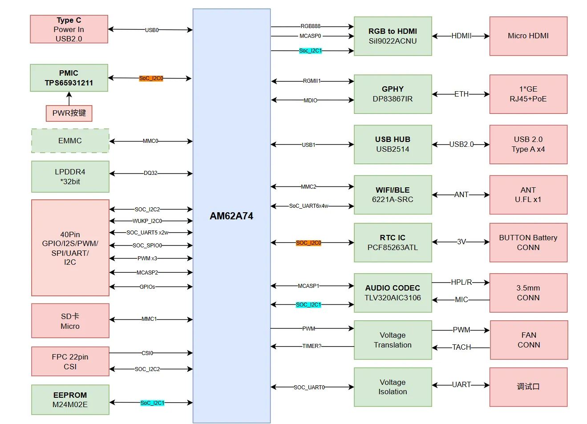

---

## Processor block diagram

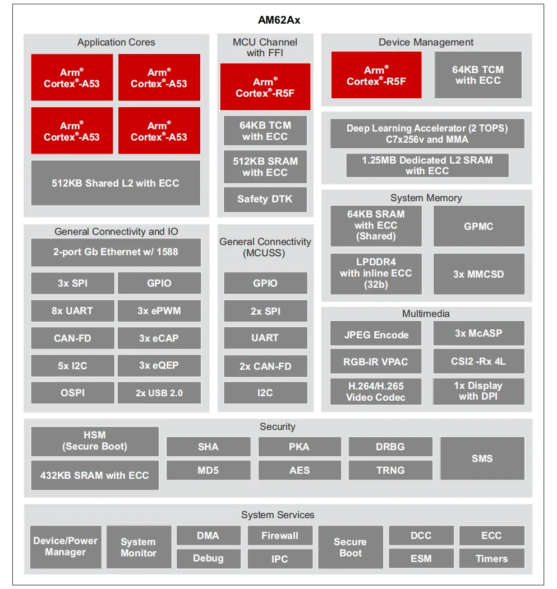

---

## Power

### USB-C power input

MO-62A takes power through **USB-C**. On the connector side, **5.1 kΩ** and related configuration mark the device as a power sink (Sink / UFP); negotiation may settle on a lower USB-C current tier by default. **Stable operation** needs an external adapter that can deliver about **3 A** continuously at **5 V**.

Long-term use at **5 V with insufficient current** can cause brownouts, failed storage writes, or connector heating. Check that the adapter’s **5 V rated current** is **≥ 3 A** and use quality cabling.

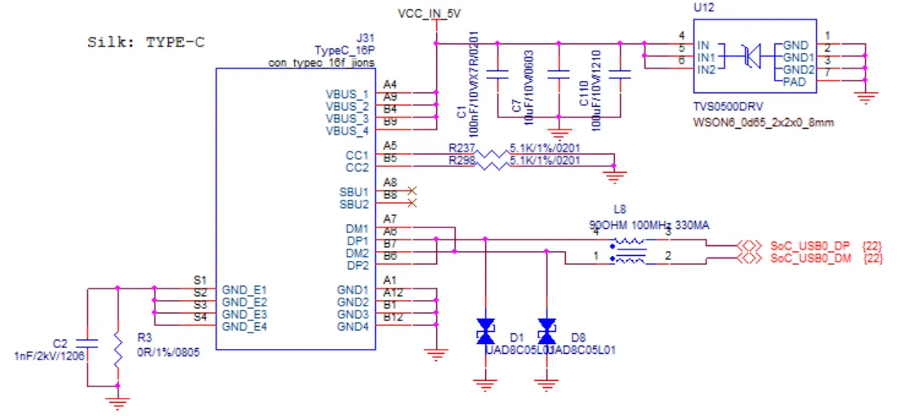

---

## Boot mode

By default the SoC boots from **Micro SD (MMC)**. If no SD card is inserted, the SoC **BootROM** attempts paths such as **Ethernet** (exact behavior depends on the current Boot ROM and strap design). In typical use, a **programmed SD card** is the boot medium.

---

## Storage

### LPDDR4

On-board **×32 LPDDR4** main memory. Common buildouts include **4 GB**, with **2 GB** and **8 GB** variants depending on BOM and ordering.

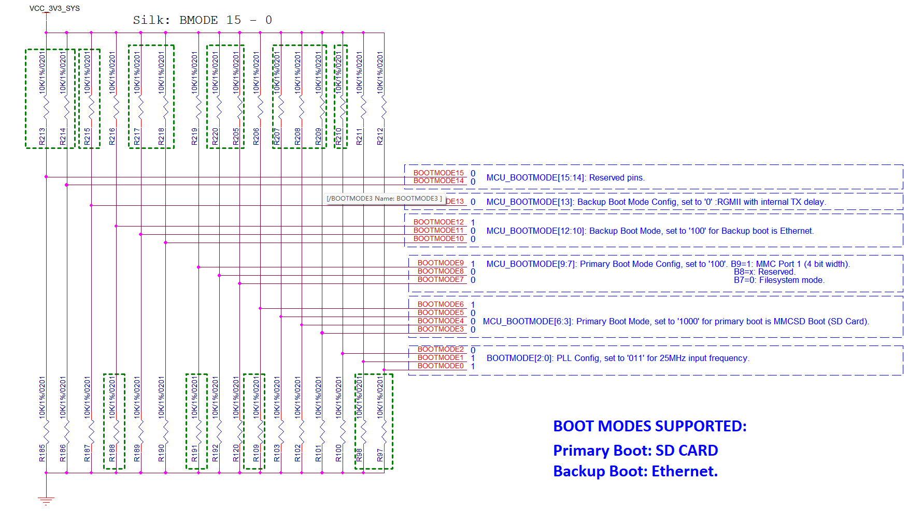

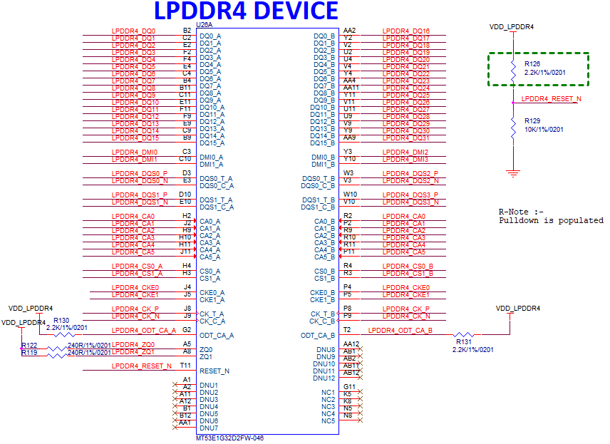

### Micro SD card

Micro SD is the main **boot and bulk storage** interface, wired to **MMC1** on the AM62A74.

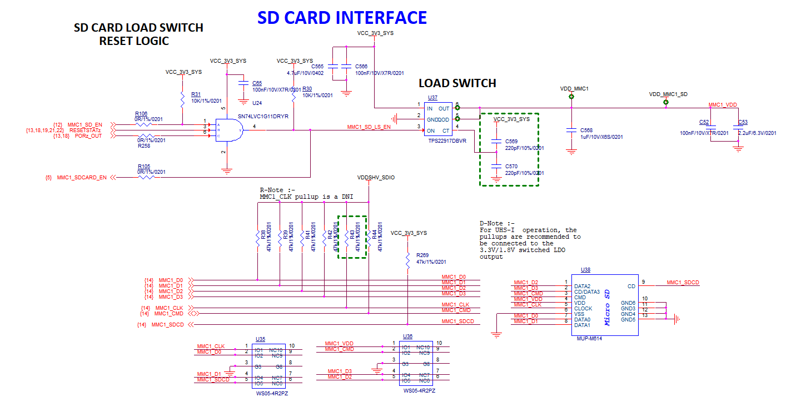

### EEPROM

On-board **BL24C02** (**2 kbit**) I²C EEPROM stores board-level and production-related identifiers that are read rarely or at low write frequency.

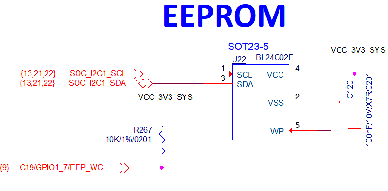

---

## On-board interfaces

### Gigabit Ethernet

One Gigabit **RJ45** port with **10/100/1000 Mbps** auto-negotiation. **PoE powered-device** operation requires a **PoE expansion board** or similar add-on, not the RJ45 physical interface alone.

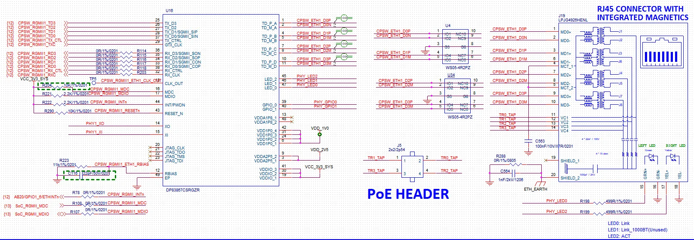

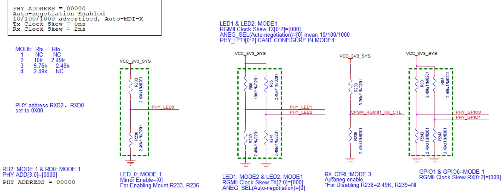

### USB

+ **4 × USB 2.0 Type-A:** standard USB devices such as keyboard, mouse, or flash drive.
+ **1 × USB Type-C:** shares the connector with **power**; the data path is **USB 2.0** class (same generation as Type-A). Composite behavior follows implementation and system policy.

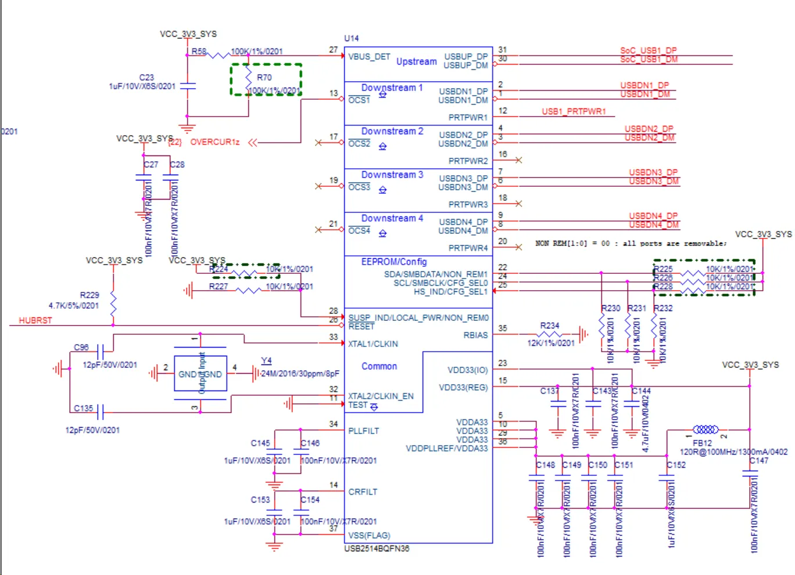

### Micro HDMI

**1 × Micro HDMI** for an external display, up to **1080p**. Video goes through a **Lattice SiI9022A** transmitter that converts parallel **RGB** plus **McASP0**-related audio to HDMI; mapping is **RGB888** on a **24-bit** bus.

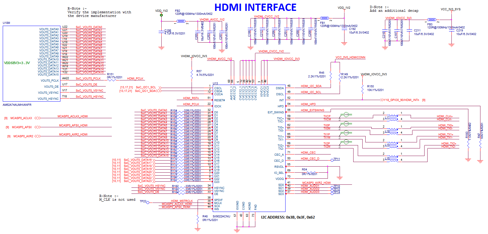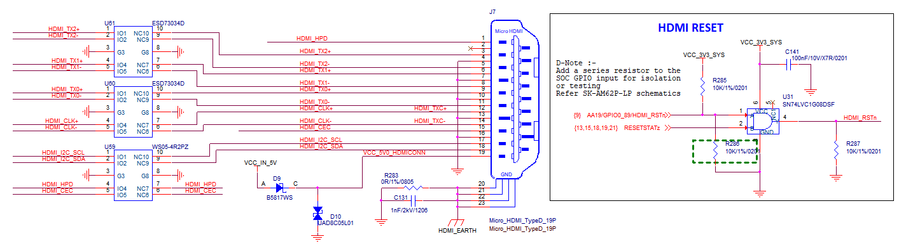

### Fan connector

**4-pin**, **1.0 mm** pitch fan connector with **PWM** speed control and tach feedback (exact pinout per silkscreen and schematic) for an active cooler under sustained load.

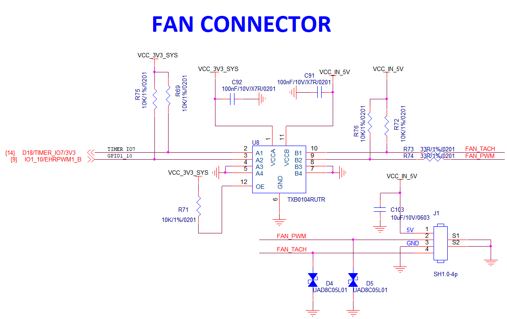

### Headphone jack

**4-pole 3.5 mm** jack for headphone output and microphone input, compatible with common mobile-style headsets.

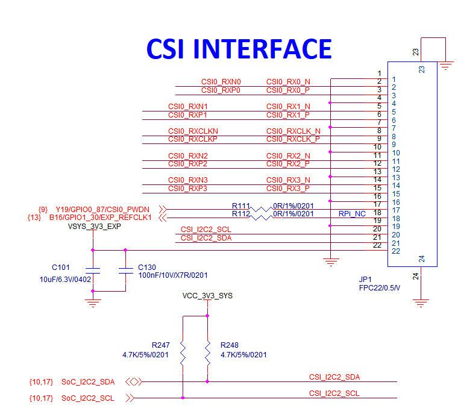

### CSI camera interface

One CSI port with an **FPC** connector that matches the common Raspberry Pi module footprint. The AM62A74 side supports **MIPI CSI-2 v1.3** and **MIPI D-PHY 1.2**, **4 lanes**, up to about **2.5 Gbps** per lane; the standard allows up to **16** virtual channels (subject to firmware and sensor capability).

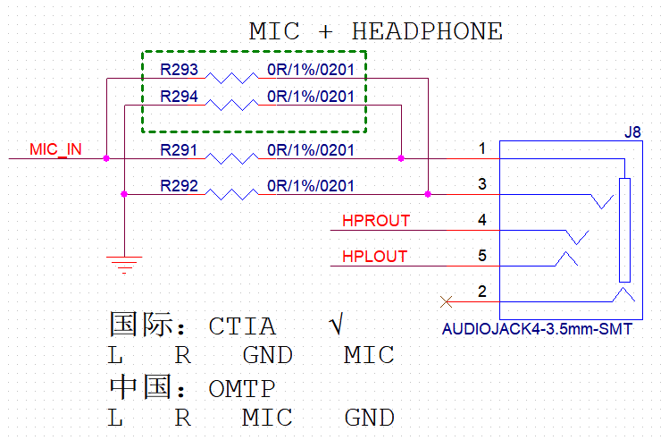

### Wi-Fi and Bluetooth

Wireless uses **FG6221ASRC** (Fn-Link and equivalent vendors), with **IEEE 802.11 a/b/g/n/ac** and **BLE 4.2**. Wi-Fi MAC/baseband connects over **SDIO**; Bluetooth uses **UART**.

An **U.FL** antenna connector sits near the module. Use a **2.4 GHz / 5 GHz** (and Bluetooth) antenna with matching specs; otherwise range and throughput often drop sharply.

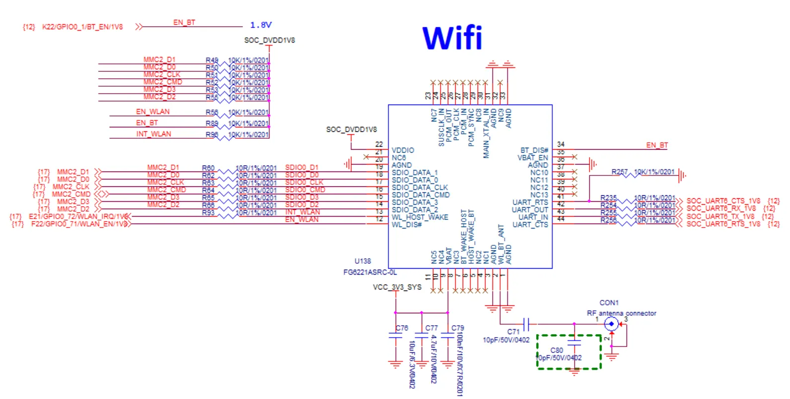

### RTC

**I²C RTC** on board; an external **coin cell** can keep time when **main power is off** (holder and recommended part number per silkscreen and BOM—often **CR1220** class).

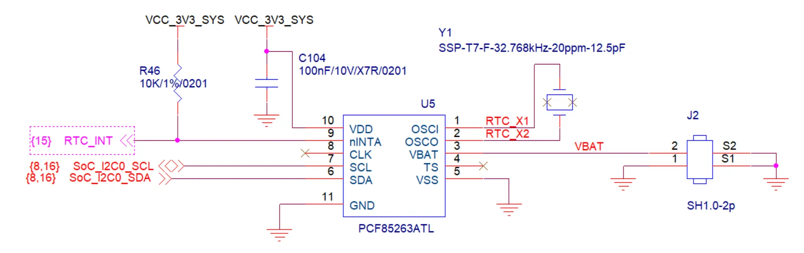

---

## Expansion interface (40-pin)

The **40-pin** header is primarily **3.3 V** **GPIO** and can be multiplexed in software or via the device tree to **I²C, SPI, UART, PWM**, and other functions per the AM62A7 mux table. **Do not** connect **5 V TTL** directly to GPIO pins.

| Function2 | Function1 | **Pin**# | Pin# | Function1 | Function2 |
| --- | --- | :---: | :---: | --- | --- |
|  | **3.3V** | **1** | **2** | **5.0V** |  |
| WKUP_I2C0_SDA | E13/MCU_GPIO0_20 | **3** | **4** | **5.0V** |  |
| WKUP_I2C0_SCL | D13/MCU_GPIO0_19 | **5** | **6** | **GND** |  |
| AUDIO_EXT_REFCLK1 | K17/GPIO0_39 | **7** | **8** | C18/GPIO1_25 | UART5_TXD |
|  | **GND** | **9** | **10** | B17/GPIO1_24 | UART5_RXD |
|  | C15/GPIO1_23 | **11** | **12** | W17/GPIO1_0 | MCASP2_ACLKX_BUF |
|  | M21/GPIO0_42 | **13** | **14** | **GND** |  |
|  | F14/GPIO1_22 | **15** | **16** | R17/GPIO0_38 |  |
|  | **3V3** | **17** | **18** | K18/GPIO0_40 |  |
| EXP_SPI0_D0 | B15/GPIO1_18 | **19** | **20** | **GND** |  |
| EXP_SPI0_D1 | E15/GPIO1_19 | **21** | **22** | G20/GPIO0_14 |  |
| EXP_SPI0_CLK | A17/GPIO1_17 | **23** | **24** | D16/GPIO1_15 | EXP_SPI0_CS0 |
|  | **GND** | **25** | **26** | C16/GPIO1_16 | EXP_SPI0_CS1 |
| SoC_I2C2_SDA |  | **27** | **28** |  | SoC_I2C2_SCL |
|  | M18/GPIO0_36 | **29** | **30** | **GND** |  |
|  | L17/GPIO0_33 | **31** | **32** | A21/GPIO1_14 | IO1_14/EHRPWM0_B |
| IO1_13/EHRPWM0_A | B21/GPIO1_13 | **33** | **34** | **GND** |  |
| MCASP2_AFSX_BUF | AA18/GPIO0_91 | **35** | **36** | B18/GPIO1_09 | IO1_09/EHRPWM1_A |
|  | M19/GPIO0_41 | **37** | **38** | AB21/GPIO1_5 | MCASP2_AXR0_BUF |
|  | **GND** | **39** | **40** | AA20/GPIO1_2 | MCASP2_AXR1_BUF |

> **Note:** Pins **27** and **28** are SoC **I2C2**, often tied to the CSI sensor configuration. Avoid bus conflicts with the camera when designing expansions. For GPIO versus bus muxing in software, see the Quick Start Guide or BSP device-tree documentation.

---

## LEDs and debug port

The board has **red / green** **dual-color LEDs** for power and **activity/status** (exact blink patterns depend on implementation and services).

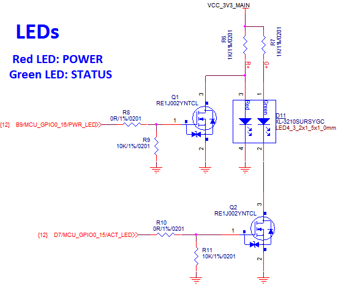

**UART debug** is on a **3-pin** header (typically **JST-style**) for boot logs and serial console login. When using a USB serial adapter, match **TX/RX/GND** and **115200 8N1, no flow control**.

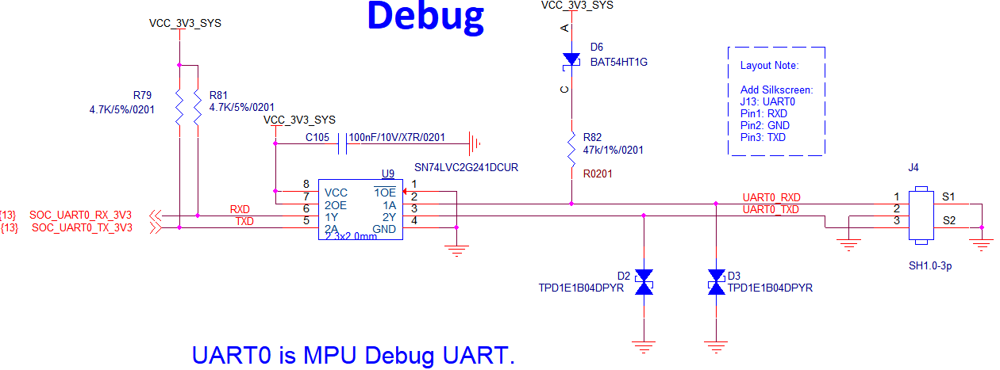

---

## Key components and references

| Component | Part / variant | Datasheet / manual |
| --- | --- | --- |
| Applications processor | AM62A family AM62A74AUMHIANFR | [AM62A74 datasheet](./Spec/am62a7.pdf) |
| PMIC | TPS65931211RWE | [TPS6593-Q1](./Spec/tps6593-q1.pdf) |
| Ethernet PHY | DP83867CSRGZR | [DP83867CS](./Spec/DP83867CS.pdf) |
| RTC | PCF85263ATL | [PCF85263ATL](./Spec/PCF85263A.pdf) |
| EEPROM | BL24C02F | [BL24C02F](./Spec/BL24C02F_V1.07_en.pdf) |
| HDMI transmitter | SiI9022A | [SiI9022A](./Spec/lattice-siI9022_9024acnu.pdf) |
| Audio codec | tlv320aic3106 | [tlv320aic3106](./Spec/tlv320aic3106.pdf) |
| Wi-Fi / BLE module | FG6221ASRC | [FG6221ASRC](./Spec/Fn-Link_6221A-SRC_datasheet_V1.8_20220726.pdf) |
