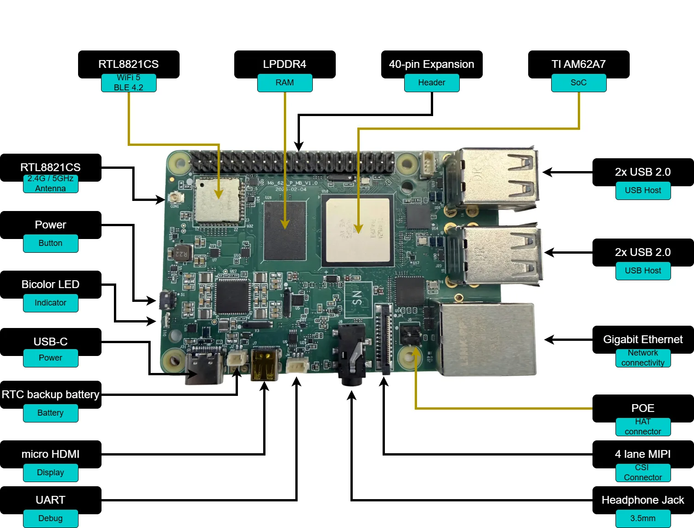
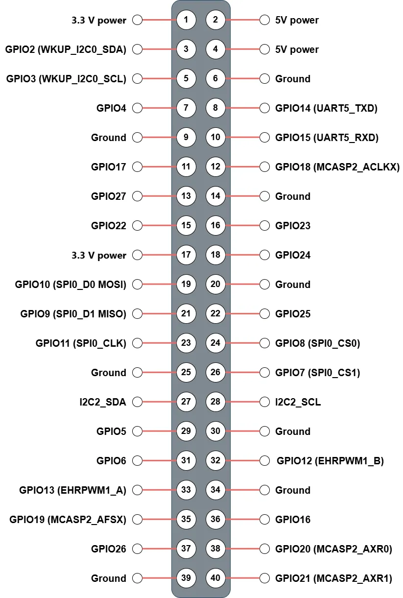

# MO-62A Quick Start Guide

This document is for first-time MO-62A users. It describes the shortest path from gathering parts to reaching the desktop or a remote login, and collects common reference material on board overview, cabling, networking, the camera, and the 40-pin header. The tone stays factual; procedural steps use second person for actions you can take.

---

## On this page

| Section | Description |
| --- | --- |
| [Shortest path to a working system](#shortest-path-to-a-working-system) | Read first: flash → cable → power → log in |
| [Device overview](#device-overview) | Positioning and key specifications |
| [Board layout](#board-layout) | Where interfaces sit on the board |
| [What you need](#what-you-need) | Required and optional items |
| [Flash the SD card](#flash-the-sd-card) | Image download and flashing on Windows |
| [Hardware connections](#hardware-connections) | Recommended cabling order |
| [First boot](#first-boot) | Boot time, default account, serial console |
| [Network access](#network-access) | Ethernet, finding the IP, SSH, Wi-Fi |
| [Camera preview (IMX219)](#camera-preview-imx219) | CSI wiring and preview script |
| [40-pin expansion header](#40-pin-expansion-header) | Pinout, GPIO table, command examples |
| [Common issues and tips](#common-issues-and-tips) | Black screen, camera, SD card, antenna |

---

## Shortest path to a working system

To reach the desktop or SSH as quickly as possible, follow this order (details are in the sections below).

1. **Prepare:** USB Type-C supply at 5 V and ≥ 3 A, Micro SD card ≥ 16 GB and Class 10 (or faster), downloaded `.img.zip` image, and optionally a Micro HDMI display and Ethernet cable.
2. **Flash:** On Windows, use balenaEtcher to write the image to the SD card; the operation erases all data on that card.
3. **Cable:** Insert the SD card, display, Ethernet, and peripherals before applying power; non-essential items such as the camera can be connected later.
4. **Power:** Connect USB-C last; the red LED should stay on to indicate power.
5. **Wait:** The first boot spends about **1–2 minutes** expanding the root filesystem and reboots once; afterward, expect about **30–45 seconds** to the desktop.
6. **Log in:** Username `debian`, one-time default password `temppwd`; the system requires an immediate password change after login.
7. **Remote (optional):** On the same LAN, use `ssh debian@<IP>` or `ssh debian@mo-62a.local` (mDNS required).

---

## Device overview

### About MO-62A

MO-62A is a single-board computer for edge AI inference, machine vision, industrial control, and similar scenarios. The SoC is **TI AM62A7** (quad-core Arm Cortex-A53) with an on-die **MMA** (matrix multiply accelerator); peak AI inference performance is about **2 TOPS**.

### Key specifications

| Parameter | Specification |
| --- | --- |
| SoC | TI AM62A74 (quad-core Cortex-A53 @ 1.4 GHz + Cortex-R5F) |
| AI accelerator | MMA, 2 TOPS |
| Memory | LPDDR4 (32-bit) |
| Storage | Micro SD (boot / storage) |
| Display | Micro HDMI (up to 1080p, via SiI9022ACNU) |
| Networking | 1 × Gigabit Ethernet RJ45 |
| Wireless | Wi-Fi + Bluetooth (FG6221A, U.FL antenna) |
| USB | 1 × USB Type-C (power + USB 2.0), 4 × USB 2.0 Type-A |
| Camera | 22-pin FPC CSI (4-lane MIPI CSI-2) |
| Audio | 3.5 mm 4-pole headset jack |
| Expansion | 40-pin (GPIO / I2C / SPI / UART / PWM) |
| RTC | PCF85263ATL with coin-cell holder |
| Fan | PWM fan header (PWM + TACH) |
| Power | USB Type-C 5 V (≥ 3 A recommended) |
| LEDs | Red (power), green (activity) |
| Debug | UART0 console on 3-pin SH1.0 |
| Operating system | Debian 13 (Trixie) with XFCE |

---

## Board layout



| Interface / component | Location |
| --- | --- |
| USB Type-C (power + USB 2.0) | Top edge, left |
| 4 × USB 2.0 Type-A | Top edge, right |
| Micro HDMI | Right side, upper |
| RJ45 Ethernet | Right side, lower |
| Micro SD slot | Bottom edge |
| 40-pin expansion header | Left edge |
| CSI camera connector | Center, FPC |
| 3.5 mm audio jack | Front edge |
| Wi-Fi / BT antenna (U.FL) | Near wireless module |
| Debug UART (SH1.0 3-pin) | Near USB-C |
| Fan connector | Near 40-pin header |

---

## What you need

### Required

| Item | Notes |
| --- | --- |
| MO-62A board | — |
| USB Type-C power adapter | 5 V, ≥ 3 A |
| Micro SD card | ≥ 16 GB, Class 10 / UHS-I (U1) or faster |
| Micro HDMI cable | For a display or TV |
| RJ45 Ethernet cable | Initial wired network (find IP, SSH, etc.) |
| Host PC | Windows — for flashing the SD card |

### Optional (by scenario)

| Item | Notes |
| --- | --- |
| IMX219 CSI camera module | Required for CSI preview |
| USB keyboard and mouse | Local XFCE use |
| 3.5 mm headset | Headphone output + microphone input |
| CR1220 coin cell | RTC backup |
| Wi-Fi antenna (U.FL) | Much better wireless range |
| PWM fan | 4-pin, 5 V |

---

## Flash the SD card

### Download the image

Download the latest pre-built SD card image from the releases page; it is distributed as `.img.zip`.

Full SDK source (kernel, device tree, filesystem customization) repository:

**GitHub:** https://github.com/inhandnet/mo-62a

### Flash with balenaEtcher (Windows)

1. Install [balenaEtcher](https://etcher.balena.io).
2. Click **Flash from file**.
3. Select the downloaded `.img.zip` file.
4. Click **Select target**.
5. Choose the Micro SD card from the device list.
6. Click **Flash!** to start writing.
7. When **Flash Complete!** appears, eject the card safely in the OS before removing it.

> **Warning:** Flashing erases all existing data on the SD card.

---

## Hardware connections

Use this order to reduce the risk of hot-plugging (camera details are under [Camera preview (IMX219)](#camera-preview-imx219)).

1. **Insert the SD card:** Push the card into the underside slot until it clicks.
2. **Connect the display:** Run Micro HDMI from the board to the monitor.
3. **Connect Ethernet:** Plug RJ45 into the Gigabit port if you plan to use wired networking.
4. **Connect peripherals:** Attach keyboard, mouse, or other devices to any USB 2.0 Type-A port (optional).
5. **Connect the camera:** For IMX219, route the FPC to the 22-pin CSI connector (see “Connect the camera” below).
6. **Apply power:** Connect the USB Type-C supply last; the red power LED should light.

---

## First boot

### Boot sequence

After power-on, the system boots from Micro SD. A typical cold boot takes about **30–45 seconds**; the green activity LED blinks during boot.

> **First boot note:** On the first power-on the root filesystem expands to use the remaining SD space, which takes about **1–2 minutes** and ends with an automatic reboot. The XFCE desktop appears after that second boot completes. Later boots match the typical time above.

Typical boot chain:

1. U-Boot SPL (R5) → U-Boot (A53) — short console output on the serial port  
2. Linux kernel decompresses and loads the device tree  
3. systemd brings up services — **first boot** runs expansion here and triggers the reboot  
4. XFCE desktop on HDMI

### Desktop login

XFCE starts automatically. Default local account:

| Field | Value |
| --- | --- |
| Username | `debian` |
| Password | `temppwd` |

> The default password is one-time use; after login the system forces a new password, which takes effect immediately.

### Serial console (UART0)

Without a display, use the 3-pin UART0 header (SH1.0, 1.0 mm pitch) with a USB serial adapter or similar.

| Pin | Signal |
| --- | --- |
| 1 | RXD |
| 2 | TXD |
| 3 | GND |

Settings: **115200 8N1, no flow control**.

```bash
# Linux host example (replace /dev/ttyUSB0 with your device)
minicom -D /dev/ttyUSB0 -b 115200
```

---

## Network access

### Wired Ethernet

After boot, `eth0` uses DHCP for IPv4 by default.

### Find the board IP

On the board:

```bash
ip addr show eth0
```

If the LAN supports mDNS, you can try:

```bash
ping mo-62a.local
```

### SSH login

```bash
ssh debian@<board-ip>
# or
ssh debian@mo-62a.local
```

### Wi-Fi

On the command line you can use `nmcli`:

```bash
nmcli device wifi list
nmcli device wifi connect "SSID" password "your-password"
```

You can also use the graphical network applet in the XFCE tray.

> The on-board connector is U.FL; an external antenna usually improves Wi-Fi range and stability a lot.

---

## Camera preview (IMX219)

The 22-pin FPC CSI port works with an **IMX219** CSI sensor module.

### Connect the camera

1. Flip up the CSI connector latch.
2. Insert the FPC with the contacts facing the board (metal pads down).
3. Press the latch closed.

### Run the preview

The image includes `/usr/local/bin/imx219-preview.sh`.

```bash
# Default 15 fps
sudo imx219-preview.sh

# 30 fps
sudo imx219-preview.sh 30

# Low light (5 fps, higher gain and exposure)
sudo GAIN=232 imx219-preview.sh 5
```

Video goes to HDMI; press **Ctrl+C** in the terminal to stop.

> The script needs `sudo` because `kmssink` requires DRM master. It pauses the desktop session (lightdm) while running and usually restores it afterward.

### Tunable environment variables

| Variable | Default | Range | Description |
| --- | --- | --- | --- |
| `FPS` (1st argument) | `15` | 5/8/10/15/30 | Frame rate |
| `WB_R` | `0.5` | 0.0 – 1.0 | White balance red reference |
| `WB_B` | `0.6` | 0.0 – 1.0 | White balance blue reference |
| `GAIN` | `150` | 0 – 232 | Analog gain |
| `DGAIN` | `256` | 256 – 4095 | Digital gain |
| `EXPOSURE` | auto | lines | Exposure in lines |

Warmer example at 10 fps:

```bash
sudo WB_R=0.4 WB_B=0.5 imx219-preview.sh 10
```

---

## 40-pin expansion header

The 40-pin header defaults to **GPIO** mode at **3.3 V** logic. I2C, SPI, UART, PWM, and other functions can be enabled with a device tree overlay.

> Pins 27 and 28 (I2C2) are fixed for the camera module I2C bus and are not suited as general GPIO.

### Pin map



See the numbered table below.

### Linux GPIO reference

Use `gpioset` / `gpioget` from the `gpiod` package for GPIO-mode pins.

| Pin | Name | Default function | gpiochip | Line | Alternate function |
| --- | --- | --- | --- | --- | --- |
| 1 | 3V3 | 3.3 V power | — | — | — |
| 2 | 5V | 5 V power | — | — | — |
| 3 | GPIO2 | GPIO (MCU_GPIO0_20) | gpiochip0 | 20 | WKUP_I2C0_SDA |
| 4 | 5V | 5 V power | — | — | — |
| 5 | GPIO3 | GPIO (MCU_GPIO0_19) | gpiochip0 | 19 | WKUP_I2C0_SCL |
| 6 | GND | Ground | — | — | — |
| 7 | GPIO4 | GPIO (GPIO0_39) | gpiochip1 | 39 | — |
| 8 | GPIO14 | GPIO (GPIO1_25) | gpiochip2 | 25 | UART5_TXD |
| 9 | GND | Ground | — | — | — |
| 10 | GPIO15 | GPIO (GPIO1_24) | gpiochip2 | 24 | UART5_RXD |
| 11 | GPIO23 | GPIO (GPIO1_23) | gpiochip2 | 23 | — |
| 12 | GPIO18 | GPIO (GPIO1_0) | gpiochip2 | 0 | MCASP2_ACLKX |
| 13 | GPIO27 | GPIO (GPIO0_42) | gpiochip1 | 42 | — |
| 14 | GND | Ground | — | — | — |
| 15 | GPIO22 | GPIO (GPIO1_22) | gpiochip2 | 22 | — |
| 16 | GPIO17 | GPIO (GPIO0_38) | gpiochip1 | 38 | — |
| 17 | 3V3 | 3.3 V power | — | — | — |
| 18 | GPIO24 | GPIO (GPIO0_40) | gpiochip1 | 40 | — |
| 19 | GPIO10 | GPIO (GPIO1_18) | gpiochip2 | 18 | SPI0_D0 (MOSI) |
| 20 | GND | Ground | — | — | — |
| 21 | GPIO9 | GPIO (GPIO1_19) | gpiochip2 | 19 | SPI0_D1 (MISO) |
| 22 | GPIO25 | GPIO (GPIO0_14) | gpiochip1 | 14 | — |
| 23 | GPIO11 | GPIO (GPIO1_17) | gpiochip2 | 17 | SPI0_CLK |
| 24 | GPIO8 | GPIO (GPIO1_15) | gpiochip2 | 15 | SPI0_CS0 |
| 25 | GND | Ground | — | — | — |
| 26 | GPIO7 | GPIO (GPIO1_16) | gpiochip2 | 16 | SPI0_CS1 |
| 27 | I2C2_SDA | I2C2 SDA (`i2c-2`) | — | — | (camera bus, fixed) |
| 28 | I2C2_SCL | I2C2 SCL (`i2c-2`) | — | — | (camera bus, fixed) |
| 29 | GPIO5 | GPIO (GPIO0_36) | gpiochip1 | 36 | — |
| 30 | GND | Ground | — | — | — |
| 31 | GPIO6 | GPIO (GPIO0_33) | gpiochip1 | 33 | — |
| 32 | GPIO12 | GPIO (GPIO1_14) | gpiochip2 | 14 | EHRPWM0_B |
| 33 | GPIO13 | GPIO (GPIO1_13) | gpiochip2 | 13 | EHRPWM0_A |
| 34 | GND | Ground | — | — | — |
| 35 | GPIO19 | GPIO (GPIO0_91) | gpiochip1 | 91 | MCASP2_AFSX |
| 36 | GPIO16 | GPIO (GPIO1_9) | gpiochip2 | 9 | EHRPWM1_A |
| 37 | GPIO26 | GPIO (GPIO0_41) | gpiochip1 | 41 | — |
| 38 | GPIO20 | GPIO (GPIO1_5) | gpiochip2 | 5 | MCASP2_AXR0 |
| 39 | GND | Ground | — | — | — |
| 40 | GPIO21 | GPIO (GPIO1_2) | gpiochip2 | 2 | MCASP2_AXR1 |

> `gpiochip0` = `mcu_gpio0` (MCU domain); `gpiochip1` = `main_gpio0` (GPIO0_x); `gpiochip2` = `main_gpio1` (GPIO1_x).

### Voltage levels and protection

Expansion I/O is **3.3 V**. **Do not** connect 5 V logic directly to GPIO pins.

### Command examples (libgpiod v2)

The image includes `libgpiod` 2.x; use `-c` to select a controller.

**List controllers:**

```bash
gpiodetect
```

**Read an input (example: physical pin 11 → gpiochip2 line 23):**

```bash
gpioget -c gpiochip2 23
```

**Read several lines:**

```bash
gpioget -c gpiochip1 39 38 42
```

**Drive high (example: pin 7 → gpiochip1 line 39):**

```bash
gpioset -c gpiochip1 39=1 &
pkill gpioset   # release
```

**Timed drive:**

```bash
gpioset --hold-period=2s -c gpiochip1 39=1
```

**Square wave (500 ms high / 500 ms low):**

```bash
gpioset -t 500ms,500ms,0 -c gpiochip1 39=1
```

**Edge monitor:**

```bash
gpiomon -c gpiochip2 23
gpiomon --edges=rising -c gpiochip2 23
```

**Scan I2C2 (`/dev/i2c-2`):**

```bash
i2cdetect -y 2
```

**PWM (pin 32 → `pwmchip0` channel 0, 1 kHz, 50% duty):**

```bash
echo 0 | sudo tee /sys/class/pwm/pwmchip0/export
echo 1000000 | sudo tee /sys/class/pwm/pwmchip0/pwm0/period
echo 500000 | sudo tee /sys/class/pwm/pwmchip0/pwm0/duty_cycle
echo 1 | sudo tee /sys/class/pwm/pwmchip0/pwm0/enable
```

---

## Common issues and tips

### No display after boot

The image disables DPMS by default. Press a key or move the mouse to rule out idle blanking. If there is still no picture, on the board run:

```bash
cat /etc/X11/xorg.conf.d/10-no-dpms.conf
grep xserver-command /etc/lightdm/lightdm.conf
```

### Camera not detected

```bash
v4l2-ctl --list-devices
media-ctl -d /dev/media0 --print-topology
```

If the expected device is missing, check that the FPC is fully inserted and the latch is closed.

### SD card not found during boot

- Confirm the card clicked fully into the slot.
- Try another card: capacities that are too small or speeds below Class 10 may be unreliable.
- Reflash and confirm Etcher reported no errors.

### Wi-Fi antenna

Without an external antenna on the U.FL port, usable range is usually very small; install a matching antenna for stable Wi-Fi.
