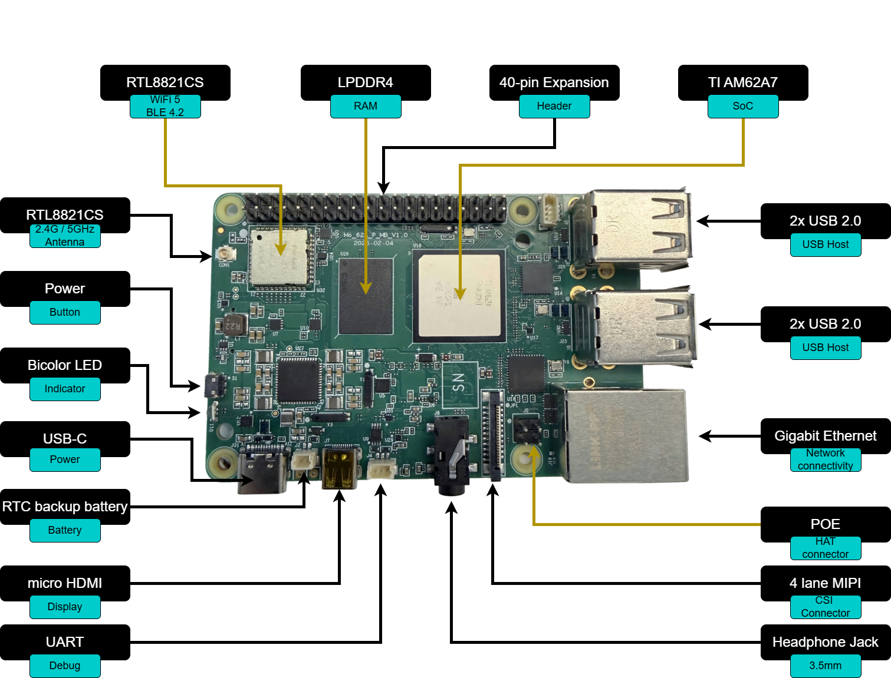
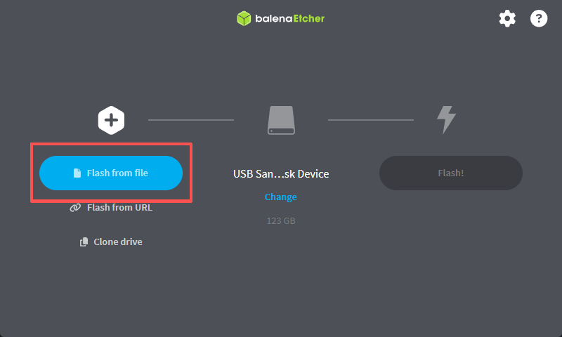
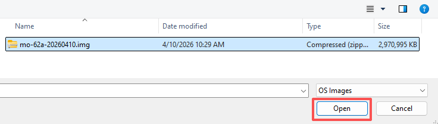
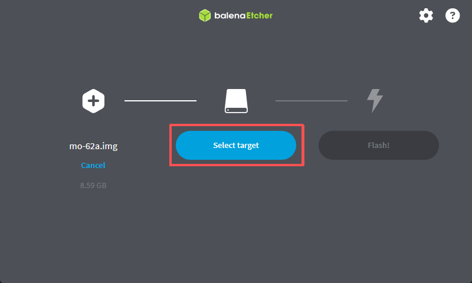
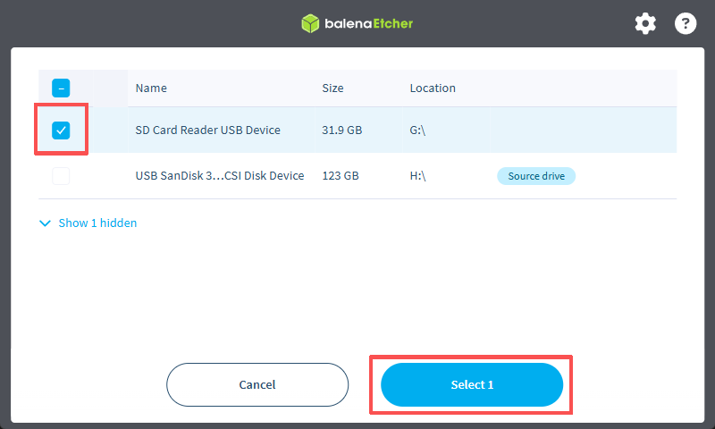
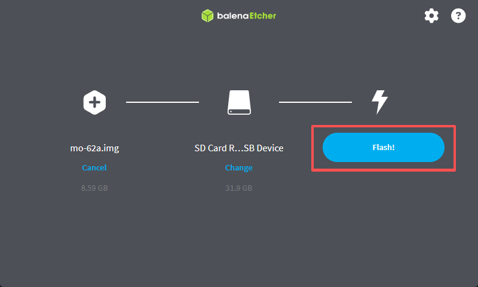
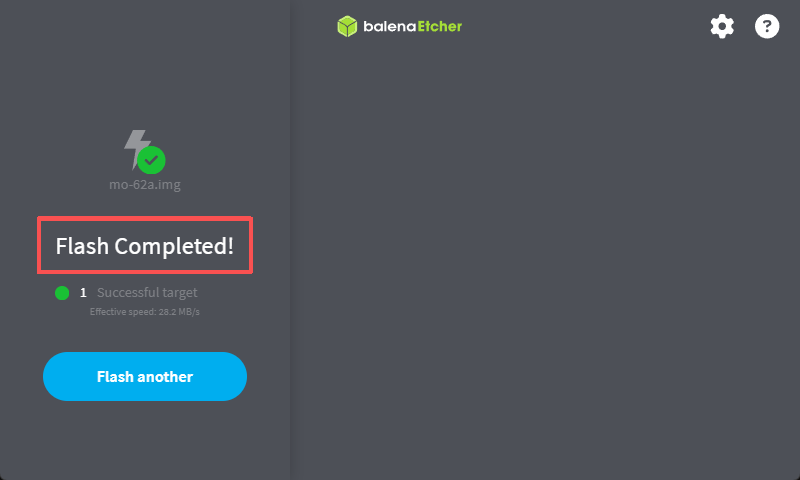
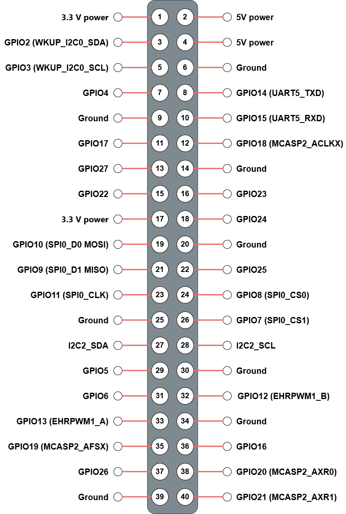

# MO-62A Quick Start Guide

## Table of Contents

- [1. Introduction](#1-introduction)
- [2. What You Need](#2-what-you-need)
- [3. Flash the SD Card](#3-flash-the-sd-card)
- [4. Hardware Setup](#4-hardware-setup)
- [5. First Boot](#5-first-boot)
- [6. Network Access](#6-network-access)
- [7. Camera Preview (IMX219)](#7-camera-preview-imx219)
- [8. Edge AI Inference](#8-edge-ai-inference)
- [9. 40-Pin Expansion Header](#9-40-pin-expansion-header)
- [10. Common Issues & Tips](#10-common-issues--tips)

---

## 1. Introduction

### 1.1 About MO-62A

MO-62A is a single-board computer designed for edge AI inference, machine vision, and industrial control applications. It is powered by the **TI AM62A7** processor — a quad-core Arm Cortex-A53 SoC with a dedicated MMA (Matrix Multiplication Accelerator) delivering up to **2 TOPS** of AI inference performance.

### 1.2 Key Specifications

| Feature              | Specification                                                         |
|----------------------|-----------------------------------------------------------------------|
| SoC                  | TI AM62A74 (Quad-core Cortex-A53 @ 1.4 GHz + Cortex-R5F)            |
| AI Accelerator       | MMA, 2 TOPS                                                           |
| Memory               | LPDDR4 (32-bit)                                                       |
| Storage              | Micro SD (boot / storage)                                             |
| Display              | Micro HDMI (up to 1080p, via SiI9022ACNU)                             |
| Networking           | 1 × Gigabit Ethernet RJ45                                             |
| Wireless             | Wi-Fi + Bluetooth (FG6221A, U.FL antenna connector)                   |
| USB                  | 1 × USB Type-C (power + USB 2.0), 4 × USB 2.0 Type-A                 |
| Camera               | 22-pin FPC CSI (4-lane MIPI CSI-2)                                    |
| Audio                | 3.5 mm combo jack (headphone + microphone)                            |
| Expansion            | 40-pin header (GPIO / I2C / SPI / UART / PWM)                         |
| RTC                  | PCF85263ATL with battery backup connector                             |
| Fan                  | PWM fan connector (PWM + TACH)                                        |
| Power Input          | USB Type-C 5 V (≥ 3 A recommended)                                    |
| LEDs                 | Red (Power), Green (Activity)                                         |
| Debug                | UART0 serial console (3-pin SH1.0 connector)                          |
| OS                   | Debian 13 (Trixie) with XFCE desktop                                  |

### 1.3 Board Layout



| Connector / Component | Location |
|-----------------------|----------|
| USB Type-C (Power + USB 2.0) | Top edge, left |
| 4 × USB 2.0 Type-A | Top edge, right |
| Micro HDMI | Right edge, top |
| RJ45 Ethernet | Right edge, bottom |
| Micro SD slot | Bottom edge |
| 40-pin expansion header | Left edge |
| CSI camera connector | Center, FPC |
| 3.5 mm audio jack | Front edge |
| Wi-Fi / BT antenna connector | U.FL, near wireless module |
| Debug UART (SH1.0 3-pin) | Near USB-C |
| Fan connector | Near 40-pin header |

---

## 2. What You Need

The following items are required to get started:

| Item                    | Notes                                               |
|-------------------------|-----------------------------------------------------|
| MO-62A board            |                                                     |
| USB Type-C power supply | 5 V, ≥ 3 A                                          |
| Micro SD card           | ≥ 16 GB, Class 10 / UHS-I (U1) or faster            |
| Micro HDMI cable        | Connect to a monitor or TV                          |
| RJ45 Ethernet cable     | Required for initial network setup                  |
| Host computer           | Windows, macOS, or Linux — for flashing the SD card |

The following items are optional but useful:

| Item                         | Notes                                      |
|------------------------------|--------------------------------------------|
| IMX219 CSI camera module     |                                            |
| USB keyboard and mouse       | For direct desktop use                     |
| 3.5 mm headset               | Headphone output + microphone input        |
| CR1220 coin cell battery     | For RTC backup power                       |
| Wi-Fi antenna (U.FL)         | Improves wireless range significantly      |
| PWM fan                      | 4-pin, 5 V                                 |

---

## 3. Flash the SD Card

### 3.1 Download the Image

Download the latest pre-built SD card image from the release page:

<!-- TODO: Insert release download URL -->

The image is distributed as a `.img.zip` file.

The full SDK source code (kernel, device tree, filesystem customisation) is available at:

**GitHub:** [https://github.com/inhandnet/mo-62a](https://github.com/inhandnet/mo-62a)

### 3.2 Flash with balenaEtcher (Windows)

1. Download and install [balenaEtcher](https://etcher.balena.io).

2. Click **Flash from file**.

   

3. Select the downloaded `.img.zip` file.

   

4. Click **Select target**.

   

5. Choose the Micro SD card from the device list.

   

6. Click **Flash!** to start writing.

   

7. Wait until **Flash Complete!** is shown, then safely remove the SD card.

   

> **Warning:** All existing data on the SD card will be erased.

---

## 4. Hardware Setup

1. **Insert the SD card** — push the flashed Micro SD card into the card slot on the underside of the board until it clicks.
2. **Connect the display** — plug a Micro HDMI cable into the board and connect the other end to your monitor.
3. **Connect Ethernet** — plug an RJ45 cable into the Gigabit Ethernet port for network access.
4. **Connect peripherals** — attach a USB keyboard and mouse to any of the four USB 2.0 Type-A ports (optional).
5. **Connect the camera** — if using an IMX219, connect the FPC ribbon cable to the 22-pin CSI connector (see [Section 7](#7-camera-preview-imx219)).
6. **Apply power** — connect the USB Type-C power supply last. The red Power LED will illuminate immediately.

<!-- TODO: Insert hardware connection diagram -->

---

## 5. First Boot

### 5.1 Boot Sequence

After power is applied, the board boots from the Micro SD card. A normal boot takes approximately **30–45 seconds**. The green Activity LED will blink during boot.

> **Note — First Boot:** On the very first boot, the system automatically expands the root filesystem to fill the SD card. This takes an additional **1–2 minutes**, after which the board reboots automatically. The desktop will appear after the second boot completes. Subsequent boots are normal speed.

Expected sequence:

1. U-Boot SPL (R5) → U-Boot (A53) — brief console output
2. Linux kernel decompresses and loads device tree
3. systemd brings up services — **on first boot**, filesystem expansion runs here and triggers an automatic reboot
4. XFCE desktop appears on the HDMI display

### 5.2 Desktop Login

The XFCE desktop loads automatically. Default credentials:

| Field    | Value     |
|----------|-----------|
| Username | `debian`  |
| Password | `123456` |

> **First login only:** The default password is valid for one login. You will be prompted to set a new password immediately after logging in. The new password takes effect right away.

### 5.3 Serial Console (UART0 Debug Port)

If no display is available, the board can be accessed via the 3-pin UART0 debug connector (SH1.0, 1.0 mm pitch).

| Pin | Signal |
|-----|--------|
| 1   | RXD    |
| 2   | TXD    |
| 3   | GND    |

Serial settings: **115200 baud, 8N1, no flow control**

```bash
# Linux host example (replace /dev/ttyUSB0 with your adapter's device node)
minicom -D /dev/ttyUSB0 -b 115200
```

<!-- TODO: Insert UART connector location photo -->

---

## 6. Network Access

### 6.1 Wired Ethernet

The board obtains an IP address via DHCP automatically on boot.

### 6.2 Find the Board's IP Address

From the XFCE desktop terminal:

```bash
ip addr show eth0
```

From a host on the same network (if mDNS is enabled):

```bash
ping mo-62a.local
```

### 6.3 SSH Login

```bash
ssh debian@<board-ip>
# or
ssh debian@mo-62a.local
```

### 6.4 Wi-Fi Setup

Connect to a Wi-Fi network using `nmcli`:

```bash
# List available networks
nmcli device wifi list

# Connect to a network
nmcli device wifi connect "SSID" password "password"
```

Alternatively, use the XFCE network manager applet in the system tray.

> **Note:** A U.FL antenna connector is provided on the board. Attaching an external antenna significantly improves wireless range.

---

## 7. Camera Preview (IMX219)

The MO-62A supports the **IMX219** CSI camera module (Sony IMX219) via the 22-pin FPC CSI connector.

### 7.1 Connect the Camera

1. Gently lift the FPC connector latch on the CSI port.
2. Insert the ribbon cable with the contacts facing the board (metal contacts down).
3. Press the latch down to lock the cable.

<!-- TODO: Insert CSI connector photo -->

### 7.2 Run the Preview

The `imx219-preview.sh` script is pre-installed at `/usr/local/bin/imx219-preview.sh`.

```bash
# Basic preview at 15 fps (default)
sudo imx219-preview.sh

# Preview at 30 fps
sudo imx219-preview.sh 30

# Low-light mode (maximum gain and exposure at 5 fps)
sudo GAIN=232 imx219-preview.sh 5
```

The preview displays live video on the HDMI output. Press **Ctrl+C** to exit.

> **Note:** The script requires root (`sudo`) because `kmssink` needs DRM master access. Any running desktop session (lightdm) is stopped automatically while the preview is running and restarted on exit.

### 7.3 Tuning Options

| Variable   | Default | Range        | Description                                       |
|------------|---------|--------------|---------------------------------------------------|
| `FPS`      | `15`    | 5/8/10/15/30 | Frame rate (passed as first argument)             |
| `WB_R`     | `0.5`   | 0.0 – 1.0    | White-balance red channel reference               |
| `WB_B`     | `0.6`   | 0.0 – 1.0    | White-balance blue channel reference              |
| `GAIN`     | `150`   | 0 – 232      | Analogue gain (increase for low-light conditions) |
| `DGAIN`    | `256`   | 256 – 4095   | Digital gain (higher values increase noise)       |
| `EXPOSURE` | auto    | lines        | Exposure lines (defaults to maximum for chosen FPS) |

Example — warmer white balance at 10 fps:

```bash
sudo WB_R=0.4 WB_B=0.5 imx219-preview.sh 10
```

---

## 8. Edge AI Inference

The MO-62A carries a TI C7x DSP that hardware-accelerates edge AI inference (TIDL).
The image ships with a model zoo, the inference runtimes, and a complete C/C++
development SDK — so you can run demos out of the box and compile and debug your
own inference programs directly on the board.

### 8.1 Run the Inference Demo (edgeai-demo)

`edgeai-demo` is a single entry point that drives both the **Python** and
**C/C++** backends, with either a **CSI** or **USB** camera, from the same config.

Interactive mode (pick camera → model → backend in turn):

```bash
edgeai-demo
```

Command-line mode:

```bash
edgeai-demo list                                   # list available models
edgeai-demo run 2 --backend cpp    --camera csi    # C/C++ backend + CSI camera
edgeai-demo run 2 --backend python --camera usb    # Python backend + USB camera
edgeai-demo status                                 # show the active camera
```

The inference view (with detection boxes and a performance graph) is shown on the
HDMI output; press **Ctrl+C** to exit.

> **Note:** initialise a CSI camera first with `sudo init-imx219`. `edgeai-demo`
> handles root privileges, environment variables, the C7x reset, and stopping/
> restoring the desktop (lightdm) automatically — no manual steps are needed.

### 8.2 Develop Your Own C/C++ AI Program On-Board

The image ships with a complete C/C++ AI SDK, so you can compile your own
inference programs directly on the board with **no cross-compilation setup**:

| Item | Location |
|---|---|
| Headers | `/usr/include/edgeai/` |
| Libraries + CMake package | `/usr/lib/edgeai/`, `/usr/lib/cmake/EdgeAI/` |
| Example projects | `/usr/share/edgeai-cpp-examples/` |
| Model zoo | `/opt/model_zoo/` |
| Developer guide | `/usr/share/edgeai-cpp-examples/DEV_GUIDE.md` |

A single `CMakeLists.txt` links the whole SDK (no manual include/library paths):

```cmake
find_package(EdgeAI REQUIRED)
add_executable(my_infer main.cpp)
target_link_libraries(my_infer PRIVATE EdgeAI::edgeai)
```

Build and run the minimal example (loads a model and runs one inference, no camera needed):

```bash
cp -r /usr/share/edgeai-cpp-examples/hello_inference ~/hello_inference
cd ~/hello_inference && mkdir build && cd build
cmake .. && make
sudo LD_LIBRARY_PATH=/opt/ti/edgeai/lib ./hello_inference \
     -m /opt/model_zoo/ONR-OD-8200-yolox-nano-lite-mmdet-coco-416x416
```

`Inference OK.` confirms the model ran on the C7x DSP. A full
camera → inference → HDMI pipeline example is in
`/usr/share/edgeai-cpp-examples/app_edgeai/`; see `DEV_GUIDE.md` for the API and
more details.

---

## 9. 40-Pin Expansion Header

The 40-pin expansion header provides GPIO signals at **3.3 V logic levels**. All user-accessible signal pins default to GPIO mode. Optional peripheral functions (I2C, SPI, UART, PWM) can be enabled via device tree overlay.

> **Note:** Pins 27/28 (I2C2) are permanently assigned to the internal I2C bus used by the camera module and cannot be used as general GPIO.

### 9.1 Pin Map



See the complete 40-pin table in [Section 8.2](#82-linux-gpio-reference) below.

### 9.2 Linux GPIO Reference

All 40 pins are listed below. Use `gpioset` / `gpioget` from the `gpiod` package for GPIO-mode pins.

| Pin | Name        | Default Function        | gpiochip  | Line | Optional Function    |
|-----|-------------|-------------------------|-----------|------|----------------------|
|  1  | 3V3         | 3.3 V power             | —         | —    | —                    |
|  2  | 5V          | 5 V power               | —         | —    | —                    |
|  3  | GPIO2       | GPIO (MCU\_GPIO0\_20)   | gpiochip0 | 20   | WKUP\_I2C0\_SDA      |
|  4  | 5V          | 5 V power               | —         | —    | —                    |
|  5  | GPIO3       | GPIO (MCU\_GPIO0\_19)   | gpiochip0 | 19   | WKUP\_I2C0\_SCL      |
|  6  | GND         | Ground                  | —         | —    | —                    |
|  7  | GPIO4       | GPIO (GPIO0\_39)        | gpiochip1 | 39   | —                    |
|  8  | GPIO14      | GPIO (GPIO1\_25)        | gpiochip2 | 25   | UART5\_TXD           |
|  9  | GND         | Ground                  | —         | —    | —                    |
| 10  | GPIO15      | GPIO (GPIO1\_24)        | gpiochip2 | 24   | UART5\_RXD           |
| 11  | GPIO17      | GPIO (GPIO1\_23)        | gpiochip2 | 23   | —                    |
| 12  | GPIO18      | GPIO (GPIO1\_0)         | gpiochip2 |  0   | MCASP2\_ACLKX        |
| 13  | GPIO27      | GPIO (GPIO0\_42)        | gpiochip1 | 42   | —                    |
| 14  | GND         | Ground                  | —         | —    | —                    |
| 15  | GPIO22      | GPIO (GPIO1\_22)        | gpiochip2 | 22   | —                    |
| 16  | GPIO23      | GPIO (GPIO0\_38)        | gpiochip1 | 38   | —                    |
| 17  | 3V3         | 3.3 V power             | —         | —    | —                    |
| 18  | GPIO24      | GPIO (GPIO0\_40)        | gpiochip1 | 40   | —                    |
| 19  | GPIO10      | GPIO (GPIO1\_18)        | gpiochip2 | 18   | SPI0\_D0 (MOSI)      |
| 20  | GND         | Ground                  | —         | —    | —                    |
| 21  | GPIO9       | GPIO (GPIO1\_19)        | gpiochip2 | 19   | SPI0\_D1 (MISO)      |
| 22  | GPIO25      | GPIO (GPIO0\_14)        | gpiochip1 | 14   | —                    |
| 23  | GPIO11      | GPIO (GPIO1\_17)        | gpiochip2 | 17   | SPI0\_CLK            |
| 24  | GPIO8       | GPIO (GPIO1\_15)        | gpiochip2 | 15   | SPI0\_CS0            |
| 25  | GND         | Ground                  | —         | —    | —                    |
| 26  | GPIO7       | GPIO (GPIO1\_16)        | gpiochip2 | 16   | SPI0\_CS1            |
| 27  | I2C2\_SDA   | I2C2 SDA (`i2c-2`)     | —         | —    | (camera bus, fixed)  |
| 28  | I2C2\_SCL   | I2C2 SCL (`i2c-2`)     | —         | —    | (camera bus, fixed)  |
| 29  | GPIO5       | GPIO (GPIO0\_36)        | gpiochip1 | 36   | —                    |
| 30  | GND         | Ground                  | —         | —    | —                    |
| 31  | GPIO6       | GPIO (GPIO0\_33)        | gpiochip1 | 33   | —                    |
| 32  | GPIO12      | GPIO (GPIO1\_14)        | gpiochip2 | 14   | EHRPWM0\_B           |
| 33  | GPIO13      | GPIO (GPIO1\_13)        | gpiochip2 | 13   | EHRPWM0\_A           |
| 34  | GND         | Ground                  | —         | —    | —                    |
| 35  | GPIO19      | GPIO (GPIO0\_91)        | gpiochip1 | 91   | MCASP2\_AFSX         |
| 36  | GPIO16      | GPIO (GPIO1\_9)         | gpiochip2 |  9   | EHRPWM1\_A           |
| 37  | GPIO26      | GPIO (GPIO0\_41)        | gpiochip1 | 41   | —                    |
| 38  | GPIO20      | GPIO (GPIO1\_5)         | gpiochip2 |  5   | MCASP2\_AXR0         |
| 39  | GND         | Ground                  | —         | —    | —                    |
| 40  | GPIO21      | GPIO (GPIO1\_2)         | gpiochip2 |  2   | MCASP2\_AXR1         |

> `gpiochip0` = `mcu_gpio0` (MCU domain).  `gpiochip1` = `main_gpio0` (GPIO0\_x).  `gpiochip2` = `main_gpio1` (GPIO1\_x).

### 9.3 Voltage Levels

All expansion header I/O pins operate at **3.3 V**. Do not connect 5 V signals directly to GPIO pins.

### 9.4 Quick Examples

The board ships with `libgpiod` v2.x. The `-c` flag is required to specify the chip.

**List all GPIO chips:**

```bash
gpiodetect
```

**Read a GPIO input (example: Pin 11 / BCM GPIO23 → gpiochip2 line 23):**

```bash
gpioget -c gpiochip2 23
# Output: "23"=active  (active = high, inactive = low)
```

**Read multiple pins at once:**

```bash
gpioget -c gpiochip1 39 42
gpioget -c gpiochip2 23
# Output: "39"=active "42"=active
```

**Drive a pin high and hold (example: Pin 7 / BCM GPIO4 → gpiochip1 line 39):**

```bash
# Run in the background — the pin stays driven until the process is killed
gpioset -c gpiochip1 39=1 &

# Release the pin (restores to input)
pkill gpioset
```

**Drive a pin for a fixed duration, then release:**

```bash
# Hold high for 2 seconds, then exit automatically
gpioset --hold-period=2s -c gpiochip1 39=1
```

**Toggle a pin repeatedly (example: 500 ms high → 500 ms low → exit):**

```bash
gpioset -t 500ms,500ms,0 -c gpiochip1 39=1
```

**Monitor pin edges (example: Pin 11 → gpiochip2 line 23):**

```bash
gpiomon -c gpiochip2 23           # both edges
gpiomon --edges=rising -c gpiochip2 23
```

**Scan I2C2 bus (pins 27/28, `/dev/i2c-2`):**

```bash
i2cdetect -y 2
```

**SPI loopback test (short Pin 19 MOSI ↔ Pin 21 MISO, CS0 = Pin 24):**

> Prerequisites:
> 1. Boot with the `microSD-periph` extlinux entry (40-pin peripheral mode overlay enabled)
> 2. Install `python3-spidev`: `sudo apt-get install -y python3-spidev`

```bash
sudo python3 - <<'EOF'
import spidev, sys

spi = spidev.SpiDev()
spi.open(0, 0)           # spi0, CS0
spi.max_speed_hz = 1_000_000
spi.mode = 0

tx = [0xAA, 0x55, 0x12, 0x34, 0xDE, 0xAD, 0xBE, 0xEF]
rx = spi.xfer2(tx)
spi.close()

print(f"TX: {[hex(b) for b in tx]}")
print(f"RX: {[hex(b) for b in rx]}")
if tx == rx:
    print("PASS: loopback data matches")
else:
    print("FAIL: data mismatch")
    sys.exit(1)
EOF
```

Verify device nodes are present after booting in peripheral mode:

```bash
ls /dev/spidev*          # expect: /dev/spidev0.0
ls /sys/bus/spi/devices/ # expect: spi0.0
```

---

## 10. Common Issues & Tips

### Screen Stays Blank After Boot

The image ships with DPMS (display power management) disabled by default. If the screen goes blank, press any key or move the mouse to check whether the display manager is still running. If the issue persists, verify:

```bash
cat /etc/X11/xorg.conf.d/10-no-dpms.conf
grep xserver-command /etc/lightdm/lightdm.conf
```

### Camera Not Detected

```bash
# Check that the CSI capture device is present
v4l2-ctl --list-devices

# Check media pipeline topology
media-ctl -d /dev/media0 --print-topology
```

If the camera is not listed, verify that the FPC cable is fully seated in the connector and the latch is locked.

### SD Card Not Found at Boot

- Ensure the SD card is fully inserted (it should click into place).
- Try a different card. Cards smaller than 16 GB or slower than Class 10 may not work reliably.
- Re-flash the image and verify the write completed without errors.

### Wi-Fi Antenna

The on-board U.FL connector requires an external antenna for reliable Wi-Fi performance. Without an antenna, range will be very limited.

