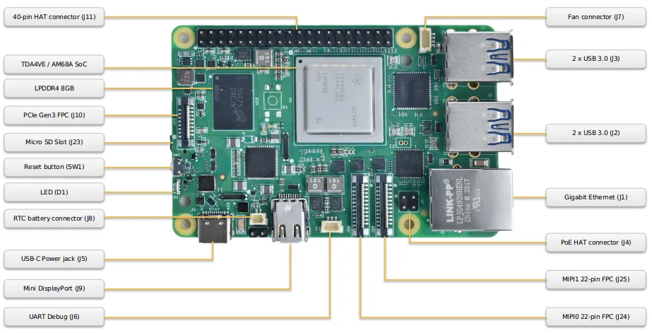
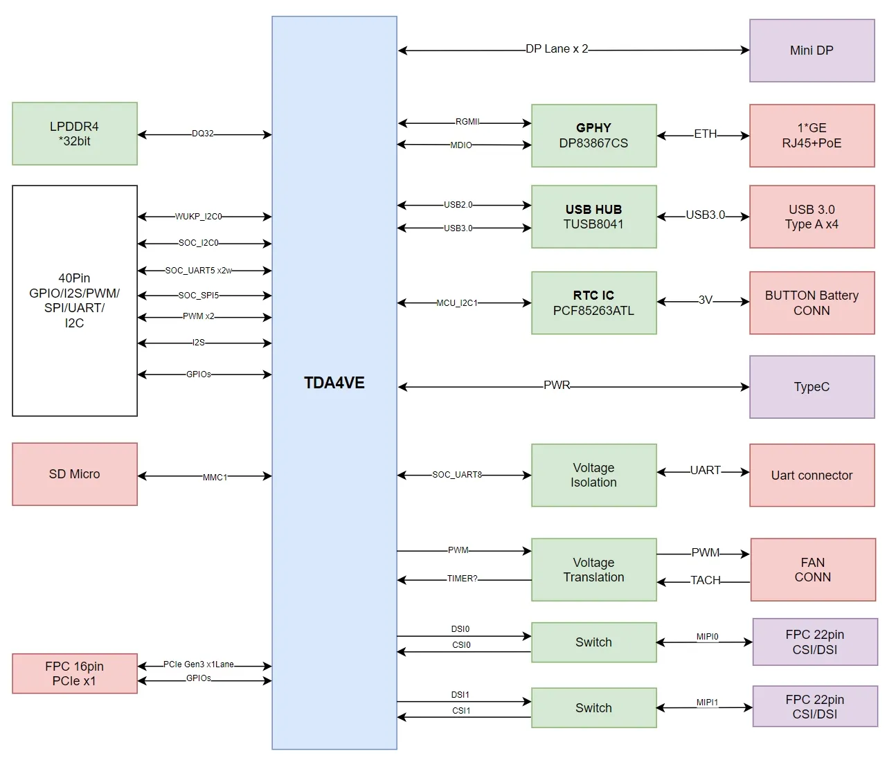
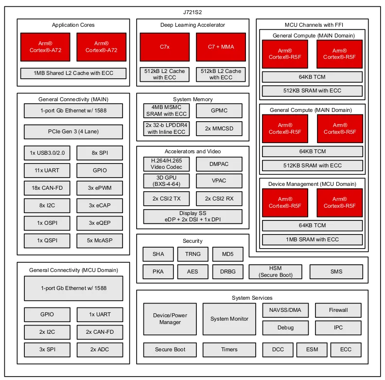
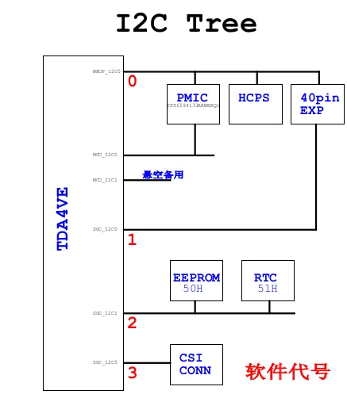

# MO68A Hardware Reference Manual

**Version 1.0 · Beijing InHand Networks Technology Co., Ltd.**

---

## 1. Introduction

This manual summarizes the MO68A system architecture, power and boot behavior, on-board peripheral interfaces, expansion connector definitions, and a concise index of key components (analogous to a hardware-centric interface reference). Descriptions are factual; practical notes on selection and wiring are included where helpful.

MO68A is a single-board computer built around the TDA4VE / AM68A SoC (TI J721S2 family), featuring dual Cortex-A72 application cores, up to six Cortex-R5F MCU cores, and an 8 TOPS AI accelerator.

The intended readers are hardware engineers, firmware developers, and BSP developers who need detailed interface and signal information.

**Source authority.** All connector pinouts and signal assignments in this document are derived from the SysConfig pinmux file (`Mo68A-V4.0.syscfg`). Some peripheral assignments may not yet be reflected in SysConfig; the BSP source code is the definitive reference for the current software state.

---

## On this page

| Section | Summary |
| --- | --- |
| [Interface quick reference](#interface-quick-reference) | Find the physical connector by intent |
| [Board layout](#board-layout) | Connector and component placement on the PCB |
| [System block diagram](#system-block-diagram) | Functional relationships |
| [SoC overview](#soc-overview) | SoC block diagram and parameters |
| [I2C bus tree](#i2c-bus-tree) | I2C topology |
| [Power supply](#power-supply) | USB-C input and power-on sequence |
| [Boot configuration](#boot-configuration) | SD and Ethernet boot behavior |
| [Memory](#memory) | LPDDR4, eMMC footprint, Micro SD |
| [On-board interfaces](#on-board-interfaces) | Connector electrical notes and pinouts |
| [40-pin GPIO header](#40-pin-gpio-header-j11) | GPIO header signal map |
| [Indicators, reset, and UART debug](#indicators-reset-and-uart-debug) | LED, SW1, UART debug header |
| [On-board IC and peripheral summary](#on-board-ic-and-peripheral-summary) | Hub, PHY, RTC, EEPROM |
| [Key component reference](#key-component-reference) | Primary silicon index |
| [Mechanical dimensions](#mechanical-dimensions) | PCB and HAT footprint reference |
| [Related documents and resources](#related-documents-and-resources) | Cross-references to other guides |

---

## Interface quick reference

Use this table to locate connectors when planning wiring; details appear in the sections below.

| Intent | Connector | Notes |
| --- | --- | --- |
| Power | USB Type-C (J5) | **5 V**; adapter should supply **≥ 5 A** sustained (≈27 W) |
| Local display | Mini DisplayPort (J9) | **DisplayPort** monitor required; HDMI not supported directly |
| Wired Ethernet | RJ45 (J1) | **10/100/1000 Mbps** auto-negotiation |
| USB peripherals | USB 3.0 Type-A (J2, J3) | Two stacks of two ports each via on-board **USB 3.0 hub** |
| MIPI camera or DSI display | MIPI0 (J24), MIPI1 (J25) | **22-pin FPC**; CSI-2 vs DSI chosen by hardware configuration |
| PCIe / NVMe expansion | PCIe Gen3 FPC (J10) | **PCIe Gen3 ×1**; see On-board interfaces |
| Raspberry Pi HAT / GPIO | 40-pin (J11) | **3.3 V** logic; **not 5 V tolerant** |
| Active cooling | Fan connector (J7) | **5 V**, **4-pin PWM**; required for thermal management |
| RTC backup | RTC battery connector (J8) | **CR2032** class cell; connector details below |
| PoE power | PoE HAT connector (J4) | Requires a **separate PoE expansion board**; RJ45 alone does not deliver PoE |
| Serial console / headless debug | UART debug (J6) | **115200 8N1**, **3.3 V** |
| System storage and boot | Micro SD (J23) | **MMC1**, primary boot medium |

---

## Board layout

| Connector / Component | Designator | Location |
| --- | --- | --- |
| 40-pin HAT Connector | J11 | Top edge, left |
| Fan Connector | J7 | Top edge, right |
| TDA4VE / AM68A SoC | — | Board center |
| LPDDR4 8 GB | — | Left area |
| PCIe Gen3 FPC | J10 | Left edge, upper |
| Micro SD Slot | J23 | Left edge, center |
| Reset Button | SW1 | Left area, center |
| LED | D1 | Left area, lower |
| USB-C Power | J5 | Bottom edge, far left |
| RTC Battery Connector | J8 | Bottom edge, left |
| Mini DisplayPort | J9 | Bottom edge, left-center |
| UART Debug | J6 | Bottom edge, center |
| MIPI0 22-pin FPC | J24 | Bottom edge, center-right |
| MIPI1 22-pin FPC | J25 | Bottom edge, right |
| PoE HAT Connector | J4 | Bottom area, far right |
| USB 3.0 × 2 | J3 | Right edge, upper stack |
| USB 3.0 × 2 | J2 | Right edge, lower stack |
| Gigabit Ethernet | J1 | Right edge, lower |

---

## System block diagram

The major subsystems and their interconnects:

| Subsystem | Interface to SoC |
| --- | --- |
| LPDDR4 8 GB | DQ×32 (DDRSS0) |
| Micro SD card | MMC1 |
| Mini DisplayPort | SERDES0 DP lanes (2-lane DP0) |
| USB 3.0 Hub (TUSB8041) | USB2.0 + SERDES0 USB3.0 SS |
| Gigabit Ethernet (DP83867) | MCU RGMII1 |
| MIPI FPC × 2 | DSI0/CSI0, DSI1/CSI1 (switchable) |
| PCIe Gen3 FPC | SERDES0 PCIe x1 (PCIE1) |
| 40-pin GPIO Header | SOC I2C0, WKUP I2C0, UART5, SPI5, I2S, GPIO |
| RTC (PCF85263ATL) | SOC I2C1 (0x51) |
| Board EEPROM (BL24C02F) | SOC I2C1 (0x50) |
| USB-C (power) | USB0 |
| Debug UART (J6) | UART8 |
| Fan | PWM + TACH |

---

## SoC overview

### Functional block diagram

### Key parameters

| Parameter | Value |
| --- | --- |
| SoC | TDA4VE / AM68A (J721S2 family) |
| Application CPU | 2× ARM Cortex-A72, up to 2.0 GHz |
| AI Accelerator | MMA (Matrix Multiply Accelerator), 8 TOPS |
| MCU subsystem | Up to 6× ARM Cortex-R5F, up to 1.0 GHz |
| Memory interface | LPDDR4, 32-bit bus |
| Connectivity | 1× USB 3.0 (SERDES), 1× PCIe Gen3 x1 (SERDES), 2× MIPI CSI-2/DSI, 1× DisplayPort (SERDES), RGMII |
| Package | FCBGA |

Refer to the TI J721S2 Technical Reference Manual (SPRUJ28) for complete SoC documentation.

---

## I2C bus tree

---

## Power supply

### USB-C input port

Power is supplied exclusively through the USB-C port (J5).

| Parameter | Value |
| --- | --- |
| Input voltage | 5 V |
| Rated power | 27 W |
| Required adapter current | 5 A minimum |
| Connector | USB Type-C (J5) |

The USB-C port carries board power. Operating long-term at **insufficient 5 V current** risks resets, storage write failures, or overheating. Connect the USB-C adapter **after** other peripherals are wired.

### Power-on sequence

Power sequencing is managed by the PMIC (TPS6594). The reset IC (TPS380833) provides a clean PMIC_ENABLE signal.

---

## Boot configuration

| Parameter | Value |
| --- | --- |
| Primary boot device | Micro SD card (MMC1) |
| Fallback boot device | RGMII (Ethernet) |
| Boot mode pins | Factory-set by resistor strapping |

The boot mode resistors are soldered at the factory and cannot be changed in the field. The primary boot path is SD card; if no valid SD card is detected, the SoC ROM attempts a network boot over RGMII.

---

## Memory

### LPDDR4

| Parameter | Value |
| --- | --- |
| Capacity | 8 GB |
| Device | Micron MT53E2G32D4DE-046 |
| Bus width | 32-bit (×32) |
| Interface | DDRSS0 on SoC |
| Voltage | DDR_1V1 |

### eMMC

No eMMC is populated. The MMC0 interface on the SoC is not connected.

### Micro SD card

The Micro SD slot (J23) is connected to MMC1 on the SoC. It is the primary boot medium and the primary removable non-volatile user storage on the board. For connector electrical details, see [Micro SD card slot (J23)](#micro-sd-card-slot-j23).

---

## On-board interfaces

### Power input — USB-C (J5)

| Parameter | Value |
| --- | --- |
| Connector | USB Type-C, 16-pin |
| Voltage | 5 V |
| Current | 5 A (27 W adapter required) |

The USB-C port carries board power (5 V / 27 W). Connect the USB-C power adapter **last**, after all other peripherals.

---

### Micro SD card slot (J23)

| Parameter | Value |
| --- | --- |
| Connector | MUF-M614 push-push micro SD |
| SoC interface | MMC1 (4-bit) |
| Voltage | 3V3_SD (load-switched) |

The SD slot is the primary user-writable storage on the board and the primary boot medium.

---

### Mini DisplayPort (J9)

| Parameter | Value |
| --- | --- |
| Connector | Mini DisplayPort (20-pin), recessed/sink-board type |
| SoC interface | DP0 via SERDES0 (2-lane) |
| HPD | DP0_HPD (MCASP1_ACLKX, ball AA24) |
| Power | 3V3_DP (load-switched, 500 mA) |

The display output requires a **DisplayPort** monitor. HDMI monitors are not directly supported.

| J9 signal | SoC signal | Ball |
| --- | --- | --- |
| DP_TX0_P | SERDES0_TX2_P → DP0_TXP0 | AG6 |
| DP_TX0_N | SERDES0_TX2_N → DP0_TXN0 | AG5 |
| DP_TX1_P | SERDES0_TX3_P → DP0_TXP1 | AD8 |
| DP_TX1_N | SERDES0_TX3_N → DP0_TXN1 | AD7 |
| DP_AUX_P | DP0_AUX_P | — |
| DP_AUX_N | DP0_AUX_N | — |
| DP_HPD | DP0_HPD (MCASP1_ACLKX) | AA24 |

---

### USB 3.0 Type-A × 4 (J2, J3)

| Parameter | Value |
| --- | --- |
| Connectors | J2 (lower stack), J3 (upper stack), each 2-port |
| USB hub | TUSB8041 (1× upstream, 4× downstream) |
| SuperSpeed lanes | SERDES0_TX1/RX1 → USB3.0 SS to hub upstream |
| Hi-Speed | USB0 (USB2.0) to hub upstream |
| Port power | 5V_TypeA via TPS2561, up to 3.6 A total across all 4 ports |
| Overcurrent protection | Per-port (PWRCTL, OVERCUR signals) |

The TUSB8041 provides:

- 4× USB 3.0 Gen1 (5 Gbps) downstream ports
- Per-port individual power switching and overcurrent detection

---

### Gigabit Ethernet (J1)

| Parameter | Value |
| --- | --- |
| Connector | RJ45 with integrated magnetics |
| PHY | DP83867 |
| SoC interface | MCU RGMII1 |
| Speed | 10/100/1000 Mbps, auto-negotiation |
| PHY MDIO address | 0x00 |
| LED0 | Link indicator |
| LED1 | Activity indicator |
| PoE | Tap points available (J4, see [PoE HAT connector (J4)](#poe-hat-connector-j4)) |

---

### MIPI camera / display FPC — MIPI0 (J24) and MIPI1 (J25)

Both MIPI FPC connectors are **22-pin, 0.5 mm pitch**. Each connector can be configured as either a MIPI CSI-2 camera input or a MIPI DSI display output, selected by zero-ohm resistor jumpers controlled by a GPIO (OE/SEL).

| Parameter | J24 (MIPI0) | J25 (MIPI1) |
| --- | --- | --- |
| Connector | 22-pin FPC, 0.5 mm | 22-pin FPC, 0.5 mm |
| CSI-2 source | CSI0 (4 lanes, 2.5 Gbps/lane) | CSI1 (4 lanes, 2.5 Gbps/lane) |
| DSI source | DSI0 (4 lanes) | DSI1 (4 lanes) |
| I2C bus | SOC_I2C5 (Y24/SCL, W23/SDA) | SOC_I2C5 (Y24/SCL, W23/SDA) |
| Power | 3V3_EXP | 3V3_EXP |
| SEL GPIO | WKUP_GPIO0_36 (OE), WKUP_GPIO0_37 (SEL) | WKUP_GPIO0_33 (OE), WKUP_GPIO0_32 (SEL) |
| PWDN GPIO | GPIO0_47 | GPIO0_48 |

**FPC pin map (22-pin):**

| Pin | Signal | Direction |
| --- | --- | --- |
| 1 | GND | — |
| 2 | DSICSI_D0_N | Differential (data lane 0) |
| 3 | DSICSI_D0_P | Differential (data lane 0) |
| 4 | GND | — |
| 5 | DSICSI_D1_N | Differential (data lane 1) |
| 6 | DSICSI_D1_P | Differential (data lane 1) |
| 7 | GND | — |
| 8 | DSICSI_CLK_N | Differential (clock) |
| 9 | DSICSI_CLK_P | Differential (clock) |
| 10 | GND | — |
| 11 | DSICSI_D2_N | Differential (data lane 2) |
| 12 | DSICSI_D2_P | Differential (data lane 2) |
| 13 | GND | — |
| 14 | DSICSI_D3_N | Differential (data lane 3) |
| 15 | DSICSI_D3_P | Differential (data lane 3) |
| 16 | GND | — |
| 17 | I2C_SCL | 3.3 V open-drain |
| 18 | I2C_SDA | 3.3 V open-drain |
| 19 | GPIO (PWDN / REFCLK) | 3.3 V GPIO |
| 20 | GPIO (RESET) | 3.3 V GPIO |
| 21 | GND | — |
| 22 | 3V3_EXP | Power (3.3 V) |

---

### PCIe Gen3 FPC (J10)

| Parameter | Value |
| --- | --- |
| Connector | 16-pin FPC, 1.0 mm pitch |
| SoC interface | PCIe Gen3 × 1 lane (PCIE1, SERDES0 lane 0) |
| Power | VCC_IN_5V |
| Reference clock | PCIE_REFCLK1_P/N |

**Signal summary:**

| Pin group | Signals | Notes |
| --- | --- | --- |
| Power | VCC_IN_5V | 5 V supply for PCIe device |
| GND | — | Multiple ground pins |
| TX | PCIE1_TXP0, PCIE1_TXN0 | Gen3, 8 GT/s |
| RX | PCIE1_RXP0, PCIE1_RXN0 | Gen3, 8 GT/s |
| REFCLK | PCIE_REFCLK1_P, PCIE_REFCLK1_N | 250 MHz diff clock |
| PWEN | GPIO0_11 (V23) | PCIe device power enable |
| DET/WAKE | GPIO0_12 (T26) | Device detect / wake |
| RST | GPIO0_19 (V27) | Reset (active low) |
| CLKREQ# | PCIE1_CLKREQN | — |

---

### RTC battery connector (J8)

| Parameter | Value |
| --- | --- |
| Connector | SH1.0, 2-pin (1.0 mm pitch) |
| RTC IC | PCF85263ATL |
| Battery | CR2032 button cell (3 V) |

**Pinout:**

| Pin | Signal |
| --- | --- |
| 1 | BAT+ (cell positive) |
| 2 | GND |

The RTC retains time when board power is removed, provided a battery is connected. The PCF85263ATL communicates with the SoC via SOC I2C1 (I2C1_SCL: AC25, I2C1_SDA: AD26), I2C address 0x51.

---

### PoE HAT connector (J4)

| Parameter | Value |
| --- | --- |
| Connector | 2 × 2, 2.54 mm pitch |
| Purpose | Passive tap to Ethernet transformer for PoE expansion board |

J4 provides four centre-tap signals from the RJ45 transformer (TR0–TR3). A separate PoE expansion board is required to extract power from these taps. The RJ45 connector (J1) does not source PoE power by itself.

---

### Fan connector (J7)

| Parameter | Value |
| --- | --- |
| Connector | SH1.0, 4-pin (1.0 mm pitch) |
| Fan voltage | 5 V (VCC_IN_5V) |
| PWM control | PWM1_B (GPIO0_29, R28) via SN74LVC1T45 level translator |
| Tachometer | TIMER_IO1 (AG25) via MOSFET Q7 (NX8008NBKWX) |

**Pinout:**

| Pin | Signal | Description |
| --- | --- | --- |
| 1 | 5V | Fan power (5 V) |
| 2 | PWM | Fan speed control (PWM) |
| 3 | GND | Ground |
| 4 | TACH | Fan tachometer input |

A 5 V, 4-pin PWM fan is required. The PWM frequency and duty cycle are software-controlled. Connecting the fan is **mandatory** for thermal management; operating the board without a fan may cause throttling or damage.

---

## 40-pin GPIO header (J11)

| Parameter | Value |
| --- | --- |
| Connector | 2 × 20, 2.54 mm pitch, through-hole |
| IO voltage | 3.3 V (VDDSHV domain), **not 5 V tolerant** |
| Power supply | 3V3_EXP (load-switched, 4 A total shared with MIPI FPCs) |

> **Note:** Three GPIO signals on this header are in the WKUP domain (MCU subsystem). They behave differently from main domain GPIOs with respect to power-down and sleep states.

The header follows the Raspberry Pi 40-pin HAT mechanical footprint and pin numbering. The SoC signal assignments differ from a Raspberry Pi.

**40-pin signal map:**

Odd-numbered pins (left column), even-numbered pins (right column). Ball numbers shown in parentheses; WKUP-domain pins marked with †.

| Function (odd pin) | Pin | | Pin | Function (even pin) |
| ------------------ |:---:|:---:|:---:|:------------------- |
| 3.3 V | 1 | | 2 | 5.0 V |
| I2C0_SDA (AE24) | 3 | | 4 | 5.0 V |
| I2C0_SCL (AH25) | 5 | | 6 | GND |
| AUDIO_CLK / GPIO0_30 (Y25) | 7 | | 8 | UART5_TXD (W25) |
| GND | 9 | | 10 | UART5_RXD (AC24) |
| WKUP_GPIO0_60 (E27) † | 11 | | 12 | I2S_CLK (AB28) |
| GPIO0_0 (AG24) | 13 | | 14 | GND |
| WKUP_GPIO0_61 (E28) † | 15 | | 16 | GPIO0_27 (V26) |
| 3.3 V | 17 | | 18 | GPIO0_51 (AE27) |
| SPI5_MOSI (R27) | 19 | | 20 | GND |
| SPI5_MISO (AD27) | 21 | | 22 | WKUP_GPIO0_70 (B26) † |
| SPI5_CLK (T27) | 23 | | 24 | SPI5_CS0 (U28) |
| GND | 25 | | 26 | SPI5_CS1 (W28) |
| WKUP_I2C0_SDA (H27) † | 27 | | 28 | WKUP_I2C0_SCL (H24) † |
| GPIO0_18 (AB27) | 29 | | 30 | GND |
| GPIO0_33 (AA28) | 31 | | 32 | PWM / ECAP0 (AB26) |
| PWM5_B / GPIO0_32 (U26) | 33 | | 34 | GND |
| I2S_FS (U27) | 35 | | 36 | GPIO0_10 (AB24) |
| GPIO0_9 (Y28) | 37 | | 38 | I2S_DIN (AC28) |
| GND | 39 | | 40 | I2S_DOUT (Y26) |

**Available interfaces summary:**

| Interface | Pins | Notes |
| --- | --- | --- |
| I2C (SOC) | 3, 5 | SOC domain I2C0 |
| I2C (WKUP) | 27, 28 | WKUP domain I2C0; shared with PMIC |
| UART | 8, 10 | UART5, full-duplex |
| SPI | 19, 21, 23, 24, 26 | SPI5 (MOSI, MISO, CLK, CS0, CS1) |
| I2S | 12, 35, 38, 40 | MCASP0 (CLK, FS, DIN, DOUT) |
| PWM | 32, 33 | Pin 33 (PWM5_B, U26): available via pwmchip1 ch1; pin 32 (ECAP0, AB26): routed but no kernel DT node |
| GPIO (SOC) | 7, 13, 16, 18, 29, 31, 33, 36, 37 | Main domain GPIO0 |
| GPIO (WKUP) | 11, 15, 22 | MCU subsystem GPIO, remain active in deep sleep |

---

## Indicators, reset, and UART debug

### LED indicator (D1)

D1 is a dual-color LED (KL-3210URSYGC).

| Color | Function | Control GPIO | Ball |
| --- | --- | --- | --- |
| Red | Power / boot indicator | WKUP_GPIO0_4 | C23 |
| Green | System status | WKUP_GPIO0_5 | F26 |

Normal operating state: LED turns **solid green** when Linux has booted and the system is running. During boot, the LED is red. See the *MO68A User Guide* for LED behavior details.

---

### Reset button (SW1)

SW1 is a tactile push button that controls PMIC_ENABLE. Pressing SW1 initiates a system reset. The reset IC (TPS380833) provides a debounced, controlled-release reset pulse.

> SW1 asserts a full system reset including the SoC, DDR, and all power rails. It is equivalent to a power cycle.

---

### UART debug console (J6)

| Parameter | Value |
| --- | --- |
| Connector | SH1.0, 3-pin (1.0 mm pitch) |
| UART | UART8 (SOC domain) |
| Baud rate | 115200 |
| Frame format | 8N1, no flow control |
| Logic level | 3.3 V |

**Pinout:**

| Pin | Signal | Ball | Description |
| --- | --- | --- | --- |
| 1 | RXD | AF26 | SoC receive (connect to adapter TX) |
| 2 | GND | — | Ground |
| 3 | TXD | AH27 | SoC transmit (connect to adapter RX) |

A 3.3 V USB-to-UART adapter is required. Connect the serial terminal **before** applying power to capture early boot output.

UART8 is used for Linux system console output and provides a login prompt independent of the display.

---

## On-board IC and peripheral summary

### USB 3.0 Hub — TUSB8041

The TUSB8041 is a USB 3.0 Gen1 (5 Gbps) 4-port hub. It receives USB2.0 (Hi-Speed) and USB3.0 SuperSpeed from the SoC and exposes four USB 3.0 downstream ports on J2 and J3.

- Individual port power switching
- Per-port overcurrent detection

---

### Gigabit Ethernet PHY — DP83867

The DP83867 PHY connects the SoC's MCU RGMII1 interface to the RJ45 jack with integrated magnetics. Key configuration:

- PHY address: 0x00
- Auto-negotiation enabled
- LED0: Link, LED1: Activity

---

### RTC — PCF85263ATL

The PCF85263ATL real-time clock provides accurate timekeeping with a 32.768 kHz crystal. It is connected to the SOC I2C1 bus.

- I2C bus: SOC_I2C1, address 0x51
- SCL ball: AC25, SDA ball: AD26
- Battery backup via J8 (CR2032)

---

### Board ID EEPROM — BL24C02F

An I2C EEPROM stores board identification and manufacturing data.

| Parameter | Value |
| --- | --- |
| I2C bus | SOC I2C1 (SCL: AC25, SDA: AD26), address 0x50 |
| Write protect | WP pin must be pulled low before writing |

---

## Key component reference

| Component | Model | Interface | Notes |
| --- | --- | --- | --- |
| SoC | TDA4VE / AM68A (J721S2) | — | 2× A72, 8 TOPS |
| LPDDR4 | Micron MT53E2G32D4DE-046 | DDRSS0 ×32-bit | 8 GB total |
| PMIC | TPS6594 series | WKUP I2C0 | Multi-rail power management |
| CPU power | TPS62871 (HCPS-A) | — | VDD_CPU_AVS, 8 A |
| Core power | TPS62871 × 2 (HCPS-B) | — | VDD_CORE_0V8, 8 A |
| 3.3V DC-DC | TPS62A06 | — | 6 A, main 3.3 V rail |
| USB power switch | TPS2561 | — | 5V_TypeA, 3.6 A |
| USB 3.0 Hub | TUSB8041 | USB3.0 SS + USB2.0 HS | 4-port, Gen1 5 Gbps |
| GbE PHY | DP83867 | MCU RGMII1 | 10/100/1000 Mbps |
| RTC | PCF85263ATL | SOC I2C1 (0x51) | Battery backup |
| Board EEPROM | BL24C02F | SOC I2C1 (0x50) | Board ID |
| Fan PWM translator | SN74LVC1T45 | GPIO/PWM | PWM level translation |
| Fan TACH switch | NX8008NBKWX (Q7) | TIMER_IO1 | TACH signal conditioning |
| Reset IC | TPS380833 | — | PMIC_ENABLE control |

---

## Mechanical dimensions

Refer to the PCB layout drawing `MO68A_MB_FAB_V1.0.pdf` for board outline, hole positions, and component keep-out zones.

The 40-pin HAT connector (J11) follows the Raspberry Pi 40-pin HAT mechanical footprint.

---

## Related documents and resources

| Document / resource | Description |
| --- | --- |
| [MO68A Quick Start Guide](MO68A_Quick_Start_Guide_V1.0.md) | Initial setup, flashing, first login |
| [MO68A User Guide](MO68A_User_Guide_V1.0.md) | Interface usage, peripheral configuration, system administration |

---

## Revision History

| Version | Date | Description |
| --- | --- | --- |
| 1.0 | 2026-04-27 | Initial release. |
