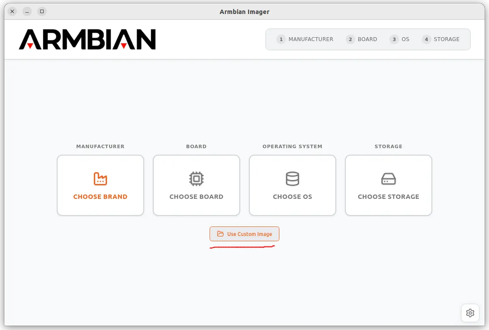
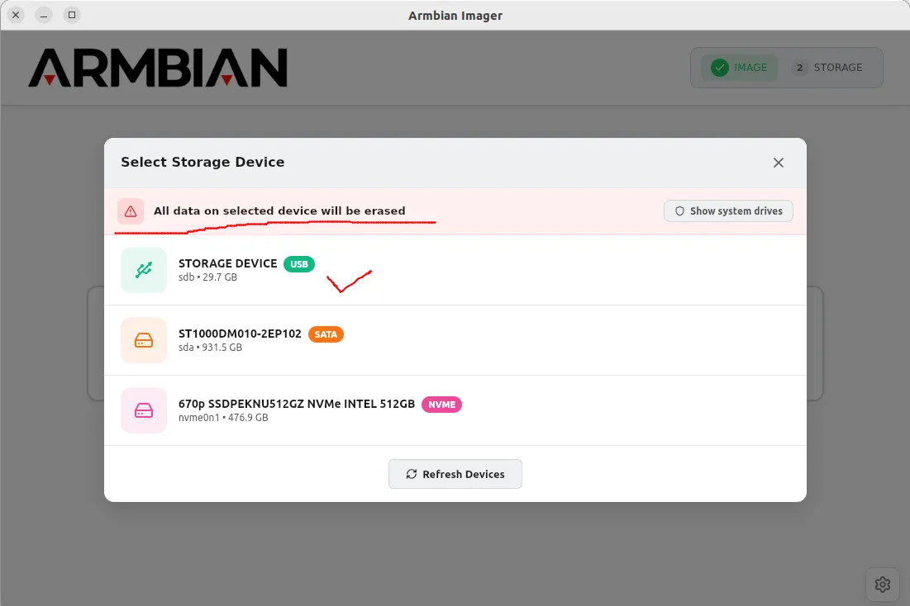
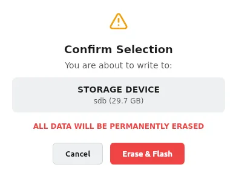
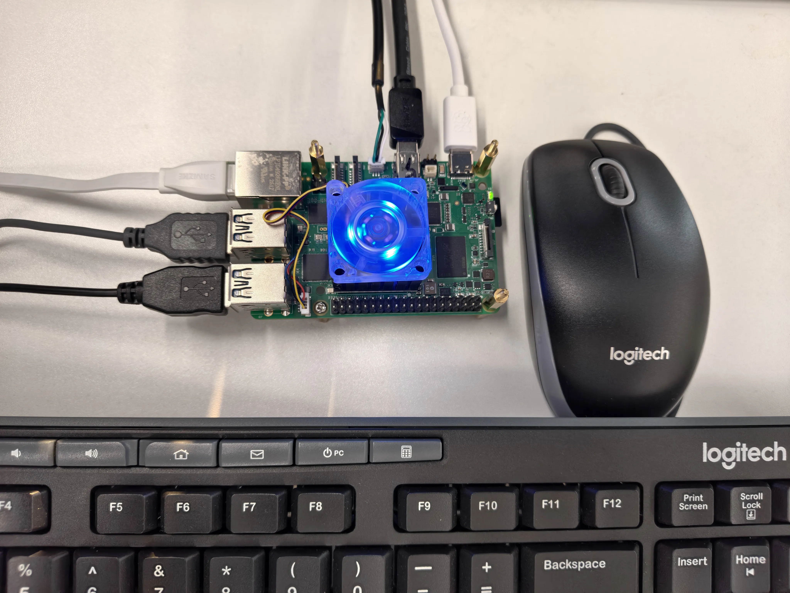
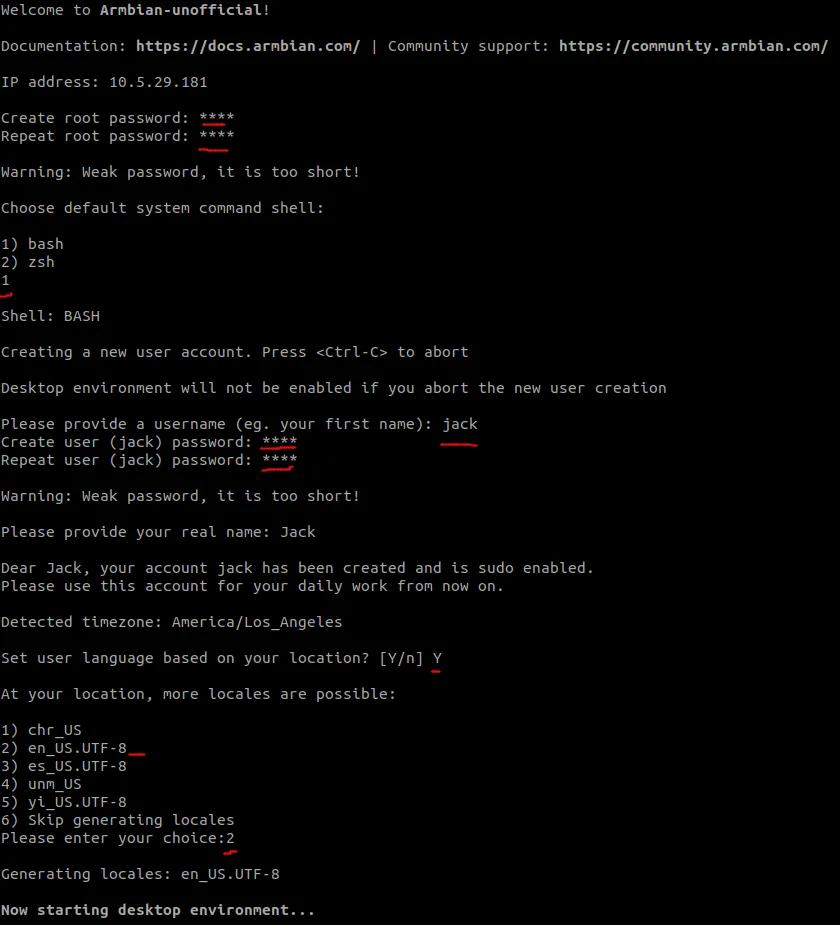
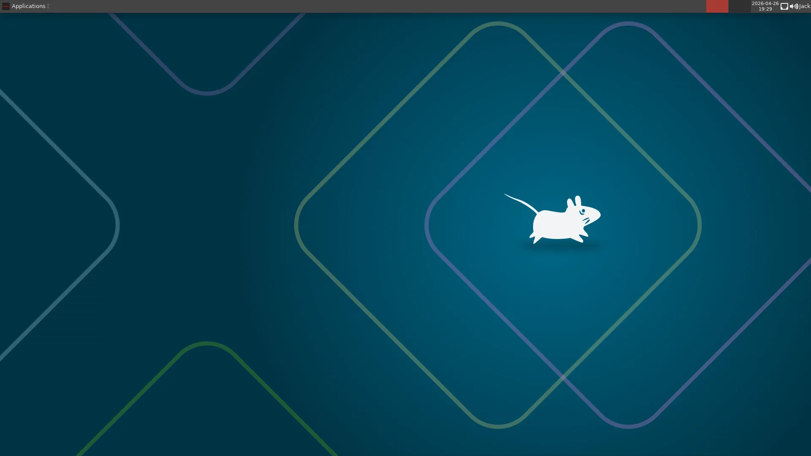
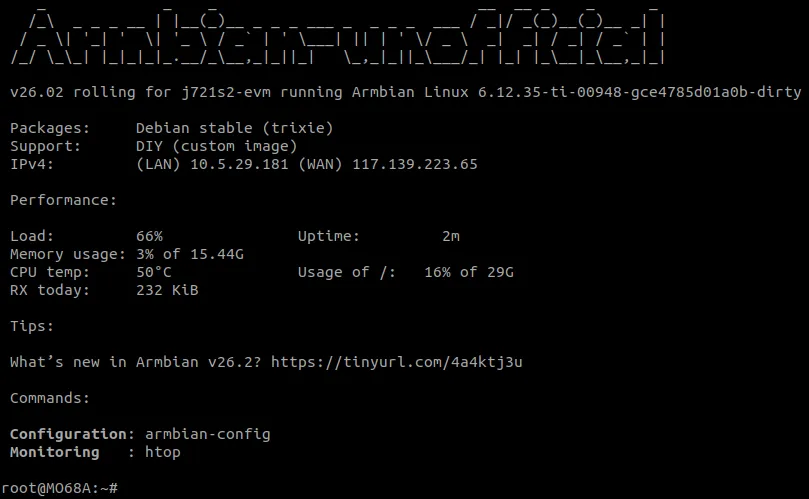

# MO68A Quick Start Guide

**Version 1.0 · Beijing InHand Networks Technology Co., Ltd.**

---

This guide is for first-time MO68A users. It describes the shortest path from gathering accessories to reaching the desktop or logging in over SSH, and includes board overview, wiring, network access, and pointers to expansion interfaces. The tone is factual; steps are given as direct actions you can perform.

---

## On this page

| Section | Description |
| --- | --- |
| [Shortest path](#shortest-path) | Read first: flash → wiring → power → login |
| [Device overview](#device-overview) | Positioning and key specifications |
| [Board layout](#board-layout) | Where connectors are on the PCB |
| [What you need](#what-you-need) | Required and optional items |
| [Flash the Micro SD card](#flash-the-micro-sd-card) | Image download and Armbian Imager |
| [Hardware connections](#hardware-connections) | Recommended wiring order |
| [First boot](#first-boot) | Boot time, default credentials, setup wizard |
| [Network access](#network-access) | Wired Ethernet, finding the IP address, SSH |
| [Expansion interfaces and MIPI](#expansion-interfaces-and-mipi) | Pointers to the User Guide |
| [FAQ and tips](#faq-and-tips) | Display, SD, power, network |

---

## Shortest path

To reach the desktop or SSH as quickly as possible, follow this order (details are in the sections below).

1. **Prepare**: USB Type-C supply (5 V / 5 A), Micro SD card ≥ 16 GB Class 10 (or faster), PWM fan (4-pin, 5 V), downloaded MO68A Armbian image, RJ45 cable; for desktop use, also have a Mini DisplayPort cable, DisplayPort monitor, USB keyboard and mouse.
2. **Flash**: On a host PC, write the image to the SD card with Armbian Imager; writing erases all data on that card.
3. **Wire**: Connect the fan, insert the SD card, then attach display/USB/network as needed and serial debug (optional); **connect USB-C power (J5) last**.
4. **Power on**: LED (D1) should be red first; when ready, it turns solid green.
5. **Wait**: On first boot, root filesystem expansion adds about **1–2 minutes** and triggers one automatic reboot; afterward a cold boot takes about **30–45 seconds**.
6. **Log in**: First-time default username `root`, password `1234`; complete the one-time Armbian wizard (locale, timezone, new user).
7. **Remote (headless)**: Find the board IP on the LAN, then run `ssh <username>@<board-ip>` (see [Network access](#network-access)).

---

## Device overview

### About MO68A

MO68A is a compact AI edge board built around the **TDA4VE / AM68A SoC** (TI J721S2 family) with dual Cortex-A72 application cores and **8 TOPS** (MMA) AI acceleration, in a Raspberry Pi **40-pin HAT**-compatible footprint. It runs **Armbian Linux (Debian 13 Trixie)**. You can use it as a desktop with a display and peripherals, or operate it headless over serial or SSH.

### Key specifications

| Parameter | Value |
| --- | --- |
| SoC | TDA4VE / AM68A (TI J721S2) |
| CPU | 2× ARM Cortex-A72, up to 2.0 GHz |
| AI accelerator | MMA, 8 TOPS |
| Memory | 8 GB LPDDR4 |
| Storage | Micro SD (primary boot); PCIe NVMe (expansion — see User Guide) |
| Display | Mini DisplayPort |
| Networking | 1× Gigabit Ethernet RJ45 |
| USB | 4× USB 3.0 Type-A |
| Camera / display expansion | 2× MIPI 22-pin FPC (CSI-2 / DSI) |
| Expansion | 40-pin GPIO (Raspberry Pi HAT compatible) |
| Power | USB-C, 5 V / 5 A (27 W) |
| Operating system | Armbian (Debian 13 Trixie), XFCE desktop |

---

## Board layout


| Component / Connector | Location |
| --- | --- |
| 40-pin HAT connector (J11) | Top edge, left |
| Fan connector (J7) | Top edge, right |
| TDA4VE / AM68A SoC | Board center |
| LPDDR4 8 GB | Left area |
| PCIe Gen3 FPC (J10) | Left edge, upper |
| Micro SD slot (J23) | Left edge, center |
| Reset button (SW1) | Left area, center |
| LED (D1) | Left area, lower |
| USB-C power jack (J5) | Bottom edge, far left |
| RTC battery connector (J8) | Bottom edge, left |
| Mini DisplayPort (J9) | Bottom edge, left-center |
| UART debug (J6) | Bottom edge, center |
| MIPI0 22-pin FPC (J24) | Bottom edge, center-right |
| MIPI1 22-pin FPC (J25) | Bottom edge, right |
| PoE HAT connector (J4) | Bottom area, far right (near edge) |
| 2 × USB 3.0 (J3) | Right edge, upper stack |
| 2 × USB 3.0 (J2) | Right edge, lower stack |
| Gigabit Ethernet (J1) | Right edge, lower |

---

## What you need

### Required

| Item | Notes |
| --- | --- |
| MO68A board | — |
| USB-C power adapter | 5 V / 5 A (25–27 W) |
| Micro SD card | ≥ 16 GB, Class 10 / UHS-I (U1) or faster |
| PWM fan | 5 V, 4-pin |
| RJ45 Ethernet cable | Wired network (find IP, SSH) |
| Host computer | Windows, macOS, or Linux — for flashing the SD card |

### Optional (by scenario)

| Item | Notes |
| --- | --- |
| Mini DisplayPort cable, DisplayPort monitor | Required for **desktop** use |
| USB keyboard and mouse | Operating XFCE on **desktop** |
| USB-to-UART adapter (3.3 V) | **Headless** troubleshooting or completing setup over serial |
| RTC battery (CR2032, 2-pin JST-SH class) | Persistent clock (see User Guide [§11 RTC](MO68A_User_Guide_V1.0.md#11-rtc)) |

**Paths:** **Desktop** — display, keyboard, and mouse; XFCE after boot. **Headless** — rely mainly on Ethernet (serial optional) and SSH; flash and wiring match until login — see [First boot](#first-boot) and [Network access](#network-access).

---

## Flash the Micro SD card

### Download the image

Download the MO68A Armbian image from the **InHand website** and save it on the host computer you use for flashing.

### Flash with Armbian Imager

1. Download and install **Armbian Imager** from the [GitHub releases page](https://github.com/armbian/imager/releases).
2. Insert the Micro SD card into the host computer.
3. Open Armbian Imager, click **Use Custom Image**, and select the image file you downloaded.

   

4. Click **CHOOSE STORAGE** and select your Micro SD card.

   

   > **Warning:** Verify the selected device. Flashing erases all existing data on it.

5. Click **Erase & Flash**. You may be prompted for an administrator password; writing and verification take about 3–5 minutes.

   

6. When finished, safely eject the storage device before removing the card.

---

## Hardware connections

Follow this order to reduce hot-plug risk; **always connect power last**. The photo below is an example layout.



| Step | Connection | Connector | Confirmation |
| --- | --- | --- | --- |
| 1 | Fan (4-pin) | J7 | Fan spins after power-on |
| 2 | Flashed Micro SD card | J23 | Card fully seated (clicks) |
| 3 | Mini DisplayPort cable *(desktop)* | J9 | Display may show no signal until boot |
| 4 | USB keyboard & mouse *(desktop)* | J2 or J3 | — |
| 5 | RJ45 Ethernet cable | J1 | — |
| 6 | Serial debug cable *(optional)* | J6 | See [Serial debug console](#serial-debug-console-optional) below |
| 7 | USB-C power | J5 | D1 red at power-on; solid green when ready |

### Serial debug console *(optional)*

Connect a **3.3 V** USB-to-UART adapter to **J6** (SH1.0 3-pin):

| Pin | Signal |
| --- | --- |
| 1 | RXD |
| 2 | GND |
| 3 | TXD |

Settings: **115200 baud, 8N1, no flow control**

```bash
# Linux example (replace with your device node)
minicom -D /dev/ttyUSB0 -b 115200
```

On Windows use PuTTY or Tera Term and select the correct COM port.

The serial console shows the full boot log and a login prompt without a display. Open the terminal **before** applying power so early messages are not missed.

---

## First boot

### Boot behavior

The system boots from Micro SD. A typical cold boot takes **30–45 seconds**; LED (D1) **solid green** means the OS is ready (red may appear during boot).

> **First boot only:** The root filesystem expands to fill the SD card; this takes about **1–2 minutes** and the board reboots once. **Log in only after the second boot completes.** The wizard and desktop paths are below.

### First login and setup wizard

Default credentials to start: username **`root`**, password **`1234`**.

On the first login over display or serial, Armbian runs a one-time wizard for language, timezone, and creating a user account. Follow the prompts.

> **Tip:** If Ethernet is connected before first boot, Armbian can suggest an appropriate locale from the network.



### Desktop path

After the wizard, the XFCE desktop appears on the display.



### Headless path

After completing the wizard on serial, you see the Armbian shell.



For SSH, continue with [Network access](#network-access).

---

## Network access

### Wired Ethernet

With the Gigabit port (J1) cabled, `eth0` obtains an IPv4 address via DHCP by default.

### Find the board IP address

- Use your router admin UI and check the DHCP client list; or  
- On a shell already logged in on the board (display, serial, or existing session), run:

```bash
ip addr show eth0
```

### SSH login

From another computer on the LAN:

```bash
ssh <username>@<board-ip>
```

Use the user created in the wizard (or `root` if your security policy still allows it).

---

## Expansion interfaces and MIPI

Pin/signal definitions, software setup, and usage examples for the **40-pin GPIO header** and the **two MIPI 22-pin FPC** connectors (camera / DSI display, etc.) are in the **MO68A User Guide**: [§14 40-pin GPIO Header](MO68A_User_Guide_V1.0.md#14-40-pin-gpio-header), [§15 MIPI FPC Ports](MO68A_User_Guide_V1.0.md#15-mipi-fpc-ports), and the following display and camera sections.

---

## FAQ and tips

| Symptom | What to check | More information |
| --- | --- | --- |
| **No display** | Monitor must accept DisplayPort (not HDMI-only); Mini DP seated in J9; correct input source | [User Guide §7](MO68A_User_Guide_V1.0.md#7-mini-displayport) |
| **Does not boot from SD** | Card fully inserted in J23 (click); re-flash with Armbian Imager and eject safely | [Flash the Micro SD card](#flash-the-micro-sd-card) |
| **Power LED off** | Adapter is 5 V / 5 A; cable is on J5 (USB-C power), not another port | [Hardware Reference Manual — Power supply](MO68A_Hardware_Reference_Manual_V1.0.md#power-supply) |
| **Board not found on LAN** | RJ45 on J1; switch/router link LEDs; look up IP in the DHCP client list | This guide — [Network access](#network-access) |

---

## Related documents and resources

| Document / resource | Description |
| --- | --- |
| [MO68A User Guide](MO68A_User_Guide_V1.0.md) | Interface usage, peripheral configuration, system administration |
| [MO68A Hardware Reference Manual](MO68A_Hardware_Reference_Manual_V1.0.md) | Connector pinouts, signal assignments, electrical specifications |
