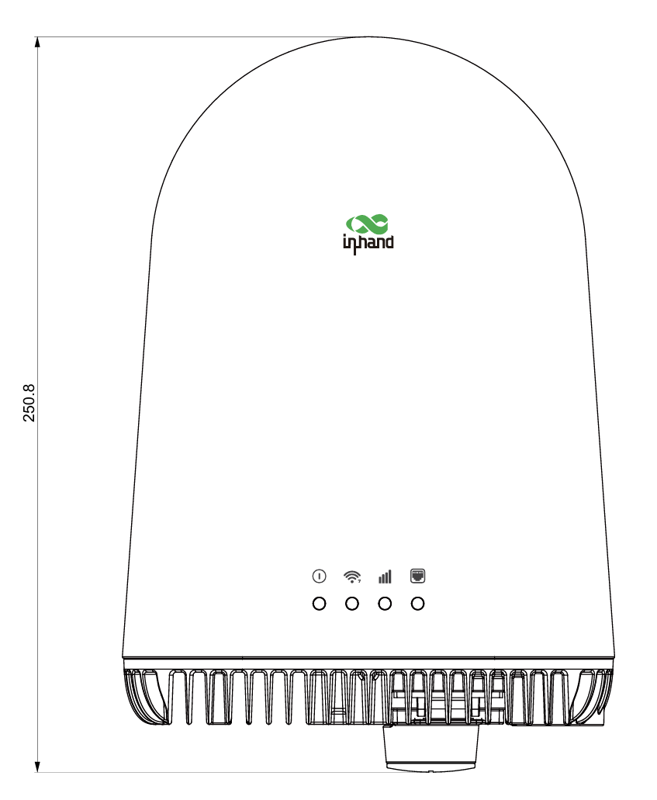
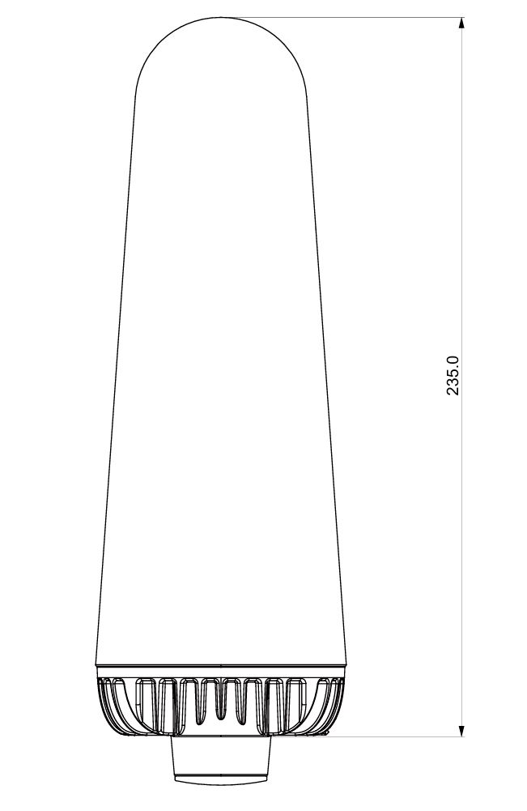
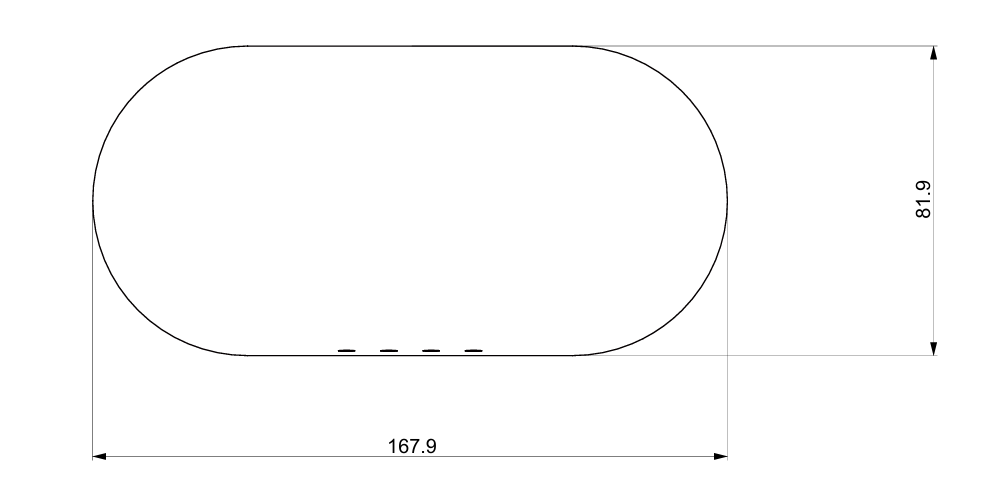

  

    

      
    

    

      Minimalist Design, Powerful Connectivity
    

  

  

    

      ODU12 5G Outdoor AI-Native Router
    

    

      

        
· 5G

        
· Wi-Fi 7

      

      

        
· Outdoor IP65

        
· AI-Native

      

    

  

# 1. Product Overview

The ODU12 is an innovative outdoor 5G router—a high-performance, cloud-managed network access device built on a groundbreaking structure-thermal integration design. It seamlessly combines high-performance connectivity with architectural aesthetics, purpose-built for residential and light commercial applications. Advanced capabilities including 5G NSA/SA dual-mode cellular, Wi-Fi 7 dual-band wireless, and 2.5 Gbps wired networking are integrated into a compact IP65-rated enclosure.

The ODU12 moves beyond the bulky appearance and cluttered external antennas of traditional outdoor routers. Its minimalist all-in-one design features fully integrated 360° omnidirectional antennas, delivering reliable performance in extreme weather while minimizing visual impact and blending harmoniously with the built environment.

The ODU12 is a true AI Agent-native router, designed for the digital workplace of the future.

## Key Features

- **Ultra-Fast 5G Connectivity:** 5G NSA/SA dual-mode support with downlink speeds up to 7.01 Gbps
- **Next-Gen Wi-Fi 7 Wireless:** BE5000 dual-band concurrent, up to 128 connected clients
- **Agent-Native Router:** Agent CLI support for intent-based configuration
- **Rich Skills Library:** Intelligent diagnostics support
- **Fully Integrated Antenna Design:** 8 × 5G cellular antennas + 3 × Wi-Fi antennas for 360° coverage
- **Structure-Thermal Integration:** Die-cast aluminum heat sink serves as the structural frame; fanless passive cooling
- **Minimalist Aesthetic Design:** One-piece geometric profile that blends discreetly into any building environment
- **PoE Convenience:** IEEE 802.3at PoE powered; single-cable power and data
- **Cloud Management & Maintenance:** Unified management via InCloud platform; operate anytime, anywhere via mobile app

## Typical Application Scenarios

### Residential

**Villas & Single-Family Homes:** Outdoor areas such as courtyards, garages, and pools

**Premium Communities & Apartments:** Outdoor common areas (gardens, fitness zones, parking lots)

### Light Commercial

**Farmer Markets**

**Resorts & Campgrounds**

**Outdoor Cafés & Restaurants**

**Wineries**

**Temporary Stalls & Pop-Up Shops**

**Agritourism / Farm Stays**

### Enterprise Branch

**Enterprise Branch Offices:** Strong outdoor signal where indoor coverage is poor

**Factories, Warehouses & Logistics Parks:** Large outdoor areas requiring coverage for AGV dispatch, security surveillance, and staff communications

**Temporary Construction Site Networks**

### Smart City

**Outdoor Digital Signage**

**Plazas, Stations, Parks & Beaches:**

- Outdoor surveillance and security

- Free Wi-Fi for citizens and visitors

## Product Dimensions

  

    

      
    

    
Top View

  

  

    

      
    

    
Side View

  

  

    

      
    

    
Bottom View

  

  
<strong>Notes:</strong>

  
1. All dimensions are in millimeters (mm).

  
2. All dimensions are approximate and for reference only.

  
3. Drawings must not be used for manufacturing.

  
4. Dimensions are subject to part and manufacturing tolerances.

  
5. Specifications may change without prior notice.

# 2. Product Innovations

## Innovation 1: Structure-Thermal Integration

The **die-cast aluminum heat sink** serves as both a passive cooling element and the primary structural frame:

- Eliminates fans and redundant internal supports for fanless, silent operation
- Significantly reduces size while maintaining IP65 protection
- Enhances durability and long-term reliability, extending component lifespan
- Greatly reduces bill of materials (BOM) and assembly complexity

### Innovation 2: Fully Integrated Antenna Aesthetics

**360° omnidirectional high-gain antennas** are fully integrated within the one-piece enclosure:

- 8 × 5G cellular antennas + 3 × Wi-Fi antennas in an integrated layout
- No external antenna components; eliminates visual clutter
- Maintains uniform signal coverage with a compact, low-profile appearance
- Blends seamlessly with the built environment, reducing visual interference

### Innovation 3: Unified Mounting Interface

A **single interface** supports multiple installation methods:

- Wall, pole, and roof mounting
- No specialized tools or professional installers required
- Users can complete installation and deployment in minutes
- One SKU covers all installation scenarios, optimizing inventory management

### Innovation 4: AI Agent Cloud Management

AI Agent cloud management enables unified remote operations and maintenance:

- One-click cloud onboarding; remote batch configuration deployment
- Real-time monitoring of device status, traffic, and signal
- **AI Agent:** Network optimization and early fault detection
- Mobile app: QR code device onboarding, alert push notifications, manage anytime, anywhere

### Innovation 5: AI-Native Router

- Agent CLI support
- Intent-based configuration
- Rich Skills library
- Intelligent diagnostics support

# 3. Hardware Specifications

| Item | Specification |
| ------------- | --------------------------------------- |
| **Processor** | Quad-core Cortex-A55 @ 2.2 GHz |
| **Memory** | 2 GB DDR4 |
| **Storage** | 32 GB eMMC |
| **5G Module** | MTK 830 platform, 3GPP Release 16 |
| **SIM Slots** | 2 × 4FF Nano-SIM + 1 × eSIM (reserved) |
| **WAN Port** | 1 × 2.5 Gbps RJ45, PoE powered |
| **LAN Port** | 1 × 2.5 Gbps RJ45 (can be shared with WAN for dual-LAN) |
| **USB Port** | 1 × Type-C |
| **Wi-Fi** | Wi-Fi 7 (802.11be) dual-band BE5000 |
| **5G Antennas** | 8 × integrated high-performance cellular antennas, 360° omnidirectional coverage |
| **Wi-Fi Antennas** | 3 × integrated antennas (2.4 GHz × 2 + 5 GHz × 3) |
| **GPS Antenna** | 1 × integrated GPS antenna |
| **Power Supply** | IEEE 802.3at PoE powered (802.3af compatible) |
| **Power Consumption** | ≤ 18 W |
| **Reset Button** | 1 × Reset button |
| **Cooling** | Structure-thermal integrated passive cooling, fanless design |
| **Protection Rating** | IP65 |
| **Enclosure Material** | Die-cast aluminum heat sink + UV-stabilized polymer shell |
| **Color** | White |
| **Operating Temperature** | -30 °C ~ +70 °C |
| **Storage Temperature** | -40 °C ~ +85 °C |
| **Relative Humidity** | 5% ~ 95%, non-condensing |
| **Dimensions** | 350 mm × 300 mm × 50 mm (reference) |
| **Weight** | Approx. 1.5 kg (reference) |
| **Mounting** | Wall, pole, and roof mounting |

## LED Indicators

The ODU12 features 4 multi-color LEDs (red/blue/green) for System, Wi-Fi, Signal, and Port. Each LED retains tri-color capability for flexible configuration. The indicator layout is clean and intuitive, enabling users to quickly understand device operating status.

# 4. Network Connectivity

## 4.1 5G/4G Cellular Network

- **Network Standards:**
  - 5G: NR SA/NSA, Sub-6 GHz, 3GPP Release 16
  - 4G: LTE-FDD/LTE-TDD, Cat.19
- **Speed Specifications:**
  - 5G SA & NSA: 7.01 Gbps DL / 2.5 Gbps UL
  - 4G Cat.19: 1.6 Gbps DL / 200 Mbps UL

| Network Type | Supported Bands |
| ---------- | ------------------------------------------------------------ |
| **5G NR** | n2/n5/n7/n12/n13/n14/n25/n26/n29/n30/n38/n41/n48/n66/n70/n71/n77/n78 |
| **4G LTE** | B2/B4/B5/B7/B12(B17)/B13/B14/B25/B26/B29/B30/B38/B41/B42/B43/B46/B48/B66/B70/B71 |

## 4.2 SIM Management

- **Dual SIM Dual Standby:** Dual Nano-SIM hot backup support
- **eSIM Support:** Reserved eSIM design with remote provisioning
- **Smart Switching:**
  - Automatic SIM switch on data threshold
  - Automatic switch on dial failure
  - Automatic switch during abnormal periods
  - Automatic switch on probe failure
  - Intelligent SIM revert

## 4.3 Wired Network

- **WAN Port:** 1 × 2.5G RJ45; supports PPPoE/DHCP/static IP
- **LAN Port:** 1 × 2.5G RJ45; configurable as WAN extension (dual-LAN mode)
- **PoE Support:** LAN2 supports PoE output (in powered mode)
- **IPv6 Support:** Full IPv6 functionality with 5 access modes
- **Throughput:** Up to 2 Gbps

## 4.4 Wi-Fi 7 Wireless Access

- **Standard:** IEEE 802.11be (Wi-Fi 7)
- **Frequency Bands:** 2.4 GHz + 5 GHz dual-band concurrent
- **Wireless Specification:** BE5000
- **Max Connected Clients:** 128
- **Concurrent Connections:** 128 concurrent clients, 20 Mbps throughput per client
- **Coverage Range:** Effective Wi-Fi coverage up to 50 m (line-of-sight reference)
- **MIMO:** 2.4 GHz 2×2 + 5 GHz 3×3 MIMO
- **Security:** WPA3-PSK/WPA3-Enterprise/WPA2-PSK/WPA2-Enterprise
- **Multi-SSID:** Multiple virtual APs with flexible primary/sub-AP configuration

# 5. Link Management & Backup

## 5.1 Intelligent Link Backup

- **Backup Modes:** Active/standby mode, load balancing mode
- **Probe Methods:** ICMP/TCP/DNS probing
- **Switching Policies:**
  - Immediate switch: millisecond-level failover on link failure
  - Delayed switch: configurable delay to avoid frequent switching
  - No-switch mode: alert only, no switchover
- **Load Balancing:** Multi-link traffic distribution for improved bandwidth utilization
- **Max Users:** 200 (Wi-Fi: 128)

## 5.2 Link Quality Monitoring

- **Real-Time Monitoring:** Live display of link status, latency, and packet loss
- **Quality Trends:** Historical link quality trend charts
- **Health Checks:** Automated link health assessment
- **Alert Notifications:** Instant alerts on link anomalies

# 6. Security Features

## 6.1 Firewall

- **Stateful Inspection:** Connection state-based packet inspection
- **Inbound Rules:** Granular inbound access control
- **Outbound Rules:** Outbound traffic policy management
- **Port Forwarding:** Port mapping and NAT traversal support
- **NAT:** SNAT/DNAT with NAPT support
- **MAC Filtering:** MAC address-based access control
- **Domain Filtering:** Domain-based content filtering
- **LAN Firewall:** East-west traffic security isolation

## 6.2 Policy-Based Routing

- **Intelligent Traffic Steering:** Policy routing based on source/destination address, port, and protocol
- **Forced Routing:** Specific traffic forced through designated links
- **Domain Routing:** Domain-based intelligent route selection

## 6.3 Traffic Shaping

- **Bandwidth Limiting:** Interface-level bandwidth control
- **Traffic Shaping:** Queue-based granular traffic management
- **QoS Assurance:** Priority guarantee for critical business traffic

## 6.4 VPN Support

- IPSec VPN

- L2TP VPN

## 6.5 Portal Authentication

- **Built-in Portal:** Local Portal server support
- **Multiple Authentication Methods:** Username/password, SMS, WeChat, etc.
- **Bypass Settings:** Whitelist and authentication-free time periods

# 7. Local Network Services

## 7.1 Interface Management

- **Interface Configuration:** VLAN sub-interfaces and bridge mode support
- **Interface Status:** Real-time UP/DOWN status display
- **Flexible Enable/Disable:** Enable or disable interfaces on demand

## 7.2 DHCP Service

- **DHCP Server:** Multiple address pool configuration
- **DHCP Relay:** Cross-subnet DHCP service
- **Lease Management:** Flexible IP lease configuration
- **Option Configuration:** Custom DHCP Option support

## 7.3 DNS Service

- **DNS Proxy:** Local DNS caching and forwarding
- **DNS Filtering:** Malicious domain blocking
- **Custom DNS:** Multiple DNS server configuration

## 7.4 Static Address Assignment

- **IP-MAC Binding:** Static address assignment
- **Address Reservation:** Reserved IP addresses for specific devices
- **Conflict Detection:** Automatic IP address conflict detection

## 7.5 Static Routing

- **Route Entries:** Multiple static route configuration
- **Route Priority:** Flexible route priority settings
- **Route Monitoring:** Real-time route status display

## 7.6 Dynamic DNS (DDNS)

- **Multi-Provider Support:** Major DDNS service providers supported
- **Automatic Updates:** Automatic domain resolution update on IP change
- **Status Monitoring:** Real-time DDNS update status display

## 7.7 IP Passthrough

- **Bridge Mode:** Cellular network IP passthrough
- **Flexible Configuration:** IPPT on dial-up and WAN ports
- **Mode Selection:** Multiple passthrough modes available

# 8. Cloud Management & Operations

The ODU12 is powered by the InCloud Manager AI cloud management platform. Through the AI Network Assistant, users can manage the full device lifecycle via natural language interaction—no specialized networking expertise required.

## 8.1 9 Core AI Cloud Management Capabilities

- **Device Monitoring:** Natural language queries; AI retrieves and returns results automatically—no page-by-page browsing
- **Fault Diagnosis:** AI runs multi-step diagnostics and provides complete analysis with remediation recommendations
- **Signal Analysis:** AI evaluates cellular signal quality and automatically flags devices below threshold—no manual review of technical standards
- **Remote Diagnostics:** Run diagnostic commands via natural language instructions with instant results—no device Web UI login required
- **Configuration Management:** Read or modify configuration in natural language; copy configuration to other devices via natural language
- **Firmware Upgrade:** AI manages the entire process from version selection to completion, reducing human error risk
- **Alert Management:** Query alerts in natural language; AI automatically aggregates and displays results
- **Remote Terminal:** Launch via natural language for direct access
- **Batch Operations:** Batch deployment via natural language—no per-device execution required

## 8.2 Mobile App Management

- **Device Onboarding:** Quick device addition via QR code scan
- **Uplink Configuration:** Configure cellular network parameters via app
- **Status Viewing:** Real-time device status and traffic data
- **Alert Push:** App push notifications for alerts

## 8.3 Location Services

- **Cell Tower Positioning:** Coarse positioning based on cellular base stations
- **GPS Positioning:** High-precision GPS positioning (integrated GPS antenna)
- **Location Tracking:** Cloud-based device location tracking

# 9. System Management & Maintenance

## 9.1 Device Management

- **Web Management:** Intuitive Web configuration interface
- **CLI Management:** Advanced command-line configuration (Type-C interface supported)
- **Configuration Import/Export:** Configuration file backup and restore
- **Factory Reset:** One-click factory reset
- **Firmware Upgrade:** Web/cloud/automatic multi-mode upgrade
- **Module Upgrade:** Independent cellular module firmware upgrade

## 9.2 Logs & Diagnostics

- **System Logs:** Detailed system operation logs
- **Event Logs:** Device event recording and query
- **Log Filtering:** Filter logs by level and module
- **Log Export:** Local/cloud log download
- **Diagnostic Tools:**
  - Ping: network connectivity test
  - Traceroute: route tracing
  - Packet Capture: network packet capture and analysis
  - Iperf: network performance test

## 9.3 Alert Management

- **Alert Rules:** Configurable alert trigger conditions
- **Alert Types:** Link alerts, signal alerts, temperature alerts, etc.
- **Alert Notifications:** Email alert notifications
- **Alert Events:** Alerts automatically recorded as events

## 9.4 Scheduled Tasks

- **Scheduled Reboot:** Timed automatic reboot
- **Automatic Reboot:** Automatic reboot on abnormal conditions
- **Clock Sync:** NTP time synchronization with custom server support

## 9.5 Account Security

- **Multi-User Management:** Administrator/operator multi-level permissions
- **Password Policy:** Password strength and change management
- **Login Timeout:** Automatic Web session logout on timeout
- **Access Control:** Login access control

# 10. Ordering Information

## 10.1 Model Description

| Model | Description | Target Market |
| -------- | ------ | ---------------------- |
| ODU12-NANR | North America Edition | North America (US, Canada, etc.) |

## 10.2 Package Contents

- ODU12 × 1
- IEEE 802.3at PoE power adapter × 1
- 1 m RJ45 cable × 1
- Mounting kit (wall/pole/desktop) × 1
- Quick Start Guide × 1

## 10.3 Optional Accessories

- Surge protector
- Industrial-grade Ethernet cable
- Extension cable

# 11. Reliability Standards & Certifications

## 11.1 Protection Rating

- **IP Rating:** IP65
- **Salt Mist Test:** 48 hours; PCBA conformal coating; compliant with IEC 60068-2-52

## 11.2 Mechanical Reliability

- **Vibration:** Full-package 1.0/4.0/100.0/200.0 Hz vibration; compliant with IEC 60068-2-6
- **Free Fall:** Bare unit 75 cm; packaged unit 1 m; compliant with IEC 60068-2-32
- **Shock:** Compliant with IEC 60068-2-27

## 11.4 Certifications & Compliance

| Certification Type | North America Edition |
|----------|--------|
| **Mandatory** | FCC / IC / PTCRB |
| **Carrier** | Verizon / AT&T / T-Mobile(coming soon) |
| **Environmental** | RoHS / REACH |

# 12. Contact Us

- **Website:** [InHand Networks](https://www.inhand.com)
- **Copyright:** © InHand Networks. All rights reserved.

