# 5G ODU12 Product User Manual

## Front Matter

### Declaration

Thank you for choosing this product. Before use, read this user manual carefully. Compliance with the following statements helps maintain intellectual property rights and legal compliance, and ensures that the user experience aligns with the latest product information. For any questions or written permission requests, contact the technical support team.

- **Copyright Statement**

  This user manual contains copyrighted content, and the copyright belongs to InHand Networks Technology Co., Ltd. and its licensors. Without written permission, no organization or individual may excerpt, copy any part of the content of this manual, or distribute it in any form.

- **Disclaimer**

  Due to ongoing updates in product technology and specifications, the company cannot guarantee that the information in this user manual is entirely consistent with the actual product. Therefore, no disputes arising from any discrepancies between the actual technical parameters and the user manual are accepted. Any changes to the product will not be notified in advance, and the company reserves the right to make the final changes and interpretations.

- **Copyright Information**

  The content of this user manual is protected by copyright laws, and the copyright belongs to InHand Networks and its licensors, reserving all rights. Without written permission, the content of this manual may not be used, copied, or distributed without authorization.

### GUI Conventions

| Symbol | Meaning | Example |
|--------|---------|---------|
| `< >` | Indicates a variable or parameter to be replaced with an actual value | `<IP Address>` means a specific IP address must be entered |
| `" "` | Indicates a text label on the interface | Click the "Save" button |
| `→` | Indicates menu hierarchy or operation sequence | 【Network】→【Cellular】 |
| `【 】` | Indicates a menu or page name | Go to the 【System Settings】page |
| Caution | Improper action may result in data loss or device damage | - |
| Note | Contains detailed descriptions and helpful suggestions | - |

### Technical Support

Email: support@inhandnetworks.com

URL: www.inhand.com

### How to Use This Manual

**Target Audience**

- First-time users: Read 【Know the Device】→【Installation and First Use】→【Common Scenario Configuration】→【Function Description and Parameter Reference】in sequence.
- Existing device users: Refer directly to 【Function Description and Parameter Reference】or 【Appendix: Troubleshooting】.
- Cloud platform administrators: Refer to 【Common Scenario Configuration】for the chapter on connecting the device to InCloud Manager.

**Task Quick Reference**

| Task | Chapter | Estimated Time |
|------|---------|----------------|
| Install the device and log in for the first time | [Chapter 2: Installation and First Use](#chapter-2-installation-and-first-use) | Approx. 15 min |
| Access the Internet via cellular network | [Scenario 1: Cellular Internet Access](#scenario-1-cellular-internet-access) | Approx. 5 min |
| Access the Internet via wired broadband | [Scenario 2: Wired Broadband Internet Access](#scenario-2-wired-broadband-internet-access) | Approx. 5 min |
| Configure Wi-Fi wireless access | [Scenario 3: Wi-Fi Access](#scenario-3-wi-fi-access) | Approx. 5 min |
| Add the device via mobile app | [Scenario 4: Quick Device Onboarding via Mobile App](#scenario-4-quick-device-onboarding-via-mobile-app) | Approx. 5 min |
| Connect to the InCloud Manager cloud platform | [Scenario 5: Connecting to InCloud Manager](#scenario-5-connecting-to-incloud-manager) | Approx. 10 min |
| Configure guest Wi-Fi Portal authentication | [Scenario 6: Guest Wi-Fi Portal Authentication](#scenario-6-guest-wi-fi-portal-authentication) | Approx. 10 min |
| Set up an IPSec VPN site-to-site tunnel | [Scenario 7: IPSec VPN Site-to-Site Interconnection](#scenario-7-ipsec-vpn-site-to-site-interconnection) | Approx. 15 min |
| View device status and traffic | [Chapter 4: Function Description and Parameter Reference](#chapter-4-function-description-and-parameter-reference) | Approx. 10 min |
| Diagnose network connection faults | [Appendix: Troubleshooting](#appendix-troubleshooting) | As needed |

## Chapter 1: Know the Device

### 1.1 Overview

The ODU12 is an outdoor 5G router and a cloud-managed, high-performance network access device. Built on a pioneering "structure–thermal integration" design concept, it combines high-performance connectivity with architectural aesthetics and is purpose-built for residential and light commercial applications. Within a compact IP65-rated enclosure, the device integrates 5G NSA/SA dual-mode cellular connectivity, dual-band Wi-Fi 7, and 2.5 Gbps wired networking. Departing from the bulky form factor and exposed external antennas typical of conventional outdoor routers, the ODU12 adopts a minimalist all-in-one design with a fully integrated 360° omnidirectional antenna system, ensuring reliable performance under extreme weather conditions while minimizing visual impact and blending harmoniously into the architectural environment. The ODU12 is also a truly AI agent–native router, engineered for the future of digital work.

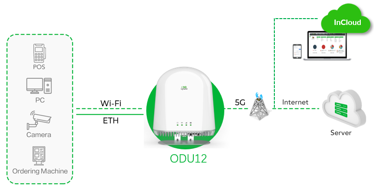

<strong>Fig. 1-1 ODU12 Application Scenario</strong>

### 1.2 Interfaces

| Interface/Component | Description |
|---------------------|-------------|
| PoE LAN1 | LAN port for connecting a PC or local network devices. Enabled by default with IP address 192.168.1.1; the DHCP server is enabled by default |
| WAN/LAN2 | Wired uplink port, working in WAN mode (DHCP client) by default. After the WAN interface is deleted, this port works as a LAN port; it switches back to WAN once a WAN interface is added again |
| SIM card slot | Holds an ISP SIM card. Insert the SIM card before powering on. SIM1 is enabled by default |
| Reset button | Hold for 10 seconds while the device is powered on to restore factory defaults |
| 5G antenna | 360° omnidirectional antenna system integrated in the enclosure. Confirm the antenna is connected before powering on |

### 1.3 LED Description

| LED | Status | Meaning |
|-----|--------|---------|
| System | Off | Power off |
|  | Steady in red | System starting |
|  | Blink in red | System error |
|  | Steady in green | System working |
|  | Blink in blue | System upgrading |
| Wi-Fi | Off | Wi-Fi disabled |
|  | Blink in green | Wi-Fi driver loading |
|  | Steady in green | AP working |
| Cellular Signal | Off | Cellular disabled |
|  | Blink in red | Dialed up |
|  | Steady in red | Signal value ≤ 9 |
|  | Steady in blue | 10 ≤ Signal value ≤ 19 |
|  | Steady in green | Signal value ≥ 20 |
| Ethernet Port | Off | Ethernet disconnected |
|  | Steady in red | Only WAN port connected |
|  | Steady in green | Only LAN port connected |
|  | Steady in blue | Both LAN and WAN ports connected |

### 1.4 Restoring Factory Defaults

The device supports restoring factory defaults via the Reset button or the web page.

**Method 1: Restore factory defaults via the Reset button**

1. While the device is powered on, press and hold the Reset button for 10 seconds.
2. The system LED changes from steady blue to blinking blue, indicating that factory defaults have been restored.
3. The device starts up normally afterwards.

**Method 2: Restore factory defaults via the web page**

1. Log in to the web management interface of the device.
2. Go to 【System】→【Device Options】and perform the factory reset operation.

> **Caution**: If the device has been added to InCloud Manager, the cloud platform synchronizes the device configuration before the factory reset, and the device only clears historical data.

### 1.5 Default Settings

| Function | Default Setting |
|----------|-----------------|
| Cellular | SIM1 enabled |
| Wi-Fi 2.4G | AP mode enabled; SSID: ODU12-(last 6 characters of the MAC address); Auth method: WPA2-PSK; Password: last 8 digits of the S/N |
| Wi-Fi 5G | AP mode enabled; SSID: ODU12-5G-(last 6 characters of the MAC address); Auth method: WPA2-PSK; Password: last 8 digits of the S/N |
| Ethernet | PoE LAN1 enabled, IP address: 192.168.1.1, netmask: 255.255.255.0; DHCP server enabled, address range: 192.168.1.2–192.168.1.254; WAN/LAN2 enabled as WAN, DHCP client mode |
| Management services | HTTPS (443) enabled; HTTPS/SSH/ping from the cellular/WAN interface disabled |
| Username and password | See the product nameplate |

## Chapter 2: Installation and First Use

### 2.1 Before Installation

| Item | Requirement |
|------|-------------|
| SIM card | A valid ISP SIM card, inserted before powering on |
| Antenna | The device integrates a 360° omnidirectional antenna system; confirm the 5G antenna is connected before powering on |
| Ethernet cable | Used to connect PoE LAN1 to a PC, or WAN/LAN2 to an upstream network device |
| Mobile phone (optional) | With the InCloud APP installed, used for onboarding the device via mobile app |
| PC (optional) | A computer with a web browser; Chrome is recommended |

> **Caution**: Insert the SIM card and connect the 5G antenna before powering on, or connect an Ethernet cable to the WAN/LAN2 port.

### 2.2 Installation Guide

#### 2.2.1 Method 1: Configure via Mobile App

1. Scan the QR code below on a mobile phone to install the InCloud APP.

<strong>Fig. 2-1 InCloud APP Download QR Code</strong>

2. Tap the "Device" tab below to enter the 【Device】page, tap the menu button in the upper right corner, and select 【Add Device】. Scan the QR code on the ODU12 to add the device.

<strong>Fig. 2-2 Add Device Page</strong>

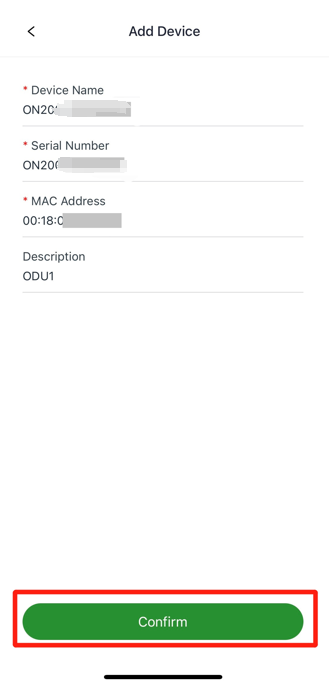

<strong>Fig. 2-3 Scan the Device QR Code</strong>

3. After the scan succeeds, configure the device name, serial number, and description.

4. If the ODU12 cannot connect to the Internet, tap "Configure local device" on the 【Device】page and scan the QR code on the device again, then configure the device to connect to the Internet. After the scan, the mobile phone connects to the Wi-Fi of the ODU12.

<strong>Fig. 2-4 Configure Local Device (1)</strong>

<strong>Fig. 2-5 Configure Local Device (2)</strong>

#### 2.2.2 Method 2: Log in via PC Web Interface

1. Connect the PoE LAN1 port of the ODU12 to the PC with an Ethernet cable.

2. Configure the IP address of the PC so that the PC and the ODU12 are in the same network segment. Two methods are supported:

   - **DHCP (recommended)**: The DHCP server is enabled on the LAN port of the ODU12 by default. Set the PC to obtain an IP address automatically.

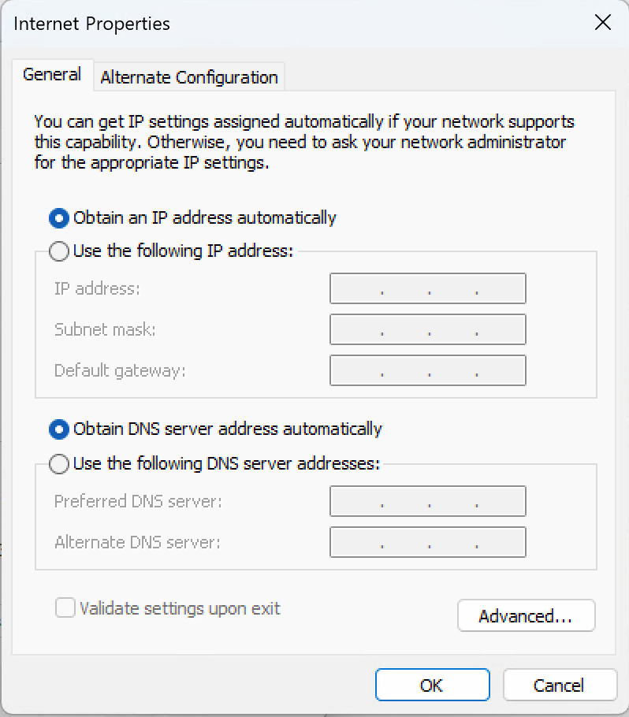

<strong>Fig. 2-6 Network Configuration (DHCP)</strong>

   - **Static IP**: Set the PC IP address to any address in the range 192.168.1.2–192.168.1.254, the gateway to 192.168.1.1, the subnet mask to 255.255.255.0, and the DNS server to 8.8.8.8 or an ISP DNS server address.

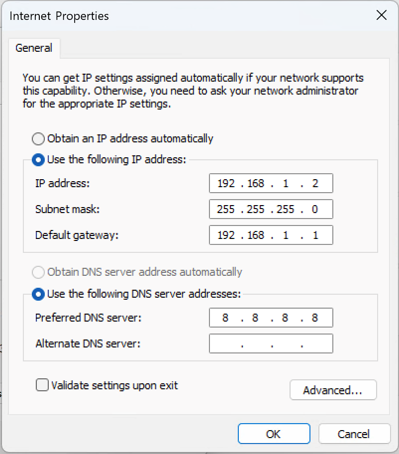

<strong>Fig. 2-7 Network Configuration (Static IP)</strong>

3. Open a browser, enter the default device address 192.168.1.1 in the address bar, and enter the username and password (see the product nameplate) to access the web management interface. If the page prompts that the website is not secure, open the hidden or advanced options and select "Proceed to website".

<strong>Fig. 2-8 Login Page</strong>

### 2.3 Quick Check

After the installation is complete, check the device status against the following checklist:

- [ ] The system LED is steady in green, indicating that the system is working.
- [ ] The cellular signal LED is not steady in red, indicating a normal signal value (signal value > 9).
- [ ] Log in to the web management interface and check on 【Dashboard】→【Interface Status】that the "Cellular" or "WAN" icon is green, indicating that the device is connected to the Internet.
- [ ] Click the corresponding icon to view interface details such as signal strength, IP address, and traffic consumption.

<strong>Fig. 2-9 Interface Status</strong>

If the device fails to access the Internet, click "Internet" on the left navigation bar and click the edit button behind "Cellular" or "WAN" to set the network parameters. Dial-up and the WAN port are enabled by default; going online takes a few minutes. If dial-up does not succeed, re-enable the dial-up.

<strong>Fig. 2-10 Uplink Interface Configuration</strong>

## Chapter 3: Common Scenario Configuration

### Scenario 1: Cellular Internet Access

**Goal**: Access the Internet via the 5G cellular network.

**Prerequisites**: A valid SIM card has been inserted and the antenna connected before powering on, and the device is powered on.

**Estimated Time**: Approx. 5 minutes.

**Procedure**:

1. Log in to the web management interface (see [Chapter 2: Installation and First Use](#chapter-2-installation-and-first-use)).
2. Click 【Internet】on the left navigation bar and click the edit button behind "Cellular".
3. Configure the SIM card working mode and dialing parameters such as the APN (the dialing parameter defaults to Automatic; Custom APN is also supported. Obtain the APN parameters from the ISP). For parameter details, see [4.3.3 Cellular Setting](#433-cellular-setting).
4. Click "Save" and wait for the dial-up connection to be established. SIM1 and dial-up are enabled by default; going online takes a few minutes. If dial-up does not succeed, re-enable the dial-up.

**Verification**:

1. Check the cellular signal LED: blinking red indicates dialed up; steady green indicates a signal value ≥ 20.
2. Log in to the web management interface and confirm on 【Dashboard】→【Interface Status】that the "Cellular" icon is green.
3. Access any Internet website from a connected device and confirm it opens properly.

**Common Issues**:

- Dial-up failure: Check whether the SIM card is inserted correctly and the account is in good standing, and whether the APN parameters match those provided by the ISP.
- Poor signal: Check the antenna connection. The cellular signal LED is steady in red when the signal value is ≤ 9.

### Scenario 2: Wired Broadband Internet Access

**Goal**: Access the Internet via wired broadband (DHCP/static IP/PPPoE).

**Prerequisites**: An Ethernet cable connects the WAN/LAN2 port of the device to the upstream network device or optical modem, and the device is powered on.

**Estimated Time**: Approx. 5 minutes.

**Procedure**:

1. Log in to the web management interface and click 【Internet】on the left navigation bar.
2. Click the edit button behind "WAN" and select the Internet access type:
   - **DHCP (default)**: The WAN port enables the DHCP client by default and goes online immediately once connected to an upstream network device with a DHCP server.
   - **Static IP**: Manually enter the IP address obtained from the ISP or the upstream network device.
   - **PPPoE**: Enter the broadband account and password to dial up via the broadband service.
3. Click "Save" and wait for the connection to be established.

**Verification**:

1. Log in to the web management interface and confirm on 【Dashboard】→【Interface Status】that the "WAN" icon is green.
2. Access any Internet website from a connected device and confirm it opens properly.

**Common Issues**:

- No Internet access: Confirm the access type matches the line. For static IP, verify the IP address, gateway, and subnet mask; for PPPoE, verify the broadband account and password.

### Scenario 3: Wi-Fi Access

**Goal**: Configure the ODU12 as a Wi-Fi AP to provide wireless network access.

**Prerequisites**: The device is powered on and Internet access is configured (see [Scenario 1: Cellular Internet Access](#scenario-1-cellular-internet-access) or [Scenario 2: Wired Broadband Internet Access](#scenario-2-wired-broadband-internet-access)).

**Estimated Time**: Approx. 5 minutes.

**Procedure**:

1. Log in to the web management interface and click 【Wi-Fi】on the left navigation bar.
2. Click the edit button on the right in the Wi-Fi list to configure the SSID, password, and other parameters. The device provides one 2.4G AP and one 5G AP by default (see [1.5 Default Settings](#15-default-settings)).
3. In the 【Radio】section, configure the bandwidth, channel, and transmit power.
4. Click "Save".

**Verification**:

1. Search for the SSID on a wireless client, enter the password, and complete association.
2. Log in to the web management interface and check the number of active SSIDs on 【Dashboard】→【Wi-Fi Client Count】.

**Common Issues**:

- The client cannot connect to the Wi-Fi: Verify the SSID and password, and confirm the authentication method is compatible with the client.

### Scenario 4: Quick Device Onboarding via Mobile App

**Goal**: Onboard the device and configure Internet access on a mobile phone via the InCloud APP.

**Prerequisites**: The InCloud APP is installed on the mobile phone, and the device is powered on.

**Estimated Time**: Approx. 5 minutes.

**Procedure**:

1. Scan the QR code to install the InCloud APP (see [2.2.1 Method 1: Configure via Mobile App](#221-method-1-configure-via-mobile-app), Fig. 2-1).
2. On the 【Device】page, tap the menu button in the upper right corner, select 【Add Device】, and scan the QR code on the ODU12.
3. After the scan succeeds, configure the device name, serial number, and description.
4. If the device cannot connect to the Internet, tap "Configure local device" on the 【Device】page and scan the device QR code again. The phone connects to the Wi-Fi of the ODU12; then configure the device to connect to the Internet.

For detailed steps and screenshots, see [2.2.1 Method 1: Configure via Mobile App](#221-method-1-configure-via-mobile-app).

### Scenario 5: Connecting to InCloud Manager

**Goal**: Add the ODU12 to the InCloud Manager cloud platform for batch configuration deployment, software upgrade, and remote monitoring.

**Prerequisites**: The device has accessed the Internet via cellular or wired connection.

**Estimated Time**: Approx. 10 minutes.

**Procedure**:

1. Register an account: In a web browser (Google Chrome recommended), enter `https://star.inhandcloud.com`. The page is automatically redirected to the portal, where "InCloud Manager" provides the SaaS platform for enterprise branch networking. Click "Create now" to create a platform account.

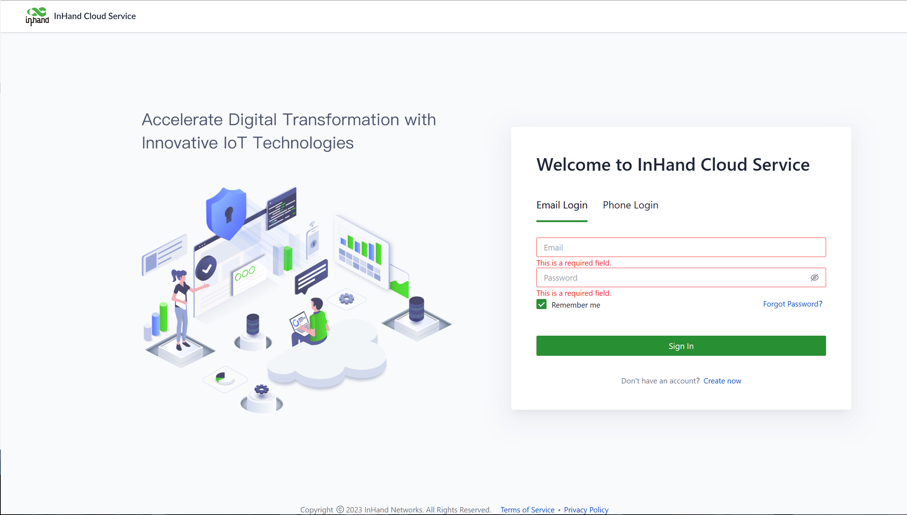

<strong>Fig. 3-1 Create a New Account</strong>

2. Log in: After completing the email registration, log in to InCloud Manager with the username and password used during registration.

<strong>Fig. 3-2 Log In and Choose the SaaS Service</strong>

3. Add the device: After logging in, go to the "Devices" menu, click the "Add" button, fill in the device name, serial number, and MAC address, and click "Finish" to complete the addition.

<strong>Fig. 3-3 Add the Device</strong>

> **Note**: When a device is initially added to the platform account, it automatically receives a 1-year Essential license. The license can be renewed through the "License" menu.

**Verification**:

1. Confirm the device is online in the platform "Devices" list.
2. Click the device name to enter the details page and view the device status.

### Scenario 6: Guest Wi-Fi Portal Authentication

**Goal**: Enable Portal authentication on the target SSID so that guests must pass authentication on the web portal before accessing the network.

**Prerequisites**: The device is powered on and Wi-Fi is configured (see [Scenario 3: Wi-Fi Access](#scenario-3-wi-fi-access)).

**Estimated Time**: Approx. 10 minutes.

**Procedure**:

1. Log in to the web management interface and go to the Portal authentication page under 【Security】→【Authentication】(see [4.8 Authentication](#48-authentication)).
2. Select "Internal Portal" (the authentication page is customized directly on the router) or "External Portal" (integrated with a third-party authentication system) from the Portal Service dropdown menu.
3. Fill in the required fields such as the policy name and target SSID (e.g., guest Wi-Fi). For the Internal Portal, customize the background, logo, title, welcome message, button text, and color scheme of the authentication page, and set the post-authentication behavior. For the External Portal, configure the authentication page URL provided by the third-party system, and optionally enable Walled Garden to allow unauthenticated users to access specific whitelisted domains/IPs.
4. Click "Save" to create the policy. Portal authentication is then enabled for the target SSID.

**Verification**:

1. Connect a wireless client to the target SSID; the browser should redirect to the authentication page.
2. Complete authentication (e.g., click-to-pass or account credentials) and confirm the client can access the Internet.

**Common Issues**:

- The authentication page fails to open: Check that the Portal policy is bound to the correct SSID. For the External Portal, confirm the authentication server address has been added to the Walled Garden whitelist.

### Scenario 7: IPSec VPN Site-to-Site Interconnection

**Goal**: Establish an IPSec VPN encrypted tunnel between the ODU12 and a peer device for secure site-to-site data transmission.

**Prerequisites**: The device is online with a usable uplink interface, and the IPSec parameters of the peer device (pre-shared key, subnet plan, etc.) are confirmed.

**Estimated Time**: Approx. 15 minutes.

**Procedure**:

1. Log in to the web management interface, go to 【VPN】→【IPSec VPN】, and click "Add" on the left to create a new IPSec tunnel (for parameters, see [4.6.1 IPSec VPN](#461-ipsec-vpn)).
2. Configure the tunnel name, IKE version, pre-shared key (which must be consistent on both ends), and the local uplink interface.
3. Configure the peer device IP address. If the local end works as the IPSec server, set the peer IP address to 0.0.0.0.
4. Configure the tunnel mode, local subnet, and peer subnet. The local subnet is the local segment whose traffic is sent through the tunnel; the peer subnet is the segment used for communication at the other end of the tunnel.
5. Adjust the IKE policy (encryption, authentication, DH group, lifetime) and IPSec policy (security protocol, encryption, authentication, PFS group, lifetime) as needed.
6. Click "Save" and enable the tunnel. Parameters on both ends must be consistent.

**Verification**:

1. Ping an address in the peer subnet from a local client to confirm the tunnel is reachable.
2. Log in to the web management interface and check the VPN status and consumed traffic on 【Dashboard】→【VPN】.

**Common Issues**:

- The tunnel cannot be established: Verify that the pre-shared key and IKE/IPSec policies are consistent on both ends, and that the peer address is reachable.

## Chapter 4: Function Description and Parameter Reference

### 4.1 Cloud-Side Device Monitoring

After the device is added to the platform, the network can be managed and monitored from the platform, and users can also view real-time status information on the local interface of the device remotely.

#### 4.1.1 Device Overview

On the "Devices" page, click the device name to enter the device details page. Click "Dashboard" in the left menu to view device information, interface status, traffic statistics, and Wi-Fi information.

<strong>Fig. 4-1 Status Overview</strong>

#### 4.1.2 Data Usage

In the "Data Usage" function, view the traffic usage and historical data of various upstream links.

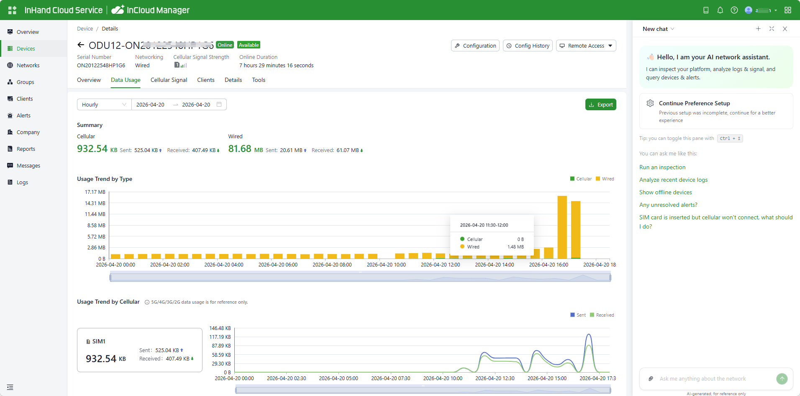

<strong>Fig. 4-2 Data Usage</strong>

#### 4.1.3 Cellular Signal

In the "Cellular Signal" function, view cellular signal curves such as RSSI, RSRP, RSRQ, and SINR.

<strong>Fig. 4-3 Cellular Signal</strong>

### 4.2 Local Web Interface Monitoring

Through the platform's "Remote Access" feature, devices can be viewed and configured in real time. Select the target device and click "Remote Access" to open the local login interface of the device.

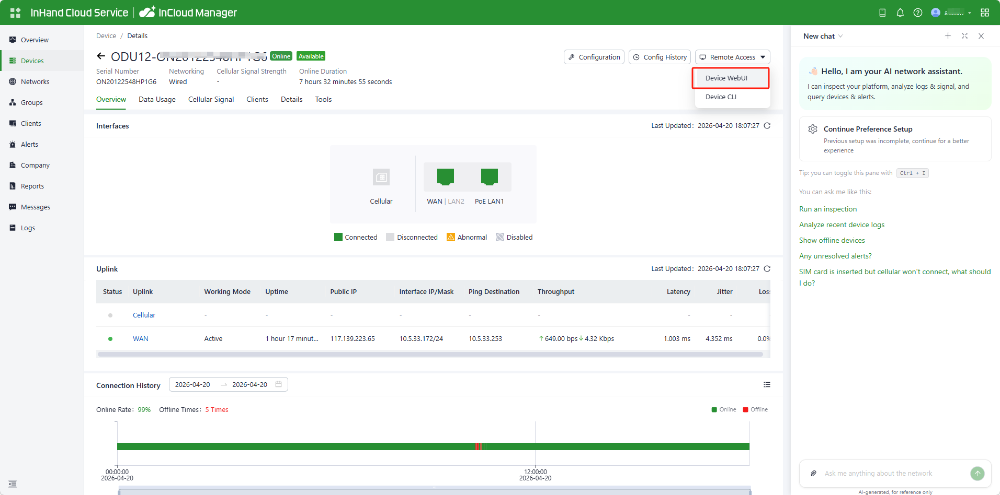

<strong>Fig. 4-4 Remote Access to the Device</strong>

<strong>Fig. 4-5 Local Interface</strong>

#### 4.2.1 Device Information

The top of the 【Dashboard】interface shows basic device information, including the device name, model, serial number, MAC address, uptime, and uplink interface address.

<strong>Fig. 4-6 Device Information</strong>

1. **Name**: Identifies the device name, initially set to "ODU12" and customizable.
2. **MAC Address**: Identifies the physical MAC address of the device.
3. **Local Gateway Address**: The default gateway address of the device subnet.
4. **Model**: Specifies the device model, which helps determine whether the device supports cellular and WLAN features.
5. **Uptime**: Reflects the running time of the device since it was powered on.
6. **System Time**: Displays the time zone and system time of the device.
7. **Serial**: A unique code that serves as the device identifier and can be used for indexing the device or adding it to a platform account.
8. **Internet Access**: The uplink interface used by the device for Internet connectivity.
9. **License Status**: Information about the license applied on the device, distinguishing between InCloud Manager Essential and InCloud Manager Professional.
10. **Firmware Version**: Shows the current software version of the device.
11. **Uplink IP**: The IP address of the uplink interface used for Internet connectivity.
12. **Detection Address**: The probe address used by the system to detect the network connectivity of the device.

#### 4.2.2 Interface Status

In the "Dashboard > Interface Status" function, inspect the operational status of each interface visually. Click an interface icon to view detailed information in the pop-up box on the right-hand side.

#### 4.2.3 Traffic Statistics

Through the "Dashboard > Traffic Statistics" function, view the traffic usage of each uplink interface since the device was powered on. Traffic statistics are reset after the device reboots. To review historical traffic records, access the device details page in InCloud Manager.

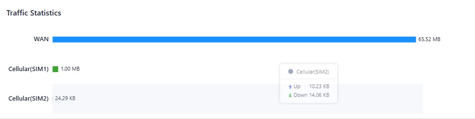

<strong>Fig. 4-7 Traffic Statistics</strong>

#### 4.2.4 Wi-Fi Connections

In the "Dashboard > Wi-Fi Client Count" function, check the number of active SSIDs on the ODU12.

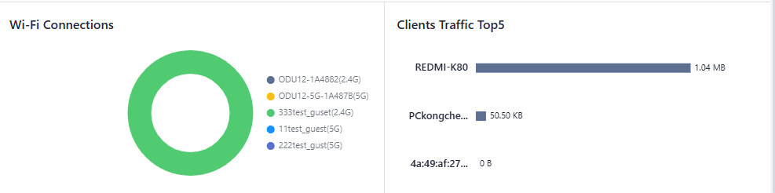

<strong>Fig. 4-8 Wi-Fi Connections</strong>

#### 4.2.5 Clients Traffic Top 5

In the "Dashboard > Top 5 Client Traffic" function, view the current ranking of client traffic usage for devices connected to the router. Up to 5 records are displayed; when a client disconnects, its statistical data is cleared.

#### 4.2.6 Link Monitor

The Link Monitor page displays the health of each uplink, as well as the throughput, latency, and packet loss rate on each uplink interface.

<strong>Fig. 4-9 Link Monitoring</strong>

#### 4.2.7 Cellular Signal

The Cellular Signal page displays the SIM card signal strength on the cellular interface, as well as other parameters such as RSSI, SINR, and RSRP.

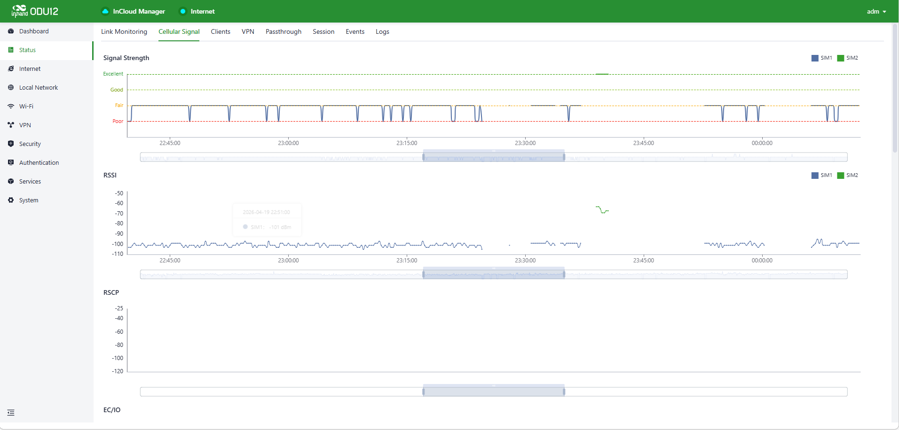

<strong>Fig. 4-10 Cellular Signal</strong>

#### 4.2.8 Clients

The Clients page displays details about each client connected to the ODU12, such as device name, IP address, MAC address, traffic statistics, and online duration.

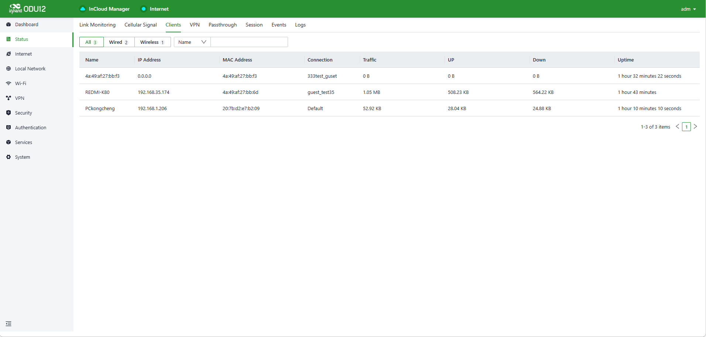

<strong>Fig. 4-11 Clients</strong>

#### 4.2.9 VPN

Check the status of the VPN and the traffic consumed by the VPN on the ODU12 on the VPN page.

<strong>Fig. 4-12 VPN Status</strong>

#### 4.2.10 Passthrough Status

Through this page, view detailed information about whether Passthrough has successfully passed the WAN or cellular address to the terminal.

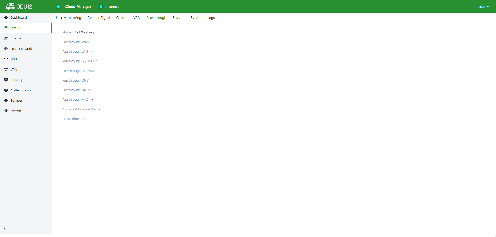

<strong>Fig. 4-13 Passthrough Status</strong>

#### 4.2.11 Session

Through this page, check whether TCP/ICMP/UDP protocol sessions in the traffic are taking effect.

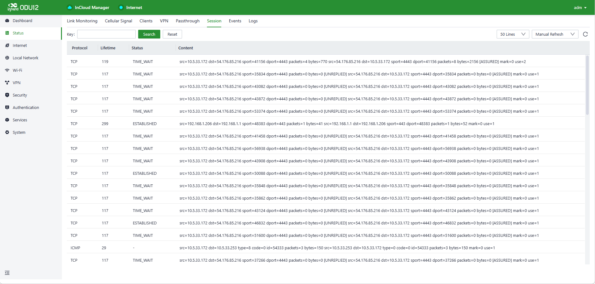

<strong>Fig. 4-14 Session</strong>

#### 4.2.12 Events

The ODU12 records event logs such as user login, configuration change, link change, and reboot on the Events page. Select the start date, end date, and event type to narrow the scope of retrieval and view a certain type of event.

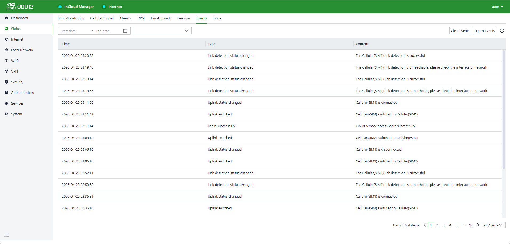

<strong>Fig. 4-15 Events</strong>

#### 4.2.13 Logs

The Logs page records the logs generated during device operation, which can be used for troubleshooting when the ODU12 cannot work properly.

1. **Clear Logs**: Clear current running logs.
2. **Download Logs**: Download running logs.
3. **Download Diagnostic Logs**: Download log information for troubleshooting; it contains system running logs, device information, and device configuration.

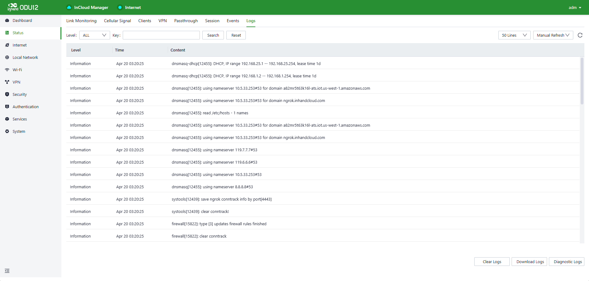

<strong>Fig. 4-16 Logs</strong>

### 4.3 Internet Settings

Click "Internet" in the left menu to check and configure the uplink interfaces and the multi-link working mode of the ODU12.

> **Caution**: Exercise caution when changing Internet settings, which may cause network interruption.

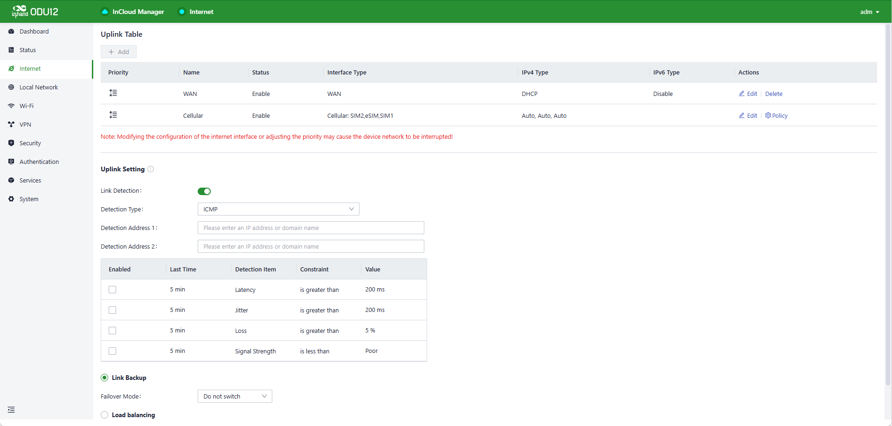

<strong>Fig. 4-17 Uplink Settings</strong>

#### 4.3.1 Uplink Table

Check and edit the WAN and cellular interfaces in the Uplink Table. The cellular threshold policy can be edited on this page, and the icons in the Priority column can be dragged to reprioritize the interfaces.

> **Note**:
>
> 1. After the WAN interface is deleted on this page, the WAN/LAN2 port works as a LAN port.
> 2. The WAN/LAN2 port switches back to WAN once a WAN interface is added again.
> 3. When deleting the WAN interface, all configurations on this interface, such as static routes, inbound and outbound rules, and port forwarding, will be removed.

#### 4.3.2 WAN Setting

The ODU12 supports three types of WAN interfaces:

1. **DHCP**: The DHCP service is enabled on the WAN interface by default. The ODU12 connects to the Internet immediately once the WAN interface is connected to an upstream network device with a DHCP server enabled.
2. **Static IP**: Manually assign an IP address obtained from the carrier or the upstream network device.

<strong>Fig. 4-18 Static IP Settings</strong>

3. **PPPoE**: Set the PPPoE service on the WAN port so that the ODU12 dials up to the Internet through the broadband service.

<strong>Fig. 4-19 PPPoE Settings</strong>

#### 4.3.3 Cellular Setting

Configure the operating mode of the SIM card on the Cellular Setting page. Only SIM1 is enabled by default; after switching to multi-SIM mode, multiple SIM cards are supported. In addition, the ODU12 supports band locking.

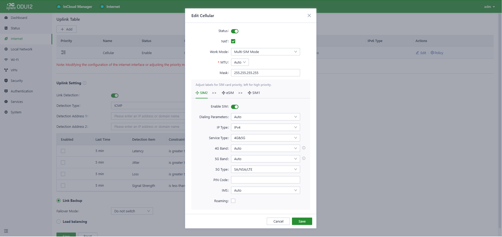

<strong>Fig. 4-20 Cellular Settings</strong>

1. **Status**: The enable switch for the cellular interface, turned on by default. Once disabled, all features related to the cellular function no longer take effect.
2. **NAT**: Traffic initiated from the internal network to external networks is forwarded through NAT. This option is enabled by default.
3. **Work Mode**: Set the working mode of the SIM card. The device defaults to multi-SIM mode, which supports automatic SIM card switching. A single SIM card can also be selected.
4. **MTU**: Supports customizing the MTU for the cellular interface.
5. **Mask**: Supports setting the subnet mask for the cellular interface.
6. **Dialing Parameters**: Configure the two APN dialing methods. The default is Automatic; Custom APN is also supported.
7. **IP Type**: Supports configuring IPv4, IPv6, or IPv4 & IPv6 modes.
8. **APN**: Enter the APN name.
9. **Authentication**: Set the APN authentication method.
10. **User Name**: Enter the APN username for authentication.
11. **Password**: Enter the APN password for authentication.
12. **Service Type**: Select the cellular interface service type. The default is Auto; 4G or 4G & 5G can be selected.
13. **4G Band**: 4G band lock, default is All. The 4G frequency band can be specified here.
14. **5G Band**: 5G band lock, default is All. The 5G frequency band can be specified here.
15. **PIN Code**: Mainly used to verify the user's identity.
16. **IMS**: Converts voice traffic and video data into IP packets.
17. **Roaming**: Supports cellular roaming across different carriers.

#### 4.3.4 Link Detection Setting

Configure the link detection items and the optimal forwarding mode for the uplink interfaces.

<strong>Fig. 4-21 Link Detection Settings</strong>

Link detection is enabled by default. In a private network environment, manually configure the address in "Test Connectivity to" or disable the link detection function to prevent the cellular interface from working abnormally.

1. If the detection function is disabled, latency, jitter, packet loss rate, or signal strength will not be displayed on the Status page.
2. If the "Test Connectivity to" address is empty, the system detects the primary DNS server address obtained by each interface; otherwise, the system uses this address as the detection address for all uplink interfaces.
3. In Link Backup mode, the ODU12 monitors the enabled items and triggers a link switch when any item exceeds the threshold. If no item is enabled, the link switch is triggered only based on the priority and connectivity of the links.
4. In Load-balancing mode, the ODU12 distributes data traffic to all available links.

### 4.4 Local Network Settings

In the 【Local Network】function, define local subnets, including the address range, VLAN ID, DHCP services, and other related parameters for the local LAN. Once the configuration is complete, apply these settings to the LAN port of the device through 【Interface Management】, or apply them to the desired SSID in the Wi-Fi settings, so that client devices can connect to the local network according to the planned network addresses.

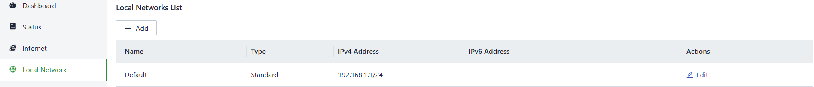

<strong>Fig. 4-22 Local Networks List</strong>

Edit the network: Click the Edit button on the right to edit the LAN IP, enable/disable the DHCP server, and change the range of DHCP addresses.

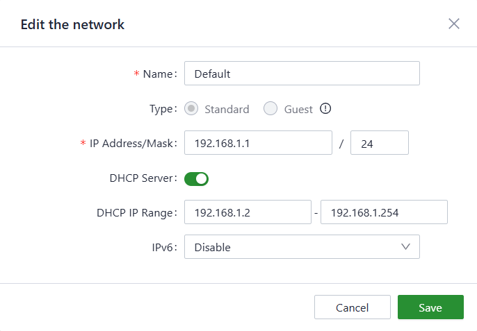

<strong>Fig. 4-23 Network Settings</strong>

1. **Name**: Used to identify the network. This name can be selected to apply the network in both 【Wi-Fi】and 【Interface Management】.
2. **Mode**: Choose whether the current subnet operates in 2-layer transparent mode or 3-layer IP mode. The default is "IP mode".
3. **VLAN**: Divides the local network into different virtual logical networks. The default VLAN for all interfaces and Wi-Fi is "default (VLAN1)".
4. **IP Address/Subnet Mask**: The gateway address for accessing the router through the LAN port or Wi-Fi. The default is "192.168.2.1".
5. **DHCP Server**: Clients connecting to the router can obtain IP addresses through this function. It is enabled by default, and the address range is generated based on the "IP Address/Subnet Mask".

> **Note**:
>
> 1. The default local network cannot be deleted; only the IP address/subnet mask and DHCP server settings can be modified.
> 2. Once a local network is added, its mode cannot be changed.
> 3. The VLAN Only mode is designed for 2-layer transparent operation and does not require configuration of the IP address/subnet mask or DHCP server.

### 4.5 Wi-Fi Settings

Configure the ODU12 to work as a Wi-Fi AP to provide an SSID for wireless network access.

<strong>Fig. 4-24 Wi-Fi List</strong>

Edit Wi-Fi: Click the Edit button on the right to configure the SSID, password, and other parameters of this Wi-Fi.

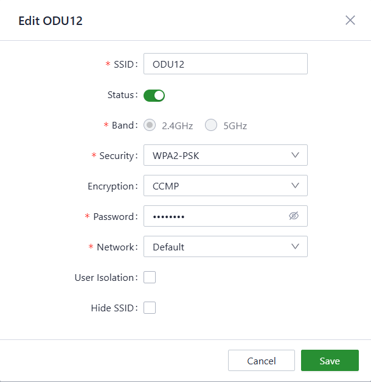

<strong>Fig. 4-25 Wi-Fi Settings</strong>

In the 【Radio】section, select the bandwidth, channel, and transmit power.

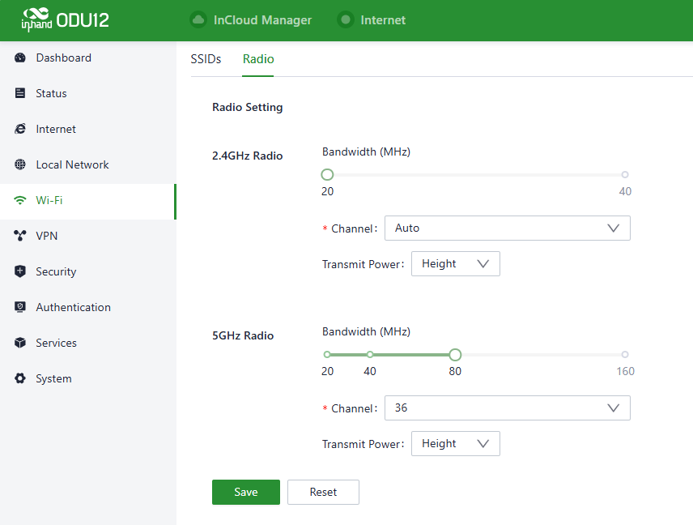

<strong>Fig. 4-26 Radio Settings</strong>

### 4.6 VPN

A VPN is intended to establish a private network on the public network for encrypted communication. A VPN router enables remote access by encrypting data packets and converting the destination address of data packets. A VPN can be realized by a server, hardware, or software. Compared with traditional DDN private lines or frame relay, a VPN provides a more secure and convenient remote access solution.

#### 4.6.1 IPSec VPN

IPsec is a group of open network security protocols developed by the IETF. At the IP layer, IPsec provides data source authentication, data encryption, data integrity, and anti-replay functions to ensure the security of data transmission between communication parties on the Internet, reducing the risk of leakage and eavesdropping and ensuring data integrity and confidentiality as well as the security of user service transmission.

On the IPSec VPN page, click the Add button on the left to build a new IPSec tunnel.

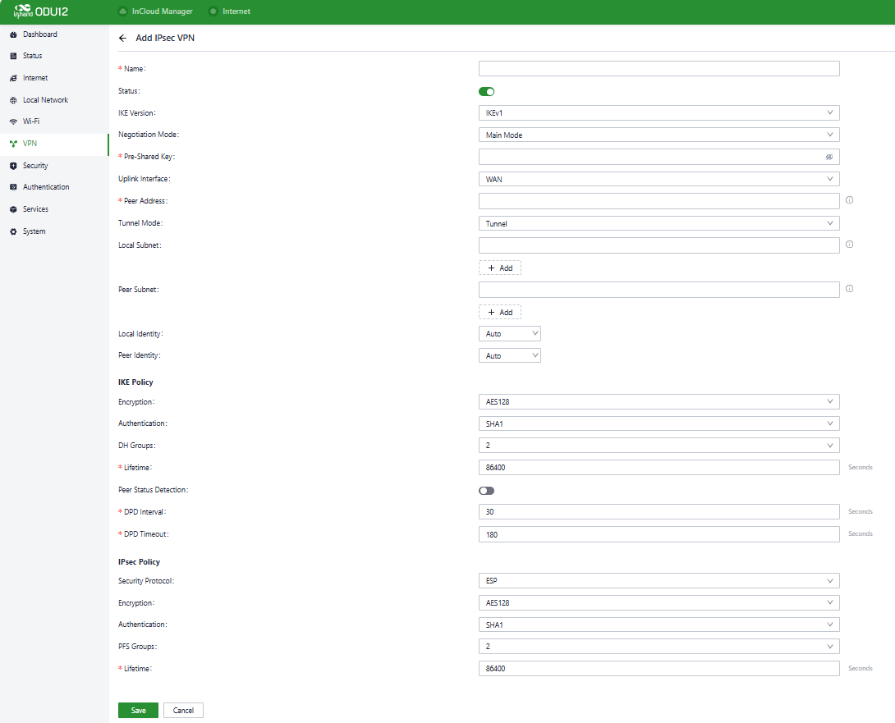

<strong>Fig. 4-27 IPSec Settings</strong>

The following parameters must be set for the IPSec tunnel:

1. **Name**: Specifies the name of the IPSec VPN created on the device, used for local VPN management.
2. **IKE Version**: Specifies the version of the IKE protocol used on the ODU12, IKEv1 or IKEv2.
3. **Pre-Shared Key**: Specifies the authentication key for IKE negotiation, which must be consistent on both sides.
4. **Uplink Interface**: Specifies the local uplink interface used to establish the IPSec VPN tunnel.
5. **Peer Address**: Specifies the IP address of the peer device.

   > **Note**: The peer IP address must be set to 0.0.0.0 if the local end works as an IPSec server.

6. **Tunnel Mode**: Specifies the IP packet encapsulation mode on the IPSec VPN tunnel, which can be tunnel mode or transmission mode.
7. **Local Subnet**: Specifies the IP address segment of the traffic to be sent out by the ODU12 through the IPSec VPN tunnel.
8. **Peer Subnet**: Specifies the IP address segment used for communication on the other end of the IPSec VPN tunnel.

**IKE Policy**:

1. **Encryption**: Specifies the encryption algorithm for IKE.
2. **Authentication**: Specifies the authentication algorithm for IKE.
3. **DH Groups**: Specifies the DH key exchange mode.
4. **Lifetime**: Specifies the lifetime of the IKE SA. The default value is 86400 seconds.

**IPSec Policy**:

1. **Security Protocol**: Specifies the security protocol used for ESP.
2. **Encryption**: Specifies the encryption algorithm of the ESP protocol.
3. **Authentication**: Specifies the authentication algorithm for ESP.
4. **PFS Groups**: Specifies the Perfect Forward Secrecy (PFS) mode, which improves communication security through an additional key exchange in Phase 2 negotiation.
5. **Lifetime**: Specifies the lifetime of the IPSec SA. The default value is 86400 seconds.

#### 4.6.2 L2TP VPN

Layer 2 Tunneling Protocol (L2TP) is a tunneling protocol for virtual private dial networks (VPDNs). This protocol establishes a tunnel from a remote site to the headquarters of an enterprise over a public switched telephone network (PSTN) or integrated services digital network (ISDN) through Point-to-Point Protocol (PPP) negotiation. This tunnel allows remote users to connect to the intranet of the enterprise securely.

##### 4.6.2.1 Server

Generally, an L2TP server is deployed at the headquarters of an enterprise to provide remote access for employees. On the VPN page, choose L2TP VPN > Server to display the L2TP server configuration.

<strong>Fig. 4-28 L2TP Server Settings</strong>

1. **Name**: The name of the L2TP server; cannot be changed.
2. **Status**: Enable or disable the L2TP server. This function is disabled by default.
3. **Uplink Interface**: Specifies the uplink interface used by the L2TP server to establish the tunnel.
4. **VPN Connection Address**: Specifies the gateway address for the L2TP client.
5. **IP Pool**: The system assigns an IP address to the L2TP client from the specified IP address pool.
6. **User Name/Password**: Specifies the username and password for L2TP negotiation, which must be consistent on both ends of the tunnel.
7. **Authentication Mode**: Specifies the authentication mode for the L2TP tunnel.
8. **Enable Tunnel Authentication**: If this option is enabled, make sure both ends of the tunnel are configured with the same username and password.

##### 4.6.2.2 Client

Click the Add button on the left to configure L2TP client parameters and establish a tunnel with the remote L2TP server.

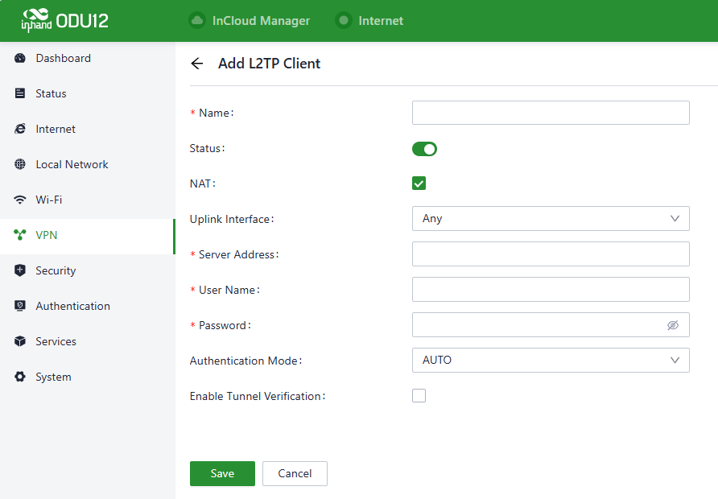

<strong>Fig. 4-29 L2TP Client Settings</strong>

1. **Name**: Specifies the local name of the L2TP client tunnel.
2. **Status**: Enable or disable the L2TP client tunnel.
3. **NAT**: Enable or disable NAT for packets forwarded by the ODU12 for LAN devices.
4. **Uplink Interface**: Specifies the uplink interface used to establish the L2TP tunnel.
5. **Server Address**: Specifies the IP address used by the remote L2TP server.
6. **User Name/Password**: Specifies the username and password for L2TP negotiation, which must be consistent on both ends of the tunnel.
7. **Authentication Mode**: Specifies the authentication mode for the L2TP tunnel.
8. **Enable Tunnel Verification**: If this option is enabled, make sure both ends of the tunnel are configured with the same server name and verification key.

### 4.7 Security

In the 【Security】menu, configure advanced features related to firewalls, policy routing, and traffic shaping.

#### 4.7.1 Firewall

The firewall currently includes functions such as inbound rules, outbound rules, port forwarding, and MAC address filtering.

##### 4.7.1.1 Inbound/Outbound Rules

Rules can be set to control data traffic based on interfaces.

1. **Outbound rules**: Inside network access to outside network; all data is allowed by default.
2. **Inbound rules**: Outside network access to inside network; all data is forbidden by default.

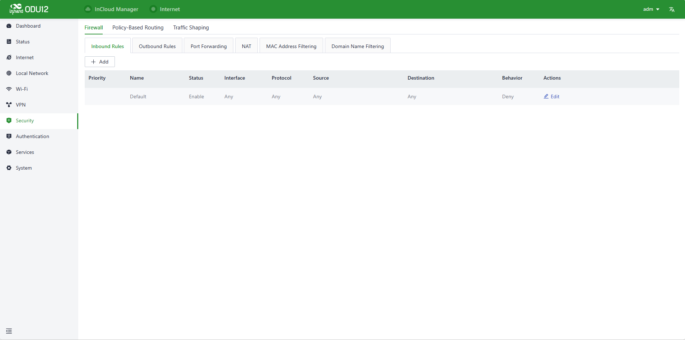

<strong>Fig. 4-30 Firewall Settings</strong>

Click the Add button on the left to add a new rule.

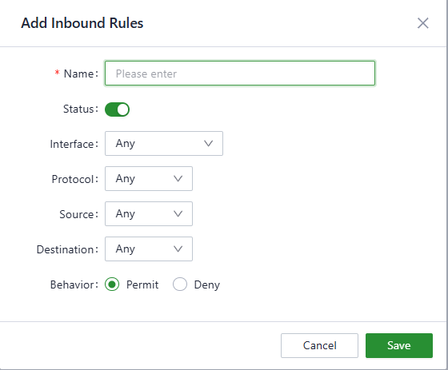

<strong>Fig. 4-31 Inbound Rule Settings</strong>

1. **Name**: Sets the name of the inbound/outbound rule for local identification.
2. **Status**: The rule function switch.
3. **Interface**: For outbound rules, specifies the upstream interface where traffic leaves the router; for inbound rules, specifies the upstream interface where traffic enters the router.
4. **Protocol**: Matches traffic based on the protocol type, with options such as Any, TCP, UDP, ICMP, or custom.
5. **Source**: Matches the source address of the traffic; custom values are supported, with the default as Any.
6. **Destination**: Matches the destination address of the traffic; custom values are supported, with the default as Any.
7. **Action**: The action taken on matching traffic in inbound/outbound rules, supporting allow and deny.
8. **Inbound Rules**: Traffic management rules for the external network accessing the router; deny all by default.
9. **Outbound Rules**: Traffic management rules for traffic going out through the router; allow all by default.
10. Adjusting the priority of inbound and outbound rules is supported.

##### 4.7.1.2 Port Forwarding

When the outside network accesses specific ports of the ODU12, the system transfers the data to the corresponding ports of the inside device according to the port forwarding rules, so that services deployed in the LAN become available on the public network. The same public IP address can be used to access multiple services through multiple port forwarding rules.

For example, after the port forwarding rules below are set, when a user from the public network tries to access port 2000 of the ODU12 on the WAN, the system transfers the request to 192.168.1.23:8080 in the LAN.

<strong>Fig. 4-32 Port Forwarding Settings</strong>

1. **Name**: Sets the local identifier of the port forwarding rule.
2. **Status**: Enables or disables the port forwarding rule.
3. **Interface**: Sets the uplink interface that provides port mapping for internal clients. This interface must have a public IP address.
4. **Protocol**: Sets the protocol type to which port mapping is applied: TCP, UDP, and TCP&UDP.
5. **Public Port**: Sets the protocol port on the uplink interface to be mapped.
6. **Local Address**: Sets the IP address of the target client that external users need to access.
7. **Local Port**: Sets the protocol port on the target client that external users need to access.

##### 4.7.1.3 NAT

NAT (Network Address Translator) is a technology used to apply a private address in a local network and switch to a global IP address when connecting to the Internet. Source or destination address translation can be set as needed in "Security > Firewall > NAT".

<strong>Fig. 4-33 NAT Settings</strong>

1. **Name**: The name set by the user for the rule.
2. **Type**: The type of the rule.
   - SNAT: Translates the source IP address.
   - DNAT: Translates the destination IP address.
3. **Protocol**: The scope of the rule.
   - Any: The rule is effective for all protocols.
   - TCP: The rule takes effect only for the TCP protocol.
   - UDP: The rule takes effect only for the UDP protocol.
   - TCP&UDP: The rule takes effect only for the TCP and UDP protocols.
4. **Source**: The source IP address to be translated.
5. **Destination**: The destination IP address to be translated.
6. **Converted Address**: The translated address.

##### 4.7.1.4 MAC Address Filter

Configure MAC address filter rules for LAN devices to allow or forbid LAN devices from accessing the Internet.

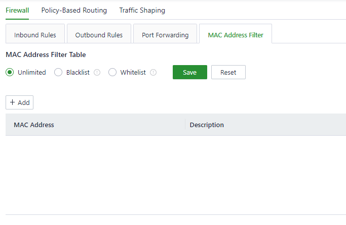

<strong>Fig. 4-34 MAC Address Filter Settings</strong>

1. **Blacklist**: Devices in the blacklist cannot access the Internet.
2. **Whitelist**: Only devices in the whitelist are allowed to access the Internet.

##### 4.7.1.5 Domain Name Filtering

Allow or disallow (white/black list) the domain names that can be accessed by clients as needed.

<strong>Fig. 4-35 Domain Name Filtering</strong>

#### 4.7.2 Policy-Based Routing

Policy-based routing (PBR) allows the ODU12 to forward different data flows through different links based on configured policies. This feature enables flexible route selection and control, thus improving link utilization and reducing the operational cost of the enterprise. Choose Security > Policy-based Routing and click Add to add a PBR rule.

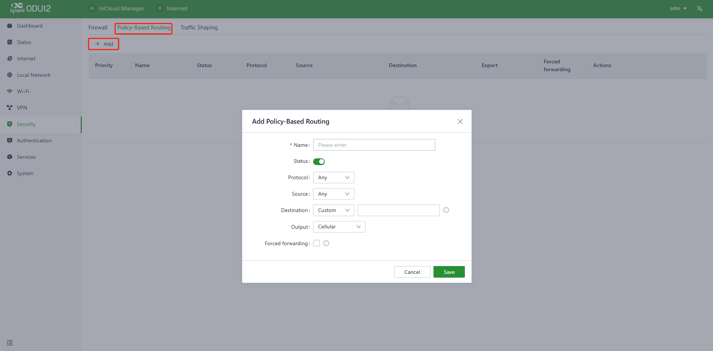

<strong>Fig. 4-36 Policy-Based Routing</strong>

> **Note**: The source and destination addresses of the PBR cannot be set to Any at the same time.

#### 4.7.3 Traffic Shaping

Create shaping policies to apply per-user controls on a per-protocol basis to optimize the network. This function can also reduce bandwidth for recreational traffic and prioritize bandwidth for critical business traffic.

Choose Security > Traffic Shaping and click Edit to modify the bandwidth of the uplink interfaces.

<strong>Fig. 4-37 Traffic Shaping</strong>

Click Add to create a new traffic shaping rule. Traffic shaping policies consist of a series of rules that are performed in order, similar to custom firewall rules. Each rule has two main components: the type of traffic to be limited or shaped (rule definition), and how that traffic should be limited or shaped (rule actions).

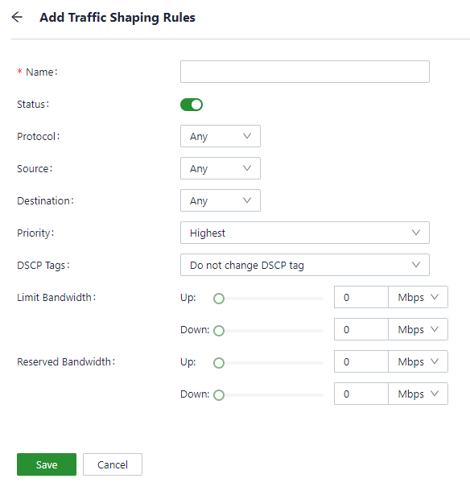

<strong>Fig. 4-38 Traffic Shaping Rules Configuration</strong>

> **Note**:
>
> 1. The traffic forwarding priority for unmatched rules is medium.
> 2. When Limit Bandwidth is set to 0, the system does not limit the bandwidth.
> 3. The value of Reserved Bandwidth should not be greater than the Limit Bandwidth.

### 4.8 Authentication

The ODU12 supports the following network access authentication method: **Portal**. After connecting to the network, users are redirected to an authentication page via a browser, where they enter account credentials or complete verification (such as QR code scanning) to gain network access.

<strong>Fig. 4-39 Portal Settings</strong>

In scenarios where hotels and restaurants provide temporary Wi-Fi for customers, the Wi-Fi Portal function ensures the security of wireless access to a certain extent, and merchants can customize slogans and backgrounds on the authentication page for publicity.

**1. Internal Portal**

Ideal for scenarios that do not require integration with external systems, allowing direct customization of the authentication page on the router.

Internal portal settings:

1. Name the policy and specify the target SSID (e.g., guest Wi-Fi).
2. Select an authentication type, such as Click-Passthrough or username/password authentication.

Guest login page customization:

- Customize background images, logos, titles, welcome messages, and button text.
- Adjust color schemes and transparency, with real-time previews of how the page appears on desktop and mobile.
- Set post-authentication behavior (e.g., stay on the page or redirect to a specified URL).

Use cases: Guest Wi-Fi in hotels, restaurants, and industrial campuses, enabling quick deployment of branded authentication entry points.

**2. External Portal**

Designed for scenarios that require integration with third-party authentication systems (e.g., enterprise SSO).

<strong>Fig. 4-40 External Portal Settings</strong>

External portal settings:

1. Configure the URL of the external authentication page (provided by the third-party system).
2. Enable Walled Garden to allow unauthenticated users to access specific whitelisted domains/IPs (e.g., the authentication server address).
3. Define the behavior when the server disconnects:
   - Open: Unauthenticated users can access the Internet directly.
   - Restricted: Only authenticated users and whitelisted addresses are granted access.

Use cases: Scenarios requiring integration with existing enterprise identity systems or third-party marketing-driven authentication.

**3. Operation Steps**

1. Select Internal Portal or External Portal from the Portal Service dropdown menu.
2. Fill in the required fields (e.g., name, target SSID) and customize the page or configure external parameters based on the mode.
3. Click "Save" to create the policy, and Portal authentication is enabled for the target SSID.

### 4.9 Services

#### 4.9.1 Interface Management

In the "Services > Interface Management" function, configure the local networks allowed through a specific interface and set the interface speed.

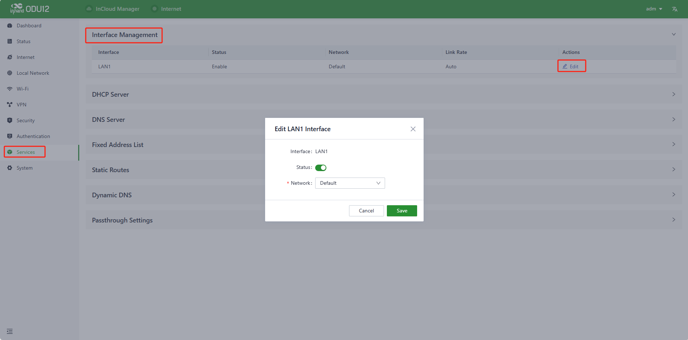

<strong>Fig. 4-41 Interface Management</strong>

#### 4.9.2 DHCP Server

DHCP implements dynamic IP address allocation in a client/server model. The LAN device sends a request to the ODU12, and the ODU12 replies with an IP address assigned to the client.

<strong>Fig. 4-42 DHCP Settings</strong>

#### 4.9.3 DNS Server

Set the global DNS server for the ODU12. The system uses the DNS server on this page if the original DNS server from the uplink interface cannot work.

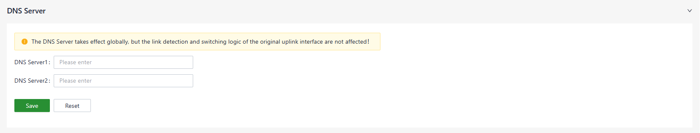

<strong>Fig. 4-43 DNS Settings</strong>

#### 4.9.4 Fixed Address List

The ODU12 can distribute IP addresses based on the MAC address of the client device by using the fixed address list. The distributed IP address should be in the range of the IP addresses of the local network.

<strong>Fig. 4-44 Fixed Address Settings</strong>

#### 4.9.5 Static Routes

Configure static routes to forward data through a specific route or interface. This list only displays the rules created by users and does not show the routes created automatically after modifying the WAN or LAN interface.

<strong>Fig. 4-45 Static Routes Settings</strong>

> **Note**: Static routes to the same destination IP address or network cannot have the same next-hop address, outbound interface, or priority.

#### 4.9.6 DDNS

Dynamic DNS (Dynamic Domain Name System) is used to automatically update the name server content in the domain system. According to Internet domain rules, domain names are typically associated with fixed IP addresses. Dynamic DNS technology allows users with dynamic IP addresses to have a fixed name server, enabling external users to connect to the URL of users with dynamic IP addresses through regular updates.

The Dynamic DNS server address can be configured manually under the "Services > Dynamic DNS" feature.

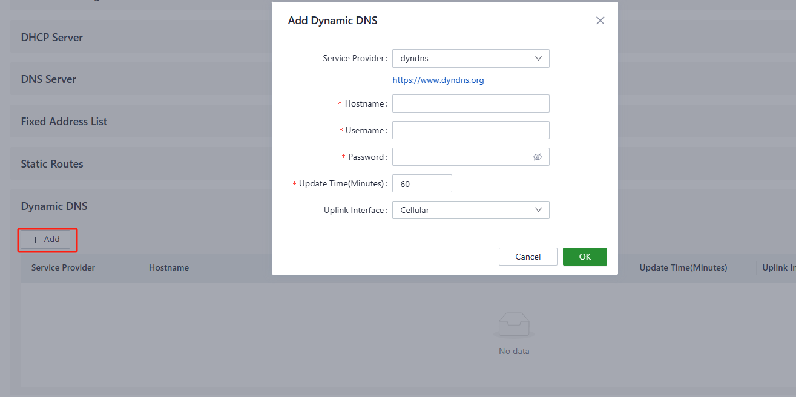

<strong>Fig. 4-46 DDNS Settings</strong>

1. **Service Provider**: Provided by the Dynamic DNS service operator; choose from dyndns, 3322, oray, no-ip, or use a custom option (requires a URL).
2. **Hostname**: Register for a hostname by clicking the URL below the service provider.
3. **Username**: Register for a username by clicking the URL below the service provider.
4. **Password**: The password set by the user during registration.

#### 4.9.7 Passthrough Settings

Configure IP passthrough to transparently forward data from the uplink interface to one client device.

<strong>Fig. 4-47 IP Passthrough Settings</strong>

> **Note**:
>
> 1. After the IP Passthrough mode is enabled, only one client can access the Internet, and static routing, VPN, port forwarding, and policy-based routing will not work.
> 2. The inbound rule needs to be released when accessing the client device.

### 4.10 System

#### 4.10.1 Change the Password

The default username and password of the ODU12 are on the product nameplate. Change the password for security after the first login. Click "adm" at the top right of the web page and click Modify Password in the menu to change the password.

<strong>Fig. 4-48 Change Password Entry</strong>

<strong>Fig. 4-49 Change Password</strong>

#### 4.10.2 Cloud Management

InCloud Manager (star.inhandcloud.com) is a cloud platform developed by InHand to help enterprises accelerate network deployment, simplify network maintenance, and improve service experience. This platform provides zero-touch deployment, intelligent maintenance, and security features. Users can log in to the platform to manage devices remotely, perform batch configuration, and monitor device traffic.

The ODU12 connects to InCloud Manager automatically. The InHand platform to connect to can be selected on this page, and InCloud Manager can also be disabled on this page.

<strong>Fig. 4-50 Cloud Management Settings</strong>

#### 4.10.3 Access Control

On this page, allow or forbid the public network to access the ODU12 and specify which port the public network uses to access the ODU12. The rules on this page do not influence LAN devices accessing the ODU12. The ODU12 supports HTTPS for access to its web configuration page.

<strong>Fig. 4-51 Access Control Settings</strong>

#### 4.10.4 Country & System Clock

Select a time zone for the system and enable the NTP server to synchronize time with the target NTP server.

<strong>Fig. 4-52 Country & System Clock Settings</strong>

#### 4.10.5 Device Options

Reboot, upgrade the firmware, or reset the ODU12 to default factory settings on this page.

<strong>Fig. 4-53 Device Options</strong>

> **Note**:
>
> 1. Before upgrading the firmware, make sure the new firmware is obtained from an official source.
> 2. If the ODU12 is connected to InCloud Manager, the platform synchronizes the settings before the factory reset; the ODU12 only clears historical data.

#### 4.10.6 Configuration Management

Export the system configuration to a local PC as a backup, and import the configuration to the device to restore the configuration.

<strong>Fig. 4-54 Configuration Management</strong>

#### 4.10.7 Device Alarms

When certain events that may occur on the device need attention, select the corresponding alarm events and set an email address for alarm emails. The ODU12 sends out an alarm if a selected event occurs, and records unselected events in the log.

The ODU12 currently supports recording and alarming the following events:

<strong>Fig. 4-55 Alarm Options</strong>

After the mail server address, port, username, and password are configured, the ODU12 sends alarm emails through this mailbox. Configure the receiving email address and send a test email to this address to check the correctness of the configuration above.

<strong>Fig. 4-56 Receiving Email Settings</strong>

#### 4.10.8 Tools

##### 4.10.8.1 Ping

Use the ICMP protocol to check the connectivity between the source address (the ODU12 itself if Source is blank) and another IP address or domain name in Target.

Enter the IP address or domain name in Target, and click Start to start the ping.

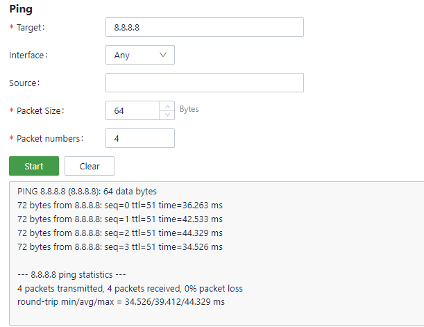

<strong>Fig. 4-57 Ping Tool</strong>

##### 4.10.8.2 Traceroute

Enter the target IP address or domain name, select the interface, and click "Start" to test and trace the link situation from the ODU12 to the target.

<strong>Fig. 4-58 Traceroute Tool</strong>

##### 4.10.8.3 Capture

This feature captures the data forwarded through specified interfaces.

By selecting an option in the Output dropdown list, view information about the captured data packets or export the information to a PC.

<strong>Fig. 4-59 Capture Tool</strong>

#### 4.10.9 Scheduled Reboot

Scheduled reboot is a network device management strategy that allows administrators to automatically restart a device at a specific time or under certain conditions to ensure normal operation and performance. In practice, scheduled reboots can be set in the "System > Scheduled Reboot" function based on business requirements. The device supports scheduled reboots daily, weekly, or monthly. For monthly reboots, if the selected reboot day exceeds the actual number of days in the month, the device reboots on the last day of the month. For example, if the 31st of every month is selected, the device reboots on the 30th in a month with only 30 days.

<strong>Fig. 4-60 Scheduled Reboot</strong>

#### 4.10.10 Log Server

Set a remote log server, and the ODU12 uploads system logs to this remote log server.

<strong>Fig. 4-61 Log Server</strong>

#### 4.10.11 Other Settings

Set the web login timeout, enable or disable accelerated forwarding, and configure other system settings on this page.

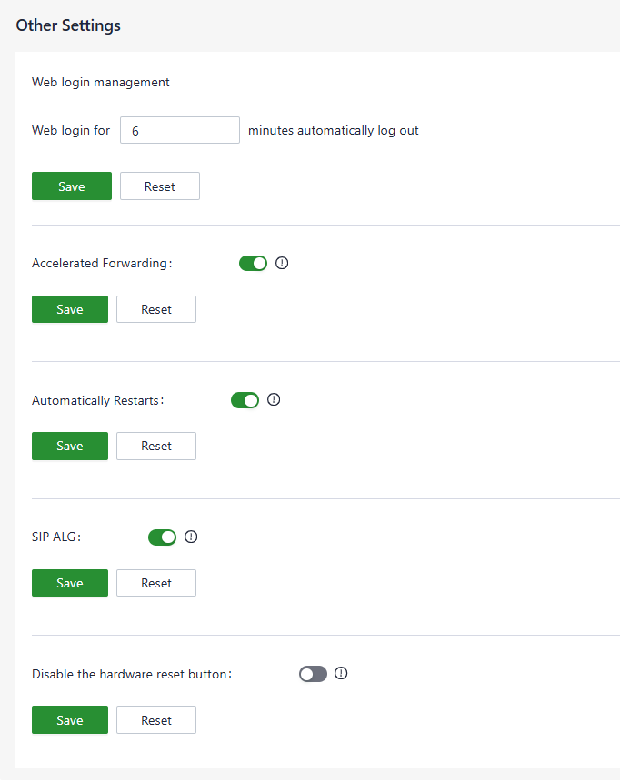

<strong>Fig. 4-62 Other Settings</strong>

> **Note**: The cellular forwarding speed increases significantly after Accelerated Forwarding is enabled, but other functions such as traffic shaping or IPSec will not take effect.

## Chapter 5: Typical Applications

### Case 1: 5G Internet Access and Cloud Management for Residential and Light Commercial Premises

**Scenario Description**: When a residence or shop lacks wired broadband resources or needs rapid network activation, the ODU12 can be deployed as an outdoor 5G access point, providing wired and Wi-Fi network access for indoor PCs, mobile phones, cameras, and other terminals, and connecting to the InCloud Manager cloud platform for remote operation and maintenance.

**Network Topology**:

<strong>Fig. 5-1 ODU12 Deployment Topology for Residential and Light Commercial Premises</strong>

**Device Role**: The ODU12 works as the outdoor edge 5G router. It accesses the Internet through the 5G cellular uplink, provides wired access through PoE LAN1 and WAN/LAN2, provides wireless coverage through dual-band Wi-Fi 7, and connects to InCloud Manager for centralized remote management.

**Procedure**:

1. Insert the SIM card and confirm the antenna connection before powering on, then complete the installation and log in to the web management interface as described in [Chapter 2: Installation and First Use](#chapter-2-installation-and-first-use).
2. Configure the cellular parameters as described in [Scenario 1: Cellular Internet Access](#scenario-1-cellular-internet-access) to establish the 5G uplink.
3. Configure the SSID and password as described in [Scenario 3: Wi-Fi Access](#scenario-3-wi-fi-access) to provide access for indoor wireless clients.
4. Register a platform account and add the device as described in [Scenario 5: Connecting to InCloud Manager](#scenario-5-connecting-to-incloud-manager) for remote monitoring and batch configuration.
5. (Optional) Enable Portal authentication for the guest SSID as described in [Scenario 6: Guest Wi-Fi Portal Authentication](#scenario-6-guest-wi-fi-portal-authentication); establish an encrypted tunnel to the headquarters network as described in [Scenario 7: IPSec VPN Site-to-Site Interconnection](#scenario-7-ipsec-vpn-site-to-site-interconnection).

**Reference Chapters**:

- [Chapter 2: Installation and First Use](#chapter-2-installation-and-first-use)
- [Scenario 1: Cellular Internet Access](#scenario-1-cellular-internet-access)
- [Scenario 3: Wi-Fi Access](#scenario-3-wi-fi-access)
- [Scenario 5: Connecting to InCloud Manager](#scenario-5-connecting-to-incloud-manager)
- [4.10.2 Cloud Management](#4102-cloud-management)

## Appendix: Troubleshooting

### 1 Cellular Network Issues

| Symptom | Possible Cause | Troubleshooting Steps | Reference |
|---------|----------------|----------------------|-----------|
| Cannot connect to the cellular network | SIM card not installed properly or invalid | 1. Confirm the SIM card is installed correctly and valid 2. Remove and reinsert the SIM card | [Scenario 1: Cellular Internet Access](#scenario-1-cellular-internet-access) |
| Cannot connect to the cellular network | Weak cellular signal | 1. Check the cellular network signal strength 2. Move the router to an area with better signal coverage | [1.3 LED Description](#13-led-description) |
| Cannot connect to the cellular network | Data plan expired or exceeded | 1. Confirm the data plan is still active and not exceeding data limits 2. Contact the ISP to confirm the plan status | [Scenario 1: Cellular Internet Access](#scenario-1-cellular-internet-access) |
| Cannot connect to the cellular network | Connection not established | Restart the device and wait for it to establish a connection | [Scenario 1: Cellular Internet Access](#scenario-1-cellular-internet-access) |
| Cannot connect to the cellular network | Incorrect APN configuration | 1. Verify that the APN configuration matches the information provided by the ISP 2. Reconfigure the dialing parameters | [4.3.3 Cellular Setting](#433-cellular-setting) |

### 2 Internet Access and Uplink Issues

| Symptom | Possible Cause | Troubleshooting Steps | Reference |
|---------|----------------|----------------------|-----------|
| Cannot connect to the wired WAN network | Abnormal cellular connection or insufficient signal | 1. Check whether the cellular network connection is functioning properly 2. Ensure adequate signal strength | [Scenario 1: Cellular Internet Access](#scenario-1-cellular-internet-access) |
| Cannot connect to the wired WAN network | Incorrect device configuration | 1. Verify that the device is correctly configured, including APN settings and username/password if applicable 2. Save the Internet settings again | [4.3 Internet Settings](#43-internet-settings) |
| The device itself cannot access the Internet | Abnormal link from the device to the Internet | Use the ping tool to check the connectivity of the device itself to the Internet | [4.10.8.1 Ping](#41081-ping) |
| Clients cannot access the Internet | Firewall rules or MAC filtering blocking access | 1. Check whether the firewall inbound/outbound rules and MAC address filtering configuration prohibit the address from accessing the network 2. Adjust the rules as required | [4.7.1 Firewall](#471-firewall) |
| Clients cannot access the Internet | Abnormal client address | Reconnect the client with the device to regain the address | [Scenario 3: Wi-Fi Access](#scenario-3-wi-fi-access) |

### 3 Network Performance Issues

| Symptom | Possible Cause | Troubleshooting Steps | Reference |
|---------|----------------|----------------------|-----------|
| Slow or unstable speeds | Weak cellular signal | 1. Check the cellular network signal strength 2. Position the router in an area with strong signal reception | [4.2.7 Cellular Signal](#427-cellular-signal) |
| Slow or unstable speeds | Client connected on the 2.4G band | Connect the device to the 5 GHz band | [Scenario 3: Wi-Fi Access](#scenario-3-wi-fi-access) |
| Slow or unstable speeds | Outdated firmware version | Update the router firmware to access the latest performance and stability improvements | [4.10.5 Device Options](#4105-device-options) |

### 4 Web Access and Account Issues

| Symptom | Possible Cause | Troubleshooting Steps | Reference |
|---------|----------------|----------------------|-----------|
| Cannot log in to the web management interface | PC and device in different network segments | 1. Confirm the PC IP address is in the range 192.168.1.2–192.168.1.254 2. Set the gateway to 192.168.1.1 | [2.2.2 Method 2: Log in via PC Web Interface](#222-method-2-log-in-via-pc-web-interface) |
| Login page prompts that the website is not secure | Browser certificate prompt | Open the hidden or advanced options and select "Proceed to website" | [2.2.2 Method 2: Log in via PC Web Interface](#222-method-2-log-in-via-pc-web-interface) |
| Management password forgotten | Password changed and forgotten | 1. Press and hold the Reset button for 10 seconds to restore factory defaults 2. Log in again with the default username and password on the nameplate | [1.4 Restoring Factory Defaults](#14-restoring-factory-defaults) |
| Device cannot be accessed remotely on the cloud platform | Remote Access feature not used | Select the target device and click "Remote Access" to open the local login interface of the device | [4.2 Local Web Interface Monitoring](#42-local-web-interface-monitoring) |

## Appendix: Safety Precautions

1. Changing Internet settings may cause network interruption; evaluate carefully before modifying configurations under 【Internet】.
2. Before upgrading the firmware, make sure the new firmware is obtained from an official source.
3. The device is intended for outdoor installation. After installation, confirm the device is mounted securely to avoid damage caused by falling.
4. Do not open the device enclosure unless performed by professional personnel; risk of electric shock exists.

> **Warning**: Use the device under the specified operating environmental conditions. Avoid deploying the device outside extreme condition limits to ensure the IP65 protection performance and long-term reliable operation.

## FAQ

### Question 1: Unable to Connect to the 4G/5G Network?

1. Physical environment: Start by checking whether the SIM card is inserted into the correct slot and ensure all cellular antennas are properly installed.
2. APN settings: Make sure that the APN configuration matches the information provided by the service provider.
3. Check device connectivity: Log in to the local interface of the device and use the built-in ICMP tool to ping 8.8.8.8 to test connectivity. If it connects, check the connectivity between the client device (e.g., computer or smartphone) and the router.
4. Check the SIM card: Take out the SIM card and insert it into a phone to see whether it can connect to the Internet.
5. Restart: Power off the router, wait a few seconds, and then reconnect the power to retry the network connection.
6. Factory reset: Perform a factory reset on the router and then attempt to connect again.

### Question 2: Is the Cloud Platform Free of Charge?

InHand Networks has been committed to providing high-quality network services for small and medium-sized chain organizations. When using the cloud platform services, users are required to purchase a license for each device to access the extensive cloud-based features.

### Question 3: How to Add Devices to the Cloud Platform?

1. Register an InCloud Manager account at `https://star.inhandcloud.com`.
2. Log in to the cloud platform with the registered account. Under the device menu, click "Add" and follow the prompts to enter the serial number and MAC address of the device to complete the addition. When a device is added for the first time, it comes with a complimentary 1-year Essential license, which can be renewed as needed.

### Question 4: Is It Possible to Use the Device Without the Cloud Platform?

Yes. Users can complete the majority of configuration tasks locally. However, features such as bulk configuration deployment, firmware upgrades, SD-WAN, and Connector require combining local device settings with the cloud platform.

If the issue cannot be resolved with the steps above or any other problems occur, contact InHand Networks for technical support. Visit `www.inhandnetworks.com` for more information.
