# 5G ODU2002 Product User Manual

## Front Matter

### Declaration

Thank you for choosing this product. Before use, read this user manual carefully. Compliance with the following statements helps maintain intellectual property rights and legal compliance, and ensures that the user experience aligns with the latest product information. For any questions or written permission requests, contact the technical support team.

- **Copyright Statement**

  This user manual contains copyrighted content, and the copyright belongs to InHand Networks Technology Co., Ltd. and its licensors. Without written permission, no organization or individual may excerpt, copy any part of the content of this manual, or distribute it in any form.

- **Disclaimer**

  Due to ongoing updates in product technology and specifications, the company cannot guarantee that the information in this user manual is entirely consistent with the actual product. Therefore, no disputes arising from any discrepancies between the actual technical parameters and the user manual are accepted. Any changes to the product will not be notified in advance, and the company reserves the right to make the final changes and interpretations.

- **Copyright Information**

  The content of this user manual is protected by copyright laws, and the copyright belongs to InHand Networks and its licensors, reserving all rights. Without written permission, the content of this manual may not be used, copied, or distributed without authorization.

### GUI Conventions

| Symbol | Meaning | Example |
|--------|---------|---------|
| `< >` | Indicates a variable or parameter to be replaced with an actual value | `<IP Address>` means a specific IP address must be entered |
| `" "` | Indicates a text label on the interface | Click the "Save" button |
| `→` | Indicates menu hierarchy or operation sequence | 【Network】→【Cellular】 |
| `【 】` | Indicates a menu or page name | Go to the 【System Settings】page |
| Cautions | Improper action may result in data loss or device damage | - |
| Note | Contains detailed descriptions and helpful suggestions | - |

### Technical Support
Email: support@inhandnetworks.com

URL: www.inhand.com

### How to Use This Manual

**Target Audience**

- First-time users: Read 【Know the Device】→【Installation and First Use】→【Common Scenario Configuration】→【Function Description and Parameter Reference】in sequence.
- Existing device users: Refer directly to 【Function Description and Parameter Reference】or 【Appendix A Troubleshooting】.
- Cloud platform administrators: Refer to 【Common Scenario Configuration】for device remote management platform guidance.

**Task Quick Reference**

| Task | Chapter | Estimated Time |
|------|---------|----------------|
| Understand device components and indicators | [Know the Device](#chapter-1-know-the-device) | Approx. 5 min |
| Install and power on the device | [Installation and First Use](#chapter-2-installation-and-first-use) | Approx. 15 min |
| Connect to the Internet via cellular | [Common Scenario Configuration](#chapter-3-common-scenario-configuration) | Approx. 10 min |
| Connect to the Internet via wired WAN | [Common Scenario Configuration](#chapter-3-common-scenario-configuration) | Approx. 10 min |
| Manage the device through InCloud Manager | [Common Scenario Configuration](#chapter-3-common-scenario-configuration) | Approx. 10 min |
| Configure advanced network functions | [Function Description and Parameter Reference](#chapter-4-function-description-and-parameter-reference) | As needed |
| Diagnose connection issues | [Appendix A Troubleshooting](#appendix-a-troubleshooting) | As needed |

---

# Chapter 1: Know the Device

## 1.1 Overview

The ODU2002 is a 5G outdoor unit (ODU) in the InHand cloud-managed 5G ODU 2000 series. It is designed to provide high-speed, convenient, and secure 5G network access for enterprise WAN deployments. By leveraging gigabit cellular uplink, the ODU2002 enables rapid network deployment without relying on fixed broadband infrastructure. The device supports dual-SIM card switching, adapts to harsh environments, and integrates with InCloud Manager SaaS service to form a cloud-managed network solution.

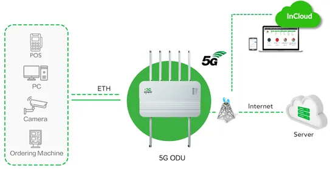

<strong>Fig. 1-1 ODU2002 Application Scenario</strong>

## 1.2 Packing List

Every ODU2002 product shipped from the factory includes the following common accessories. After receiving the product, inspect the contents carefully. If any item is missing or damaged, contact InHand sales personnel promptly.

| Item | Quantity | Description |
|------|----------|-------------|
| ODU2002 | 1 | ODU2002 5G outdoor unit |
| Ethernet cable | 1 | 1m Ethernet cable |
| Power adapter + AC cord | 1 | 50V/0.3A PoE power adapter, IEEE 802.3af standard |
| 5G antenna | 2 | 5G antenna × 2 |
| 5G MIMO antenna | 4 | 5G MIMO antenna × 4 |
| Wi-Fi antenna | 1 | Wi-Fi antenna × 1 |
| GNSS antenna | 1 | GNSS antenna × 1 |
| QSG | 1 | Quick Installation Guide |
| Mounting bracket | 1 | Adjustable bracket |
| Mounting plate | 1 | Mounting plate |
| Stainless steel pipe clamp | 2 | For pole-mounted installation |
| Grounding wire | 1 | Ground connection wire with OT terminal |

## 1.3 Appearance and Interfaces

The ODU2002 is an outdoor-rated unit with external antenna connectors, an Ethernet port, and a SIM card compartment. The panel layout is shown below.

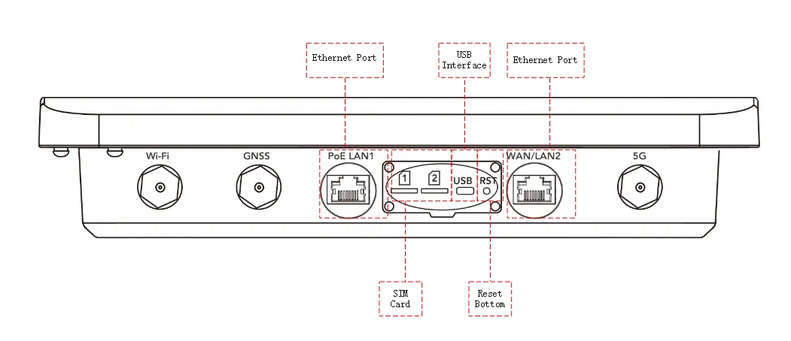

<strong>Fig. 1-2 ODU2002 Panel Layout</strong>

| Interface | Position | Function Description |
|-----------|----------|----------------------|
| 5G antenna connectors | Top / side panel | TNC connectors for 5G and 5G MIMO antennas (×6 total) |
| Wi-Fi antenna connector | Top / side panel | TNC connector for Wi-Fi antenna (×1) |
| GNSS antenna connector | Top / side panel | TNC connector for GNSS antenna (×1) |
| PoE LAN1 (Ethernet) | Bottom panel | 2.5G Ethernet port for data and PoE power input |
| SIM card slot | Bottom panel (under cover) | Dual nano-SIM card slots |
| Grounding hole | Bottom panel | Connection point for grounding wire |
| RESET button | Bottom panel | Press to restore factory settings |

## 1.4 LED Indicators

The ODU2002 provides five LED indicators to display system and network status.

| LED | Status | Meaning |
|-----|--------|---------|
| System | Off | Power off |
| | Steady red | System starting |
| | Blinking red | System error |
| | Steady green | System working normally |
| | Blinking blue | System upgrading |
| Cellular | Off | Cellular disabled |
| | Steady blue | 4G connected |
| | Steady green | 5G connected |
| | Blinking red | Connection error |
| Signal | Off | Connection error |
| | Steady red | Signal value ≤ 9 |
| | Steady blue | 10 ≤ Signal level ≤ 19 |
| | Steady green | Signal level ≥ 20 |
| LAN | Off | Connection error |
| | Steady green | LAN port connected |
| | Blinking green | LAN port data transmitting |
| WAN | Off | Connection error |
| | Steady green | WAN port connected |
| | Blinking green | WAN port data transmitting |

## 1.5 Restoring Factory Settings

To restore the ODU2002 to factory default settings via the RESET button, perform the following steps:

1. Ensure the unit is powered on. Press and hold the RESET button for 5–10 seconds.
2. When the System LED turns steady blue, release the RESET button. The System LED will start blinking blue. Press the RESET button again.
3. When the System LED turns steady blue again, release the RESET button. The unit has been restored to default settings and will start up normally shortly thereafter.

Factory settings can also be restored remotely via the InCloud Manager platform. See [Section 3.3](#33-cloud-platform-management) for details.

## 1.6 Default Settings

| No. | Function | Default Settings |
|-----|----------|------------------|
| 1 | Cellular | SIM1 enabled |
| 2 | Wi-Fi | Wi-Fi 2.4G AP mode enabled; SSID: `ODU2002-` + last 6 characters of MAC address; Authentication: WPA2-PSK; Password: last 8 digits of S/N |
| 3 | Ethernet | PoE LAN1 enabled, IP address: 192.168.1.1, Netmask: 255.255.255.0; DHCP server enabled, range: 192.168.1.2 ~ 192.168.1.254; WAN/LAN2 enabled as WAN, DHCP client mode |
| 4 | Management Services | HTTPS (443) enabled; HTTPS/SSH/ping from cellular/WAN interface disabled |
| 5 | Username and password | Printed on the product nameplate |

---

# Chapter 2: Installation and First Use

## 2.1 Pre-Installation Preparation

Before installing the ODU2002, confirm the following conditions are met:

| Item | Requirement |
|------|-------------|
| Power supply | IEEE 802.3af PoE (50V/0.3A) adapter or PoE switch |
| Operating temperature | -30℃ ~ 70℃ |
| Storage temperature | -40℃ ~ 85℃ |
| Installation surface | Wall or pole capable of supporting the device weight and wind load |
| Cables and antennas | All accessories from the packing list are available |
| SIM card | Nano-SIM card from a local operator supporting the required network bands |

> **Caution**: Avoid direct sunlight, heat sources, and strong electromagnetic interference. Ensure the installation position is structurally sound.

> **Warning**: Power connection must comply with local electrical safety regulations. Use the supplied grounding wire to protect against lightning and electrical surges.

## 2.2 Installation Guide

### 2.2.1 Install the SIM Card

The ODU2002 supports dual nano-SIM cards.

1. Power off the device. Unscrew the SIM card cover on the bottom panel.
2. Insert the SIM card(s) into the slot(s) according to the silk-screen diagram.
3. Replace the SIM card cover and ensure the waterproof gasket is properly seated to prevent water ingress.

<strong>Fig. 2-1 SIM Card Installation</strong>

### 2.2.2 Attach Antennas

Attach the eight antennas to the TNC connectors marked 5G, 5G MIMO, Wi-Fi, and GNSS.

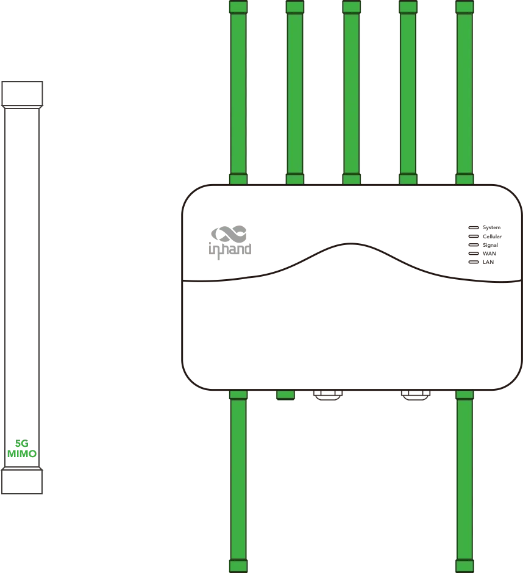

<strong>Fig. 2-2 Antenna Connection</strong>

### 2.2.3 Install the Mounting Plate

Attach the mounting plate to the ODU2002 using screws. Ensure the top side faces upward.

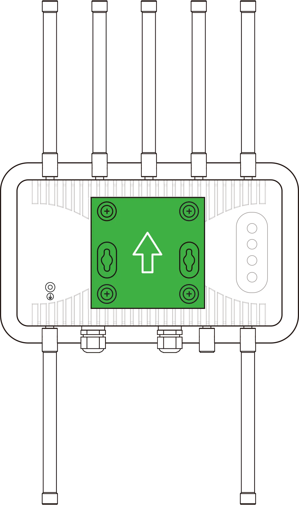

<strong>Fig. 2-3 Mounting Plate Installation</strong>

### 2.2.4 Wall-Mounted Installation

1. Install the adjustable base on the wall at the desired angle and position.

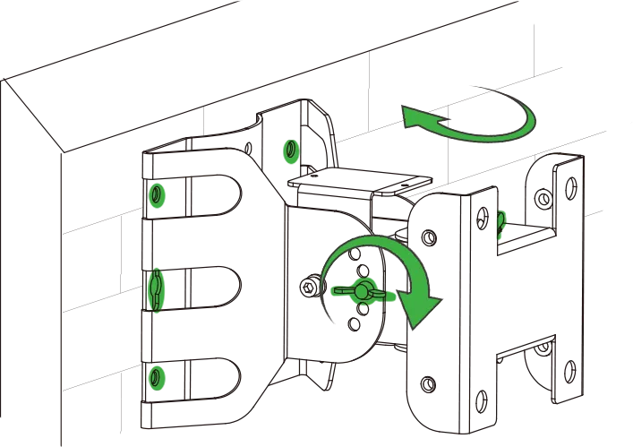

<strong>Fig. 2-4 Wall Mount Base</strong>

2. Attach the mounted ODU2002 to the base. Tighten the mounting bolts to lock the ODU2002 in place.

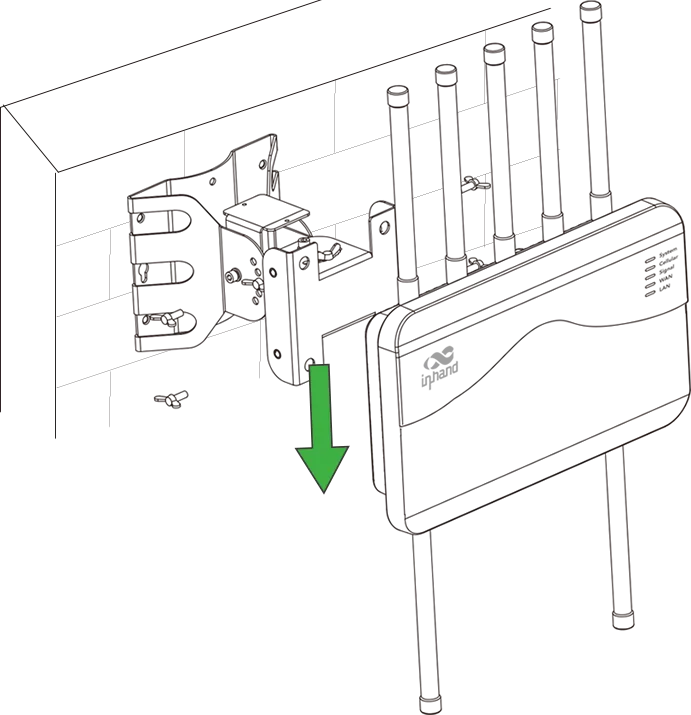

<strong>Fig. 2-5 Wall Mount Assembly</strong>

### 2.2.5 Pole-Mounted Installation

1. Install the adjustable base on the pole at the desired angle and position.

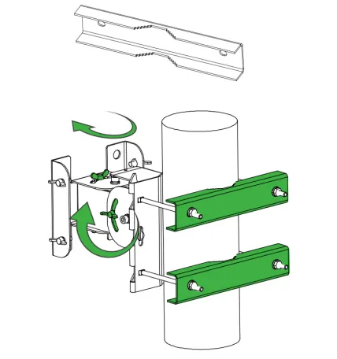

<strong>Fig. 2-6 Pole Mount Base</strong>

2. Attach the mounted ODU2002 to the base. Tighten the mounting bolts to lock the ODU2002 in place.

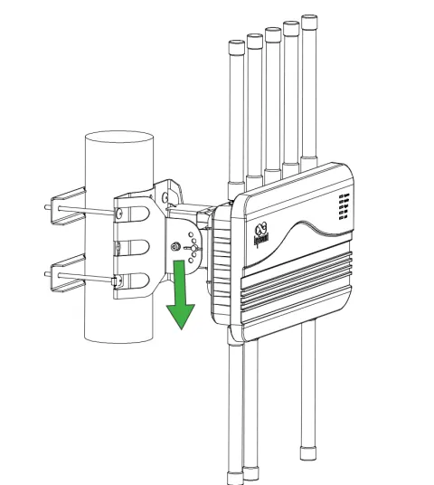

<strong>Fig. 2-7 Pole Mount Assembly</strong>

### 2.2.6 Grounding

Connect the grounding hole of the device to earth ground through the grounding wire with the OT terminal. Cut the grounding wire to an appropriate length according to the field situation to avoid waste.

<strong>Fig. 2-8 Grounding Connection</strong>

### 2.2.7 Connect the Ethernet Cable

> **Caution**:
> - Ensure the Ethernet cable is inserted into the device in a standardized way. Otherwise, the crystal head may be damaged when installing the waterproof PG head.
> - When removing the Ethernet cable, remove the waterproof PG head first, then remove the crystal head connected to the device.
> - Confirm the diameter of the Ethernet cable is between 4.8 mm and 6.5 mm.
> - Ensure the cable glands are properly assembled to prevent leaks.

1. Cut the Ethernet cable to the appropriate length according to the distance from the ODU to the power supply and pass it through the bracket.
2. Process the crystal head and pass it through the waterproof PG head in the order shown below.

<strong>Fig. 2-9 Ethernet Cable Waterproof Assembly</strong>

3. Insert the Ethernet cable into the network port of the device, and tighten the waterproof head in the order of B, C, D, and E to complete the installation.

### 2.2.8 Connect PoE Power

Connect one end of the Ethernet cable to the PoE 2.5G LAN1 port and plug the other end into the 802.3af (50V/0.3A) PoE adapter or a router/switch with an 802.3af port.

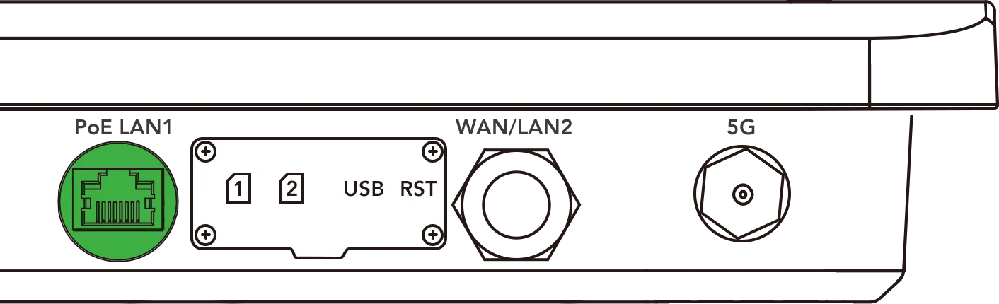

<strong>Fig. 2-10 PoE Connection</strong>

### 2.2.9 Access the Web Management Interface

After powering on and completing the physical installation, the device can be accessed via a PC.

1. Connect the PoE LAN1 interface on the ODU2002 to a PC with an Ethernet cable.
2. Configure the PC to obtain an IP address automatically via DHCP (recommended). The DHCP server is enabled by default on the LAN port.
3. Alternatively, use a fixed IP address in the range 192.168.1.2 ~ 192.168.1.254, with gateway 192.168.1.1 and subnet mask 255.255.255.0.
4. Open a web browser and enter the default device address `192.168.1.1`. Enter the username and password (printed on the product nameplate) to access the web management interface. If the browser displays a security warning, open the advanced options and select "Proceed to website".

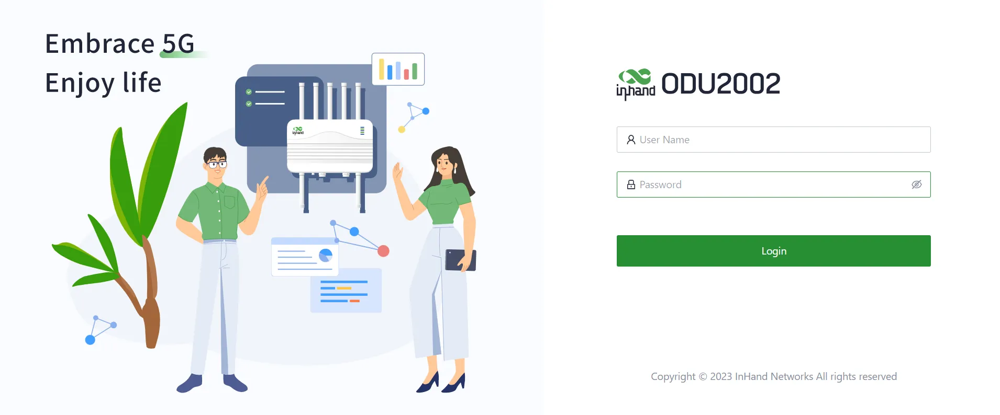

<strong>Fig. 2-11 Web Login</strong>

## 2.3 Quick Check

After installation, verify the following items:

- [ ] The device is firmly secured and cannot fall or vibrate loose.
- [ ] All antennas are correctly attached to the corresponding TNC connectors.
- [ ] The SIM card cover is screwed on tightly with the waterproof gasket in place.
- [ ] The Ethernet cable is properly routed and fixed to the bracket to avoid dragging.
- [ ] The waterproof PG head is tightened correctly.
- [ ] The grounding wire is securely connected.
- [ ] The power cord is in good contact and the LED indicators show normal status.

---

# Chapter 3: Common Scenario Configuration

## 3.1 Cellular Internet Access

**Objective**: Connect the ODU2002 to the Internet via 4G/5G cellular network.

**Prerequisites**: SIM card inserted, antennas installed, device powered on.

**Estimated Time**: Approx. 10 minutes.

### 3.1.1 Connect via Mobile App

1. Install the InCloud APP by scanning the QR code on a mobile phone.

<strong>Fig. 3-1 InCloud APP QR Code</strong>

2. Open the APP and tap the "Device" tab at the bottom. Tap the menu button in the upper right corner and select "Add Device". Scan the QR code on the ODU2002 to add the device.

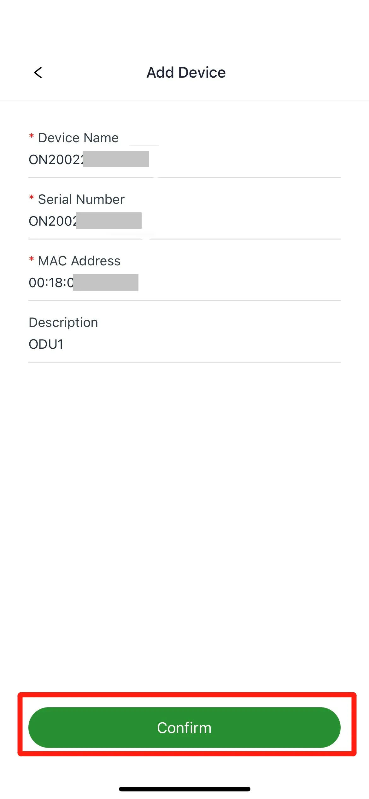

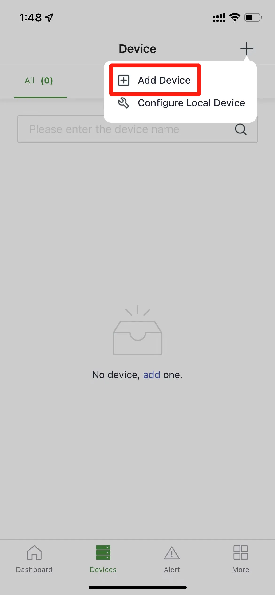

<strong>Fig. 3-2 InCloud APP Device Tab and Add Device</strong>

3. After scanning successfully, configure the device name, serial number, and description.
4. If the device fails to connect to the Internet, tap "Configure local device" on the Device page. Scan the QR code on the device again. The mobile phone will connect to the ODU2002's Wi-Fi AP automatically.

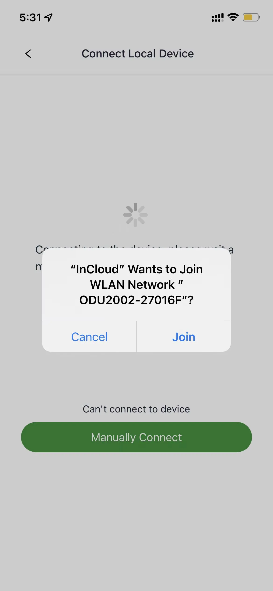

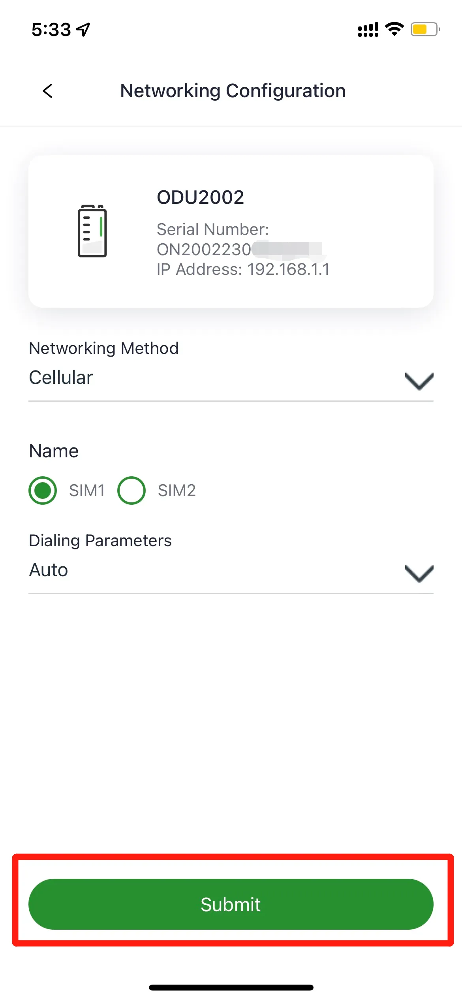

<strong>Fig. 3-3 Configure Local Device and Wi-Fi Auto Connect</strong>

5. After the connection succeeds, the APP will automatically log in to the device and enter the networking configuration interface. Confirm the information and submit.

### 3.1.2 Connect via PC

1. Power off the device, insert the SIM card, connect the 5G antenna, and connect the ODU2002 to a PC with an Ethernet cable.
2. Open a browser and enter `192.168.1.1`. Log in with the credentials from the product nameplate.
3. Click 【Internet】in the left navigation bar, then click the edit button behind "Cellular" to set up dial-up parameters. The device enables the dial-up function by default. Wait a few minutes for the connection to establish. Re-enable dial-up if it does not connect.

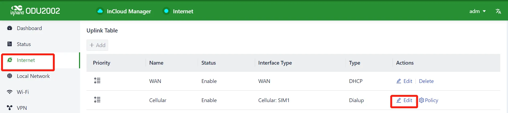

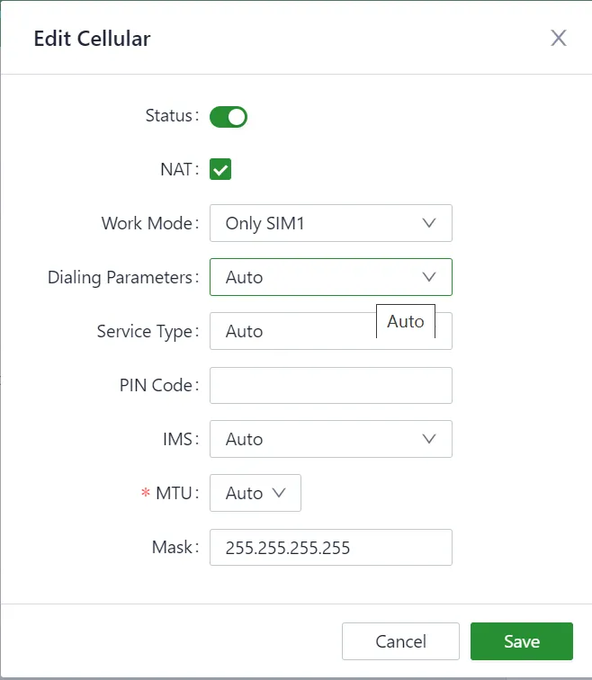

<strong>Fig. 3-4 Internet Menu and Cellular Configuration</strong>

4. Check the dial-up status in 【Dashboard】→【Interface Status】. The connection is successful when the "Cellular" icon turns green. Click the icon to view signal strength, IP address, and traffic consumption.

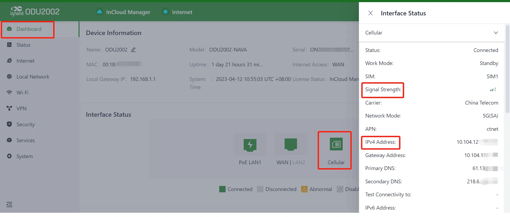

<strong>Fig. 3-5 Interface Status Dashboard</strong>

**Verification**:
1. Check that the Cellular LED is steady green (5G) or steady blue (4G).
2. Open a web browser and access an external website to confirm Internet connectivity.

**Common Issues**:
- Connection failure: Verify the SIM card is correctly inserted and the APN parameters match the operator requirements.
- No signal: Check antenna connections and device positioning.

## 3.2 Wired Internet Access

**Objective**: Connect the ODU2002 to the Internet via the wired WAN port.

**Prerequisites**: Ethernet cable connected to the upstream network, device powered on.

**Estimated Time**: Approx. 10 minutes.

### 3.2.1 Connect via Mobile App

1. Open the InCloud APP, go to the 【Device】page, tap the menu button, and select 【Add Device】. Scan the QR code on the ODU2002.

<strong>Fig. 3-6 InCloud APP Login and Device Page</strong>

2. After scanning, configure the device name, serial number, and description.
3. If the device fails to connect, tap "Configure local device". The phone will connect to the ODU2002 via Wi-Fi automatically.

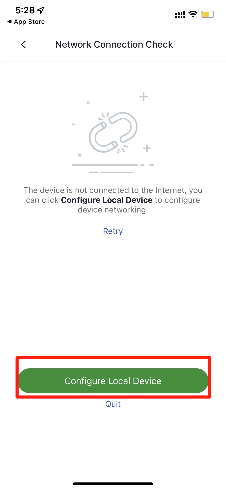

<strong>Fig. 3-7 Add Device Scan and Device Info Configuration</strong>

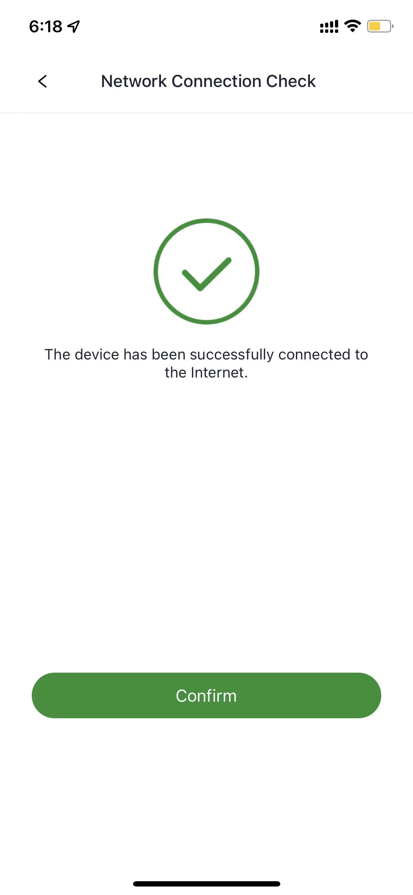
 

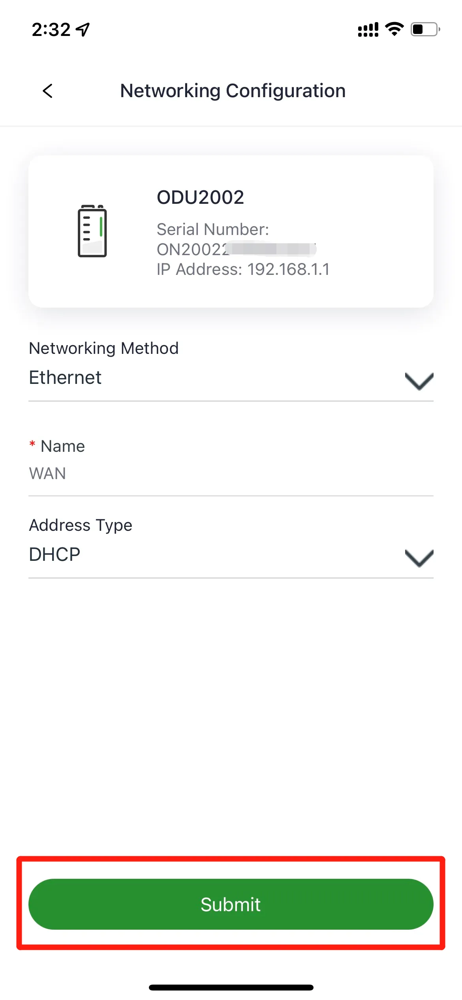

<strong>Fig. 3-8 Local Device Configuration and Wi-Fi Connection</strong>

4. After connection, the APP logs in automatically. Confirm the networking information and submit.

### 3.2.2 Connect via PC

1. Connect the LAN1 port to the PC.
2. Set the PC to obtain an IP address automatically via DHCP (recommended). Alternatively, configure a static IP in the range 192.168.1.2 ~ 192.168.1.254, with gateway 192.168.1.1, subnet mask 255.255.255.0, and DNS 8.8.8.8 or the operator DNS server address.

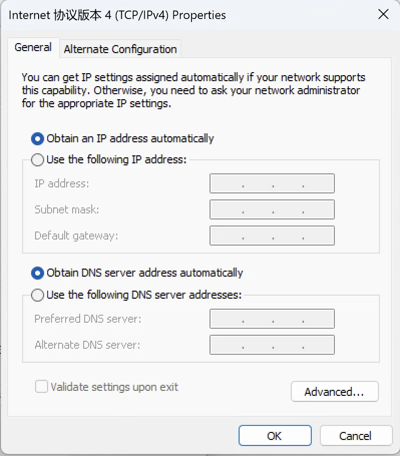

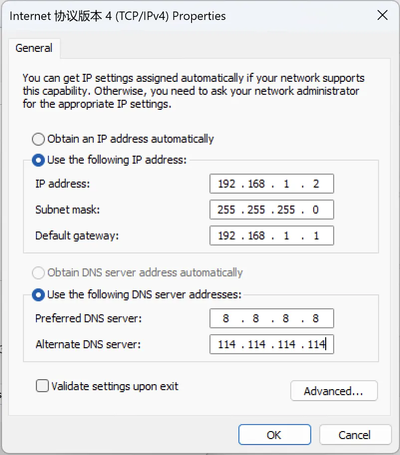

<strong>Fig. 3-9 PC DHCP and Static IP Settings</strong>

3. Enter `192.168.1.1` in the browser address bar and log in with the credentials from the nameplate.

<strong>Fig. 3-10 Web Management Login</strong>

4. Click 【Internet】in the left navigation bar to view the interface status. The ODU2002 enables WAN1 with DHCP mode by default. The device supports three WAN address allocation methods: dynamic DHCP (recommended), static IP, and PPPoE. Click the Edit button next to WAN to modify the WAN port.

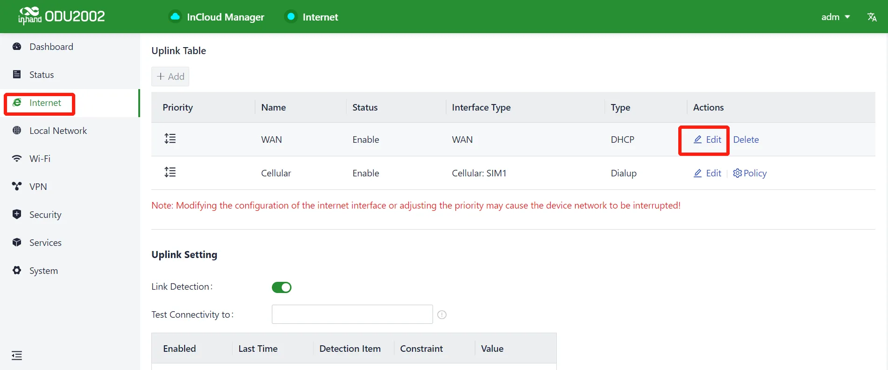

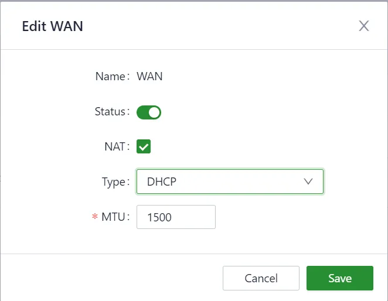

<strong>Fig. 3-11 WAN Configuration and WAN Mode Selection</strong>

5. Verify network connectivity via the ping tool on the 【System】→【Tools】page.

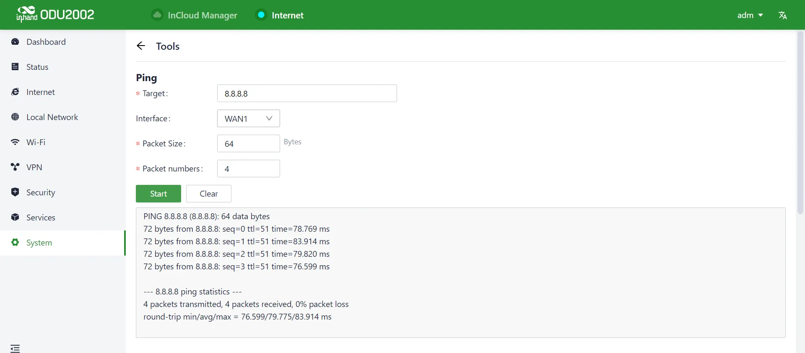

<strong>Fig. 3-12 Ping Tool</strong>

**Verification**:
1. Check that the WAN LED is steady green.
2. Use the ping tool to verify connectivity to a public IP address (e.g., 8.8.8.8).

**Common Issues**:
- No IP address obtained: Verify the upstream DHCP server is active or switch to static IP configuration.
- Unable to browse: Check firewall inbound/outbound rules and MAC address filtering settings.

## 3.3 Cloud Platform Management

**Objective**: Register and manage the ODU2002 through the InCloud Manager platform.

**Prerequisites**: Device powered on and connected to the Internet, PC or mobile phone with browser/APP access.

**Estimated Time**: Approx. 10 minutes.

### 3.3.1 Register and Log In

1. Open a web browser (Chrome recommended) and visit [https://star.inhandcloud.com](https://star.inhandcloud.com). Select "InCloud Manager" to access the SaaS platform.
2. Click "Create now" to register a new account.

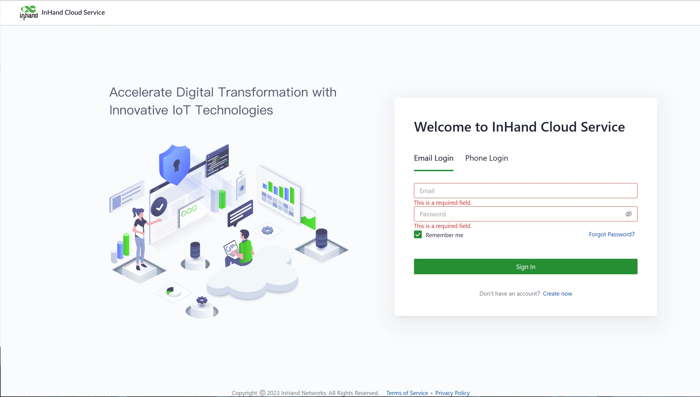

<strong>Fig. 3-13 InCloud Account Creation</strong>

3. After completing email registration, log in to InCloud Manager with the registered username and password.

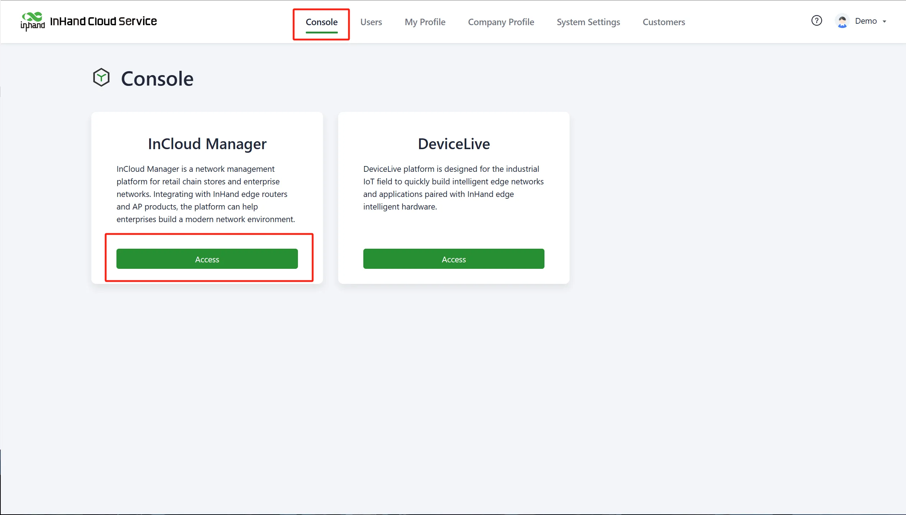

<strong>Fig. 3-14 InCloud Service Selection</strong>

> **Note**: When a device is initially added to the platform account, it automatically receives a 1-year Essential license. Users can renew the license through the "License" menu.

### 3.3.2 Add Device to the Platform

1. After logging in, go to the 【Devices】menu and click the "Add" button.
2. Fill in the device name, serial number, and MAC address, then click "Finish".

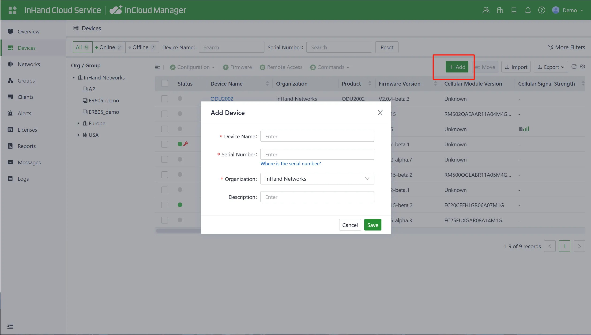

<strong>Fig. 3-15 Add Device to Platform</strong>

### 3.3.3 Remote Factory Reset

1. Log in to the InCloud Manager platform.
2. Click 【Device】→【Command】in the navigation bar, click the "Restore to Factory" button, and confirm. The device will reboot and restore to default settings.

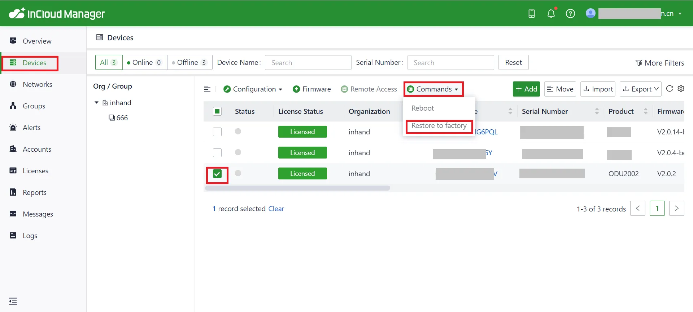

<strong>Fig. 3-16 Remote Factory Reset</strong>

**Verification**:
1. The device appears online in the InCloud Manager device list.
2. The device details page shows correct model, serial number, and online status.

**Common Issues**:
- Device offline: Verify the device has Internet connectivity and the serial number/MAC address were entered correctly.

---

# Chapter 4: Function Description and Parameter Reference

## 4.1 Monitoring

Once the device is added to the platform, the network can be managed and monitored remotely. The device also supports local real-time status viewing through its web interface.

### 4.1.1 Device Overview (InCloud Manager)

In the 【Devices】section, click the "Device Name" to access the device details page.

**Dashboard**

Click 【Dashboard】in the left menu to check device information, interface status, traffic statistics, and Wi-Fi information.

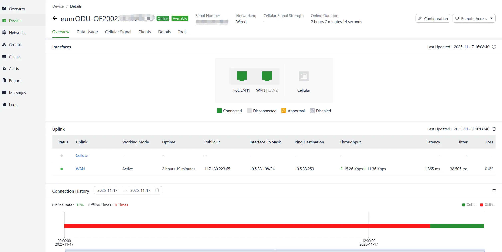

<strong>Fig. 4-1 Status Overview</strong>

**Data Usage**

View traffic usage and historical data of various uplink links.

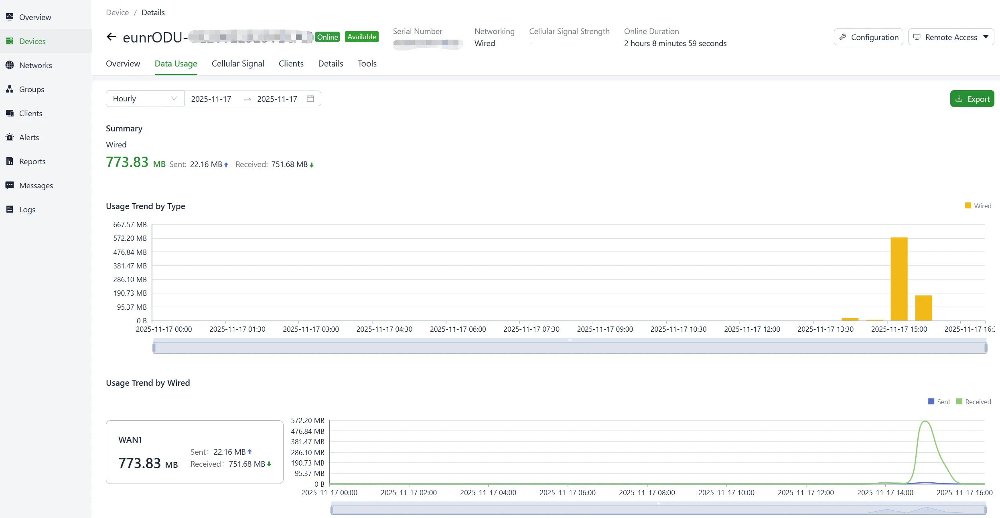

<strong>Fig. 4-2 Data Usage</strong>

**Cellular Signal**

View cellular signal curves such as RSSI, RSRP, RSRQ, and SINR.

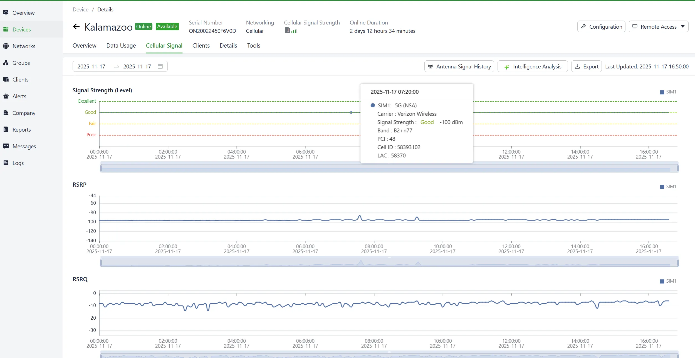

<strong>Fig. 4-3 Cellular Signal</strong>

### 4.1.2 Local Device Information

Through the platform's "Remote Access" feature, real-time viewing and configuration of the local device interface can be performed. Select the target device, click "Remote Access," and the device's local login interface opens.

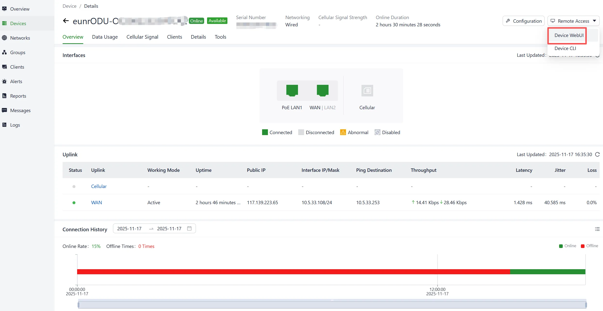

<strong>Fig. 4-4 Remote Access</strong>

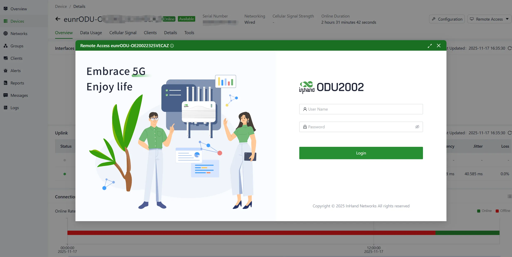

<strong>Fig. 4-5 Local Interface</strong>

**Device Information**

On the 【Dashboard】interface, basic device information is displayed at the top, including device name, model, serial number, MAC address, online duration, and upstream interface address.

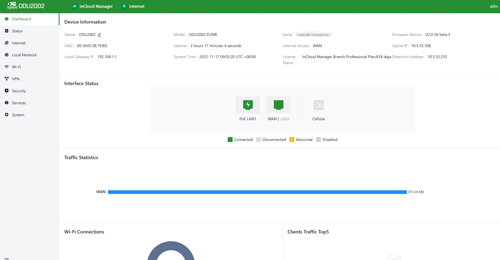

<strong>Fig. 4-6 Local Page</strong>

| Parameter | Description |
|-----------|-------------|
| Name | Identifies the device name. Initially set to "ODU2002" but can be customized. |
| MAC Address | Identifies the device's physical MAC address. |
| Local Gateway Address | The default gateway address of the device's subnet. |
| Model | Specifies the device's specific model. |
| Uptime | Reflects the device's running time since it was powered on. |
| System Time | Displays the device's time zone and system time. |
| Serial | A unique code used as the device identifier for platform addition. |
| Internet Access | The upstream interface used by the device for Internet connectivity. |
| License Status | Information about the applied license (Essential or Professional). |
| Firmware Version | Shows the device's current software version. |
| Uplink IP | The IP address of the upstream interface used for Internet connectivity. |
| Detection Address | Probe address for the system to detect network connectivity. |

**Interface Status**

In the 【Dashboard】→【Interface Status】feature, the operational status of each interface can be visually inspected. By clicking an interface icon, detailed information is displayed in a pop-up box.

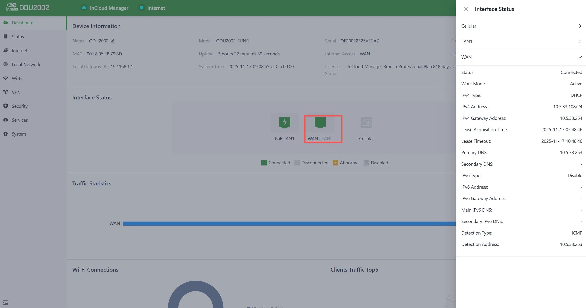

<strong>Fig. 4-7 Interface Status</strong>

**Traffic Statistics**

Monitor traffic usage on each upstream interface since the router was powered on through 【Dashboard】→【Traffic Statistics】. Data resets after reboot. Historical records are available on the InCloud Manager device details page.

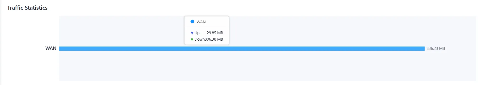

<strong>Fig. 4-8 Traffic Statistics</strong>

**Wi-Fi Connections**

In the 【Dashboard】→【Wi-Fi Client Count】feature, the number of active SSIDs can be checked. The ODU2002 has one 2.4 GHz SSID enabled by default, used for initial installation and debugging.

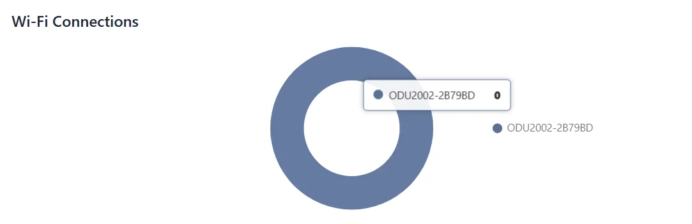

<strong>Fig. 4-9 Wi-Fi Client Count</strong>

**Top 5 Client Traffic**

In the 【Dashboard】→【Top 5 Client Traffic】feature, the current ranking of client traffic usage is displayed. Up to 5 records are shown. When a client disconnects, its statistical data is cleared.

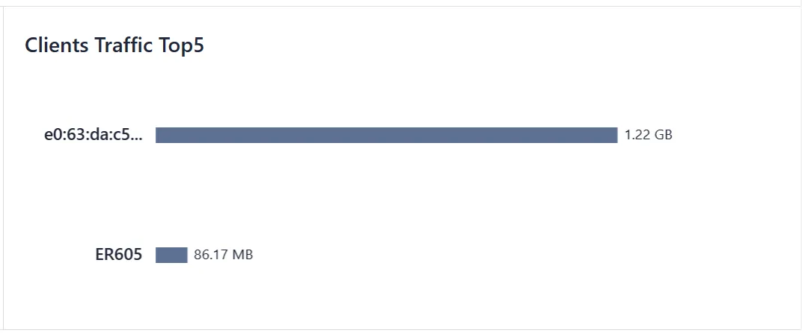

<strong>Fig. 4-10 Top 5 Client Traffic</strong>

 **Link Monitor**

The Link Monitor page displays the health of each uplink, as well as throughput, latency, and packet loss rate on each uplink interface.

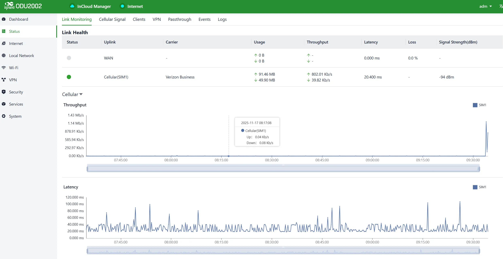

<strong>Fig. 4-11 Link Monitoring</strong>

**Cellular Signal (Local)**

The Cellular Signal page displays the SIM card signal strength on the cellular interface, as well as parameters such as RSSI, SINR, and RSRP.

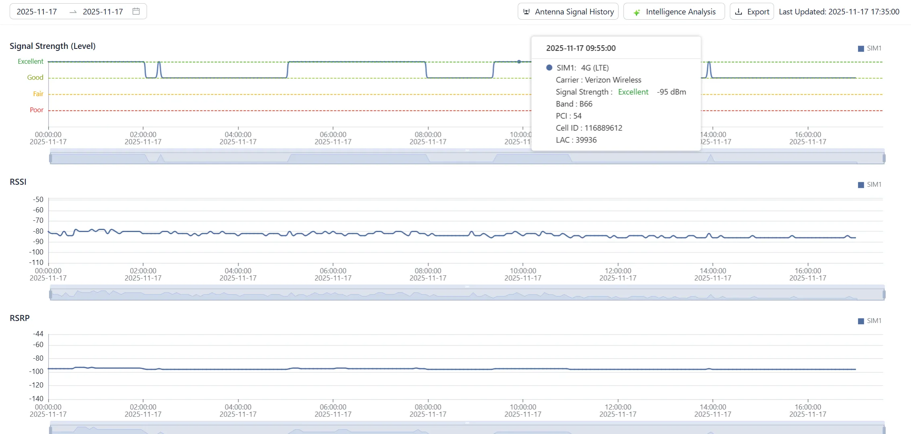

<strong>Fig. 4-12 Cellular Signal (Local)</strong>

**Clients**

The Clients page displays details about each client connected to the ODU2002, such as device name, IP address, MAC address, traffic statistics, and online duration.

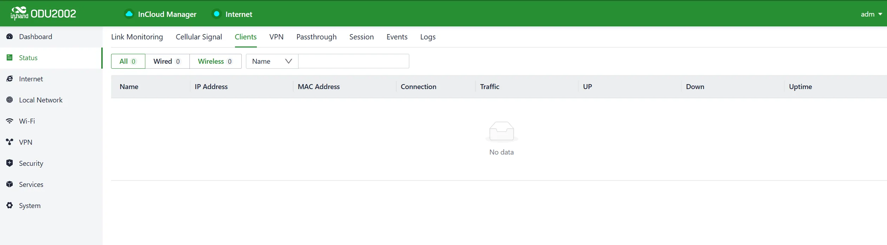

<strong>Fig. 4-13 Clients</strong>

**VPN Status**

Check the status and traffic consumed by VPN tunnels on the VPN page.

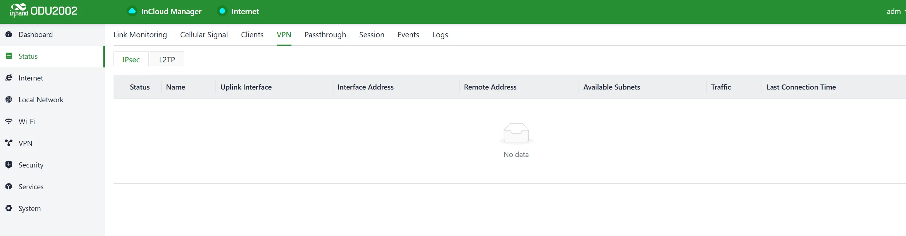

<strong>Fig. 4-14 VPN Status</strong>

 **Passthrough Status**

View detailed information about whether Passthrough has successfully passed the WAN or Cellular address to the terminal.

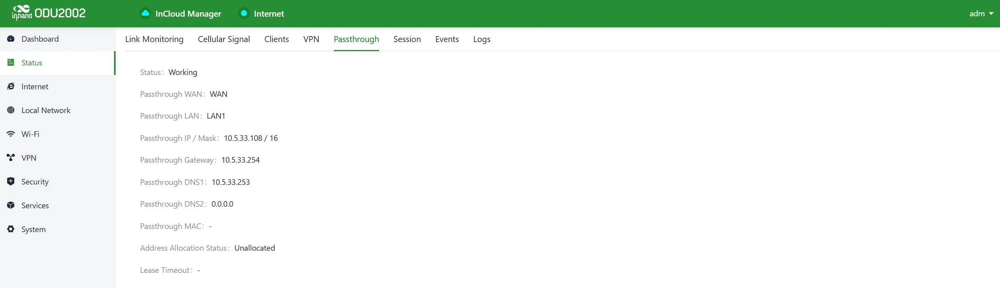

<strong>Fig. 4-15 Passthrough Status</strong>

**Session**

Check whether TCP/ICMP/UDP protocols in the traffic are active on the Session page.

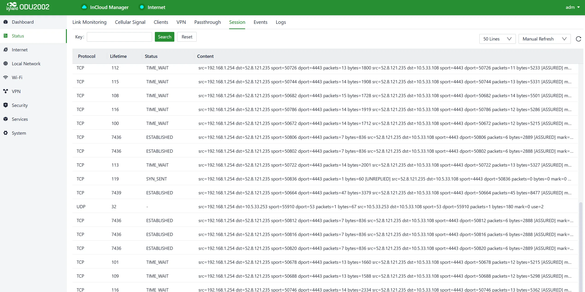

<strong>Fig. 4-16 Firewall Session</strong>

**Events**

ODU2002 records event logs such as user login, configuration changes, link changes, and reboots on the Events page. By selecting start date, end date, and event type, the retrieval scope can be narrowed.

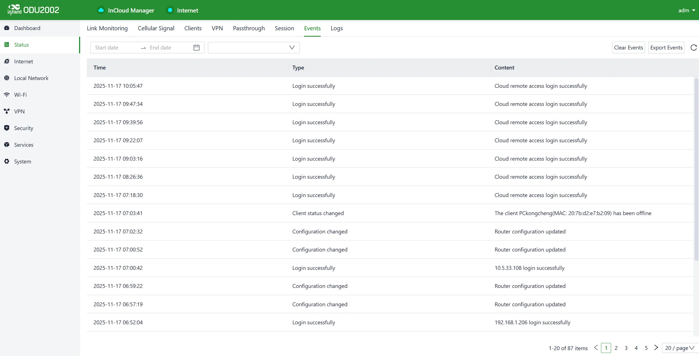

<strong>Fig. 4-17 Events</strong>

**Logs**

Check logs recorded during device operation for troubleshooting.

- Clear Logs: clears current running logs.
- Download Logs: downloads running logs.
- Download Diagnostic Logs: downloads log information for troubleshooting, containing system running logs, device information, and device configuration.

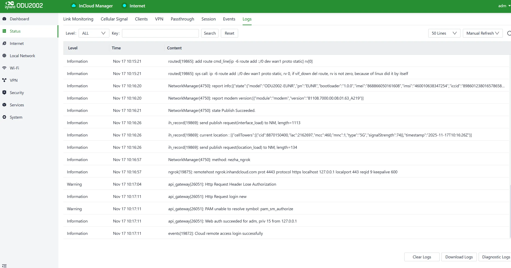

<strong>Fig. 4-18 Logs</strong>

## 4.2 Internet

Click 【Internet】in the left menu to check and configure the uplink interfaces and multi-link work mode of the ODU2002.

> **Caution**: Changing Internet settings may cause network interruption.

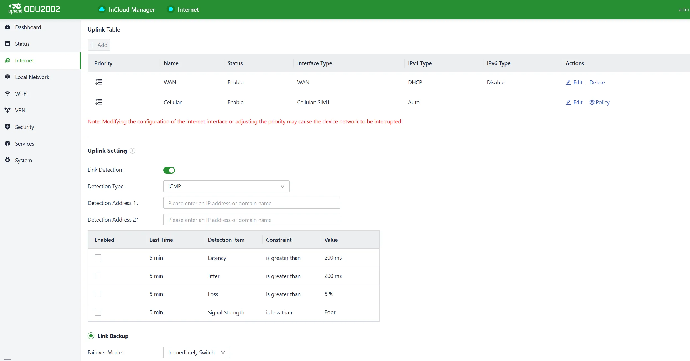

<strong>Fig. 4-19 Uplink Setting</strong>

### 4.2.1 Uplink Table

Check and edit WAN and Cellular interfaces in the Uplink Table. It supports editing the cellular threshold policy on this page and dragging icons in the Priority column to reprioritize the interfaces.

**Notes**:
1. If the WAN interface is deleted on this page, the WAN/LAN2 port will work as LAN.
2. The WAN/LAN2 port will change back to WAN if the WAN interface is added again.
3. When deleting WAN, all configurations on this interface (static routes, inbound/outbound rules, port forwarding, etc.) will be removed.

### 4.2.2 WAN Setting

ODU2002 supports three types of WAN interfaces:

1. **DHCP**: The DHCP service is enabled on the WAN interface by default. The ODU2002 can connect to the Internet immediately if the WAN interface is connected to an upstream network device that enables the DHCP server.
2. **Static IP**: Manually assign an IP address obtained from the carrier or upstream network device.

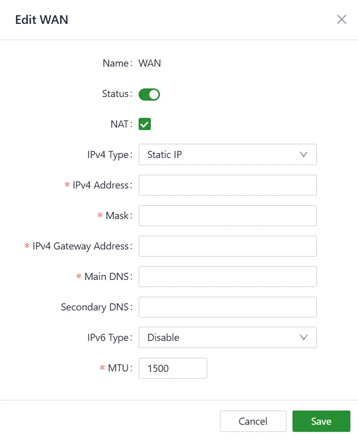

<strong>Fig. 4-20 Static Setting</strong>

3. **PPPoE**: Set the PPPoE service on WAN so that the ODU can dial up to the Internet through the broadband service.

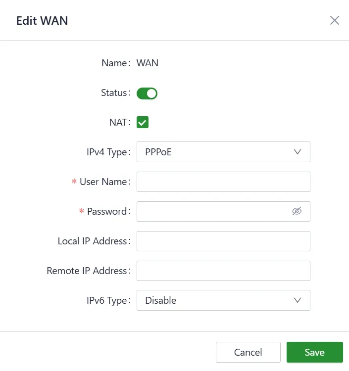

<strong>Fig. 4-21 PPPoE Setting</strong>

### 4.2.3 Cellular Setting

Configure the SIM card operating mode for the Cellular interface. By default, only SIM1 is enabled. After switching to multi-SIM mode, multiple SIM cards are supported. ODU2002 also supports band locking.

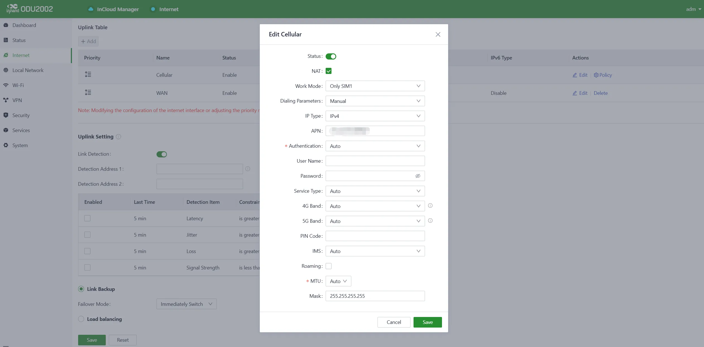

<strong>Fig. 4-22 Cellular Setting</strong>

| Parameter | Description |
|-----------|-------------|
| Status | The enable switch for the cellular interface is turned on by default. Once disabled, all features related to the cellular function will no longer take effect. |
| NAT | Traffic initiated from the internal network to external networks will be forwarded through NAT. Enabled by default. |
| Work Mode | Set the working mode of the SIM card. By default, only SIM1 is used. Users can choose SIM2 only or Dual-SIM mode. Dual-SIM mode supports automatic switching between the two SIM cards. |
| Dialing Parameters | Configure the two APN dialing methods. The default is Automatic; Custom APN is also supported. |
| IP Type | Supports configuring IPv4, IPv6, or IPv4 & IPv6 modes. |
| APN | Enter the APN name. |
| Authentication | Set the APN authentication method. |
| User Name | Enter the APN username for authentication. |
| Password | Enter the APN password for authentication. |
| Service Type | Select the cellular interface service type. The default is Auto; 4G or 4G & 5G can be selected. |
| 4G Band | 4G band lock. Default is All. Users can specify the 4G frequency band here. |
| 5G Band | 5G band lock. Default is All. Users can specify the 5G frequency band here. |
| PIN Code | Mainly used to verify the user's identity. |
| IMS | Convert voice traffic and video data into IP packets. |
| Roaming | Supports cellular roaming across different carriers. |
| MTU | Supports customizing the MTU for the cellular interface. |
| Mask | Supports setting the subnet mask for the cellular interface. |

### 4.2.4 Uplink Setting (Link Detection)

Configure link detection items and optimal forwarding mode for uplink interfaces.

Link detection is enabled by default. In a private network environment, manually configure the address in "Test Connectivity to" or disable the link detection function to prevent the cellular interface from working abnormally.

1. If the detection function is disabled, latency, jitter, packet loss rate, and signal strength will not be displayed on the Status page.
2. If the "Test Connectivity to" address is empty, the system will detect the primary DNS server address obtained by each interface; otherwise, the system will use this address as the detection address for all uplink interfaces.
3. In Link Backup mode, the ODU will monitor enabled items and trigger a link switch when any item exceeds the threshold. If no item is enabled, the link switch will only be triggered based on the priority and connectivity of the links.
4. In Load-balancing mode, the ODU will distribute data traffic to all available links.

## 4.3 Local Network

In the 【Local Network】feature, users can define local subnets, including configuring the address range, VLAN ID, DHCP services, and other related parameters for the local LAN. Once the configuration is complete, apply these settings to the device's LAN port through 【Interface Management】or apply them to the desired SSID in the Wi-Fi settings.

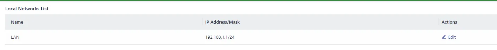

<strong>Fig. 4-23 Local Network</strong>

Click the Edit button on the right to edit LAN IP, enable/disable the DHCP server, and change the range of DHCP addresses.

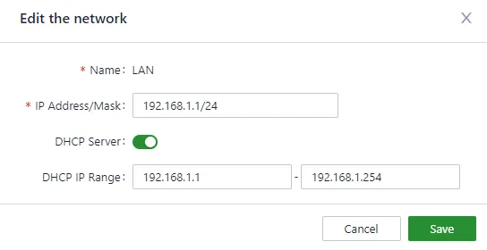

<strong>Fig. 4-24 Edit Network</strong>

| Parameter | Description |
|-----------|-------------|
| Name | Used to identify the network. Users can select this name to apply the network in both 【Wi-Fi】and 【Interface Management】. |
| Mode | Choose whether the current subnet operates in Layer-2 transparent mode or Layer-3 IP mode. The default is "IP mode." |
| VLAN | Allows division of the local network into different virtual logical networks. The default VLAN for all interfaces and Wi-Fi is "default (VLAN1)." |
| IP Address/Subnet Mask | The gateway address for accessing the router through the LAN port or Wi-Fi. The default is "192.168.2.1." |
| DHCP Server | Clients connecting to the router can obtain IP addresses through this function. Enabled by default; the address range is generated based on the "IP Address/Subnet Mask." |

> **Note**:
> - The default local network cannot be deleted. Only the IP address/subnet mask and DHCP server settings can be modified.
> - Once a local network is added, its mode cannot be changed.
> - VLAN Only mode is designed for Layer-2 transparent operation and does not require configuration of IP address/subnet mask or DHCP server settings.

## 4.4 Wi-Fi

Configure the ODU2002 to serve as a Wi-Fi AP to provide SSID for wireless network access.

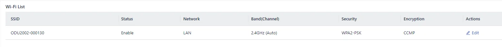

<strong>Fig. 4-25 Wi-Fi Configuration</strong>

Click the Edit button on the right to configure SSID, password, and other parameters.

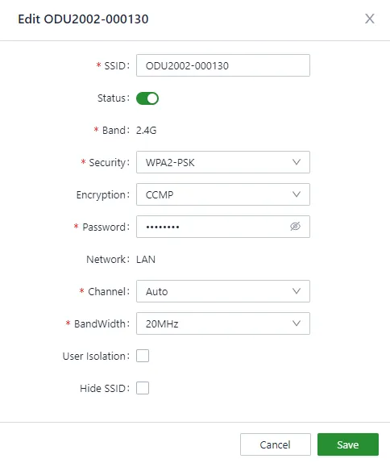

<strong>Fig. 4-26 Edit Wi-Fi</strong>

## 4.5 VPN

VPN establishes a private network on the public network for encrypted communication. A VPN router enables remote access by encrypting data packets and converting the destination address of data packets. Compared with traditional DDN private lines or frame relay, VPN provides a more secure and convenient remote access solution.

### 4.5.1 IPSec VPN

IPsec is a group of open network security protocols developed by IETF. At the IP layer, data source authentication, data encryption, data integrity, and anti-replay functions are used to ensure the security of data transmission between communication parties on the Internet.

On the IPSec VPN page, click the Add button on the left to build a new IPSec tunnel.

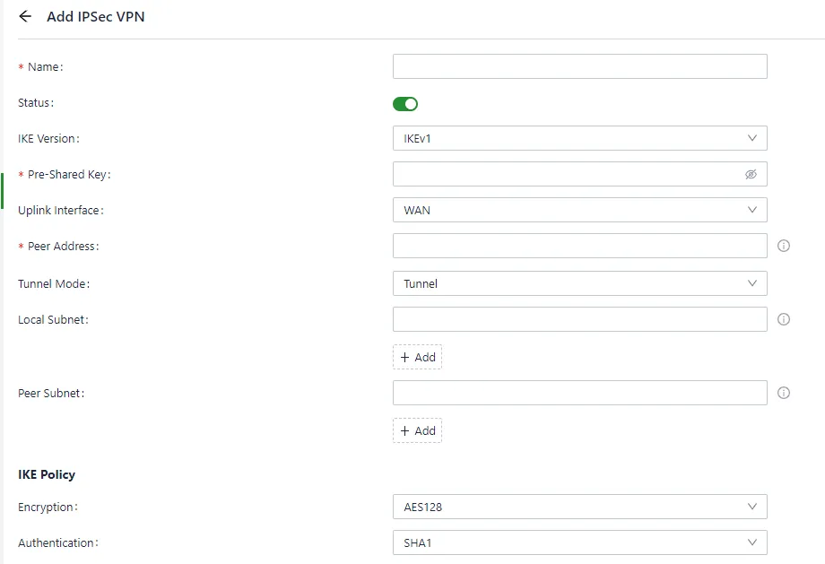

<strong>Fig. 4-27 IPSec Tunnel</strong>

The following parameters must be set in the IPSec tunnel:

| Parameter | Description |
|-----------|-------------|
| Name | Specifies the name of the IPSec VPN created on the device, used for local VPN management. |
| IKE Version | Specifies the version of the IKE protocol used on the ODU (IKEv1 or IKEv2). |
| Pre-Shared Key | Specifies the authentication key for IKE negotiation, which must be consistent on both sides. |
| Uplink Interface | Specifies the local uplink interface used to establish the IPSec VPN tunnel. |
| Peer Address | Specifies the IP address of the peer device. **Note**: Set to 0.0.0.0 if working as an IPSec server. |
| Tunnel Mode | Specifies the IP packet encapsulation mode (tunnel mode or transmission mode). |
| Local Subnet | Specifies the IP address segment of traffic to be sent through the IPSec VPN tunnel. |
| Peer Subnet | Specifies the IP address segment used for communication on the other end of the IPSec VPN tunnel. |

**IKE Policy**:

| Parameter | Description |
|-----------|-------------|
| Encryption | Specifies the encryption algorithm for IKE. |
| Authentication | Specifies the authentication algorithm for IKE. |
| DH Groups | Specifies the DH key exchange mode. |
| Lifetime | Specifies the lifetime of the IKE SA. Default is 86400 seconds. |

**IPSec Policy**:

| Parameter | Description |
|-----------|-------------|
| Security Protocol | Specifies the security protocol used for ESP. |
| Encryption | Specifies the encryption algorithm of the ESP protocol. |
| Authentication | Specifies the authentication algorithm for ESP. |
| PFS Groups | Specifies the Perfect Forward Secrecy (PFS) mode, which improves communication security through an additional key exchange in Phase 2 negotiation. |
| Lifetime | Specifies the lifetime of the IPSec SA. Default is 86400 seconds. |

### 4.5.2 L2TP VPN

Layer 2 Tunneling Protocol (L2TP) is a tunneling protocol for virtual private dial networks (VPDNs). This protocol establishes a tunnel from a remote site to the headquarters of an enterprise over a public network through PPP negotiation.

**L2TP Server**

Generally, an L2TP server is deployed at the headquarters of an enterprise to provide remote access for employees. On the VPN page, choose L2TP VPN > Server to display the L2TP server configuration.

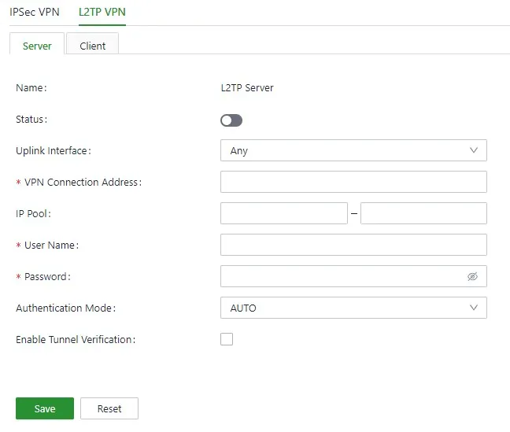

<strong>Fig. 4-28 L2TP Server</strong>

| Parameter | Description |
|-----------|-------------|
| Name | The name of the L2TP server. Cannot be changed. |
| Status | Enable or disable the L2TP server. Disabled by default. |
| Uplink Interface | Specifies the uplink interface used to establish a tunnel from the L2TP server. |
| VPN Connection Address | Specifies the gateway address for the L2TP client. |
| IP Pool | The system assigns an IP address to the L2TP client from the specified IP address pool. |
| User Name/Password | Specifies the user name and password for L2TP negotiation, which must be consistent on both ends of the tunnel. |
| Authentication Mode | Specifies the authentication mode for the L2TP tunnel. |
| Enable Tunnel Authentication | Ensure both ends of the tunnel are configured with the same user name and password if this option is enabled. |

**L2TP Client**

Click the Add button on the left to configure L2TP client parameters and establish a tunnel with a remote L2TP server.

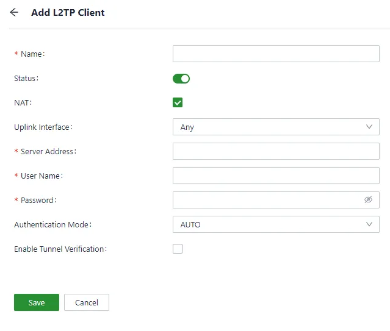

<strong>Fig. 4-29 L2TP Client</strong>

| Parameter | Description |
|-----------|-------------|
| Name | Specifies the local name of the L2TP client tunnel. |
| Status | Enable or disable the L2TP client tunnel. |
| NAT | Enable or disable NAT for packets forwarded by the ODU for the LAN device. |
| Uplink Interface | Specifies the uplink interface used to establish the L2TP tunnel. |
| Server Address | Specifies the IP address used by the remote L2TP server. |
| User Name/Password | Specifies the user name and password for L2TP negotiation, which must be consistent on both ends of the tunnel. |
| Authentication Mode | Specifies the authentication mode for the L2TP tunnel. |
| Enable Tunnel Verification | Ensure both ends of the tunnel are configured with the same server name and verification key if this option is enabled. |

## 4.6 Security

In the 【Security】menu, advanced features related to firewalls, policy routing, and traffic shaping can be configured.

### 4.6.1 Firewall

The firewall includes functions such as inbound rules, outbound rules, port forwarding, and MAC address filtering.

 **Inbound/Outbound Rules**

Set rules to control data traffic based on interface.

- **Outbound rules**: Inside network access to outside network. Allows all data by default.
- **Inbound rules**: Outside network access to inside network. Forbids all data by default.

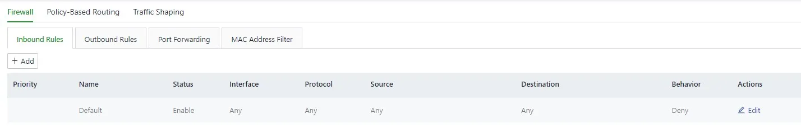

<strong>Fig. 4-30 Firewall Rules</strong>

Click the Add button on the left to add a new rule.

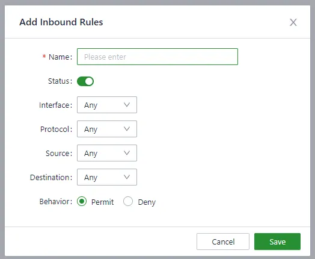

<strong>Fig. 4-31 Add Firewall Rule</strong>

| Parameter | Description |
|-----------|-------------|
| Name | Sets the name of the inbound/outbound rule for local identification. |
| Status | Rule function switch. |
| Interface | For outbound rules, specifies the upstream interface where traffic leaves the router. For inbound rules, specifies the upstream interface where traffic enters the router. |
| Protocol | Matches traffic based on protocol type (Any, TCP, UDP, ICMP, or custom). |
| Source | Matches the source address for traffic. Default is Any. |
| Destination | Matches the destination address for traffic. Default is Any. |
| Action | Action taken for matching traffic (allow or deny). |

**Port Forwarding**

When the outside network accesses specific ports of the ODU, the system transfers this data to corresponding ports of an internal device according to port forwarding rules. This makes services deployed in LAN available from the public network.

For example, after setting a port forwarding rule, when users from the public network access the ODU's port 2000 on WAN, the system transfers the request to 192.168.1.23:8080 in LAN.

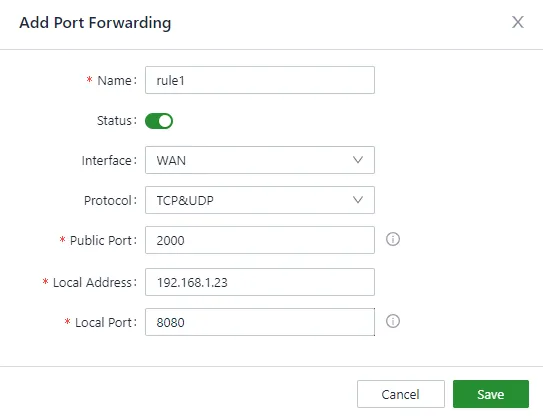

<strong>Fig. 4-32 Port Forwarding Example</strong>

| Parameter | Description |
|-----------|-------------|
| Name | Sets the local identifier of the port forwarding rule. |
| Status | Enables or disables the port forwarding rule. |
| Interface | Sets the uplink interface that provides port mapping for internal clients. This interface must have a public IP address. |
| Protocol | Sets the protocol type to which port mapping is applied (TCP, UDP, or TCP&UDP). |
| Public Port | Sets the protocol port on the uplink interface to be mapped. |
| Local Address | Sets the IP address of the target client that external users need to access. |
| Local Port | Sets the protocol port that external users need to access on the target client. |

**MAC Address Filter**

Configure MAC address filter rules for LAN devices to allow or forbid LAN devices to access the Internet.

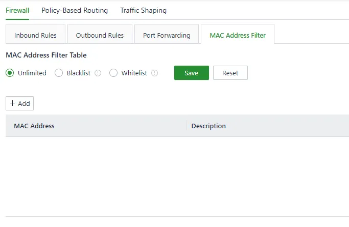

<strong>Fig. 4-33 MAC Address Filter</strong>

- **Blacklist**: Devices in the blacklist will not be able to access the Internet.
- **Whitelist**: Only devices in the whitelist are allowed to access the Internet.

### 4.6.2 Policy-Based Routing

Policy-based routing (PBR) allows the ODU to forward different data flows through different links based on configured policies. This enables flexible route selection and control, improving link utilization. Choose 【Security】→【Policy-based Routing】and click Add to add a PBR rule.

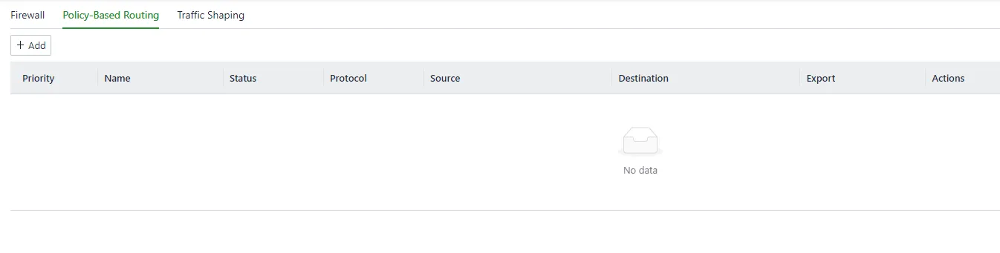

<strong>Fig. 4-34 PBR List</strong>

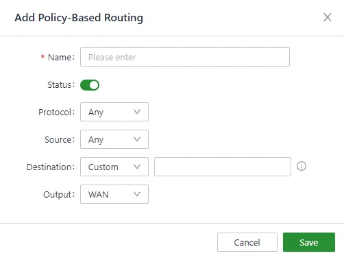

<strong>Fig. 4-35 Add PBR Rule</strong>

> **Note**: The source and destination addresses of the PBR cannot be set as Any at the same time.

### 4.6.3 Traffic Shaping

Create shaping policies to apply per-user controls on a per-protocol basis to optimize the network. This function can reduce bandwidth for recreational traffic and prioritize bandwidth for critical business traffic.

Choose 【Security】→【Traffic Shaping】and click Edit to modify the bandwidth of the uplink interfaces.

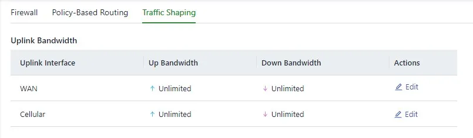

<strong>Fig. 4-36 Traffic Shaping</strong>

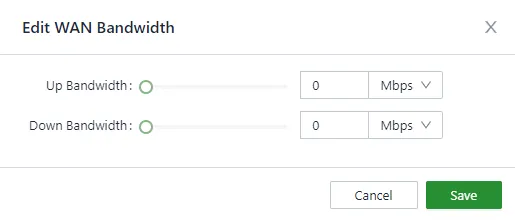

<strong>Fig. 4-37 Edit Bandwidth</strong>

Click Add to create a new traffic shaping rule. Traffic shaping policies consist of a series of rules performed in order. Each rule has two main components: the type of traffic to be limited or shaped (rule definition), and how that traffic should be limited or shaped (rule actions).

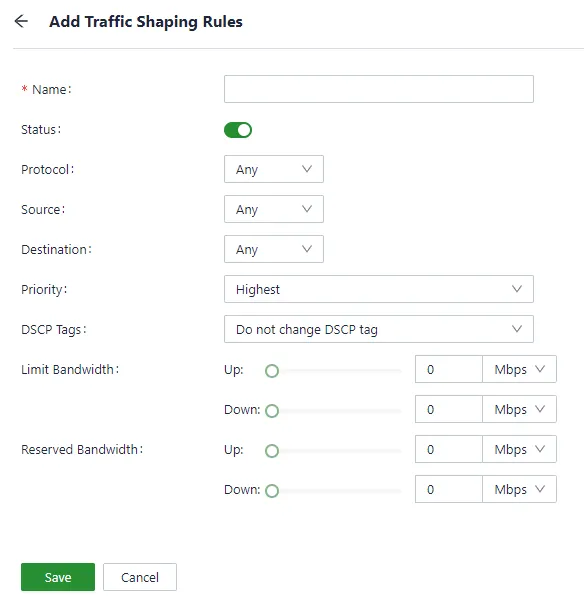

<strong>Fig. 4-38 Add Shaping Rule</strong>

> **Note**:
> - Traffic forwarding priority for unmatched rules is medium.
> - When Limit Bandwidth is set to 0, the system will not limit the bandwidth.
> - The value of Reserved Bandwidth should not be greater than the Limit Bandwidth.

## 4.7 Services

### 4.7.1 DHCP Server

DHCP implements dynamic IP address allocation in a client/server model. The LAN device sends a request to the ODU, and the ODU replies with an IP address assigned to the client.

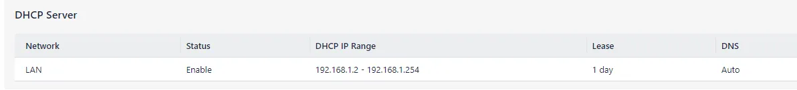

<strong>Fig. 4-39 DHCP Server</strong>

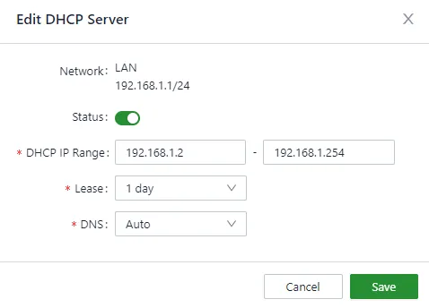

<strong>Fig. 4-40 Edit DHCP Server</strong>

### 4.7.2 DNS Server

Set the global DNS server for the ODU. The system will use the DNS server on this page if the original DNS server from the uplink interface cannot work.

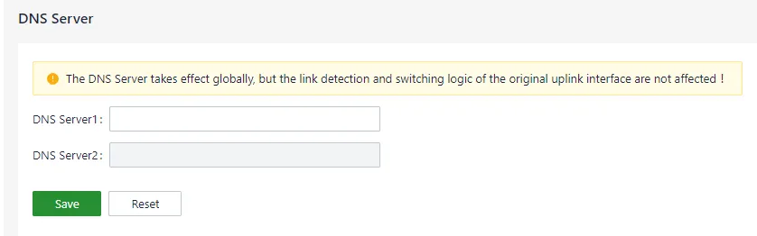

<strong>Fig. 4-41 DNS Server</strong>

### 4.7.3 Fixed Address List

The ODU can distribute IP addresses based on a client device's MAC address by using the fixed address list. The distributed IP address must be within the range of the local network.

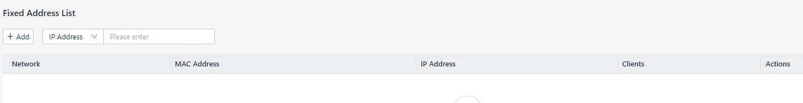

<strong>Fig. 4-42 Fixed Address List</strong>

### 4.7.4 Static Routes

Configure static routes to forward data by a specific route or interface. This list only displays rules created by the user and does not show routes created automatically after modifying WAN or LAN interfaces.

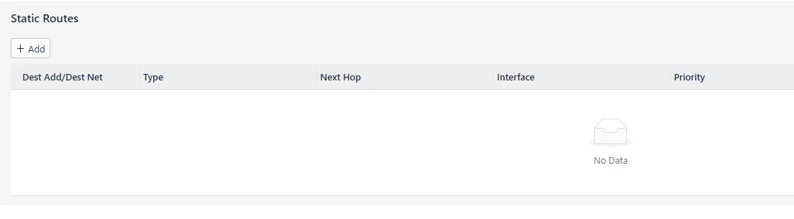

<strong>Fig. 4-43 Static Routes</strong>

> **Note**: Static routes to the same destination IP address or network cannot have the same next-hop address, outbound interface, or priority.

### 4.7.5 Passthrough Settings

Configure IP passthrough to transparently forward data from an uplink interface to one client device.

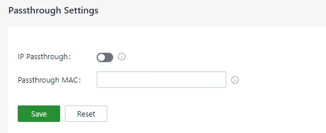

<strong>Fig. 4-44 Passthrough Settings</strong>

> **Note**:
> - After IP Passthrough mode is enabled, only one client can access the Internet.
> - Static routing, VPN, Port Forwarding, and Policy-Based Routing functions will not work.
> - The inbound rule needs to be released when accessing the client device.

## 4.8 System

### 4.8.1 Change the Password

The default username and password of the ODU are printed on the product nameplate. Change the password for security after the first login. Click "adm" at the top right of the web page, then click "Modify Password" in the menu.

<strong>Fig. 4-45 Change Password Menu</strong>

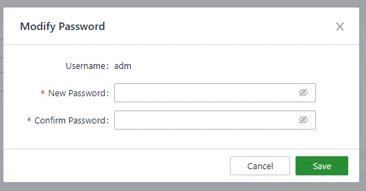

<strong>Fig. 4-46 Change Password Form</strong>

### 4.8.2 Cloud Management

InCloud Manager (star.inhandcloud.com) is a cloud platform developed by InHand to help enterprises accelerate network deployment, simplify network maintenance, and improve service experience. This platform provides zero-touch deployment, intelligent maintenance, and security features.

The ODU connects to InCloud Manager automatically. Users can select which InHand platform to connect to on this page, and also disable InCloud Manager here.

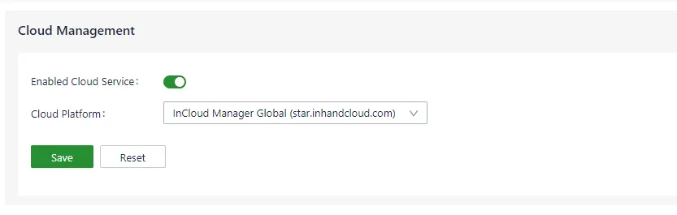

<strong>Fig. 4-47 Cloud Management</strong>

### 4.8.3 Remote Access Control

Users can allow or forbid public network access to the ODU and specify which ports are accessible from the public network on this page. The rules on this page do not influence LAN device access to the ODU. The ODU supports HTTPS when accessing its web configuration page.

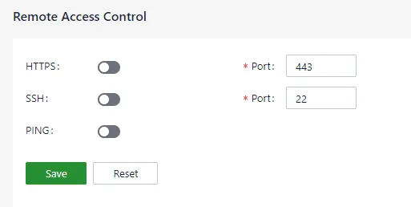

<strong>Fig. 4-48 Remote Access Control</strong>

### 4.8.4 System Clock

Select a time zone for the system and enable the NTP server to synchronize time with the target NTP server.

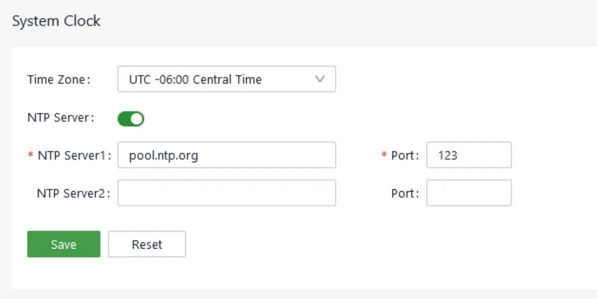

<strong>Fig. 4-49 System Clock</strong>

### 4.8.5 Device Options

Reboot, upgrade firmware, or reset the ODU to default factory settings on this page.

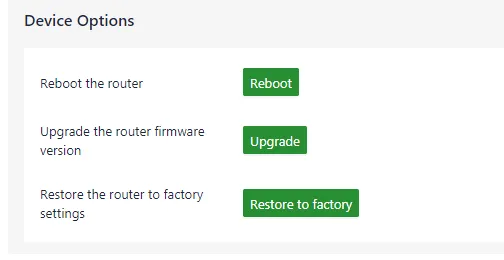

<strong>Fig. 4-50 Device Options</strong>

> **Note**:
> - Before upgrading firmware, ensure the new firmware is obtained from an official source.
> - If the ODU is connected to InCloud Manager, the platform will synchronize settings before restoring to factory settings. The ODU will only clear historical data.

### 4.8.6 Configuration Management

Users can export system configuration to a local PC as a backup, and import the configuration to the device to restore the configuration.

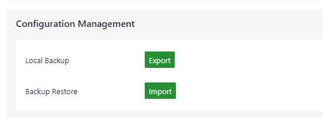

<strong>Fig. 4-51 Configuration Management</strong>

### 4.8.7 Device Alarms

When users need to pay attention to certain events that may occur on the device, corresponding alarm events can be selected and an email address can be set for alarm emails. The ODU will send an alarm if a selected event occurs; unselected events are recorded in the log.

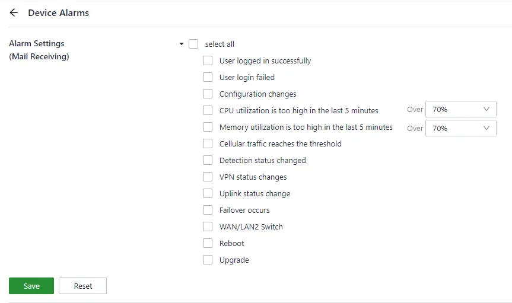

<strong>Fig. 4-52 Alarm Events</strong>

After configuring the mail server address, port, username, and password, the ODU will send alarm emails through this email. Configure the Receiving Email Address and send a test email to verify the configuration.

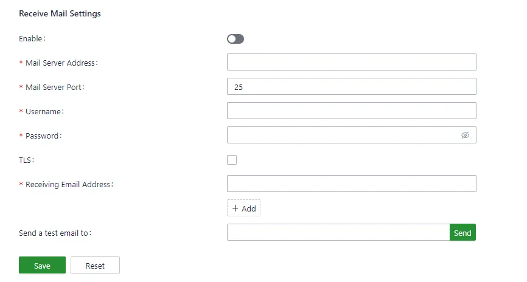

<strong>Fig. 4-53 Alarm Email Configuration</strong>

### 4.8.8 Tools

**Ping**

Use the ICMP protocol to check connectivity between the source address (the ODU itself if Source is blank) and another IP address or domain name in Target.

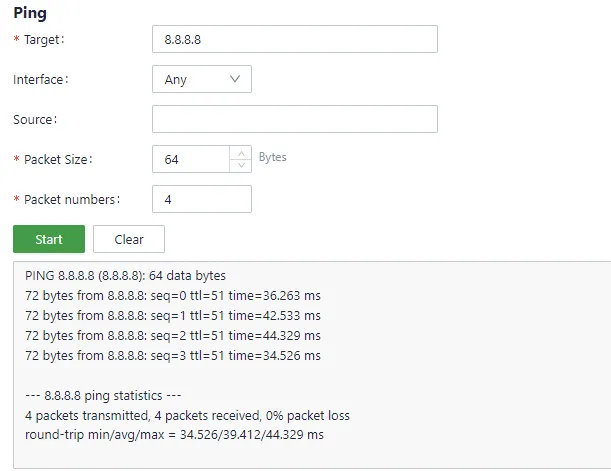

<strong>Fig. 4-54 Ping Tool</strong>

**Traceroute**

Enter the target IP address or domain name, select the interface, and click "Start" to test and trace the link situation from the ODU to the target.

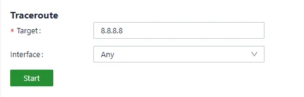

<strong>Fig. 4-55 Traceroute</strong>

**Capture**

Use this feature to capture data forwarded through specified interfaces. By selecting options in the Output drop-down list, information about captured data packets can be viewed or exported to a PC.

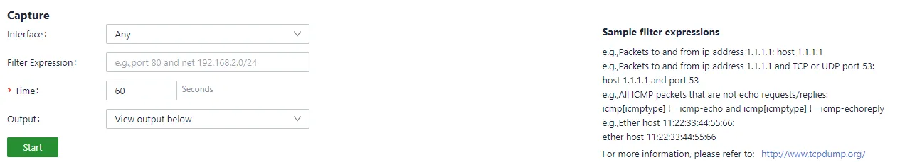

<strong>Fig. 4-56 Packet Capture</strong>

### 4.8.9 Log Server

Set a remote log server and the ODU will upload system logs to this remote log server.

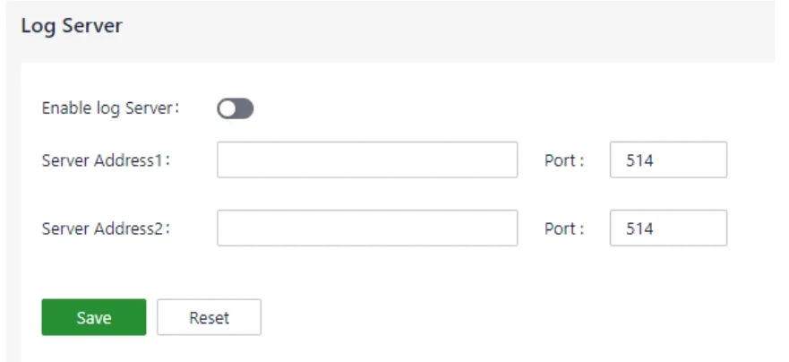

<strong>Fig. 4-57 Log Server</strong>

### 4.8.10 Other Settings

Set web login timeout, enable or disable accelerated forwarding, and configure other system settings on this page.

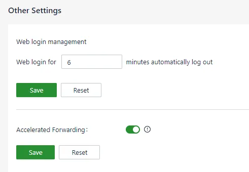

<strong>Fig. 4-58 Other Settings</strong>

> **Note**: Cellular forwarding speed will be significantly increased after enabling Accelerated Forwarding, but other functions such as traffic shaping or IPSec will not take effect.

---

# Chapter 5: Typical Application

## 5.1 Case 1: Enterprise Branch 5G Network Deployment

**Scenario Description**: A retail chain enterprise needs to rapidly deploy reliable Internet connectivity at a new branch location where fixed broadband installation is delayed or unavailable. The ODU2002 provides immediate 5G connectivity and cloud-based management.

**Device Role**: The ODU2002 acts as the edge gateway, providing 5G Internet uplink, local LAN/Wi-Fi access for POS terminals and office PCs, and secure VPN tunneling to the headquarters data center.

**Configuration Steps**:
1. Install the ODU2002 outdoors with a clear line of sight to the cellular base station. Mount using the wall-mount or pole-mount bracket.
2. Insert the operator SIM card and attach all cellular, Wi-Fi, and GNSS antennas.
3. Connect the PoE LAN1 port to a local switch or directly to a PC for initial configuration.
4. Power on the device and verify that the System LED turns steady green and the Cellular LED turns steady green (5G) or blue (4G).
5. Log in to the web interface at `192.168.1.1` and verify cellular connectivity in 【Dashboard】→【Interface Status】.
6. Register the device on InCloud Manager (star.inhandcloud.com) using the serial number and MAC address.
7. (Optional) Configure an IPSec VPN tunnel in 【VPN】→【IPSec VPN】to encrypt traffic to the headquarters.
8. (Optional) Configure Wi-Fi SSID and local network parameters in 【Local Network】and 【Wi-Fi】.

**Reference Chapters**:
- [Installation and First Use](#chapter-2-installation-and-first-use)
- [Cellular Internet Access](#31-cellular-internet-access)
- [Cloud Platform Management](#33-cloud-platform-management)
- [VPN](#45-vpn)
- [Local Network](#43-local-network)
- [Wi-Fi](#44-wi-fi)

---

# Appendix A: Troubleshooting

## A.1 Network Connection Issues

| Symptom | Possible Cause | Troubleshooting Steps | Reference Chapter |
|---------|----------------|----------------------|-------------------|
| Cannot connect to cellular network | SIM card not inserted or poor contact | 1. Check if the SIM card is correctly inserted 2. Re-insert the SIM card | [SIM Card Installation](#221-install-the-sim-card) |
| Cannot connect to cellular network | APN parameter configuration error | 1. Verify APN parameters match operator requirements 2. Contact the operator for correct APN | [Cellular Setting](#423-cellular-setting) |
| Cannot connect to cellular network | Weak or no signal | 1. Check antenna connections 2. Adjust device position or direction | [Attach Antennas](#222-attach-antennas) |
| Cannot connect to cellular network | Data plan inactive or exceeded | 1. Verify the SIM card data plan status with the operator | - |
| Cannot connect to WAN network | Upstream DHCP server unavailable | 1. Verify upstream network device status 2. Switch to static IP configuration | [WAN Setting](#422-wan-setting) |
| Cannot connect to WAN network | Firewall rules blocking traffic | 1. Check inbound/outbound rules 2. Check MAC address filtering | [Firewall](#461-firewall) |
| Slow or unstable speeds | Weak cellular signal | 1. Check signal strength on Dashboard 2. Reposition the device | [Cellular Signal](#413-cellular-signal) |
| Slow or unstable speeds | Outdated firmware | 1. Check current firmware version 2. Upgrade to the latest official firmware | [Device Options](#485-device-options) |

## A.2 Web Access Issues

| Symptom | Possible Cause | Troubleshooting Steps | Reference Chapter |
|---------|----------------|----------------------|-------------------|
| Cannot open web interface | PC IP address incorrect | 1. Confirm the PC and device are in the same subnet 2. Check the device default IP address | [Access the Web Management Interface](#229-access-the-web-management-interface) |
| Cannot open web interface | Browser compatibility issue | 1. Change browser (Chrome recommended) 2. Clear browser cache | [Access the Web Management Interface](#229-access-the-web-management-interface) |
| Cannot open web interface | HTTPS disabled or port blocked | 1. Verify remote access control settings 2. Try HTTP if HTTPS is disabled | [Remote Access Control](#483-remote-access-control) |

## A.3 Cloud Management Issues

| Symptom | Possible Cause | Troubleshooting Steps | Reference Chapter |
|---------|----------------|----------------------|-------------------|
| Device offline on platform | Device has no Internet access | 1. Verify cellular or WAN connection is active 2. Check interface status on Dashboard | [Common Scenario Configuration](#chapter-3-common-scenario-configuration) |
| Device offline on platform | Incorrect serial number or MAC | 1. Re-check the serial number and MAC address on the nameplate 2. Re-add the device to the platform | [Add Device to the Platform](#332-add-device-to-the-platform) |
| Cannot restore factory settings remotely | Device unreachable | 1. Verify the device is online 2. Perform hardware reset locally | [Restoring Factory Settings](#15-restoring-factory-settings) |

---

# Appendix B: Safety Precautions

1. The device must be used within the specified temperature and humidity ranges.
2. Do not install or use the device in flammable or explosive environments.
3. Before connecting power, confirm that the voltage complies with the device specifications (IEEE 802.3af PoE, 50V/0.3A).
4. Ensure the waterproof PG head and SIM card cover gasket are properly installed to prevent water ingress.
5. The grounding wire must be securely connected to a proper earth ground before powering on.
6. Do not disassemble the device housing. There are no user-serviceable parts inside.

> **Warning**: Non-professionals should not open the device housing. Risk of electric shock.

---

# FAQ

## Question 1: Unable to Connect to 4G/5G Network?

1. **Physical Environment**: Check if the SIM card is inserted into the correct slot and ensure all cellular antennas are properly installed.
2. **APN Settings**: Ensure the APN configuration matches the information provided by the service provider.
3. **Device Connectivity**: Log in to the device's local interface and use the built-in ICMP tool to ping `8.8.8.8` to test connectivity. If it connects, check connectivity between the client device (e.g., computer or smartphone) and the router.
4. **SIM Card Verification**: Remove the SIM card and insert it into a phone to verify it can connect to the Internet.
5. **Restart**: Power off the router, wait a few seconds, and reconnect power to retry the network connection.
6. **Factory Reset**: Perform a factory reset on the router and attempt to connect again.

If the issue cannot be resolved using the above steps, contact InHand Networks technical support. Visit [www.inhandnetworks.com](http://www.inhandnetworks.com) for more information.

## Question 2: Is the Cloud Platform Free of Charge?

InHand Networks provides high-quality network services for small and medium-sized chain organizations. When users utilize cloud platform services, a license must be purchased for each device to access the extensive cloud-based features. When a device is added for the first time, it comes with a complimentary 1-year Essential license. Users can renew licenses as needed.

## Question 3: How to Add Devices to the Cloud Platform?

1. Register for an InCloud Manager account at [https://star.inhandcloud.com](https://star.inhandcloud.com).
2. Log in to the cloud platform with the registered account. Under the 【Devices】menu, click "Add" and follow the prompts to enter the device's serial number and MAC address. This completes the device addition process. A 1-year Essential license is included when a device is added for the first time.

## Question 4: Is It Possible to Use the Device Without the Cloud Platform?

Yes. Users can complete the majority of configuration tasks locally through the web interface. However, for features such as bulk configuration deployment, firmware upgrades, SD-WAN, and Connector remote maintenance, the cloud platform is required.

If any other problems are encountered, contact InHand Networks for technical support. Visit [www.inhandnetworks.com](http://www.inhandnetworks.com) for more information.
