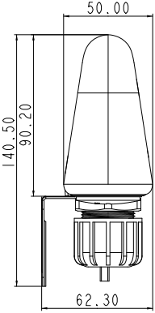
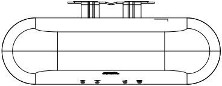
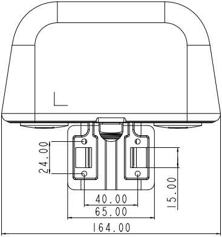

  

    

      
    

    

      All-in-One. No External Antenna.
    

  

  

    

      ODU302 4G Industrial Outdoor Router
    

    

      

        
· 4G LTE

        
· All-in-One

      

      

        
· Outdoor IP65

        
· Link Backup

      

    

  

# 1. Product Overview

The ODU302 is a fully integrated 4G industrial outdoor router that combines a high-performance router and high-gain antennas in one IP65 enclosure. Designed for ATMs, EV chargers, vending machines, and outdoor control cabinets, it mounts directly on top of equipment — eliminating the need for indoor routers, long coax feeders, and separate outdoor antennas. The ODU302 simplifies installation to a single Ethernet cable with PoE support, delivering enterprise-grade connectivity with minimal deployment complexity.

## Key Features

| Value Dimension | Description |
| :--- | :--- |
| **Router + Antenna Integrated** | One SKU, one top-mount installation — no separate outdoor antenna to source or match |
| **Zero Feeder Loss** | RF module adjacent to the antenna eliminates coax attenuation for stronger 4G signal |
| **PoE Single-Cable** | IEEE 802.3af PoE input delivers power and data over one Ethernet cable; DC 9–36 V also available |
| **Dual SIM 4G LTE Redundancy** | Dual Nano SIM failover with intelligent switching for 24/7 uptime |
| **Enterprise Security** | SPI firewall, ACL, IPsec, OpenVPN, WireGuard, ZeroTier |
| **Cloud-Managed** | InHand Device Manager for remote monitoring, configuration, and OTA firmware upgrades |
| **Built for Outdoors** | IP65 protection, -20 °C ~ +70 °C operating range |

## Typical Application Scenarios

### Financial Self-Service (ATM)
Limited cabinet space and long feeder runs degrade 4G signal. The ODU302 top-mount design frees the cabinet interior and delivers zero-feeder-loss RF performance for more stable transactions.

### Smart Energy (EV Charging)
Outdoor exposure, waterproof wiring, and harsh climate are constant challenges. IP65 + wide-temp rating, PoE single-cable design, and Device Manager fleet ops keep charging networks online.

### Self-Service Retail (Vending)
Fast rollout, vandal-resistant placement, and minimal internal cable clutter. One integrated unit means no separate outdoor antenna sourcing and reduced in-cabinet wiring.

### Industrial Control (Outdoor Cabinets)
Multiple penetrations for power, Ethernet, and coax create sealing complexity. The ODU302 needs only one Ethernet drop into the cabinet, plus 2× configurable digital I/O for signal acquisition and control.

## Product Dimensions

  

    
    
Front View

  

  

    
    
Side View

  

  

    
    
Bottom View

  

  

    
    
Back View

  

  

    
Notes:

    
1. All dimensions are in millimeters (mm), with inches (in) in parentheses.

    
2. Dimensions (L × W × H): 164 × 50 × 129.7 mm (6.46 × 1.97 × 5.11 in).

    
3. All dimensions are approximate and for reference only.

    
4. Drawings must not be used for manufacturing.

    
5. Specifications may change without prior notice.

  

# 2. Product Innovations

## Innovation 1: Router + Antenna in One Top-Mount Unit
The router is built directly into the antenna enclosure and installs on top of ATMs, EV chargers, and control cabinets. No separate outdoor antenna to source or match. No wall penetrations for feeder cable. One SKU, one mount — dramatically reducing on-site labor and system integration complexity.

## Innovation 2: Zero Feeder Loss, Stronger Signal
With the RF module and antenna integrated as one, the signal travels with zero feeder attenuation — a major advantage on high LTE bands where coax loss is significant. You also eliminate the cost and sourcing effort of a separate outdoor-rated antenna, since the ODU302 ships with optimized built-in antennas and IP65 protection.

## Innovation 3: PoE Single-Cable Deployment
The ODU302 accepts IEEE 802.3af PoE input. From the top-mounted unit to the cabinet interior, only one Ethernet cable is needed for both power and data. The wiring bundle shrinks from "power + Ethernet + feeder" down to a single drop. DC 9–36 V terminal input is also available as an alternative.

## Innovation 4: Built for Demanding Outdoor Environments
The IP65 enclosure is rated against dust ingress and high-pressure water jets, with an operating temperature range of -20 °C to +70 °C. Tested to IEC 60068-2-27 shock, IEC 60068-2-6 vibration, and EN 61000-4-x EMC Level 2. The unit installs directly on top of the equipment with full outdoor exposure — no extra hood required for standard rain and dust.

## Innovation 5: Proven IR302 Software Platform
ODU302 runs the same software stack as the field-proven InRouter302. Dual-SIM failover, enterprise firewall, VPN, link backup, digital I/O, and InHand Device Manager cloud management — all carried over with zero learning curve. Existing IR302 customers can migrate their configurations and workflows seamlessly.

# 3. Hardware Specifications

## 3.1 Hardware Overview

| Parameter | Specification |
| :--- | :--- |
| **Processor** | 580 MHz |
| **Memory** | 128 MB DDR2 SDRAM |
| **Storage** | 32 MB SPI NOR Flash |
| **4G Module** | 4G LTE Cat.4, DL 150 Mbps / UL 50 Mbps |
| **Recommended Users** | 32 |
| **Ethernet Ports** | 2 × 10/100 Mbps RJ45, WAN/LAN switchable. LAN2 supports PoE |
| **SIM Slots** | 2 × Nano SIM (drawer-style), dual SIM failover |
| **Digital I/O** | 2 × configurable DI or DO |
| **4G Antennas** | 2 × built-in 4G antennas (ANT_4G_1, ANT_4G_2) |
| **Wi-Fi Antennas** | 1 × built-in Wi-Fi antenna |
| **Wi-Fi** | IEEE 802.11 b/g/n (Wi-Fi 4), 2.4 GHz, up to 150 Mbps |
| **Wi-Fi TX Power** | 802.11b: 16 dBm ± 2 dBm (11 Mbps) 802.11g: 16 dBm ± 2 dBm (54 Mbps) 802.11n@2.4 GHz HT20 MCS7: 16 dBm ± 2 dBm 802.11n@2.4 GHz HT40 MCS7: 16 dBm ± 2 dBm |
| **LED Indicators** | System, Wi-Fi, Cellular, Ethernet |
| **Reset Button** | Pinhole reset button |
| **Power Supply** | DC 9–36 V (4-pin 2×2 combined power & I/O terminal, over-current / reverse-polarity protected) IEEE 802.3af PoE input (Mode A or Mode B) |
| **Standby Power** | 90~110 mA @ 12 V |
| **Operating Power** | 280~300 mA @ 12 V |
| **Peak Power** | 340~360 mA @ 12 V |
| **Protection Rating** | IP65 |
| **Enclosure Material** | Industrial-grade plastic |
| **Operating Temperature** | -20 °C ~ +70 °C (-4 °F ~ +158 °F) |
| **Storage Temperature** | -40 °C ~ +85 °C (-40 °F ~ +185 °F) |
| **Relative Humidity** | 5% ~ 95%, non-condensing |
| **Dimensions** | 164 × 50 × 129.7 mm (6.46 × 1.97 × 5.11 in) |
| **Weight** | Approx. 500 g (1.10 lb) |
| **Mounting** | Wall, pole, top-mount |

## 3.2 Interface Overview

### RJ45 Ports

| Port | Default | Description |
| :---: | :---: | :--- |
| WAN/LAN1 (Left) | WAN/LAN | 10/100 Mbps, software switchable |
| LAN2 (Middle) | LAN | 10/100 Mbps, PoE PD (Powered Device), accepts power on data pairs (1/2, 3/6) for Mode A, or on spare pairs (4/5, 7/8) for Mode B. IEEE 802.3af compliant |

### SIM Card Slots

| Slot | Description |
| :---: | :--- |
| SIM1 (Top) | Primary SIM card (Nano SIM, drawer-style) |
| SIM2 (Bottom) | Backup SIM card (Nano SIM, drawer-style) |

### Reset Button

- **Hardware RST:** Pinhole reset button

### Power & I/O Terminal (4-Pin, 2×2)

| Position | Top Pin | Bottom Pin |
| :---: | :---: | :---: |
| Left | IO1 (DI/DO1, configurable) | GND |
| Right | IO2 (DI/DO2, configurable) | DC 9–36 V Input (Positive) |

## 3.3 Environment & Reliability

| Test Item | Standard | Level/Result |
| :--- | :--- | :--- |
| **ESD** | EN 61000-4-2 | Level 2 |
| **Radiated RF** | EN 61000-4-3 | Level 2 |
| **EFT/Burst** | EN 61000-4-4 | Level 2 |
| **Surge** | EN 61000-4-5 | Level 2 |
| **Conducted RF** | EN 61000-4-6 | Level 2 |
| **Oscillatory Wave** | EN 61000-4-12 | Level 2 |
| **Power Frequency Magnetic** | EN 61000-4-8 | 400 A/m (≥ Level 2) |
| **Shock** | IEC 60068-2-27 | Compliant |
| **Vibration** | IEC 60068-2-6 | Compliant |
| **Free Fall** | IEC 60068-2-32 | Compliant |

# 4. Network Connectivity

## 4.1 Cellular Network

- **Network Standards:** GSM/GPRS/EDGE, UMTS/HSPA+/EVDO, TD-SCDMA, FDD LTE/TDD LTE
- **Network Access:** APN, VPDN
- **Authentication:** CHAP/PAP
- **Connection Modes:** Always-on, on-demand, manual dial
- **Activation:** Data trigger, SMS trigger

## 4.2 SIM Management

- **Dual-SIM Support:** Drawer-style dual Nano SIM card slots
- **Dual SIM Failover:** Primary/backup SIM auto-switch support
- **Smart Switching:**
  - Automatic SIM switch on dial failure
  - Automatic switch when signal falls below threshold
  - Configurable primary/backup card and max dial attempts
- **SIM Binding:** ICCID binding, PIN code management

## 4.3 Wired Network

- **WAN Protocol:** Static IP, DHCP, PPPoE
- **LAN Protocol:** ARP, Ethernet
- **Interface Mode:** 2 × RJ45 ports, WAN/LAN configurable
- **NAT:** Network address translation (NAPT)

## 4.4 Wi-Fi 4 Wireless Access

- **Standard:** IEEE 802.11 b/g/n (Wi-Fi 4)
- **Frequency:** 2.4 GHz single-band
- **Max Data Rate:** 150 Mbps
- **Modes:** Access Point (AP), Client (STA)
- **Security:** Open, Shared Key, WPA/WPA2
- **Encryption:** WEP/TKIP/AES

# 5. Link Management & Backup

## 5.1 Intelligent Link Backup

- **Backup Modes:** Cellular dial-up and WAN port can serve as primary/backup for each other
- **Probe Methods:** ICMP/TCP/DNS link quality probing (configurable)
- **Switching Policies:** Automatic failover on link failure, auto-redial on disconnection

## 5.2 VRRP Hot Backup

- **Protocol Support:** VRRP (Virtual Router Redundancy Protocol)
- **Use Case:** Dual-device hot standby for improved business continuity

## 5.3 Link Quality Assurance

- **Link Detection:** Heartbeat packet monitoring, auto-reconnect on disconnection
- **Dual SIM Switching:** Automatic backup SIM switch on cellular link or dial-up anomaly
- **Built-in Watchdog:** Device self-check with fault auto-recovery

# 6. Security Features

## 6.1 Firewall

- **Stateful Inspection:** Stateful packet inspection (SPI)
- **DoS Protection:** Denial-of-service attack prevention
- **Access Control:** Access Control List (ACL)
- **Content Filtering:** URL-based content filtering
- **Port Mapping:** Port forwarding, virtual IP mapping
- **IP-MAC Binding:** IP-MAC binding; multicast/Ping packet filtering
- **NAT:** NAPT support

## 6.2 VPN Support

- IPsec VPN (IKEv1, IKEv2)
- L2TP VPN (client)
- PPTP VPN (client)
- GRE Tunnel
- OpenVPN (client/server)
- WireGuard
- ZeroTier
- CA digital certificate support

## 6.3 Traffic Shaping

- **Bandwidth Control:** Interface-level bandwidth limiting
- **IP Rate Limiting:** Per-IP upload/download rate limiting
- **QoS Policy:** Bandwidth and rate limit policies

# 7. Local Network Services

## 7.1 DHCP Service

- **DHCP Server:** Dynamic IP address assignment
- **DHCP Relay:** Cross-subnet DHCP relay
- **DHCP Client:** Client address acquisition

## 7.2 DNS Service

- **DNS Relay/Proxy:** Local caching and forwarding
- **Custom DNS:** Configurable DNS server

## 7.3 Dynamic DNS (DDNS)

- **Multi-Provider Support:** Major DDNS service providers
- **Automatic Updates:** Automatic domain resolution update on WAN/cellular IP change

## 7.4 Static Routing

- **Route Entries:** Static route configuration
- **Default Routes:** Cellular/WAN default route support

## 7.5 IP Passthrough

- **Bridge Mode:** WAN/dial-up IP pass-through to downstream device
- **Flexible Configuration:** Passthrough mode on dial-up and WAN ports

# 8. Cloud Management & Operations

The ODU302 is powered by the InHand Device Manager cloud management platform, enabling unified remote operations for large-scale distributed outdoor devices.

## 8.1 Device Manager Cloud Management

| Feature | Description |
| :--- | :--- |
| **Device Onboarding** | Device Manager cloud platform and custom server support |
| **Remote Management** | Device status query, remote configuration push, firmware upgrade, remote reboot |
| **Batch Operations** | Mass device configuration and maintenance |
| **SNMP** | SNMP v1/v2c/v3 with Trap support |
| **Traffic Management** | Traffic thresholds, statistics, and alarms |
| **Alert Types** | System reboot, LAN port up/down, traffic alarm, SIM card fault |
| **Notification** | Email alerts (configurable) |

# 9. System Management & Maintenance

## 9.1 Device Management

- **Web Management:** Graphical web configuration interface
- **CLI Management:** Telnet, SSH, Console
- **Configuration Import/Export:** Backup and restore
- **Factory Reset:** Pinhole reset or web factory reset
- **Firmware Upgrade:** Web or Device Manager remote upgrade

## 9.2 Logs & Diagnostics

- **System Logs:** Local syslog, remote log, serial log export; persistent critical logs on power loss
- **Diagnostic Tools:** Ping (network connectivity), Traceroute (route tracing), Network speed test (link performance)

## 9.3 SMS Functions

- **Status Query:** SMS query device status
- **Remote Reboot:** SMS-triggered device reboot

## 9.4 Other System Capabilities

- **Dial-on-Demand:** On-demand dial; data/SMS activation
- **Status Query:** System status, modem status, network connection status, routing status
- **Scheduled Maintenance:** NTP time synchronization; auto-recovery on fault (built-in watchdog)

# 10. Ordering Information

## 10.1 Model Code Structure

**Model code:** ODU302-<WMNN>

| Field | Code | Description |
| :--- | :--- | :--- |
| Type & Module | CNC4 | China, 4G LTE Cat.4, Wi-Fi, I/O |
| | NAC4 | North America, 4G LTE Cat.4, Wi-Fi, I/O |
| | EUC4 | Europe/APAC, 4G LTE Cat.4, Wi-Fi, I/O |

## 10.2 Product Models

| Model | Region | Description |
| :---: | :---: | :--- |
| **ODU302-CNC4** | China | LTE-FDD: B1/B3/B5/B8 LTE-TDD: B34/B38/B39/B40/B41 WCDMA: B1/B8 GSM: B3/B8 CDMA: BC0 TD-SCDMA: B34/B39 Wi-Fi: 802.11 b/g/n I/O: 2× configurable DI/DO |
| **ODU302-NAC4** | North America | LTE-FDD: B2/B4/B5/B12/B13/B14/B66/B71 WCDMA: B2/B4/B5 Wi-Fi: 802.11 b/g/n I/O: 2× configurable DI/DO |
| **ODU302-EUC4** | Europe/APAC | LTE-FDD: B1/B3/B5/B7/B8/B20/B28 LTE-TDD: B38/B40/B41 WCDMA: B1/B5/B8 GSM/EDGE: B3/B8 Wi-Fi: 802.11 b/g/n I/O: 2× configurable DI/DO |

## 10.3 Package Contents

- ODU302 outdoor unit × 1
- IEEE 802.3af PoE power adapter × 1
- 1 m RJ45 cable × 1
- Mounting kit (wall/pole/top-mount) × 1
- Quick Start Guide × 1

# 11. Reliability Standards & Certifications

## 11.1 Protection Rating

- **IP Rating:** IP65 (dust-tight, protected against high-pressure water jets)

## 11.2 Mechanical Reliability

| Test Item | Standard |
| :--- | :--- |
| Shock | IEC 60068-2-27 |
| Vibration | IEC 60068-2-6 |
| Free Fall | IEC 60068-2-32 |

## 11.3 EMC Immunity

| Test Item | Standard |
| :--- | :--- |
| ESD | EN 61000-4-2, Level 2 |
| Radiated RF | EN 61000-4-3, Level 2 |
| EFT/Burst | EN 61000-4-4, Level 2 |
| Surge | EN 61000-4-5, Level 2 |
| Conducted RF | EN 61000-4-6, Level 2 |
| Oscillatory Wave | EN 61000-4-12, Level 2 |
| Power Frequency Magnetic | EN 61000-4-8, 400 A/m |

## 11.4 Certifications & Compliance

| Certification | Status |
| :--- | :--- |
| FCC | Completed |
| IC | Completed |
| PTCRB | Completed |
| AT&T | Completed |
| Verizon | Completed |
| T-Mobile | Completed |

> Note: Certification status is current as of publication. Check with InHand sales for the latest updates.

# 12. Contact Us

**InHand Networks, Inc.**

- **Website:** [www.inhand.com](https://www.inhand.com)
- **Copyright:** © InHand Networks. All rights reserved.
